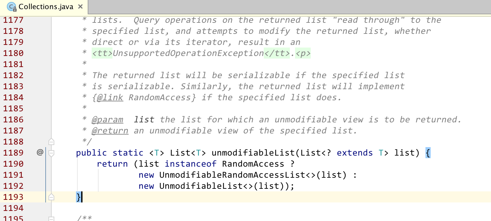
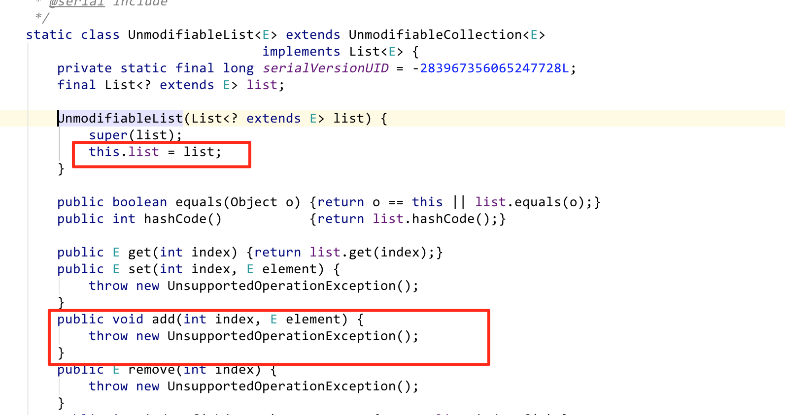

> https://www.cnblogs.com/dolphin0520/p/10693891.html 深入理解Java中的不可变对象


## 一.什么是不可变对象

　　下面是《Effective Java》这本书对于不可变对象的定义：

```
`不可变对象(Immutable Object)：对象一旦被创建后，对象所有的状态及属性在其生命周期内不会发生任何变化。`
```


## 三.如何创建不可变对象

　　通常来说，创建不可变类原则有以下几条：

　　**1）所有成员变量必须是private**

　　**2）最好同时用final修饰(非必须)**

　　3**）不提供能够修改原有对象状态的方法**

- - 最常见的方式是不提供setter方法
  - 如果提供修改方法，需要新创建一个对象，并在新创建的对象上进行修改

　　4**）通过构造器初始化所有成员变量，引用类型的成员变量必须进行深拷贝(deep copy)**

　　5**）getter方法不能对外泄露this引用以及成员变量的引用**

　　**6）最好不允许类被继承(非必须)**

　　JDK中提供了一系列方法方便我们创建不可变集合，如：

```
`Collections.unmodifiableList(List<? ``extends` `T> list)`
```

　　另外，在Google的Guava包中也提供了一系列方法来创建不可变集合，如：

```
`ImmutableList.copyOf(list)`
```

　　这2种方式虽然都能创建不可变list，但是两者是有区别的，JDK自带提供的方式实际上创建出来的不是真正意义上的不可变集合，看unmodifiableList方法的实现就知道了：





　　可以看出，实际上`UnmodifiableList`是将入参list的引用复制了一份，同时将所有的修改方法抛出`UnsupportedOperationException`。因此如果在外部修改了入参list，实际上会影响到`UnmodifiableList`，而Guava包提供的`ImmutableList`是真正意义上的不可变集合，它实际上是对入参list进行了深拷贝。看下面这段测试代码的结果便一目了然：

```java
public class Test {
 
    public static void main(String[] args) {
        List<Integer> list = new ArrayList<Integer>();
        list.add(1);
        System.out.println(list);
 
        List unmodifiableList = Collections.unmodifiableList(list);
        ImmutableList immutableList = ImmutableList.copyOf(list);
 
        list.add(2);
        System.out.println(unmodifiableList);
        System.out.println(immutableList);
 
    }
 
}
```

　输出结果：


## 四.不可变对象真的"完全不可改变"吗？

　　不可变对象虽然具备不可变性，但是不是"完全不可变"的，这里打上引号是因为通过反射的手段是可以改变不可变对象的状态的。

　　大家看到这里可能有疑惑了，为什么既然能改变，为何还叫不可变对象？这里面大家不要误会不可变的本意，从不可变对象的意义分析能看出来对象的不可变性只是用来辅助帮助大家更简单地去编写代码，减少程序编写过程中出错的概率，这是不可变对象的初衷。如果真要靠通过反射来改变一个对象的状态，此时编写代码的人也应该会意识到此类在设计的时候就不希望其状态被更改，从而引起编写代码的人的注意。下面是通过反射方式改变不可变对象的例子：

```java
`public` `class` `Test {``    ``public` `static` `void` `main(String[] args) ``throws` `Exception {``        ``String s = ``"Hello World"``;``        ``System.out.println(``"s = "` `+ s);` `        ``Field valueFieldOfString = String.``class``.getDeclaredField(``"value"``);``        ``valueFieldOfString.setAccessible(``true``);` `        ``char``[] value = (``char``[]) valueFieldOfString.get(s);``        ``value[``5``] = ``'_'``;``        ``System.out.println(``"s = "` `+ s);``    ``}` `}`
```


#### **Guava集合和不可变对应关系**

| **可变集合类型**           | **可变集合源：JDK or Guava?** | **Guava不可变集合**           |
| -------------------------- | ----------------------------- | ----------------------------- |
| `Collection`               | JDK                           | `ImmutableCollection`         |
| `List`                     | JDK                           | `ImmutableList`               |
| `Set`                      | JDK                           | `ImmutableSet`                |
| `SortedSet`/`NavigableSet` | JDK                           | `ImmutableSortedSet`          |
| `Map`                      | JDK                           | `ImmutableMap`                |
| `SortedMap`                | JDK                           | `ImmutableSortedMap`          |
| Multiset                   | Guava                         | `ImmutableMultiset`           |
| `SortedMultiset`           | Guava                         | `ImmutableSortedMultiset`     |
| Multimap                   | Guava                         | `ImmutableMultimap`           |
| `ListMultimap`             | Guava                         | `ImmutableListMultimap`       |
| `SetMultimap`              | Guava                         | `ImmutableSetMultimap`        |
| BiMap                      | Guava                         | `ImmutableBiMap`              |
| ClassToInstanceMap         | Guava                         | `ImmutableClassToInstanceMap` |
| Table                      | Guava                         | `ImmutableTable`              |


## Java 9

Java 8 之前日期库的话 [Joda-Time](http://www.joda.org/joda-time/) 是首要之选，Java 8 集成后应该是鲜有人问津。以往说到集合操作库，有两个选择，其一为 [Apache Commons Collections](https://commons.apache.org/proper/commons-collections/)，二为 Google 的 [Guava](https://github.com/google/guava/wiki)，当然前者与后者竞争中也早已败下阵来，况且前者还受到 Java 8 的夹击。而本文要说的可以说是 Java 9 把 Guava 中创建不可变集合的方式据为已用了，直截了当的说，凡是 Java 9 后有创建不可变集合的需求，只要用三大接口 `List`， `Set`，`Map` 中的 `of(...)` 方法就对了。

```java
Guava 的几个类 ImmutableList, ImmutableSet, 和 ImmutableMap。而它们创建不可变集合的方式就是通过各自的 of(...) 方法，以 ImmutableList 为例(其余两个类也类似)，它有
of(): ImmutableList<E>
of(E element): ImmutableList<E>
of(E e1, E e2): ImmutableList<E>
of(E e1, E e2, E e3): ImmutableList<E>
......
of(E e1, E e2, E e3, E e4, E e5, E e6, E e7, E e8, E e9, E e10, E e11, E e12, E... others): ImmutableList<E>
```

下面快速过一下 Java 9 的 List，Set，Map 的 `of(...)` 静态方法。先说一下那些 `of(...)` 及得到的结果的共同特点

- 每个接口都提供了有限参数和不定参数的 `of(...)` 方法，有限参数的 `of(...)` 方法是为了性能考虑(如避免了参数装箱为数组)
- 不同的 `of(...)` 方法返回的内部实例类型也是不确定的，可以查看每一个 `of(...)` 方法的返回类型
- `of(...)` 返回的实例都是可序列化的，所以只要保证其中的每一个元素(Map 则包括  key 和  value )是可序列化的，那么集体本身就可被序列化
- 所有的 `of(...)` 方法返回的都是真正的不可变集合，尝试对它们的任何修改都会抛出 UnsupportedOperationException 异常
- 元素或元素的组成部分(Map 的 key 和 value) 都不允许 null 值的出现，否则抛出 NullPointerException 异常

### List.of(...) 创建不可变的 List

接口 [List](https://docs.oracle.com/javase/9/docs/api/java/util/List.html) 的静态 of(...) 方法有

- static <E> List<E> of()   创建空列表，返回 ImmutableCollections.List0.instance()
- static <E> List<E> of(E e1)    返回 new ImmutableCollections.List1<>(e1)
- static <E> List<E> of(E e1, E e2) 返回 new ImmutalbeCollection.List2<>(e1, e2)
- ......
- static <E> List<E> of(E e1, E e2, E e3, E e4, E e5, E e6, E e7, E e8, E e9, E 10)
- static <E> List<E> of(E... elements)

 注意：不允许包含 null 元素，否则抛出 NullPointerException 异常

### Set.of(...) 创建不可变的 Set

- static <E> Set<E> of()   创建空 set
- static <E> Set<E> of(E e1) 
- static <E> Set<E> of(E e1, E e2)
- ......
- static <E> Set<E> of(E e1, E e2, E e3, E e4, E e5, E e6, E e7, E e8, E e9, E 10)
- static <E> Set<E> of(E... elements)

注意：不允许包含 null 元素，否则抛出 NullPointerException 异常。并且不能有重复元素(调用方法时保证)，否则抛出 IllegalArgumentException 异常。不像  HashSet 会帮我们去重。

### Map.of(...) 创建不可变的  Map

- static <K, V> Map<K, V> of()  创建空 Map
- static <K, V> Map<K, V> of(K k1, V v1)
- static <K, V> Map<K, V> of(K k1, V v1, K k2, V v2)
- ......
- static <K, V> Map<K, V> of(K k1, V v1, K k2, V v2, K k3, V v3, K k4, V v4, K k5, V v5, K k6, V v6, K k7, V v7, K k8, V v8, K k9, V v9,K k10, V v10)
- static <K, V> Map<K, V> ofEntries(Map.Entry<? extends K, ? extends V>... entries) 

注间：`of(...)` 方法与  Guava 的 ImmutableMap 的用法是一样的，并且也是 key, value 都不允许有 null 值，否则抛出 NullPointerException 异常。`of(...)` 方法的参数对偶出现，key 和 value 交替。对于不定元素个数无法用 `of(...)` 方法是因为 Java 只支持最后一个元素的可变，所以只能把 key/value 封装起来，引入上面的最后一个方法

> static <K, V> Map<K, V> ofEntries(Map.Entry<? extends K, ? extends V>... entries)

再静态引入 `Map.entry` 方法后，我们使用 `ofEntries(...)` 方法的样式就是

```java
import static java.util.Map.entry;
 
Map<Integer, String> numberToWord = Map.ofEntries(
    entry(1, "One"), entry(2, "Two"), entry(3, "Three"));
```

