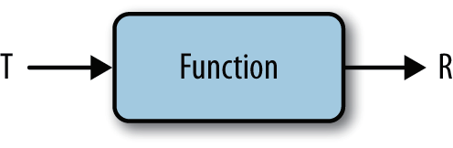

# CP3


### 外部迭代

首先，它很难抽象出本章稍后提及的不同操作；此外，它从本质上来讲是一种串行化操作


### 内部迭代

首先要注意stream() 方法的调用，它和例3中调用iterator() 的作用一样。该方法不是返回一个控制迭代的Iterator 对象，而是返回**内部迭代中的相应接口**：Stream。


由Stream API的函数式编程风格，我们并没有改变集合的内容，而是**描述Stream里的内容**。

但返回Stream对象却不是一个新集合，而是**创建新集合的配方**

- **Stream 是用函数式编程方式在集合类上进行复杂操作的工具。**


### 惰性求值、及早求值

例3-4　只过滤，不计数

```java
allArtists.stream()
.filter(artist -> artist.isFrom("London"));
```

这行代码并未做什么实际性的工作，filter 只刻画出了Stream，但没有产生新的集合。

- 像filter 这样只描述Stream，最终<u>不产生新集合</u>的方法叫作**惰性求值方法**；
- 而像count 这样最终会从Stream 产生值的方法叫作**及早求值方法**。

- 判断一个操作是惰性求值还是及早求值很简单：
  只需看它的返回值。如果返回值是Stream，那么是惰性求值；
  如果返回值是另一个值或为空，那么就是及早求值。

整个过程和**建造者模式**有共通之处。建造者模式使用一系列操作设置属性和配置，最后调用一个build 方法，这时，对象才被真正创建。

### collect(toList())

collect(toList())方法，在Stream里的值生成一个列表，是一个及早求值操作。

Stream的of方法使用一组初始值生成新Stream

```java
List<String> collected = Stream.of("a", "b", "c") 
.collect(Collectors.toList());
```


### map

map操作就可以使用该函数，将一个流中的值转换成一个新的流。


```java
List<String> collected = Stream.of("a", "b", "hello")
.map(string -> string.toUpperCase()) 
.collect(toList());
assertEquals(asList("A", "B", "HELLO"), collected);
```


。参数和返回值不必属于同一种类型，但Lambda表达式必须Function接口的一个实例（如3-4所示），**Function接口**是只包含一个参数的普通函数接口。



### filter
遍历数据并检查其中的元素时，可尝试使用Stream 中提供的新方法filter


```java
List<String> beginningWithNumbers
= Stream.of("a", "1abc", "abc1")
.filter(value -> isDigit(value.charAt(0)))
.collect(toList());

assertEquals(asList("1abc"), beginningWithNumbers);
```

经过过滤，Stream 中符合条件的，即Lambda 表达式值为true 的元素被保留下来。

该Lambda 表达式的函数接口正是前面章节中介绍过的Predicate


### flatMap
flatMap 方法可用Stream 替换值， 然后将多个Stream 连接成一个Stream


```java
List<Integer> together = Stream.of(asList(1, 2), asList(3, 4))
.flatMap(numbers -> numbers.stream())
.collect(toList());
assertEquals(asList(1, 2, 3, 4), together);
```


调用stream 方法， 将每个列表转换成Stream 对象， 其余部分由flatMap 方法处理。
flatMap 方法的相关函数接口和map 方法的一样，<u>都是Function 接口</u>，只是方法的返回值
限定为Stream 类型罢了。

### reduce

reduce操作可以实现从一组值中生成一个值。


```java
例3-15　reduce 模式
	Object accumulator = initialValue;
	for(Object element : collection) {
		accumulator = combine(accumulator, element);
	}
```

首先赋给accumulator 一个初始值：initialValue，然后在循环体中，通过调用combine 函
数，拿accumulator 和集合中的每一个元素做运算，再将运算结果赋给accumulator，最后
accumulator 的值就是想要的结果。


例3-16 中的代码展示了这一过程。<u>Lambda 表达式就是reducer</u>，它执行求和操作，<u>有两个参数：传入Stream 中的当前元素和acc</u>。将两个参数相加，acc 是累加器，保存着当前的累加结果。

```java
例3-16　使用reduce 求和
int count = Stream.of(1, 2, 3)
	.reduce(0, (acc, element) -> acc + element);
assertEquals(6, count);
```

Lambda 表达式的返回值是最新的acc，是上一轮acc 的值和当前元素相加的结果。reducer的类型是第2 章已介绍过的**`BinaryOperator`**。


将reduce 操作展开，得到例3-17 这样形式的代码。

```java
例3-17　展开reduce 操作
BinaryOperator<Integer> accumulator = (acc, element) -> acc + element;
int count = accumulator.apply(
                accumulator.apply(
                    accumulator.apply(0, 1),
                2),
            3);
```


例3-18 是可实现同样功能的命令式Java 代码，从中可清楚看出函数式编程和命令式编程
的区别。

```java
例3-18　使用命令式编程方式求和
int acc = 0;
for (Integer element : asList(1, 2, 3)) {
 	   acc = acc + element;
    }
assertEquals(6, acc);
```

在命令式编程方式下，每一次循环将集合中的元素和累加器相加，用相加后的结果更新累
加器的值。对于集合来说，循环在外部，且需要手动更新变量。

可能一个Stream 工厂才是更好的选择。通过Stream 暴露集合的最大优点在于，它很好地封装了内部实现的数据结构。仅暴露一个Stream 接口，用户在实际操作中无论如何使用，都不会影响内部的List 或Set。


### 整合操作

理想的操作莫过于找到一种方法，将专辑转化成一个曲目的Stream。

众所周知，任何时候想转化或替代代码，都该使用map 操作。这里将使用比map 更复杂的**flatMap** 操作，<u>把多个Stream 合并成一个Stream 并返回</u>。将forEach 方法替换成flatMap 


不同的函数接口有不同的方法。
如果使用Predicate，就应该调用test 方法，
如果使用Function，就应该调用apply 方法。
Supplier 函数接口，它只有一个get 方法。


### 高阶函数

高阶函数是指接受另外一个函
数作为参数，或返回一个函数的函数。


### 正确使用lambda

因为这些概念描述了数据上的操作，**明确了要达成什么转化，而不是说明如何转化。**这种方式写出的代码，潜在的缺陷更少，更直接地表达了程序员的意图。

明确要达成什么转化，而不是说明如何转化的另外一层含义在于写出的函数**没有副作用**。这一点非常重要，这样只通过函数的返回值就能充分理解函数的全部作用。

**没有副作用的函数**不会改变程序或外界的状态。

- 给变量赋值也是一种副作用，而且更难察觉。

```java
ActionEvent localEvent = null;
button.addActionListener(event -> {
localEvent = event;
});
这段代码试图将event 赋给一个局部变量，它无法通过编译，但绝非编写错误。这实际上
是语言的设计者有意为之，用以鼓励用户使用Lambda 表达式获取值而不是变量。获取值
使用户更容易写出没有副作用的代码。
```


- 将Lambda 表达式传给Stream 上的高阶函数，都应该尽量避免副作用。唯一的例外是forEach 方法，它是一个终结方法。

```
ActionEvent localEvent = null;
button.addActionListener(event -> {
localEvent = event;
});
```


这段代码试图将event 赋给一个局部变量，它无法通过编译，但绝非编写错误。这实际上
是语言的设计者有意为之，用以鼓励用户使用Lambda 表达式获取值而不是变量。获取值
使用户更容易写出没有副作用的代码。

无论何时，将Lambda 表达式传给Stream 上的高阶函数，都应该尽量避免副作用。唯一的
例外是forEach 方法，它是一个终结方法。


# CP4


# CP5

### 方法引用

标准语法`Classname::methodName`

- 虽然这是一个方法，但不需要在后面加括号，因为这里并不调用该方法。我们只是提供了和Lambda 表达式等价的一种结构，在需要时才会调用。凡是使用Lambda 表达式的地方，就可以使用方法引用。

- 另一个要注意的地方是方法引用自动支持多个参数，前提是选对了正确的函数接口。

- Lambda表达式让代码像数据一样在对象间传递

构造函数也有同样的缩写形式 `Artist::new`

用这种方式创建数组`String[]::new`

每次写出形如`x -> foo(x)` 的Lambda 表达式时，和直接调用方法foo 是一样的。


？？？使用方法引用，为什么能够识别参数的来源？


1.4

1.9

0.3

0.1

2

5

