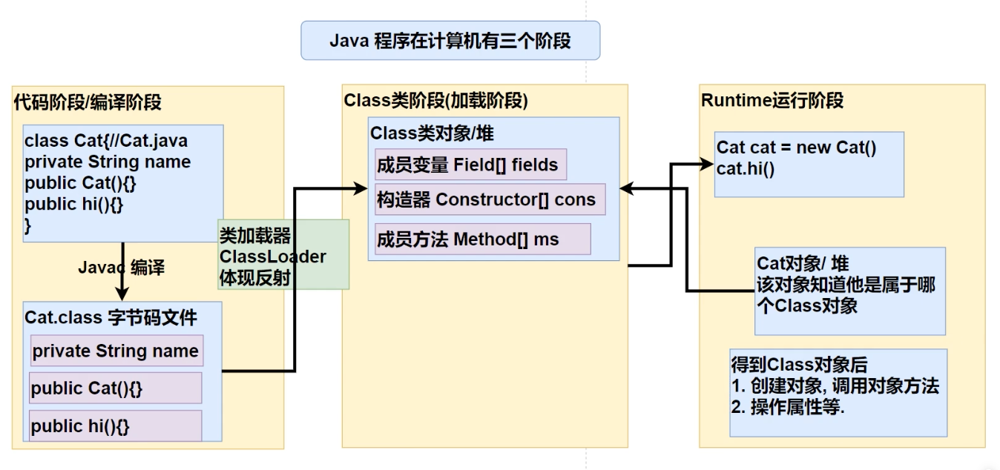
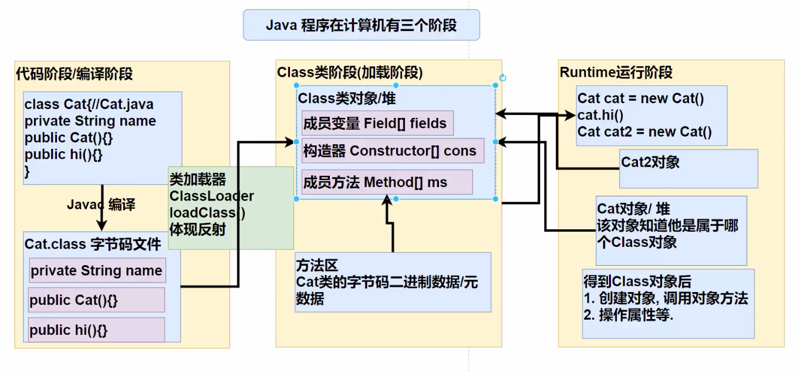
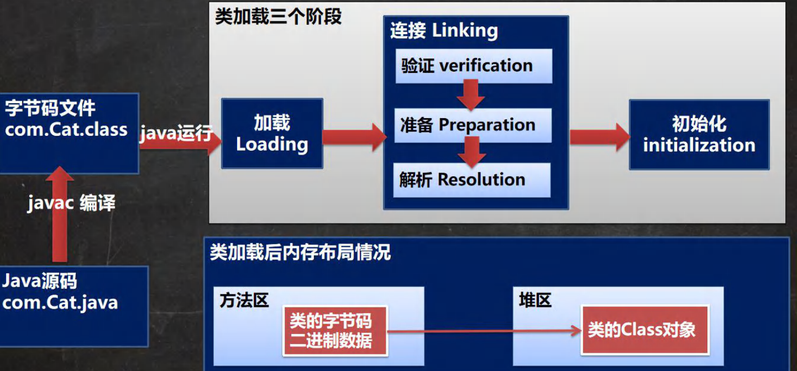
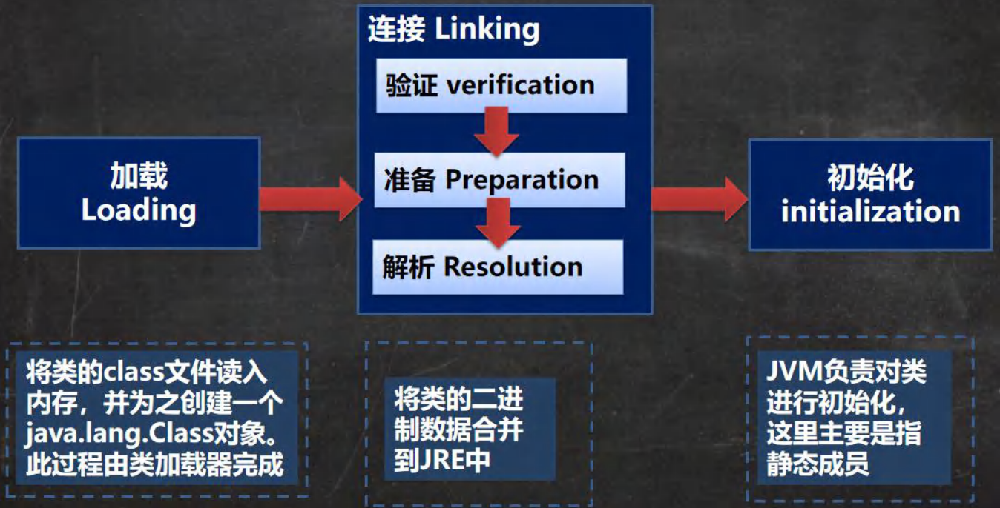
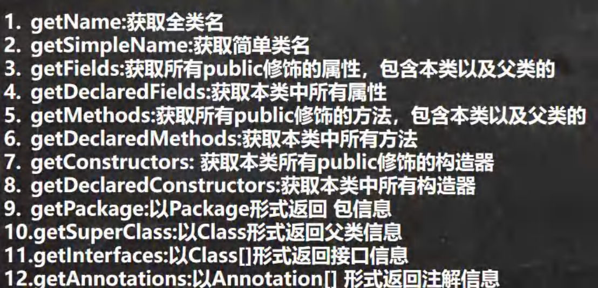

- 通过外部文件配置，在不修改源码的情况下，控制程序，符合ocp原则（开闭原则）


JavaReflection

1、反射允许运行时借助ReflectionApi取得任何类的内部信息，并能操作其属性和方法

2、加载完类之后，堆中就产生一个Class类型的对象，包含了类的完整信息。





### 反射调用的优化

Method、Field、Constructor都有setAccessable()方法，其作用是启用和禁用访问安全检查开关，true表示取消检查，可以提高效率

## Class

- class类对象不是new出来的，是系统创建的
- 对于某个类的Class对象，在内存中只有一份，因为类只被加载一次
- 每个类的实例都会记得自己是由那个Class实例所生成
- 通过Class对象可以完整的的呆一个类的完整结构
- Class对象存放在堆内存
- 类的字节码二进制数据，是放在方法区的，有些地方称之为类的元数据


### 获取Class对象的方法

```java
//1、通过全类名获取类路径下的Class对象
String classFullPath = "com.shred.Cat";
Class<?> cls = Class.forName(classFullPath);
System.out.println(cls);

//2、通过类名.class获取Class对象，性能最好
Class<Cat> catClass = Cat.class;
System.out.println(catClass);

//3、通过实例获取Class对象
Cat cat = new Cat();
Class<? extends Cat> cls3 = cat.getClass();
System.out.println(cls3);

//4、通过ClassLoader获取Class对象
ClassLoader classLoader = cat.getClass().getClassLoader();
Class<?> cls4 = classLoader.loadClass(classFullPath);
System.out.println(cls4);

//5、基本数据类型.class
Class<Integer> integerClass = int.class;
System.out.println(integerClass);

//6、包装类型.TYPE，与5得到的是同一个Class对象
Class<Integer> type = Integer.TYPE;
System.out.println(type);
```


任何类型都有Class对象，包括void

```java
Class<String> stringClass = String.class;

Class<Serializable> serializableClass = Serializable.class;

Class<Integer[]> aClass = Integer[].class;

Class<float[][]> aClass1 = float[][].class;

//注解
Class<Deprecated> deprecatedClass = Deprecated.class;

Class<Thread.State> stateClass = Thread.State.class;

Class<Long> longClass = long.class;

//void
Class<Void> voidClass = void.class;

Class<Class> classClass = Class.class;
```


# 类加载

- 反射机制是java动态语言的关键，通过反射实现类的动态加载

- 静态加载：编译时加载相关类，找不到则报错，依赖性强
- 动态加载：运行时加载类，通过Class.forName或ClassLoader.getClass(x)加载类，降低依赖性

## 类加载阶段



### 类加载各阶段完成的任务




### 1、加载

将字节码从不同的数据源（可能是class文件、jar包、甚至网络—）转为二进制字节流加载到内存中，创建一个Class对象

### 2、连接

#### 2.1、验证

- 确保.class文件的字节流包含的信息符合JVM要求，且不危害jvm运行安全
- 文件格式验证（是否以`ox CAFE BABE` 开头）、元数据验证、字节码验证、符号引用验证
- 可使用`-Xverify:none`关闭大部分验证措施，缩短类加载时间

#### 2.2、准备

- 对静态变量分配内存、并默认初始化（对应数据类型的默认初始值，如0、0L、null等）。这些内存都在方法区中分配。

#### 2.3、解析

- 将常量池等符号引用替换为直接引用 (内存地址)的过程

### 3、Initialization 初始化

- 真正执行java程序代码的阶段，此阶段执行`<clinit>()` 方法
- `<clinit>()` 方法是由编译器按语句在源文件中**出现的顺序**，依次自动搜集类中所有的 **静态变量** 的赋值动作和 **静态代码块** 中的语句，并合并
- jvm 保证了`<clinit>()` 方法 的多线程下同步、加锁，如果多个线程同时初始化一个类，那么只有一个线程执行该类的`<clinit>()`，其他线程会被阻塞等待。

```java
public class ClassB {
    public static void main(String[] args) {
        System.out.println(ClassB.num);
    }

    //对应静态变量num，在类加载的连接准备证阶段，已完成其内存的分配，并进行默认初始化，值为0
    //在类的实例化阶段，
    //按语句在源文件中**出现的顺序**，依次自动搜集类中所有的 **静态变量** 的赋值动作和 **静态代码块** 中的语句，并合并成<clinit>()方法
    //因此，类加载完成后num值为100
    static {
        num = 200;
    }
    static int num = 100;

}
```


## APi



- getDeclaredFields:获取本类中所有属性

- java.lang.reflect.Field#getModifiers 获取修饰符的值
  规定 说明: 默认修饰符 是0 ， public  是1 ，private 是 2 ，protected 是 4 , static 是 8 ，final 是 16，多个修饰符则加起来

### getName

获取全类名

### setAccessable

通过反射获取私有的属性或方法时，若直接赋值或调用，会出现 IllegalAccessException 非法访问异常。
可以使用setAccessable(true)暴力破解。

对于静态变量，可以使用null作为其调用对象，等价于直接调用静态变量

```java
public class ClassB {
    public static void main(String[] args) throws NoSuchFieldException, IllegalAccessException {
        
        Class<ClassB> classBClass = ClassB.class;
        Field num = classBClass.getDeclaredField("num");
      
        num.set(null, 300);
        System.out.println(num.get(null));
      	//equals above
      	ClassB.num =1;
        System.out.println(ClassB.num);
    }

    static int num = 100;

}
```


## Class

### isAssignableFrom

判断是否是同类、父类、或父接口

```java
/**
 * Determines if the class or interface represented by this
 * {@code Class} object is either the same as, or is a superclass or
 * superinterface of, the class or interface represented by the specified
 * {@code Class} parameter. It returns {@code true} if so;
 * otherwise it returns {@code false}. If this {@code Class}
 * object represents a primitive type, this method returns
 * {@code true} if the specified {@code Class} parameter is
 * exactly this {@code Class} object; otherwise it returns
 * {@code false}.
 *
 * <p> Specifically, this method tests whether the type represented by the
 * specified {@code Class} parameter can be converted to the type
 * represented by this {@code Class} object via an identity conversion
 * or via a widening reference conversion. See <em>The Java Language
 * Specification</em>, sections 5.1.1 and 5.1.4 , for details.
 *
 * @param cls the {@code Class} object to be checked
 * @return the {@code boolean} value indicating whether objects of the
 * type {@code cls} can be assigned to objects of this class
 * @exception NullPointerException if the specified Class parameter is
 *            null.
 * @since JDK1.1
 */
public native boolean isAssignableFrom(Class<?> cls);
```

#### .isAssignableFrom()与instanceof

.isAssignableFrom()方法与instanceof关键字的区别总结为以下两个点：

- isAssignableFrom()方法是从类继承的角度去判断，instanceof关键字是从实例继承的角度去判断。
- isAssignableFrom()方法是判断是否为某个类的父类，instanceof关键字是判断是否某个类的子类。

使用方法：

> 父类.class.isAssignableFrom(子类.class)
>
> 子类实例 instanceof 父类类型

### isPrimitive

此方法主要用来判断Class是否为原始类型（boolean、char、byte、short、int、long、float、double）。


### isInstance

  public native boolean isInstance(Object obj);


## Modifier

### java.lang.reflect.Modifier#isPublic

```java

public static final int PUBLIC           = 0x00000001;

/**
 * Return {@code true} if the integer argument includes the
 * {@code public} modifier, {@code false} otherwise.
 *
 * @param   mod a set of modifiers
 * @return {@code true} if {@code mod} includes the
 * {@code public} modifier; {@code false} otherwise.
 */
public static boolean isPublic(int mod) {
    return (mod & PUBLIC) != 0;
}
```


  PropertyDescriptor

java.beans.PropertyDescriptor

```java
Object value = resultSet.getObject(columnName);

//使用反射，根据数据库表和实体的对应关系，封装
PropertyDescriptor propertyDescriptor = new PropertyDescriptor(columnName, resultClass);

Method writeMethod = propertyDescriptor.getWriteMethod();
//直接将值value写入到对象o和 属性columnName中
writeMethod.invoke(o, value);
```


# 小问题


## 判断是否原始类型

```java
//org.apache.dubbo.common.utils.ReflectUtils#isPrimitives
public static boolean isPrimitives(Class<?> cls) {
    if (cls.isArray()) {
        return isPrimitive(cls.getComponentType());
    }
    return isPrimitive(cls);
}

public static boolean isPrimitive(Class<?> cls) {
    return cls.isPrimitive() || cls == String.class || cls == Boolean.class || cls == Character.class || Number.class.isAssignableFrom(cls) || Date.class.isAssignableFrom(cls);
}
```