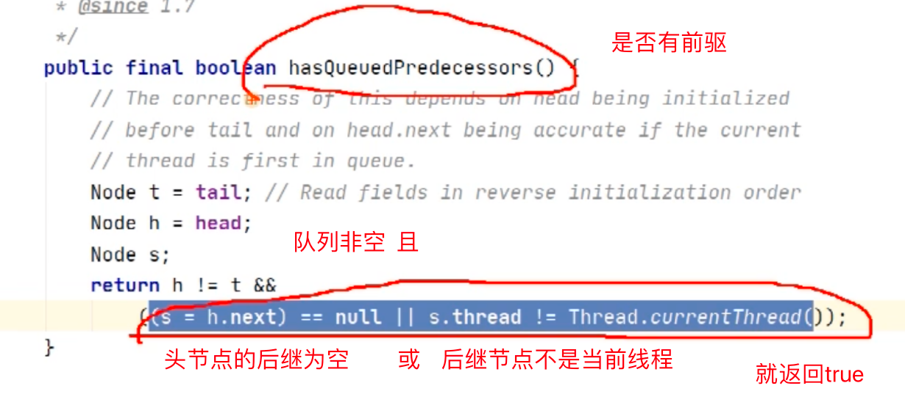

## 队列模型


#### AbstractQueuedSynchronizer#acquire

```java
//java.util.concurrent.locks.AbstractQueuedSynchronizer#acquire
public final void acquire(int arg) {
    if (!tryAcquire(arg) &&
        acquireQueued(addWaiter(Node.EXCLUSIVE), arg))
        selfInterrupt();
}
```

#### ReentrantLock.FairSync#tryAcquire

```java
//java.util.concurrent.locks.ReentrantLock.FairSync
//java.util.concurrent.locks.ReentrantLock.FairSync#tryAcquire
static final class FairSync extends Sync {
    private static final long serialVersionUID = -3000897897090466540L;
    /**
     * Fair version of tryAcquire.  Don't grant access unless
     * recursive call or no waiters or is first.
     */
    @ReservedStackAccess
    protected final boolean tryAcquire(int acquires) {
        final Thread current = Thread.currentThread();
        int c = getState();
        if (c == 0) {
            //判断是否有节点在前面排队
            if (!hasQueuedPredecessors() &&
                compareAndSetState(0, acquires)) {
                setExclusiveOwnerThread(current);
                return true;
            }
        }
        //当前线程 自己 占用了锁
        else if (current == getExclusiveOwnerThread()) {
            int nextc = c + acquires;
            if (nextc < 0)
                throw new Error("Maximum lock count exceeded");
            setState(nextc);
            return true;
        }
        return false;
    }
}
```


#### hasQueuedPredecessors

```java
public final boolean hasQueuedPredecessors() {
    Node h, s;
    if ((h = head) != null) {
        if ((s = h.next) == null || s.waitStatus > 0) {
            s = null; // traverse in case of concurrent cancellation
            for (Node p = tail; p != h && p != null; p = p.prev) {
                if (p.waitStatus <= 0)
                    s = p;
            }
        }
        if (s != null && s.thread != Thread.currentThread())
            return true;
    }
    return false;
}
```



- (s=h.next)==null  发生的场景


#### AbstractQueuedSynchronizer#addWaiter

- 添加Node节点
- 若队列为空，初始化队列
- 循环的CAS当前节点为尾节点，成功才结束循环，返回节点

```java
//java.util.concurrent.locks.AbstractQueuedSynchronizer#addWaiter
private Node addWaiter(Node mode) {
    Node node = new Node(mode);

    for (;;) {
        Node oldTail = tail;
        if (oldTail != null) {
            node.setPrevRelaxed(oldTail);
            if (compareAndSetTail(oldTail, node)) {
                oldTail.next = node;
                return node;
            }
        } else {
            initializeSyncQueue();
        }
    }
}


//initializeSyncQueue
private final void initializeSyncQueue() {
    Node h;
    if (HEAD.compareAndSet(this, null, (h = new Node())))
        tail = h;
}
```

#### 


#### AbstractQueuedSynchronizer#acquireQueued

```java
//java.util.concurrent.locks.AbstractQueuedSynchronizer#acquireQueued
final boolean acquireQueued(final Node node, int arg) {
    boolean interrupted = false;
    try {
        for (;;) {
            final Node p = node.predecessor();
            if (p == head && tryAcquire(arg)) {
                setHead(node);
                p.next = null; // help GC
                return interrupted;
            }
            if (shouldParkAfterFailedAcquire(p, node))
                interrupted |= parkAndCheckInterrupt();
        }
    } catch (Throwable t) {
        cancelAcquire(node);
        if (interrupted)
            selfInterrupt();
        throw t;
    }
}
```


#### selfInterrupt

```
//java.util.concurrent.locks.AbstractQueuedSynchronizer#selfInterrupt
static void selfInterrupt() {
    Thread.currentThread().interrupt();
}
```

