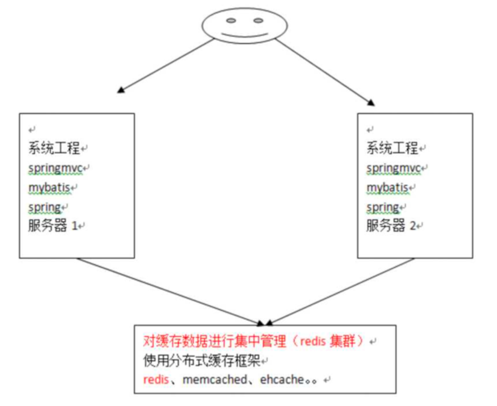

### 	Pom.xml

```xml
   <dependencies>
        
        <dependency>
            <groupId>org.mybatis</groupId>
            <artifactId>mybatis</artifactId>
            <version>3.4.5</version>
        </dependency>

        <dependency>
            <groupId>mysql</groupId>
            <artifactId>mysql-connector-java</artifactId>
            <version>8.0.15</version>
        </dependency>

        <dependency>
            <groupId>junit</groupId>
            <artifactId>junit</artifactId>
            <version>4.10</version>
        </dependency>

     <dependency>
            <groupId>org.projectlombok</groupId>
            <artifactId>lombok</artifactId>
            <version>1.18.20</version>
            <scope>provided</scope>
        </dependency>
    </dependencies>
```


```xml

    <dependencies>

        <dependency>
            <groupId>mysql</groupId>
            <artifactId>mysql-connector-java</artifactId>
            <version>8.0.15</version>
        </dependency>
        <dependency>
            <groupId>c3p0</groupId>
            <artifactId>c3p0</artifactId>
            <version>0.9.1.2</version>
        </dependency>
        <dependency>
            <groupId>log4j</groupId>
            <artifactId>log4j</artifactId>
            <version>1.2.12</version>
        </dependency>
        <dependency>
            <groupId>junit</groupId>
            <artifactId>junit</artifactId>
            <version>4.10</version>
        </dependency>
        <dependency>
            <groupId>dom4j</groupId>
            <artifactId>dom4j</artifactId>
            <version>1.6.1</version>
        </dependency>
        <dependency>
            <groupId>jaxen</groupId>
            <artifactId>jaxen</artifactId>
            <version>1.1.6</version>
        </dependency>
        <dependency>
            <groupId>dom4j</groupId>
            <artifactId>dom4j</artifactId>
            <version>1.1</version>
        </dependency>
        <dependency>
            <groupId>com.mchange</groupId>
            <artifactId>c3p0</artifactId>
            <version>0.9.5-pre10</version>
        </dependency>
    </dependencies>

```


### 配置文件示例

- sqlMapConfig.xml

  ```xml
  <?xml version="1.0" encoding="UTF-8" ?>
  <!DOCTYPE configuration PUBLIC "-//mybatis.org//DTD Config 3.0//EN"
          "http://mybatis.org/dtd/mybatis-3-config.dtd">
  <configuration>
      <environments default="development">
          <environment id="development">
              <!--当前事务有JDBC管理-->
              <transactionManager type="JDBC"/>
              <dataSource type="POOLED">
                  <property name="driverClass" value="com.mysql.cj.jdbc.Driver"/>
                  <property name="jdbcUrl" value="jdbc:mysql:///zdy_mybatis"/>
                  <property name="username" value="root"/>
                  <property name="password" value="root"/>
              </dataSource>
          </environment>
      </environments>
      <mappers>
          <mapper resource="UserMapper.xml"/>
      </mappers>
  </configuration>
  
  ```

- userMapper.xml

  ```xml
  <?xml version="1.0" encoding="UTF-8" ?>
  <!DOCTYPE mapper
      PUBLIC "-//mybatis.org//DTD Mapper 3.0//EN"
      "http://mybatis.org/dtd/mybatis-3-mapper.dtd">
  
  <mapper namespace="user">
      <select id="findAll" resultType="com.shred.pojo.User">
          select * from User
      </select>
  
      <insert id="saveUser" parameterType="com.shred.pojo.User">
          insert into user values (#{id}, #{username})
      </insert>
  
      <update id="update" parameterType="com.shred.pojo.User">
          update user
          set     username = #{username}
          where id=#{id};
      </update>
  
      <delete id="delete" parameterType="java.lang.Integer">
          delete from user where id=#{xxx}
      </delete>
  
  </mapper>
  ```

  

### 映射配置文件 mapper.xml


## 核心配置文件config.xml

### **environments标签**


- 其中，事务管理器(`transactionManager`)类型有两种:
  - **JDBC**:这个配置就是直接使用了JDBC 的提交和回滚设置，它依赖于从数据源得到的连接来管理事务作用域。
  - MANAGED:这个配置几乎没做什么。它从来不提交或回滚一个连接，而是让容器来管理事务的整个生 命周期(比如 JEE 应用服务器的上下文)。 默认情况下它会关闭连接，然而一些容器并不希望这样，因 此需要将 closeConnection 属性设置为 false 来阻止它默认的关闭行为。

- 其中，数据源(`dataSource`)类型有三种:
  - UNPOOLED:这个数据源的实现只是每次被请求时打开和关闭连接。
  - **POOLED**:这种数据源的实现利用“池”的概念将 JDBC 连接对象组织起来。
  - JNDI:这个数据源的实现是为了能在如 EJB 或应用服务器这类容器中使用，容器可以集中或在外部配置 数据源，然后放置一个 JNDI 上下文的引用。


### properties

> 通常希望将数据库的配置信息单独抽取出来，成为一个properties文件，并在xml中使用el表达式动态获取

- properties

```properties
jdbc.driver=com.mysql.cj.jdbc.Driver
jdbc.url=jdbc:mysql:///zdy_mybatis
jdbc.username=root
jdbc.password=root
```

- config.xml调整

```xml

<properties resource="jdbc.properties"/>
...
   <dataSource type="POOLED">
      <property name="driver" value="${jdbc.driver}"/>
     <property name="url" value="${jdbc.url}"/>
     <property name="username" value="${jdbc.username}"/>
     <property name="password" value="${jdbc.password}"/>
   </dataSource>
```


### typeAliases

> xml文件中参数类型和返回值类型，如果都写成别名，臃肿且效率低下

```xml
    <typeAliases>
        <!--批量给包下的类起别名，且不区分大小写-->
        <package name="com.shred.pojo"/>
        <!--单个类起别名-->
<!--        <typeAlias type="com.shred.pojo.User" alias="user"/>-->
    </typeAliases>
```

- 调整mapper.xml

  ```xml
       <update id="update" parameterType="User">
              update user
              set     username = #{username}
              where id=#{id};
          </update>
  
      <!--包装类型预设了别名-->
          <delete id="delete" parameterType="int">
              delete from user where id=#{xxx}
          </delete>
  
  ```

- mybatis预设的别名


### mappers

```xml
<mappers>
    <!--使用package方式，要求mapper.xml所在的文件目录跟Mapper类的目录一样-->
    <package name="com.shred.mapper"/>
   
  	<mapper resource="UserMapper.xml"/>

</mappers>
```


### tips

```java
//默认开启一个事务，但不会自动提交
//在进行cud要手动提交事务
SqlSession sqlSession = sqlSessionFactory.openSession();
....
sqlSession.commit();

//可使用带参数构造器 创建自动提交带session
SqlSession sqlSession = sqlSessionFactory.openSession(true);
```


## Mapper.xml

### if

```xml
<!--多条件组合查询-->
<select id="findByCondition" parameterType="User" resultType="user">
    select * from user where 1=1
    <if test="id != null">
        and id = #{id}
    </if>
    <if test="username!=null">
        and username = ${username}
    </if>
</select>

<!--使用where改进-->
    <select id="findByCondition" parameterType="User" resultType="user">
        select * from user
        <where>
        <if test="id != null">
            and id = #{id}
        </if>
        <if test="username != null">
            and username = ${username}
        </if>
        </where>
    </select>
```


### foreach

- collection:代表要遍历的集合元素，注意编写时不要写#{}
- open:代表语句的开始部分
- close:代表结束部分
- item:代表遍历集合的每个元素，生成的变量名 
- sperator:代表分隔符

```xml
<select id="findByIds" parameterType="list" resultType="user">
    select * from user
    <where>
        <foreach collection="array" open="id in (" close=")" item="id" separator=",">
            #{id}
        </foreach>
    </where>
</select>
```


### sql

> 多个标签中的sql都有重复的片段，可以抽取成公共的

-  通过include标签引入 `<include refid="selectUser"></include>`

```xml
  <!--抽取sql片段-->
    <sql id="selectUser"> select * from User</sql>

...

<select id="findByIds" parameterType="list" resultType="user">
    <!--引入sql片段-->
 	  <include refid="selectUser"></include>
    <where>
        <foreach collection="array" open="id in (" close=")" item="id" separator=",">
            #{id}
        </foreach>
    </where>
</select>
```


# 复杂映射

## 一对一

- 使用resultMap手动配置实体属性与表的关联
  - association标签

```xml
<mapper namespace="com.shred.mapper.IUserMapper">

    <resultMap id="orderMap" type="order">
        <!--column 表字段  property javaBean字段-->
        <result column="id" property="id"/>
        <result column="orderTime" property="orderTime"/>
        <result column="total" property="total"/>

        <!--使用association标签 映射java实体 javaType指定属性的类型-->
        <association property="user" javaType="user">
            <result property="id" column="uid"/>
            <result property="username" column="username"/>
        </association>
    </resultMap>

    <select id="findOrderAndUser" resultMap="orderMap">
        #表名起成order会报错，需要用引号括起来
#         select * from order o,user u where o.uid = u.id
        select * from orders o,user u where o.uid=u.id;
    </select>
</mapper>
```

- 实体类如下

```java
@AllArgsConstructor
@NoArgsConstructor
@Data
public class User {
    private Integer id;
    private String username;

}

@AllArgsConstructor
@NoArgsConstructor
@Data
public class Order {
    private Integer id;
    private String orderTime;
    private Double total;

    private User user;

}

```

图解


## 一对多

> 查询用户的订单信息，一个用户是可能会有多张订单的

### collection

```xml
<mapper namespace="com.shred.mapper.IUserMapper">

    <resultMap id="userMap" type="User">
        <id property="id" column="id"/>
        <result property="username" column="username"/>

        <collection property="orderList" ofType="order">
            <id property="id" column="oid"/>
            <result property="orderTime" column="orderTime"/>
            <result property="total" column="total"/>
        </collection>
    </resultMap>

    <select id="findAll" resultMap="userMap">
        select u.*,o.id oid, o.ordertime, o.total, o.uid from user u left join orders o on u.id=o.uid;
    </select>

</mapper>
```

- 修改user实体

  ```java
  @AllArgsConstructor
  @NoArgsConstructor
  @Data
  public class User {
      private Integer id;
      private String username;
  
      private List<Order> orderList;//+
  }
  ```


## 多对多

多对多其实跟一对多差不多，只是sql要写对

```xml
<resultMap id="userRoleMap" type="User">
    <id property="id" column="user_id"/>
    <result property="username" column="username"/>

    <collection property="roleList" ofType="role">
        <id property="id" column="role_id"/>
        <result property="roleName" column="roleName"/>
    </collection>
</resultMap>

<select id="findAllUserAndRole" resultMap="userRoleMap">
    select * from user u left join user_role ur on u.id=ur.user_id
                                      inner join role r on ur.role_id=r.id;
</select>
```

- 实体类

  ```java
  @Data@NoArgsConstructor@AllArgsConstructor
  public class User {
      private Integer id;
      private String username;
      private String password;
      private Date birthDay;
  
      //权限列表
      private List<Role> roleList;
  
      private List<Order> orderList;
  }
  
  @Data@NoArgsConstructor@AllArgsConstructor
  public class Role {
      private Integer id;
      private String roleName;
      private String roleDesc;
  }
  
  ```


# 注解

@Insert:实现新增
 @Update:实现更新
@Delete:实现删除
 @Select:实现查询
 @Result:实现结果集封装
 @Results:可以与@Result 一起使用，封装多个结果集 
@One:实现一对一结果集封装
@Many:实现一对多结果集封装

### 简单注解

```java
public interface IUserMapper  {

  	@Select("select  * from user where id = #{id}")
    User findOne(Integer id);

    @Insert("insert into user values(#{id}, #{username})")
    void add(User user);

    @Update("update user set username = #{username} where id = #{id}")
    void update(User user);

    @Delete("delete from user where id=#{id}")
    void deleteUser(Integer id);

}
```

xml的引入方式

```xml
<mappers>
        <!--引入注解类-->
<!--        <mapper class="com.shred.mapper.IUserMapper"/>-->
        <!--使用package方式，要求mapper.xml所在的文件目录跟Mapper类的目录一样-->
        <package name="com.shred.mapper"/>
    </mappers>
```


## 复杂映射

@Results注解，@Result注解，@One注解，@Many注解组合完成复杂关系的配置


#### 一对一

```java
public interface IOrderMapper {

    @Results(value = {
            @Result(property = "id", column = "id"),
            @Result(property = "orderTime", column = "orderTime"),
            @Result(property = "total", column = "total"),
            @Result(property = "user", column = "uid", javaType = User.class,
                //one中select的参数由column列指定
                one = @One(select = "com.shred.mapper.IUserMapper.findOne")
            )
    })
    @Select("select * from orders")
    List<Order> findOrderAndUser();

}
```


### 一对多

```java
public interface IUserMapper  {

    @Select("select * from user")
    @Results({
            @Result(property = "id", column = "id"),
            @Result(property = "username", column = "username"),
            @Result(property = "orderList", column = "id",
                    //javaType 为list
                    javaType = List.class,
                    //many 中的selectMapper的参数由column指定，也就是取id那一列的值作为其参数
                    many = @Many(select = "com.shred.mapper.IOrderMapper.findOrderByUid")
            ),
    })
    List<User> findAll();
 .... 
}

public interface IOrderMapper {

    @Select("select * from orders where uid=#{uid}")
    List<Order> findOrderByUid(Integer uid);
}
```


### 多对多

将一条sql分解成两条，一条查用户，拿到id， 根据id去查role和user_role关联，获取role

```java
public interface IUserMapper {

    @Select("select * from user")
    @Results({
            @Result(property = "id", column = "id"),
            @Result(property = "username", column = "username"),
            @Result(property = "roleList", column = "id",
                    javaType = List.class,
                    many = @Many(select = "com.shred.mapper.IRoleMapper.findRoleByUid")
            ),
    })
    List<User> findAllUserAndRole();
}

public interface IRoleMapper {

    @Select("select * from role r,user_role ur where r.id=ur.role_id and ur.user_id = #{uid}")
    List<Role> findRoleByUid(Integer uid);
}


```


# 缓存

缓存就是内存中的数据，常常来自对数据库查询结果的保存，使用缓存，我们可以避免频繁的与数据库

进行交互，进而提高响应速度 Mybatis也提供了对缓存的支持，分为一级缓存和二级缓存，可以通过下图来理解:


- 1、一级缓存是SqlSession级别的缓存。在操作数据库时需要构造sqlSession对象，在对象中有一个数 据结构(HashMap)用于存储缓存数据。不同的sqlSession之间的缓存数据区域(HashMap)是互相不影响的 

- 2、二级缓存是mapper级别的缓存，多个SqlSession去操作同一个Mapper的sql语句，多个SqlSession可以共用二级缓存，二级缓存是跨SqlSession的


## 一级缓存

如果中间sqlSession去执行commit操作(执行插入、更新、删除)，则会清空SqlSession中的 一级 缓存，这样做的目的为了让缓存中存储的是最新的信息，避免脏读。

cacheKey: statementId+ params+boundSql + rowBounds


到一级缓存就绕不开SqlSession,所以索性我们 就 直接从SqlSession，看看有没有创建缓存或者与缓存有关的属性或者方法

好像只有clearCache()和缓存沾点关系，那么就直接从这个方 法入 手吧，分析源码时，我们要看它是谁，它的父类和子类分别又是谁，对如上关系了解了，你才 会 对这个类有更深的认识，分析了一圈，你可能会得到如下这个流程图


再深入分析，流程走到**Perpetualcache**中的clear()方法之后，会调用其**cache.clear()**方法，那 么这个 cache是什么东西呢?点进去发现，cache其实就是private Map cache = new

HashMap();也就是一个Map，所以说cache.clear()其实就是map.clear()，也就是说，缓存其实就是 本 地存放的一个map对象，每一个SqISession都会存放一个map对象的引用，那么这个cache是何 时创建 的呢?

你觉得最有可能创建缓存的地方是哪里呢?我觉得是**Executor**，为什么这么认为?因为Executor是 执 行器，用来执行SQL请求，而且清除缓存的方法也在Executor中执行，所以很可能缓存的创建也很 有可 能在Executor中，看了一圈发现Executor中有一个createCacheKey方法，这个方法很像是创 建缓存的 方法啊，跟进去看看，你发现createCacheKey方法是由BaseExecutor执行的，代码如下

```java
CacheKey cacheKey = new CacheKey();
//MappedStatement 的 id
// id就是Sql语句的所在位置包名+类名+ SQL名称 cacheKey.update(ms.getId());
// offset 就是 0
cacheKey.update(rowBounds.getOffset());
// limit 就是 Integer.MAXVALUE cacheKey.update(rowBounds.getLimit());
//具体的SQL语句
cacheKey.update(boundSql.getSql());
//后面是update 了 sql中带的参数
cacheKey.update(value);
...
if (configuration.getEnvironment() != null) {
// issue #176 
  cacheKey.update(configuration.getEnvironment().getId()); 
}
```

创建缓存key会经过一系列的update方法，udate方法由一个CacheKey这个对象来执行的，这个 update方法最终由updateList的list来把五个值存进去，调试代码如下


- 一级缓存的创建

```java
//org.apache.ibatis.executor.BaseExecutor#query(org.apache.ibatis.mapping.MappedStatement, java.lang.Object, org.apache.ibatis.session.RowBounds, org.apache.ibatis.session.ResultHandler)

public <E> List<E> query(MappedStatement ms, Object parameter, RowBounds rowBounds, ResultHandler resultHandler) throws SQLException {
    BoundSql boundSql = ms.getBoundSql(parameter);
  //创建key
    CacheKey key = createCacheKey(ms, parameter, rowBounds, boundSql);
    return query(ms, parameter, rowBounds, resultHandler, key, boundSql);
 }

public <E> List<E> query(MappedStatement ms, Object parameter, RowBounds rowBounds, ResultHandler resultHandler, CacheKey key, BoundSql boundSql) throws SQLException {
    .......
      list = resultHandler == null ? (List<E>) localCache.getObject(key) : null;
      if (list != null) {
        handleLocallyCachedOutputParameters(ms, key, parameter, boundSql);
      } else {
        list = queryFromDatabase(ms, parameter, rowBounds, resultHandler, key, boundSql);
      }
    }
  
  
//如果查不到的话，就从数据库查，在queryFromDatabase中，会对localcache进行写入。 localcache对 象的put方法最终交给Map进行存放  
    private <E> List<E> queryFromDatabase(MappedStatement ms, Object parameter, RowBounds rowBounds, ResultHandler resultHandler, CacheKey key, BoundSql boundSql) throws SQLException {
    List<E> list;
    localCache.putObject(key, EXECUTION_PLACEHOLDER);
    try {
      list = doQuery(ms, parameter, rowBounds, resultHandler, boundSql);
    } finally {
      localCache.removeObject(key);
    }
    localCache.putObject(key, list);
    if (ms.getStatementType() == StatementType.CALLABLE) {
      localOutputParameterCache.putObject(key, parameter);
    }
    return list;
  }

```


## 二级缓存

二级缓存的原理同一级缓存。差别在于：一级缓存是基于sqlSession的，而二级缓存是基于mapper文件的namespace的。多个sqlSession共享同一个mappser的二级缓存。

- 默认不开启二级缓存，需要配置
- 开启了二级缓存，Po类需要实现Serializable接口，因为二级缓存的存储介质多样，可能是内存或硬盘，可能需要反序列化。
- 与一级缓存不同，二级缓存并不直接缓存对象，而是缓存对象的数据，第二次读取时创建一个新的对象

**1** 、**开启二级缓存** 和一级缓存默认开启不一样，二级缓存需要我们手动开启 首先在全局配置文件sqlMapConfig.xml文件中加入如下代码:

- 表示启用mapper中配置的二级缓存

```xml
<!--开启二级缓存-->
<settings>
  <setting name="cacheEnabled" value="true"/>
</settings>
```

其次在UserMapper.xml文件中开启缓存

```xml
<!--开启二级缓存--> 
<cache></cache>
```

- 或者使用注解开启缓存

```java
@CacheNamespace(implementation = PerpetualCache.class)
```

我们可以看到mapper.xml文件中就这么一个空标签，其实这里可以配置,PerpetualCache这个类是 mybatis默认实现缓存功能的类。我们不写type就使用mybatis默认的缓存，也可以去实现Cache接口 来 自定义缓存。

测试

```java
@Test
public void SecondeLevelCache(){
    SqlSession sqlSession1 = sessionFactory.openSession();
    SqlSession sqlSession2= sessionFactory.openSession();
    SqlSession sqlSession3 = sessionFactory.openSession();

    IUserMapper userMapper1 = sqlSession1.getMapper(IUserMapper.class);
    IUserMapper userMapper2= sqlSession2.getMapper(IUserMapper.class);
    IUserMapper userMapper3 = sqlSession3.getMapper(IUserMapper.class);

    User user1 = userMapper1.findOne(1);
    //清空session1的缓存
    sqlSession1.clearCache();

    User user2 = userMapper2.findOne(1);

    System.out.println(user1 == user2 );//false 二级缓存并不直接缓存对象，而是缓存对象的数据，第二次读取时创建一个新的对象

}
```


## @Options

### useCache和flushCache

- 作用于sql

- useCache默认为true，表示sql使用二级缓存。false则不使用

- flushCache默认为true，表示有事务提交操作时，刷新二级缓存。false时会出现脏读。

- 注解方式：

  ```java
    @Options(useCache = true)
    @Select("select  * from user where id = #{id}")
    User findOne(Integer id);
  ```

  

## 二级缓存整合redis

上面我们介绍了 mybatis自带的二级缓存，但是这个缓存是单服务器工作，无法实现分布式缓存。 那么 什么是分布式缓存呢?假设现在有两个服务器1和2,用户访问的时候访问了 1服务器，查询后的缓 存就会 放在1服务器上，假设现在有个用户访问的是2服务器，那么他在2服务器上就无法获取刚刚那个 缓存， 如下图所示:


为了解决这个问题，就得找一个分布式的缓存，专门用来存储缓存数据的，这样不同的服务器要缓存数
据都往它那里存，取缓存数据也从它那里取，如下图所示:



- mybatis提供了一个eache接口，如果要实现自己的缓存逻辑，实现cache接口开发即可。

- mybatis提供了一个针对cache接口的redis实现类，该类存在`mybatis-redis`包 中


```java
//org.mybatis.caches.redis.RedisCache
//实现了mybatis的 org.apache.ibatis.cache.Cache
public final class RedisCache implements Cache {
    public RedisCache(String id) {
        if (id == null) {
            throw new IllegalArgumentException("Cache instances require an ID");
        } else {
            this.id = id;
            RedisConfig redisConfig = RedisConfigurationBuilder.getInstance().parseConfiguration();
            pool = new JedisPool(redisConfig, redisConfig.getHost(), redisConfig.getPort(), redisConfig.getConnectionTimeout(), redisConfig.getSoTimeout(), redisConfig.getPassword(), redisConfig.getDatabase(), redisConfig.getClientName());
        }
    }

  //缓存
    public void putObject(final Object key, final Object value) {
        this.execute(new RedisCallback() {
            public Object doWithRedis(Jedis jedis) {
              //使用了redis的hset
                jedis.hset(RedisCache.this.id.toString().getBytes(), key.toString().getBytes(), SerializeUtil.serialize(value));
                return null;
            }
        });
    }
  //取值
    public Object getObject(final Object key) {
        return this.execute(new RedisCallback() {
            public Object doWithRedis(Jedis jedis) {
                return SerializeUtil.unserialize(jedis.hget(RedisCache.this.id.toString().getBytes(), key.toString().getBytes()));
            }
        });
    }
  
  //执行方法，是一个模板函数
  private Object execute(RedisCallback callback) {
        Jedis jedis = pool.getResource();

        Object var3;
        try {
            var3 = callback.doWithRedis(jedis);
        } finally {
            jedis.close();
        }

        return var3;
    }
}


//函数式接口
public interface RedisCallback {
    Object doWithRedis(Jedis var1);
}
```


# 插件


- mybatis四大组件(**Executor、StatementHandler、ParameterHandler、ResultSetHandler**)处提供了简单易用的插 件扩 展机制。

- MyBatis支持用插件对四大核心对象进 行拦 截，对mybatis来说插件就是拦截器，用来增强核心对象的功能。

- 质上是借助于底层的**动态代理**实现的，换句话说，MyBatis中的四大对象都是**代理对象**


## MyBatis所允许拦截的方法如下:

执行器Executor (update、query、commit、rollback等方法); 

SQL语法构建器StatementHandler (prepare、parameterize、batch、updates query等方 法); 

参数处理器ParameterHandler (getParameterObject、setParameters方法); 

结果集处理器ResultSetHandler (handleResultSets、handleOutputParameters等方法);

## 自定义插件

- 1、编码

```java
@Intercepts({
        @Signature(type = StatementHandler.class,
            method = "prepare",
                args = {Connection.class, Integer.class}
        )
})
public class MyPlugin implements Interceptor {
    /**
     * 拦截方法：只有被拦截的目标对象目标方法被调用时，每次都会执行
     * @param invocation
     * @return
     * @throws Throwable
     */
    @Override
    public Object intercept(Invocation invocation) throws Throwable {
        System.out.println("对方法进行增强。。。");
        //愿方法执行
        return invocation.proceed();
    }

    /**
     * 主要为了吧当前连接器生成的代理存到拦截器链中国
     * @param target
     * @return
     */
    @Override
    public Object plugin(Object target) {
        Object wrap = Plugin.wrap(target, this);
        return wrap;
    }

    /**
     *
     * @param properties
     */
    @Override
    public void setProperties(Properties properties) {
        System.out.println("获取到的配置文件参数："+ properties);

    }
}
```

- 2、配置到sqlConfig

```xml
<plugins>
    <plugin interceptor="com.lagou.plugin.ExamplePlugin">
    </plugin>
</plugins>
```

### 原理

MyBatis在启动时加载插件，并保存插件实例到相关对象(InterceptorChain，拦截器链) 中。待 准备工作做完后，MyBatis处于就绪状态。我们在执行SQL时，需要先通过DefaultSqlSessionFactory 创 建 SqlSession。StatementHandler 实例会在创建 SqlSession 的过程中被创建， StatementHandler实例创建完毕后， MyBatis会通过JDK动态代理为实例生成代理类。这样，插件逻辑即可在 StatementHandler相关方法被调用前执 行。

### 执行插件逻辑

Plugin实现了 InvocationHandler接口，因此它的invoke方法会拦截所有的方法调用。invoke方法会 对 所拦截的方法进行检测，以决定是否执行插件逻辑。该方法的逻辑如下:

```java
// -Plugin
//实现了InvocationHandler
public class Plugin implements InvocationHandler {

    public Object invoke(Object proxy, Method method, Object[] args) throws
Throwable {
  try { 
    /*
    *获取被拦截方法列表，比如:
    * signatureMap.get(Executor.class), 可能返回 [query, update, commit] */
    Set<Method> methods = signatureMap.get(method.getDeclaringClass()); //检测方法列表是否包含被拦截的方法
     if (methods != null && methods.contains(method)) {
        return interceptor.intercept(new Invocation(target, method, args));
      }
      return method.invoke(target, args);
    } catch (Exception e) {
      throw ExceptionUtil.unwrapThrowable(e);
    }
  }
}
```

invoke方法的代码比较少，逻辑不难理解。首先,invoke方法会检测被拦截方法是否配置在插件的 `@Signature`注解中，若是，则执行插件逻辑，否则执行被拦截方法。插件逻辑封装在intercept中，该 方法的参数类型为Invocationo Invocation主要用于存储目标类，方法以及方法参数列表。下面简单看 一下该类的定义

```java
public class Invocation {
  private final Object target;
  private final Method method;
  private final Object[] args;
  public Invocation(Object targetf Method method, Object[] args) {
  this.target = target;
  this.method = method;
  //省略部分代码
  public Object proceed() throws InvocationTargetException, IllegalAccessException { //调用被拦截的方法
  >> —
```


## 分页插件

- 依赖

```xml
<dependency>
    <groupId>com.github.pagehelper</groupId>
    <artifactId>pagehelper</artifactId>
    <version>3.7.5</version>
</dependency>
<dependency>
    <groupId>com.github.jsqlparser</groupId>
    <artifactId>jsqlparser</artifactId>
    <version>0.9.1</version>
 </dependency>
```

- config

```xml
<!--注意:分页助手的插件 配置在通用馆mapper之前-->
<plugin interceptor="com.github.pagehelper.PageHelper">
<!—- 指定方言 —->
    <property name="dialect" value="mysql"/>
</plugin>
```

- use

```java
 		@Test
    public void testPluginPageHelper() {
        PageHelper.startPage(1, 1);
        List<Order> orderAndUser = orderMapper.findOrderAndUser();
        orderAndUser.forEach(System.out::println);
        PageInfo<Order> userPageInfo = new PageInfo<>(orderAndUser);
        System.out.println(userPageInfo);

    }
```


## 通用Mapper

- 依赖

  ```xml
  <dependency>
    <groupId>tk.mybatis</groupId>
    <artifactId>mapper</artifactId>
    <version>3.1.2</version>
  </dependency>
  ```

- 配置

  ```xml
  <plugin interceptor="tk.mybatis.mapper.mapperhelper.MapperInterceptor">
    <!-- 通用Mapper接口，多个通用接口用逗号隔开 -->
    <property name="mappers" value="tk.mybatis.mapper.common.Mapper"/>
  </plugin>
  ```

  

- mapper及实体类

- 需要搭配注解使用

```java
public interface UserMapper extends Mapper<User> {
}

@AllArgsConstructor @NoArgsConstructor @Data
@Table//表
public class User implements Serializable {
    @Id//？
    @GeneratedValue(strategy = GenerationType.IDENTITY)//主键生成策略：自增
    private Integer id;

    private String username;
   /* private String password;
    private Date birthDay;

    //权限列表
    private List<Role> roleList;

    private List<Order> orderList;*/
}
```

- 测试

```java
@Test
public void testGenMapper() throws IOException {
  InputStream resourceAsStream = Resources.getResourceAsStream("sqlMapConfig.xml");
  SqlSession sqlSession = new SqlSessionFactoryBuilder().build(resourceAsStream).openSession();
  UserMapper mapper = sqlSession.getMapper(UserMapper.class);
  User user = new User();
  user.setId(1);
  User user1 = mapper.selectOne(user);
  System.out.println(user1);

  //使用example查询
  Example example = new Example(User.class);
  example.createCriteria().andEqualTo("id", 1);
  List<User> users = mapper.selectByExample(example);
  users.forEach(System.out::println);

}
```


# 延迟加载

**什么是延迟加载?**

**问题**

```
 在开发过程中很多时候我们并不需要总是在加载用户信息时就一定要加载他的订单信息。此时就是我
们所说的延迟加载。
```

\* 在一对多中，当我们有一个用户，它有个100个订单 在查询用户的时候，要不要把关联的订单查出来? 在查询订单的时候，要不要把关联的用户查出来?

\* 回答 在查询用户时，用户下的订单应该是，什么时候用，什么时候查询。 在查询订单时，订单所属的用户信息应该是随着订单一起查询出来。

**延迟加载**

就是在需要用到数据时才进行加载，不需要用到数据时就不加载数据。延迟加载也称懒加载。

- 优点: 先从单表查询，需要时再从关联表去关联查询，大大提高数据库性能，因为查询单表要比关联查询多张表

速度要快。

- 缺点: 因为只有当需要用到数据时，才会进行数据库查询，这样在大批量数据查询时，因为查询工作也要消耗时间，所以可能造成用户等待时间变长，造成用户体验下降。

- 在多表中: 一对多，多对多:通常情况下采用延迟加载 
- 一对一(多对一):通常情况下采用立即加载

- 注意: **延迟加载是基于嵌套查询来实现的**

## 配置

### 局部延迟加载

注解方式

fetchType：两种类型：FetchType.LAZY、FetchType.EAGER

延迟加载是基于嵌套查询来实现的，所以many中使用select来指定嵌套查询用的mapperStatement

```java
public interface IUserMapper {

    @Select("select * from user")
    //给@Results加上id，实现复用，复用时使用@ResultMap(value={"id"})
    @Results(id = "userOrderMap", value = {
            @Result(property = "id", column = "id"),
            @Result(property = "username", column = "username"),
            @Result(property = "orderList", column = "id",
                    //javaType 为list
                    javaType = List.class,
                    //many 中的selectMapper的参数由column指定，也就是取id那一列的值作为其参数
                    many = @Many(fetchType = FetchType.LAZY, select = "com.shred.mapper.IOrderMapper.findOrderByUid")
            ),
    })
    List<User> findAll();
  
    @Options(useCache = true)
    @Select("select  * from user where id = #{id}")
    @ResultMap(value = {"userOrderMap"})
    User findOne(Integer id);
}


```

- 配置文件方式

```xml
<!-- 开启一对多 延迟加载 -->
<resultMap id="userMap" type="user">
    <id column="id" property="id"></id>
    <result column="username" property="username"></result>
    <result column="password" property="password"></result>
    <result column="birthday" property="birthday"></result>
    <!--
fetchType="lazy" 懒加载策略
fetchType="eager" 立即加载策略 -->
       <collection property="orderList" ofType="order" column="id"
                select="com.lagou.dao.OrderMapper.findByUid" fetchType="lazy">
    </collection>
</resultMap>
<select id="findAll" resultMap="userMap">
    SELECT * FROM `user`
</select>


```


### 全部延迟加载

在Mybatis的核心配置文件中可以使用setting标签修改全局的加载策略。

```xml
<settings>
<!--开启全局延迟加载功能-->
    <setting name="lazyLoadingEnabled" value="true"/>
</settings>
```

