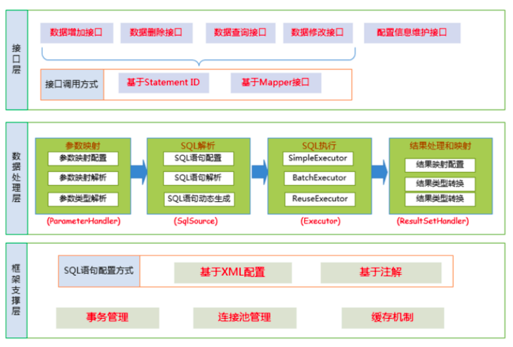

MyBatis架构设计图




Mybatis层次结构


## 源码剖析-执行sql的过程

- SqlSession是一个接口，它有两个实现类:DefaultSqlSession (默认)和SqlSessionManager (弃用，不做介绍)

- SqlSession是MyBatis中用于和数据库交互的顶层类，通常将它与ThreadLocal绑定，一个会话使用一个SqlSession,并且在使用完毕后需要close

```java
public class DefaultSqlSession implements SqlSession {
  private final Configuration configuration;
  private final Executor executor;
j
```

SqlSession中的两个最重要的参数，configuration与初始化时的相同，Executor为执行器

### Executor

Executor也是一个接口，他有三个常用的实现类:

- BatchExecutor (重用语句并执行批量更新)
- ReuseExecutor (重用预处理语句 prepared statements) 
- SimpleExecutor (普通的执行器，默认)


### openSession

- openSession过程中创建了executor对象

```java
public class DefaultSqlSessionFactory implements SqlSessionFactory {

	public SqlSession openSession() {
        //getDefaultExecutorType()传递的是SimpleExecutor
        return openSessionFromDataSource(configuration.getDefaultExecutorType(), null, false);
    }

  //ExecutorType 为Executor的类型，TransactionIsolationLevel为事务隔离级别，autoCommit是否开启事务
    //openSession的多个重载方法可以指定获得的SeqSession的Executor类型和事务的处理
    private SqlSession openSessionFromDataSource(ExecutorType execType, TransactionIsolationLevel level, boolean autoCommit) {
        Transaction tx = null;
        try {
            // 获得 Environment 对象
            final Environment environment = configuration.getEnvironment();
            // 创建 Transaction 对象
            final TransactionFactory transactionFactory = getTransactionFactoryFromEnvironment(environment);
            tx = transactionFactory.newTransaction(environment.getDataSource(), level, autoCommit);
            // 创建 Executor 对象
            final Executor executor = configuration.newExecutor(tx, execType);
            // 创建 DefaultSqlSession 对象
            return new DefaultSqlSession(configuration, executor, autoCommit);
        } catch (Exception e) {
            // 如果发生异常，则关闭 Transaction 对象
            closeTransaction(tx); // may have fetched a connection so lets call close()
            throw ExceptionFactory.wrapException("Error opening session.  Cause: " + e, e);
        } finally {
            ErrorContext.instance().reset();
        }
    }
  
}	
```

使用

```java
SqlSession sqlSession = factory.openSession();
List<User> list =
sqlSession.selectList("com.lagou.mapper.UserMapper.getUserByName");
```

调用了DefaultSqlSession#selectList(java.lang.String),

可以看到是从configutation中获取了mappedStatment，并委托executor执行

```java
 @Override
    public <E> List<E> selectList(String statement) {
        return this.selectList(statement, null);
    }

    @Override
    public <E> List<E> selectList(String statement, Object parameter) {
        return this.selectList(statement, parameter, RowBounds.DEFAULT);
    }

    @Override
    public <E> List<E> selectList(String statement, Object parameter, RowBounds rowBounds) {
        try {
            // 获得 MappedStatement 对象
            MappedStatement ms = configuration.getMappedStatement(statement);
            // 执行查询
            return executor.query(ms, wrapCollection(parameter), rowBounds, Executor.NO_RESULT_HANDLER);
        } catch (Exception e) {
            throw ExceptionFactory.wrapException("Error querying database.  Cause: " + e, e);
        } finally {
            ErrorContext.instance().reset();
        }
    }
```


### 源码剖析-executor

默认使用SimpleExecutor，它继承了BaseExecutor，query方法也是在BaseExecutor中实现的

进入executor.query()

```java
 //此方法在SimpleExecutor的父类BaseExecutor中实现
    @Override
    public <E> List<E> query(MappedStatement ms, Object parameter, RowBounds rowBounds, ResultHandler resultHandler) throws SQLException {
        //根据传入的参数动态获得SQL语句，最后返回用BoundSql对象表示
        BoundSql boundSql = ms.getBoundSql(parameter);
        //为本次查询创建缓存的Key
        CacheKey key = createCacheKey(ms, parameter, rowBounds, boundSql);
        // 查询
        return query(ms, parameter, rowBounds, resultHandler, key, boundSql);
    }


 public <E> List<E> query(MappedStatement ms, Object parameter, RowBounds rowBounds, ResultHandler resultHandler, CacheKey key, BoundSql boundSql) throws SQLException {
        ErrorContext.instance().resource(ms.getResource()).activity("executing a query").object(ms.getId());
        // 已经关闭，则抛出 ExecutorException 异常
        if (closed) {
            throw new ExecutorException("Executor was closed.");
        }
        // 清空本地缓存，如果 queryStack 为零，并且要求清空本地缓存。
        if (queryStack == 0 && ms.isFlushCacheRequired()) {
            clearLocalCache();
        }
        List<E> list;
        try {
            // queryStack + 1
            queryStack++;
            // 从一级缓存中，获取查询结果
            list = resultHandler == null ? (List<E>) localCache.getObject(key) : null;
            // 获取到，则进行处理
            if (list != null) {
                handleLocallyCachedOutputParameters(ms, key, parameter, boundSql);
            // 获得不到，则从数据库中查询
            } else {
                list = queryFromDatabase(ms, parameter, rowBounds, resultHandler, key, boundSql);
            }
        } finally {
            // queryStack - 1
            queryStack--;
        }
        if (queryStack == 0) {
            // 执行延迟加载
            for (DeferredLoad deferredLoad : deferredLoads) {
                deferredLoad.load();
            }
            // issue #601
            // 清空 deferredLoads
            deferredLoads.clear();
            // 如果缓存级别是 LocalCacheScope.STATEMENT ，则进行清理
            if (configuration.getLocalCacheScope() == LocalCacheScope.STATEMENT) {
                // issue #482
                clearLocalCache();
            }
        }
        return list;
    }
```


调用了queryFromDatabase

@??占位对象是干嘛的

```java
// 从数据库中读取操作
private <E> List<E> queryFromDatabase(MappedStatement ms, Object parameter, RowBounds rowBounds, ResultHandler resultHandler, CacheKey key, BoundSql boundSql) throws SQLException {
    List<E> list;
    // 在缓存中，添加占位对象。此处的占位符，和延迟加载有关，可见 `DeferredLoad#canLoad()` 方法
    localCache.putObject(key, EXECUTION_PLACEHOLDER);
    try {
        // 执行读操作
        list = doQuery(ms, parameter, rowBounds, resultHandler, boundSql);
    } finally {
        // 从缓存中，移除占位对象
        localCache.removeObject(key);
    }
    // 添加到缓存中
    localCache.putObject(key, list);
    // 暂时忽略，存储过程相关
    if (ms.getStatementType() == StatementType.CALLABLE) {
        localOutputParameterCache.putObject(key, parameter);
    }
    return list;
}
```


doQuery

- 创建一个StatementHandler对象
- 创建jdbc的statement对象
- 至此，executor做的事情完成了，到了StatementHandler工作了

```java
public <E> List<E> doQuery(MappedStatement ms, Object parameter, RowBounds rowBounds, ResultHandler resultHandler, BoundSql boundSql) throws SQLException {
    Statement stmt = null;
    try {
        Configuration configuration = ms.getConfiguration();
        // 传入参数创建StatementHanlder对象来执行查询
        StatementHandler handler = configuration.newStatementHandler(wrapper, ms, parameter, rowBounds, resultHandler, boundSql);
        // 创建jdbc中的statement对象
        stmt = prepareStatement(handler, ms.getStatementLog());
        // 执行 StatementHandler  ，进行读操作
        return handler.query(stmt, resultHandler);
    } finally {
        // 关闭 StatementHandler 对象
        closeStatement(stmt);
    }
}
```


上述的Executor.query()方法几经转折，最后会创建一个StatementHandler对象，然后将必要的参数传 递给StatementHandler，使用StatementHandler来完成对数据库的查询，最终返回List结果集。

executor作用总结：

> (1、根据传递的参数，完成SQL语句的动态解析，生成BoundSql对象，供StatementHandler使用;
>
> (2、为查询创建缓存，以提高性能 
>
> (3、创建JDBC的Statement连接对象，传递给*StatementHandler*对象，返回List查询结果。


### 源码剖析-StatementHandler

StatementHandler对象主要完成两个工作:

1、对于JDBC的PreparedStatement类型的对象，创建的过程中，我们使用的是SQL语句字符串会包 含若干个?占位符，我们其后再对占位符进行设值。StatementHandler通过` parameterize(statement)`方法对 Statement 进行设值;

2、StatementHandler 通过` List query(Statement statement, ResultHandler resultHandler)`方法来 完成执行Statement，和将Statement对象返回的resultSet封装成List;

#### 1、处理参数

doQuery中的prepareStatement

```java
private Statement prepareStatement(StatementHandler handler, Log statementLog) throws SQLException {
    Statement stmt;
    // 获得 Connection 对象
    Connection connection = getConnection(statementLog);
    // 创建 Statement 或 PrepareStatement 对象
    stmt = handler.prepare(connection, transaction.getTimeout());
    // 设置 SQL 上的参数，例如 PrepareStatement 对象上的占位符
    handler.parameterize(stmt);
    return stmt;
}
```


 handler.parameterize(stmt);

```java
public void parameterize(Statement statement) throws SQLException {
    //使用ParameterHandler对象来完成对Statement的设值
    parameterHandler.setParameters((PreparedStatement) statement);
}
```

DefaultParameterHandler.setParameters

- TypeHandler处理参数

```java
public void setParameters(PreparedStatement ps) {
    ErrorContext.instance().activity("setting parameters").object(mappedStatement.getParameterMap().getId());
    // 遍历 ParameterMapping 数组
    List<ParameterMapping> parameterMappings = boundSql.getParameterMappings();
    if (parameterMappings != null) {
        for (int i = 0; i < parameterMappings.size(); i++) {
            // 获得 ParameterMapping 对象
            ParameterMapping parameterMapping = parameterMappings.get(i);
            if (parameterMapping.getMode() != ParameterMode.OUT) {
                // 获得值
                Object value;
                String propertyName = parameterMapping.getProperty();
                if (boundSql.hasAdditionalParameter(propertyName)) { // issue #448 ask first for additional params
                    value = boundSql.getAdditionalParameter(propertyName);
                } else if (parameterObject == null) {
                    value = null;
                } else if (typeHandlerRegistry.hasTypeHandler(parameterObject.getClass())) {
                    value = parameterObject;
                } else {
                    MetaObject metaObject = configuration.newMetaObject(parameterObject);
                    value = metaObject.getValue(propertyName);
                }
                // 获得 typeHandler、jdbcType 属性
                TypeHandler typeHandler = parameterMapping.getTypeHandler();
                JdbcType jdbcType = parameterMapping.getJdbcType();
                if (value == null && jdbcType == null) {
                    jdbcType = configuration.getJdbcTypeForNull();
                }
                // 设置 ? 占位符的参数
                try {
                    typeHandler.setParameter(ps, i + 1, value, jdbcType);
                } catch (TypeException | SQLException e) {
                    throw new TypeException("Could not set parameters for mapping: " + parameterMapping + ". Cause: " + e, e);
                }
```


#### 2、处理结果集

doQuery中的handler.query(stmt, resultHandler)

```java
public <E> List<E> query(Statement statement, ResultHandler resultHandler) throws SQLException {
    String sql = boundSql.getSql();
    // 执行查询
    statement.execute(sql);
    // 处理返回结果
    return resultSetHandler.handleResultSets(statement);
}
```

DefaultResultSetHandler#handleResultSets

```java
public List<Object> handleResultSets(Statement stmt) throws SQLException {
    ErrorContext.instance().activity("handling results").object(mappedStatement.getId());

    // 多 ResultSet 的结果集合，每个 ResultSet 对应一个 Object 对象。而实际上，每个 Object 是 List<Object> 对象。
    // 在不考虑存储过程的多 ResultSet 的情况，普通的查询，实际就一个 ResultSet ，也就是说，multipleResults 最多就一个元素。
    final List<Object> multipleResults = new ArrayList<>();

    int resultSetCount = 0;
    // 获得首个 ResultSet 对象，并封装成 ResultSetWrapper 对象
    ResultSetWrapper rsw = getFirstResultSet(stmt);

    // 获得 ResultMap 数组
    // 在不考虑存储过程的多 ResultSet 的情况，普通的查询，实际就一个 ResultSet ，也就是说，resultMaps 就一个元素。
    List<ResultMap> resultMaps = mappedStatement.getResultMaps();
    int resultMapCount = resultMaps.size();
    validateResultMapsCount(rsw, resultMapCount); // 校验
    while (rsw != null && resultMapCount > resultSetCount) {
        // 获得 ResultMap 对象
        ResultMap resultMap = resultMaps.get(resultSetCount);
        // 处理 ResultSet ，将结果添加到 multipleResults 中
        handleResultSet(rsw, resultMap, multipleResults, null);
        // 获得下一个 ResultSet 对象，并封装成 ResultSetWrapper 对象
        rsw = getNextResultSet(stmt);
        // 清理
        cleanUpAfterHandlingResultSet();
        // resultSetCount ++
        resultSetCount++;
    }

    // 因为 `mappedStatement.resultSets` 只在存储过程中使用，本系列暂时不考虑，忽略即可
    String[] resultSets = mappedStatement.getResultSets();
    if (resultSets != null) {
        while (rsw != null && resultSetCount < resultSets.length) {
            ResultMapping parentMapping = nextResultMaps.get(resultSets[resultSetCount]);
            if (parentMapping != null) {
                String nestedResultMapId = parentMapping.getNestedResultMapId();
                ResultMap resultMap = configuration.getResultMap(nestedResultMapId);
                handleResultSet(rsw, resultMap, null, parentMapping);
            }
            rsw = getNextResultSet(stmt);
            cleanUpAfterHandlingResultSet();
            resultSetCount++;
        }
    }

    // 如果是 multipleResults 单元素，则取首元素返回
    return collapseSingleResultList(multipleResults);
}
```


### mapper代理方式

```java
//DefaultSqlSession#getMapper
@Override
public <T> T getMapper(Class<T> type) {
    return configuration.getMapper(type, this);
}

//configuration
   public <T> T getMapper(Class<T> type, SqlSession sqlSession) {
        return mapperRegistry.getMapper(type, sqlSession);
    }


```


#### MapperRegistry#getMapper


```java
//org.apache.ibatis.binding.MapperRegistry#getMapper
public class MapperRegistry {
 		/**
     * MyBatis Configuration 对象
     */
    private final Configuration config;
    /**
     * MapperProxyFactory 的映射
     *
     * KEY：Mapper 接口
     */
    //这个类中维护一个HashMap存放MapperProxyFactory
  private final Map<Class<?>, MapperProxyFactory<?>> knownMappers = new HashMap<>();


  public <T> T getMapper(Class<T> type, SqlSession sqlSession) {
      // 获得 MapperProxyFactory 对象
      final MapperProxyFactory<T> mapperProxyFactory = (MapperProxyFactory<T>) knownMappers.get(type);
      // 不存在，则抛出 BindingException 异常
      if (mapperProxyFactory == null) {
          throw new BindingException("Type " + type + " is not known to the MapperRegistry.");
      }
      /// 通过动态代理工厂生成实例。
      try {
          return mapperProxyFactory.newInstance(sqlSession);
      } catch (Exception e) {
          throw new BindingException("Error getting mapper instance. Cause: " + e, e);
      }
  }
```

#### MapperProxyFactory#newInstance


```java
//org.apache.ibatis.binding.MapperProxyFactory#newInstance(org.apache.ibatis.session.SqlSession)
//MapperProxyFactory类中的newInstance方法
 public T newInstance(SqlSession sqlSession) {
     // 创建了JDK动态代理的invocationHandler接口的实现类mapperProxy
     final MapperProxy<T> mapperProxy = new MapperProxy<>(sqlSession, mapperInterface, methodCache);
     // 调用了重载方法
     return newInstance(mapperProxy);
 }
 
 	  protected T newInstance(MapperProxy<T> mapperProxy) {

        return (T) Proxy.newProxyInstance(mapperInterface.getClassLoader(), new Class[]{mapperInterface}, mapperProxy);
    }
```


#### MapperProxy

```java
//org.apache.ibatis.binding.MapperProxy
public class MapperProxy<T> implements InvocationHandler, Serializable {

 	public Object invoke(Object proxy, Method method, Object[] args) throws Throwable {
        try {
            // 如果是 Object 定义的方法，直接调用
            if (Object.class.equals(method.getDeclaringClass())) {
                return method.invoke(this, args);

            } else if (isDefaultMethod(method)) {
                return invokeDefaultMethod(proxy, method, args);
            }
        } catch (Throwable t) {
            throw ExceptionUtil.unwrapThrowable(t);
        }
        // 获得 MapperMethod 对象
        final MapperMethod mapperMethod = cachedMapperMethod(method);
        // 重点在这：MapperMethod最终调用了执行的方法
        return mapperMethod.execute(sqlSession, args);
    }
```

#### MapperMethod#execute

调用了sqlSession的方法

```java
//org.apache.ibatis.binding.MapperMethod#execute
public Object execute(SqlSession sqlSession, Object[] args) {
    Object result;
    //判断mapper中的方法类型，最终调用的还是SqlSession中的方法
    switch (command.getType()) {
        case INSERT: {
            // 转换参数
            Object param = method.convertArgsToSqlCommandParam(args);
            // 执行 INSERT 操作
            // 转换 rowCount
            result = rowCountResult(sqlSession.insert(command.getName(), param));
            break;
        }
        case UPDATE: {
            // 转换参数
            Object param = method.convertArgsToSqlCommandParam(args);
            // 转换 rowCount
            result = rowCountResult(sqlSession.update(command.getName(), param));
            break;
        }
```


#### 再看看MapperProxyFactory

```java
public class MapperProxyFactory<T> {

    /**
     * Mapper 接口
     */
    private final Class<T> mapperInterface;
    /**
     * 方法与 MapperMethod 的映射
     */
    private final Map<Method, MapperMethod> methodCache = new ConcurrentHashMap<>();

    public MapperProxyFactory(Class<T> mapperInterface) {
        this.mapperInterface = mapperInterface;
    }
```

构造器传入interfaces，调用时机是解析mapper标签时掉的，也就是在mappers标签中配置好的自定义的Mapper接口，或package

```java
public <T> void addMapper(Class<T> type) {
    // 判断，必须是接口。
    if (type.isInterface()) {
        // 已经添加过，则抛出 BindingException 异常
        if (hasMapper(type)) {
            throw new BindingException("Type " + type + " is already known to the MapperRegistry.");
        }
        boolean loadCompleted = false;
        try {
            // 添加到 knownMappers 中
            knownMappers.put(type, new MapperProxyFactory<>(type));
            // It's important that the type is added before the parser is run
            // otherwise the binding may automatically be attempted by the
            // mapper parser. If the type is already known, it won't try.
            // 解析 Mapper 的注解配置
            MapperAnnotationBuilder parser = new MapperAnnotationBuilder(config, type);
            parser.parse();
            // 标记加载完成
            loadCompleted = true;
        } finally {
            // 若加载未完成，从 knownMappers 中移除
            if (!loadCompleted) {
                knownMappers.remove(type);
            }
        }
    }
}
```


# 二级缓存

缓存的优先顺序：二级缓存> 一级缓存，因为二级缓存的作用范围较大，所以也理应是这种优先关系

sqlSession需要commit()之后才会创建对应的二级缓存数据

## 回顾二级缓存的开启方式

**1** 、**开启二级缓存** 和一级缓存默认开启不一样，二级缓存需要我们手动开启 首先在全局配置文件sqlMapConfig.xml文件中加入如下代码:

- 表示启用mapper中配置的二级缓存

```xml
<!--开启二级缓存-->
<settings>
  <setting name="cacheEnabled" value="true"/>
</settings>
```

其次在UserMapper.xml文件中开启缓存

```xml
<!--开启二级缓存--> 
<cache></cache>
```

- 或者使用注解开启缓存

```java
@CacheNamespace(implementation = PerpetualCache.class)
```

我们可以看到mapper.xml文件中就这么一个空标签，其实这里可以配置,PerpetualCache这个类是 mybatis默认实现缓存功能的类。我们不写type就使用mybatis默认的缓存，也可以去实现Cache接口 来 自定义缓存。


### 解析单个 `<mapper />` 节点

```java
// 解析 `<mapper />` 节点
private void configurationElement(XNode context) {
    try {
        // 获得 namespace 属性
        String namespace = context.getStringAttribute("namespace");
        if (namespace == null || namespace.equals("")) {
            throw new BuilderException("Mapper's namespace cannot be empty");
        }
        // 设置 namespace 属性
        builderAssistant.setCurrentNamespace(namespace);
        // 解析 <cache-ref /> 节点
        cacheRefElement(context.evalNode("cache-ref"));
        // 解析 <cache /> 节点
        cacheElement(context.evalNode("cache"));
        // 已废弃！老式风格的参数映射。内联参数是首选,这个元素可能在将来被移除，这里不会记录。
        parameterMapElement(context.evalNodes("/mapper/parameterMap"));
        // 解析 <resultMap /> 节点们
        resultMapElements(context.evalNodes("/mapper/resultMap"));
        // 解析 <sql /> 节点们
        sqlElement(context.evalNodes("/mapper/sql"));
        // 解析 <select /> <insert /> <update /> <delete /> 节点们
        // 这里会将生成的Cache包装到对应的MappedStatement
        buildStatementFromContext(context.evalNodes("select|insert|update|delete"));
    } catch (Exception e) {
        throw new BuilderException("Error parsing Mapper XML. The XML location is '" + resource + "'. Cause: " + e, e);
    }
}
```

这里关注 `cacheElement(context.evalNode("cache")); `和  `buildStatementFromContext(context.evalNodes("select|insert|update|delete")); `这两个操作

先看cacheElement(context.evalNode("cache"))。


#### 1、解析`<cache/>`标签

```java
//org.apache.ibatis.builder.xml.XMLMapperBuilder#cacheElement
	

// 解析 <cache /> 标签
private void cacheElement(XNode context) throws Exception {
    if (context != null) {
        //解析<cache/>标签的type属性，这里我们可以自定义cache的实现类，比如redisCache，如果没有自定义，这里使用和一级缓存相同的PERPETUAL
        String type = context.getStringAttribute("type", "PERPETUAL");
        Class<? extends Cache> typeClass = typeAliasRegistry.resolveAlias(type);
        // 获得负责过期的 Cache 实现类
        String eviction = context.getStringAttribute("eviction", "LRU");
        Class<? extends Cache> evictionClass = typeAliasRegistry.resolveAlias(eviction);
        // 清空缓存的频率。0 代表不清空
        Long flushInterval = context.getLongAttribute("flushInterval");
        // 缓存容器大小
        Integer size = context.getIntAttribute("size");
        // 是否序列化
        boolean readWrite = !context.getBooleanAttribute("readOnly", false);
        // 是否阻塞
        boolean blocking = context.getBooleanAttribute("blocking", false);
        // 获得 Properties 属性
        Properties props = context.getChildrenAsProperties();
        // 创建 Cache 对象
        builderAssistant.useNewCache(typeClass, evictionClass, flushInterval, size, readWrite, blocking, props);
    }
}
```


#### cache对象的创建

```java
//org.apache.ibatis.builder.MapperBuilderAssistant#useNewCache
public class MapperBuilderAssistant extends BaseBuilder {

/**
 * 创建 Cache 对象
 *
 * @param typeClass 负责存储的 Cache 实现类
 * @param evictionClass 负责过期的 Cache 实现类
 * @param flushInterval 清空缓存的频率。0 代表不清空
 * @param size 缓存容器大小
 * @param readWrite 是否序列化
 * @param blocking 是否阻塞
 * @param props Properties 对象
 * @return Cache 对象
 */
public Cache useNewCache(Class<? extends Cache> typeClass,
                         Class<? extends Cache> evictionClass,
                         Long flushInterval,
                         Integer size,
                         boolean readWrite,
                         boolean blocking,
                         Properties props) {

    // 1.生成Cache对象
    Cache cache = new CacheBuilder(currentNamespace)
            //这里如果我们定义了<cache/>中的type，就使用自定义的Cache,否则使用和一级缓存相同的PerpetualCache
            .implementation(valueOrDefault(typeClass, PerpetualCache.class))
            .addDecorator(valueOrDefault(evictionClass, LruCache.class))
            .clearInterval(flushInterval)
            .size(size)
            .readWrite(readWrite)
            .blocking(blocking)
            .properties(props)
            .build();
    // 2.添加到Configuration中
    configuration.addCache(cache);
    // 3.并将cache赋值给MapperBuilderAssistant.currentCache
    currentCache = cache;
    return cache;
}
```

一个Mapper.xml只会解析一次标签，也就是只创建一次Cache对象，放进configuration中， 并将cache赋值给MapperBuilderAssistant.currentCache


上文说到的第二步，buildStatementFromContext(context.evalNodes("select|insert|update|delete"));，用于解析具体的	select|insert|update|delete 标签

#### 2、 解析 `<select|insert|update|delete> `节点

```
private void buildStatementFromContext(List<XNode> list) {
    if (configuration.getDatabaseId() != null) {
        buildStatementFromContext(list, configuration.getDatabaseId());
    }
    buildStatementFromContext(list, null);
    // 上面两块代码，可以简写成 buildStatementFromContext(list, configuration.getDatabaseId());
}
```

buildStatementFromContext 里面的for循环 遍历mapper文件中的` <select /> <insert /> <update /> <delete />` 标签


```
//org.apache.ibatis.builder.xml.XMLMapperBuilder#buildStatementFromContext(java.util.List<org.apache.ibatis.parsing.XNode>, java.lang.String)
private void buildStatementFromContext(List<XNode> list, String requiredDatabaseId) {
    //遍历 <select /> <insert /> <update /> <delete /> 节点们
    for (XNode context : list) {
        // 创建 XMLStatementBuilder 对象，执行解析
        final XMLStatementBuilder statementParser = new XMLStatementBuilder(configuration, builderAssistant, context, requiredDatabaseId);
        try {

            // 每一条执行语句转换成一个MappedStatement
            statementParser.parseStatementNode();
        } catch (IncompleteElementException e) {
            // 解析失败，添加到 configuration 中
            configuration.addIncompleteStatement(statementParser);
        }
    }
}
```


```
public void parseStatementNode() {
    // 获得 id 属性，编号。
    String id = context.getStringAttribute("id");/
//   ..............
    // 创建 MappedStatement 对象
    builderAssistant.addMappedStatement(id, sqlSource, statementType, sqlCommandType,
            fetchSize, timeout, parameterMap, parameterTypeClass, resultMap, resultTypeClass,
            resultSetTypeEnum, flushCache, useCache, resultOrdered,
            keyGenerator, keyProperty, keyColumn, databaseId, langDriver, resultSets);
}
```


#### 创建MappedStatement对象

同样也是在MapperBuilderAssistant中 创建，由于是和上文cache创建时使用的同一个对象，获取的currentCache属性就是创建cache时的cache对象

```
//org.apache.ibatis.builder.MapperBuilderAssistant#addMappedStatement
// 构建 MappedStatement 对象
public MappedStatement addMappedStatement(
        String id,
        .....) {

    // 如果只想的 Cache 未解析，抛出 IncompleteElementException 异常
    if (unresolvedCacheRef) {
        throw new IncompleteElementException("Cache-ref not yet resolved");
    }

    // 获得 id 编号，格式为 `${namespace}.${id}`
    id = applyCurrentNamespace(id, false);
    boolean isSelect = sqlCommandType == SqlCommandType.SELECT;

    // 创建 MappedStatement.Builder 对象
    MappedStatement.Builder statementBuilder = new MappedStatement.Builder(configuration, id, sqlSource, sqlCommandType)
         .....
            .flushCacheRequired(valueOrDefault(flushCache, !isSelect))
            .useCache(valueOrDefault(useCache, isSelect))
            .cache(currentCache); // 在这里将之前生成的Cache封装到MappedStatement

    // 获得 ParameterMap ，并设置到 MappedStatement.Builder 中
    ParameterMap statementParameterMap = getStatementParameterMap(parameterMap, parameterType, id);
    if (statementParameterMap != null) {
        statementBuilder.parameterMap(statementParameterMap);
    }

    // 创建 MappedStatement 对象
    MappedStatement statement = statementBuilder.build();
    // 添加到 configuration 中
    configuration.addMappedStatement(statement);
    return statement;
}
```


## 二级缓存原理

从查询的角度开始分析

### CachingExecutor.query

- 开启了二级缓存，会创建CachingExecutor对象。
- 它有一个TransactionalCacheManager tcm属性，key是实际的cache、value是cache的装饰器TransactionalCache对象

```java
//org.apache.ibatis.executor.CachingExecutor#query
public class CachingExecutor implements Executor {

    /**
     * 被委托的 Executor 对象
     */
    private final Executor delegate;
    /**
     * TransactionalCacheManager 对象
     */
    private final TransactionalCacheManager tcm = new TransactionalCacheManager();

    public <E> List<E> query(MappedStatement ms, Object parameterObject, RowBounds rowBounds, ResultHandler resultHandler, CacheKey key, BoundSql boundSql)
            throws SQLException {

        // 从 MappedStatement 中获取 Cache，注意这里的 Cache 是从MappedStatement中获取的
        // 也就是我们上面解析Mapper中<cache/>标签中创建的，它保存在Configration中
        // 我们在初始化解析xml时分析过每一个MappedStatement都有一个Cache对象，就是这里
        Cache cache = ms.getCache();

        // 如果配置文件中没有配置 <cache>，则 cache 为空
        if (cache != null) {
            //如果需要刷新缓存的话就刷新：flushCache="true"
            flushCacheIfRequired(ms);
            if (ms.isUseCache() && resultHandler == null) {
                // 暂时忽略，存储过程相关
                ensureNoOutParams(ms, boundSql);
                @SuppressWarnings("unchecked")
                // 从二级缓存中，获取结果
                List<E> list = (List<E>) tcm.getObject(cache, key);
                if (list == null) {
                    // 如果没有值，则执行查询，这个查询实际也是先走一级缓存查询，一级缓存也没有的话，则进行DB查询
                    list = delegate.query(ms, parameterObject, rowBounds, resultHandler, key, boundSql);
                    // 缓存查询结果
                    tcm.putObject(cache, key, list); // issue #578 and #116
                }
                // 如果存在，则直接返回结果
                return list;
            }
        }
        // 不使用缓存，则从数据库中查询(会查一级缓存)
        return delegate.query(ms, parameterObject, rowBounds, resultHandler, key, boundSql);
    }
```


### TransactionalCacheManager

TransactionalCacheManager 内部维护了 Cache 实例与 TransactionalCache 实例间的映射关系，该类 也仅负责维护两者的映射关系，真正做事的还是 TransactionalCache。

TransactionalCache 是一种缓 存装饰器，可以为 Cache 实例增加事务功能。

```java

//org.apache.ibatis.cache.TransactionalCacheManager
public class TransactionalCacheManager {

    /**
     * // Cache 与 TransactionalCache 的映射关系表
     */
    private final Map<Cache, TransactionalCache> transactionalCaches = new HashMap<>();
    
    /**
     * 清空缓存
     *
     * @param cache Cache 对象
     */
    public void clear(Cache cache) {
        getTransactionalCache(cache).clear();
    }

    /**
     * 获得缓存中，指定 Cache + K 的值。
     *
     * @param cache Cache 对象
     * @param key 键
     * @return 值
     */
    public Object getObject(Cache cache, CacheKey key) {
        // 直接从TransactionalCache中获取缓存
        return getTransactionalCache(cache).getObject(key);
    }

    /**
     * 添加 Cache + KV ，到缓存中
     *
     * @param cache Cache 对象
     * @param key 键
     * @param value 值
     */
    public void putObject(Cache cache, CacheKey key, Object value) {
        // 直接存入TransactionalCache的缓存中
        getTransactionalCache(cache).putObject(key, value);
    }

    /**
     * 提交所有 TransactionalCache
     */
    public void commit() {
        for (TransactionalCache txCache : transactionalCaches.values()) {
            txCache.commit();
        }
    }

    /**
     * 回滚所有 TransactionalCache
     */
    public void rollback() {
        for (TransactionalCache txCache : transactionalCaches.values()) {
            txCache.rollback();
        }
    }

    /**
     * 获得 Cache 对应的 TransactionalCache 对象
     *
     * @param cache Cache 对象
     * @return TransactionalCache 对象
     */
    private TransactionalCache getTransactionalCache(Cache cache) {
        return transactionalCaches.computeIfAbsent(cache, TransactionalCache::new);
    }

}
```


### TransactionalCache

- 缓存装饰器
- 读取时 getObject：从原始的`cache`对象读取，
- 缓存时 putObject：存入内置的一个hashmap， `entriesToAddOnCommit`
- 事务提交时，才将`entriesToAddOnCommit `添加到cache对象中
- entriesMissedInCache @?? 不知道是干啥的，事务提交时，往cache放入一个null值，也不知道有何用意 

```java
//org.apache.ibatis.cache.decorators.TransactionalCache
public class TransactionalCache implements Cache { 
  //真正的缓存对象，和上面的Map<Cache, TransactionalCache>中的Cache是同一个 
  private final Cache delegate;
  private boolean clearOnCommit;
  // 在事务被提交前，所有从数据库中查询的结果将缓存在此集合中
  private final Map<Object, Object> entriesToAddOnCommit;
  // 在事务被提交前，当缓存未命中时，CacheKey 将会被存储在此集合中
  private final Set<Object> entriesMissedInCache;

  
   @Override
    public Object getObject(Object key) {
        // 查询的时候是直接从delegate中去查询的，也就是从真正的缓存对象中查询
        Object object = delegate.getObject(key);
        // 如果不存在，则添加到 entriesMissedInCache 中
        if (object == null) {
            // 缓存未命中，则将 key 存入到 entriesMissedInCache 中
            entriesMissedInCache.add(key);
        }
        // issue #146
        // 如果 clearOnCommit 为 true ，表示处于持续清空状态，则返回 null
        if (clearOnCommit) {
            return null;
        // 返回 value
        } else {
            return object;
        }
    }

  
  @Override
    public void putObject(Object key, Object object) {
        // 将键值对存入到 entriesToAddOnCommit 这个Map中中，而非真实的缓存对象 delegate 中
        entriesToAddOnCommit.put(key, object);
    }
  
  @Override
    public void clear() {
        // 标记 clearOnCommit 为 true
        clearOnCommit = true;
        // 清空 entriesToAddOnCommit
        entriesToAddOnCommit.clear();
    }

    public void commit() {
        // 如果 clearOnCommit 为 true ，则清空 delegate 缓存
        if (clearOnCommit) {
            delegate.clear();
        }
        // 将 entriesToAddOnCommit、entriesMissedInCache 刷入 delegate(cache) 中
        flushPendingEntries();
        // 重置
        reset();
    }

    public void rollback() {
        // 从 delegate 移除出 entriesMissedInCache
        unlockMissedEntries();
        // 重置
        reset();
    }

    private void reset() {
        // 重置 clearOnCommit 为 false
        clearOnCommit = false;
        // 清空 entriesToAddOnCommit、entriesMissedInCache
        entriesToAddOnCommit.clear();
        entriesMissedInCache.clear();
    }

    /**
     * 将 entriesToAddOnCommit、entriesMissedInCache 刷入 delegate 中
     */
    private void flushPendingEntries() {
        // 将 entriesToAddOnCommit 中的内容转存到 delegate 中
        for (Map.Entry<Object, Object> entry : entriesToAddOnCommit.entrySet()) {

            // 在这里真正的将entriesToAddOnCommit的对象逐个添加到delegate中，只有这时，二级缓存才真正的生效
            delegate.putObject(entry.getKey(), entry.getValue());
        }
      //@??何用意？
        // 将 entriesMissedInCache 刷入 delegate 中
        for (Object entry : entriesMissedInCache) {
            if (!entriesToAddOnCommit.containsKey(entry)) {
                delegate.putObject(entry, null);
            }
        }
    }

```


### CachingExecutor.commit 、CachingExecutor.close

- 调用了tcm.close，提交缓存

```java
 @Override
    public void commit(boolean required) throws SQLException {
        // 执行 delegate 对应的方法
        delegate.commit(required);
        // 提交 TransactionalCacheManager
        tcm.commit();
    }

@Override
public void close(boolean forceRollback) {
    try {
        //issues #499, #524 and #573
        // 如果强制回滚，则回滚 TransactionalCacheManager
        if (forceRollback) {
            tcm.rollback();
        // 如果强制提交，则提交 TransactionalCacheManager
        } else {
            tcm.commit();
        }
    } finally {
        // 执行 delegate 对应的方法
        delegate.close(forceRollback);
    }
}
```


comit调用flushPendingEntries，将本次从数据库中查到的数据刷入道cache中


## **二级缓存的刷新**

我们来看看SqlSession的更新操作

```java
public int update(String statement, Object parameter) {
    int var4;
    try {
        this.dirty = true;
        MappedStatement ms = this.configuration.getMappedStatement(statement);
        var4 = this.executor.update(ms, this.wrapCollection(parameter));
    } catch (Exception var8) {
        throw ExceptionFactory.wrapException("Error updating database.  Cause: "
+ var8, var8);
    } finally {
        ErrorContext.instance().reset();
    }
    return var4;
}
public int update(MappedStatement ms, Object parameterObject) throws
SQLException {
    this.flushCacheIfRequired(ms);
    return this.delegate.update(ms, parameterObject);
}
private void flushCacheIfRequired(MappedStatement ms) { //获取MappedStatement对应的Cache，进行清空
Cache cache = ms.getCache(); //SQL需设置flushCache="true" 才会执行清空
    if (cache != null && ms.isFlushCacheRequired()) {
  this.tcm.clear(cache);
} }
```


MyBatis二级缓存只适用于不常进行增、删、改的数据，比如国家行政区省市区街道数据。一但数据变 更，MyBatis会清空缓存。因此二级缓存不适用于经常进行更新的数据。


## 总结

- 在二级缓存的设计上，MyBatis大量地运用了装饰者模式，如CachingExecutor, 以及各种Cache接口的 装饰器。
- 二级缓存实现了Sqlsession之间的缓存数据共享，属于namespace级别 二级缓存具有丰富的缓存策略。
- 二级缓存可由多个装饰器，与基础缓存组合而成
- 二级缓存工作由 一个缓存装饰执行器CachingExecutor和 一个事务型预缓存TransactionalCache 完成。


# 延迟加载

**延迟加载原理实现**

它的原理是，使用 **CGLIB** 或 **Javassist**( 默认 ) 创建目标对象的代理对象。当调用代理对象的延迟加载属 性的 getting 方法时，**进入拦截器方法**。比如调用 a.getB().getName() 方法，进入拦截器的invoke(...) 方法，发现 a.getB() 需要延迟加载时，那么就会单独发送事先保存好的查询关联 B 对 象的 SQL ，把 B 查询上来，然后调用 a.setB(b) 方法，于是 a 对象 b 属性就有值了，接着完成a.getB().getName() 方法的调用。

总结:延迟加载主要是通过动态代理的形式实现，通过代理拦截到指定方法，执行数据加载。


源码

Conifguration

```java
public class Configuration {
  /** aggressiveLazyLoading:
  * 当开启时，任何方法的调用都会加载该对象的所有属性。否则，每个属性会按需加载(参考 lazyLoadTriggerMethods).
  * 默认为true
  * */
  protected boolean aggressiveLazyLoading;
  /**
* 延迟加载触发方法
*/
  protected Set<String> lazyLoadTriggerMethods = new HashSet<String>
(Arrays.asList(new String[] { "equals", "clone", "hashCode", "toString" }));
/** 是否开启延迟加载 */
protected boolean lazyLoadingEnabled = false;
  
  protected ProxyFactory proxyFactory = new JavassistProxyFactory(); // #224 Using internal Javassist instead of OGNL

/**
* 默认使用Javassist代理工厂 * @param proxyFactory
*/
  public void setProxyFactory(ProxyFactory proxyFactory) {
    if (proxyFactory == null) {
      proxyFactory = new JavassistProxyFactory();
    }
    this.proxyFactory = proxyFactory;
  }
//省略...
}
```

## **延迟加载代理对象创建**

Mybatis的查询结果是由ResultSetHandler接口的handleResultSets()方法处理的。ResultSetHandler 接口只有一个实现，DefaultResultSetHandler，接下来看下延迟加载相关的一个核心的方法

```java
//org.apache.ibatis.executor.resultset.DefaultResultSetHandler#createResultObject(org.apache.ibatis.executor.resultset.ResultSetWrapper, org.apache.ibatis.mapping.ResultMap, org.apache.ibatis.executor.loader.ResultLoaderMap, java.lang.String)

// 创建映射后的结果对象
private Object createResultObject(ResultSetWrapper rsw, ResultMap resultMap, ResultLoaderMap lazyLoader, String columnPrefix) throws SQLException {
    // useConstructorMappings ，表示是否使用构造方法创建该结果对象。此处将其重置
    this.useConstructorMappings = false; // reset previous mapping result
    final List<Class<?>> constructorArgTypes = new ArrayList<>(); // 记录使用的构造方法的参数类型的数组
    final List<Object> constructorArgs = new ArrayList<>(); // 记录使用的构造方法的参数值的数组
    // 创建映射后的结果对象
    Object resultObject = createResultObject(rsw, resultMap, constructorArgTypes, constructorArgs, columnPrefix);
    if (resultObject != null && !hasTypeHandlerForResultObject(rsw, resultMap.getType())) {
        // 如果有内嵌的查询，并且开启延迟加载，则创建结果对象的代理对象
        final List<ResultMapping> propertyMappings = resultMap.getPropertyResultMappings();
        for (ResultMapping propertyMapping : propertyMappings) {
            // issue gcode #109 && issue #149
            if (propertyMapping.getNestedQueryId() != null && propertyMapping.isLazy()) {
                resultObject = configuration.getProxyFactory().createProxy(resultObject, lazyLoader, configuration, objectFactory, constructorArgTypes, constructorArgs);
                break;
            }
        }
    }
    // 判断是否使用构造方法创建该结果对象
    this.useConstructorMappings = resultObject != null && !constructorArgTypes.isEmpty(); // set current mapping result
    return resultObject;
}
```


#### JavassistProxyFactory

```java
public class JavassistProxyFactory implements org.apache.ibatis.executor.loader.ProxyFactory {

  public Object createProxy(Object target, ResultLoaderMap lazyLoader, Configuration configuration, ObjectFactory objectFactory, List<Class<?>> constructorArgTypes, List<Object> constructorArgs) {
      return EnhancedResultObjectProxyImpl.createProxy(target, lazyLoader, configuration, objectFactory, constructorArgTypes, constructorArgs);
  }

	static Object crateProxy(Class<?> type, MethodHandler callback, List<Class<?>> constructorArgTypes, List<Object> constructorArgs) {
        // 创建 javassist ProxyFactory 对象
        ProxyFactory enhancer = new ProxyFactory();
        // 设置父类
        enhancer.setSuperclass(type);

        // 根据情况，设置接口为 WriteReplaceInterface 。和序列化相关，可以无视
        try {
            type.getDeclaredMethod(WRITE_REPLACE_METHOD); // 如果已经存在 writeReplace 方法，则不用设置接口为 WriteReplaceInterface
            // ObjectOutputStream will call writeReplace of objects returned by writeReplace
            if (log.isDebugEnabled()) {
                log.debug(WRITE_REPLACE_METHOD + " method was found on bean " + type + ", make sure it returns this");
            }
        } catch (NoSuchMethodException e) {
            enhancer.setInterfaces(new Class[]{WriteReplaceInterface.class}); // 如果不存在 writeReplace 方法，则设置接口为 WriteReplaceInterface
        } catch (SecurityException e) {
            // nothing to do here
        }

        // 创建代理对象
        Object enhanced;
        Class<?>[] typesArray = constructorArgTypes.toArray(new Class[constructorArgTypes.size()]);
        Object[] valuesArray = constructorArgs.toArray(new Object[constructorArgs.size()]);
        try {
            enhanced = enhancer.create(typesArray, valuesArray);
        } catch (Exception e) {
            throw new ExecutorException("Error creating lazy proxy.  Cause: " + e, e);
        }

        // 设置代理对象的执行器
        ((Proxy) enhanced).setHandler(callback);
        return enhanced;
    }
}
```


#### 内部类 EnhancedResultObjectProxyImpl

invoke方法中通过判断是否getter方法，是否为loader属性 调用了延迟加载的方法

```java
private static class EnhancedResultObjectProxyImpl implements MethodHandler {

    private final Class<?> type;
    private final ResultLoaderMap lazyLoader;
    private final boolean aggressive;
    private final Set<String> lazyLoadTriggerMethods;
    private final ObjectFactory objectFactory;
    private final List<Class<?>> constructorArgTypes;
    private final List<Object> constructorArgs;

    private EnhancedResultObjectProxyImpl(Class<?> type, ResultLoaderMap lazyLoader, Configuration configuration, ObjectFactory objectFactory, List<Class<?>> constructorArgTypes, List<Object> constructorArgs) {
        this.type = type;
        this.lazyLoader = lazyLoader;
        this.aggressive = configuration.isAggressiveLazyLoading();
        this.lazyLoadTriggerMethods = configuration.getLazyLoadTriggerMethods();
        this.objectFactory = objectFactory;
        this.constructorArgTypes = constructorArgTypes;
        this.constructorArgs = constructorArgs;
    }

    public static Object createProxy(Object target, ResultLoaderMap lazyLoader, Configuration configuration, ObjectFactory objectFactory, List<Class<?>> constructorArgTypes, List<Object> constructorArgs) {
        final Class<?> type = target.getClass();
        // 创建 EnhancedResultObjectProxyImpl 对象
        EnhancedResultObjectProxyImpl callback = new EnhancedResultObjectProxyImpl(type, lazyLoader, configuration, objectFactory, constructorArgTypes, constructorArgs);
        // 创建代理对象
        Object enhanced = crateProxy(type, callback, constructorArgTypes, constructorArgs);
        // 将 target 的属性，复制到 enhanced 中
        PropertyCopier.copyBeanProperties(type, target, enhanced);
        return enhanced;
    }

    @Override
    public Object invoke(Object enhanced, Method method, Method methodProxy, Object[] args) throws Throwable {
        final String methodName = method.getName();
        try {
            synchronized (lazyLoader) {
                // 忽略 WRITE_REPLACE_METHOD ，和序列化相关
                if (WRITE_REPLACE_METHOD.equals(methodName)) {
                    Object original;
                    if (constructorArgTypes.isEmpty()) {
                        original = objectFactory.create(type);
                    } else {
                        original = objectFactory.create(type, constructorArgTypes, constructorArgs);
                    }
                    PropertyCopier.copyBeanProperties(type, enhanced, original);
                    if (lazyLoader.size() > 0) {
                        return new JavassistSerialStateHolder(original, lazyLoader.getProperties(), objectFactory, constructorArgTypes, constructorArgs);
                    } else {
                        return original;
                    }
                } else {
                    if (lazyLoader.size() > 0 && !FINALIZE_METHOD.equals(methodName)) {
                        // 加载所有延迟加载的属性
                        if (aggressive || lazyLoadTriggerMethods.contains(methodName)) {
                            lazyLoader.loadAll();
                        // 如果调用了 setting 方法，则不在使用延迟加载
                        } else if (PropertyNamer.isSetter(methodName)) {
                            final String property = PropertyNamer.methodToProperty(methodName);
                            lazyLoader.remove(property); // 移除
                        // 如果调用了 getting 方法，则执行延迟加载
                        } else if (PropertyNamer.isGetter(methodName)) {
                            final String property = PropertyNamer.methodToProperty(methodName);
                            if (lazyLoader.hasLoader(property)) {
                                lazyLoader.load(property);
                            }
                        }
                    }
                }
            }
            // 继续执行原方法
            return methodProxy.invoke(enhanced, args);
        } catch (Throwable t) {
            throw ExceptionUtil.unwrapThrowable(t);
        }
    }
}
```