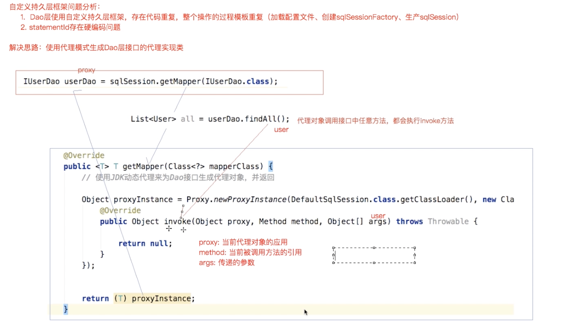

# 原生jdbc的缺点

jdbc编码如下

```java
package com.mybatis.dao;

import com.mybatis.pojo.User;

import java.sql.Connection;
import java.sql.DriverManager;
import java.sql.PreparedStatement;
import java.sql.ResultSet;
import java.util.ArrayList;
import java.util.List;

public class UserDaoImpl implements UserDao {

   private String driver = "com.mysql.jdbc.Driver";
   private String url = "jdbc:mysql://localhost:3306/mybatis?characterEncoding=utf-8";
   private String username = "root";
   private String password = "root";


   public List<User> queryUserList() throws Exception {
      List<User> userList = new ArrayList<User>();

      Class.forName(driver);
      /**
       * 问题一：频繁获取/释放数据库连接，影响数据库和应用性能
       * 解决：数据库连接池技术，C3P0,DRUID（阿里巴巴荣誉出品，号称前无古人后无来者世界最强没有之一）
       */
      Connection connection = DriverManager.getConnection(url, username, password);
      /**
       * 问题二：sql语句硬编码，后期难以维护
       * 解决：若sql语句和java代码分离，比如sql写在配置文件中。Mybatis就是这么干的
       */
      String sql = "select * from user";
      /**
       * 问题三：sql语句where条件和占位符一一对应，后期难以维护
       */
      // String sql1 = "select * from user where username=? and id=?";
      PreparedStatement preparedStatement = connection.prepareStatement(sql);
      // preparedStatement.setInt(1,2);
      ResultSet resultSet = preparedStatement.executeQuery();
      User user = null;
      /**
       * 问题四：结果集解析麻烦，查询列硬编码
       * 期望：如果单条记录直接返回实体对象，如果多条记录返回实体的集合
       */
      while(resultSet.next()) {
         user = new User();
         user.setId(resultSet.getInt("id"));
         user.setUsername(resultSet.getString("username"));
         user.setSex(resultSet.getString("sex"));
         user.setBirthday(resultSet.getDate("birthday"));
         user.setAddress(resultSet.getString("address"));

         userList.add(user);
      }
      resultSet.close();
      preparedStatement.close();
      connection.close();
      return userList;
   }
}
```

### 原始jdbc开发存在的问题如下:

1、 数据库连接创建、释放频繁造成系统资源浪费，从而影响系统性能。

2、 Sql语句在代码中硬编码，造成代码不易维护，实际应用中sql变化的可能较大，sql变动需要改变 java代码。

3、 使用preparedStatement向占有位符号传参数存在硬编码，因为sql语句的where条件不一定，可能 多也可能少，修改sql还要修改代码，系统不易维护。

4、 对结果集解析存在硬编码(查询列名)，sql变化导致解析代码变化，系统不易维护，如果能将数据 库 记录封装成pojo对象解析比较方便

### 框架解决问题的方案

1、通过数据库的配置文件，使用连接池维护数据库连接

2、通过配置文件统一管理sql语句

3和4、指定参数、返回值类型，通过反射，将参数和返回类型封装成对象，面向对象编程


# 持久层实现

## 思路

### 1.读取配置文件

读取完成以后以流的形式存在，我们不能将读取到的配置信息以流的形式存放在内存中，不好操作，可 以创建javaBean来存储

这里可以设计两个实体类：

(1)Configuration : 
存放数据库基本信息、Map<唯一标识，Mapper> 唯一标识:namespace + "." + id

> 因为数据库信息主要用来获取数据库连接，所以，这里直接获取连接，存入configurtaion对象中
>
> 

(2)MappedStatement:
sql语句、statement类型、输入参数java类型、输出参数java类型

### 2.解析配置文件

 创建sqlSessionFactoryBuilder类:

方法:sqlSessionFactory build(): 
	第一:使用dom4j解析配置文件，将解析出来的内容封装到Configuration和MappedStatement中 
	第二:创建SqlSessionFactory对象，用于生产sqlSession对象（工厂模式）

### 3.创建SqlSessionFactory及其实现类DefaultSqlSessionFactory:

 方法:openSession() : 获取sqlSession接口的实现类实例对象

### 4.创建sqlSession接口及实现类:

主要封装crud方法 

selectList(String statementId,Object param):查询所有 
selectOne(String statementId,Object param):查询单个
 具体实现:封装JDBC完成对数据库表的查询操作

### 5.创建Executor接口及实现类SimpleExecutor

query(params)：执行JDBC代码，封装语句和返回结果


## **自定义框架优化**

通过上述我们的自定义框架，我们解决了JDBC操作数据库带来的一些问题:例如频繁创建释放数据库连 接，硬编码，手动封装返回结果集等问题，但是现在我们继续来分析刚刚完成的自定义框架代码，有没 有什么问题?



问题如下:

dao的实现类中存在重复的代码，整个操作的过程模板重复(创建sqlsession,调用sqlsession方 法， 关闭 sqlsession) dao的实现类中存在硬编码，调用sqlsession的方法时，参数statement的id硬编码

```
解决:使用代理模式来创建接口的代理对象
```

​	在sqlSession添加getMapper方法

```java
public interface SqlSession {

  ....
    //为Dao接口生产动态代理类
    public <T> T getMapper(Class<?> mapperClass);
}
```

​	实现类

```java
@Override
public <T> T getMapper(Class<?> mapperClass) {
    //使用jdk动态代理为Dao接口生成实现类

    Object o = Proxy.newProxyInstance(DefaultSqlSession.class.getClassLoader(), new Class[]{mapperClass}, new InvocationHandler() {
        @Override
        public Object invoke(Object proxy, Method method, Object[] args) throws Throwable {

            // 为了通过动态代理调用具体对mapper，
            // 约定：namespace为dao接口全类名  sqlId为方法名
            String daoClassName = method.getDeclaringClass().getName();
            String methodName = method.getName();

            String statementId = daoClassName + "." + methodName;

            //获取方法返回值类型
            Type genericReturnType = method.getGenericReturnType();

            //此处简单地根据返回值是否带泛型判断调用的是selectList还是selectOne
            if (genericReturnType instanceof ParameterizedType) {
                return selectList(statementId, args);
            }

            return selectOne(statementId, args);
        }
    });
```

