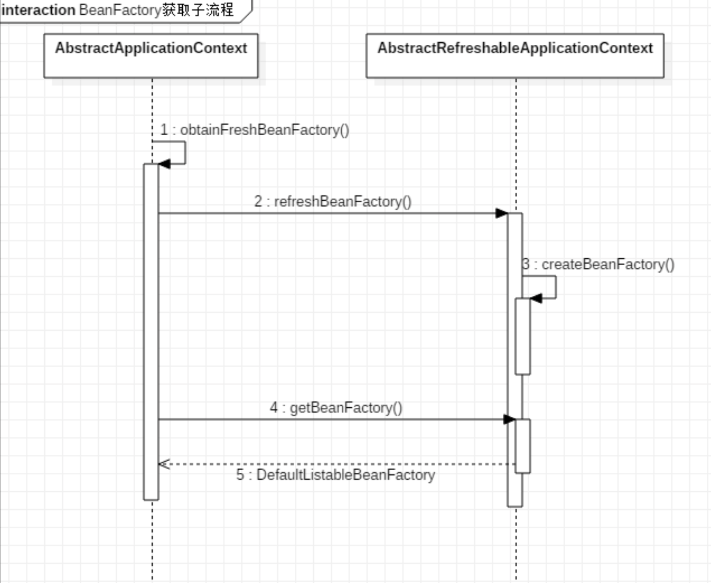

## 编译

### 使用gradle7

### 优化

#### 1、修改gradle参数，提高编译速度

修改源码根目录下的gradle.properties

```properties
version=5.1.13.BUILD-SNAPSHOT
#启用并行编译
org.gradle.parallel=true
#启用编译守护进程
org.gradle.daemon=true
#配置可用编译内存
# 指定用于守护程序进程的JVM参数。
# 该设置对于调整内存设置特别有用。
org.gradle.jvmargs=-Xms512m -Xmx2048m
```

#### 2、配置gradle仓库，提高下载速度

源码根目录下的build.gradle，将`buildscript`配置代码块中的`repositories`和`configure(allprojects)`配置代码块中的`repositories`替换为下列代码:

```groovy
repositories {
   mavenLocal()
   maven { url 'http://maven.aliyun.com/nexus/content/groups/public' }
   maven { url "https://repo.spring.io/plugins-release" }
   maven { url 'https://repo.spring.io/libs-snapshot' }
   maven { url "https://repo.spring.io/snapshot" }
   maven { url "https://repo.spring.io/milestone" }
   mavenCentral()
   jcenter()
   maven {
      url "https://plugins.gradle.org/m2/"
   }
}
```

原始内容

```groovy
buildscript配置代码块:
buildscript {
				###替换repositories
        repositories {
                maven { url "https://repo.spring.io/plugins-release" }
        }
        dependencies {
                classpath("io.spring.gradle:propdeps-plugin:0.0.9.RELEASE")
                classpath("org.asciidoctor:asciidoctorj-pdf:1.5.0-alpha.16")
        }
}
...
...
configure(allprojects)配置代码块:
configure(allprojects) { project ->
	...省略部分内容...
	###替换repositories
	repositories {
		maven { url "https://repo.spring.io/libs-release" }
		maven { url "https://repo.spring.io/snapshot" }  // for Reactor
	}
...省略部分内容...
}
```

> 参考https://my.oschina.net/u/3101282/blog/1837893


### 模块编译顺序

core-oxm-context-beans-aspects-aop

### 编译源码

使用Gradle的compileTestJava


## BeanFactory容器继承体系


# 容器初始化


## 关键点的触发时机


| 关键点                            | 触发代码                                                     |
| --------------------------------- | ------------------------------------------------------------ |
| 构造器                            | refresh#finishBeanFactoryInitialization(beanFactory)(beanFactory) |
| BeanFactoryPostProcessor 初始化   | refresh#invokeBeanFactoryPostProcessors(beanFactory)         |
| BeanFactoryPostProcessor 方法调用 | refresh#invokeBeanFactoryPostProcessors(beanFactory)         |
| BeanPostProcessor 初始化          | registerBeanPostProcessors(beanFactory)                      |
| BeanPostProcessor 方法调用        | refresh#finishBeanFactoryInitialization(beanFactory)         |


## **Spring IoC**容器初始化主流程

### refresh方法

```java
//org.springframework.context.support.AbstractApplicationContext#refresh
public void refresh() throws BeansException, IllegalStateException {
   synchronized (this.startupShutdownMonitor) {
      // Prepare this context for refreshing.
      // 准备刷新：设置Spring容器启动时间、
      // 开启活跃状态
      // 验证环境中的必要属性
      prepareRefresh();

      // Tell the subclass to refresh the internal bean factory.
      /*
         获取beanFactory，默认实现是DefaultListableBeanFactory
         加载BeanDefinition 注册到BeanDefinitionRegistry
       */
      ConfigurableListableBeanFactory beanFactory = obtainFreshBeanFactory();

      // Prepare the bean factory for use in this context.
      // beanFactory进行一些设置，比如context的类加载器等
      prepareBeanFactory(beanFactory);

      try {
         // Allows post-processing of the bean factory in context subclasses.
         // bean工厂后置处理
         postProcessBeanFactory(beanFactory);

         // Invoke factory processors registered as beans in the context.
         // 实例化 BeanFactoryPostProcessors的实现类Bean，并调用接口方法
         invokeBeanFactoryPostProcessors(beanFactory);

         // Register bean processors that intercept bean creation.
         // 注册Bean的后置处理器实现，等bean创建后执行
         registerBeanPostProcessors(beanFactory);

         // Initialize message source for this context.
         // 初始化组件：国际化、消息绑定、消息解析
         initMessageSource();

         // Initialize event multicaster for this context.
         // 初始化事件派发
         initApplicationEventMulticaster();

         // Initialize other special beans in specific context subclasses.
         // 模板方法，子类实现后调用，用于刷新时加入逻辑，如创建Tomcat、Jetty等web容器
         onRefresh();

         // Check for listener beans and register them.
         // 注册监听器
         registerListeners();

         // Instantiate all remaining (non-lazy-init) singletons.
         /*
            初始化所有剩下的非懒加载的单例Bean
            调用BeanPostProcessor
          */
         finishBeanFactoryInitialization(beanFactory);

         // Last step: publish corresponding event.
         finishRefresh();
      }

      catch (BeansException ex) {
         if (logger.isWarnEnabled()) {
            logger.warn("Exception encountered during context initialization - " +
                  "cancelling refresh attempt: " + ex);
         }

         // Destroy already created singletons to avoid dangling resources.
         destroyBeans();

         // Reset 'active' flag.
         cancelRefresh(ex);

         // Propagate exception to caller.
         throw ex;
      }

      finally {
         // Reset common introspection caches in Spring's core, since we
         // might not ever need metadata for singleton beans anymore...
         resetCommonCaches();
      }
   }
}
```

# BeanFactory创建流程

## 获取BeanFactory子流程





## BeanDefinition加载解析及注册子流程

- BeanDefinition：将xml或注解中定义的bean封装称java对象，封装的数据结构就是BeanDefinition


# Bean创建流程

Bean创建子流程入口在 AbstractApplicationContext#refresh()方法的finishBeanFactoryInitialization(beanFactory) 处

## finishBeanFactoryInitialization

```java
//org.springframework.context.support.AbstractApplicationContext#finishBeanFactoryInitialization
protected void finishBeanFactoryInitialization(ConfigurableListableBeanFactory beanFactory) {
   // Initialize conversion service for this context.
   if (beanFactory.containsBean(CONVERSION_SERVICE_BEAN_NAME) &&
         beanFactory.isTypeMatch(CONVERSION_SERVICE_BEAN_NAME, ConversionService.class)) {
      beanFactory.setConversionService(
            beanFactory.getBean(CONVERSION_SERVICE_BEAN_NAME, ConversionService.class));
   }

   // Register a default embedded value resolver if no bean post-processor
   // (such as a PropertyPlaceholderConfigurer bean) registered any before:
   // at this point, primarily for resolution in annotation attribute values.
   if (!beanFactory.hasEmbeddedValueResolver()) {
      beanFactory.addEmbeddedValueResolver(strVal -> getEnvironment().resolvePlaceholders(strVal));
   }

   // Initialize LoadTimeWeaverAware beans early to allow for registering their transformers early.
   String[] weaverAwareNames = beanFactory.getBeanNamesForType(LoadTimeWeaverAware.class, false, false);
   for (String weaverAwareName : weaverAwareNames) {
      getBean(weaverAwareName);
   }

   // Stop using the temporary ClassLoader for type matching.
   beanFactory.setTempClassLoader(null);

   // Allow for caching all bean definition metadata, not expecting further changes.
   beanFactory.freezeConfiguration();

   // Instantiate all remaining (non-lazy-init) singletons.
   // 实例化所有剩余的（非懒加载的）单例bean
   beanFactory.preInstantiateSingletons();
}
```

###  beanFactory.preInstantiateSingletons

```java
//org.springframework.beans.factory.support.DefaultListableBeanFactory#preInstantiateSingletons
public void preInstantiateSingletons() throws BeansException {
   if (logger.isTraceEnabled()) {
      logger.trace("Pre-instantiating singletons in " + this);
   }

   // Iterate over a copy to allow for init methods which in turn register new bean definitions.
   // While this may not be part of the regular factory bootstrap, it does otherwise work fine.
   List<String> beanNames = new ArrayList<>(this.beanDefinitionNames);

   // Trigger initialization of all non-lazy singleton beans...
   // 触发所有非懒加载单例bean的初始化
   for (String beanName : beanNames) {
      RootBeanDefinition bd = getMergedLocalBeanDefinition(beanName);
      if (!bd.isAbstract() && bd.isSingleton() && !bd.isLazyInit()) {
         //实现FactoryBean接口的bean，其id前缀为&
         if (isFactoryBean(beanName)) {
            Object bean = getBean(FACTORY_BEAN_PREFIX + beanName);
            if (bean instanceof FactoryBean) {
               final FactoryBean<?> factory = (FactoryBean<?>) bean;
               boolean isEagerInit;
               if (System.getSecurityManager() != null && factory instanceof SmartFactoryBean) {
                  isEagerInit = AccessController.doPrivileged((PrivilegedAction<Boolean>)
                              ((SmartFactoryBean<?>) factory)::isEagerInit,
                        getAccessControlContext());
               }
               else {
                  isEagerInit = (factory instanceof SmartFactoryBean &&
                        ((SmartFactoryBean<?>) factory).isEagerInit());
               }
               if (isEagerInit) {
                  getBean(beanName);
               }
            }
         }
         //普通bean
         else {
            getBean(beanName);
         }
      }
   }

   // Trigger post-initialization callback for all applicable beans...
   for (String beanName : beanNames) {
      Object singletonInstance = getSingleton(beanName);
      if (singletonInstance instanceof SmartInitializingSingleton) {
         final SmartInitializingSingleton smartSingleton = (SmartInitializingSingleton) singletonInstance;
         if (System.getSecurityManager() != null) {
            AccessController.doPrivileged((PrivilegedAction<Object>) () -> {
               smartSingleton.afterSingletonsInstantiated();
               return null;
            }, getAccessControlContext());
         }
         else {
            smartSingleton.afterSingletonsInstantiated();
         }
      }
   }
}
```

### getBean

```java
//org.springframework.beans.factory.support.AbstractBeanFactory#getBean(java.lang.String)
public Object getBean(String name) throws BeansException {
   return doGetBean(name, null, null, false);
}
```

### doGetBean

```java
protected <T> T doGetBean(final String name, @Nullable final Class<T> requiredType,
      @Nullable final Object[] args, boolean typeCheckOnly) throws BeansException {

   // 解析BeanName 若以&开头则去掉，若为别名则获取原名
   final String beanName = transformedBeanName(name);
   Object bean;

   // Eagerly check singleton cache for manually registered singletons.
   // 从缓存中获取bean
   Object sharedInstance = getSingleton(beanName);
   if (sharedInstance != null && args == null) {
      if (logger.isTraceEnabled()) {
         if (isSingletonCurrentlyInCreation(beanName)) {
            logger.trace("Returning eagerly cached instance of singleton bean '" + beanName +
                  "' that is not fully initialized yet - a consequence of a circular reference");
         }
         else {
            logger.trace("Returning cached instance of singleton bean '" + beanName + "'");
         }
      }
      bean = getObjectForBeanInstance(sharedInstance, name, beanName, null);
   }

   else {
      // Fail if we're already creating this bean instance:
      // We're assumably within a circular reference.
      // 如果是Prototype原型，且开启了 允许循环依赖，则抛出异常
      if (isPrototypeCurrentlyInCreation(beanName)) {
         throw new BeanCurrentlyInCreationException(beanName);
      }

      // Check if bean definition exists in this factory.
      // 检查父工厂是否存在该对象
      BeanFactory parentBeanFactory = getParentBeanFactory();
      if (parentBeanFactory != null && !containsBeanDefinition(beanName)) {
         // Not found -> check parent.
         String nameToLookup = originalBeanName(name);
         if (parentBeanFactory instanceof AbstractBeanFactory) {
            return ((AbstractBeanFactory) parentBeanFactory).doGetBean(
                  nameToLookup, requiredType, args, typeCheckOnly);
         }
         else if (args != null) {
            // Delegation to parent with explicit args.
            return (T) parentBeanFactory.getBean(nameToLookup, args);
         }
         else if (requiredType != null) {
            // No args -> delegate to standard getBean method.
            return parentBeanFactory.getBean(nameToLookup, requiredType);
         }
         else {
            return (T) parentBeanFactory.getBean(nameToLookup);
         }
      }

      if (!typeCheckOnly) {
         // 标注创建bean
         markBeanAsCreated(beanName);
      }

      try {
         // 合并父子bean的属性@??
         final RootBeanDefinition mbd = getMergedLocalBeanDefinition(beanName);
         checkMergedBeanDefinition(mbd, beanName, args);

         // Guarantee initialization of beans that the current bean depends on.
         // 处理DependsOn
         String[] dependsOn = mbd.getDependsOn();
         if (dependsOn != null) {
            for (String dep : dependsOn) {
               if (isDependent(beanName, dep)) {
                  throw new BeanCreationException(mbd.getResourceDescription(), beanName,
                        "Circular depends-on relationship between '" + beanName + "' and '" + dep + "'");
               }
               registerDependentBean(dep, beanName);
               try {
                  getBean(dep);
               }
               catch (NoSuchBeanDefinitionException ex) {
                  throw new BeanCreationException(mbd.getResourceDescription(), beanName,
                        "'" + beanName + "' depends on missing bean '" + dep + "'", ex);
               }
            }
         }

         // Create bean instance.
         if (mbd.isSingleton()) {
            //创建单例，调用getSingleton，传入ObjectFactory接口实现
            sharedInstance = getSingleton(beanName, () -> {
               try {
                  return createBean(beanName, mbd, args);
               }
               catch (BeansException ex) {
                  // Explicitly remove instance from singleton cache: It might have been put there
                  // eagerly by the creation process, to allow for circular reference resolution.
                  // Also remove any beans that received a temporary reference to the bean.
                  destroySingleton(beanName);
                  throw ex;
               }
            });
            bean = getObjectForBeanInstance(sharedInstance, name, beanName, mbd);
         }
         //只看singleton的创建
         .......
```


### getSingleton

```java
public Object getSingleton(String beanName, ObjectFactory<?> singletonFactory) {
   Assert.notNull(beanName, "Bean name must not be null");
   // 加锁
   synchronized (this.singletonObjects) {
      Object singletonObject = this.singletonObjects.get(beanName);
      if (singletonObject == null) {
         // 若正在销毁，则抛异常
         if (this.singletonsCurrentlyInDestruction) {
            throw new BeanCreationNotAllowedException(beanName,
                  "Singleton bean creation not allowed while singletons of this factory are in destruction " +
                  "(Do not request a bean from a BeanFactory in a destroy method implementation!)");
         }
         if (logger.isDebugEnabled()) {
            logger.debug("Creating shared instance of singleton bean '" + beanName + "'");
         }
         // 验证完要真正开始创建的对象，标识该bean正在创建
         beforeSingletonCreation(beanName);
         boolean newSingleton = false;
         boolean recordSuppressedExceptions = (this.suppressedExceptions == null);
         if (recordSuppressedExceptions) {
            this.suppressedExceptions = new LinkedHashSet<>();
         }
         try {
            // 调用传入的lambda
            singletonObject = singletonFactory.getObject();
            newSingleton = true;
         }
         catch (IllegalStateException ex) {
            // Has the singleton object implicitly appeared in the meantime ->
            // if yes, proceed with it since the exception indicates that state.
            singletonObject = this.singletonObjects.get(beanName);
            if (singletonObject == null) {
               throw ex;
            }
         }
         catch (BeanCreationException ex) {
            if (recordSuppressedExceptions) {
               for (Exception suppressedException : this.suppressedExceptions) {
                  ex.addRelatedCause(suppressedException);
               }
            }
            throw ex;
         }
         finally {
            if (recordSuppressedExceptions) {
               this.suppressedExceptions = null;
            }
            afterSingletonCreation(beanName);
         }
         if (newSingleton) {
            addSingleton(beanName, singletonObject);
         }
      }
      return singletonObject;
   }
}
```


### createBean

上面getSingleton，传入的第二个参数ObjectFactory<?> singletonFactory 函数式接口的实现： 

org.springframework.beans.factory.support.AbstractBeanFactory#createBean

```java

//org.springframework.beans.factory.support.AbstractAutowireCapableBeanFactory#createBean
protected Object createBean(String beanName, RootBeanDefinition mbd, @Nullable Object[] args)
      throws BeanCreationException {

   if (logger.isTraceEnabled()) {
      logger.trace("Creating instance of bean '" + beanName + "'");
   }
   // 拿到bd
   RootBeanDefinition mbdToUse = mbd;

   // Make sure bean class is actually resolved at this point, and
   // clone the bean definition in case of a dynamically resolved Class
   // which cannot be stored in the shared merged bean definition.
   // 获取bean的Class对象
   Class<?> resolvedClass = resolveBeanClass(mbd, beanName);
   if (resolvedClass != null && !mbd.hasBeanClass() && mbd.getBeanClassName() != null) {
      mbdToUse = new RootBeanDefinition(mbd);
      mbdToUse.setBeanClass(resolvedClass);
   }

   // Prepare method overrides.
   try {
      mbdToUse.prepareMethodOverrides();
   }
   catch (BeanDefinitionValidationException ex) {
      throw new BeanDefinitionStoreException(mbdToUse.getResourceDescription(),
            beanName, "Validation of method overrides failed", ex);
   }

   try {
      // Give BeanPostProcessors a chance to return a proxy instead of the target bean instance.
      Object bean = resolveBeforeInstantiation(beanName, mbdToUse);
      if (bean != null) {
         return bean;
      }
   }
   catch (Throwable ex) {
      throw new BeanCreationException(mbdToUse.getResourceDescription(), beanName,
            "BeanPostProcessor before instantiation of bean failed", ex);
   }

   try {
      // 真正创建bean
      Object beanInstance = doCreateBean(beanName, mbdToUse, args);
      if (logger.isTraceEnabled()) {
         logger.trace("Finished creating instance of bean '" + beanName + "'");
      }
      return beanInstance;
   }
   catch (BeanCreationException | ImplicitlyAppearedSingletonException ex) {
      // A previously detected exception with proper bean creation context already,
      // or illegal singleton state to be communicated up to DefaultSingletonBeanRegistry.
      throw ex;
   }
   catch (Throwable ex) {
      throw new BeanCreationException(
            mbdToUse.getResourceDescription(), beanName, "Unexpected exception during bean creation", ex);
   }
}
```


### doCreateBean

- 包含了bean生命周期的初始化流程 1-9 步

```java
//org.springframework.beans.factory.support.AbstractAutowireCapableBeanFactory#doCreateBean
protected Object doCreateBean(final String beanName, final RootBeanDefinition mbd, final @Nullable Object[] args)
			throws BeanCreationException {

		// Instantiate the bean.
		BeanWrapper instanceWrapper = null;
		if (mbd.isSingleton()) {
			instanceWrapper = this.factoryBeanInstanceCache.remove(beanName);
		}
		if (instanceWrapper == null) {
			// 创建实例，仅调用构造函数 (1)
			instanceWrapper = createBeanInstance(beanName, mbd, args);
		}
		// 从包装类中取出bean实例 及其class
		final Object bean = instanceWrapper.getWrappedInstance();
		Class<?> beanType = instanceWrapper.getWrappedClass();
		if (beanType != NullBean.class) {
			mbd.resolvedTargetType = beanType;
		}

		// Allow post-processors to modify the merged bean definition.
		synchronized (mbd.postProcessingLock) {
			if (!mbd.postProcessed) {
				try {
					applyMergedBeanDefinitionPostProcessors(mbd, beanType, beanName);
				}
				catch (Throwable ex) {
					throw new BeanCreationException(mbd.getResourceDescription(), beanName,
							"Post-processing of merged bean definition failed", ex);
				}
				mbd.postProcessed = true;
			}
		}

		// Eagerly cache singletons to be able to resolve circular references
		// even when triggered by lifecycle interfaces like BeanFactoryAware.
		boolean earlySingletonExposure = (mbd.isSingleton() && this.allowCircularReferences &&
				isSingletonCurrentlyInCreation(beanName));
		if (earlySingletonExposure) {
			if (logger.isTraceEnabled()) {
				logger.trace("Eagerly caching bean '" + beanName +
						"' to allow for resolving potential circular references");
			}
			addSingletonFactory(beanName, () -> getEarlyBeanReference(beanName, mbd, bean));
		}

		// Initialize the bean instance.
		// 初始化bean实例
		Object exposedObject = bean;
		try {
			// 填充bean属性 （2）
			populateBean(beanName, mbd, instanceWrapper);
			// 初始化bean (3-9)
			exposedObject = initializeBean(beanName, exposedObject, mbd);
		}
		catch (Throwable ex) {
			if (ex instanceof BeanCreationException && beanName.equals(((BeanCreationException) ex).getBeanName())) {
				throw (BeanCreationException) ex;
			}
			else {
				throw new BeanCreationException(
						mbd.getResourceDescription(), beanName, "Initialization of bean failed", ex);
			}
		}

		if (earlySingletonExposure) {
			Object earlySingletonReference = getSingleton(beanName, false);
			if (earlySingletonReference != null) {
				if (exposedObject == bean) {
					exposedObject = earlySingletonReference;
				}
				else if (!this.allowRawInjectionDespiteWrapping && hasDependentBean(beanName)) {
					String[] dependentBeans = getDependentBeans(beanName);
					Set<String> actualDependentBeans = new LinkedHashSet<>(dependentBeans.length);
					for (String dependentBean : dependentBeans) {
						if (!removeSingletonIfCreatedForTypeCheckOnly(dependentBean)) {
							actualDependentBeans.add(dependentBean);
						}
					}
					if (!actualDependentBeans.isEmpty()) {
						throw new BeanCurrentlyInCreationException(beanName,
								"Bean with name '" + beanName + "' has been injected into other beans [" +
								StringUtils.collectionToCommaDelimitedString(actualDependentBeans) +
								"] in its raw version as part of a circular reference, but has eventually been " +
								"wrapped. This means that said other beans do not use the final version of the " +
								"bean. This is often the result of over-eager type matching - consider using " +
								"'getBeanNamesOfType' with the 'allowEagerInit' flag turned off, for example.");
					}
				}
			}
		}

		// Register bean as disposable.
		try {
			registerDisposableBeanIfNecessary(beanName, bean, mbd);
		}
		catch (BeanDefinitionValidationException ex) {
			throw new BeanCreationException(
					mbd.getResourceDescription(), beanName, "Invalid destruction signature", ex);
		}

		return exposedObject;
	}
```

- 步骤 3-9

```java
//org.springframework.beans.factory.support.AbstractAutowireCapableBeanFactory#initializeBean
protected Object initializeBean(final String beanName, final Object bean, @Nullable RootBeanDefinition mbd) {
   if (System.getSecurityManager() != null) {
      AccessController.doPrivileged((PrivilegedAction<Object>) () -> {
         invokeAwareMethods(beanName, bean);
         return null;
      }, getAccessControlContext());
   }
   else {
      // 调用实现的aware接口 (3)、(4)、(5)
      invokeAwareMethods(beanName, bean);
   }

   Object wrappedBean = bean;
   if (mbd == null || !mbd.isSynthetic()) {
      // 调用后置处理器的 初始化前置处理 (6)
      wrappedBean = applyBeanPostProcessorsBeforeInitialization(wrappedBean, beanName);
   }

   try {
      // 调用初始化方法 afterPropertiesSet (7) init-method (8)
      invokeInitMethods(beanName, wrappedBean, mbd);
   }
   catch (Throwable ex) {
      throw new BeanCreationException(
            (mbd != null ? mbd.getResourceDescription() : null),
            beanName, "Invocation of init method failed", ex);
   }
   if (mbd == null || !mbd.isSynthetic()) {
      // 调用后置处理器的 初始化后置处理 (9)
      wrappedBean = applyBeanPostProcessorsAfterInitialization(wrappedBean, beanName);
   }

   return wrappedBean;
}
```

## 循环依赖

### 三级缓存

流程图


bean的创建状态


三个问题


## lazy-init延迟加载机制原理

- lazy-init 延迟加载机制分析

普通 Bean 的初始化是在容器启动初始化阶段执行的，而被lazy-init=true修饰的 bean 则是在从容器里 **第一次进行context.getBean() 时进行触发**。Spring 启动的时候会把所有bean信息(包括XML和注解)解 析转化成Spring能够识别的BeanDefinition并存到Hashmap里供下面的初始化时用，然后对每个 BeanDefinition 进行处理，**如果是懒加载的则在容器初始化阶段不处理**，其他的则在容器初始化阶段进 行初始化并依赖注入。

### 总结

- 对于被修饰为lazy-init的bean Spring 容器初始化阶段不会进行 init 并且依赖注入，当第一次 进行getBean时候才进行初始化并依赖注入 

- 对于非懒加载的bean，getBean的时候会从缓存里头获取，因为容器初始化阶段 Bean 已经 初始化完成并缓存了起来


# SpringAOP

引入aspectjweaver

```groovy
dependencies {
    compile(project(":spring-context"))
    /*引入aspectjweaver*/
    compile group: 'org.aspectj', name: 'aspectjweaver', version: '1.8.6'
    testCompile group: 'junit', name: 'junit', version: '4.12'

}
```

## AOP代理对象创建

### AbstractAutoProxyCreator

#### wrapIfNecessary

```java
//org.springframework.aop.framework.autoproxy.AbstractAutoProxyCreator#wrapIfNecessary
protected Object wrapIfNecessary(Object bean, String beanName, Object cacheKey) {
   if (StringUtils.hasLength(beanName) && this.targetSourcedBeans.contains(beanName)) {
      return bean;
   }
   if (Boolean.FALSE.equals(this.advisedBeans.get(cacheKey))) {
      return bean;
   }
   if (isInfrastructureClass(bean.getClass()) || shouldSkip(bean.getClass(), beanName)) {
      this.advisedBeans.put(cacheKey, Boolean.FALSE);
      return bean;
   }

   // Create proxy if we have advice.
   // 获取当前bean匹配的advisor
   Object[] specificInterceptors = getAdvicesAndAdvisorsForBean(bean.getClass(), beanName, null);
   if (specificInterceptors != DO_NOT_PROXY) {
      this.advisedBeans.put(cacheKey, Boolean.TRUE);
      Object proxy = createProxy(
            bean.getClass(), beanName, specificInterceptors, new SingletonTargetSource(bean));
      this.proxyTypes.put(cacheKey, proxy.getClass());
      return proxy;
   }

   this.advisedBeans.put(cacheKey, Boolean.FALSE);
   return bean;
}
```

#### createProxy

```java
//org.springframework.aop.framework.autoproxy.AbstractAutoProxyCreator#createProxy

protected Object createProxy(Class<?> beanClass, @Nullable String beanName,
      @Nullable Object[] specificInterceptors, TargetSource targetSource) {

   if (this.beanFactory instanceof ConfigurableListableBeanFactory) {
      AutoProxyUtils.exposeTargetClass((ConfigurableListableBeanFactory) this.beanFactory, beanName, beanClass);
   }

   // 创建代理的工作交给ProxyFactory
   ProxyFactory proxyFactory = new ProxyFactory();
   proxyFactory.copyFrom(this);

   // 判断是否要设置ProxyTargetClass为true
   if (!proxyFactory.isProxyTargetClass()) {
      if (shouldProxyTargetClass(beanClass, beanName)) {
         proxyFactory.setProxyTargetClass(true);
      }
      else {
         evaluateProxyInterfaces(beanClass, proxyFactory);
      }
   }

   // 把增强和通用拦截器对象合并。都适配成advisor
   Advisor[] advisors = buildAdvisors(beanName, specificInterceptors);
   proxyFactory.addAdvisors(advisors);
   // 设置参数
   proxyFactory.setTargetSource(targetSource);
   customizeProxyFactory(proxyFactory);

   proxyFactory.setFrozen(this.freezeProxy);
   if (advisorsPreFiltered()) {
      proxyFactory.setPreFiltered(true);
   }

   // 开始创建代理
   return proxyFactory.getProxy(getProxyClassLoader());
}
```


AbstractAutoProxyCreator

```java
//org.springframework.aop.framework.autoproxy.AbstractAutoProxyCreator#createProxy
public abstract class AbstractAutoProxyCreator extends ProxyProcessorSupport
		implements SmartInstantiationAwareBeanPostProcessor, BeanFactoryAware {
  
protected Object createProxy(Class<?> beanClass, @Nullable String beanName,
      @Nullable Object[] specificInterceptors, TargetSource targetSource) {

   if (this.beanFactory instanceof ConfigurableListableBeanFactory) {
      AutoProxyUtils.exposeTargetClass((ConfigurableListableBeanFactory) this.beanFactory, beanName, beanClass);
   }

   // 创建代理的工作交给ProxyFactory
   ProxyFactory proxyFactory = new ProxyFactory();
   proxyFactory.copyFrom(this);

   // 判断是否要设置ProxyTargetClass为true
   if (!proxyFactory.isProxyTargetClass()) {
      if (shouldProxyTargetClass(beanClass, beanName)) {
         proxyFactory.setProxyTargetClass(true);
      }
      else {
         evaluateProxyInterfaces(beanClass, proxyFactory);
      }
   }

   // 把增强和通用拦截器对象合并。都适配成advisor
   Advisor[] advisors = buildAdvisors(beanName, specificInterceptors);
   proxyFactory.addAdvisors(advisors);
   // 设置参数
   proxyFactory.setTargetSource(targetSource);
   customizeProxyFactory(proxyFactory);

   proxyFactory.setFrozen(this.freezeProxy);
   if (advisorsPreFiltered()) {
      proxyFactory.setPreFiltered(true);
   }

   // 开始创建代理
   return proxyFactory.getProxy(getProxyClassLoader());
}
```

ProxyFactory#getProxy

```java
//org.springframework.aop.framework.ProxyFactory#getProxy(java.lang.ClassLoader)
public Object getProxy(@Nullable ClassLoader classLoader) {
   return createAopProxy().getProxy(classLoader);
}
```

这里调用了CglibAopProxy 的getProxy：org.springframework.aop.framework.CglibAopProxy#getProxy(java.lang.ClassLoader)

判断AopProxy类型的方法如下：

### DefaultAopProxyFactory

#### createAopProxy

```java
//org.springframework.aop.framework.DefaultAopProxyFactory
public class DefaultAopProxyFactory implements AopProxyFactory, Serializable {

   @Override
   public AopProxy createAopProxy(AdvisedSupport config) throws AopConfigException {
      if (config.isOptimize() || config.isProxyTargetClass() || hasNoUserSuppliedProxyInterfaces(config)) {
         Class<?> targetClass = config.getTargetClass();
         if (targetClass == null) {
            throw new AopConfigException("TargetSource cannot determine target class: " +
                  "Either an interface or a target is required for proxy creation.");
         }
         if (targetClass.isInterface() || Proxy.isProxyClass(targetClass)) {
            return new JdkDynamicAopProxy(config);
         }
         return new ObjenesisCglibAopProxy(config);
      }
      else {
         return new JdkDynamicAopProxy(config);
      }
   }
```


## 声明式事务

### @EnableTransactionManagement

```java
@Target(ElementType.TYPE)
@Retention(RetentionPolicy.RUNTIME)
@Documented
@Import(TransactionManagementConfigurationSelector.class)
public @interface EnableTransactionManagement {
```

- @Import

```java
public class TransactionManagementConfigurationSelector extends AdviceModeImportSelector<EnableTransactionManagement> {

   /**
    * Returns {@link ProxyTransactionManagementConfiguration} or
    * {@code AspectJ(Jta)TransactionManagementConfiguration} for {@code PROXY}
    * and {@code ASPECTJ} values of {@link EnableTransactionManagement#mode()},
    * respectively.
    */
   @Override
   protected String[] selectImports(AdviceMode adviceMode) {
      switch (adviceMode) {
         case PROXY:
            return new String[] {AutoProxyRegistrar.class.getName(),
                  ProxyTransactionManagementConfiguration.class.getName()};
         case ASPECTJ:
            return new String[] {determineTransactionAspectClass()};
         default:
            return null;
      }
   }

   private String determineTransactionAspectClass() {
      return (ClassUtils.isPresent("javax.transaction.Transactional", getClass().getClassLoader()) ?
            TransactionManagementConfigUtils.JTA_TRANSACTION_ASPECT_CONFIGURATION_CLASS_NAME :
            TransactionManagementConfigUtils.TRANSACTION_ASPECT_CONFIGURATION_CLASS_NAME);
   }

}
```

引入`AutoProxyRegistrar.class`、`ProxyTransactionManagementConfiguration.class`

#### AutoProxyRegistrar.class

```java
public class AutoProxyRegistrar implements ImportBeanDefinitionRegistrar {
		public void registerBeanDefinitions(AnnotationMetadata importingClassMetadata, BeanDefinitionRegistry registry) {
	......
						AopConfigUtils.registerAutoProxyCreatorIfNecessary(registry);
	......
	}
	
```

```java
@Nullable
public static BeanDefinition registerAutoProxyCreatorIfNecessary(BeanDefinitionRegistry registry) {
   return registerAutoProxyCreatorIfNecessary(registry, null);
}

@Nullable
public static BeanDefinition registerAutoProxyCreatorIfNecessary(
      BeanDefinitionRegistry registry, @Nullable Object source) {

   return registerOrEscalateApcAsRequired(InfrastructureAdvisorAutoProxyCreator.class, registry, source);
}
```

`InfrastructureAdvisorAutoProxyCreator`继承了`AbstractAdvisorAutoProxyCreator`，所以是一个后置处理器类


#### ProxyTransactionManagementConfiguration.class

```java
@Configuration
public class ProxyTransactionManagementConfiguration extends AbstractTransactionManagementConfiguration {
	@Bean(name = TransactionManagementConfigUtils.TRANSACTION_ADVISOR_BEAN_NAME)
	@Role(BeanDefinition.ROLE_INFRASTRUCTURE)
	public BeanFactoryTransactionAttributeSourceAdvisor transactionAdvisor() {
		BeanFactoryTransactionAttributeSourceAdvisor advisor = new BeanFactoryTransactionAttributeSourceAdvisor();
		advisor.setTransactionAttributeSource(transactionAttributeSource());
		advisor.setAdvice(transactionInterceptor());
		if (this.enableTx != null) {
			advisor.setOrder(this.enableTx.<Integer>getNumber("order"));
		}
		return advisor;
	}

	@Bean
	@Role(BeanDefinition.ROLE_INFRASTRUCTURE)
	public TransactionAttributeSource transactionAttributeSource() {
		return new AnnotationTransactionAttributeSource();
	}

	@Bean
	@Role(BeanDefinition.ROLE_INFRASTRUCTURE)
	public TransactionInterceptor transactionInterceptor() {
		TransactionInterceptor interceptor = new TransactionInterceptor();
		interceptor.setTransactionAttributeSource(transactionAttributeSource());
		if (this.txManager != null) {
			interceptor.setTransactionManager(this.txManager);
		}
		return interceptor;
	}

```

注入了 **属性解析器 `AnnotationTransactionAttributeSource`、事务拦截器 `TransactionInterceptor`**

1、`AnnotationTransactionAttributeSource`内部维护了一个注解解析器集合，

```java
public class AnnotationTransactionAttributeSource extends AbstractFallbackTransactionAttributeSource
		implements Serializable {

	/**
	 * 事务注解解析器集合
	 */
	private final Set<TransactionAnnotationParser> annotationParsers;
}
```

`TransactionAnnotationParser`实现类为`SpringTransactionAnnotationParser`，用于解析`@Transactional`注解

```java
public class SpringTransactionAnnotationParser implements TransactionAnnotationParser, Serializable {
	protected TransactionAttribute parseTransactionAnnotation(AnnotationAttributes attributes) {
		RuleBasedTransactionAttribute rbta = new RuleBasedTransactionAttribute();

		Propagation propagation = attributes.getEnum("propagation");
		rbta.setPropagationBehavior(propagation.value());
		Isolation isolation = attributes.getEnum("isolation");
		rbta.setIsolationLevel(isolation.value());
		rbta.setTimeout(attributes.getNumber("timeout").intValue());
		rbta.setReadOnly(attributes.getBoolean("readOnly"));
		rbta.setQualifier(attributes.getString("value"));

		List<RollbackRuleAttribute> rollbackRules = new ArrayList<>();
		for (Class<?> rbRule : attributes.getClassArray("rollbackFor")) {
			rollbackRules.add(new RollbackRuleAttribute(rbRule));
		}
		for (String rbRule : attributes.getStringArray("rollbackForClassName")) {
			rollbackRules.add(new RollbackRuleAttribute(rbRule));
		}
		for (Class<?> rbRule : attributes.getClassArray("noRollbackFor")) {
			rollbackRules.add(new NoRollbackRuleAttribute(rbRule));
		}
		for (String rbRule : attributes.getStringArray("noRollbackForClassName")) {
			rollbackRules.add(new NoRollbackRuleAttribute(rbRule));
		}
		rbta.setRollbackRules(rollbackRules);

		return rbta;
	}
```


2、TransactionInterceptor

```
public class TransactionInterceptor extends TransactionAspectSupport implements MethodInterceptor, Serializable {
```