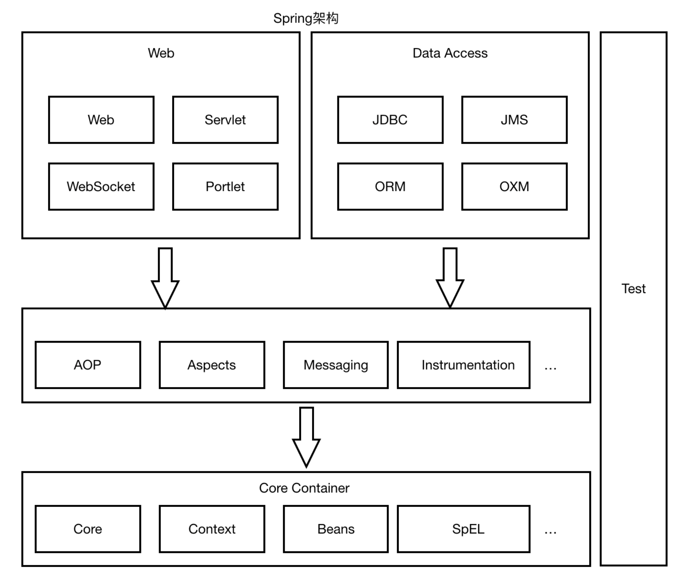

# Spring

- 简介

Spring 是分层的 full-stack(全栈) 轻量级开源框架，以 **IoC** 和 **AOP** 为内核，提供了展现层 Spring MVC 和业务层事务管理等众多的企业级应用技术，还能整合开源世界众多著名的第三方框架和类库，已 经成为使用最多的 Java EE 企业应用开源框架。

## 第**3**节 **Spring** 的优势

### 方便解耦，简化开发

通过Spring提供的IoC容器，可以将对象间的依赖关系交由Spring进行控制，避免硬编码所造成的 过度程序耦合。用户也不必再为单例模式类、属性文件解析等这些很底层的需求编写代码，可以更 专注于上层的应用。

### AOP编程的支持

通过Spring的AOP功能，方便进行面向切面的编程，许多不容易用传统OOP实现的功能可以通过AOP轻松应付。

### 声明式事务的支持

@Transactional可以将我们从单调烦闷的事务管理代码中解脱出来，通过声明式方式灵活的进行事务的管理，提高开发效率和质量。

### 方便程序的测试

可以用非容器依赖的编程方式进行几乎所有的测试工作，测试不再是昂贵的操作，而是随手可做的事情。

### 方便集成各种优秀框架

Spring可以降低各种框架的使用难度，提供了对各种优秀框架(Struts、Hibernate、Hessian、 Quartz等)的直接支持。

### 降低JavaEE API的使用难度

Spring对JavaEE API(如JDBC、JavaMail、远程调用等)进行了薄薄的封装层，使这些API的使用难度大为降低。

### 源码是经典的 Java 学习范例 

Spring的源代码设计精妙、结构清晰、匠心独用，处处体现着大师对Java设计模式灵活运用以及对Java技术的高深造诣。它的源代码无意是Java技术的最佳实践的范例。


## 第**4**节 **Spring** 的核心结构

Spring是一个分层非常清晰并且依赖关系、职责定位非常明确的轻量级框架，主要包括几个大模块:数 据处理模块、Web模块、AOP(Aspect Oriented Programming)/Aspects模块、Core Container模块 和 Test 模块，如下图所示，Spring依靠这些基本模块，实现了一个令人愉悦的融合了现有解决方案的零 侵入的轻量级框架。

### Spring架构图



# 二、Spring核心思想

注意:IOC和AOP不是spring提出的，在spring之前就已经存在，只不过更偏向于理论化，spring在技 术层次把这两个思想做了非常好的实现(Java)

## 第**1**节 **IoC**

### **1.1** 什么是**IoC**?

 **IoC Inversion of Control** (控制反转/反转控制)，注意它是一个技术思想，不是一个技术实现

描述的事情:Java开发领域对象的创建，管理的问题 传统开发方式:比如类A依赖于类B，往往会在类A中new一个B的对象

IoC思想下开发方式:我们不用自己去new对象了，而是由IoC容器(Spring框架)去帮助我们实例化对 象并且管理它，我们需要使用哪个对象，去问IoC容器要即可

- 我们丧失了一个权利(创建、管理对象的权利),得到了一个福利(不用考虑对象的创建、管理等一系列 事情)

#### 为什么叫做控制反转?

- 控制:指的是对象创建(实例化、管理)的权利 
- 反转:控制权交给外部环境了(spring框架、IoC容器)


### 1.2 IoC解决了什么问题

**IoC**解决对象之间的耦合问题


### **1.3 IoC**和**DI**的区别

DI: **Dependancy Injection**(依赖注入)
 怎么理解: IOC和DI描述的是同一件事情，只不过⻆度不一样罢了


## 第**2**节 **AOP** 

### **2.1** 什么是**AOP**

AOP: **Aspect oriented Programming** 面向切面编程/面向方面编程 

AOP是OOP的延续，从OOP说起

OOP三大特征:**封装、继承和多态** oop是一种**垂直继承体系**


OOP编程思想可以解决大多数的代码重复问题，但是有一些情况是处理不了的，
比如下面的在顶级父类 Animal中的多个方法中相同位置出现了重复代码，OOP就解决不了


横切逻辑代码
像上面的eat、run方法前后加入性能监控的代码，就是横切逻辑代码


横切逻辑代码存在什么问题:

- 横切代码重复问题
- 横切逻辑代码和业务代码混杂在一起，代码臃肿，维护不方便

AOP出场，AOP独辟蹊径提出横向抽取机制，将横切逻辑代码和业务逻辑代码分析


代码拆分容易，那么如何在不改变原有业务逻辑的情况下，悄无声息的把横切逻辑代码应用到原有的业
务逻辑中，达到和原来一样的效果，这个是比较难的

### **2.2 AOP**在解决什么问题 

在不改变原有业务逻辑情况下，增强横切逻辑代码，根本上解耦合，避免横切逻辑代码重复

### *2.3 为什么叫做面向切面编程 

- **「切」**：指的是**横切逻辑，原有业务逻辑代码我们不能动，只能操作横切逻辑代码**，所以面向横切逻辑
- **「面」**：横切逻辑代码往往要**影响的是很多个方法，每一个方法都如同一个点，多个点构成面**，有一个
  面的概念在里面


# 三、实现IoC和AoP


# 四、SpringIoC

xml和注解方式


## 第1节 SpringIoC基础

### 1.1 BeanFactory和Application的区别

beanFactory是SpringIoc容器的顶层接口，定义了Ioc容器的基础功能、和基础规范。
而ApplicationContext是它的一个子接口，具备BeanFactory的全部功能。

通常，称BeanFactory为SPring的基础容器，ApplicationContext是容器的高级接口，拥有更多功能，比如国际化、资源访问等等


#### dtd

```
<?xml version="1.0" encoding="UTF-8"?>
<beans xmlns="http://www.springframework.org/schema/beans"
       xmlns:xsi="http://www.w3.org/2001/XMLSchema-instance"
       xsi:schemaLocation="http://www.springframework.org/schema/beans
        https://www.springframework.org/schema/beans/spring-beans.xsd">
```


引入spring-web

配置spring监听器

```
<!--使用监听器启动springIOC容器-->
<listener>
  <listener-class>org.springframework.web.context.ContextLoaderListener</listener-class>
</listener>
```

配置`contextConfigLocation`参数。
监听器启动时会读取`contextConfigLocation`参数，初始化spring容器

```
<context-param>
  <param-name>contextConfigLocation</param-name>
  <param-value>classpath:applicationContext.xml</param-value>
</context-param>
```


- 实例化bean的三种方式

  - 1、使用无参构造器

  ```java
  <bean id="accountDao" class="com.shred.spring.dao.impl.JdbcAccountDaoImpl">
          <property name="ConnectionUtils" ref="connectionUtils"/>
      </bean>
  ```

  - 2、使用静态方法

  ```java
  <!--方式二：静态方法-->
      <bean id="createBeanFactory" class="com.shred.spring.factory.CreateBeanFactory"/>
  ```

  - 3、实例化方法：一般用于bean创建比较麻烦的场景

  ```java
    <!--方式三：实例化方法-->
      <bean id="connectionUtils2" factory-bean="createBeanFactory" factory-method="getInstance"/>
  ```

  ```java
  public class CreateBeanFactory {
  
      public static ConnectionUtils getInstanceStatic(){
          return new ConnectionUtils();
      }
  
      public ConnectionUtils getInstance(){
          return new ConnectionUtils();
      }
  }
  ```


#### bean的生命周期

- 作用范围的改变
  - singleton：（默认）单例
  - prototype：原型，每次获取新的对象。Spring只创建对象，不管理对象

不同作用范围的生命周期

单例模式:**singleton
** 对象出生:当创建容器时，对象就被创建了。
 对象活着:只要容器在，对象一直活着。 
对象死亡:当销毁容器时，对象就被销毁了。 
一句话总结:单例模式的bean对象生命周期与容器相同。 

多例模式:**prototype
** 对象出生:当使用对象时，创建新的对象实例。 
对象活着:只要对象在使用中，就一直活着。 
对象死亡:当对象⻓时间不用时，被java的垃圾回收器回收了。 
一句话总结:多例模式的bean对象，spring框架只负责创建，不负责销毁。


#### Bean标签属性

在基于xml的IoC配置中，bean标签是最基础的标签。它表示了IoC容器中的一个对象。换句话 说，如果一个对象想让spring管理，在XML的配置中都需要使用此标签配置，Bean标签的属性如 下:

**id**属性: 用于给bean提供一个唯一标识。在一个标签内部，标识必须唯一。

**class**属性:用于指定创建Bean对象的全限定类名。

**name**属性:用于给bean提供一个或多个名称。多个名称用空格分隔。

**factory-bean**属性:用于指定创建当前bean对象的工厂bean的唯一标识。当指定了此属性之后， class属性失效。

**factory-method**属性:用于指定创建当前bean对象的工厂方法，如配合factory-bean属性使用， 则class属性失效。如配合class属性使用，则方法必须是static的。

**scope**属性:用于指定bean对象的作用范围。通常情况下就是singleton。当要用到多例模式时， 可以配置为prototype。

**init-method**属性:用于指定bean对象的初始化方法，此方法会在bean对象装配后调用。必须是 一个无参方法。

**destory-method**属性:用于指定bean对象的销毁方法，此方法会在bean对象销毁前执行。它只 能为scope是singleton时起作用。

#### DI 依赖注入的xml配置 

依赖注入分类

- 按照注入的方式分类 

构造函数注入:顾名思义，就是利用带参构造函数实现对类成员的数据赋值。 
**set**方法注入:它是通过类成员的set方法实现数据的注入。(使用最多的)

- 按照注入的数据类型分类

 基本类型和**String
注入的数据类型是基本类型或者是字符串类型的数据。

其他**Bean**类型
注入的数据类型是对象类型，称为其他Bean的原因是，这个对象是要求出现在IoC容器 中的。那么针对当前Bean来说，就是其他Bean了。

复杂类型(集合类型)
注入的数据类型是Aarry，List，Set，Map，Properties中的一种类型。

依赖注入的配置实现之构造函数注入 顾名思义，就是利用构造函数实现对类成员的赋值。它 的使用要求是，类中提供的构造函数参数个数必须和配置的参数个数一致，且数据类型匹 配。同时需要注意的是，当没有无参构造时，则必须提供构造函数参数的注入，否则Spring 框架会报错。


### **1.3 xml**与注解相结合模式 注意:

- xml+注解结合模式，xml文件依然存在，所以，spring IOC容器的启动仍然从加载xml开始

- 第三方**jar**中的**bean**定义在**xml**，比如德鲁伊数据库连接池 自己开发的**bean**定义使用注解

```
<!--开启注解扫描-->
<context:component-scan base-package="com.shred.spring"/>
```

#### @Component

@Component("accountDao")，注解加在类上 bean的id属性内容直接配置在注解后面如果不配置，默认定义个这个bean的id为类 的类名首字母小写; 另外，针对分层代码开发提供了@Componenet的三种别名**@Controller、 @Service、@Repository**分别用于控制层类、服务层类、dao层类的bean定义，这 四个注解的用法完全一样，只是为了更清晰的区分而已

- DI 依赖注入的注解实现方式

#### **@Autowired**

@Autowired为Spring提供的注解，需要导入包 org.springframework.beans.factory.annotation.Autowired。

@Autowired采取的策略为**按照类型注入**。

```java
@Service("transferService")
public class TransferServiceImpl implements TransferService {
    //  @Autowired 按照类型来注入, 若无发区分，可使用 @Qualifier
    @Autowired
    @Qualifier("accountDao")
    private AccountDao accountDao;
```

如上代码所示，这样装配回去spring容器中找到类型为AccountDao的类，然后将其注入进来。这 样会产生一个问题，当一个类型有多个bean值的时候，会造成无法选择具体注入哪一个的情况， 这个时候我们需要配合着**@Qualifier**使用。

#### @Qualifier

告诉Spring具体去装配哪个对象。

#### **@Resource**

@Resource 注解由 J2EE 提供，需要导入包 javax.annotation.Resource。 
@Resource 默认按照 ByName 自动注入。
@Resource 在 Jdk 11中已经移除，如果要使用，需要单独引入jar包


### 1.4 纯注解

@Configuration 注解，表名当前类是一个配置类

@ComponentScan 注解，替代 context:component-scan

@PropertySource，引入外部属性配置文件

@Import 引入其他配置类

@Value 对变量赋值，可以直接赋值，也可以使用 ${} 读取资源配置文件中的信息 

@Bean 将方法返回对象加入 SpringIOC 容器

Web.xml配置

```
 <!--告诉listener 使用注解方式启动ioc容器-->
  <context-param>
    <param-name>contextClass</param-name>
    <param-value>org.springframework.web.context.support.AnnotationConfigWebApplicationContext</param-value>
  </context-param>
  
  <!--ContextLoaderListener自动读取该参数-->
  <!--配置参数：springIOC容器的 配置文件-->
  <context-param>
    <param-name>contextConfigLocation</param-name>
    <!--配置启动类的全类名-->
    <param-value>com.shred.spring.SpringConfig</param-value>
<!--    <param-value>classpath:applicationContext.xml</param-value>-->
  </context-param>
```


## 第**2**节 **Spring IOC**高级特性

### **2.1 lazy-Init** 延迟加载 Bean的延迟加载(延迟创建)

ApplicationContext 容器的默认行为是在启动服务器时将所有 singleton bean 提前进行实例化。提前 实例化意味着作为初始化过程的一部分，ApplicationContext 实例会创建并配置所有的singleton bean。

- 设置 lazy-init 为 true 的 bean 将不会在 ApplicationContext 启动时提前被实例化，而是第一次向容器通过 getBean 索取 bean 时实例化的。

```
 lazy-init="true"
 
@Lazy
```

- 也可以在容器层次中通过在 元素上使用 "default-lazy-init" 属性来控制延时初始化

```xml
 <beans default-lazy-init="true">
    <!-- no beans will be eagerly pre-instantiated... -->
</beans>
```

### **2.2 FactoryBean** 

Spring中Bean有两种，一种是普通Bean，一种是工厂Bean(FactoryBean)，FactoryBean可以生成

某一个类型的Bean实例(返回给我们)，也就是说我们可以借助于它自定义Bean的创建过程。

Bean创建的三种方式中的静态方法和实例化方法和FactoryBean作用类似，FactoryBean使用较多，尤

其在Spring框架一些组件中会使用，还有其他框架和Spring框架整合时使用

- FactoryBean

```java
public interface FactoryBean<T> {

   @Nullable
   T getObject() throws Exception;

   @Nullable
   Class<?> getObjectType();

   default boolean isSingleton() {
      return true;
   }

}
```

- 定义Company实体

```java
@Data
@NoArgsConstructor
@AllArgsConstructor
public class Company {
    private String name;
    private String scale;
    private String address;
}
```

- 定义实现类

```java
public class CompanyFactoryBean implements FactoryBean<Company> {

    private String companyInfo;//公司名称、地址、规模

    public void setCompanyInfo(String companyInfo) {
        this.companyInfo = companyInfo;
    }

    @Override
    public boolean isSingleton() {
        return false;
    }

    @Override
    public Company getObject() throws Exception {
        Company company = new Company();
        String[] split = companyInfo.split(",");
        company.setName(split[0]);
        company.setAddress(split[1]);
        company.setScale(split[2]);

        return company;
    }

    @Override
    public Class<?> getObjectType() {
        return Company.class;
    }
}
```


- Config注入FactoryBean

```java
 @Bean
    public CompanyFactoryBean companyBean(){
        CompanyFactoryBean companyFactoryBean = new CompanyFactoryBean();
        companyFactoryBean.setCompanyInfo("nnnn,ssfd,ff");
        return companyFactoryBean;
    }
```

- Test：获取FactoryBean，需要在id之前添加“&”

```java
@Test
public void testAnno(){
    AnnotationConfigApplicationContext context = new AnnotationConfigApplicationContext(SpringConfig.class);

    Object lazyResult = context.getBean("lazyResult");
    System.out.println(lazyResult);

    System.out.println(context.getBean("companyBean"));
    /*通过&获取factoryBean*/
    System.out.println(context.getBean("&companyBean"));
    //Company(name=nnnn, scale=ff, address=ssfd)
    //com.shred.spring.factory.CompanyFactoryBean@74a6f9c1
}
```


### **2.3** 后置处理器

Spring提供了两种后处理bean的扩展接口，分别为 BeanPostProcessor 和

BeanFactoryPostProcessor，两者在使用上是有所区别的。

在BeanFactory初始化之后可以使用BeanFactoryPostProcessor进行后置处理做一些事情

在Bean对象实例化(并不是Bean的整个生命周期完成)之后可以使用BeanPostProcessor进行后置处 理做一些事情

- 主要在Spring内部，产生aop代理对象时使用


# 五、SpringAOP


## aop术语

| 名词               | 解释                                                         |
| ------------------ | ------------------------------------------------------------ |
| Joinpoint(连 接点) | 它指的是那些可以用于把增强代码加入到业务主线中的点，那么由上图中我们可 以看出，这些点指的就是方法。在方法执行的前后通过动态代理技术加入增强的 代码。在Spring框架AOP思想的技术实现中，也只支持方法类型的连接点。 |
| Pointcut(切 入点)  | 它指的是那些已经把增强代码加入到业务主线进来之后的连接点。由上图中，我 们看出表现层 transfer 方法就只是连接点，因为判断访问权限的功能并没有对 其增强。 |
| Advice(通 知/增强) | 它指的是切面类中用于提供增强功能的方法。并且不同的方法增强的时机是不一 样的。比如，开启事务肯定要在业务方法执行之前执行;提交事务要在业务方法 正常执行之后执行，而回滚事务要在业务方法执行产生异常之后执行等等。那么 这些就是通知的类型。其分类有:**前置通知 后置通知 异常通知 最终通知 环绕通知。** |
| Target(目标 对象)  | 它指的是代理的目标对象。即被代理对象。                       |
| Proxy(代理)        | 它指的是一个类被AOP织入增强后，产生的代理类。即代理对象。    |
| Weaving(织 入)     | 它指的是把增强应用到目标对象来创建新的代理对象的过程。spring采用动态代 理织入，而AspectJ采用编译期织入和类装载期织入。 |
| Aspect(切 面)      | 它指定是增强的代码所关注的方面，把这些相关的增强代码定义到一个类中，这 个类就是切面类。例如，事务切面，它里面定义的方法就是和事务相关的，像开 启事务，提交事务，回滚事务等等，不会定义其他与事务无关的方法。我们前面 的案例中 TrasnactionManager 就是一个切面。 |

连接点:方法开始时、结束时、正常运行完毕时、方法异常时等这些特殊的时机点，我们称之为连接
点，项目中每个方法都有连接点，连接点是一种候选点

切入点:指定AOP思想想要影响的具体方法是哪些，描述感兴趣的方法

Advice增强:
第一个层次:指的是横切逻辑
第二个层次:方位点(在某一些连接点上加入横切逻辑，那么这些连接点就叫做方位点，描述的是具体
的特殊时机)

Aspect切面:切面概念是对上述概念的一个综合
Aspect切面= 切入点+增强
= 切入点(锁定方法) + 方位点(锁定方法中的特殊时机)+ 横切逻辑

众多的概念，目的就是为了锁定要在哪个地方插入什么横切逻辑代码


### 使用

依赖

```xml
<!-- https://mvnrepository.com/artifact/org.springframework/spring-aop -->
<dependency>
    <groupId>org.springframework</groupId>
    <artifactId>spring-aop</artifactId>
    <version>5.1.12.RELEASE</version>
</dependency>
<!-- https://mvnrepository.com/artifact/org.aspectj/aspectjweaver -->
<dependency>
    <groupId>org.aspectj</groupId>
    <artifactId>aspectjweaver</artifactId>
    <version>1.8.13</version>
</dependency>

```


aop约束

```xml
<beans xmlns="http://www.springframework.org/schema/beans"
       xmlns:context="http://www.springframework.org/schema/context"
       xmlns:aop="http://www.springframework.org/schema/aop"
       xmlns:xsi="http://www.w3.org/2001/XMLSchema-instance"
       xsi:schemaLocation="
       http://www.springframework.org/schema/beans
        https://www.springframework.org/schema/beans/spring-beans.xsd
http://www.springframework.org/schema/context
        https://www.springframework.org/schema/context/spring-context.xsd
        http://www.springframework.org/schema/aop
        https://www.springframework.org/schema/aop/spring-aop.xsd
">
```

切面逻辑

```java
public class LogUtils {

    public void beforeMethod(JoinPoint joinPoint) {
        for (Object arg : joinPoint.getArgs()) {
            System.out.println(arg);
        }
        System.out.println("业务逻辑开始执行之前。。。///");
    }

    public void afterMethod() {
        System.out.println("业务逻辑结束是执行。。。");
    }

    public void exceptionMethod() {
        System.out.println("异常时执行。。。。");
    }

    public void successMethod() {
        System.out.println("业务逻辑正常 时执行。。。");
    }

    public Object aroundMethod(ProceedingJoinPoint proceedingJoinPoint) throws Throwable {
        System.out.println("环绕通知中的beforeMethod。。。");
        Object result = null;
        try {
            //控制方法执行与否
            result = proceedingJoinPoint.proceed();
        } catch (Exception e) {
            System.out.println("环绕通知中的 exceptionMethod...");
        } finally {
            System.out.println("环绕通知中的 afterMethod。。。");
        }

        return result;
    }
}
```

### Xml配置切面

```xml
<!--定义横切逻辑bean-->
<bean class="com.shred.spring.utils.LogUtils" id="logUtils">

</bean>

<!--config标签开始配置切面-->
<aop:config>
    <!--切面=切入点 + 方位点 + 横切逻辑-->
    <aop:aspect id="logAspect" ref="logUtils">

        <!--切入点 锁定感兴趣的方法， 使用aspectj语法表达式-->
        <aop:pointcut id="pt1"
                      expression="execution(public void com.shred.spring.service.impl.TransferServiceImpl.transfer(java.lang.String,java.lang.String,int))"/>

        <!--:before表明切入点。  method指定横切逻辑。 pointcut-ref\pointcut指定切入点。-->
        <!--                <aop:before method="beforeMethod" pointcut-ref="pt1"/>-->
        <!--方位点：:around。横切逻辑：aroundMethod。 切入点：引用pt1 。 -->
        <aop:around method="aroundMethod" pointcut-ref="pt1" />
    </aop:aspect>
</aop:config>
```

- 开启以下配置即可使用注解

```xml
<!--开启注解-->
<aop:aspectj-autoproxy/>
```


### 纯注解

- 切面类

```java
@Component
@Aspect
public class LogUtils {

    /**
     * 切入点
     */
    @Pointcut("execution(public void com.shred.spring.service.impl.TransferServiceImpl.transfer(java.lang.String,java.lang.String,int))")
    public void pt1(){

    }

    @Before("pt1()")
    public void beforeMethod(JoinPoint joinPoint) {
        for (Object arg : joinPoint.getArgs()) {
            System.out.println(arg);
        }
        System.out.println("前置通知：业务逻辑开始执行之前。。。///");
    }

    @AfterReturning(value = "pt1()",returning = "retVal")
    public void successMethod(Object retVal) {
        System.out.println("后置通知：业务逻辑正常 时执行。。。");
    }

    @AfterThrowing(value = "pt1()",throwing = "e")
    public void exceptionMethod(Throwable e) {
        System.out.println("异常通知：异常时执行。。。。");
    }

    @After("pt1()")
    public void afterMethod() {
        System.out.println("最终通知：业务逻辑结束是执行。。。");
    }

    //    @Around("pt1()")
    public Object aroundMethod(ProceedingJoinPoint proceedingJoinPoint) throws Throwable {
        System.out.println("环绕通知中的beforeMethod。。。");
        Object result = null;
        try {
            //控制方法执行与否
            result = proceedingJoinPoint.proceed();
        } catch (Exception e) {
            System.out.println("环绕通知中的 exceptionMethod...");
        } finally {
            System.out.println("环绕通知中的 afterMethod。。。");
        }

        return result;
    }
}
```

- 配置类

```java
@Configuration
@ComponentScan({"com.shred.spring"})
@PropertySources({@PropertySource("classpath:jdbc.properties")})
@EnableAspectJAutoProxy/*开启aop注解*/
public class SpringConfig {
```


## Spring声明式事务

编程式事务：直接在业务代码中编写事务控制代码，强耦合

声明式事务：xml配置、注解声明事务


### 事务的隔离级别 

不考虑隔离级别，会出现以下情况:(以下情况全是错误的)，也即为隔离级别在解决事务并发问题

**脏读**:一个线程中的事务读到了另外一个线程中未提交的数据。

**不可重复读**:一个线程中的事务读到了另外一个线程中已经提交的**update**的数据(前后内容不一样)

场景:

员工A发起事务1，查询工资，工资为1w，此时事务1尚未关闭

财务人员发起了事务2，给员工A张了2000块钱，并且提交了事务

员工A通过事务1再次发起查询请求，发现工资为1.2w，原来读出来1w读不到了，叫做不可重复读

**虚读(幻读)**:一个线程中的事务读到了另外一个线程中已经提交的insert或者delete的数据(前后条 数不一样)

场景: 事务1查询所有工资为1w的员工的总数，查询出来了10个人，此时事务尚未关闭 事务2财务人员发起，新来员工，工资1w，向表中插入了2条数据，并且提交了事务 事务1再次查询工资为1w的员工个数，发现有12个人，⻅了⻤了

### 数据库共定义了四种隔离级别:

**Serializable**(串行化):可避免脏读、不可重复读、虚读情况的发生。(串行化) 最高

**Repeatable read**(可重复读):可避免脏读、不可重复读情况的发生。(幻读有可能发生) 第二
该机制下会对要update的行进行加锁

**Read committed**(读已提交):可避免脏读情况发生。不可重复读和幻读一定会发生。 第三

**Read uncommitted**(读未提交):最低级别，以上情况均无法保证。(读未提交) 最低

MySQL的默认隔离级别是:`REPEATABLE READ`

查询当前使用的隔离级别: `select @@tx_isolation;`

设置MySQL事务的隔离级别: `set session transaction isolation level xxx; `(设置的是当前 mysql连接会话的，并不是永久改变的)


### 事务的传播行为

事务往往在service层进行控制，如果出现service层方法A调用了另外一个service层方法B，A和B方法本 身都已经被添加了事务控制，那么A调用B的时候，就需要进行事务的一些协商，这就叫做事务的传播行 为。

A调用B，我们站在B的⻆度来观察来定义事务的传播行为

也就是站在**被调用方**，考虑事务传播行为的协商

| **PROPAGATION_REQUIRED**  | 如果当前没有事务，就新建一个事务，如果已经存在一个事务中， 加入到这个事务中。这是最常⻅的选择。 |
| ------------------------- | ------------------------------------------------------------ |
| **PROPAGATION_SUPPORTS**  | 支持当前事务，如果当前没有事务，就以非事务方式执行。         |
| PROPAGATION_MANDATORY     | 使用当前的事务，如果当前没有事务，就抛出异常。               |
| PROPAGATION_REQUIRES_NEW  | 新建事务，如果当前存在事务，把当前事务挂起。                 |
| PROPAGATION_NOT_SUPPORTED | 以非事务方式执行操作，如果当前存在事务，就把当前事务挂起。   |
| PROPAGATION_NEVER         | 以非事务方式执行，如果当前存在事务，则抛出异常。             |
| PROPAGATION_NESTED        | 如果当前存在事务，则在嵌套事务内执行。如果当前没有事务，则 执行与PROPAGATION_REQUIRED类似的操作。 |


```xml
<!--spring 声明式事务相关依赖-->
<dependency>
  <groupId>org.springframework</groupId>
  <artifactId>spring-jdbc</artifactId>
  <version>5.1.12.RELEASE</version>
</dependency>
<dependency>
  <groupId>org.springframework</groupId>
  <artifactId>spring-tx</artifactId>
  <version>5.1.12.RELEASE</version>
</dependency>
```


### 使用

```xml
<!--横切逻辑-->
<bean id="transactionManager" class="org.springframework.jdbc.datasource.DataSourceTransactionManager">
    <constructor-arg name="dataSource" ref="dataSource"/>
</bean>

<tx:advice id="txAdvice" transaction-manager="transactionManager">
    <tx:attributes>
        <!--一般配置-->
        <tx:method name="*" read-only="false" propagation="REQUIRED" isolation="DEFAULT" timeout="-1"/>
        <!--针对查询-->
        <tx:method name="query*" read-only="true" propagation="SUPPORTS"/>
    </tx:attributes>
</tx:advice>

 <aop:config>
        <aop:advisor advice-ref="txAdvice" pointcut="execution(* com.shred.spring.service.impl.TransferServiceImpl.*(..))"/>
    </aop:config>

```


注解形式

xml开启注解

```
<!--声明式事务注解驱动-->
<tx:annotation-driven transaction-manager="transactionManager"/>
```

配置类开启注解

```
@Configuration
@EnableTransactionManagement/*开启声明式事务注解*/
public class SpringConfig {
```

@Transactional可加在方法或类上

```java
@Service("transferService")
@Transactional
public class TransferServiceImpl implements TransferService {
```
