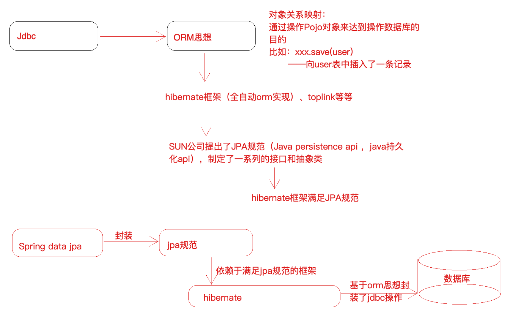
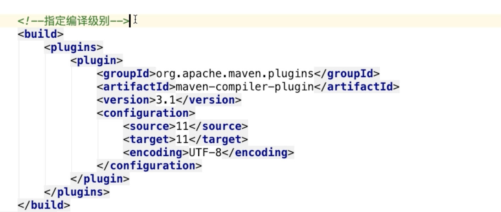

SpringDataJpa

JPA 是一套规范，内部是由接口和抽象类组成的，Hiberanate 是一套成熟的 ORM 框架，而且 Hiberanate 实现了 JPA 规范，所以可以称 Hiberanate 为 JPA 的一种实现方式，我们使用 JPA 的 API 编 程，意味着站在更高的⻆度去看待问题(面向接口编程)。

Spring Data JPA 是 Spring 提供的一套对 JPA 操作更加高级的封装，是在 JPA 规范下的专⻔用来进行数 据持久化的解决方案。

指定maven编译级别

