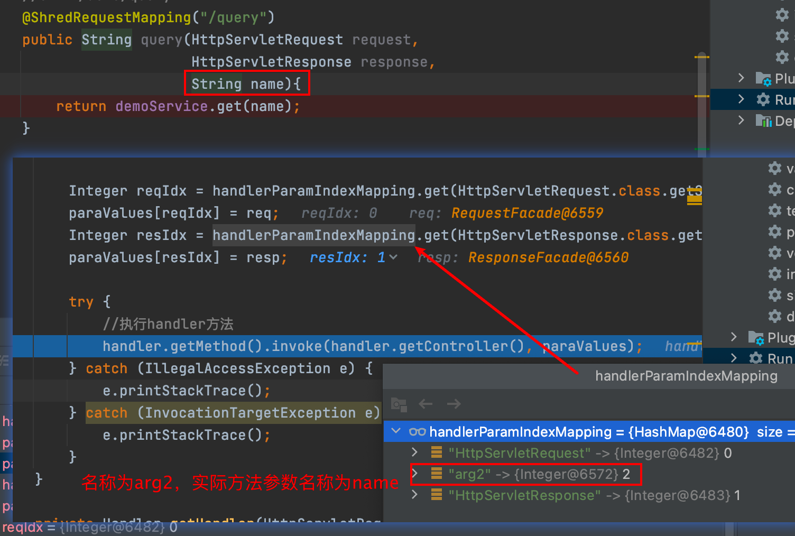

## 参数名称不对



java编译时自动将方法的参数名称以arg开头，位置作为后缀，如arg0,arg1....命名。

解决方法：传入编译参数-parameters，告诉编译器，编译时记录下形参的真实名称

```xml
<build>
    <plugins>
        <!--定义编译细节-->
        <plugin>
            <groupId>org.apache.maven.plugins</groupId>
            <artifactId>maven-compiler-plugin</artifactId>
            <version>3.1</version>
            <configuration>
                <source>11</source>
                <target>11</target>
                <encoding>UTF-8</encoding>
                <!--告诉编译器，编译时记录下形参的真实名称-->
                <compilerArgs>
                    <arg>-parameters</arg>
                </compilerArgs>
            </configuration>
        </plugin>
```

