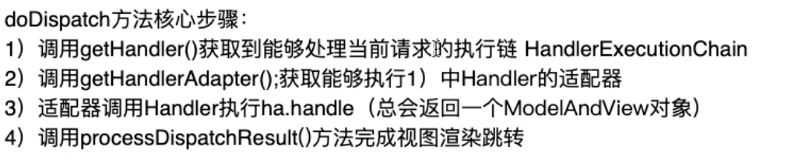
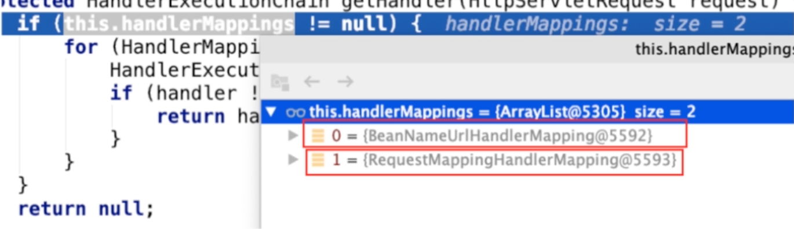
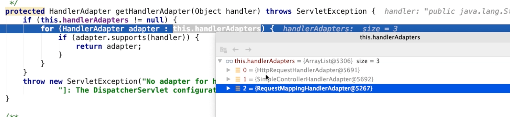

## DispatcherServlet继承结构

```java
public class DispatcherServlet extends FrameworkServlet {
}

	public abstract class FrameworkServlet extends HttpServletBean implements ApplicationContextAware {
}

		public abstract class HttpServletBean extends HttpServlet implements EnvironmentCapable, EnvironmentAware {
}

			public abstract class HttpServlet extends GenericServlet{}
```

FrameworkServlet

FrameworkServlet中的doGet和doPost都调用了processRequest，其中调用了抽象方法doService，由子类实现

```java
protected abstract void doService(HttpServletRequest request, HttpServletResponse response)
			throws Exception;

protected final void processRequest(HttpServletRequest request, HttpServletResponse response)
      throws ServletException, IOException {

   long startTime = System.currentTimeMillis();
   Throwable failureCause = null;

   LocaleContext previousLocaleContext = LocaleContextHolder.getLocaleContext();
   LocaleContext localeContext = buildLocaleContext(request);

   //获取上一个请求保存的 RequestAttributes
   RequestAttributes previousAttributes = RequestContextHolder.getRequestAttributes();
   // 建立新的 RequestAttributes
   ServletRequestAttributes requestAttributes = buildRequestAttributes(request, response, previousAttributes);

   // 异步请求
   WebAsyncManager asyncManager = WebAsyncUtils.getAsyncManager(request);
   asyncManager.registerCallableInterceptor(FrameworkServlet.class.getName(), new RequestBindingInterceptor());
   // 新的 RequestAttributes 设置到 LocalThread
   initContextHolders(request, localeContext, requestAttributes);

   try {
      doService(request, response);
   }
   catch (ServletException | IOException ex) {
      failureCause = ex;
      throw ex;
   }
   catch (Throwable ex) {
      failureCause = ex;
      throw new NestedServletException("Request processing failed", ex);
   }

   finally {
      resetContextHolders(request, previousLocaleContext, previousAttributes);
      if (requestAttributes != null) {
         requestAttributes.requestCompleted();
      }
      logResult(request, response, failureCause, asyncManager);
      publishRequestHandledEvent(request, response, startTime, failureCause);
   }
}
```


DispatcherServlet

doService中调用了doDispatch(request, response);


## doDispatch核心步骤：

1、getHandler() 获取处理当前请求的执行链 HandlerExecutionChain

2、getHandlerAdapter() 获取能够执行1中handler的适配器

3、适配器Handler 执行ha.handle() 总会返回一个ModelAndView对象

4、processDispatchResult() 完成视图渲染 跳转




### getHandler

遍历 

```java
protected HandlerExecutionChain getHandler(HttpServletRequest request) throws Exception {
   if (this.handlerMappings != null) {
      for (HandlerMapping mapping : this.handlerMappings) {
         HandlerExecutionChain handler = mapping.getHandler(request);
         if (handler != null) {
            return handler;
         }
      }
   }
   return null;
}
```



BeanNameUrlhandlerMapping是早期Springmvc处理方式。不管。


### getHandlerAdapter

```java
protected HandlerAdapter getHandlerAdapter(Object handler) throws ServletException {
   if (this.handlerAdapters != null) {
      for (HandlerAdapter adapter : this.handlerAdapters) {
         if (adapter.supports(handler)) {
            return adapter;
         }
      }
   }
   throw new ServletException("No adapter for handler [" + handler +
         "]: The DispatcherServlet configuration needs to include a HandlerAdapter that supports this handler");
}
```




#### support

```java
public abstract class AbstractHandlerMethodAdapter extends WebContentGenerator implements HandlerAdapter, Ordered {

    @Override
    public final boolean supports(Object handler) {
       return (handler instanceof HandlerMethod && supportsInternal((HandlerMethod) handler));
    }
  
}
```


## SpringMVC九大组件

```java
/** MultipartResolver used by this servlet. */
	//多部件解析器
	@Nullable
	private MultipartResolver multipartResolver;

	/** LocaleResolver used by this servlet. */
	//国际化
	@Nullable
	private LocaleResolver localeResolver;

	/** ThemeResolver used by this servlet. */
	//主题
	@Nullable
	private ThemeResolver themeResolver;

	/** List of HandlerMappings used by this servlet. */
	// 处理器映射器
	@Nullable
	private List<HandlerMapping> handlerMappings;

	/** List of HandlerAdapters used by this servlet. */
	// 处理器适配器
	@Nullable
	private List<HandlerAdapter> handlerAdapters;

	/** List of HandlerExceptionResolvers used by this servlet. */
	// 异常解析器
	@Nullable
	private List<HandlerExceptionResolver> handlerExceptionResolvers;

	/** RequestToViewNameTranslator used by this servlet. */
	// 默认视图名转换器
	@Nullable
	private RequestToViewNameTranslator viewNameTranslator;

	/** FlashMapManager used by this servlet. */
	// flash属性管理组件
	@Nullable
	private FlashMapManager flashMapManager;

	/** List of ViewResolvers used by this servlet. */
	// 视图解析器
	@Nullable
	private List<ViewResolver> viewResolvers;
```

九大组件都定义了接口，定义了规范


## 初始化细节

Spring容器启动时在核心方法中调用了org.springframework.context.support.AbstractApplicationContext#refresh刷新方法中，调用了onRefresh() ，由子类实现

### onRefresh

调用了 initStrategies(context); 初始化9大部件

```java
@Override
protected void onRefresh(ApplicationContext context) {
   initStrategies(context);
}

// 初始化了9个部件
	protected void initStrategies(ApplicationContext context) {
		initMultipartResolver(context);
		initLocaleResolver(context);
		initThemeResolver(context);
		initHandlerMappings(context);
		initHandlerAdapters(context);
		initHandlerExceptionResolvers(context);
		initRequestToViewNameTranslator(context);
		initViewResolvers(context);
		initFlashMapManager(context);
	}
```

### 部件初始化套路

#### initHandlerMappings

```java
private void initHandlerMappings(ApplicationContext context) {
   this.handlerMappings = null;

   if (this.detectAllHandlerMappings) {
      // Find all HandlerMappings in the ApplicationContext, including ancestor contexts.
      // 按HandlerMapping.class类型 找到ioc容器中所有的HandlerMapping
      Map<String, HandlerMapping> matchingBeans =
            BeanFactoryUtils.beansOfTypeIncludingAncestors(context, HandlerMapping.class, true, false);
      if (!matchingBeans.isEmpty()) {
         this.handlerMappings = new ArrayList<>(matchingBeans.values());
         // We keep HandlerMappings in sorted order.
         AnnotationAwareOrderComparator.sort(this.handlerMappings);
      }
   }
   else {
      try {
         // 否则在ioc容器中按固定的名称 handlerMapping 去找
         HandlerMapping hm = context.getBean(HANDLER_MAPPING_BEAN_NAME, HandlerMapping.class);
         this.handlerMappings = Collections.singletonList(hm);
      }
      catch (NoSuchBeanDefinitionException ex) {
         // Ignore, we'll add a default HandlerMapping later.
      }
   }

   // Ensure we have at least one HandlerMapping, by registering
   // a default HandlerMapping if no other mappings are found.
   // 最后还是空 就按默认策略生成
   if (this.handlerMappings == null) {
      this.handlerMappings = getDefaultStrategies(context, HandlerMapping.class);
      if (logger.isTraceEnabled()) {
         logger.trace("No HandlerMappings declared for servlet '" + getServletName() +
               "': using default strategies from DispatcherServlet.properties");
      }
   }
}
```


#### getDefaultStrategies

DispatcherServlet.properties配置文件中获取

```properties
org.springframework.web.servlet.HandlerMapping=org.springframework.web.servlet.handler.BeanNameUrlHandlerMapping,\
   org.springframework.web.servlet.mvc.method.annotation.RequestMappingHandlerMapping
```

```java
protected <T> List<T> getDefaultStrategies(ApplicationContext context, Class<T> strategyInterface) {
   String key = strategyInterface.getName();
   String value = defaultStrategies.getProperty(key);
   if (value != null) {
      String[] classNames = StringUtils.commaDelimitedListToStringArray(value);
      List<T> strategies = new ArrayList<>(classNames.length);
      for (String className : classNames) {
         try {
            Class<?> clazz = ClassUtils.forName(className, DispatcherServlet.class.getClassLoader());
            Object strategy = createDefaultStrategy(context, clazz);
            strategies.add((T) strategy);
         }
         catch (ClassNotFoundException ex) {
            throw new BeanInitializationException(
                  "Could not find DispatcherServlet's default strategy class [" + className +
                  "] for interface [" + key + "]", ex);
         }
         catch (LinkageError err) {
            throw new BeanInitializationException(
                  "Unresolvable class definition for DispatcherServlet's default strategy class [" +
                  className + "] for interface [" + key + "]", err);
         }
      }
      return strategies;
   }
   else {
      return new LinkedList<>();
   }
}
```


注意，**多部件解析器** 是直接按照id `multipartResolver`去找的。


### handler方法执行细节

AbstractHandlerMethodAdapter#handle

```java
//org.springframework.web.servlet.mvc.method.AbstractHandlerMethodAdapter#handle
@Override
@Nullable
public final ModelAndView handle(HttpServletRequest request, HttpServletResponse response, Object handler)
      throws Exception {

   return handleInternal(request, response, (HandlerMethod) handler);
}
```

#### handleInternal

RequestMappingHandlerAdapter#invokeHandlerMethod

```java
//org.springframework.web.servlet.mvc.method.annotation.RequestMappingHandlerAdapter#invokeHandlerMethod
@Override
protected ModelAndView handleInternal(HttpServletRequest request,
      HttpServletResponse response, HandlerMethod handlerMethod) throws Exception {

   ModelAndView mav;
   checkRequest(request);

   // Execute invokeHandlerMethod in synchronized block if required.
   if (this.synchronizeOnSession) {
      HttpSession session = request.getSession(false);
      if (session != null) {
         Object mutex = WebUtils.getSessionMutex(session);
         synchronized (mutex) {
            mav = invokeHandlerMethod(request, response, handlerMethod);
         }
      }
      else {
         // No HttpSession available -> no mutex necessary
         mav = invokeHandlerMethod(request, response, handlerMethod);
      }
   }
   else {
      // No synchronization on session demanded at all...
      mav = invokeHandlerMethod(request, response, handlerMethod);
   }

   if (!response.containsHeader(HEADER_CACHE_CONTROL)) {
      if (getSessionAttributesHandler(handlerMethod).hasSessionAttributes()) {
         applyCacheSeconds(response, this.cacheSecondsForSessionAttributeHandlers);
      }
      else {
         prepareResponse(response);
      }
   }

   return mav;
}
```


#### invokeHandlerMethod

```java
protected ModelAndView invokeHandlerMethod(HttpServletRequest request,
      HttpServletResponse response, HandlerMethod handlerMethod) throws Exception {

   ServletWebRequest webRequest = new ServletWebRequest(request, response);
   try {
      // 获取容器中全局配置的InitBinder和当前HandlerMethod所对应的Controller中配置的InitBinder，用于进行参数的绑定
      WebDataBinderFactory binderFactory = getDataBinderFactory(handlerMethod);
      // 获取容器中全局配置的 ModelAttribute 和当前HandlerMethod所对应的Controller中配置的 ModelAttribute，这些方法将在目标方法调用之前进行绑定
      ModelFactory modelFactory = getModelFactory(handlerMethod, binderFactory);

      // 将 handlerMethod 封装成 ServletInvocableHandlerMethod
      ServletInvocableHandlerMethod invocableMethod = createInvocableHandlerMethod(handlerMethod);
      if (this.argumentResolvers != null) {
         // 设置配置的 ArgumentResolver
         invocableMethod.setHandlerMethodArgumentResolvers(this.argumentResolvers);
      }
      if (this.returnValueHandlers != null) {
         // 设置配置的 ReturnValueHandler
         invocableMethod.setHandlerMethodReturnValueHandlers(this.returnValueHandlers);
      }
      // 设置前面创建的 binderFactory
      invocableMethod.setDataBinderFactory(binderFactory);
      invocableMethod.setParameterNameDiscoverer(this.parameterNameDiscoverer);

      ModelAndViewContainer mavContainer = new ModelAndViewContainer();
      mavContainer.addAllAttributes(RequestContextUtils.getInputFlashMap(request));
      // 主要作用是 调用前面获取到的 @ModelAttribute 标注的方法
      // 从而 保证这些方法在 目标Handler 调用前被调用
      modelFactory.initModel(webRequest, mavContainer, invocableMethod);
      mavContainer.setIgnoreDefaultModelOnRedirect(this.ignoreDefaultModelOnRedirect);

      AsyncWebRequest asyncWebRequest = WebAsyncUtils.createAsyncWebRequest(request, response);
      asyncWebRequest.setTimeout(this.asyncRequestTimeout);

      WebAsyncManager asyncManager = WebAsyncUtils.getAsyncManager(request);
      asyncManager.setTaskExecutor(this.taskExecutor);
      asyncManager.setAsyncWebRequest(asyncWebRequest);
      asyncManager.registerCallableInterceptors(this.callableInterceptors);
      asyncManager.registerDeferredResultInterceptors(this.deferredResultInterceptors);

      if (asyncManager.hasConcurrentResult()) {
         Object result = asyncManager.getConcurrentResult();
         mavContainer = (ModelAndViewContainer) asyncManager.getConcurrentResultContext()[0];
         asyncManager.clearConcurrentResult();
         LogFormatUtils.traceDebug(logger, traceOn -> {
            String formatted = LogFormatUtils.formatValue(result, !traceOn);
            return "Resume with async result [" + formatted + "]";
         });
         invocableMethod = invocableMethod.wrapConcurrentResult(result);
      }

      // 处理请求参数，调用目标HandlerMethod，将返回值封装成 ModelAndView 对象
      invocableMethod.invokeAndHandle(webRequest, mavContainer);
      if (asyncManager.isConcurrentHandlingStarted()) {
         return null;
      }

      // 处理封装的ModelAndView 主要判断了当前请求是否重定向，若是，则将FlashAttributes封装到新的请求中
      return getModelAndView(mavContainer, modelFactory, webRequest);
   }
   finally {
      webRequest.requestCompleted();
   }
}
```


#### invokeAndHandle

ServletInvocableHandlerMethod#invokeAndHandle

```
//org.springframework.web.servlet.mvc.method.annotation.ServletInvocableHandlerMethod#invokeAndHandle
public void invokeAndHandle(ServletWebRequest webRequest, ModelAndViewContainer mavContainer,
      Object... providedArgs) throws Exception {

   // 对目标handler参数进行处理，并调用目标handler
   Object returnValue = invokeForRequest(webRequest, mavContainer, providedArgs);
   // 设置相关返回状态
   setResponseStatus(webRequest);

   if (returnValue == null) {
      if (isRequestNotModified(webRequest) || getResponseStatus() != null || mavContainer.isRequestHandled()) {
         disableContentCachingIfNecessary(webRequest);
         mavContainer.setRequestHandled(true);
         return;
      }
   }
   else if (StringUtils.hasText(getResponseStatusReason())) {
      mavContainer.setRequestHandled(true);
      return;
   }

   mavContainer.setRequestHandled(false);
   Assert.state(this.returnValueHandlers != null, "No return value handlers");
   try {
      this.returnValueHandlers.handleReturnValue(
            returnValue, getReturnValueType(returnValue), mavContainer, webRequest);
   }
   catch (Exception ex) {
      if (logger.isTraceEnabled()) {
         logger.trace(formatErrorForReturnValue(returnValue), ex);
      }
      throw ex;
   }
}
```

#### invokeForRequest

```java
public Object invokeForRequest(NativeWebRequest request, @Nullable ModelAndViewContainer mavContainer,
      Object... providedArgs) throws Exception {

   // 将request参数 转换成当前handler对参数形式
   Object[] args = getMethodArgumentValues(request, mavContainer, providedArgs);
   if (logger.isTraceEnabled()) {
      logger.trace("Arguments: " + Arrays.toString(args));
   }
   // 使用处理后的参数 调用目标handle
   return doInvoke(args);
}
```


#### doInvoke

```java
@Nullable
protected Object doInvoke(Object... args) throws Exception {
   ReflectionUtils.makeAccessible(getBridgedMethod());
   try {
      return getBridgedMethod().invoke(getBean(), args);
   }
   catch (IllegalArgumentException ex) {
      assertTargetBean(getBridgedMethod(), getBean(), args);
      String text = (ex.getMessage() != null ? ex.getMessage() : "Illegal argument");
      throw new IllegalStateException(formatInvokeError(text, args), ex);
   }
   catch (InvocationTargetException ex) {
      // Unwrap for HandlerExceptionResolvers ...
      Throwable targetException = ex.getTargetException();
      if (targetException instanceof RuntimeException) {
         throw (RuntimeException) targetException;
      }
      else if (targetException instanceof Error) {
         throw (Error) targetException;
      }
      else if (targetException instanceof Exception) {
         throw (Exception) targetException;
      }
      else {
         throw new IllegalStateException(formatInvokeError("Invocation failure", args), targetException);
      }
   }
}
```


#### getMethodArgumentValues

```java
protected Object[] getMethodArgumentValues(NativeWebRequest request, @Nullable ModelAndViewContainer mavContainer,
      Object... providedArgs) throws Exception {

   // 获取当前handler所声明的所有参数，包括参数名、类型、位置、标注的注解等
   MethodParameter[] parameters = getMethodParameters();
   if (ObjectUtils.isEmpty(parameters)) {
      return EMPTY_ARGS;
   }

   Object[] args = new Object[parameters.length];
   for (int i = 0; i < parameters.length; i++) {
      MethodParameter parameter = parameters[i];
      parameter.initParameterNameDiscovery(this.parameterNameDiscoverer);
      // 判断调用方提供的参数中 是否有当前类型，若有，则直接使用该参数值，
      args[i] = findProvidedArgument(parameter, providedArgs);
      if (args[i] != null) {
         continue;
      }
      // 若调用方提供的参数找不到当前类型 的参数，则遍历Spring容器中所有ArgumentResolver，判断支持当前类型的resolver
      if (!this.resolvers.supportsParameter(parameter)) {
         throw new IllegalStateException(formatArgumentError(parameter, "No suitable resolver"));
      }
      try {
         args[i] = this.resolvers.resolveArgument(parameter, mavContainer, request, this.dataBinderFactory);
      }
      catch (Exception ex) {
         // Leave stack trace for later, exception may actually be resolved and handled...
         if (logger.isDebugEnabled()) {
            String exMsg = ex.getMessage();
            if (exMsg != null && !exMsg.contains(parameter.getExecutable().toGenericString())) {
               logger.debug(formatArgumentError(parameter, exMsg));
            }
         }
         throw ex;
      }
   }
   return args;
}
```


### 跳转页面，渲染视图

#### processDispatchResult

```java
private void processDispatchResult(HttpServletRequest request, HttpServletResponse response,
      @Nullable HandlerExecutionChain mappedHandler, @Nullable ModelAndView mv,
      @Nullable Exception exception) throws Exception {

   boolean errorView = false;

   if (exception != null) {
      if (exception instanceof ModelAndViewDefiningException) {
         logger.debug("ModelAndViewDefiningException encountered", exception);
         mv = ((ModelAndViewDefiningException) exception).getModelAndView();
      }
      else {
         Object handler = (mappedHandler != null ? mappedHandler.getHandler() : null);
         mv = processHandlerException(request, response, handler, exception);
         errorView = (mv != null);
      }
   }

   // Did the handler return a view to render?
   if (mv != null && !mv.wasCleared()) {
      render(mv, request, response);
      if (errorView) {
         WebUtils.clearErrorRequestAttributes(request);
      }
   }
   else {
      if (logger.isTraceEnabled()) {
         logger.trace("No view rendering, null ModelAndView returned.");
      }
   }

   if (WebAsyncUtils.getAsyncManager(request).isConcurrentHandlingStarted()) {
      // Concurrent handling started during a forward
      return;
   }

   if (mappedHandler != null) {
      mappedHandler.triggerAfterCompletion(request, response, null);
   }
}
```

#### render

```java
protected void render(ModelAndView mv, HttpServletRequest request, HttpServletResponse response) throws Exception {
   // Determine locale for request and apply it to the response.
   Locale locale =
         (this.localeResolver != null ? this.localeResolver.resolveLocale(request) : request.getLocale());
   response.setLocale(locale);

   View view;
   String viewName = mv.getViewName();
   if (viewName != null) {
      // We need to resolve the view name.
      view = resolveViewName(viewName, mv.getModelInternal(), locale, request);
      if (view == null) {
         throw new ServletException("Could not resolve view with name '" + mv.getViewName() +
               "' in servlet with name '" + getServletName() + "'");
      }
   }
   else {
      // No need to lookup: the ModelAndView object contains the actual View object.
      view = mv.getView();
      if (view == null) {
         throw new ServletException("ModelAndView [" + mv + "] neither contains a view name nor a " +
               "View object in servlet with name '" + getServletName() + "'");
      }
   }

   // Delegate to the View object for rendering.
   if (logger.isTraceEnabled()) {
      logger.trace("Rendering view [" + view + "] ");
   }
   try {
      if (mv.getStatus() != null) {
         response.setStatus(mv.getStatus().value());
      }
      view.render(mv.getModelInternal(), request, response);
   }
   catch (Exception ex) {
      if (logger.isDebugEnabled()) {
         logger.debug("Error rendering view [" + view + "]", ex);
      }
      throw ex;
   }
}
```


#### resolveViewName

```java
protected View resolveViewName(String viewName, @Nullable Map<String, Object> model,
      Locale locale, HttpServletRequest request) throws Exception {

   if (this.viewResolvers != null) {
      for (ViewResolver viewResolver : this.viewResolvers) {
         View view = viewResolver.resolveViewName(viewName, locale);
         if (view != null) {
            return view;
         }
      }
   }
   return null;
}
```


#### resolveViewName

##### AbstractCachingViewResolver#resolveViewName

```java
//org.springframework.web.servlet.view.AbstractCachingViewResolver#resolveViewName
public View resolveViewName(String viewName, Locale locale) throws Exception {
   if (!isCache()) {
      return createView(viewName, locale);
   }
   else {
      Object cacheKey = getCacheKey(viewName, locale);
      View view = this.viewAccessCache.get(cacheKey);
      if (view == null) {
         synchronized (this.viewCreationCache) {
            view = this.viewCreationCache.get(cacheKey);
            if (view == null) {
               // Ask the subclass to create the View object.
               view = createView(viewName, locale);
               if (view == null && this.cacheUnresolved) {
                  view = UNRESOLVED_VIEW;
               }
               if (view != null) {
                  this.viewAccessCache.put(cacheKey, view);
                  this.viewCreationCache.put(cacheKey, view);
               }
            }
         }
      }
      else {
         if (logger.isTraceEnabled()) {
            logger.trace(formatKey(cacheKey) + "served from cache");
         }
      }
      return (view != UNRESOLVED_VIEW ? view : null);
   }
}
```

#### createView

调用了模板方法loadView，由子类实现

```
protected View createView(String viewName, Locale locale) throws Exception {
   return loadView(viewName, locale);
}
```

##### UrlBasedViewResolver#createView

```java
//org.springframework.web.servlet.view.UrlBasedViewResolver#createView
protected View createView(String viewName, Locale locale) throws Exception {
   // If this resolver is not supposed to handle the given view,
   // return null to pass on to the next resolver in the chain.
   if (!canHandle(viewName, locale)) {
      return null;
   }

   // Check for special "redirect:" prefix.
   if (viewName.startsWith(REDIRECT_URL_PREFIX)) {
      String redirectUrl = viewName.substring(REDIRECT_URL_PREFIX.length());
      RedirectView view = new RedirectView(redirectUrl,
            isRedirectContextRelative(), isRedirectHttp10Compatible());
      String[] hosts = getRedirectHosts();
      if (hosts != null) {
         view.setHosts(hosts);
      }
      return applyLifecycleMethods(REDIRECT_URL_PREFIX, view);
   }

   // Check for special "forward:" prefix.
   if (viewName.startsWith(FORWARD_URL_PREFIX)) {
      String forwardUrl = viewName.substring(FORWARD_URL_PREFIX.length());
      InternalResourceView view = new InternalResourceView(forwardUrl);
      return applyLifecycleMethods(FORWARD_URL_PREFIX, view);
   }

   // Else fall back to superclass implementation: calling loadView.
   return super.createView(viewName, locale);
}
```

#### loadView

##### UrlBasedViewResolver#loadView

```java
//org.springframework.web.servlet.view.UrlBasedViewResolver#loadView
protected View loadView(String viewName, Locale locale) throws Exception {
   AbstractUrlBasedView view = buildView(viewName);
   View result = applyLifecycleMethods(viewName, view);
   return (view.checkResource(locale) ? result : null);
}
```

#### buildView

```java
protected AbstractUrlBasedView buildView(String viewName) throws Exception {
   Class<?> viewClass = getViewClass();
   Assert.state(viewClass != null, "No view class");

   AbstractUrlBasedView view = (AbstractUrlBasedView) BeanUtils.instantiateClass(viewClass);
   view.setUrl(getPrefix() + viewName + getSuffix());

   String contentType = getContentType();
   if (contentType != null) {
      view.setContentType(contentType);
   }

   view.setRequestContextAttribute(getRequestContextAttribute());
   view.setAttributesMap(getAttributesMap());

   Boolean exposePathVariables = getExposePathVariables();
   if (exposePathVariables != null) {
      view.setExposePathVariables(exposePathVariables);
   }
   Boolean exposeContextBeansAsAttributes = getExposeContextBeansAsAttributes();
   if (exposeContextBeansAsAttributes != null) {
      view.setExposeContextBeansAsAttributes(exposeContextBeansAsAttributes);
   }
   String[] exposedContextBeanNames = getExposedContextBeanNames();
   if (exposedContextBeanNames != null) {
      view.setExposedContextBeanNames(exposedContextBeanNames);
   }

   return view;
}
```

 

返回之后，执行DispatcherServlet中 render后面的逻辑

```
view.render(mv.getModelInternal(), request, response);
```

#### view.render

##### AbstractView#render

```java
//org.springframework.web.servlet.view.AbstractView#render
public void render(@Nullable Map<String, ?> model, HttpServletRequest request,
      HttpServletResponse response) throws Exception {

   if (logger.isDebugEnabled()) {
      logger.debug("View " + formatViewName() +
            ", model " + (model != null ? model : Collections.emptyMap()) +
            (this.staticAttributes.isEmpty() ? "" : ", static attributes " + this.staticAttributes));
   }

   Map<String, Object> mergedModel = createMergedOutputModel(model, request, response);
   prepareResponse(request, response);
  		// 数据渲染，将数据塞入视图
   renderMergedOutputModel(mergedModel, getRequestToExpose(request), response);
}
```

#### renderMergedOutputModel

##### InternalResourceView#renderMergedOutputModel

```java
//org.springframework.web.servlet.view.InternalResourceView#renderMergedOutputModel
@Override
protected void renderMergedOutputModel(
      Map<String, Object> model, HttpServletRequest request, HttpServletResponse response) throws Exception {

   // Expose the model object as request attributes.
   // 把model中的数据暴露到requestScope中，jsp中就可以直接获取
   exposeModelAsRequestAttributes(model, request);

   // Expose helpers as request attributes, if any.
   exposeHelpers(request);

   // Determine the path for the request dispatcher.
   String dispatcherPath = prepareForRendering(request, response);

   // Obtain a RequestDispatcher for the target resource (typically a JSP).
   // 获取原生的 请求分发 javax.servlet.RequestDispatcher 对象
   RequestDispatcher rd = getRequestDispatcher(request, dispatcherPath);
   if (rd == null) {
      throw new ServletException("Could not get RequestDispatcher for [" + getUrl() +
            "]: Check that the corresponding file exists within your web application archive!");
   }

   // If already included or response already committed, perform include, else forward.
   if (useInclude(request, response)) {
      response.setContentType(getContentType());
      if (logger.isDebugEnabled()) {
         logger.debug("Including [" + getUrl() + "]");
      }
      rd.include(request, response);
   }

   else {
      // Note: The forwarded resource is supposed to determine the content type itself.
      if (logger.isDebugEnabled()) {
         logger.debug("Forwarding to [" + getUrl() + "]");
      }
      rd.forward(request, response);
   }
}
```


#### exposeModelAsRequestAttributes

```java
//org.springframework.web.servlet.view.AbstractView#exposeModelAsRequestAttributes
protected void exposeModelAsRequestAttributes(Map<String, Object> model,
      HttpServletRequest request) throws Exception {

   model.forEach((name, value) -> {
      if (value != null) {
         request.setAttribute(name, value);
      }
      else {
         request.removeAttribute(name);
      }
   });
}
```