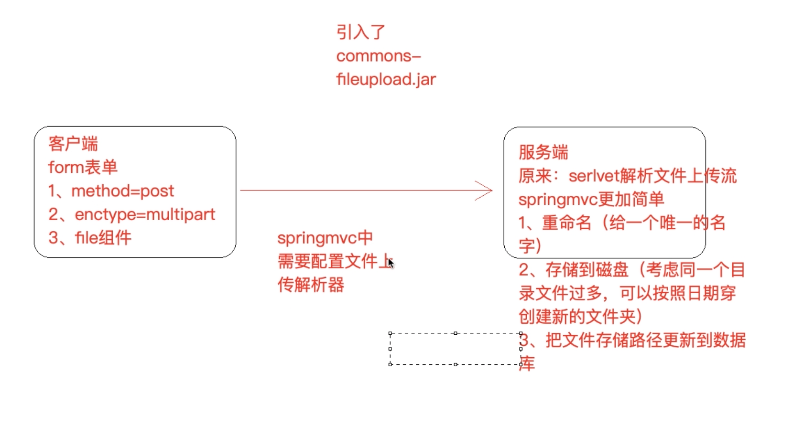

# SpringMVC简介

SpringMVC已成为目前最主流的MVC框架之一。

通过一套注解，让java类成为请求控制器，无需实现任何接口，能够处理请求。同时还支持RESTful编程风格请求。

SpringMVC是对servlet的封装，简化了servlet的开发
作用： 1、接受请求。  2、返回响应，跳转页面。


什么是mvc？


### SpringMVC工作流程


#### 开发过程

1)配置DispatcherServlet前端控制器 
2)开发处理具体业务逻辑的Handler(@Controller、@RequestMapping)
3)xml配置文件配置controller扫描，配置springmvc三大件 
4)将xml文件路径告诉springmvc(DispatcherServlet)

- Springmvc.xml

```xml
<?xml version="1.0" encoding="UTF-8"?>
<beans xmlns="http://www.springframework.org/schema/beans"
       xmlns:xsi="http://www.w3.org/2001/XMLSchema-instance"
       xmlns:context="http://www.springframework.org/schema/context"
       xmlns:mvc="http://www.springframework.org/schema/mvc"
       xsi:schemaLocation="http://www.springframework.org/schema/beans
        https://www.springframework.org/schema/beans/spring-beans.xsd
      http://www.springframework.org/schema/context
        https://www.springframework.org/schema/context/spring-context.xsd
           http://www.springframework.org/schema/mvc
        https://www.springframework.org/schema/mvc/spring-mvc.xsd
       "
>
    <!--开启controller扫描-->
    <context:component-scan base-package="com.shred.springmvc"/>

    <!--配置mvc视图解析器-->
    <bean class="org.springframework.web.servlet.view.InternalResourceViewResolver">
        <property name="prefix" value="/WEB-INF/jsp/"/>
        <property name="suffix" value=".jsp"/>
    </bean>

    <!--
        处理器映射器，处理器适配器
            - 可以手动配置，注入指定的bean
            - 也可以开启mvc的注解，通过注解自动注册最合适的处理器bean
    -->
    <mvc:annotation-driven/>
</beans>
```

- web.xml

```xml
<!DOCTYPE web-app PUBLIC
 "-//Sun Microsystems, Inc.//DTD Web Application 2.3//EN"
 "http://java.sun.com/dtd/web-app_2_3.dtd" >

<web-app>
  <display-name>Archetype Created Web Application</display-name>

  <servlet>
    <servlet-name>springmvc</servlet-name>
    <!--spring mvc 前端控制的-->
    <servlet-class>org.springframework.web.servlet.DispatcherServlet</servlet-class>

    <!--指定配置文件的路径-->
    <init-param>
      <param-name>contextConfigLocation</param-name>
      <param-value>classpath:springmvc.xml</param-value>
    </init-param>

  </servlet>
  
  <servlet-mapping>
    <servlet-name>springmvc</servlet-name>
    <!--
    方式一：带后缀 *.action *.do
    方式二：/
    方式三：/*拦截所有，包括jsp
    -->
    <url-pattern>/</url-pattern>
  </servlet-mapping>
</web-app>
```


# SpringMVC工作流程

## 

流程说明

第一步:用户发送请求至前端控制器DispatcherServlet 第二步:DispatcherServlet收到请求调用HandlerMapping处理器映射器

第三步:处理器映射器根据请求Url找到具体的Handler(后端控制器)，生成处理器对象及处理器拦截 器(如果 有则生成)一并返回DispatcherServlet

第四步:DispatcherServlet调用HandlerAdapter处理器适配器去调用Handler

第五步:处理器适配器执行Handler

第六步:Handler执行完成给处理器适配器返回ModelAndView

第七步:处理器适配器向前端控制器返回 ModelAndView，ModelAndView 是SpringMVC 框架的一个 底层对 象，包括 Model 和 View

第八步:前端控制器请求视图解析器去进行视图解析，根据逻辑视图名来解析真正的视图。 第九步:视图解析器向前端控制器返回View
 第十步:前端控制器进行视图渲染，就是将模型数据(在 ModelAndView 对象中)填充到 request 域 第十一步:前端控制器向用户响应结果


## **2.2 Spring MVC** 九大组件

###  HandlerMapping(处理器映射器)

HandlerMapping 是用来查找 Handler 的，也就是处理器，具体的表现形式可以是类，也可以是 方法。比如，标注了@RequestMapping的每个方法都可以看成是一个Handler。Handler负责具 体实际的请求处理，在请求到达后，HandlerMapping 的作用便是找到请求相应的处理器 Handler 和 Interceptor.

### HandlerAdapter(处理器适配器)

HandlerAdapter 是一个适配器。因为 Spring MVC 中 Handler 可以是任意形式的，只要能处理请 求即可。但是把请求交给 Servlet 的时候，由于 Servlet 的方法结构都是 doService(HttpServletRequest req,HttpServletResponse resp)形式的，要让固定的 Servlet 处理 方法调用 Handler 来进行处理，便是 HandlerAdapter 的职责。

```java
//不同的mapping可以是不同形式。一个具体的表现就是参数也以不一样，HandlerAdapter赋值适配不同的请求，让固定的 Servlet 处理
@RequestMapping("/handle01")
public ModelAndView handle01(String aaa){
    ModelAndView modelAndView = new ModelAndView();
    return modelAndView;
}
```

### HandlerExceptionResolver

HandlerExceptionResolver 用于处理 Handler 产生的异常情况。它的作用是根据异常设置
ModelAndView，之后交给渲染方法进行渲染，渲染方法会将 ModelAndView 渲染成⻚面。 

### ViewResolver

ViewResolver即视图解析器，用于将String类型的视图名和Locale解析为View类型的视图，只有一 个resolveViewName()方法。从方法的定义可以看出，Controller层返回的String类型视图名 viewName 最终会在这里被解析成为View。View是用来渲染⻚面的，也就是说，它会将程序返回 的参数和数据填入模板中，生成html文件。ViewResolver 在这个过程主要完成两件事情: ViewResolver 找到渲染所用的模板(第一件大事)和所用的技术(第二件大事，其实也就是找到 视图的类型，如JSP)并填入参数。默认情况下，Spring MVC会自动为我们配置一个 InternalResourceViewResolver,是针对 JSP 类型视图的。

### RequestToViewNameTranslator

RequestToViewNameTranslator 组件的作用是从请求中获取 ViewName.因为 ViewResolver 根据 ViewName 查找 View，但有的 Handler 处理完成之后,没有设置 View，也没有设置 ViewName， 便要通过这个组件从请求中查找 ViewName。

### LocaleResolver

ViewResolver 组件的 resolveViewName 方法需要两个参数，一个是视图名，一个是 Locale。 LocaleResolver 用于从请求中解析出 Locale，比如中国 Locale 是 zh-CN，用来表示一个区域。这 个组件也是 i18n 的基础。

### ThemeResolver

ThemeResolver 组件是用来解析主题的。主题是样式、图片及它们所形成的显示效果的集合。 Spring MVC 中一套主题对应一个 properties文件，里面存放着与当前主题相关的所有资源，如图 片、CSS样式等。创建主题非常简单，只需准备好资源，然后新建一个“主题名.properties”并将资 源设置进去，放在classpath下，之后便可以在⻚面中使用了。SpringMVC中与主题相关的类有 ThemeResolver、ThemeSource和Theme。ThemeResolver负责从请求中解析出主题名， ThemeSource根据主题名找到具体的主题，其抽象也就是Theme，可以通过Theme来获取主题和 具体的资源。

### MultipartResolver

MultipartResolver 用于上传请求，通过将普通的请求包装成 MultipartHttpServletRequest 来实 现。MultipartHttpServletRequest 可以通过 getFile() 方法 直接获得文件。如果上传多个文件，还 可以调用 getFileMap()方法得到Map<FileName，File>这样的结构，MultipartResolver 的作用就 是封装普通的请求，使其拥有文件上传的功能。

### FlashMapManager

FlashMap 用于重定向时的参数传递，比如在处理用户订单时候，为了避免重复提交，可以处理完 post请求之后重定向到一个get请求，这个get请求可以用来显示订单详情之类的信息。这样做虽然 可以规避用户重新提交订单的问题，但是在这个⻚面上要显示订单的信息，这些数据从哪里来获得 呢?因为重定向时么有传递参数这一功能的，如果不想把参数写进URL(不推荐)，那么就可以通 过FlashMap来传递。只需要在重定向之前将要传递的数据写入请求(可以通过ServletRequestAttributes.getRequest()方法获得)的属性OUTPUT_FLASH_MAP_ATTRIBUTE 中，这样在重定向之后的Handler中Spring就会自动将其设置到Model中，在显示订单信息的⻚面 上就可以直接从Model中获取数据。FlashMapManager 就是用来管理 FalshMap 的。


## 静态资源问题

### url-pattern

Web.xml 配置的springmvc servlet-mapping 产生的静态资源处理问题

```xml
<servlet-mapping>
  <servlet-name>springmvc</servlet-name>
  <!--
  方式一：带后缀 *.action *.do
  方式二：/ 不会拦截jsp，但是会拦截.html等静态资源

      为何会拦截静态资源？》
        因为Tomcat中又一个web.xml 应用的也有web.xml（子），是一个继承关系
          父web.xml又一个DefaultServlet，url-pattern 是一个/
          此时我们的项目也配置了/ 覆盖了父级的
      为何不拦截.jsp?
        因为父web.xml中又一个jspServlet，拦截jsp文件
        而子web.xml并没复写，不拦截，交给了父webxml处理

      解决方案：

  方式三：/*拦截所有，包括jsp
  -->
  <url-pattern>/</url-pattern>
</servlet-mapping>
```

### 处理方案

有两种方案，
一：交给tomcat的默认servlet处理静态资源。
二：使用springmvc处理静态资源

```xml
<!--静态资源配置 方案一-->
<!--
会自动注册一个DefaultServletHttpRequestHandler对象，
该对象会对进入 DispatcherServlet的url请求进行筛查，
       - 若发现是一个静态资源请求，就将请求交给web服务器tomcat默认的DefaultServlet来处理。
       - 如果不是静态资源请求，就继续由springmvc处理。
这种方式会存在问题，静态资源只能放在webapp目录下，且不能放在WEB-INF文件夹下
-->
<mvc:default-servlet-handler/>

<!--静态资源配置 方案二：让springMvc自己处理静态资源-->
<!--以mapping的值开头的请求，去location指定目录下找，使用逗号分隔多个路径-->
<mvc:resources mapping="/resources/**" location="classpath:/,/"/>
```


## BindingAwareModelMap

SpringMvc在handler方法传入Map\Model\ModelMap参数，并向这些参数中保存数据（放入请求域），都可以在页面中获取到。

它们之间有什么关系？

运行时的具体类型都是BindingAwareModelMap，它继承了ExtendedModelMap，ExtendedModelMap继续了ModelMap并实现了model。

Map（jdk中的接口）

Model（spring中的接口

ModelMap(是一个class，实现了map)

```java
public class BindingAwareModelMap extends ExtendedModelMap {}

public class ExtendedModelMap extends ModelMap implements Model {}

  public class ModelMap extends LinkedHashMap<String, Object> {}

  public interface Model {}
```


## 请求参数绑定

请求参数绑定:说白了SpringMVC如何接收请求参数 

请求基于http协议(超文本传输协议)
原生servlet接收一个整型参数:
1)String ageStr = request.getParameter("age");
2) Integer age = Integer.parseInt(ageStr); 
SpringMVC框架对Servlet的封装，简化了servlet的很多操作 SpringMVC在接收整型参数的时候，直接在Handler方法中声明形参即可 

```java
@RequestMapping("xxx")
public String handle(Integer age) { System.out.println(age);
}
```


参数绑定:取出参数值绑定到handler方法的形参上

- 默认支持 Servlet API 作为方法参数

  当需要使用HttpServletRequest、HttpServletResponse、HttpSession等原生servlet对象时，直 接在handler方法中形参声明使用即可。


#### 绑定简单类型参数

简单数据类型:八种基本数据类型及其包装类型 
参数类型推荐使用包装数据类型，因为基础数据类型不可以为null 
整型:Integer、int
字符串:String
单精度:Float、float
双精度:Double、double
布尔型:Boolean、boolean 说明:对于布尔类型的参数，**请求的参数值为true或false。或者1或0**，否则抛异常

注意:绑定简单数据类型参数，只需要直接声明形参即可(形参参数名和传递的参数名要保持一 致，建议 使用包装类型，当形参参数名和传递参数名不一致时可以使用`@RequestParam`注解进行 手动映射)

```java
 
/*
* SpringMVC 接收简单数据类型参数 url:/demo/handle03?id=1
*
* 注意:接收简单数据类型参数，直接在handler方法的形参中声明即可，框架会取出参数值
然后绑定到对应参数上
* 要求:传递的参数名和声明的形参名称保持一致 */
    @RequestMapping("/handle03")
    public ModelAndView handle03(@RequestParam("ids") Integer id,Boolean
flag) {
        Date date = new Date();
        ModelAndView modelAndView = new ModelAndView();
        modelAndView.addObject("date",date);
        modelAndView.setViewName("success");
        return modelAndView;
}
```


#### 绑定Pojo类型参数

```java
@Data@NoArgsConstructor@AllArgsConstructor
public class User {
    private String id;
    private String name;
}
```

要求传递的参数名必须和Pojo的属性名保持一致 如： ?id=1&username=zhangsan

```java
 
/*
* SpringMVC接收pojo类型参数 url:/demo/handle04?id=1&username=zhangsan *
* 接收pojo类型参数，直接形参声明即可，类型就是Pojo的类型，形参名无所谓
* 但是要求传递的参数名必须和Pojo的属性名保持一致
*/
    @RequestMapping("/handle04")
    public ModelAndView handle04(User user) {
Date date = new Date();
ModelAndView modelAndView = new ModelAndView();
    modelAndView.addObject("date",date);
    modelAndView.setViewName("success");
    return modelAndView;
}
```


#### 绑定Pojo包装对象参数 

包装类型 QueryVo

```java
@Data@NoArgsConstructor@AllArgsConstructor
public class QueryVo {
    private String email;
    private String phone;

    private User user;

}
```

?user.id=1&user.username=zhangsan，传入参数使用user.id，将自动绑定到user属性的id属性上

```java
 
/*
* SpringMVC接收pojo包装类型参数 url:/demo/handle05?
user.id=1&user.username=zhangsan
* 不管包装Pojo与否，它首先是一个pojo，那么就可以按照上述pojo的要求来
* 1、绑定时候直接形参声明即可
* 2、传参参数名和pojo属性保持一致，如果不能够定位数据项，那么通过属性名 + "." 的
方式进一步锁定数据
*
*/
    @RequestMapping("/handle05")
    public ModelAndView handle05(QueryVo queryVo) {
        Date date = new Date();
        ModelAndView modelAndView = new ModelAndView();
        modelAndView.addObject("date",date);
        modelAndView.setViewName("success");
        return modelAndView;
}
```


#### 绑定日期类型参数

/demo/handle06?birthday=2019-10-08，后台获取的到的是string，需要配置自定义类型转换器

- handler

```java
 
/**
* 绑定日期类型参数
* 定义一个SpringMVC的类型转换器
* @param birthday
* @return
*/
@RequestMapping("/handle06")
public ModelAndView handle06(Date birthday) {
    Date date = new Date();ModelAndView modelAndView = new
ModelAndView();
    modelAndView.addObject("date",date);
    modelAndView.setViewName("success");
    return modelAndView;
}
```


- 自定义类型转换器，实现Converter接口

```java
public class DateConverter implements Converter<String, Date> {

    @Override
    public Date convert(String s) {
        LocalDateTime parse = LocalDateTime.parse(s, DateTimeFormatter.ofPattern("yyyy-MM-dd"));
        return Date.from(parse.atZone(ZoneId.systemDefault()).toInstant());
    }
}
```

springMVC中的类型转换器是交给`org.springframework.format.support.FormattingConversionServiceFactoryBean`来管理的，可以往里面注册多个转换器

- 注册类型转换器并关联到springMVC中

```xml
<mvc:annotation-driven conversion-service="conversionServiceBean"/>

<!--自定义类型转换器， 并关联到mvc配置中-->
<bean id="conversionServiceBean" class="org.springframework.format.support.FormattingConversionServiceFactoryBean">
    <property name="converters">
        <set>
            <bean class="com.shred.springmvc.converter.DateConverter"/>
        </set>
    </property>
</bean>
```


## 对 **Restful** ⻛格请求支持

rest⻛格请求是什么样的? springmvc对rest⻛格请求到底提供了怎样的支持 是一个注解的使用@PathVariable，可以帮助我们从uri中取出参数

### 什么是 **REST**:

REST(英文:Representational State Transfer，简称 REST)描述了一个架构样式的网络系统， 比如 web 应用程序。它首次出现在 2000 年 Roy Fielding 的博士论文中，他是 HTTP 规范的主要编写者之 一。在目前主流的三种 Web 服务交互方案中，REST 相比于 SOAP(Simple Object Access protocol， 简单对象访问协议)以及 XML-RPC 更加简单明了，无论是对 URL 的处理还是对 Payload 的编码， REST 都倾向于用更加简单轻量的方法设计和实现。值得注意的是 REST 并没有一个明确的标准，而更像 是一种设计的⻛格。

它本身并没有什么实用性，其核心价值在于如何设计出符合 REST ⻛格的网络接口。 

资源 表现层 状态转移

###  **Restful** 的优点

 它结构清晰、符合标准、易于理解、扩展方便，所以正得到越来越多网站的采用。

### Restful 的特性 

资源(Resources):网络上的一个实体，或者说是网络上的一个具体信息。
它可以是一段文本、一张图片、一首歌曲、一种服务，总之就是一个具体的存在。可以用一个 URI(统 一资源定位符)指向它，每种资源对应一个特定的 URI 。要获取这个资源，访问它的 URI 就可以，因此 URI 即为每一个资源的独一无二的识别符。
表现层(Representation):把资源具体呈现出来的形式，叫做它的表现层 (Representation)。比 如，文本可以用 txt 格式表现，也可以用 HTML 格式、XML 格式、JSON 格式表现，甚至可以采用二进 制格式。
状态转化(State Transfer):每发出一个请求，就代表了客户端和服务器的一次交互过程。
HTTP 协议，是一个无状态协议，即所有的状态都保存在服务器端。因此，如果客户端想要操作服务 器， 必须通过某种手段，让服务器端发生“状态转化”(State Transfer)。而这种转化是建立在表现层 之上的，所以就是 “ 表现层状态转化” 。具体说， 就是 HTTP 协议里面，四个表示操作方式的动词: GET 、POST 、PUT 、DELETE 。它们分别对应四种基本操作:GET 用来获取资源，POST 用来新建资 源，PUT 用来更新资源，DELETE 用来删除资源。


### RESTful 的示例:

 rest是一个url请求的⻛格，基于这种⻛格设计请求的url 没有rest的话，原有的url设计 http://localhost:8080/user/queryUserById.action?id=3 url中定义了动作(操作)，参数具体锁定到操作的是谁

有了rest⻛格之后 rest中，认为互联网中的所有东⻄都是资源，既然是资源就会有一个唯一的uri标识它，代表它 http://localhost:8080/user/3 代表的是id为3的那个用户记录(资源) 锁定资源之后如何操作它呢?常规操作就是增删改查 根据请求方式不同，代表要做不同的操作
get 查询，获取资源
post 增加，新建资源
put 更新
delete 删除资源
rest⻛格带来的直观体现:就是传递参数方式的变化，参数可以在uri中了
/account/1 HTTP GET :得到 id = 1 的 account
/account/1 HTTP DELETE:删除 id = 1 的 account
/account/1 HTTP PUT:更新 id = 1 的 account
URL:资源定位符，通过URL地址去定位互联网中的资源(抽象的概念，比如图片、视频、app服务 等)。
RESTful ⻛格 URL:互联网所有的事物都是资源，要求URL中只有表示资源的名称，没有动词。 RESTful⻛格资源操作:使用HTTP请求中的method方法put、delete、post、get来操作资源。分别对
应添加、删除、修改、查询。不过一般使用时还是 post 和 get。put 和 delete几乎不使用。
RESTful ⻛格资源表述:可以根据需求对URL定位的资源返回不同的表述(也就是返回数据类型，比如
XML、JSON等数据格式)。
Spring MVC 支持 RESTful ⻛格请求，具体讲的就是使用 @PathVariable 注解获取 RESTful ⻛格的请求
URL中的路径变量。


### 乱码问题

- post乱码问题， 配置springMVC提供的 针对post请求的 编码过滤器
- CharacterEncodingFilter

```xml
<!--springMVC提供的 针对post请求的 编码过滤器 -->
<filter>
  <filter-name>encoding</filter-name>
  <filter-class>org.springframework.web.filter.CharacterEncodingFilter</filter-class>
  <init-param>
    <param-name>encoding</param-name>
    <param-value>UTF-8</param-value>
  </init-param>
</filter>

  <filter-mapping>
    <filter-name>encoding</filter-name>
    <url-pattern>/*</url-pattern>
  </filter-mapping>
```


- get请求乱码，需要修改tomcat下server.xml的配置

```xml
 <Connector URIEncoding="utf-8" connectionTimeout="20000" port="8080"
protocol="HTTP/1.1" redirectPort="8443"/>
```

### 请求方法转换问题

- springmvc请求方式转换过滤器
- HiddenHttpMethodFilter

```xml
<!--配置springmvc请求方式转换过滤器，会检查请求参数中是否有_method参数，如果有就 按照指定的请求方式进行转换-->
<filter>
  <filter-name>hiddenHttpMethodFilter</filter-name>
  <filter-class>org.springframework.web.filter.HiddenHttpMethodFilter</filter-class>
</filter>

<filter-mapping>
  <filter-name>hiddenHttpMethodFilter</filter-name>
  <url-pattern>/*</url-pattern>
</filter-mapping>
```


## AjaxJSON交互

两个方向：

1、前端请求：前端ajax发送json格式字符串，后台直接接收为pojo参数，使用注解@RequstBody

2、后台响应：后台直接返回pojo对象，前端直接接收为json对象或者字符串，使用注解 @ResponseBody

#### @RequstBody 

表示请求体

#### @ResponseBody

表示响应体。添加ResponseBody 后，不走视图解析器，而是response直接输出数据

实例

- 后端

```java
@PostMapping("/handle07")
//添加ResponseBody 后，不走视图解析器，而是response直接输出数据
@ResponseBody
public User handle07(@RequestBody User user) {
    System.out.println(user);
    user.setName("ssssssssss111111");
    return user;
}
```

- 前端

```js
 
$(function () {
  $("#ajaxBtn").bind("click",function () {
// 发送ajax请求 $.ajax({
url: '/demo/handle07',
type: 'POST',
data: '{"id":"1","name":"李四"}',
contentType: 'application/json;charset=utf-8', dataType: 'json',
success: function (data) {
        alert(data.name);
      }
}) })
})
```


#  **Spring MVC** 高级技术

## 第 1 节 拦截器(Inteceptor)使用

1.1 监听器、过滤器和拦截器对比 Servlet:处理Request请求和Response响应

- 过滤器(Filter):对Request请求起到过滤的作用，作用在Servlet之前，如果配置为/*可以对所 有的资源访问(servlet、js/css静态资源等)进行过滤处理

- 监听器(Listener):实现了javax.servlet.ServletContextListener 接口的服务器端组件，它随 Web应用的启动而启动，只初始化一次，然后会一直运行监视，随Web应用的停止而销毁

  作用一:做一些初始化工作，web应用中spring容器启动ContextLoaderListener
  作用二:监听web中的特定事件，比如HttpSession,ServletRequest的创建和销毁;变量的创建、 销毁和修改等。可以在某些动作前后增加处理，实现监控，比如统计在线人数，利用 HttpSessionLisener等。

- 拦截器(Interceptor):是SpringMVC、Struts等表现层框架自己的，不会拦截 jsp/html/css/image的访问等，只会拦截访问的控制器方法(Handler)。

  从配置的⻆度也能够总结发现:serlvet、filter、listener是配置在web.xml中的，而interceptor是 配置在表现层框架自己的配置文件中的
  在Handler业务逻辑执行之前拦截一次 在Handler逻辑执行完毕但未跳转⻚面之前拦截一次 在跳转⻚面之后拦截一次


## 1.2 拦截器的执行流程 

在运行程序时，拦截器的执行是有一定顺序的，该顺序与配置文件中所定义的拦截器的顺序相关。 单个拦截器，在程序中的执行流程如下图所示:


1)程序先执行preHandle()方法，如果该方法的返回值为true，则程序会继续向下执行处理器中的方 法，否则将不再向下执行。

2)在业务处理器(即控制器Controller类)处理完请求后，会执行postHandle()方法，然后会通过 DispatcherServlet向客户端返回响应。

3)在DispatcherServlet处理完请求后，才会执行afterCompletion()方法。

## **1.3** 多个拦截器的执行流程

多个拦截器(假设有两个拦截器Interceptor1和Interceptor2，并且在配置文件中， Interceptor1拦截 器配置在前)，在程序中的执行流程如下图所示:


从图可以看出，当有多个拦截器同时工作时，它们的preHandle()方法会按照配置文件中拦截器的配置 顺序执行，而它们的postHandle()方法和afterCompletion()方法则会按照配置顺序的反序执行。


自定义拦截器

- 实现HandlerInterceptor

```java
public class MyInterceptor1 implements HandlerInterceptor {
    /**
     * handler方法执行之前执行
     * 往往完成权限校验
     * @param request
     * @param response
     * @param handler
     * @return 返回值代表是否放行
     * @throws Exception
     */
    @Override
    public boolean preHandle(HttpServletRequest request, HttpServletResponse response, Object handler) throws Exception {
        System.out.println("myInterceptor preHandle");

        return false;
    }

    /**
     * handler方法执行之后但尚未跳转页面前执行
     * @param request
     * @param response
     * @param handler
     * @param modelAndView 可以调整视图或数据
     * @throws Exception
     */
    @Override
    public void postHandle(HttpServletRequest request, HttpServletResponse response, Object handler, ModelAndView modelAndView) throws Exception {
        System.out.println("myInterceptor postHandle");

    }

    /**
     * 页面已经跳转渲染完毕之后执行
     * @param request
     * @param response
     * @param handler
     * @param ex 可以捕获异常
     * @throws Exception
     */
    @Override
    public void afterCompletion(HttpServletRequest request, HttpServletResponse response, Object handler, Exception ex) throws Exception {
        System.out.println("myInterceptor afterCompletion");

    }
}
```

- 配置

```xml
  <mvc:interceptors>
        <!--拦截所有handler-->
<!--        <bean class="com.shred.springmvc.interceptor.MyInterceptor1"/>-->

        <mvc:interceptor>
            <!-- ** 代表当前目录及其子目录下的所有url-->
            <mvc:mapping path="/**"/>
            <!--排除-->
            <mvc:exclude-mapping path="/demo/**"/>
            <bean class="com.shred.springmvc.interceptor.MyInterceptor1"/>
        </mvc:interceptor>
    </mvc:interceptors>
```


## 文件上传



- 配置文件解析器。固定id：multipartResolver

```xml
<!--Multipart 解析器-->
<!--固定id：multipartResolver-->
<bean id="multipartResolver" class="org.springframework.web.multipart.commons.CommonsMultipartResolver">
    <!--设置上传文件大小-->
    <property name="maxUploadSize" value="5000000"/>
</bean>
```

- handler

```java
@PostMapping("/upload")
public ModelAndView upload(MultipartFile uploadFile, HttpSession session) throws IOException {
    //处理上传文件
    // 重命名 123.png，获取后缀
    String originalFilename = uploadFile.getOriginalFilename();
    String ext = originalFilename.substring(originalFilename.lastIndexOf(".") + 1);
    String newName = UUID.randomUUID().toString() + "." + ext;

    // 存储，要存储到指定到文件夹，/uploads， 考虑文件过多情况，按日期生成文件夹
    String realPath = session.getServletContext().getRealPath("/uploads");
    String datePath = new SimpleDateFormat("yyyy-MM-dd").format(new Date());
    //文件夹
    File folder = new File(realPath + "/" + datePath);
    if (!folder.exists()){
        folder.mkdirs();
    }

    /*将文件转移到指定目录*/
    uploadFile.transferTo(new File(folder, newName));

    Date date = new Date();
    ModelAndView modelAndView = new ModelAndView();
    modelAndView.addObject("date", date);
    modelAndView.setViewName("success");
    return modelAndView;
}
```

- 前端

```jsp
<div>
    <h2>multipart 文件上传</h2>
    <fieldset>
        <%--
            1 method="post"
            2 enctype="multipart/form-data"
            3 type="file"
        --%>
        <form method="post" enctype="multipart/form-data" action="/demo/upload">
            <input type="file" name="uploadFile"/>
            <input type="submit" value="上传"/>
        </form>
    </fieldset>
</div>
```


## 异常处理机制


#### @ExceptionHandler

- 使用@ExceptionHandler标注的方法并指定异常类，即可捕获对应 的异常
- 在具体的Controller中声明只对该Controller有效

```java
@Controller
@RequestMapping("/demo")
public class DemoController {

    // 在具体的Controller中声明只对当前Controller有效
    // SpringMVC异常处理机制
    @ExceptionHandler(ArithmeticException.class)
    public void handleException(ArithmeticException exception, HttpServletResponse response){
        try {
            response.getWriter().write(exception.getMessage());
        } catch (IOException e) {
            e.printStackTrace();
        }
    }
```

#### @ControllerAdvice

- 全局处理器

```java
@ControllerAdvice
public class GlobalExceptionResolver {
    @ExceptionHandler(ArithmeticException.class)
    public ModelAndView handleException(ArithmeticException exception, HttpServletResponse response) {
        ModelAndView modelAndView = new ModelAndView();
        modelAndView.addObject("msg", exception.getMessage());
        modelAndView.setViewName("error");
        return modelAndView;
    }
}
```


## 重定向问题

重定向时请求参数会丢失，我们往往需要重新携带请求参数，我们可以进行手动参数拼接如下:

```java
//return "redirect:handle01?name=" + name; // 拼接参数安全性、参数⻓度都有局限

```

但是上述拼接参数的方法属于get请求，携带参数⻓度有限制，参数安全性也不高，此时，我们可以使 用SpringMVC提供的`flash属性`机制，向上下文中添加flash属性，框架会在**session**中记录该属性值，当 跳转到⻚面之后框架会自动删除flash属性，不需要我们手动删除，通过这种方式进行重定向参数传递， 参数⻓度和安全性都得到了保障，如下:

```java
 /**
     * 转发：url不变，参数不丢失，一个请求
     * 重定向：url会变，参数会丢失，需要重新携带参数，两个请求
     * @param name
     * @param redirectAttributes
     * @return
     */
    @RequestMapping("/handleRedirect")
    public String handleRedirect(String name, RedirectAttributes
            redirectAttributes) {
//return "redirect:handle01?name=" + name; // 拼接参数安全性、参数⻓度都有局限
// addFlashAttribute方法设置了一个flash类型属性，该属性会被暂存到session中，在 跳转到⻚面之后该属性销毁
        redirectAttributes.addFlashAttribute("name", name);
        return "redirect:handle01";
    }
```

