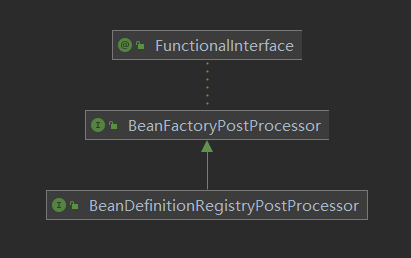
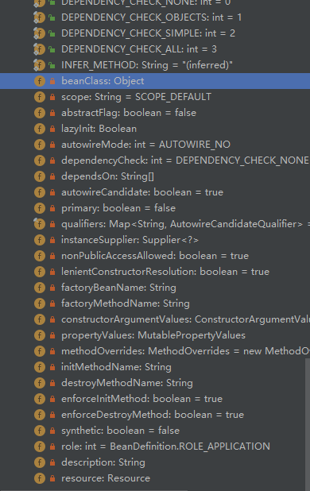

## BeanFactoryPostProcessor

org.springframework.beans.factory.support.BeanDefinitionRegistryPostProcessor




```java
public interface BeanDefinitionRegistryPostProcessor extends BeanFactoryPostProcessor {

   /**
    * Modify the application context's internal bean definition registry after its
    * standard initialization. All regular bean definitions will have been loaded,
    * but no beans will have been instantiated yet. This allows for adding further
    * bean definitions before the next post-processing phase kicks in.
    * @param registry the bean definition registry used by the application context
    * @throws org.springframework.beans.BeansException in case of errors
    */
   void postProcessBeanDefinitionRegistry(BeanDefinitionRegistry registry) throws BeansException;

}

@FunctionalInterface
public interface BeanFactoryPostProcessor {

	/**
	 * Modify the application context's internal bean factory after its standard
	 * initialization. All bean definitions will have been loaded, but no beans
	 * will have been instantiated yet. This allows for overriding or adding
	 * properties even to eager-initializing beans.
	 * @param beanFactory the bean factory used by the application context
	 * @throws org.springframework.beans.BeansException in case of errors
	 */
	void postProcessBeanFactory(ConfigurableListableBeanFactory beanFactory) throws BeansException;

}
```


## BeanDefinition

BeanDefinitionHolder

```
public class BeanDefinitionHolder implements BeanMetadataElement {

   private final BeanDefinition beanDefinition;

   private final String beanName;

   @Nullable
   private final String[] aliases;
```


BeanDefinition

```
public interface BeanDefinition extends AttributeAccessor, BeanMetadataElement {
}
```



