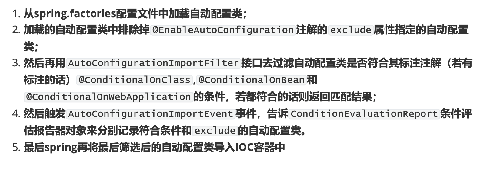

# 依赖管理

(1)为什么导入dependency时不需要指定版本?

### spring-boot-starter-parent

项目的pom.xml

```xml
<!-- Spring Boot父项目依赖管理 --> 
<parent>
        <groupId>org.springframework.boot</groupId>
        <artifactId>spring-boot-starter-parent</artifactId>
        <version>2.2.9.RELEASE</version>
        <relativePath/> <!-- lookup parent from repository -->
</parent>
```

### spring-boot-starter-parent

```xml
<properties>
   <main.basedir>${basedir}/../../..</main.basedir>
   <java.version>1.8</java.version>
   <resource.delimiter>@</resource.delimiter> <!-- delimiter that doesn't clash with Spring ${} placeholders -->
   <project.build.sourceEncoding>UTF-8</project.build.sourceEncoding>
   <project.reporting.outputEncoding>UTF-8</project.reporting.outputEncoding>
   <maven.compiler.source>${java.version}</maven.compiler.source>
   <maven.compiler.target>${java.version}</maven.compiler.target>
</properties>
```

在这里 spring-boot-starter-parent 定义了:
1. 工程的Java版本为 1.8 。
2. 工程代码的编译源文件编码格式为 UTF-8 
3. 工程编译后的文件编码格式为 UTF-8
4. Maven打包编译的版本


再来看 spring-boot-starter-parent 的「build」节点
 接下来看POM的 build 节点，分别定义了 resources 资源和 pluginManagement

### resources

里面定义了资源过滤，针对 的 yml 、properties 格 式进行了过滤，可以支持支持不同环境的配置，比如 application-dev.yml、application-test.yml、application-dev.properties 、application-test.properties 等等

```
<!-- Turn on filtering by default for application properties -->
<resources>
   <resource>
      <directory>${basedir}/src/main/resources</directory>
      <filtering>true</filtering>
      <includes>
         <include>**/application*.yml</include>
         <include>**/application*.yaml</include>
         <include>**/application*.properties</include>
      </includes>
   </resource>
   <resource>
      <directory>${basedir}/src/main/resources</directory>
      <excludes>
         <exclude>**/application*.yml</exclude>
         <exclude>**/application*.yaml</exclude>
         <exclude>**/application*.properties</exclude>
      </excludes>
   </resource>
</resources>
```

### pluginManagement

则是引入了相应的插件和对应的版本依赖


最后来看spring-boot-starter-parent的父依赖

spring-boot-dependencies的properties节点
我们看定义POM，这个才是SpringBoot项目的真正管理依赖的项目，里面定义了SpringBoot相关的版 本

```xml
<properties>
        <main.basedir>${basedir}/../..</main.basedir>
        <!-- Dependency versions -->
        <activemq.version>5.15.13</activemq.version>
        <antlr2.version>2.7.7</antlr2.version>
        <appengine-sdk.version>1.9.81</appengine-sdk.version>
        <artemis.version>2.10.1</artemis.version>
        <aspectj.version>1.9.6</aspectj.version>
        <assertj.version>3.13.2</assertj.version>
        <atomikos.version>4.0.6</atomikos.version>
        <awaitility.version>4.0.3</awaitility.version>
        <bitronix.version>2.1.4</bitronix.version>
        <byte-buddy.version>1.10.13</byte-buddy.version>
        <caffeine.version>2.8.5</caffeine.version>
        <cassandra-driver.version>3.7.2</cassandra-driver.version>
        <classmate.version>1.5.1</classmate.version>
        .......
</properties>
```

spring-boot-dependencies的dependencyManagement节点

在这里，dependencies定义了SpringBoot版本的依赖的组件以及相应版本。

```
<dependencyManagement>
        <dependencies>
            <!-- Spring Boot -->
            <dependency>
                <groupId>org.springframework.boot</groupId>
                <artifactId>spring-boot</artifactId>
                <version>${revision}</version>
            </dependency>
            <dependency>
                            <groupId>org.springframework.boot</groupId>
                <artifactId>spring-boot-test</artifactId>
                <version>${revision}</version>
            </dependency>
            <dependency>
                <groupId>org.springframework.boot</groupId>
                <artifactId>spring-boot-test-autoconfigure</artifactId>
                <version>${revision}</version>
            </dependency>
            <dependency>
                <groupId>org.springframework.boot</groupId>
                <artifactId>spring-boot-actuator</artifactId>
                <version>${revision}</version>
            </dependency>
            <dependency>
                <groupId>org.springframework.boot</groupId>
                <artifactId>spring-boot-actuator-autoconfigure</artifactId>
                <version>${revision}</version>
            </dependency>
....
</dependencyManagement>
```

**spring-boot-starter-parent 作用总结**

spring-boot-starter-parent 通过继承 spring-boot-dependencies 从而实现了SpringBoot的版本依 赖管理,所以我们的SpringBoot工程继承spring-boot-starter-parent后已经具备版本锁定等配置了,这也 就是在 Spring Boot 项目中**部分依赖**不需要写版本号的原因


(2)问题2: spring-boot-starter-parent父依赖启动器的主要作用是进行版本统一管理，那么项目 运行依赖的JAR包是从何而来的?

查看spring-boot-starter-web依赖文件源码，核心代码具体如下

```xml
<dependencies>
   <dependency>
      <groupId>org.springframework.boot</groupId>
      <artifactId>spring-boot-starter</artifactId>
   </dependency>
   <dependency>
      <groupId>org.springframework.boot</groupId>
      <artifactId>spring-boot-starter-json</artifactId>
   </dependency>
   <dependency>
      <groupId>org.springframework.boot</groupId>
      <artifactId>spring-boot-starter-tomcat</artifactId>
   </dependency>
   <dependency>
      <groupId>org.springframework.boot</groupId>
      <artifactId>spring-boot-starter-validation</artifactId>
      <exclusions>
         <exclusion>
            <groupId>org.apache.tomcat.embed</groupId>
            <artifactId>tomcat-embed-el</artifactId>
         </exclusion>
      </exclusions>
   </dependency>
   <dependency>
      <groupId>org.springframework</groupId>
      <artifactId>spring-web</artifactId>
   </dependency>
   <dependency>
      <groupId>org.springframework</groupId>
      <artifactId>spring-webmvc</artifactId>
   </dependency>
</dependencies>
```

从上述代码可以发现，`spring-boot-starter-web`依赖启动器的主要作用是打包了Web开发场景所需的底 层所有依赖(基于依赖传递，当前项目也存在对应的依赖jar包)

正是如此，在pom.xml中引入`spring-boot-starter-web`依赖启动器时，就可以实现Web场景开发，而 不需要额外导入Tomcat服务器以及其他Web依赖文件等。


需要说明的是，Spring Boot官方并不是针对所有场景开发的技术框架都提供了场景启动器，例如阿里 巴巴的Druid数据源等，Spring Boot官方就没有提供对应的依赖启动器。为了充分利用Spring Boot框 架的优势，在Spring Boot官方没有整合这些技术框架的情况下，Druid等技术框架所在的开发团队主动 与Spring Boot框架进行了整合，实现了各自的依赖启动器，例如druid-spring-boot-starter等。我们在 pom.xml文件中引入这些第三方的依赖启动器时，切记要配置对应的版本号


# 自动配置

问题:Spring Boot到底是如何进行自动配置的，都把哪些组件进行了自动配置?

## 属性配置

@EnableConfigurationProperties(XXXx.class)

启用配置注解类XXXx.class

@ConfigurationProperties(prefix = "xxx")

标注在配置注解类上，表明该类以prefix指定的前缀作为配置项，可在核心配置文件中进行属性配置。


## 注解

### @SpringBootApplication

```
@Target(ElementType.TYPE)
@Retention(RetentionPolicy.RUNTIME)
@Documented//表示注解可以记录在javadoc中
@Inherited//注解可以被子类继承
@SpringBootConfiguration //标记为配置类
@EnableAutoConfiguration //启动自动配置功能
@ComponentScan(excludeFilters = { @Filter(type = FilterType.CUSTOM, classes = TypeExcludeFilter.class),
      @Filter(type = FilterType.CUSTOM, classes = AutoConfigurationExcludeFilter.class) })
public @interface SpringBootApplication {
```

### @SpringBootConfiguration

```
@Target(ElementType.TYPE)
@Retention(RetentionPolicy.RUNTIME)
@Documented
@Configuration// 配置类
public @interface SpringBootConfiguration {
```

### @EnableAutoConfiguration

Spring 中有很多以Enable开头的注解，其作用就是借助@Import来收集并注册特定场景相关的 Bean ，并加载到 IOC 容器。

@EnableAutoConfiguration就是借助@Import来收集所有符合自动配置条件的bean定义，并加载到 IoC容器。

```java
@Target(ElementType.TYPE)
@Retention(RetentionPolicy.RUNTIME)
@Documented
@Inherited
@AutoConfigurationPackage
@Import(AutoConfigurationImportSelector.class)
public @interface EnableAutoConfiguration {
```

1、@AutoConfigurationPackage
2、@Import(AutoConfigurationImportSelector.class)

### @AutoConfigurationPackage

@AutoConfigurationPackage :自动配置包，它也是一个组合注解，其中最重要的注解是 @Import(AutoConfigurationPackages.Registrar.class) ，它是 Spring 框架的底层注解，它的作

用就是给容器中导入某个组件类，例如
 @Import(AutoConfigurationPackages.Registrar.class) ，它就是将 Registrar 这个组件类导入

到容器中，可查看 Registrar 类中 registerBeanDefinitions 方法:

```
@Target(ElementType.TYPE)
@Retention(RetentionPolicy.RUNTIME)
@Documented
@Inherited
@Import(AutoConfigurationPackages.Registrar.class)// 向容器导入组件(AutoConfigurationPackages.Registrar.class
public @interface AutoConfigurationPackage {

}
```

#### AutoConfigurationPackages.Registrar.class


```java
/**
 * {@link ImportBeanDefinitionRegistrar} to store the base package from the importing
 * configuration.
 */
static class Registrar implements ImportBeanDefinitionRegistrar, DeterminableImports {

   @Override
   public void registerBeanDefinitions(AnnotationMetadata metadata, BeanDefinitionRegistry registry) {
      register(registry, new PackageImport(metadata).getPackageName());
   }

   @Override
   public Set<Object> determineImports(AnnotationMetadata metadata) {
      return Collections.singleton(new PackageImport(metadata));
   }

}
```


再看register方法

```java
public static void register(BeanDefinitionRegistry registry, String... packageNames) {
		// 这里参数 packageNames 缺省情况下就是一个字符串，是使用了注解
		// @SpringBootApplication 的 Spring Boot 应用程序入口类所在的包

		//	 BEAN = AutoConfigurationPackages.class.getName();
		if (registry.containsBeanDefinition(BEAN)) {
			// 如果该bean已经注册，则将要注册包名称添加进去
			BeanDefinition beanDefinition = registry.getBeanDefinition(BEAN);
			ConstructorArgumentValues constructorArguments = beanDefinition.getConstructorArgumentValues();
			constructorArguments.addIndexedArgumentValue(0, addBasePackages(constructorArguments, packageNames));
		}
		else {
			//如果该bean尚未注册，则注册该bean，参数中提供的包名称会被设置到bean定义中去
			GenericBeanDefinition beanDefinition = new GenericBeanDefinition();
			beanDefinition.setBeanClass(BasePackages.class);
			beanDefinition.getConstructorArgumentValues().addIndexedArgumentValue(0, packageNames);
			beanDefinition.setRole(BeanDefinition.ROLE_INFRASTRUCTURE);
			registry.registerBeanDefinition(BEAN, beanDefinition);
		}
	}
```

AutoConfigurationPackages.Registrar这个类就干一个事，注册一个 Bean ，这个 Bean 就是 org.springframework.boot.autoconfigure.AutoConfigurationPackages.BasePackages ，它有 一个参数，这个参数是使用了 @AutoConfigurationPackage 这个注解的类所在的包路径,保存自动配置类以供之后的使用，
比如给 JPA entity 扫描器用来扫描开发人员通过注解 @Entity 定义的 entity 类。


### @Import(AutoConfigurationImportSelector.class)

`@Import({AutoConfigurationImportSelector.class}) `:将 `AutoConfigurationImportSelector` 这个类导入到 Spring 容器中， AutoConfigurationImportSelector 可以帮助 Springboot 应用将所有符合条件的 @Configuration 配置都加载到当前 SpringBoot 创建并使用的 IOC 容器( ApplicationContext )中。


可以看到 AutoConfigurationImportSelector 重点是实现了 DeferredImportSelector 接口和各种 Aware 接口，然后 DeferredImportSelector 接口又继承了 ImportSelector 接口。

其不光实现了 ImportSelector 接口，还实现了很多其它的 Aware 接口，分别表示在某个时机会被回 调。


确定自动配置实现逻辑的入口方法:
跟自动配置逻辑相关的入口方法在 类的 方法处， 因此我们就从 DeferredImportSelectorGrouping 类的 getImports 方法来开始分析SpringBoot的自 动配置源码好了。

`org.springframework.context.annotation.ConfigurationClassParser.DeferredImportSelectorGrouping`

先看一下 getImports 方法代码:

```java
private static class DeferredImportSelectorGrouping {
    private final Group group;
    private final List<ConfigurationClassParser.DeferredImportSelectorHolder> deferredImports = new ArrayList();

    DeferredImportSelectorGrouping(Group group) {
        this.group = group;
    }

    public void add(ConfigurationClassParser.DeferredImportSelectorHolder deferredImport) {
        this.deferredImports.add(deferredImport);
    }

    public Iterable<Entry> getImports() {
        Iterator var1 = this.deferredImports.iterator();

        while(var1.hasNext()) {
            ConfigurationClassParser.DeferredImportSelectorHolder deferredImport = (ConfigurationClassParser.DeferredImportSelectorHolder)var1.next();
          //group.process的实现是AutoConfigurationImportSelector.AutoConfigurationGroup#process
            //deferredImport.getImportSelector()就是AutoConfigurationImportSelector
          // 【1】，利用AutoConfigurationGroup的process方法来处理自动配置的相关逻辑，决定 导入哪些配置类(这个是我们分析的重点，自动配置的逻辑全在这了)
            this.group.process(deferredImport.getConfigurationClass().getMetadata(), deferredImport.getImportSelector());
        }
			// 【2】，经过上面的处理后，然后再进行选择导入哪些配置类
        return this.group.selectImports();
    }
```


注: `AutoConfigurationGroup`:是`AutoConfigurationImportSelector`的内部类，主要用来处理自动配 置相关的逻辑，拥有process和selectImports方法，然后拥有entries和 autoConfigurationEntries集合属性，这两个集合分别存储被处理后的符合条件的自动配置类，我们知道 这些就足够了; `AutoConfigurationImportSelector`:承担自动配置的绝大部分逻辑，负责选择一些符合条件的自动配 置类;
@@?? **metadata**:标注在SpringBoot启动类上的@SpringBootApplication注解元数据 标【2】的`this.group.selectImports`的方法主要是针对前面的process方法处理后的自动配置类再进一 步有选择的选择导入

#### process

`AutoConfigurationImportSelector$AutoConfigurationGroup#process`

```java
public void process(AnnotationMetadata annotationMetadata, DeferredImportSelector deferredImportSelector) {
   Assert.state(deferredImportSelector instanceof AutoConfigurationImportSelector,
         () -> String.format("Only %s implementations are supported, got %s",
               AutoConfigurationImportSelector.class.getSimpleName(),
               deferredImportSelector.getClass().getName()));
   //1、getAutoConfigurationEntry()得到自动配置类放入autoConfigurationEntry对象中
   AutoConfigurationEntry autoConfigurationEntry = ((AutoConfigurationImportSelector) deferredImportSelector)
         .getAutoConfigurationEntry(getAutoConfigurationMetadata(), annotationMetadata);
   //2、将封装了自动配置类的autoConfigurationEntry对象 放入 autoConfigurationEntries
   this.autoConfigurationEntries.add(autoConfigurationEntry);
   //3、遍历获取的自动配置类，
   for (String importClassName : autoConfigurationEntry.getConfigurations()) {
      //将自动配置类作为key，annotationMetadata作为val放入entries
      this.entries.putIfAbsent(importClassName, annotationMetadata);
   }
}
```

#### getAutoConfigurationEntry

进入1中的 `AutoConfigurationImportSelector#getAutoConfigurationEntry`

```java
protected AutoConfigurationEntry getAutoConfigurationEntry(AutoConfigurationMetadata autoConfigurationMetadata,
      AnnotationMetadata annotationMetadata) {
   //spring.boot.enableautoconfiguration属性默认为true
   if (!isEnabled(annotationMetadata)) {
      return EMPTY_ENTRY;
   }
   AnnotationAttributes attributes = getAttributes(annotationMetadata);
   // 1、得到spring.factories中配置的所有自动配置类
   List<String> configurations = getCandidateConfigurations(annotationMetadata, attributes);
   // 利用LinkedHashSet消除重复的配置类
   configurations = removeDuplicates(configurations);

   //得到要排除的自动配置类，比如exclude属性的配置类
   // 比如@SpringBootApplication(exclude=Xxx.class)
   Set<String> exclusions = getExclusions(annotationMetadata, attributes);
   //检查要排除的类是否自动配置类
   checkExcludedClasses(configurations, exclusions);

   //2 排除配置类
   configurations.removeAll(exclusions);

   //3、过滤，根据Conditional
   configurations = filter(configurations, autoConfigurationMetadata);
   // 【4】获取了符合条件的自动配置类后，此时触发AutoConfigurationImportEvent事件，
   // 目的是告诉ConditionEvaluationReport条件评估报告器对象来记录符合条件的自动配置类
   // 该事件什么时候会被触发?--> 在刷新容器时调用invokeBeanFactoryPostProcessors后置处理器时触发
   fireAutoConfigurationImportEvents(configurations, exclusions);
   // 【5】将符合条件和要排除的自动配置类封装进AutoConfigurationEntry对象，并返回
   return new AutoConfigurationEntry(configurations, exclusions);
}
```


getCandidateConfigurations

```java
protected List<String> getCandidateConfigurations(AnnotationMetadata metadata, AnnotationAttributes attributes) {
   // 这个方法需要传入两个参数getSpringFactoriesLoaderFactoryClass()和 getBeanClassLoader()
      // getSpringFactoriesLoaderFactoryClass()这个方法返回的是 EnableAutoConfiguration.class
      // getBeanClassLoader()这个方法返回的是beanClassLoader(类加载器)
   List<String> configurations = SpringFactoriesLoader.loadFactoryNames(getSpringFactoriesLoaderFactoryClass(),
         getBeanClassLoader());
   Assert.notEmpty(configurations, "No auto configuration classes found in META-INF/spring.factories. If you "
         + "are using a custom packaging, make sure that file is correct.");
   return configurations;
}
```


loadFactoryNames

- 参数一。EnableAutoConfiguration.class，将会读取"META-INF/spring.factories"中，key为EnableAutoConfiguration.class全类名（org.springframework.boot.autoconfigure.EnableAutoConfiguration）的值

```java
//org.springframework.core.io.support.SpringFactoriesLoader#loadFactoryNames
public static List<String> loadFactoryNames(Class<?> factoryType, @Nullable ClassLoader classLoader) {
    String factoryTypeName = factoryType.getName();
    return (List)loadSpringFactories(classLoader).getOrDefault(factoryTypeName, Collections.emptyList());
}

private static Map<String, List<String>> loadSpringFactories(@Nullable ClassLoader classLoader) {
    MultiValueMap<String, String> result = (MultiValueMap)cache.get(classLoader);
    if (result != null) {
        return result;
    } else {
        try {
          //如果类加载器不为null，则加载类路径下spring.factories文件，将其中设置的 配置类的全路径信息封装 为Enumeration类对象
            Enumeration<URL> urls = classLoader != null ? classLoader.getResources("META-INF/spring.factories") : ClassLoader.getSystemResources("META-INF/spring.factories");
            LinkedMultiValueMap result = new LinkedMultiValueMap();
//循环Enumeration类对象，根据相应的节点信息生成Properties对象，通过传入 的键获取值，在将值切割为一个个小的字符串转化为Array，方法result集合中
            while(urls.hasMoreElements()) {
                URL url = (URL)urls.nextElement();
                UrlResource resource = new UrlResource(url);
                Properties properties = PropertiesLoaderUtils.loadProperties(resource);
                Iterator var6 = properties.entrySet().iterator();

                while(var6.hasNext()) {
                    Entry<?, ?> entry = (Entry)var6.next();
                    String factoryTypeName = ((String)entry.getKey()).trim();
                    String[] var9 = StringUtils.commaDelimitedListToStringArray((String)entry.getValue());
                    int var10 = var9.length;

                    for(int var11 = 0; var11 < var10; ++var11) {
                        String factoryImplementationName = var9[var11];
                        result.add(factoryTypeName, factoryImplementationName.trim());
                    }
                }
            }

            cache.put(classLoader, result);
            return result;
        } catch (IOException var13) {
            throw new IllegalArgumentException("Unable to load factories from location [META-INF/spring.factories]", var13);
        }
    }
}
```

这个方法中会遍历整个ClassLoader中所有jar包下的spring.factories文件。
spring.factories里面保存着springboot的默认提供的自动配置类。
 **META-INF/spring.factories**

```properties
# Auto Configure
org.springframework.boot.autoconfigure.EnableAutoConfiguration=\
org.springframework.boot.autoconfigure.admin.SpringApplicationAdminJmxAutoConfiguration,\
org.springframework.boot.autoconfigure.aop.AopAutoConfiguration,\
org.springframework.boot.autoconfigure.amqp.RabbitAutoConfiguration,\
org.springframework.boot.autoconfigure.batch.BatchAutoConfiguration,\
org.springframework.boot.autoconfigure.cache.CacheAutoConfiguration,\
org.springframework.boot.autoconfigure.cassandra.CassandraAutoConfiguration,\
org.springframework.boot.autoconfigure.cloud.CloudServiceConnectorsAutoConfiguration,\
org.springframework.boot.autoconfigure.context.ConfigurationPropertiesAutoConfiguration,\
```

AutoConfigurationImportSelector 的 filter 方法:

```java
private List<String> filter(List<String> configurations, AutoConfigurationMetadata autoConfigurationMetadata) {
   long startTime = System.nanoTime();
   //将从 spring.factories 中获取的自动配置类转出字符串数组
   String[] candidates = StringUtils.toStringArray(configurations);
   // 定义skip数组，是否需要跳过。skip数组与candidates数组顺序一一对应
   boolean[] skip = new boolean[candidates.length];
   boolean skipped = false;
   // getAutoConfigurationImportFilters()同样通过SpringFactoriesLoader.loadFactories(AutoConfigurationImportFilter.class, this.beanClassLoader);
   // 获取到Conditional，拿到OnBeanCondition，OnClassCondition、和OnWebApplicationCondition
   for (AutoConfigurationImportFilter filter : getAutoConfigurationImportFilters()) {
      // 调用各种aware方法，将beanClassLoader,beanFactory等注入到filter对象中，
      // 这里的filter对象即OnBeanCondition，OnClassCondition或OnWebApplicationCondition
      invokeAwareMethods(filter);
      // 判断各种filter来判断每个candidate(这里实质要通过candidate(自动配置类)拿到其标注的
      // @ConditionalOnClass,@ConditionalOnBean和@ConditionalOnWebApplication里 面的注解值)是否匹配，
      // 注意candidates数组与match数组一一对应
      boolean[] match = filter.match(candidates, autoConfigurationMetadata);
      // 遍历match数组，注意match顺序跟candidates的自动配置类一一对应
      for (int i = 0; i < match.length; i++) {
         // 若有不匹配的话
         if (!match[i]) {
            // 不匹配的将记录在skip数组，标志skip[i]为true，也与candidates数组一一对应
            skip[i] = true;
            // 因为不匹配，将相应的自动配置类置空
            candidates[i] = null;
            skipped = true;
         }
      }
   }
   // 这里表示若所有自动配置类经过OnBeanCondition，OnClassCondition和 OnWebApplicationCondition过滤后，全部都匹配的话，则全部原样返回
   if (!skipped) {
      return configurations;
   }
   // 建立result集合来装匹配的自动配置类
   List<String> result = new ArrayList<>(candidates.length);
   for (int i = 0; i < candidates.length; i++) {
      if (!skip[i]) {
         result.add(candidates[i]);
      }
   }
   if (logger.isTraceEnabled()) {
      int numberFiltered = configurations.size() - result.size();
      logger.trace("Filtered " + numberFiltered + " auto configuration class in "
            + TimeUnit.NANOSECONDS.toMillis(System.nanoTime() - startTime) + " ms");
   }
   return new ArrayList<>(result);
}
```

通过调用AutoConfigurationImportFilter接口实现类的match方法来判断每一个自动配置类上的条件注解(若有的话) @ConditionalOnBean 或 @ConditionalOnWebApplication 是否满足 条件，若满足，则返回true，说明匹配，若不满足，则返回false说明不匹配。
我们现在知道 `AutoConfigurationImportSelector` 的 filter 方法主要做了什么事情就行了，现在先 不用研究的过深

getAutoConfigurationImportFilters()

```java
protected List<AutoConfigurationImportFilter> getAutoConfigurationImportFilters() {
  //同样通过SpringFactoriesLoader.loadFactories(AutoConfigurationImportFilter.class, this.beanClassLoader);
   return SpringFactoriesLoader.loadFactories(AutoConfigurationImportFilter.class, this.beanClassLoader);
}
```

```properties、
# Auto Configuration Import Filters
org.springframework.boot.autoconfigure.AutoConfigurationImportFilter=\
org.springframework.boot.autoconfigure.condition.OnBeanCondition,\
org.springframework.boot.autoconfigure.condition.OnClassCondition,\
org.springframework.boot.autoconfigure.condition.OnWebApplicationCondition
```


### 关于条件注解

@Conditional是Spring4新提供的注解，它的作用是按照一定的条件进行判断，满足条件给容器注册 bean。
@ConditionalOnBean:仅仅在当前上下文中存在某个对象时，才会实例化一个Bean。 
@ConditionalOnClass:某个class位于类路径上，才会实例化一个Bean。 
@ConditionalOnExpression:当表达式为true的时候，才会实例化一个Bean。基于SpEL表达式 的条件判断。 @ConditionalOnMissingBean:仅仅在当前上下文中不存在某个对象时，才会实例化一个Bean。 @ConditionalOnMissingClass:某个class类路径上不存在的时候，才会实例化一个Bean。 @ConditionalOnNotWebApplication:不是web应用，才会实例化一个Bean。 
@ConditionalOnWebApplication:当项目是一个Web项目时进行实例化。 
@ConditionalOnNotWebApplication:当项目不是一个Web项目时进行实例化。 
@ConditionalOnProperty:当指定的属性有指定的值时进行实例化。 
@ConditionalOnJava:当JVM版本为指定的版本范围时触发实例化。 
@ConditionalOnResource:当类路径下有指定的资源时触发实例化。 
@ConditionalOnJndi:在JNDI存在的条件下触发实例化。 
@ConditionalOnSingleCandidate:当指定的Bean在容器中只有一个，或者有多个但是指定了首 选的Bean时触发实例化。


this.group.selectImports 方法是如何进一步有选择的导入自动配置类的。直接看代码:

```java
public Iterable<Entry> selectImports() {
   if (this.autoConfigurationEntries.isEmpty()) {
      return Collections.emptyList();
   }
   // 移除带排除的
   Set<String> allExclusions = this.autoConfigurationEntries.stream()
.map(AutoConfigurationEntry::getExclusions).flatMap(Collection::stream).collect(Collectors.toSet());
   Set<String> processedConfigurations = this.autoConfigurationEntries.stream()
         .map(AutoConfigurationEntry::getConfigurations).flatMap(Collection::stream)
         .collect(Collectors.toCollection(LinkedHashSet::new));
   processedConfigurations.removeAll(allExclusions);

   //按order排序
   return sortAutoConfigurations(processedConfigurations, getAutoConfigurationMetadata()).stream()
         .map((importClassName) -> new Entry(this.entries.get(importClassName), importClassName))
         .collect(Collectors.toList());
}
```


### 总结




## **@ComponentScan****注解**


初始化SpringApplication

```java
public SpringApplication(ResourceLoader resourceLoader, Class<?>... primarySources) {
   // 设置资源加载去为null
   this.resourceLoader = resourceLoader;
   // 断言：加载资源类不能为null
   Assert.notNull(primarySources, "PrimarySources must not be null");
   //
   this.primarySources = new LinkedHashSet<>(Arrays.asList(primarySources));

   // 推断引用类型
   this.webApplicationType = WebApplicationType.deduceFromClasspath();
   // 初始化ApplicationContextInitializer
   setInitializers((Collection) getSpringFactoriesInstances(ApplicationContextInitializer.class));
   // 初始化ApplicationListener
   setListeners((Collection) getSpringFactoriesInstances(ApplicationListener.class));
   // 根据调用栈，推断main方法的类名
   this.mainApplicationClass = deduceMainApplicationClass();
}
```

-  ApplicationContextInitializer 接口有initail方法，ApplicationContextInitializer 是Spring框架的类, 这个类的主要目的就是在ConfigurableApplicationContext 调用refresh()方法之前，回调这个类的initialize方法。
  通过 ConfigurableApplicationContext 的实例获取容器的环境Environment，从而实现对配置文件的修改完善等工作。


# run

run方法步骤

```
第一步:获取并启动监听器
第二步:构造应用上下文环境
第三步:初始化应用上下文
第四步:刷新应用上下文前的准备阶段
第五步:刷新应用上下文
第六步:刷新应用上下文后的扩展接口
```


ConfigFileApplicationListener

```
public class ConfigFileApplicationListener implements EnvironmentPostProcessor, SmartApplicationListener, Ordered {
```


## getRunListeners

```java
private SpringApplicationRunListeners getRunListeners(String[] args) {
   Class<?>[] types = new Class<?>[] { SpringApplication.class, String[].class };
   // SpringApplicationRunListener负责在Springboot启动的不同阶段，
   // 广播出不同消息，传递给ApplicationListener监听器实现类
   return new SpringApplicationRunListeners(logger,
         getSpringFactoriesInstances(SpringApplicationRunListener.class, types, this, args));
   // 获取SpringApplicationRunListener的实现类，注意与初始化spirngAcpplication时的不同。
}
```


## prepareEnvironment

```java
private ConfigurableEnvironment prepareEnvironment(SpringApplicationRunListeners listeners,
      ApplicationArguments applicationArguments) {
   // Create and configure the environment
   // 创建并配置相应环境
   ConfigurableEnvironment environment = getOrCreateEnvironment();
   // 根据用户配置，配置environment系统环境
   configureEnvironment(environment, applicationArguments.getSourceArgs());
   ConfigurationPropertySources.attach(environment);
   // 启动相应监听器，其中重点是ConfigFileApplicationListener就是加载配置文件的监听器
   listeners.environmentPrepared(environment);
   bindToSpringApplication(environment);
   if (!this.isCustomEnvironment) {
      environment = new EnvironmentConverter(getClassLoader()).convertEnvironmentIfNecessary(environment,
            deduceEnvironmentClass());
   }
   ConfigurationPropertySources.attach(environment);
   return environment;
}

protected void configureEnvironment(ConfigurableEnvironment environment, String[] args) {
		if (this.addConversionService) {
			ConversionService conversionService = ApplicationConversionService.getSharedInstance();
			environment.setConversionService((ConfigurableConversionService) conversionService);
		}
		// 将main函数的args封装成SimpleCommandLinePropertySource加入环境中
		configurePropertySources(environment, args);
		// 激活相应的配置文件
		// 比如传入参数 --spring.profiles.active=prod，要激活prod配置
		configureProfiles(environment, args);
	}
```


## createApplicationContext();

```
protected ConfigurableApplicationContext createApplicationContext() {
   Class<?> contextClass = this.applicationContextClass;
   if (contextClass == null) {
      try {
         switch (this.webApplicationType) {
         case SERVLET:
            //AnnotationConfigServletWebServerApplicationContext
            contextClass = Class.forName(DEFAULT_SERVLET_WEB_CONTEXT_CLASS);
            break;
         case REACTIVE:
            contextClass = Class.forName(DEFAULT_REACTIVE_WEB_CONTEXT_CLASS);
            break;
         default:
            contextClass = Class.forName(DEFAULT_CONTEXT_CLASS);
         }
      }
      catch (ClassNotFoundException ex) {
         throw new IllegalStateException(
               "Unable create a default ApplicationContext, please specify an ApplicationContextClass", ex);
      }
   }
   return (ConfigurableApplicationContext) BeanUtils.instantiateClass(contextClass);
}
```

### AnnotationConfigServletWebServerApplicationContext


应用上下文可以理解成IoC容器的高级表现形式，应用上下文确实是在IoC容器的基础上丰富了一 些高级功能。

应用上下文对IoC容器是持有的关系。他的一个属性beanFactory就是IoC容器 (DefaultListableBeanFactory)。所以他们之间是持有，和扩展的关系。

接下来看GenericApplicationContext类

```
public class GenericApplicationContext extends AbstractApplicationContext
implements BeanDefinitionRegistry {
    private final DefaultListableBeanFactory beanFactory;
    ...
    public GenericApplicationContext() {
        this.beanFactory = new DefaultListableBeanFactory();
    }
... 
}
```

beanFactory正是在AnnotationConfigServletWebServerApplicationContext实现的接口 GenericApplicationContext中定义的。在上面createApplicationContext()方法中的， BeanUtils.instantiateClass(contextClass) 这个方法中，不但初始化了 AnnotationConfigServletWebServerApplicationContext类，也就是我们的上下文context，同样 也触发了GenericApplicationContext类的构造函数，从而IoC容器也创建了。

仔细看他的构造函数，有没有发现一个很熟悉的类DefaultListableBeanFactory，没错， DefaultListableBeanFactory就是IoC容器真实面目了。在后面的refresh()方法分析中， DefaultListableBeanFactory是无处不在的存在感。

如上图所示，context就是我们熟悉的上下文(也有人称之为容器，都可以，看个人爱好和理 解)，beanFactory就是我们所说的IoC容器的真实面孔了。细细感受下上下文和容器的联系和区 别，对于我们理解源码有很大的帮助。在我们学习过程中，我们也是将上下文和容器严格区分开来 的。


### BeanDefinitionRegistry

```
public interface BeanDefinitionRegistry extends AliasRegistry {
    void registerBeanDefinition(String var1, BeanDefinition var2) throws BeanDefinitionStoreException;

    void removeBeanDefinition(String var1) throws NoSuchBeanDefinitionException;

    BeanDefinition getBeanDefinition(String var1) throws NoSuchBeanDefinitionException;

    boolean containsBeanDefinition(String var1);

    String[] getBeanDefinitionNames();

    int getBeanDefinitionCount();

    boolean isBeanNameInUse(String var1);
}
```

这里将我们前文创建的上下文强转为BeanDefinitionRegistry，他们之间是有继承关系的。 BeanDefinitionRegistry定义了很重要的方法registerBeanDefinition()，该方法将BeanDefinition 注册进DefaultListableBeanFactory容器的beanDefinitionMap中。

## prepareContext

- `prepareContext(context, environment, listeners, applicationArguments, printedBanner);`

```java
private void prepareContext(ConfigurableApplicationContext context, ConfigurableEnvironment environment,
      SpringApplicationRunListeners listeners, ApplicationArguments applicationArguments, Banner printedBanner) {
   // 设置容器环境
   context.setEnvironment(environment);
   // 执行容器后置处理
   postProcessApplicationContext(context);
   applyInitializers(context);
   // 向各个监听器发送 容器已准备好 的事件
   listeners.contextPrepared(context);
   if (this.logStartupInfo) {
      logStartupInfo(context.getParent() == null);
      logStartupProfileInfo(context);
   }
   // Add boot specific singleton beans
   ConfigurableListableBeanFactory beanFactory = context.getBeanFactory();
   beanFactory.registerSingleton("springApplicationArguments", applicationArguments);
   if (printedBanner != null) {
      beanFactory.registerSingleton("springBootBanner", printedBanner);
   }
   if (beanFactory instanceof DefaultListableBeanFactory) {
      ((DefaultListableBeanFactory) beanFactory)
            .setAllowBeanDefinitionOverriding(this.allowBeanDefinitionOverriding);
   }
   if (this.lazyInitialization) {
      context.addBeanFactoryPostProcessor(new LazyInitializationBeanFactoryPostProcessor());
   }
   // Load the sources
   // 获取核心启动类
   Set<Object> sources = getAllSources();
   Assert.notEmpty(sources, "Sources must not be empty");
   // 加载启动类，将启动类注入到容器
   load(context, sources.toArray(new Object[0]));
   // 发送容器已加载事件
   listeners.contextLoaded(context);
}
```


### load

```
//org.springframework.boot.SpringApplication#load
protected void load(ApplicationContext context, Object[] sources) {
   if (logger.isDebugEnabled()) {
      logger.debug("Loading source " + StringUtils.arrayToCommaDelimitedString(sources));
   }
   // 创建bdLoader
   BeanDefinitionLoader loader = createBeanDefinitionLoader(getBeanDefinitionRegistry(context), sources);
   if (this.beanNameGenerator != null) {
      loader.setBeanNameGenerator(this.beanNameGenerator);
   }
   if (this.resourceLoader != null) {
      loader.setResourceLoader(this.resourceLoader);
   }
   if (this.environment != null) {
      loader.setEnvironment(this.environment);
   }
   loader.load();
}
```


### createBeanDefinitionLoader()

继续看createBeanDefinitionLoader()方法，最终进入了BeanDefinitionLoader类的构造方法，如 下

```
//org.springframework.boot.BeanDefinitionLoader#BeanDefinitionLoader
BeanDefinitionLoader(BeanDefinitionRegistry registry, Object... sources) {
   Assert.notNull(registry, "Registry must not be null");
   Assert.notEmpty(sources, "Sources must not be empty");
   this.sources = sources;
   // 注解形式的bean定义读取器，如@Configuration @Bean @Component @Controller @Service等
   this.annotatedReader = new AnnotatedBeanDefinitionReader(registry);
   // xml形式
   this.xmlReader = new XmlBeanDefinitionReader(registry);
   if (isGroovyPresent()) {
      this.groovyReader = new GroovyBeanDefinitionReader(registry);
   }
   // 类路径扫描器
   this.scanner = new ClassPathBeanDefinitionScanner(registry);
   // 扫描器添加排除过滤器
   this.scanner.addExcludeFilter(new ClassExcludeFilter(sources));
}
```


###    loader.load();


```
	private int load(Object source) {
		Assert.notNull(source, "Source must not be null");
		// 从Class加载
		if (source instanceof Class<?>) {
			return load((Class<?>) source);
		}
		// 从Resource加载
		if (source instanceof Resource) {
			return load((Resource) source);
		}
		// 从Package加载
		if (source instanceof Package) {
			return load((Package) source);
		}
		// 从 CharSequence 加载 @@??
		if (source instanceof CharSequence) {
			return load((CharSequence) source);
		}
		throw new IllegalArgumentException("Invalid source type " + source.getClass());
	}

```


```java
private int load(Class<?> source) {
   if (isGroovyPresent() && GroovyBeanDefinitionSource.class.isAssignableFrom(source)) {
      // Any GroovyLoaders added in beans{} DSL can contribute beans here
      GroovyBeanDefinitionSource loader = BeanUtils.instantiateClass(source, GroovyBeanDefinitionSource.class);
      load(loader);
   }
   //添加了@Component
   if (isComponent(source)) {
      //将启动类的Bd注册到bdMap中
      this.annotatedReader.register(source);
      return 1;
   }
   return 0;
}
```

isComponent(source)判断主类是不是存在@Component注解，主类 @SpringBootApplication是一个组合注解，包含@Component。

this.annotatedReader.register(source);跟进register()方法，最终进到 AnnotatedBeanDefinitionReader类的doRegisterBean()方法。


```java
private <T> void doRegisterBean(Class<T> beanClass, @Nullable String name, @Nullable Class<? extends Annotation>[] qualifiers, @Nullable Supplier<T> supplier, @Nullable BeanDefinitionCustomizer[] customizers) {
  //将指定的类 封装为AnnotatedGenericBeanDefinition
    AnnotatedGenericBeanDefinition abd = new AnnotatedGenericBeanDefinition(beanClass);
    if (!this.conditionEvaluator.shouldSkip(abd.getMetadata())) {
        abd.setInstanceSupplier(supplier);
      // 获取该类的 scope 属性
        ScopeMetadata scopeMetadata = this.scopeMetadataResolver.resolveScopeMetadata(abd);
        abd.setScope(scopeMetadata.getScopeName());
        String beanName = name != null ? name : this.beanNameGenerator.generateBeanName(abd, this.registry);
        AnnotationConfigUtils.processCommonDefinitionAnnotations(abd);
        int var10;
        int var11;
        if (qualifiers != null) {
            Class[] var9 = qualifiers;
            var10 = qualifiers.length;

            for(var11 = 0; var11 < var10; ++var11) {
                Class<? extends Annotation> qualifier = var9[var11];
                if (Primary.class == qualifier) {
                    abd.setPrimary(true);
                } else if (Lazy.class == qualifier) {
                    abd.setLazyInit(true);
                } else {
                    abd.addQualifier(new AutowireCandidateQualifier(qualifier));
                }
            }
        }

        if (customizers != null) {
            BeanDefinitionCustomizer[] var13 = customizers;
            var10 = customizers.length;

            for(var11 = 0; var11 < var10; ++var11) {
                BeanDefinitionCustomizer customizer = var13[var11];
                customizer.customize(abd);
            }
        }

        BeanDefinitionHolder definitionHolder = new BeanDefinitionHolder(abd, beanName);
        definitionHolder = AnnotationConfigUtils.applyScopedProxyMode(scopeMetadata, definitionHolder, this.registry);
      //  将该BeanDefinition注册到IoC容器的beanDefinitionMap中
        BeanDefinitionReaderUtils.registerBeanDefinition(definitionHolder, this.registry);
    }
}
```

在该方法中将主类封装成AnnotatedGenericBeanDefinition

BeanDefinitionReaderUtils.registerBeanDefinition(definitionHolder, this.registry);方法将 BeanDefinition注册进beanDefinitionMap

```java
public static void registerBeanDefinition(BeanDefinitionHolder definitionHolder, BeanDefinitionRegistry registry) throws BeanDefinitionStoreException {
	//注册bean
  	String beanName = definitionHolder.getBeanName();
  //DefaultListableBeanFactory类的registerBeanDefinition()
    registry.registerBeanDefinition(beanName, definitionHolder.getBeanDefinition());
  //注册别名
    String[] aliases = definitionHolder.getAliases();
    if (aliases != null) {
        String[] var4 = aliases;
        int var5 = aliases.length;

        for(int var6 = 0; var6 < var5; ++var6) {
            String alias = var4[var6];
            registry.registerAlias(beanName, alias);
        }
    }

}
```


最终来到DefaultListableBeanFactory类的registerBeanDefinition()方法，

```java
public void registerBeanDefinition(String beanName, BeanDefinition beanDefinition) throws BeanDefinitionStoreException {
    Assert.hasText(beanName, "Bean name must not be empty");
    Assert.notNull(beanDefinition, "BeanDefinition must not be null");
    if (beanDefinition instanceof AbstractBeanDefinition) {
        try {
          // 最后一次校验了
					// 对bean的Overrides进行校验，还不知道会在哪处理这些overrides
            ((AbstractBeanDefinition)beanDefinition).validate();
        } catch (BeanDefinitionValidationException var8) {
            throw new BeanDefinitionStoreException(beanDefinition.getResourceDescription(), beanName, "Validation of bean definition failed", var8);
        }
    }
// 判断是否存在重复名字的bean，之后看允不允许override
// 以前使用synchronized实现互斥访问，现在采用ConcurrentHashMap
    BeanDefinition existingDefinition = (BeanDefinition)this.beanDefinitionMap.get(beanName);
    if (existingDefinition != null) {
      //如果该类不允许 Overriding 直接抛出异常
        if (!this.isAllowBeanDefinitionOverriding()) {
            throw new BeanDefinitionOverrideException(beanName, beanDefinition, existingDefinition);
        }

        if (existingDefinition.getRole() < beanDefinition.getRole()) {
            if (this.logger.isInfoEnabled()) {
                this.logger.info("Overriding user-defined bean definition for bean '" + beanName + "' with a framework-generated bean definition: replacing [" + existingDefinition + "] with [" + beanDefinition + "]");
            }
        } else if (!beanDefinition.equals(existingDefinition)) {
            if (this.logger.isDebugEnabled()) {
                this.logger.debug("Overriding bean definition for bean '" + beanName + "' with a different definition: replacing [" + existingDefinition + "] with [" + beanDefinition + "]");
            }
        } else if (this.logger.isTraceEnabled()) {
            this.logger.trace("Overriding bean definition for bean '" + beanName + "' with an equivalent definition: replacing [" + existingDefinition + "] with [" + beanDefinition + "]");
        }
	//注册进beanDefinitionMap
        this.beanDefinitionMap.put(beanName, beanDefinition);
    } else {
        if (this.hasBeanCreationStarted()) {
            synchronized(this.beanDefinitionMap) {
                this.beanDefinitionMap.put(beanName, beanDefinition);
                List<String> updatedDefinitions = new ArrayList(this.beanDefinitionNames.size() + 1);
                updatedDefinitions.addAll(this.beanDefinitionNames);
                updatedDefinitions.add(beanName);
                this.beanDefinitionNames = updatedDefinitions;
                this.removeManualSingletonName(beanName);
            }
        } else {
          //如果仍处于启动注册阶段，注册进beanDefinitionMap
            this.beanDefinitionMap.put(beanName, beanDefinition);
            this.beanDefinitionNames.add(beanName);
            this.removeManualSingletonName(beanName);
        }

        this.frozenBeanDefinitionNames = null;
    }

    if (existingDefinition == null && !this.containsSingleton(beanName)) {
        if (this.isConfigurationFrozen()) {
            this.clearByTypeCache();
        }
    } else {
        this.resetBeanDefinition(beanName);
    }

}
```


## 第五步:刷新应用上下文(IOC容器的初始化过程)

首先我们要知道到IoC容器的初始化过程，主要分下面三步:

```
1 BeanDefinition的Resource定位 
2 BeanDefinition的载入
3 向IoC容器注册BeanDefinition
```

IoC容器的初始化过程包括三个步骤，在invokeBeanFactoryPostProcessors()方法中完成了IoC容
器初始化过程的三个步骤。

**1，第一步:Resource定位**

在SpringBoot中，我们都知道他的包扫描是从主类所在的包开始扫描的，prepareContext() 方法中，会先将主类解析成BeanDefinition，然后在refresh()方法的 `invokeBeanFactoryPostProcessors()`方法中解析主类的BeanDefinition获取basePackage的路 径。这样就完成了定位的过程。其次SpringBoot的各种starter是通过SPI扩展机制实现的自动装 配，SpringBoot的自动装配同样也是在`invokeBeanFactoryPostProcessors()`方法中实现的。还有 一种情况，在SpringBoot中有很多的@EnableXXX注解，细心点进去看的应该就知道其底层是 @Import注解，在`invokeBeanFactoryPostProcessors()`方法中也实现了对该注解指定的配置类的 定位加载。
常规的在SpringBoot中有三种实现定位，第一个是主类所在包的，第二个是SPI扩展机制实现 的自动装配(比如各种starter)，第三种就是`@Import`注解指定的类。(对于非常规的不说了)

**2，第二步:BeanDefinition的载入**

在第一步中说了三种Resource的定位情况，定位后紧接着就是BeanDefinition的分别载入。 所谓的载入就是通过上面的定位得到的basePackage，SpringBoot会将该路径拼接成: classpath:com/lagou/**/.class这样的形式，然后一个叫做 xPathMatchingResourcePatternResolver的类会将该路径下所有的.class文件都加载进来，然后 遍历判断是不是有@Component注解，如果有的话，就是我们要装载的BeanDefinition。大致过 程就是这样的了。

**3、第三个过程:注册BeanDefinition**
这个过程通过调用上文提到的`BeanDefinitionRegister`接口的实现来完成。这个注册过程把载入 过程中解析得到的BeanDefinition向IoC容器进行注册。通过上文的分析，我们可以看到，在IoC容器中将BeanDefinition注入到一个ConcurrentHashMap中，IoC容器就是通过这个HashMap来持 有这些BeanDefinition数据的。比如`DefaultListableBeanFactory` 中的beanDefinitionMap属性。


### AbstractApplicationContext#refresh

```java
//org.springframework.context.support.AbstractApplicationContext#refresh
public void refresh() throws BeansException, IllegalStateException {
   synchronized (this.startupShutdownMonitor) {
      // Prepare this context for refreshing.
      prepareRefresh();

      // Tell the subclass to refresh the internal bean factory.
      ConfigurableListableBeanFactory beanFactory = obtainFreshBeanFactory();

      // Prepare the bean factory for use in this context.
      prepareBeanFactory(beanFactory);

      try {
         // Allows post-processing of the bean factory in context subclasses.
         postProcessBeanFactory(beanFactory);

         // Invoke factory processors registered as beans in the context.
         invokeBeanFactoryPostProcessors(beanFactory);

         // Register bean processors that intercept bean creation.
         registerBeanPostProcessors(beanFactory);

         // Initialize message source for this context.
         initMessageSource();

         // Initialize event multicaster for this context.
         initApplicationEventMulticaster();

         // Initialize other special beans in specific context subclasses.
         onRefresh();

         // Check for listener beans and register them.
         registerListeners();

         // Instantiate all remaining (non-lazy-init) singletons.
         finishBeanFactoryInitialization(beanFactory);

         // Last step: publish corresponding event.
         finishRefresh();
      }

      catch (BeansException ex) {
         if (logger.isWarnEnabled()) {
            logger.warn("Exception encountered during context initialization - " +
                  "cancelling refresh attempt: " + ex);
         }

         // Destroy already created singletons to avoid dangling resources.
         destroyBeans();

         // Reset 'active' flag.
         cancelRefresh(ex);

         // Propagate exception to caller.
         throw ex;
      }

      finally {
         // Reset common introspection caches in Spring's core, since we
         // might not ever need metadata for singleton beans anymore...
         resetCommonCaches();
      }
   }
}
```


进入 `invokeBeanFactoryPostProcessors(beanFactory)`;，直到找到`PostProcessorRegistrationDelegate`

```java
//org.springframework.context.support.AbstractApplicationContext#invokeBeanFactoryPostProcessors
	protected void invokeBeanFactoryPostProcessors(ConfigurableListableBeanFactory beanFactory) {
//.........
		PostProcessorRegistrationDelegate.invokeBeanFactoryPostProcessors(beanFactory, getBeanFactoryPostProcessors());
//.........
	}


//org.springframework.context.support.PostProcessorRegistrationDelegate#invokeBeanFactoryPostProcessors(org.springframework.beans.factory.config.ConfigurableListableBeanFactory, java.util.List<org.springframework.beans.factory.config.BeanFactoryPostProcessor>)
	public static void invokeBeanFactoryPostProcessors(
			ConfigurableListableBeanFactory beanFactory, List<BeanFactoryPostProcessor> beanFactoryPostProcessors) {
.....
  			invokeBeanDefinitionRegistryPostProcessors(currentRegistryProcessors, registry);
......
  }
    


//org.springframework.context.support.PostProcessorRegistrationDelegate#invokeBeanDefinitionRegistryPostProcessors
private static void invokeBeanDefinitionRegistryPostProcessors(
      Collection<? extends BeanDefinitionRegistryPostProcessor> postProcessors, BeanDefinitionRegistry registry) {

   for (BeanDefinitionRegistryPostProcessor postProcessor : postProcessors) {
     //具体实现：ConfigurationClassPostProcessor#postProcessBeanDefinitionRegistry
      postProcessor.postProcessBeanDefinitionRegistry(registry);
   }
}

//org.springframework.context.annotation.ConfigurationClassPostProcessor#postProcessBeanDefinitionRegistry
public void postProcessBeanDefinitionRegistry(BeanDefinitionRegistry registry) {
///	.......
		processConfigBeanDefinitions(registry);
	}


//org.springframework.context.annotation.ConfigurationClassPostProcessor#processConfigBeanDefinitions
public void processConfigBeanDefinitions(BeanDefinitionRegistry registry) {
	////....
  		// 创建配置类解析器
		ConfigurationClassParser parser = new ConfigurationClassParser(
				this.metadataReaderFactory, this.problemReporter, this.environment,
				this.resourceLoader, this.componentScanBeanNameGenerator, registry);

		Set<BeanDefinitionHolder> candidates = new LinkedHashSet<>(configCandidates);
		Set<ConfigurationClass> alreadyParsed = new HashSet<>(configCandidates.size());
		do {
			parser.parse(candidates);
			parser.validate();
/////.....
}

```


```java

  
  	// First, invoke the BeanDefinitionRegistryPostProcessors that implement PriorityOrdered.
			String[] postProcessorNames =
					beanFactory.getBeanNamesForType(BeanDefinitionRegistryPostProcessor.class, true, false);
			for (String ppName : postProcessorNames) {
				if (beanFactory.isTypeMatch(ppName, PriorityOrdered.class)) {
          //ppName：org.springframework.context.annotation.internalConfigurationAnnotationProcessor
          // getBean获取到 ConfigurationClassPostProcessor 的实例
					currentRegistryProcessors.add(beanFactory.getBean(ppName, BeanDefinitionRegistryPostProcessor.class));
					processedBeans.add(ppName);
				}
			}
```

获取到ConfigurationClassPostProcessor


### ConfigurationClassPostProcessor#postProcessBeanDefinitionRegistry

```java
//org.springframework.context.annotation.ConfigurationClassPostProcessor#postProcessBeanDefinitionRegistry
public class ConfigurationClassPostProcessor implements BeanDefinitionRegistryPostProcessor,
		PriorityOrdered, ResourceLoaderAware, BeanClassLoaderAware, EnvironmentAware {
......
public void postProcessBeanDefinitionRegistry(BeanDefinitionRegistry registry) {
   int registryId = System.identityHashCode(registry);
   if (this.registriesPostProcessed.contains(registryId)) {
      throw new IllegalStateException(
            "postProcessBeanDefinitionRegistry already called on this post-processor against " + registry);
   }
   if (this.factoriesPostProcessed.contains(registryId)) {
      throw new IllegalStateException(
            "postProcessBeanFactory already called on this post-processor against " + registry);
   }
   this.registriesPostProcessed.add(registryId);

  //处理
   processConfigBeanDefinitions(registry);
}
    }
```


进入processConfigBeanDefinitions

```java
public void processConfigBeanDefinitions(BeanDefinitionRegistry registry) {
   ...

// Parse each @Configuration class
ConfigurationClassParser parser = new ConfigurationClassParser(
      this.metadataReaderFactory, this.problemReporter, this.environment,
      this.resourceLoader, this.componentScanBeanNameGenerator, registry);

Set<BeanDefinitionHolder> candidates = new LinkedHashSet<>(configCandidates);
Set<ConfigurationClass> alreadyParsed = new HashSet<>(configCandidates.size());
do {
   parser.parse(candidates);
   parser.validate();

   Set<ConfigurationClass> configClasses = new LinkedHashSet<>(parser.getConfigurationClasses());
   configClasses.removeAll(alreadyParsed);
  
}
```

### parse方法

ConfigurationClassPostProcessor#parse

```java
public void parse(Set<BeanDefinitionHolder> configCandidates) {
   for (BeanDefinitionHolder holder : configCandidates) {
      BeanDefinition bd = holder.getBeanDefinition();
      try {
         // 解析注解
         // 如果是SpringBoot项目进来的，bd其实就是前面主类封装成的 AnnotatedGenericBeanDefinition(AnnotatedBeanDefinition接口的实现类)
         if (bd instanceof AnnotatedBeanDefinition) {
           //进入
            parse(((AnnotatedBeanDefinition) bd).getMetadata(), holder.getBeanName());
         }
         else if (bd instanceof AbstractBeanDefinition && ((AbstractBeanDefinition) bd).hasBeanClass()) {
            parse(((AbstractBeanDefinition) bd).getBeanClass(), holder.getBeanName());
         }
         else {
            parse(bd.getBeanClassName(), holder.getBeanName());
         }
      }
      catch (BeanDefinitionStoreException ex) {
         throw ex;
      }
      catch (Throwable ex) {
         throw new BeanDefinitionStoreException(
               "Failed to parse configuration class [" + bd.getBeanClassName() + "]", ex);
      }
   }

   // 去执行组件类
   this.deferredImportSelectorHandler.process();
}

///进入parse
protected final void parse(AnnotationMetadata metadata, String beanName) throws IOException {
    //enter
		processConfigurationClass(new ConfigurationClass(metadata, beanName), DEFAULT_EXCLUSION_FILTER);
	}


//继续进入processConfigurationClass
protected void processConfigurationClass(ConfigurationClass configClass, Predicate<String> filter) throws IOException {
	////.......
		// Recursively process the configuration class and its superclass hierarchy.
		SourceClass sourceClass = asSourceClass(configClass, filter);
		do {
      // 处理配置类
			sourceClass = doProcessConfigurationClass(configClass, sourceClass, filter);
		}
		while (sourceClass != null);

		this.configurationClasses.put(configClass, configClass);
	}
```


#### 处理@ComponentScan

```java
// Process any @ComponentScan annotations
		Set<AnnotationAttributes> componentScans = AnnotationConfigUtils.attributesForRepeatable(
				sourceClass.getMetadata(), ComponentScans.class, ComponentScan.class);
		if (!componentScans.isEmpty() &&
				!this.conditionEvaluator.shouldSkip(sourceClass.getMetadata(), ConfigurationPhase.REGISTER_BEAN)) {
			for (AnnotationAttributes componentScan : componentScans) {
				// The config class is annotated with @ComponentScan -> perform the scan immediately
				// 立即执行扫描，(SpringBoot项目为什么是从主类所在的包扫描，这就是关键
				Set<BeanDefinitionHolder> scannedBeanDefinitions =
						this.componentScanParser.parse(componentScan, sourceClass.getMetadata().getClassName());
				// Check the set of scanned definitions for any further config classes and parse recursively if needed
				// 递归解析，看看方法中是否注入了bean
				for (BeanDefinitionHolder holder : scannedBeanDefinitions) {
					BeanDefinition bdCand = holder.getBeanDefinition().getOriginatingBeanDefinition();
					if (bdCand == null) {
						bdCand = holder.getBeanDefinition();
					}
					// 检查是否是ConfigurationClass(是否有configuration/component 两个注解)，如果是，递归查找该类相关联的配置类。
					// 所谓相关的配置类，比如@Configuration中的@Bean定义的bean。或者在 有@Component注解的类上继续存在@Import注解。
					if (ConfigurationClassUtils.checkConfigurationClassCandidate(bdCand, this.metadataReaderFactory)) {
						parse(bdCand.getBeanClassName(), holder.getBeanName());
					}
				}
			}
		}
```


#### 处理 @Import

```
现在大家也应该知道了，各种@EnableXXX注解，很大一部分都是对@Import的二次封装(其实也

是为了解耦，比如当@Import导入的类发生变化时，我们的业务系统也不需要改任何代码)。

```


```java
// Process any @Import annotations
// 递归处理 @Import 注解(SpringBoot项目中经常用的各种@Enable*** 注解基本都是封装 的@Import)
// getImports(sourceClass) 获取到1、AutoConfigurationPackages$Registrar
      // 和2、AutoConfigurationImportSelector
processImports(configClass, sourceClass, getImports(sourceClass), true);
```

- getImports

```
 private Set<SourceClass> getImports(SourceClass sourceClass) throws
IOException {
     Set<SourceClass> imports = new LinkedHashSet<>();
     Set<SourceClass> visited = new LinkedHashSet<>();
     collectImports(sourceClass, imports, visited);
     return imports;
     }
```

正是  @EnableAutoConfiguration 和 @AutoConfigurationPackage 上标注的 @Imports

- AutoConfigurationImportSelector.class
- AutoConfigurationPackages.Registrar.class

```java
@AutoConfigurationPackage // 自动配置包
@Import(AutoConfigurationImportSelector.class)
public @interface EnableAutoConfiguration {
}
@Import(AutoConfigurationPackages.Registrar.class)// 向容器导入组件(AutoConfigurationPackages.Registrar.class
public @interface AutoConfigurationPackage {
}
```


回头看parse方法

```java
public void parse(Set<BeanDefinitionHolder> configCandidates) {
   for (BeanDefinitionHolder holder : configCandidates) {
      BeanDefinition bd = holder.getBeanDefinition();
      try {
         if (bd instanceof AnnotatedBeanDefinition) {
            parse(((AnnotatedBeanDefinition) bd).getMetadata(), holder.getBeanName());
         }
         else if (bd instanceof AbstractBeanDefinition && ((AbstractBeanDefinition) bd).hasBeanClass()) {
            parse(((AbstractBeanDefinition) bd).getBeanClass(), holder.getBeanName());
         }
         else {
            parse(bd.getBeanClassName(), holder.getBeanName());
         }
      }
      catch (BeanDefinitionStoreException ex) {
         throw ex;
      }
      catch (Throwable ex) {
         throw new BeanDefinitionStoreException(
               "Failed to parse configuration class [" + bd.getBeanClassName() + "]", ex);
      }
   }
// 去执行组件类
  //进入process方法
   this.deferredImportSelectorHandler.process();
}
```

进入process

```java
public void process() {
   List<DeferredImportSelectorHolder> deferredImports = this.deferredImportSelectors;
   this.deferredImportSelectors = null;
   try {
      if (deferredImports != null) {
         DeferredImportSelectorGroupingHandler handler = new DeferredImportSelectorGroupingHandler();
         deferredImports.sort(DEFERRED_IMPORT_COMPARATOR);
         deferredImports.forEach(handler::register);
         //进入
         handler.processGroupImports();
      }
   }
   finally {
      this.deferredImportSelectors = new ArrayList<>();
   }
}
```

####  handler.processGroupImports();

```java
public void processGroupImports() {
   for (DeferredImportSelectorGrouping grouping : this.groupings.values()) {
      Predicate<String> exclusionFilter = grouping.getCandidateFilter();
     //getImports
      grouping.getImports().forEach(entry -> {
         ConfigurationClass configurationClass = this.configurationClasses.get(entry.getMetadata());
         try {
            processImports(configurationClass, asSourceClass(configurationClass, exclusionFilter),
                  Collections.singleton(asSourceClass(entry.getImportClassName(), exclusionFilter)),
                  exclusionFilter, false);
         }
         catch (BeanDefinitionStoreException ex) {
            throw ex;
         }
         catch (Throwable ex) {
            throw new BeanDefinitionStoreException(
                  "Failed to process import candidates for configuration class [" +
                        configurationClass.getMetadata().getClassName() + "]", ex);
         }
      });
   }
}
```

#### getImports

```java
public Iterable<Group.Entry> getImports() {
   for (DeferredImportSelectorHolder deferredImport : this.deferredImports) {
   //process
      this.group.process(deferredImport.getConfigurationClass().getMetadata(),
            deferredImport.getImportSelector());
   }
   return this.group.selectImports();
}
```

也就是`AutoConfigurationImportSelector.AutoConfigurationGroup#process`

```java
//AutoConfigurationImportSelector.AutoConfigurationGroup#process
public void process(AnnotationMetadata annotationMetadata, DeferredImportSelector deferredImportSelector) {
   Assert.state(deferredImportSelector instanceof AutoConfigurationImportSelector,
         () -> String.format("Only %s implementations are supported, got %s",
               AutoConfigurationImportSelector.class.getSimpleName(),
               deferredImportSelector.getClass().getName()));
   //1、getAutoConfigurationEntry()得到自动配置类放入autoConfigurationEntry对象中
   AutoConfigurationEntry autoConfigurationEntry = ((AutoConfigurationImportSelector) deferredImportSelector)
         .getAutoConfigurationEntry(getAutoConfigurationMetadata(), annotationMetadata);
   //2、将封装了自动配置类的autoConfigurationEntry对象 放入 autoConfigurationEntries
   this.autoConfigurationEntries.add(autoConfigurationEntry);
   //3、遍历获取的自动配置类，
   for (String importClassName : autoConfigurationEntry.getConfigurations()) {
      //将自动配置类作为key，annotationMetadata作为val放入entries
      this.entries.putIfAbsent(importClassName, annotationMetadata);
   }
}
```


## afterRefresh

刷新应用上下文后的扩展接口。模板方法，默认为空实现。如果有自定义需求，可以重写该方法。比如打 印一些启动结束log，或者一些其它后置处理。

```
protected void afterRefresh(ConfigurableApplicationContext context,
        ApplicationArguments args) {}
```


# 自定义Starter

1、创建项目


2、引入依赖

```
<dependency>
    <groupId>org.springframework.boot</groupId>
    <artifactId>spring-boot-autoconfigure</artifactId>
    <version>2.2.9.RELEASE</version>
</dependency>
```

3、编写配置类、bean

```
@Configuration
public class MyConfiguration {

    static {
        System.out.println("MyConfiguration init ...");
    }

    @Bean
    public SimpleBean simpleBean(){
        return new SimpleBean();
    }

}

@Data
@EnableConfigurationProperties(SimpleBean.class)
@ConfigurationProperties(prefix = "simplebean")
public class SimpleBean {
    private int id;
    private String name;
}
```

4、测试使用starter

```
@RunWith(SpringRunner.class)
@SpringBootTest
public class StarterTest {
   @Autowired
   private SimpleBean simpleBean;

   @Test
   public void test(){
      System.out.println(simpleBean);
   }

}
```

5、拓展，使用@EnableXxx注解实现热插拔

还记得我们经常会在启动类Application上面加@EnableXXX注解吗?

其实这个@Enablexxx注解就是一种热拔插技术，加了这个注解就可以启动对应的starter，当不需 要对应的starter的时候只需要把这个注解注释掉就行，是不是很优雅呢?那么这是如何实现的 呢?

5.1 新增标记类

```
public class ConfigMarker {
}
```

5.2 新增EnableXx注解

```
@Target({ElementType.TYPE})
@Retention(RetentionPolicy.RUNTIME)
@Import({ConfigMarker.class})
public @interface EnableRegisterServer {
}
```

5.3改造 MyAutoConfiguration 新增条件注解 @ConditionalOnBean(ConfigMarker.class) ， @ConditionalOnBean 这个是条件注解，前面的意思代表只有当期上下文中含有 ConfigMarker对象，被标注的类才会被实例化。

```
@Configuration
@ConditionalOnBean(ConfigMarker.class)
public class MyAutoConfiguration {
```

5.4 在启动类上增加启用注解

```
@RunWith(SpringRunner.class)
@SpringBootTest
@EnableRegisterServer
public class StarterTest {
   @Autowired
   private SimpleBean simpleBean;

   @Test
   public void test(){
      System.out.println(simpleBean);
   }

}
```

原理也很简单，当加了 @EnableImRegisterServer 注解的时候，由于这个注解使用了

@Import({ConfigMarker.class}) ，所以会导致Spring去加载 ConfigMarker 到上下文中，而 又因为条件注解 @ConditionalOnBean(ConfigMarker.class) 的存在，所以

MyAutoConfiguration 类就会被实例化。


# 内嵌Tomcat容器

从@SpringBootApplication注解开始，该注解使用了@EnableAutoConfiguration注解，通过@Import(AutoConfigurationImportSelector.class) 导入了AutoConfigurationImportSelector.class的实例，该实例在调用getAutoConfigurationEntry方法时，加载自动配置类，得到spring.factories中配置的所有自动配置类，并通过一些条件过滤。自动配置类中就包含了与自动配置内嵌web容器相关的类：`ServletWebServerFactoryAutoConfiguration`

若当前是web项目，就会引入ServletRequest.class类，从而使@ConditionalOnClass(ServletRequest.class)生效，`ServletWebServerFactoryAutoConfiguration`也就会注入到容器中。

### `ServletWebServerFactoryAutoConfiguration`

```JAVA
@Configuration(proxyBeanMethods = false)
@AutoConfigureOrder(Ordered.HIGHEST_PRECEDENCE)
@ConditionalOnClass(ServletRequest.class)
@ConditionalOnWebApplication(type = Type.SERVLET)
@EnableConfigurationProperties(ServerProperties.class)
@Import({ ServletWebServerFactoryAutoConfiguration.BeanPostProcessorsRegistrar.class,
         //导入EmbeddedTomcat
      ServletWebServerFactoryConfiguration.EmbeddedTomcat.class,
      ServletWebServerFactoryConfiguration.EmbeddedJetty.class,
      ServletWebServerFactoryConfiguration.EmbeddedUndertow.class })
public class ServletWebServerFactoryAutoConfiguration {
```

### ServerProperties

```JAVA
@ConfigurationProperties(prefix = "server", ignoreUnknownFields = true)
public class ServerProperties {
```

### EmbeddedTomcat

 ServletWebServerFactoryConfiguration.EmbeddedTomcat.class

```java
@Configuration(proxyBeanMethods = false)
@ConditionalOnClass({ Servlet.class, Tomcat.class, UpgradeProtocol.class })
@ConditionalOnMissingBean(value = ServletWebServerFactory.class, search = SearchStrategy.CURRENT)
static class EmbeddedTomcat {

//注入tomcat工厂
   @Bean
   TomcatServletWebServerFactory tomcatServletWebServerFactory(
         ObjectProvider<TomcatConnectorCustomizer> connectorCustomizers,
         ObjectProvider<TomcatContextCustomizer> contextCustomizers,
         ObjectProvider<TomcatProtocolHandlerCustomizer<?>> protocolHandlerCustomizers) {
      TomcatServletWebServerFactory factory = new TomcatServletWebServerFactory();
      factory.getTomcatConnectorCustomizers()
            .addAll(connectorCustomizers.orderedStream().collect(Collectors.toList()));
      factory.getTomcatContextCustomizers()
            .addAll(contextCustomizers.orderedStream().collect(Collectors.toList()));
      factory.getTomcatProtocolHandlerCustomizers()
            .addAll(protocolHandlerCustomizers.orderedStream().collect(Collectors.toList()));
      return factory;
   }

}
```


### getWebServer

#### TomcatServletWebServerFactory#getWebServer

- 创建了Tomcat实例，并设置相关属性
- 调用getTomcatWebServer(tomcat); 实例化TomcatWebServer，并返回TomcatWebServer实例

```java
//org.springframework.boot.web.embedded.tomcat.TomcatServletWebServerFactory#getWebServer
@Override
public WebServer getWebServer(ServletContextInitializer... initializers) {
   if (this.disableMBeanRegistry) {
      Registry.disableRegistry();
   }
   // 创建tomcat 
   Tomcat tomcat = new Tomcat();
   // 设置tomcat相关属性
   File baseDir = (this.baseDirectory != null) ? this.baseDirectory : createTempDir("tomcat");
   tomcat.setBaseDir(baseDir.getAbsolutePath());
   Connector connector = new Connector(this.protocol);
   connector.setThrowOnFailure(true);
   tomcat.getService().addConnector(connector);
   customizeConnector(connector);
   tomcat.setConnector(connector);
   tomcat.getHost().setAutoDeploy(false);
   configureEngine(tomcat.getEngine());
   for (Connector additionalConnector : this.additionalTomcatConnectors) {
      tomcat.getService().addConnector(additionalConnector);
   }
   prepareContext(tomcat.getHost(), initializers);
   //// 实例化TomcatWebServer时，会将DispatchServlet以及一些filter添加的Tomcat中
   return getTomcatWebServer(tomcat);
}
```

进入getTomcatWebServer(tomcat);，看看tomcat容器的创建

- 在initialize方法中启动了Tomcat

```java
//org.springframework.boot.web.embedded.tomcat.TomcatServletWebServerFactory#getTomcatWebServer
protected TomcatWebServer getTomcatWebServer(Tomcat tomcat) {
  //进入
   return new TomcatWebServer(tomcat, getPort() >= 0);
}

//TomcatWebServer构造器
	public TomcatWebServer(Tomcat tomcat, boolean autoStart) {
		Assert.notNull(tomcat, "Tomcat Server must not be null");
		this.tomcat = tomcat;
		this.autoStart = autoStart;
    // 进入初始化
		initialize();
	}

//initialize
private void initialize() throws WebServerException {
		logger.info("Tomcat initialized with port(s): " + getPortsDescription(false));
		synchronized (this.monitor) {
			try {
				addInstanceIdToEngineName();

				Context context = findContext();
				context.addLifecycleListener((event) -> {
					if (context.equals(event.getSource()) && Lifecycle.START_EVENT.equals(event.getType())) {
						// Remove service connectors so that protocol binding doesn't
						// happen when the service is started.
						removeServiceConnectors();
					}
				});

				// Start the server to trigger initialization listeners
        // 启动tomcat
				this.tomcat.start();

				// We can re-throw failure exception directly in the main thread
				rethrowDeferredStartupExceptions();

				try {
					ContextBindings.bindClassLoader(context, context.getNamingToken(), getClass().getClassLoader());
				}
				catch (NamingException ex) {
					// Naming is not enabled. Continue
				}

				// Unlike Jetty, all Tomcat threads are daemon threads. We create a
				// blocking non-daemon to stop immediate shutdown
				startDaemonAwaitThread();
			}
			catch (Exception ex) {
				stopSilently();
				destroySilently();
				throw new WebServerException("Unable to start embedded Tomcat", ex);
			}
		}
	}

```

那么这个`getWebServer`方法是何时被调用的呢？

下文揭晓

查看Spring上下文的刷新方法，其中onRefresh方法与web容器的创建相关

## ServletWebServerApplicationContext#onRefresh

```java
//org.springframework.boot.web.servlet.context.ServletWebServerApplicationContext#onRefresh
protected void onRefresh() {
   super.onRefresh();
   try {
      // 获取嵌入式的Servlet容器工厂，并根据工厂获取servlet容器
      createWebServer();
   }
   catch (Throwable ex) {
      throw new ApplicationContextException("Unable to start web server", ex);
   }
}
```

### createWebServer

- 可以看到在此方法中调用了getWebServer，具体执行了上文所述的tomcat创建、启动方法。

```java
private void createWebServer() {
   WebServer webServer = this.webServer;
   ServletContext servletContext = getServletContext();
   if (webServer == null && servletContext == null) {
      // 获取嵌入式Servlet容器工厂
      ServletWebServerFactory factory = getWebServerFactory();
//////调用getWebServer
      this.webServer = factory.getWebServer(getSelfInitializer());
   }
   else if (servletContext != null) {
      try {
         getSelfInitializer().onStartup(servletContext);
      }
      catch (ServletException ex) {
         throw new ApplicationContextException("Cannot initialize servlet context", ex);
      }
   }
   initPropertySources();
}
```

### getWebServerFactory

- 此处返回上文通过自动配置类import的内部类`ServletWebServerFactoryConfiguration.EmbeddedTomcat.class`

```java
protected ServletWebServerFactory getWebServerFactory() {
   // Use bean names so that we don't consider the hierarchy
   String[] beanNames = getBeanFactory().getBeanNamesForType(ServletWebServerFactory.class);
   if (beanNames.length == 0) {
      throw new ApplicationContextException("Unable to start ServletWebServerApplicationContext due to missing "
            + "ServletWebServerFactory bean.");
   }
   if (beanNames.length > 1) {
      throw new ApplicationContextException("Unable to start ServletWebServerApplicationContext due to multiple "
            + "ServletWebServerFactory beans : " + StringUtils.arrayToCommaDelimitedString(beanNames));
   }
   // 若引入Tomcat相关依赖，此处返回的实例是 TomcatServletWebServerFactory 的实例
   return getBeanFactory().getBean(beanNames[0], ServletWebServerFactory.class);
}
```

通过TomcatServletWebServerFactory#getWebServer获取到tomcat容器。并启动。


## ServletWebServerApplicationContext#finishRefresh

finishRefresh方法中，将启动的Servlet初始化完成

```java
@Override
protected void finishRefresh() {
   super.finishRefresh();
   // 启动在Tomcat启动时就要完成启动的Servlet，检查Connector是否都启动完成。打印最终启动完成的日志
   // 进入
   WebServer webServer = startWebServer();
   if (webServer != null) {
      publishEvent(new ServletWebServerInitializedEvent(webServer, this));
   }
}


//
private WebServer startWebServer() {
		WebServer webServer = this.webServer;
		if (webServer != null) {
			// 完成最终的启动操作，将loadOnStartUp > 0 的Servlet启动起来
			webServer.start();
		}
		return webServer;
	}
```

### TomcatWebServer#start

```java
//org.springframework.boot.web.embedded.tomcat.TomcatWebServer#start
public void start() throws WebServerException {
   synchronized (this.monitor) {
      if (this.started) {
         return;
      }
      try {
         addPreviouslyRemovedConnectors();
         Connector connector = this.tomcat.getConnector();
         if (connector != null && this.autoStart) {
            // 启动LoadOnStartup > 0 相关的Servlet
            performDeferredLoadOnStartup();
         }
         // 检查Connector是否都启动了
         checkThatConnectorsHaveStarted();
         this.started = true;
         // 打印最终启动完成的日志
         logger.info("Tomcat started on port(s): " + getPortsDescription(true) + " with context path '"
               + getContextPath() + "'");
      }
      catch (ConnectorStartFailedException ex) {
         stopSilently();
         throw ex;
      }
      catch (Exception ex) {
         PortInUseException.throwIfPortBindingException(ex, () -> this.tomcat.getConnector().getPort());
         throw new WebServerException("Unable to start embedded Tomcat server", ex);
      }
      finally {
         Context context = findContext();
         ContextBindings.unbindClassLoader(context, context.getNamingToken(), getClass().getClassLoader());
      }
   }
}
```

Tomcat启动流程图


## 小结

springboot的内部通过 new Tomcat() 的方式启动了一个内置Tomcat。但是这里还有一个问题， 这里只是启动了tomcat，但是我们的springmvc是如何加载的呢?下一章我们讲接收， springboot是如何自动装配springmvc的


# 自动配置SpringMVC

Servlet3.0规范为Springboot彻底去掉xml（web.xml）奠定了理论基础

当实现了Servlet3规范的容器，如tomcat7及以上版本，在启动时，通过SPI拓展机制，自动扫描已添加到jar包下的`META-INF/serivces/javax.servlet.ServletContainerInitializer`中指定的全类名，也就是对应的`ServletContainerInitializer`实现类，并实例化该类，然后回调该类的`onStartup`方法

Servlet3规范也提供了一个向servletContext中添加Servlet的方式，伪代码如下：

```
servletContext.addServlet(name, this.servlet);
```


## DispatcherServletAutoConfiguration

该配置类注入了几个相关的内部配置类

```
@AutoConfigureOrder(Ordered.HIGHEST_PRECEDENCE)
@Configuration(proxyBeanMethods = false)
@ConditionalOnWebApplication(type = Type.SERVLET)
@ConditionalOnClass(DispatcherServlet.class)
// 加载完ServletWebServerFactoryAutoConfiguration之后再配置
@AutoConfigureAfter(ServletWebServerFactoryAutoConfiguration.class)
public class DispatcherServletAutoConfiguration {
```


DispatcherServletAutoConfiguration导入的内部**配置类**主要有两个。

1、DispatcherServletConfiguration

2、DispatcherServletRegistrationConfiguration

顾名思义，前者是配置DispatcherServlet，后者是配置DispatcherServlet的注册类。什么是注册 类?我们知道Servlet实例是要被添加(注册)到如tomcat这样的ServletContext里的，这样才能 够提供请求服务。所以，DispatcherServletRegistrationConfiguration将生成一个Bean，负责将 DispatcherServlet给注册到ServletContext中。

```java
public class DispatcherServletAutoConfiguration {

  //配置类1
@Configuration(proxyBeanMethods = false)
@Conditional(DefaultDispatcherServletCondition.class)
@ConditionalOnClass(ServletRegistration.class)
@EnableConfigurationProperties({ HttpProperties.class, WebMvcProperties.class })
protected static class DispatcherServletConfiguration {
  //........
}

  // 配置类2
@Configuration(proxyBeanMethods = false)
@Conditional(DispatcherServletRegistrationCondition.class)
@ConditionalOnClass(ServletRegistration.class)
@EnableConfigurationProperties(WebMvcProperties.class)
@Import(DispatcherServletConfiguration.class)
protected static class DispatcherServletRegistrationConfiguration {

   @Bean(name = DEFAULT_DISPATCHER_SERVLET_REGISTRATION_BEAN_NAME)
   @ConditionalOnBean(value = DispatcherServlet.class, name = DEFAULT_DISPATCHER_SERVLET_BEAN_NAME)
   public DispatcherServletRegistrationBean dispatcherServletRegistration(DispatcherServlet dispatcherServlet,
         WebMvcProperties webMvcProperties, ObjectProvider<MultipartConfigElement> multipartConfig) {
      DispatcherServletRegistrationBean registration = new DispatcherServletRegistrationBean(dispatcherServlet,
            webMvcProperties.getServlet().getPath());
      registration.setName(DEFAULT_DISPATCHER_SERVLET_BEAN_NAME);
      registration.setLoadOnStartup(webMvcProperties.getServlet().getLoadOnStartup());
      multipartConfig.ifAvailable(registration::setMultipartConfig);
      return registration;
   }

}
```

这两个内部配置类做的事情主要如下：

### 1、DispatcherServletConfiguration

```java
@Configuration(proxyBeanMethods = false)
@Conditional(DefaultDispatcherServletCondition.class)
@ConditionalOnClass(ServletRegistration.class)
@EnableConfigurationProperties({ HttpProperties.class, WebMvcProperties.class })
protected static class DispatcherServletConfiguration {
  
 @Bean(name = DEFAULT_DISPATCHER_SERVLET_BEAN_NAME)
   public DispatcherServlet dispatcherServlet(HttpProperties httpProperties, WebMvcProperties webMvcProperties) {
      DispatcherServlet dispatcherServlet = new DispatcherServlet();
      dispatcherServlet.setDispatchOptionsRequest(webMvcProperties.isDispatchOptionsRequest());
      dispatcherServlet.setDispatchTraceRequest(webMvcProperties.isDispatchTraceRequest());
      dispatcherServlet.setThrowExceptionIfNoHandlerFound(webMvcProperties.isThrowExceptionIfNoHandlerFound());
      dispatcherServlet.setPublishEvents(webMvcProperties.isPublishRequestHandledEvents());
      dispatcherServlet.setEnableLoggingRequestDetails(httpProperties.isLogRequestDetails());
      return dispatcherServlet;
   }

   @Bean
   @ConditionalOnBean(MultipartResolver.class)
   @ConditionalOnMissingBean(name = DispatcherServlet.MULTIPART_RESOLVER_BEAN_NAME)
   public MultipartResolver multipartResolver(MultipartResolver resolver) {
      // Detect if the user has created a MultipartResolver but named it incorrectly
      return resolver;
   }
```

#### 类上的注解

@Conditional指明了一个前置条件判断，由DefaultDispatcherServletCondition实现。主要是判 断了是否已经存在DispatcherServlet，如果没有才会触发解析。
@ConditionalOnClass指明了当ServletRegistration这个类存在的时候才会触发解析，生成的 DispatcherServlet才能注册到ServletContext中。
最后，@EnableConfigrationProperties将会从application.properties这样的配置文件中读取 spring.http和spring.mvc前缀的属性生成配置对象HttpProperties和WebMvcProperties。

#### 注入的bean

1、dispatcherServlet方法将生成一个DispatcherServlet的Bean对象。比较简单，就是获取一个实例，然后添加一些属性设置。 

2、multipartResolver方法主要是把你配置的MultipartResolver的Bean给重命名一下，防止你不是用multipartResolver这个名字作为Bean的名字。


### 2、DispatcherServletRegistrationConfiguration

同样的，@Conditional有一个前置判断，DispatcherServletRegistrationCondition主要判断了该 注册类的Bean是否存在。
@ConditionOnClass也判断了ServletRegistration是否存在 @EnableConfigurationProperties生成了WebMvcProperties的属性对象 @Import导入了DispatcherServletConfiguration，也就是我们上面的配置对象。

```java
@Configuration(proxyBeanMethods = false)
@Conditional(DispatcherServletRegistrationCondition.class)
@ConditionalOnClass(ServletRegistration.class)
@EnableConfigurationProperties(WebMvcProperties.class)
@Import(DispatcherServletConfiguration.class)
protected static class DispatcherServletRegistrationConfiguration {

   @Bean(name = DEFAULT_DISPATCHER_SERVLET_REGISTRATION_BEAN_NAME)
   @ConditionalOnBean(value = DispatcherServlet.class, name = DEFAULT_DISPATCHER_SERVLET_BEAN_NAME)
   public DispatcherServletRegistrationBean dispatcherServletRegistration(DispatcherServlet dispatcherServlet,
         WebMvcProperties webMvcProperties, ObjectProvider<MultipartConfigElement> multipartConfig) {
      DispatcherServletRegistrationBean registration = new DispatcherServletRegistrationBean(dispatcherServlet,
            webMvcProperties.getServlet().getPath());
      registration.setName(DEFAULT_DISPATCHER_SERVLET_BEAN_NAME);
      registration.setLoadOnStartup(webMvcProperties.getServlet().getLoadOnStartup());
      multipartConfig.ifAvailable(registration::setMultipartConfig);
      return registration;
   }

}
```

内部实现中，注入了DispatcherServletRegistrationBean。核心逻辑就是实例化了一个 Bean，设置了一些参数，如dispatcherServlet、loadOnStartup等


### DispatcherServletRegistrationBean的类图


顶层接口ServletContextInitializer

```java
@FunctionalInterface
public interface ServletContextInitializer {

   /**
    * Configure the given {@link ServletContext} with any servlets, filters, listeners
    * context-params and attributes necessary for initialization.
    * @param servletContext the {@code ServletContext} to initialize
    * @throws ServletException if any call against the given {@code ServletContext}
    * throws a {@code ServletException}
    */
   void onStartup(ServletContext servletContext) throws ServletException;

}


//org.springframework.boot.web.servlet.RegistrationBean#onStartup
	public final void onStartup(ServletContext servletContext) throws ServletException {
		// 获取当前是filter、servlet还是listener
		String description = getDescription();
		if (!isEnabled()) {
			logger.info(StringUtils.capitalize(description) + " was not registered (disabled)");
			return;
		}
		register(description, servletContext);
	}
	


	//org.springframework.boot.web.servlet.DynamicRegistrationBean#register
	@Override
	protected final void register(String description, ServletContext servletContext) {
	// 进入
		D registration = addRegistration(description, servletContext);
		if (registration == null) {
			logger.info(StringUtils.capitalize(description) + " was not registered (possibly already registered?)");
			return;
		}
		configure(registration);
	}
	

	//org.springframework.boot.web.servlet.ServletRegistrationBean#addRegistration
		@Override
	protected ServletRegistration.Dynamic addRegistration(String description, ServletContext servletContext) {
		String name = getServletName();
    // 向ServletContext中添加servlet
		return servletContext.addServlet(name, this.servlet);
	}

```


### ServletRegistrationBean#addRegistration

```java
//org.springframework.boot.web.servlet.ServletRegistrationBean#addRegistration
@Override
protected ServletRegistration.Dynamic addRegistration(String description, ServletContext servletContext) {
   String name = getServletName();
   return servletContext.addServlet(name, this.servlet);
}
```

具体的调用时机，可以知道是跟web容器的创建有关，在springboot中体现就在内嵌web容器创建时，


```java
private void createWebServer() {
   WebServer webServer = this.webServer;
   ServletContext servletContext = getServletContext();
   if (webServer == null && servletContext == null) {
      // 获取嵌入式Servlet容器工厂
      ServletWebServerFactory factory = getWebServerFactory();
         //getSelfInitializer
      this.webServer = factory.getWebServer(getSelfInitializer());
   }
   else if (servletContext != null) {
      try {
         getSelfInitializer().onStartup(servletContext);
      }
      catch (ServletException ex) {
         throw new ApplicationContextException("Cannot initialize servlet context", ex);
      }
   }
   initPropertySources();
}
```

getSelfInitializer

```java
private org.springframework.boot.web.servlet.ServletContextInitializer getSelfInitializer() {
  //ServletContextInitializer的实现，接收 ServletContext 返回void
  return this::selfInitialize;
}

private void selfInitialize(ServletContext servletContext) throws ServletException {
   prepareWebApplicationContext(servletContext);
   registerApplicationScope(servletContext);
   WebApplicationContextUtils.registerEnvironmentBeans(getBeanFactory(), servletContext);
   for (ServletContextInitializer beans : getServletContextInitializerBeans()) {
     //ServletContextInitializer调用onStartup
      beans.onStartup(servletContext);
   }
}


//getSelfInitializer返回的正是ServletContextInitializer的匿名实现
@FunctionalInterface
public interface ServletContextInitializer {
	void onStartup(ServletContext servletContext) throws ServletException;
}
```

`ServletContextInitializer`就是上文中`DispatcherServletRegistrationBean`类图的顶层接口，也就衔接起来了，会在`ServletRegistrationBean#addRegistration`时调用`servletContext.addServlet(name, this.servlet);`将dispatcherServlet添加到`ServletContext`中


# 数据访问

- 数据库配置

```
spring.datasource.driver-class-name=com.mysql.cj.jdbc.Driver
spring.datasource.url=jdbc:mysql://localhost:3306/test?useUnicode=true&characterEncoding=utf-8&useSSL=true&serverTimezone=UTC
spring.datasource.username=root
spring.datasource.password=root
```

- 引入spring-boot-starter-jdbc

```
<dependency>
    <groupId>org.springframework.boot</groupId>
    <artifactId>spring-boot-starter-jdbc</artifactId>
</dependency>
```


相关的自动配置类为org.springframework.boot.autoconfigure.jdbc.DataSourceAutoConfiguration

```
@Configuration(proxyBeanMethods = false)
@ConditionalOnClass({ DataSource.class, EmbeddedDatabaseType.class })
@EnableConfigurationProperties(DataSourceProperties.class)
@Import({ DataSourcePoolMetadataProvidersConfiguration.class, DataSourceInitializationConfiguration.class })
public class DataSourceAutoConfiguration {

//........

	@Configuration(proxyBeanMethods = false)
	@Conditional(PooledDataSourceCondition.class)//根据内部类PooledDataSourceCondition的相关条件判断
	@ConditionalOnMissingBean({ DataSource.class, XADataSource.class })
	@Import({ DataSourceConfiguration.Hikari.class, DataSourceConfiguration.Tomcat.class,
			DataSourceConfiguration.Dbcp2.class, DataSourceConfiguration.Generic.class,
			DataSourceJmxConfiguration.class })
	protected static class PooledDataSourceConfiguration {

	}

	/**
	 * {@link AnyNestedCondition} that checks that either {@code spring.datasource.type}
	 * is set or {@link PooledDataSourceAvailableCondition} applies.
	 */
	static class PooledDataSourceCondition extends AnyNestedCondition {

		PooledDataSourceCondition() {
			super(ConfigurationPhase.PARSE_CONFIGURATION);
		}

		// type：显式的 连接池类型
		@ConditionalOnProperty(prefix = "spring.datasource", name = "type")
		static class ExplicitType {

		}

		@Conditional(PooledDataSourceAvailableCondition.class)
		static class PooledDataSourceAvailable {

		}

	}

```

数据源配置类

### DataSourceConfiguration

createDataSource创建数据源

```java
abstract class DataSourceConfiguration {

   @SuppressWarnings("unchecked")
   protected static <T> T createDataSource(DataSourceProperties properties, Class<? extends DataSource> type) {
      return (T) properties.initializeDataSourceBuilder().type(type).build();
   }

   /**
    * Tomcat Pool DataSource configuration.
    */
   @Configuration(proxyBeanMethods = false)
   @ConditionalOnClass(org.apache.tomcat.jdbc.pool.DataSource.class)
   @ConditionalOnMissingBean(DataSource.class)
   @ConditionalOnProperty(name = "spring.datasource.type", havingValue = "org.apache.tomcat.jdbc.pool.DataSource",
         matchIfMissing = true)
   static class Tomcat {

      @Bean
      @ConfigurationProperties(prefix = "spring.datasource.tomcat")
      org.apache.tomcat.jdbc.pool.DataSource dataSource(DataSourceProperties properties) {
         org.apache.tomcat.jdbc.pool.DataSource dataSource = createDataSource(properties,
               org.apache.tomcat.jdbc.pool.DataSource.class);
         DatabaseDriver databaseDriver = DatabaseDriver.fromJdbcUrl(properties.determineUrl());
         String validationQuery = databaseDriver.getValidationQuery();
         if (validationQuery != null) {
            dataSource.setTestOnBorrow(true);
            dataSource.setValidationQuery(validationQuery);
         }
         return dataSource;
      }

   }

   /**
    * Hikari DataSource configuration.
    * sb2.0之后 默认的连接池
    */
   @Configuration(proxyBeanMethods = false)
   @ConditionalOnClass(HikariDataSource.class)
   @ConditionalOnMissingBean(DataSource.class)//尚未注入数据源
   //比对配置项跟havingValue各自的值是否相同，相同返回true
   @ConditionalOnProperty(name = "spring.datasource.type", havingValue = "com.zaxxer.hikari.HikariDataSource",
         matchIfMissing = true)
   static class Hikari {

      @Bean
      @ConfigurationProperties(prefix = "spring.datasource.hikari")
      HikariDataSource dataSource(DataSourceProperties properties) {
         HikariDataSource dataSource = createDataSource(properties, HikariDataSource.class);
         if (StringUtils.hasText(properties.getName())) {
            dataSource.setPoolName(properties.getName());
         }
         return dataSource;
      }

   }

   /**
    * DBCP DataSource configuration.
    */
   @Configuration(proxyBeanMethods = false)
   @ConditionalOnClass(org.apache.commons.dbcp2.BasicDataSource.class)
   @ConditionalOnMissingBean(DataSource.class)
   @ConditionalOnProperty(name = "spring.datasource.type", havingValue = "org.apache.commons.dbcp2.BasicDataSource",
         matchIfMissing = true)
   static class Dbcp2 {

      @Bean
      @ConfigurationProperties(prefix = "spring.datasource.dbcp2")
      org.apache.commons.dbcp2.BasicDataSource dataSource(DataSourceProperties properties) {
         return createDataSource(properties, org.apache.commons.dbcp2.BasicDataSource.class);
      }

   }

   /**
    * Generic DataSource configuration.
    * 自定义连接池
    */
   @Configuration(proxyBeanMethods = false)
   @ConditionalOnMissingBean(DataSource.class)
   @ConditionalOnProperty(name = "spring.datasource.type")
   static class Generic {

      @Bean
      DataSource dataSource(DataSourceProperties properties) {
         return properties.initializeDataSourceBuilder().build();
      }

   }

}
```


createDataSource中的 build()

### DataSourceBuilder#build

```java
//org.springframework.boot.jdbc.DataSourceBuilder#build
public T build() {
   Class<? extends DataSource> type = getType();
   DataSource result = BeanUtils.instantiateClass(type);
   maybeGetDriverClassName();
   bind(result);
   return (T) result;
}


	private Class<? extends DataSource> getType() {
	// type为空时，进入findType找出默认类型
		Class<? extends DataSource> type = (this.type != null) ? this.type : findType(this.classLoader);
		if (type != null) {
			return type;
		}
		throw new IllegalStateException("No supported DataSource type found");
	}


	private static final String[] DATA_SOURCE_TYPE_NAMES = new String[] { "com.zaxxer.hikari.HikariDataSource",
			"org.apache.tomcat.jdbc.pool.DataSource", "org.apache.commons.dbcp2.BasicDataSource" };


public static Class<? extends DataSource> findType(ClassLoader classLoader) {

		for (String name : DATA_SOURCE_TYPE_NAMES) {
			try {
			//直接返回，也就返回了第一个com.zaxxer.hikari.HikariDataSource
				return (Class<? extends DataSource>) ClassUtils.forName(name, classLoader);
			}
			catch (Exception ex) {
				// Swallow and continue
			}
		}
		return null;
	}
```

由此可见，若未配置数据源类似，默认使用HikariDataSource


## 整合Druid

当前sb版本为2.5.3

```
<parent>
   <groupId>org.springframework.boot</groupId>
   <artifactId>spring-boot-starter-parent</artifactId>
   <version>2.5.3</version>
   <relativePath/> <!-- lookup parent from repository -->
</parent>
```

导入druid依赖

```
<dependency>
   <groupId>com.alibaba</groupId>
   <artifactId>druid-spring-boot-starter</artifactId>
   <version>1.1.24</version>
</dependency>
```

编写application.yml配置

```yml
spring:
  datasource:
    username: root
    password: root
    url: jdbc:mysql://localhost:3306/test?useUnicode=true&characterEncoding=utf-8&useSSL=true&serverTimezone=UTC
    driver-class-name: com.mysql.cj.jdbc.Driver
    initialization-mode: always
    # 使用druid数据源
    type: com.alibaba.druid.pool.DruidDataSource
    # 数据源其他配置
    initialSize: 5
    minIdle: 5
    maxActive: 20
    maxWait: 60000
    timeBetweenEvictionRunsMillis: 60000
    minEvictableIdleTimeMillis: 300000
    validationQuery: SELECT 1 FROM DUAL
    testWhileIdle: true
    testOnBorrow: false
    testOnReturn: false
    poolPreparedStatements: true
    # 配置监控统计拦截的filters，去掉后监控界面sql无法统计，'wall'用于防火墙
#    filters: stat,wall,log4j
    maxPoolPreparedStatementPerConnectionSize: 20
    useGlobalDataSource Stat: true
    connectionProperties:
      druid.stat.mergeSql=true;druid.stat.slowSqlMillis=500
```

测试

```java
@RunWith(SpringRunner.class)
@SpringBootTest
class SbDataAccessApplicationTests {
   @Autowired
   private DataSource dataSource;

   @Test
   void contextLoads() throws SQLException {
      Connection connection = dataSource.getConnection();
      System.out.println(connection);
   }

}
```

但是发现datasource缺少了一些配置的属性

编写DruidConfig配置类，@ConfigurationProperties使用解决问题

```java
@Configuration
public class DruidConfig {

   @Bean
   @ConfigurationProperties(prefix = "spring.datasource")
   public DataSource dataSource(){
      return new DruidDataSource();
   }
}
```


## 整合Mybatis

引入依赖

```
<dependency>
   <groupId>org.mybatis.spring.boot</groupId>
   <artifactId>mybatis-spring-boot-starter</artifactId>
   <version>1.3.2</version>
</dependency>
```

实体类

```
@Data
public class User {

   private Integer id;
   private String username;
   private Integer age;
}
```

mapper

```
@Mapper
public interface UserMapper {

   @Select("SELECT * FROM USER")
   public List<User> getUser();
}
```

service

```
@Service
public class UserService {

   @Autowired
   private UserMapper userMapper;

   public List<User> findAllUser(){
      List<User> user = userMapper.getUser();
      System.out.println(user);
      return user;
   }
}
```

test

```
@MapperScan("com.shred.mapper")
@RunWith(SpringRunner.class)
@SpringBootTest
class SbDataAccessApplicationTests {
	@Autowired
   private UserService userService;

   @Test
   public void test(){
      System.out.println(userService.findAllUser());
   }
}
```

### MybatisAutoConfiguration

注意以下两点

- 构建sqlSessionFacotry，并放入
- 注入线程安全的SqlSessionTemplate

```java
@org.springframework.context.annotation.Configuration
@ConditionalOnClass({ SqlSessionFactory.class, SqlSessionFactoryBean.class })
@ConditionalOnBean(DataSource.class)
@EnableConfigurationProperties(MybatisProperties.class)//配置项
@AutoConfigureAfter(DataSourceAutoConfiguration.class)
public class MybatisAutoConfiguration {
  
	@Bean
  @ConditionalOnMissingBean
  // 解析配置文件，返回SqlSessionFactory
  public SqlSessionFactory sqlSessionFactory(DataSource dataSource) throws Exception {
    SqlSessionFactoryBean factory = new SqlSessionFactoryBean();
    factory.setDataSource(dataSource);
    factory.setVfs(SpringBootVFS.class);
    if (StringUtils.hasText(this.properties.getConfigLocation())) {
      factory.setConfigLocation(this.resourceLoader.getResource(this.properties.getConfigLocation()));
    }
    Configuration configuration = this.properties.getConfiguration();
    if (configuration == null && !StringUtils.hasText(this.properties.getConfigLocation())) {
      configuration = new Configuration();
    }
    if (configuration != null && !CollectionUtils.isEmpty(this.configurationCustomizers)) {
      for (ConfigurationCustomizer customizer : this.configurationCustomizers) {
        customizer.customize(configuration);
      }
    }
    factory.setConfiguration(configuration);
    if (this.properties.getConfigurationProperties() != null) {
      factory.setConfigurationProperties(this.properties.getConfigurationProperties());
    }
    if (!ObjectUtils.isEmpty(this.interceptors)) {
      factory.setPlugins(this.interceptors);
    }
    if (this.databaseIdProvider != null) {
      factory.setDatabaseIdProvider(this.databaseIdProvider);
    }
    if (StringUtils.hasLength(this.properties.getTypeAliasesPackage())) {
      factory.setTypeAliasesPackage(this.properties.getTypeAliasesPackage());
    }
    if (StringUtils.hasLength(this.properties.getTypeHandlersPackage())) {
      factory.setTypeHandlersPackage(this.properties.getTypeHandlersPackage());
    }
    if (!ObjectUtils.isEmpty(this.properties.resolveMapperLocations())) {
      factory.setMapperLocations(this.properties.resolveMapperLocations());
    }

    return factory.getObject();
  }
  
  //获取线程安全的SqlSessionTemplate
  @Bean
  @ConditionalOnMissingBean
  public SqlSessionTemplate sqlSessionTemplate(SqlSessionFactory sqlSessionFactory) {
    ExecutorType executorType = this.properties.getExecutorType();
    if (executorType != null) {
      return new SqlSessionTemplate(sqlSessionFactory, executorType);
    } else {
      return new SqlSessionTemplate(sqlSessionFactory);
    }
  }
  //......
```


那么如何扫描mapper接口，生成代理对象的呢？

### @MapperScan

```java
@Retention(RetentionPolicy.RUNTIME)
@Target({ElementType.TYPE})
@Documented
@Import({MapperScannerRegistrar.class})//注册
public @interface MapperScan {
```

### MapperScannerRegistrar

```java
public class MapperScannerRegistrar implements ImportBeanDefinitionRegistrar, ResourceLoaderAware { 
  
  //ImportBeanDefinitionRegistrar的实现方法
	public void registerBeanDefinitions(AnnotationMetadata importingClassMetadata, BeanDefinitionRegistry registry) {
    //....
    //扫描mapper
    doScan()
    //......
}
```

### doScan

扫描mapper接口

```java
public Set<BeanDefinitionHolder> doScan(String... basePackages) {
		//扫描mapperScan定义的包
    Set<BeanDefinitionHolder> beanDefinitions = super.doScan(basePackages);
    if (beanDefinitions.isEmpty()) {
        this.logger.warn("No MyBatis mapper was found in '" + Arrays.toString(basePackages) + "' package. Please check your configuration.");
    } else {
    //处理beanDefinitions
        this.processBeanDefinitions(beanDefinitions);
    }

    return beanDefinitions;
}
```

### processBeanDefinitions

```java
private void processBeanDefinitions(Set<BeanDefinitionHolder> beanDefinitions) {
    Iterator var3 = beanDefinitions.iterator();

    while(var3.hasNext()) {
        BeanDefinitionHolder holder = (BeanDefinitionHolder)var3.next();
        GenericBeanDefinition definition = (GenericBeanDefinition)holder.getBeanDefinition();
        if (this.logger.isDebugEnabled()) {
            this.logger.debug("Creating MapperFactoryBean with name '" + holder.getBeanName() + "' and '" + definition.getBeanClassName() + "' mapperInterface");
        }

        definition.getConstructorArgumentValues().addGenericArgumentValue(definition.getBeanClassName());
        //mapperFactoryBean，用于获取mapper代理对象
        definition.setBeanClass(this.mapperFactoryBean.getClass());
        definition.getPropertyValues().add("addToConfig", this.addToConfig);
        boolean explicitFactoryUsed = false;
        if (StringUtils.hasText(this.sqlSessionFactoryBeanName)) {
            definition.getPropertyValues().add("sqlSessionFactory", new RuntimeBeanReference(this.sqlSessionFactoryBeanName));
            explicitFactoryUsed = true;
        } else if (this.sqlSessionFactory != null) {
            definition.getPropertyValues().add("sqlSessionFactory", this.sqlSessionFactory);
            explicitFactoryUsed = true;
        }

        if (StringUtils.hasText(this.sqlSessionTemplateBeanName)) {
            if (explicitFactoryUsed) {
                this.logger.warn("Cannot use both: sqlSessionTemplate and sqlSessionFactory together. sqlSessionFactory is ignored.");
            }

            definition.getPropertyValues().add("sqlSessionTemplate", new RuntimeBeanReference(this.sqlSessionTemplateBeanName));
            explicitFactoryUsed = true;
        } else if (this.sqlSessionTemplate != null) {
            if (explicitFactoryUsed) {
                this.logger.warn("Cannot use both: sqlSessionTemplate and sqlSessionFactory together. sqlSessionFactory is ignored.");
            }

            definition.getPropertyValues().add("sqlSessionTemplate", this.sqlSessionTemplate);
            explicitFactoryUsed = true;
        }

        if (!explicitFactoryUsed) {
            if (this.logger.isDebugEnabled()) {
                this.logger.debug("Enabling autowire by type for MapperFactoryBean with name '" + holder.getBeanName() + "'.");
            }

            definition.setAutowireMode(2);
        }
    }

}
```

### MapperFactoryBean

- 是FactoryBean的实现，通过getObject方法返回mapper代理对象

```java
public class MapperFactoryBean<T> extends SqlSessionDaoSupport implements FactoryBean<T> {
  
   public T getObject() throws Exception {
     //getMapper，在sb中sqlSession的具体实现是 sqlSessionTemplate
        return this.getSqlSession().getMapper(this.mapperInterface);
    }
```

### sqlSessionTemplate#getMapper

通过代理工厂创建代理对象

```java
public <T> T getMapper(Class<T> type) {
  //进入getMapper
    return this.getConfiguration().getMapper(type, this);
}

// org.apache.ibatis.session.Configuration#getMapper
public <T> T getMapper(Class<T> type, SqlSession sqlSession) {
  //进入getMapper
return this.mapperRegistry.getMapper(type, sqlSession);
}


// org.apache.ibatis.binding.MapperRegistry#getMapper
   public <T> T getMapper(Class<T> type, SqlSession sqlSession) {
     //mapper代理工厂
        MapperProxyFactory<T> mapperProxyFactory = (MapperProxyFactory)this.knownMappers.get(type);
        if (mapperProxyFactory == null) {
            throw new BindingException("Type " + type + " is not known to the MapperRegistry.");
        } else {
            try {
              //创建代理对象
                return mapperProxyFactory.newInstance(sqlSession);
            } catch (Exception var5) {
                throw new BindingException("Error getting mapper instance. Cause: " + var5, var5);
            }
        }
    }
```


## 动态数据源

### 业务背景

电商订单项目分正向和逆向两个部分:其中正向数据库记录了订单的基本信息，包括订单基本信 息、订单商品信息、优惠卷信息、发票信息、账期信息、结算信息、订单备注信息、收货人信息 等;逆向数据库主要包含了商品的退货信息和维修信息。数据量超过500万行就要考虑分库分表和 读写分离，那么我们在正向操作和逆向操作的时候，就需要动态的切换到相应的数据库，进行相关 的操作。

### 解决思路

现在项目的结构设计基本上是基于MVC的，那么数据库的操作集中在dao层完成，主要业务逻辑在 service层处理，controller层处理请求。假设在执行dao层代码之前能够将数据源(DataSource) 换成我们想要执行操作的数据源，那么这个问题就解决了

### 图解


Spring内置了一个AbstractRoutingDataSource，它可以把多个数据源配置成一个Map，然后，根 据不同的key返回不同的数据源。因为AbstractRoutingDataSource也是一个DataSource接口，因 此，应用程序可以先设置好key， 访问数据库的代码就可以从AbstractRoutingDataSource拿到对 应的一个真实的数据源，从而访问指定的数据库

### AbstractRoutingDataSource

```
public abstract class AbstractRoutingDataSource extends AbstractDataSource implements InitializingBean {
    @Nullable
    private Map<Object, Object> targetDataSources;
    @Nullable
    private Object defaultTargetDataSource;
    private boolean lenientFallback = true;
    private DataSourceLookup dataSourceLookup = new JndiDataSourceLookup();
    @Nullable
    private Map<Object, DataSource> resolvedDataSources;
    @Nullable
    private DataSource resolvedDefaultDataSource;
```

### 动态路由实现思路


### 实现

- 定义实体类

```java
@Data
public class Product {

   private int id;
   private String name;
   private Double price;
}
```

- 定义mapper、分别是主、从库的读方法

```
@Mapper
public interface ProductMapper {

   @Select("select * from product")
   public List<Product> findAllProductM();

   @Select("select * from product")
   public List<Product> findAllProductS();
}
```

- serive

```
@Service
public class ProductService {
   @Autowired
   private ProductMapper productMapper;

   public void findAllProductM() {
      List<Product> allProductM = productMapper.findAllProductM();
      System.out.println(allProductM);
   }

   public void findAllProductS() {
      List<Product> allProductS = productMapper.findAllProductS();
      System.out.println(allProductS);
   }

}
```

- controller

```
@RestController
public class ProductController {

   @Autowired
   private ProductService productService;

   @RoutingWith(MASTER)
   @RequestMapping("/findAllProductM")
   public String findAllProductM() {
//    RoutingDataSourceContext dsContext = new RoutingDataSourceContext(MASTER);
      productService.findAllProductM();
      return "master";
   }

   @RoutingWith(SLAVE)
   @RequestMapping("/findAllProductS")
   public String findAllProductS() {
//    RoutingDataSourceContext dsContext = new RoutingDataSourceContext(RoutingDataSourceContext.SLAVE);

      productService.findAllProductS();
      return "slave";
   }

}
```

- 实现路由数据源 AbstractRoutingDataSource
- 让其根据当前线程指定的routingKey 获取数据源

```
public class RoutingDataSource extends AbstractRoutingDataSource {
   @Override
   protected Object determineCurrentLookupKey() {
      return RoutingDataSourceContext.getDataSourceRoutingKey();
   }

}

//线程使用的routingkey
public class RoutingDataSourceContext {

	public static final String MASTER = "master";
	public static final String SLAVE = "slave";
	static ThreadLocal<String> threadLocal = new ThreadLocal<>();

	// 指定数据源的类型 master slave
	public RoutingDataSourceContext(String key) {
		threadLocal.set(key);
	}

	public static String getDataSourceRoutingKey(){
		String key = threadLocal.get();
		return key == null? MASTER : key;
	}

	public void close(){
		threadLocal.remove();
	}
}
```

- 导入数据源

```
@Configuration
public class MyDataSourceAutoConfiguration {

   @Bean
   @ConfigurationProperties("spring.druid.datasource.master")
   public DataSource masterDataSource(){
      System.out.println("创建 master ds");
      return DataSourceBuilder.create().build();
   }

   @Bean
   @ConfigurationProperties("spring.druid.datasource.slave")
   public DataSource slaveDataSource(){
      System.out.println("创建 slave ds");
      return DataSourceBuilder.create().build();
   }

   @Bean
   @Primary//设置为主数据源
   public DataSource primaryDataSource(@Autowired@Qualifier("masterDataSource") DataSource masterDs,
                              @Autowired@Qualifier("slaveDataSource")DataSource slaveDs){
      RoutingDataSource routingDataSource = new RoutingDataSource();
      var map = new HashMap<>();
      map.put(MASTER, masterDs);
      map.put(SLAVE, slaveDs);
      routingDataSource.setTargetDataSources(map);
      return routingDataSource;
   }
}

```

- 配置数据源

```
spring.druid.datasource.master.password=root
spring.druid.datasource.master.username=root
spring.druid.datasource.master.jdbc-url=jdbc:mysql://localhost:3306/product_master?useUnicode=true&characterEncoding=utf-8&useSSL=true&serverTimezone=UTC
spring.druid.datasource.master.driver-class-name=com.mysql.cj.jdbc.Driver

spring.druid.datasource.slave.password=root
spring.druid.datasource.slave.username=root
spring.druid.datasource.slave.jdbc-url=jdbc:mysql://localhost:3306/product_slave?useUnicode=true&characterEncoding=utf-8&useSSL=true&serverTimezone=UTC
spring.druid.datasource.slave.driver-class-name=com.mysql.cj.jdbc.Driver
```

- 使用自定义注解优化

```
@Retention(RetentionPolicy.RUNTIME)
@Target(ElementType.METHOD)
public @interface RoutingWith {

   String value() default MASTER;
}


@Aspect
@Component
public class RoutingAspect {

	// 拦截被 @RoutingWith 标注的方法
	@Around("@annotation(routingWith)")//需与参数名保持一致
	public Object routingWithDataSource(ProceedingJoinPoint joinPoint,
										RoutingWith routingWith // 自动注入了该注解
	) throws Throwable {

		String value = routingWith.value();
		RoutingDataSourceContext routingDataSourceContext = new RoutingDataSourceContext(value);
		return joinPoint.proceed();
	}
}
```

- 需要导入aop依赖

```
<dependency>
   <groupId>org.springframework.boot</groupId>
   <artifactId>spring-boot-starter-aop</artifactId>
</dependency>
```


# 缓存


- CachingProvider(缓存提供者):创建、配置、获取、管理和控制多个CacheManager 
- CacheManager(缓存管理器):创建、配置、获取、管理和控制多个唯一命名的Cache， Cache存在于CacheManager的上下文中。一个CacheManager仅对应一个CachingProvider 
- Cache(缓存):是由CacheManager管理的，CacheManager管理Cache的生命周期， Cache存在于CacheManager的上下文中，是一个类似map的数据结构，并临时存储以key为 索引的值。一个Cache仅被一个CacheManager所拥有 
- Entry(缓存键值对):是一个存储在Cache中的key-value对 
- Expiry(缓存时效):每一个存储在Cache中的条目都有一个定义的有效期。一旦超过这个 时间，条目就自动过期，过期后，条目将不可以访问、更新和删除操作。缓存有效期可以通 过ExpiryPolicy设置


## 原理

老套路，通过autoconfiguration找到配置类，默认的缓存配置类为SimpleCacheConfiguration

### SimpleCacheConfiguration

```
@Configuration(proxyBeanMethods = false)
@ConditionalOnMissingBean(CacheManager.class)
@Conditional(CacheCondition.class)
class SimpleCacheConfiguration {

   @Bean
   ConcurrentMapCacheManager cacheManager(CacheProperties cacheProperties,
         CacheManagerCustomizers cacheManagerCustomizers) {
      ConcurrentMapCacheManager cacheManager = new ConcurrentMapCacheManager();
      List<String> cacheNames = cacheProperties.getCacheNames();
      if (!cacheNames.isEmpty()) {
         cacheManager.setCacheNames(cacheNames);
      }
      return cacheManagerCustomizers.customize(cacheManager);
   }

}
```

我们会发现他给springBoot容器添加了一个bean，是一个 CacheManager ; ConcurrentMapCacheManager 实现了 CacheManager 接口

再来看 ConcurrentMapCacheManager 的getCache方法

```
@Override
@Nullable
public Cache getCache(String name) {
   Cache cache = this.cacheMap.get(name);
   if (cache == null && this.dynamic) {
      synchronized (this.cacheMap) {
         cache = this.cacheMap.get(name);
         if (cache == null) {
            cache = createConcurrentMapCache(name);
            this.cacheMap.put(name, cache);
         }
      }
   }
   return cache;
}
```

getCache 方法使用了**双重锁校验**(这种验证机制一般是用在单例模式中)

我们可以看到如果没有 Cache 会调用
 cache = this.createConcurrentMapCache(name);

```
protected Cache createConcurrentMapCache(String name) {
   SerializationDelegate actualSerialization = (isStoreByValue() ? this.serialization : null);
   return new ConcurrentMapCache(name, new ConcurrentHashMap<>(256), isAllowNullValues(), actualSerialization);
}
```

这个方法会创建一个 ConcurrentMapCache 这个就是我们说的 Cache ;

```
public class ConcurrentMapCache extends AbstractValueAdaptingCache {

   private final String name;

   private final ConcurrentMap<Object, Object> store;

   @Nullable
   private final SerializationDelegate serialization;
```

## @Cacheable源码分析

@Cacheable运行流程:   
1、方法运行之前，先去查询Cache(缓存组件)，按照cacheNames指定的名字获取(CacheManager 先获取相应的缓存，第一次获取缓存如果没有Cache组件会自动创建)

2、去Cache中查找缓存的内容，使用的key默认就是方法的参数:    
key默认是使用keyGenerator生成的，默认使用的是SimpleKeyGenerator    
SimpleKeyGenerator生成key的默认策略:     
如果没有参数:key = new SimpleKey();     
如果有一个参数:key = 参数的值     
如果有多个参数:key = new SimpleKey(params);   

3、没有查到缓存就调用目标方法

4、将目标方法返回的结果放进缓存中

总结 :@Cacheable标注的方法在执行之前会先检查缓存中有没有这个数据，默认按照参数的值 为key查询缓存，如果没有就运行方法并将结果放入缓存，以后再来调用时直接使用缓存中的数 据。

### 核心:

1、使用CacheManager(ConcurrentMapCacheManager)按照名字得到 Cache(ConcurrentMapCache)组件

2、key使用keyGenerator生成，默认使用SimpleKeyGenerator


# 部署

## jar

a.首先在pom.xml文件中导入Springboot的maven依赖


```
<!--将应用打包成一个可以执行的jar包-->
<build>
    <plugins>
        <plugin>
            <groupId>org.springframework.boot</groupId>
            <artifactId>spring-boot-maven-plugin</artifactId>
        </plugin>
    </plugins>
```

b.执行package

c.package完成以后,target中会生成一个.jar包;

d.可以将jar包上传到Linux服务器上，以jar运行(此处本地验证打包成功)

```
java -jar spring-boot-mytest-0.0.1-SNAPSHOT.jar
```


### war包

传统的部署方式:将项目打成war包，放入tomcat 的webapps目录下面，启动tomcat，即可访问。

SpringBoot项目改造打包成war的流程

1、pom.xml配置修改

```xml
<packaging>jar</packaging> 
//修改为 
<packaging>war</packaging>
```

2、pom文件添加如些依赖

```xml
<!--添加servlet-api的依赖,用来打war包 --> <dependency>
        <groupId>javax.servlet</groupId>
        <artifactId>javax.servlet-api</artifactId>
        <scope>provided</scope>
    </dependency>
```

3、排除springboot内置的tomcat干扰

```xml
<!--最终打成war包，排除内置的tomcat--> 
<dependency>
  <groupId>org.springframework.boot</groupId>
  <artifactId>spring-boot-starter-web</artifactId>
  <exclusions>
    <exclusion>
      <groupId>org.springframework.boot</groupId>
      <artifactId>spring-boot-starter-tomcat</artifactId>
    </exclusion>
  </exclusions>
</dependency>
```

4、改造启动类

如果是war包发布，需要增加SpringBootServletInitializer子类，并重写其configure方法， 或者将main函数所在的类继承SpringBootServletInitializer，并重写configure方法

当时打包为war时上传到tomcat服务器中访问项目始终报404错就是忽略了这个步骤!!!

```java
@SpringBootApplication
public class SpringBootMytestApplication extends
SpringBootServletInitializer {
    public static void main(String[] args) {
        SpringApplication.run(SpringBootMytestApplication.class, args);
}
@Override
    protected SpringApplicationBuilder configure(SpringApplicationBuilder
builder) {
// 注意这里要指向原先用main方法执行的Application启动类
        return builder.sources(SpringBootMytestApplication.class);
    }
```

5、pom文件中不要忘了maven编译插件

```xml
<build>
        <plugins>
            <plugin>
                <groupId>org.springframework.boot</groupId>
                <artifactId>spring-boot-maven-plugin</artifactId>
            </plugin>
        </plugins>
</build>
```

6、在IDEA中使用mvn clean命令清除旧的包，并使用mvn package生成新的war包

7、使用外部Tomcat运行该 war 文件(把 war 文件直接丢到 tomcat的webapps目录，启动 tomcat)

将项目打成war包，部署到外部的tomcat中，这个时候，不能直接访问spring boot 项目中 配置文件配置的端口。application.yml中配置的server.port配置的是spring boot内置的 tomcat的端口号, 打成war包部署在独立的tomcat上之后, 配置的server.port是不起作用 的。一定要注意这一点!!

### jar包和war包方式对比

1.SpringBoot项目打包时能打成 jar 与 war包，对比两种打包方式:
jar更加简单方便，使用 java -jar xx.jar 就可以启动。所以打成 jar 包的最多。
而 war包可以部署到tomcat的 webapps 中，随Tomcat的启动而启动。具体使用哪种方 式，应视应用场景而定。

2、打jar包时不会把src/main/webapp 下的内容打到jar包里 (你认为的打到jar包里面，路径是不 行的会报404)
打war包时会把src/main/webapp 下的内容打到war包里

3.打成什么文件包进行部署与项目业务有关，就像提供 rest 服务的项目需要打包成 jar文件，用命 令运行很方便。。。而有大量css、js、html，且需要经常改动的项目，打成 war 包去运行比较方 便，因为改动静态资源可以直接覆盖，很快看到改动后的效果，这是 jar 包不能比的
(举个‘栗’子:项目打成 jar 包运行，一段时间后，前端要对其中某几个页面样式进行改动，使其 更美观，那么改动几个css、html后，需要重新打成一个新的 jar 包，上传服务器并运行，这种改 动频繁时很不友好，文件大时上传服务器很耗时，那么 war包就能免去这种烦恼，只要覆盖几个 css与html即可)

## 多环境部署

在项目运行中，包括多种环境，例如线上环境prod(product)、开发环境dev(development)、测试 环境test、提测环境qa、单元测试unitest等等。不同的环境需要进行不同的配置，从而在不同的 场景中跑我们的程序。例如prod环境和dev环境通常需要连接不同的数据库、需要配置不同的日志 输出配置。还有一些类和方法，在不同的环境下有不同的实现方式。

Spring Boot 对此提供了支持，一方面是注解@Profile，另一方面还有多资源配置文件。

### @Profile

@profile 注解的作用是指定类或方法在特定的 Profile 环境生效，任何 @Component 或 @Configuration 注解的类都可以使用 @Profile 注解。在使用DI来依赖注入的时候，能够根据 @profile 标明的环境，将注入符合当前运行环境的相应的bean。

- 修饰类

```
@Configuration
@Profile("prod")
public class JndiDataConfig {
    @Bean(destroyMethod="")
    public DataSource dataSource() throws Exception {
        Context ctx = new InitialContext();
        return (DataSource) ctx.lookup("java:comp/env/jdbc/datasource");
    }
    }
```


 修饰方法

```java
@Configuration
public class AppConfig {
    @Bean("dataSource")
    @Profile("dev")
    public DataSource standaloneDataSource() {
        return new EmbeddedDatabaseBuilder()
            .setType(EmbeddedDatabaseType.HSQL)
            .addScript("classpath:com/bank/config/sql/schema.sql")
            .addScript("classpath:com/bank/config/sql/test-data.sql")
            .build();
}
    @Bean("dataSource")
    @Profile("prod")
    public DataSource jndiDataSource() throws Exception {
        Context ctx = new InitialContext();
        return (DataSource) ctx.lookup("java:comp/env/jdbc/datasource");
    }
}
```


(3) @Profile 修饰注解

@Profile 注解支持定义在其他注解之上，以创建自定义场景注解。这样就创建了一个 @Dev 注 解，该注解可以标识bean使用于 @Dev 这个场景。后续就不再需要使用 @Profile("dev") 的方 式，这样即可以简化代码。

```
@Target(ElementType.TYPE)
@Retention(RetentionPolicy.RUNTIME)
@Profile("prod")
public @interface Production {
}
```

2、profile激活 

实际使用中，注解中标示了prod、test、qa等多个环境，运行时使用哪个profile由
spring.profiles.active控制，以下说明2种方式:配置文件方式、命令行方式。 

(1)配置文件方式激活profile

确定当前使用的是哪个环境，这边环境的值与application-prod.properties中-后面的值对应，这 是SpringBoot约定好的。 在resources/application.properties中添加下面的配置。需要注意的是，spring.profiles.active的 取值应该与 @Profile 注解中的标示保持一致。

```
spring.profiles.active=dev
```


```yaml
spring:
  profiles:
  	active: dev
```

(2)命令行方式激活profile

在打包后运行的时候，添加参数:
 java -jar spring-boot-config-0.0.1-SNAPSHOT.jar --spring.profiles.active=dev;


### 多Profile的资源文件 

除了@profile注解的可以标明某些方法和类具体在哪个环境下注入。springboot的环境隔离还可以
使用多资源文件的方式，进行一些参数的配置。

#### 1资源配置文件

Springboot的资源配置文件除了application.properties之外，还可以有对应的资源文件 application-{profile}.properties。
假设，一个应用的工作环境有:dev、test、prod 那么，我们可以添加 4 个配置文件:

- applcation.properties - 公共配置 

- application-dev.properties - 开发环境配置 

- application-test.properties - 测试环境配置 

- application-prod.properties - 生产环境配置

  不同的properties配置文件也可以是在 applcation.properties 文件中来激活 profile: spring.profiles.active = test

#### **2效果演示**

以下是一个多个资源配置文件的例子，主要区分了开发环境dev和线上环境prod。

## 监控

微服务的特点决定了功能模块的部署是分布式的，大部分功能模块都是运行在不同的机器上，彼此
通过服务调用进行交互，前后台的业务流会经过很多个微服务的处理和传递，出现了异常如何快速
定位是哪个环节出现了问题?

在这种情况下，微服务的监控显得尤为重要。springboot作为微服务框架，除了它强大的快速开 发功能外，还有就是它提供了actuator模块，引入该模块能够自动为springboot应用提供一系列 用于监控的端点

### 什么是Actuator

Actuator是spring boot的一个附加功能,可帮助你在应用程序生产环境时监视和管理应用程序。 可以使用HTTP的各种请求来监管,审计,收集应用的运行情况。Spring Boot Actuator提供了对单个 Spring Boot的监控，信息包含:应用状态、内存、线程、堆栈等等，比较全面的监控了Spring Boot应用的整个生命周期。特别对于微服务管理十分有意义。

### Actuator 的 REST 接口

Actuator 监控分成两类:原生端点和用户自定义端点;自定义端点主要是指扩展性，用户可以根
据自己的实际应用，定义一些比较关心的指标，在运行期进行监控。
原生端点是在应用程序里提供众多 Web 接口，通过它们了解应用程序运行时的内部状况。原生端 点又可以分成三类:

应用配置类:可以查看应用在运行期的静态信息:例如自动配置信息、加载的 springbean 信息、yml 文件配置信息、环境信息、请求映射信息; 度量指标类:主要是运行期的动态信息，例如堆栈、请求链、一些健康指标、metrics 信息 等;
操作控制类:主要是指 shutdown,用户可以发送一个请求将应用的监控功能关闭。

Actuator 提供了 13 个接口，具体如下表所示。


### 体验Actuator

使用Actuator功能与springBoot使用其他功能一样简单，只需要在pom.xml中添加如下依赖:

```
<dependency>
   <groupId>org.springframework.boot</groupId>
   <artifactId>spring-boot-starter-actuator</artifactId>
</dependency>
```

为了保证 actuator 暴露的监控接口的安全性，需要添加安全控制的依赖 依赖，访问应用监控端点时，都需要输入验证信息。Security 依赖，可以选择不加，不进行安全管理。

### 配置文件

```
# 启用所有监控点
management.endpoints.web.exposure.include=*
#展示细节，除了always之外还有when-authorized、never，默认值是never
management.endpoint.health.show-details=always
# 基础路径，默认actuator
#management.endpoints.web.base-path=/monitor
# 允许shutdown
management.endpoint.shutdown.enabled=true
```

#### threaddump

/threaddump 接口会生成当前线程活动的快照。这个功能非常好，方便我们在日常定位问题的时 候查看线程的情况。 主要展示了线程名、线程ID、线程的状态、是否等待锁资源等信息。
启动示例项目，访问: http://localhost:8080/actuator/threaddump 返回部分信息如下:

#### shutdown

开启接口优雅关闭 Spring Boot 应用，要使用这个功能首先需要在配置文件中开启:

```
management.endpoint.shutdown.enabled=true
```

shutdown 接口默认只支持 post 请求。

```
curl -X POST "http://localhost:8080/actuator/shutdown"
{
    "message": "Shutting down, bye..."
}
```

#### mappings

描述全部的 URI 路径，以及它们和控制器的映射关系
启动示例项目，访问: http://localhost:8080/actuator/mappings 返回部分信息如下:

```
{
  "/**/favicon.ico": {
    "bean": "faviconHandlerMapping"
  },
  "{[/hello]}": {
    "bean": "requestMappingHandlerMapping",
    "method": "public java.lang.String
com.neo.controller.HelloController.index()"
  },
  "{[/error]}": {
    "bean": "requestMappingHandlerMapping",
    "method": "public
org.springframework.http.ResponseEntity<java.util.Map<java.lang.String,
java.lang.Object>>
org.springframework.boot.autoconfigure.web.BasicErrorController.error(javax.
servlet.http.HttpServletRequest)"
} }
```


##  Spring Boot Admin

什么是Spring Boot Admin
对于spring actuator而言，最大的缺点在于是以json形式来进行展示，为了更好的进行监控 显示，我们来介绍一个更加方便的工具:spring boot admin。
Spring Boot Admin:可视化后台管理系统
Spring Boot Admin 是一个针对spring-boot的actuator接口进行UI美化封装的监控工具。他可以 返回在列表中浏览所有被监控spring-boot项目的基本信息比如:Spring容器管理的所有的bean、 详细的Health信息、内存信息、JVM信息、垃圾回收信息、各种配置信息(比如数据源、缓存列表 和命中率)等，Threads 线程管理，Environment 管理等。
利用springbootadmin进行监控的架构图如下:


springbootadmin监控

 通俗点，就是我们如果有n个springboot业务系统需要监控的话，那么需要一个额外的
springbootadmin应用来进行监控这些client，client和server之间需要做一点配置即可。


### 搭建Server端

```
<dependency>
				<groupId>org.springframework.boot</groupId>
        <artifactId>spring-boot-starter-web</artifactId>
    </dependency>
    <dependency>
        <groupId>org.springframework.boot</groupId>
        <artifactId>spring-boot-starter-actuator</artifactId>
    </dependency>
    <dependency>
        <groupId>de.codecentric</groupId>
        <artifactId>spring-boot-admin-starter-server</artifactId>
</dependency>
```

**applicaiton.yml**

```
server:
  port: 8081
```

**@EnableAdminServer**

```
@EnableAdminServer
@SpringBootApplication
public class AdminServerApplication {

   public static void main(String[] args) {
      SpringApplication.run(AdminServerApplication.class, args);
   }

}
```

### 搭建client端

```
<dependency>
<groupId>org.springframework.boot</groupId>
    <artifactId>spring-boot-starter-web</artifactId>
</dependency>
<dependency>
    <groupId>org.springframework.boot</groupId>
    <artifactId>spring-boot-starter-actuator</artifactId>
</dependency>
<dependency>
    <groupId>de.codecentric</groupId>
    <artifactId>spring-boot-admin-starter-client</artifactId>
    <version>2.1.0</version>
</dependency>
```

**application.yml**

```
server:
  port: 8080
#自定义配置信息用于"/actuator/info"读取
info:
  name: 老王
  age: 100
  phone: 110
#通过下面的配置启用所有的监控端点，默认情况下，这些端点是禁用的;
management:
  endpoints:
    web:
      exposure:
        include: "*"
      endpoint:
        health:
          show-details: always
## 将Client作为服务注册到Server，通过Server来监听项目的运行情况
spring:
  boot:
    admin:
      client:
        url: http://localhost:8081
  ##application实例名
  application:
    name: spring-boot-admin-client
```

**app.java**

```java
@RestController
@SpringBootApplication
public class App {
    public static void main(String[] args) {
            SpringApplication.run(App.class, args);
    }
    @RequestMapping("/index") public String index() { return "这是 index";
    }
    @RequestMapping("/home") public String home() { return "这是 home";
    } 
}
```

