SpringBootStarter 将常用依赖整合，将其合并到一个依赖中。这样就可以一次性引入配套的依赖。

基于Maven的web工程，
存在问题：
1、依赖管理的坐标信息比较繁琐。
2、容易产生依赖版本冲突。

## 1.2 SpringBoot主要特性

1、 SpringBoot Starter:他将常用的依赖分组进行了整合，将其合并到一个依赖中，这样就可以一次
性添加到项目的Maven或Gradle构建中;

2、 使编码变得简单，SpringBoot采用 JavaConfig的方式对Spring进行配置，并且提供了大量的注解，
极大的提高了工作效率。

3、 自动配置:SpringBoot的自动配置特性利用了Spring对条件化配置的支持，合理地推测应用所需的
bean并自动化配置他们;

4、 使部署变得简单，SpringBoot内置了三种Servlet容器，Tomcat，Jetty,undertow.我们只需要一个
Java的运行环境就可以跑SpringBoot的项目了，SpringBoot的项目可以打成一个jar包。


#### springBoot解决中文乱码

解决方法一:

```
@RequestMapping(produces = "application/json; charset=utf-8")
```

解决方法二:

```properties
#设置响应为utf-8 
spring.http.encoding.force-response=true
```


## 1.4 热部署

在Spring Boot项目进行热部署测试之前，需要先在项目的pom.xml文件中添加spring-boot-devtools热 部署依赖启动器:

```xml
<!-- 引入热部署依赖 --> 
<dependency>
   <groupId>org.springframework.boot</groupId>
   <artifactId>spring-boot-devtools</artifactId>
</dependency>
```

preference 启用自动编译项目

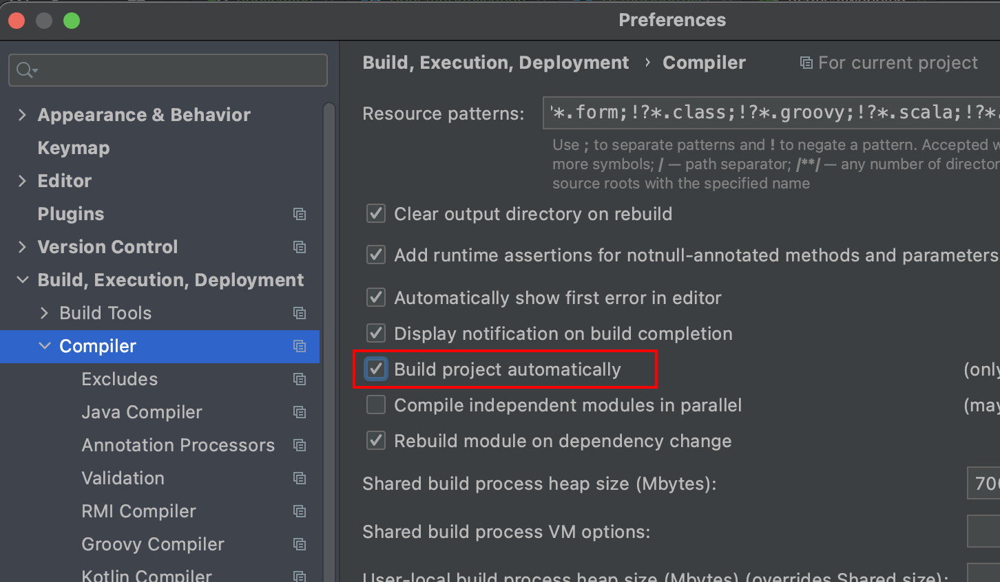

Shift cmd option /

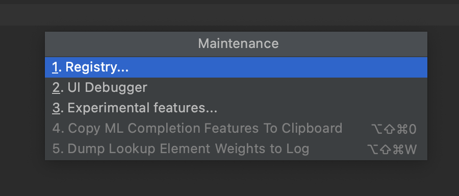

勾选 compiler.automake.allow.when.app.running

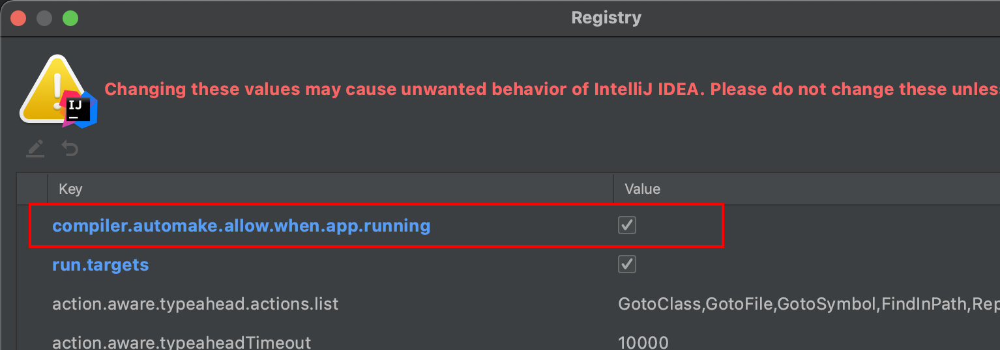

### 验证原理

```java
@Component
public class Devtools implements InitializingBean {
    private static final Logger log = LoggerFactory.getLogger(Devtools.class);

    @Override
    public void afterPropertiesSet() throws Exception {
        log.info("guava-jar classLoader: " +
                DispatcherServlet.class.getClassLoader().toString());
        log.info("Devtools ClassLoader: " +
                this.getClass().getClassLoader().toString());
    }
}
```

使用了不同的类加载器

```
2021-07-25 01:35:04.927  INFO 14110 --- [  restartedMain] com.shred.spdemo.config.Devtools         : guava-jar classLoader: jdk.internal.loader.ClassLoaders$AppClassLoader@512ddf17
2021-07-25 01:35:04.927  INFO 14110 --- [  restartedMain] com.shred.spdemo.config.Devtools         : Devtools ClassLoader: org.springframework.boot.devtools.restart.classloader.RestartClassLoader@324d60cc

```

### **排除资源**

某些资源在更改后不一定需要触发重新启动。例如，Thymeleaf模板可以就地编辑。默认情况下，改变 资源 /META-INF/maven ， /META-INF/resources ， /resources ， /static ， /public ，
 或 /templates 不触发重新启动，但确会触发现场重装。如果要自定义这些排除项，则可以使用该

spring.devtools.restart.exclude 属性。例如，仅排除 /static ， /public 您将设置以下属性:


## 全局配置文件

全局配置文件能够对一些默认配置值进行修改及自定义配置。
Spring Boot使用一个application.properties或者application.yaml的文件作为全局配置文件

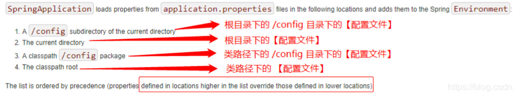

也可以从ConfigFileApplicationListener这类便可看出，其中DEFAULT_SEARCH_LOCATIONS属性设置 了加载的目录:

```
–file:./config/
–file:./
–classpath:/config/
–classpath:/
```

#### 优先级

翻译成语言如下( 按照优先级从高到低的顺序 ):

1. 先去项目根目录找config文件夹下找配置文件件 
2.  再去根目录下找配置文件
3. 去resources下找cofnig文件夹下找配置文件
4. 去resources下找配置文件

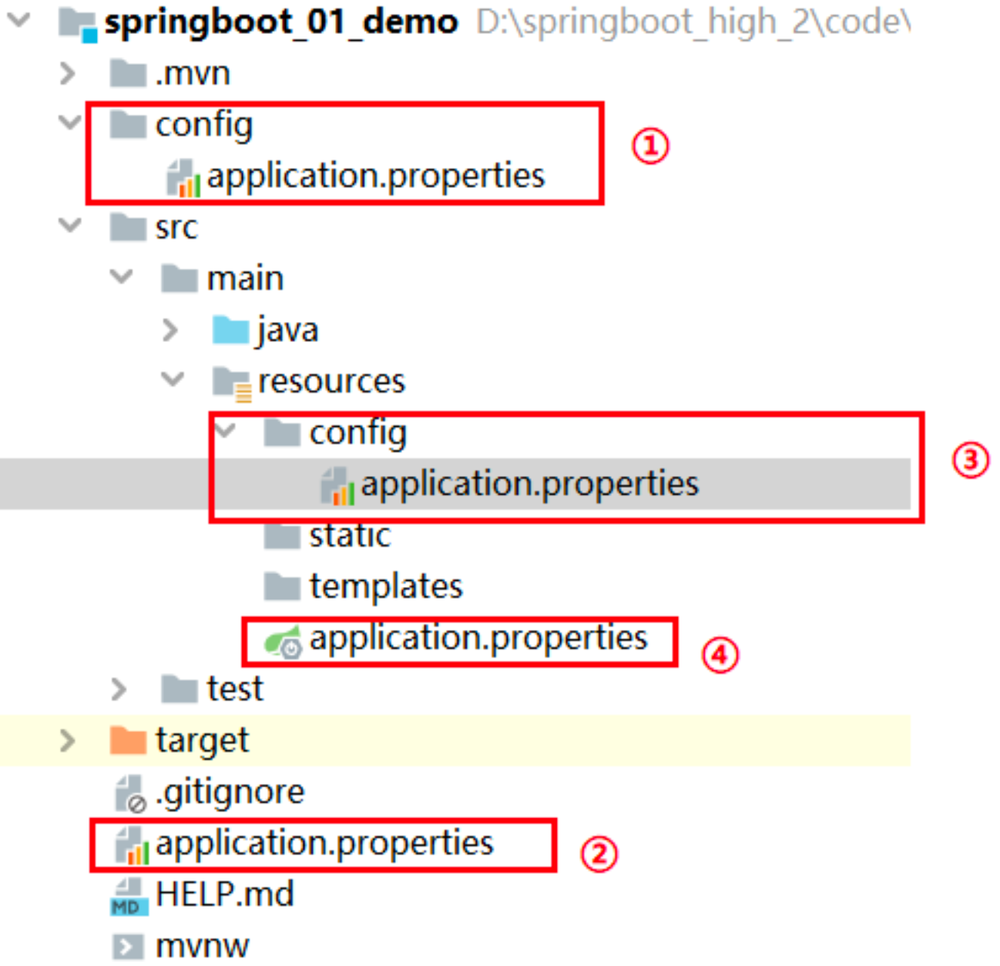


整个设计非常巧妙。SpringBoot会从这四个位置全部加载主配置文件，如果高优先级中配置文件属性与 低优先级配置文件不冲突的属性，则会共同存在— 互补配置 。

SpringBoot会加载全部主配置文件;互补配置;

#### 备注:

这里说的配置文件，都还是项目里面。最终都会被打进jar包里面的，需要注意。 
1、如果同一个目录下，有application.yml也有application.properties，默认先读取application.properties。 
2、如果同一个配置属性，在多个配置文件都配置了，默认使用第1个读取到的，后面读取的不覆盖前面读取
到的。 
3、创建SpringBoot项目时，一般的配置文件放置在“项目的resources目录下”


如果我们的配置文件名字不叫application.properties或者application.yml，可以通过以下参数来指定 配置文件的名字，myproject是配置文件名

```bash
$ java -jar myproject.jar --spring.config.name=myproject
```

我们同时也可以指定其他位置的配置文件来生效
指定配置文件和默认加载的这些配置文件共同起作用形成互补配置。

```bash
$ java -jar run-0.0.1-SNAPSHOT.jar --spring.config.location=D:/application.properties
```


#### **知识点补充!**

`Spring Boot 2.4 `改进了处理 `application.properties `和 `application.yml` 配置文件的方式，

如果是2.4.0之前版本，优先级 properties>yaml

但是如果是2.4.0的版本，优先级 yaml>properties

如果想继续使用 Spring Boot 2.3 的配置逻辑，也可以通过在 application.properties 或者 application.yml 配置文件中添加以下参数:


### @PropertySource

功能

- 加载指定的属性文件（*.properties）到 Spring 的 Environment 中。可以配合 @Value 和
  @ConfigurationProperties 使用。
- @PropertySource 和 @Value
  组合使用，可以将自定义属性文件中的属性变量值注入到当前类的使用@Value注解的成员变量中。
- @PropertySource 和 @ConfigurationProperties
  组合使用，可以将属性文件与一个Java类绑定，将属性文件中的变量值注入到该Java类的成员变量中。

```java
@Target(ElementType.TYPE)
@Retention(RetentionPolicy.RUNTIME)
@Documented
@Repeatable(PropertySources.class)
public @interface PropertySource {

    /**
     * 属性源的名称
     */
    String name() default "";

    /**
     * 属性文件的存放路径
     */
    String[] value();

    /**
     * 如果指定的属性源不存在，是否要忽略这个错误
     */
    boolean ignoreResourceNotFound() default false;

    /**
     * 属性源的编码格式
     */
    String encoding() default "";

    /**
     * 属性源工厂
     */
    Class<? extends PropertySourceFactory> factory() default PropertySourceFactory.class;

}
```


### Application.properties

定义实体

#### @ConfigurationProperties

@ConfigurationProperties(prefix = "person")注解的作用是将配置文件中以person开头的属性值通过 **setXX()**方法注入到实体类对应属性中

```java

@Data@NoArgsConstructor@AllArgsConstructor
public class Pet {
    private String type;
    private String name;
}

@Data@NoArgsConstructor@AllArgsConstructor
@Component//注入容器
@ConfigurationProperties(prefix = "person") // 实现属性的批量注入
public class Person {
    private int id; //id
    private String name; //名称
    private List hobby; //爱好
    private String[] family; //家庭成员
    private Map map;
    private Pet pet; //宠物 
}

```


打开项目的resources目录下的application.properties配置文件，在该配置文件中编写需要对 Person类设置的配置属性

```properties
person.family=aa
person.id=111
person.hobby=干饭,code,睡觉
person.name=谁的粉丝
person.map.k1=v1
person.map.k2=v2
person.pet.type=penguin
person.pet.name=QQ
```

测试

```java
@RunWith(SpringRunner.class)
@SpringBootTest
class SpdemoApplicationTests {
    @Autowired
    private Person person;

    @Test
    void contextLoads() {
        System.out.println(person);
        //Person(id=111, name=谁的粉丝, hobby=[吃饭, code, 大殴斗], family=[aa], map={k1=v1, k2=v2}, pet=Pet(type=dog, name=旺财))

    }

}
```

### **application.yaml****配置文件

YAML文件格式是Spring Boot支持的一种JSON超集文件格式，以数据为中心，比properties、xml等更

适合做配置文件

yml和xml相比，少了一些结构化的代码，使数据更直接，一目了然
l 相比properties文件更简洁 YAML文件的扩展名可以使用.yml或者.yaml。
application.yml文件使用 “key:(空格)value”格式配置属性，使用缩进控制层级关系。

```yaml
person:
  family: sdf
  hobby: [play,code,slep]
  map: {k1:v1,k2:v2}
  id: 111
  name: shred
  pet:
    name: QQ
    type: penguin
```

## 属性注入

 使用Spring Boot全局配置文件设置属性时:

如果配置属性是Spring Boot已有属性，例如服务端口server.port，那么Spring Boot内部会自动扫描并 读取这些配置文件中的属性值并覆盖默认属性。

如果配置的属性是用户自定义属性，例如刚刚自定义的Person实体类属性，还必须在程序中注入这些配 置属性方可生效。

### 常用注解

@Configuration:声明一个类作为配置类 
@Bean:声明在方法上，将方法的返回值加入Bean容器
@Value:属性注入
@ConfigurationProperties(prefix = "jdbc"):批量属性注入 
@PropertySource("classpath:/jdbc.properties")指定外部属性文件。在类上添加

###  @Value 属性值注入 

不需要set方法，直接标注在属性上就可以注入

```
@Configuration
public class JdbcConfig {

    @Value("${jdbc.driver}")
    private String driverClassName;

    @Value("${jdbc.url}")
    private String url;

    @Value("${jdbc.username}")
    private String username;

    @Value("${jdbc.password}")
    private String password;

    @Bean
    public DataSource dataSource(){
        DruidDataSource druidDataSource = new DruidDataSource();
        druidDataSource.setDriverClassName(driverClassName);
        druidDataSource.setUrl(url);
        druidDataSource.setUsername(username);
        druidDataSource.setPassword(password);

        return druidDataSource;
    }

}
```

### @ConfigurationProperties

批量注入

```java
@Configuration//注入容器
@EnableConfigurationProperties(JdbcConfig.class)//使下面的注解生效
@ConfigurationProperties(prefix = "jdbc")
@Data
public class JdbcConfig {

//    @Value("${jdbc.driver}")
    private String driverClassName;

//    @Value("${jdbc.url}")
    private String url;

//    @Value("${jdbc.username}")
    private String username;

//    @Value("${jdbc.password}")
    private String password;

    @Bean
    public DataSource dataSource(){
        DruidDataSource druidDataSource = new DruidDataSource();
        druidDataSource.setDriverClassName(driverClassName);
        druidDataSource.setUrl(url);
        druidDataSource.setUsername(username);
        druidDataSource.setPassword(password);

        return druidDataSource;
    }

}

```


第三方jar包属性配置

 @ConfigurationProperties 除了 用于注释类之外，您还可以在公共 @Bean 方法上使用它。当要将属性绑定到控件之外的第三方组件时，这样做特别有用。

- 第三方jar包中的实体类

```
@Data
public class ThirdPartComponent {

    private Boolean enabled;

    private InetAddress remoteAddress;
}

```

- 自定义配置类

@ConfigurationProperties(prefix = "another") 标注在方法上，实现该bean的属性批量注入

```java
@Configuration
public class ThirdPartCompConfig {

    @Bean
    @ConfigurationProperties(prefix = "another")
    public ThirdPartComponent thirdPartComponent(){
        return new ThirdPartComponent();
    }

}
```

- 编写配置

```yaml
third:
  enabled: true
  remoteAddress: 192.168.1.11
```

- test

```java
@Autowired
private ThirdPartComponent thirdPartComponent;

@Test
public void test2(){
    System.out.println(thirdPartComponent);
}
```


### **松散绑定**

Spring Boot使用一些宽松的规则将环境属性绑定到@ConfigurationProperties bean，因此环境属性名 和bean属性名之间不需要完全匹配

```
@Data
@Component
@ConfigurationProperties("acme.my-person.person")
public class OwnerProperties {
    private String firstName;
}
```

```
acme:
  my-person:
    person:
      first-name: aabb
```

- 松散绑定规则

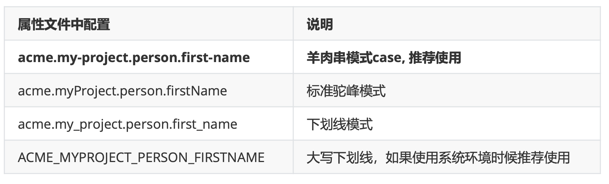


### @ConfigurationProperties vs @Value

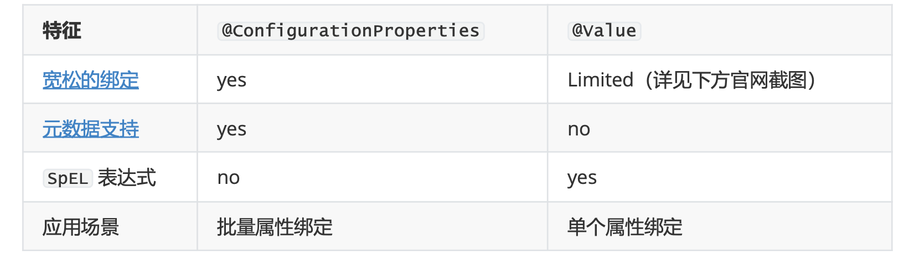

https://docs.spring.io/spring-boot/docs/2.4.0/reference/html/appendix-configuration-metadata.html#configuration-metadata

# 日志


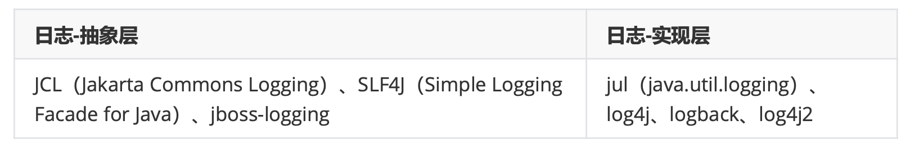


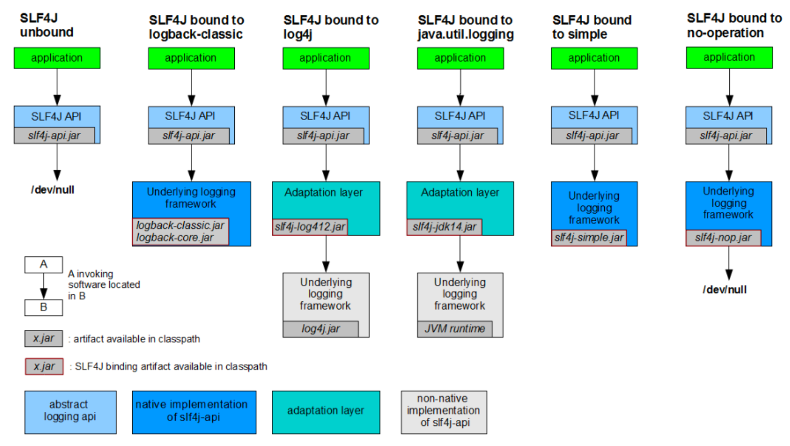


遗留问题:A项目(slf4J + logback): Spring(commons logging)、Hibernate(jboss-logging)、mybatis....
 一般情况下，在项目中存在着各种不同的第三方 jar ，且它们的日志选择也可能不尽相同，显然这样是不利于我们使用的，那么如果我们想为项目设置统一的日志框架该怎么办呢? 

在 SLF4J 官方，也给了我们参考的例子 http://www.slf4j.org/legacy.html


从图中我们得到一种统一日志框架使用的方式，可以使用一种和要替换的日志框架类完全一样的 jar 进 行替换，这样不至于原来的第三方 jar 报错，而这个替换的 jar 其实使用了 SLF4J API. 这样项目中的日 志就都可以通过 SLF4J API 结合自己选择的框架进行日志输出。


## SpringBoot 日志统一

### 一、排除其他框架中的日志框架

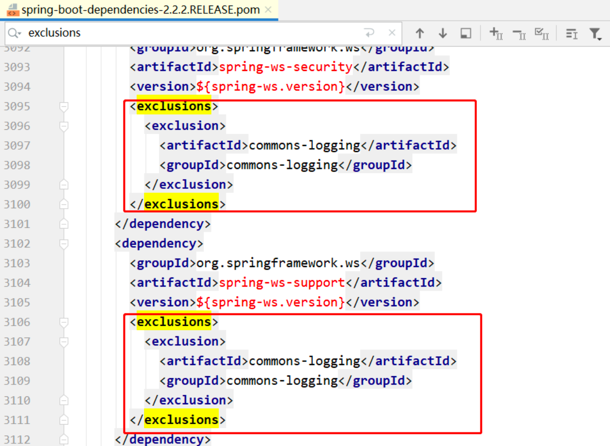


### 二、引入日志框架适配包

Spring Boot 是使用了 **SLF4J+logback** 的日志框架组合，查看 Spring Boot 项目的 Maven 依赖关系可 以看到 Spring Boot 的核心启动器 spring-boot-starter 引入了 **spring-boot-starter-logging**

```
<dependency>
  <groupId>org.springframework.boot</groupId>
  <artifactId>spring-boot-starter-logging</artifactId>
  <version>2.4.0.RELEASE</version>
</dependency>
```

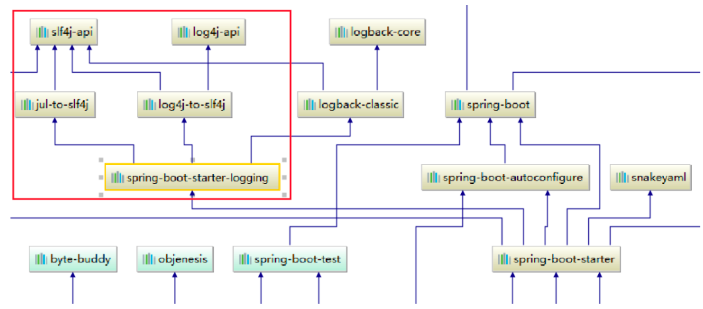

而 spring-boot-starter-logging 的 Maven 依赖主要引入了 ：
logback-classic (包含了日志框架 Logback 的实现)，
log4j-to-slf4j (在 log4j 日志框架作者开发此框架的时候还没有想到使用日志抽象层进行开 发，因此出现了 log4j 向 slf4j 转换的工具)，
jul-to-slf4j ( Java 自带的日志框架转换为 slf4j).

```xml
<dependencies>
  <dependency>
    <groupId>ch.qos.logback</groupId>
    <artifactId>logback-classic</artifactId>
    <version>1.2.3</version>
    <scope>compile</scope>
  </dependency>
  <dependency>
    <groupId>org.apache.logging.log4j</groupId>
    <artifactId>log4j-to-slf4j</artifactId>
    <version>2.13.3</version>
    <scope>compile</scope>
	</dependency>
  <dependency>
    <groupId>org.slf4j</groupId>
    <artifactId>jul-to-slf4j</artifactId>
    <version>1.7.30</version>
    <scope>compile</scope>
  </dependency>
</dependencies>
```


- test

```java
Logger logger = LoggerFactory.getLogger(this.getClass());

@Test
public void testLog(){

    // 按级别升序
    logger.trace("trace ...");
    logger.debug("debug...");
    logger.info("info...");// spring boot 默认日志级别为info，也就是sb的root级别
    logger.warn("warn...");
    logger.error("error...");

}
```

已知日志级别从小到大为 `trace < debug < info < warn < error` . 运行得到输出如下。由此可见 **Spring Boot INFO**.

```
2021-07-25 17:14:13.207  INFO 19372 --- [           main] com.shred.spdemo.SpdemoApplicationTests  : info...
2021-07-25 17:14:13.207  WARN 19372 --- [           main] com.shred.spdemo.SpdemoApplicationTests  : warn...
2021-07-25 17:14:13.207 ERROR 19372 --- [           main] com.shred.spdemo.SpdemoApplicationTests  : error...
```

从上面的日志结合 Logback 日志格式可以知道 Spring Boot 默认日志格式是

```
%d{yyyy-MM-dd HH:mm:ss.SSS} [%thread] %-5level %logger{50} - %msg%n # %d{yyyy-MM-dd HH:mm:ss.SSS} 时间
# %thread 线程名称
# %-5level 日志级别从左显示5个字符宽度
# %logger{50} 类名
# %msg%n 日志信息加换行
```


至于为什么 Spring Boot 的默认日志输出格式是这样?

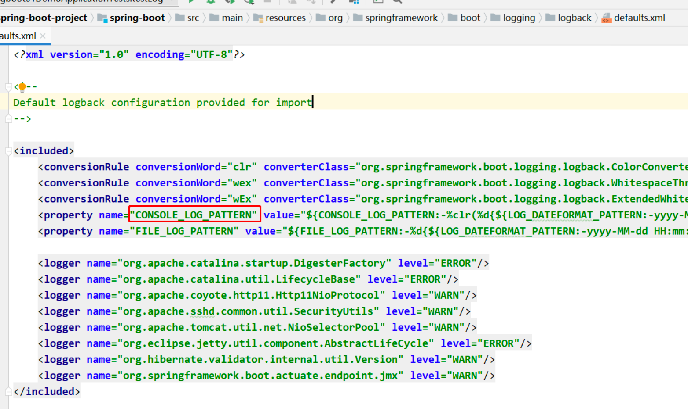


**自定义日志输出** 

可以直接在配置文件编写日志相关配置

关于日志的输出路径，可以使用 logging.file 或者 logging.path 进行定义，两者存在关系如下表。

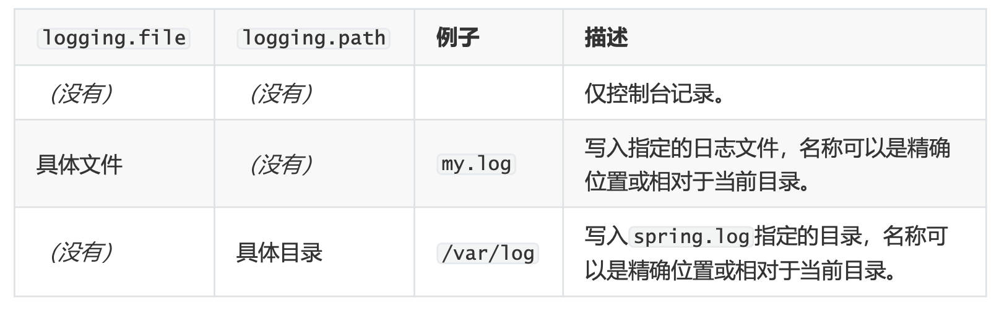


因为 Log4j 日志框架已经年久失修，原作者都觉得写的不好，所以下面演示替换日志框架为 Log4j2 的 方式。根据官网我们 Log4j2 与 logging 需要二选一，因此修改 pom如下

https://docs.spring.io/spring-boot/docs/current/reference/html/using.html#using-boot

```
<dependency>
    <groupId>org.springframework.boot</groupId>
    <artifactId>spring-boot-starter-web</artifactId>
    <exclusions>
        <exclusion>
            <artifactId>spring-boot-starter-logging</artifactId>
            <groupId>org.springframework.boot</groupId>
        </exclusion>
    </exclusions>
</dependency>
<dependency>
    <groupId>org.springframework.boot</groupId>
    <artifactId>spring-boot-starter-log4j2</artifactId>
</dependency>
```


# 缓存

1 开启基于注解的缓存功能:主启动类标注@EnableCaching

2 标注缓存相关注解:@Cacheable、CacheEvict、CachePut

### @Cacheable

将方法运行的结果进行缓存，以后再获取相同的数据时，直接从缓存中获取，不再 调用方法

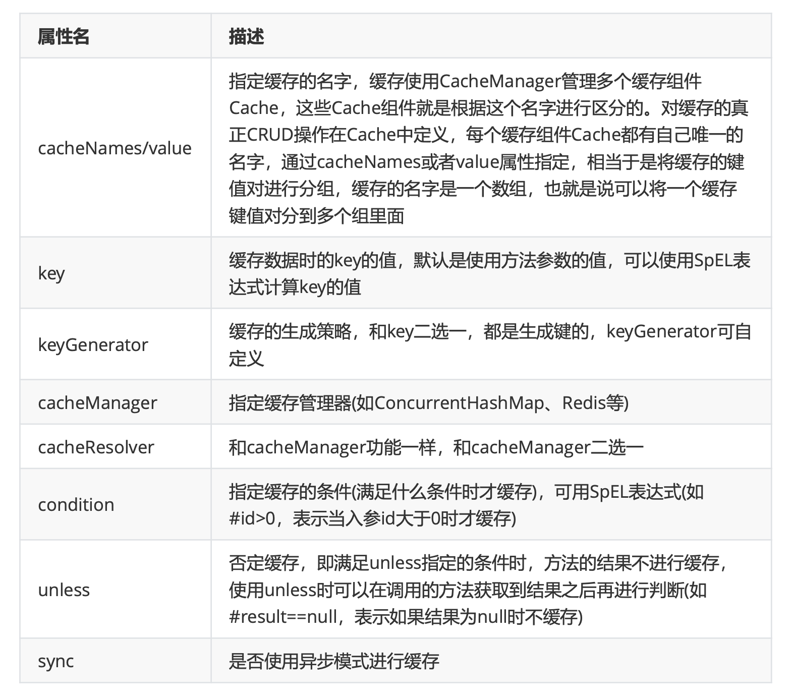


1既满足condition又满足unless条件的也不进行缓存  

2使用异步模式进行缓存时(sync=true):unless条件将不被支持

### 使用spEl

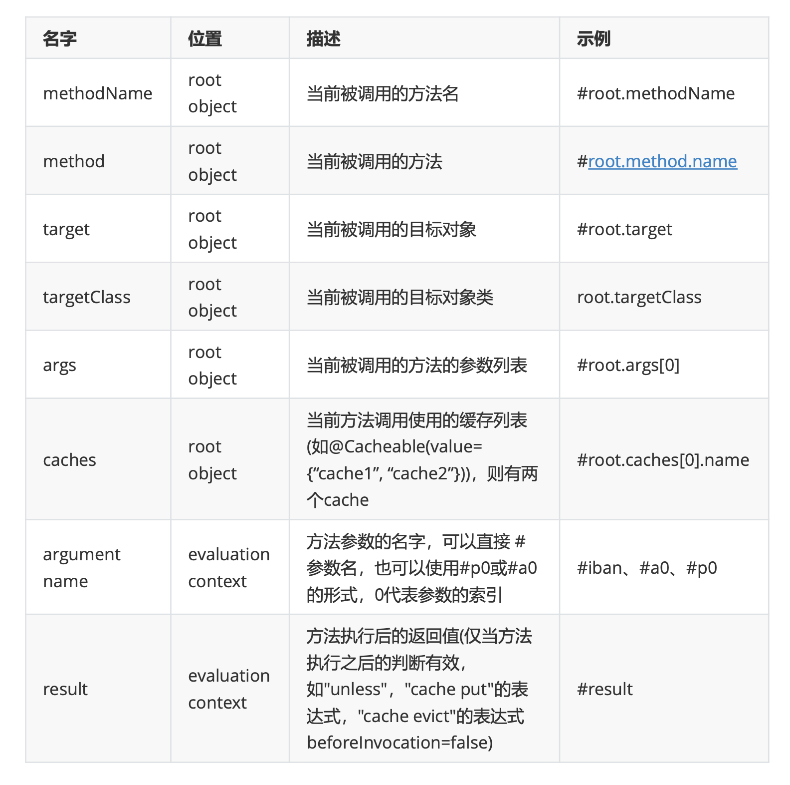

## @CachePut&@CacheEvict&@CacheConfig

### @CachePut

1、说明:既调用方法，又更新缓存数据，一般用于更新操作，在更新缓存时一定要和想更新的缓 存有相同的缓存名称和相同的key(可类比同一张表的同一条数据)
2、运行时机:   
1先调用目标方法

2将目标方法的结果缓存起来

 3、示例:

```
@CachePut(value = "emp",key = "#employee.id")
public Employee updateEmp(Employee employee){
    employeeMapper.updateEmp(employee);
    return employee;
}
```

总结 :@CachePut标注的方法总会被调用，且调用之后才将结果放入缓存，因此可以使用#result 获取到方法的返回值。

### @CacheEvict

1、说明:缓存清除，清除缓存时要指明缓存的名字和key，相当于告诉数据库要删除哪个表中的 哪条数据，key默认为参数的值

2、属性:   
value/cacheNames:缓存的名字   
key:缓存的键   
allEntries:是否清除指定缓存中的所有键值对，默认为false，设置为true时会清除缓存中 的所有键值对，与key属性二选一使用

beforeInvocation:在@CacheEvict注解的方法调用之前清除指定缓存，默认为false，即 在方法调用之后清除缓存，设置为true时则会在方法调用之前清除缓存(在方法调用之前还是之后 清除缓存的区别在于方法调用时是否会出现异常，若不出现异常，这两种设置没有区别，若出现异 常，设置为在方法调用之后清除缓存将不起作用，因为方法调用失败了)

3、示例:

```
@CacheEvict(value = "emp",key = "#id",beforeInvocation = true)
public void delEmp(Integer id){
    employeeMapper.deleteEmpById(id);
}
```

**@CacheConfig**

1、作用:标注在类上，抽取缓存相关注解的公共配置，可抽取的公共配置有缓存名字、主键生成 器等(如注解中的属性所示)

```
@Target({ElementType.TYPE})
@Retention(RetentionPolicy.RUNTIME)
@Documented
public @interface CacheConfig {
    String[] cacheNames() default {};
    String keyGenerator() default "";
    String cacheManager() default "";
    String cacheResolver() default "";
}
```

 2、示例:通过@CacheConfig的cacheNames 属性指定缓存的名字之后，该类中的其他缓存注 解就不必再写value或者cacheName了，会使用该名字作为value或cacheName的值，当然也遵循 就近原则


```java
@Service
@CacheConfig(cacheNames = "emp")
public class EmployeeService {
@Autowired
    EmployeeMapper employeeMapper;
@Cacheable
    public Employee getEmpById(Integer id) {
        Employee emp = employeeMapper.getEmpById(id);
        return emp;
}
    @CachePut(key = "#employee.id")
    public Employee updateEmp(Employee employee) {
        employeeMapper.updateEmp(employee);
        return employee;
    }
  @CacheEvict(key = "#id", beforeInvocation = true)
    public void delEmp(Integer id) {
        employeeMapper.deleteEmpById(id);
    }
}
```

