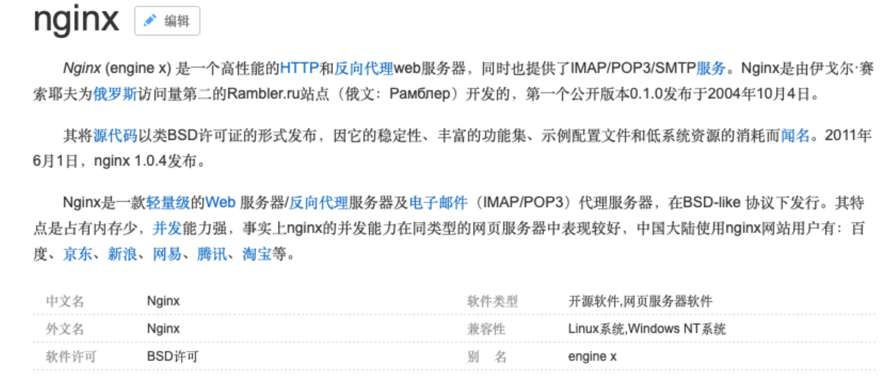
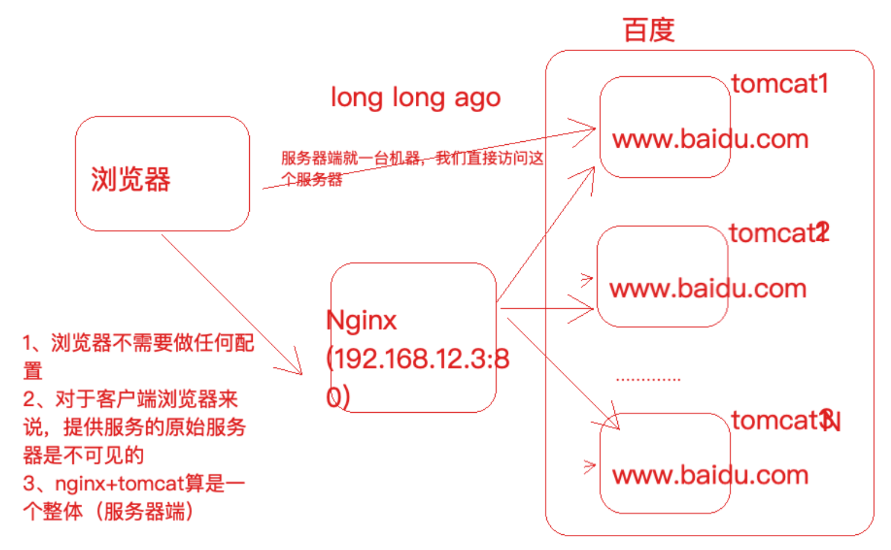
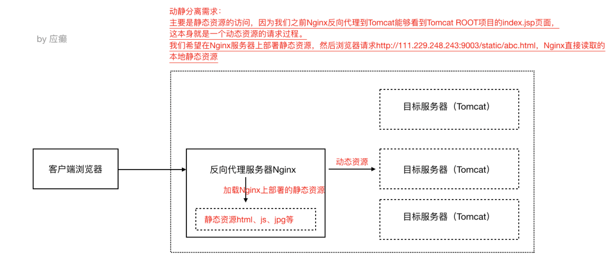
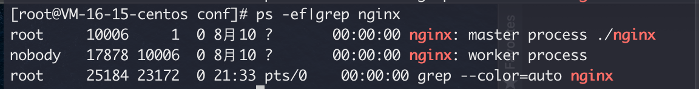
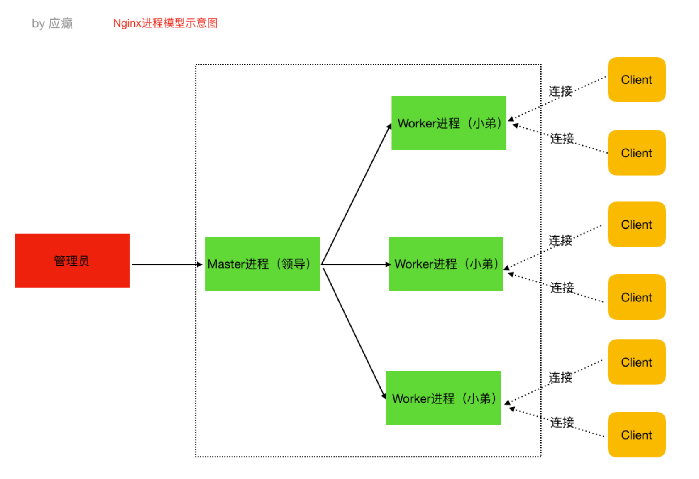

### Nginx 到底是什么?

Nginx 是一个高性能的HTTP和反向代理web服务器，核心特点是占有内存少，并发能力强 Nginx 又能做什么事情(应用场景)

### Nginx 又能做什么事情(应用场景)

- Http服务器(Web服务器) 性能非常高，非常注重效率，能够经受高负载的考验。
  支持50000个并发连接数，不仅如此，CPU和内存的占用也非常的低，10000个没有活动的连 接才占用2.5M的内存。

- 反向代理服务器 

  - 正向代理
    在浏览器中配置代理服务器的相关信息，通过代理服务器访问目标网站，代理服务器收到目标网站的响应之后，会把响应信息返回给我们自己的浏览器客户端

  - 反向代理

    浏览器客户端发送请求到反向代理服务器(比如Nginx)，由反向代理服务器选择原始 服务器提供服务获取结果响应，最终再返回给客户端浏览器



负载均衡服务器
负载均衡，当一个请求到来的时候(结合上图)，Nginx反向代理服务器根据请求去找到一个 原始服务器来处理当前请求，那么这叫做反向代理。那么，如果目标服务器有多台(比如上 图中的tomcat1，tomcat2，tomcat3...)，找哪一个目标服务器来处理当前请求呢，这样一 个寻找确定的过程就叫做负载均衡。
生活中也有很多这样的例子，比如，我们去银行，可以处理业务的窗口有多个，那么我们会
被分配到哪个窗口呢到底，这样的一个过程就叫做负载均衡。负载均衡就是为了解决高负载的问题。

动静分离


Nginx 的特点

- 跨平台:Nginx可以在大多数类unix操作系统上编译运行，而且也有windows版本 
- Nginx的上手非常容易，配置也比较简单
- 高并发，性能好
- 稳定性也特别好，宕机概率很低


### 常用命令

./nginx 启动nginx

./nginx -s stop 终止nginx(当然也可以找到nginx进程号，然后使用kill -9 杀掉nginx进程) 

./nginx -s reload (重新加载nginx.conf配置文件)


## Nginx负载均衡策略

###  轮询

  默认策略，每个请求按时间顺序逐一分配到不同的服务器，如果某一个服务器下线，能自动剔除

upstream lagouServer{
  server 111.229.248.243:8080;
  server 111.229.248.243:8082;
}
location /abc {
  proxy_pass http://lagouServer/;
}

### weight

 weight代表权重，默认每一个负载的服务器都为1，权重越高那么被分配的请求越多(用于服务器性能不均衡的场景)


```conf
upstream lagouServer{
  server 111.229.248.243:8080 weight=1;
  server 111.229.248.243:8082 weight=2;
}
```


### ip_hash

每个请求按照ip的hash结果分配，每一个客户端的请求会固定分配到同一个目标服务器处理，可以解决session共享问题

```
upstream lagouServer{
  ip_hash;
  server 111.229.248.243:8080;
  server 111.229.248.243:8082;
}
```


## Nginx应用场景之动静分离

动静分离就是讲动态资源和静态资源的请求处理分配到不同的服务器上，比较经典的组合就是 Nginx+Tomcat架构(Nginx处理静态资源请求，Tomcat处理动态资源请求)，那么其实之前的讲解 中，Nginx反向代理目标服务器Tomcat，我们能看到目标服务器ROOT项目的index.jsp，这本身就是 Tomcat在处理动态资源请求了。
所以，我们只需要配置静态资源访问即可。



Nginx配置

	# 静态资源处理
	location /static/{
		root staticData;
	}

### Nginx底层进程机制剖析

Nginx启动后，以daemon多进程方式在后台运行，包括一个Master进程和多个Worker进程，Master
进程是领导，是老大，Worker进程是干活的小弟。



### master进程 

主要是管理worker进程，比如:

- 接收外界信号向各worker进程发送信号(./nginx -s reload) 
- 监控worker进程的运行状态，当worker进程异常退出后Master进程会自动重新启动新的 worker进程等

### worker进程

worker进程具体处理网络请求。多个worker进程之间是对等的，他们同等竞争来自客户端的请 求，各进程互相之间是独立的。一个请求，只可能在一个worker进程中处理，一个worker进程， 不可能处理其它进程的请求。worker进程的个数是可以设置的，一般设置与机器cpu核数一致。

### Nginx进程模型示意图如下



以 `./nginx -s reload` 来说明nginx信号处理这部分 

1)master进程对配置文件进行语法检查 
2)尝试配置(比如修改了监听端口，那就尝试分配新的监听端口) 
3)尝试成功则使用新的配置，新建worker进程 
4)新建成功，给旧的worker进程发送关闭消息 
5)旧的worker进程收到信号会继续服务，直到把当前进程接收到的请求处理完毕后关闭 所以reload之后worker进程pid是发生了变化的

- worker进程处理请求部分的说明 

例如，我们监听9003端口，一个请求到来时，如果有多个worker进程，那么每个worker进程都有可能处理这个链接。 
master进程创建之后，会建立好需要监听的的socket，然后从master进程再fork出多个worker进程。所以，所有worker进程的监听描述符listenfd在新连接到来时都变得可读。 
nginx使用互斥锁来保证只有一个workder进程能够处理请求，拿到互斥锁的那个进程注册 `listenfd`读事件，在读事件里调用accept接受该连接，然后解析、处理、返回客户端

- nginx多进程模型好处

每个worker进程都是独立的，不需要加锁，节省开销 每个worker进程都是独立的，互不影响，一个异常结束，其他的照样能提供服务 多进程模型为reload热部署机制提供了支撑

