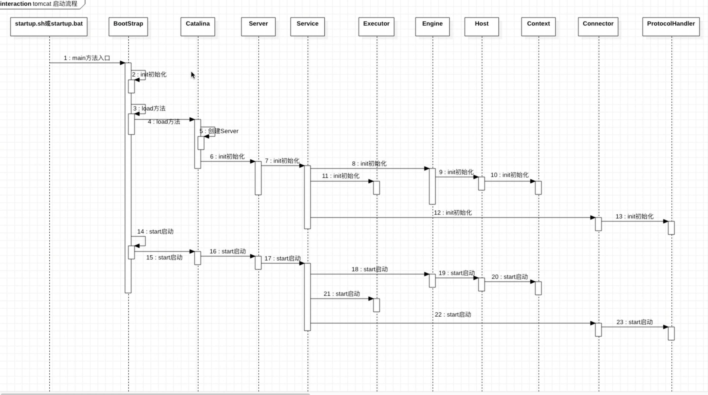
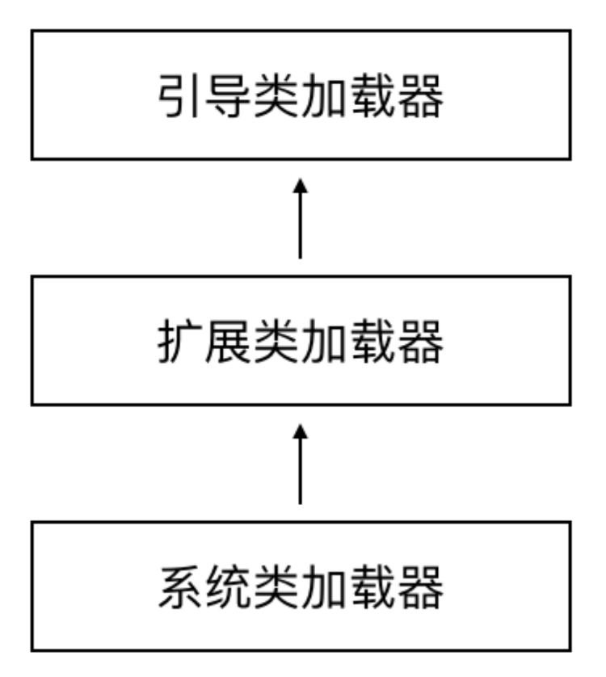
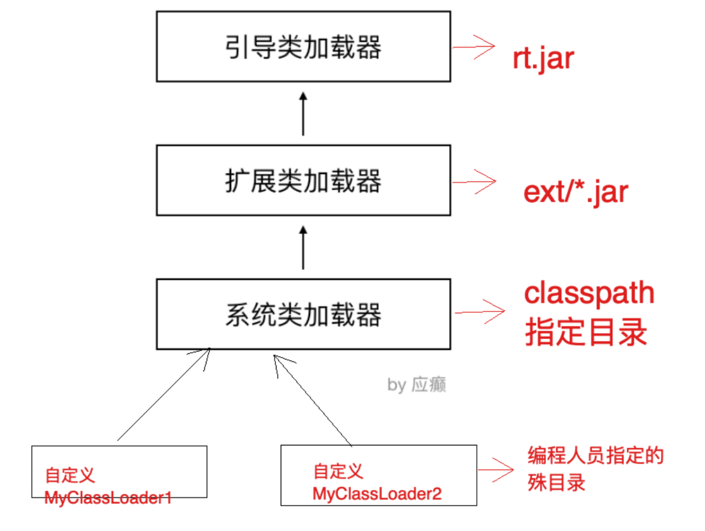
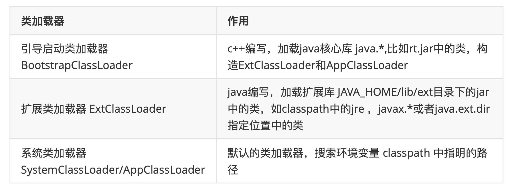
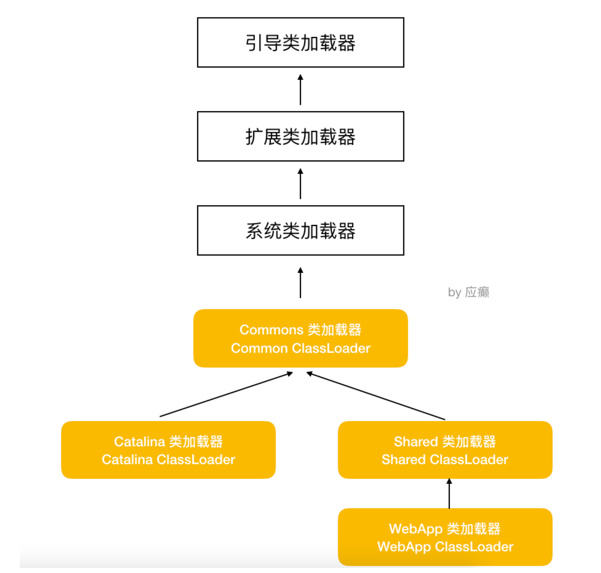

预备知识：

- NIO
- NIO2
- Thread


VMoptions 表明source

```
-Dcatalina.home=/Users/shred/develop/back/lgjava/tomcat/apache-tomcat-8.5.50-src/source
-Dcatalina.base=/Users/shred/develop/back/lgjava/tomcat/apache-tomcat-8.5.50-src/source
-Djava.util.logging.manager=org.apache.juli.ClassLoaderLogManager
-Djava.util.logging.config.file=/Users/shred/develop/back/lgjava/tomcat/apache-tomcat-8.5.50-src/source/conf/logging.properties
```

## tomcat启动流程图




### NioEndpoint.SocketProcessor#doRun

```
org.apache.tomcat.util.net.NioEndpoint.SocketProcessor#doRun
。。。。。。。
if (handshake == 0) {
    SocketState state = SocketState.OPEN;
    // Process the request from this socket
    if (event == null) {
        state = getHandler().process(socketWrapper, SocketEvent.OPEN_READ);
    } else {
        //org.apache.coyote.AbstractProtocol$ConnectionHandler
        //go
        state = getHandler().process(socketWrapper, event);
    }
    if (state == SocketState.CLOSED) {
        close(socket, key);
    }
```

### ConnectionHandler#process

```
org.apache.coyote.AbstractProtocol.ConnectionHandler#process
。。。。。
 // processor 解析socket，封装成req、res
 // 从connections 获取processor
 Processor processor = connections.get(socket);
 。。。。。。
state = processor.process(wrapper, status);
。。。。。

```


### AbstractProcessorLight#process

```java
//org.apache.coyote.AbstractProcessorLight#process
public SocketState process(SocketWrapperBase<?> socketWrapper, SocketEvent status)
        throws IOException {

    SocketState state = SocketState.CLOSED;
    Iterator<DispatchType> dispatches = null;
    do {
        if (dispatches != null) {
            DispatchType nextDispatch = dispatches.next();
            if (getLog().isDebugEnabled()) {
                getLog().debug("Processing dispatch type: [" + nextDispatch + "]");
            }
            state = dispatch(nextDispatch.getSocketStatus());
            if (!dispatches.hasNext()) {
                state = checkForPipelinedData(state, socketWrapper);
            }
        } else if (status == SocketEvent.DISCONNECT) {
            // Do nothing here, just wait for it to get recycled
        } else if (isAsync() || isUpgrade() || state == SocketState.ASYNC_END) {
            state = dispatch(status);
            state = checkForPipelinedData(state, socketWrapper);
        } else if (status == SocketEvent.OPEN_WRITE) {
            // Extra write event likely after async, ignore
            state = SocketState.LONG;
        } else if (status == SocketEvent.OPEN_READ) {
        //go
            state = service(socketWrapper);
```

Http11Processor extends AbstractProcessor

### Http11Processor#service

```java
//org.apache.coyote.http11.Http11Processor#service
public class Http11Processor extends AbstractProcessor {

  public SocketState service(SocketWrapperBase<?> socketWrapper)
      throws IOException {
      RequestInfo rp = request.getRequestProcessor();
      。。。。。。。
      getAdapter().service(request, response);

```


### CoyoteAdapter#service

```
org.apache.catalina.connector.CoyoteAdapter#service
。。。。。。
// 根据url找到对应的一系列的容器
postParseSuccess = postParseRequest(req, request, res, response);
```


### CoyoteAdapter#postParseRequest

- 向请求对象Request中封装MappingData，映射对应的host、context、servlet

```
//org.apache.catalina.connector.CoyoteAdapter#postParseRequest
。。。。。。
while (mapRequired) {
    // This will map the the latest version by default
    // 封装MappingData
    connector.getService().getMapper().map(serverName, decodedURI,
            version, request.getMappingData());
```

### Mapper#map

```java
//org.apache.catalina.mapper.Mapper#map
public void map(MessageBytes host, MessageBytes uri, String version,
                    MappingData mappingData) throws IOException {

        if (host.isNull()) {
            host.getCharChunk().append(defaultHostName);
        }
        host.toChars();
        uri.toChars();
        internalMap(host.getCharChunk(), uri.getCharChunk(), version,
                mappingData);
    }

//org.apache.catalina.mapper.Mapper#internalMap
/**
 * Map the specified URI.
 * @throws IOException
 */
private final void internalMap(CharChunk host, CharChunk uri,
        String version, MappingData mappingData) throws IOException {

    if (mappingData.host != null) {
        // The legacy code (dating down at least to Tomcat 4.1) just
        // skipped all mapping work in this case. That behaviour has a risk
        // of returning an inconsistent result.
        // I do not see a valid use case for it.
        throw new AssertionError();
    }

    // Virtual host mapping 找到mappedHost
    MappedHost[] hosts = this.hosts;
    MappedHost mappedHost = exactFindIgnoreCase(hosts, host);
    if (mappedHost == null) {
        // Note: Internally, the Mapper does not use the leading * on a
        //       wildcard host. This is to allow this shortcut.
        int firstDot = host.indexOf('.');
        if (firstDot > -1) {
            int offset = host.getOffset();
            try {
                host.setOffset(firstDot + offset);
                mappedHost = exactFindIgnoreCase(hosts, host);
            } finally {
                // Make absolutely sure this gets reset
                host.setOffset(offset);
            }
        }
        if (mappedHost == null) {
            mappedHost = defaultHost;
            if (mappedHost == null) {
                return;
            }
        }
    }
    mappingData.host = mappedHost.object;

    if (uri.isNull()) {
        // Can't map context or wrapper without a uri
        return;
    }

    uri.setLimit(-1);

    // Context mapping 找到context
    ContextList contextList = mappedHost.contextList;
    MappedContext[] contexts = contextList.contexts;
    int pos = find(contexts, uri);
    if (pos == -1) {
        return;
    }

    int lastSlash = -1;
    int uriEnd = uri.getEnd();
    int length = -1;
    boolean found = false;
    MappedContext context = null;
    while (pos >= 0) {
        context = contexts[pos];
        if (uri.startsWith(context.name)) {
            length = context.name.length();
            if (uri.getLength() == length) {
                found = true;
                break;
            } else if (uri.startsWithIgnoreCase("/", length)) {
                found = true;
                break;
            }
        }
        if (lastSlash == -1) {
            lastSlash = nthSlash(uri, contextList.nesting + 1);
        } else {
            lastSlash = lastSlash(uri);
        }
        uri.setEnd(lastSlash);
        pos = find(contexts, uri);
    }
    uri.setEnd(uriEnd);

    if (!found) {
        if (contexts[0].name.equals("")) {
            context = contexts[0];
        } else {
            context = null;
        }
    }
    if (context == null) {
        return;
    }

    mappingData.contextPath.setString(context.name);

    ContextVersion contextVersion = null;
    ContextVersion[] contextVersions = context.versions;
    final int versionCount = contextVersions.length;
    if (versionCount > 1) {
        Context[] contextObjects = new Context[contextVersions.length];
        for (int i = 0; i < contextObjects.length; i++) {
            contextObjects[i] = contextVersions[i].object;
        }
        mappingData.contexts = contextObjects;
        if (version != null) {
            contextVersion = exactFind(contextVersions, version);
        }
    }
    if (contextVersion == null) {
        // Return the latest version
        // The versions array is known to contain at least one element
        contextVersion = contextVersions[versionCount - 1];
    }
    mappingData.context = contextVersion.object;
    mappingData.contextSlashCount = contextVersion.slashCount;

    // Wrapper mapping
    // 找到servlet
    if (!contextVersion.isPaused()) {
        internalMapWrapper(contextVersion, uri, mappingData);
    }

}
```

### MappingData

```java
public class MappingData {//封装一次请求所对应的信息

    public Host host = null;
    public Context context = null;
    public int contextSlashCount = 0;
    public Context[] contexts = null;
    public Wrapper wrapper = null;
    public boolean jspWildCard = false;

    public final MessageBytes contextPath = MessageBytes.newInstance();
    public final MessageBytes requestPath = MessageBytes.newInstance();
    public final MessageBytes wrapperPath = MessageBytes.newInstance();
    public final MessageBytes pathInfo = MessageBytes.newInstance();

    public final MessageBytes redirectPath = MessageBytes.newInstance();

    // Fields used by ApplicationMapping to implement javax.servlet.http.HttpServletMapping
    public MappingMatch matchType = null;
```

## 处理


```
//org.apache.catalina.core.StandardEngineValve#invoke
public final void invoke(Request request, Response response)
    throws IOException, ServletException {

    // Select the Host to be used for this Request
    Host host = request.getHost();
    if (host == null) {
        response.sendError
            (HttpServletResponse.SC_BAD_REQUEST,
             sm.getString("standardEngine.noHost",
                          request.getServerName()));
        return;
    }
    if (request.isAsyncSupported()) {
        request.setAsyncSupported(host.getPipeline().isAsyncSupported());
    }

    // Ask this Host to process this request
    host.getPipeline().getFirst().invoke(request, response);

}
```


```
//org.apache.catalina.valves.AbstractAccessLogValve#invoke
public void invoke(Request request, Response response) throws IOException,
        ServletException {
    if (tlsAttributeRequired) {
        // The log pattern uses TLS attributes. Ensure these are populated
        // before the request is processed because with NIO2 it is possible
        // for the connection to be closed (and the TLS info lost) before
        // the access log requests the TLS info. Requesting it now causes it
        // to be cached in the request.
        request.getAttribute(Globals.CERTIFICATES_ATTR);
    }
    getNext().invoke(request, response);
}
```


```
//org.apache.catalina.valves.ErrorReportValve#invoke
public void invoke(Request request, Response response) throws IOException, ServletException {
```


org.apache.catalina.core.StandardHostValve#invoke

```
        Context context = request.getContext();
				context.getPipeline().getFirst().invoke(request, response);
```

### StandardWrapperValve#invoke

```java
//org.apache.catalina.core.StandardWrapperValve#invoke

ApplicationFilterChain filterChain =ApplicationFilterFactory.createFilterChain(request, wrapper, servlet);
 filterChain.doFilter(request.getRequest(), response.getResponse());
```


### 执行顺序

```
org.apache.catalina.valves.AbstractAccessLogValve#invoke

org.apache.catalina.valves.ErrorReportValve#invoke

org.apache.catalina.core.StandardHostValve#invoke

org.apache.catalina.authenticator.AuthenticatorBase#invoke

org.apache.catalina.core.StandardContextValve#invoke

org.apache.catalina.core.StandardWrapperValve#invoke
```

# 类加载机制

## JVM 的类加载机制

JVM 的类加载机制中有一个非常重要的⻆色叫做类加载器(ClassLoader)，类加载器有自己的体系， Jvm内置了几种类加载器，包括:引导类加载器、扩展类加载器、系统类加载器，他们之间形成父子关 系，通过 Parent 属性来定义这种关系，最终可以形成树形结构。





### 类加载器的作用



另外:用户可以自定义类加载器(Java编写，用户自定义的类加载器，可加载指定路径的 class 文件)

当 JVM 运行过程中，用户自定义了类加载器去加载某些类时，会按照下面的步骤(父类委托机制)

    1) 用户自己的类加载器，把加载请求传给父加载器，父加载器再传给其父加载器，一直到加载器 树的顶层
    2) 最顶层的类加载器首先针对其特定的位置加载，如果加载不到就转交给子类
    3) 如果一直到底层的类加载都没有加载到，那么就会抛出异常 ClassNotFoundException

因此，按照这个过程可以想到，如果同样在 classpath 指定的目录中和自己工作目录中存放相同的 class，会优先加载 classpath 目录中的文件

## 双亲委派机制


当某个类加载器需要加载某个.class文件时，它首先把这个任务委托给他的上级类加载器，递归这个操
作，如果上级的类加载器没有加载，自己才会去加载这个类。

### 作用

1. 防止重复加载同一个.class。通过委托去向上面问一问，加载过了，就不用再加载一遍。保证数据安全。

2. 保证核心.class不能被篡改。通过委托方式，不会去篡改核心.class，即使篡改也不会去加载，即使 加载也不会是同一个.class对象了。不同的加载器加载同一个.class也不是同一个.class对象。这样 保证了class执行安全(如果子类加载器先加载，那么我们可以写一些与java.lang包中基础类同名 的类， 然后再定义一个子类加载器，这样整个应用使用的基础类就都变成我们自己定义的类了。 )

  Object类 -----> 自定义类加载器(会出现问题的，那么真正的Object类就可能被篡改了)

## Tomcat 的类加载机制

Tomcat 的类加载机制相对于 Jvm 的类加载机制做了一些改变。 

没有严格的遵从双亲委派机制，也可以说打破了双亲委派机制 

比如:有一个tomcat，webapps下部署了两个应用 
app1/lib/a-1.0.jar com.lagou.edu.Abc
app2/lib/a-2.0.jar com.lagou.edu.Abc 
不同版本中Abc类的内容是不同的，代码是不一样的



- 引导类加载器 和 扩展类加载器 的作用不变
- 系统类加载器正常情况下加载的是 CLASSPATH 下的类，但是 Tomcat 的启动脚本**并未使用该变量**，而是**加载tomcat启动的类**，比如bootstrap.jar，通常在catalina.bat或者catalina.sh中指定。 位于`CATALINA_HOME/bin`下
- **Common 通用类加载器**加载Tomcat使用以及应用通用的一些类，位于CATALINA_HOME/lib下， 比如servlet-api.jar
- **Catalina ClassLoader** 用于加载服务器内部可⻅类，这些类应用程序不能访问 
- **Shared ClassLoader** 用于加载应用程序共享类，这些类服务器不会依赖
- **Webapp ClassLoader**，每个应用程序都会有一个独一无二的Webapp ClassLoader，他用来加载 本应用程序 `/WEB-INF/classes` 和 `/WEB-INF/lib` 下的类。

tomcat 8.5 默认改变了严格的双亲委派机制

1. 首先从 Bootstrap Classloader加载指定的类 
2. 如果未加载到，则从 /WEB-INF/classes加载 
3. 如果未加载到，则从 /WEB-INF/lib/*.jar 加载
4. 如果未加载到，则依次从 System、Common、Shared 加载(在这最后一步，遵从双亲委派 机制)

