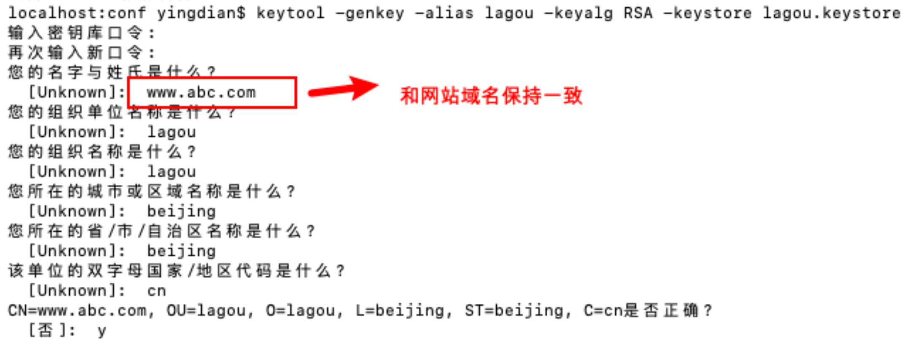
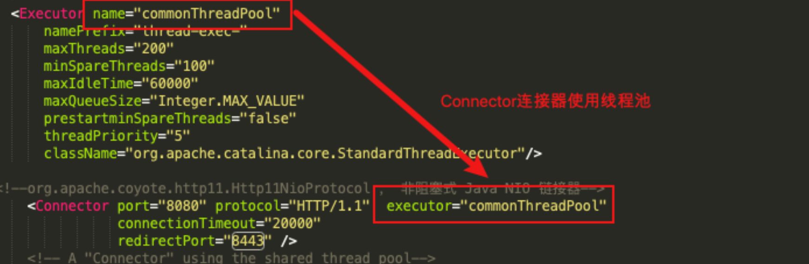

b/s(浏览器/服务器模式) 浏览器是客户端(发送http请求) ———> 服务器端

## 浏览器访问服务器的流程

http请求的处理过程


注意：浏览器访问服务器使用的是Http协议，**Http是应用层协议，用于定义数据通信的格式**，具体的**数据传输使用的是TCP/IP协议**


## 1、Tomcat 系统总体架构

Tomcat是一个**Http服务器**(能够接收并且处理http请求，所以tomcat是一个http服务器)

我们使用浏览器向某一个网站发起请求，发出的是Http请求，那么在远程，Http服务器接收到这个请求 之后，会调用具体的程序(Java类)进行处理，往往不同的请求由不同的Java类完成处理。


HTTP 服务器接收到请求之后把请求交给Servlet容器来处理，Servlet 容器通过Servlet接口调用业务 类。**Servlet接口和Servlet容器这一整套内容叫作Servlet规范。**

注意:Tomcat既按照Servlet规范的要求去实现了Servlet容器，同时它也具有HTTP服务器的功能。 Tomcat的两个重要身份
1)http服务器
2)Tomcat是一个Servlet容器

## 2、Tomcat Servlet容器处理流程

当用户请求某个URL资源时

1)HTTP服务器会把请求信息使用ServletRequest对象封装起来 

2)进一步去调用Servlet容器中某个具体的Servlet

3)在 2)中，Servlet容器拿到请求后，根据URL和Servlet的映射关系，找到相应的Servlet 

4)如果Servlet还没有被加载，就用反射机制创建这个Servlet，并调用Servlet的**init方法来完成初始化** 

5)接着调用这个具体Servlet的service方法来处理请求，请求处理结果使用ServletResponse对象封装 

6)把ServletResponse对象返回给HTTP服务器，HTTP服务器会把响应发送给客户端


## 3、Tomcat 系统总体架构

通过上面的讲解，我们发现tomcat有两个非常重要的功能需要完成 

1)和客户端浏览器进行交互，进行socket通信，将字节流和Request/Response等对象进行转换 

2)Servlet容器处理业务逻辑


Tomcat 设计了两个核心组件连接器(Connector)和容器(Container)来完成 Tomcat 的两大核心 功能。

**连接器**，负责对外交流: 处理Socket连接，负责网络字节流与Request和Response对象的转化; 

**容器**，负责内部处理:加载和管理Servlet，以及具体处理Request请求;


## 4、连接器组件 Coyote

### 简介

Coyote 是Tomcat 中连接器的组件名称 , 是对外的接口。客户端通过Coyote与服务器建立连接、发送请 求并接受响应 。

(1)Coyote **封装了底层的网络通信(Socket 请求及响应处理)**

(2)Coyote 使Catalina 容器(容器组件)与具体的**请求协议及IO操作方式完全解耦**

(3)**Coyote 将Socket 输入转换封装为 Request 对象**，进一步封装后交由Catalina 容器进行处理，处 理请求完成后, Catalina **通过Coyote 提供的Response 对象将结果写入输出流**

(4)Coyote 负责的是**具体协议(应用层)和IO(传输层)**相关内容

- Tomcat Coyote 支持的 IO模型与协议如下


在 8.0 之前 ，Tomcat 默认采用的I/O方式为 BIO，之后改为 NIO。 无论 NIO、NIO2 还是 APR， 在性 能方面均优于以往的BIO。 如果采用APR， 甚至可以达到 Apache HTTP Server 的影响性能。

默认使用HTTP/1.1协议

###  Coyote 的内部组件及流程


- Coyote 组件及作用


## 5、Servlet 容器 Catalina

Tomcat是一个由一系列可配置(conf/server.xml)的组件构成的Web容器，而Catalina是Tomcat的 servlet容器。

从另一个⻆度来说，Tomcat 本质上就是一款 Servlet 容器， 因为 Catalina 才是 Tomcat 的核心 ， 其 他模块都是为Catalina 提供支撑的。 比如 : 通过 Coyote 模块提供链接通信，Jasper 模块提供 JSP 引 擎，Naming 提供JNDI 服务，Juli 提供日志服务。


### Catalina 的结构

Tomcat(我们往往有一个认识，Tomcat就是一个Catalina的实例，因为Catalina是Tomcat的核心)


其实，可以认为整个Tomcat就是一个Catalina实例，Tomcat 启动的时候会初始化这个实例，Catalina 实例通过加载server.xml完成其他实例的创建，创建并管理一个Server，Server创建并管理多个服务， 每个服务又可以有多个Connector和一个Container。

一个Catalina实例(容器)
 一个 Server实例(容器)
 多个Service实例(容器) 

每一个Service实例下可以有多个Connector实例和一个Container实例

#### Catalina

负责解析Tomcat的配置文件(server.xml) , 以此来创建服务器Server组件并进行管理

#### Server

服务器表示整个Catalina Servlet容器以及其它组件，负责组装并启动Servlaet引擎,Tomcat连接 器。Server通过实现Lifecycle接口，提供了一种优雅的启动和关闭整个系统的方式

#### Service

服务是Server内部的组件，一个Server包含多个Service。它将若干个Connector组件绑定到一个 Container

#### Container 

容器，负责处理用户的servlet请求，并返回对象给web用户的模块

### Container 组件的具体结构

Container组件下有几种具体的组件，分别是Engine、Host、Context和Wrapper。这4种组件(容器)是父子关系。Tomcat通过一种分层的架构，使得Servlet容器具有很好的灵活性。 

#### **Engine**

表示整个Catalina的Servlet引擎，用来管理多个虚拟站点，一个Service最多只能有一个Engine， 但是一个引擎可包含多个Host

#### **Host**

Host 代表一个**虚拟主机**，或者说一个站点，可以给Tomcat配置多个虚拟主机地址，而一个虚拟主机下
可包含多个Context

#### **Context**

Context表示一个Web应用程序， 一个Web应用可包含多个Wrapper 

#### **Wrapper**

表示一个Servlet，Wrapper 作为容器中的最底层，不能包含子容器 

上述组件的配置其实就体现在conf/server.xml中。

# Tomcat 服务器核心配置详解

核心配置在tomcat目录下conf/server.xml文件

主要标签结构如下:

```xml
 
<!--
Server 根元素，创建一个Server实例，子标签有 Listener、GlobalNamingResources、
Service
-->
<Server>
	<!--定义监听器-->
	<Listener/> 
  <!--定义服务器的全局JNDI资源 --> 
  <GlobalNamingResources/> 
  <!--定义一个Service服务，一个Server标签可以有多个Service服务实例 -->
  <Service/>
</Server>
```

### Server 标签

```xml
<Server port="8005" shutdown="SHUTDOWN">
     <!-- 以日志形式输出服务器 、操作系统、JVM的版本信息 -->
  <Listener className="org.apache.catalina.startup.VersionLoggerListener" />
  <!-- Security listener. Documentation at /docs/config/listeners.html
  <Listener className="org.apache.catalina.security.SecurityListener" />
  -->
  <!-- 加载(服务器启动) 和 销毁 (服务器停止) APR。 如果找不到APR库， 则会输出日志， 并
不影响 Tomcat启动 -->
  <!--APR library loader. Documentation at /docs/apr.html -->
  <Listener className="org.apache.catalina.core.AprLifecycleListener" SSLEngine="on" />
  <!-- Prevent memory leaks due to use of particular java/javax APIs-->
  <!-- 避免jre内存溢出 -->
  <Listener className="org.apache.catalina.core.JreMemoryLeakPreventionListener" />
<!-- 加载(服务器启动) 和 销毁(服务器停止) 全局命名服务 -->
  <Listener className="org.apache.catalina.mbeans.GlobalResourcesLifecycleListener" />
  <!-- 在Context停止时重建 Executor 池中的线程， 以避免ThreadLocal 相关的内存泄漏 -->
  <Listener className="org.apache.catalina.core.ThreadLocalLeakPreventionListener" />

  <!-- Global JNDI resources
       Documentation at /docs/jndi-resources-howto.html
  -->
  <!-- 全局命名服务 -->
  <GlobalNamingResources>
    <!-- Editable user database that can also be used by
         UserDatabaseRealm to authenticate users
    -->
    <Resource name="UserDatabase" auth="Container"
              type="org.apache.catalina.UserDatabase"
              description="User database that can be updated and saved"
              factory="org.apache.catalina.users.MemoryUserDatabaseFactory"
              pathname="conf/tomcat-users.xml" />
  </GlobalNamingResources>

  <!-- A "Service" is a collection of one or more "Connectors" that share
       a single "Container" Note:  A "Service" is not itself a "Container",
       so you may not define subcomponents such as "Valves" at this level.
       Documentation at /docs/config/service.html
   -->
  <Service name="Catalina">
  </Service>
</Server>
```


### Service 标签

```xml
 
<!--
该标签用于创建 Service 实例，默认使用 org.apache.catalina.core.StandardService。 默认情况下，Tomcat 仅指定了Service 的名称， 值为 "Catalina"。
  Service 子标签为 : Listener、Executor、Connector、Engine，
  其中:
    Listener 用于为Service添加生命周期监听器，
    Executor 用于配置Service 共享线程池，
    Connector 用于配置Service 包含的链接器，
    Engine 用于配置Service中链接器对应的Servlet 容器引擎
-->
<Service name="Catalina">
  ...
</Service>
```

### Executor 标签

```xml
<!--
默认情况下，Service 并未添加共享线程池配置。 如果我们想添加一个线程池， 可以在 <Service> 下添加如下配置:
  name:线程池名称，用于 Connector中指定
  namePrefix:所创建的每个线程的名称前缀，一个单独的线程名称为 namePrefix+threadNumber
  maxThreads:池中最大线程数 minSpareThreads:活跃线程数，也就是核心池线程数，这些线程不会被销毁，会一直存在 
	maxIdleTime:线程空闲时间，超过该时间后，空闲线程会被销毁，默认值为60000(1分钟)，单位毫秒
  maxQueueSize:在被执行前最大线程排队数目，默认为Int的最大值，也就是广义的无限。除非特殊情况，这个值 不需要更改，否则会有请求不会被处理的情况发生 
	prestartminSpareThreads:启动线程池时是否启动 minSpareThreads部分线程。默认值为false，即不启动 
	threadPriority:线程池中线程优先级，默认值为5，值从1到10 
	className:线程池实现类，未指定情况下，默认实现类为org.apache.catalina.core.StandardThreadExecutor。如果想使用自定义线程池首先需要实现 org.apache.catalina.Executor接口
-->
<Executor name="commonThreadPool"
    namePrefix="thread-exec-"
    maxThreads="200"
    minSpareThreads="100"
    maxIdleTime="60000"
    maxQueueSize="Integer.MAX_VALUE"
    prestartminSpareThreads="false"
    threadPriority="5"
    className="org.apache.catalina.core.StandardThreadExecutor"/>
 
```

### Connector 标签

https一般在8443端口监听，所以redirectPort为8443

```xml
 
<!-- 
port:
端口号，Connector 用于创建服务端Socket 并进行监听， 以等待客户端请求链接。如果该属性设置 为0， Tomcat将会随机选择一个可用的端口号给当前Connector 使用

protocol:
当前Connector 支持的访问协议。 默认为 HTTP/1.1 ， 并采用自动切换机制选择一个基于 JAVA NIO 的链接器或者基于本地APR的链接器(根据本地是否含有Tomcat的本地库判定) 

connectionTimeOut:
Connector 接收链接后的等待超时时间， 单位为 毫秒。 -1 表示不超时。 

redirectPort:
当前Connector 不支持SSL请求， 接收到了一个请求， 并且也符合security-constraint 约束， 需要SSL传输，Catalina自动将请求重定向到指定的端口。

executor:
指定共享线程池的名称， 也可以通过maxThreads、minSpareThreads 等属性配置内部线程池。

URIEncoding:
用于指定编码URI的字符编码， Tomcat8.x版本默认的编码为 UTF-8 , Tomcat7.x版本默认为ISO-8859-1

-->
<!--org.apache.coyote.http11.Http11NioProtocol ， 非阻塞式 Java NIO 链接器--> 
<Connector port="8080" protocol="HTTP/1.1" connectionTimeout="20000" redirectPort="8443" />

<Connector port="8009" protocol="AJP/1.3" redirectPort="8443" />
 
 <!-- Connector 维护自己的线程池 -->
<Connector port="8080"
          protocol="HTTP/1.1"
          executor="commonThreadPool"
          maxThreads="1000"
          minSpareThreads="100"
          acceptCount="1000"
          maxConnections="1000"
          connectionTimeout="20000"
          compression="on"
          compressionMinSize="2048"
          disableUploadTimeout="true"
          redirectPort="8443"
          URIEncoding="UTF-8" />
```

### Engine 标签

Engine 表示 Servlet 引擎

```xml
 
<!--
name: 用于指定Engine 的名称， 默认为Catalina
defaultHost:默认使用的虚拟主机名称， 当客户端请求指向的主机无效时， 将交由默认的虚拟主机处 理， 默认为localhost
-->
<Engine name="Catalina" defaultHost="localhost">
...
</Engine>
```

### Host 标签

Host 标签用于配置一个虚拟主机

```xml
 
<Host name="localhost"  appBase="webapps" unpackWARs="true" autoDeploy="true">
    ...
</Host>
```

### Context 标签

Context 标签用于配置一个Web应用，如下:

```xml
 
<Host name="www.abc.com"  appBase="webapps" unpackWARs="true"
autoDeploy="true">
<!--
docBase:Web应用目录或者War包的部署路径。可以是绝对路径，也可以是相对于 Host appBase的 相对路径。
path:Web应用的Context 路径。如果我们Host名为localhost， 则该web应用访问的根路径为: http://localhost:8080/web_demo。
-->
  <Context docBase="/Users/aaa/web_demo" path="/web_demo"></Context>

  <!--阀门-->
    <Valve className="org.apache.catalina.valves.AccessLogValve"
						directory="logs"
          	prefix="localhost_access_log" suffix=".txt"
						pattern="%h %l %u %t &quot;%r&quot; %s %b" />
</Host>

```

@@?? valve是什么，有何作用


# Tomcat 对 HTTPS 的支持

 Https是用来加强数据传输安全的

## HTTPS 简介


Http超文本传输协议，明文传输 ，传输不安全，https在传输数据的时候会对数据进行加密 ssl协议
TLS(transport layer security)协议

## HTTPS和HTTP的主要区别

- HTTPS协议使用时需要到电子商务认证授权机构(CA)申请SSL证书 
- HTTP默认使用8080端口，HTTPS默认使用8443端口 

- HTTPS则是具有SSL加密的安全性传输协议，对数据的传输进行加密，效果上相当于HTTP的升级 版 
- HTTP的连接是无状态的，不安全的;HTTPS协议是由SSL+HTTP协议构建的可进行加密传输、身 份认证的网络协议，比HTTP协议安全

## HTTPS工作原理


### Tomcat 对 HTTPS 的支持

1、使用 JDK 中的 keytool 工具生成免费的秘钥库文件(证书)。

```
keytool -genkey -alias lagou -keyalg RSA -keystore lagou.keystore
```



2、配置conf/server.xml

```
<Connector port="8443" protocol="org.apache.coyote.http11.Http11NioProtocol"
    maxThreads="150" schema="https" secure="true" SSLEnabled="true">
    <SSLHostConfig>
        <Certificate
certificateKeystoreFile="/Users/yingdian/workspace/servers/apache-tomcat-
8.5.50/conf/lagou.keystore" certificateKeystorePassword="lagou123"  type="RSA"
/>
    </SSLHostConfig>
</Connector>
```

3、使用https协议访问8443端口(https://localhost:8443)

# Tomcat 性能优化策略

系统性能的衡量指标，主要是响应时间和吞吐量。 

1. 响应时间：执行某个操作的耗时;

2) 吞吐量：系统在给定时间内能够支持的事务数量，单位为TPS(Transactions PerSecond的缩写，也 就是事务数/秒，一个事务是指一个客户机向服务器发送请求然后服务器做出反应的过程。

## Tomcat优化从两个方面进行

1. JVM虚拟机优化(优化内存模型)
2. Tomcat自身配置的优化(比如是否使用了共享线程池?IO模型?)

学习优化的原则

提供给大家优化思路，没有说有明确的参数值大家直接去使用，必须根据自己的真实生产环境来进行调
整，调优是一个过程

## 1、虚拟机运行优化(参数调整)

Java 虚拟机的运行优化

主要是内存分配和垃圾回收策略的优化:
  内存直接影响服务的运行效率和吞吐量
  垃圾回收机制会不同程度地导致程序运行中断(垃圾回收策略不同，垃圾回收次数和回收效率都是
  不同的)

1) Java 虚拟机内存相关参数


```
JAVA_OPTS="-server -Xms2048m -Xmx2048m -XX:MetaspaceSize=256m -XX:MaxMetaspaceSize=512m"
```

### JVM内存模型回顾


### jdk内存映射工具

```bash
  ps -ef|grep tomcat

jhsdb jmap --heap --pid 1542
```

## 2、 垃圾回收(GC)策略

### 垃圾回收性能指标

- 吞吐量:工作时间(排除GC时间)占总时间的百分比， 工作时间并不仅是程序运行的时间，还包 含内存分配时间。
- 暂停时间:由垃圾回收导致的应用程序停止响应次数/时间。

### 垃圾收集器

- 串行收集器(Serial Collector)
  单线程执行所有的垃圾回收工作， 适用于单核CPU服务器 
  工作进程-----|(单线程)垃圾回收线程进行垃圾收集|---工作进程继续 
- 并行收集器(Parallel Collector)
  工作进程-----|(多线程)垃圾回收线程进行垃圾收集|---工作进程继续
  又称为吞吐量收集器(关注吞吐量)， 以并行的方式执行年轻代的垃圾回收， 该方式可以显著降 低垃圾回收的开销(指多条垃圾收集线程并行工作，但此时用户线程仍然处于等待状态)。适用于多 处理器或多线程硬件上运行的数据量较大的应用
- 并发收集器(Concurrent Collector)
  以并发的方式执行大部分垃圾回收工作，以缩短垃圾回收的暂停时间。适用于那些响应时间优先于 吞吐量的应用， 因为该收集器虽然最小化了暂停时间(指用户线程与垃圾收集线程同时执行,但不一定是并行的，可能会交替进行)， 但是会降低应用程序的性能
- CMS收集器(Concurrent Mark Sweep Collector)
  并发标记清除收集器， 适用于那些更愿意缩短垃圾回收暂停时间并且负担的起与垃圾回收共享处
  理器资源的应用
- G1收集器(Garbage-First Garbage Collector)
  适用于大容量内存的多核服务器， 可以在满足垃圾回收暂停时间目标的同时， 以最大可能性实现 高吞吐量( JDK1.7之后)

### 垃圾回收器参数


在bin/catalina.sh的脚本中 , 追加如下配置 :

```bash
JAVA_OPTS="-XX:+UseConcMarkSweepGC"
```

### 监控工具jconsole

在$java_home/bin/jconsole


### Tomcat 配置调优

Tomcat自身相关的调优 

#### 调整tomcat线程池



#### 调整tomcat的连接器

 调整tomcat/conf/server.xml 中关于链接器的配置可以提升应用服务器的性能。

tomcat最大请求处理数量 = maxConnections + acceptCount


#### 禁用 AJP 连接器


#### 调整 IO 模式 

Tomcat8之前的版本默认使用BIO(阻塞式IO)，对于每一个请求都要创建一个线程来处理，不适合高并发;Tomcat8以后的版本默认使用NIO模式(非阻塞式IO)


当Tomcat并发性能有较高要求或者出现瓶颈时，我们可以尝试使用**APR模式，APR(Apache Portable Runtime)**是从**操作系统级别解决异步IO问题**，使用时需要在操作系统上安装APR和Native(因为APR 原理是使用动静分离

可以使用Nginx+Tomcat相结合的部署方案，Nginx负责静态资源访问，Tomcat负责Jsp等动态资 源访问处理(因为Tomcat不擅⻓处理静态资源)。技术调用操作系统底层的IO接口)

#### 动静分离

可以使用Nginx+Tomcat相结合的部署方案，Nginx负责静态资源访问，Tomcat负责Jsp等动态资 源访问处理(因为Tomcat不擅⻓处理静态资源)。

