# 一致性Hash算法

## 第 1 节 Hash算法应用场景

Hash算法在分布式集群架构中的应用场景 

Hash算法在很多分布式集群产品中都有应用，比如分布式集群架构Redis、Hadoop、ElasticSearch，Mysql分库分表，Nginx负载均衡等 

主要的应用场景归纳起来两个

- 请求的负载均衡(比如nginx的ip_hash策略) 
  Nginx的IP_hash策略可以在客户端ip不变的情况下，将其发出的请求始终路由到同一个目标服务
  器上，实现会话粘滞，避免处理session共享问题 如果没有IP_hash策略，那么如何实现会话粘滞? 可以维护一张映射表，存储客户端IP或者sessionid与具体目标服务器的映射关系 <ip,tomcat1>
  缺点
  1)那么，在客户端很多的情况下，映射表非常大，浪费内存空间 
  2)客户端上下线，目标服务器上下线，都会导致重新维护映射表，映射表维护成本很大

如果使用哈希算法，事情就简单很多，我们可以对**ip地址或者sessionid进行计算哈希值，哈希值与服务 器数量进行取模运算**，得到的值就是当前请求应该被路由到的服务器编号，如此，同一个客户端ip发送 过来的请求就可以路由到同一个目标服务器，实现会话粘滞。

```c
iphp->addr[i]表示客户真个IP， 通过三次哈希计算得出一个IP的哈希值：

　　for (i = 0; i < 3; i++) {
　　hash = (hash * 113 + iphp->addr[i]) % 6271;

　　}
```

- 分布式存储
  以分布式内存数据库Redis为例,集群中有redis1，redis2，redis3 三台Redis服务器
  那么,在进行数据存储时,<key1,value1>数据存储到哪个服务器当中呢?针对key进行hash处理 hash(key1)%3=index, 使用余数index锁定存储的具体服务器节点

## 一致性哈希算法

一致性哈希算法思路如下:

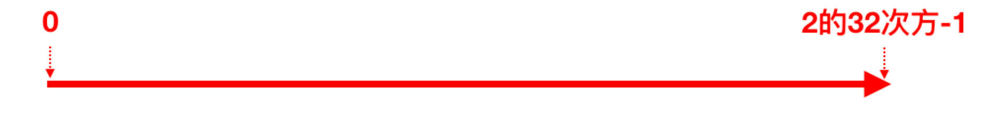

首先有一条直线，直线开头和结尾分别定为为1和2的32次方减1，这相当于一个地址，对于这样一条 线，弯过来构成一个圆环形成闭环，这样的一个圆环称为hash环。我们把服务器的ip或者主机名求 hash值然后对应到hash环上，那么针对客户端用户，也根据它的ip进行hash求值，对应到环上某个位置，然后如何确定一个客户端路由到哪个服务器处理呢？按照顺时针方向找最近的服务器节点

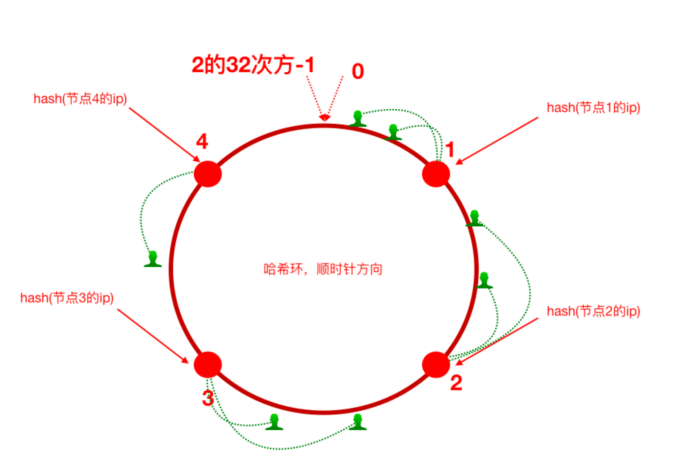

假如将服务器3下线，服务器3下线后，原来路由到3的客户端重新路由到服务器4，对于其他客户端没有 影响只是这一小部分受影响(请求的迁移达到了最小，这样的算法对分布式集群来说非常合适的，避免 了大量请求迁移 )

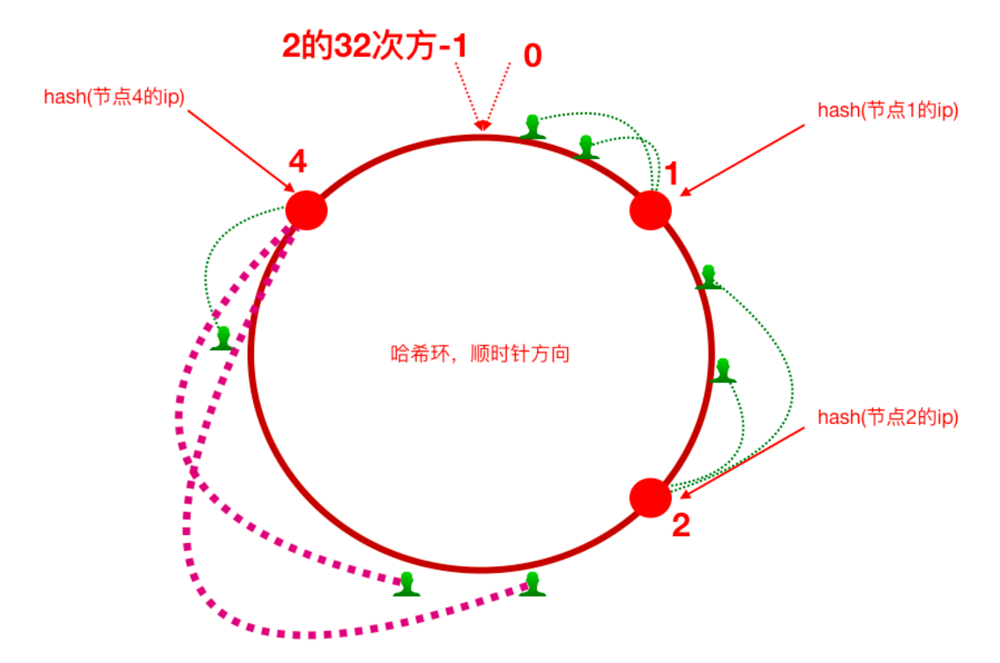

增加服务器5之后，原来路由到3的部分客户端路由到新增服务器5上，对于其他客户端没有影响只是这 一小部分受影响(请求的迁移达到了最小，这样的算法对分布式集群来说非常合适的，避免了大量请求 迁移 )

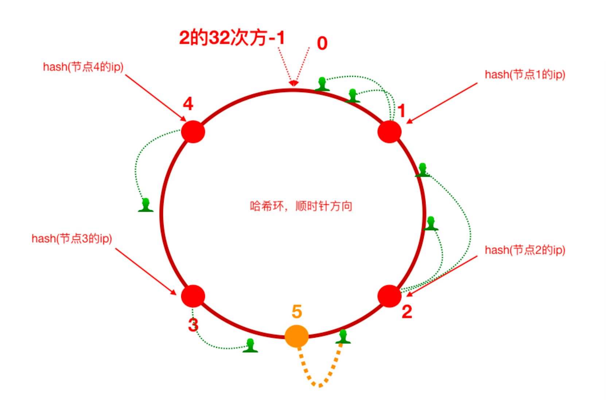

#### 数据(请求)倾斜问题

1、如前所述，每一台服务器负责一段，一致性哈希算法对于节点的增减都只需重定位环空间中的一小 部分数据，具有较好的容错性和可扩展性。

**但是**，一致性哈希算法在服务节点太少时，容易因为节点分部不均匀而造成数据倾斜问题。例如系统中 只有两台服务器，其环分布如下，节点2只能负责非常小的一段，大量的客户端请求落在了节点1上，这就是**数据(请求)倾斜问题** 

2、为了解决这种数据倾斜问题，一致性哈希算法引入了虚拟节点机制，即对每一个服务节点计算多个哈希，每个计算结果位置都放置一个此服务节点，称为**虚拟节点**。

具体做法可以在服务器ip或主机名的后面增加编号来实现。比如，可以为每台服务器计算三个虚拟节 点，于是可以分别计算 “节点1的ip#1”、“节点1的ip#2”、“节点1的ip#3”、“节点2的ip#1”、“节点2的 ip#2”、“节点2的ip#3”的哈希值，于是形成六个虚拟节点，当客户端被路由到虚拟节点的时候其实是被 路由到该虚拟节点所对应的真实节点

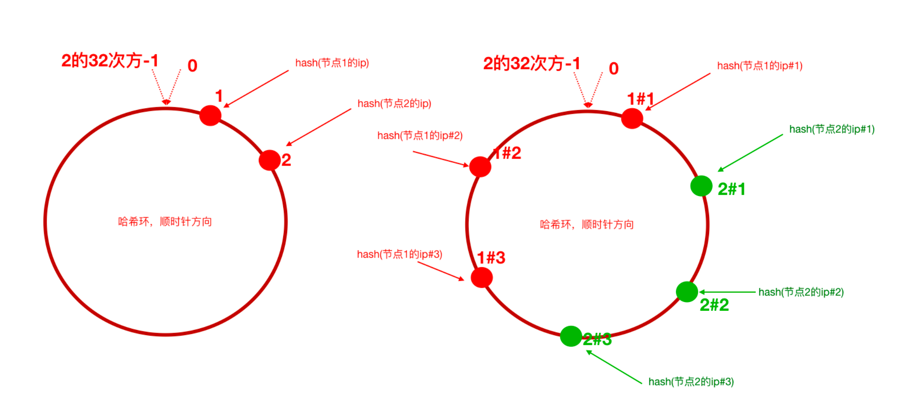


## Nginx 配置一致性Hash负载均衡策略

 `ngx_http_upstream_consistent_hash` 模块是一个负载均衡器，使用一个内部一致性hash算法来选择合适的后端节点。
该模块可以根据配置参数采取不同的方式将请求均匀映射到后端机器，
consistent_hash $remote_addr:可以根据客户端ip映射
consistent_hash $request_uri:根据客户端请求的uri映射
consistent_hash $args:根据客户端携带的参数进行映

ngx_http_upstream_consistent_hash 模块是一个第三方模块，需要我们下载安装后使用

1)github下载nginx一致性hash负载均衡模块 https://github.com/replay/ngx_http_consistent_hash
2)将下载的压缩包上传到nginx服务器，并解压 
3)我们已经编译安装过nginx，此时进入当时nginx的源码目录，执行如下命令

```bash
./configure —add-module=/root/ngx_http_consistent_hash-master
make
make install
```

4)Nginx就可以使用啦，在nginx.conf文件中配置

```bash
#负载均衡配置、别名 shredServer
    upstream shredServer{
        # 配置负载均衡：使用一致性哈希算法
        consistent_hash $request_uri;
        server 127.0.0.1:8080;
        server 127.0.0.1:8082;
}
```

# 时间同步

## 

```bash
# 是否安装ntp
rpm -qa|grep ntpdate

#使用 ntpdate 网络时间同步命令
ntpdate -u ntp.api.bz #从一个时间服务器同步时间
```


# 分布式ID

通常会需要一个唯一ID来标识数据，如果是单体架构，我们可以通过数据库的主键，或直接在内存中维护一个自增数字来作为ID都是可以的，但对于一个分布式系统，就会有可能会出现ID冲突，此时有以下解决方案：4种

uuid
mysql自增主键
雪花算法
redis、zookeeper

- UUID(可以用)
  UUID 是指Universally Unique Identifier，翻译为中文是通用唯一识别码 
  产生重复 UUID 并造成错误的情况非常低，是故大可不必考虑此问题。 Java中得到一个UUID，可以使用java.util包提供的方法

- 独立数据库的自增ID

  比如A表分表为A1表和A2表，那么肯定不能让A1表和A2表的ID自增，那么ID怎么获取呢?我们可 以单独的创建一个Mysql数据库，在这个数据库中创建一张表，这张表的ID设置为自增，其他地方 需要全局唯一ID的时候，就模拟向这个Mysql数据库的这张表中模拟插入一条记录，此时ID会自增，然后我们可以通过Mysql的select last_insert_id() 获取到刚刚这张表中自增生成的ID.

```sql
# 插入数据
insert into distribute_id( createtime) values(now());
# 获取自增id
select last_insert_id();
```

## 雪花算法

特点：

- 使用时间计算哈希，随时间递增
- 避免相同
- 效率高，同一台机器，一个毫秒内可生成4096个

id按照时间来生成
雪花算法是Twitter推出的一个用于生成分布式ID的策略。
雪花算法是一个算法，基于这个算法可以生成ID，生成的ID是一个long型，那么在Java中一个long 型是8个字节，算下来是64bit，如下是使用雪花算法生成的一个ID的二进制形式示意:

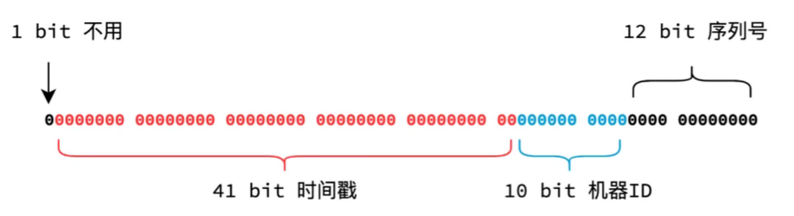

序列号12位，表示在一毫秒内，同一个机器能生成4096 个id

另外，一切互联网公司也基于上述的方案封装了一些分布式ID生成器，比如滴滴的tinyid(基于数 据库实现)、百度的uidgenerator(基于SnowFlake)和美团的leaf(基于数据库和SnowFlake) 等。


**实现**

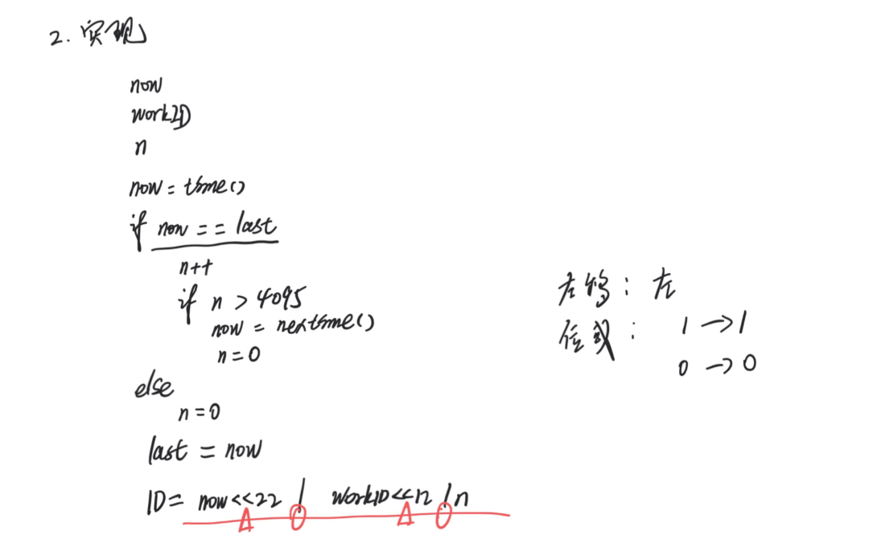

**移位原理**

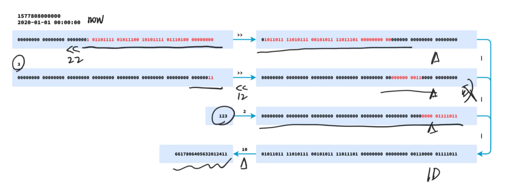

> 参考
>  https://www.cnblogs.com/Leo_wl/p/9565560.html

```java
/**
 * 官方推出，Scala编程语言来实现的
 * Java前辈用Java语言实现了雪花算法
 */
public class IdWorker{

    //下面两个每个5位，加起来就是10位的工作机器id
    private long workerId;    //工作id
    private long datacenterId;   //数据id
    //12位的序列号
    private long sequence;

    public IdWorker(long workerId, long datacenterId, long sequence){
        // sanity check for workerId
        if (workerId > maxWorkerId || workerId < 0) {
            throw new IllegalArgumentException(String.format("worker Id can't be greater than %d or less than 0",maxWorkerId));
        }
        if (datacenterId > maxDatacenterId || datacenterId < 0) {
            throw new IllegalArgumentException(String.format("datacenter Id can't be greater than %d or less than 0",maxDatacenterId));
        }
        System.out.printf("worker starting. timestamp left shift %d, datacenter id bits %d, worker id bits %d, sequence bits %d, workerid %d",
                timestampLeftShift, datacenterIdBits, workerIdBits, sequenceBits, workerId);

        this.workerId = workerId;
        this.datacenterId = datacenterId;
        this.sequence = sequence;
    }

    //初始时间戳
    private long twepoch = 1288834974657L;

    //长度为5位
    private long workerIdBits = 5L;
    private long datacenterIdBits = 5L;
    //最大值
    private long maxWorkerId = -1L ^ (-1L << workerIdBits);
    private long maxDatacenterId = -1L ^ (-1L << datacenterIdBits);
    //序列号id长度
    private long sequenceBits = 12L;
    //序列号最大值
    private long sequenceMask = -1L ^ (-1L << sequenceBits);
    
    //工作id需要左移的位数，12位
    private long workerIdShift = sequenceBits;
   //数据id需要左移位数 12+5=17位
    private long datacenterIdShift = sequenceBits + workerIdBits;
    //时间戳需要左移位数 12+5+5=22位
    private long timestampLeftShift = sequenceBits + workerIdBits + datacenterIdBits;
    
    //上次时间戳，初始值为负数
    private long lastTimestamp = -1L;

    public long getWorkerId(){
        return workerId;
    }

    public long getDatacenterId(){
        return datacenterId;
    }

    public long getTimestamp(){
        return System.currentTimeMillis();
    }

     //下一个ID生成算法
    public synchronized long nextId() {
        long timestamp = timeGen();

        //获取当前时间戳如果小于上次时间戳，则表示时间戳获取出现异常
        if (timestamp < lastTimestamp) {
            System.err.printf("clock is moving backwards.  Rejecting requests until %d.", lastTimestamp);
            throw new RuntimeException(String.format("Clock moved backwards.  Refusing to generate id for %d milliseconds",
                    lastTimestamp - timestamp));
        }

        //获取当前时间戳如果等于上次时间戳
        //说明：还处在同一毫秒内，则在序列号加1；否则序列号赋值为0，从0开始。
        if (lastTimestamp == timestamp) {  // 0  - 4095
            //位与运算，判断是否超过边界
            sequence = (sequence + 1) & sequenceMask;
            if (sequence == 0) {
                timestamp = tilNextMillis(lastTimestamp);
            }
        } else {
            sequence = 0;
        }
        
        //将上次时间戳值刷新
        lastTimestamp = timestamp;

        /**
          * 返回结果：
          * (timestamp - twepoch) << timestampLeftShift) 表示将时间戳减去初始时间戳，再左移相应位数
          * (datacenterId << datacenterIdShift) 表示将数据id左移相应位数
          * (workerId << workerIdShift) 表示将工作id左移相应位数
          * | 是按位或运算符，例如：x | y，只有当x，y都为0的时候结果才为0，其它情况结果都为1。
          * 因为个部分只有相应位上的值有意义，其它位上都是0，所以将各部分的值进行 | 运算就能得到最终拼接好的id
        */
        return ((timestamp - twepoch) << timestampLeftShift) |
                (datacenterId << datacenterIdShift) |
                (workerId << workerIdShift) |
                sequence;
    }

    //获取时间戳，并与上次时间戳比较
    private long tilNextMillis(long lastTimestamp) {
        long timestamp = timeGen();
        while (timestamp <= lastTimestamp) {
            timestamp = timeGen();
        }
        return timestamp;
    }

    //获取系统时间戳
    private long timeGen(){
        return System.currentTimeMillis();
    }


    public static void main(String[] args) {
        IdWorker worker = new IdWorker(21,10,0);
        for (int i = 0; i < 100; i++) {
            System.out.println(worker.nextId());
        }
    }

}
```

## Redis的Incr命令

借助Redis的Incr命令获取全局唯一ID(推荐)

 Redis Incr 命令将 key 中储存的数字值增一。如果 key 不存在，那么 key 的值会先被初始化为 0

，然后再执行 INCR 操作。 <key,value>
 <id,>
 .incr(id) 1 2 3 4

> 安装redis
> https://redis.io/download

Redis安装(示意，我们这里安装单节点使用一下，具体Redis自身的内容在后续分布式缓存 课程中详细讲解)
1、官网下载redis-3.2.10.tar.gz
2、上传到linux服务器解压 tar -zxvf redis-3.2.10.tar.gz 
3、cd 解压文件目录，对解压的redis进行编译
make
4、然后cd 进入src目录，执行make install 
5、修改解压目录中的配置文件redis.conf，关掉保护模式

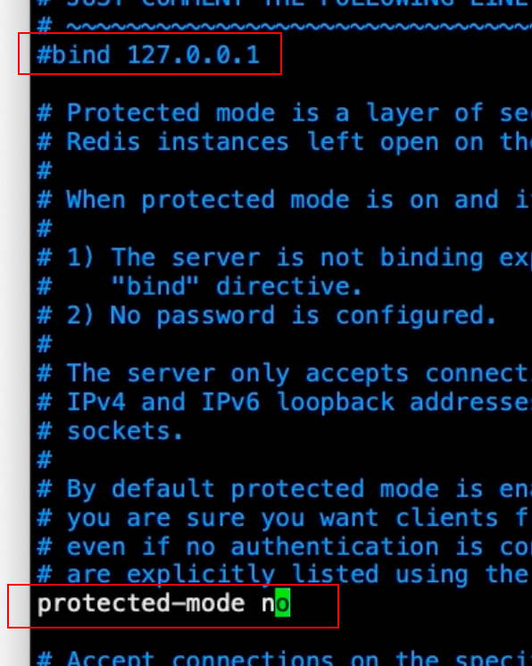

6、在src目录下执行 ./redis-server ../redis.conf 启动redis服务


```xml
<dependency>
  <groupId>redis.clients</groupId>
  <artifactId>jedis</artifactId>
  <version>2.9.0</version>
</dependency>
```


# 分布式调度问题

调度—>定时任务，分布式调度—>在分布式集群环境下定时任务这件事 

Elastic-job(当当网开源的分布式调度框架)

## 第 1 节 定时任务的场景

定时任务形式:每隔一定时间/特定某一时刻执行 例如:

  订单审核、出库
  订单超时自动取消、支付退款
  礼券同步、生成、发放作业
  物流信息推送、抓取作业、退换货处理作业
  数据积压监控、日志监控、服务可用性探测作业
  定时备份数据
  金融系统每天的定时结算
  数据归档、清理作业
  报表、离线数据分析作业

## 第 2 节 什么是分布式调度

1)运行在分布式集群环境下的调度任务(同一个定时任务程序部署多份，只应该有一个定时任务在执 行)
2)分布式调度—>定时任务的分布式—>定时任务的拆分(即为把一个大的作业任务拆分为多个小的作 业任务，同时执行)

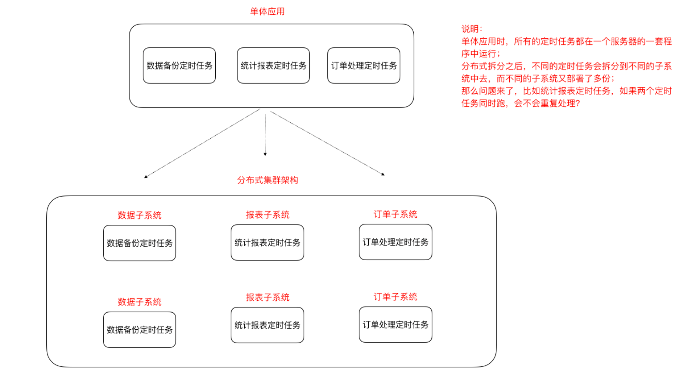

## 第 3 节 定时任务与消息队列的区别

- 共同点 
  - 异步处理
         比如注册、下单事件

  -  应用解耦
    不管定时任务作业还是MQ都可以作为两个应用之间的⻮轮实现应用解耦，这个⻮轮可以中转 数据，当然单体服务不需要考虑这些，服务拆分的时候往往都会考虑

  - 流量削峰
    双十一的时候，任务作业和MQ都可以用来扛流量，后端系统根据服务能力定时处理订单或者 从MQ抓取订单抓取到一个订单到来事件的话触发处理，对于前端用户来说看到的结果是已经 下单成功了，下单是不受任何影响的

    

- 本质不同 

  - 定时任务作业是时间驱动，而MQ是事件驱动;
  - 时间驱动是不可代替的，比如金融系统每日的利息结算，不是说利息来一条(利息到来事件)就算一下，而往往是通过定时任务批量计算;
    所以，定时任务作业更倾向于批处理，MQ倾向于逐条处理;


## 第 5 节 分布式调度框架Elastic-Job

### 5.1 Elastic-Job介绍

Elastic-Job是当当网开源的一个分布式调度解决方案，基于Quartz二次开发的，由两个相互独立的子项 目Elastic-Job-Lite和Elastic-Job-Cloud组成。我们要学习的是 Elastic-Job-Lite，它定位为轻量级无中心 化解决方案，使用Jar包的形式提供分布式任务的协调服务，而Elastic-Job-Cloud子项目需要结合Mesos 以及Docker在云环境下使用。
Elastic-Job的github地址:https://github.com/elasticjob 

主要功能介绍

- 分布式调度协调
    在分布式环境中，任务能够按指定的调度策略执行，并且能够避免同一任务多实例重复执行
  丰富的调度策略 基于成熟的定时任务作业框架Quartz cron表达式执行定时任务
  弹性扩容缩容 当集群中增加某一个实例，它应当也能够被选举并执行任务;当集群减少一个实例 时，它所执行的任务能被转移到别的实例来执行。

- 失效转移 
  某实例在任务执行失败后，会被转移到其他实例执行
  错过执行作业重触发 若因某种原因导致作业错过执行，自动记录错过执行的作业，并在上次作业 完成后自动触发。
  支持并行调度 支持任务分片，任务分片是指将一个任务分为多个小任务项在多个实例同时执行。 作业分片一致性 当任务被分片后，保证同一分片在分布式环境中仅一个执行实例。

### 5.2 Elastic-Job-Lite应用

 jar包(API) + 安装zk软件
Elastic-Job依赖于Zookeeper进行分布式协调，所以需要安装Zookeeper软件(3.4.6版本以上)，关于 Zookeeper，此处我们不做详解，需要明白Zookeeper的本质功能: 存储+通知。


安装Zookeeper(此处单例配置) 

```
We suggest the following mirror site for your download:

https://mirrors.tuna.tsinghua.edu.cn/apache/zookeeper/zookeeper-3.7.0/apache-zookeeper-3.7.0-bin.tar.gz

Other mirror sites are suggested below.

It is essential that you verify the integrity of the downloaded file using the PGP signature (.asc file) or a hash (.md5 or .sha* file).

Please only use the backup mirrors to download KEYS, PGP signatures and hashes (SHA* etc) -- or if no other mirrors are working.

HTTP
https://mirrors.bfsu.edu.cn/apache/zookeeper/zookeeper-3.7.0/apache-zookeeper-3.7.0-bin.tar.gz

https://mirrors.tuna.tsinghua.edu.cn/apache/zookeeper/zookeeper-3.7.0/apache-zookeeper-3.7.0-bin.tar.gz

```


1)我们使用3.4.10版本，在linux平台解压下载的zookeeper-3.4.10.tar.gz 
2)进入conf目录，cp zoo_sample.cfg zoo.cfg 
3）进入bin目录，启动zk服务

- 启动 ./zkServer.sh start
  停止 ./zkServer.sh stop
  查看状态 ./zkServer.sh status

zookeeper

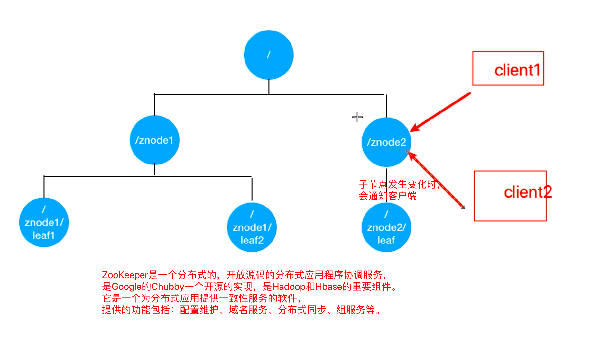

引入Jar包

```
<dependency>
    <groupId>com.dangdang</groupId>
    <artifactId>elastic-job-lite-core</artifactId>
    <version>2.1.5</version>
</dependency>
```


#### 测试

1)可先启动一个进程，然后再启动一个进程(两个进程模拟分布式环境下，通一个定时任务 部署了两份在工作)
2)两个进程逐个启动，观察现象
3)关闭其中执行的进程，观察现象

#### Leader节点选举机制

每个Elastic-Job的任务执行实例App作为Zookeeper的客户端来操作ZooKeeper的znode
(1)多个实例同时创建/leader节点
(2)/leader节点只能创建一个，后创建的会失败，创建成功的实例会被选为leader节点， 执行任务


### 5.4 Elastic-Job-Lite轻量级去中心化的特点

 如何理解轻量级和去中心化?

- 去中心化：
  - 节点对等
  - 调度自触发，自我驱动
  - 服务自发性
  - 主节点非固定

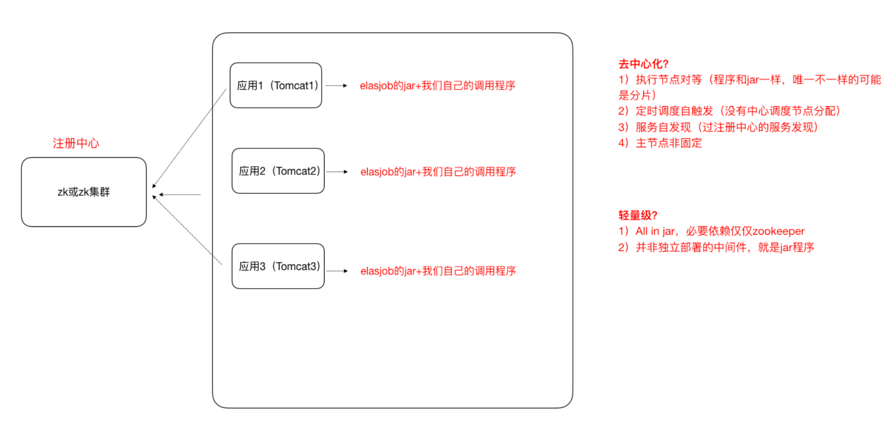


### 5.5 任务分片

一个大的非常耗时的作业Job，比如:一次要处理一亿的数据，那这一亿的数据存储在数据库中，如果 用一个作业节点处理一亿数据要很久，在互联网领域是不太能接受的，互联网领域更希望机器的增加去 横向扩展处理能力。所以，ElasticJob可以把作业分为多个的task(每一个task就是一个任务分片)，每 一个task交给具体的一个机器实例去处理(一个机器实例是可以处理多个task的)，但是具体每个task 执行什么逻辑由我们自己来指定。

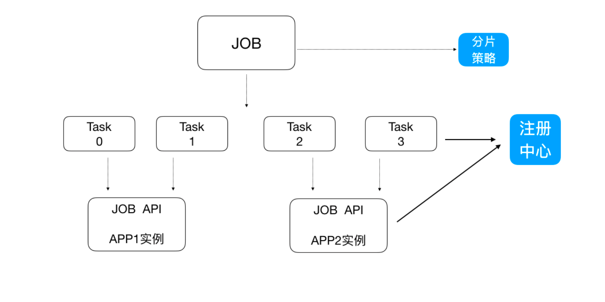

Strategy策略定义这些分片项怎么去分配到各个机器上去，默认是平均去分，可以定制，比如某一个机 器负载 比较高或者预配置比较高，那么就可以写策略。分片和作业本身是通过一个注册中心协调的，因 为在分布式环境下，状态数据肯定集中到一点，才可以在分布式中沟通。


### 5.6 弹性扩容

新增加一个运行实例app3，它会自动注册到注册中心，注册中心发现新的服务上线，注册中心会通知 ElasticJob 进行重新分片，那么总得分片项有多少，那么就可以搞多少个实例机器，比如完全可以分 1000片
最多就可以有多少app实例，，，，机器能成的主，完全可以分1000片 那么就可以搞1000台机器一起执行作业

#### 注意:

1、分片项也是一个JOB配置，修改配置，重新分片，在下一次定时运行之前会重新调用分片算法，那么 这个分片算法的结果就是:哪台机器运行哪一个一片，这个结果存储到zk中的，主节点会把分片给分好 放到注册中心去，然后执行节点从注册中心获取信息(执行节点在定时任务开启的时候获取相应的分 片)。

2、如果所有的节点挂掉值剩下一个节点，所有分片都会指向剩下的一个节点，这也是ElasticJob的高可 用。


# Session共享

## 第 2 节 解决Session一致性的方案

### Nginx的 IP_Hash 策略(可以使用) 

同一个客户端IP的请求都会被路由到同一个目标服务器，也叫做会话粘滞 

- 优点:
  - 配置简单，不入侵应用，不需要额外修改代码

- 缺点:
  - 服务器重启Session丢失
  - 存在单点负载高的⻛险
  - 单点故障问题

### Session复制(不推荐) 

也即，多个tomcat之间通过修改配置文件，达到Session之间的复制

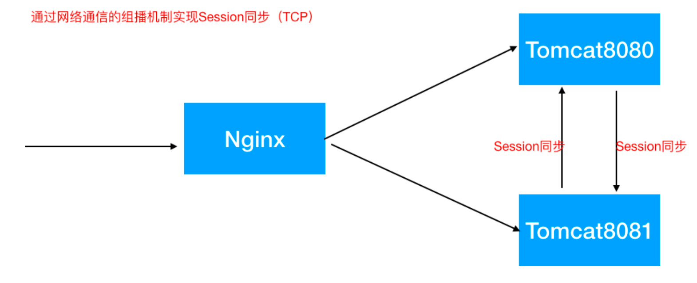

优点:
不入侵应用
便于服务器水平扩展 能适应各种负载均衡策略 服务器重启或者宕机不会造成Session丢失
缺点:
  性能低
  内存消耗
  不能存储太多数据，否则数据越多越影响性能
  延迟性

### Session共享(推荐)

Session集中存储

Session的本质就是缓存，那Session数据为什么不交给专业的缓存中间件呢?比如Redis

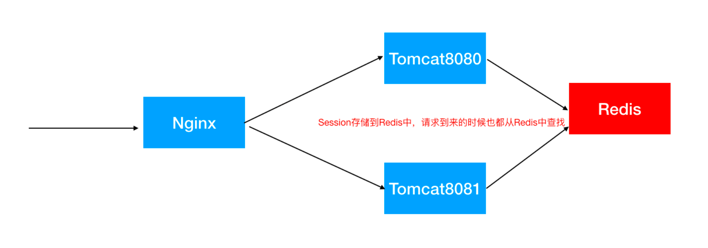

- 优点:
  - 能适应各种负载均衡策略 
  - 服务器重启或者宕机不会造成Session丢失 
  - 扩展能力强
  - 适合大集群数量使用

- 缺点:
  - 对应用有入侵，引入了和Redis的交互代码


**spring-session**使得基于Redis的Session共享应用起来非常之简单

1)引入Jar

```
<dependency>
  <groupId>org.springframework.boot</groupId>
  <artifactId>spring-boot-starter-data-redis</artifactId>
</dependency>
<dependency>
  <groupId>org.springframework.session</groupId>
  <artifactId>spring-session-data-redis</artifactId>
</dependency>
```

2)配置redis

```
spring.redis.database=0
spring.redis.host=127.0.0.1
spring.redis.port=6379
```

3)添加注解

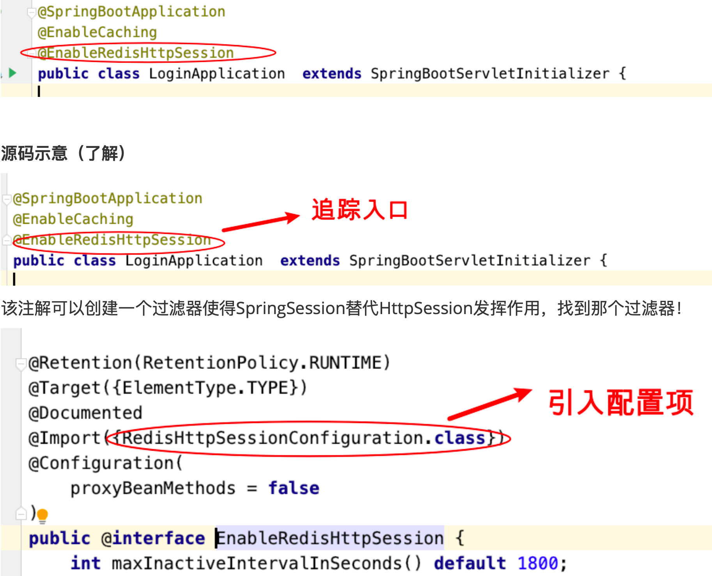


#### 原理图解

- 生成过滤器

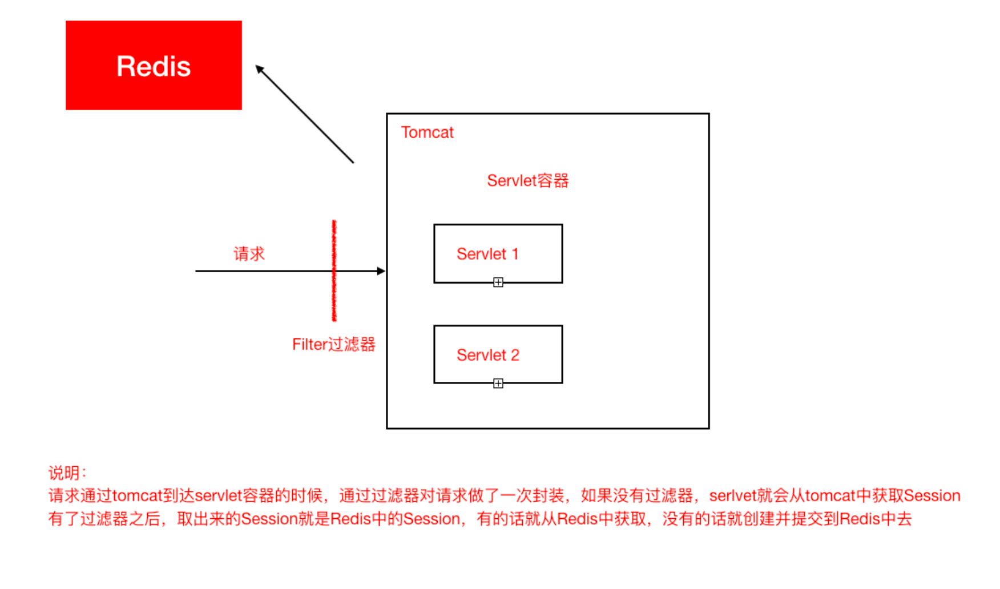
