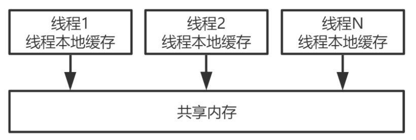
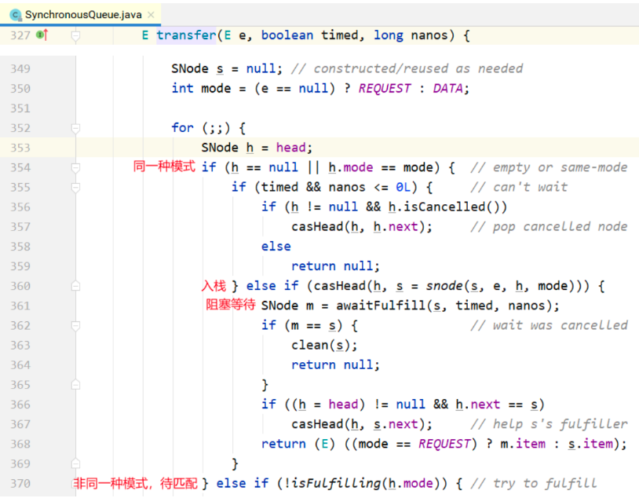
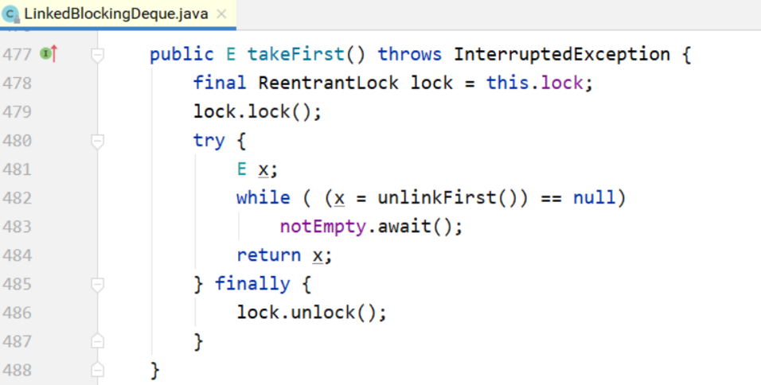

Java并发编程主要涉及以下几个部分:

1. 并发编程三要素 原子性:即一个不可再被分割的颗粒。在Java中原子性指的是一个或多个操作要么全部执行成 功要么全部执行失败。 有序性:程序执行的顺序按照代码的先后顺序执行。(处理器可能会对指令进行重排序) 可见性:当多个线程访问同一个变量时，如果其中一个线程对其作了修改，其他线程能立即获 取到最新的值。
2. 线程的五大状态
    创建状态:当用 new 操作符创建一个线程的时候
    就绪状态:调用 start 方法，处于就绪状态的线程并不一定马上就会执行 run 方法，还需要等 待CPU的调度
    运行状态:CPU 开始调度线程，并开始执行 run 方法 阻塞状态:线程的执行过程中由于一些原因进入阻塞状态比如:调用 sleep 方法、尝试去得到 一个锁等等
    死亡状态:run 方法执行完 或者 执行过程中遇到了一个异常
3. 悲观锁与乐观锁
    悲观锁:每次操作都会加锁，会造成线程阻塞。 乐观锁:每次操作不加锁而是假设没有冲突而去完成某项操作，如果因为冲突失败就重试，直 到成功为止，不会造成线程阻塞。
4. 线程之间的协作 线程间的协作有:wait/notify/notifyAll等
5. synchronized 关键字 synchronized是Java中的关键字，是一种同步锁。它修饰的对象有以下几种:
   修饰一个代码块:被修饰的代码块称为同步语句块，其作用的范围是大括号{}括起来 的代码，作用的对象是调用这个代码块的对象 修饰一个方法:被修饰的方法称为同步方法，其作用的范围是整个方法，作用的对象 是调用这个方法的对象 修饰一个静态的方法:其作用的范围是整个静态方法，作用的对象是这个类的所有对 象 修饰一个类:其作用的范围是synchronized后面括号括起来的部分，作用主的对象 是这个类的所有对象。
6. CAS
    CAS全称是Compare And Swap，即比较替换，是实现并发应用到的一种技术。操作包含三个 操作数—内存位置(V)、预期原值(A)和新值(B)。 如果内存位置的值与预期原值相匹配， 那么处理器会自动将该位置值更新为新值 。否则，处理器不做任何操作。 CAS存在三大问题:ABA问题，循环时间长开销大，以及只能保证一个共享变量的原子操作。
7. 线程池 
   如果我们使用线程的时候就去创建一个线程，虽然简单，但是存在很大的问题。如果并发的线 程数量很多，并且每个线程都是执行一个时间很短的任务就结束了，这样频繁创建线程就会大 大降低系统的效率，因为频繁创建线程和销毁线程需要时间。线程池通过复用可以大大减少线 程频繁创建与销毁带来的性能上的损耗。

主要内容包括:
1. 多线程&并发设计原理 并发核心概念 并发的问题 JMM内存模型
2. JUC
并发容器 同步工具类 Atomic类 Lock与Condition
3. 线程池与Future 线程池的实现原理 线程池的类继承体系 ThreadPoolExecutor Executors工具类 ScheduledThreadPool Executor CompletableFuture用法
4. ForkJoinPool
ForkJoinPool用法
核心数据结构
工作窃取队列 ForkJoinPool状态控制 Worker线程的阻塞-唤醒机制 任务的提交过程分析 工作窃取算法:任务的执行过程分析 ForkJoinTask的fork/join ForkJoinPool的优雅关闭
5. 多线程设计模式
Single Threaded Execution模式 Immutable模式
Guarded Suspension模式 Balking模式 Producer-Consumer模式 Read-Write Lock模式 Thread-Per-Message模式 Worker Thread模式 Future模式

# 第一部分:多线程&并发设计原理 

# 1 多线程回顾

## 1.1 Thread和Runnable 

### 1.1.1 Java中的线程

创建执行线程有两种方法: 

- 扩展Thread 类。
- 实现Runnable 接口。 

扩展Thread类的方式创建新线程:


### 1.1.2 Java中的线程:特征和状态

1. 所有的Java 程序，不论并发与否，**都有一个名为主线程的Thread 对象。执行该程序时， Java 虚拟机( JVM )将创建一个新Thread 并在该线程中执行main()方法**。这是非并发应用程序中 唯一的线程，也是并发应用程序中的第一个线程。

2. **Java中的线程共享应用程序中的所有资源**，包括内存和打开的文件，快速而简单地共享信息。 但是必须使用同步**避免数据竞争**。

3. Java中的所有线程都有一个优先级，这个整数值介于`Thread.MIN_PRIORITY(1)`和 `Thread.MAX_PRIORITY(10)`之间，**默认优先级是`Thread.NORM_PRIORITY(5)`**。线程的 执行顺序并没有保证，通常，较高优先级的线程将在较低优先级的钱程之前执行。
4. 在Java 中，可以创建两种线程: 

  - 守护线程。
  - 非守护线程。

  区别在于它们如何影响程序的结束。 Java程序结束执行过程的情形:

  - 程序执行Runtime类的**exit()**方法， 而且用户有权执行该方法。 
  - 应用程序的**所有非守护线程均已结束执行**，无论是否有正在运行的守护线程。

  守护线程通常用在作为垃圾收集器或缓存管理器的应用程序中，执行辅助任务。在线程start之前调 用`isDaemon()`方法检查线程是否为守护线程，也可以使用`setDaemon()`方法将某个线程确立为守护线程。

5. Thread.States类中定义线程的状态如下:

  - NEW:Thread对象已经创建，但是还没有开始执行。 
  - RUNNABLE:Thread对象正在Java虚拟机中运行。
  - BLOCKED : Thread对象正在等待锁定。
  - WAITING:Thread 对象正在等待另一个线程的动作。 
  - TIME_WAITING:Thread对象正在等待另一个线程的操作，但是有时间限制。 
  - TERMINATED:Thread对象已经完成了执行。

getState()方法获取Thread对象的状态，可以直接更改线程的状态。
在给定时间内， 线程只能处于一个状态。这些状态是JVM使用的状态，不能映射到操作系统的线程
状态。 线程状态的源码:

```
java.lang.Thread.State
```

Java中线程的状态分为6种。

1. 初始(NEW)：新创建了一个线程对象，但还没有调用start()方法。
2. 运行(RUNNABLE)：Java线程中将就绪（ready）和运行中（running）两种状态笼统的称为“运行”。
   线程对象创建后，其他线程(比如main线程）调用了该对象的start()方法。该状态的线程位于可运行线程池中，等待被线程调度选中，获取CPU的使用权，此时处于就绪状态（ready）。就绪状态的线程在获得CPU时间片后变为运行中状态（running）。
3. 阻塞(BLOCKED)：表示线程阻塞于锁。
4. 等待(WAITING)：进入该状态的线程需要等待其他线程做出一些特定动作（通知或中断）。
5. 超时等待(TIMED_WAITING)：该状态不同于WAITING，它可以在指定的时间后自行返回。
6. 终止(TERMINATED)：表示该线程已经执行完毕。

这6种状态定义在Thread类的State枚举中，可查看源码进行一一对应。


### 1.1.3 Thread类和Runnable 接口 

Runnable接口只定义了一种方法:run()方法。这是每个线程的主方法。当执行start()方法启动新线
程时，它将调用run()方法。 

Thread类其他常用方法:

- 获取和设置Thread对象信息的方法。
  - getId():该方法返回Thread对象的标识符。该标识符是在钱程创建时分配的一个正 整数。在线程的整个生命周期中是唯一且无法改变的。 
  - getName()/setName():这两种方法允许你获取或设置Thread对象的名称。这个名 称是一个String对象，也可以在Thread类的构造函数中建立。 
  - getPriority()/setPriority():你可以使用这两种方法来获取或设置Thread对象的优先 级。 
  - isDaemon()/setDaemon():这两种方法允许你获取或建立Thread对象的守护条件。 
  - getState():该方法返回Thread对象的状态。
- interrupt():中断目标线程，给目标线程发送一个中断信号，线程被打上中断标记。
- interrupted():判断目标线程是否被中断，但是将清除线程的中断标记。
- isinterrupted():判断目标线程是否被中断，不会清除中断标记。
- sleep(long ms):该方法将线程的执行暂停ms时间。
- join():暂停线程的执行，直到调用该方法的线程执行结束为止。可以使用该方法等待另一个 Thread对象结束。
- setUncaughtExceptionHandler():当线程执行出现未校验异常时，该方法用于建立未校验异 常的控制器。
- currentThread():Thread类的静态方法，返回实际执行该代码的Thread对象。 


join示例程序:


### 1.1.4 Callable

Callable 接口是一个与Runnable 接口非常相似的接口。Callable 接口的主要特征如下。

- 接口。有简单类型参数，与call()方法的返回类型相对应。 
- 声明了call()方法。执行器运行任务时，该方法会被执行器执行。它必须返回声明中指定类型的 对象。 
- call()方法可以抛出任何一种校验异常。可以实现自己的执行器并重载afterExecute()方法来处 理这些异常。

```
public class MyCallable implements Callable<String> {
    @Override
    public String call() throws Exception {
        Thread.sleep(3000);
        return "call you";
    }
}

public class Demo3 {
    public static void main(String[] args) throws ExecutionException, InterruptedException {
        MyCallable myCallable = new MyCallable();

        // 设置Callable对象，泛型表示Callable的返回类型
        FutureTask<String> futureTask = new FutureTask<>(myCallable);
        new Thread(futureTask).start();
        // 同步等待 callable 返回值
        String s = futureTask.get();
        System.out.println(s);
        System.out.println("main end");
    }
}

public class ExcutorDemo {
    public static void main(String[] args) throws ExecutionException, InterruptedException {
        ThreadPoolExecutor executor = new ThreadPoolExecutor(
                5, 5, 1, TimeUnit.SECONDS,
                new ArrayBlockingQueue<>(10)){
            @Override
            protected void afterExecute(Runnable r, Throwable t) {
                // 如果call方法执行中出现错误，可在此处做处理
                super.afterExecute(r, t);
                System.out.println("任务执行完毕"+t);
            }
        };

        MyCallable myCallable = new MyCallable();
        Future<String> future = executor.submit(myCallable);

        String s = future.get();
        System.out.println(s);

        //关闭线程池
        executor.shutdown();
    }
}

```

## 1.2 synchronized关键字 

### 1.2.1 锁的对象

synchronized关键字“给某个对象加锁”，示例代码:

```java
public Class MyClass {
    public void synchronized method1() {
// ...
}
    public static void synchronized method2() {
        // ...
} 
}
```

等价于:

```java
public class MyClass {
    public void method1() {
        synchronized(this) {
		// ...
        } 
    }
    public static void method2() {
        synchronized(MyClass.class) {
        // ...
        } 
    }
}
```

那么，多个加了synchronized的方法，可能会竞争同样的资源。

```java
public class MyClass {
    //共同持有对象锁
    public void method1() {
        synchronized(this) {
		// ...
        } 
    }
    public void method11() {
        synchronized(this) {
		// ...
        } 
    }
    
    //共同持有类锁
    public static void method2() {
        synchronized(MyClass.class) {
        // ...
        } 
    }
    public static void method22() {
        synchronized(MyClass.class) {
        // ...
        } 
    }
}
```


**实例方法的锁加在对象myClass**上；**静态方法的锁加在MyClass.class**上。

### 1.2.2 锁的本质

  如果一份资源需要多个线程同时访问，需要给该资源加锁。加锁之后，可以保证同一时间只能有一
个线程访问该资源。资源可以是一个变量、一个对象或一个文件等。


锁是一个“对象”，作用如下:

1. 这个对象内部得有一个标志位(state变量)，记录自己有没有被某个线程占用。最简单的情况 是这个state有0、1两个取值，0表示没有线程占用这个锁，1表示有某个线程占用了这个锁。

2. 如果这个对象被某个线程占用，记录这个线程的thread ID。

3. 这个对象维护一个thread id list，记录其他所有阻塞的、等待获取拿这个锁的线程。在当前线

   程释放锁之后从这个thread id list里面取一个线程唤醒。

要访问的共享资源本身也是一个对象，例如前面的对象myClass，这两个对象可以合成一个对象。 代码就变成synchronized(this) {...}，要访问的共享资源是对象a，锁加在对象a上。

当然，也可以另外新 建一个对象，代码变成synchronized(obj1) {...}。这个时候，访问的共享资源是对象a，而锁加在新建的 对象obj1上。

资源和锁合二为一，使得在Java里面，synchronized关键字可以加在任何对象的成员上面。这意味 着，这个对象既是共享资源，同时也具备“锁”的功能!

> 资源和锁可以是同一个对象，也可以是不同对象


### 主内存与工作内存之间的交互

Java内存模型中定义了以下8种操作来完成，

主内存与工作内存之间具体的交互协议，即一个变量如何从主内存拷贝到工作内存、如何从工作内存同步回主内存之类的实现细节，虚拟机实现时必须保证下面提及的每一种操作都是原子的、不可再分的。

对应如下的流程图：


注意:
1. 如果对一个变量执行lock操作，将会清空工作内存中此变量的值
2. 对一个变量执行unlock操作之前，必须先把此变量同步到主内存中

小结
主内存与工作内存之间的数据交互过程

```
lock -> read -> load -> use -> assign -> store -> write -> unlock
```


### 1.2.3 实现原理 

锁如何实现?
在对象头里，有一块数据叫**Mark Word**。在64位机器上，Mark Word是**8字节(64位)**的，这64位 中有2个重要字段: **锁标志位** 和 **占用该锁的thread ID**。因为不同版本的JVM实现，对象头的数据结构会 有各种差异。


#### monitorenter

每一个对象都会和一个监视器monitor关联。监视器被占用时会被锁住，其他线程无法来获取该monitor。 当JVM执行某个线程的某个方法内部的monitorenter时，它会尝试去获取当前对象对应的monitor的所有权。其过程如下：
1. 若monior的进入数为0，线程可以进入monitor，并将monitor的进入数置为1。当前线程成为monitor的owner（所有者）
2. 若线程已拥有monitor的所有权，允许它重入monitor，则进入monitor的进入数加1
3. 若其他线程已经占有monitor的所有权，那么当前尝试获取monitor的所有权的线程会被阻塞，直到monitor的进入数变为0，才能重新尝试获取monitor的所有权。


**monitorenter小结:**
synchronized的锁对象会关联一个monitor，这个monitor不是我们主动创建的,是JVM的线程执行到这个同步代码块,发现锁对象没有monitor就会创建monitor，monitor内部有两个重要的成员变量，owner:拥有这把锁的线程，recursions会记录线程拥有锁的次数,当一个线程拥有monitor后其他线程只能等待

#### monitorexit

1. 能执行monitorexit指令的线程一定是拥有当前对象的monitor的所有权的线程。

2. 执行monitorexit时会将monitor的进入数减1。当monitor的进入数减为0时，当前线程退出monitor，不再拥有monitor的所有权，此时其他被这个monitor阻塞的线程可以尝试去获取这个monitor的所有权

monitorexit释放锁。

monitorexit插入在**方法结束处 **和 **异常处**，JVM保证每个monitorenter必须有对应的monitorexit。


面试题synchroznied出现异常会释放锁吗?

会释放锁


#### 使用javap反汇编，探究同步代码块、同步方法


- 同步代码块


- 同步方法

可以看到同步方法在反汇编后，会**增加`ACC_SYNCHRONIZED` 修饰**。会**隐式调用monitorenter和monitorexit**。在执行同步方法前会调用monitorenter，在执行完同步方法后会调用monitorexit。


#### 小结

通过javap反汇编我们看到synchronized使用编程了monitorentor和monitorexit两个指令.每个锁对象
都会关联一个monitor(监视器,它才是真正的锁对象),它内部有两个重要的成员变量owner会保存获得锁
的线程,recursions会保存线程获得锁的次数,当执行到monitorexit时,recursions会-1,当计数器减到0时
这个线程就会释放锁


#### 面试题：synchronized与Lock的区别

1. synchronized是关键字，而Lock是一个接口。
2. synchronized会自动释放锁，而Lock必须手动释放锁。
3. synchronized是不可中断的，Lock可以中断也可以不中断。
4. 通过Lock可以知道线程有没有拿到锁，而synchronized不能。
5. synchronized能锁住方法和代码块，而Lock只能锁住代码块。
6. Lock可以使用读锁提高多线程读效率。
7. synchronized是非公平锁，ReentrantLock可以控制是否是公平锁。


## 1.2-2 深入JVM源码

monitor监视器锁

在HotSpot虚拟机中，monitor是由ObjectMonitor实现的。其源码是用c++来实现的，位于HotSpot虚
拟机源码ObjectMonitor.hpp文件中(src/share/vm/runtime/objectMonitor.hpp)。ObjectMonitor主
要数据结构如下：

```cpp
ObjectMonitor() {
    _header = NULL;
    _count = 0;
    _waiters = 0，
    v = 0; // 线程的重入次数
    _object = NULL; // 存储该monitor的对象
    _owner = NULL; // 标识拥有该monitor的线程
    _WaitSet = NULL; // 处于wait状态的线程，会被加入到_WaitSet
    _WaitSetLock = 0 ;
    _Responsible = NULL;
    _succ = NULL;
    _cxq = NULL; // 多线程竞争锁时的单向列表
    FreeNext = NULL;
    _EntryList = NULL; // 处于等待锁block状态的线程，会被加入到该列表
    _SpinFreq = 0;
    _SpinClock = 0;
    OwnerIsThread = 0;
}
```

1. `_owner`：初始时为NULL。当有线程占有该monitor时，owner标记为该线程的唯一标识。当线程释放monitor时，owner又恢复为NULL。owner是一个临界资源，JVM是通过CAS操作来保证其线程安全的。
2. `_cxq`：竞争队列，所有请求锁的线程首先会被放在这个队列中（单向链接）。`_cxq`是一个临界资源，JVM通过CAS原子指令来修改`_cxq`队列。修改前`_cxq`的旧值填入了node的next字段，`_cxq`指向新值（新线程）。因此`_cxq`是一个stack（栈）。
3. `_EntryList`：_cxq队列中有资格成为候选资源的线程会被移动到该队列中。
4. `_WaitSet`：因为调用wait方法而被阻塞的线程会被放在该队列中。


ObjectMonitor的数据结构中包含：`_owner、_WaitSet和_EntryList`，它们之间的关系转换可以用下图表示：


### monitor竞争

1. 执行monitorenter时，会调用InterpreterRuntime.cpp
(位于：src/share/vm/interpreter/interpreterRuntime.cpp) 的 InterpreterRuntime::monitorenter函
数。具体代码可参见HotSpot源码。

```cpp
IRT_ENTRY_NO_ASYNC(void, InterpreterRuntime::monitorenter(JavaThread* thread, BasicObjectLock* elem))
#ifdef ASSERT
  thread->last_frame().interpreter_frame_verify_monitor(elem);
#endif
  if (PrintBiasedLockingStatistics) {
    Atomic::inc(BiasedLocking::slow_path_entry_count_addr());
  }
  Handle h_obj(thread, elem->obj());
  assert(Universe::heap()->is_in_reserved_or_null(h_obj()),
         "must be NULL or an object");

//是否使用偏向锁
  if (UseBiasedLocking) {
    // Retry fast entry if bias is revoked to avoid unnecessary inflation
    ObjectSynchronizer::fast_enter(h_obj, elem->lock(), true, CHECK);
  } else {
    ObjectSynchronizer::slow_enter(h_obj, elem->lock(), CHECK);
  }
  assert(Universe::heap()->is_in_reserved_or_null(elem->obj()),
         "must be NULL or an object");
#ifdef ASSERT
  thread->last_frame().interpreter_frame_verify_monitor(elem);
#endif
IRT_END
```

2.对于重量级锁，monitorenter函数中会调用 ObjectSynchronizer::slow_enter
3.最终调用 ObjectMonitor::enter（位于：src/share/vm/runtime/objectMonitor.cpp），源码如下：


```cpp
void ATTR ObjectMonitor::enter(TRAPS) {
    
    // The following code is ordered to check the most common cases first
    // and to reduce RTS->RTO cache line upgrades on SPARC and IA32 processors.
    Thread * const Self = THREAD ;
    void * cur ;
    
    // 通过CAS操作尝试把monitor的_owner字段设置为当前线程
    cur = Atomic::cmpxchg_ptr (Self， &_owner， NULL) ;
    
    if (cur == NULL) {
        // Either ASSERT _recursions == 0 or explicitly set _recursions = 0.
        assert (_recursions == 0 ， "invariant") ;
        assert (_owner == Self， "invariant") ;
        // CONSIDER: set or assert OwnerIsThread == 1
        return ;
    }
    
    // 线程重入，recursions++
    if (cur == Self) {
        // TODO-FIXME: check for integer overflow! BUGID 6557169.
        _recursions ++ ;
        return ;
    }
    // 如果当前线程是第一次进入该monitor，设置_recursions为1，_owner为当前线程
    if (Self->is_lock_owned ((address)cur)) {
        assert (_recursions == 0， "internal state error");
        _recursions = 1 ;
        // Commute owner from a thread-specific on-stack BasicLockObject address to
        // a full-fledged "Thread *".
        _owner = Self ;
        OwnerIsThread = 1 ;
        return ;
    }
    
// 省略一些代码
    for (;;) {
        jt->set_suspend_equivalent();
        // cleared by handle_special_suspend_equivalent_condition()
        // or java_suspend_self()
        
        // 如果获取锁失败，则等待锁的释放；
        EnterI (THREAD) ;//===>>>进入
        
        if (!ExitSuspendEquivalent(jt)) break ;
        
        //
        // We have acquired the contended monitor， but while we were
        // waiting another thread suspended us. We don't want to enter
        // the monitor while suspended because that would surprise the
        // thread that suspended us.
        //
        _recursions = 0 ;
        _succ = NULL ;
        exit (false， Self) ;
        
        jt->java_suspend_self();
    }
Self->set_current_pending_monitor(NULL);
}

```

此处省略锁的自旋优化等操作，统一放在后面synchronzied优化中说。

以上代码的具体流程概括如下：
1. 通过CAS尝试把monitor的owner字段设置为当前线程。
2. 如果设置之前的owner指向当前线程，说明当前线程再次进入monitor，即重入锁，执行
recursions ++ ，记录重入的次数。
3. 如果当前线程是第一次进入该monitor，设置recursions为1，_owner为当前线程，该线程成功获
得锁并返回。
4. 如果获取锁失败，则等待锁的释放。


### monitor等待


```cpp
void ATTR ObjectMonitor::EnterI (TRAPS) {
    Thread * Self = THREAD ;
    // Try the lock - TATAS
    if (TryLock (Self) > 0) {
        assert (_succ != Self , "invariant") ;
        assert (_owner == Self , "invariant") ;
        assert (_Responsible != Self , "invariant") ;
        return ;
    }
    if (TrySpin (Self) > 0) {
        assert (_owner == Self , "invariant") ;
        assert (_succ != Self , "invariant") ;
        assert (_Responsible != Self , "invariant") ;
        return ;
    }
    // 省略部分代码
    
    // 当前线程被封装成ObjectWaiter对象node，状态设置成ObjectWaiter::TS_CXQ；
    ObjectWaiter node(Self) ;
    Self->_ParkEvent->reset() ;
    node._prev = (ObjectWaiter *) 0xBAD ;
    node.TState = ObjectWaiter::TS_CXQ ;
    
    // 通过CAS把node节点push到_cxq列表中
    ObjectWaiter * nxt ;
    for (;;) {
        node._next = nxt = _cxq ;
        if (Atomic::cmpxchg_ptr (&node， &_cxq， nxt) == nxt) break ;
        // Interference - the CAS failed because _cxq changed. Just retry.
        // As an optional optimization we retry the lock.
        if (TryLock (Self) > 0) {
            assert (_succ != Self ， "invariant") ;
            assert (_owner == Self ， "invariant") ;
            assert (_Responsible != Self ， "invariant") ;
            return ;
        }
    }
    // 省略部分代码
    
    for (;;) {
        // 线程在被挂起前做一下挣扎，看能不能获取到锁
        if (TryLock (Self) > 0) break ;
        assert (_owner != Self， "invariant") ;
        if ((SyncFlags & 2) && _Responsible == NULL) {
        	Atomic::cmpxchg_ptr (Self， &_Responsible， NULL) ;
        }
        // park self
        if (_Responsible == Self || (SyncFlags & 1)) {
            TEVENT (Inflated enter - park TIMED) ;
            Self->_ParkEvent->park ((jlong) RecheckInterval) ;
            // Increase the RecheckInterval， but clamp the value.
            RecheckInterval *= 8 ;
            if (RecheckInterval > 1000) RecheckInterval = 1000 ;
        } else {
            TEVENT (Inflated enter - park UNTIMED) ;
            // 通过park将当前线程挂起，等待被唤醒
            Self->_ParkEvent->park() ;
        }
        if (TryLock(Self) > 0) break ;
        // 省略部分代码
    }
    // 省略部分代码
}
```

当该线程被唤醒时，会从挂起的点继续执行，通过ObjectMonitor::TryLock 尝试获取锁，TryLock方
法实现如下：

```cpp
int ObjectMonitor::TryLock (Thread * Self) {
    for (;;) {
        void * own = _owner ;
        if (own != NULL) return 0 ;
        if (Atomic::cmpxchg_ptr (Self， &_owner， NULL) == NULL) {
            // Either guarantee _recursions == 0 or set _recursions = 0.
            assert (_recursions == 0， "invariant") ;
            assert (_owner == Self， "invariant") ;
            // CONSIDER: set or assert that OwnerIsThread == 1
            return 1 ;
        }
        // The lock had been free momentarily， but we lost the race to the lock.
        // Interference -- the CAS failed.
        // We can either return -1 or retry.
        // Retry doesn't make as much sense because the lock was just acquired.
        if (true) return -1 ;
    }
}
```

以上代码的具体流程概括如下：
1. 当前线程被封装成ObjectWaiter对象node，状态设置成ObjectWaiter::TS_CXQ。
2. 在for循环中，通过CAS把node节点push到`_cxq`列表中，同一时刻可能有多个线程把自己的node
节点push到`_cxq`列表中。
3. node节点push到`_cxq`列表之后，通过自旋尝试获取锁，如果还是没有获取到锁，则**通过park将当**
**前线程挂起，等待被唤醒。**
4. 当该线程被唤醒时，会从挂起的点继续执行，通过ObjectMonitor::TryLock 尝试获取锁。


### monitor释放

当某个持有锁的线程执行完同步代码块时，会进行锁的释放，给其它线程机会执行同步代码，在HotSpot中，通过退出monitor的方式实现锁的释放，并通知被阻塞的线程，具体实现位于ObjectMonitor的exit方法中。（位于：src/share/vm/runtime/objectMonitor.cpp），源码如下所示：

```cpp
void ATTR ObjectMonitor::exit(bool not_suspended， TRAPS) {
    Thread * Self = THREAD ;
    // 省略部分代码
    if (_recursions != 0) {
        _recursions--; // this is simple recursive enter
        TEVENT (Inflated exit - recursive) ;
        return ;
    }
    // 省略部分代码
    ObjectWaiter * w = NULL ;
    int QMode = Knob_QMode ;
    
    // qmode = 2：直接绕过EntryList队列，从cxq队列中获取线程用于竞争锁
    if (QMode == 2 && _cxq != NULL) {
        w = _cxq ;
        assert (w != NULL， "invariant") ;
        assert (w->TState == ObjectWaiter::TS_CXQ， "Invariant") ;
        ExitEpilog (Self， w) ;
        return ;
    }
    
    // qmode =3：cxq队列插入EntryList尾部；
    if (QMode == 3 && _cxq != NULL) {
        w = _cxq ;
        for (;;) {
        assert (w != NULL， "Invariant") ;
        ObjectWaiter * u = (ObjectWaiter *) Atomic::cmpxchg_ptr (NULL，
        &_cxq， w) ;
        if (u == w) break ;
        w = u ;
        }
        assert (w != NULL ， "invariant") ;
        ObjectWaiter * q = NULL ;
        ObjectWaiter * p ;
        for (p = w ; p != NULL ; p = p->_next) {
        guarantee (p->TState == ObjectWaiter::TS_CXQ， "Invariant") ;
        p->TState = ObjectWaiter::TS_ENTER ;
        p->_prev = q ;
        q = p ;
        }
        ObjectWaiter * Tail ;
        for (Tail = _EntryList ; Tail != NULL && Tail->_next != NULL ; Tail =
        Tail->_next) ;
        if (Tail == NULL) {
        _EntryList = w ;
        } else {
        Tail->_next = w ;
        w->_prev = Tail ;
        }
    }
    
    // qmode =4：cxq队列插入到_EntryList头部
    if (QMode == 4 && _cxq != NULL) {
        w = _cxq ;
        for (;;) {
        assert (w != NULL， "Invariant") ;
        ObjectWaiter * u = (ObjectWaiter *) Atomic::cmpxchg_ptr (NULL，
        &_cxq， w) ;
        if (u == w) break ;
        w = u ;
        }
        assert (w != NULL ， "invariant") ;
        ObjectWaiter * q = NULL ;
        ObjectWaiter * p ;
        for (p = w ; p != NULL ; p = p->_next) {
        guarantee (p->TState == ObjectWaiter::TS_CXQ， "Invariant") ;
        p->TState = ObjectWaiter::TS_ENTER ;
        p->_prev = q ;
        q = p ;
        }
        if (_EntryList != NULL) {
        q->_next = _EntryList ;
        _EntryList->_prev = q ;
        }
        _EntryList = w ;
    }
    
    w = _EntryList ;
    if (w != NULL) {
        assert (w->TState == ObjectWaiter::TS_ENTER， "invariant") ;
        ExitEpilog (Self， w) ;
        return ;
    }
    w = _cxq ;
    if (w == NULL) continue ;
    for (;;) {
        assert (w != NULL， "Invariant") ;
        ObjectWaiter * u = (ObjectWaiter *) Atomic::cmpxchg_ptr (NULL， &_cxq，
        w) ;
        if (u == w) break ;
        w = u ;
    }
    TEVENT (Inflated exit - drain cxq into EntryList) ;
    assert (w != NULL ， "invariant") ;
    assert (_EntryList == NULL ， "invariant") ;
    if (QMode == 1) {
        // QMode == 1 : drain cxq to EntryList， reversing order
        // We also reverse the order of the list.
        ObjectWaiter * s = NULL ;
        ObjectWaiter * t = w ;
        ObjectWaiter * u = NULL ;
        while (t != NULL) {
        guarantee (t->TState == ObjectWaiter::TS_CXQ， "invariant") ;
        t->TState = ObjectWaiter::TS_ENTER ;
        u = t->_next ;
        t->_prev = u ;
        t->_next = s ;
        s = t;
        t = u ;
        }
        _EntryList = s ;
        assert (s != NULL， "invariant") ;
    } else {
            // QMode == 0 or QMode == 2
        _EntryList = w ;
        ObjectWaiter * q = NULL ;
        ObjectWaiter * p ;
        for (p = w ; p != NULL ; p = p->_next) {
            guarantee (p->TState == ObjectWaiter::TS_CXQ， "Invariant") ;
            p->TState = ObjectWaiter::TS_ENTER ;
            p->_prev = q ;
            q = p ;
            }
        }
        if (_succ != NULL) continue;
        w = _EntryList ;
        if (w != NULL) {
            guarantee (w->TState == ObjectWaiter::TS_ENTER， "invariant") ;
            ExitEpilog (Self， w) ;
            return ;
        }
    }
}
```

1. 退出同步代码块时会让`_recursions`减1，当`_recursions`的值减为0时，说明线程释放了锁。
2. 根据不同的策略（由QMode指定），从cxq或EntryList中获取头节点，通过ObjectMonitor::ExitEpilog 方法唤醒该节点封装的线程，唤醒操作最终**由unpark完成**，实现如下：

```cpp
void ObjectMonitor::ExitEpilog (Thread * Self， ObjectWaiter * Wakee) {
    assert (_owner == Self， "invariant") ;
    _succ = Knob_SuccEnabled ? Wakee->_thread : NULL ;
    ParkEvent * Trigger = Wakee->_event ;
    Wakee = NULL ;
    // Drop the lock
    OrderAccess::release_store_ptr (&_owner， NULL) ;
    OrderAccess::fence() ; // ST _owner vs LD in
    unpark()
    if (SafepointSynchronize::do_call_back()) {
        TEVENT (unpark before SAFEPOINT) ;
    }
    DTRACE_MONITOR_PROBE(contended__exit， this， object()， Self);
    Trigger->unpark() ; // 唤醒之前被pack()挂起的线程.
    // Maintain stats and report events to JVMTI
    if (ObjectMonitor::_sync_Parks != NULL) {
        ObjectMonitor::_sync_Parks->inc() ;
    }
}
```

被唤醒的线程，会回到void ATTR ObjectMonitor::EnterI (TRAPS) 的第600行，继续执行monitor的竞争。

```cpp
// park self
if (_Responsible == Self || (SyncFlags & 1)) {
    TEVENT (Inflated enter - park TIMED) ;
    Self->_ParkEvent->park ((jlong) RecheckInterval) ;
    // Increase the RecheckInterval， but clamp the value.
    RecheckInterval *= 8 ;
    if (RecheckInterval > 1000) RecheckInterval = 1000 ;
} else {
    TEVENT (Inflated enter - park UNTIMED) ;
    Self->_ParkEvent->park() ;
}
if (TryLock(Self) > 0) break ;
```

### monitor是重量级锁

可以看到ObjectMonitor的函数调用中会涉及到**Atomic::cmpxchg_ptr，Atomic::inc_ptr等内核函数**，执行同步代码块，没有竞争到锁的对象会**park()**被挂起，竞争到锁的线程会**unpark()**唤醒。这个时候就会存在操作系统用户态和内核态的转换，这种切换会消耗大量的系统资源。所以synchronized是Java语言中是一个重量级(Heavyweight)的操作。

用户态和和内核态是什么东西呢？要想了解用户态和内核态还需要先了解一下Linux系统的体系架构：


从上图可以看出，Linux操作系统的体系架构分为：用户空间（应用程序的活动空间）和内核。

- 内核：本质上可以理解为一种软件，控制计算机的硬件资源，并提供上层应用程序运行的环境。
- 用户空间：上层应用程序活动的空间。应用程序的执行必须依托于内核提供的资源，包括CPU资源、存
  储资源、I/O资源等。
- 系统调用：为了使上层应用能够访问到这些资源，内核必须为上层应用提供访问的接口：即系统调用。

所有进程初始都运行于用户空间，此时即为用户运行状态（简称：用户态）；但是当它调用系统调用执
行某些操作时，例如 I/O调用，此时需要陷入内核中运行，我们就称进程处于内核运行态（或简称为内
核态）。 系统调用的过程可以简单理解为：

1. 用户态程序将一些数据值放在寄存器中， 或者使用参数创建一个堆栈， 以此表明需要操作系统提
供的服务。
2. 用户态程序执行系统调用。
3. CPU切换到内核态，并跳到位于内存指定位置的指令。
4. 系统调用处理器(system call handler)会读取程序放入内存的数据参数，并执行程序请求的服务。
5. 系统调用完成后，操作系统会重置CPU为用户态并返回系统调用的结果。

由此可见用户态切换至内核态需要传递许多变量，同时内核还需要保护好用户态在切换时的一些寄存器值、变量等，以备内核态切换回用户态。这种切换就带来了大量的系统资源消耗，这就是在synchronized未优化之前，效率低的原因。


## 1.2-3 JDK6 synchronized优化

### CAS概述和作用

CAS的全称是： **Compare And Swap(比较相同再交换)**。

是现代CPU广泛支持的一种对内存中的共享数据进行操作的一种特殊指令。

CAS的作用：CAS可以将比较和交换转换为原子操作，这个原子操作直接由CPU保证。CAS可以保证共享变量赋值时的原子操作。CAS操作依赖**3个值**：内存中的值V，旧的预估值X，要修改的新值B，如果旧的预估值X等于内存中的值V，就将新的值B保存到内存中。


### CAS原理

通过刚才AtomicInteger的源码我们可以看到，Unsafe类提供了原子操作。

#### **Unsafe类介绍**

Unsafe类使Java拥有了像C语言的指针一样操作内存空间的能力，同时也带来了指针的问题。过度的使
用Unsafe类会使得出错的几率变大，因此Java官方并不建议使用的，官方文档也几乎没有。Unsafe对
象不能直接调用，只能通过反射获得。


Unsafe实现CAS


**小结**
CAS的作用? Compare And Swap，CAS可以将比较和交换转换为原子操作，这个原子操作直接由处理
器保证。
CAS的原理？CAS需要3个值:内存地址V，旧的预期值A，要修改的新值B，如果内存地址V和旧的预期值
A相等就修改内存地址值为B

### synchronized锁升级过程

高效并发是从JDK 5到JDK 6的一个重要改进，HotSpot虛拟机开发团队在这个版本上花费了大量的精力去实现各种锁优化技术，包括如 偏向锁( Biased Locking )、轻量级锁( Lightweight Locking )和 适应性自旋(Adaptive Spinning)、锁消除( Lock Elimination)、锁粗化( Lock Coarsening )等，这些技术都是为了在线程之间更高效地共享数据，以及解决竞争问题，从而提高程序的执行效率。

无锁--》偏向锁--》轻量级锁–》重量级锁

### Java对象的布局

术语参考: http://openjdk.java.net/groups/hotspot/docs/HotSpotGlossary.html

在JVM中，对象在内存中的布局分为三块区域：对象头、实例数据和对齐填充。如下图所示：


#### 对象头

当一个线程尝试访问synchronized修饰的代码块时，它首先要获得锁，那么这个锁到底存在哪里呢？是存在锁对象的对象头中的。

HotSpot采用instanceOopDesc和arrayOopDesc来描述对象头，arrayOopDesc对象用来描述数组类型。instanceOopDesc的定义的在Hotspot源码的 instanceOop.hpp 文件中，另外，arrayOopDesc的定义对应 arrayOop.hpp 。

```cpp
class instanceOopDesc : public oopDesc {
public:
    // aligned header size.
    static int header_size() { return sizeof(instanceOopDesc)/HeapWordSize; }
    // If compressed, the offset of the fields of the instance may not be aligned.
    static int base_offset_in_bytes() {
    // offset computation code breaks if UseCompressedClassPointers
    // only is true
    return (UseCompressedOops && UseCompressedClassPointers) ?
    klass_gap_offset_in_bytes() :
    sizeof(instanceOopDesc);
    }
    static bool contains_field_offset(int offset, int nonstatic_field_size) {
    int base_in_bytes = base_offset_in_bytes();
    return (offset >= base_in_bytes &&
    (offset-base_in_bytes) < nonstatic_field_size * heapOopSize);
    }
};
```

从instanceOopDesc代码中可以看到 instanceOopDesc继承自oopDesc，oopDesc的定义载Hotspot
源码中的 oop.hpp 文件中。

```cpp
class oopDesc {
    friend class VMStructs;
    private:
    volatile markOop _mark;
    union _metadata {
        Klass* _klass;
        narrowKlass _compressed_klass;
    } _metadata;
    // Fast access to barrier set. Must be initialized.
    static BarrierSet* _bs;
    // 省略其他代码
};
```

在普通实例对象中，**oopDesc的定义包含两个成员，分别是 _mark 和 _metadata**

_mark 表示对象标记、属于markOop类型，也就是接下来要讲解的Mark World，它记录了**对象和锁有关的信息**

_metadata 表示类元信息，类元信息存储的是对象指向它的**类元数据(Klass)的首地址**，其中Klass表示普通指针、 _compressed_klass 表示压缩类指针。

对象头由两部分组成，一部分用于存储自身的运行时数据，称之为 Mark Word，另外一部分是类型指针，及对象指向它的类元数据的指针。


### Mark Word

Mark Word用于存储对象自身的运行时数据，如哈希码（HashCode）、GC分代年龄、锁状态标志、线程持有的锁、偏向线程ID、偏向时间戳等等，占用内存大小与虚拟机位长一致。Mark Word对应的类型是markOop 。源码位于markOop.hpp 中。


在64位虚拟机下，Mark Word是64bit大小的，其存储结构如下：

在32位虚拟机下，Mark Word是32bit大小的，其存储结构如下：


#### klass pointer

这一部分用于存储对象的类型指针，该指针指向它的类元数据，JVM通过这个指针确定对象是哪个类的
实例。该指针的位长度为JVM的一个字大小，即32位的JVM为32位，64位的JVM为64位。 如果应用的对
象过多，使用64位的指针将浪费大量内存，统计而言，64位的JVM将会比32位的JVM多耗费50%的内
存。为了节约内存可以使用选项-XX:+UseCompressedOops 开启指针压缩，其中，oop即ordinary
object pointer普通对象指针。开启该选项后，下列指针将压缩至32位：

1. 每个Class的属性指针（即静态变量）
2. 每个对象的属性指针（即对象变量）
3. 普通对象数组的每个元素指针

当然，也不是所有的指针都会压缩，一些特殊类型的指针JVM不会优化，比如指向PermGen的Class对
象指针(JDK8中指向元空间的Class对象指针)、本地变量、堆栈元素、入参、返回值和NULL指针等。
对象头 = Mark Word + 类型指针（未开启指针压缩的情况下）
在32位系统中，Mark Word = 4 bytes，类型指针 = 4bytes，对象头 = 8 bytes = 64 bits；

在64位系统中，Mark Word = 8 bytes，类型指针 = 8bytes，对象头 = 16 bytes = 128bits；

#### 实例数据

就是类中定义的成员变量。

#### 对齐填充

对齐填充并不是必然存在的，也没有什么特别的意义，他仅仅起着占位符的作用，由于HotSpot VM的
自动内存管理系统要求对象起始地址必须是8字节的整数倍，换句话说，就是对象的大小必须是8字节的
整数倍。而对象头正好是8字节的倍数，因此，当对象实例数据部分没有对齐时，就需要通过对齐填充
来补全。

#### 查看Java对象布局

```
<dependency>
<groupId>org.openjdk.jol</groupId>
<artifactId>jol-core</artifactId>
<version>0.9</version>
</dependency>
```


#### 小结

Java对象由3部分组成，对象头，实例数据，对齐数据
对象头分成两部分：Mark Word + Klass pointer


### 偏向锁

偏向锁是JDK 6中的重要引进，因为HotSpot作者经过研究实践发现，在大多数情况下，锁不仅不存在多线程竞争，而且总是由同一线程多次获得，为了让线程获得锁的代价更低，引进了偏向锁。

偏向锁的“偏”，就是偏心的“偏”、偏袒的“偏”，它的意思是这个**锁会偏向于第一个获得它的线程，会在对象头存储锁偏向的线程ID**，以后该线程进入和退出同步块时只需要检查是否为偏向锁、锁标志位以及ThreadID即可。


不过一旦出现多个线程竞争时必须撤销偏向锁，所以撤销偏向锁消耗的性能必须小于之前节省下来的CAS原子操作的性能消耗，不然就得不偿失了。

#### 偏向锁原理

当线程第一次访问同步块并获取锁时，偏向锁处理流程如下：
1. 虚拟机将会把对象头中的标志位设为“01”，即偏向模式。
2. 同时使用CAS操作把获取到这个锁的线程的ID记录在对象的Mark Word之中 ，如果CAS操作成功，持有偏向锁的线程以后每次进入这个锁相关的同步块时，虚拟机都可以不再进行任何同步操作，偏向锁的效率高。

#### 偏向锁的撤销

1. 偏向锁的撤销动作必须等待**全局安全点**
2. 暂停拥有偏向锁的线程，判断锁对象是否处于被锁定状态
3. 撤销偏向锁，恢复到无锁（标志位为 01）或轻量级锁（标志位为 00）的状态

偏向锁在Java 6之后是默认启用的，但在应用程序启动几秒钟之后才激活，可以使用
`XX:-BiasedLockingStartupDelay=0` 参数关闭延迟，如果确定应用程序中所有锁通常情况下处于竞争状态，可以通过`XX:-UseBiasedLocking=false` 参数关闭偏向锁。

#### 偏向锁好处

偏向锁是在只有一个线程执行同步块时进一步提高性能，适用于一个线程反复获得同一锁的情况。偏向锁可以提高带有同步但无竞争的程序性能。

它同样是一个带有效益权衡性质的优化，也就是说，它并不一定总是对程序运行有利，如果程序中大多数的锁总是被多个不同的线程访问比如线程池，那偏向模式就是多余的。

#### 小结

偏向锁的原理是什么?

```
当锁对象第一次被线程获取的时候，虚拟机将会把对象头中的标志位设为“01”，即偏向模式。同时使用CAS操
作把获取到这个锁的线程的ID记录在对象的Mark Word之中 ，如果CAS操作成功，持有偏向锁的线程以后每
次进入这个锁相关的同步块时，虚拟机都可以不再进行任何同步操作，偏向锁的效率高。
```

偏向锁的好处是什么?

```
偏向锁是在只有一个线程执行同步块时进一步提高性能，适用于一个线程反复获得同一锁的情况。
偏向锁可以提高带有同步但无竞争的程序性能。
```

### 轻量级锁

#### 什么是轻量级锁

轻量级锁是JDK 6之中加入的新型锁机制，它名字中的“轻量级”是相对于使用monitor的传统锁而言的，因此传统的锁机制就称为“重量级”锁。首先需要强调一点的是，轻量级锁并不是用来代替重量级锁的。

引入轻量级锁的目的：在**多线程交替执行同步块**的情况下，尽量避免重量级锁引起的性能消耗，但是如果多个线程在同一时刻进入临界区，会导致轻量级锁膨胀升级重量级锁，所以轻量级锁的出现并非是要替代重量级锁。

#### 轻量级锁原理

当关闭偏向锁功能或者多个线程竞争偏向锁导致偏向锁升级为轻量级锁，则会尝试获取轻量级锁，其步骤如下： 获取锁

1. 判断当前对象是否处于**无锁状态（hashcode、0、01）**，如果是，则JVM首先将在当前线程的栈帧中建立一个名为**锁记录（Lock Record）**的空间，用于存储锁对象目前的Mark Word的拷贝（官方把这份拷贝加了一个Displaced前缀，即**Displaced Mark Word**），将对象的Mark Word复制到栈帧中的Lock Record中，将Lock Reocrd中的owner指向当前对象。
2. JVM利用CAS操作尝试将对象的Mark Word更新为指向Lock Record的指针，如果成功表示竞争到锁，则将锁标志位变成00，执行同步操作。
3. 如果失败则判断当前对象的Mark Word是否指向当前线程的栈帧，如果是则表示当前线程已经持有当前对象的锁，则直接执行同步代码块；否则只能说明该锁对象已经被其他线程抢占了，这时轻量级锁需要膨胀为重量级锁，锁标志位变成10，后面等待的线程将会进入阻塞状态。


#### 轻量级锁的释放

轻量级锁的释放也是通过CAS操作来进行的，主要步骤如下：
1. 取出在获取轻量级锁保存在Displaced Mark Word中的数据。
2. 用CAS操作将取出的数据替换当前对象的Mark Word中，如果成功，则说明释放锁成功。
3. 如果CAS操作替换失败，说明有其他线程尝试获取该锁，则需要将轻量级锁需要膨胀升级为重量级锁。

对于轻量级锁，其性能提升的依据是“对于绝大部分的锁，在整个生命周期内都是不会存在竞争的”，如果打破这个依据则除了互斥的开销外，还有额外的CAS操作，因此在有多线程竞争的情况下，轻量级锁比重量级锁更慢。

#### 轻量级锁好处

在多线程交替执行同步块的情况下，可以避免重量级锁引起的性能消耗。

#### 小结

**加锁**

- 首先，JVM在当前线程栈帧中创建用于存储锁记录的空间；
- 将对象头中的Mark Word复制到锁记录中，称为Displaced Mark Word；
- 线程尝试使用CAS将对象头中的Mark Word替换为指向锁记录的指针，成功则代表获得锁，失败表示其他线程竞争锁，当前线程尝试使用自旋操作来获取锁。

**解锁**

- 使用CAS将Displaced Mark Word替换回到对象头；
- 如果成功，则表示没有竞争发生；
- 如果失败，则表示当前锁存在竞争，锁就会膨胀为重量级锁。
  

轻量级锁的原理是什么？
将对象的Mark Word复制到栈帧中的Lock Recod中。Mark Word更新为指向Lock Record的指针。

轻量级锁好处是什么？
在多线程交替执行同步块的情况下，可以避免重量级锁引起的性能消耗。


### 自旋锁

#### 自旋锁原理

前面我们讨论monitor实现锁的时候，知道monitor会阻塞和唤醒线程，线程的阻塞和唤醒需要CPU从用户态转为核心态，频繁的阻塞和唤醒对CPU来说是一件负担很重的工作，这些操作给系统的并发性能带来了很大的压力。

同时，虚拟机的开发团队也注意到在许多应用上，**共享数据的锁定状态只会持续很短的一段时间，为了这段时间阻塞和唤醒线程并不值得。**如果物理机器有一个以上的处理器，能让两个或以上的线程同时并行执行，我们就可以让后面请求锁的那个线程“稍等一下”，但不放弃处理器的执行时间，看看持有锁的线程是否很快就会释放锁。为了让线程等待，我们只需让线程执行一个忙循环(自旋) , 这项技术就是所谓的自旋锁。

自旋锁在JDK 1.4.2中就已经引入 ，只不过默认是关闭的，可以使用-XX:+UseSpinning参数来开启，在JDK 6中 就已经改为默认开启了。自旋等待不能代替阻塞，且先不说对处理器数量的要求，自旋等待本身虽然避免了线程切换的开销，但它是要占用处理器时间的，因此，如果锁被占用的时间很短，自旋等待的效果就会非常好，反之，如果锁被占用的时间很长。那么自旋的线程只会白白消耗处理器资源，而不会做任何有用的工作，反而会带来性 能上的浪费。因此，自旋等待的时间必须要有一定的限度，如果自旋超过了限定的次数仍然没有成功获得锁，就应当使用传统的方式去挂起线程了。

自旋次数的默认值是10次，用户可以使用参数`-XX : PreBlockSpin`来更改。

#### 适应性自旋锁

在JDK 6中引入了自适应的自旋锁。

自适应意味着自旋的时间不再固定了，而是由前一次在同一个锁上的自旋时间及锁的拥有者的状态来决定。如果在同一个锁对象上，自旋等待刚刚成功获得过锁，并且持有锁的线程正在运行中，那么虚拟机就会认为这次自旋也很有可能再次成功，进而它将允许自旋等待持续相对更长的时间，比如100次循环。

另外，如果对于某个锁，自旋很少成功获得过，那在以后要获取这个锁时将可能省略掉自旋过程，以避免浪费处理器资源。

有了自适应自旋，随着程序运行和性能监控信息的不断完善，虚拟机对程序锁的状况预测就会越来越准确，虛拟机就会变得越来越“聪明”了。

### 锁消除

锁消除是指虚拟机即时编译器（JIT）在运行时，对一些代码上要求同步，但是被检测到不可能存在共享数据竞争的锁进行消除。

锁消除的判定依据：**逃逸分析**。

**如果判断在一段代码中，堆上的所有数据都不会逃逸出去从而被其他线程访问到**，那就可以把它们当做栈上数据对待，认为它们是线程私有的，同步加锁自然就无须进行。

变量是否逃逸，对于虚拟机来说需要使用数据流分析来确定，但是程序员自己应该是很清楚的，怎么会在明知道不存在数据争用的情况下要求同步呢?实际上有许多同步措施并不是程序员自己加入的，同步的代码在Java程序中的普遍程度也许超过了大部分读者的想象。下面这段非常简单的代码仅仅是输出3个字符串相加的结果，无论是源码字面上还是程序语义上都没有同步。

```java
public class Demo01 {
    public static void main(String[] args) {
    	contactString("aa", "bb", "cc");
    }
    public static String contactString(String s1, String s2, String s3) {
    	return new StringBuffer().append(s1).append(s2).append(s3).toString();
    }
}
```

StringBuffer的append ( ) 是一个同步方法，锁就是this也就是(new StringBuilder())。虚拟机发现它的动态作用域被限制在concatString( )方法内部。也就是说, new StringBuilder()对象的引用永远不会“逃逸”到concatString ( )方法之外，其他线程无法访问到它，因此，虽然这里有锁，但是可以被安全地消除掉，在即时编译之后，这段代码就会忽略掉所有的同步而直接执行了。


### 锁粗化

原则上，我们在编写代码的时候，总是推荐将同步块的作用范围限制得尽量小，只在共享数据的实际作用域中才进行同步，这样是为了使得需要同步的操作数量尽可能变小，如果存在锁竞争，那等待锁的线程也能尽快拿到锁。

大部分情况下，上面的原则都是正确的，但是如果一系列的连续操作都对同一个对象反复加锁和解锁，甚至加锁操作是出现在循环体中的，那即使没有线程竞争，频繁地进行互斥同步操作也会导致不必要的性能损耗。


#### 小结

什么是锁粗化？JVM会探测到一连串细小的操作都使用同一个对象加锁，将同步代码块的范围放大，放
到这串操作的外面，这样只需要加一次锁即可。


### 平时写代码如何对synchronized优化

#### 减少synchronized的范围

同步代码块中尽量短，减少同步代码块中代码的执行时间，减少锁的竞争。

#### 降低synchronized锁的粒度

将一个锁拆分为多个锁提高并发度

ConcurrentHashMap锁定每个桶，这样多个桶之间读写是可以线程安全的

```
Hashtable hs = new Hashtable();
hs.put("aa", "bb");
hs.put("xx", "yy");
```


#### 读写分离

读取时不加锁，写入和删除时加锁

ConcurrentHashMap，CopyOnWriteArrayList和ConyOnWriteSet


## 1.3 wait与notify 

> Object 中的方法

### 1.3.1 生产者−消费者模型

生产者-消费者模型是一个常见的多线程编程模型，如下图所示:


  一个内存队列，多个生产者线程往内存队列中放数据;多个消费者线程从内存队列中取数据。要实
现这样一个编程模型，需要做下面几件事情:
1. 内存队列本身要加锁，才能实现线程安全。
2. 阻塞。当内存队列满了，生产者放不进去时，会被阻塞;当内存队列是空的时候，消费者无事
可做，会被阻塞。
3. 双向通知。消费者被阻塞之后，生产者放入新数据，要notify()消费者;反之，生产者被阻塞之
后，消费者消费了数据，要notify()生产者。

第1件事情必须要做，第2件和第3件事情不一定要做。例如，可以采取一个简单的办法，生产者放 不进去之后，睡眠几百毫秒再重试，消费者取不到数据之后，睡眠几百毫秒再重试。但这个办法效率低 下，也不实时。所以，我们只讨论如何阻塞、如何通知的问题。

**1.如何阻塞?** 

办法1:线程自己阻塞自己，也就是生产者、消费者线程各自调用wait()和notify()。 

办法2:用一个阻塞队列，当取不到或者放不进去数据的时候，入队/出队函数本身就是阻塞的。

**2.如何双向通知?** 

办法1:wait()与notify()机制。 

办法2:Condition机制。

  

单个生产者单个消费者线程的情形:


### 1.3.2 为什么必须和synchronized一起使用 

在Java里面，wait()和notify()是Object的成员函数，是基础中的基础。为什么Java要把wait()和notify()放在如此基础的类里面，而不是作为像Thread一类的成员函数，或者其他类的成员函数呢? 先看为什么wait()和notify()必须和synchronized一起使用?请看下面的代码:

```
class MyClass1 {
    private Object obj1 = new Object();
    public void method1() {
        synchronized(obj1) {
//...
            obj1.wait();
//...
    public void method2() {
        synchronized(obj1) {
//...
            obj1.notify();
//...
} }
} }
}
```

或者

```
public class MyClass1 {
    public void synchronized method1() {
//...
        this.wait();
//...
}
    public void synchronized method2() {
        //...
        this.notify();
//...
} }
```

然后，开两个线程，线程A调用method1()，线程B调用method2()。答案已经很明显：**两个线程之间要通信，对于同一个对象来说，一个线程调用该对象的wait()，另一个线程调用该对象的notify()，该对象本身就需要同步**。所以，在调用wait()、notify()之前，要先通过synchronized关键字同步该对象， 也就是给该对象加锁。

synchronized关键字可以加在任何对象的实例方法上面，任何对象都可能成为锁。因此，wait()和 notify()只能放在Object里面了。

### 1.3.3 为什么wait()的时候必须释放锁

当线程A进入synchronized(obj1)中之后，也就是对obj1上了锁。此时，调用wait()进入阻塞状态， 一直不能退出synchronized代码块；那么，线程B永远无法进入synchronized(obj1)同步块里，永远没 有机会调用notify()，发生死锁。
这就涉及一个关键的问题：在wait()的内部，会先释放锁obj1，然后进入阻塞状态，之后，它被另外 一个线程用notify()唤醒，重新获取锁!其次，wait()调用完成后，执行后面的业务逻辑代码，然后退出 synchronized同步块，再次释放锁。
wait()内部的伪代码如下:

```
wait() {
// 释放锁
// 阻塞，等待被其他线程notify
// 重新获取锁 
}
```

如此则可以避免死锁。

> wait 用于释放当前线程获取的对象锁，并阻塞当前线程。
>
> notify 用于唤醒 因等待当前对象的锁而阻塞的一个线程。
>
> notifyAll 唤醒多个。

### 1.3.4 wait()与notify()的问题 

以上述的生产者-消费者模型来看，其伪代码大致如下:

```
public void enqueue() {
    synchronized(queue) {
        while (queue.full()) {
            queue.wait();
            }
//... 数据入列
queue.notify(); // 通知消费者，队列中有数据了。 }
}
public void dequeue() {
    synchronized(queue) {
        while (queue.empty()) {
            queue.wait();
}
// 数据出队列
queue.notify(); // 通知生产者，队列中有空间了，可以继续放数据了。 }
}
```

生产者在**通知消费者的同时，也通知了其他的生产者**；消费者在**通知生产者的同时，也通知了其他消费者**。原因在于wait()和notify()所作用的对象和synchronized所作用的对象是同一个，只能有一个对象，无法区分队列空和列队满两个条件。这正是Condition要解决的问题。

## 1.4 InterruptedException与interrupt()方法 

### 1.4.1 Interrupted异常

什么情况下会抛出Interrupted异常 假设while循环中没有调用任何的阻塞函数，就是通常的算术运算，或者打印一行日志，如下所示。

```
public class MyInterruptThread extends Thread{
    @Override
    public void run() {
        while (true){
            boolean interrupted = isInterrupted();
            System.out.println("终端标记；"+ interrupted);
        }
    }

    public static void main(String[] args) throws InterruptedException {

        MyInterruptThread myInterruptThread = new MyInterruptThread();
        myInterruptThread.start();
        Thread.sleep(10);
        myInterruptThread.interrupt();
        Thread.sleep(100);
        System.exit(0);

    }
}
```


```
public class MyInterruptThread2 extends Thread{

    @Override
    public void run() {
        try {
            //sleep被中断时会抛出异常
            Thread.sleep(1000);
        } catch (InterruptedException e) {
            e.printStackTrace();
        }
    }

    public static void main(String[] args) throws InterruptedException {
        MyInterruptThread2 myInterruptThread2 = new MyInterruptThread2();
        myInterruptThread2.start();
        Thread.sleep(10);

        //中断
        myInterruptThread2.interrupt();
        Thread.sleep(100);
        System.exit(0);

    }
}
```

只有那些声明了会抛出InterruptedException的函数才会抛出异常，也就是下面这些常用的函数:

```java
public static native void sleep(long millis) throws InterruptedException
{...}
public final void wait() throws InterruptedException {...}
public final void join() throws InterruptedException {...}
```

### 1.4.2 轻量级阻塞与重量级阻塞

能够被中断的阻塞称为**轻量级阻塞**，对应的线程状态是WAITING或者TIMED_WAITING; 

而像 synchronized 这种不能被中断的阻塞称为**重量级阻塞**，对应的状态是 BLOCKED。

如图所示:调用不同 的方法后，一个线程的状态迁移过程。


初始线程处于NEW状态，调用start()开始执行后，进入RUNNING或者READY状态。如果没有调用 任何的阻塞函数，线程只会在RUNNING和READY之间切换，也就是系统的时间片调度。这两种状态的 切换是操作系统完成的，除非手动调用yield()函数，放弃对CPU的占用。

一旦调用了图中的任何阻塞函数，线程就会进入WAITING或者TIMED_WAITING状态，两者的区别 只是前者为无限期阻塞，后者则传入了一个时间参数，阻塞一个有限的时间。如果使用了synchronized 关键字或者synchronized块，则会进入BLOCKED状态。

**不太常见的阻塞/唤醒函数，LockSupport.park()/unpark()**。这对函数非常关键，Concurrent包中 Lock的实现即依赖这一对操作原语。

因此**thread.interrupted()的精确含义是“唤醒轻量级阻塞”**，而不是字面意思“中断一个线程”。


**thread.isInterrupted()与Thread.interrupted()的区别**

因为 thread.interrupted()相当于给线程发送了一个唤醒的信号，所以如果线程此时恰好处于 WAITING或者TIMED_WAITING状态，就会抛出一个InterruptedException，并且线程被唤醒。而如果 线程此时并没有被阻塞，则线程什么都不会做。但在后续，线程可以判断自己是否收到过其他线程发来 的中断信号，然后做一些对应的处理。
  这两个方法都是线程用来判断自己是否收到过中断信号的，前者是实例方法，后者是静态方法。二
者的区别在于，**前者只是读取中断状态，不修改状态；后者不仅读取中断状态，还会重置中断标志位。**


## 1.5 线程的优雅关闭 

### 1.5.1 stop与destory函数

线程是“一段运行中的代码”，一个运行中的方法。运行到一半的线程能否强制杀死? 不能。在Java中，有stop()、destory()等方法，但这些方法官方明确不建议使用。原因很简单，**如果强制杀死线程，则线程中所使用的资源，例如文件描述符、网络连接等无法正常关闭**。

  因此，一个线程一旦运行起来，不要强行关闭，**合理的做法是让其运行完(也就是方法执行完毕)，干净地释放掉所有资源，然后退出**。如果是一个不断循环运行的线程，就需要用到线程间的通信机制，让主线程通知其退出。

### 1.5.2 守护线程 

daemon线程和非daemon线程的对比:

```java
public class MyDemonThread extends Thread {
    @Override
    public void run() {
        while (true) {
            System.out.println("DEMON: "+ Thread.currentThread().getName());

            try {
                Thread.sleep(500);
            } catch (InterruptedException e) {
                e.printStackTrace();
            }
        }
    }

    public static void main(String[] args) throws InterruptedException {

        MyDemonThread myDemonThread = new MyDemonThread();
        myDemonThread.setDaemon(true);
        myDemonThread.start();
//        new MyNonDemonThread().start();//若注释此句，不管demon线程是否结束，都结束JVM进程
    }
}

public class MyNonDemonThread extends Thread{
    @Override
    public void run() {
        for (int i = 0; i < 10; i++) {
            System.out.println("非DEMON线程");
            try {
                sleep(500);
            } catch (InterruptedException e) {
                e.printStackTrace();
            }
        }
    }
}

```

对于上面的程序，在thread.start()前面加一行代码thread.setDaemon(true)。当main(...)函数退出 后，线程thread就会退出，整个进程也会退出。

当在一个JVM进程里面开多个线程时，这些线程被分成两类：守护线程和非守护线程。默认都是非守护线程。
在Java中有一个规定：**当所有的非守护线程退出后，整个JVM进程就会退出**。意思就是守护线程“不 算作数”，守护线程不影响整个 JVM 进程的退出。

例如，垃圾回收线程就是守护线程，它们在后台默默工作，当开发者的所有前台线程(非守护线 程)都退出之后，整个JVM进程就退出了。

### 1.5.3 设置关闭的标志位 

开发中一般通过设置标志位的方式，停止循环运行的线程。

```java
public class MyDestoryThread extends Thread{

    //线程关闭的标志位
    private boolean running =true;

    @Override
    public void run() {
         while (running){
             System.out.println(Thread.currentThread().getName()+ " 线程 running");
             try {
                 Thread.sleep(1000);
             } catch (InterruptedException e) {
                 e.printStackTrace();
             }
         }
    }

    public void stopRunning(){
        System.out.println("清除running标志");
        this.running = false;
    }

    public static void main(String[] args) throws InterruptedException {
        MyDestoryThread myDestoryThread = new MyDestoryThread();
        myDestoryThread.start();

        Thread.sleep(2222);

        myDestoryThread.stopRunning();
        myDestoryThread.join();
    }
}
```

但上面的代码有一个问题:如果MyThread **在while循环中阻塞在某个地方**，例如里面调用了 object.wait()函数，那**它可能永远没有机会再执行 while( running)代码，也就一直无法退出循环。**

此时，就要用到InterruptedException()与interrupt()函数。

# 2 并发核心概念

## 2.1 并发与并行 

**在单个处理器上采用单核执行多个任务即为并发**。在这种情况下，操作系统的任务调度程序会很快从一个任务切换到另一个任务，因此看起来所有的任务都是同时运行的。

同一时间内在不同计算机、处理器或处理器核心上同时运行多个任务，就是所谓的“**并行**”。

另一个关于**并发**的定义是，在系统上同时运行多个任务(不同的任务)就是并发。而另一个关于**并行**的定义是:同时在某个数据集的不同部分上运行同一任务的不同实例就是并行。

关于**并发**的最后一个定义是，一种解释程序员将任务和它们对共享资源的访问同步的不同技术和机制的方法。关于**并行**的最后一个定义是，系统中同时运行了多个任务。

这两个概念非常相似，而且这种相似性随着多核处理器的发展也在不断增强。

例如：Nginx在启动时会启动Master进程和若干worker进程（通常与CPU核心数一样，这样就不涉及线程的切换，提高CPU利用率）。**若这几个woker进程不需要切换，那么就叫并行，需要切换就是并发。**


## 2.2 同步 

在并发中，我们可以将同步定义为一种协调两个或更多任务以获得预期结果的机制。同步的方式有两种:

### 控制同步

- **控制同步**：例如，当一个任务的开始依赖于另一个任务的结束时，第二个任务不能再第一个任 务 完成之前开始。 

### 数据访问同步

- **数据访问同步**：当两个或更多任务访问共享变量时，再任意时间里，只有一个任务可以访问该 变量。

### 临界段

与同步密切相关的一个概念时**临界段**。临界段是一段代码，由于它可以访问共享资源，因此再任何 给定时间内，只能被一个任务执行。**互斥**是用来保证这一要求的机制，而且可以采用不同的方式来实 现。

```java
public synchronized void method(){
    //临界段
}
```

同步可以帮助你在完成并发任务的同时避免一些错误，但是它也为你的算法引入了一些开销。你必 须非常仔细地计算任务的数量，这些任务可以独立执行，而无需并行算法中的互通信。这就涉及并发算 法的**粒度**。如果算法有着粗粒度(低互通信的大型任务)，同步方面的开销就会较低。然而，也许你不 会用到系统所有的核心。如果算法有者细粒度(高互通信的小型任务)，同步方面的开销就会很高，而 且该算法的吞吐量可能不会很好。

### 同步机制

  并发系统中有不同的同步机制。从理论角度看，最流行的机制如下:

- **信号量(semaphore)**：一种用于控制对一个或多个单位资源进行访问的机制。它有一个用于存放可用资源数量的变量，而且可以采用两种原子操作来管理该变量。**互斥(mutex， mutual exclusion**的简写形式)是一种特殊类型的信号量，它只能取两个值(即**资源空闲和资 源忙**)，而且只有将互斥设置为忙的那个进程才可以释放它。互斥可以通过保护临界段来帮助 你避免出现竞争条件。 
- **监视器**：一种在共享资源上实现互斥的机制。它有一个互斥、一个条件变量、两种操作(等待 条件和通报条件)。一旦你通报了该条件，在等待它的任务中只有一个会继续执行。

如果共享数据的所有用户都受到同步机制的保护，那么代码(或方法、对象)就是线程安全的。


## 2.3 不可变对象 

**不可变对象**是一种非常特殊的对象。在其初始化后，不能修改其可视状态(其属性值)。如果想修改一个不可变对象，那么你就必须创建一个新的对象。

不可变对象的**主要优点在于它是线程安全的**。你可以在并发应用程序中使用它而不会出现任何问题。

不可变对象的一个例子就是java中的String类。当你给一个String对象赋新值时，会创建一个新的 String对象。

## 2.4 原子操作和原子变量 

与应用程序的其他任务相比，**原子操作**是一种发生在瞬间的操作。在并发应用程序中，可以通过一个临界段来实现原子操作，以便对整个操作采用同步机制。 

**原子变量**是一种通过原子操作来设置和获取其值的变量。可以使用某种同步机制来实现一个原子变量，或者也可以使用CAS以无锁方式来实现一个原子变量，而这种方式并不需要任何同步机制。

数据的非阻塞的**CAS(compare-and-swap，比较和交换)**原语是不可变的，这样就可以在并发应用程序 中使用该代码而不会出任何问题。CAS跟乐观锁类似。

## 2.5 共享内存与消息传递

任务可以通过两种不同的方式来相互通信。

第一种方法是**共享内存**，通常用于在同一台计算机上运 行多任务的情况。任务在读取和写入值的时候使用相同的内存区域。为了避免出现问题，对该共享内存 的访问必须在一个由同步机制保护的临界段内完成。

另一种同步机制是**消息传递**，通常用于在不同计算机上运行多任务的情形。当一个任务需要与另一 个任务通信时，它会发送一个遵循预定义协议的消息。如果发送方保持阻塞并等待响应，那么该通信就 是同步的;如果发送方在发送消息后继续执行自己的流程，那么该通信就是异步的。

# 3 并发的问题 

## 3.1 数据竞争

如果有两个或者多个任务在临界段之外对一个共享变量进行写入操作，也就是说没有使用任何同步 机制，那么应用程序可能存在**数据竞争**(也叫做**竞争条件**)。

在这些情况下，应用程序的最终结果可能取决于任务的执行顺序。


## 3.2 死锁

### Coffman 条件

当两个(或多个)任务正在等待必须由另一线程释放的某个共享资源，而该线程又正在等待必须由 前述任务之一释放的另一共享资惊时，并发应用程序就出现了死锁。当系统中同时出现如下四种条件 时，就会导致这种情形。我们将其称为**Coffman 条件**。

- 互斥: 死锁中涉及的资师、必须是不可共享的。一次只有一个任务可以使用该资源。 
- 占有并等待条件: 一个任务在占有某一互斥的资源时又请求另一互斥的资源。当它在等待时， 不会释放任何资源。
- 不可剥夺:资源只能被那些持有它们的任务释放。
- 循环等待:任务1正等待任务2 所占有的资源， 而任务2 又正在等待任务3 所占有的资源，以 此类推，最终任务n又在等待由任务1所占有的资源，这样就出现了循环等待。

​	有一些机制可以用来避免死锁。

- 忽略它们:这是最常用的机制。你可以假设自己的系统绝不会出现死锁，而如果发生死锁，结 果就是你可以停止应用程序并且重新执行它。 
- 检测:系统中有一项专门分析系统状态的任务，可以检测是否发生了死锁。如果它检测到了死 锁，可以采取一些措施来修复该问题，例如，结束某个任务或者强制释放某一资源。 
- 预防:如果你想防止系统出现死锁，就必须预防Coffman 条件中的一条或多条出现。
- 规避:如果你可以在某一任务执行之前得到该任务所使用资源的相关信息，那么死锁是可以规避的。当一个任务要开始执行时，你可以对系统中空闲的资源和任务所需的资源进行分析，这样就可以判断任务是否能够开始执行。


## 3.3 活锁

如果系统中有两个任务，它们总是因对方的行为而改变自己的状态， 那么就出现了活锁。最终结果
是它们陷入了状态变更的循环而无法继续向下执行。

例如，有两个任务:任务1和任务2 ，它们都需要用到两个资源:资源1和资源2 。假设任务1对资源 1加了一个锁，而任务2 对资源2 加了一个锁。当它们无法访问所需的资源时，就会释放自己的资源并且 重新开始循环。这种情况可以无限地持续下去，所以这两个任务都不会结束自己的执行过程。

**活锁既占用CPU又占用内存。死锁只占用内存，不占用CPU。**


## 3.4 资源不足

  当某个任务在系统中无法获取维持其继续执行所需的资源时，就会出现资源不足。当有多个任务在等待某一资源且该资源被释放时，系统需要选择下一个可以使用该资源的任务。如果你的系统中没有设计良好的算法，那么系统中有些线程很可能要为获取该资源而等待很长时间。

  要解决这一问题就要确保公平原则。所有等待某一资源的任务必须在某一给定时间之内占有该资源。可选方案之一就是实现一个算法，在选择下一个将占有某一资源的任务时，对任务已等待该资源的时间因素加以考虑。然而，实现锁的公平需要增加额外的开销，这可能会降低程序的吞吐量。


## 3.5 优先权反转 

当一个低优先权的任务持有了一个高优先级任务所需的资源时，就会发生优先权反转。这样的话，低优先权的任务就会在高优先权的任务之前执行。


# 4 JMM内存模型

## 4.1 JMM与happen-before 

### 4.1.1 为什么会存在“内存可见性”问题

下图为x86架构下CPU缓存的布局，即在一个CPU 4核下，L1、L2、L3三级缓存与主内存的布局。 每个核上面有L1、L2缓存，L3缓存为所有核共用。


#### CPU缓存一致性协议

因为存在CPU缓存一致性协议，例如MESI，多个CPU核心之间缓存不会出现不同步的问题，不会有 “内存可见性”问题。

#### Store Buffer、Load Buffer

**缓存一致性协议对性能有很大损耗，为了解决这个问题，又进行了各种优化**。例如，在计算单元和 L1之间加了Store Buffer、Load Buffer(还有其他各种Buffer)，如下图:


**L1、L2、L3和主内存之间是同步的，有缓存一致性协议的保证，但是Store Buffer、Load Buffer和 L1之间却是异步的**。向内存中写入一个变量，这个变量会保存在Store Buffer里面，**稍后才异步地写入 L1中**，同时同步写入主内存中。

#### 操作系统内核视角下的CPU缓存模型:


多CPU，每个CPU多核，每个核上面可能还有多个硬件线程，对于操作系统来讲，就相当于一个个 的逻辑CPU。每个逻辑CPU都有自己的缓存，这些缓存和主内存之间不是完全同步的。

对应到Java里，就是JVM抽象内存模型，如下图所示:



### 4.1.2 重排序与内存可见性的关系

Store Buffer的延迟写入是重排序的一种，称为**内存重排序(Memory Ordering)**。除此之外，还有编译器和CPU的指令重排序。 

#### 重排序类型

有如下3种

1. **编译器重排序。**
    对于没有先后依赖关系的语句，**编译器可以重新调整语句的执行顺序**。目的是优化执行效率
2. **CPU指令重排序。** 
   在指令级别，**让没有依赖关系的多条指令并行**。
3. **CPU内存重排序。** 
   CPU有自己的缓存，**指令的执行顺序和写入主内存的顺序不完全一致**。

#### 内存重排序

在三种重排序中，**第三类就是造成“内存可见性”问题的主因**，如下案例: 

线程1:
X=1
a=Y

线程2: 
Y=1 
b=X

假设X、Y是两个全局变量，初始的时候，X=0，Y=0。请问，这两个线程执行完毕之后，a、b的正 确结果应该是什么?

很显然，线程1和线程2的执行先后顺序是不确定的，可能顺序执行，也可能交叉执行，最终正确的 结果可能是:

1. a=0,b=1 
2. a=1,b=0 
3. a=1,b=1

也就是不管谁先谁后，执行结果应该是这三种场景中的一种。但实际可能是a=0，b=0。

两个线程的指令都没有重排序，执行顺序就是代码的顺序，但仍然可能出现a=0，b=0。原因是线程 1先执行X=1，后执行a=Y，**但此时X=1还在自己的Store Buffer里面，没有及时写入主内存中。**所以，线程2看到的X还是0。线程2的道理与此相同。

虽然线程1觉得自己是按代码顺序正常执行的，但在线程2看来，a=Y和X=1顺序却是颠倒的。**指令没有重排序，是写入内存的操作被延迟了，也就是内存被重排序了**，这就造成内存可见性问题。

### 4.1.3 内存屏障

为了禁止编译器重排序和 CPU 重排序，在编译器和 CPU 层面都有对应的指令，也就是**内存屏障(Memory Barrier)**。这也正是**JMM**和**happen-before**规则的底层实现原理。 

编译器的内存屏障，只是为了告诉编译器不要对指令进行重排序。当编译完成之后，这种内存屏障就消失了，CPU并不会感知到编译器中内存屏障的存在。 

而CPU的内存屏障是CPU提供的指令，可以由开发者显示调用。

内存屏障是很底层的概念，对于 Java 开发者来说，一般用 **volatile** 关键字就足够了。但从**JDK 8开 始，Java在Unsafe类中提供了三个内存屏障函数**，如下所示。

```java
public final class Unsafe {
    // ...
    public native void loadFence();
    public native void storeFence();
    public native void fullFence();
    // ...
}
```

#### 理论上的4种重排序

在理论层面，可以把基本的CPU内存屏障分成四种:

1. LoadLoad:禁止读和读的重排序。

2. StoreStore:禁止写和写的重排序。

3. LoadStore:禁止读和写的重排序。

4. StoreLoad:禁止写和读的重排序。

  ```
  LoadLoad Barriers 
  示例：Load1; LoadLoad; Load2 该屏障确保Load1数据的装载先于Load2及其后所有装载指令的的操作 
  
  StoreStore Barriers 
  示例：Store1; StoreStore; Store2 该屏障确保Store1立刻刷新数据到内存(使其对其他处理器可见)的操作先于Store2及其后所有存储指令的操作 
  
  LoadStore Barriers 
  示例：Load1; LoadStore; Store2 确保Load1的数据装载先于Store2及其后所有的存储指令刷新数据到内存的操作 
  
  StoreLoad Barriers 
  示例：Store1; StoreLoad; Load2 该屏障确保Store1立刻刷新数据到内存的操作先于Load2及其后所有装载装载指令的操作。它会使该屏障之前的所有内存访问指令(存储指令和访问指令)完成之后,才执行该屏障之后的内存访问指令。
  
  作者：Aray
  链接：https://www.zhihu.com/question/325469611/answer/1650954047
  来源：知乎
  著作权归作者所有。商业转载请联系作者获得授权，非商业转载请注明出处。
  ```

  

#### Unsafe中的方法:

1. loadFence=LoadLoad+LoadStore
2. storeFence=StoreStore+LoadStore
3. fullFence=loadFence+storeFence+StoreLoad

### 4.1.4 as-if-serial语义

  重排序的原则是什么?什么场景下可以重排序，什么场景下不能重排序呢?

#### 1.单线程程序的重排序规则

无论什么语言，站在编译器和CPU的角度来说，不管怎么重排序，单线程程序的执行结果不能改 变，这就是单线程程序的重排序规则。

即只要操作之间没有数据依赖性，编译器和CPU都可以任意重排序，因为执行结果不会改变，代码 看起来就像是完全串行地一行行从头执行到尾，这也就是as-if-serial（就像序列化执行一样）语义。

对于单线程程序来说，编译器和CPU可能做了重排序，但开发者感知不到，也不存在内存可见性问 题。

#### 2.多线程程序的重排序规则

> 编译器和CPU只能保证**每个线程的as-if-serial语义**。 
>
> 线程之间的数据依赖和相互影响，需要编译器和CPU的上层**（编码时）来确定。** 

编译器和CPU的这一行为对于单线程程序没有影响，但对多线程程序却有影响。

对于多线程程序来说，线程之间的数据依赖性太复杂，编译器和CPU没有办法完全理解这种依赖性 并据此做出最合理的优化。

编译器和CPU只能保证**每个线程的as-if-serial语义**。 

线程之间的数据依赖和相互影响，需要编译器和CPU的上层**（编码时）来确定**。 上层要告知编译器和CPU在多线程场景下什么时候可以重排序，什么时候不能重排序。

### 4.1.5 happen-before

**使用happen-before描述两个操作之间的内存可见性**。

**java内存模型(JMM)**是一套规范，在多线程中，一方面，要让编译器和CPU可以灵活地重排序；另一方面，要对开发者做一些承诺，明确告知开发者不需要感知什么样的重排序，需要感知什么样的重排序。然后，根据需要决定这种重排序对程序是否有影响。如果有影响，就需要开发者显示地通过 volatile、synchronized等线程同步机制来禁止重排序。

关于happen-before:

- 如果A happen-before B，意味着A的执行结果必须对B可见，也就是保证跨线程的内存可见性。
- **A happen before B不代表A一定在B之前执行**。因为，对于多线程程序而言，两个操作的执行顺序是不确定的。
- **happen-before只确保如果A在B之前执行，则A的执行结果必须对B可见**。定义了内存可见性的约束，也就定义了一系列重排序的约束。


基于happen-before的这种描述方法，JMM对开发者做出了一系列承诺:

1. **单线程中的每个操作，happen-before 对应该线程中任意后续操作(也就是 as-if-serial语义保证)。**
2. **对volatile变量的写入，happen-before对应后续对这个变量的读取。** 
3. **对synchronized的解锁，happen-before对应后续对这个锁的加锁。**

> **happen-before：**
>
> 1、保证代码的执行顺序按程序编写的顺序
>
> 2、对于第2点的理解可以从多个线程的角度，如volatile变量c，线程A、B对其操作：A先对c进行写操作，B后对c进行读操作；A的写操作其实是异步的（由于cpu核心store buffer的存在，先写到sb，后异步写到主内存），B读取可以读到的c时，还没来得及同步到主内存。使用volatile保证了A的写入后，B读到的值一定是A写入的值。
>
> 3、synchronized相当于对代码进行了加锁、运行代码、解锁 的操作

......
JMM对编译器和CPU 来说，**volatile 变量不能重排序；非 volatile 变量可以任意重排序。**

### 4.1.6 happen-before的传递性

除了这些基本的happen-before规则，happen-before还具有**传递性**，即若A happen-before B，B happen-before C，则A happen-before C。

如果一个变量不是volatile变量，当一个线程读取、一个线程写入时可能有问题。那岂不是说，在多 线程程序中，我们要么加锁，要么必须把所有变量都声明为volatile变量?这显然不可能，而这就得归功 于happen-before的传递性。

```java
class A {
    private int a = 0;
    private volatile int c = 0;
    public void set() {
        a=5;// 操作1
        c=1;// 操作2 
    }
    public int get() { 
        int d=c;// 操作3 
        return a; // 操作4
    } 
}
```

假设线程A先调用了set，设置了a=5;之后线程B调用了get，返回值一定是a=5。为什么呢?

操作1和操作2是在同一个线程内存中执行的，操作1 happen-before 操作2，同理，操作3 happen- before操作4。又因为c是volatile变量，对c的写入happen-before对c的读取，所以操作2 happen- before操作3。利用happen-before的传递性，就得到:
操作1 happen-before 操作2 happen-before 操作3 happen-before操作4。 所以，操作1的结果，一定对操作4可见。

>  @@@###为什么 A B线程中，B知道A的操作2执行先于B中的操作3？难道是加了volatile之后，编译的时候知道的？
>
>  并非如此，其实是题目中说了A先调用set，B后调用get。
>
>  - 若不加volatile，B可能读到0，因为此时A的set()还未来得及写入到主内存（底层：写入到store buffer未来得及同步到主内存），对B不可见；
>  - 加了volatile，set()中c=1是必须先于get()中d=c的，（保证CPU对这两个操作不进行重排序）。所以，根据传递性，调用A的set()之后，a=5,c=1对线程B可见

```java
class A {
    private int a = 0;
    private int c = 0;
    public synchronized void set() {
        a=5;// 操作1
        c=1;// 操作2 
    }
    public synchronized int get() {
        return a;
	} 
}
```

假设线程A先调用了set，设置了a=5;之后线程B调用了get，返回值也一定是a=5。 因为与volatile一样，synchronized同样具有happen-before语义。展开上面的代码可得到类似于下

面的伪代码:

```
线程A:
    加锁; // 操作1
    a=5;// 操作2 
    c=1;// 操作3 
    解锁; // 操作4

线程B:
    加锁; // 操作5
    读取a; // 操作6 
    解锁; // 操作7
```

根据synchronized的happen-before语义，操作4 happen-before 操作5，再结合传递性，最终就 会得到:

操作1 happen-before 操作2......happen-before 操作7。所以，a、c都不是volatile变量，但仍然有 内存可见性。

## 4.2 volatile关键字

### 4.2.1 64位写入的原子性(Half Write)

如，对于一个long型变量的赋值和取值操作而言，在多线程场景下，线程A调用set(100)，线程B调 用get()，在某些场景下，返回值可能不是100。

```java
public class MyClass { 
    private long a = 0;
// 线程A调用set(100) 
	public void set(long a) {
		this.a = a; 
    }
// 线程B调用get()，返回值一定是100吗? 
    public long get() {
        return this.a;
    }
}
```

因为JVM的规范并没有要求64位的long或者double的写入是原子的。**在32位的机器上，一个64位变量的写入可能被拆分成两个32位的写操作来执行。**这样一来，读取的线程就可能读到“一半的值”。解决 办法也很简单，在long前面加上volatile关键字。

### 4.2.2 重排序:DCL问题

单例模式的线程安全的写法不止一种，常用写法为**DCL(Double Checking Locking)**，如下所示:

```java
public class Singleton {
    private static Singleton instance;
    public static Singleton getInstance() {
        if (instance == null) {
            synchronized(Singleton.class) {
                if (instance == null) { 
                    // 此处代码有问题
                    instance = new Singleton();
                }
            } 
        }
        return instance;
    }
}
```

上述的 instance = new Singleton(); 代码有问题:其底层会分为三个操作:
1. 给 instance 分配内存
2. 调用 Singleton 的构造函数来初始化成员变量
3. 将 instance 对象指向分配的内存空间（执行完这步 instance 就为非 null 了）

但是在 JVM 的**即时编译器**中存在**指令重排序**的优化。也就是说上面的第二步和第三步的顺序是不能保证的，最终的执行顺序可能是 1-2-3 也可能是 1-3-2。如果是后者，则在 3 执行完毕、2 未执行之前，被线程二抢占了，这时 instance 已经是非 null 了（但却没有初始化），所以线程二会直接返回 instance，然后使用，然后顺理成章地报错。这就是典型的“**构造方法溢出**”问题。

解决办法也很简单，就是为instance变量加上volatile修饰。

#### **volatile的三重功效：64位写入的原子性、内存可见性和禁止重排序。**

在对这个属性进行修改时，会直接将CPU高级缓存中的数据写回到主内存，对这个变量的读取也会直接从主内存中读取，从而保证了可见性，底层是通过操作系统的内存屏障来实现的，由于使用了内存屏障，所以会禁止指令重排，所以同时也就保证了有序性

### 4.2.3 volatile实现原理

由于不同的CPU架构的缓存体系不一样，重排序的策略不一样，所提供的内存屏障指令也就有差异。 这里只探讨为了实现volatile关键字的语义的一种参考做法:

1. 在volatile写操作的前面插入一个StoreStore屏障。保证volatile写操作不会和之前的 写操作重排序。
2. 在volatile写操作的后面插入一个StoreLoad屏障。保证volatile写操作不会和之后的 读操作重排序。
3. 在volatile读操作的后面插入一个LoadLoad屏障+LoadStore屏障。保证volatile读操作不会和 之后的读操作、写操作重排序。

具体到x86平台上，其实不会有LoadLoad、LoadStore和StoreStore重排序，只有StoreLoad一种 重排序(内存屏障)，也就是**只需要在volatile写操作后面加上StoreLoad屏障。**


### 4.2.4 JSR-133对volatile语义的增强

在JSR -133之前的旧内存模型中，一个64位long/ double型变量的读/ 写操作可以被拆分为两个32位 的读/写操作来执行。从JSR -133内存模型开始 (即从JDK5开始)，仅仅只允许把一个64位long/ double 型变量的**写操作拆分**为两个32位的写操作来执行，任意的**读操作**在JSR -133中都**必须具有原子性**(即 任 意读操作必须要在单个读事务中执行)。

这也正体现了Java对happen-before规则的严格遵守。

## 4.3 final关键字 

### 4.3.1 构造方法溢出问题

考虑下面的代码:

```java
public class MyClass {
    private int num1;
    private int num2;
    private static MyClass myClass;
    public MyClass() {
        num1 = 1;
        num2 = 2; 
    }
    /**
    * 线程A先执行write() 
    */
    public static void write() {
        myClass = new MyClass();
	}
    /**
    * 线程B接着执行write() 
    */
    public static void read() {
        if (myClass != null) {
            int num3 = myClass.num1;
            int num4 = myClass.num2;
		}
   } 
}         
```

num3和num4的值是否一定是1和2? num3、num4不见得一定等于1，2。和DCL的例子类似，也就是构造方法溢出问题。 myClass = new MyClass()这行代码，分解成三个操作:

1. 分配一块内存;
2. 在内存上初始化i=1，j=2; 
3. 把myClass指向这块内存。

操作2和操作3可能重排序，因此线程B可能看到未正确初始化的值。对于构造方法溢出，就是一个 对象的构造并不是“原子的”，当一个线程正在构造对象时，另外一个线程却可以读到未构造好的“一半对象”。

### 4.3.2 final的happen-before语义

要解决这个问题，不止有一种办法。

办法1:给num1，num2加上volatile关键字。 

办法2:为read/write方法都加上synchronized关键字。 如果num1，num2只需要初始化一次。

**还可以使用final关键字。** 

之所以能解决问题，是因为同volatile一样，**final关键字也有相应的happen-before语义**:

1. 对final域的写(构造方法内部)，happen-before于后续对final域所在对象的读。 
2. 对final域所在对象的读，happen-before于后续对final域的读。

通过这种happen-before语义的限定，**保证了final域的赋值，一定在构造方法之前完成，不会出现 另外一个线程读取到了对象，但对象里面的变量却还没有初始化的情形**，避免出现构造方法溢出的问题。


> 其他方法：
>
> 1、给myClass加volatile，禁止其初始化的时候重排序
=======

### 4.3.3 happen-before规则总结

1. 单线程中的每个操作，happen-before于该线程中任意后续操作。
2. 对volatile变量的写，happen-before于后续对这个变量的读。
3. 对synchronized的解锁，happen-before于后续对这个锁的加锁。
4. 对final变量的写，happen-before于final域对象的读，happen-before于后续对final变量的读。

四个基本规则再加上happen-before的传递性，就构成JMM对开发者的整个承诺。在这个承诺以外 的部分，程序都可能被重排序，都需要开发者小心地处理内存可见性问题。


# 第二部分:JUC 

# 5 并发容器

## 5.1 BlockingQueue

在所有的并发容器中，BlockingQueue是最常见的一种。BlockingQueue是一个带阻塞功能的队 列，当入队列时，若队列已满，则阻塞调用者;当出队列时，若队列为空，则阻塞调用者。
在Concurrent包中，BlockingQueue是一个接口，有许多个不同的实现类，如图所示。


```
public interface BlockingQueue<E> extends Queue<E> {
    //...
    boolean add(E e);
    boolean offer(E e);
    void put(E e) throws InterruptedException;
    boolean remove(Object o);
    E take() throws InterruptedException;
    E poll(long timeout, TimeUnit unit) throws InterruptedException;
    //...
    }
```

该接口和JDK集合包中的Queue接口是兼容的，同时在其基础上增加了阻塞功能。在这里，入队提 供了add(...)、offer(..)、put(...)3个方法，有什么区别呢?从上面的定义可以看到，add(...)和offer(..)的 返回值是布尔类型，而put无返回值，还会抛出中断异常，所以add(...)和offer(..)是无阻塞的，也是 Queue本身定义的接口，而put(..)是阻塞的。add(...)和offer(..)的区别不大，当队列为满的时候，前者会 抛出异常，后者则直接返回false。
出队列与之类似，提供了**remove()、poll()、take()等方法，remove()是非阻塞式的**，t**ake()和poll() 是阻塞式**的。

### 5.1.1 ArrayBlockingQueue

ArrayBlockingQueue是一个用数组实现的环形队列，在构造方法中，会要求传入数组的容量。

```java
public ArrayBlockingQueue(int capacity) {
    this(capacity, false);
}
public ArrayBlockingQueue(int capacity, boolean fair) {
    // ...
}
public ArrayBlockingQueue(int capacity, boolean fair, Collection<? extends
E> c) {
    this(capacity, fair);
// ...
}
```

其核心数据结构如下:

```java
public class ArrayBlockingQueue<E> extends AbstractQueue<E> implements
BlockingQueue<E>, java.io.Serializable {
    //...
    final Object[] items; // 队头指针
    int takeIndex;
    // 队尾指针
    int putIndex;
    int count;
    
    // 核心为1个锁外加两个条件
    final ReentrantLock lock;
    private final Condition notEmpty; 
    private final Condition notFull;
    //...
}
```

其put/take方法也很简单，如下所示。 put方法: 


take方法:


### 5.1.2 LinkedBlockingQueue

LinkedBlockingQueue是一种基于**单向链表**的阻塞队列。因为队头和队尾是2个指针分开操作的， 所以用了2把锁+2个条件，同时有1个AtomicInteger的原子变量记录count数。

```java
public class LinkedBlockingQueue<E> extends AbstractQueue<E> implements
BlockingQueue<E>, java.io.Serializable {
    // ...
    private final int capacity;
    // 原子变量
    private final AtomicInteger count = new AtomicInteger(0); 
    // 单向链表的头部
    private transient Node<E> head;
    // 单向链表的尾部
    private transient Node<E> last;
    // 两把锁，两个条件
    private final ReentrantLock takeLock = new ReentrantLock(); 
    private final Condition notEmpty = takeLock.newCondition(); 
    private final ReentrantLock putLock = new ReentrantLock(); 
    private final Condition notFUll = putLock.newCondition(); 
    // ...
}
```

在其构造方法中，也可以指定队列的总容量。如果不指定，默认为Integer.MAX_VALUE。


put/take实现。


#### LinkedBlockingQueue和ArrayBlockingQueue的差异:

1. **为了提高并发度，用2把锁，分别控制队头、队尾的操作**。意味着在put(...)和put(...)之间、 take()与take()之间是互斥的，put(...)和take()之间并不互斥。但对于count变量，双方都需要 操作，所以必须是原子类型。
2. 因为各自拿了一把锁，所以当需要调用对方的condition的signal时，还必须再加上对方的锁， 就是signalNotEmpty()和signalNotFull()方法。示例如下所示。
3.  不仅put会通知 take，take 也会通知 put。当put 发现非满的时候，也会通知其他 put线程; 当take发现非空的时候，也会通知其他take线程。


### **5.1.3 PriorityBlockingQueue**

队列通常是先进先出的，而PriorityQueue是按照元素的**优先级从小到大出队列的**。正因为如此， PriorityQueue中的2个元素之间需要可以比较大小，并实现Comparable接口。

其核心数据结构如下:

```java
public class PriorityBlockingQueue<E> extends AbstractQueue<E> implements
BlockingQueue<E>, java.io.Serializable {
    //...
    // 用数组实现的二插小根堆
    private transient Object[] queue; 
    private transient int size;
    private transient Comparator<? super E> comparator; 
    // 1个锁+一个条件，没有非满条件
    private final ReentrantLock lock;
    private final Condition notEmpty;
    //...
}
```

其构造方法如下所示，如果不指定初始大小，内部会设定一个默认值11，当元素个数超过这个大小 之后，会**自动扩容**。


下面是对应的put/take方法的实现。 

#### put方法的实现:


#### take的实现:


#### 总结

从上面可以看到，在阻塞的实现方面，和ArrayBlockingQueue的机制相似，主要区别是**用数组实现 了一个二叉堆**，从而实现按优先级从小到大出队列。另一个区别是**没有notFull条件**，当元素个数超出数 组长度时，执行**扩容**操作。


### **5.1.4 DelayQueue**

DelayQueue即延迟队列，也就是一个**按延迟时间从小到大出队的PriorityQueue**。所谓延迟时间， 就是“未来将要执行的时间”减去“当前时间”。为此，放入DelayQueue中的元素，必须实现**Delayed接口**，如下所示。

```java
/**
 * A mix-in style interface for marking objects that should be
 * acted upon after a given delay.
 *
 * <p>An implementation of this interface must define a
 * {@code compareTo} method that provides an ordering consistent with
 * its {@code getDelay} method.
 *
 * @since 1.5
 * @author Doug Lea
 */
public interface Delayed extends Comparable<Delayed> {

    /**
     * Returns the remaining delay associated with this object, in the
     * given time unit.
     *
     * @param unit the time unit
     * @return the remaining delay; zero or negative values indicate
     * that the delay has already elapsed
     */
    long getDelay(TimeUnit unit);
}
```

关于该接口:

1. 如果getDelay的返回值小于或等于0，则说明该元素到期，需要从队列中拿出来执行。

2. 该接口首先继承了 Comparable 接口，所以要实现该接口，必须实现 Comparable 接口。具 体来说，就是基于getDelay()的返回值比较两个元素的大小。


下面看一下DelayQueue的核心数据结构。

```java
public class DelayQueue<E extends Delayed> extends AbstractQueue<E>
implements BlockingQueue<E> {
    // ...
    // 一把锁和一个非空条件
    private final transient ReentrantLock lock = new ReentrantLock(); 
    private final Condition available = lock.newCondition();
    // 优先级队列
    private final PriorityQueue<E> q = new PriorityQueue<E>();
    // ...
}
```

下面介绍put/take的实现，先从take说起，因为这样更能看出DelayQueue的特性。

#### take


#### 关于take()方法:

1. 不同于一般的阻塞队列，只在队列为空的时候，才阻塞。如果堆顶元素的延迟时间没到，也会 阻塞。
2. 在上面的代码中使用了一个优化技术，用一个Thread leader变量记录了等待堆顶元素的第1个 线程。为什么这样做呢?通过 getDelay(..)可以知道堆顶元素何时到期，不必无限期等待，可 以使用condition.awaitNanos()等待一个有限的时间;只有当发现还有其他线程也在等待堆顶 元素(leader!=NULL)时，才需要无限期等待。

#### put的实现:

注意:不是每放入一个元素，都需要通知等待的线程。放入的元素，如果其延迟时间大于当前堆顶 的元素延迟时间，就没必要通知等待的线程;只有当延迟时间是最小的，在堆顶时，才有必要通知等待 的线程，也就是上面代码中 `if (q.peek()==e)`的部分。


### 5.1.5 SynchronousQueue

SynchronousQueue是一种**特殊的BlockingQueue，它本身没有容量**。**先调put(...)，线程会阻塞; 直到另外一个线程调用了take()，两个线程才同时解锁，反之亦然**。对于多个线程而言，例如3个线程， 调用3次put(...)，3个线程都会阻塞;直到另外的线程调用3次take()，6个线程才同时解锁，反之亦然。
接下来看SynchronousQueue的实现。 构造方法:


和锁一样，也有公平和非公平模式。如果是公平模式，则用TransferQueue实现;如果是非公平模 式，则用TransferStack实现。这两个类分别是什么呢?先看一下put/take的实现。


可以看到，put/take都调用了transfer(...)接口。而TransferQueue和TransferStack分别实现了这个 接口。该接口在SynchronousQueue内部，如下所示。如果是put(...)，则第1个参数就是对应的元素; 如果是take()，则第1个参数为null。后2个参数分别为是否设置超时和对应的超时时间。


#### 公平模式和非公平模式

接下来看一下什么是公平模式和非公平模式。假设3个线程分别调用了put(...)，3个线程会进入阻塞 状态，直到其他线程调用3次take()，和3个put(...)一一配对。

如果是公平模式(队列模式)，则第1个调用put(...)的线程1会在队列头部，第1个到来的take()线程 和它进行配对，遵循先到先配对的原则，所以是公平的;如果是非公平模式(栈模式)，则第3个调用 put(...)的线程3会在栈顶，第1个到来的take()线程和它进行配对，遵循的是后到先配对的原则，所以是 非公平的。


下面分别看一下TransferQueue和TransferStack的实现。 

#### 1.TransferQueue

```java
public class SynchronousQueue<E> extends AbstractQueue<E> implements
BlockingQueue<E>, java.io.Serializable {
// ...
    static final class TransferQueue<E> extends Transferer<E> {
        static final class QNode {
             volatile QNode next;
            volatile Object item;
            volatile Thread waiter;
            final boolean isData;
            //...
        }
        transient volatile QNode head;
        transient volatile QNode tail;
        // ...
    } 
}
```

从上面的代码可以看出，TransferQueue是一个基于单向链表而实现的队列，通过head和tail 2个 指针记录头部和尾部。初始的时候，head和tail会指向一个空节点，构造方法如下所示。


阶段(a):队列中是一个空的节点，head/tail都指向这个空节点。 

阶段(b):3个线程分别调用put，生成3个QNode，进入队列。 

阶段(c):来了一个线程调用take，会和队列头部的第1个QNode进行配对。 

阶段(d):第1个QNode出队列。


这里有一个关键点:p**ut节点和take节点一旦相遇，就会配对出队列，所以在队列中不可能同时存在 put节点和take节点**，要么所有节点都是put节点，要么所有节点都是take节点。

接下来看一下TransferQueue的代码实现。


整个 for 循环有两个大的 if-else 分支，如果当前线程和队列中的元素是同一种模式(都是put节点 或者take节点)，则与当前线程对应的节点被加入队列尾部并且阻塞;如果不是同一种模式，则选取队 列头部的第1个元素进行配对。

这里的配对就是m.casItem(x，e)，把自己的item x换成对方的item e，如果CAS操作成功，则配 对成功。如果是put节点，则isData=true，item!=null;如果是take节点，则isData=false， item=null。如果CAS操作不成功，则isData和item之间将不一致，也就是isData!=(x!=null)，通过 这个条件可以判断节点是否已经被匹配过了。

#### 2.TransferStack

TransferStack的定义如下所示，首先，它也是一个单向链表。不同于队列，只需要head指针就能 实现入栈和出栈操作。

```java
static final class TransferStack extends Transferer {
    static final int REQUEST = 0;
    static final int DATA = 1;
    static final int FULFILLING = 2;
    static final class SNode {
        volatile SNode next; // 单向链表 
        volatile SNode match; // 配对的节点 
        volatile Thread waiter; // 对应的阻塞线程 
        Object item;
        int mode; //3种模式
        //...
    }
    volatile SNode head;
}
```

链表中的节点有三种状态，REQUEST对应take节点，DATA对应put节点，二者配对之后，会生成一 个FULFILLING节点，入栈，然后FULLING节点和被配对的节点一起出栈。

阶段(a):head指向NULL。不同于TransferQueue，这里没有空的头节点。

阶段(b):3个线程调用3次put，依次入栈。 

阶段(c):线程4调用take，和栈顶的第1个元素配对，生成FULLFILLING节点，入栈。 

阶段(d):栈顶的2个元素同时入栈。


下面看一下具体的代码实现。




## 5.2 BlockingDeque

BlockingDeque定义了一个阻塞的双端队列接口，如下所示。

```java
public interface BlockingDeque<E> extends BlockingQueue<E>, Deque<E> {
    void putFirst(E e) throws InterruptedException;
    void putLast(E e) throws InterruptedException;
    E takeFirst() throws InterruptedException;
    E takeLast() throws InterruptedException;
// ...
}
```

该接口继承了BlockingQueue接口，同时增加了对应的双端队列操作接口。该接口只有一个实现， 就是LinkedBlockingDeque。
  其核心数据结构如下所示，是一个双向链表。

```java
public class LinkedBlockingDeque<E> extends AbstractQueue<E> implements
BlockingDeque<E>, java.io.Serializable {
    static final class Node<E> {
        E item;
		Node<E> prev; // 双向链表的Node 
        Node<E> next;
     	Node(E x) {
            item = x;
		} 
    }
	transient Node<E> first; // 队列的头和尾 
    transient Node<E> last;
	private transient int count; // 元素个数 
    private final int capacity; // 容量
    // 一把锁+两个条件
    final ReentrantLock lock = new ReentrantLock(); 
    private final Condition notEmpty = lock.netCondition(); 
    private final Condition notFull = lock.newCondition(); 
    // ...
}   
```

对应的实现原理，和LinkedBlockingQueue基本一样，只是LinkedBlockingQueue是单向链表，而 LinkedBlockingDeque是双向链表。




## 5.3CopyOnWrite

CopyOnWrite指在“写”的时候，不是直接“写”源数据，而是把数据拷贝一份进行修改，再通过悲观 锁或者乐观锁的方式写回。

 那为什么不直接修改，而是要拷贝一份修改呢?
这是**为了在“读”的时候不加锁。**
空间换时间

### 5.3.1 CopyOnWriteArrayList

和ArrayList一样，CopyOnWriteArrayList的核心数据结构也是一个数组，代码如下:
