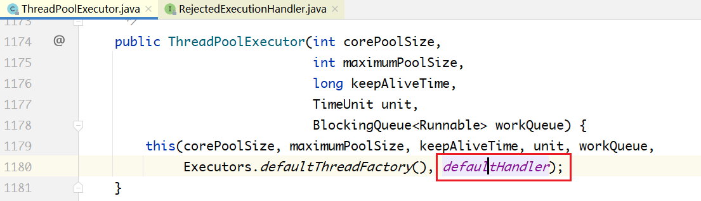

# 1 线程池的实现原理

下图所示为线程池的实现原理：
调用方不断地向线程池中提交任务；线程池中有一组线程，不断地从队列中取任务，这是一个典型的生产者—消费者模型。


## 需要考虑

**要实现这样一个线程池，有几个问题需要考虑：**

1. 队列设置多长？如果是无界的，调用方不断地往队列中放任务，可能导致内存耗尽。
如果是有界的，当队列满了之后，调用方如何处理？
2. 线程池中的线程个数是固定的，还是动态变化的？
3. 每次提交新任务，是放入队列？还是开新线程？
4. 当没有任务的时候，处理线程是睡眠一小段时间？还是进入阻塞？如果进入阻塞，如何唤醒？

**针对问题4，有3种做法：**

1. 不使用阻塞队列，只使用一般的线程安全的队列，也无阻塞/唤醒机制。当队列为空时，线程
池中的线程只能睡眠一会儿，然后醒来去看队列中有没有新任务到来，如此不断轮询。
2. 不使用阻塞队列，但在队列外部、线程池内部实现了阻塞/唤醒机制。
3. 使用阻塞队列。

很显然，做法3最完善，既避免了线程池内部自己实现阻塞/唤醒机制的麻烦，也避免了做法1的睡眠/轮询带来的资源消耗和延迟。正因为如此，接下来要讲的`ThreadPoolExector/ScheduledThreadPoolExecutor`都是基于阻塞队列来实现的，而不是一般的队列，

至此，各式各样的阻塞队列就要派上用场了。


# 2 线程池的类继承体系

线程池的类继承体系如下图所示：


在这里，有两个核心的类： ThreadPoolExector 和ScheduledThreadPoolExecutor ，后者不仅
可以执行某个任务，还可以周期性地执行任务。

向线程池中提交的每个任务，都必须实现Runnable 接口，通过最上面的Executor 接口中的
execute(Runnable command) 向线程池提交任务。

然后，在 ExecutorService 中，定义了线程池的关闭接口 shutdown() ，还定义了可以有返回值
的任务，也就是Callable ，后面会详细介绍。


# 3 ThreadPoolExecutor

## 核心数据结构

### ThreadPoolExector

基于线程池的实现原理，下面看一下ThreadPoolExector的核心数据结构。

```java
public class ThreadPoolExecutor extends AbstractExecutorService {
//...
private final AtomicInteger ctl = new AtomicInteger(ctlOf(RUNNING, 0));
// 存放任务的阻塞队列
private final BlockingQueue<Runnable> workQueue;
// 对线程池内部各种变量进行互斥访问控制
private final ReentrantLock mainLock = new ReentrantLock();
// 线程集合
private final HashSet<Worker> workers = new HashSet<Worker>();
//...
}
```

### Worker

每一个线程是一个Worker对象。Worker是ThreadPoolExector的内部类，核心数据结构如下：

```java
private final class Worker extends AbstractQueuedSynchronizer implements
Runnable {
// ...
final Thread thread; // Worker封装的线程
Runnable firstTask; // Worker接收到的第1个任务
volatile long completedTasks; // Worker执行完毕的任务个数
// ...
}
```

由定义会发现，**Worker继承于AQS，也就是说Worker本身就是一把锁**。这把锁有什么用处呢？用于线程池的关闭、线程执行任务的过程中。


## 核心配置参数解释

ThreadPoolExecutor在其构造方法中提供了几个核心配置参数，来配置不同策略的线程池。


上面的各个参数，解释如下：
1. corePoolSize：在线程池中始终维护的线程个数。
2. maxPoolSize：在corePooSize已满、队列也满的情况下，扩充线程至此值。
3. keepAliveTime/TimeUnit：maxPoolSize 中的空闲线程，销毁所需要的时间，总线程数收缩回corePoolSize。
4. blockingQueue：线程池所用的队列类型。
5. threadFactory：线程创建工厂，可以自定义，有默认值Executors.defaultThreadFactory() 。
6. RejectedExecutionHandler：corePoolSize已满，队列已满，maxPoolSize 已满，最后的拒绝策略。


下面来看这6个配置参数在任务的提交过程中是怎么运作的。

### 提交任务处理流程

在每次往线程池中提交任务的时候，有如下的处理流程：

步骤一：判断当前线程数是否大于或等于corePoolSize。如果小于，则新建线程执行；如果大于，
则进入步骤二。
步骤二：判断队列是否已满。如未满，则放入；如已满，则进入步骤三。
步骤三：判断当前线程数是否大于或等于maxPoolSize。如果小于，则新建线程执行；如果大于，
则进入步骤四。
步骤四：根据拒绝策略，拒绝任务。

总结一下：首先判断corePoolSize，其次判断blockingQueue是否已满，接着判断maxPoolSize，
最后使用拒绝策略。

很显然，基于这种流程，如果队列是无界的，将永远没有机会走到步骤三，也即maxPoolSize没有
使用，也一定不会走到步骤四。

## 线程池的优雅关闭

线程池的关闭，较之线程的关闭更加复杂。当关闭一个线程池的时候，有的线程还正在执行某个任
务，有的调用者正在向线程池提交任务，并且队列中可能还有未执行的任务。因此，关闭过程不可能是
瞬时的，而是需要一个平滑的过渡，这就涉及线程池的完整生命周期管理。

### 1.线程池的生命周期

在JDK 7中，把线程数量（workerCount）和线程池状态（runState）这两个变量打包存储在一个字
段里面，即ctl变量。如下图所示，最高的3位存储线程池状态，其余29位存储线程个数。而在JDK 6中，
这两个变量是分开存储的。


由上面的代码可以看到，ctl变量被拆成两半，最高的3位用来表示线程池的状态，低的29位表示线
程的个数。线程池的状态有五种，分别是RUNNING、SHUTDOWN、STOP、TIDYING和
TERMINATED。

下面分析状态之间的迁移过程，如图所示：


线程池有两个关闭方法，shutdown()和shutdownNow()，这两个方法会让线程池切换到不同的状
态。在队列为空，线程池也为空之后，进入TIDYING 状态；最后执行一个钩子方法terminated()，进入
TERMINATED状态，线程池才真正关闭。

这里的状态迁移有一个非常关键的特征：从小到大迁移，-1，0，1，2，3，只会从小的状态值往大
的状态值迁移，不会逆向迁移。例如，当线程池的状态在TIDYING=2时，接下来只可能迁移到
TERMINATED=3，不可能迁移回STOP=1或者其他状态。

除 terminated()之外，线程池还提供了其他几个钩子方法，这些方法的实现都是空的。如果想实现自己的线程池，可以重写这几个方法：

```
protected void beforeExecute(Thread t, Runnable r) { }
protected void afterExecute(Runnable r, Throwable t) { }
protected void terminated() { }
```


### 2.正确关闭线程池的步骤

关闭线程池的过程为：在调用 shutdown()或者shutdownNow()之后，线程池并不会立即关闭，接下来需要调用 awaitTermination() 来等待线程池关闭。关闭线程池的正确步骤如下：

```java
// executor.shutdownNow();
executor.shutdown();
try {
    boolean flag = true;
    do {
            flag = ! executor.awaitTermination(500, TimeUnit.MILLISECONDS);
        } while (flag);
    } catch (InterruptedException e) {
    // ...
}
```

awaitTermination(...)方法的内部实现很简单，如下所示。不断循环判断线程池是否到达了最终状态
TERMINATED，如果是，就返回；如果不是，则通过termination条件变量阻塞一段时间，之后继续判断。


### 3.shutdown()与shutdownNow()的区别

1. shutdown()不会清空任务队列，会等所有任务执行完成，shutdownNow()清空任务队列。

2. shutdown()只会中断空闲的线程，shutdownNow()会中断所有线程。


- 因为要修改线程池的状态，所以进入前加了锁


下面看一下在上面的代码里中断空闲线程和中断所有线程的区别。


shutdown()方法中的interruptIdleWorkers()方法的实现：


关键区别点在tryLock()：一个线程在执行一个任务之前，会先加锁，这意味着通过是否持有锁，可
以判断出线程是否处于空闲状态。tryLock()如果调用成功，说明线程处于空闲状态，向其发送中断信
号；否则不发送。

- tryLock()方法


- tryAcquire方法：


shutdownNow()调用了interruptWorkers(); 方法：

interruptIfStarted() 方法的实现：


在上面的代码中，shutdown() 和shutdownNow()都调用了tryTerminate()方法，如下所示：


**tryTerminate()不会强行终止线程池，只是做了一下检测**：当workerCount为0，workerQueue为空时，先把状态切换到TIDYING，然后调用钩子方法terminated()。当钩子方法执行完成时，把状态从TIDYING 改为 TERMINATED，接着调用termination.sinaglAll()，通知前面阻塞在awaitTermination的所有调用者线程。

所以，TIDYING和TREMINATED的区别是在二者之间执行了一个钩子方法terminated()，目前是一个空实现。


### 4.任务的提交过程分析

#### execute

- 若worker是第一次创建的，那么command会作为firstTask，并将在workerAdded成功后执行command
- 否则，放入workQueue中

```java
public void execute(Runnable command) {
    if (command == null)
        throw new NullPointerException();
    /*
     * Proceed in 3 steps:
     *
     * 1. If fewer than corePoolSize threads are running, try to
     * start a new thread with the given command as its first
     * task.  The call to addWorker atomically checks runState and
     * workerCount, and so prevents false alarms that would add
     * threads when it shouldn't, by returning false.
     *
     * 2. If a task can be successfully queued, then we still need
     * to double-check whether we should have added a thread
     * (because existing ones died since last checking) or that
     * the pool shut down since entry into this method. So we
     * recheck state and if necessary roll back the enqueuing if
     * stopped, or start a new thread if there are none.
     *
     * 3. If we cannot queue task, then we try to add a new
     * thread.  If it fails, we know we are shut down or saturated
     * and so reject the task.
     */
    int c = ctl.get();
    // 如果当前线程数小于corePoolSize，则启动新线程
    if (workerCountOf(c) < corePoolSize) {
        // 添加Worker，并将command设置为Worker线程的第一个任务开始执行。
        if (addWorker(command, true))
            return;
        c = ctl.get();
    }
    // 如果当前的线程数大于或等于corePoolSize，则调用workQueue.offer放入队列
    if (isRunning(c) && workQueue.offer(command)) {
        int recheck = ctl.get();
        // 如果线程池正在停止，则将command任务从队列移除，并拒绝command任务请求。
        if (! isRunning(recheck) && remove(command))
            reject(command);
        //放入队列中后发现没有线程执行任务，开启新线程
        else if (workerCountOf(recheck) == 0)
            addWorker(null, false);
    }
    // 线程数大于maxPoolSize，并且队列已满，调用拒绝策略
    else if (!addWorker(command, false))
        reject(command);
}
```

#### addWorker

- 可以看到，workerAdded==true时，添加worker成功，则启动该worker对应的线程

```java
// 该方法用于启动新线程。如果第二个参数为true，则使用corePoolSize作为上限，否则使用
// maxPoolSize作为上限。
private boolean addWorker(Runnable firstTask, boolean core) {
    retry:
    for (int c = ctl.get();;) {
        
        // Check if queue empty only if necessary.
        // 如果线程池状态值起码是SHUTDOWN和STOP，
        // 或者第一个任务不是null，或者工作队列为空，则添加worker失败，返回false
        if (runStateAtLeast(c, SHUTDOWN)
            && (runStateAtLeast(c, STOP)
                || firstTask != null
                || workQueue.isEmpty()))
            return false;

        for (;;) {
            // 工作线程数达到上限，要么是corePoolSize要么是maximumPoolSize，启动线程失败
            if (workerCountOf(c)
                >= ((core ? corePoolSize : maximumPoolSize) & COUNT_MASK))
                return false;
            // 增加worker数量成功，返回到retry语句
            if (compareAndIncrementWorkerCount(c))
                break retry;
            c = ctl.get();  // Re-read ctl
            // 如果线程池运行状态起码是SHUTDOWN，则重试retry标签语句，CAS
            if (runStateAtLeast(c, SHUTDOWN))
                continue retry;
            // else CAS failed due to workerCount change; retry inner loop
        }
    }
// worker数量加1成功后，接着运行：
    boolean workerStarted = false;
    boolean workerAdded = false;
    Worker w = null;
    try {
        // 新建worker对象
        w = new Worker(firstTask);
        // 获取线程对象
        final Thread t = w.thread;
        if (t != null) {
            final ReentrantLock mainLock = this.mainLock;
            // 加锁
            mainLock.lock();
            try {
                // Recheck while holding lock.
                // Back out on ThreadFactory failure or if
                // shut down before lock acquired.
                int c = ctl.get();

                if (isRunning(c) ||
                    (runStateLessThan(c, STOP) && firstTask == null)) {
                    // 由于线程已经在运行中，无法启动，抛异常
                    if (t.getState() != Thread.State.NEW)
                        throw new IllegalThreadStateException();
                    workers.add(w);
                    workerAdded = true;
                    int s = workers.size();
                    if (s > largestPoolSize)
                        largestPoolSize = s;
                }
            } finally {
                mainLock.unlock();
            }
            // 如果添加worker成功，则启动该worker对应的线程
            if (workerAdded) {
                t.start();
                workerStarted = true;
            }
        }
    } finally {
        // 如果启动新线程失败
        if (! workerStarted)
            addWorkerFailed(w);
    }
    return workerStarted;
}
```

### 5 任务的执行过程分析

在上面的任务提交过程中，可能会开启一个新的Worker，并把任务本身作为firstTask赋给该
Worker。但对于一个Worker来说，不是只执行一个任务，而是源源不断地从队列中取任务执行，这是
一个不断循环的过程。

下面来看Woker的run()方法的实现过程。

#### Worker

```java
private final class Worker
    extends AbstractQueuedSynchronizer
    implements Runnable
{
    /**
     * This class will never be serialized, but we provide a
     * serialVersionUID to suppress a javac warning.
     */
    private static final long serialVersionUID = 6138294804551838833L;

    /** Thread this worker is running in.  Null if factory fails. */
    final Thread thread;
    /** Initial task to run.  Possibly null. */
    // 线程需要运行的第一个任务。可以是null，如果是null，则线程从队列获取任务
    Runnable firstTask;
    /** Per-thread task counter */
    // 记录线程执行完成的任务数量，每个线程一个计数器
    volatile long completedTasks;

    // TODO: switch to AbstractQueuedLongSynchronizer and move
    // completedTasks into the lock word.

    /**
     * Creates with given first task and thread from ThreadFactory.
     * @param firstTask the first task (null if none)
     */
    Worker(Runnable firstTask) {
        // 线程处于阻塞状态，调用runWorker的时候中断
        setState(-1); // inhibit interrupts until runWorker
        this.firstTask = firstTask;
        this.thread = getThreadFactory().newThread(this);
    }

    /** Delegates main run loop to outer runWorker. */
    public void run() {
        runWorker(this);
    }
```

#### ThreadPoolExecutor#runWorker

```java
//java.util.concurrent.ThreadPoolExecutor#runWorker
final void runWorker(Worker w) {
    Thread wt = Thread.currentThread();
    Runnable task = w.firstTask;
    w.firstTask = null;
    // 中断Worker封装的线程
    w.unlock(); // allow interrupts
    boolean completedAbruptly = true;
    try {
        // 如果线程初始任务不是null，或者从队列获取的任务不是null，表示该线程应该执行任务。
        while (task != null || (task = getTask()) != null) {
            w.lock();
            // If pool is stopping, ensure thread is interrupted;
            // if not, ensure thread is not interrupted.  This
            // requires a recheck in second case to deal with
            // shutdownNow race while clearing interrupt
            // 如果线程池停止了，确保线程被中断
			// 如果线程池正在运行，确保线程不被中断
            if ((runStateAtLeast(ctl.get(), STOP) ||
                 (Thread.interrupted() &&
                  runStateAtLeast(ctl.get(), STOP))) &&
                !wt.isInterrupted())
                // 获取到任务后，再次检查线程池状态，如果发现线程池已经停止，则给自己发中断信号
                wt.interrupt();
            try {
                // 任务执行之前的钩子方法，实现为空
                beforeExecute(wt, task);
                try {
                    task.run();
                    // 任务执行结束后的钩子方法，实现为空
                    afterExecute(task, null);
                } catch (Throwable ex) {
                    afterExecute(task, ex);
                    throw ex;
                }
            } finally {
                // 任务执行完成，将task设置为null
                task = null;
                w.completedTasks++;
                w.unlock();
            }
        }
        // 判断线程是否是正常退出
        completedAbruptly = false;
    } finally {
        // Worker退出
        processWorkerExit(w, completedAbruptly);
    }
}
```


#### 1.shutdown()与任务执行过程综合分析

把任务的执行过程和上面的线程池的关闭过程结合起来进行分析，当调用 shutdown()的时候，可能出现以下几种场景：
1. 当调用shutdown()的时候，所有线程都处于空闲状态。
这意味着任务队列一定是空的。此时，所有线程都会阻塞在 getTask()方法的地方。然后，所
有线程都会收到**interruptIdleWorkers()发来的中断信号**，getTask()返回null，所有Worker都
会退出while循环，之后执行processWorkerExit。
2. 当调用shutdown()的时候，所有线程都处于忙碌状态。
此时，队列可能是空的，也可能是非空的。interruptIdleWorkers()内部的tryLock调用失败，
什么都不会做，所有线程会继续执行自己当前的任务。之后所有线程会执行完队列中的任务，
直到队列为空，getTask()才会返回null。之后，就和场景1一样了，退出while循环。
3. 当调用shutdown()的时候，部分线程忙碌，部分线程空闲。
有部分线程空闲，说明队列一定是空的，这些线程肯定阻塞在 getTask()方法的地方。空闲的
这些线程会和场景1一样处理，不空闲的线程会和场景2一样处理。

下面看一下getTask()方法的内部细节：

#### getTask()

```java
private Runnable getTask() {
    boolean timedOut = false; // Did the last poll() time out?

    for (;;) {
        int c = ctl.get();

        // 如果线程池调用了shutdownNow()，返回null
		// 如果线程池调用了shutdown()，并且任务队列为空，也返回null
        // Check if queue empty only if necessary.
        if (runStateAtLeast(c, SHUTDOWN)
            && (runStateAtLeast(c, STOP) || workQueue.isEmpty())) {
            // 工作线程数减一
            decrementWorkerCount();
            return null;
        }

        int wc = workerCountOf(c);

        // Are workers subject to culling?
        boolean timed = allowCoreThreadTimeOut || wc > corePoolSize;

        if ((wc > maximumPoolSize || (timed && timedOut))
            && (wc > 1 || workQueue.isEmpty())) {
            if (compareAndDecrementWorkerCount(c))
                return null;
            continue;
        }

        try {
            // 如果队列为空，就会阻塞pool或者take，前者有超时时间，后者没有超时时间
// 一旦中断，此处抛异常，对应上文场景1。
            Runnable r = timed ?
                workQueue.poll(keepAliveTime, TimeUnit.NANOSECONDS) :
                workQueue.take();
            if (r != null)
                return r;
            timedOut = true;
        } catch (InterruptedException retry) {
            timedOut = false;
        }
    }
}
```


### 2.shutdownNow() 与任务执行过程综合分析

和上面的 shutdown()类似，只是多了一个环节，即清空任务队列。如果一个线程正在执行某个业务
代码，即使向它发送中断信号，也没有用，只能等它把代码执行完成。因此，中断空闲线程和中断所有
线程的区别并不是很大，除非线程当前刚好阻塞在某个地方。

当一个Worker最终退出的时候，会执行清理工作：

#### processWorkerExit

```java
private void processWorkerExit(Worker w, boolean completedAbruptly) {
    // 如果线程正常退出，不会执行if的语句，这里一般是非正常退出，需要将worker数量减一
    if (completedAbruptly) // If abrupt, then workerCount wasn't adjusted
        decrementWorkerCount();

    final ReentrantLock mainLock = this.mainLock;
    mainLock.lock();
    try {
        completedTaskCount += w.completedTasks;
        // 将自己的worker从集合移除
        workers.remove(w);
    } finally {
        mainLock.unlock();
    }

    // 每个线程在结束的时候都会调用该方法，看是否可以停止线程池
    tryTerminate();

    int c = ctl.get();
    // 如果在线程退出前，发现线程池还没有关闭
    if (runStateLessThan(c, STOP)) {
        if (!completedAbruptly) {
            int min = allowCoreThreadTimeOut ? 0 : corePoolSize;
            // 如果线程池中没有其他线程了，并且任务队列非空
            if (min == 0 && ! workQueue.isEmpty())
                // 下面的分支不满足时，走最后一步 addWorker(null, false);
                // 表示还有任务没做完，但是没有worker了，在最后一步创建worker以使之执行。
                min = 1;
            // 如果工作线程数大于min，表示队列中的任务可以由其他线程执行，退出当前线程
            if (workerCountOf(c) >= min)
                return; // replacement not needed
        }
        
        // 如果当前线程退出前发现线程池没有结束，任务队列不是空的，也没有其他线程来执行
		// 就再启动一个线程来处理。
        addWorker(null, false);
    }
}
```


### 6 线程池的4种拒绝策略

在execute(Runnable command)的最后，调用了reject(command)执行拒绝策略，代码如下所示：


handler就是我们可以设置的拒绝策略管理器：


RejectedExecutionHandler 是一个接口，定义了四种实现，分别对应四种不同的拒绝策略，默认是AbortPolicy。

```java
package java.util.concurrent;
public interface RejectedExecutionHandler {
void rejectedExecution(Runnable r, ThreadPoolExecutor executor);
}
```

ThreadPoolExecutor类中默认的实现是：




四种策略的实现代码如下：

#### 策略1：调用者直接在自己的线程里执行，线程池不处理，

比如到医院打点滴，医院没地方了，到你家自己操作吧：


#### 策略2：线程池抛异常：


#### 策略3：线程池直接丢掉任务，神不知鬼不觉：


#### 策略4：删除队列中最早的任务，将当前任务入队列：

