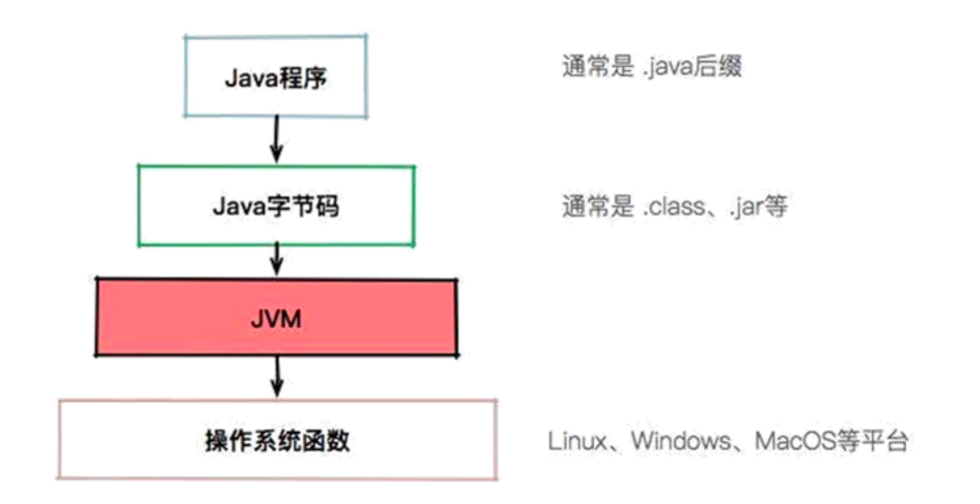
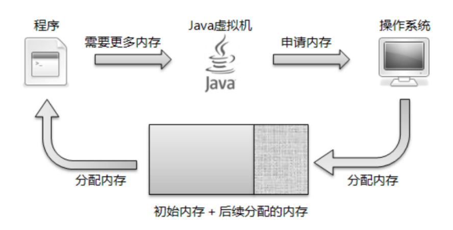
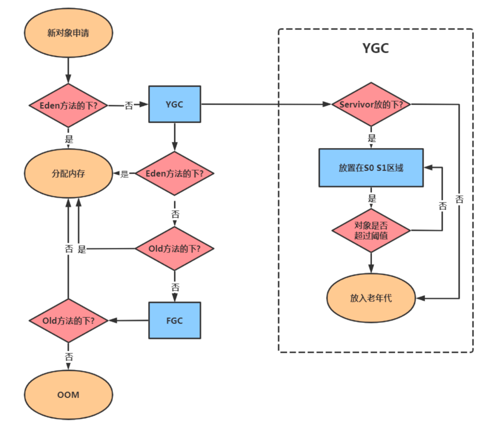
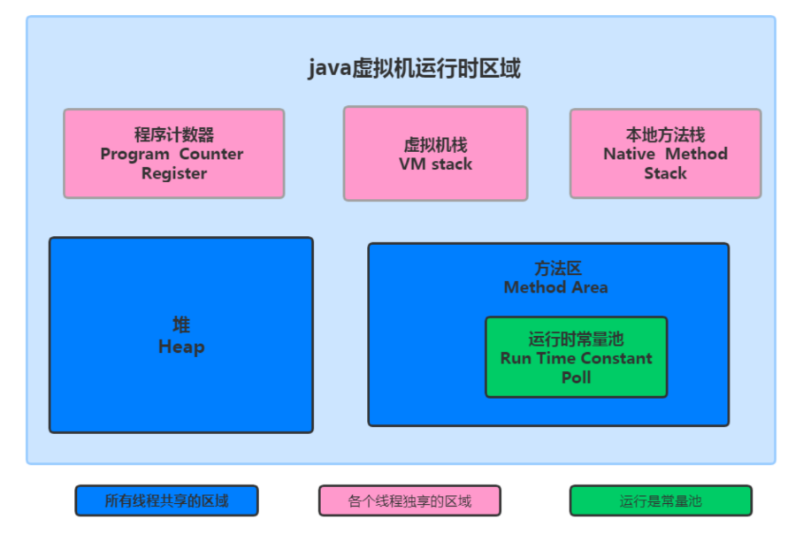

Java 是一门抽象程度特别高的语言，提供了自动内存管理等一系列的特性。这些特性直接在操作系统上实现是不太 可能的，所以就需要 JVM 进行一番转换。



Java 跨平台的意义在于一次编译，处处运行，能够做到这一点 JVM 功不可没。比如我们在 Maven 仓库下载同一 版本的 jar 包就可以到处运行，不需要在每个平台上再编译一次。
现在的一些 JVM 的扩展语言，比如 Clojure、JRuby、Groovy 等，编译到最后都是 .class 文件，Java 语言的维护 者，只需要控制好 JVM 这个解析器，就可以将这些扩展语言无缝的运行在 JVM 之上了。



我们用一句话概括 JVM 与操作系统之间的关系：**JVM 上承开发语言，下接操作系统，它的中间接口就是字节码。**


## 3 JVM、JRE、JDK 的关系


**JVM**

JVM 是 Java 程序能够运行的核心。但是需要注意，JVM 自己什么也干不了，你需要给它提供生产原料(.class 文 件) 。

**JRE**

仅仅是 JVM，是无法完成一次编译，处处运行的。它需要一个基本的类库，比如怎么操作文件、怎么连接网络等。 而 Java 体系很慷慨，会一次性将 JVM 运行所需的类库都传递给它。JVM 标准加上实现的一大堆基础类库，就组成 了 Java 的运行时环境，也就是我们常说的 JRE(Java Runtime Environment)

**JDK**

DK 的全拼，Java Development Kit。对于 JDK 来说，就更庞大了一些。除了 JRE，JDK 还提供了一些非常好用的小工具，比如 javac、java、jar 等。它 是 Java 开发的核心，让外行也可以炼剑!


## 4 Java虚拟机规范和 Java 语言规范的关系


左半部分是 Java 虚拟机规范，其实就是为输入和执行字节码提供一个运行环境。右半部分是我们常说的 Java 语法 规范，比如 switch、for、泛型、lambda 等相关的程序，最终都会编译成字节码。而连接左右两部分的桥梁依然是 Java 的字节码。

如果 .class 文件的规格是不变的，这两部分是可以独立进行优化的。但 Java 也会偶尔扩充一下 .class 文件的格式， 增加一些字节码指令，以便支持更多的特性。

我们可以把 Java 虚拟机可以看作是一台抽象的计算机，它有自己的指令集以及各种运行时内存区域，学过《计算 机组成结构》的同学会在课程的后面看到非常多的相似性。


最后，我们简单看一下一个 Java 程序的执行过程，它到底是如何运行起来的。


这里的 Java 程序是文本格式的。比如下面这段 HelloWorld.java，它遵循的就是 Java 语言规范。其中，我们调用了 System.out 等模块，也就是 JRE 里提供的类库。

```java
 public class HelloWorld {
    public static void main(String[] args) {
        System.out.println("Hello World");
    }
}
```

使用 JDK 的工具 javac 进行编译后，会产生 HelloWorld 的字节码。
 我们一直在说 Java 字节码是沟通 JVM 与 Java 程序的桥梁，下面使用 javap 来稍微看一下字节码到底长什么样子。

```
0 getstatic #2 <java/lang/System.out> // getstatic 获取静态字段的值
3 ldc #3 <Hello World> // ldc 常量池中的常量值入栈
5 invokevirtual #4 <java/io/PrintStream.println> // invokevirtual 运行时方法绑定调用方法 
8 return //void 函数返回
```

Java 虚拟机采用**基于栈的架构**，其指令由操作码和操作数组成。这些 `字节码指令` ，就叫作 `opcode`。其中， getstatic、ldc、invokevirtual、return 等，就是 opcode，可以看到是比较容易理解的。

JVM 就是靠解析这些 opcode 和操作数来完成程序的执行的。当我们**使用 Java 命令运行 .class 文件的时候，实际上 就相当于启动了一个 JVM 进程。**

然后 JVM 会翻译这些字节码，它有两种执行方式。常见的就是解释执行，将 opcode + 操作数翻译成机器代码；另外一种执行方式就是 **JIT（Just In Time）**，也就是我们常说的**即时编译**，它会在一定条件下将字节码编译成机器码之后再执行。

# 第2章 java虚拟机的内存管理

## 1.JVM整体架构

### 五个部分

根据 JVM 规范，JVM 内存共分为虚拟机栈、堆、方法区、程序计数器、本地方法栈**五个部分**。

> 虚拟机栈、PC计数器、本地方法栈 **线程隔离**
>
> 方法、堆 **线程共享**


> JVM分为五大模块: 类装载器子系统 、 运行时数据区 、 执行引擎 、 本地方法接口 和 垃圾收集模块 。


## 2.JVM运行时内存

虚拟机有自动内存管理机制，如果出现面的问题，排查错误就必须要了解虚拟机是怎样使用内存的。


**Java7和Java8内存结构的不同**主要体现在**方法区**的实现 

方法区是java虚拟机规范中定义的一种概念上的区域，不同的厂商可以对虚拟机进行不同的实现。

我们通常使用的Java SE都是由**Sun JDK和OpenJDK**所提供，这也是应用最广泛的版本。而该版本使用的VM就是 **HotSpot VM**。通常情况下，我们所讲的java虚拟机指的就是HotSpot的版本。

### JDK7 内存结构


### JDK8 的内存结构


> 本地内存：
>
> - 与JVM无关
> - 对应JDK7中的方法区


### 针对JDK8虚拟机内存详解


### JDK7和JDK8变化小结


```
 线程私有的:
  1程序计数器
	2虚拟机栈
  3本地方法栈
线程共享的:
    1堆
    2方法区 直接内存(非运行时数据区的一部分)
```

**对于Java8，HotSpots取消了永久代，那么是不是就没有方法区了呢?** 

当然不是，方法区只是一个规范，只不过它的实现变了。

在Java8中，元空间(Metaspace)登上舞台，方法区存在于元空间(Metaspace)。同时，元空间不再与堆连续，而且是存在于本地内存(Native memory)。

`@@@###本地内存 是指计算机的内存吗？ -是的`

**方法区Java8之后的变化**

- 移除了永久代(PermGen)，替换为元空间(Metaspace)
- 永久代中的**class metadata(类元信息)**转移到了**native memory(本地内存，而不是虚拟机)** 
- 永久代中的**interned Strings(字符串常量池)** 和 **class static variables(类静态变量)**转移到了**Java heap** 
- **永久代参数(PermSize MaxPermSize)**-> **元空间参数(MetaspaceSize MaxMetaspaceSize)**

**Java8为什么要将永久代替换成Metaspace?**

- 字符串存在永久代中，容易出现性能问题和内存溢出。 
- 类及方法的信息等比较难确定其大小，因此对于永久代的大小指定比较困难，太小容易出现永久代溢出，太 大则容易导致老年代溢出。
- 永久代会为 GC 带来不必要的复杂度，并且回收效率偏低。
- Oracle 可能会将HotSpot 与 JRockit 合二为一，JRockit没有所谓的永久代。


## 2.1 PC 程序计数器

程序计数器(Program Counter Register)：也叫PC寄存器，是一块较小的内存空间，它可以看做是**当前线程所执行 的字节码的行号指示器**。在虚拟机的概念模型里，字节码解释器工作时就是通过改变这个计数器的值来选取下一条 需要执行的字节码指令、分支、循环、跳转、异常处理、线程恢复等基础功能都需要依赖这个计数器来完成。

#### tool

jclasslib

### PC寄存器的特点

(1)区别于计算机硬件的pc寄存器，两者不略有不同。计算机用pc寄存器来存放“伪指令”或地址，而相对于虚拟机，pc寄存器它表现为一块内存，虚拟机的pc寄存器的功能也是存放伪指令，更确切的说存放的是将要执行指令的 地址。

(2)当虚拟机正在执行的方法是一个本地(native)方法的时候，jvm的pc寄存器存储的值是undefined。 

(3)程序计数器是线程私有的，它的生命周期与线程相同，每个线程都有一个。 

(4)此内存区域是唯一一个在Java虚拟机规范中没有规定任何OutOfMemoryError情况的区域。


Java虚拟机的多线程是通过线程轮流切换并分配处理器执行时间的方式来实现的，在任何一个确定的时刻，一个处 理器只会执行一条线程中的指令。

因此，为了线程切换后能恢复到正确的执行位置，每条线程都需要有一个独立的程序计数器，各条线程之间的计数 器互不影响，独立存储，我们称这类内存区域为“线程私有”的内存。

#### 实例

```
public class PCRegister {
    public static void main(String[] args) {
        int x = 1;
        int y = 2;
        System.out.println(x+y);
    }
}

```

- 字节码

```
 0 iconst_1
 1 istore_1
 2 iconst_2
 3 istore_2
 4 getstatic #2 <java/lang/System.out : Ljava/io/PrintStream;>
 7 iload_1
 8 iload_2
 9 iadd
10 invokevirtual #3 <java/io/PrintStream.println : (I)V>
13 return

```


PCR的作用：


- 不同线程的不同PCR


## 2.2 虚拟机栈

Java虚拟机栈(Java Virtual Machine Stacks)也是线程私有的，即生命周期和线程相同。Java虚拟机栈和线程同时创 建，用于存储栈帧。每个方法在执行时都会创建一个栈帧(Stack Frame)，用于存储局部变量表、操作数栈、动态 链接 、 方法出口 等信息。每一个方法从调用直到执行完成的过程就对应着一个栈帧在虚拟机栈中从入栈到出栈的过 程。

```
public class StackDemo {
    public static void main(String[] args) {
        StackDemo sd = new StackDemo();
        sd.A();
    }
    public void A(){
        int a = 10;
        System.out.println(" method A start");
        System.out.println(a);
        B();
        System.out.println("method A end");
    }
    public void B(){
        int b = 20;
        System.out.println(" method B start");
        C();
        System.out.println("method B end");
    }
    private void C() {
        int c = 30;
        System.out.println(" method C start");
        System.out.println("method C end");
    }
}
```


### 2.什么是栈帧

**栈帧(Stack Frame)**是用于**支持虚拟机进行方法调用和方法执行的数据结构**。栈帧存储了方法的**局部变量表、操作数栈、动态连接和方法返回地址等**信息。每一个方法从调用至执行完成的过程，都对应着一个栈帧在虚拟机栈里从入 栈到出栈的过程。


### 3.设置虚拟机栈的大小

也为 -XX:ThreadStackSize

-Xss 为jvm启动的每个线程分配的内存大小，默认JDK1.4中是256K，JDK1.5+中是1M

- Linux/x64 (64-bit): 1024 KB
- macOS (64-bit): 1024 KB
- Oracle Solaris/x64 (64-bit): 1024 KB
- Windows: The default value depends on virtual memory

```
-Xss1m
-Xss1024k
-Xss1048576
```

### 5.局部变量表

**局部变量表(Local Variable Table)**是一组变量值存储空间，用于存放方法参数和方法内定义的局部变量。包括8种基本数据类型、对象引用(reference类型)和returnAddress类型(指向一条字节码指令的地址)。

#### 局部变量空间(Slot)

其中**64位长度的long和double**类型的数据会占用**2个局部变量空间(Slot)**，其余的数据类型只占用1个。

#### 图示


### 6.操作数栈

操作数栈(Operand Stack)也称作操作栈。随着方法执行和字节码指令的执行，会从局部 变量表或对象实例的字段中复制常量或变量写入到操作数栈，再随着计算的进行将栈中元素出栈到局部变量表或者 返回给方法调用者，也就是出栈/入栈操作。

通过以下代码演示操作站执行

```
public class StackDemo2 {
    public static void main(String[] args) {
        int i = 1;
        int j = 2;
        int z = i + j;
} }
```


### 7.动态链接

Java虚拟机栈中，每个栈帧都包含一个指向运行时常量池中该栈所属方法的符号引用，持有这个引用的目的是为了 支持方法调用过程中的动态链接(Dynamic Linking)。

动态链接的**作用**:将符号引用转换成直接引用。

```
public class DynamicLink {
    public static void main(String[] args) {
        Math.random();
    }
}
```


### 8.方法返回地址

**方法返回地址存放调用该方法的PC寄存器的值**。一个方法的结束，有两种方式：正常地执行完成，出现未处理的异常非正常的退出。无论通过哪种方式退出，在方法退出后都返回到该方法被调用的位置。

- 方法正常退出时，调用者 的PC计数器的值作为返回地址，即调用该方法的指令的下一条指令的地址。
- 而通过异常退出的，返回地址是要通过 异常表来确定，栈帧中一般不会保存这部分信息。


**无论方法是否正常完成，都需要返回到方法被调用的位置，程序才能继续进行。**


## 2.3 本地方法栈

本地方法栈(Native Method Stacks) 与虚拟机栈所发挥的作用是非常相似的， 其区别只是

- 虚拟机栈为虚拟机执行Java方法(也就是字节码) 服务， 
- 而本地方法栈则是为虚拟机使用到的本地(Native) 方法服务。


**特点**

(1)本地方法栈加载native的但是方法, native类方法存在的意义当然是填补java代码不方便实现的缺陷而提出的。 

(2)虚拟机栈为虚拟机执行Java方法服务，而本地方法栈则是为虚拟机使用到的Native方法服务。 

(3)是线程私有的，它的生命周期与线程相同，每个线程都有一个。


**两种类型的异常**

在Java虚拟机规范中，对本地方法栈这块区域，与Java虚拟机栈一样，规定了**两种类型的异常**: 

(1)StackOverFlowError :线程请求的栈深度>所允许的深度。 

(2)OutOfMemoryError:本地方法栈扩展时无法申请到足够的内存。


## 2.4 堆

### 2.4.1 Java 堆概念

1.简介

对于Java应用程序来说， Java堆(Java Heap) 是虚拟机所管理的内存中最大的一块。 Java堆是被所 有线程共享 的一块内存区域， 在虚拟机启动时创建。 此内存区域的唯一目的就是存放对象实例， Java 世界里“几乎”所有的对 象实例都在这里分配内存。

“几乎”是指从实现角度来看， 随着Java语 言的发展， 现在已经能看到些许迹象表明日 后可能出现值类型的支持， 即使只考虑现在， 由于即时编译技术的进步， 尤其是逃逸分析技术的日渐强大， 栈上分配、 标量替换优化手段已经导致一些微妙的变化悄然发生， 所以说Java对象实例都分配在堆上也渐渐变得不是 那么绝对了。


#### 2.堆的特点

##### -Xms、-Xmx  

(1)是Java虚拟机所管理的内存中最大的一块。 

(2)堆是jvm所有线程共享的。
堆中也包含私有的线程缓冲区 Thread Local Allocation Buffer (TLAB) 

(3)在虚拟机启动的时候创建。 

(4)唯一目的就是存放对象实例，几乎所有的对象实例以及数组都要在这里分配内存。 

(5)Java堆是垃圾收集器管理的主要区域。

(6)因此很多时候java堆也被称为“GC堆”(Garbage Collected Heap)。从内存回收的角度来看，由于现在收集器 基本都采用分代收集算法，所以Java堆还可以细分为:**新生代和老年代**;新生代又可以分为：**Eden 空间、From Survivor空间（S0）、To Survivor空间（S1）**。

(7)java堆是计算机物理存储上不连续的、逻辑上是连续的，也是大小可调节的(通过**-Xms和-Xmx**控制)。 

(8)方法结束后,堆中对象不会马上移出仅仅在垃圾回收的时候时候才移除。 

(9)如果在堆中没有内存完成实例的分配，并且堆也无法再扩展时，将会抛出OutOfMemoryError异常


#### 2.设置堆空间大小

1. 内存大小-Xmx/-Xms
    使用示例: -Xmx20m -Xms5m
    说明: 当下Java应用最大可用内存为20M， 最小内存为5M

测试:

```
public class TestVm {
    public static void main(String[] args) {
//补充
        //byte[] b = new byte[50 * 1024 * 1024]; //System.out.println("分配了1M空间给数组");
        System.out.print("Xmx=");
        System.out.println(Runtime.getRuntime().maxMemory() / 1024.0 / 1024 + "M");
        System.out.print("free mem=");
        System.out.println(Runtime.getRuntime().freeMemory() / 1024.0 / 1024 + "M");
        System.out.print("total mem=");
        System.out.println(Runtime.getRuntime().totalMemory() / 1024.0 / 1024 + "M");
    }
}
```

结果

```
Xmx=20.0M
free mem=4.089378356933594M
total mem=6.0M

```


大家可以发现，这里打印出来的Xmx值和设置的值之间是由差异的，total Memory和最大的内存之间还是存在一定 差异的，就是说JVM一般会尽量保持内存在一个尽可能底的层面，而非贪婪做法按照最大的内存来进行分配。


若申请的内存超过最大堆内存，出现异常

```
/Library/Java/JavaVirtualMachines/jdk-11.0.11.jdk/Contents/Home/bin/java -Xmx20m -Xms5m -javaagent:/Applications/IntelliJ IDEA.app/Contents/lib/idea_rt.jar=65261:/Applications/IntelliJ IDEA.app/Contents/bin -Dfile.encoding=UTF-8 -classpath /jvm-demo com.shred.jvm.TestVm
Exception in thread "main" java.lang.OutOfMemoryError: Java heap space
	at com.shred.jvm.TestVm.main(TestVm.java:6)

```


#### 3.堆的分类

现在垃圾回收器都使用分代理论,堆空间也分类如下: 

在Java7 Hotspot虚拟机中将Java堆内存分为3个部分:

- 青年代Young Generation 
- 老年代Old Generation 
- 永久代Permanent Generation


**Java8**

在Java8以后 ，由于方法区的内存不在分配在Java堆上，而是存储于本地内存元空间Metaspace中，所以 **永久代就不 存在了** ，在(2018年9约25日)Java11正式发布以后，我从官网上找到了关于Java11中垃圾收集器的官方文档， 文档中没有提到“永久代”，而只有青年代和老年代。


### 2.4.2 年轻代和老年代

##### -XX:+PrintGCDetails 打印GC

> 比例：
>
> 年轻：年老=1:2
>
> 年轻中的：
> eden:survivor0:survivor1=8:1:1
>
> 配置比例：
>
>  -XX:NewRatio=2


#### 1.JVM中存储java对象可以被分为两类:

1)**年轻代**(Young Gen):年轻代主要存放新创建的对象，内存大小相对会比较小，垃圾回收会比较频繁。年轻代分 成1个Eden Space和2个Suvivor Space(from 和to)。

2)**年老代**(Tenured Gen):年老代主要存放JVM认为生命周期比较长的对象(经过几次的Young Gen的垃圾回收后仍 然存在)，内存大小相对会比较大，垃圾回收也相对没有那么频繁。


#### 2.配置新生代和老年代堆结构占比

默认 -XX:NewRatio=2 , 表示新生代占1 , 老年代占2 ,新生代占整个堆的1/3
 修改占比 -XX:NewPatio=4 , 表示新生代占1 , 老年代占4 , 新生代占整个堆的1/5 Eden空间和另外两个Survivor空间占比分别为8:1:1
 可以通过操作选项 -XX:SurvivorRatio 调整这个空间比例。 比如 -XX:SurvivorRatio=8 几乎所有的java对象都在Eden区创建, 但80%的对象生命周期都很短,创建出来就会被销毁.


从图中可以看出: **堆大小 = 新生代 + 老年代**。其中，堆的大小可以通过参数 –Xms、-Xmx 来指定。

默认的，新生代 ( Young ) 与老年代 ( Old ) 的比例的值为 **1:2** ( 该值可以通过参数 –XX:NewRatio 来指定 )，即:新生 代 ( Young ) = 1/3 的堆空间大小。老年代 ( Old ) = 2/3 的堆空间大小。

其中，新生代 ( Young ) 被细分为 Eden 和 两个 Survivor 区域，这两个 Survivor 区域分别被命名为 from 和 to，以示区分。

 默认的，**Edem : from : to = 8 : 1 : 1** ( 可以 通过参数 –XX:SurvivorRatio 来设定 )，即: Eden = 8/10 的新生代空间大小，from = to = 1/10 的新生代空间大小。 JVM 每次只会使用 Eden 和其中的一块 Survivor 区域来为对象服务，所以无论什么时候，总是有一块 Survivor 区域 是空闲着的。因此，新生代实际可用的内存空间为 9/10 ( 即90% )的新生代空间。


### 2.4.3 对象分配过程 

JVM设计者不仅需要考虑到内存如何分配，在哪里分配等问题，并且由于内存分配算法与内存回收算法密切相关，

因此还需要考虑GC执行完内存回收后是否存在空间中间产生内存碎片。

#### 分配过程

1.new的对象先放在伊甸园区。该区域有大小限制

2.当伊甸园区域填满时，程序又需要创建对象，JVM的垃圾回收器将对伊甸园预期进行垃圾回收(Minor GC),将伊 甸园区域中不再被其他对象引用的额对象进行销毁，再加载新的对象放到伊甸园区

3.然后将伊甸园区中的剩余对象移动到幸存者0区 4.如果再次触发垃圾回收，此时上次幸存下来的放在幸存者0区的，如果没有回收，就会放到幸存者1区 5.如果再次经历垃圾回收，此时会重新返回幸存者0区，接着再去幸存者1区。 6.如果累计次数到达默认的15次，这会进入养老区。

可以通过设置参数，调整阈值 -XX:MaxTenuringThreshold=N 7.养老区内存不足是,会再次出发GC:Major GC 进行养老区的内存清理 8.如果养老区执行了Major GC后仍然没有办法进行对象的保存,就会报OOM异常.

> eden区的对象，未被GC销毁的，会转移到to survivor区。surviror区分为surviror0、surviror1，大小是一样的，空的叫to survivor，非空的叫from survivor，
>
> 每一轮GC都会至少有一块是空的，这块空的就是to survivor，用作本轮GC转移的目标。
>
> 非空的区域是from survivor，是上一轮的目标，本轮会将其中的未被销毁的对象转移到to中。


#### 分配对象的流程:



### 2.4.4 堆GC

 Java 中的堆也是 GC 收集垃圾的主要区域。GC 分为两种:一种是**部分收集器(Partial GC)**，另一类是**整堆收集器(Full GC)**

> 根据使用的GC算法的不同，触发的GC过程也会不同，
>
> 对于CMS算法（ConcurrentMarkSweepGC）、和G1算法：
>
> - CMS算法：ParNew（Young）GC + CMS（Old）GC ＋ Full GC for CMS算法；
> - G1 GC算法：Young GC + mixed GC（新生代，再加上部分老生代）＋ Full GC for G1 GC算法（应对G1 GC算法某些时候的不赶趟，开销很大）；

#### 部分收集器(Partial GC)

**部分收集器**: 不是完整收集java堆的的收集器,它又分为:

- 新生代收集(Minor GC / Young GC): 只是新生代的垃圾收集
- 老年代收集 (Major GC / Old GC): 只是老年代的垃圾收集 (CMS GC 单独回收老年代) 
- 混合收集(Mixed GC):收集整个新生代及老年代的垃圾收集 (G1 GC会混合回收, region区域回收)

#### 整堆收集(Full GC)

**整堆收集(Full GC)**：收集整个java堆和方法区的垃圾收集器


#### 年轻代GC触发条件:

- 年轻代空间不足,就会触发Minor GC， 这里年轻代指的是Eden代满，Survivor不满不会引发GC
- Minor GC会引发**STW(stop the world)** ,暂停其他用户的线程,等垃圾回收接收,用户的线程才恢复. 

#### 老年代GC (Major GC)触发机制

- 老年代空间不足时,会尝试触发MinorGC. 如果空间还是不足,则触发Major GC 
- 如果Major GC , 内存仍然不足,则报错OOM
- Major GC的速度比Minor GC慢10倍以上。同时也会触发STW，暂停用户线程的时间更长。

#### FullGC 触发机制:

- 调用System.gc() , 系统会执行Full GC ,不是立即执行. 
- 老年代空间不足
- 方法区空间不足
- 通过Minor GC进入老年代平均大小大于老年代可用内存


## 2.5 元空间

在JDK1.7之前，HotSpot 虚拟机把方法区当成永久代来进行垃圾回收。而从 JDK 1.8 开始，移除永久代，并把方法 区移至元空间，它位于本地内存中，而不是虚拟机内存中。 HotSpots取消了永久代，那么是不是也就没有方法区了 呢?当然不是，方法区是一个规范，规范没变，它就一直在，只不过取代永久代的是 元空间(Metaspace) 而已。 它和永久代有什么不同的?

- **存储位置不同**: 永久代 在物理上是堆的一部分 ，和新生代、老年代的地址是连续的，而元空间属于本地内存。

- **存储内容不同**: 
  在原来的永久代划分中，永久代用来存放类的元数据信息、静态变量以及常量池等。 
  现在**类的元信息存储在元空间**中，**静态变量和常量池等并入堆中**，相当于原来的永久代中的数据，被元空间和堆内存给瓜分了。


### 2.5.1 为什么要废弃永久代，引入元空间? 

相比于之前的永久代划分，Oracle为什么要做这样的改进呢?

- 在原来的永久代划分中，永久代需要存放类的元数据、静态变量和常量等。 它的**大小不容易确定** ，因为这其中有很多影响因素，比如类的总数，常量池的大小和方法数量等，-XX:MaxPermSize 指定太小很容易造成永久 代内存溢出。
- 移除永久代是为**融合HotSpot VM与 JRockit VM**而做出的努力，因为JRockit没有永久代，不需要配置永久代
- 永久代会为GC带来不必要的复杂度，并且回收效率偏低。

### 2.5.2 废除永久代的好处

- 由于类的元数据分配在本地内存中，元空间的最大可分配空间就是系统可用内存空间。不会遇到永久代存在 时的**内存溢出错误**。
- 将运行时常量池从PermGen分离出来，与类的元数据分开，提升类元数据的**独立性**。 
- 将元数据从PermGen剥离出来到Metaspace，可以提升对元数据的管理同时**提升GC效率**。

### 2.5.3 Metaspace相关参数

- -XX:MetaspaceSize，初始空间大小，达到该值就会触发垃圾收集进行类型卸载，同时GC会对该值进行调整:如 果释放了大量的空间，就适当降低该值;如果释放了很少的空间，那么在不超过MaxMetaspaceSize时，适当提 高该值。 
- -XX:MaxMetaspaceSize，最大空间，默认是没有限制的。如果没有使用该参数来设置类的元数据的大小， **其最 大可利用空间是整个系统内存的可用空间** 。JVM也可以增加本地内存空间来满足类元数据信息的存储。 但是如果没有设置最大值，则可能存在bug导致Metaspace的空间在不停的扩展，会导致机器的内存不足;进 而可能出现swap内存被耗尽;最终导致进程直接被系统直接kill掉。 如果设置了该参数，当Metaspace剩余空间不足，会抛出:java.lang.OutOfMemoryError: Metaspace space 
- -XX:MinMetaspaceFreeRatio，在GC之后，最小的Metaspace剩余空间容量的百分比，减少为分配空间所导致的 垃圾收集 
- -XX:MaxMetaspaceFreeRatio，在GC之后，最大的Metaspace剩余空间容量的百分比，减少为释放空间所导致的 垃圾收集


## 2.6 方法区

### 2.6.1 方法区的理解

方法区(Method Area) 与Java堆一样， 是各个线程共享的内存区域， 它用于存储已被虚拟机加载 的类型信息、 常量、 静态变量、 即时编译器编译后的代码缓存等数据。

https://docs.oracle.com/javase/specs/jvms/se8/html/jvms-2.html#jvms-2.5.4

《Java虚拟机规范》中明确说明:“尽管所有的方法区在逻辑上是属于堆的一部分，但些简单的实现可能不会 选择去进行垃圾收集或者进行压缩”。对HotSpot而言，方法区还有一个别名叫做Non-Heap(非堆)，的就是 要和堆分开。

**元空间、永久代是方法区具体的落地实现。方法区看作是一块独立于Java堆的内存空间，它主要是用来存储所加载 的类信息的**


创建对象各数据区域的声明:


方法区的特点:

- 方法区与堆一样是各个线程共享的内存区域 
- 方法区在JVM启动的时候就会被创建并且它实例的物理内存空间和Java堆一样都可以不连续 
- 方法区的大小跟堆空间一样 可以选择固定大小或者动态变化 
- 方法区的对象决定了系统可以保存多少个类，如果系统定义了太多的类 导致方法区溢出虚拟机同样会跑出 (OOM)异常(Java7之前是 PermGen Space (永久带) Java 8之后 是MetaSpace(元空间) ) 
  方法区的大小决定了系统可以保存多少个类，如果系统定义了太多的类，导致方法区溢出，虚拟机同样会抛出内存溢出错误：`java.lang.OutofMemoryError：PermGen space `或者`java.lang.OutOfMemoryError:Metaspace`
- 关闭JVM就会释放这个区域的内存

### 2.6.2 方法区结构 

方法区的内部结构


类加载器将Class文件加载到内存之后，将类的信息存储到方法区中。 

方法区中存储的内容:

- 类型信息(域信息、方法信息)
- 运行时常量池


#### **类型信息**

对每个加载的类型(类Class、接口 interface、枚举enum、注解 annotation)，JVM必须在方法区中存储以下类型信息:
1 这个类型的完整有效名称(全名 = 包名.类名)
2 这个类型直接父类的完整有效名(对于 interface或是java.lang. Object，都没有父类)
3 这个类型的修饰符( public, abstract，final的某个子集)
4 这个类型直接接口的一个有序列表

#### 域信息

域信息，即为类的属性，成员变量
JVM必须在方法区中保存类所有的成员变量相关信息及声明顺序。
域的相关信息包括:域名称、域类型、域修饰符(pυblic、private、protected、static、final、volatile、transient的 某个子集)

#### 方法信息

JVM必须保存所有方法的以下信息，同域信息一样包括声明顺序:
1. 方法名称方法的返回类型(或void)
2. 方法参数的数量和类型(按顺序)
3. 方法的修饰符public、private、protected、static、final、synchronized、native,、abstract的一个子集
4. 方法的字节码bytecodes、操作数栈、局部变量表及大小( abstract和native方法除外)
5. 异常表( abstract和 native方法除外)。每个异常处理的开始位置、结束位置、代码处理在程序计数器中的偏
   移地址、被捕获的异常类的常量池索引

### 2.6.3 方法区设置

方法区的大小不必是固定的，JVM可以根据应用的需要动态调整。

#### jdk7及以前

- **方法区称为永久代**

通过-xx:Permsize来设置永久代初始分配空间。默认值是20.75M -XX:MaxPermsize来设定永久代最大可分配空间。32位机器默认是64M，64位机器模式是82M 当JVM加载的类信息容量超过了这个值，会报异常OutofMemoryError:PermGen space。

查看JDK PermSpace区域默认大小

```bash
jps #是java提供的一个显示当前所有java进程pid的命令
jinfo -flag PermSize 进程号 #查看进程的PermSize初始化空间大小 
jinfo -flag MaxPermSize 进程号 #查看PermSize最大空间
```

#### JDK8以后

- **方法区称为元空间**

元数据区大小可以使用参数 `-XX:MetaspaceSize` 和 `-XX:MaxMetaspaceSize`指定

 默认值依赖于平台。windows下，`-XX:MetaspaceSize`是21M，`-XX:MaxMetaspaceSize`的值是-1，即没有限制。

与永久代不同，如果不指定大小，默认情况下，虚拟机会耗尽所有的可用系统内存。如果元数据区发生溢出，虚拟 机一样会抛出异常`OutOfMemoryError:Metaspace`

-XX:MetaspaceSize:  设置初始的元空间大小。对于一个64位的服务器端JVM来说，其默认的-xx:MetaspaceSize值为 21MB。这就是**初始的高水位线**，**一旦触及这个水位线，FullGC将会被触发并卸载没用的类**  (即这些类对应的类加载器不再存活)  然后这个高水位线将会重置。新的高水位线的值取决于GC后释放了多少元空间。如果释放的空间不足，那么在不超过MaxMetaspaceSize时，适当提高该值。如果释放空间过多，则适当降低该值。

**如果初始化的高水位线设置过低，上述高水位线调整情况会发生很多次。**通过垃圾回收器的日志可以观察到FullGC 多次调用。为了避免频繁地GC，建议将-XX:MetaspaceSize设置为一个相对较高的值。

```bash
jps #查看进程号
jinfo -flag MetaspaceSize 进程号 #查看Metaspace 最大分配内存空间 
jinfo -flag MaxMetaspaceSize 进程号 #查看Metaspace最大空间
```

## 2.7 运行时常量池

### 常量池vs运行时常量池

字节码文件中 ，内部包含了常量池

方法区中 ，内部包含了运行时常量池

**常量池**:  存放编译期间生成的各种字面量与符号引用

**运行时常量池**:  常量池表在运行时的表现形式

编译后的字节码文件中包含了类型信息、域信息、方法信息等。通过ClassLoader将字节码文件的常量池中的信息加载到内存中，存储在了方法区的运行时常量池中。

理解为**字节码中的常量池 Constant pool 只是文件信息**，它想要执行就必须加载到内存中。而Java程序是靠 JVM，更具体的来说是JVM的**执行引擎来解释执行**的。执行引擎在运行时常量池中取数据，被加载的字节码常量池 中的信息是放到了**方法区的运行时常量池**中。

它们不是一个概念，存放的位置是不同的。一个在字节码文件中，一个在方法区中。



对字节码文件反编译之后，查看常量池相关信息:


要弄清楚方法区的运行时常量池，需要理解清楚字节码中的常量池。

一个有效的字节码文件中除了包含类的版本信息、字段、方法以及接口等描述信息外，还包含一项信息那就是 **常量池表( Constant pool table)**，包括各种字面量和对类型、域和方法的符号引用。 

**常量池，可以看做是一张表，虚拟机指令根据这张常量表找到要执行的类名、方法名、参数类型、字面量等类型**。 常量池表Constant pool table:


在方法中对常量池表的符号引用


### @@@###为什么需要常量池?

举例来说:

```
public class Solution {
    public void method() {
        System.out.println("are you ok");
    }
}
```

这段代码很简单，但是里面却使用了 String、 System、 PrintStream及Object等结构。如果代码多，引用到的结构会 更多!这里就需要常量池，将这些引用转变为符号引用，具体用到时，采取加载。

## 2.8 直接内存

直接内存(Direct Memory) 并不是虚拟机运行时数据区的一部分。

在JDK 1.4中新加入了NIO (New Input/Output) 类， 引入了一种基于通道(Channel) 与缓冲区 (Buer) 的I/O方 式， **它可以使用Native函数库直接分配堆外内存**， 然后**通过一个存储在Java堆里面的 DirectByteBuer对象作为这块 内存的引用进行操作**。 这样能在一些场景中显著提高性能， 因为**避免了 在Java堆和Native堆中来回复制数据**。


### DirectByteBuffer

NIO的Buffer提供一个可以直接访问系统物理内存的类——DirectBuffer。DirectBuffer类继承自ByteBuffer，但和普通 的ByteBuer不同。普通的ByteBuffer仍在JVM堆上分配内存，其最大内存受到最大堆内存的 限制。而**DirectBuffer直接分配在物理内存中，并不占用堆空间**。在访问普通的ByteBuffer时，系统总是会使用一个“**内核缓冲区**”进行操作。 而**DirectBuffer所处的位置，就相当于这个“内核缓冲区”**。因此，使用DirectBuffer是一种更加接近内存底层的方法， 所以它的速度比普通的ByteBuffer更快。


### 使用堆外内存的好处:

1. 改善堆过大时垃圾回收效率，减少停顿。Full GC时会扫描堆内存，回收效率和堆大小成正比。Native的内 存，由OS负责管理和回收。
2. 减少内存在Native堆和JVM堆拷贝过程，避免拷贝损耗，降低内存使用。 
3. 可突破JVM内存大小限制。


> **用户态**、**内核态**
>
> 通过**系统调用**将 Linux 整个体系分为用户态和内核态（或者说内核空间和用户空间）。那内核态到底是什么呢？其实从本质上说就是我们所说的内核，它是一种**特殊的软件程序**，特殊在哪儿呢？**控制计算机的硬件资源，例如协调 CPU 资源，分配内存资源，并且提供稳定的环境供应用程序运行**。
>
> 用户态就是提供应用程序运行的空间，为了使应用程序访问到内核管理的资源例如 CPU，内存，I/O。内核必须提供一组通用的访问接口，这些接口就叫**系统调用。**


## 3.实战OutOfMemoryError异常

## 3.1 Java堆溢出

堆内存中主要存放对象、数组等，只要不断地创建这些对象，并且保证 GC Roots 到对象之间有可达路径来避免垃 圾收集回收机制清除这些对象，当这些对象所占空间超过最大堆容量时，就会产生 OutOfMemoryError 的异常。堆 内存异常示例如下:

```java
/**
* 设置最大堆最小堆: -Xms20m -Xmx20m
 **/
public class HeapOOM {
    static class OOMObject {
    }
    public static void main(String[] args) {
        List<OOMObject> oomObjectList = new ArrayList<>();
        while (true) {
            oomObjectList.add(new OOMObject());
        }
} }
```

运行后会报异常，在堆栈信息中可以看到
`java.lang.OutOfMemoryError: Java heap space` 的信息，说明在堆内存空间产生内存溢出的异常。

  新产生的对象最初分配在新生代，新生代满后会进行一次 `Minor GC` ，如果 `Minor GC` 后空间不足会把该对象和 新生代满足条件的对象放入老年代，老年代空间不足时会进行 `Full GC` ，之后如果空间还不足以存放新对象则抛 出 `OutOfMemoryError` 异常。

常见原因:

- 内存中加载的数据过多，如一次从数据库中取出过多数据;
- 集合对对象引用过多且使用完后没有清空;
- 代码中存在死循环或循环产生过多重复对象;
- 堆内存分配不合理


## 3.2 虚拟机栈和本地方法栈溢出

由于HotSpot虚拟机中并不区分虚拟机栈和本地方法栈， 因此对于HotSpot来说， `-Xoss`参数(设置本地方法栈大 小) 虽然存在， 但实际上是没有任何效果的， 栈容量只能由`-Xss`参数来设定。 关于虚拟机栈和本地方法栈， 在 《Java虚拟机规范》 中描述了两种异常:

1) 如果线程请求的栈深度大于虚拟机所允许的最大深度， 将抛出`StackOverflowError`异常。
2) 如果虚拟机的栈内存允许动态扩展， 当扩展栈容量无法申请到足够的内存时， 将抛出 `OutOfMemoryError`异
常。

《Java虚拟机规范》 明确允许Java虚拟机实现自行选择是否支持栈的动态扩展， 而HotSpot虚拟机的选择是不支持 扩展， 所以除非在创建线程申请内存时就因无法获得足够内存而出现 OutOfMemoryError异常， 否则在线程运行时 是不会因为扩展而导致内存溢出的， 只会因为栈容量无法容纳新的栈帧而导致StackOverflowError异常。 为了验证 这点， 我们可以做两个实验， 先将实验范围限制在单线程中操作， 尝试下面两种行为是 否能让HotSpot虚拟机产 生OutOfMemoryError异常: 使用-Xss参数减少栈内存容量。 结果: 抛出StackOverflowError异常， 异常出现时输出 的堆栈深度相应缩小。 定义了大量的本地变量， 增大此方法帧中本地变量表的长度。 结果: 抛出 StackOverflowError异常， 异常出现时输出的堆栈深度相应缩小。 首先， 对第一种情况进行测试


- 虚拟机栈和本地方法栈测试(作为第1点测试程序)

```
/**
 * VM Args: -Xss128k
 */
public class JavaVMStackSOF {
    private int stackLength = 1;

    public void stackLeak() {
        stackLength++;
        stackLeak();
    }

    public static void main(String[] args) throws Throwable {
        JavaVMStackSOF oom = new JavaVMStackSOF();
        try {
            oom.stackLeak();
        } catch (Throwable e) {
            System.out.println("stack length:" + oom.stackLength);
            throw e;
        }
    }
}
```

结果

```
 
stack length:989
Exception in thread "main" java.lang.StackOverflowError
    at com.lagou.unit.JavaVMStackSOFTest02.stackLeak(JavaVMStackSOFTest02.java:9)
    at com.lagou.unit.JavaVMStackSOFTest02.stackLeak(JavaVMStackSOFTest02.java:10)
    at com.lagou.unit.JavaVMStackSOFTest02.stackLeak(JavaVMStackSOFTest02.java:10)
......后续异常堆栈信息省略
```

对于不同版本的Java虚拟机和不同的操作系统， 栈容量最小值可能会有所限制， 这主要取决于操 作系统内存分页 大小。 譬如上述方法中的参数-Xss128k可以正常用于32位Windows系统下的JDK 6， 但 是如果用于64位Windows系 统下的JDK 11， 则会提示栈容量最小不能低于180K， 而在Linux下这个值则 可能是228K， 如果低于这个最小限 制， HotSpot虚拟器启动时会给出如下提示:

```
The Java thread stack size specified is too small. Specify at least 144k
Error: Could not create the Java Virtual Machine.
Error: A fatal exception has occurred. Program will exit.
```


我们继续验证第二种情况， 这次代码就显得有些“丑陋”了， 为了多占局部变量表空间， 不得不定义一长串变量， 具体如代码

```
public class JavaVMStackSOF {
private static int stackLength = 0;
public static void test() {
    long unused1, unused2, unused3, unused4, unused5,
    unused6, unused7, unused8, unused9, unused10,
    unused11, unused12, unused13, unused14, unused15,
    unused16, unused17, unused18, unused19, unused20,
    unused21, unused22, unused23, unused24, unused25,
    unused26, unused27, unused28, unused29, unused30,
    unused31, unused32, unused33, unused34, unused35,
    unused36, unused37, unused38, unused39, unused40,
    unused41, unused42, unused43, unused44, unused45,
    unused46, unused47, unused48, unused49, unused50,
    unused51, unused52, unused53, unused54, unused55,
    unused56, unused57, unused58, unused59, unused60,
    unused61, unused62, unused63, unused64, unused65,
    unused66, unused67, unused68, unused69, unused70,
    unused71, unused72, unused73, unused74, unused75,
    unused76, unused77, unused78, unused79, unused80,
    unused81, unused82, unused83, unused84, unused85,
    unused86, unused87, unused88, unused89, unused90,
    unused91, unused92, unused93, unused94, unused95,
    unused96, unused97, unused98, unused99, unused100;
    stackLength ++;
    test();
    unused1 = unused2 = unused3 = unused4 = unused5 =
    unused6 = unused7 = unused8 = unused9 = unused10 =
    unused11 = unused12 = unused13 = unused14 = unused15 =
    unused16 = unused17 = unused18 = unused19 = unused20 =
unused21 = unused22 = unused23 = unused24 = unused25 =
 unused26 = unused27 = unused28 = unused29 = unused30 =
    unused31 = unused32 = unused33 = unused34 = unused35 =
    unused36 = unused37 = unused38 = unused39 = unused40 =
    unused41 = unused42 = unused43 = unused44 = unused45 =
    unused46 = unused47 = unused48 = unused49 = unused50 =
    unused51 = unused52 = unused53 = unused54 = unused55 =
    unused56 = unused57 = unused58 = unused59 = unused60 =
    unused61 = unused62 = unused63 = unused64 = unused65 =
    unused66 = unused67 = unused68 = unused69 = unused70 =
    unused71 = unused72 = unused73 = unused74 = unused75 =
    unused76 = unused77 = unused78 = unused79 = unused80 =
    unused81 = unused82 = unused83 = unused84 = unused85 =
    unused86 = unused87 = unused88 = unused89 = unused90 =
    unused91 = unused92 = unused93 = unused94 = unused95 =
    unused96 = unused97 = unused98 = unused99 = unused100 = 0;
    }
    public static void main(String[] args) {
        try {
            test();
        }catch (Error e){
            System.out.println("stack length:" + stackLength);
throw e; }
} }
  
```


运行结果:

```
 
stack length:4582
Exception in thread "main" java.lang.StackOverflowError
    at com.lagou.unit.JavaVMStackSOFTest03.test(JavaVMStackSOFTest03.java:27)
    at com.lagou.unit.JavaVMStackSOFTest03.test(JavaVMStackSOFTest03.java:27)
    at com.lagou.unit.JavaVMStackSOFTest03.test(JavaVMStackSOFTest03.java:27)
......后续异常堆栈信息省略
```

实验结果表明: 无论是由于栈帧太大还是虚拟机栈容量太小， 当新的栈帧内存无法分配的时候， HotSpot虚拟机抛 出的都是StackOverflowError异常。 可是如果在允许动态扩展栈容量大小的虚拟机 上， 相同代码则会导致不一样的 情况。 譬如远古时代的Classic虚拟机， 这款虚拟机可以支持动态扩展 栈内存的容量， 在Windows上的JDK 1.0.2运 行代码清单2-5的话(如果这时候要调整栈容量就应该改 用-oss参数了) ， 得到的结果是:

```
stack length:3716
java.lang.OutOfMemoryError
 at org.fenixsoft.oom. JavaVMStackSOF.leak(JavaVMStackSOF.java:27) at org.fenixsoft.oom. JavaVMStackSOF.leak(JavaVMStackSOF.java:28) at org.fenixsoft.oom. JavaVMStackSOF.leak(JavaVMStackSOF.java:28) ......后续异常堆栈信息省略
```

可见相同的代码在Classic虚拟机中成功产生了OutOfMemoryError而不是StackOver-flowError异常。 如果测试时不限 于单线程， 通过不断建立线程的方式， 在HotSpot上也是可以产生内存溢出异常 的， 具体如下代码清单所示。

但是这样产生的内存溢出异常和栈空间是否足够并不存在任何直接的关系， 主要取决于操作系统本身的内存使用状 态。 甚至可以说， 在这种情况下， 给每个线程的栈分配的内存越大， 反而越容易产生内存溢出异常。 原因其实不 难理解， 操作系统分配给每个进程的内存是有限制的， 譬如32位Windows的单个进程 最大内存限制为2GB。 HotSpot虚拟机提供了参数可以控制Java堆和方法区这两部分的内存的最大值， 那剩余的内存即为2GB(操作系统 限制) 减去最大堆容量， 再减去最大方法区容量， 由于程序计数器 消耗内存很小， 可以忽略掉， 如果把直接内 存和虚拟机进程本身耗费的内存也去掉的话， 剩下的内存 就由虚拟机栈和本地方法栈来分配了。 因此为每个线程 分配到的栈内存越大， 可以建立的线程数量自然就越少， 建立线程时就越容易把剩下的内存耗尽， 代码如下

#### 3、创建线程导致内存溢出异常

```
/**
 * VM Args: -Xss2M (这时候不妨设大些， 请在32位系统下运行)
 */
public class JavaVMStackOOM {
    private void dontStop() {
        while (true) {
        }
    }

    public void stackLeakByThread() {
        while (true) {
            Thread thread = new Thread(new Runnable() {
                @Override
                public void run() {
                    dontStop();
                }
            });
            thread.start();
        }
    }

    public static void main(String[] args) throws Throwable {
        JavaVMStackOOM oom = new JavaVMStackOOM();
        oom.stackLeakByThread();
    }
}
```

重点提示一下， 如果读者要尝试运行上面这段代码， 记得要先保存当前的工作， 由于在 Windows平台的虚拟机 中， Java的线程是映射到操作系统的内核线程上， 无限制地创建线程会对操 作系统带来很大压力， 上述代码执行 时有很高的风险， 可能会由于创建线程数量过多而导致操作系统 假死。

在32位操作系统下的运行结果

```
Exception in thread "main" java.lang.OutOfMemoryError: unable to create native thread
```

出现StackOverflowError异常时， 会有明确错误堆栈可供分析， 相对而言比较容易定位到问题所在。 如果使用 HotSpot虚拟机默认参数， 栈深度在大多数情况下(因为每个方法压入栈的帧大小并不是 一样的， 所以只能说大多 数情况下) 到达1000~2000是完全没有问题， 对于正常的方法调用(包括不能 做尾递归优化的递归调用) ， 这个 深度应该完全够用了。 但是， 如果是建立过多线程导致的内存溢 出， 在不能减少线程数量或者更换64位虚拟机的 情况下， 就只能通过减少最大堆和减少栈容量来换取更多的线程。 这种通过“减少内存”的手段来解决内存溢出的 方式， 如果没有这方面处理经验， 一般比 较难以想到， 这一点读者需要在开发32位系统的多线程应用时注意。 也 是由于这种问题较为隐蔽， 从 JDK 7起， 以上提示信息中“unable to create native thread”后面， 虚拟机会特别注明 原因可能是“possibly out of memory or process/resource limits reached”。

