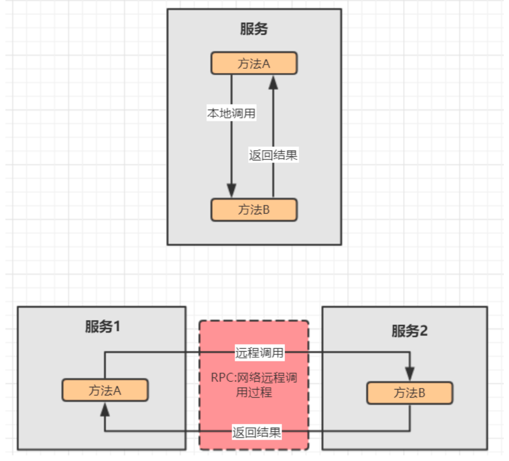
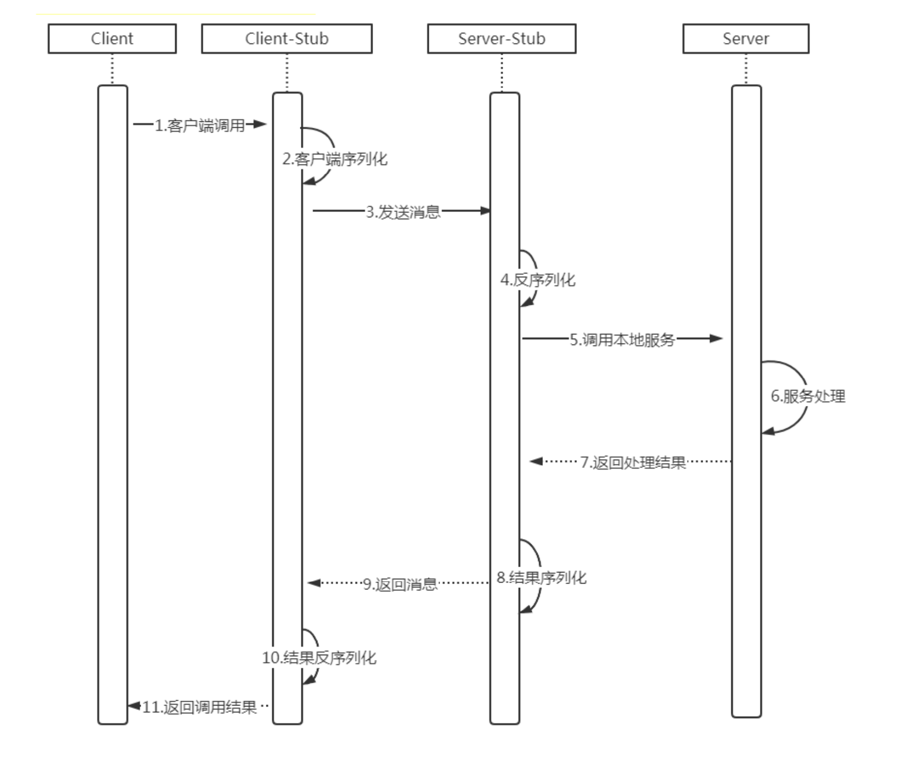
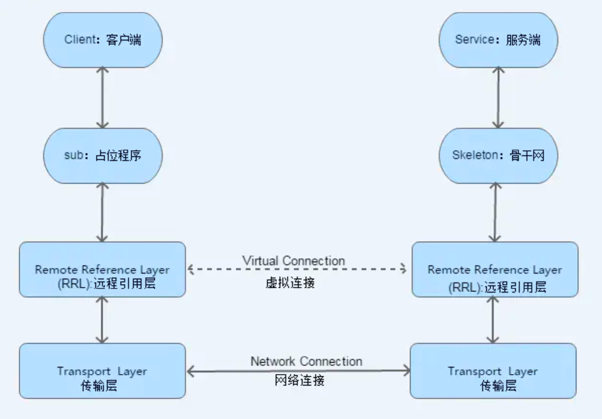
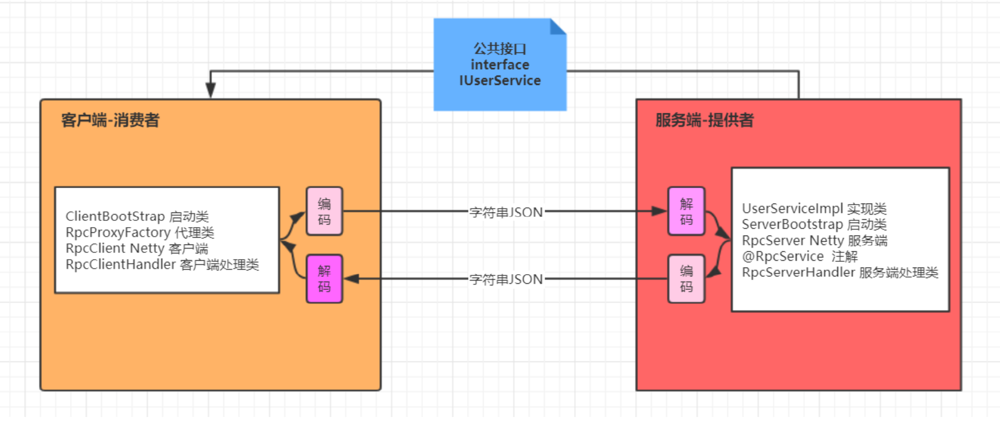

# 分布式架构网络通信

在分布式服务框架中，一个最基础的问题就是远程服务是怎么通讯的，在Java领域中有很多可实现 远程通讯的技术，例如:RMI、Hessian、SOAP、ESB和JMS等，它们背后到底是基于什么原理实现的呢

## 基本原理

要实现网络机器间的通讯，首先得来看看计算机系统网络通信的基本原理，在底层层面去看，网络 通信需要做的就是将流从一台计算机传输到另外一台计算机，基于传输协议和网络IO来实现，其中传输 协议比较出名的有tcp、udp等等，tcp、udp都是在基于Socket概念上为某类应用场景而扩展出的传输 协议，网络IO，主要有bio、nio、aio三种方式，所有的分布式应用通讯都基于这个原理而实现.

## 什么是RPC

RPC全称为remote procedure call，即远程过程调用。借助RPC可以做到像本地调用一样调用远程服务，是一种进程间的通信方式.
比如两台服务器A和B，A服务器上部署一个应用，B服务器上部署一个应用，A服务器上的应用想调用 B服务器上的应用提供的方法，由于两个应用不在一个内存空间，不能直接调用，所以需要通过网络来 表达调用的语义和传达调用的数据。需要注意的是RPC并不是一个具体的技术，而是指整个网络远程调 用过程。

## RPC架构

一个完整的RPC架构里面包含了四个核心的组件，分别是Client，Client Stub，Server以及Server
Stub，这个Stub可以理解为存根。

- 客户端(Client)，服务的调用方。
- 客户端存根(Client Stub)，存放服务端的地址消息，再将客户端的请求参数打包成网络消息，然后 通过网络远程发送给服务方。
- 服务端(Server)，真正的服务提供者。
- 服务端存根(Server Stub)，接收客户端发送过来的消息，将消息解包，并调用本地的方法。

1. 客户端(client)以本地调用方式(即以接口的方式)调用服务;
2. 客户端存根(client stub)接收到调用后，负责将方法、参数等组装成能够进行网络传输的消息体
    (将消息体对象序列化为二进制);
3. 客户端通过socket将消息发送到服务端;
4. 服务端存根( server stub)收到消息后进行解码(将消息对象反序列化);
5. 服务端存根( server stub)根据解码结果调用本地的服务;
6. 服务处理
7. 本地服务执行并将结果返回给服务端存根( server stub);
8. 服务端存根( server stub)将返回结果打包成消息(将结果消息对象序列化);
9. 服务端(server)通过socket将消息发送到客户端;
10. 客户端存根(client stub)接收到结果消息，并进行解码(将结果消息发序列化);
11. 客户端(client)得到最终结果。

RPC的目标是要把2、3、4、5、7、8、9、10这些步骤都封装起来。只剩下1、6、11 

>  注意:无论是何种类型的数据，最终都需要转换成二进制流在网络上进行传输，数据的发送方需要
>  将对象转换为二进制流，而数据的接收方则需要把二进制流再恢复为对象。

在java中RPC框架比较多，常见的有Hessian、gRPC、Dubbo 等，其实对 于RPC框架而言，核心模块 就是**通讯和序列化**

## RMI

Java RMI，即远程方法调用(Remote Method Invocation)，一种用于实现**远程过程调用**(RPC- Remote procedure call)的Java API， 能直接传输序列化后的Java对象。它的实现依赖于Java虚拟机，因 此它仅支持从一个JVM到另一个JVM的调用。

1.客户端从远程服务器的注册表中查询并获取远程对象引用。

2.桩对象与远程对象具有相同的接口和方法列表，当客户端调用远程对象时，实际上是由相应的桩 对象代理完成的。 

3.远程引用层在将桩的本地引用转换为服务器上对象的远程引用后，再将调用传递给传输层 (Transport)，由传输层通过TCP协议发送调用; 

4.在服务器端，传输层监听入站连接，它一旦接收到客户端远程调用后，就将这个引用转发给其上 层的远程引用层; 5)服务器端的远程引用层将客户端发送的远程应用转换为本地虚拟机的引用 后，再将请求传递给骨架(Skeleton); 6)骨架读取参数，又将请求传递给服务器，最后由服务 器进行实际的方法调用。

5.如果远程方法调用后有返回值，则服务器将这些结果又沿着“骨架->远程引用层->传输层”向下传 递; 

6.客户端的传输层接收到返回值后，又沿着“传输层->远程引用层->桩”向上传递，然后由桩来反序 列化这些返回值，并将最终的结果传递给客户端程序。

##  基于Netty实现RPC框架

dubbo 底层使用了 Netty 作为网络通讯框架，要求用 Netty 实现一个简单的 RPC 框架，消费者和提 供者约定接口和协议，消费者远程调用提供者的服务,
1. 创建一个接口，定义抽象方法。用于消费者和提供者之间的约定,
2. 创建一个提供者，该类需要监听消费者的请求，并按照约定返回数据
3. 创建一个消费者，该类需要透明的调用自己不存在的方法，内部需要使用 Netty 进行数据通信 
4. 提供者与消费者数据传输使用json字符串数据格式
5. 提供者使用netty集成spring boot 环境实现

案例: 客户端远程调用服务端提供根据ID查询user对象的方法.

