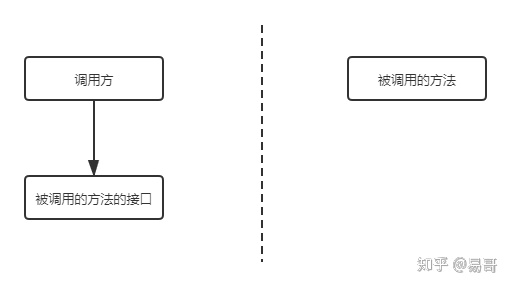

作者：易哥
链接：https://www.zhihu.com/question/41609070/answer/1030913797
来源：知乎
著作权归作者所有。商业转载请联系作者获得授权，非商业转载请注明出处。

首先，实名赞扬题主的问题。**这个问题非常好**。

但是，该提问也确实有点问题：**HTTP和RPC不是对等的概念**。

**RPC是一个完整的远程调用方案，它包括了：接口规范+序列化反序列化规范+通信协议等。**

而**HTTP只是一个通信协议，工作在OSI的第七层**，不是一个完整的远程调用方案。

所以，要想回答这个问题，应该拉平为一个对等的概念。例如，**HTTP+Restful规范+序列化与反序列化**，构成一个完整的远程调用方案，再和**RPC**进行比较。而**单纯的HTTP，只是一个通信协议，自然无法和RPC比较**。

这就像是牛（HTTP）不能和马车（RPC）比较。要想比较，就应该将牛补齐为牛车，然后和马车比较。

感觉题主应该是问：**基于HTTP的远程调用方案（包含了接口规范、序列化反序列化等） 和 使用RPC的远程调用方案 有什么不同。有了前者，为什么还要有后者。**

下面我们来解答这个问题。

------

我们先介绍基于HTTP的远程调用方案。

HTTP+Restful，其优势很大。它**可读性好**，且**可以得到防火墙的支持、跨语言的支持**。而且，在近几年的报告中，Restful**大有超过RPC的趋势**。

但是使用该方案也有其缺点，这是与其优点相对应的：

- 首先是**有用信息占比少**，毕竟HTTP工作在第七层，包含了大量的HTTP头等信息。
- 其次是**效率低**，还是因为第七层的缘故，必须按照HTTP协议进行层层封装。
- 还有，其**可读性似乎没有必要**，因为我们可以引入网关增加可读性。
- 此外，使用HTTP协议**调用远程方法比较复杂**，要封装各种参数名和参数值。

而RPC则与HTTP互补，我们详细介绍下。

看完这篇回答，**能让你对RPC的产生、原理、实现代码都有着清晰的了解**。这样，也能在业务系统中，在RPC和HTTP之间做好抉择。

但需要再说一句，不是说RPC好，也不是说HTTP好，**两者各有千秋，还在比拼中**。

要问我站谁？我**根据业务场景，灵活站位……**

------

评论区产生了一些争论，我在这里统一进行说明。争论主要发生在两点：

1、**HTTP和RPC同一级别，还是被RPC包含？**

2、**Restful也属于RPC么？**

对于以上两点，我画图来一一说明。

上图是一个比较完整的关系图，这时我们发现HTTP（图中蓝色框）出现了两次。其中一个是和RPC并列的，都是跨应用调用方法的解决方案；另一个则是被RPC包含的，是RPC通信过程的可选协议之一。

因此，**第一个问题的答案是都对。看指的是哪一个蓝色框。**从题主的提问看，既然题主在纠结这两者，应该是指与RPC并列的蓝色框。所以，题主所述的HTTP请求应该是指：基于HTTP的远程调用方案（包含了接口规范、序列化反序列化等）。这样，它才是和RPC同一级别的概念。

第二个问题是在问远程过程调用（红色框）是不是包含了Restful（黄色框），这种理解的关键在于对RPC的理解。

RPC字面理解是远程过程调用，即在一个应用中调用另一个应用的方法。那Restful是满足的，通过它可以实现在一个应用中调用另一个应用的方法。

但是，上述理解使得RPC的定义过于宽泛。RPC通常特指在一个应用中调用另一个应用的接口而实现的远程调用，即红色框所指的范围。这样，RPC是不包含Restful的。

因此，**第二个问题的答案是Restful不属于RPC，除非对RPC有着非常规的宽泛理解。**

------

RPC的英文全称是Remote Procedure Call，翻译为中文叫“远程过程调用”。其中稍显晦涩的其实就是“过程”，过程其实就是方法。所以，可以把RPC理解为“远程方法调用”。

要了解远程过程调用，那先理解过程调用。非常简单，如下图，就是调用一个方法。这太常见了，不多解释。

而在分布式系统中，因为每个服务的边界都很小，很有可能调用别的服务提供的方法。这就出现了服务A调用服务B中方法的需求，即远程过程调用。

要想让服务A调用服务B中的方法，最先想到的就是通过HTTP请求实现。是的，这是很常见的，例如服务B暴露Restful接口，然后让服务A调用它的接口。基于Restful的调用方式因为可读性好（服务B暴露出的是Restful接口，可读性当然好）而且HTTP请求可以通过各种防火墙，因此非常不错。

然而，如前面所述，基于Restful的远程过程调用有着明显的缺点，主要是效率低、封装调用复杂。当存在大量的服务间调用时，这些缺点变得更为突出。

服务A调用服务B的过程是应用间的内部过程，**牺牲可读性提升效率、易用性是可取的**。基于这种思路，RPC产生了。

通常，RPC要求在调用方中放置被调用的方法的接口。**调用方只要调用了这些接口，就相当于调用了被调用方的实际方法，十分易用**。于是，调用方可以像调用内部接口一样调用远程的方法，而不用封装参数名和参数值等操作。

那要想实现这个过程该怎么办呢？别急，咱们一步一步来。

首先，调用方调用的是接口，必须得为接口构造一个假的实现。显然，要使用动态代理。这样，调用方的调用就被动态代理接收到了。

第二，动态代理接收到调用后，应该想办法调用远程的实际实现。这包括下面几步：

- 识别具体要调用的远程方法的IP、端口
- 将调用方法的入参进行序列化
- 通过通信将请求发送到远程的方法中

这样，远程的服务就接收到了调用方的请求。它应该：

- 反序列化各个调用参数
- 定位到实际要调用的方法，然后输入参数，执行方法
- 按照调用的路径返回调用的结果

整个过程如下所示。

这样，RPC操作就完成了。

调用方调用内部的一个方法，但是被RPC框架偷梁换柱为远程的一个方法。之间的**通信数据可读性不需要好**，只需要RPC框架能读懂即可，因此**效率可以更高**。通常使用UDP或者TCP作为通讯协议，当然也可以使用HTTP。例如下面的示例中，为了保证实现最简单，就用了HTTP进行通信。

讲到这里，**RPC的产生原因、原理应该清楚了**。为了让大家真的明白，我写了一个真的是**最最简单的RPC实现**。把它放到了：

[https://github.com/yeecode/EasyRPCgithub.com/yeecode/EasyRPC](https://link.zhihu.com/?target=https%3A//github.com/yeecode/EasyRPC)

它包含一个客户端，一个服务端。客户端只要调用自身内部的接口，就通过这个小的RPC实现调用到了服务端的方法。

下面是客户端的代码，看着类有点多，其实代码不长。其中的RPC代码完成完成动态代理、远程调用参数序列化、远程调用发起、远程调用结果反序列化的工作。

RPC客户端

下面是服务端的代码，代码更少，完成远程调用接收、调用参数反序列化、调用实际触发、调用结果序列化的工作。

RPC服务端

这样，一个RPC小框架就做完了，并不复杂。

所以，不要被RPC吓到，它就是**让一个应用调用另一个应用中方法的一种实现方式**。与调用远程接口区别不大，条条大路通罗马。

再说一次，不是说RPC好，也不是说HTTP好，两者各有千秋。本质上，两者是**可读性和效率之间的抉择**，**通用性和易用性之间的抉择**。最终谁能发展更好，很难说。

