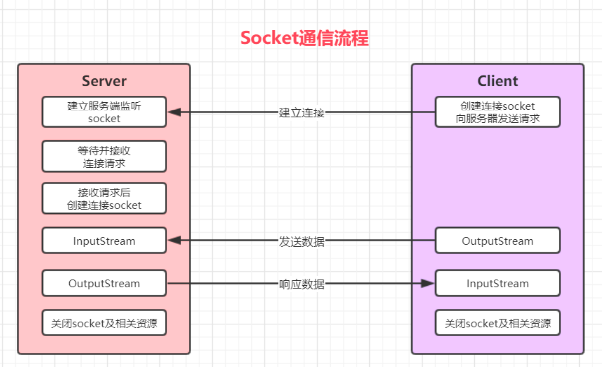
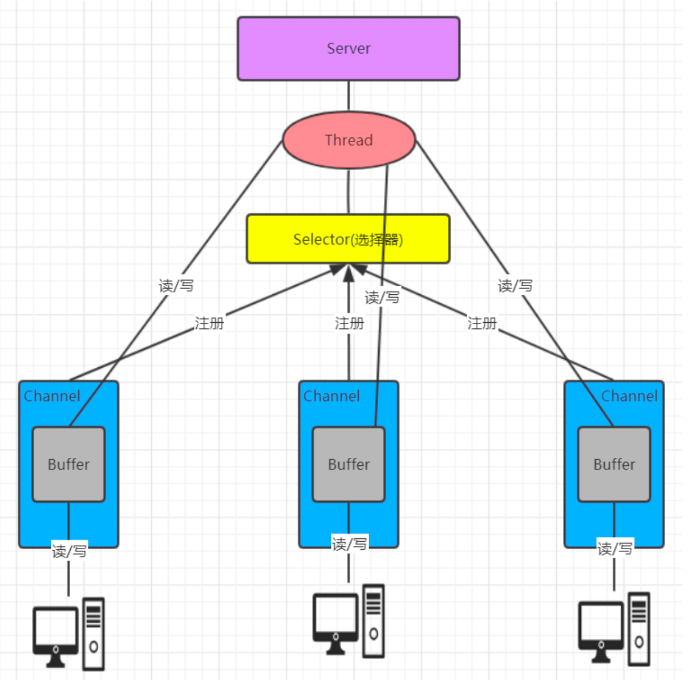
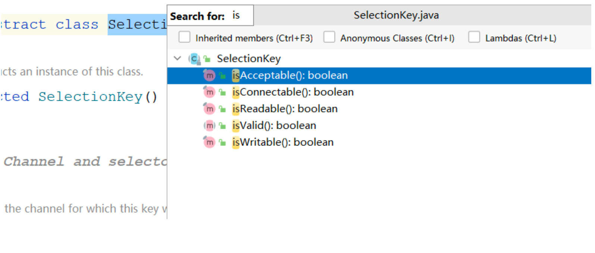

Socket，套接字就是两台主机之间逻辑连接的端点。TCP/IP协议是传输层协议，主要解决数据如何 在网络中传输，而HTTP是应用层协议，主要解决如何包装数据。Socket是通信的基石，是支持TCP/IP协 议的网络通信的基本操作单元。它是网络通信过程中端点的抽象表示，包含进行网络通信必须的五种信 息:连接使用的协议、本地主机的IP地址、本地进程的协议端口、远程主机的IP地址、远程进程的协议 端口。

Socket编程主要涉及到客户端和服务端两个方面，首先是在服务器端创建一个服务器套接字 (ServerSocket)，并把它附加到一个端口上，服务器从这个端口监听连接。端口号的范围是0到 65536，但是0到1024是为特权服务保留的端口号，可以选择任意一个当前没有被其他进程使用的端 口。
客户端请求与服务器进行连接的时候，根据服务器的域名或者IP地址，加上端口号，打开一个套接 字。当服务器接受连接后，服务器和客户端之间的通信就像输入输出流一样进行操作。



代码实现

server

```java

public class ServerDemo {

    public static void main(String[] args) throws IOException {
        ExecutorService executorService = Executors.newCachedThreadPool();

        ServerSocket serverSocket = new ServerSocket(9999);
        System.out.println("服务已启动");

        while (true){
            Socket accept = serverSocket.accept();

            System.out.println("客户端连接");
            executorService.execute(()->{
                handle(accept);
            });
        }

    }

    private static void handle(Socket socket) {

        System.out.printf("线程%s  名称%s%n",Thread.currentThread().getId(), Thread.currentThread().getName());

        try {
            InputStream inputStream = socket.getInputStream();
            byte[] buffer = new byte[1024];
            int read = inputStream.read(buffer);
            System.out.println("客户端："+ new String(buffer, 0, read));

            OutputStream outputStream = socket.getOutputStream();
            outputStream.write("没钱".getBytes());

        } catch (IOException e) {
            e.printStackTrace();
        }

    }
}

```

client

```java
public class ClientDemo {
    public static void main(String[] args) throws IOException {
        while (true) {

            Socket socket = new Socket("127.0.0.1", 9999);

            OutputStream outputStream = socket.getOutputStream();

            System.out.println("请输入： ");

            Scanner scanner = new Scanner(System.in);
            String message = scanner.nextLine();
            outputStream.write(message.getBytes(StandardCharsets.UTF_8));

            InputStream inputStream = socket.getInputStream();
            byte[] bytes = new byte[1024];
            int read = inputStream.read(bytes);
            System.out.println("老板说：" + new String(bytes, 0, read).trim());

            socket.close();
        }

    }
}

```


# I/O模型

1. I/O 模型简单的理解:就是用什么样的通道进行数据的发送和接收，很大程度上决定了程序通信的 性能
2. Java 共支持 3 种网络编程模型/IO 模式:BIO(同步并阻塞)、NIO(同步非阻塞)、AIO(异步非阻塞)

- 阻塞与非阻塞
  主要指的是访问IO的线程是否会阻塞(或处于等待) 
  线程访问资源，该资源是否准备就绪的一种处理方式


- 同步和异步
   主要是指的数据的请求方式
   同步和异步是指访问数据的一种机制


## BIO(同步并阻塞)

Java BIO就是传统的 socket编程.
BIO(blocking I/O) : 同步阻塞，服务器实现模式为一个连接一个线程，即客户端有连接请求时服务器 端就需要启动一个线程进行处理，如果这个连接不做任何事情会造成不必要的线程开销，可以通过线程 池机制改善(实现多个客户连接服务器)。

**工作机制**


bio烧水


#### BIO问题分析

1. 每个请求都需要创建独立的线程，与对应的客户端进行数据 Read，业务处理，数据 Write
2. 并发数较大时，需要创建大量线程来处理连接，系统资源占用较大
3. 连接建立后，如果当前线程暂时没有数据可读，则线程就阻塞在 Read 操作上，造成线程资源浪费

## NIO(同步非阻塞)

同步非阻塞，服务器实现模式为一个线程处理多个请求(连接)，即客户端发送的连接请求都会注册到
多路复用器上，多路复用器轮询到连接有 I/O 请求就进行处理


bio烧水


## AIO(异步非阻塞)

AIO 引入异步通道的概念，采用了 Proactor 模式，简化了程序编写，有效的请求才启动线程，它的 特点是先由操作系统完成后才通知服务端程序启动线程去处理，一般适用于连接数较多且连接时间较长 的应用

Proactor 模式是一个消息异步通知的设计模式，Proactor 通知的不是就绪事件，而是操作完成事 件，这也就是操作系统异步 IO 的主要模型。

aio烧水:


## BIO、NIO、AIO 适用场景分析

1. **BIO**(同步并阻塞) 方式适用于连接数目比较小且固定的架构，这种方式对服务器资源要求比较高， 并发局限于应用中，JDK1.4以前的唯一选择，但程序简单易理解
2. **NIO**(同步非阻塞) 方式适用于连接数目多且连接比较短(**轻操作**)的架构，比如聊天服务器，弹幕 系统，服务器间通讯等。编程比较复杂，JDK1.4 开始支持
3. **AIO**(异步非阻塞) 方式使用于**连接数目多且连接比较长**(**重操作**)的架构，比如相册服务器，充分 调用 OS 参与并发操作， 编程比较复杂，JDK7 开始支持。


# NIO编程

## 简介

Java NIO 全称java non-blocking IO ，是指 JDK 提供的新 API。从 JDK1.4 开始，Java 提供了一系 列改进的输入/输出的新特性，被统称为 NIO(即 New IO)，是同步非阻塞的.
1. NIO 有三大核心部分:Channel(通道)，Buffer(缓冲区), Selector(选择器)
2. NIO是 面向缓冲区编程的。数据读取到一个缓冲区中，需要时可在缓冲区中前后移动，这就增加了处理过程中的灵活性，使用它可以提供非阻塞式的高伸缩性网络
3. Java NIO 的非阻塞模式，使一个线程从某通道发送请求或者读取数据，但是它仅能得到目前可用的数据，如果目前没有数据可用时，就什么都不会获取，而不是保持线程阻塞，所以直至数据变的可 以读取之前，该线程可以继续做其他的事情。 非阻塞写也是如此，一个线程请求写入一些数据到某 通道，但不需要等待它完全写入， 这个线程同时可以去做别的事情。**通俗理解:NIO 是可以做到 用一个线程来处理多个操作的。** **假设有 10000 个请求过来,根据实际情况，可以分配50 或者 100 个 线程来处理**。不像之前的阻塞 IO 那样，非得分配 10000 个

## NIO和 BIO的比较

1. BIO 以流的方式处理数据,而 NIO 以缓冲区的方式处理数据,缓冲区 I/O 的效率比流 I/O 高很多
2. BIO 是阻塞的，NIO则是非阻塞的
3. BIO 基于字节流和字符流进行操作，而 NIO 基于 Channel(通道)和 Buffer(缓冲区)进行操作，数据
总是从通道读取到缓冲区中，或者从缓冲区写入到通道中。Selector(选择器)用于监听多个通道的 事件(比如:连接请求， 数据到达等)，因此使用单个线程就可以监听多个客户端通道

## NIO 三大核心原理示意图



1. 每个 channel 都会对应一个 Buffer
2. Selector 对应一个线程， 一个线程对应多个 channel(连接)
3. 每个 channel 都注册到 Selector选择器上
4. Selector不断轮询查看Channel上的事件, 事件是通道Channel非常重要的概念
5. Selector 会根据不同的事件，完成不同的处理操作
6. Buffer 就是一个内存块 ， 底层是有一个数组
7. 数据的读取写入是通过 Buffer, 这个和 BIO , BIO 中要么是输入流，或者是输出流, 不能双向，但是
NIO 的 Buffer 是可以读也可以写 , channel 是双向的.

### 缓冲区(Buffer)

缓冲区(Buffer):缓冲区本质上是一个可以读写数据的内存块，可以理解成是一个数组，该对象 提供了一组方法，可以更轻松地使用内存块，，缓冲区对象内置了一些机制，能够跟踪和记录缓冲区的 状态变化情况。Channel 提供从网络读取数据的渠道，但是读取或写入的数据都必须经由 Buffer.


#### Buffer常用API介绍


在 NIO 中，Buffer是一个顶层父类，它是一个抽象类, 类的层级关系图,常用的缓冲区分别对应 byte,short, int,long,float,double,char 7种.

- api
  static ByteBuffer allocate(长度) 创建byte类型的指定长度的缓冲区
  static ByteBuffer wrap(byte[] array) 创建一个有内容的byte类型缓冲区
- 缓冲区对象添加数据


#### 图解： 


缓冲区对象读取数据

- flip：limit设置为position（上一次写入的位置），postion设置0，==>[position,limit)覆盖了上次写入的数据位置
- clear：limit设置为capacity（容量），postion设置0，==>[position,limit)就是数据可写的范围


flip图解


图解:clear()方法


注意事项:
1. capacity:容量(长度)。limit: 界限(最多能读/写到哪里)    posotion:位置(读/写 哪个索引)
2. 获取缓冲区里面数据之前，需要调用flip方法
3. 再次写数据之前，需要调用clear方法，但是数据还未消失，等再次写入数据，被覆盖了
才会消失。

### 通道(Channel) 

2.5.1 基本介绍
通常来说NIO中的所有IO都是从 Channel(通道) 开始的。NIO 的通道类似于流，但有些区别如下:

1. 通道可以读也可以写，流一般来说是单向的(只能读或者写，所以之前我们用流进行IO操作的时候 需要分别创建一个输入流和一个输出流)
2. 通道可以异步读写
3. 通道总是基于缓冲区Buffer来读写


#### Channel常用类介绍 

1. Channel接口
常 用 的Channel实现类类 有 :FileChannel , DatagramChannel ,ServerSocketChannel和 SocketChannel 。FileChannel 用于文件的数据读写， DatagramChannel 用于 UDP 的数据读 写， ServerSocketChannel 和SocketChannel 用于 TCP 的数据读写。【ServerSocketChanne 类似 ServerSocket , SocketChannel 类似 Socket】

2. SocketChannel 与ServerSocketChannel
类似 Socke和ServerSocket,可以完成客户端与服务端数据的通信工作.

#### ServerSocketChannel

服务端实现步骤:
1. 打开一个服务端通道
2. 绑定对应的端口号
3. 通道默认是阻塞的，需要设置为非阻塞
4. 检查是否有客户端连接 有客户端连接会返回对应的通道
5. 获取客户端传递过来的数据,并把数据放在byteBuffer这个缓冲区中 6. 给客户端回写数据
7. 释放资源

#### SocketChannel

实现步骤

1. 打开通道
2. 设置连接IP和端口号
3. 写出数据
4. 读取服务器写回的数据
5. 释放资源

### Selector (选择器)

基本介绍
可以用一个线程，处理多个的客户端连接，就会使用到NIO的Selector(选择器). Selector 能够检测 多个注册的服务端通道上是否有事件发生，如果有事件发生，便获取事件然后针对每个事件进行相应的 处理。这样就可以只用一个单线程去管理多个通道，也就是管理多个连接和请求。


**在这种没有选择器的情况下,对应每个连接对应一个处理线程. 但是连接并不能马上就会发送信息,所以还 会产生资源浪费**


**只有在通道真正有读写事件发生时，才会进行读写，就大大地减少了系统开销，并且不必为每个连接都 创建一个线程，不用去维护多个线程, 避免了多线程之间的上下文切换导致的开销**

#### 常用API介绍


常用方法:
Selector.open() : //得到一个选择器对象
selector.select() : //阻塞 监控所有注册的通道,当有对应的事件操作时, 会将SelectionKey放入 集合内部并返回事件数量
selector.select(1000): //阻塞 1000 毫秒，监控所有注册的通道,当有对应的事件操作时, 会将 SelectionKey放入集合内部并返回
selector.selectedKeys() : // 返回存有SelectionKey的集合

2. SelectionKey



- 常用方法
  - SelectionKey.isAcceptable(): 是否是连接继续事件 
  - SelectionKey.isConnectable(): 是否是连接就绪事件 
  - SelectionKey.isReadable(): 是否是读就绪事件 
  - SelectionKey.isWritable(): 是否是写就绪事件

- SelectionKey中定义的4种事件:
  - SelectionKey.OP_ACCEPT —— 接收连接继续事件，表示服务器监听到了	客户连接，服务器 可以接收这个连接了
  - SelectionKey.OP_CONNECT —— 连接就绪事件，表示客户端与服务器的连接已经建立成功 
  - SelectionKey.OP_READ —— 读就绪事件，表示通道中已经有了可读的数据，可以执行读操 作了(通道目前有数据，可以进行读操作了)
  - SelectionKey.OP_WRITE —— 写就绪事件，表示已经可以向通道写数据了(通道目前可以用 于写操作)

```java
public static final int OP_READ = 1 << 0;

/**
 * Operation-set bit for write operations.
 *
 * <p> Suppose that a selection key's interest set contains
 * <tt>OP_WRITE</tt> at the start of a <a
 * href="Selector.html#selop">selection operation</a>.  If the selector
 * detects that the corresponding channel is ready for writing, has been
 * remotely shut down for further writing, or has an error pending, then it
 * will add <tt>OP_WRITE</tt> to the key's ready set and add the key to its
 * selected-key&nbsp;set.  </p>
 */
public static final int OP_WRITE = 1 << 2;

/**
 * Operation-set bit for socket-connect operations.
 *
 * <p> Suppose that a selection key's interest set contains
 * <tt>OP_CONNECT</tt> at the start of a <a
 * href="Selector.html#selop">selection operation</a>.  If the selector
 * detects that the corresponding socket channel is ready to complete its
 * connection sequence, or has an error pending, then it will add
 * <tt>OP_CONNECT</tt> to the key's ready set and add the key to its
 * selected-key&nbsp;set.  </p>
 */
public static final int OP_CONNECT = 1 << 3;

/**
 * Operation-set bit for socket-accept operations.
 *
 * <p> Suppose that a selection key's interest set contains
 * <tt>OP_ACCEPT</tt> at the start of a <a
 * href="Selector.html#selop">selection operation</a>.  If the selector
 * detects that the corresponding server-socket channel is ready to accept
 * another connection, or has an error pending, then it will add
 * <tt>OP_ACCEPT</tt> to the key's ready set and add the key to its
 * selected-key&nbsp;set.  </p>
 */
public static final int OP_ACCEPT = 1 << 4;
```

#### Selector 编码

服务端实现步骤:
1. 打开一个服务端通道
2. 绑定对应的端口号
3. 通道默认是阻塞的，需要设置为非阻塞
4. 创建选择器
5. 将服务端通道注册到选择器上,并指定注册监听的事件为OP_ACCEPT
6. 检查选择器是否有事件
7. 获取事件集合
8. 判断事件是否是客户端连接事件SelectionKey.isAcceptable()
9. 得到客户端通道,并将通道注册到选择器上, 并指定监听事件为OP_READ
10. 判断是否是客户端读就绪事件SelectionKey.isReadable() 
11. 得到客户端通道,读取数据到缓冲区
12. 给客户端回写数据
13. 从集合中删除对应的事件, 因为防止二次处理.

```java
public class NIOSelectorServer {
    public static void main(String[] args) throws IOException {
        //1. 打开一个服务端通道
        ServerSocketChannel channel = ServerSocketChannel.open();

        //2. 绑定对应的端口号
        channel.bind(new InetSocketAddress(9999));
        //3. 通道默认是阻塞的，需要设置为非阻塞
        channel.configureBlocking(false);

        //4. 创建选择器
        Selector selector = Selector.open();

        //5. 将服务端通道注册到选择器上,并指定注册监听的事件为OP_ACCEPT
        channel.register(selector, SelectionKey.OP_ACCEPT);

        while (true){
            //6. 检查选择器是否有事件
            int select = selector.select(2000);
            if (select == 0){
                System.out.println("没有事件发生");
                continue;
            }

            //7. 获取事件集合
            Set<SelectionKey> selectionKeys = selector.selectedKeys();
            Iterator<SelectionKey> iterator = selectionKeys.iterator();
            while (iterator.hasNext()){
                //8. 判断事件是否是客户端连接事件SelectionKey.isAcceptable()
                SelectionKey key = iterator.next();
                //是否连接事件
                if (key.isAcceptable()){
                    //9. 得到客户端通道,并将通道注册到选择器上, 并指定监听事件为OP_READ
                    SocketChannel socketChannel = channel.accept();
                    System.out.println("有客户端连接。。。。");
                    //将通道设置成非阻塞状态，因为selector要轮训监听每个通道到事件
                    socketChannel.configureBlocking(false);

                    //注册到选择器：监听客户端读读事件
                    socketChannel.register(selector, SelectionKey.OP_READ);
                }

                //10. 判断是否是客户端读就绪事件SelectionKey.isReadable()
                if (key.isReadable()){
                    // 11. 得到客户端通道,读取数据到缓冲区
                    SocketChannel socketChannel = (SocketChannel) key.channel();
                    ByteBuffer allocate = ByteBuffer.allocate(1024);
                    int read = socketChannel.read(allocate);
                    if (read>0){
                        System.out.println("客户端消息："+ new String(allocate.array(), 0, read, StandardCharsets.UTF_8));
                    }
                    //11. 给客户端回写数据
                    socketChannel.write(ByteBuffer.wrap("没钱".getBytes(StandardCharsets.UTF_8)));
                    socketChannel.close();
                }

                //13. 从集合中删除对应的事件, 因为防止二次处理.
                iterator.remove();
            }
        }
    }
}
```

