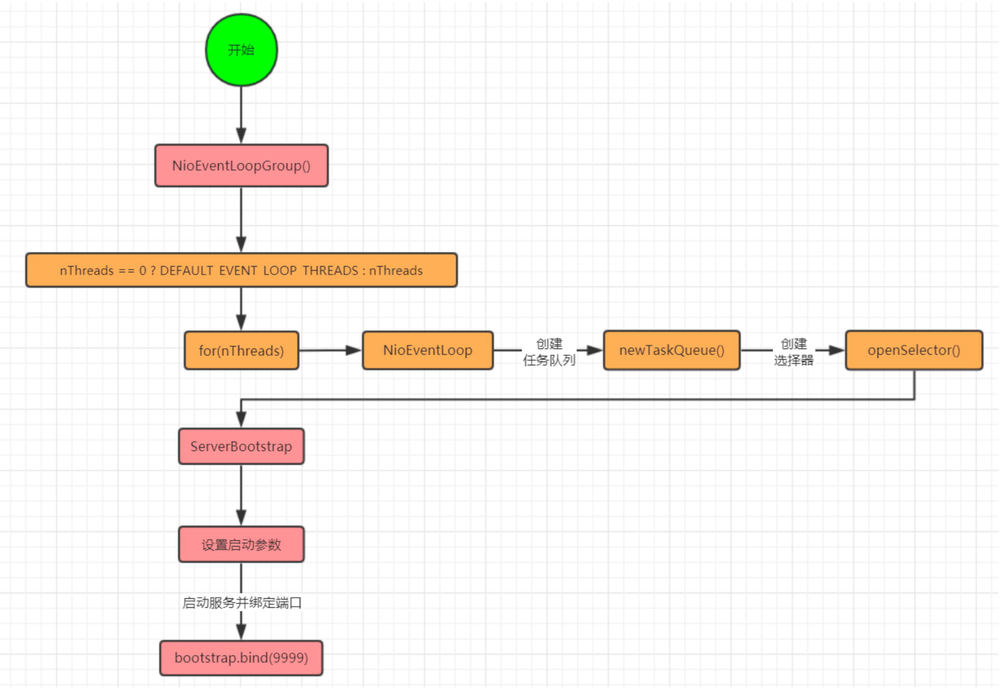
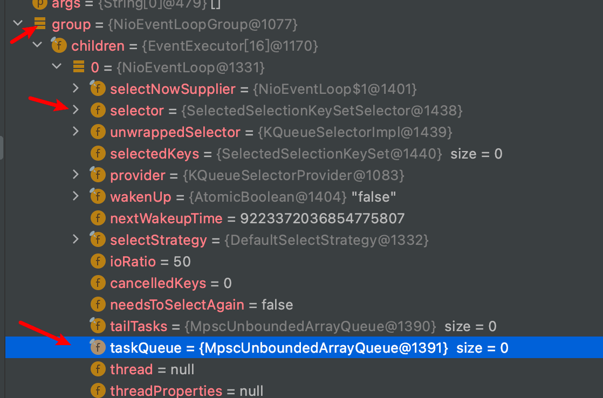
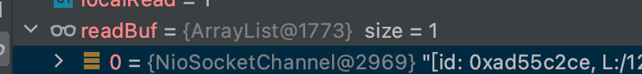

# EventLoopGroup事件循环组(线程组)源码

EventLoopGroup 是一组 EventLoop 的抽象，Netty 为了更好的利用多核 CPU 资源，一般会有多
个 EventLoop 同时工作，每个 EventLoop 维护着一个 Selector 实例。

## 线程组源码流程分析



## 线程组源码主要源码跟踪

1. NioEventLoopGroup线程组的创建

```
//io.netty.channel.MultithreadEventLoopGroup

private static final int DEFAULT_EVENT_LOOP_THREADS;

static {
    //默认线程数量为处理器数*2
    DEFAULT_EVENT_LOOP_THREADS = Math.max(1, SystemPropertyUtil.getInt(
            "io.netty.eventLoopThreads", NettyRuntime.availableProcessors() * 2));
    //NettyRuntime.availableProcessors() cpu核数

    if (logger.isDebugEnabled()) {
        logger.debug("-Dio.netty.eventLoopThreads: {}", DEFAULT_EVENT_LOOP_THREADS);
    }
}

 /**
     * @see MultithreadEventExecutorGroup#MultithreadEventExecutorGroup(int, Executor, Object...)
     */
    protected MultithreadEventLoopGroup(int nThreads, Executor executor, Object... args) {
        super(nThreads == 0 ? DEFAULT_EVENT_LOOP_THREADS : nThreads, executor, args);
    }
```

2. NioEventLoop的创建

```
protected MultithreadEventExecutorGroup(int nThreads, Executor executor,
                                        EventExecutorChooserFactory chooserFactory, Object... args) {
    if (nThreads <= 0) {
        throw new IllegalArgumentException(String.format("nThreads: %d (expected: > 0)", nThreads));
    }

    if (executor == null) {
        executor = new ThreadPerTaskExecutor(newDefaultThreadFactory());
    }
    //根据线程数量创建
    children = new EventExecutor[nThreads];

    for (int i = 0; i < nThreads; i ++) {
        boolean success = false;
        try {
            //循环创建线程
            children[i] = newChild(executor, args);
            success = true;
        } catch (Exception e) {
            // TODO: Think about if this is a good exception type
            throw new IllegalStateException("failed to create a child event loop", e);
        } finally {
            .....
            }
     }
     ....
            
}
```

#### newChild

```java
//io.netty.channel.nio.NioEventLoopGroup#newChild
@Override
protected EventLoop newChild(Executor executor, Object... args) throws
Exception {
    EventLoopTaskQueueFactory queueFactory = args.length == 4 ?
(EventLoopTaskQueueFactory) args[3] : null;
//创建NioEventLoop
return new NioEventLoop(this, executor, (SelectorProvider) args[0],
        ((SelectStrategyFactory) args[1]).newSelectStrategy(),
(RejectedExecutionHandler) args[2], queueFactory);
}
```

#### NioEventLoop#NioEventLoop

```java
//io.netty.channel.nio.NioEventLoop#NioEventLoop
NioEventLoop(NioEventLoopGroup parent, Executor executor, SelectorProvider selectorProvider,
             SelectStrategy strategy, RejectedExecutionHandler rejectedExecutionHandler,
             EventLoopTaskQueueFactory queueFactory) {
    //创建TaskQueue
    super(parent, executor, false, newTaskQueue(queueFactory), newTaskQueue(queueFactory),
            rejectedExecutionHandler);
    if (selectorProvider == null) {
        throw new NullPointerException("selectorProvider");
    }
    if (strategy == null) {
        throw new NullPointerException("selectStrategy");
    }
    provider = selectorProvider;
    //创建选择器
    final SelectorTuple selectorTuple = openSelector();
    selector = selectorTuple.selector;
    unwrappedSelector = selectorTuple.unwrappedSelector;
    selectStrategy = strategy;
}
```

Selector 和taskQueue




## 启动服务，绑定端口

```
ChannelFuture future = bootstrap.bind(9999);


    public ChannelFuture bind(int inetPort) {
        //绑定端口
        return bind(new InetSocketAddress(inetPort));
    }
    //io.netty.bootstrap.AbstractBootstrap#bind(java.net.SocketAddress)
    public ChannelFuture bind(SocketAddress localAddress) {
        validate();
        //进入doBind
        return doBind(ObjectUtil.checkNotNull(localAddress, "localAddress"));
    }
```

#### doBind

```java
private ChannelFuture doBind(final SocketAddress localAddress) {
    //初始化和注册
    final ChannelFuture regFuture = initAndRegister();//1
    final Channel channel = regFuture.channel();
    if (regFuture.cause() != null) {
        return regFuture;
    }

    if (regFuture.isDone()) {
        // At this point we know that the registration was complete and successful.
        ChannelPromise promise = channel.newPromise();
        doBind0(regFuture, channel, localAddress, promise);
        return promise;
    } else {
        // Registration future is almost always fulfilled already, but just in case it's not.
        final PendingRegistrationPromise promise = new PendingRegistrationPromise(channel);
        regFuture.addListener(new ChannelFutureListener() {
            @Override
            public void operationComplete(ChannelFuture future) throws Exception {
                Throwable cause = future.cause();
                if (cause != null) {
                    // Registration on the EventLoop failed so fail the ChannelPromise directly to not cause an
                    // IllegalStateException once we try to access the EventLoop of the Channel.
                    promise.setFailure(cause);
                } else {
                    // Registration was successful, so set the correct executor to use.
                    // See https://github.com/netty/netty/issues/2586
                    promise.registered();

                    doBind0(regFuture, channel, localAddress, promise);
                }
            }
        });
        return promise;
    }
}
```

#### 1、initAndRegister

```java
//io.netty.bootstrap.AbstractBootstrap#initAndRegister
final ChannelFuture initAndRegister() {
    Channel channel = null;
    try {
        //创建通道
        channel = channelFactory.newChannel();
        //通道初始化
        init(channel);//1a
    } catch (Throwable t) {
        if (channel != null) {
            // channel can be null if newChannel crashed (eg SocketException("too many open files"))
            channel.unsafe().closeForcibly();
            // as the Channel is not registered yet we need to force the usage of the GlobalEventExecutor
            return new DefaultChannelPromise(channel, GlobalEventExecutor.INSTANCE).setFailure(t);
        }
        // as the Channel is not registered yet we need to force the usage of the GlobalEventExecutor
        return new DefaultChannelPromise(new FailedChannel(), GlobalEventExecutor.INSTANCE).setFailure(t);
    }
    //注册通道
///////1b
    ChannelFuture regFuture = config().group().register(channel);
    if (regFuture.cause() != null) {
        if (channel.isRegistered()) {
            channel.close();
        } else {
            channel.unsafe().closeForcibly();
        }
    }

    return regFuture;
}
```


#### 1a、init

```java
void init(Channel channel) {
    setChannelOptions(channel, options0().entrySet().toArray(newOptionArray(0)), logger);
    setAttributes(channel, attrs0().entrySet().toArray(newAttrArray(0)));
    //得到通道pipeline
    ChannelPipeline p = channel.pipeline();
    //赋值workGroup与服务端handler
    final EventLoopGroup currentChildGroup = childGroup;
    final ChannelHandler currentChildHandler = childHandler;
    final Entry<ChannelOption<?>, Object>[] currentChildOptions =
            childOptions.entrySet().toArray(newOptionArray(0));
    final Entry<AttributeKey<?>, Object>[] currentChildAttrs = childAttrs.entrySet().toArray(newAttrArray(0));
    //添加通道初始化handler
    p.addLast(new ChannelInitializer<Channel>() {
        @Override
        public void initChannel(final Channel ch) {
            final ChannelPipeline pipeline = ch.pipeline();
            ChannelHandler handler = config.handler();
            if (handler != null) {
                pipeline.addLast(handler);
            }

            ch.eventLoop().execute(new Runnable() {
                @Override
                public void run() {
                    //在initChannel方法中添加 ServerBootstrapAcceptor 的handler
                    //ServerBootstrapAcceptor 作用就是将 bossGroup 中的通道注册到 workerGroup
                    pipeline.addLast(new ServerBootstrapAcceptor(
                            ch, currentChildGroup, currentChildHandler, currentChildOptions, currentChildAttrs));
                }
            });
        }
    });
}
```


#### 1b、register(channel)

```java
//initAndRegister中的register
ChannelFuture regFuture = config().group().register(channel);

//进入
    @Override
    public ChannelFuture register(Channel channel) {
        return next().register(channel);
    }
   
   //io.netty.channel.SingleThreadEventLoop#register(io.netty.channel.Channel)
    public ChannelFuture register(Channel channel) {
        return register(new DefaultChannelPromise(channel, this));
    }
    
     @Override
    public ChannelFuture register(final ChannelPromise promise) {
        ObjectUtil.checkNotNull(promise, "promise");
        promise.channel().unsafe().register(this, promise);
        return promise;
    }
```

进入register

```java
@Override
public final void register(EventLoop eventLoop, final ChannelPromise promise) {
    if (eventLoop == null) {
        throw new NullPointerException("eventLoop");
    }
    if (isRegistered()) {
        promise.setFailure(new IllegalStateException("registered to an event loop already"));
        return;
    }
    if (!isCompatible(eventLoop)) {
        promise.setFailure(
                new IllegalStateException("incompatible event loop type: " + eventLoop.getClass().getName()));
        return;
    }

    AbstractChannel.this.eventLoop = eventLoop;

    if (eventLoop.inEventLoop()) {
        register0(promise);
    } else {
        try {
            //执行NioEventLoop
            eventLoop.execute(new Runnable() {
                @Override
                public void run() {
                    //注册通道
                    register0(promise);
                }
            });
        } catch (Throwable t) {
            logger.warn(
                    "Force-closing a channel whose registration task was not accepted by an event loop: {}",
                    AbstractChannel.this, t);
            closeForcibly();
            closeFuture.setClosed();
            safeSetFailure(promise, t);
        }
    }
}
```

#### SingleThreadEventExecutor#execute

- 该方法会判断当前线程是否是inEventLoop线程，是，就将task加入到taskQueue，否则执行startThread()启动线程

```java
//io.netty.util.concurrent.SingleThreadEventExecutor#execute
@Override
public void execute(Runnable task) {
    if (task == null) {
        throw new NullPointerException("task");
    }
    //判断当前线程是不是eventLoop
    boolean inEventLoop = inEventLoop();
    //添加到任务队列
    addTask(task);
    if (!inEventLoop) {
        //启动线程
        startThread();
        if (isShutdown()) {
            boolean reject = false;
            try {
                if (removeTask(task)) {
                    reject = true;
                }
            } catch (UnsupportedOperationException e) {
                // The task queue does not support removal so the best thing we can do is to just move on and
                // hope we will be able to pick-up the task before its completely terminated.
                // In worst case we will log on termination.
            }
            if (reject) {
                reject();
            }
        }
    }

    if (!addTaskWakesUp && wakesUpForTask(task)) {
        wakeup(inEventLoop);
    }
}
```

#### #startThread

```java
//io.netty.util.concurrent.SingleThreadEventExecutor#startThread
private void startThread() {
    if (state == ST_NOT_STARTED) {
        if (STATE_UPDATER.compareAndSet(this, ST_NOT_STARTED, ST_STARTED)) {
            boolean success = false;
            try {
                //启动线程
                doStartThread();
                success = true;
            } finally {
                if (!success) {
                    STATE_UPDATER.compareAndSet(this, ST_STARTED, ST_NOT_STARTED);
                }
            }
        }
    }
}
```

#### #doStartThread

```java
//io.netty.util.concurrent.SingleThreadEventExecutor#doStartThread
private void doStartThread() {
    assert thread == null;
    executor.execute(new Runnable() {
        @Override
        public void run() {
            thread = Thread.currentThread();
            if (interrupted) {
                thread.interrupt();
            }

            boolean success = false;
            updateLastExecutionTime();
            try {
                //执行单线程事件执行器run方法
                SingleThreadEventExecutor.this.run();
                success = true;
            } catch (Throwable t) {
                logger.warn("Unexpected exception from an event executor: ", t);
            } finally {
              
```

- SingleThreadEventExecutor.this.run();

#### SingleThreadEventExecutor

```java
public abstract class SingleThreadEventExecutor extends AbstractScheduledEventExecutor implements OrderedEventExecutor {
	    protected abstract void run();
}
  
//NioEventLoop作为SingleThreadEventLoop实现了run方法
public final class NioEventLoop extends SingleThreadEventLoop {

```

#### NioEventLoop#run

```java
//io.netty.channel.nio.NioEventLoop#run
@Override
protected void run() {
    for (;;) {
        try {
            try {
                switch (selectStrategy.calculateStrategy(selectNowSupplier, hasTasks())) {
                case SelectStrategy.CONTINUE:
                    continue;

                case SelectStrategy.BUSY_WAIT:
                    // fall-through to SELECT since the busy-wait is not supported with NIO

                case SelectStrategy.SELECT:
                    select(wakenUp.getAndSet(false));

                    if (wakenUp.get()) {
                        selector.wakeup();
                    }
                    // fall through
                default:
                }
            } catch (IOException e) {
                // If we receive an IOException here its because the Selector is messed up. Let's rebuild
                // the selector and retry. https://github.com/netty/netty/issues/8566
                rebuildSelector0();
                handleLoopException(e);
                continue;
            }

            cancelledKeys = 0;
            needsToSelectAgain = false;
            final int ioRatio = this.ioRatio;
            if (ioRatio == 100) {
                try {
                    processSelectedKeys();
                } finally {
                    // Ensure we always run tasks.
                    runAllTasks();
                }
            } else {
                final long ioStartTime = System.nanoTime();
                try {
                    //处理SelectedKey
                    processSelectedKeys();
                } finally {
                    // Ensure we always run tasks.
                    final long ioTime = System.nanoTime() - ioStartTime;
                    runAllTasks(ioTime * (100 - ioRatio) / ioRatio);
                }
            }
        } catch (Throwable t) {
            handleLoopException(t);
        }
        // Always handle shutdown even if the loop processing threw an exception.
        try {
            if (isShuttingDown()) {
                closeAll();
                if (confirmShutdown()) {
                    return;
                }
            }
        } catch (Throwable t) {
            handleLoopException(t);
        }
    }
}
```

#### SingleThreadEventExecutor#runAllTasks

会将任务队列中的任务按入队顺序执行

那么，先执行前面1b、register中加入的 任务`register0(promise); `注册通道

```java
//io.netty.util.concurrent.SingleThreadEventExecutor#runAllTasks(long)
protected boolean runAllTasks(long timeoutNanos) {
    fetchFromScheduledTaskQueue();
    //轮询任务
    Runnable task = pollTask();
    if (task == null) {
        afterRunningAllTasks();
        return false;
    }

    final long deadline = ScheduledFutureTask.nanoTime() + timeoutNanos;
    long runTasks = 0;
    long lastExecutionTime;
    for (;;) {
        //执行任务
        safeExecute(task);

        runTasks ++;

        // Check timeout every 64 tasks because nanoTime() is relatively expensive.
        // XXX: Hard-coded value - will make it configurable if it is really a problem.
        if ((runTasks & 0x3F) == 0) {
            lastExecutionTime = ScheduledFutureTask.nanoTime();
            if (lastExecutionTime >= deadline) {
                break;
            }
        }

        task = pollTask();
        if (task == null) {
            lastExecutionTime = ScheduledFutureTask.nanoTime();
            break;
        }
    }

    afterRunningAllTasks();
    this.lastExecutionTime = lastExecutionTime;
    return true;
}
```

#### register0

```java
private void register0(ChannelPromise promise) {
    try {
        // check if the channel is still open as it could be closed in the mean time when the register
        // call was outside of the eventLoop
        if (!promise.setUncancellable() || !ensureOpen(promise)) {
            return;
        }
        boolean firstRegistration = neverRegistered;
        //注册通道
        doRegister();
        neverRegistered = false;
        registered = true;

        // Ensure we call handlerAdded(...) before we actually notify the promise. This is needed as the
        // 向pipeline中添加handler主要是针对initChannel方法中
        pipeline.invokeHandlerAddedIfNeeded();

        safeSetSuccess(promise);
        pipeline.fireChannelRegistered();
        // Only fire a channelActive if the channel has never been registered. This prevents firing
        // multiple channel actives if the channel is deregistered and re-registered.
        if (isActive()) {
            if (firstRegistration) {
                pipeline.fireChannelActive();
            } else if (config().isAutoRead()) {
                // This channel was registered before and autoRead() is set. This means we need to begin read
                // again so that we process inbound data.
                //
                // See https://github.com/netty/netty/issues/4805
                beginRead();
            }
        }
    } catch (Throwable t) {
        // Close the channel directly to avoid FD leak.
        closeForcibly();
        closeFuture.setClosed();
        safeSetFailure(promise, t);
    }
}
```

#### doRegister

将服务端通道注册到选择器上，监听0（accept）事件

```
    @Override
    protected void doRegister() throws Exception {
        boolean selected = false;
        for (;;) {
            try {
                // javaChannel() 获取javaNioChannel
                // eventLoop().unwrappedSelector() 获取selector
                // 0 读就绪
                //将channel注册到Selector上
                selectionKey = javaChannel().register(eventLoop().unwrappedSelector(), 0, this);
                return;
            } catch (CancelledKeyException e) {
                if (!selected) {
                    // Force the Selector to select now as the "canceled" SelectionKey may still be
                    // cached and not removed because no Select.select(..) operation was called yet.
                    eventLoop().selectNow();
                    selected = true;
                } else {
                    // We forced a select operation on the selector before but the SelectionKey is still cached
                    // for whatever reason. JDK bug ?
                    throw e;
                }
            }
        }
    }
```


#### pipeline.invokeHandlerAddedIfNeeded();

```
pipeline.invokeHandlerAddedIfNeeded();
```

```
final void invokeHandlerAddedIfNeeded() {
    assert channel.eventLoop().inEventLoop();
    if (firstRegistration) {
        firstRegistration = false;
        // We are now registered to the EventLoop. It's time to call the callbacks for the ChannelHandlers,
        // 添加所有handler.
        callHandlerAddedForAllHandlers();
    }
}

```

执行init方法中添加的ChannelInitializer

- 主要是 向任务队列中 入队了线程：添加ServerBootstrapAcceptor

```java
p.addLast(new ChannelInitializer<Channel>() {
            @Override
            public void initChannel(final Channel ch) {
                final ChannelPipeline pipeline = ch.pipeline();
                ChannelHandler handler = config.handler();
                if (handler != null) {
                    pipeline.addLast(handler);
                }

                ch.eventLoop().execute(new Runnable() {
                    @Override
                    public void run() {
                        //在initChannel方法中添加 ServerBootstrapAcceptor 的handler
                        //ServerBootstrapAcceptor 作用就是将 bossGroup 中的通道注册到 workerGroup
                        pipeline.addLast(new ServerBootstrapAcceptor(
                                ch, currentChildGroup, currentChildHandler, currentChildOptions, currentChildAttrs));
                    }
                });
            }
        });
```


```
//
private void callHandlerAddedForAllHandlers() {
    final PendingHandlerCallback pendingHandlerCallbackHead;
    synchronized (this) {
        assert !registered;

        // This Channel itself was registered.
        registered = true;

        pendingHandlerCallbackHead = this.pendingHandlerCallbackHead;
        // Null out so it can be GC'ed.
        this.pendingHandlerCallbackHead = null;
    }

    // This must happen outside of the synchronized(...) block as otherwise handlerAdded(...) may be called while
    // holding the lock and so produce a deadlock if handlerAdded(...) will try to add another handler from outside
    // the EventLoop.
    PendingHandlerCallback task = pendingHandlerCallbackHead;
    while (task != null) {
        task.execute();//执行任务
        task = task.next;
    }
}

//
void execute() {
        EventExecutor executor = ctx.executor();
        if (executor.inEventLoop()) {
            //添加handler
            callHandlerAdded0(ctx);
        } else {
            try {
                executor.execute(this);
            } catch (RejectedExecutionException e) {
                if (logger.isWarnEnabled()) {
                    logger.warn(
                            "Can't invoke handlerAdded() as the EventExecutor {} rejected it, removing handler {}.",
                            executor, ctx.name(), e);
                }
                atomicRemoveFromHandlerList(ctx);
                ctx.setRemoved();
            }
        }
    }
}

//io.netty.channel.ChannelInitializer#handlerAdded
public void handlerAdded(ChannelHandlerContext ctx) throws Exception {
        if (ctx.channel().isRegistered()) {
            // This should always be true with our current DefaultChannelPipeline implementation.
            // The good thing about calling initChannel(...) in handlerAdded(...) is that there will be no ordering
            // surprises if a ChannelInitializer will add another ChannelInitializer. This is as all handlers
            // 初始化通道.
            if (initChannel(ctx)) {

                // We are done with init the Channel, removing the initializer now.
                removeState(ctx);
            }
        }
    }
    
//io.netty.channel.ChannelInitializer#initChannel(io.netty.channel.ChannelHandlerContext)
      private boolean initChannel(ChannelHandlerContext ctx) throws Exception {
        if (initMap.add(ctx)) { // Guard against re-entrance.
            try {
                initChannel((C) ctx.channel());
            } catch (Throwable cause) {
                // Explicitly call exceptionCaught(...) as we removed the handler before calling initChannel(...).
                // We do so to prevent multiple calls to initChannel(...).
                exceptionCaught(ctx, cause);
            } finally {
                ChannelPipeline pipeline = ctx.pipeline();
                if (pipeline.context(this) != null) {
                    pipeline.remove(this);
                }
            }
            return true;
        }
        return false;
    }
```


#### ServerBootstrapAcceptor

ServerBootstrap的静态内部类ServerBootstrapAcceptor，是ChannelInboundHandlerAdapter的子类。
负责获取bossGroup中获取的客户端连接请求，将客户端通道注册到workerGroup中的Selector上

```
//io.netty.bootstrap.ServerBootstrap.ServerBootstrapAcceptor
private static class ServerBootstrapAcceptor extends ChannelInboundHandlerAdapter {

    private final EventLoopGroup childGroup;
    private final ChannelHandler childHandler;
    private final Entry<ChannelOption<?>, Object>[] childOptions;
    private final Entry<AttributeKey<?>, Object>[] childAttrs;
    private final Runnable enableAutoReadTask;

    ServerBootstrapAcceptor(
            final Channel channel, EventLoopGroup childGroup, ChannelHandler childHandler,
            Entry<ChannelOption<?>, Object>[] childOptions, Entry<AttributeKey<?>, Object>[] childAttrs) {
        this.childGroup = childGroup;
        this.childHandler = childHandler;
        this.childOptions = childOptions;
        this.childAttrs = childAttrs;

        // Task which is scheduled to re-enable auto-read.
        // It's important to create this Runnable before we try to submit it as otherwise the URLClassLoader may
        // not be able to load the class because of the file limit it already reached.
        //
        // See https://github.com/netty/netty/issues/1328
        enableAutoReadTask = new Runnable() {
            @Override
            public void run() {
                channel.config().setAutoRead(true);
            }
        };
    }

    @Override
    @SuppressWarnings("unchecked")
    public void channelRead(ChannelHandlerContext ctx, Object msg) {
        //获得通道信息
        final Channel child = (Channel) msg;
        //将服务端处理器添加到pipeline中
        child.pipeline().addLast(childHandler);

        setChannelOptions(child, childOptions, logger);
        setAttributes(child, childAttrs);

        try {
            //将通道注册到workGroup线程组上
            childGroup.register(child).addListener(new ChannelFutureListener() {
                @Override
                public void operationComplete(ChannelFuture future) throws Exception {
                    if (!future.isSuccess()) {
                        forceClose(child, future.cause());
                    }
                }
            });
        } catch (Throwable t) {
            forceClose(child, t);
        }
    }
```

#### doBind0

- 不知道哪里掉了，
- 该方法也入队了 一个线程，runAllTasks会执行到

```
private static void doBind0(
        final ChannelFuture regFuture, final Channel channel,
        final SocketAddress localAddress, final ChannelPromise promise) {

    // This method is invoked before channelRegistered() is triggered.  Give user handlers a chance to set up
    // the pipeline in its channelRegistered() implementation.
    channel.eventLoop().execute(new Runnable() {
        @Override
        public void run() {
            if (regFuture.isSuccess()) {
                channel.bind(localAddress, promise).addListener(ChannelFutureListener.CLOSE_ON_FAILURE);
            } else {
                promise.setFailure(regFuture.cause());
            }
        }
    });
}
```


# 客户端


#### processSelectedKeys

```java
private void processSelectedKeys() {
    if (selectedKeys != null) {
        //处理SelectedKey
        processSelectedKeysOptimized();
    } else {
        processSelectedKeysPlain(selector.selectedKeys());
    }
}
```

#### processSelectedKeysOptimized

```java
private void processSelectedKeysOptimized() {
    for (int i = 0; i < selectedKeys.size; ++i) {
        final SelectionKey k = selectedKeys.keys[i];
        // null out entry in the array to allow to have it GC'ed once the Channel close
        // See https://github.com/netty/netty/issues/2363
        selectedKeys.keys[i] = null;

        final Object a = k.attachment();

        if (a instanceof AbstractNioChannel) {
            //处理SelectedKey
            processSelectedKey(k, (AbstractNioChannel) a);
        } else {
            @SuppressWarnings("unchecked")
            NioTask<SelectableChannel> task = (NioTask<SelectableChannel>) a;
            processSelectedKey(k, task);
        }

        if (needsToSelectAgain) {
            // null out entries in the array to allow to have it GC'ed once the Channel close
            // See https://github.com/netty/netty/issues/2363
            selectedKeys.reset(i + 1);

            selectAgain();
            i = -1;
        }
    }
}
```

#### processSelectedKey

```java
private void processSelectedKey(SelectionKey k, AbstractNioChannel ch) {
    final AbstractNioChannel.NioUnsafe unsafe = ch.unsafe();
    if (!k.isValid()) {
        final EventLoop eventLoop;
        try {
            eventLoop = ch.eventLoop();
        } catch (Throwable ignored) {
            // If the channel implementation throws an exception because there is no event loop, we ignore this
            // because we are only trying to determine if ch is registered to this event loop and thus has authority
            // to close ch.
            return;
        }
        // Only close ch if ch is still registered to this EventLoop. ch could have deregistered from the event loop
        // and thus the SelectionKey could be cancelled as part of the deregistration process, but the channel is
        // still healthy and should not be closed.
        // See https://github.com/netty/netty/issues/5125
        if (eventLoop != this || eventLoop == null) {
            return;
        }
        // close the channel if the key is not valid anymore
        unsafe.close(unsafe.voidPromise());
        return;
    }

    try {
        int readyOps = k.readyOps();
        // We first need to call finishConnect() before try to trigger a read(...) or write(...) as otherwise
        // the NIO JDK channel implementation may throw a NotYetConnectedException.
        if ((readyOps & SelectionKey.OP_CONNECT) != 0) {
            // remove OP_CONNECT as otherwise Selector.select(..) will always return without blocking
            // See https://github.com/netty/netty/issues/924
            int ops = k.interestOps();
            ops &= ~SelectionKey.OP_CONNECT;
            k.interestOps(ops);

            unsafe.finishConnect();
        }

        // Process OP_WRITE first as we may be able to write some queued buffers and so free memory.
        if ((readyOps & SelectionKey.OP_WRITE) != 0) {
            // Call forceFlush which will also take care of clear the OP_WRITE once there is nothing left to write
            ch.unsafe().forceFlush();
        }

        // Also check for readOps of 0 to workaround possible JDK bug which may otherwise lead
        // to a spin loop
        if ((readyOps & (SelectionKey.OP_READ | SelectionKey.OP_ACCEPT)) != 0 || readyOps == 0) {
            //读取数据
            unsafe.read();
        }
    } catch (CancelledKeyException ignored) {
        unsafe.close(unsafe.voidPromise());
    }
}
```

#### read



- 客户端连接时，读取到的readBuf其实就是NioSocketChannel

```java
@Override
    public void read() {
        assert eventLoop().inEventLoop();
        final ChannelConfig config = config();
        final ChannelPipeline pipeline = pipeline();
        final RecvByteBufAllocator.Handle allocHandle = unsafe().recvBufAllocHandle();
        allocHandle.reset(config);

        boolean closed = false;
        Throwable exception = null;
        try {
            try {
                do {
                    int localRead = doReadMessages(readBuf);
                    if (localRead == 0) {
                        break;
                    }
                    if (localRead < 0) {
                        closed = true;
                        break;
                    }

                    allocHandle.incMessagesRead(localRead);
                } while (allocHandle.continueReading());
            } catch (Throwable t) {
                exception = t;
            }

            int size = readBuf.size();
            for (int i = 0; i < size; i ++) {
                readPending = false;
                //发布通道读取事件
                pipeline.fireChannelRead(readBuf.get(i));
            }
            readBuf.clear();
            allocHandle.readComplete();
          //发布通道读取完毕事件
            pipeline.fireChannelReadComplete();

            if (exception != null) {
                closed = closeOnReadError(exception);

                pipeline.fireExceptionCaught(exception);
            }

            if (closed) {
                inputShutdown = true;
                if (isOpen()) {
                    close(voidPromise());
                }
            }
        } finally {
            // Check if there is a readPending which was not processed yet.
            // This could be for two reasons:
            // * The user called Channel.read() or ChannelHandlerContext.read() in channelRead(...) method
            // * The user called Channel.read() or ChannelHandlerContext.read() in channelReadComplete(...) method
            //
            // See https://github.com/netty/netty/issues/2254
            if (!readPending && !config.isAutoRead()) {
                removeReadOp();
            }
        }
    }
}
```


进入pipeline.fireChannelRead(readBuf.get(i));

#### DefaultChannelPipeline#fireChannelRead

```java
//io.netty.channel.DefaultChannelPipeline#fireChannelRead
@Override
public final ChannelPipeline fireChannelRead(Object msg) {
    //调用通道读取方法 即处理器入站操作
    AbstractChannelHandlerContext.invokeChannelRead(head, msg);
    return this;
}
```

#### AbstractChannelHandlerContext#findContextInbound

查找入站handler

- 客户端刚连接时，使用的mask是MASK_CHANNEL_ACTIVE，找到ServerBootstrap$ServerBootstrapAcceptor#0
- 读就绪时，mask是MASK_CHANNEL_READ，找到自定义的入站handler

```java

@Override
public ChannelHandlerContext fireChannelActive() {
  invokeChannelActive(findContextInbound(MASK_CHANNEL_ACTIVE));
  return this;
}


//io.netty.channel.AbstractChannelHandlerContext#findContextInbound
private AbstractChannelHandlerContext findContextInbound(int mask) {
    AbstractChannelHandlerContext ctx = this;
    do {
        ctx = ctx.next;
    } while ((ctx.executionMask & mask) == 0);
    return ctx;
}
```

客户端读就绪，则找到HeadContext

```
final class HeadContext extends AbstractChannelHandlerContext
        implements ChannelOutboundHandler, ChannelInboundHandler {
```

#### AbstractChannelHandlerContext#invokeChannelRead

```java
///io.netty.channel.AbstractChannelHandlerContext#invokeChannelRead(io.netty.channel.AbstractChannelHandlerContext, java.lang.Object)
static void invokeChannelRead(final AbstractChannelHandlerContext next, Object msg) {
    final Object m = next.pipeline.touch(ObjectUtil.checkNotNull(msg, "msg"), next);
    EventExecutor executor = next.executor();
    if (executor.inEventLoop()) {
        //调用handler读取方法
        next.invokeChannelRead(m);
    } else {
        executor.execute(new Runnable() {
            @Override
            public void run() {
                next.invokeChannelRead(m);
            }
        });
    }
}

    private void invokeChannelRead(Object msg) {
        if (invokeHandler()) {
            try {
            //enter
                ((ChannelInboundHandler) handler()).channelRead(this, msg);
            } catch (Throwable t) {
                notifyHandlerException(t);
            }
        } else {
            fireChannelRead(msg);
        }
    }
    
            @Override
        public void channelRead(ChannelHandlerContext ctx, Object msg) {
            //发布通道读取
            //enter
            ctx.fireChannelRead(msg);
        }
        
        
		@Override
    public ChannelHandlerContext fireChannelRead(final Object msg) {
        //调用通道读取-查找入站handler
        invokeChannelRead(findContextInbound(MASK_CHANNEL_READ), msg);
        return this;
    }
    
    
    //findContextInbound，入站的mask为32
    // 获取到ServerBootstrapAcceptor，也就是Server启动时，往pipeline中添加的Handler，用于将客户端通道注册到workerGroup上并监听读写事件
// 消息读 时，获取到自定义的入站处理器 NettyServerHandle implements ChannelInboundHandler
    private AbstractChannelHandlerContext findContextInbound(int mask) {
        AbstractChannelHandlerContext ctx = this;
        do {
            ctx = ctx.next;
        } while ((ctx.executionMask & mask) == 0);
        return ctx;
    }

```


#### ServerBootstrapAcceptor#channelRead

- childGroup.register(child) 将通道注册到workerGroup，在woker Group中监听其读写，若客户端发送数据，也就是服务端这边接收到写就绪事件，是使用workerGroup中的线程来处理的。

```java
//io.netty.bootstrap.ServerBootstrap.ServerBootstrapAcceptor#channelRead
@Override
@SuppressWarnings("unchecked")
public void channelRead(ChannelHandlerContext ctx, Object msg) {
    //获得通道信息
    final Channel child = (Channel) msg;
    //将服务端处理器添加到pipeline中
    child.pipeline().addLast(childHandler);

    setChannelOptions(child, childOptions, logger);
    setAttributes(child, childAttrs);

    try {
        //将通道注册到workGroup线程组上
        childGroup.register(child).addListener(new ChannelFutureListener() {
            @Override
            public void operationComplete(ChannelFuture future) throws Exception {
                if (!future.isSuccess()) {
                    forceClose(child, future.cause());
                }
            }
        });
    } catch (Throwable t) {
        forceClose(child, t);
    }
}
```

childHandler就是Server启动时，放入到自定义处理类


#### pipeline.fireChannelReadComplete();

- 在pipeline.fireChannelRead(byteBuf); 读取就绪 之后执行
- 触发读取完毕事件
- 会调用ChannelInboundHandler#channelReadComplete

```java
//发布通道读取完毕事件
pipeline.fireChannelReadComplete();

@Override
public final ChannelPipeline fireChannelReadComplete() {
  AbstractChannelHandlerContext.invokeChannelReadComplete(head);
  return this;
}

static void invokeChannelReadComplete(final AbstractChannelHandlerContext next) {
        EventExecutor executor = next.executor();
        if (executor.inEventLoop()) {
            next.invokeChannelReadComplete();
        } else {
            Tasks tasks = next.invokeTasks;
            if (tasks == null) {
                next.invokeTasks = tasks = new Tasks(next);
            }
            executor.execute(tasks.invokeChannelReadCompleteTask);
        }
    }


private void invokeChannelReadComplete() {
  if (invokeHandler()) {
    try {
      ((ChannelInboundHandler) handler()).channelReadComplete(this);
    } catch (Throwable t) {
      notifyHandlerException(t);
    }
  } else {
    fireChannelReadComplete();
  }
}


@Override
public void channelReadComplete(ChannelHandlerContext ctx) {
  ctx.fireChannelReadComplete();

  readIfIsAutoRead();
}


//读就绪
    @Override
    public ChannelHandlerContext fireChannelReadComplete() {
        invokeChannelReadComplete(findContextInbound(MASK_CHANNEL_READ_COMPLETE));
        return this;
    }

//找到处理读就绪的handler
private AbstractChannelHandlerContext findContextInbound(int mask) {
        AbstractChannelHandlerContext ctx = this;
        do {
            ctx = ctx.next;
        } while ((ctx.executionMask & mask) == 0);
        return ctx;
    }
```


## 消息出站

- 服务端在读就绪事件中，使用writeAndFlush，会触发写事件
- 

```java
/**
     * 读取完毕事件
     *
     * @param ctx
     * @throws Exception
     */
    @Override
    public void channelReadComplete(ChannelHandlerContext ctx) throws Exception {
    //服务端写数据
        ctx.writeAndFlush(Unpooled.copiedBuffer("你好,我是Netty服务端.", CharsetUtil.UTF_8));
    }
```


```java
//io.netty.channel.AbstractChannelHandlerContext#writeAndFlush(java.lang.Object)
@Override
public ChannelFuture writeAndFlush(Object msg) {
    return writeAndFlush(msg, newPromise());
}

@Override
public ChannelFuture writeAndFlush(Object msg, ChannelPromise promise) {
write(msg, true, promise);
return promise;
}


```

#### write

```java

    private void write(Object msg, boolean flush, ChannelPromise promise) {
        ObjectUtil.checkNotNull(msg, "msg");
        try {
            if (isNotValidPromise(promise, true)) {
                ReferenceCountUtil.release(msg);
                // cancelled
                return;
            }
        } catch (RuntimeException e) {
            ReferenceCountUtil.release(msg);
            throw e;
        }
        //得到上下文出站handler
        final AbstractChannelHandlerContext next = findContextOutbound(flush ?
                (MASK_WRITE | MASK_FLUSH) : MASK_WRITE);
        final Object m = pipeline.touch(msg, next);
        EventExecutor executor = next.executor();
        if (executor.inEventLoop()) {
            if (flush) {
                //调用写入和刷新方法
                next.invokeWriteAndFlush(m, promise);
            } else {
                next.invokeWrite(m, promise);
            }
        } else {
            final AbstractWriteTask task;
            if (flush) {
                task = WriteAndFlushTask.newInstance(next, m, promise);
            }  else {
                task = WriteTask.newInstance(next, m, promise);
            }
            if (!safeExecute(executor, task, promise, m)) {
                // We failed to submit the AbstractWriteTask. We need to cancel it so we decrement the pending bytes
                // and put it back in the Recycler for re-use later.
                //
                // See https://github.com/netty/netty/issues/8343.
                task.cancel();
            }
        }
    }
```

#### AbstractChannelHandlerContext#findContextOutbound

- 找到ChannelOutboundHandler的子类
- 出站从后往前找，入站从前往后找

```java
//io.netty.channel.AbstractChannelHandlerContext#findContextOutbound
//mask=98304
private AbstractChannelHandlerContext findContextOutbound(int mask) {
    AbstractChannelHandlerContext ctx = this;
    do {
    //prev，从后往前找
        ctx = ctx.prev;
    } while ((ctx.executionMask & mask) == 0);
    return ctx;
}

//此处找到自定义的出站处理器
public class NettyServerOutHandle extends ChannelOutboundHandlerAdapter {
    @Override
    public void write(ChannelHandlerContext ctx, Object msg, ChannelPromise promise) throws Exception {
        System.out.println("消息出站--write方法........");
        super.write(ctx, msg, promise);
    }

    @Override
    public void flush(ChannelHandlerContext ctx) throws Exception {
        System.out.println("消息出站--flush方法........");
        super.flush(ctx);
    }
}

```

#### AbstractChannelHandlerContext#invokeWriteAndFlush

```java
//io.netty.channel.AbstractChannelHandlerContext#invokeWriteAndFlush
private void invokeWriteAndFlush(Object msg, ChannelPromise promise) {
    if (invokeHandler()) {
    
        invokeWrite0(msg, promise);
        invokeFlush0();
    } else {
        writeAndFlush(msg, promise);
    }
}

		//调用outBoundHandler的write
    private void invokeWrite0(Object msg, ChannelPromise promise) {
        try {
            ((ChannelOutboundHandler) handler()).write(this, msg, promise);
        } catch (Throwable t) {
            notifyOutboundHandlerException(t, promise);
        }
    }

    //调用outBoundHandler的flush
    private void invokeFlush0() {
        try {
            ((ChannelOutboundHandler) handler()).flush(this);
        } catch (Throwable t) {
            notifyHandlerException(t);
        }
    }

```

