# 架构设计基本原则

架构最重要的就是编程思想:

1. 利于开发者 2. 利于公司 3. 利于客户

# 7.1 开闭原则

## 7.1.2 开闭原则的定义 

开闭原则:软件实体应当对扩展开放，对修改关闭，这就是开闭原则的经典定义。 这里的软件实体包括以下几个部分:

1. 项目中划分出的模块 2. 类与接口
2. 方法
  开闭原则的含义是:当应用的需求改变时，在不修改软件实体的源代码或者二进制代码的前提下，可以
  扩展模块的功能，使其满足新的需求。
  7.1.2 开闭原则的作用 开闭原则是面向对象程序设计的终极目标，它使软件实体拥有一定的适应性和灵活性的同时具备稳定性
  和延续性。具体来说，其作用如下。
3. 对软件测试的影响
4. 可以提高代码的可复用性 3. 可以提高软件的可维护性

## 开闭原则的实现方法

可以通过“抽象约束、封装变化”来实现开闭原则，即通过接口或者抽象类为软件实体定义一个相对
稳定的抽象层，而将相同的可变因素封装在相同的具体实现类中。
举例:

1. 学校有许多的课程，其中有一门课程为java课程，我们需要打印出该课程的id、名称以及售价,为此
新建一个接口类ICourse和实现类JavaCourse，JavaCourse实现接口ICours

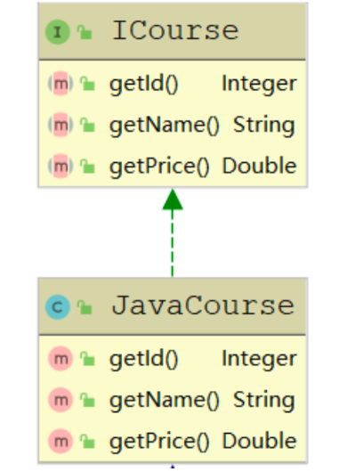

2. 此时，正好赶上节日，我们有一个促销活动，JAVA课程我们打六折 第一种选择:
在ICours新增打折方法getDiscountPrice, 这种会将所有实现ICours接口的实现类都得做改变 第二种选择 每次打折我们都修改JavaCourse类,这种代码显然是不合理的，这样破坏了原本稳定的代码 第三种
新建一个JavaDiscountCourse类继承JavaCourse，并在JavaDiscountCourse新增加一个打折 即可

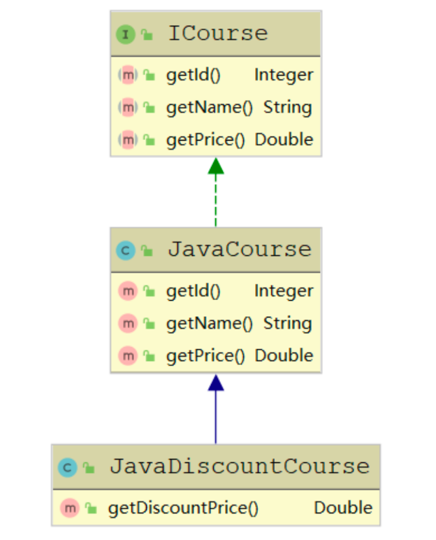

# 7.2 单一职责原则 

## 7.2.1 单一职责原则的定义

  单一职责原则又称单一功能原则，这里的职责是指类变化的原因，单一职责原则规定一个类应该有
且仅有一个引起它变化的原因，否则类应该被拆分。
该原则提出对象不应该承担太多职责，如果一个对象承担了太多的职责，至少存在以下两个缺点:

1. 一个职责的变化可能会削弱或者抑制这个类实现其他职责的能力;
2. 当客户端需要该对象的某一个职责时，不得不将其他不需要的职责全都包含进来，从而造成冗余代
码或代码的浪费。

## 7.2.2 单一职责原则的优点

 单一职责原则的核心就是控制类的粒度大小、将对象解耦、提高其内聚性。如果遵循单一职责原则将有
以下优点。

1. 降低类的复杂度
2. 提高类的可读性
3. 提高系统的可维护性
4. 变更引起的风险降低

## 7.2.3 单一职责原则的实现方法

单一职责原则是最简单但又最难运用的原则，需要设计人员发现类的不同职责并将其分离，再封装到不
同的类或模块中。而发现类的多重职责需要设计人员具有较强的分析设计能力和相关重构经验。下面以
大学学生工作管理程序为例介绍单一职责原则的应用。
大学学生工作管理程序:

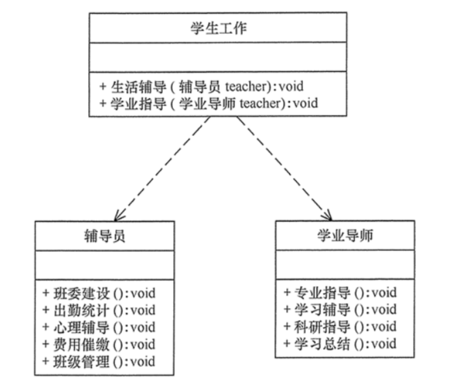

# 7.3 接口隔离原则 

## 7.3.1 接口隔离原则的定义

  接口隔离原则要求程序员尽量将臃肿庞大的接口拆分成更小的和更具体的接口，让接口中只包含客
户感兴趣的方法。
接口隔离原则和单一职责都是为了提高类的内聚性、降低它们之间的耦合性，体现了封装的思想，但两
者是不同的:

1. 单一职责原则注重的是职责，而接口隔离原则注重的是对接口依赖的隔离。
2. 单一职责原则主要是约束类，它针对的是程序中的实现和细节;接口隔离原则主要约束接口，主要
    针对抽象和程序整体框架的构建。

## 7.3.2 接口隔离原则的优点

 接口隔离原则是为了约束接口、降低类对接口的依赖性，遵循接口隔离原则有以下 5 个优点。

1. 提高系统的灵活性和可维护性
2. 降低系统的耦合性。
3. 保证系统的稳定性
4. 使用多个专门的接口还能够体现对象的层次，因为可以通过接口的继承，实现对总接口的定义。 
5. 能减少项目工程中的代码冗余

## 7.3.3 接口隔离原则的实现方法 

在具体应用接口隔离原则时，应该根据以下几个规则来衡量。

- 接口尽量小，但是要有限度。一个接口只服务于一个子模块或业务逻辑。
- 为依赖接口的类定制服务。只提供调用者需要的方法，屏蔽不需要的方法。
- 了解环境，拒绝盲从。每个项目或产品都有选定的环境因素，环境不同，接口拆分的标准就不同深入了解业务逻辑。
- 提高内聚，减少对外交互。使接口用最少的方法去完成最多的事情。

**举例:**
学生成绩管理程序学, 学生成绩管理程序一般包含插入成绩、删除成绩、修改成绩、计算总分、计算均
分、打印成绩信息、査询成绩信息等功能，

1. 如果将这些功能全部放到一个接口中显然不太合理

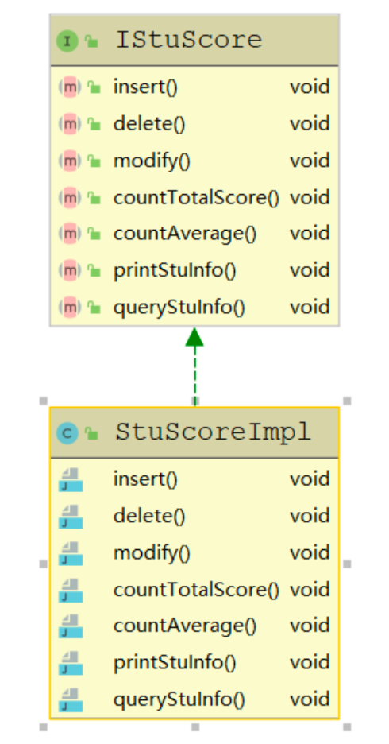

2. 正确的做法是将它们分别放在输入模块、统计模块和打印模块等 3 个模块中

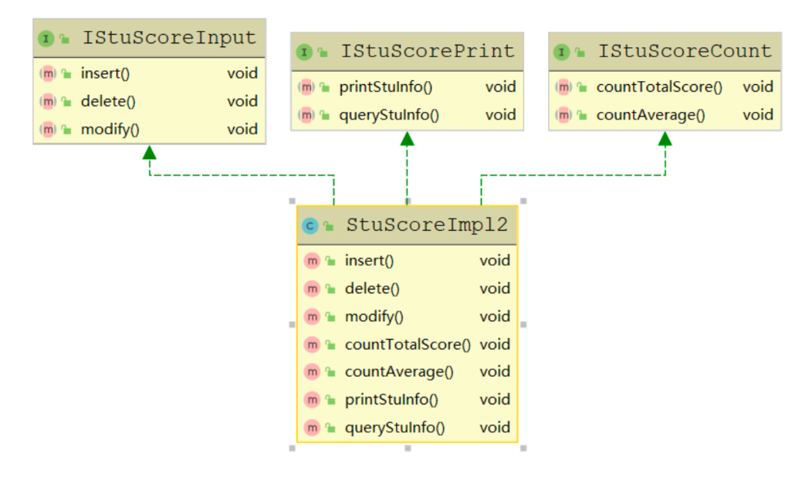

# 7.4 里氏替换原则 

## 7.4.1 里氏替换原则的定义

里氏替换原则主要阐述了有关继承的一些原则。里氏替换原则是继承复用的基础，它反映了基类与 子类之间的关系，是对开闭原则的补充，是对实现抽象化的具体步骤的规范。

总结：**子类可以扩展父类的 功能，但不能改变父类原有的功能**

## 7.4.2 里氏替换原则的作用 

里氏替换原则的主要作用如下。

1. 里氏替换原则是实现开闭原则的重要方式之一。
2. 它克服了继承中重写父类造成的可复用性变差的缺点。
3. 它是动作正确性的保证。即类的扩展不会给已有的系统引入新的错误，降低了代码出错的可能性。
4. 加强程序的健壮性，同时变更时可以做到非常好的兼容性，**提高程序的维护性、可扩展性，降低需求变更时引入的风险。**

## 7.4.3 里氏替换原则的实现方法 

根据上述理解，对里氏替换原则的定义可以总结如下:

1. 子类可以实现父类的抽象方法，但不能覆盖父类的非抽象方法

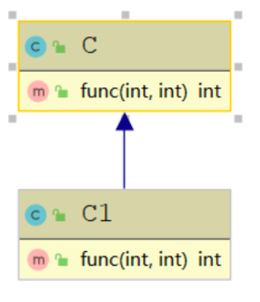

```java
public class C {
    public int func(int a, int b){
return a+b; }
}
public class C1 extends C{
    @Override
    public int func(int a, int b) {
        return a-b;
} }
public class Client{
    public static void main(String[] args) {
C c = new C1();
        System.out.println("2+1=" + c.func(2, 1));
    }
}
```

运行结果:2+1=1
2. 子类中可以增加自己特有的方法

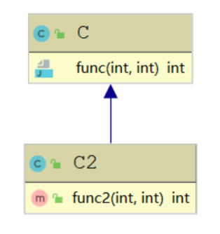

```java
public class C {
    public int func(int a, int b){
return a+b; }
}
public class C2 extends C{
    public int func2(int a, int b) {
return a-b; }
}
public class Client{
    public static void main(String[] args) {
      C2 c = new C2();
      System.out.println("2+1=" + c.func(2, 1));
      System.out.println("2-1=" + c.func2(2, 1));
} }
```

运行结果:2+1=3 , 2-1=1

# 7.5 依赖倒置原则

## 7.5.1 依赖倒置原则定义 

依赖倒置原则的原始定义为:高层模块不应该依赖低层模块，两者都应该依赖其抽象;抽象不应该依
赖细节，细节应该依赖抽象。其核心思想是：**要面向接口编程，不要面向实现编程。**

## 7.5.2 依赖倒置原则的作用

依赖倒置原则的主要作用如下。

1. 可以降低类间的耦合性。

2. 可以提高系统的稳定性。

3. 可以减少并行开发引起的风险。

4. 可以提高代码的可读性和可维护性。

  

## 7.5.3 依赖倒置原则的实现方法

1. 依赖倒置原则在“顾客购物程序”中的应用
  本程序反映了 “顾客类”与“商店类”的关系。商店类中有 sell() 方法，顾客类通过该方法购物以 下代码定义了顾客类通过韶关网店 ShaoguanShop 购物::

  ```java
  class Customer {
      public void shopping(ShaoguanShop shop) {
  //购物
          System.out.println(shop.sell());
      }
  }
  ```

  但是，这种设计存在缺点，如果该顾客想从另外一家商店(如婺源网店 WuyuanShop)购 物，就要将该顾客的代码修改如下:

  ```java
  class Customer {
      public void shopping(WuyuanShop shop) {
  //购物
          System.out.println(shop.sell());
      }
  }
  ```

  顾客每更换一家商店，都要修改一次代码，这明显违背了开闭原则。存在以上缺点的原因是:
       顾客类设计时同具体的商店类绑定了，这违背了依赖倒置原则。

  ```java
  class Customer {
      public void shopping(Shop shop) {
  //购物
          System.out.println(shop.sell());
      }
  }
  ```

  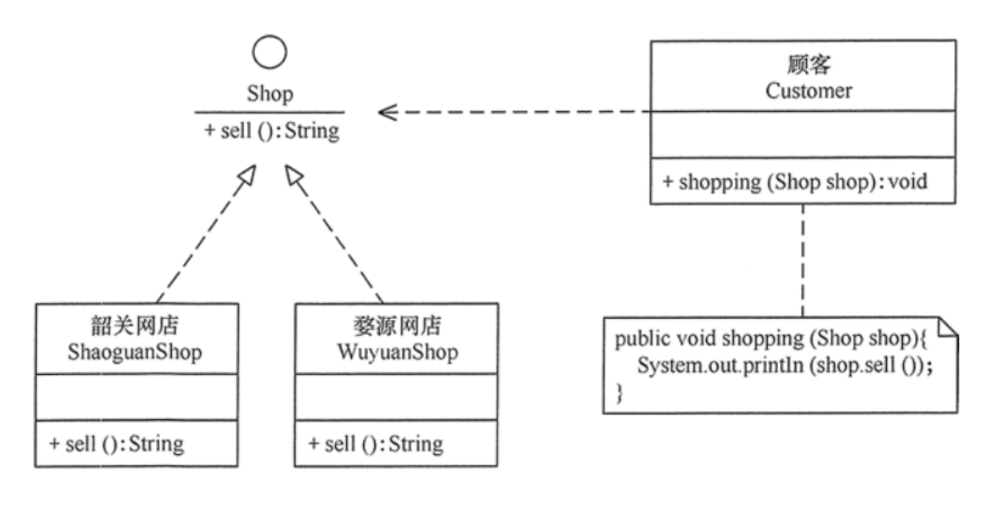

# 7.6 迪米特法则 

## 7.6.1 迪米特法则的定义

迪米特法则又叫作最少知识原则, 迪米特法则的定义是:只与你的直接朋友交谈，不跟“陌生人”说 话。其含义是：**如果两个软件实体无须直接通信，那么就不应当发生直接的相互调用，可以通过第三方 转发该调用**。其目的是**降低类之间的耦合度，提高模块的相对独立性。**

## 7.6.2 迪米特法则的优点

 迪米特法则要求限制软件实体之间通信的宽度和深度，正确使用迪米特法则将有以下两个优点。

1. 降低了类之间的耦合度，提高了模块的相对独立性。
2. 由于亲合度降低，从而提高了类的可复用性和系统的扩展性。

## 7.6.3 迪米特法则的实现方法 

从迪米特法则的定义和特点可知，它强调以下两点:

1. 从依赖者的角度来说，只依赖应该依赖的对象。 
2. 从被依赖者的角度说，只暴露应该暴露的方法。

**案例**：明星与经纪人的关系实例

分析:明星由于全身心投入艺术，所以许多日常事务由经纪人负责处理，如与粉丝的见面会，与媒
体公司的业务洽淡等。这里的经纪人是明星的朋友，而粉丝和媒体公司是陌生人，所以适合使用迪米特
法则

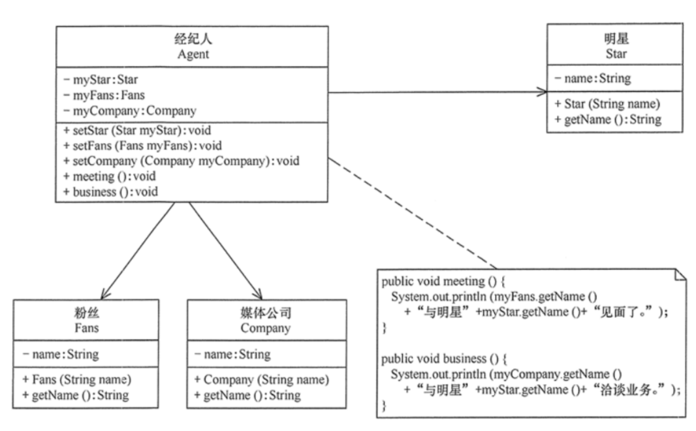

```java
//经纪人
class Agent {
    private Star myStar;
    private Fans myFans;
    private Company myCompany;
    public void setStar(Star myStar) {
        this.myStar = myStar;
    }
        public void setFans(Fans myFans) {
            this.myFans = myFans;
    }
        public void setCompany(Company myCompany) {
            this.myCompany = myCompany;
    }
    public void meeting() {
      System.out.println(myFans.getName() + "与明星" + myStar.getName() + "见面
      了。"); }
    public void business() {
      System.out.println(myCompany.getName() + "与明星" + myStar.getName() + "洽
      淡业务。"); }
}
//明星
class Star {
private String name;
      Star(String name) {
        this.name = name;
}
    public String getName() {
        return name;
} }
//粉丝
class Fans {
    private String name;
    Fans(String name) {
        this.name = name;
}
    public String getName() {
        return name;
} }
//媒体公司
class Company {
    private String name;
    Company(String name) {
        this.name = name;
}
    public String getName() {
        return name;
} }
package principle;
public class LoDtest {
    public static void main(String[] args) {
Agent agent = new Agent();
agent.setStar(new Star("林心如")); agent.setFans(new Fans("粉丝韩丞")); agent.setCompany(new Company("中国传媒有限公司")); agent.meeting();
        agent.business();
    }
}
```

# 7.7 合成复用原则 

## 7.7.1 合成复用原则的定义

合成复用原则(**Composite Reuse Principle**，**CRP**)又叫组合/聚合复用原则 (**Composition/Aggregate Reuse Principle，CARP**)。它要求在软件复用时，要尽量先使用组合或者 聚合等关联关系来实现，其次才考虑使用继承关系来实现。
  如果要使用继承关系，则必须严格遵循里氏替换原则。合成复用原则同里氏替换原则相辅相成的，
两者都是开闭原则的具体实现规范。

## 7.7.2 合成复用原则的重要性 

通常类的复用分为继承复用和合成复用两种，继承复用虽然有简单和易实现的优点，但它也存在以下缺点。

1. 继承复用破坏了类的封装性
2. 子类与父类的耦合度高
3. 它限制了复用的灵活性

采用合成复用原则时，他可以将已有对象纳入新对象中，使之成为新对象的一部分，新对象可以调用已有对象的功能，它有以下优点。

1. 它维持了类的封装性
2. 新旧类之间的耦合度低 
3. 复用的灵活性高

## 7.7.3 合成复用原则的实现方法 

合成复用原则是通过将已有的对象纳入新对象中，作为新对象的成员对象来实现的，新对象可以调用已
有对象的功能，从而达到复用。
下面以汽车分类管理程序为例来介绍合成复用原则的应用。
分析：汽车按“动力源”划分可分为汽油汽车、电动汽车等;按“颜色”划分可分为白色汽车、黑色汽车 和红色汽车等。如果同时考虑这两种分类，其组合就很多。 所示是用继承关系实现的汽车分类的类图。

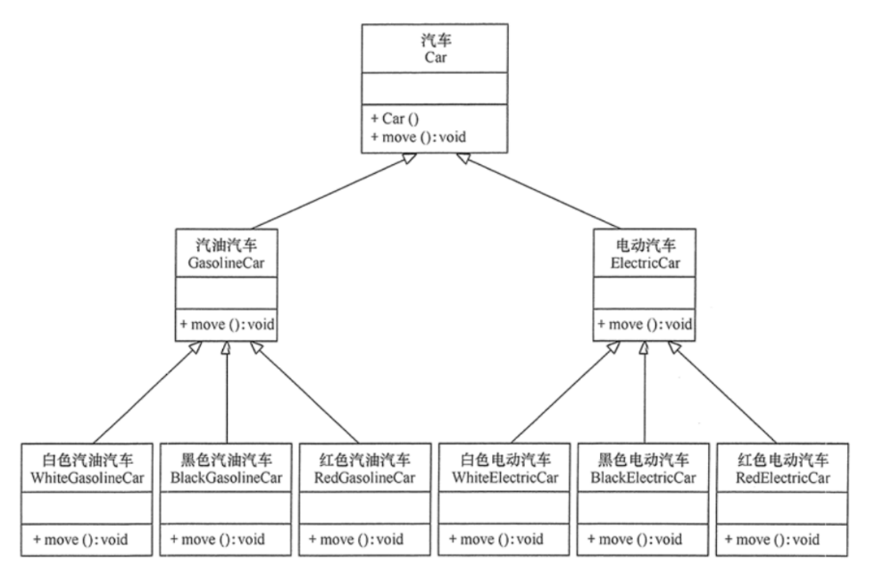

从上图 可以看出用继承关系实现会产生很多子类，而且增加新的“动力源”或者增加新的“颜色”都要 修改源代码，这违背了开闭原则，显然不可取。但如果改用组合关系实现就能很好地解决以上问题

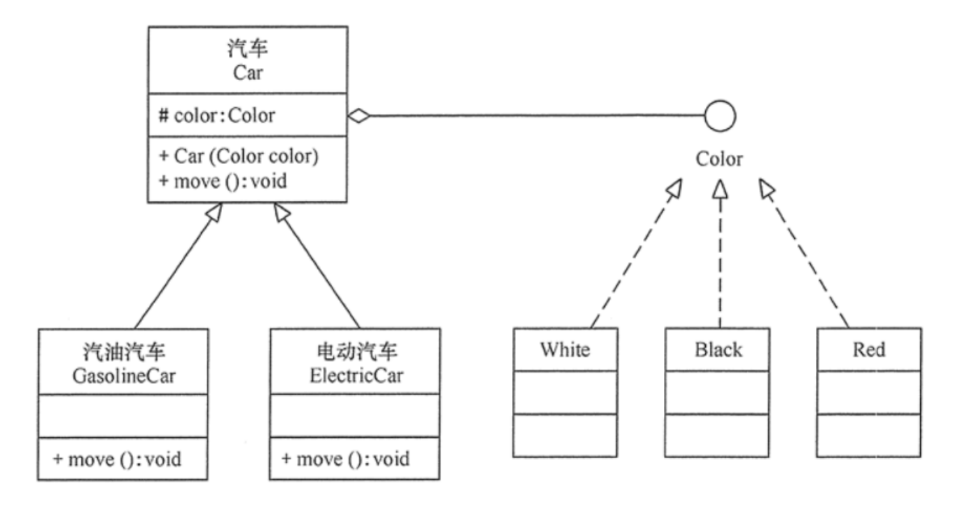