Zookeeper
1. Zookeeper简介
分布式系统定义及面临的问题
ZooKeeper最为主要的使用场景，是作为分布式系统的分布式协同服务。
我们将分布式系统定义为:分布式系统是同时跨越多个物理主机，􏰀立运行的多个软件所组成系统。类 比一下，分布式系统就是一群人一起干活。人多力量大，每个服务器的算力是有限的，但是通过分布式 系统，由n个服务器组成起来的集群，算力是可以无限扩张的。
优点显而易⻅，人多干活快，并且互为备份。但是缺点也很明显。我们可以想象一下，以一个小研发团 队开发软件为例，假设我们有一个5人的项目组，要开始一个系统的开发，项目组将面临如下问题:

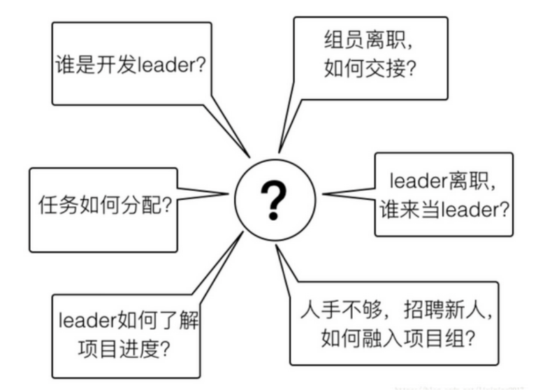

图中列举的就是项目组将要面临到的问题，这些问题在我们日常工作中也是天天发生，并没感觉有多么
复杂，但是这是因为我们人类的大脑是个超级计算机，能够灵活应对这些问题，而且现实中信息的交换
不依赖网络，不会因网络延迟或者中断，出现信息不对等，而且现实中对以上问题的处理其实并不严
谨，从而也引发了很多问题。想一想，项目中是不是出现过沟通不畅造成任务分配有歧义?是否由于人
员离职造成任务进行不下去，甚至要联系离职人员协助?是不是出现过任务分配不合理?类似这样的各
种问题，肯定会发生于你的项目组中。在现实世界，我们可以人为去协调，即使出错了，人工去补错，
加加班搞定就好。但在计算机的世界，这样做是行不通的，一切都要保证严谨，以上问题要做到尽可能
不要发生。因此，分布式系统必须采用合理的方式解决掉以上的问题
实际上要想解决这些问题并没有那么复杂，我们仅需要做一件事就可以万事无忧---让信息在项目组成员 中同步。如果能做到信息同步，那么每个人在干什么，大家都是清楚的，干到什么程度也是清晰的，无 论谁离职也不会产生问题。分配的工作，能够及时清晰的同步给每个组员，确保每个组员收到的任务分 配没有冲突。
分布式系统的协调工作就是通过某种方式，让每个节点的信息能够同步和共享。这依赖于服务进程之间
的通信。通信方式有两种:

通过网络进行信息共享
这就像现实中，开发leader在会上把任务传达下去，组员通过听leader命令或者看leader的邮件知道自 己要干什么。当任务分配有变化时，leader会单􏰀告诉组员，或者再次召开会议。信息通过人与人之间 的直接沟通，完成传递。
通过共享存储
这就好比开发leader按照约定的时间和路径，把任务分配表放到了svn上，组员每天去svn上拉取最新的 任务分配表，然后干活。其中svn就是共享存储。更好一点的做法是，当svn文件版本更新时，触发邮件 通知，每个组员再去拉取最新的任务分配表。这样做更好，因为每次更新，组员都能第一时间得到消 息，从而让自己手中的任务分配表永远是最新的。此种方式依赖于中央存储。整个过程如下图所示:

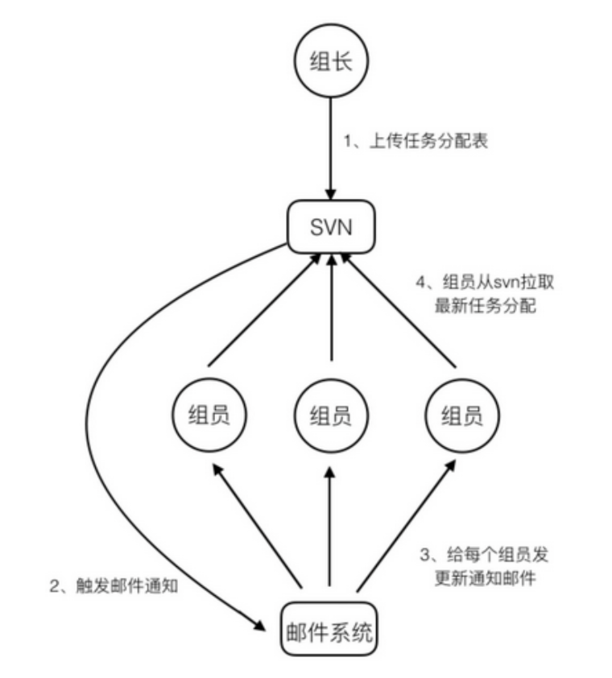

ZooKeeper如何解决分布式系统面临的问题 ZooKeeper对分布式系统的协调，使用的是第二种方式，共享存储。其实共享存储，分布式应用也需要
和存储进行网络通信。
实际上，通过ZooKeeper实现分布式协同的原理，和项目组通过SVN同步工作任务的例子是一样的。 ZooKeeper就像是svn，存储了任务的分配、完成情况等共享信息。每个分布式应用的节点就是组员， 订阅这些共享信息。当主节点(组leader)，对某个从节点的分工信息作出改变时，相关订阅的从节点 得到zookeeper的通知，取得自己最新的任务分配。完成工作后，把完成情况存储到zookeeper。主节 点订阅了该任务的完成情况信息，所以将得到zookeeper的完工的通知。参考下图，是不是和前面项目 组通过svn分配工作的例子一模一样?仅仅是把svn和邮件系统合二为一，以ZooKeeper代替

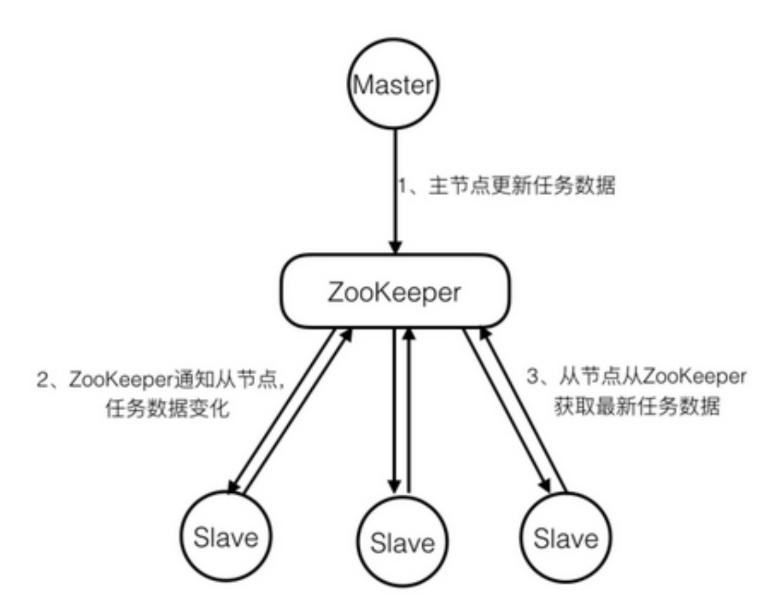

注:Slave节点要想获取ZooKeeper的更新通知，需事先在关心的数据节点上设置观察点。

大多数分布式系统中出现的问题，都源于信息的共享出了问题。如果各个节点间信息不能及时共享和同 步，那么就会在协作过程中产生各种问题。ZooKeeper解决协同问题的关键，就是在于保证分布式系统 信息的一致性。

## zookeeper的基本概念

Zookeeper是一个开源的分布式协调服务，其设计目标是将那些复杂的且容易出错的分布式一致性服务 封装起来，构成一个高效可靠的原语集，并以一些简单的接口提供给用户使用。zookeeper是一个典型 的分布式数据一致性的解决方案，分布式应用程序可以基于它实现诸如数据订阅/发布、负载均衡、命名 服务、集群管理、分布式锁和分布式队列等功能


### 1 集群⻆色

通常在分布式系统中，构成一个集群的每一台机器都有自己的⻆色，最典型的集群就是Master/Slave模式(主备模式)，此情况下把所有能够处理写操作的机器称为Master机器，把所有通过异步复制方式获 取最新数据，并提供读服务的机器为Slave机器。

而在Zookeeper中，这些概念被颠覆了。它没有沿用传递的Master/Slave概念，而是引入了**Leader、 Follower、Observer**三种⻆色。Zookeeper集群中的所有机器通过Leader选举来选定一台被称为 Leader的机器，Leader服务器为客户端提供读和写服务，除Leader外，其他机器包括Follower和 Observer,Follower和Observer都能提供读服务，唯一的区别在于**Observer不参与Leader选举过程， 不参与写操作的过半写成功策略，**因此Observer可以在不影响写性能的情况下提升集群的性能。@@??

###   2 会话(session)

Session指客户端会话，**一个客户端连接是指客户端和服务端之间的一个TCP⻓连接**，Zookeeper对外的 服务端口默认为**2181**，客户端启动的时候，首先会与服务器建立一个TCP连接，从第一次连接建立开始，客户端会话的生命周期也开始了，通过这个连接，客户端能够心跳检测与服务器保持有效的会话， 也能够向Zookeeper服务器发送请求并接受响应，同时还能够通过该连接接受来自服务器的Watch事件通知。

### 3 数据节点(Znode)

在谈到分布式的时候，我们通常说的“节点”是指组成集群的每一台机器。然而，在ZooKeeper中，“节点”分为两类，第一类同样是指构成集群的机器，我们称之为**机器节点**;第二类则是指数据模型中的**数据单元**，我们称之为**数据节点——ZNode**。**ZooKeeper将所有数据存储在内存中，数据模型是一棵树 (ZNode Tree)**，由斜杠(/)进行分割的路径，就是一个Znode，例如/app/path1。每个ZNode上都 会保存自己的数据内容，同时还会保存一系列属性信息。

### 4 版本

刚刚我们提到，Zookeeper的每个Znode上都会存储数据，对于每个ZNode，Zookeeper都会为其维护 一个叫作**Stat**的数据结构，Stat记录了这个ZNode的**三个数据版本**，分别是version(当前ZNode的版 本)、cversion(当前ZNode子节点的版本)、aversion(当前ZNode的ACL版本)。

### 5 Watcher(事件监听器)

Wathcer(事件监听器)，是Zookeeper中一个很重要的特性，Zookeeper允许用户在指定节点上注册 一些Watcher，并且在一些特定事件触发的时候，Zookeeper服务端会将事件通知到感兴趣的客户端， 该机制是Zookeeper实现分布式协调服务的重要特性

###  6 ACL

Zookeeper采用**ACL(Access Control Lists)**策略来进行权限控制，其定义了如下五种权限:     

- CREATE:创建子节点的权限。
- READ:获取节点数据和子节点列表的权限。
- WRITE:更新节点数据的权限。
- DELETE:删除子节点的权限。
- ADMIN:设置节点ACL的权限。 

其中需要注意的是，CREATE和DELETE这两种权限都是针对子节点的权限控制

# Zookeeper环境搭建 

## 2.1 Zookeeper的搭建方式

Zookeeper安装方式有三种，单机模式和集群模式以及伪集群模式。
■ 单机模式:Zookeeper只运行在一台服务器上，适合测试环境;
■ 集群模式:Zookeeper运行于一个集群上，适合生产环境，这个计算机集群被称为一个“集合体” 
■ 伪集群模式:就是在一台服务器上运行多个Zookeeper 实例;

### **单机模式搭建:**

zookeeper安装以linux环境为例:
**1、下载**
首先我们下载稳定版本的zookeeper http://zookeeper.apache.org/releases.html
**2、上传**
下载完成后，将zookeeper压缩包zookeeper-3.4.14.tar.gz上传到linux系统
**3、解压缩压缩包**

```
tar -zxvf zookeeper-3.4.14.tar.gz
```

4、进入 zookeeper-3.4.14 目录，创建 data 文件夹

5、修改配置文件名称

5、修改zoo.cfg中的data属性

6、zookeeper服务启动 进入bin目录，启动服务输入命令

```
#启动
./zkServer.sh start

#停止
./zkServer.sh stop

#查看状态
./zkServer.sh status

```

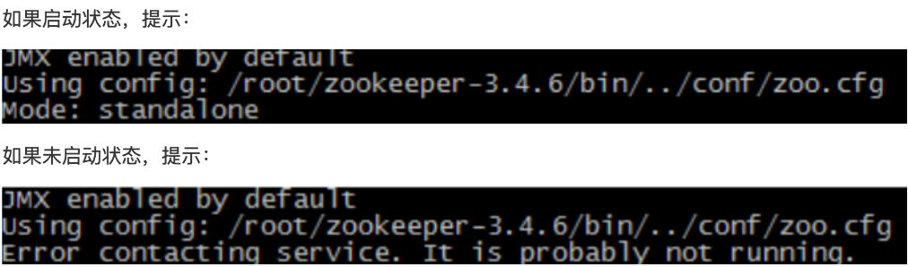

#### 安装时遇到的问题

```
Using config: /usr/local/zookeeper/bin/../conf/zoo.cfg
Client port found: 2181. Client address: localhost.
Error contacting service. It is probably not running.
 

经过一番查找，终于解决问题。

ANSWER:
zookeeper最近的版本中有个内嵌的管理控制台是通过jetty启动，也会占用8080 端口。 
通过查看zookeeper的官方文档，发现有3种解决途径：

方法一：删除jetty。
 
方法二：修改端口。 

修改方法的方法有两种：

一种是在启动脚本中增加 -Dzookeeper.admin.serverPort=你的端口号.

-Dzookeeper.admin.serverPort=你的端口号
一种是在zoo.cfg中增加admin.serverPort=没有被占用的端口号 

admin.serverPort=没有被占用的端口号

方法三：停用这个服务。
在启动脚本中增加-Dzookeeper.admin.enableServer=false

-Dzookeeper.admin.enableServer=false
```

### 伪集群模式:

Zookeeper不但可以在单机上运行单机模式Zookeeper，而且可以在单机模拟集群模式 Zookeeper的运 行，也就是将不同实例运行在同一台机器，用端口进行区分，伪集群模式为我们体验Zookeeper和做一 些尝试性的实验提供了很大的便利。比如，我们在测试的时候，可以先使用少量数据在伪集群模式下进 行测试。当测试可行的时候，再将数据移植到集群模式进行真实的数据实验。这样不但保证了它的可行 性，同时大大提高了实验的效率。这种搭建方式，比较简便，成本比较低，适合测试和学习
注意事项:
一台机器上部署了3个server，也就是说单台机器及上运行多个Zookeeper实例。这种情况下，必须保 证每个配置文档的各个端口号不能冲突，除clientPort不同之外，dataDir也不同。另外，还要在 dataDir所对应的目录中创建myid文件来指定对应的Zookeeper服务器实例

■ clientPort端口:
如果在1台机器上部署多个server，那么每台机器都要不同的 clientPort，比如 server1是2181,server2
是2182，server3是2183

■ dataDir和dataLogDir:
dataDir和dataLogDir也需要区分下，将数据文件和日志文件分开存放，同时每个server的这两变量所 对应的路径都是不同的

■ server.X和myid:
server.X 这个数字就是对应，data/myid中的数字。在3个server的myid文件中分别写入了1，2，3，那 么每个server中的zoo.cfg都配 server.1 server.2,server.3就行了。因为在同一台机器上，后面连着的2 个端口，3个server都不要一样，否则端口冲突

#### 步骤

分别在**zookeeper01**、**zookeeper02**、**zookeeper03**目录下创建**data**及**logs**目录

配置每一个**Zookeeper** 的**dataDir**(**zoo.cfg**) **clientPort** 分别为**2181 2182 2183**

配置集群

(1)在每个zookeeper的 data 目录下创建一个 myid 文件，内容分别是1、2、3 。这个文件就是记录 每个服务器的ID
touch myid

(2)在每一个zookeeper 的 zoo.cfg配置客户端访问端口(clientPort)和集群服务器IP列表。

server.1=10.211.55.4:2881:3881
 server.2=10.211.55.4:2882:3882
 server.3=10.211.55.4:2883:3883 #server.服务器ID=服务器IP地址:服务器之间通信端口:服务器之间投票选举端口

启动集群
依次启动三个zk实例

# Zookeeper基本使用

##  3.1 ZooKeeper系统模型

### Znode

在ZooKeeper中，数据信息被保存在一个个数据节点上，这些节点被称为znode。ZNode 是 Zookeeper 中最小数据单位，在 ZNode 下面又可以再挂 ZNode，这样一层层下去就形成了一个层次化 命名空间 ZNode 树，我们称为 ZNode Tree，它采用了类似文件系统的层级树状结构进行管理。⻅下图 示例:

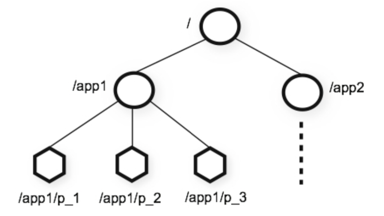

在 Zookeeper 中，每一个数据节点都是一个 ZNode，上图根目录下有两个节点，分别是:app1 和 app2，其中 app1 下面又有三个子节点,所有ZNode按层次化进行组织，形成这么一颗树，ZNode的节 点路径标识方式和Unix文件系统路径非常相似，都是由一系列使用斜杠(/)进行分割的路径表示，开 发人员可以向这个节点写入数据，也可以在这个节点下面创建子节点。

### ZNode 的类型*4

刚刚已经了解到，Zookeeper的znode tree是由一系列数据节点组成的，那接下来，我们就对数据节点做详细讲解

Zookeeper 节点类型可以分为三大类:
1、持久性节点(Persistent)
2、临时性节点(Ephemeral)
3、顺序性节点(Sequential)

在开发中在创建节点的时候通过组合可以生成以下四种节点类型:持久节点、持久顺序节点、临时节点、临时顺序节点。不同类型的节点则会有不同的生命周期

- **持久节点**: 是Zookeeper中最常⻅的一种节点类型，所谓持久节点，就是指节点被创建后会一直存在服 务器，直到删除操作主动清除
- **持久顺序节点**: 就是有顺序的持久节点，节点特性和持久节点是一样的，只是额外特性表现在顺序上。 顺序特性实质是在创建节点的时候，会在节点名后面加上一个数字后缀，来表示其顺序。
- **临时节点**: 就是会被自动清理掉的节点，它的生命周期和客户端会话绑在一起，客户端会话结束，节点 会被删除掉。与持久性节点不同的是，临时节点不能创建子节点。
- **临时顺序节点**: 就是有顺序的临时节点，和持久顺序节点相同，在其创建的时候会在名字后面加上数字 后缀。  

### **ZXID** 事务ID 

首先，先了解，事务是对物理和抽象的应用状态上的操作集合。往往在现在的概念中，􏰁义上的事务通 常指的是数据库事务，一般包含了一系列对数据库有序的读写操作，这些数据库事务具有所谓的ACID特 性，即原子性(Atomic)、一致性(Consistency)、隔离性(Isolation)和持久性(Durability)。

**ZXID**

而在ZooKeeper中，事务是指能够改变ZooKeeper服务器状态的操作，我们也称之为事务操作或更新操 作，一般包括数据节点创建与删除、数据节点内容更新等操作。对于每一个事务请求，ZooKeeper都会 为其分配一个**全局唯一的事务ID**，用 **ZXID** 来表示，通常是一个 64 位的数字。每一个 ZXID 对应一次更 新操作，从这些ZXID中可以间接地识别出ZooKeeper处理这些更新操作请求的全局顺序

### ZNode 的状态信息

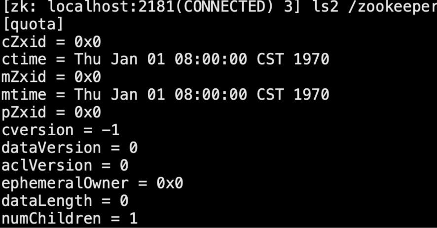

整个 ZNode 节点内容包括两部分：数据内容 和 状态信息。图中quota 是数据内容，其他的属 于状态信息。那么这些状态信息都有什么含义呢?

```
 
cZxid 就是 Create ZXID，表示节点被创建时的事务ID。
ctime 就是 Create Time，表示节点创建时间。
mZxid 就是 Modified ZXID，表示节点最后一次被修改时的事务ID。
mtime 就是 Modified Time，表示节点最后一次被修改的时间。
pZxid 表示该节点的子节点列表最后一次被修改时的事务 ID。只有子节点列表变更才会更新 pZxid，
子节点内容变更不会更新。
cversion 表示子节点的版本号。
dataVersion 表示内容版本号。
aclVersion 标识acl版本
ephemeralOwner 表示创建该临时节点时的会话 sessionID，如果是持久性节点那么值为 0 dataLength 表示数据⻓度。
numChildren 表示直系子节点数。
```

### Watcher--数据变更通知 

Zookeeper使用Watcher机制实现分布式数据的发布/订阅功能

一个典型的发布/订阅模型系统定义了一种 一对多的订阅关系，能够让多个订阅者同时监听某一个主题 对象，当这个主题对象自身状态变化时，会通知所有订阅者，使它们能够做出相应的处理。

在 ZooKeeper 中，引入了 Watcher 机制来实现这种分布式的通知功能。ZooKeeper 允许 客户端 向 服务端 注册一个 Watcher 监听，当服务端的一些指定事件触发了这个 Watcher，那么就会向指定客户端发 送一个事件通知来实现分布式的通知功能。

整个Watcher注册与通知过程如图所示。

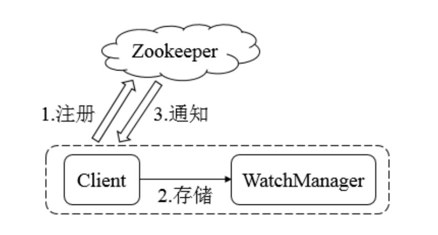

Zookeeper的Watcher机制主要包括**客户端线程、客户端WatcherManager、Zookeeper服务器**三部 分。
具体工作流程为：客户端在向Zookeeper服务器注册的同时，会将Watcher对象存储在客户端的 WatcherManager当中。当Zookeeper服务器触发Watcher事件后，会向客户端发送通知，客户端线程 从WatcherManager中取出对应的Watcher对象来执行回调逻辑。

### ACL--保障数据的安全

Zookeeper作为一个分布式协调框架，其内部存储了分布式系统运行时状态的元数据，这些元数据会直 接影响基于Zookeeper进行构造的分布式系统的运行状态，因此，如何保障系统中数据的安全，从而避 免因误操作所带来的数据随意变更而导致的数据库异常十分重要，在Zookeeper中，提供了一套完善的 ACL(Access Control List)权限控制机制来保障数据的安全。
  我们可以从三个方面来理解ACL机制：**权限模式(Scheme)、授权对象(ID)、权限 (Permission)**，通常使用"**scheme: id : permission**"来标识一个有效的ACL信息。

#### 权限模式:Scheme   *4

权限模式用来确定权限验证过程中使用的检验策略，有如下四种模式:

1. **IP**
    IP模式就是通过IP地址粒度来进行权限控制，如"ip:192.168.0.110"表示权限控制针对该IP地址， 同时IP模式可以支持按照网段方式进行配置，如"ip:192.168.0.1/24"表示针对192.168.0.*这个网段 进行权限控制。

2. **Digest** 
    Digest是最常用的权限控制模式，要更符合我们对权限控制的认识，其使用"username:password"形式的权限标识来进行权限配置，便于区分不同应用来进行权限控制。 当我们通过“username:password”形式配置了权限标识后，Zookeeper会先后对其进行SHA-1加密和BASE64编码。 
    
3. **World**
    World是一种最开放的权限控制模式，这种权限控制方式几乎没有任何作用，数据节点的访问权限 对所有用户开放，即所有用户都可以在不进行任何权限校验的情况下操作ZooKeeper上的数据。 另外，World模式也可以看作是一种特殊的Digest模式，它只有一个权限标识，即“world: anyone”。

4. **Super**
   Super模式，顾名思义就是超级用户的意思，也是一种特殊的Digest模式。在Super模式下，超级用户可以对任意ZooKeeper上的数据节点进行任何操作。 

#### 授权对象:ID

授权对象指的是权限赋予的用户或一个指定实体，例如 IP 地址或是机器等。在不同的权限模式下，授 权对象是不同的，表中列出了各个权限模式和授权对象之间的对应关系。

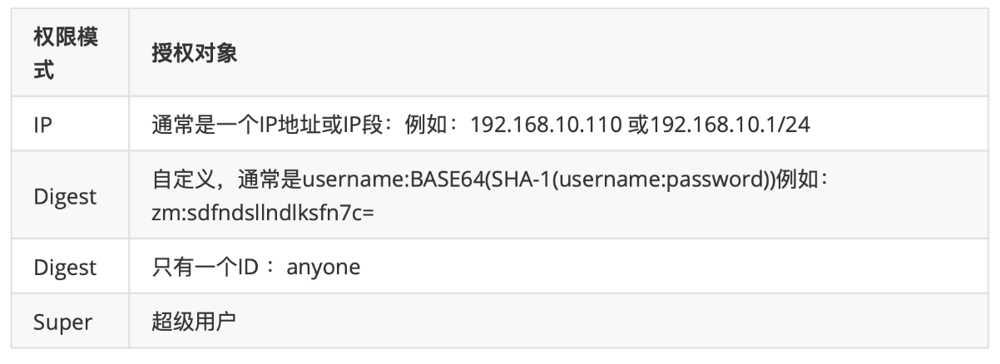

#### 权限*5

权限就是指那些通过权限检查后可以被允许执行的操作。在ZooKeeper中，所有对数据的操作权限分为 以下五大类:

- CREATE(C):数据节点的创建权限，允许授权对象在该数据节点下创建子节点。 · 
- DELETE(D): 子节点的删除权限，允许授权对象删除该数据节点的子节点。 · 
- READ(R):数据节点的读取权限，允 许授权对象访问该数据节点并读取其数据内容或子节点列表等。 · 
- WRITE(W):数据节点的更新权 限，允许授权对象对该数据节点进行更新操作。 · 
- ADMIN(A):数据节点的管理权限，允许授权对象 **对该数据节点进行 ACL 相关的设置操作**。


## 3.2 ZooKeeper命令行操作 

现在已经搭建起了一个能够正常运行的zookeeper服务了，所以接下来，就是来借助客户端来对
zookeeper的数据节点进行操作 首先，进入到zookeeper的bin目录之后 通过zkClient进入zookeeper客户端命令行

```bash
./zkcli.sh 连接本地的zookeeper服务器 
./zkCli.sh -server ip:port 连接指定的服务器
```

### 创建节点

使用create命令，可以创建一个Zookeeper节点， 如 

```bash
create [-s][-e] path data acl 
# 其中，-s或-e分别指定节点特性，顺序或临时节点，若不指定，则创建持久节点;acl用来进行权限控制。
# -s 顺序节点
# -e 临时节点
```

1、创建顺序节点

使用 create -s /zk-test 123 命令创建zk-test顺序节点
执行完后，就在根节点下创建了一个叫做/zk-test的节点，该节点内容就是123，同时可以看到创建的 zk-test节点后面添加了一串数字以示区别

 2、创建临时节点

使用 create -e /zk-temp 123 命令创建zk-temp临时节
临时节点在客户端会话结束后，就会自动删除，下面使用quit命令退出客户端
再次使用客户端连接服务端，并使用ls / 命令查看根目录下的节点
可以看到根目录下已经不存在zk-temp临时节点了

3、创建永久节点

使用 create /zk-permanent 123 命令创建zk-permanent永久节点
可以看到永久节点不同于顺序节点，不会自动在后面添加一串数字

```bash
[zk: localhost:2181(CONNECTED) 1] ls /
[zk-test0000000000, zookeeper]
[zk: localhost:2181(CONNECTED) 2] create /zk-permanent 123
Created /zk-permanent
[zk: localhost:2181(CONNECTED) 3] ls /
[zk-permanent, zk-test0000000000, zookeeper]
[zk: localhost:2181(CONNECTED) 4] create -e /zk-temp 123
Created /zk-temp
[zk: localhost:2181(CONNECTED) 5] ls /
[zk-permanent, zk-test0000000000, zookeeper, zk-temp]
```


### 读取节点

与读取相关的命令有ls 命令和get 命令 

ls命令可以列出Zookeeper指定节点下的所有子节点，但只能查看指定节点下的第一级的所有子节点;
若获取根节点下面的所有子节点，使用**ls /** 命令即可

```bash
 ls path 
 # 其中，path表示的是指定数据节点的节点路径
 
 get path
 # 获取节点内容 和 节点的状态信息，
 
 ls2 path
 # 获取节点的直系节点列表 和 节点的状态信息
```

get命令可以获取Zookeeper指定节点的数据内容和属性信息。
若想获取/zk-permanent的数据内容和属性，可使用如下命令:get /zk-permanent

#### 示例

```bash
[zk: localhost:2181(CONNECTED) 7] ls /
##############
[zk-permanent, zk-test0000000000, zookeeper, zk-temp]
[zk: localhost:2181(CONNECTED) 8] ls2 /zk-permanent
##############
[]
cZxid = 0x100000006
ctime = Mon Aug 23 20:31:53 CST 2021
mZxid = 0x100000006
mtime = Mon Aug 23 20:31:53 CST 2021
pZxid = 0x100000006
cversion = 0
dataVersion = 0
aclVersion = 0
ephemeralOwner = 0x0
dataLength = 3
numChildren = 0
[zk: localhost:2181(CONNECTED) 9] get /zk-permanent
##############
123
cZxid = 0x100000006
ctime = Mon Aug 23 20:31:53 CST 2021
mZxid = 0x100000006
mtime = Mon Aug 23 20:31:53 CST 2021
pZxid = 0x100000006
cversion = 0
dataVersion = 0
aclVersion = 0
ephemeralOwner = 0x0
dataLength = 3
numChildren = 0
```

### 更新节点

使用set命令，可以更新指定节点的数据内容，用法如下

```bash
set path data [version]
```

 其中，data就是要更新的新内容，version表示数据版本，在zookeeper中，节点的数据是有版本概 念的，这个参数用于指定本次更新操作是基于Znode的哪一个数据版本进行的，如将/zk-permanent节 点的数据更新为456，可以使用如下命令:`set /zk-permanent 456`

```bash
[zk: localhost:2181(CONNECTED) 13] set /zk-permanent 456
############
cZxid = 0x100000006
ctime = Mon Aug 23 20:31:53 CST 2021
mZxid = 0x100000008
mtime = Mon Aug 23 20:41:53 CST 2021
pZxid = 0x100000006
cversion = 0
dataVersion = 1 # +1
aclVersion = 0
ephemeralOwner = 0x0
dataLength = 3
numChildren = 0
```

现在dataVersion已经变为1了，表示进行了更新

### 删除节点

 使用delete命令可以删除Zookeeper上的指定节点，用法如下

```bash
delete path [version]
```

其中version也是表示数据版本，使用**delete /zk-permanent** 命令即可删除/zk-permanent节点

```bash
[zk: localhost:2181(CONNECTED) 14] delete /zk-temp
[zk: localhost:2181(CONNECTED) 15] ls /
[zk-permanent, zk-test0000000000, zookeeper]
```

可以看到，已经成功删除/zk-permanent节点。值得注意的是，若删除节点**存在子节点，那么无法删除 该节点，必须先删除子节点，再删除父节点**


## 3.3 Zookeeper的api使用 

Zookeeper作为一个分布式框架，主要用来解决分布式一致性问题，它提供了简单的分布式原语，并且
对多种编程语言提供了API，所以接下来重点来看下Zookeeper的java客户端API使用方式 

Zookeeper API共包含五个包，分别为:

(1)org.apache.zookeeper
(2)org.apache.zookeeper.data
(3)org.apache.zookeeper.server 
(4)org.apache.zookeeper.server.quorum 
(5)org.apache.zookeeper.server.upgrade

其中**org.apache.zookeeper，包含Zookeeper类，他是我们编程时最常用的类文件**。这个类是 Zookeeper客户端的主要类文件。如果要使用Zookeeper服务，应用程序首先必须创建一个Zookeeper 实例，这时就需要使用此类。一旦客户端和Zookeeper服务端建立起了连接，Zookeeper系统将会给本次连接会话分配一个ID值，并且客户端将会周期性的向服务器端发送心跳来维持会话连接。只要连接有效，客户端就可以使用Zookeeper API来做相应处理了。

准备工作:导入依赖

```xml
 <dependency>
    <groupId>org.apache.zookeeper</groupId>
    <artifactId>zookeeper</artifactId>
    <version>3.4.14</version>
  </dependency>
```

### **建立会话**

```java
public class CreateZkSession implements Watcher {

    //countDownLatch这个类使一个线程等待,主要不让main方法结束
    private static CountDownLatch countDownLatch = new CountDownLatch(1);

    public static void main(String[] args) throws IOException, InterruptedException {
        /*
            客户端可以通过创建一个zk实例来连接zk服务器
            new Zookeeper(connectString,sesssionTimeOut,Wather)
            connectString: 连接地址:IP:端口
            sesssionTimeOut:会话超时时间:单位毫秒
            Wather:监听器(当特定事件触发监听时，zk会通过watcher通知到客户端)
        */
        ZooKeeper zooKeeper = new ZooKeeper("tx1:2181", 5000, new CreateZkSession());
        System.out.println(zooKeeper.getState());

        countDownLatch.await();
        //表示会话真正建立
        System.out.println("=========Client Connected to zookeeper==========");

    }

    // 当前类实现了Watcher接口，重写了process方法，
    // 该方法负责处理来自Zookeeper服务端的 watcher通知，
    // 在收到服务端发送过来的 SyncConnected 事件之后，解除主程序在CountDownLatch上 的等待阻塞，
    // 至此，会话创建完毕
    @Override
    public void process(WatchedEvent watchedEvent) {
        // SyncConnected
        if (watchedEvent.getState() == Event.KeeperState.SyncConnected){
            System.out.println("process 方法执行了");
            //解除主程序在 CountDownLatch 的等待阻塞
            countDownLatch.countDown();
        }
    }
}
```


注意，ZooKeeper 客户端和服务端会话的建立是一个异步的过程，也就是说在程序中，构造方法会在处 理完客户端初始化工作后立即返回，在大多数情况下，此时并没有真正建立好一个可用的会话，在会话 的生命周期中处于“CONNECTING”的状态。 当该会话真正创建完毕后ZooKeeper服务端会向会话对应 的客户端发送一个事件通知，以告知客户端，客户端只有在获取这个通知之后，才算真正建立了会话。


```java
/**
 * 同步创建节点
 */
private static void createNodeSync() throws KeeperException, InterruptedException {
    /**

     path: 节点创建路径 以/开头
     data[]：节点保存的数据，时nyte类型
     acl：节点创建的权限信息(4种类型)
         ANYONE_ID_UNSAFE : 表示任何人
         AUTH_IDS :此ID仅可用于设置ACL。它将被客户机验证的ID替
         OPEN_ACL_UNSAFE :这是一个完全开放的ACL(常用)--> world:anyone
         CREATOR_ALL_ACL :此ACL授予创建者身份验证ID的所有权限
     createMode：创建节点的类型(4种类型)
         PERSISTENT:持久节点
         PERSISTENT_SEQUENTIAL:持久顺序节点
         EPHEMERAL:临时节点
         EPHEMERAL_SEQUENTIAL:临时顺序节点
     String node = zookeeper.create(path,data,acl,createMode);
     */
    String node_persist = zooKeeper.create(
            "/shred-persistent",
            "节点内容".getBytes(StandardCharsets.UTF_8),
            ZooDefs.Ids.OPEN_ACL_UNSAFE,
            CreateMode.PERSISTENT
    );

    String node_tmp = zooKeeper.create(
            "/shred-ephemeral",
            "节点内容".getBytes(StandardCharsets.UTF_8),
            ZooDefs.Ids.OPEN_ACL_UNSAFE,
            CreateMode.EPHEMERAL
    );
    String node_persist_seq = zooKeeper.create(
            "/shred-persistent_sequential",
            "节点内容".getBytes(StandardCharsets.UTF_8),
            ZooDefs.Ids.OPEN_ACL_UNSAFE,
            CreateMode.PERSISTENT_SEQUENTIAL
    );

    //
    System.out.println("创建了三个节点");
    System.out.println(node_persist);
    System.out.println(node_tmp);
    System.out.println(node_persist_seq);


}
```


### 获取节点数据

```java
public class GetNodeData implements Watcher {

    private static ZooKeeper zooKeeper;

    public static void main(String[] args) throws IOException, InterruptedException {

        zooKeeper = new ZooKeeper("tx1:2181", 5000, new GetNodeData());
        System.out.println(zooKeeper.getState());

        //表示会话真正建立
        System.out.println("=========Client Connected to zookeeper==========");

        //维持会话，不让main方法结束，也就不让session关闭
        Thread.sleep(Integer.MAX_VALUE);

    }

    @Override
    public void process(WatchedEvent watchedEvent) {
        try {

            /*
                子节点列表发生变更时，服务端发送 nodeChildrenChanged 事件
                要重新互殴去子节点列表，同时，通知是一次性的，需要反复注册监听
             */
            if (watchedEvent.getType() == Event.EventType.NodeChildrenChanged) {
                //重新获取，反复注册监听，下一次变更时才嫩获取到事件
                getChildren();
            }

            // SyncConnected
            if (watchedEvent.getState() == Event.KeeperState.SyncConnected) {
                System.out.println("process 方法执行了");
                getNodeData();
                getChildren();
            }

        } catch (KeeperException e) {
            e.printStackTrace();
        } catch (InterruptedException e) {
            e.printStackTrace();
        }
    }

    /**
     * 获取节点的子节点列表
     *
     * @throws KeeperException
     * @throws InterruptedException
     */
    private void getChildren() throws KeeperException, InterruptedException {
        /*
            path:路径
            watch:是否要启动监听，当子节点列表发生变化，会触发监听
             zooKeeper.getChildren(path, watch);
        */
        List<String> children = zooKeeper.getChildren("/shred-persistent", true);
        System.out.println(children);
    }

  private void getNodeData() throws KeeperException, InterruptedException {
        // stat :节点状态，null表示获取最新版本的数据
        byte[] data = zooKeeper.getData("/shred-persistent", false, null);
        System.out.println(new String(data));
    }

}
```

### 更新节点

​        zooKeeper.setData()

```java
private void updateNodeSync() throws KeeperException, InterruptedException {
    getLatestData("/shred-persistent");

    /*
        path:路径
        data:要修改的内容 byte[] 
        version:为-1，表示对最新版本的数据进行修改 
        zooKeeper.setData(path, data,version);
    */
    Stat stat = zooKeeper.setData("/shred-persistent",(new Date()+"客户端修改了").getBytes(StandardCharsets.UTF_8), -1);

    getLatestData("/shred-persistent");

}

private void getLatestData(String nodeName) throws KeeperException, InterruptedException {
    byte[] data = zooKeeper.getData(nodeName, false, null);
    System.out.println("节点值："+new String(data));
}
```

### 删除节点

```java
private void deleteNodeSync() throws KeeperException, InterruptedException {
    String name = "/shred-persistent/s-p-1";
    Stat exists = zooKeeper.exists(name, false);
    System.out.println(exists == null? "不存在":"存在");

    if (exists !=null){
        zooKeeper.delete(name, -1);
    }

    Stat stat = zooKeeper.exists(name, false);
    System.out.println(stat == null? "不存在":"存在");
}
```

## 3.4 Zookeeper-开源客户端 

### ZkClient

ZkClient是Github上一个开源的zookeeper客户端，在Zookeeper原生API接口之上进行了包装，是一个 更易用的Zookeeper客户端，同时，zkClient在内部还实现了诸如Session超时重连、Watcher反复注册 等功能

接下来，还是从创建会话、创建节点、读取数据、更新数据、删除节点等方面来介绍如何使用zkClient 这个zookeeper客户端
添加依赖:
在pom.xml文件中添加如下内容

```
<dependency>
    <groupId>com.101tec</groupId>
    <artifactId>zkclient</artifactId>
    <version>0.2</version>
 </dependency>
```

#### 创建会话:

使用ZkClient可以轻松的创建会话，连接到服务端。 

```
public class CreateSession {
    public static void main(String[] args) {
        ZkClient zkClient = new ZkClient("tx1:2181");
        System.out.println("会话创建了。。");
    }
}
```

接口测试

```java
public class UseZkClient {
    public static void main(String[] args) throws InterruptedException {
        ZkClient zkClient = new ZkClient("tx1:2181");
        System.out.println("会话创建了。。");

        api(zkClient);

        getNodeChildren(zkClient);

        createNode(zkClient);

        deleteNode(zkClient);

    }

    private static void api(ZkClient zkClient) throws InterruptedException {
        String path = "/shred-zkClient-Ep";
        boolean exists = zkClient.exists(path);
        if (!exists){
            zkClient.createEphemeral(path, "123");
        }

        //读取
        Object o = zkClient.readData(path);
        System.out.println(o);

        zkClient.subscribeDataChanges(path, new IZkDataListener() {
            @Override
            public void handleDataChange(String s, Object o) throws Exception {
                System.out.println(s + " 节点数据发生变化，变化后 "+o);
            }

            @Override
            public void handleDataDeleted(String s) throws Exception {
                System.out.println(s + " 节点被删除");
            }
        });

        zkClient.writeData(path, "444");
        Thread.sleep(1000);

        zkClient.delete(path);
        Thread.sleep(1000);

    }

    private static void getNodeChildren(ZkClient zkClient) throws InterruptedException {
        String path = "/shred-pppp";
        System.out.println("=====测试子节点 ===" +path);
        if (zkClient.exists(path)){
            zkClient.deleteRecursive(path);
        }

        //注册监听，可以对不存在的节点进行子节点变更监听，只要该节点子节点列表、或该节点本身被创建或删除，都会触发更新
        zkClient.subscribeChildChanges(path, new IZkChildListener() {
            /*
            s: parentPath
            list；变化后子节点的 列表
             */
            @Override
            public void handleChildChange(String s, List<String> list) throws Exception {
                System.out.println(s + "子节点列表发生变化，变化后："+ list);
            }
        });


        zkClient.createPersistent(path);
        Thread.sleep(1000);

        zkClient.createPersistent(path +"/n1");

    }

    private static void deleteNode(ZkClient zkClient) {
        String path = "/shred-p1/p1-1";
        System.out.println("==== 测试删除====" +path);
        //先创建子节点，再删除父节点
        zkClient.createPersistent(path + "/p1-1-1");
        zkClient.deleteRecursive(path);
        System.out.println("递归删除节点 :"+path );
    }

    private static void createNode(ZkClient zkClient) {
        String path = "/shred-p1/p1-1";
        System.out.println("===测试创建===="+ path);
        zkClient.createPersistent(path, true);
        System.out.println("递归创建节点"+path);
    }
}
```


### Curator客户端

Curator
英 [kjʊəˈreɪtə(r)]   美 [kjʊˈreɪtər]  
财产管理人;博物馆长;策划;馆员;保管员

curator是Netflix公司开源的一套Zookeeper客户端框架，和ZKClient一样，Curator解决了很多 Zookeeper客户端非常底层的细节开发工作，包括连接重连，反复注册Watcher和 NodeExistsException异常等，是最流行的Zookeeper客户端之一。从编码⻛格上来讲，它提供了基于 Fluent的编程⻛格支持
添加依赖
在pom.xml文件中添加如下内容:

```
<dependency>
      <groupId>org.apache.curator</groupId>
      <artifactId>curator-framework</artifactId>
      <version>2.12.0</version>
</dependency>
```

#### 创建会话

Curator的创建会话方式与原生的API和ZkClient的创建方式区别很大。Curator创建客户端是通过 CuratorFrameworkFactory工厂类来实现的。具体如下:
1.使用CuratorFramework这个工厂类的两个静态方法来创建一个客户端

```java
public static CuratorFramework newClient(String connectString, RetryPolicy retryPolicy)
  
public static CuratorFramework newClient(String connectString, int sessionTimeoutMs, int connectionTimeoutMs, RetryPolicy retryPolicy)
```

其中参数RetryPolicy提供重试策略的接口，可以让用户实现自定义的重试策略，默认提供了以下实现， 分别为ExponentialBackoffRetry(基于backoff的重连策略)、RetryNTimes(重连N次策略)、 RetryForever(永远重试策略)、

2.通过调用CuratorFramework中的start()方法来启动会话

```
RetryPolicy retryPolicy = new ExponentialBackoffRetry(1000,3);
CuratorFramework client =
CuratorFrameworkFactory.newClient("127.0.0.1:2181",retryPolicy);
client.start();
```

```
RetryPolicy retryPolicy = new ExponentialBackoffRetry(1000,3);
CuratorFramework client = CuratorFrameworkFactory.newClient("127.0.0.1:2181",5000,1000,retryPolicy);
client.start();
```

其实进一步查看源代码可以得知，其实这两种方法内部实现一样，只是对外包装成不同的方法。它们的 底层都是通过第三个方法builder来实现的

```
RetryPolicy retryPolicy  = new ExponentialBackoffRetry(1000,3);
private static CuratorFramework Client = CuratorFrameworkFactory.builder()
            .connectString("server1:2181,server2:2181,server3:2181")
            .sessionTimeoutMs(50000)
            .connectionTimeoutMs(30000)
            .retryPolicy(retryPolicy)
            .namespace("base")// 独立命名空间/base
            .build();
client.start();
```

参数:
connectString:zk的server地址，多个server之间使用英文逗号分隔开 connectionTimeoutMs:连接超时时间，如上是30s，默认是15s sessionTimeoutMs:会话超时时间，如上是50s，默认是60s retryPolicy:失败重试策略
ExponentialBackoffRetry:构造器含有三个参数 ExponentialBackoffRetry(int baseSleepTimeMs, int maxRetries, int maxSleepMs)
baseSleepTimeMs:初始的sleep时间，用于计算之后的每次重试的sleep时间，
计算公式:当前sleep时间=baseSleepTimeMs*Math.max(1,
random.nextInt(1<<(retryCount+1))) maxRetries:最大重试次数
maxSleepMs:最大sleep时间，如果上述的当前sleep计算出来比这个大，那么sleep用 这个时间，默认的最大时间是Integer.MAX_VALUE毫秒。
其他，查看org.apache.curator.RetryPolicy接口的实现类 
start():完成会话的创建


#### 创建节点

curator提供了一系列Fluent⻛格的接口，通过使用Fluent编程⻛格的接口，开发人员可以进行自由组合 来完成各种类型节点的创建。
下面简单介绍一下常用的几个节点创建场景。 
**Curator默认创建的是持久节点**，内容为空。

```java
//(1)创建一个初始内容为空的节点
client.create().forPath(path);
//Curator默认创建的是持久节点，内容为空。

//(2)创建一个包含内容的节点
client.create().forPath(path,"我是内容".getBytes());
//Curator和ZkClient不同的是依旧采用Zookeeper原生API的⻛格，内容使用byte[]作为方法参数。 
  
//(3)递归创建父节点,并选择节点类型
 client.create().creatingParentsIfNeeded().withMode(CreateMode.EPHEMERAL).forPath(path);
```

creatingParentsIfNeeded这个接口非常有用，在使用ZooKeeper 的过程中，开发人员经常会碰到 NoNodeException 异常，其中一个可能的原因就是试图对一个不存在的父节点创建子节点。因此，开 发人员不得不在每次创建节点之前，都判断一下该父节点是否存在——这个处理通常比较麻烦。在使用 Curator 之后，通过调用creatingParentsIfNeeded 接口，Curator 就能够自动地递归创建所有需要的 父节点。

####  测试新增、修改、删除、获取

```java
public class UseCurator {

    private static CuratorFramework client;
    private static String path = "/shred-curator-ppp/c1";
    private static String base = "base";

    public static void main(String[] args) throws Exception {

        //构建
        client = CuratorFrameworkFactory.builder().connectString("tx1:2181") //server地址
                .sessionTimeoutMs(5000) // 会话超时时间
                .connectionTimeoutMs(3000) // 连接超时时间
                .retryPolicy(new ExponentialBackoffRetry(1000, 5)) //重试策略
                .namespace(base) //使用了namespace， 那么节点都是在namespace下操作的
                .build();
        client.start();//连接
        System.out.println("Zookeeper session established. ");

        testCreate();

        testDelete();

        testGet();
    }

    /**
     * 测试创建
     */
    private static void testCreate() throws Exception {
        client.create().creatingParentsIfNeeded()
                .withMode(CreateMode.PERSISTENT)
                .forPath(path, "init".getBytes(StandardCharsets.UTF_8));

        Thread.sleep(1000);

        System.out.println("成功创建节点: " + base + path);
    }

    /**
     * 测试读取、更新
     */
    private static void testGet() throws Exception {
        Stat stat = new Stat();
        byte[] bytes = client.getData().storingStatIn(stat).forPath(path);
        System.out.println("获取节点的数据：" + new String(bytes));

        System.out.println("状态信息：" + stat);
        System.out.println("更新前的version：" + stat.getVersion());

        //更新
        Stat updatedStat = client.setData().withVersion(stat.getVersion()).forPath(path);
        System.out.println("更新后的version：" + updatedStat.getVersion());

        //尝试更新旧版本，会报错：
        // org.apache.zookeeper.KeeperException$BadVersionException: KeeperErrorCode = BadVersion for
        client.setData().withVersion(stat.getVersion()).forPath(path).getVersion();
    }

    /**
     * 测试删除
     */
    private static void testDelete() throws Exception {
        //删除节点
        client.delete().forPath(path);

        //递归删除节点及其子节点
        client.delete().deletingChildrenIfNeeded().forPath(path);

        //删除指定版本
        client.delete().withVersion(1).forPath(path);

        //保证强制删除节点
        client.delete().guaranteed().forPath(path);
        // 只要客户端会话有效，那么Curator会在后台持续进行删除操作，直到节点删除成功。比如遇到一些网 络异常的情况,
        // 此guaranteed的强制删除就会很有效果。
    }

}
```


## 选择题

**3.** **多选题****以下对zookeeper集群描述正确的是：[多选题] \*****(20分)** ABCD

- A集群规则为2N+1台，N>0，即3台
- Bzookeeper可以采用集群模式进行部署
- C集群需要一半以上的机器可用，所以，3台挂掉1台还能工作，挂掉2台不能
- D集群3.5版本开始支持动态扩容

**5.** **多选题****属于Zookeeper Watcher 工作机制的是 [多选题] \*****(20分)** ABD

- A客户端注册watcher
- B服务端处理watcher
- C服务端销毁watcher
- D客户端回调watcher


# 4. Zookeeper应用场景

ZooKeeper是一个典型的发布/订阅模式的分布式数据管理与协调框架，我们可以使用它来进行分布式 数据的发布与订阅。另一方面，通过对ZooKeeper中丰富的数据节点类型进行交叉使用，配合Watcher 事件通知机制，可以非常方便地构建一系列分布式应用中都会涉及的核心功能，如数据发布/订阅、命名 服务、集群管理、Master选举、分布式锁和分布式队列等。那接下来就针对这些典型的分布式应用场景 来做下介绍

## 数据发布/订阅

数据发布/订阅(Publish/Subscribe)系统，即所谓的配置中心，顾名思义就是发布者将数据发布到 ZooKeeper的一个或一系列节点上，供订阅者进行数据订阅，进而达到动态获取数据的目的，实现配置 信息的集中式管理和数据的动态更新。

发布/订阅系统一般有两种设计模式，分别是**推(Push)**模式和**拉(Pull)**模式。在推模式中，服务端 主动将数据更新发送给所有订阅的客户端;而拉模式则是由客户端主动发起请求来获取最新数据，通常 客户端都采用定时进行轮询拉取的方式。

**ZooKeeper 采用的是推拉相结合的方式**：客户端向服务端注册自己需要关注的节点，一旦该节点的数据 发生变更，那么服务端就会向相应的客户端发送Watcher事件通知，客户端接收到这个消息通知之后， 需要主动到服务端获取最新的数据。

如果将配置信息存放到ZooKeeper上进行集中管理，那么通常情况下，应用在启动的时候都会主动到 ZooKeeper服务端上进行一次配置信息的获取，同时，在指定节点上注册一个Watcher监听，这样一 来，但凡配置信息发生变更，服务端都会实时通知到所有订阅的客户端，从而达到实时获取最新配置信息的目的。

下面我们通过一个“配置管理”的实际案例来展示ZooKeeper在“数据发布/订阅”场景下的使用方式。 在我们平常的应用系统开发中，经常会碰到这样的需求:系统中需要使用一些通用的配置信息，例如机器列表信息、运行时的开关配置、数据库配置信息等。这些全局配置信息通常具备以下3个特性。

- 数据量通常比较小。
- 数据内容在运行时会发生动态变化。
- 集群中各机器共享，配置一致。

对于这类配置信息，一般的做法通常可以选择将其存储在本地配置文件或是内存变量中。无论采用哪种方式，其实都可以简单地实现配置管理，在集群机器规模不大、配置变更不是特别频繁的情况下，无论刚刚提到的哪种方式，都能够非常方便地解决配置管理的问题。但是，一旦机器规模变大，且配置信息变更越来越频繁后，我们发现依靠现有的这两种方式解决配置管理就变得越来越困难了。我们既希望能够快速地做到全局配置信息的变更，同时希望变更成本足够小，因此我们必须寻求一种更为分布式化的解决方案

接下来我们就以一个“数据库切换”的应用场景展开，看看如何使用ZooKeeper来实现配置管理: 

**配置存储**
在进行配置管理之前，首先我们需要将初始化配置信息存储到Zookeeper上去，一般情况下，我们可以 在Zookeeper上选取一个数据节点用于配置信息的存储，例如:/app1/database_config


配置管理的zookeeper节点示意图 我们将需要管理的配置信息写入到该数据节点中去，例如:

```
#数据库配置信息
#DBCP
dbcp.driverClassName=com.mysql.jdbc.Driver dbcp.dbJDBCUrl=jdbc:mysql://127.0.0.1:3306/lagou-test dbcp.username=zm
dbcp.password=1234
dbcp.maxActive=30
dbcp.maxIdle=10
```

**配置获取**
集群中每台机器在启动初始化阶段，首先会从上面提到的ZooKeeper配置节点上读取数据库信息，同 时，客户端还需要在该配置节点上注册一个数据变更的 Watcher监听，一旦发生节点数据变更，所有订 阅的客户端都能够获取到数据变更通知。
**配置变更**
在系统运行过程中，可能会出现需要进行数据库切换的情况，这个时候就需要进行配置变更。借助 ZooKeeper，我们只需要对ZooKeeper上配置节点的内容进行更新，ZooKeeper就能够帮我们将数据变 更的通知发送到各个客户端，每个客户端在接收到这个变更通知后，就可以重新进行最新数据的获取。

## 命名服务

命名服务(Name Service)也是分布式系统中比较常⻅的一类场景，是分布式系统最基本的公共服务之 一。在分布式系统中，被命名的实体通常可以是集群中的机器、提供的服务地址或远程对象等——这些 我们都可以统称它们为名字(Name)，其中较为常⻅的就是一些分布式服务框架(如RPC、RMI)中 的服务地址列表，通过使用命名服务，客户端应用能够根据指定名字来获取资源的实体、服务地址和提 供者的信息等。

ZooKeeper 提供的命名服务功能能够帮助应用系统通过一个资源引用的方式来实现对资源的定位与使 用。另外，广义上命名服务的资源定位都不是真正意义的实体资源——在分布式环境中，上层应用仅仅 需要一个全局唯一的名字，类似于数据库中的唯一主键。

所以接下来。我们来看看如何使用ZooKeeper来实现一套分布式全局唯一ID的分配机制

所谓ID，就是一个能够唯一标识某个对象的标识符。在我们熟悉的关系型数据库中，各个表都需要一个 主键来唯一标识每条数据库记录，这个主键就是这样的唯一ID。在过去的单库单表型系统中，通常可以 使用数据库字段自带的auto_increment属性来自动为每条数据库记录生成一个唯一的ID，数据库会保证 生成的这个ID在全局唯一。但是随着数据库数据规模的不断增大，分库分表随之出现，而 auto_increment属性仅能针对单一表中的记录自动生成ID，因此在这种情况下，就无法再依靠数据库的 auto_increment属性来唯一标识一条记录了。于是，我们必须寻求一种能够在分布式环境下生成全局唯 一ID的方法。

一说起全局唯一 ID，相信大家都会联想到 UUID。没错，UUID 是通用唯一识别码(Universally Unique Identifier)的简称，是一种在分布式系统中广泛使用的用于唯一标识元素的标准 确实，UUID 是一个非常不错的全局唯一ID生成方式，能够非常简便地保证分布式环境中的唯一性。一个标准的 UUID 是一个包含 32 位字符和 4 个短线的字符串，例如“e70f1357-f260-46ff-a32d-53a086c57ade”。 UUID的优势自然不必多说，我们重点来看看它的缺陷。

### ⻓度过⻓

UUID 最大的问题就在于生成的字符串过⻓。显然，和数据库中的 INT 类型相比，存储一个UUID需要花 费更多的空间。

### 含义不明

上面我们已经看到一个典型的 UUID 是类似于“e70f1357-f260-46ff-a32d-53a086c57ade”的一个字符 串。根据这个字符串，开发人员从字面上基本看不出任何其表达的含义，这将会大大影响问题排查和开 发调试的效率。

所以接下来，我们结合一个分布式任务调度系统来看看如何使用ZooKeepe来实现这类全局唯一ID的生 成。 之前我们已经提到，通过调用ZooKeeper节点创建的API接口可以创建一个顺序节点，并且在API返 回值中会返回这个节点的完整名字。利用这个特性，我们就可以借助ZooKeeper来生成全局唯一的ID 了，如下图:

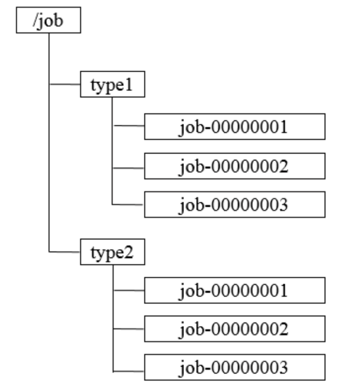

### 总结

：利用zookeeper生成顺序节点的机制，拼接上客户端的标识，得到全局唯一的id。@@??zk是基于文件系统的，那会不会生成的文件过多了？

## 集群管理

随着分布式系统规模的日益扩大，集群中的机器规模也随之变大，那如何更好地进行集群管理也显得越
来越重要了。所谓集群管理，包括集群监控与集群控制两大块，前者侧重对集群运行时状态的收集，后
者则是对集群进行操作与控制。

在日常开发和运维过程中，我们经常会有类似于如下的需求:
  如何快速的统计出当前生产环境下一共有多少台机器
  如何快速的获取到机器上下线的情况
  如何实时监控集群中每台主机的运行时状态

### 传统的基于Agent的存在的弊端

在传统的基于Agent的分布式集群管理体系中，都是通过在集群中的每台机器上部署一个 Agent，由这 个 Agent 负责主动向指定的一个监控中心系统(监控中心系统负责将所有数据进行集中处理，形成一系 列报表，并负责实时报警，以下简称“监控中心”)汇报自己所在机器的状态。在集群规模适中的场景 下，这确实是一种在生产实践中广泛使用的解决方案，能够快速有效地实现分布式环境集群监控，但是 一旦系统的业务场景增多，集群规模变大之后，该解决方案的弊端也就显现出来了。

#### 大规模升级困难

以客户端形式存在的 Agent，在大规模使用后，一旦遇上需要大规模升级的情况，就非常麻烦，在升级 成本和升级进度的控制上面临巨大的挑战。

#### 统一的Agent无法满足多样的需求

对于机器的CPU使用率、负载(Load)、内存使用率、网络吞吐以及磁盘容量等机器基本的物理状态， 使用统一的Agent来进行监控或许都可以满足。但是，如果需要深入应用内部，对一些业务状态进行监 控，例如，在一个分布式消息中间件中，希望监控到每个消费者对消息的消费状态;或者在一个分布式 任务调度系统中，需要对每个机器上任务的执行情况进行监控。很显然，对于这些业务耦合紧密的监控 需求，不适合由一个统一的Agent来提供。

#### 编程语言多样性

随着越来越多编程语言的出现，各种异构系统层出不穷。如果使用传统的Agent方式，那么需要提供各 种语言的 Agent 客户端。另一方面，“监控中心”在对异构系统的数据进行整合上面临巨大挑战。

### Zookeeper的两大特性:  

 1.客户端如果对Zookeeper的数据节点注册Watcher监听，那么当该数据节点的内容或是其子节点
列表发生变更时，Zookeeper服务器就会向订阅的客户端发送变更通知。   2.对在Zookeeper上创建的临时节点，一旦客户端与服务器之间的会话失效，那么临时节点也会被自动删除
利用其两大特性，可以实现集群机器存活监控系统，若监控系统在/clusterServers节点上注册一个 Watcher监听，那么但凡进行动态添加机器的操作，就会在/clusterServers节点下创建一个临时节 点:/clusterServers/[Hostname]，这样，监控系统就能够实时监测机器的变动情况。
下面通过分布式日志收集系统这个典型应用来学习Zookeeper如何实现集群管理。

### 分布式日志收集系统

  分布式日志收集系统的核心工作就是收集分布在不同机器上的系统日志，在这里我们重点来看分布 式日志系统(以下简称“日志系统”)的收集器模块。
在一个典型的日志系统的架构设计中，整个日志系统会把所有需要收集的日志机器(我们以“**日志源机器**”代表此类机器)**分为多个组别**，**每个组别对应一个收集器**，这个收集器其实就是一个后台机器(我们 以“**收集器机器**”代表此类机器)，用于收集日志
对于大规模的分布式日志收集系统场景，通常需要解决两个问题:

 · 变化的日志源机器
 在生产环境中，伴随着机器的变动，每个应用的机器几乎每天都是在变化的(机器硬件问题、扩容、机房
迁移或是网络问题等都会导致一个应用的机器变化)，也就是说每个组别中的日志源机器通常是在不断变化
的

 · 变化的收集器机器
 日志收集系统自身也会有机器的变更或扩容，于是会出现新的收集器机器加入或是老的收集器机器退出的
情况。

无论是日志源机器还是收集器机器的变更，最终都可以归结为如何快速、合理、动态地为每个收集 器分配对应的日志源机器。这也成为了整个日志系统正确稳定运转的前提，也是日志收集过程中最大的 技术挑战之一，在这种情况下，我们就可以引入zookeeper了，下面我们就来看ZooKeeper在这个场景 中的使用。
使用Zookeeper的场景步骤如下

#### 1 注册收集器机器

使用ZooKeeper来进行日志系统收集器的注册，典型做法是在ZooKeeper上创建一个节点作为收集器的 根节点，例如/logs/collector(下文我们以“收集器节点”代表该数据节点)，每个收集器机器在启动的时 候，都会在收集器节点下创建自己的节点，例如/logs/collector/[Hostname]


#### 2 任务分发

待所有收集器机器都创建好自己对应的节点后，系统根据收集器节点下子节点的个数，将所有日志源机 器分成对应的若干组，然后将分组后的机器列表分别写到这些收集器机器创建的子节点(例 如/logs/collector/host1)上去。这样一来，每个收集器机器都能够从自己对应的收集器节点上获取日 志源机器列表，进而开始进行日志收集工作。

#### 3 状态汇报

完成收集器机器的注册以及任务分发后，我们还要**考虑到这些机器随时都有挂掉的可能**。因此，针对这个问题，我们需要有一个收集器的状态汇报机制:每个收集器机器在创建完自己的专属节点后，**还需要在对应的子节点上创建一个状态子节点，例如/logs/collector/host1/status**，每个收集器机器都需要**定期向该节点写入自己的状态信息**。我们可以把这种策略**看作是一种心跳检测机制**，通常收集器机器都会在这个节点中写入日志收集进度信息。日志系统根据该状态子节点的最后更新时间来判断对应的收集器 机器是否存活。

####  4 动态分配

如果收集器机器挂掉或是扩容了，就需要动态地进行收集任务的分配。在运行过程中，日志系统始终关 注着/logs/collector这个节点下所有子节点的变更，一旦检测到有收集器机器停止汇报或是有新的收集 器机器加入，就要开始进行任务的重新分配。无论是针对收集器机器停止汇报还是新机器加入的情况， 日志系统都需要将之前分配给该收集器的所有任务进行转移。为了解决这个问题，通常有两种做法:
 **· 全局动态分配** 
这是一种简单粗暴的做法，在出现收集器机器挂掉或是新机器加入的时候，日志系统需要根据新的收集
器机器列表，立即对所有的日志源机器重新进行一次分组，然后将其分配给剩下的收集器机器。
 **· 局部动态分配**
全局动态分配方式虽然策略简单，但是存在一个问题:一个或部分收集器机器的变更，就会导致全局动 态任务的分配，影响面比较大，因此⻛险也就比较大。所谓局部动态分配，顾名思义就是在小范围内进 行任务的动态分配。在这种策略中，每个收集器机器在汇报自己日志收集状态的同时，也会把自己的负 载汇报上去。请注意，这里提到的负载并不仅仅只是简单地指机器CPU负载(Load)，而是一个对当前 收集器任务执行的综合评估，这个评估算法和ZooKeeper本身并没有太大的关系，这里不再赘述。
在这种策略中，如果一个收集器机器挂了，那么日志系统就会把之前分配给这个机器的任务重新分配到
那些负载较低的机器上去。同样，如果有新的收集器机器加入，会从那些负载高的机器上转移部分任务
给这个新加入的机器。

上述步骤已经完整的说明了整个日志收集系统的工作流程，其中有两点注意事项:  

**1节点类型**
在/logs/collector节点下创建临时节点可以很好的判断机器是否存活，但是，若机器挂了，其节点会被 删除，记录在节点上的日志源机器列表也被清除，所以需要选择持久节点来标识每一台机器，同时在节 点下分别创建/logs/collector/[Hostname]/status节点来表征每一个收集器机器的状态，这样，既能实 现对所有机器的监控，同时机器挂掉后，依然能够将分配任务还原。

**2 日志系统节点监听** 
若采用Watcher机制，那么通知的消息量的网络开销非常大，需要采用日志系统主动轮询收集器节点的
策略，这样可以节省网络流量，但是存在一定的延时。

## Master选举

Master选举是一个在分布式系统中非常常⻅的应用场景。分布式最核心的特性就是能够将具有􏰀立计算 能力的系统单元部署在不同的机器上，构成一个完整的分布式系统。而与此同时，实际场景中往往也需 要在这些分布在不同机器上的􏰀立系统单元中选出一个所谓的“老大”，在计算机中，我们称之为 Master。

在分布式系统中，Master往往用来协调集群中其他系统单元，具有对分布式系统状态变更的决定权。例 如，在一些读写分离的应用场景中，客户端的写请求往往是由 Master来处理的;而在另一些场景中， Master则常常负责处理一些复杂的逻辑，并将处理结果同步给集群中其他系统单元。Master选举可以 说是ZooKeeper最典型的应用场景了，接下来，我们就结合**“一种海量数据处理与共享模型”**这个具体例 子来看看 ZooKeeper在集群Master选举中的应用场景。

在分布式环境中，经常会碰到这样的应用场景:集群中的所有系统单元需要对前端业务提供数据，比如 一个商品 ID，或者是一个网站轮播广告的广告 ID(通常出现在一些广告投放系统中)等，而这些商品 ID或是广告ID往往需要从一系列的海量数据处理中计算得到——这通常是一个非常耗费 I/O 和 CPU资源 的过程。鉴于该计算过程的复杂性，如果让集群中的所有机器都执行这个计算逻辑的话，那么将耗费非 常多的资源。一种比较好的方法就是只让集群中的部分，甚至只让其中的一台机器去处理数据计算，一 旦计算出数据结果，就可以共享给整个集群中的其他所有客户端机器，这样可以大大减少重复劳动，提 升性能。 这里我们以一个简单的广告投放系统后台场景为例来讲解这个模型。

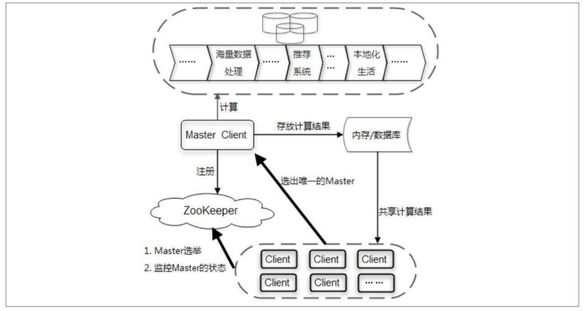

整个系统大体上可以分成客户端集群、分布式缓存系统、海量数据处理总线和 ZooKeeper四个部分

首先我们来看整个系统的运行机制。图中的Client集群每天定时会通过ZooKeeper来实现Master选举。 选举产生Master客户端之后，这个Master就会负责进行一系列的海量数据处理，最终计算得到一个数 据结果，并将其放置在一个内存/数据库中。同时，Master还需要通知集群中其他所有的客户端从这个 内存/数据库中共享计算结果。

#### 利用数据库主键选举master存在的问题

接下去，我们将重点来看 Master 选举的过程，首先来明确下 Master 选举的需求:在集群的所有机器 中选举出一台机器作为Master。针对这个需求，通常情况下，我们可以选择常⻅的关系型数据库中的主 键特性来实现:集群中的所有机器都向数据库中插入一条相同主键 ID 的记录，数据库会帮助我们自动 进行主键冲突检查，也就是说，所有进行插入操作的客户端机器中，只有一台机器能够成功——那么， 我们就认为向数据库中成功插入数据的客户端机器成为Master。

借助数据库的这种方案确实可行，依靠关系型数据库的主键特性能够很好地保证在集群中选举出唯一的 一个Master。**但是我们需要考虑的另一个问题是，如果当前选举出的Master挂了，那么该如何处理? 谁来告诉我Master挂了呢?显然，关系型数据库没法通知我们这个事件。**那么，如果使用ZooKeeper是 否可以做到这一点呢? 那在之前，我们介绍了ZooKeeper创建节点的API接口，其中一个重要特性便是：**利用ZooKeeper的强一致性，能够很好保证在分布式高并发情况下节点的创建一定能够保证全局唯 一性，即ZooKeeper将会保证客户端无法重复创建一个已经存在的数据节点。**也就是说，如果同时有多 个客户端请求创建同一个节点，那么最终一定只有一个客户端请求能够创建成功。利用这个特性，就能 很容易地在分布式环境中进行Master选举了。

### 使用zookeeper选举master


在这个系统中，首先会在 ZooKeeper 上创建一个日期节点，例如“2020-11-11

**客户端集群每天都会定时往ZooKeeper 上创建一个临时节点，例如/master_election/2020-11- 11/binding。在这个过程中，**只有一个客户端能够成功创建这个节点，那么这个客户端所在的机器就成 为了Master。同时，其他没有在ZooKeeper上成功创建节点的客户端，**都会在节 点/master_election/2020-11-11 上注册一个子节点变更的 Watcher，用于监控当前的 Master 机器是 否存活**，一旦发现当前的 Master 挂了，那么其余的客户端将会重新进行Master选举。

从上面的讲解中，我们可以看到，如果仅仅只是想实现Master选举的话，那么其实只需要有一个能够保 证数据唯一性的组件即可，例如关系型数据库的主键模型就是非常不错的选择。但是，如果希望能够快 速地进行集群 Master 动态选举，那么就可以基于 ZooKeeper来实现

## 分布式锁

分布式锁是控制分布式系统之间同步访问共享资源的一种方式。如果不同的系统或是同一个系统的不同主机之间共享了一个或一组资源，那么访问这些资源的时候，往往需要通过一些互斥手段来防止彼此之间的干扰，以保证一致性，在这种情况下，就需要使用分布式锁了。

在平时的实际项目开发中，我们往往很少会去在意分布式锁，而是依赖于关系型数据库固有的排他性来实现不同进程之间的互斥。这确实是一种非常简便且被广泛使用的分布式锁实现方式。然而有一个不争的事实是，**目前绝大多数大型分布式系统的性能瓶颈都集中在数据库操作上**。因此，如果上层业务再给数据库添加一些额外的锁，例如行锁、表锁甚至是繁重的事务处理，那么就会让数据库更加不堪重负。

下面我们来看看使用ZooKeeper如何实现分布式锁，这里主要讲解排他锁和共享锁两类分布式锁。

### 排他锁

**排他锁(Exclusive Locks，简称 X 锁)**，**又称为写锁或独占锁**，是一种基本的锁类型。如果事务 T1对 数据对象 O1加上了排他锁，那么在整个加锁期间，只允许事务 T1对 O1进行读取和更新操作，其他任 何事务都不能再对这个数据对象进行任何类型的操作——直到T1释放了排他锁

从上面讲解的排他锁的基本概念中，我们可以看到，排他锁的核心是如何保证当前有且仅有一个事务获得锁，并且锁被释放后，所有正在等待获取锁的事务都能够被通知到。
下面我们就来看看如何借助ZooKeeper实现排他锁: 

#### 1 定义锁

在通常的Java开发编程中，有两种常⻅的方式可以用来定义锁，分别是synchronized机制和JDK5提供的 ReentrantLock。然而，在ZooKeeper中，没有类似于这样的API可以直接使用，而是通过 ZooKeeper 上的数据节点来表示一个锁，例如/exclusive_lock/lock节点就可以被定义为一个锁，如图:


#### 2 获取锁

在需要获取排他锁时，所有的客户端都会试图通过调用 create()接口，在/exclusive_lock节点下创建临时子节点`/exclusive_lock/lock`。在前面，我们也介绍了，ZooKeeper 会保证在所有的客户端中，最终只有一个客户端能够创建成功，那么就可以认为该客户端获取了锁。同时，所有没有获取到锁的客户 端就需要到`/exclusive_lock `节点上注册一个子节点变更的Watcher监听，以便实时监听到lock节点的变 更情况

#### 3释放锁

在“定义锁”部分，我们已经提到，/exclusive_lock/lock 是一个临时节点，因此在以下两种情况下，都有 可能释放锁。 · 当前获取锁的客户端机器发生宕机，那么ZooKeeper上的这个临时节点就会被移除。 · 正常执行完业务逻辑后，客户端就会主动将自己创建的临时节点删除。 无论在什么情况下移除了lock节 点，ZooKeeper都会通知所有在/exclusive_lock节点上注册了子节点变更Watcher监听的客户端。这些 客户端在接收到通知后，再次重新发起分布式锁获取，即重复“获取锁”过程。整个排他锁的获取和释放 流程，如下图:


### 共享锁

**共享锁(Shared Locks，简称S锁)，又称为读锁，**同样是一种基本的锁类型。 如果事务T1对数据对象O1加上了共享锁，那么当前事务只能对O1进行读取操作，其他事务也只能对这
个数据对象加共享锁——直到该数据对象上的所有共享锁都被释放。 共享锁和排他锁最根本的区别在于，加上排他锁后，数据对象只对一个事务可⻅，而加上共享锁后，数
据对所有事务都可⻅。
下面我们就来看看如何借助ZooKeeper来实现共享锁。

#### 1 定义锁 

和排他锁一样，同样是通过 ZooKeeper 上的数据节点来表示一个锁，是一个类似于
“/shared_lock/[Hostname]-请求类型-序号”的临时顺序节点，例如/shared_lock/host1-R- 0000000001，那么，这个节点就代表了一个共享锁，如图所示:
-R 读类型


#### 2 获取锁

在需要获取共享锁时，所有客户端都会到/shared_lock 这个节点下面创建一个临时顺序节点，如果当前 是读请求，那么就创建例如/shared_lock/host1-R-0000000001的节点;如果是写请求，那么就创建例 如/shared_lock/host2-W-0000000002的节点。
判断读写顺序
通过Zookeeper来确定分布式读写顺序，大致分为四步

    1. 创建完节点后，获取/shared_lock节点下所有子节点，并对该节点变更注册监听。     
    2. 确定自己的节点序号在所有子节点中的顺序。
    3. 对于读请求：若没有比自己序号小的子节点或所有比自己序号小的子节点都是读请求，那么表 明自己已经成功获取到共享锁，同时开始执行读取逻辑，若有写请求，则需要等待。对于写请求：若自己不是序号最小的子节点，那么需要等待。
    4. 接收到Watcher通知后，重复步骤1

#### 3 释放锁，

其释放锁的流程与􏰀占锁一致。

### 羊群效应

上面讲解的这个共享锁实现，大体上能够满足一般的分布式集群竞争锁的需求，并且性能都还可以—— 这里说的一般场景是指集群规模不是特别大，一般是在10台机器以内。但是如果机器规模扩大之后，会 有什么问题呢?我们着重来看上面“判断读写顺序”过程的步骤3，结合下面的图，看看实际运行中的情况


针对如上图所示的情况进行分析

1. host1首先进行读操作，完成后将节点/shared_lock/host1-R-00000001删除。
2. 余下4台机器均收到这个节点移除的通知，然后重新从/shared_lock节点上获取一份新的子节 点列表。
3. 每台机器判断自己的读写顺序，其中host2检测到自己序号最小，于是进行写操作，余 下的机器则继续等待。
4. 继续...

可以看到，host1客户端在移除自己的共享锁后，Zookeeper发送了子节点更变Watcher通知给所有机 器，然而除了给host2产生影响外，对其他机器没有任何作用。大量的Watcher通知和子节点列表获取 两个操作会重复运行，这样不仅会对zookeeper服务器造成巨大的性能影响影响和网络开销，更为严重 的是，如果同一时间有多个节点对应的客户端完成事务或是事务中断引起节点消失，ZooKeeper服务器 就会在短时间内向其余客户端发送大量的事件通知，这就是所谓的羊群效应。
上面这个ZooKeeper分布式共享锁实现中出现羊群效应的根源在于，没有找准客户端真正的关注点。我 们再来回顾一下上面的分布式锁竞争过程，它的核心逻辑在于:判断自己是否是所有子节点中序号最小 的。于是，很容易可以联想到，每个节点对应的客户端只需要关注比自己序号小的那个相关节点的变更 情况就可以了——而不需要关注全局的子列表变更情况。
可以有如下改动来避免羊群效应。
改进后的分布式锁实现:
首先，我们需要肯定的一点是，上面提到的共享锁实现，从整体思路上来说完全正确。这里主要的改动 在于:每个锁竞争者，只需要关注/shared_lock节点下序号比自己小的那个节点是否存在即可，具体实 现如下。

客户端调用create接口常⻅类似于/shared_lock/[Hostname]-请求类型-序号的临时顺序节点。 2. 客户端调用getChildren接口获取所有已经创建的子节点列表(不注册任何Watcher)。

#### 改进后的分布式锁实现:

首先，我们需要肯定的一点是，上面提到的共享锁实现，从整体思路上来说完全正确。这里主要的改动 在于:每个锁竞争者，只需要关注/shared_lock节点下序号比自己小的那个节点是否存在即可，具体实 现如下。

1. 客户端调用create接口常⻅类似于/shared_lock/[Hostname]-请求类型-序号的临时顺序节点。 
2. 客户端调用getChildren接口获取所有已经创建的子节点列表(不注册任何Watcher)。

3. 如果无法获取共享锁，就调用exist接口来对比自己小的节点注册Watcher。对于读请求:向比自己 序号小的最后一个写请求节点注册Watcher监听。对于写请求:向比自己序号小的最后一个节点注 册Watcher监听。
4. 等待Watcher通知，继续进入步骤2。  

此方案改动主要在于:每个锁竞争者，只需要关注/shared_lock节点下序号比自己小的那个节点是否
存在即可。


**注意** 相信很多同学都会觉得改进后的分布式锁实现相对来说比较麻烦。确实如此，如同在多线程并发编 程实践中，我们会去尽量缩小锁的范围——对于分布式锁实现的改进其实也是同样的思路。那么对于开 发人员来说，是否必须按照改进后的思路来设计实现自己的分布式锁呢?答案是否定的。在具体的实际 开发过程中，我们提倡根据具体的业务场景和集群规模来选择适合自己的分布式锁实现:在集群规模不 大、网络资源丰富的情况下，第一种分布式锁实现方式是简单实用的选择;而如果集群规模达到一定程 度，并且希望能够精细化地控制分布式锁机制，那么就可以试试改进版的分布式锁实现。

## 分布式队列 

分布式队列可以简单分为两大类：一种是常规的**FIFO先入先出队列模型**，还有一种是 等待队列元素聚集后统一安排处理执行的**Barrier模型**。 

### 1 FIFO先入先出

FIFO(First Input First Output，先入先出)， FIFO 队列是一种非常典型且应用广泛的按序执行的队列 模型:先进入队列的请求操作先完成后，才会开始处理后面的请求。

使用ZooKeeper实现FIFO队列，和之前提到的共享锁的实现非常类似。FIFO队列就类似于一个全写的共 享锁模型，大体的设计思路其实非常简单:所有客户端都会到/queue_fifo 这个节点下面创建一个临时 顺序节点，例如如/queue_fifo/host1-00000001。


创建完节点后，根据如下4个步骤来确定执行顺序。
1. 通过调用getChildren接口来获取/queue_fifo节点的所有子节点，即获取队列中所有的元素。
2. 确定自己的节点序号在所有子节点中的顺序。
3. 如果自己的序号不是最小，那么需要等待，同时向比自己序号小的最后一个节点注册Watcher监
听。
4. 接收到Watcher通知后，重复步骤1。


### 2 Barrier:分布式屏障

Barrier原意是指障碍物、屏障，而在分布式系统中，特指系统之间的一个协调条件，规定了一个队列的 元素必须都集聚后才能统一进行安排，否则一直等待。这往往出现在那些大规模分布式并行计算的应用 场景上:最终的合并计算需要基于很多并行计算的子结果来进行。这些队列其实是在 FIFO 队列的基础 上进行了增强，大致的设计思想如下:开始时，/queue_barrier 节点是一个已经存在的默认节点，并且 将其节点的数据内容赋值为一个数字n来代表Barrier值，例如n=10表示只有当/queue_barrier节点下的 子节点个数达到10后，才会打开Barrier。之后，所有的客户端都会到/queue_barrie节点下创建一个临 时节点，例如/queue_barrier/host1，如图所示。

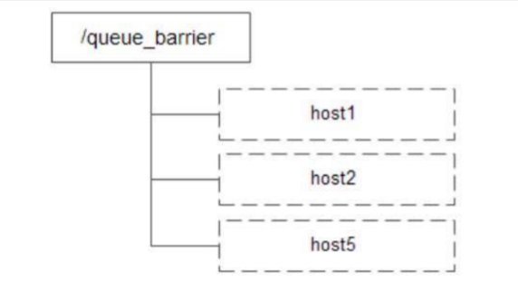

创建完节点后，按照如下步骤执行。
1. 通过调用getData接口获取/queue_barrier节点的数据内容:10。
2. 通过调用getChildren接口获取/queue_barrier节点下的所有子节点，同时注册对子节点变更的
Watcher监听。
3. 统计子节点的个数。
4. 如果子节点个数还不足10个，那么需要等待。
5. 接受到Wacher通知后，重复步骤2


# Zookeeper深入进阶

## 5.1 ZAB协议 概念

在深入了解zookeeper之前，很多同学可能会认为zookeeper就是paxos算法的一个实现，但事实上， **zookeeper并没有完全采用paxos算法**，而是使用了一种称为**Zookeeper Atomic Broadcast(ZAB， Zookeeper原子消息广播协议)**的协议作为其数据一致性的核心算法。
ZAB协议并不像Paxos算法那样 是一种通用的分布式一致性算法，它是一种特别为zookeeper专⻔设计 的**一种支持崩溃恢复的原子广播协议**

在zookeeper中，主要就是依赖ZAB协议来实现分布式数据的一致性，基于该协议，Zookeeper实现了 一种主备模式的系统架构来保持集群中各副本之间的数据的一致性，表现形式就是 使用一个单一的主进 程来接收并处理客户端的所有事务请求，并采用ZAB的原子广播协议，将服务器数据的状态变更以事务 Proposal的形式广播到所有的副本进程中，ZAB协议的主备模型架构保证了同一时刻集群中只能够有一 个主进程来广播服务器的状态变更，因此能够很好地处理客户端大量的并发请求。但是，也要考虑到主 进程在任何时候都有可能出现崩溃退出或重启现象，因此,ZAB协议还需要做到当前主进程当出现上述异 常情况的时候，依旧能正常工作。

### ZAB核心 

ZAB协议的核心是定义了对于那些会改变Zookeeper服务器数据状态的事务请求的处理方式


即:所有事务请求必须由一个全局唯一的服务器来协调处理，这样的服务器被称为Leader服务器，余下的 服务器则称为Follower服务器，Leader服务器负责将一个客户端事务请求转化成一个事务Proposal(提议)，并将该Proposal分发给集群中所有的Follower服务器，之后Leader服务器需要等待所有 Follower服务器的反馈，一旦超过半数的Follower服务器进行了正确的反馈后，那么Leader就会再次向所有的Follower服务器分发Commit消息，要求其将前一个Proposal进行提交


### ZAB协议介绍 

ZAB协议包括两种基本的模式：**崩溃恢复**和**消息广播**

进入崩溃恢复模式:

当整个服务框架启动过程中，或者是Leader服务器出现网络中断、崩溃退出或重启等异常情况时，ZAB 协议就会进入崩溃恢复模式，同时选举产生新的Leader服务器。当选举产生了新的Leader服务器，同时集群中已经有过半的机器与该Leader服务器完成了状态同步之后，ZAB协议就会退出恢复模式，其 中，所谓的状态同步 就是指数据同步，用来保证集群中过半的机器能够和Leader服务器的数据状态保持一致

进入消息广播模式:

当集群中已经有过半的Follower服务器完成了和Leader服务器的状态同步，那么整个服务框架就可以进 入消息广播模式，当一台同样遵守ZAB协议的服务器启动后加入到集群中，如果此时集群中已经存在一 个Leader服务器在负责进行消息广播，那么加入的服务器就会自觉地进入**数据恢复模式：找到Leader 所在的服务器，并与其进行数据同步，然后一起参与到消息广播流程中去。**Zookeeper只允许唯一的一个Leader服务器来进行事务请求的处理，Leader服务器在接收到客户端的事务请求后，会生成对应的 事务提议并发起一轮广播协议，而如果集群中的其他机器收到客户端的事务请求后，那么这些非Leader 服务器会首先将这个事务请求转发给Leader服务器。

接下来我们就重点讲解一下ZAB协议的消息广播过程和崩溃恢复过程  

### 1 消息广播

- ZXID
- FIFO策略

ZAB协议的消息广播过程使用原子广播协议，类似于一个二阶段提交过程，针对客户端的事务请求， Leader服务器会为其生成对应的事务Proposal，并将其发送给集群中其余所有的机器，然后再分别收集各自的选票，最后进行事务提交。

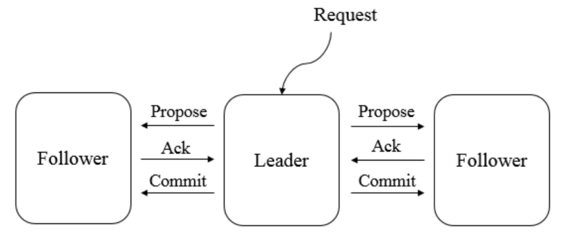

**在ZAB的二阶段提交过程中，移除了中断逻辑**，所有的Follower服务器要么正常反馈Leader提出的事务 Proposal，要么就抛弃Leader服务器，同时，ZAB协议将二阶段提交中的中断逻辑移除意味着我们可以 **在过半的Follower服务器已经反馈Ack之后就开始提交事务Proposal了**，而不需要等待集群中所有的 Follower服务器都反馈响应，但是，在这种简化的二阶段提交模型下，**无法处理因Leader服务器崩溃退出而带来的数据不一致问题**，因此ZAB采用了崩溃恢复模式来解决此问题，另外，整个消息广播协议是 **基于具有FIFO特性的TCP协议来进行网络通信**的，因此能够很容易保证消息广播过程中消息接受与发送 的顺序性。

#### ZXID

在整个消息广播过程中，Leader服务器会为每个事务请求生成对应的Proposal来进行广播，并且在广播 事务Proposal之前，Leader服务器会首先为这个事务Proposal分配一个全局单调递增的唯一ID，称之 为**事务ID（ZXID）**，由于ZAB协议需要保证每个消息严格的因果关系，因此必须将**每个事务Proposal按照其ZXID的先后顺序来进行排序和处理**。

具体的过程：在消息广播过程中，**Leader服务器会为每一个Follower服务器都各自分配一个单独的队列**，然后将需要广播的事务 Proposal 依次放入这些队列中去，并且根据 FIFO策略进行消息发送。每一个Follower服务器在接收到这个事务Proposal之后，都会首先将其以事务日志的形式写入到本地磁盘中 去，并且在成功写入后反馈给Leader服务器一个Ack响应。当Leader服务器接收到超过半数Follower的 Ack响应后，就会广播一个Commit消息给所有的Follower服务器以通知其进行事务提交，同时Leader 自身也会完成对事务的提交，而每一个Follower服务器在接收到Commit消息后，也会完成对事务的提交。

### 2 崩溃恢复

ZAB协议的这个基于原子广播协议的消息广播过程，在正常情况下运行非常良好，但是一旦在Leader服务器出现崩溃，或者由于网络原因导致Leader服务器失去了与过半Follower的联系，那么就会进入崩溃恢复模式。在ZAB协议中，为了保证程序的正确运行，整个恢复过程结束后需要选举出一个新的Leader 服务器，因此，ZAB协议需要一个高效且可靠的Leader选举算法，从而保证能够快速地选举出新的 Leader，同时，Leader选举算法不仅仅需要让Leader自身知道已经被选举为Leader，同时还需要让集 群中的所有其他机器也能够快速地感知到选举产生出来的新Leader服务器。


### 基本特性

根据上面的内容，我们了解到，ZAB协议规定了如果一个事务Proposal在一台机器上被处理成功，那么 应该在所有的机器上都被处理成功，哪怕机器出现故障崩溃。接下来我们看看在崩溃恢复过程中，可能 会出现的两个数据不一致性的隐患及针对这些情况ZAB协议所需要保证的特性。

#### 特性1

- **ZAB协议需要确保那些已经在Leader服务器上提交的事务最终被所有服务器都提交**

假设一个事务在 Leader 服务器上被提交了，并且已经得到过半 Folower 服务器的Ack反馈，但是在它将Commit消息发送给所有Follower机器之前，Leader服务器挂了，如图所示


图中的消息C2就是一个典型的例子:在集群正常运行过程中的某一个时刻，Server1 是 Leader 服务 器，其先后广播了消息 P1、P2、C1、P3 和 C2，其中，当Leader服务器将消息**C2(C2是Commit Of Proposal2的缩写，即提交事务Proposal2, P2)**发出后就立即崩溃退出了。针对这种情况，ZAB协议就需要 确保事务Proposal2最终能够在所有的服务器上都被提交成功，否则将出现不一致。

#### 特性2

-  **ZAB协议需要确保丢弃那些只在Leader服务器上被提出的事务**

如果在崩溃恢复过程中出现一个需要被丢弃的提案，那么在崩溃恢复结束后需要跳过该事务Proposal， 如图所示。


在图所示的集群中，假设初始的 Leader 服务器 Server1 在提出了一个事务Proposal3 之后就崩溃退出 了，从而导致集群中的其他服务器都没有收到这个事务Proposal3。于是，当 Server1 恢复过来再次加 入到集群中的时候，ZAB 协议需要确保丢弃Proposal3这个事务。

结合上面提到的这两个崩溃恢复过程中需要处理的特殊情况，就决定了 ZAB 协议必须设计这样一个 Leader 选举算法:能够确保提交已经被 Leader 提交的事务 Proposal，同时丢弃已经被跳过的事务 Proposal。针对这个要求，如果让Leader选举算法能够保证新**选举出来的Leader服务器拥有集群中所有机器最高编号**（即**ZXID最大**）的事务Proposal，那么就可以保证这个新选举出来的Leader一定具有 所有已经提交的提案。更为重要的是，如果让具有最高编号事务Proposal 的机器来成为 Leader，就**可以省去 Leader 服务器检查Proposal的提交和丢弃工作**的这一步操作了。

### 数据同步

完成Leader选举之后，在正式开始工作(即接收客户端的事务请求，然后提出新的提案)之前， Leader服务器会首先确认事务日志中的所有Proposal是否都已经被集群中过半的机器提交了，即是否完 成数据同步。下面我们就来看看ZAB协议的数据同步过程。

所有正常运行的服务器，要么成为 Leader，要么成为 Follower 并和 Leader 保持同步。Leader服务器 需要确保所有的Follower服务器能够接收到每一条事务Proposal，并且能够正确地将所有已经提交了的 事务Proposal应用到内存数据库中去。具体的，Leader服务器会为每一个Follower服务器都准备一个队 列，并将那些没有被各Follower服务器同步的事务以Proposal消息的形式逐个发送给Follower服务器， 并在每一个Proposal消息后面紧接着再发送一个Commit消息，以表示该事务已经被提交。等到 Follower服务器将所有其尚未同步的事务 Proposal 都从 Leader 服务器上同步过来并成功应用到本地数 据库中后，Leader服务器就会将该Follower服务器加入到真正的可用Follower列表中，并开始之后的其 他流程。

### 运行时状态分析

在ZAB协议的设计中，每个进程都有可能处于如下三种状态之一

- LOOKING:Leader选举阶段。
- FOLLOWING:Follower服务器和Leader服务器保持同步状态。  
- LEADING:Leader服务器作为主进程领导状态。

  所有进程初始状态都是LOOKING状态，此时不存在Leader，接下来，进程会试图选举出一个新的 Leader，之后，如果进程发现已经选举出新的Leader了，那么它就会切换到FOLLOWING状态，并开始 和Leader保持同步，处于FOLLOWING状态的进程称为Follower，LEADING状态的进程称为Leader，当 Leader崩溃或放弃领导地位时，其余的Follower进程就会转换到LOOKING状态开始新一轮的Leader选 举。
  一个Follower只能和一个Leader保持同步，Leader进程和所有的Follower进程之间都通过心跳检测 机制来感知彼此的情况。若Leader能够在超时时间内正常收到心跳检测，那么Follower就会一直与该 Leader保持连接，而如果在指定时间内Leader无法从过半的Follower进程那里接收到心跳检测，或者 TCP连接断开，那么Leader会放弃当前周期的领导，并转换到LOOKING状态，其他的Follower也会选择 放弃这个Leader，同时转换到LOOKING状态，之后会进行新一轮的Leader选举

### ZAB与Paxos的联系和区别

#### 联系:

  1 都存在一个类似于Leader进程的⻆色，由其负责协调多个Follower进程的运行。
  2 Leader进程都会等待超过半数的Follower做出正确的反馈后，才会将一个提议进行提交。
  3 在ZAB协议中，每个Proposal中都包含了一个epoch（时代、世）值，用来代表当前的Leader周期，在Paxos 算法中，同样存在这样的一个标识，名字为Ballot（选票）。

####   区别:

​       Paxos算法中，新选举产生的主进程会进行两个阶段的工作，第一阶段称为读阶段，新的主进程和 其他进程通信来收集主进程提出的提议，并将它们提交。第二阶段称为写阶段，当前主进程开始提出自 己的提议。

​      ZAB协议在Paxos基础上添加了同步阶段，此时，新的Leader会确保 存在过半的Follower已经提交了之前的Leader周期中的所有事务Proposal。这一同步阶段的引入，能够有效地保证Leader在新的周期中提出事务Proposal之前，所有的进 程都已经完成了对之前所有事务Proposal的提交。

​      总的来说，ZAB协议和Paxos算法的本质区别在于，两者的**设计目标不太一样**，**ZAB协议主要用于 构建一个高可用的分布式数据主备系统，而Paxos算法则用于构建一个分布式的一致性状态机系统**

## 5.2 服务器⻆色 

### Leader

Leader服务器是Zookeeper集群工作的核心，其主要工作有以下两个:   
(1) 事务请求的唯一调度和处理者，保证集群事务处理的顺序性。   
(2) 集群内部各服务器的调度者。

1.请求处理链   
使用责任链来处理每个客户端的请求是Zookeeper的特色，Leader服务器的请求处理链如下:

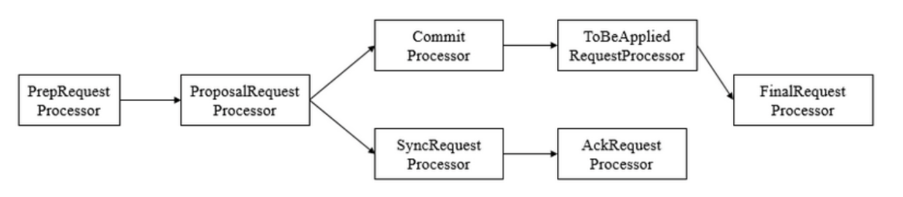

可以看到，从`prepRequestProcessor`到`FinalRequestProcessor`前后一共7个请求处理器组成了leader 服务器的请求处理链

(1) `PrepRequestProcessor`。请求预处理器，也是leader服务器中的第一个请求处理器。在Zookeeper 中，**那些会改变服务器状态的请求称为事务请求(创建节点、更新数据、删除节点、创建会话等)**， PrepRequestProcessor能够识别出当前客户端请求是否是事务请求。对于事务请求， PrepRequestProcessor处理器会对其进行一系列预处理，如创建请求事务头、事务体、会话检查、ACL 检查和版本检查等。

  (2) **`ProposalRequestProcessor`。事务投票处理器**。也是Leader服务器事务处理流程的发起者，对 于非事务性请求，ProposalRequestProcessor会直接将请求转发到CommitProcessor处理器，不再做 任何处理，而对于事务性请求，处理将请求转发到CommitProcessor外，还会根据请求类型创建对应的 Proposal提议，并发送给所有的Follower服务器来发起一次集群内的事务投票。同时， ProposalRequestProcessor还会将事务请求交付给SyncRequestProcessor进行事务日志的记录。

  (3) `SyncRequestProcessor`。事务日志记录处理器。用来将事务请求记录到事务日志文件中，同时 会触发Zookeeper进行数据快照。

  (4) `AckRequestProcessor`。负责在SyncRequestProcessor完成事务日志记录后，向Proposal的投票收集器发送ACK反馈，以通知投票收集器当前服务器已经完成了对该Proposal的事务日志记录。

  (5) `CommitProcessor`。事务提交处理器。对于非事务请求，该处理器会直接将其交付给下一级处 理器处理;对于事务请求，其会等待集群内 针对Proposal的投票直到该Proposal可被提交，利用 CommitProcessor，每个服务器都可以很好地控制对事务请求的顺序处理。

  (6) `ToBeCommitProcessor`。该处理器有一个toBeApplied队列，用来存储那些已经被 CommitProcessor处理过的可被提交的Proposal。其会将这些请求交付给FinalRequestProcessor处理 器处理，待其处理完后，再将其从toBeApplied队列中移除。

  (7) `FinalRequestProcessor`。用来进行客户端请求返回之前的操作，包括创建客户端请求的响应， 针对事务请求，该处理器还会负责将事务应用到内存数据库中。

### Follower

Follower服务器是Zookeeper集群状态中的跟随者，其主要工作有以下三个:

  (1) 处理客户端非事务性请求(读取数据)，转发事务请求给Leader服务器。
  (2) 参与事务请求Proposal的投票。
  (3) 参与Leader选举投票。

  和leader一样，Follower也采用了责任链模式组装的请求处理链来处理每一个客户端请求，由于不 需要对事务请求的投票处理，因此Follower的请求处理链会相对简单，其处理链如下

- 上面的流程是非事务请求的处理，直接通过commitProcessor处理
- 下面的流程是事务请求的处理，将状态同步之后，发送ack

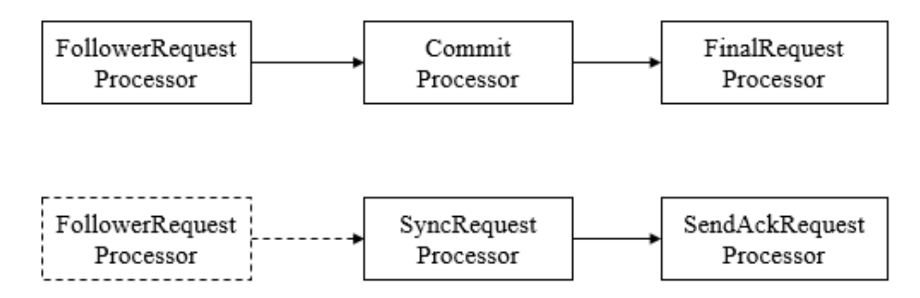

和 Leader 服务器的请求处理链最大的不同点在于，Follower 服务器的第一个处理器换成了 FollowerRequestProcessor处理器，同时由于不需要处理事务请求的投票，因此也没有了 ProposalRequestProcessor处理器。

 **(1) FollowerRequestProcessor** 
其用作识别当前请求是否是事务请求，若是，那么Follower就会将该请求转发给Leader服务器，Leader服务器在接收到这个事务请求后，就会将其提交到请求处理链，按照正常事务请求进行处理。   

**(2) SendAckRequestProcessor**
其承担了事务日志记录反馈的⻆色，在完成事务日志记录后，会向Leader服务器发送ACK消息以表明自 身完成了事务日志的记录工作

### Observer

**Observer是ZooKeeper自3.3.0版本开始引入的一个全新的服务器⻆色**。从字面意思看，该服务器充当 了一个观察者的⻆色——其观察ZooKeeper集群的最新状态变化并将这些状态变更同步过来。 Observer服务器在工作原理上和Follower基本是一致的，对于非事务请求，都可以进行独立的处理，而 对于事务请求，则会转发给Leader服务器进行处理。和Follower唯一的区别在于，**Observer不参与任何形式的投票**，包括事务请求Proposal的投票和Leader选举投票。简单地讲，**Observer服务器只提供非事务服务**，通常用于**在不影响集群事务处理能力的前提下提升集群的非事务处理能力**。
另外，Observer的请求处理链路和Follower服务器也非常相近，其处理链如下

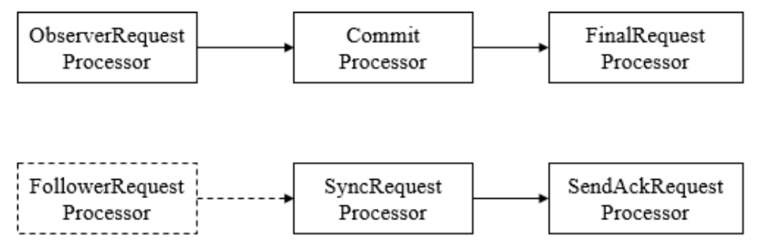

另外需要注意的一点是，虽然在图中可以看到，Observer 服务器在初始化阶段会将 SyncRequestProcessor处理器也组装上去，但是在实际运行过程中，Leader服务器不会将事务请求的 投票发送给Observer服务器。

## 5.3 服务器启动 

服务端整体架构图


Zookeeper服务器的启动，大致可以分为以下五个步骤


  1. 配置文件解析
  2. 初始化数据管理器
        3. 初始化网络I/O管理器  
            4. 数据恢复
                5. 对外服务

### 单机版服务器启动

单机版服务器的启动其流程图如下

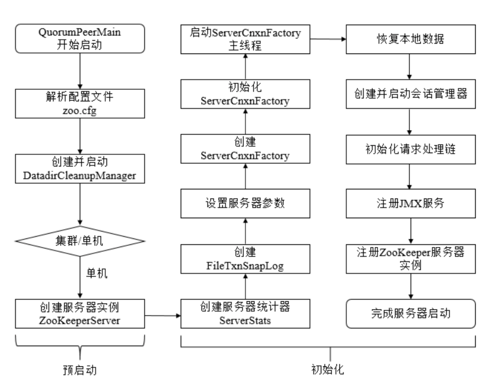

上图的过程可以分为预启动和初始化过程。

### 1. 预启动

  1. 统一由QuorumPeerMain作为启动类。无论单机或集群，在zkServer.cmd和zkServer.sh 中都配置了QuorumPeerMain作为启动入口类。
 2. 解析配置文件zoo.cfg。zoo.cfg配置运行时的基本参数，如tickTime、dataDir、 clientPort等参数。
 3. 创建并启动历史文件清理器DatadirCleanupManager。对事务日志和快照数据文件进行定 时清理。
 4. 判断当前是集群模式还是单机模式启动。若是单机模式，则委托给ZooKeeperServerMain进 行启动。
 5. 再次进行配置文件zoo.cfg的解析。
 6. 创建服务器实例ZooKeeperServer。Zookeeper服务器首先会进行服务器实例的创建，然后 对该服务器实例进行初始化，包括连接器、内存数据库、请求处理器等组件的初始化。

### 2. 初始化

1. 创建服务器统计器ServerStats。ServerStats是Zookeeper服务器运行时的统计器。
2. 创建Zookeeper**数据管理器FileTxnSnapLog**。FileTxnSnapLog是Zookeeper上层服务 器和底层数据存储之间的对接层，提供了一系列操作数据文件的接口，如事务日志文件和快照数据文件。 Zookeeper根据zoo.cfg文件中解析出的快照数据目录dataDir和事务日志目录dataLogDir来创建 FileTxnSnapLog。
3. 设置服务器tickTime和会话超时时间限制。
4. 创建ServerCnxnFactory。通过配置系统属性zookeper.serverCnxnFactory来指定使 用Zookeeper自己实现的NIO还是使用Netty框架作为Zookeeper服务端网络连接工厂。
5. 初始化ServerCnxnFactory。Zookeeper会初始化Thread作为ServerCnxnFactory的主 线程，然后再初始化NIO服务器。
6. 启动ServerCnxnFactory主线程。进入Thread的run方法，此时服务端还不能处理客户端 请求。
7. 恢复本地数据。启动时，需要从本地快照数据文件和事务日志文件进行数据恢复。
8. 创建并启动会话管理器。Zookeeper会创建会话管理器SessionTracker进行会话管理。
9. 初始化Zookeeper的请求处理链。Zookeeper请求处理方式为责任链模式的实现。会有多个 请求处理器依次处理一个客户端请求，在服务器启动时，会将这些请求处理器串联成一个请求处理链。     
10. 注册JMX服务。Zookeeper会将服务器运行时的一些信息以JMX的方式暴露给外部。    
11. 注册Zookeeper服务器实例。将Zookeeper服务器实例注册给ServerCnxnFactory，之后Zookeeper就可以对外提供服务。

 至此，单机版的Zookeeper服务器启动完毕。

### 集群服务器启动

单机和集群服务器的启动在很多地方是一致的，其流程图如下:

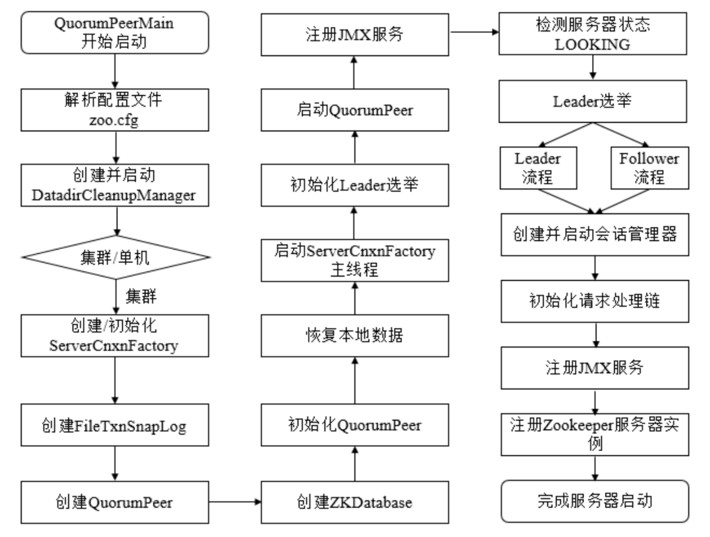

上图的过程可以分为预启动、初始化、Leader选举、Leader与Follower启动期交互、Leader与 Follower启动等过程
#### 1 预启动


1. 统一由QuorumPeerMain作为启动类。
2. 解析配置文件zoo.cfg。
3. 创建并启动历史文件清理器DatadirCleanupFactory。
4. 判断当前是集群模式还是单机模式的启动。在集群模式中，在zoo.cfg文件中配置了多个服务器 地址，可以选择集群启动。

#### 2 初始化


1. 创建ServerCnxnFactory。
2. 初始化ServerCnxnFactory。
3. 创建Zookeeper数据管理器FileTxnSnapLog。
4. 创建**QuorumPeer实例**。Quorum是集群模式下特有的对象，是Zookeeper服务器实例 (ZooKeeperServer)的托管者，QuorumPeer代表了集群中的一台机器，在运行期间， QuorumPeer会不断检测当前服务器实例的运行状态，同时根据情况发起Leader选举。
5. 创建内存数据库ZKDatabase。ZKDatabase负责管理ZooKeeper的所有会话记录以及 DataTree和事务日志的存储。
6. 初始化QuorumPeer。将核心组件如FileTxnSnapLog、ServerCnxnFactory、ZKDatabase 注册到QuorumPeer中，同时配置QuorumPeer的参数，如服务器列表地址、Leader选举算法和会话 超时时间限制等。
7. 恢复本地数据。
8. 启动ServerCnxnFactory主线程

#### 3. Leader选举


1. 初始化Leader选举。
集群模式特有，Zookeeper首先会根据自身的服务器`ID(SID)`、最新的 `ZXID(lastLoggedZxid)`和当前的服务器`epoch(currentEpoch)`来生成一个初始化投票，在初始化过程中，每个服务器都会给自己投票。然后，根据zoo.cfg的配置，创建相应Leader选举算法 实现，Zookeeper提供了三种默认算法（`LeaderElection、AuthFastLeaderElection、 FastLeaderElection`），可通过zoo.cfg中的`electionAlg`属性来指定，但现只支持 `FastLeaderElection`选举算法。在初始化阶段，Zookeeper会创建Leader选举所需的网络I/O层 **`QuorumCnxManager`**，同时启动对Leader选举端口的监听，等待集群中其他服务器创建连接。
2. 注册JMX服务。
3. 检测当前服务器状态
运行期间，QuorumPeer会不断检测当前服务器状态。在正常情况下，Zookeeper服务器的状态 在LOOKING、LEADING、FOLLOWING/OBSERVING之间进行切换。在启动阶段，QuorumPeer的初始 状态是LOOKING，因此开始进行Leader选举。
4. Leader选举
ZooKeeper的Leader选举过程，简单地讲，就是一个集群中所有的机器相互之间进行一系列投 票，选举产生最合适的机器成为Leader，同时其余机器成为Follower或是Observer的集群机器⻆ 色初始化过程。关于Leader选举算法，简而言之，就是集群中哪个机器处理的数据越新(通常我们根 据每个服务器处理过的最大ZXID来比较确定其数据是否更新)，其越有可能成为Leader。当然，如 果集群中的所有机器处理的ZXID一致的话，那么SID最大的服务器成为Leader，其余机器称为 Follower和Observer

#### 4. Leader和Follower启动期交互过程

到这里为止，ZooKeeper已经完成了Leader选举，并且集群中每个服务器都已经确定了自己的⻆色—— 通常情况下就分为 Leader 和 Follower 两种⻆色。下面我们来对 Leader和Follower在启动期间的交互 进行介绍，其大致交互流程如图所示。

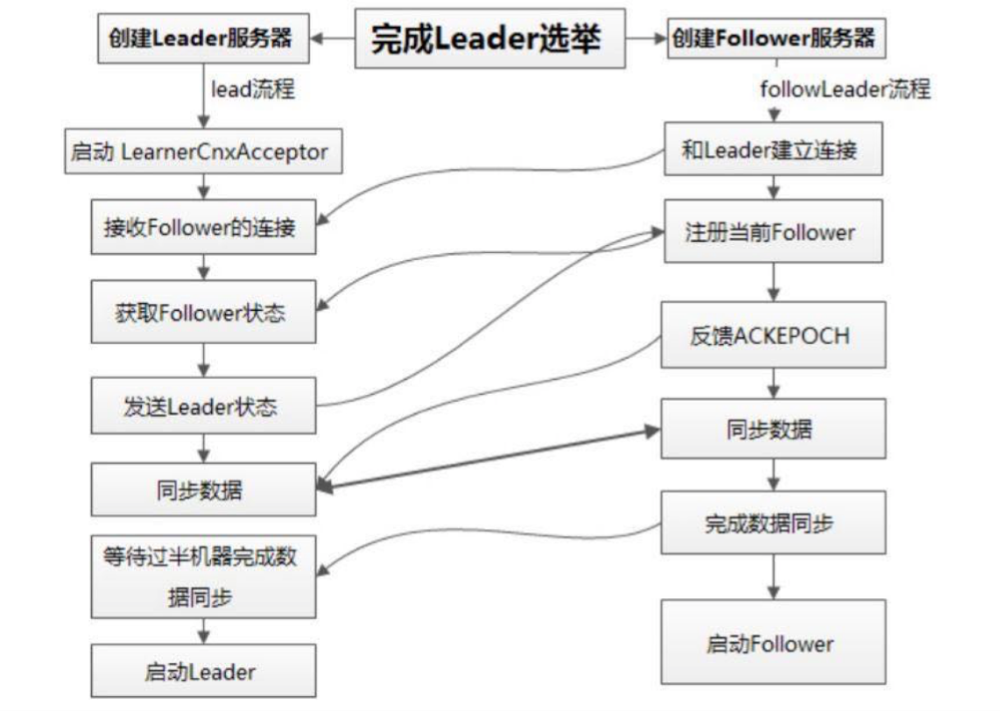

1. 创建Leader服务器和Follower服务器。完成Leader选举后，每个服务器会根据自己服务器的⻆色 创建相应的服务器实例，并进入各自⻆色的主流程。
2. Leader服务器启动Follower接收器LearnerCnxAcceptor。运行期间，Leader服务器需要和所有其 余的服务器(统称为Learner)保持连接以确集群的机器存活情况，LearnerCnxAcceptor负责接 收所有非Leader服务器的连接请求。
3. Learner服务器开始和Leader建立连接。所有Learner会找到Leader服务器，并与其建立连接。
4. Leader服务器创建LearnerHandler。Leader接收到来自其他机器连接创建请求后，会创建一个
LearnerHandler实例，每个LearnerHandler实例都对应一个Leader与Learner服务器之间的连
接，其负责Leader和Learner服务器之间几乎所有的消息通信和数据同步。
5. 向Leader注册。Learner完成和Leader的连接后，会向Leader进行注册，即将Learner服务器的基
本信息(LearnerInfo)，包括SID和ZXID，发送给Leader服务器。
6. Leader解析Learner信息，计算新的epoch。Leader接收到Learner服务器基本信息后，会解析出
该Learner的SID和ZXID，然后根据ZXID解析出对应的epoch_of_learner，并和当前Leader服务器 的epoch_of_leader进行比较，如果该Learner的epoch_of_learner更大，则更新Leader的 epoch_of_leader = epoch_of_learner + 1。然后LearnHandler进行等待，直到过半Learner已经 向Leader进行了注册，同时更新了epoch_of_leader后，Leader就可以确定当前集群的epoch了。
7. 发送Leader状态。计算出新的epoch后，Leader会将该信息以一个LEADERINFO消息的形式发送 给Learner，并等待Learner的响应。
8. Learner发送ACK消息。Learner接收到LEADERINFO后，会解析出epoch和ZXID，然后向Leader 反馈一个ACKEPOCH响应。
9. 数据同步。Leader收到Learner的ACKEPOCH后，即可进行数据同步。
10. 启动Leader和Learner服务器。当有过半Learner已经完成了数据同步，那么Leader和Learner服
务器实例就可以启动了

#### 5 Leader和Follower启动

1. 创建启动会话管理器。
2. 初始化Zookeeper请求处理链，集群模式的每个处理器也会在启动阶段串联请求处理链。 
3. 注册JMX服务。

 至此，集群版的Zookeeper服务器启动完毕

## 5.4 leader选举

### 投票规则

>  针对每一个投票，服务器都需要将别人的投票和自己的投票进行PK，PK规则如下      
>
> - **优先检查ZXID**。ZXID比较大的服务器优先作为Leader。
> - **如果ZXID相同，那么就比较myid**。myid较大的服务器作为Leader服务器。

Leader选举概述 

Leader选举是zookeeper最重要的技术之一，也是保证分布式数据一致性的关键所在。 

当Zookeeper集群中的一台服务器出现以下两种情况之一时，需要进入Leader选举。   

(1) 服务器初始化启动。
(2) 服务器运行期间无法和Leader保持连接。

下面就两种情况进行分析讲解。

### 服务器启动时期的Leader选举

若进行Leader选举，则至少需要两台机器，这里选取3台机器组成的服务器集群为例。在集群初始化阶 段，当有一台服务器Server1启动时，其单独无法进行和完成Leader选举，当第二台服务器Server2启动 时，此时两台机器可以相互通信，每台机器都试图找到Leader，于是进入Leader选举过程。选举过程 如下

**(1) 每个Server发出一个投票**

由于是初始情况，Server1(假设myid为1)和Server2假设myid为2)都会将自己作为Leader服务器来 进行投票，每次投票会包含所推举的服务器的myid和ZXID，使用(myid, ZXID)来表示，此时Server1的 投票为(1, 0)，Server2的投票为(2, 0)，然后各自将这个投票发给集群中其他机器

**(2) 接受来自各个服务器的投票**

 集群的每个服务器收到投票后，首先判断该投票的有效性，如检查是否是本轮投票、是否来自
LOOKING状态的服务器。

**(3) 处理投票**

 针对每一个投票，服务器都需要将别人的投票和自己的投票进行PK，PK规则如下      

- **优先检查ZXID**。ZXID比较大的服务器优先作为Leader。
- **如果ZXID相同，那么就比较myid**。myid较大的服务器作为Leader服务器。

   现在我们来看Server1和Server2实际是如何进行投票处理的。对于Server1来说，它自己的投票是 (1，0)，而接收到的投票为(2，0)。首先会对比两者的ZXID，因为都是0，所以无法决定谁是 Leader。接下来会对比两者的myid，很显然，Server1发现接收到的投票中的myid是2，大于自己，于 是就会更新自己的投票为(2，0)，然后重新将投票发出去。而对于Server2来说，不需要更新自己的 投票


**(4) 统计投票**

每次投票后，服务器都会统计所有投票，判断是否已经有过半的机器接收到相同的投票信息。对于 Server1和Server2服务器来说，都统计出集群中已经有两台机器接受了(2，0)这个投票信息。这里我 们需要对“过半”的概念做一个简单的介绍。所谓“过半”就是指大于集群机器数量的一半，即大于或等于 (n/2+1)。对于这里由3台机器构成的集群，大于等于2台即为达到“过半”要求。

那么，当Server1和Server2都收到相同的投票信息(2，0)的时候，即认为已经选出了Leader。


 **(5) 改变服务器状态**

一旦确定了 Leader，每个服务器就会更新自己的状态:如果是 Follower，那么就变更为 FOLLOWING，如果是Leader，那么就变更为LEADING。

### 服务器运行时期的Leader选举

在ZooKeeper集群正常运行过程中，一旦选出一个Leader，那么所有服务器的集群⻆色一般不会再发生 变化——也就是说，Leader服务器将一直作为集群的Leader，即使集群中有非Leader机器挂了或是有 新机器加入集群也不会影响Leader。但是一旦Leader所在的机器挂了，那么整个集群将暂时无法对外 服务，而是进入新一轮的Leader选举。服务器运行期间的Leader选举和启动时期的Leader选举基本过 程是一致的。
我们还是假设当前正在运行的 ZooKeeper 机器由 3 台机器组成，分别是 Server1、Server2和 Server3，当前的Leader是Server2。假设在某一个瞬间，Leader挂了，这个时候便开始了Leader选 举。

 (1) 变更状态 Leader挂后，余下的非Observer服务器都会将自己的服务器状态变更为LOOKING，然后开始进入
Leader选举过程。
  (2) 每个Server会发出一个投票
在运行期间，每个服务器上的ZXID可能不同，此时假定Server1的ZXID为123，Server3的ZXID为122; 在第一轮投票中，Server1和Server3都会投自己，产生投票(1, 123)，(3, 122)，然后各自将投票发送给 集群中所有机器。
  (3) 接收来自各个服务器的投票，与启动时过程相同
  (4) 处理投票。与启动时过程相同，此时，Server1将会成为Leader  
  (5) 统计投票。与启动时过程相同
  (6) 改变服务器的状态。与启动时过程相同