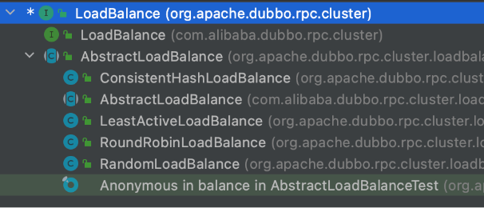

### org.apache.dubbo.config.ServiceConfig

```
public class ServiceConfig<T> extends ServiceConfigBase<T> {

}


+
+public abstract class ServiceConfigBase<T> extends AbstractServiceConfig {
    protected T ref;
}

```

### org.apache.dubbo.rpc.Protocol

```
/**
 * Protocol. (API/SPI, Singleton, ThreadSafe)
 */
@SPI("dubbo")
public interface Protocol {

    /**
     * Get default port when user doesn't config the port.
     *
     * @return default port
     */
    int getDefaultPort();

    /**
     * Export service for remote invocation: <br>
     * 1. Protocol should record request source address after receive a request:
     * RpcContext.getContext().setRemoteAddress();<br>
     * 2. export() must be idempotent, that is, there's no difference between invoking once and invoking twice when
     * export the same URL<br>
     * 3. Invoker instance is passed in by the framework, protocol needs not to care <br>
     *
     * @param <T>     Service type
     * @param invoker Service invoker
     * @return exporter reference for exported service, useful for unexport the service later
     * @throws RpcException thrown when error occurs during export the service, for example: port is occupied
     */
    @Adaptive
    <T> Exporter<T> export(Invoker<T> invoker) throws RpcException;

    /**
     * Refer a remote service: <br>
     * 1. When user calls `invoke()` method of `Invoker` object which's returned from `refer()` call, the protocol
     * needs to correspondingly execute `invoke()` method of `Invoker` object <br>
     * 2. It's protocol's responsibility to implement `Invoker` which's returned from `refer()`. Generally speaking,
     * protocol sends remote request in the `Invoker` implementation. <br>
     * 3. When there's check=false set in URL, the implementation must not throw exception but try to recover when
     * connection fails.
     *
     * @param <T>  Service type
     * @param type Service class
     * @param url  URL address for the remote service
     * @return invoker service's local proxy
     * @throws RpcException when there's any error while connecting to the service provider
     */
    @Adaptive
    <T> Invoker<T> refer(Class<T> type, URL url) throws RpcException;

    /**
     * Destroy protocol: <br>
     * 1. Cancel all services this protocol exports and refers <br>
     * 2. Release all occupied resources, for example: connection, port, etc. <br>
     * 3. Protocol can continue to export and refer new service even after it's destroyed.
     */
    void destroy();

    /**
     * Get all servers serving this protocol
     *
     * @return
     */
    default List<ProtocolServer> getServers() {
        return Collections.emptyList();
    }

}
```

### org.apache.dubbo.registry.Registry

```
/**
 * Registry. (SPI, Prototype, ThreadSafe)
 *
 * @see org.apache.dubbo.registry.RegistryFactory#getRegistry(URL)
 * @see org.apache.dubbo.registry.support.AbstractRegistry
 */
public interface Registry extends Node, RegistryService {
}
```


### org.apache.dubbo.rpc.Invoker

```
/**
 * Invoker. (API/SPI, Prototype, ThreadSafe)
 *
 * @see org.apache.dubbo.rpc.Protocol#refer(Class, org.apache.dubbo.common.URL)
 * @see org.apache.dubbo.rpc.InvokerListener
 * @see org.apache.dubbo.rpc.protocol.AbstractInvoker
 */
public interface Invoker<T> extends Node {

    /**
     * get service interface.
     *
     * @return service interface.
     */
    Class<T> getInterface();

    /**
     * invoke.
     *
     * @param invocation
     * @return result
     * @throws RpcException
     */
    Result invoke(Invocation invocation) throws RpcException;

}
```


url

```
dubbo://192.168.0.114:20880/org.apache.dubbo.demo.DemoService?anyhost=true&application=dubbo-demo-api-provider&bind.ip=192.168.0.114&bind.port=20880&default=true&deprecated=false&dubbo=2.0.2&dynamic=true&generic=false&interface=org.apache.dubbo.demo.DemoService&methods=sayHello,sayHelloAsync&pid=16459&release=&side=provider&timestamp=1630745698310


        Registry registry = registryFactory.getRegistry(registryUrl);

zookeeper://127.0.0.1:2181/org.apache.dubbo.registry.RegistryService?application=dubbo-demo-api-provider&dubbo=2.0.2&export=dubbo%3A%2F%2F192.168.0.114%3A20880%2Forg.apache.dubbo.demo.DemoService%3Fanyhost%3Dtrue%26application%3Ddubbo-demo-api-provider%26bind.ip%3D192.168.0.114%26bind.port%3D20880%26default%3Dtrue%26deprecated%3Dfalse%26dubbo%3D2.0.2%26dynamic%3Dtrue%26generic%3Dfalse%26interface%3Dorg.apache.dubbo.demo.DemoService%26methods%3DsayHello%2CsayHelloAsync%26pid%3D16459%26release%3D%26side%3Dprovider%26timestamp%3D1630745698310&pid=16459&timestamp=1630745698276


//org.apache.dubbo.registry.zookeeper.ZookeeperRegistry#doRegister
 public void doRegister(URL url) {
        try {
            // 进行创建地址
            zkClient.create(toUrlPath(url), url.getParameter(DYNAMIC_KEY, true));
        } catch (Throwable e) {
            throw new RpcException("Failed to register " + url + " to zookeeper " + getUrl() + ", cause: " + e.getMessage(), e);
        }
    }
//转换的url    
/dubbo/org.apache.dubbo.demo.DemoService/providers/dubbo%3A%2F%2F192.168.0.114%3A20880%2Forg.apache.dubbo.demo.DemoService%3Fanyhost%3Dtrue%26application%3Ddubbo-demo-api-provider%26default%3Dtrue%26deprecated%3Dfalse%26dubbo%3D2.0.2%26dynamic%3Dtrue%26generic%3Dfalse%26interface%3Dorg.apache.dubbo.demo.DemoService%26methods%3DsayHello%2CsayHelloAsync%26pid%3D16459%26release%3D%26side%3Dprovider%26timestamp%3D1630745698310
```


### org.apache.dubbo.common.utils.Holder

```java
//org.apache.dubbo.common.utils.Holder
/**
 * Helper Class for hold a value.
 */
public class Holder<T> {

    private volatile T value;

    public void set(T value) {
        this.value = value;
    }

    public T get() {
        return value;
    }

}
```


```java
public java.lang.String sayHello(org.apache.dubbo.common.URL arg0)  {
if (arg0 == null) throw new IllegalArgumentException("url == null");
org.apache.dubbo.common.URL url = arg0;
String extName = url.getParameter("hello.service", "dog");
if(extName == null) throw new IllegalStateException("Failed to get extension (com.shred.service.HelloService) name from url (" + url.toString() + ") use keys([hello.service])");
com.shred.service.HelloService extension = (com.shred.service.HelloService)ExtensionLoader.getExtensionLoader(com.shred.service.HelloService.class).getExtension(extName);
return extension.sayHello(arg0);
}
```


```java
package com.shred.service;
import org.apache.dubbo.common.extension.ExtensionLoader;
public class HelloService$Adaptive implements com.shred.service.HelloService {
public java.lang.String sayHello()  {
throw new UnsupportedOperationException("The method public abstract java.lang.String com.shred.service.HelloService.sayHello() of interface com.shred.service.HelloService is not adaptive method!");
}
public java.lang.String sayHello(org.apache.dubbo.common.URL arg0)  {
if (arg0 == null) throw new IllegalArgumentException("url == null");
org.apache.dubbo.common.URL url = arg0;
String extName = url.getParameter("hello.service", "dog");
if(extName == null) throw new IllegalStateException("Failed to get extension (com.shred.service.HelloService) name from url (" + url.toString() + ") use keys([hello.service])");
com.shred.service.HelloService extension = (com.shred.service.HelloService)ExtensionLoader.getExtensionLoader(com.shred.service.HelloService.class).getExtension(extName);
return extension.sayHello(arg0);
}
}
```


## Cluster


## Directory


## Router


## LoadBlance



## Invoker


