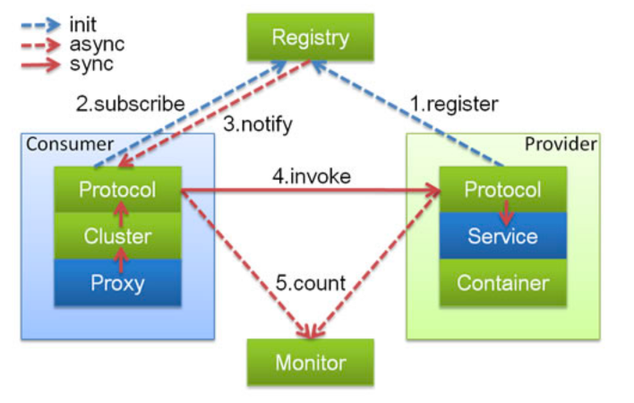
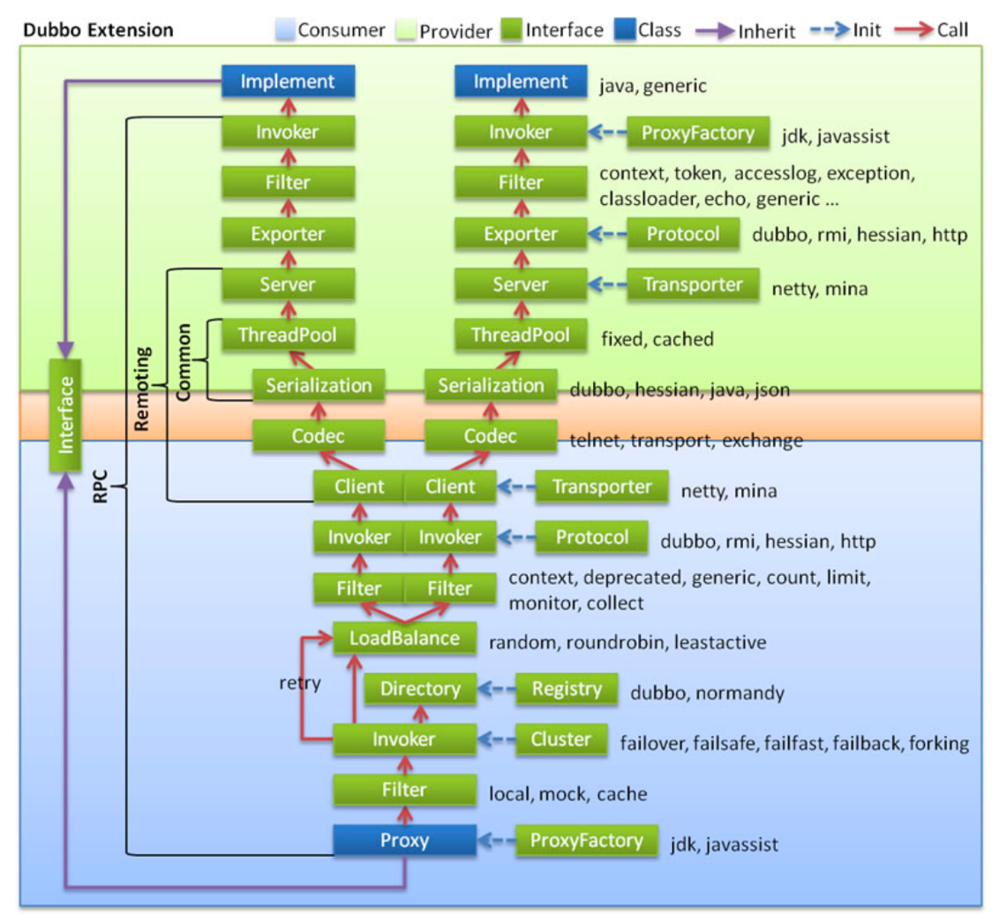
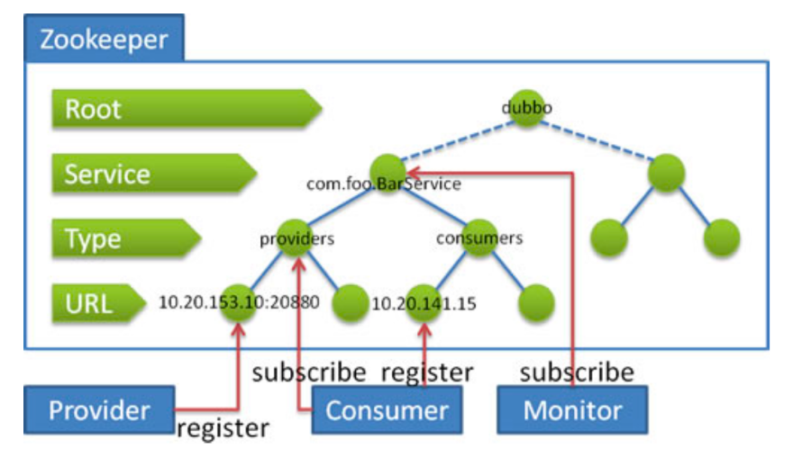
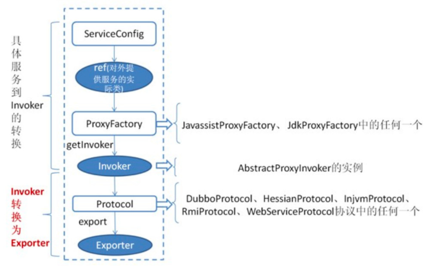
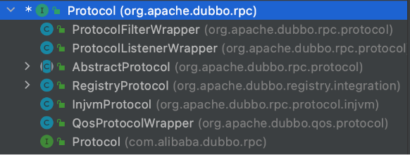
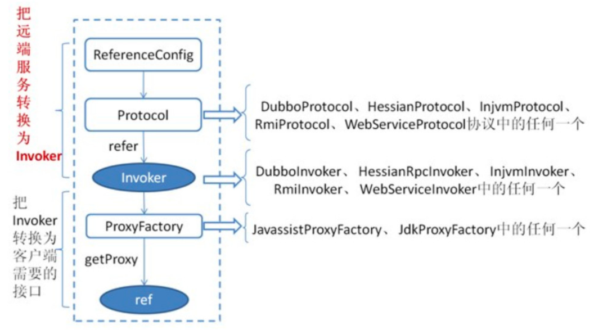
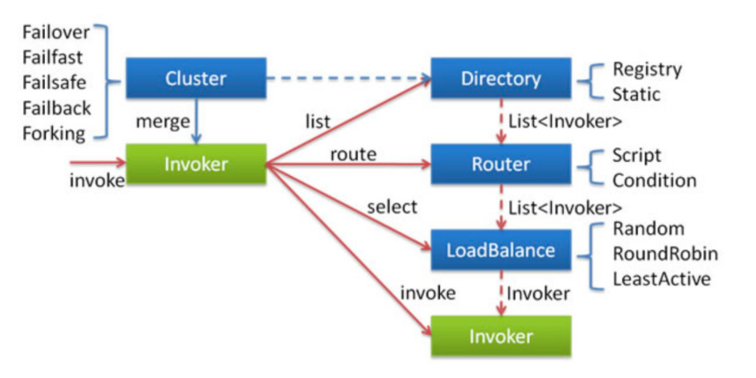
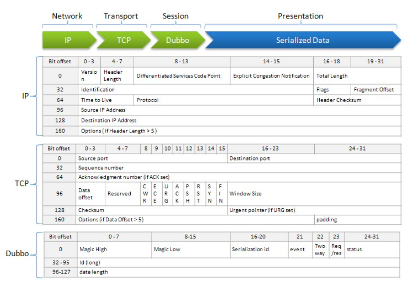

# Dubbo源码剖析 

# 1、源码下载和编译

源码下载、编译和导入步骤如下:
(1)dubbo的项目在github中的地址为: https://github.com/apache/dubbo 
(2)进入需要进行下载的地址，执行 git clone https://github.com/apache/dubbo.git 
(3)为了防止master中代码不稳定，进入dubbo项目 cd dubbo 可以切入到最近的release分支
(4)进行本地编译，进入dubbo项目 cd dubbo , 进行编译操作 mvn clean install -DskipTests 
(5)使用IDE引入项目。

# 2、架构整体设计

## 2.1 Dubbo调用关系说明



在这里主要由四部分组成:

- Provider: 暴露服务的服务提供方
  Protocol 负责提供者和消费者之间协议交互数据 
  Service 真实的业务服务信息 可以理解成接口 和 实现 
  Container Dubbo的运行环境
- Consumer: 调用远程服务的服务消费方
  Protocol 负责提供者和消费者之间协议交互数据
  Cluster 感知提供者端的列表信息
  Proxy 可以理解成 提供者的服务调用代理类 由它接管 Consumer中的接口调用逻辑
- Registry: 注册中心，用于作为服务发现和路由配置等工作，提供者和消费者都会在这里进行注册 
- Monitor: 用于提供者和消费者中的数据统计，比如调用频次，成功失败次数等信息。

**启动和执行流程说明:**

1. 提供者端启动 容器负责把Service信息加载 并通过Protocol 注册到注册中心
2. 消费者端启动 通过监听提供者列表来感知提供者信息 并在提供者发生改变时 通过注册中心及时 通知消费端
3. 消费方发起 请求 通过Proxy模块
4. 利用Cluster模块 来选择真实的要发送给的提供者信息 
5. 交由Consumer中的Protocol 把信息发送给提供者 
6. 提供者同样需要通过 Protocol 模块来处理消费者的信息 
7. 最后由真正的服务提供者 Service 来进行处理


## 2.2 整体的调用链路



说明 淡绿色代表了服务生产者的范围。淡蓝色；代表了服务消费者的范围 。红色箭头代表了调用的方向

- 业务逻辑层 
- RPC层(远程过程调用) 
- Remoting (远程数据传输) 

整体链路调用的流程:

1. 消费者通过Interface进行方法调用 统一交由消费者端的 Proxy 通过ProxyFactory 来进行代理 对象的创建 使用到了 jdk javassist技术
2. 交给Filter 这个模块 做一个统一的过滤请求 在SPI案例中涉及过 
3. 接下来会进入最主要的Invoker调用逻辑
   通过Directory 去配置中新读取信息 最终通过list方法获取所有的Invoker 通过Cluster模块 根据选择的具体路由规则 来选取Invoker列表 通过LoadBalance模块 根据负载均衡策略 选择一个具体的Invoker 来处理我们的请求 如果执行中出现错误 并且Consumer阶段配置了重试机制 则会重新尝试执行

4. 继续经过Filter 进行执行功能的前后封装 Invoker 选择具体的执行协议 5. 
5. 客户端 进行编码和序列化 然后发送数据
6. 到达Consumer中的 Server 在这里进行 反编码 和 反序列化的接收数据 7. 
7. 使用Exporter选择执行器
8. 交给Filter 进行一个提供者端的过滤 到达 Invoker 执行器 9. 
9. 通过Invoker 调用接口的具体实现 然后返回

## 2.3 Dubbo源码整体设计


图例说明:

- 图中左边淡蓝背景的为服务消费方使用的接口，右边淡绿色背景的为服务提供方使用的接口，位于
    中轴线上的为双方都用到的接口。
- 图中从下至上分为十层，各层均为单向依赖，右边的黑色箭头代表层之间的依赖关系，每一层都可 以剥离上层被复用，其中，Service 和 Config 层为 API，其它各层均为 SPI。
- 图中绿色小块的为扩展接口，蓝色小块为实现类，图中只显示用于关联各层的实现类。
- 图中蓝色虚线为初始化过程，即启动时组装链，红色实线为方法调用过程，即运行时调时链，紫色三角箭头为继承，可以把子类看作父类的同一个节点，线上的文字为调用的方法。

Dubbo源码整体设计与调用链路十分相似。只不过这里可以看到接口的一些具体实现以及左侧也 有更为详细的层次划分，我们在后面的源码解析时也会着重介绍其中比较重要的模块实现。

### 分层介绍:

### 1、**Business 业务逻辑层**

- service 业务层 包括我们的业务代码 比如 接口 实现类 直接面向开发者

 

### 2、**RPC层 远程过程调用层**

- config 配置层 对外提供配置 以`ServiceConfig`,  `ReferenceConfig` 为核心 可以直接初始化配置 类 也可以解析配置文件生成
- proxy 服务代理层 无论是生产者 还是消费者 框架都会产生一个代理类 整个过程对上层透明 就是 业务层对远程调用无感
- registry 注册中心层 封装服务地址的注册与发现 以服务的URL为中心
- cluster 路由层 (集群容错层) 提供了多个提供者的路由和负载均衡 并且它桥接注册中心 以Invoker为核心
- monitor 监控层 RPC调用相关的信息 如 调用次数 成功失败的情况 调用时间等 在这一层完成
- protocol 远程调用层 。封装RPC调用，无论是服务的暴露 ，还是服务的引用，都是在Protocol中，作为主功能入口，负责Invoker的整个生命周期 Dubbo中所有的模型都向Invoker靠拢


### 3、**Remoting层 远程数据传输层**

- exchange 信息交换层。封装请求和响应的模式，如把请求由同步 转换成异步
- transport 网络传输层。统一网络传输的接口，比如 netty 和 mina 统一为一个网络传输接口 
- serialize 数据序列化层。负责管理整个框架中的数据传输的序列化 和反序列化

分层统计：1、6、3


# 3、服务注册与消费源码剖析 

## 3.1 注册中心Zookeeper剖析

注册中心是Dubbo的重要组成部分，主要用于服务的注册与发现，我们可以选择Redis、Nacos、 Zookeeper作为Dubbo的注册中心，Dubbo推荐用户使用Zookeeper作为注册中心。

### 注册中心Zookeeper目录结构

我们使用一个最基本的服务的注册与消费的Demo来进行说明。 例如:只有一个提供者和消费者。 HelloService 为我们所提供的服务。

```java
public interface HelloService {
    String sayHello(String name);
}
```

则Zookeeper的目录结构如下：

``` 
+- dubbo
|  +- com.lagou.service.HelloService
|  |  +- consumers
|  |  |  +- consumer://192.168.1.102/com.lagou.service.HelloService?
application=dubbo-demo-annotation-
consumer&category=consumers&check=false&dubbo=2.0.2&init=false&interface=com.lag
ou.service.HelloService&methods=sayHello,sayHelloWithPrint,sayHelloWithTransmiss
ion,sayHelloWithException&pid=25923&release=2.7.5&side=consumer&sticky=false&tim
estamp=1583896043650
|  |  +- providers
|  |  |  +- dubbo://192.168.1.102:20880/com.lagou.service.HelloService?
anyhost=true&application=dubbo-demo-annotation-
provider&deprecated=false&dubbo=2.0.2&dynamic=true&generic=false&interface=com.l
agou.service.HelloService&methods=sayHello,sayHelloWithPrint,sayHelloWithTransmi
ssion,sayHelloWithException&pid=25917&release=2.7.5&side=provider&telnet=clear,e
xit,help,status,log,ls,ps,cd,pwd,invoke,trace,count,select,shutdown&timestamp=15
83896023597
|  |  +- configuration
|  |  +- routers
```

- 可以在这里看到所有的都是在dubbo层级下的 
- dubbo跟节点下面是当前所拥有的接口名称，如果有多个接口，则会以多个子节点的形式展开 
- 每个服务下面又分别有四个配置项
  - consumers: 当前服务下面所有的消费者列表(URL)
  - providers: 当前服务下面所有的提供者列表(URL)
  - configuration: 当前服务下面的配置信息信息，provider或者consumer会通过读取这里的配 置信息来获取配置
  - routers: 当消费者在进行获取提供者的时，会通过这里配置好的路由来进行适配匹配规则。
- 可以看到，dubbo基本上很多时候都是通过URL的形式来进行交互获取数据的，在URL中也会保存 很多的信息。后面也会对URL的规则做详细介绍。



通过这张图我们可以了解到如下信息:

- 提供者会在 目录下进行自身的进行注册。
- 消费者会在 consumers 目录下进行自身注册，并且监听 provider 目录，以此通过监听提供者增 加或者减少，实现服务发现。 
- Monitor模块会对整个服务级别做监听，用来得知整体的服务情况。以此就能更多的对整体情况做 监控。

## 3.2 服务的注册过程分析 

### 服务注册(暴露)过程



首先 `ServiceConfig` 类拿到对外提供服务的实际类 ref(如:HelloServiceImpl),然后通过 `ProxyFactory` 接口实现类中的 getInvoker 方法使用 ref 生成一个 `AbstractProxyInvoker` 实例，
到这一步就完成具体服务到 `Invoker` 的转化。接下来就是 Invoker 转换到 Exporter 的过程。 

查看**ServiceConfig** 类

重点查看 `ProxyFactory` 和 `Protocol` 类型的属性 以及 `ref`

- 下面我们就看一下**Invoker 转换成 Exporter的过程**

其中会涉及到 RegistryService接口 RegistryFactory 接口 和 注册provider到注册中心流程的过程

(1)`RegistryService`代码解读，这块儿的代码比较简单，主要是对指定的路径进行注册，解绑，监听和 取消监听，查询操作。也是注册中心中最为基础的类。

```java
public interface RegistryService {
/**
* 进行对URL的注册操作，比如provider，consumer，routers等 */
    void register(URL url);
  /**
* 解除对指定URL的注册，比如provider，consumer，routers等 */
    void unregister(URL url);
/**
* 增加对指定URL的路径监听，当有变化的时候进行通知操作 */
    void subscribe(URL url, NotifyListener listener);
/**
* 解除对指定URL的路径监听，取消指定的listener */
    void unsubscribe(URL url, NotifyListener listener);
/**
* 查询指定URL下面的URL列表，比如查询指定服务下面的consumer列表 */
    List<URL> lookup(URL url);
}
```

(2)我们再来看 `RegistryFactory` ，是通过他来生成真实的注册中心。通过这种方式，也可以保证一 个应用中可以使用多个注册中心。可以看到这里也是通过不同的protocol参数，来选择不同的协议。

```java
@SPI("dubbo")
public interface RegistryFactory {
/**
* 获取注册中心地址 */
    @Adaptive({"protocol"})
    Registry getRegistry(URL url);
}
```


#### RegistryProtocol#export 

(3)下面我们就来跟踪一下，一个服务是如何注册到注册中心上去的。其中比较关键的一个类是` RegistryProtocol` ，他负责管理整个注册中心相关协议。并且统一对外提供服务。这里我们主要以 `RegistryProtocol.export` 方法作为入口，这个方法主要的作用就是将我们需要执行的信息注册并且导出。



```java
//org.apache.dubbo.registry.integration.RegistryProtocol#export 
@Override
    public <T> Exporter<T> export(final Invoker<T> originInvoker) throws RpcException {
        URL registryUrl = getRegistryUrl(originInvoker);
        // url to export locally
        URL providerUrl = getProviderUrl(originInvoker);

        // Subscribe the override data
        // FIXME When the provider subscribes, it will affect the scene : a certain JVM exposes the service and call
        //  the same service. Because the subscribed is cached key with the name of the service, it causes the
        //  subscription information to cover.
        final URL overrideSubscribeUrl = getSubscribedOverrideUrl(providerUrl);
        final OverrideListener overrideSubscribeListener = new OverrideListener(overrideSubscribeUrl, originInvoker);
        overrideListeners.put(overrideSubscribeUrl, overrideSubscribeListener);

        providerUrl = overrideUrlWithConfig(providerUrl, overrideSubscribeListener);
        //export invoker
        final ExporterChangeableWrapper<T> exporter = doLocalExport(originInvoker, providerUrl);

        // url to registry
        final Registry registry = getRegistry(originInvoker);
        final URL registeredProviderUrl = getUrlToRegistry(providerUrl, registryUrl);
        // decide if we need to delay publish
        //    String REGISTER_KEY = "register";
        boolean register = providerUrl.getParameter(REGISTER_KEY, true);
        if (register) {
            //===>>>enter(4)
            register(registryUrl, registeredProviderUrl);
        }

        // Deprecated! Subscribe to override rules in 2.6.x or before.
        registry.subscribe(overrideSubscribeUrl, overrideSubscribeListener);

        exporter.setRegisterUrl(registeredProviderUrl);
        exporter.setSubscribeUrl(overrideSubscribeUrl);

        notifyExport(exporter);
        //Ensure that a new exporter instance is returned every time export
        return new DestroyableExporter<>(exporter);
    }

```

#### register

(4)下面我们再来看看 register 方法, 这里面做的比较简单，主要是从 RegistoryFactory 中获取注册中心，并且进行地址注册。进入register

```java
public void register(URL registryUrl, URL registeredProviderUrl) {
    Registry registry = registryFactory.getRegistry(registryUrl);
    registry.register(registeredProviderUrl);

    ProviderModel model = ApplicationModel.getProviderModel(registeredProviderUrl.getServiceKey());
    model.addStatedUrl(new ProviderModel.RegisterStatedURL(
            registeredProviderUrl,
            registryUrl,
            true
    ));
}
```

(5)这里我们再跟里面的register方法之前，先来介绍一下Registry中的类目录结构

```
+- RegistryService
|  +- Registry
|  |  +- AbstractRegistry
|  |  |  +- FailbackRegistry
|  |  |  |  +- ZookeeperRegistry
|  |  |  |  +- NacosRegistry
|  |  |  |  +- ...
```

目录结构描述如下:

- 在这里每个层级代表继承自父级
- 这里面 `RegistryService` 就是我们之前所讲对外提供注册机制的接口。
- 其下面 `Registry` 也同样是一个接口，是对 `RegistryService` 的集成，并且继承了 Node 接口， 说明注册中心也是基于URL去做的。
- `AbstractRegistry `是对注册中心的封装，其主要会对本地注册地址的封装，主要功能在于远程 注册中心不可用的时候，可以采用本地的注册中心来使用。
- `FailbackRegistry` 从名字中可以看出来，失败自动恢复，后台记录失败请求，定时重发功能。 最深的一层则更多是真实的第三方渠道实现。


(6)下面我们来看一下在 `FailbackRegistry` 中的实现, 可以在这里看到他的主要作用是调用第三方的 实现方式，并且在出现错误时增加重试机制。

```java
@Override
public void register(URL url) {
    if (!acceptable(url)) {
        logger.info("URL " + url + " will not be registered to Registry. Registry " + url + " does not accept service of this protocol type.");
        return;
    }
    // 上层调用
    // 主要用于保存已经注册的地址列表
    super.register(url);
    // 将一些错误的信息移除(确保当前地址可以在出现一些错误的地址时可以被删除)
    removeFailedRegistered(url);
    removeFailedUnregistered(url);
    try {
        // 发送给第三方渠道进行注册操作
        // Sending a registration request to the server side
        doRegister(url);
    } catch (Exception e) {
        Throwable t = e;

        // If the startup detection is opened, the Exception is thrown directly.
        boolean check = getUrl().getParameter(Constants.CHECK_KEY, true)
                && url.getParameter(Constants.CHECK_KEY, true)
                && !CONSUMER_PROTOCOL.equals(url.getProtocol());
        boolean skipFailback = t instanceof SkipFailbackWrapperException;
        if (check || skipFailback) {
            if (skipFailback) {
                t = t.getCause();
            }
            throw new IllegalStateException("Failed to register " + url + " to registry " + getUrl().getAddress() + ", cause: " + t.getMessage(), t);
        } else {
            logger.error("Failed to register " + url + ", waiting for retry, cause: " + t.getMessage(), t);
        }

        // 后台异步进行重试，也是Failback比较关键的代码
        // Record a failed registration request to a failed list, retry regularly
        addFailedRegistered(url);
    }
}
```

#### ZookeeperRegistry#doRegister

(7)下面我们再来看看Zookeeper中 doRegister 方法的实现, 可以看到这里的实现也比较简单，关键 在于 toUrlPath 方法的实现。关于 dynamic 的值，我们也在上面有看到，他的URL也是true的。

```java
//org.apache.dubbo.registry.zookeeper.ZookeeperRegistry#doRegister
@Override
public void doRegister(URL url) {
    try {
        //====>>>enter(8)
        zkClient.create(toUrlPath(url), url.getParameter(DYNAMIC_KEY, true));
    } catch (Throwable e) {
        throw new RpcException("Failed to register " + url + " to zookeeper " + getUrl() + ", cause: " + e.getMessage(), e);
    }
}
```

#### toUrlPath 

(8)解读 toUrlPath 方法。可以看到这里的实现也是比较简单，也验证了我们之前的路径规则。

```java
private String toUrlPath(URL url) {
// 分类地址 + url字符串
return toCategoryPath(url) + PATH_SEPARATOR +
URL.encode(url.toFullString());
}

private String toCategoryPath(URL url) {
// 服务名称 + category(在当前的例子中是providers)
    return toServicePath(url) + PATH_SEPARATOR + url.getParameter(CATEGORY_KEY,
DEFAULT_CATEGORY);
}

private String toServicePath(URL url) {
  // 接口地址
	String name = url.getServiceInterface(); 
  if (ANY_VALUE.equals(name)) {
        return toRootPath();
    }
	// 根节点 + 接口地址
    return toRootDir() + URL.encode(name);
}
```


## 3.3 URL规则详解 和 服务本地缓存 

### 3.3.1 URL规则详解

URL地址如下:

```
protocol://host:port/path?key=value&key=value

provider://192.168.20.1:20883/com.lagou.service.HelloService?
anyhost=true&application=service-
provider2&bind.ip=192.168.20.1&bind.port=20883&category=configurators&check=fals
e&deprecated=false&dubbo=2.0.2&dynamic=true&generic=false&interface=com.lagou.se
rvice
```

URL主要有以下几部分组成:

- protocol: 协议，一般像我们的 provider 或者 consumer 在这里都是人为具体的协议
- host: 当前 provider 或者其他协议所具体针对的地址，比较特殊的像 override 协议所指定的 host就是 0.0.0.0 代表所有的机器都生效
- port: 和上面相同，代表所处理的端口号
- path: 服务路径，在 provider 或者 consumer 等其他中代表着我们真实的业务接口
- key=value: 这些则代表具体的参数，这里我们可以理解为对这个地址的配置。比如我们 provider 中需要具体机器的服务应用名，就可以是一个配置的方式设置上去。

**注意**：Dubbo中的URL与java中的URL是有一些区别的，如下: 

- 这里提供了针对于参数的 parameter 的增加和减少(支持动态更改)
- 提供缓存功能，对一些基础的数据做缓存.

### 3.3.2 服务本地缓存 

在上面我们有讲到dubbo有对路径进行本地缓存操作。这里我们就对本地缓存进行讲解。

dubbo调用者需要通过注册中心(例如:ZK)注册信息，获取提供者，但是如果频繁往从ZK获取信 息，肯定会存在单点故障问题，所以dubbo提供了将提供者信息缓存在本地的方法。

Dubbo在订阅注册中心的回调处理逻辑当中，**会保存服务提供者信息到本地缓存文件当中**(同步/异步两 种方式)，以URL纬度进行全量保存。

Dubbo在服务引用过程中，会创建registry对象并加载本地缓存文件，会**优先订阅注册中心**，订阅注册中心**失败后会访问本地缓存文件**内容获取服务提供信息。

(1)首先从构造方法讲起, 这里方法比较简单，主要用于确定需要保存的文件信息。并且从系统中读取 已有的配置信息。

```java
public AbstractRegistry(URL url) {
    setUrl(url);
    if (url.getParameter(REGISTRY__LOCAL_FILE_CACHE_ENABLED, true)) {
        // Start file save timer
        syncSaveFile = url.getParameter(REGISTRY_FILESAVE_SYNC_KEY, false);
        // 默认保存路径(home/.dubbo/dubbo-registry-appName-address-port.cache)
        String defaultFilename = System.getProperty("user.home") + "/.dubbo/dubbo-registry-" + url.getParameter(APPLICATION_KEY) + "-" + url.getAddress().replaceAll(":", "-") + ".cache";
        String filename = url.getParameter(FILE_KEY, defaultFilename);
        // 创建文件
        File file = null;
        if (ConfigUtils.isNotEmpty(filename)) {
            file = new File(filename);
            if (!file.exists() && file.getParentFile() != null && !file.getParentFile().exists()) {
                if (!file.getParentFile().mkdirs()) {
                    throw new IllegalArgumentException("Invalid registry cache file " + file + ", cause: Failed to create directory " + file.getParentFile() + "!");
                }
            }
        }
        this.file = file;
        // When starting the subscription center,
        // we need to read the local cache file for future Registry fault tolerance processing.
        // 加载已有的配置文件
        loadProperties();
        notify(url.getBackupUrls());
    }
}
```

(2)我们可以看到这个类中最为关键的一个属性为 `properties `，我们可以通过寻找，得知这个属性 的设置值只有在一个地方: saveProperties ，我们来看一下这个方法。这里也有一个我们值得关注的 点，就是基于版本号的的更改。

```java
private void saveProperties(URL url) {
    if (file == null) {
        return;
    }

    try {
        StringBuilder buf = new StringBuilder();
        // 获取所有通知到的地址
        Map<String, List<URL>> categoryNotified = notified.get(url);
        if (categoryNotified != null) {
            for (List<URL> us : categoryNotified.values()) {
                for (URL u : us) {
                    // 多个地址进行拼接
                    if (buf.length() > 0) {
                        buf.append(URL_SEPARATOR);
                    }
                    buf.append(u.toFullString());
                }
            }
        }
        // 保存数据
        properties.setProperty(url.getServiceKey(), buf.toString());
        // 保存为一个新的版本号
        // 通过这种机制可以保证后面保存的记录，在重试的时候，不会重试之前的版本
        long version = lastCacheChanged.incrementAndGet();
        // 需要同步保存则进行保存
        if (syncSaveFile) {
            doSaveProperties(version);
        } else {
            // 否则则异步去进行处理
            registryCacheExecutor.execute(new SaveProperties(version));
        }
    } catch (Throwable t) {
        logger.warn(t.getMessage(), t);
    }
}
```

(3)下面我们再来看看是如何进行保存文件的。这里的实现也比较简单，主要比较关键的代码在于利 用文件级锁来保证同一时间只会有一个线程执行。

```java
public void doSaveProperties(long version) {
    if (version < lastCacheChanged.get()) {
        return;
    }
    if (file == null) {
        return;
    }
    // Save
    try {
        // 使用文件级别所，来保证同一段时间只会有一个线程进行读取操作
        File lockfile = new File(file.getAbsolutePath() + ".lock");
        if (!lockfile.exists()) {
            lockfile.createNewFile();
        }
        try (RandomAccessFile raf = new RandomAccessFile(lockfile, "rw");
             FileChannel channel = raf.getChannel()) {

            // 利用文件锁来保证并发的执行的情况下，只会有一个线程执行成功(原因在于可能是跨VM
            FileLock lock = channel.tryLock();
            if (lock == null) {
                throw new IOException("Can not lock the registry cache file " + file.getAbsolutePath() + ", ignore and retry later, maybe multi java process use the file, please config: dubbo.registry.file=xxx.properties");
            }
            // Save
            try {
                if (!file.exists()) {
                    file.createNewFile();
                }
                // 将配置的文件信息保存到文件中
                try (FileOutputStream outputFile = new FileOutputStream(file)) {
                    properties.store(outputFile, "Dubbo Registry Cache");
                }
            } finally {
                lock.release();
            }
        }
    } catch (Throwable e) {
        // 执行出现错误时，则交给专门的线程去进行重试
        savePropertiesRetryTimes.incrementAndGet();
        if (savePropertiesRetryTimes.get() >= MAX_RETRY_TIMES_SAVE_PROPERTIES) {
            logger.warn("Failed to save registry cache file after retrying " + MAX_RETRY_TIMES_SAVE_PROPERTIES + " times, cause: " + e.getMessage(), e);
            savePropertiesRetryTimes.set(0);
            return;
        }
        if (version < lastCacheChanged.get()) {
            savePropertiesRetryTimes.set(0);
            return;
        } else {
            registryCacheExecutor.execute(new SaveProperties(lastCacheChanged.incrementAndGet()));
        }
        logger.warn("Failed to save registry cache file, will retry, cause: " + e.getMessage(), e);
    }
}
```

## 3.4 Dubbo 消费过程分析 

### 服务消费流程



首先 ReferenceConfig 类的 init 方法调用 createProxy() ,期间 **使用 Protocol 调用 refer 方法生 成 Invoker 实例**(如上图中的红色部分)，这是服务消费的关键。接下来使用ProxyFactory把 Invoker 转换为客户端需要的接口(如:HelloService)。


# 4、Dubbo扩展SPI源码剖析

SPI在之前都有使用过，其中最重要的类就是 ExtensionLoader ，它是所有Dubbo中SPI的入口。

我们通过分析源码来学习 是怎么加载的。这里会具体介绍 `org.apache.dubbo.common.extension.ExtensionLoader.getExtensionLoader` 和 `org.apache.dubbo.common.extension.ExtensionLoader.getExtension` 方法。

- getExtensionLoader 获取扩展点加载器，并加载所对应的所有的扩展点实现 
- getExtension 根据name 获取扩展的指定实现

## 4.1 getExtensionLoader 加载过程 

(1)是如何进行实例化 ExtensionLoader 的

```java
public static <T> ExtensionLoader<T> getExtensionLoader(Class<T> type) {
    if (type == null) {
        throw new IllegalArgumentException("Extension type == null");
    }
    if (!type.isInterface()) {
        throw new IllegalArgumentException("Extension type (" + type + ") is not an interface!");
    }
    if (!withExtensionAnnotation(type)) {
        throw new IllegalArgumentException("Extension type (" + type +
                ") is not an extension, because it is NOT annotated with @" + SPI.class.getSimpleName() + "!");
    }

    // 先从缓存中获取
    ExtensionLoader<T> loader = (ExtensionLoader<T>) EXTENSION_LOADERS.get(type);
    if (loader == null) {
        EXTENSION_LOADERS.putIfAbsent(type, new ExtensionLoader<T>(type));
        loader = (ExtensionLoader<T>) EXTENSION_LOADERS.get(type);
    }
    return loader;
}
```

(2)具体看一下 ExtensionLoader 的构造器函数, 这里他的实现比较简单，并没有做太多的操作。主 要是对type进行赋值操作，然后获取 ExtensionFactory 对象。

```java
private ExtensionLoader(Class<?> type) {
    this.type = type;
    // 这里需要对对象的工厂做额外的创建，可以看到扩展的工厂也是一个扩展点 
  	objectFactory = (type == ExtensionFactory.class ? null :
    	ExtensionLoader.getExtensionLoader(ExtensionFactory.class).getAdaptiveExtension(
    ));
}
```


(3)具体再来关注一下`ExtensionFactory` 是做什么用的, 从这里我们可以大概的看出来，他是通过传 入扩展点类型和真正的名称来获取扩展的。这里就和我们SPI中的具体名称实现相挂钩。

```java
@SPI
public interface ExtensionFactory {
    /**
     * Get extension.
     *
     * @param type object type.
     * @param name object name.
     * @return object instance.
     */
    <T> T getExtension(Class<T> type, String name);
}
```


(4)可以在`dubbo/dubbo-common/src/main/resources/META-INF/dubbo/internal/org.apache.dubbo.common.extension.ExtensionFactory`有2个实现的提供


```java
private ExtensionLoader(Class<?> type) {
    this.type = type;
    // 这里需要对对象的工厂做额外的创建，可以看到扩展的工厂也是一个扩展点
    objectFactory = (type == ExtensionFactory.class ? null : ExtensionLoader.getExtensionLoader(ExtensionFactory.class).getAdaptiveExtension());
}


//查看spi ：在文件 dubbo/dubbo-common/src/main/resources/META-INF/dubbo/internal/org.apache.dubbo.common.extension.ExtensionFactory 中查看扩展点的默认实现
adaptive=org.apache.dubbo.common.extension.factory.AdaptiveExtensionFactory
spi=org.apache.dubbo.common.extension.factory.SpiExtensionFactory
```


(5)可以看到在 **AdaptiveExtensionFactory**中是使用**`@Adaptive`** 标记的。这里可以通过类名基本 看出来，他其实最主要的作用是**进行代理其他的ExtensionFactory**。其中比较重要的方法在于 `getSupportedExtensions`方法，获取所有支持的扩展信息实现。

```java
@Adaptive
public class AdaptiveExtensionFactory implements ExtensionFactory {

    private final List<ExtensionFactory> factories;

    public AdaptiveExtensionFactory() {
        // 获取针对ExtensionFactory 的扩展加载器
        ExtensionLoader<ExtensionFactory> loader = ExtensionLoader.getExtensionLoader(ExtensionFactory.class);
        List<ExtensionFactory> list = new ArrayList<ExtensionFactory>();
        // 获取支持的扩展 、//第(6)步进入
        for (String name : loader.getSupportedExtensions()) {
            // 缓存
            list.add(loader.getExtension(name));
        }
        factories = Collections.unmodifiableList(list);
    }

    @Override
    public <T> T getExtension(Class<T> type, String name) {
        // 交给真实的扩展处理
        for (ExtensionFactory factory : factories) {
            T extension = factory.getExtension(type, name);
            if (extension != null) {
                return extension;
            }
        }
        return null;
    }

}
```


(6)获取所有支持的扩展信息实现: ExtensionLoader.getSupportedExtensions ，这里可以看到， 其实比较关键的方法在于 getExtensionClasses 方法

```java
public Set<String> getSupportedExtensions() {
    // 扩展类的信息， 名字->class
    Map<String, Class<?>> clazzes = getExtensionClasses();//(7)enter
    // 返回扩展点的名字
    return Collections.unmodifiableSet(new TreeSet<>(clazzes.keySet()));
}
```


(7)观察 getExtensionClasses 的实现,可以看到这里其实主要做的就是一件事情，防止重复被加 载，所以真正的的实现还需要专门去查看 loadExtensionClasses 方法

在我们通过名称获取扩展类之前，首先需要根据配置文件，解析出 扩展类名称到扩展类的映射关系表 classes，之后再根据扩展项名称，从映射关系表中获取取对应的扩展类即可。相关过程代码分析如下

```java
private Map<String, Class<?>> getExtensionClasses() {
    Map<String, Class<?>> classes = cachedClasses.get();
    // 双重校验
    if (classes == null) {
        // 为空锁住
        synchronized (cachedClasses) {
            // 重新获取
            classes = cachedClasses.get();
            if (classes == null) {
                // 不存在则加载到内存
                classes = loadExtensionClasses();
                cachedClasses.set(classes);
            }
        }
    }
    return classes;
}
```

(8)观察 `loadExtensionClasses`方法实现。这里主要做了两件事情。

1: 加载当前SPI的默认实现。

2: 加载这个类的所有扩展点实现，并且按照name和Class对象的形式存储，下面会专门针对于

`cacheDefaultExtensionName` 和 `loadDirectory `方法做说明

```java
    private Map<String, Class<?>> loadExtensionClasses() {
        // 加载默认扩展的实现名称
        cacheDefaultExtensionName();//==>>>enter A

        // 获取其中每一种实现的名称和对应的classes
        // 具体的目录请参照下面的所有目录
        Map<String, Class<?>> extensionClasses = new HashMap<>();

        for (LoadingStrategy strategy : strategies) {//==>strategies
            //===>>>enter B
            loadDirectory(extensionClasses, strategy.directory(), type.getName(), strategy.preferExtensionClassLoader(), strategy.excludedPackages());
            loadDirectory(extensionClasses, strategy.directory(), type.getName().replace("org.apache", "com.alibaba"), strategy.preferExtensionClassLoader(), strategy.excludedPackages());
        }

        return extensionClasses;
    }
```


A、观察 cacheDefaultExtensionName 方法实现。这里面的是实现比较简单，主要用于读取注解中value 值来获取到默认的名称，可以看到只能指定一个SPI的默认实现，否则报错

```java
private void cacheDefaultExtensionName() {
    final SPI defaultAnnotation = type.getAnnotation(SPI.class);
    if (defaultAnnotation == null) {
        return;
    }

    // 来获取其的value值，这个值主要的作用是设置这个SPI中的默认扩展名 
    // 比如LoadBalance的默认实现就是random。就是通过这里进行的设置
    String value = defaultAnnotation.value();
    if ((value = value.trim()).length() > 0) {
        String[] names = NAME_SEPARATOR.split(value);
        if (names.length > 1) {
            throw new IllegalStateException("More than 1 default extension name on extension " + type.getName()
                    + ": " + Arrays.toString(names));
        }
        if (names.length == 1) {
            cachedDefaultName = names[0];
        }
    }
}
```


- loadDirectory使用的 strategies


B、观察` loadDirectory`方法实现。这里的主要功能是从这个文件夹中寻找真正的文件列表，并且对其中 的文件内容解析并且放入到 extensionClasses Map中，具体解析文件的内容实现，还要参考loadResource 实现

```java
private void loadDirectory(Map<String, Class<?>> extensionClasses, String dir, String type,
                           boolean extensionLoaderClassLoaderFirst, String... excludedPackages) {
    // 文件名称规则: 路径/包名.接口名
    String fileName = dir + type;
    try {
        // 寻找classloader和url列表
        Enumeration<java.net.URL> urls = null;
        ClassLoader classLoader = findClassLoader();
        
        // try to load from ExtensionLoader's ClassLoader first
        // 如果需要的话, 需要先从当前类的ClassLoader中寻找
        if (extensionLoaderClassLoaderFirst) {
            ClassLoader extensionLoaderClassLoader = ExtensionLoader.class.getClassLoader();
            if (ClassLoader.getSystemClassLoader() != extensionLoaderClassLoader) {
                urls = extensionLoaderClassLoader.getResources(fileName);
            }
        }

        // 如果找不到任何的URL列表，则继续尝试去其当前线程的ClassLoader中寻找
        if(urls == null || !urls.hasMoreElements()) {
            if (classLoader != null) {
                urls = classLoader.getResources(fileName);
            } else {
                urls = ClassLoader.getSystemResources(fileName);
            }
        }

        // 如果存在文件的话
        if (urls != null) {
            while (urls.hasMoreElements()) {
                // 遍历每一个资源文件，并且进行加载资源信息到extensionClasses, 主要功能是读取文件内容
                java.net.URL resourceURL = urls.nextElement();
                //===>>>enter(9)
                loadResource(extensionClasses, classLoader, resourceURL, excludedPackages);
            }
        }
    } catch (Throwable t) {
        logger.error("Exception occurred when loading extension class (interface: " +
                type + ", description file: " + fileName + ").", t);
    }
}
```

(9)进行观察 loadResource 实现，主要是用于读取文件操作，并且将方法交由 loadClass 来加载类 信息。加载类信息也是最重要的方法所在。

```java
private void loadResource(Map<String, Class<?>> extensionClasses, ClassLoader classLoader,java.net.URL resourceURL, String... excludedPackages) {
    try {
        try (BufferedReader reader = new BufferedReader(new InputStreamReader(resourceURL.openStream(), StandardCharsets.UTF_8))) {
            String line;
            while ((line = reader.readLine()) != null) {
                final int ci = line.indexOf('#');
                if (ci >= 0) {
                    line = line.substring(0, ci);
                }
                line = line.trim();
                if (line.length() > 0) {
                    try {
                        String name = null;
                        int i = line.indexOf('=');
                        if (i > 0) {
                            name = line.substring(0, i).trim();
                            line = line.substring(i + 1).trim();
                        }
                        if (line.length() > 0 && !isExcluded(line, excludedPackages)) {
                            //===>>>enter(10)
                            loadClass(extensionClasses, resourceURL, Class.forName(line, true, classLoader), name);
                        }
                    } catch (Throwable t) {
                  //....
```

(10)观察 loadClass 类的实现，可以看到这里是**最终进行完成类映射**的地方。关于Adaptive中的类 实现原理，我们放在这个章节中的偏后面进行细讲。

- 包含了Adaptive注解，存储至 cachedAdaptiveClass中

```java
private void loadClass(Map<String, Class<?>> extensionClasses, java.net.URL resourceURL, Class<?> clazz, String name) throws NoSuchMethodException {
    // 当前扩展点的实现，必须是当前扩展接口的实现才可以
    if (!type.isAssignableFrom(clazz)) {
        throw new IllegalStateException("Error occurred when loading extension class (interface: " +
                type + ", class line: " + clazz.getName() + "), class "
                + clazz.getName() + " is not subtype of interface.");
    }
    // 如果是包含了Adaptive注解，则认为是需要对扩展点包装的方法，这里只做了存储操作，存储至 cachedAdaptiveClass中
    if (clazz.isAnnotationPresent(Adaptive.class)) {
        cacheAdaptiveClass(clazz);
    } else if (isWrapperClass(clazz)) {
        // 判断是否是wrapper类型, 是否构造函数中有该接口类型的传入
        // wrapper类型的意思是，对当前的扩展点实现封装功能处理
        cacheWrapperClass(clazz);
    } else {
        clazz.getConstructor();
        // 寻找他是否已经定义过了名称, 这里就不继续往里面细看了,主要是获取当前类的
        // org.apache.dubbo.common.Extension注解，如果有的话就使用这个名称，否则的话就是用当前类的 简单名称
        if (StringUtils.isEmpty(name)) {
            name = findAnnotationName(clazz);
            if (name.length() == 0) {
                throw new IllegalStateException("No such extension name for the class " + clazz.getName() + " in the config " + resourceURL);
            }
        }

        // 否则的话，就对这个名称和class做映射关系
        String[] names = NAME_SEPARATOR.split(name);
        if (ArrayUtils.isNotEmpty(names)) {
            // 如果当前类拥有Activate注解，则将其进行添加到cachedActivates对象中，意味着需要执行
            cacheActivateClass(clazz, names[0]);
            // 进行名称映射保存
            for (String n : names) {
                cacheName(clazz, n);
                saveInExtensionClass(extensionClasses, clazz, n);
            }
        }
    }
}
```


当执行完这几个方法之后，会对一下几个字段进行更新:

- cachedAdaptiveClass: 当前Extension类型对应的 AdaptiveExtension类型(只能一个) 
- cachedWrapperClasses: 当前Extension类型对应的 所有Wrapper实现类型(无顺序) 
- cachedActivates: 当前Extension实现 自动激活实现 缓存(map,无序)
- cachedNames: 扩展点实现类对应的 名称(如配置多个名称则值为第一个)

## 4.2 根据name获取扩展点的方法 getExtension

(1) getExtension 方法实现。这里面同样主要作用是根据name对扩展点进行处理和进行加锁来创建 真实的引用，其中都是有使用缓存来处理。

```java
public T getExtension(String name) {
    if (StringUtils.isEmpty(name)) {
        throw new IllegalArgumentException("Extension name == null");
    }
    // 获取当前SPi的默认扩展实现类
    if ("true".equals(name)) {
        return getDefaultExtension();
    }
    // 获取当前类的holder，实现原理和cachedClasses的方式相同，都是建立同一个引用后再进行 加锁
    final Holder<Object> holder = getOrCreateHolder(name);
    Object instance = holder.get();
    if (instance == null) {
        synchronized (holder) {
            instance = holder.get();
            if (instance == null) {
                instance = createExtension(name);
                holder.set(instance);
            }
        }
    }
    return (T) instance;
}
```

(2)下面来看看 getOrCreateHolder 是如何保证缓存的。

(3)然后我们再来看看 createExtension 的实现，他是具体根据扩展的class名称来进行创建实例的 类。这里也是创建扩展点类的主要实现。下面我们也对其他扩展点注册的方法做说明。

```java
private T createExtension(String name) {
    // 从配置文件中加载所有的扩展类 可以得到配置项名称 到配置类的映射关系
    Class<?> clazz = getExtensionClasses().get(name);
    if (clazz == null) {
        throw findException(name);
    }
    try {
        // 获取是否已经有实例了
        T instance = (T) EXTENSION_INSTANCES.get(clazz);
        if (instance == null) {
            EXTENSION_INSTANCES.putIfAbsent(clazz, clazz.newInstance());
            instance = (T) EXTENSION_INSTANCES.get(clazz);
        }
        // 注入其他扩展点的实体，用于扩展点和其他的扩展点相互打通
        injectExtension(instance);
        Set<Class<?>> wrapperClasses = cachedWrapperClasses;
        if (CollectionUtils.isNotEmpty(wrapperClasses)) {
            for (Class<?> wrapperClass : wrapperClasses) {
                // 同样进行注册其他扩展点的功能
                instance = injectExtension((T) wrapperClass.getConstructor(type).newInstance(instance));
            }
        }
        // 对扩展点进行初始化操作
        initExtension(instance);
        return instance;
    } catch (Throwable t) {
        throw new IllegalStateException("Extension instance (name: " + name + ", class: " +
                type + ") couldn't be instantiated: " + t.getMessage(), t);
    }
}
```

(4) injectExtension 方法观察

> 扩展点的属性可以是其他扩展点，在inject Extension时注入依赖的扩展点

```java
private T injectExtension(T instance) {

    if (objectFactory == null) {
        return instance;
    }

    try {
        for (Method method : instance.getClass().getMethods()) {
            if (!isSetter(method)) {
                continue;
            }
            /**
             * Check {@link DisableInject} to see if we need auto injection for this property
             */
          // 如果设置了取消注册，则不进行处理
            if (method.getAnnotation(DisableInject.class) != null) {
                continue;
            }
            Class<?> pt = method.getParameterTypes()[0];
            if (ReflectUtils.isPrimitives(pt)) {
                continue;
            }

            try {
                String property = getSetterProperty(method);
              // 从ExtensionLoader中加载指定的扩展点
							// 比如有一个方法为setRandom(LoadBalance loadBalance)，那么则以为着需要加载负载均衡中名为random的扩展点
                Object object = objectFactory.getExtension(pt, property);
                if (object != null) {
                    method.invoke(instance, object);
                }
            } catch (Exception e) {
                logger.error("Failed to inject via method " + method.getName()
                        + " of interface " + type.getName() + ": " + e.getMessage(), e);
            }

        }
    } catch (Exception e) {
        logger.error(e.getMessage(), e);
    }
    return instance;
}
```

## 4.3 Adaptive功能实现原理

Adaptive的主要功能**是对所有的扩展点进行封装为一个类**，通过URL传入参数的时动态选择需要使用的扩展点。其底层的实现原理就是动态代理，这里我们会通过源码的形式告诉大家，他是如何通过动态代 理进行加载的。

(1)这里我们 `getAdaptiveExtension` 方法讲起，这个里面就是真正获取该类。这里可以看到， `ExtentionLoader` 中大量的使用了Holder和加锁的方式去进行唯一创建。

```java
public T getAdaptiveExtension() {
    Object instance = cachedAdaptiveInstance.get();
    if (instance == null) {
        // 如果直接已经有创建并且错误的情况，则直接返回错误信息，防止重复没必要的创建
        if (createAdaptiveInstanceError != null) {
            throw new IllegalStateException("Failed to create adaptive instance: " +
                    createAdaptiveInstanceError.toString(),
                    createAdaptiveInstanceError);
        }

        synchronized (cachedAdaptiveInstance) {
            instance = cachedAdaptiveInstance.get();
            if (instance == null) {
                try {
                    // 这里真实的进行创建操作===>>>enter(2)
                    instance = createAdaptiveExtension();
                    cachedAdaptiveInstance.set(instance);
                } catch (Throwable t) {
                    createAdaptiveInstanceError = t;
                    throw new IllegalStateException("Failed to create adaptive instance: " + t.toString(), t);
                }
            }
        }
    }

    return (T) instance;
}
```

(2)这里我们继续从`createAdaptiveExtension` 来去查看实现。这里主要是进行了一些方法封装。

```java
private T createAdaptiveExtension() {
    try {
        // 这里使用`getAdaptiveExtensionClass`方法进行构建类并且执行实例化
        // 然后和普通的其他class相同，依旧使用injectExtension进行扩展
        return injectExtension((T) getAdaptiveExtensionClass().newInstance());
    } catch (Exception e) {
        throw new IllegalStateException("Can't create adaptive extension " + type + ", cause: " + e.getMessage(), e);
    }
}

private Class<?> getAdaptiveExtensionClass() {
    // 确保已经加载了所有的扩展类信息
    getExtensionClasses();
    // 如果已经加载过了，则直接返回
    if (cachedAdaptiveClass != null) {
        return cachedAdaptiveClass;
    }
    // 否则进行构建操作
    return cachedAdaptiveClass = createAdaptiveExtensionClass();//===>>>enter(3)
}
```

(3)具体再来看 `createAdaptiveExtensionClass` 方法。这里主要是进行生成Adaptive的代码，并且 进行编译生成class。

```java
private Class<?> createAdaptiveExtensionClass() {
  //cachedDefaultName 是@SPI指定的实现
    // 实例化一个新的Adaptive的代码生成器，并且进行代码生成
    String code = new AdaptiveClassCodeGenerator(type, cachedDefaultName).generate();
    ClassLoader classLoader = findClassLoader();
    // 通过扩展点，寻找编译器, 目前有Java自带的编译器和Javassist的编译器
    org.apache.dubbo.common.compiler.Compiler compiler = ExtensionLoader.getExtensionLoader(org.apache.dubbo.common.compiler.Compiler.class).getAdaptiveExtension();
    // 编译并且生成class
    return compiler.compile(code, classLoader);
}
```

(4)具体通过 AdaptiveClassLoaderCodeGenerator.generate 方法来进行实现真正的代码生成。

```java
public String generate() {
    // 如果没有任何方法标记为Adaptive，则不做处理
    // no need to generate adaptive class since there's no adaptive method found.
    if (!hasAdaptiveMethod()) {
        throw new IllegalStateException("No adaptive method exist on extension " + type.getName() + ", refuse to create the adaptive class!");
    }

    StringBuilder code = new StringBuilder();
    code.append(generatePackageInfo());// 生成包信息
    code.append(generateImports());// 生成引用信息
    code.append(generateClassDeclaration());// 生成类声明

    // 生成每一个方法
    Method[] methods = type.getMethods();
    for (Method method : methods) {
        code.append(generateMethod(method));
    }
    code.append("}");

    if (logger.isDebugEnabled()) {
        logger.debug(code.toString());
    }
    return code.toString();
}
```

(5)这里主要对其中的每一个方法来做处理。具体主要观看 generateMethod 方法。这里的很多方法 主要是依赖反射机制去进行方法封装，最终拼接为一个最终字符串。其中最关键的方法在于generateMethodContent 方法来生成代理功能。

```java
private String generateMethod(Method method) {
    String methodReturnType = method.getReturnType().getCanonicalName();
    String methodName = method.getName();
    // 生成方法内容
    String methodContent = generateMethodContent(method);
    String methodArgs = generateMethodArguments(method);
    String methodThrows = generateMethodThrows(method);
    return String.format(CODE_METHOD_DECLARATION, methodReturnType, methodName, methodArgs, methodThrows, methodContent);
}
```

(6) generateMethodContent 方法解读。这块儿更推荐通过debug的形式走进来, 看代码也更直接了 当(就可以直接按照常用功能中的SPI章节来debug)。这部分也是整个Adaptive中最为核心的代码，包括 获取扩展点名称并且执行。

```java
private String generateMethodContent(Method method) {
    // 获取Adaptive注解，只支持含有Adaptive注解方法处理
    Adaptive adaptiveAnnotation = method.getAnnotation(Adaptive.class);
    StringBuilder code = new StringBuilder(512);
    if (adaptiveAnnotation == null) {
        return generateUnsupported(method);
    } else {
        // 获取URL参数的所在位置
        int urlTypeIndex = getUrlTypeIndex(method);

        // found parameter in URL type
        if (urlTypeIndex != -1) {
            // 增加判断url不为空的代码
            // Null Point check
            code.append(generateUrlNullCheck(urlTypeIndex));
        } else {
            // 获取这个方法中的所有参数列表
            // 寻找每个参数中是否有"get"开头的方法，并且返回值是URL的
            // 如果有则同样认定为找到，否则抛出异常
            // did not find parameter in URL type
            code.append(generateUrlAssignmentIndirectly(method));
        }

        // 获取扩展点的适配名称
        String[] value = getMethodAdaptiveValue(adaptiveAnnotation);

        // 判断是否有参数是Invocation类
        // 这里判断的主要目的在于，拥有Invocation时，则获取扩展名称的方式发生改变
        // 存在Invocation时，通过getMethodParameter，否则通过getParameter来执行
        // getMethodParameter是dubboURL中特有的，用于将"test.a"转换为"testA"的形式
        boolean hasInvocation = hasInvocationArgument(method);

        // 增加有Invocation类时的不为空判断
        code.append(generateInvocationArgumentNullCheck(method));

        // 生成获取扩展点名称的方法
        code.append(generateExtNameAssignment(value, hasInvocation));
        // check extName == null?，为空的时候直接抛异常
        code.append(generateExtNameNullCheck(value));

        // 获取扩展点实现
        code.append(generateExtensionAssignment());

        // return statement
        code.append(generateReturnAndInvocation(method));
    }

    return code.toString();
}
```

#### 生成方法实例

```java
package com.shred.service;

import org.apache.dubbo.common.extension.ExtensionLoader;

public class HelloService$Adaptive implements com.shred.service.HelloService {
    public java.lang.String sayHello() {
        throw new UnsupportedOperationException("The method public abstract java.lang.String com.shred.service.HelloService.sayHello() of interface com.shred.service.HelloService is not adaptive method!");
    }

    public java.lang.String sayHello(org.apache.dubbo.common.URL arg0) {
        if (arg0 == null) throw new IllegalArgumentException("url == null");
        org.apache.dubbo.common.URL url = arg0;
      //hello.service 由来：HelloService simpleName，camelCase替换成.点
      //dog由来：@SPI("dog")
        String extName = url.getParameter("hello.service", "dog");
        if (extName == null)
            throw new IllegalStateException("Failed to get extension (com.shred.service.HelloService) name from url (" + url.toString() + ") use keys([hello.service])");
        com.shred.service.HelloService extension = (com.shred.service.HelloService) ExtensionLoader.getExtensionLoader(com.shred.service.HelloService.class).getExtension(extName);
        return extension.sayHello(arg0);
    }
}
```


# 5、集群容错源码剖析


> 客户端初始化时，创建ClusterInvoker，该invoker会使用Directory、Router、LoadBalance中选择出真正执行rpc的Invoker，然后调用其invoke方法


在对集群相关代码进行分析之前，这里有必要先来介绍一下集群容错的所有组件。包含 Cluster、 Cluster Invoker、Directory、Router 和 LoadBalance 等。



集群工作过程可分为两个阶段，

**第一个阶段**：是在消费者初始化期间，集群 Cluster 实现类为服务消 费者创建 Cluster Invoker 实例，即上图中的 merge 操作。

**第二个阶段**：是在消费者进行远程调用 时。以 `FailoverClusterInvoker` 为例，该类型 Cluster Invoker 首先会调用 Directory 的 `list` 方法列举 `Invoker 列表`(可将 Invoker 简单理解为服务提供者)。Directory 的用途是保存 Invoker列表，可简单类比为 List。其实现类 **`RegistryDirectory` 是一个动态服务目录**，可感知注册中心配置的变化，它所持 有的 Invoker 列表会随着注册中心内容的变化而变化。每次变化后，RegistryDirectory 会动态增删 Invoker，并调用 Router 的 `route`方法进行路由，过滤掉不符合路由规则的 Invoker。当 FailoverClusterInvoker 拿到 Directory 返回的 Invoker 列表后，它会通过 LoadBalance 从 Invoker 列 表中选择一个 Invoker。最后 **FailoverClusterInvoker** 会将参数传给 LoadBalance **选择出的 Invoker 实例**的 invoke 方法，进行真正的远程调用。


Dubbo 主要提供了这样 5 种容错方式：

- Failover Cluster - 失败自动切换 失败时会重试其它服务器
- Failfast Cluster - 快速失败 请求失败后快速返回异常结果 不重试
- Failsafe Cluster - 失败安全 出现异常 直接忽略 会对请求做负载均衡 
- Failback Cluster - 失败自动恢复 请求失败后 会自动记录请求到失败队列中 
- Forking Cluster - 并行调用多个服务提供者 其中有一个返回 则立即返回结果


## 5.1 信息缓存接口Directory 

- list里面调用了route，通过路由规则，过滤一部分invoker

Directory是Dubbo中的一个接口，主要用于缓存当前可以被调用的提供者列表信息。我们在消费者进行调用时都会通过这个接口来获取所有的提供者列表，再进行后续处理。

(1)我们先来看看 Directory 接口，这里比较简单，我们可以通过 Directory 来找到指定服务中的提 供者信息列表。

```java
public interface Directory<T> extends Node {

    /**
     * get service type.
     *
     * @return service type.
     */
    // 获取服务的类型,也就是我们demo中所使用的HelloService
    Class<T> getInterface();

    /**
     * list invokers.
     *
     * @return invokers
     */
    // 根据本次调用的信息来获取所有可以被执行的提供者信息
    List<Invoker<T>> list(Invocation invocation) throws RpcException;

    // 获取所有的提供者信息
    List<Invoker<T>> getAllInvokers();

    URL getConsumerUrl();

}
```


(2) Directory中有一个基础的实现类，主要是对一些通用的方法封装，主要还是依靠真正的实现。 其中可以看看 AbstractDirectory中的list 方法。通过这个方式我们能知道，真正实现还是依靠于真 正子类汇总的 doList 方法。

```java
@Override
public List<Invoker<T>> list(Invocation invocation) throws RpcException {
    if (destroyed) {
        throw new RpcException("Directory already destroyed .url: " + getUrl());
    }
		//抽象方法
    return doList(invocation);
}
```


#### RegistryDirectory#doList

(3)我们可以继续往下看，他的实现子类是 `RegistryDirectory#doList` 方法。我们可以看到这里的 实现也相对比较简单，主要依靠`routerChain`去决定真实返回的提供者列表。

```java
@Override
public List<Invoker<T>> doList(Invocation invocation) {
    // 当没有提供者的时候会直接抛出异常
    if (forbidden) {
        // 1. No service provider 2. Service providers are disabled
        throw new RpcException(RpcException.FORBIDDEN_EXCEPTION, "No provider available from registry " +
                getUrl().getAddress() + " for service " + getConsumerUrl().getServiceKey() + " on consumer " +
                NetUtils.getLocalHost() + " use dubbo version " + Version.getVersion() +
                ", please check status of providers(disabled, not registered or in blacklist).");
    }

    if (multiGroup) {
        return this.invokers == null ? Collections.emptyList() : this.invokers;
    }

    List<Invoker<T>> invokers = null;
    try {
        // Get invokers from cache, only runtime routers will be executed.
        // 交给路由chain去处理并且获取所有的invokers
        // ===>>>(6)
        invokers = routerChain.route(getConsumerUrl(), invocation);
    } catch (Throwable t) {
        logger.error("Failed to execute router: " + getUrl() + ", cause: " + t.getMessage(), t);
    }

    return invokers == null ? Collections.emptyList() : invokers;
}
```


#### RegistryProtocol.refer

(4)路由是如何获取Invoker 列表的呢? 我们观察这个方法: `RegistryProtocol.refer` ,这里面也是 Invoker 生成的部分关键代码。

```java
@Override
@SuppressWarnings("unchecked")
public <T> Invoker<T> refer(Class<T> type, URL url) throws RpcException {
    // 获取注册中心的地址URL(主要用于转换协议)，比如我们是使用的zookeeper，那么他就会转换
    // 为zookeeper://
    url = getRegistryUrl(url);
    // 获取注册中心配置信息
    Registry registry = registryFactory.getRegistry(url);
    if (RegistryService.class.equals(type)) {
        return proxyFactory.getInvoker((T) registry, type, url);
    }

    // 适用于多个分组时使用
    // group="a,b" or group="*"
    Map<String, String> qs = StringUtils.parseQueryString(url.getParameterAndDecoded(REFER_KEY));
    String group = qs.get(GROUP_KEY);
    if (group != null && group.length() > 0) {
        if ((COMMA_SPLIT_PATTERN.split(group)).length > 1 || "*".equals(group)) {
            return doRefer(getMergeableCluster(), registry, type, url);
        }
    }
    // 真正进行构建invoker和我们上面的Directory
    // ===>>>enter(5)
    return doRefer(cluster, registry, type, url);
}
```


#### doRefer

- 生成Directory
- 生成routerChain

(5)下面我们再来仔细跟踪 `doRefer` 方法, 这里面就是最主要产生Directory并且注册和监听的主要代 码逻辑。我们所需要的 `routerChain` 也是在这里产生的。

```java
private <T> Invoker<T> doRefer(Cluster cluster, Registry registry, Class<T> type, URL url) {
    // 实例化Directory
    RegistryDirectory<T> directory = new RegistryDirectory<T>(type, url);
    // 设置注册中心和所使用的协议
    directory.setRegistry(registry);
    directory.setProtocol(protocol);
    // all attributes of REFER_KEY
    // 生成监听路径URL
    Map<String, String> parameters = new HashMap<String, String>(directory.getConsumerUrl().getParameters());
    URL subscribeUrl = new URL(CONSUMER_PROTOCOL, parameters.remove(REGISTER_IP_KEY), 0, type.getName(), parameters);
    if (directory.isShouldRegister()) {
        // 在Directory中设置监听的 consumer url 地址
        directory.setRegisteredConsumerUrl(subscribeUrl);
        // 在注册中心中注册消费者URL
        // 也就是我们之前的Zookeeper的node中看到的consumer://
        registry.register(directory.getRegisteredConsumerUrl());
    }
    // 构建路由链
    directory.buildRouterChain(subscribeUrl);
    // 进行监听所有的provider
    directory.subscribe(toSubscribeUrl(subscribeUrl));

    // 加入到集群中
    Invoker<T> invoker = cluster.join(directory);
    List<RegistryProtocolListener> listeners = findRegistryProtocolListeners(url);
    if (CollectionUtils.isEmpty(listeners)) {
        return invoker;
    }

    RegistryInvokerWrapper<T> registryInvokerWrapper = new RegistryInvokerWrapper<>(directory, cluster, invoker, subscribeUrl);
    for (RegistryProtocolListener listener : listeners) {
        listener.onRefer(this, registryInvokerWrapper);
    }
    return registryInvokerWrapper;
}
```

#### RouterChain#route

(6)回到 `RouterChain#route` 方法。这里所做的就是依次遍历所有的路由，然后分别执行并返回。这 也就是整体的路由规则的实现。

```java
public List<Invoker<T>> route(URL url, Invocation invocation) { 
    // 所有的invoker列表
	List<Invoker<T>> finalInvokers = invokers;
	// 依次交给所有的路由规则进行选取路由列表
    for (Router router : routers) {
        finalInvokers = router.route(finalInvokers, url, invocation);
	}
    return finalInvokers;
}
```


## 5.2 路由规则实现原理

> XXX=>XXX
>
> when就是=>前的部分； then就是=>后的部分

这里我们具体来讲解一下 RouterChain 中的 Router 是如何实现的。这里我们主要对
ConditionRouter 的实现来做说明。

(1)可以看到这个类中有两个属性比较关键，这两个属性也是判断的关键。

```java
// 是否满足判断条件
protected Map<String, MatchPair> whenCondition; 
// 当满足判断条件时如何选择invokers
protected Map<String, MatchPair> thenCondition;
```

(2)我们可以看到每一个 MatchPair 都有这两个属性,分别表示满足的条件和不满足的具体条件。

```java
final Set<String> matches = new HashSet<String>();
final Set<String> mismatches = new HashSet<String>();
```

(3)下面我们先跳过生成规则的代码，先从如何选择Invoker入手。可以看到整体的流程也比较简单， 主要在于判断( matchWhen )和选择( matchThen )的逻辑。

```java
    @Override
    public <T> List<Invoker<T>> route(List<Invoker<T>> invokers, URL url, Invocation invocation)
            throws RpcException {
        // 不启用的时，则直接返回提供者的列表
        if (!enabled) {
            return invokers;
        }

        // 如果不存在任何invoker则直接返回
        if (CollectionUtils.isEmpty(invokers)) {
            return invokers;
        }
        try {
            // 判断是否满足when判断条件，也就是=>之前的
            // 不满足说明没设规则，直接返回列表
            if (!matchWhen(url, invocation)) {
                return invokers;
            }
            List<Invoker<T>> result = new ArrayList<Invoker<T>>();
            if (thenCondition == null) {
                logger.warn("The current consumer in the service blacklist. consumer: " + NetUtils.getLocalHost() + ", service: " + url.getServiceKey());
                return result;
            }
            // 依次判断每一个invoker的url是否满足then条件
            // 也就是=>之后的
            for (Invoker<T> invoker : invokers) {
                if (matchThen(invoker.getUrl(), url)) {
                    result.add(invoker);
                }
            }
            // 如果不为空则直接返回
            if (!result.isEmpty()) {
                return result;
            } else if (force) {
                // 如果为空，并且必须要走这个条件时，则直接返回空
                logger.warn("The route result is empty and force execute. consumer: " + NetUtils.getLocalHost() + ", service: " + url.getServiceKey() + ", router: " + url.getParameterAndDecoded(RULE_KEY));
                return result;
            }
        } catch (Throwable t) {
            logger.error("Failed to execute condition router rule: " + getUrl() + ", invokers: " + invokers + ", cause: " + t.getMessage(), t);
        }
        return invokers;
    }

```

4)可以看到这里判断条件是尽量的简单，甚至可以为空，主要在于判定when 以及是否匹配then规 则。两者最终底层都是调用的 matchCondition 方法，我们在看他实现逻辑之前，先来确定一下condition 中都存储了什么样的信息。

```java
boolean matchWhen(URL url, Invocation invocation) {
    // 1. 如果判断条件为空则直接认定为匹配
    // 2. 如果条件匹配则认定为匹配
    return CollectionUtils.isEmptyMap(whenCondition) || matchCondition(whenCondition, url, null, invocation);
}

private boolean matchThen(URL url, URL param) {
    // 判断条件不能为空并且匹配条件规则时才返回
    return CollectionUtils.isNotEmptyMap(thenCondition) && matchCondition(thenCondition, url, param, null);
}
```

(5)最后我们再来看看他是如何生成整个路由规则的。我们跟进 `ConditionRouter#init` 方法，其中 比较关键的方法为 `parseRule` ， when 和 then 的规则都是相同的。

```java
public void init(String rule) {
    try {
        // 必须包含规则配置
        if (rule == null || rule.trim().length() == 0) {
            throw new IllegalArgumentException("Illegal route rule!");
        }
        rule = rule.replace("consumer.", "").replace("provider.", "");
        int i = rule.indexOf("=>");
        String whenRule = i < 0 ? null : rule.substring(0, i).trim();
        String thenRule = i < 0 ? rule.trim() : rule.substring(i + 2).trim();
        // 分别根据"=>"来生成前后的规则
        Map<String, MatchPair> when = StringUtils.isBlank(whenRule) || "true".equals(whenRule) ? new HashMap<String, MatchPair>() : parseRule(whenRule);
        Map<String, MatchPair> then = StringUtils.isBlank(thenRule) || "false".equals(thenRule) ? null : parseRule(thenRule);
        // NOTE: It should be determined on the business level whether the `When condition` can be empty or not.
        this.whenCondition = when;
        this.thenCondition = then;
    } catch (ParseException e) {
        throw new IllegalStateException(e.getMessage(), e);
    }
}
```

(6) parseRule 方法实现。

此处省略，


## 5.3 Cluster组件

下面我们再来看看再Dubbo中也是很关键的组件: Cluster 。它主要用于代理真正的Invoker执行时做处理，提供了多种容错方案。

#### Cluster

- **Merge** the **directory** invokers to a virtual invoker.

(1)我们首先来看一下他的接口定义。这里我们在之前也有见到过**( doRefer ),那里也是真正调用它**来生成的位置。

```java
@SPI(FailoverCluster.NAME)
public interface Cluster {

    /**
     * Merge the directory invokers to a virtual invoker.
     *
     * @param <T>
     * @param directory
     * @return cluster invoker
     * @throws RpcException
     */
    @Adaptive
    <T> Invoker<T> join(Directory<T> directory) throws RpcException;

}
```


#### join

(2)下面我们再来看一下他提供的几种实现，Cluster和 Registry 采用了相同的类方式，都提供了 Abstract 类来进行统一的封装。

```java
@Override
public <T> Invoker<T> join(Directory<T> directory) throws RpcException {
    // 使用子类doJoin来真正生成Invoker
    // 并且使用拦截器的方式进行一层封装
    return buildClusterInterceptors(doJoin(directory), directory.getUrl().getParameter(REFERENCE_INTERCEPTOR_KEY));
}

    // 对invoker进行封装
    private <T> Invoker<T> buildClusterInterceptors(AbstractClusterInvoker<T> clusterInvoker, String key) {
        AbstractClusterInvoker<T> last = clusterInvoker;
        // 获取所有的拦截器
        List<ClusterInterceptor> interceptors = ExtensionLoader.getExtensionLoader(ClusterInterceptor.class).getActivateExtension(clusterInvoker.getUrl(), key);

        if (!interceptors.isEmpty()) {
            for (int i = interceptors.size() - 1; i >= 0; i--) {
                // 对拦截器进行一层封装
                final ClusterInterceptor interceptor = interceptors.get(i);
                final AbstractClusterInvoker<T> next = last;
                last = new InterceptorInvokerNode<>(clusterInvoker, interceptor, next);
            }
        }
        return last;
    }
```


#### FailoverCluster

(3)下面我们看看 failover 里面都做了些什么。这里面比较简单，只是进行**new了一个新的 `FailoverClusterInvoker`。**

```java
public class FailoverCluster extends AbstractCluster {

    public final static String NAME = "failover";

    @Override
    public <T> AbstractClusterInvoker<T> doJoin(Directory<T> directory) throws RpcException {
        return new FailoverClusterInvoker<>(directory);
    }

}
```


#### ClusterInvoker.invoke

(4)我们通过观察Invoker接口得知，其中最关键的方式是 invoke 方法。我们也可以看到，他也是通 过 Abstract 进行了一层封装。其中我们来看看他的 invoke 方法实现。
 ( AbstractClusterInvoker.invoke )

```java
@Override
public Result invoke(final Invocation invocation) throws RpcException {
    // 检查是否已经关闭了
    checkWhetherDestroyed();

    // binding attachments into invocation.
    // 拷贝当前RPCContext中的附加信息到当前的invocation中
    Map<String, Object> contextAttachments = RpcContext.getContext().getObjectAttachments();
    if (contextAttachments != null && contextAttachments.size() != 0) {
        ((RpcInvocation) invocation).addObjectAttachments(contextAttachments);
    }

    // 找寻出所有支持的invoker，已经路由过的
    List<Invoker<T>> invokers = list(invocation);
    // 初始化负载均衡器
    LoadBalance loadbalance = initLoadBalance(invokers, invocation);
    // 用于适配异步请求使用
    RpcUtils.attachInvocationIdIfAsync(getUrl(), invocation);
    // 交给子类进行真正处理请求
    return doInvoke(invocation, invokers, loadbalance);
}
```


#### FailoverClusterInvoker.doInvoke

- list()：获取directory中的invoker list，并调用 route() 通过路由规则过滤
- select() ：负载均衡选择invoker
- invoke() :调用

(5)我们再来细关注一下 `FailoverClusterInvoker` 中的 `doInvoke` 方法是怎么做的。这里的方法也 是很简单，主要是通过for循环的形式来达到重试次数的目的，并且每次重试否会重新走一遍路由等规 则。

```java
@Override
@SuppressWarnings({"unchecked", "rawtypes"})
public Result doInvoke(Invocation invocation, final List<Invoker<T>> invokers, LoadBalance loadbalance) throws RpcException {
    // 如果没有任何的invoker则抛出异常
    List<Invoker<T>> copyInvokers = invokers;
    checkInvokers(copyInvokers, invocation);

    // 获取这个方法最大的重试次数
    String methodName = RpcUtils.getMethodName(invocation);
    int len = getUrl().getMethodParameter(methodName, RETRIES_KEY, DEFAULT_RETRIES) + 1;
    if (len <= 0) {
        len = 1;
    }

    // retry loop.
    // 通过for循环的形式表示可以重试的次数
    RpcException le = null; // last exception.
    List<Invoker<T>> invoked = new ArrayList<Invoker<T>>(copyInvokers.size()); // invoked invokers.
    Set<String> providers = new HashSet<String>(len);
    for (int i = 0; i < len; i++) {
        //Reselect before retry to avoid a change of candidate `invokers`.
        //NOTE: if `invokers` changed, then `invoked` also lose accuracy.
        if (i > 0) {
            // 每次都执行一次是否关闭当前consumer的判断
            checkWhetherDestroyed();
            // 重新获取一遍invoker列表
            copyInvokers = list(invocation);
            // 再次进行一次存在invoker的检查
            checkInvokers(copyInvokers, invocation);
        }

        // 选择具体的invoker(交给负载均衡)
        Invoker<T> invoker = select(loadbalance, invocation, copyInvokers, invoked);

        // 增加到已经执行过得invoker列表中
        invoked.add(invoker);
        RpcContext.getContext().setInvokers((List) invoked);
        try {
            // 让其真正的去进行执行操作
            Result result = invoker.invoke(invocation);
            if (le != null && logger.isWarnEnabled()) {
                logger.warn("Although retry the method " + methodName
                        + " in the service " + getInterface().getName()
                        + " was successful by the provider " + invoker.getUrl().getAddress()
                        + ", but there have been failed providers " + providers
                        + " (" + providers.size() + "/" + copyInvokers.size()
                        + ") from the registry " + directory.getUrl().getAddress()
                        + " on the consumer " + NetUtils.getLocalHost()
                        + " using the dubbo version " + Version.getVersion() + ". Last error is: "
                        + le.getMessage(), le);
            }
            return result;
        } catch (RpcException e) {
            // 如果是业务异常则直接抛出
            if (e.isBiz()) { // biz exception.
                throw e;
            }
            le = e;
        } catch (Throwable e) {
            le = new RpcException(e.getMessage(), e);
        } finally {
            providers.add(invoker.getUrl().getAddress());
        }
    }

    // 如果重试了指定次数后依旧失败，则直接认定为失败
    throw new RpcException(le.getCode(), "Failed to invoke the method "
            + methodName + " in the service " + getInterface().getName()
            + ". Tried " + len + " times of the providers " + providers
            + " (" + providers.size() + "/" + copyInvokers.size()
            + ") from the registry " + directory.getUrl().getAddress()
            + " on the consumer " + NetUtils.getLocalHost() + " using the dubbo version "
            + Version.getVersion() + ". Last error is: "
            + le.getMessage(), le.getCause() != null ? le.getCause() : le);
}
```


## 5.4 负载均衡实现原理

通过上面一小节我们也有看到在 Cluster 中经过负载选择真正 Invoker 的代码，这里我们再来细追踪是如何负载均衡的。

#### LoadBalance

(1)再次来看看 LoadBalance 接口定义。这里默认选择了随机算法。

```java
@SPI(RandomLoadBalance.NAME)
public interface LoadBalance {

    @Adaptive("loadbalance")
    <T> Invoker<T> select(List<Invoker<T>> invokers, URL url, Invocation invocation) throws RpcException;

}
```


#### AbstractLoadBalance.select 

- doSelect调用实现类的 负载均衡算法

(2) LoadBalance 依旧选择了 AbstractLoadBalance 作为基础的实现类。我们来关注一下 select 方法。这里的方法也比较简单，主要就是处理只有一个invoker的情况。

```java
@Override
public <T> Invoker<T> select(List<Invoker<T>> invokers, URL url, Invocation invocation) {
    //对0个或1个直接处理
  	if (CollectionUtils.isEmpty(invokers)) {
        return null;
    }
    if (invokers.size() == 1) {
        return invokers.get(0);
    }
    return doSelect(invokers, url, invocation);
}
```


#### 轮盘赌算法

(3)我们来看看默认的随机算法是如何实现的。这里主要比较关键在于权重的概念。通过权重选取了 不同的机器。

- RandomLoadBalance根据权重来选择invoker，使用了**轮盘赌算法**

```java
public class RandomLoadBalance extends AbstractLoadBalance {

    public static final String NAME = "random";

    /**
     * Select one invoker between a list using a random criteria
     * @param invokers List of possible invokers
     * @param url URL
     * @param invocation Invocation
     * @param <T>
     * @return The selected invoker
     */
    @Override
    protected <T> Invoker<T> doSelect(List<Invoker<T>> invokers, URL url, Invocation invocation) {
        // Number of invokers
        int length = invokers.size();
        // Every invoker has the same weight?
        boolean sameWeight = true;
        // the weight of every invokers
        int[] weights = new int[length];
        // the first invoker's weight
        int firstWeight = getWeight(invokers.get(0), invocation);
        weights[0] = firstWeight;
        // The sum of weights
        int totalWeight = firstWeight;
        // 计算总共的权重，并且吧每一个invoker的权重进行设置到列表中
        for (int i = 1; i < length; i++) {
            int weight = getWeight(invokers.get(i), invocation);
            // save for later use
            weights[i] = weight;
            // Sum
            totalWeight += weight;
            if (sameWeight && weight != firstWeight) {
                sameWeight = false;
            }
        }
        if (totalWeight > 0 && !sameWeight) {
            // If (not every invoker has the same weight & at least one invoker's weight>0), select randomly based on totalWeight.
            int offset = ThreadLocalRandom.current().nextInt(totalWeight);
            // Return a invoker based on the random value.
            for (int i = 0; i < length; i++) {
                offset -= weights[i];
                if (offset < 0) {
                    return invokers.get(i);
                }
            }
        }
        // If all invokers have the same weight value or totalWeight=0, return evenly.
        return invokers.get(ThreadLocalRandom.current().nextInt(length));
    }

}
```


## 5.5 Invoker执行逻辑

Invoker就是我们真实执行请求的组件。这里也会衍生出我们真正的 Dubbo 或者 Grpc 等其他协议的请求。

 (1)我们依旧先来看一下接口定义:

```java
public interface Invoker<T> extends Node {

    /**
     * get service interface.
     *
     * @return service interface.
     */
    // 当前执行器的服务接口是哪一个
    Class<T> getInterface();

    /**
     * invoke.
     *
     * @param invocation
     * @return result
     * @throws RpcException
     */
    // 执行请求操作
    Result invoke(Invocation invocation) throws RpcException;

}
```


#### AbstractInvoker.invoke

(2) Invoker 同样具有 AbstractInvoker ，其中我们重点关注一下 invoke 方法。这里同样主要做的 是基础信息封装，并且将请求真正的子类。这里面的子类主要是 DubboInvoker

```java
@Override
public Result invoke(Invocation inv) throws RpcException {
    // if invoker is destroyed due to address refresh from registry, let's allow the current invoke to proceed
    // 判断系统是否关闭
    if (destroyed.get()) {
        logger.warn("Invoker for service " + this + " on consumer " + NetUtils.getLocalHost() + " is destroyed, "
                + ", dubbo version is " + Version.getVersion() + ", this invoker should not be used any longer");
    }
    RpcInvocation invocation = (RpcInvocation) inv;
    invocation.setInvoker(this);
    if (CollectionUtils.isNotEmptyMap(attachment)) {
        invocation.addObjectAttachmentsIfAbsent(attachment);
    }
    Map<String, Object> contextAttachments = RpcContext.getContext().getObjectAttachments();
    if (CollectionUtils.isNotEmptyMap(contextAttachments)) {
        /**
         * invocation.addAttachmentsIfAbsent(context){@link RpcInvocation#addAttachmentsIfAbsent(Map)}should not be used here,
         * because the {@link RpcContext#setAttachment(String, String)} is passed in the Filter when the call is triggered
         * by the built-in retry mechanism of the Dubbo. The attachment to update RpcContext will no longer work, which is
         * a mistake in most cases (for example, through Filter to RpcContext output traceId and spanId and other information).
         */
        // 设置所有的RPCContext中的附加信息
        invocation.addObjectAttachments(contextAttachments);
    }

    // 获取执行的模式
    invocation.setInvokeMode(RpcUtils.getInvokeMode(url, invocation));
    // 设置执行id，主要用于适配异步模式使用
    RpcUtils.attachInvocationIdIfAsync(getUrl(), invocation);

    AsyncRpcResult asyncResult;
    try {
        // 交给子类进行真正的执行
        asyncResult = (AsyncRpcResult) doInvoke(invocation);
    } catch (InvocationTargetException e) { // biz exception
        // 业务异常
        Throwable te = e.getTargetException();
        if (te == null) {
            asyncResult = AsyncRpcResult.newDefaultAsyncResult(null, e, invocation);
        } else {
            if (te instanceof RpcException) {
                ((RpcException) te).setCode(RpcException.BIZ_EXCEPTION);
            }
            asyncResult = AsyncRpcResult.newDefaultAsyncResult(null, te, invocation);
        }
    } catch (RpcException e) {
        // RPC阶段出现了异常
        if (e.isBiz()) {
            asyncResult = AsyncRpcResult.newDefaultAsyncResult(null, e, invocation);
        } else {
            throw e;
        }
    } catch (Throwable e) {
        asyncResult = AsyncRpcResult.newDefaultAsyncResult(null, e, invocation);
    }
    // 设置执行的结果信息
    RpcContext.getContext().setFuture(new FutureAdapter(asyncResult.getResponseFuture()));
    // 返回结果
    return asyncResult;
}
```


#### DubboInvoker.doInvoke

(3)我们再来看看 DubboInvoker 中的 doInvoke 方法。这里看到，他其实底层更多的是依赖底层真 正的客户端实现。

```java
@Override
protected Result doInvoke(final Invocation invocation) throws Throwable {
    RpcInvocation inv = (RpcInvocation) invocation;
    final String methodName = RpcUtils.getMethodName(invocation);
    inv.setAttachment(PATH_KEY, getUrl().getPath());
    inv.setAttachment(VERSION_KEY, version);

    // 传输的客户端
    ExchangeClient currentClient;
    if (clients.length == 1) {
        currentClient = clients[0];
    } else {
        currentClient = clients[index.getAndIncrement() % clients.length];
    }
    try {
        // 是否返回值，也就是相当于发送了一个指令，不在乎服务端的返回
        // 通常适用于异步请求
        boolean isOneway = RpcUtils.isOneway(getUrl(), invocation);
        // 获取超时的配置
        int timeout = getUrl().getMethodPositiveParameter(methodName, TIMEOUT_KEY, DEFAULT_TIMEOUT);
        if (isOneway) {
            // 如果不需要返回值信息(异步)
            boolean isSent = getUrl().getMethodParameter(methodName, Constants.SENT_KEY, false);
            currentClient.send(inv, isSent);
            // 告知为异步的结果
            return AsyncRpcResult.newDefaultAsyncResult(invocation);
        } else {
            // 获取真正执行的线程池(ThreadPool中的SPI)
            ExecutorService executor = getCallbackExecutor(getUrl(), inv);
            // 发送请求并且等待结果
            CompletableFuture<AppResponse> appResponseFuture =
                    currentClient.request(inv, timeout, executor).thenApply(obj -> (AppResponse) obj);
            // save for 2.6.x compatibility, for example, TraceFilter in Zipkin uses com.alibaba.xxx.FutureAdapter
            // 在2.6.x中使用，设置完成的额结果信息
            FutureContext.getContext().setCompatibleFuture(appResponseFuture);
            // 创建新的结果信息并且返回
            AsyncRpcResult result = new AsyncRpcResult(appResponseFuture, inv);
            result.setExecutor(executor);
            return result;
        }
    } catch (TimeoutException e) {
        throw new RpcException(RpcException.TIMEOUT_EXCEPTION, "Invoke remote method timeout. method: " + invocation.getMethodName() + ", provider: " + getUrl() + ", cause: " + e.getMessage(), e);
    } catch (RemotingException e) {
        throw new RpcException(RpcException.NETWORK_EXCEPTION, "Failed to invoke remote method: " + invocation.getMethodName() + ", provider: " + getUrl() + ", cause: " + e.getMessage(), e);
    }
}
```


#### ExchangeClient

(4)我们再来详细追踪一下 `ExchangeClient` 接口，发现他有一个最关键的request方法。位于 ExchangeChannel 接口中。

```java
/**
 * ExchangeClient. (API/SPI, Prototype, ThreadSafe)
 *
 *
 */
public interface ExchangeClient extends Client, ExchangeChannel {

}

public interface ExchangeChannel extends Channel {

   
    @Deprecated
    CompletableFuture<Object> request(Object request) throws RemotingException;

    
    @Deprecated
    CompletableFuture<Object> request(Object request, int timeout) throws RemotingException;

  
    CompletableFuture<Object> request(Object request, ExecutorService executor) throws RemotingException;

    /**
     * send request.
     *
     * @param request
     * @param timeout
     * @return response future
     * @throws RemotingException
     */
// 真实的发送请求信息
// request: RPCInvocation
// timeout: 超时
// executor: 业务线程池
    CompletableFuture<Object> request(Object request, int timeout, ExecutorService executor) throws RemotingException;

    /**
     * get message handler.
     *
     * @return message handler
     */
    ExchangeHandler getExchangeHandler();

    /**
     * graceful close.
     *
     * @param timeout
     */
    @Override
    void close(int timeout);
}

```


#### HeaderExchangeClient.request

(5)他底层真实的实现方式是 `HeaderExchangeClient` 来进行处理的。可以看到他只是交给了真实的 渠道 channel 进行数据处理。

```java
public CompletableFuture<Object> request(Object request, int timeout,
ExecutorService executor) throws RemotingException {
    return channel.request(request, timeout, executor);
}
```


(6)这里的 channel 会交 `HeaderExchangeChannel` 来进行封装。我们来看看他的实现。这里我们需 要细看一下Request对象的组成和`DefaultFuture`里面了做了些什么。这里的 Channel 对象是通过 `Transporter ` 这个SPI进行创建的。这里我们先不细跟了。我们所熟知的**Netty协议就是在这里创建的**。

```java
//org.apache.dubbo.remoting.exchange.support.header.HeaderExchangeChannel#request(java.lang.Object, int, java.util.concurrent.ExecutorService)
@Override
public CompletableFuture<Object> request(Object request, int timeout, ExecutorService executor) throws RemotingException {
    if (closed) {
        throw new RemotingException(this.getLocalAddress(), null, "Failed to send request " + request + ", cause: The channel " + this + " is closed!");
    }
    // create request.
    Request req = new Request();
    req.setVersion(Version.getProtocolVersion());
    req.setTwoWay(true);
    req.setData(request);
    // 创建一个执行结果的回调信息处理
    DefaultFuture future = DefaultFuture.newFuture(channel, req, timeout, executor);
    try {
        // 交给真正的业务渠道进行处理
        // 这里的渠道是交给 Transporter 这个SPI进行创建的，其中我们的NettyChannel就是在这 里产生的
        channel.send(req);
    } catch (RemotingException e) {
        // 请求出现异常则取消当前的请求封装
        future.cancel();
        throw e;
    }
    return future;
}
```


# 6、网络通信原理剖析 

主要讲解Dubbo在网络中如何进行通信的。由于请求都是基于TCP的，那么Dubbo中是如何处理粘包和
拆包的问题，这里我们也会有讲解。 dubbo协议采用固定长度的消息头(16字节)和不定长度的消息体来进行数据传输，消息头定义了底层
框架(netty)在IO线程处理时需要的信息，协议的报文格式如下: 

## 6.1 数据包结构讲解



### 协议详情

- Magic - Magic High & Magic Low (16 bits) 标识协议版本号，Dubbo 协议:0xdabb 
- Serialization ID (5 bit) 标识序列化类型:比如 fastjson 的值为6。 
- Event (1 bit)
  标识 ，例如，心跳事件。如果这是一个事件，则设置为1。 2 
- Way (1 bit)
  仅在 Req/Res 为1(请求)时才有用，标记是否期望从服务器返回值。如果需要来自服务器 的返回值，则设置为1。
- Req/Res (1 bit)
  标识是请求或响应。请求: 1; 响应: 0。
- Status (8 bits)
  仅在 Req/Res 为0(响应)时有用，用于标识响应的状态。
  - 20 - OK
    30 - CLIENT_TIMEOUT
    31 - SERVER_TIMEOUT
    40 - BAD_REQUEST
    50 - BAD_RESPONSE
    60 - SERVICE_NOT_FOUND
    70 - SERVICE_ERROR
    80 - SERVER_ERROR
    90 - CLIENT_ERROR
    100 - SERVER_THREADPOOL_EXHAUSTED_ERROR
- Request ID (64 bits)
  标识唯一请求。类型为long。
- Data Length (32 bits) 
  序列化后的内容长度(可变部分)，按字节计数。int类型。


- Variable Part
  被特定的序列化类型(由序列化 ID 标识)序列化后，每个部分都是一个 byte [] 或者 byte
  - 如果是请求包 ( Req/Res = 1)，则每个部分依次为:
    - Dubbo version
    - Service name
    - Service version
    - Method name
    - Method parameter types 
    - Method arguments 
    - Attachments
  - 如果是响应包(Req/Res = 0)，则每个部分依次为: 
    - 返回值类型(byte)，标识从服务器端返回的值类型: 
    - 返回空值:RESPONSE_NULL_VALUE 2
      正常响应值: RESPONSE_VALUE 1 
    - 异常:RESPONSE_WITH_EXCEPTION 0
    - 返回值:从服务端返回的响应bytes
- **注意**:对于(Variable Part)变长部分，当前版本的Dubbo 框架使用json序列化时，在每部分内容间
  额外增加了换行符作为分隔，请在Variable Part的每个part后额外增加换行符， 如:

```
Dubbo version bytes (换行符) 
Service name bytes (换行符) 
...
```


### 优点

- 协议设计上很紧凑，能用 1 个 bit 表示的，不会用一个 byte 来表示，比如 boolean 类型的标识。 
- 请求、响应的 header 一致，通过序列化器对 content 组装特定的内容，代码实现起来简单。

### 可以改进的点

- 类似于 http 请求，通过 header 就可以确定要访问的资源，而 Dubbo 需要涉及到用特定序列化 协议才可以将服务名、方法、方法签名解析出来，并且这些资源定位符是 string 类型或者 string 数组，很容易转成 bytes，因此可以组装到 header 中。类似于 http2 的 header 压缩，对于 rpc 调用的资源也可以协商出来一个int来标识，从而提升性能，如果在 header 上组装资源定位符的 话，该功能则更易实现。
- 通过 req/res 是否是请求后，可以精细定制协议，去掉一些不需要的标识和添加一些特定的标识。 比如 status , twoWay 标识可以严格定制，去掉冗余标识。还有超时时间是作为 Dubbo 的
  attachment 进行传输的，理论上应该放到请求协议的header中，因为超时是网络请求中必不可 少的。提到 attachment ，通过实现可以看到 attachment 中有一些是跟协议 content 中已有 的字段是重复的，比如 path 和 version 等字段，这些会增大协议尺寸。
- Dubbo 会将服务名`com.alibaba.middleware.hsf.guide.api.param.ModifyOrderPriceParam` ，转换为`Lcom/alibaba/middleware/hsf/guide/api/param/ModifyOrderPriceParam`理论上是不必要的，最后追加一个 ; 即可。
- Dubbo 协议没有预留扩展字段，没法新增标识，扩展性不太好，比如新增 响应上下文 的功能，只有改协议版本号的方式，但是这样要求客户端和服务端的版本都进行升级，对于分布式场景很不友 好。

## 6.2 数据协议ExchangeCodec详解

> Codec is front 2 letters of code and front 3 letters of decode , is co+dec

这里我们来看 ExchangeCodec 类，这个也是Dubbo在进行数据传输中的数据协议类。 

(1)我们先来看看他的常量定义。

```java
// 消息头的长度
protected static final int HEADER_LENGTH = 16;
// 标示为0-15位
protected static final short MAGIC = (short) 0xdabb;
protected static final byte MAGIC_HIGH = Bytes.short2bytes(MAGIC)[0]; protected static final byte MAGIC_LOW = Bytes.short2bytes(MAGIC)[1]; // 消息头中的内容
protected static final byte FLAG_REQUEST = (byte) 0x80;
protected static final byte FLAG_TWOWAY = (byte) 0x40;
protected static final byte FLAG_EVENT = (byte) 0x20;
protected static final int SERIALIZATION_MASK = 0x1f;
```

(2)这个类中 encode 和 decode 分别用于将数据发送到 ByteBuffer 中，还有就是将其反向的转换为 对象。encode中的Request就是我们之前所讲的Request对象。

```java
public void encode(Channel channel, ChannelBuffer buffer, Object msg) throws
IOException {
// 处理请求对象
if (msg instanceof Request) {
        encodeRequest(channel, buffer, (Request) msg);
    } else if (msg instanceof Response) {
// 处理响应
        encodeResponse(channel, buffer, (Response) msg);
    } else {
// 其他的交给上级处理，用于telnet模式
        super.encode(channel, buffer, msg);
    }
}
```

(3)查看 encodeRequest 方法。这里也验证了我们之前所讲的header内容。


(4)真正的 encodeRequestData 在子类 DubboCodec 中


(5)下面我们再来看看 encodeResponse 方法实现。一样的，这里可以看到和写入request相似。

(6)在encode中我们再来看看真正encode的内容。 encodeResponseData 同样位于 DubboCodec 中。

(7) 解码 decode

(8)这时候我们再来看看解析响应中的信息处理。

## 6.3 处理粘包和拆包问题

```
当发生TCP拆包问题时候 这里假设之前还没有发生过任何数据交互，系统刚刚初始化好，那么这个时候在 InternalDecoder里面的buffer属性会是EMPTY_BUFFER。当发生第一次inbound数据的时候，第一次 在InternalDecoder里面接收的肯定是dubbo消息头的部分(这个由TCP协议保证)，由于发生了拆包情 况，那么此时接收的inbound消息可能存在一下几种情况 
1、当前inbound消息只包含dubbo协议头的一部分
2、当前inbound消息只包含dubbo的协议头 
3、当前inbound消息只包含dubbo消息头和部分payload消息

通过上面的讨论，我们知道发生上面三种情况，都会触发ExchangeCodec返回NEED_MORE_INPUT，由于 在DubboCountCodec对于返回NEED_MORE_INPUT会回滚读索引，所以此时的buffer里面的数据可以当作 并没有发生过读取操作，并且DubboCountCodec的decode也会返回NEED_MORE_INPUT，在 InternalDecoder对于当判断返回NEED_MORE_INPUT，也会进行读索引回滚，并且退出循环，最后会执 行finally内容，这里会判断inbound消息是否还有可读的，由于在DubboCountCodec里面进行了读索引 回滚，所以此时的buffer里面不是完整的inbound消息，等待第二次的inbound消息的到来，当第二次 inbound消息过来的时候，再次经过上面的判断。
```


```
当发生TCP粘包的时候 是tcp将一个dubbo协议栈放在一个tcp包中，那么有可能发生下面几种情况 
1、当前inbound消息只包含一个dubbo协议栈 
2、当前inbound消息包含一个dubbo协议栈，同时包含部分另一个或者多个dubbo协议栈内容 
如果发生只包含一个协议栈，那么当前buffer通过ExchangeCodec解析协议之后，当前的buffer的 readeIndex位置应该是buffer尾部，那么在返回到InternalDecoder中message的方法readable返回 的是false,那么就会对buffer重新赋予EMPTY_BUFFER实体，而针对包含一个以上的dubbo协议栈，当然 也会解析出其中一个dubbo协议栈，但是经过ExchangeCodec解析之后，message的readIndex不在 message尾部，所以message的readable方法返回的是true。那么则会继续遍历message，读取下面的 信息。最终要么message刚好整数倍包含完整的dubbo协议栈，要不ExchangeCodec返回 NEED_MORE_INPUT,最后将未读完的数据缓存到buffer中,等待下次inbound事件，将buffer中的消息合 并到下次的inbound消息中，种类又回到了拆包的问题上。

dubbo在处理tcp的粘包和拆包时是借助InternalDecoder的buffer缓存对象来缓存不完整的dubbo协议 栈数据，等待下次inbound事件，合并进去。所以说在dubbo中解决TCP拆包和粘包的时候是通过buffer 变量来解决的。
```

