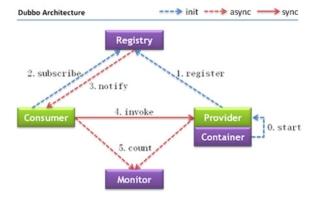
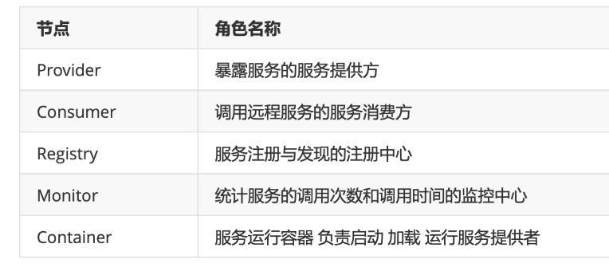
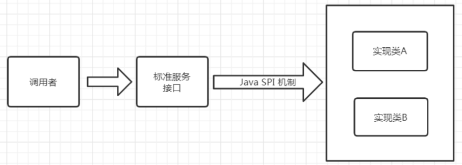
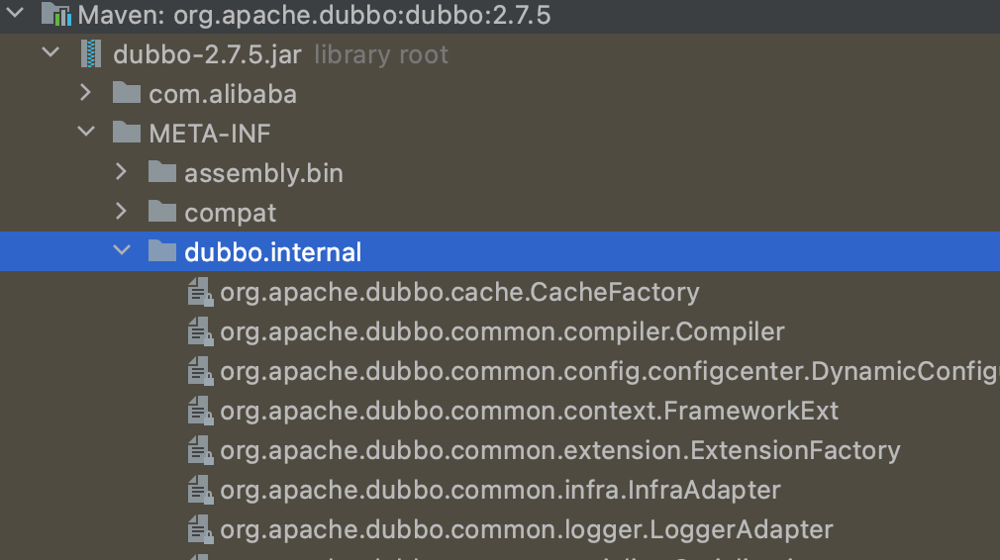

 架构与实战

## 1、 架构概述 

### 1.1 什么是Dubbo

Apache Dubbo是一款高性能的Java RPC框架。其前身是阿里巴巴公司开源的一个高性能、轻量级的开 源Java RPC框架，可以和Spring框架无缝集成。

https://dubbo.apache.org/zh/

Apache Dubbo |ˈdʌbəʊ| 提供了六大核心能力：面向接口代理的高性能RPC调用，智能容错和负载均衡，服务自动注册和发现，高度可扩展能力，运行期流量调度，可视化的服务治理与运维。

### 1.2 的特性

参考官网首页 特性一览

### 1.3 Dubbo 的服务治理

服务治理(**SOA governance**)，企业为了确保项目顺利完成而实施的过程，包括最佳实践、架构原则、治理规程、规律以及其他决定性的因素。服务治理指的是用来管理SOA的采用和实现的过程。
参考官网 服务治理


## 2、处理流程





调用关系说明:

- 虚线 代表异步调用
- 蓝色虚线 是在启动时完成的功能 
- 红色虚线 是程序运行中执行的功能

### 调用流程:

- 服务提供者在服务容器启动时 向注册中心 注册自己提供的服务
- 服务消费者在启动时 向注册中心订阅自己所需的服务
- 注册中心返回服务提供者地址列表给消费者 如果有变更 注册中心会基于长连接推送变更数据给消费者
- 服务消费者 从提供者地址列表中 基于软负载均衡算法 选一台提供者进行调用 如果调用失败 则重新选 择一台服务提供者和消费者 在内存中的调用次数 和 调用时间 定时每分钟发送给监控中心

## 3、服务注册中心Zookeeper

通过前面的Dubbo架构图可以看到，Registry(服务注册中心)在其中起着至关重要的作用。Dubbo官 方推荐使用Zookeeper作为服务注册中心。Zookeeper 是 Apache Hadoop 的子项目，作为 Dubbo 服 务的注册中心，工业强度较高，可用于生产环境，并推荐使用 。

## 4、Dubbo开发实战 

### 4.1 实战案例介绍

在Dubbo中所有的的服务调用都是基于接口去进行双方交互的。双方协定好Dubbo调用中的接口，提 供者来提供实现类并且注册到注册中心上。 调用方则只需要引入该接口，并且同样注册到相同的注册中心上(消费者)。即可利用注册中心来实现集 群感知功能，之后消费者即可对提供者进行调用。
我们所有的项目都是基于Maven去进行创建，这样相互在引用的时候只需要以依赖的形式进行展现就可 以了。
并且这里我们会通过maven的父工程来统一依赖的版本。 程序实现分为以下几步骤:

1. 建立maven工程 并且 创建**API模块: 用于规范双方接口协定**
2. 提供**provider模块**，引入API模块，并且对其中的服务进行实现。将其注册到注册中心上，对外来
统一提供服务。
3. 提供**consumer模块**，引入API模块，并且引入与提供者相同的注册中心。再进行服务调用。

### 4.2 开发过程 接口协定

1. 定义maven。

## 5、Dubbo管理控制台 dubbo-admin

### 5.1 作用

主要包含：服务管理 、 路由规则、动态配置、服务降级、访问控制、权重调整、负载均衡等管理功能

如我们在开发时，需要知道Zookeeper注册中心都注册了哪些服务，有哪些消费者来消费这些服务。我 们可以通过部署一个管理中心来实现。其实管理中心就是一个web应用，原来是war(2.6版本以前)包需 要部署到tomcat即可。现在是jar包可以直接通过java命令运行。

### 5.2 控制台安装步骤

```
1.从git 上下载项目 https://github.com/apache/dubbo-admin 2.修改项目下的dubbo.properties文件
注意dubbo.registry.address对应的值需要对应当前使用的Zookeeper的ip地址和端口号 • dubbo.registry.address=zookeeper://zk所在机器ip:zk端口
• dubbo.admin.root.password=root
• dubbo.admin.guest.password=guest
3.切换到项目所在的路径 使用mvn 打包
mvn clean package -Dmaven.test.skip=true
4.java 命令运行
java -jar 对应的jar包
```

### 5.3 使用控制台

```
1.访问http://IP:端口 
2.输入用户名root,密码root 
3.点击菜单查看服务提供者和服务消费者信息
```

## 6.Dubbo配置项说明 

### 6.1dubbo:application

对应 org.apache.dubbo.config.ApplicationConfig, 代表当前应用的信息

1. name: 当前应用程序的名称，在dubbo-admin中我们也可以看到，这个代表这个应用名称。我们 在真正时是时也会根据这个参数来进行聚合应用请求。
2. owner: 当前应用程序的负责人，可以通过这个负责人找到其相关的应用列表，用于快速定位到责 任人。
3. qosEnable : 是否启动QoS 默认true
4. qosPort : 启动QoS绑定的端口 默认22222
5. qosAcceptForeignIp: 是否允许远程访问 默认是false

#### Qos简介

QoS，全称为Quality of Service, 是常见于网络设备中的一个术语 ，例如在路由器中，可以通过Qos动态的调整和控制某些端口的权重，从而优先的保障运行在这些端口上的服务质量。

 在Dubbo中，QoS这个概念被用于**动态的对服务进行查询和控制**。例如对获取当前提供和消费的所有服务，以及对服务进行动态的上下线，即从注册中心上进行注册和反注册操作。

#### 命令行中登陆到dubbo

可以使用` talnet localhost 22222 `在命令行中登陆到dubbo


### 6.2 dubbo:registry

`org.apache.dubbo.config.RegistryConfig`, 代表该模块所使用的注册中心。一个模块中的服务可以将 其注册到多个注册中心上，也可以注册到一个上。后面再service和reference也会引入这个注册中心。

1. id : 当当前服务中provider或者consumer中存在多个注册中心时，则使用需要增加该配置。在一 些公司，会通过业务线的不同选择不同的注册中心，所以一般都会配置该值。
2. address : 当前注册中心的访问地址。
3. protocol : 当前注册中心所使用的协议是什么。也可以直接在 address 中写入，比如使用 zookeeper，就可以写成 zookeeper://xx.xx.xx.xx:2181
4. timeout : 当与注册中心不再同一个机房时，大多会把该参数延长。

### 6.3 dubbo:protocol

`org.apache.dubbo.config.ProtocolConfig`, 指定服务在进行数据传输所使用的协议。

1. id : 在大公司，可能因为各个部门技术栈不同，所以可能会选择使用不同的协议进行交互。这里
在多个协议使用时，需要指定。
2. name : 指定协议名称。默认使用 dubbo 。

### 6.4 dubbo:service

`org.apache.dubbo.config.ServiceConfig`, 用于指定当前需要对外暴露的服务信息，后面也会具体讲 解。和 dubbo:reference 大致相同。

1. interface : 指定当前需要进行对外暴露的接口是什么。
2. ref : 具体实现对象的引用，一般我们在生产级别都是使用Spring去进行Bean托管的，所以这里面 一般也指的是Spring中的BeanId。
3. version : 对外暴露的版本号。不同的版本号，消费者在消费的时候只会根据固定的版本号进行消 费。


### 6.5 dubbo:refrecence

`org.apache.dubbo.config.ReferenceConfig`, 消费者的配置，这里只做简单说明，后面会具体讲解。

1. id : 指定该Bean在注册到Spring中的id。
2. interface: 服务接口名
3. version : 指定当前服务版本，与服务提供者的版本一致。
4. registry : 指定所具体使用的注册中心地址。这里面也就是使用上面在 dubbo:registry 中所声
明的id。

```
<!-- 生成远程服务代理，可以和本地bean一样使用demoService -->
<dubbo:reference id="helloService" interface="com.shred.service.HelloService"  timeout="4000" retries="2" />
```

### 6.6 dubbo:method

```
@DubboReference(interfaceClass = GreetingService.class,
        version = AnnotationConstants.VERSION,
        timeout = 1000,
        methods = {@Method(name = "greeting", timeout = 3000, retries = 1)})
private GreetingService greetingService;
```

org.apache.dubbo.config.MethodConfig, 用于在制定的 dubbo:service 或者 dubbo:reference 中的 更具体一个层级，指定具体方法级别在进行RPC操作时候的配置，可以理解为对这上面层级中的配置针 对于具体方法的特殊处理。
1. name : 指定方法名称，用于对这个方法名称的RPC调用进行特殊配置。 
2. async: 是否异步 默认false

### 6.7 dubbo:service和dubbo:reference详解

这两个在dubbo中是我们最为常用的部分，其中有一些我们必然会接触到的属性。并且这里会讲到一些设置上的使用方案。
1. mock: 用于在方法调用出现错误时，**当做服务降级来统一对外返回结果**，后面我们也会对这个方法做更多的介绍。
2. timeout: 用于指定当前方法或者接口中所有方法的超时时间。我们一般都会根据提供者的时长来 具体规定。比如我们在进行第三方服务依赖时可能会对接口的时长做放宽，防止第三方服务不稳定 导致服务受损。
3. **check**: 用于在启动时，**检查生产者是否有该服务。我们一般都会将这个值设置为false**，不让其进行检查。因为如果出现模块之间循环引用的话，那么则可能会出现相互依赖，都进行check的话， 那么这两个服务永远也启动不起来。
4. retries: 用于指定当前服务在执行时出现错误或者超时时的重试机制。
   1. 注意提供者是否有幂等，否则可能出现数据一致性问题
   2. 注意提供者是否有类似缓存机制，如出现大面积错误时，可能因为不停重试导致雪崩
5. executes: 用于在提供者做配置，来确保最大的并行度。
   1. 可能导致集群功能无法充分利用或者堵塞 
   2. 但是也可以启动部分对应用的保护功能 
   3. 可以不做配置，结合后面的熔断限流使用

### 6.8 其它配置 

参考官网 schema 配置参考手册https://dubbo.apache.org/zh/docsv2.7/user/references/xml/

# 三、Dubbo高级实战 

## 1、SPI

### 1.1 SPI简介

SPI 全称为 **(Service Provider Interface**) ，是JDK内置的一种服务提供发现机制。 目前有不少框架用它 来做服务的扩展发现，简单来说，它就是一种动态替换发现的机制。使用SPI机制的优势是实现解耦， 使得第三方服务模块的装配控制逻辑与调用者的业务代码分离。

### 1.2 JDK中的SPI



Java中如果想要使用SPI功能，先提供标准服务接口，然后再提供相关接口实现和调用者。这样就可以通 过SPI机制中约定好的信息进行查询相应的接口实现。

#### SPI遵循如下约定:

1、当服务提供者提供了接口的一种具体实现后，在`META-INF/services`目录下创建一个以“接口全 限定名”为命名的文件，内容为实现类的全限定名; 

2、接口实现类所在的jar包放在主程序的classpath中; 

3、主程序通过`java.util.ServiceLoader`动态装载实现模块，它通过扫描`META-INF/services`目录下 的配置文件找到实现类的全限定名，把类加载到JVM; 

4、SPI的实现类必须携带一个无参构造方法;Java中如果想要使用SPI功能，先提供标准服务接口，然后再提供相关接口实现和调用者。这样就可以通 过SPI机制中约定好的信息进行查询相应的接口实现。

### 1.3 Dubbo中的SPI

dubbo中大量的使用了SPI来作为扩展点，通过实现同一接口的前提下，可以进行定制自己的实现类。 比如比较常见的协议，负载均衡，都可以通过SPI的方式进行定制化，自己扩展。Dubbo中已经存在的 所有已经实现好的扩展点。




### 1.4 Dubbo中扩展点使用方式

 我们使用三个项目来演示Dubbo中扩展点的使用方式，一个主项目main，一个服务接口项目api，一个服务实现项目impl。 

**api项目创建**
(1)导入坐标 dubbo 
(2)创建接口
在接口上 使用**@SPI**

**impl项目创建**
(1)导入 api项目 的依赖
(2)建立实现类，为了表达支持多个实现的目的，这里分别创建两个实现。分别为 HumanHelloService 和 DogHelloService 。
(3)SPI进行声明操作，在 resources 目录下创建目录 `META-INF/dubbo` 目录，在目录下创建名称为 `com.shred.dubbo.study.spi.demo.api.HelloService`的文件，文件内部配置两个实现类名称和对应的全 限定名:

```
# dubbo spi 扩展点=实现类
dog=com.shred.service.impl.DogHelloService
human=com.shred.service.impl.HumanHelloService
```


**main项目创建**
(1)导入坐标 接口项目 和 实现类项目

(2)创建DubboSpiMain
和原先调用的方式不太相同， dubbo 有对其进行自我重新实现 需要借助ExtensionLoader，创建新的运 行项目。这里demo中的示例和java中的功能相同，查询出所有的已知实现，并且调用

(3)dubbo自己做SPI的目的

```
1. JDK 标准的 SPI 会一次性实例化扩展点所有实现，如果有扩展实现初始化很耗时，但如果没用上也加 载，会很浪费资源
2. 如果有扩展点加载失败，则所有扩展点无法使用
3. 提供了对扩展点包装的功能(Adaptive)，并且还支持通过set的方式对其他的扩展点进行注入
```


### 1.5 Dubbo SPI中的Adaptive功能

- @Adaptive 标注在实现类上，ExtensionLoader.getAdaptiveExtension()返回的就是该拓展点实现类，最多只有一个实现类标注@Adaptive 
- @Adaptive标注在方法上，通过url中的Parameter指定实现类

Dubbo中的Adaptive功能，主要解决的问题是如何动态的选择具体的扩展点。通过` getAdaptiveExtension `统一对指定接口对应的所有扩展点进行封装，通过URL的方式对扩展点来进行动态选择。(dubbo中所有的注册信息都是通过URL的形式进行处理的。)这里同样采用相同的方式进行实现。

(1)创建接口

api中的 扩展如下方法, 与原先类似，在sayHello中增加 注解，并且在**参数中 提供URL参数**.注意这里的URL参数的类为 `org.apache.dubbo.common.URL`
其中@SPI可以指定一个字符串参数，用于指明该SPI的默认实现。

(2)创建实现类
与上面Service实现类代码相似，只需增加URL形参即可

(3)编写DubboAdaptiveMain 最后在获取的时候方式有所改变，需要传入URL参数，并且在参数中指定具体的实现类参数 如:

```java
public class DubboAdaptiveMain {
    public static void main(String[] args) {

        //hello.service helloService会将大写弄成.
        URL url = URL.valueOf("test://localhost/hello?hello.service=dog");
        URL url2 = URL.valueOf("test://localhost/hello?hello.service=human");
        //未指定，使用@SPI("dog") 默认实现未dog
        URL url3 = URL.valueOf("test://localhost/hello");

        HelloService adaptiveExtension = ExtensionLoader.getExtensionLoader(HelloService.class).getAdaptiveExtension();

        String s = adaptiveExtension.sayHello(url);
        System.out.println(s);
        String s2 = adaptiveExtension.sayHello(url2);
        System.out.println(s2);

        String s3 = adaptiveExtension.sayHello(url3);
        System.out.println(s3);
    }
}
```

注意:

- 因为在这里只是临时测试，所以为了保证URL规范，前面的信息均为测试值即可，**关键的点在于 hello.service 参数，这个参数的值指定的就是具体的实现方式**。关于为什么叫 hello.service 是因为这个接口的名称，其中后面的**大写部分被dubbo自动转码为 . 分割**。
- 通过 `getAdaptiveExtension` 来提供一个统一的类来对所有的扩展点提供支持(底层对所有的扩展点进行封装)。
- 调用时通过**参数中增加 URL 对象来实现动态的扩展点使用**。
- 如果URL没有提供该参数，则该方法会使用默认在 SPI 注解中声明的实现。


### 1.6 Dubbo调用时拦截操作 

与很多框架一样，Dubbo也存在拦截(过滤)机制，可以通过该机制在执行目标程序前后执行我们指定的代码。

Dubbo的Filter机制，是专门为服务提供方和服务消费方调用过程进行拦截设计的，每次远程方法执 行，该拦截都会被执行。这样就为开发者提供了非常方便的扩展性，比如为dubbo接口实现ip白名单功 能、监控功能 、日志记录等。

**步骤如下:**
(1)实现 `org.apache.dubbo.rpc.Filter` 接口

(2)使用 `org.apache.dubbo.common.extension.Activate` 接口进行对类进行注册 通过group 可以 指定生产端 消费端 如:

```java
@Activate(group = {CommonConstants.CONSUMER)//CommonConstants.PROVIDER//服务端
```

(3)计算方法运行时间的代码实现

(4)在 ` META-INF/dubbo`中新建 `org.apache.dubbo.rpc.Filter `文件，并将当前类的全名写入

```
timerFilter=包名.过滤器的名字
```

注意：一般类似于这样的功能都是单独开发依赖的，所以再使用方的项目中只需要引入依赖，在调用接
口时，该方法便会自动拦截。

### 1.7 @Activate

- 自动激活条件的标记
- ExtensionLoader.getActivateExtension(url, "")；获取激活的拓展

```
public class ActivateTest {
 
    public static void main(String[] args) {
 
        ExtensionLoader<Filter> loader = ExtensionLoader.getExtensionLoader(Filter.class);
        URL url = new URL("dubbo", "127.0.0.1", 21880);
        // key指定为空字符串，即没有给出明确的key
        List<Filter> filterList = loader.getActivateExtension(url, "");
        for (Filter filter : filterList) {
            System.out.println(filter.getClass().getName());
        }
 
    }
}
```


## 2、负载均衡策略 

### 2.1 负载均衡基本配置

负载均衡(Load Balance), 其实就是将请求分摊到多个操作单元上进行执行，从而共同完成工作任 务。

负载均衡策略主要用于客户端存在多个提供者时进行选择某个提供者。 在集群负载均衡时，Dubbo 提供了多种均衡策略(包括随机、轮询、最少活跃调用数、一致性Hash)，缺省为random随机调用。

这块儿主要是来自于官方文档，已经写得很详细了 配置负载均衡策略，既可以在服务提供者一方配置，也可以在服务消费者一方配置，如下:

```java
//在服务消费者一方配置负载均衡策略
@Reference(check = false,loadbalance = "random")
```

```java
//在服务提供者一方配置负载均衡
@Service(loadbalance = "random")
public class HelloServiceImpl implements HelloService {
    public String sayHello(String name) {
        return "hello " + name;
} }
```

### 2.2 自定义负载均衡器

负载均衡器在Dubbo中的SPI接口是 org.apache.dubbo.rpc.cluster.LoadBalance , 可以通过实现这
个接口来实现自定义的负载均衡规则。

 (1)自定义负载均衡器
在上一节的案例基础上创建名称为dubbo-spi-loadbalance的Maven模块，并创建负载均衡器 OnlyFirstLoadbalancer。这里功能只是简单的选取所有机器中的第一个(按照字母排序 + 端口排序)。

(2)配置负载均衡器
在dubbo-spi-loadbalance工程的 META-INF/dubbo 目录下新建
org.apache.dubbo.rpc.cluster.LoadBalance 文件，并将当前类的全名写入

```
onlyFirst=包名.负载均衡器
```

(3)在服务提供者工程实现类中编写用于测试负载均衡效果的方法 启动不同端口时 方法返回的信息 不同

(4)启动多个服务 要求他们使用同一个接口注册到同一个注册中心 但是他们的dubbo通信端口不同

(5)在服务消费方指定自定义负载均衡器 onlyFirst 

(6)测试自定义负载均衡的效果


## 3、异步调用

Dubbo不只提供了堵塞式的的同步调用，同时提供了异步调用的方式。这种方式主要应用于提供者接口 响应耗时明显，消费者端可以利用调用接口的时间去做一些其他的接口调用，利用 Future 模式来异步等 待和获取结果即可。这种方式可以大大的提升消费者端的利用率。 目前这种方式可以通过XML的方式进 行引入。

### 3.1 异步调用实现

(1)为了能够模拟等待，通过 int timeToWait参数，标明需要休眠多少毫秒后才会进行返回。

```
String sayHello(String name, int timeToWait);
```

(2)接口实现 为了模拟调用耗时 可以让线程等待一段时间
 (3)在消费者端，配置异步调用 注意消费端默认超时时间1000毫秒 如果提供端耗时大于1000毫秒会

出现超时
 可以通过改变消费端的超时时间 通过timeout属性设置即可单位毫秒

```
<dubbo:reference id="helloService" interface="com.lagou.service.HelloService">
    <dubbo:method name="sayHello" async="true" />
</dubbo:reference>
```

(4)测试，我们休眠100毫秒，然后再去进行获取结果。方法在同步调用时的返回值是空，我们可以通 过 RpcContext.getContext().getFuture() 来进行获取Future对象来进行后续的结果等待操作。

### 3.2 异步调用特殊说明

需要特别说明的是，该方式的使用，请确保dubbo的版本在2.5.4及以后的版本使用。 原因在于在2.5.3 及之前的版本使用的时候，会出现异步状态传递问题。
比如我们的服务调用关系是 A -> B -> C , 这时候如果A向B发起了异步请求，在错误的版本时，B向C发 起的请求也会连带的产生异步请求。这是因为在底层实现层面，他是通过 RPCContext 中的
attachment 实现的。在A向B发起异步请求时，会在 attachment 中增加一个异步标示字段来表明异步 等待结果。B在接受到A中的请求时，会通过该字段来判断是否是异步处理。但是由于值传递问题，B向 C发起时同样会将该值进行传递，导致C误以为需要异步结果，导致返回空。这个问题在2.5.4及以后的 版本进行了修正。

## 4、线程池

### 4.1 Dubbo已有线程池

dubbo在使用时，都是通过创建真实的业务线程池进行操作的。目前已知的线程池模型有两个和java中 的相互对应:

- **fix**: 表示创建固定大小的线程池。也是Dubbo默认的使用方式，默认创建的执行线程数为200，并 且是没有任何等待队列的。所以再极端的情况下可能会存在问题，比如某个操作大量执行时，可能 存在堵塞的情况。后面也会讲相关的处理办法。
-  **cache**: 创建非固定大小的线程池，当线程不足时，会自动创建新的线程。但是使用这种的时候需 要注意，如果突然有高TPS的请求过来，方法没有及时完成，则会造成大量的线程创建，对系统的 CPU和负载都是压力，执行越多反而会拖慢整个系统。

### **4.2** **自定义线程池**

在真实的使用过程中可能会因为使用fix模式的线程池，导致具体某些业务场景因为线程池中的线程数量 不足而产生错误，而很多业务研发是对这些无感知的，只有当出现错误的时候才会去查看告警或者通过 客户反馈出现严重的问题才去查看，结果发现是线程池满了。所以可以在创建线程池的时，通过某些手 段对这个线程池进行监控，这样就可以进行及时的扩缩容机器或者告警。下面的这个程序就是这样子 的，会在创建线程池后进行对其监控，并且及时作出相应处理。

(1)线程池实现, 这里主要是基于对 `FixedThreadPool `中的实现做扩展出线程监控的部分

```java

import org.apache.dubbo.common.URL;
import org.apache.dubbo.common.threadpool.support.fixed.FixedThreadPool;
import org.slf4j.Logger;
import org.slf4j.LoggerFactory;

import java.util.Map;
import java.util.concurrent.*;

public class WatchingThreadPool extends FixedThreadPool implements Runnable{
    private static final Logger logger = LoggerFactory.getLogger(WatchingThreadPool.class);

    private static Map<URL, ThreadPoolExecutor> THREAD_POOLS = new ConcurrentHashMap<>();

    //线程池使用阈值
    private static final double ALARM_PERCENT = 0.80;

    public WatchingThreadPool() {
        // 每隔3秒打印线程使用情况
        Executors.newSingleThreadScheduledExecutor()
                .scheduleWithFixedDelay(
                this,1,3, TimeUnit.SECONDS);
    }

    @Override
    public Executor getExecutor(URL url) {
        Executor executor = super.getExecutor(url);
        if (executor instanceof ThreadPoolExecutor){
            THREAD_POOLS.put(url, (ThreadPoolExecutor) executor);
        }
        return executor;
    }

    @Override
    public void run() {
        //便利线程池
        for (Map.Entry<URL, ThreadPoolExecutor> entry : THREAD_POOLS.entrySet()) {
            URL url = entry.getKey();
            ThreadPoolExecutor executor = entry.getValue();

            //当前执行的线程数
            int activeCount = executor.getActiveCount();
            //总计线程数
            int corePoolSize = executor.getCorePoolSize();

            double usePercent = activeCount /( corePoolSize*1.0) *100;
            logger.info("线程池执行状态：[{}/{}:{}%]",activeCount, corePoolSize, usePercent);
            if (usePercent > ALARM_PERCENT) {
                logger.error("超出禁戒线！host:{} 当前使用率{} URL:{}", url.getIp(), usePercent, url);
            };

        }

    }
}
```

(2)SPI声明，创建文件 `META-INF/dubbo/org.apache.dubbo.common.threadpool.ThreadPool`

watching=包名.线程池名

(3)在服务提供方项目引入该依赖

(4)在服务提供方项目中设置使用该线程池生成器

```
dubbo.provider.threadpool=watching
```

(5)接下来需要做的就是模拟整个流程，因为该线程当前是每1秒抓一次数据，所以我们需要对该方法 的提供者超过1秒的时间(比如这里用休眠 Thread.sleep )，消费者则需要启动多个线程来并行执行，来 模拟整个并发情况。

(6)在调用方则尝试简单通过for循环启动多个线程来执行 查看服务提供方的监控情况

## 5、路由规则

路由是决定一次请求中需要发往目标机器的重要判断，通过对其控制可以决定请求的目标机器。我们可
以通过创建这样的规则来决定一个请求会交给哪些服务器去处理。

### 5.1 路由规则快速入门 

(1)提供两个提供者(一台本机作为提供者，一台为其他的服务器)，每个提供者会在调用时可以返回不
同的信息 以区分提供者。

(2)针对于消费者，我们这里通过一个死循环，每次等待用户输入，再进行调用，来模拟真实的请求 情况。
通过调用的返回值 确认具体的提供者。

(3)我们通过ipconfig来查询到我们的IP地址，并且单独启动一个客户端，来进行如下配置(这里假设 我们希望隔离掉本机的请求，都发送到另外一台机器上)。

```java
public class DubboRouterMain {
    public static void main(String[] args) {
        RegistryFactory factory = ExtensionLoader.getExtensionLoader(RegistryFactory.class).getAdaptiveExtension();
        Registry registry = factory.getRegistry(URL.valueOf("zookeeper://127.0.0.1:2181"));
        //条件路由
        registry.register(URL.valueOf("condition://0.0.0.0/com.lagou.service.HelloService?" +
                "category=routers&force=true&dynamic=true&route="
                + URL.encode("=>host!=192.168.1.125")));//禁用远程机器 ip=192.168.1.125
    }
}
```

(4)通过这个程序执行后，我们就通过消费端不停的发起请求，看到真实的请求都发到了除去本机以 外的另外一台机器上。

## 5.2 路由规则详解

通过上面的程序，我们实际本质上就是通过在zookeeper中保存一个节点数据，来记录路由规则。消费 者会通过监听这个服务的路径，来感知整个服务的路由规则配置，然后进行适配。这里主要介绍路由配 置的参数。具体请参考文档, 这里只对关键的参数做说明。

- route:// 表示路由规则的类型，支持条件路由规则和脚本路由规则，可扩展，**必填**。 
- 0.0.0.0 表示对所有 IP 地址生效，如果只想对某个 IP 的生效，请填入具体 IP，**必填**。 
- com.lagou.service.HelloService 表示只对指定服务生效，**必填**。 category=routers 表示该数据为动态配置类型，**必填**。
- dynamic : 是否为持久数据，当指定服务重启时是否继续生效。**必填**。
- runtime : 是否在设置规则时自动缓存规则，如果设置为true则会影响部分性能。
- rule : 是整个路由最关键的配置，用于配置路由规则。
- ... => ... 在这里 => 前面的就是表示消费者方的匹配规则，可以不填(代表全部)。 => 后方则必须填写，表示当请求过来时，如果选择提供者的配置。官方这块儿也给出了详细的示例，可以按照 那里来讲。
  其中使用最多的便是 **host** 参数。 **必填**。


## 5.3 路由与上线系统结合

当公司到了一定的规模之后，一般都会有自己的**上线系统**，专门用于服务上线。方便后期进行维护和记 录的追查。我们去想象这样的一个场景，一个dubbo的提供者要准备进行上线，一般都提供多台提供者 来同时在线上提供服务。这时候一个请求刚到达一个提供者，提供者却进行了关闭操作。那么此次请求 就应该认定为失败了。

所以基于这样的场景，**我们可以通过路由的规则，把预发布(灰度)的机器进行从 机器列表中移除。并且等待一定的时间，让其把现有的请求处理完成之后再进行关闭服务。**同时，在启动时，同样需要等待一定的时间，以免因为尚未重启结束，就已经注册上去。等启动到达一定时间之后，再进行开启流量操作。

### 实现主体思路

1.利用zookeeper的路径感知能力，在服务准备进行重启之前将当前机器的IP地址和应用名写入 zookeeper。 

2.服务消费者监听该目录，读取其中需要进行关闭的应用名和机器IP列表并且保存到内存中。 

3.当前请求过来时，判断是否是请求该应用，如果是请求重启应用，则将该提供者从服务列表中移除。

```
@@@###nodeCache作用是什么
@Acitve注解的作用？如何使用？
```


(1)引入 框架，用于方便操作Zookeeper

(2)编写Zookeeper的操作类，用于方便进行zookeeper处理

(3)编写需要进行预发布的路径管理器，用于缓存和监听所有的待灰度机器信息列表。

(4)编写路由类(实现 org.apache.dubbo.rpc.cluster.Router )，主要目的在于对 ReadyRestartInstances 中的数据进行处理，并且移除路由调用列表中正在重启中的服务。

(5)由于 Router 机制比较特殊，所以需要利用一个专门的 RouterFactory 来生成，原因在于并不是 所有的都需要添加路由，所以需要利用 @Activate 来锁定具体哪些服务才需要生成使用。

```java
@Activate
public class RestartingInstanceRouterFactory implements RouterFactory {
    @Override
    public Router getRouter(URL url) {
        return new RestartingInstanceRouter(url);
	} 
}
```

(6)对 RouterFactory 进行注册，同样放入到 `META-INF/dubbo/org.apache.dubbo.rpc.cluster.RouterFactory `文件中。

```
restartInstances=com.lagou.router.RestartingInstanceRouterFactory
```

(7)将dubbo-spi-router项目引入至 consumer 项目的依赖中。

(8)这时直接启动程序，还是利用上面中所写好的 consumer 程序进行执行，确认各个 provider 可以

正常执行。	
 (9)单独写一个 main 函数来进行将某台实例设置为启动中的状态，比如这里我们认定为当前这台机器

中的 service-provider 这个提供者需要进行重启操作。

```
ReadyRestartInstances.create().addRestartingInstance("service-provider", "正在 重新启动的机器IP");
```

(10)执行完成后，再次进行尝试通过 consumer 进行调用，即可看到当前这台机器没有再发送任何请 求

(11)一般情况下，当机器重启到一定时间后，我们可以再通过 removeRestartingInstance 方法对 这个机器设定为既可以继续执行。

(12)调用完成后，我们再次通过 consumer 去调用，即可看到已经再次恢当前机器的请求参数。