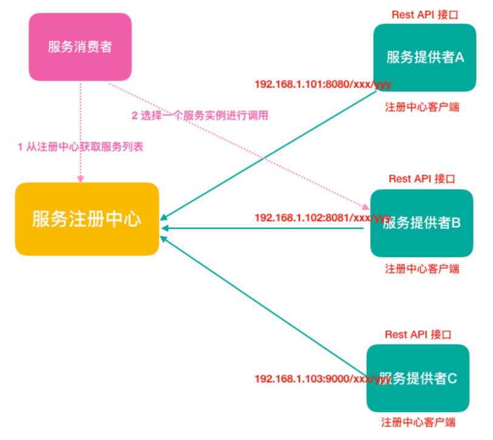
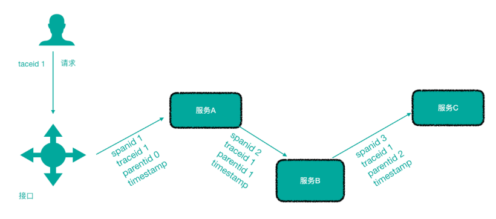

微服务应用架构

微服务架构可以说是SOA架构的一种拓展，这种架构模式下它拆分粒度更小、服务 更独立。把应用拆分成为一个个微小的服务，不同的服务可以使用不同的开发语言 和存储，服务之间往往通过Restful等轻量级通信。微服务架构关键在于微小、独 立、轻量级通信。

微服务是在 SOA 上做的升华粒度更加细致，微服务架构强调的一个重点是“业务需要 彻底的组件化 和服务化”

微服务架构和SOA架构相似又不同

微服务架构和SOA架构很明显的一个区别就是服务拆分粒度的不同

## 第 **2** 节 微服务架构体现的思想及优缺点

微服务架构设计的核心思想就是**“**微**”**，拆分的粒度相对比较小，这样的话单一职 责、开发的耦合度就会降低、微小的功能可以独立部署扩展、灵活性强，升级改造 影响范围小。

单体应用(1.7—>1.8)

A(升级JDK) B C D E ..... 

### 优点:

- 微服务很小，便于特定业务功能的聚焦 A B C D 
- 微服务很小，每个微服务都可以被一个小团队单独实施(开发、测试、部署上 线、运维)，团队合作一定程度解耦，便于实施敏捷开发 
- 微服务很小，便于重用和模块之间的组装 
- 微服务很独立，那么不同的微服务可以使用不同的语言开发，松耦合 
- 微服务架构下，我们更容易引入新技术 
- 微服务架构下，我们可以更好的实现DevOps开发运维一体化;

### 缺点

- 微服务架构下，分布式复杂难以管理，当服务数量增加，管理将越加复杂;
- 微服务架构下，分布式链路跟踪难等;

## 第 3 节 微服务架构中的一些概念 

### 服务注册与服务发现

**服务注册**：服务提供者将所提供服务的信息(服务器IP和端口、服务访问协议等) 注册/登记到注册中心

**服务发现**：服务消费者能够从注册中心获取到较为实时的服务列表，然后根究一定 的策略选择一个服务访问

**负载均衡**
负载均衡即将请求压力分配到多个服务器(应用服务器、数据库服务器等)，以
此来提高服务的性能、可靠性

**熔断**
熔断即断路保护。微服务架构中，如果下游服务因访问压力过大而响应变慢或失
败，上游服务为了保护系统整体可用性，可以暂时切断对下游服务的调用。这种牺
牲局部，保全整体的措施就叫做熔断。

**链路追踪**

微服务架构越发流行，一个项目往往拆分成很多个服务，那么一次请求就需要涉及
到很多个服务。不同的微服务可能是由不同的团队开发、可能使用不同的编程语言
实现、整个项目也有可能部署在了很多服务器上(甚至百台、千台)横跨多个不同
的数据中心。所谓链路追踪，就是对一次请求涉及的很多个服务链路进行日志记
录、性能监控

**API 网关**
微服务架构下，不同的微服务往往会有不同的访问地址，客户端可能需要调用多个
服务的接口才能完成一个业务需求，如果让客户端直接与各个微服务通信可能出
现:
1)客户端需要调用不同的url地址，增加了维护调用难度 

2)在一定的场景下，也存在跨域请求的问题(前后端分离就会碰到跨域问题，原本
我们在后端采用Cors就能解决，现在利用网关，那么就放在网关这层做好了)

3)每个微服务都需要进行单独的身份认证

那么，API网关就可以较好的统一处理上述问题，API请求调用统一接入API网关层， 由网关转发请求。**API网关更专注在安全、路由、流量**等问题的处理上(微服务团队 专注于处理业务逻辑即可)，它的功能比如

1)统一接入(路由) 

2)安全防护(统一鉴权，负责网关访问身份认证验证，与“访问认证中心”通信，实际认证业务逻辑交移“访问认证中心”处理) 

3)黑白名单(实现通过IP地址控制禁止访问网关功能，控制访问)

3)协议适配(实现通信协议校验、适配转换的功能) 

4)流量管控(限流)

5)⻓短链接支持

6)容错能力(负载均衡)

