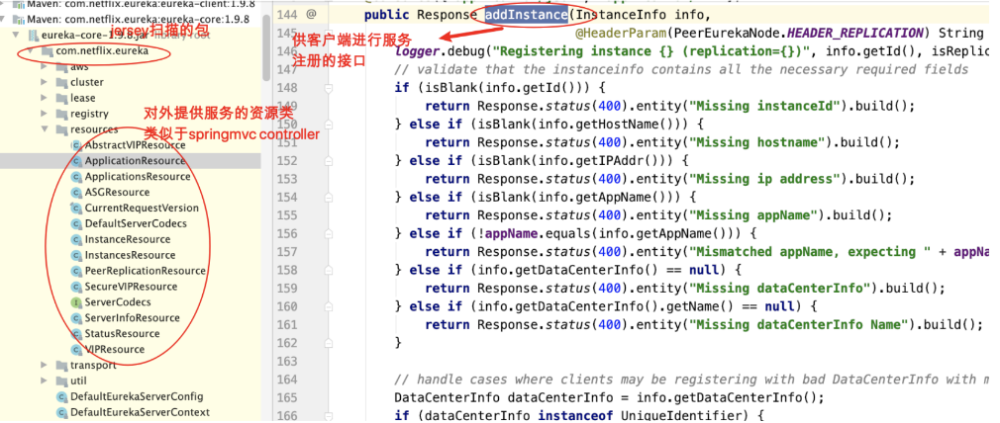
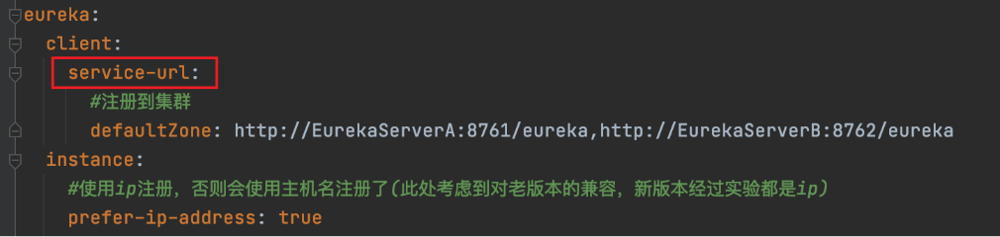
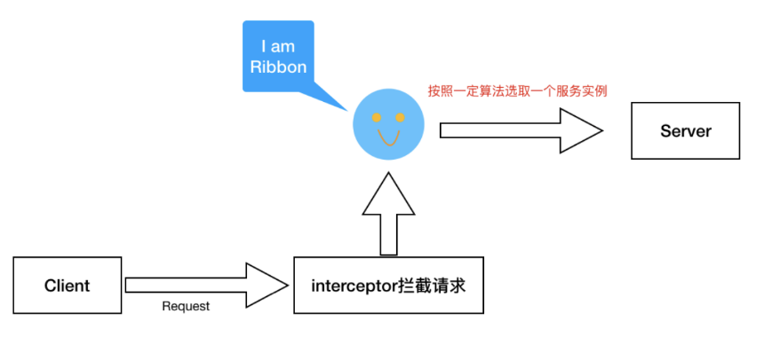
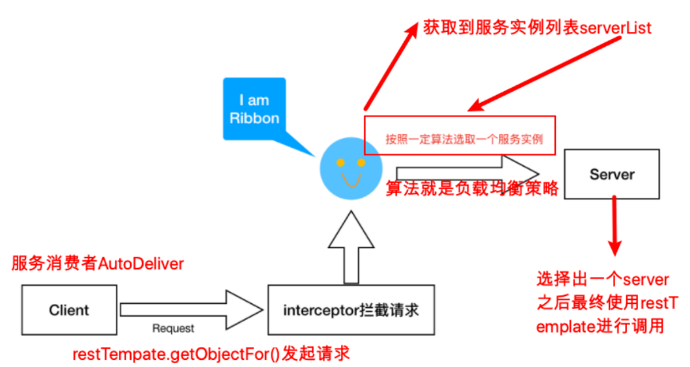
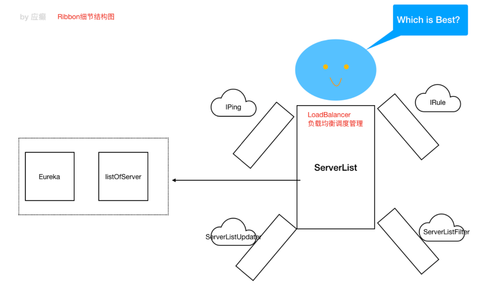

# 1 Eureka核心源码剖析

## 1.1 Eureka Server启动过程 

入口:SpringCloud充分利用了SpringBoot的自动装配的特点
观察eureka-server的jar包，发现在META-INF下面有配置文件spring.factories

```
org.springframework.boot.autoconfigure.EnableAutoConfiguration=\
  org.springframework.cloud.netflix.eureka.server.EurekaServerAutoConfiguration
```


EurekaServerAutoConfiguration

- condition：Marker.class
- import：EurekaServerInitializerConfiguration

```
@Configuration
@Import({EurekaServerInitializerConfiguration.class})
@ConditionalOnBean({Marker.class})
@EnableConfigurationProperties({EurekaDashboardProperties.class, InstanceRegistryProperties.class})
@PropertySource({"classpath:/eureka/server.properties"})
public class EurekaServerAutoConfiguration extends WebMvcConfigurerAdapter {
```

图中的 1)需要有一个marker bean，才能装配Eureka Server，那么这个marker 其实是由`@EnableEurekaServer`注解决定的

- EnableEurekaServer

```
@Target({ElementType.TYPE})
@Retention(RetentionPolicy.RUNTIME)
@Documented
@Import({EurekaServerMarkerConfiguration.class})
public @interface EnableEurekaServer {
}
```

- EurekaServerMarkerConfiguration

```
@Configuration
public class EurekaServerMarkerConfiguration {
    public EurekaServerMarkerConfiguration() {
    }

    @Bean
    public EurekaServerMarkerConfiguration.Marker eurekaServerMarkerBean() {
        return new EurekaServerMarkerConfiguration.Marker();
    }

    class Marker {
        Marker() {
        }
    }
}
```

### 关注EurekaServerAutoConfiguration

- 仪表盘
- 

```java
//仪表盘
		@Bean
    @ConditionalOnProperty(
        prefix = "eureka.dashboard",
        name = {"enabled"},
        matchIfMissing = true
    )
    public EurekaController eurekaController() {
        return new EurekaController(this.applicationInfoManager);
    }

//对等节点感知 实例注册器（集群模式下，注册服务使用的注册器）
    @Bean
    public PeerAwareInstanceRegistry peerAwareInstanceRegistry(ServerCodecs serverCodecs) {
        this.eurekaClient.getApplications();
        return new InstanceRegistry(this.eurekaServerConfig, this.eurekaClientConfig, serverCodecs, this.eurekaClient, this.instanceRegistryProperties.getExpectedNumberOfClientsSendingRenews(), this.instanceRegistryProperties.getDefaultOpenForTrafficCount());
    }

//注入PeerEurekaNodes，辅助封装对等节点相关的信息和操作，比如更新集群当中的对等
    @Bean
    @ConditionalOnMissingBean
    public PeerEurekaNodes peerEurekaNodes(PeerAwareInstanceRegistry registry, ServerCodecs serverCodecs) {
        return new EurekaServerAutoConfiguration.RefreshablePeerEurekaNodes(registry, this.eurekaServerConfig, this.eurekaClientConfig, serverCodecs, this.applicationInfoManager);
    }

//注入EurekaServerContext 上下文DefaultEurekaServerContext
    @Bean
    public EurekaServerContext eurekaServerContext(ServerCodecs serverCodecs, PeerAwareInstanceRegistry registry, PeerEurekaNodes peerEurekaNodes) {
        return new DefaultEurekaServerContext(this.eurekaServerConfig, serverCodecs, registry, peerEurekaNodes, this.applicationInfoManager);
    }

//EurekaServerBootstrap对象，启动时需要用到
    @Bean
    public EurekaServerBootstrap eurekaServerBootstrap(PeerAwareInstanceRegistry registry, EurekaServerContext serverContext) {
        return new EurekaServerBootstrap(this.applicationInfoManager, this.eurekaClientConfig, this.eurekaServerConfig, registry, serverContext);
    }

//注册jerseyFilter，jersey是一个rest框架，帮助发布restful服务接口，类似springMVC
	@Bean
	public FilterRegistrationBean jerseyFilterRegistration(
			javax.ws.rs.core.Application eurekaJerseyApp) {
		FilterRegistrationBean bean = new FilterRegistrationBean();
		bean.setFilter(new ServletContainer(eurekaJerseyApp));
		bean.setOrder(Ordered.LOWEST_PRECEDENCE);
		bean.setUrlPatterns(
				Collections.singletonList(EurekaConstants.DEFAULT_PREFIX + "/*"));

		return bean;
	}
```


#### PeerEurekaNodes

```java
//com.netflix.eureka.cluster.PeerEurekaNodes#start
public void start() {
//构建线程池
    this.taskExecutor = Executors.newSingleThreadScheduledExecutor(new ThreadFactory() {
        public Thread newThread(Runnable r) {
            Thread thread = new Thread(r, "Eureka-PeerNodesUpdater");
            thread.setDaemon(true);
            return thread;
        }
    });

    try {
        this.updatePeerEurekaNodes(this.resolvePeerUrls());
        Runnable peersUpdateTask = new Runnable() {
            public void run() {
                try {
//更新对等节点信息，什么时候启动该任务呢》？  
                  PeerEurekaNodes.this.updatePeerEurekaNodes(PeerEurekaNodes.this.resolvePeerUrls());
                } catch (Throwable var2) {
                    PeerEurekaNodes.logger.error("Cannot update the replica Nodes", var2);
                }

            }
        };
        this.taskExecutor.scheduleWithFixedDelay(peersUpdateTask, (long)this.serverConfig.getPeerEurekaNodesUpdateIntervalMs(), (long)this.serverConfig.getPeerEurekaNodesUpdateIntervalMs(), TimeUnit.MILLISECONDS);
    } catch (Exception var3) {
        throw new IllegalStateException(var3);
    }

    Iterator var4 = this.peerEurekaNodes.iterator();

    while(var4.hasNext()) {
        PeerEurekaNode node = (PeerEurekaNode)var4.next();
        logger.info("Replica node URL:  {}", node.getServiceUrl());
    }

}
```


#### DefaultEurekaServerContext

```java
//com.netflix.eureka.DefaultEurekaServerContext#initialize
@PostConstruct
public void initialize() {
    logger.info("Initializing ...");
    // context对象构建完毕，会执行上面的PeerEurekaNodes.start()
    this.peerEurekaNodes.start();

    try {
        this.registry.init(this.peerEurekaNodes);
    } catch (Exception var2) {
        throw new RuntimeException(var2);
    }

    logger.info("Initialized");
}
```


### 关注EurekaServerInitializerConfiguration

- 实现SmartLifecycle，可在Spring容器 Bean创建完成后执行start方法
- start方法调用了eurekaServerBootstrap的contextInitialized()

```java
//实现SmartLifecycle，可在Spring容器 Bean创建完成后执行start方法
@Configuration
public class EurekaServerInitializerConfiguration
      implements ServletContextAware, SmartLifecycle, Ordered {
  
  @Override
	public void start() {
		new Thread(new Runnable() {
			@Override
			public void run() {
				try {
					//TODO: is this class even needed now?
          //初始化EurekaServerContext细节
          eurekaServerBootstrap.contextInitialized(EurekaServerInitializerConfiguration.this.servletContext);
					log.info("Started Eureka Server");

					publish(new EurekaRegistryAvailableEvent(getEurekaServerConfig()));
					EurekaServerInitializerConfiguration.this.running = true;
					publish(new EurekaServerStartedEvent(getEurekaServerConfig()));
				}
				catch (Exception ex) {
					// Help!
					log.error("Could not initialize Eureka servlet context", ex);
				}
			}
		}).start();
	}

```

#### EurekaServerBootstrap#contextInitialized

- registry.syncUp();
- registry.openForTraffic(this.applicationInfoManager, registryCount);

```java
//org.springframework.cloud.netflix.eureka.server.EurekaServerBootstrap#contextInitialized
public void contextInitialized(ServletContext context) {
   try {
      initEurekaEnvironment();
      initEurekaServerContext();

      context.setAttribute(EurekaServerContext.class.getName(), this.serverContext);
   }
   catch (Throwable e) {
      log.error("Cannot bootstrap eureka server :", e);
      throw new RuntimeException("Cannot bootstrap eureka server :", e);
   }
}

	protected void initEurekaServerContext() throws Exception {
		// For backward compatibility
		JsonXStream.getInstance().registerConverter(new V1AwareInstanceInfoConverter(),
				XStream.PRIORITY_VERY_HIGH);
		XmlXStream.getInstance().registerConverter(new V1AwareInstanceInfoConverter(),
				XStream.PRIORITY_VERY_HIGH);

		if (isAws(this.applicationInfoManager.getInfo())) {
			this.awsBinder = new AwsBinderDelegate(this.eurekaServerConfig,
					this.eurekaClientConfig, this.registry, this.applicationInfoManager);
			this.awsBinder.start();
		}

    //为非DI容器（非springIOC）暴露接口
		EurekaServerContextHolder.initialize(this.serverContext);

		log.info("Initialized server context");

		// Copy registry from neighboring eureka node
    // 实例启动时，从集群中的其他server拷贝注册的信息过来（同步—），每个server对于其他server都是客户端
		int registryCount = this.registry.syncUp();
    //更改实例状态为UP 对外提供服务
		this.registry.openForTraffic(this.applicationInfoManager, registryCount);

		// Register all monitoring statistics.
		EurekaMonitors.registerAllStats();
	}

```


#### syncUp

PeerAwareInstanceRegistryImpl#syncUp

```java
//com.netflix.eureka.registry.PeerAwareInstanceRegistryImpl#syncUp
@Override
public int syncUp() {
    // Copy entire entry from neighboring DS node
    int count = 0;
		//可能一次没连上远程server，重试
    for (int i = 0; ((i < serverConfig.getRegistrySyncRetries()) && (count == 0)); i++) {
        if (i > 0) {
            try {
                Thread.sleep(serverConfig.getRegistrySyncRetryWaitMs());
            } catch (InterruptedException e) {
                logger.warn("Interrupted during registry transfer..");
                break;
            }
        }
        Applications apps = eurekaClient.getApplications();
        for (Application app : apps.getRegisteredApplications()) {
            for (InstanceInfo instance : app.getInstances()) {
                try {
                    if (isRegisterable(instance)) {
                      // 把从远程获取的注册信息，注册到自己的map中
                        register(instance, instance.getLeaseInfo().getDurationInSecs(), true);
                        count++;//count加一
                    }
                } catch (Throwable t) {
                    logger.error("During DS init copy", t);
                }
            }
        }
    }
    return count;
}
```

#### register

```java
//com.netflix.eureka.registry.AbstractInstanceRegistry#register
public abstract class AbstractInstanceRegistry implements InstanceRegistry {

  
//注册实例到注册表map
public void register(InstanceInfo registrant, int leaseDuration, boolean isReplication) {
    try {
        read.lock();
        Map<String, Lease<InstanceInfo>> gMap = registry.get(registrant.getAppName());
        REGISTER.increment(isReplication);
     	//判断有没有服务，没有new
        if (gMap == null) {
            final ConcurrentHashMap<String, Lease<InstanceInfo>> gNewMap = new ConcurrentHashMap<String, Lease<InstanceInfo>>();
            gMap = registry.putIfAbsent(registrant.getAppName(), gNewMap);
					//@@@###为什么又判断了一下null？
          if (gMap == null) {
                gMap = gNewMap;
            }
        }
      //判断是否有该实例，无则创建lease对象
        Lease<InstanceInfo> existingLease = gMap.get(registrant.getId());
        // Retain the last dirty timestamp without overwriting it, if there is already a lease
        if (existingLease != null && (existingLease.getHolder() != null)) {
            Long existingLastDirtyTimestamp = existingLease.getHolder().getLastDirtyTimestamp();
            Long registrationLastDirtyTimestamp = registrant.getLastDirtyTimestamp();
            logger.debug("Existing lease found (existing={}, provided={}", existingLastDirtyTimestamp, registrationLastDirtyTimestamp);

            // this is a > instead of a >= because if the timestamps are equal, we still take the remote transmitted
            // InstanceInfo instead of the server local copy.
            if (existingLastDirtyTimestamp > registrationLastDirtyTimestamp) {
                logger.warn("There is an existing lease and the existing lease's dirty timestamp {} is greater" +
                        " than the one that is being registered {}", existingLastDirtyTimestamp, registrationLastDirtyTimestamp);
                logger.warn("Using the existing instanceInfo instead of the new instanceInfo as the registrant");
                registrant = existingLease.getHolder();
            }
        } else {
            // The lease does not exist and hence it is a new registration
            synchronized (lock) {
                if (this.expectedNumberOfClientsSendingRenews > 0) {
                    // Since the client wants to register it, increase the number of clients sending renews
                    this.expectedNumberOfClientsSendingRenews = this.expectedNumberOfClientsSendingRenews + 1;
                    updateRenewsPerMinThreshold();
                }
            }
            logger.debug("No previous lease information found; it is new registration");
        }
        Lease<InstanceInfo> lease = new Lease<InstanceInfo>(registrant, leaseDuration);
        if (existingLease != null) {
            lease.setServiceUpTimestamp(existingLease.getServiceUpTimestamp());
        }
        gMap.put(registrant.getId(), lease);
        synchronized (recentRegisteredQueue) {
            recentRegisteredQueue.add(new Pair<Long, String>(
                    System.currentTimeMillis(),
                    registrant.getAppName() + "(" + registrant.getId() + ")"));
        }
        // This is where the initial state transfer of overridden status happens
        if (!InstanceStatus.UNKNOWN.equals(registrant.getOverriddenStatus())) {
            logger.debug("Found overridden status {} for instance {}. Checking to see if needs to be add to the "
                            + "overrides", registrant.getOverriddenStatus(), registrant.getId());
            if (!overriddenInstanceStatusMap.containsKey(registrant.getId())) {
                logger.info("Not found overridden id {} and hence adding it", registrant.getId());
                overriddenInstanceStatusMap.put(registrant.getId(), registrant.getOverriddenStatus());
            }
        }
        InstanceStatus overriddenStatusFromMap = overriddenInstanceStatusMap.get(registrant.getId());
        if (overriddenStatusFromMap != null) {
            logger.info("Storing overridden status {} from map", overriddenStatusFromMap);
            registrant.setOverriddenStatus(overriddenStatusFromMap);
        }

        // Set the status based on the overridden status rules
        InstanceStatus overriddenInstanceStatus = getOverriddenInstanceStatus(registrant, existingLease, isReplication);
        registrant.setStatusWithoutDirty(overriddenInstanceStatus);

        // If the lease is registered with UP status, set lease service up timestamp
        if (InstanceStatus.UP.equals(registrant.getStatus())) {
            lease.serviceUp();
        }
        registrant.setActionType(ActionType.ADDED);
        recentlyChangedQueue.add(new RecentlyChangedItem(lease));
        registrant.setLastUpdatedTimestamp();
        invalidateCache(registrant.getAppName(), registrant.getVIPAddress(), registrant.getSecureVipAddress());
        logger.info("Registered instance {}/{} with status {} (replication={})",
                registrant.getAppName(), registrant.getId(), registrant.getStatus(), isReplication);
    } finally {
        read.unlock();
    }
}
```


#### openForTraffic

```java
//com.netflix.eureka.registry.PeerAwareInstanceRegistryImpl#openForTraffic
@Override
public void openForTraffic(ApplicationInfoManager applicationInfoManager, int count) {
    // Renewals happen every 30 seconds and for a minute it should be a factor of 2.
    this.expectedNumberOfClientsSendingRenews = count;
    updateRenewsPerMinThreshold();
    logger.info("Got {} instances from neighboring DS node", count);
    logger.info("Renew threshold is: {}", numberOfRenewsPerMinThreshold);
    this.startupTime = System.currentTimeMillis();
    if (count > 0) {
        this.peerInstancesTransferEmptyOnStartup = false;
    }
    DataCenterInfo.Name selfName = applicationInfoManager.getInfo().getDataCenterInfo().getName();
    boolean isAws = Name.Amazon == selfName;
    if (isAws && serverConfig.shouldPrimeAwsReplicaConnections()) {
        logger.info("Priming AWS connections for all replicas..");
        primeAwsReplicas(applicationInfoManager);
    }
    logger.info("Changing status to UP");
  //实例状态改成UP
    applicationInfoManager.setInstanceStatus(InstanceStatus.UP);
  //开启定时任务，每60s进行一次服务失效剔除
    super.postInit();
}
```


#### postInit()

```java
protected void postInit() {
    renewsLastMin.start();
    if (evictionTaskRef.get() != null) {
        evictionTaskRef.get().cancel();
    }
    //失效 剔除定时任务
    evictionTaskRef.set(new EvictionTask());
  //定时任务
    //    private Timer evictionTimer = new Timer("Eureka-EvictionTimer", true);
    evictionTimer.schedule(evictionTaskRef.get(),
            serverConfig.getEvictionIntervalTimerInMs(),
            serverConfig.getEvictionIntervalTimerInMs());
}
```

### 1.5.2 Eureka Server服务接口暴露策略

在Eureka Server启动过程中主配置类注册了Jersey框架(是一个发布restful⻛格接

口的框架，类似于我们的springmvc)

```
@Bean
public FilterRegistrationBean jerseyFilterRegistration(
      javax.ws.rs.core.Application eurekaJerseyApp) {
   FilterRegistrationBean bean = new FilterRegistrationBean();
   bean.setFilter(new ServletContainer(eurekaJerseyApp));
   bean.setOrder(Ordered.LOWEST_PRECEDENCE);
   bean.setUrlPatterns(
         Collections.singletonList(EurekaConstants.DEFAULT_PREFIX + "/*"));

   return bean;
}
```


```java
/**
 * Construct a Jersey {@link javax.ws.rs.core.Application} with all the resources
 * required by the Eureka server.
 */
@Bean
public javax.ws.rs.core.Application jerseyApplication(Environment environment,
      ResourceLoader resourceLoader) {

   ClassPathScanningCandidateComponentProvider provider = new ClassPathScanningCandidateComponentProvider(
         false, environment);

   // Filter to include only classes that have a particular annotation.
   //配置jersey注解
   provider.addIncludeFilter(new AnnotationTypeFilter(Path.class));// 类似SpringMVC中的@RequestMapping
   provider.addIncludeFilter(new AnnotationTypeFilter(Provider.class));

   // Find classes in Eureka packages (or subpackages)
   // 要扫描的包 类似@component-scan
    //	private static final String[] EUREKA_PACKAGES = new String[] { "com.netflix.discovery",
			"com.netflix.eureka" };

   Set<Class<?>> classes = new HashSet<>();
   for (String basePackage : EUREKA_PACKAGES) {
      Set<BeanDefinition> beans = provider.findCandidateComponents(basePackage);
      for (BeanDefinition bd : beans) {
         Class<?> cls = ClassUtils.resolveClassName(bd.getBeanClassName(),
               resourceLoader.getClassLoader());
         classes.add(cls);
      }
   }

   // Construct the Jersey ResourceConfig
   //
   Map<String, Object> propsAndFeatures = new HashMap<>();
   propsAndFeatures.put(
         // Skip static content used by the webapp
         ServletContainer.PROPERTY_WEB_PAGE_CONTENT_REGEX,
         EurekaConstants.DEFAULT_PREFIX + "/(fonts|images|css|js)/.*");

   DefaultResourceConfig rc = new DefaultResourceConfig(classes);
   rc.setPropertiesAndFeatures(propsAndFeatures);

   return rc;
}
```

扫描classpath下的那些packages呢?

```
private static final String[] EUREKA_PACKAGES = new String[] { "com.netflix.discovery",
      "com.netflix.eureka" };
```


对外提供的接口服务，在Jersey中叫做资源



### 1.5.3 服务注册接口(接受客户端注册服务)

`ApplicationResource`类的`addInstance()`方法中代码:`registry.register(info, "true".equals(isReplication));`

```java
@POST
@Consumes({"application/json", "application/xml"})
public Response addInstance(InstanceInfo info,
                            @HeaderParam(PeerEurekaNode.HEADER_REPLICATION) String isReplication) {
    
    //注册信息校验
    logger.debug("Registering instance {} (replication={})", info.getId(), isReplication);
    // validate that the instanceinfo contains all the necessary required fields
    if (isBlank(info.getId())) {
        return Response.status(400).entity("Missing instanceId").build();
    } else if (isBlank(info.getHostName())) {
        return Response.status(400).entity("Missing hostname").build();
    } else if (isBlank(info.getIPAddr())) {
        return Response.status(400).entity("Missing ip address").build();
    } else if (isBlank(info.getAppName())) {
        return Response.status(400).entity("Missing appName").build();
    } else if (!appName.equals(info.getAppName())) {
        return Response.status(400).entity("Mismatched appName, expecting " + appName + " but was " + info.getAppName()).build();
    } else if (info.getDataCenterInfo() == null) {
        return Response.status(400).entity("Missing dataCenterInfo").build();
    } else if (info.getDataCenterInfo().getName() == null) {
        return Response.status(400).entity("Missing dataCenterInfo Name").build();
    }

    // handle cases where clients may be registering with bad DataCenterInfo with missing data
    DataCenterInfo dataCenterInfo = info.getDataCenterInfo();
    if (dataCenterInfo instanceof UniqueIdentifier) {
        String dataCenterInfoId = ((UniqueIdentifier) dataCenterInfo).getId();
        if (isBlank(dataCenterInfoId)) {
            boolean experimental = "true".equalsIgnoreCase(serverConfig.getExperimental("registration.validation.dataCenterInfoId"));
            if (experimental) {
                String entity = "DataCenterInfo of type " + dataCenterInfo.getClass() + " must contain a valid id";
                return Response.status(400).entity(entity).build();
            } else if (dataCenterInfo instanceof AmazonInfo) {
                AmazonInfo amazonInfo = (AmazonInfo) dataCenterInfo;
                String effectiveId = amazonInfo.get(AmazonInfo.MetaDataKey.instanceId);
                if (effectiveId == null) {
                    amazonInfo.getMetadata().put(AmazonInfo.MetaDataKey.instanceId.getName(), info.getId());
                }
            } else {
                logger.warn("Registering DataCenterInfo of type {} without an appropriate id", dataCenterInfo.getClass());
            }
        }
    }

    //完成注册
    registry.register(info, "true".equals(isReplication));
	// 注册成功返回204
    return Response.status(204).build();  // 204 to be backwards compatible
}
```

#### PeerAwareInstanceRegistryImpl#register

册服务 信息并同步到其它Eureka节点

```
//com.netflix.eureka.registry.PeerAwareInstanceRegistryImpl#register
@Override
public void register(final InstanceInfo info, final boolean isReplication) {
	//服务时效间隔，若客户端配置了，取客户端的配置
    int leaseDuration = Lease.DEFAULT_DURATION_IN_SECS;
    if (info.getLeaseInfo() != null && info.getLeaseInfo().getDurationInSecs() > 0) {
        leaseDuration = info.getLeaseInfo().getDurationInSecs();
    }
    //调用父类完成注册
    super.register(info, leaseDuration, isReplication);
    //当前server吧该注册实例信息同步到其他对等的 Server节点
    replicateToPeers(Action.Register, info.getAppName(), info.getId(), info, null, isReplication);
}
```


#### !super.register(

上文有介绍

```java
public void register(InstanceInfo registrant, int leaseDuration, boolean isReplication) {
    try {
        read.lock();
        // registry是保存所有应用实例信息的Map: ConcurrentHashMap<String, Map<String, Lease<InstanceInfo>>>
// 从registry中获取当前appName的所有实例信息
        Map<String, Lease<InstanceInfo>> gMap = registry.get(registrant.getAppName());
        REGISTER.increment(isReplication); //注册统计+1
        // 如果当前appName实例信息为空，新建Map
        if (gMap == null) {
            final ConcurrentHashMap<String, Lease<InstanceInfo>> gNewMap = new ConcurrentHashMap<String, Lease<InstanceInfo>>();
            gMap = registry.putIfAbsent(registrant.getAppName(), gNewMap);
            if (gMap == null) {
                gMap = gNewMap;
            }
        }
        Lease<InstanceInfo> existingLease = gMap.get(registrant.getId());
        // Retain the last dirty timestamp without overwriting it, if there is already a lease
        if (existingLease != null && (existingLease.getHolder() != null)) {
            Long existingLastDirtyTimestamp = existingLease.getHolder().getLastDirtyTimestamp();
            Long registrationLastDirtyTimestamp = registrant.getLastDirtyTimestamp();
            logger.debug("Existing lease found (existing={}, provided={}", existingLastDirtyTimestamp, registrationLastDirtyTimestamp);

            // this is a > instead of a >= because if the timestamps are equal, we still take the remote transmitted
            // InstanceInfo instead of the server local copy.
            if (existingLastDirtyTimestamp > registrationLastDirtyTimestamp) {
                logger.warn("There is an existing lease and the existing lease's dirty timestamp {} is greater" +
                        " than the one that is being registered {}", existingLastDirtyTimestamp, registrationLastDirtyTimestamp);
                logger.warn("Using the existing instanceInfo instead of the new instanceInfo as the registrant");
                registrant = existingLease.getHolder();
            }
        } else {
            // The lease does not exist and hence it is a new registration
            synchronized (lock) {
                if (this.expectedNumberOfClientsSendingRenews > 0) {
                    // Since the client wants to register it, increase the number of clients sending renews
                    this.expectedNumberOfClientsSendingRenews = this.expectedNumberOfClientsSendingRenews + 1;
                    updateRenewsPerMinThreshold();
                }
            }
            logger.debug("No previous lease information found; it is new registration");
        }
        Lease<InstanceInfo> lease = new Lease<InstanceInfo>(registrant, leaseDuration);
        if (existingLease != null) {
            lease.setServiceUpTimestamp(existingLease.getServiceUpTimestamp());
        }
        gMap.put(registrant.getId(), lease);
        synchronized (recentRegisteredQueue) {
            recentRegisteredQueue.add(new Pair<Long, String>(
                    System.currentTimeMillis(),
                    registrant.getAppName() + "(" + registrant.getId() + ")"));
        }
        // This is where the initial state transfer of overridden status happens
        if (!InstanceStatus.UNKNOWN.equals(registrant.getOverriddenStatus())) {
            logger.debug("Found overridden status {} for instance {}. Checking to see if needs to be add to the "
                            + "overrides", registrant.getOverriddenStatus(), registrant.getId());
            if (!overriddenInstanceStatusMap.containsKey(registrant.getId())) {
                logger.info("Not found overridden id {} and hence adding it", registrant.getId());
                overriddenInstanceStatusMap.put(registrant.getId(), registrant.getOverriddenStatus());
            }
        }
        InstanceStatus overriddenStatusFromMap = overriddenInstanceStatusMap.get(registrant.getId());
        if (overriddenStatusFromMap != null) {
            logger.info("Storing overridden status {} from map", overriddenStatusFromMap);
            registrant.setOverriddenStatus(overriddenStatusFromMap);
        }

        // Set the status based on the overridden status rules
        InstanceStatus overriddenInstanceStatus = getOverriddenInstanceStatus(registrant, existingLease, isReplication);
        registrant.setStatusWithoutDirty(overriddenInstanceStatus);

        // If the lease is registered with UP status, set lease service up timestamp
        if (InstanceStatus.UP.equals(registrant.getStatus())) {
            lease.serviceUp();
        }
        registrant.setActionType(ActionType.ADDED);
        recentlyChangedQueue.add(new RecentlyChangedItem(lease));
        registrant.setLastUpdatedTimestamp();
        invalidateCache(registrant.getAppName(), registrant.getVIPAddress(), registrant.getSecureVipAddress());
        logger.info("Registered instance {}/{} with status {} (replication={})",
                registrant.getAppName(), registrant.getId(), registrant.getStatus(), isReplication);
    } finally {
        read.unlock();
    }
}
```


AbstractInstanceRegistry#register():注册，实例信息存储到注册表是一个 ConcurrentHashMap

#### #replicateToPeers

```java
//com.netflix.eureka.registry.PeerAwareInstanceRegistryImpl#replicateToPeers
private void replicateToPeers(Action action, String appName, String id,
                              InstanceInfo info /* optional */,
                              InstanceStatus newStatus /* optional */, boolean isReplication) {
    Stopwatch tracer = action.getTimer().start();
    try {
        if (isReplication) {
            numberOfReplicationsLastMin.increment();
        }
        // If it is a replication already, do not replicate again as this will create a poison replication
        if (peerEurekaNodes == Collections.EMPTY_LIST || isReplication) {
            return;
        }

//从peerEurekaNOdes中获取对等节点的信息，然后依次同步
        for (final PeerEurekaNode node : peerEurekaNodes.getPeerEurekaNodes()) {
            // If the url represents this host, do not replicate to yourself.
            if (peerEurekaNodes.isThisMyUrl(node.getServiceUrl())) {
                continue;//循环判断节点是否是自己，若是，则跳过
            }
            replicateInstanceActionsToPeers(action, appName, id, info, newStatus, node);
        }
    } finally {
        tracer.stop();
    }
}
```


#### #replicateInstanceActionsToPeers

对等节点实例动作同步

```java
private void replicateInstanceActionsToPeers(Action action, String appName,
                                             String id, InstanceInfo info, InstanceStatus newStatus,
                                             PeerEurekaNode node) {
    try {
        InstanceInfo infoFromRegistry = null;
        CurrentRequestVersion.set(Version.V2);
        switch (action) {
            case Cancel://下架
                node.cancel(appName, id);
                break;
            case Heartbeat://心跳续约
                InstanceStatus overriddenStatus = overriddenInstanceStatusMap.get(id);
                infoFromRegistry = getInstanceByAppAndId(appName, id, false);
                node.heartbeat(appName, id, infoFromRegistry, overriddenStatus, false);
                break;
            case Register://注册
                node.register(info);
                break;
            case StatusUpdate:
                infoFromRegistry = getInstanceByAppAndId(appName, id, false);
                node.statusUpdate(appName, id, newStatus, infoFromRegistry);
                break;
            case DeleteStatusOverride:
                infoFromRegistry = getInstanceByAppAndId(appName, id, false);
                node.deleteStatusOverride(appName, id, infoFromRegistry);
                break;
        }
    } catch (Throwable t) {
        logger.error("Cannot replicate information to {} for action {}", node.getServiceUrl(), action.name(), t);
    }
}
```


### 1.5.4 服务续约接口(接受客户端续约)

`InstanceResource`的`renewLease`方法中完成客户端的心跳(续约)处理，关键代 码:`registry.renew(app.getName(), id,isFromReplicaNode);`

#### InstanceResource#renewLease

```java
//com.netflix.eureka.resources.InstanceResource#renewLease
@PUT
public Response renewLease(
        @HeaderParam(PeerEurekaNode.HEADER_REPLICATION) String isReplication,
        @QueryParam("overriddenstatus") String overriddenStatus,
        @QueryParam("status") String status,
        @QueryParam("lastDirtyTimestamp") String lastDirtyTimestamp) {
    boolean isFromReplicaNode = "true".equals(isReplication);
    // 续约调用
    boolean isSuccess = registry.renew(app.getName(), id, isFromReplicaNode);

    // Not found in the registry, immediately ask for a register
    if (!isSuccess) {
        logger.warn("Not Found (Renew): {} - {}", app.getName(), id);
        return Response.status(Status.NOT_FOUND).build();
    }
    // Check if we need to sync based on dirty time stamp, the client
    // instance might have changed some value
    Response response;
    if (lastDirtyTimestamp != null && serverConfig.shouldSyncWhenTimestampDiffers()) {
        response = this.validateDirtyTimestamp(Long.valueOf(lastDirtyTimestamp), isFromReplicaNode);
        // Store the overridden status since the validation found out the node that replicates wins
        if (response.getStatus() == Response.Status.NOT_FOUND.getStatusCode()
                && (overriddenStatus != null)
                && !(InstanceStatus.UNKNOWN.name().equals(overriddenStatus))
                && isFromReplicaNode) {
            registry.storeOverriddenStatusIfRequired(app.getAppName(), id, InstanceStatus.valueOf(overriddenStatus));
        }
    } else {
        response = Response.ok().build();
    }
    logger.debug("Found (Renew): {} - {}; reply status={}", app.getName(), id, response.getStatus());
    return response;
}
```

#### PeerAwareInstanceRegistryImpl#renew

```

//com.netflix.eureka.registry.PeerAwareInstanceRegistryImpl#renew
public boolean renew(final String appName, final String id, final boolean isReplication) {
	// 本地renew操作
    if (super.renew(appName, id, isReplication)) {
    	//renew同步到其他节点
        replicateToPeers(Action.Heartbeat, appName, id, null, null, isReplication);
        return true;
    }
    return false;
}
```

#### @super.renew(

- leaseToRenew.renew();//对最后更新时间撮进行更新

```java
public boolean renew(String appName, String id, boolean isReplication) {
    RENEW.increment(isReplication);
    Map<String, Lease<InstanceInfo>> gMap = registry.get(appName);
    Lease<InstanceInfo> leaseToRenew = null;
    if (gMap != null) {
        leaseToRenew = gMap.get(id);
    }
    if (leaseToRenew == null) {
        RENEW_NOT_FOUND.increment(isReplication);
        logger.warn("DS: Registry: lease doesn't exist, registering resource: {} - {}", appName, id);
        return false;
    } else {
        InstanceInfo instanceInfo = leaseToRenew.getHolder();
        if (instanceInfo != null) {
            // touchASGCache(instanceInfo.getASGName());
            InstanceStatus overriddenInstanceStatus = this.getOverriddenInstanceStatus(
                    instanceInfo, leaseToRenew, isReplication);
            if (overriddenInstanceStatus == InstanceStatus.UNKNOWN) {
                logger.info("Instance status UNKNOWN possibly due to deleted override for instance {}"
                        + "; re-register required", instanceInfo.getId());
                RENEW_NOT_FOUND.increment(isReplication);
                return false;
            }
            if (!instanceInfo.getStatus().equals(overriddenInstanceStatus)) {
                logger.info(
                        "The instance status {} is different from overridden instance status {} for instance {}. "
                                + "Hence setting the status to overridden status", instanceInfo.getStatus().name(),
                                instanceInfo.getOverriddenStatus().name(),
                                instanceInfo.getId());
                instanceInfo.setStatusWithoutDirty(overriddenInstanceStatus);

            }
        }
        renewsLastMin.increment();
        leaseToRenew.renew();//对最后更新时间撮进行更新
        return true;
    }
}
```


#### #replicateToPeers

replicateInstanceActionsToPeers() 复制Instance实例操作到其它节点

```

    /**
     * Replicates all eureka actions to peer eureka nodes except for replication
     * traffic to this node.
     *
     */
    private void replicateToPeers(Action action, String appName, String id,
                                  InstanceInfo info /* optional */,
                                  InstanceStatus newStatus /* optional */, boolean isReplication) {
        Stopwatch tracer = action.getTimer().start();
        try {
            if (isReplication) {
                numberOfReplicationsLastMin.increment();
            }
            // If it is a replication already, do not replicate again as this will create a poison replication
            if (peerEurekaNodes == Collections.EMPTY_LIST || isReplication) {
                return;
            }

            for (final PeerEurekaNode node : peerEurekaNodes.getPeerEurekaNodes()) {
                // If the url represents this host, do not replicate to yourself.
                if (peerEurekaNodes.isThisMyUrl(node.getServiceUrl())) {
                    continue;
                }
                replicateInstanceActionsToPeers(action, appName, id, info, newStatus, node);
            }
        } finally {
            tracer.stop();
        }
    }
```


### 1.5.4 Eureka Client注册服务

启动过程:Eureka客户端在启动时也会装载很多配置类，我们通过spring-cloud- netflix-eureka-client-2.1.0.RELEASE.jar下的spring.factories文件可以看到加载的配 置类

```
org.springframework.boot.autoconfigure.EnableAutoConfiguration=\
org.springframework.cloud.netflix.eureka.config.EurekaClientConfigServerAutoConfiguration,\
org.springframework.cloud.netflix.eureka.config.EurekaDiscoveryClientConfigServiceAutoConfiguration,\
org.springframework.cloud.netflix.eureka.EurekaClientAutoConfiguration,\
org.springframework.cloud.netflix.ribbon.eureka.RibbonEurekaAutoConfiguration,\
org.springframework.cloud.netflix.eureka.EurekaDiscoveryClientConfiguration
```

#### EurekaClientAutoConfiguration

- `EurekaDiscoveryClientConfiguration` 会映入Marker

```java
@Configuration
@EnableConfigurationProperties
@ConditionalOnClass({EurekaClientConfig.class})
@Import({DiscoveryClientOptionalArgsConfiguration.class})
@ConditionalOnBean({Marker.class})
@ConditionalOnProperty(
    value = {"eureka.client.enabled"},
    matchIfMissing = true
)
@AutoConfigureBefore({NoopDiscoveryClientAutoConfiguration.class, CommonsClientAutoConfiguration.class, ServiceRegistryAutoConfiguration.class})
@AutoConfigureAfter(
    name = {"org.springframework.cloud.autoconfigure.RefreshAutoConfiguration", "org.springframework.cloud.netflix.eureka.EurekaDiscoveryClientConfiguration", "org.springframework.cloud.client.serviceregistry.AutoServiceRegistrationAutoConfiguration"}
)
public class EurekaClientAutoConfiguration {
```

#### EurekaDiscoveryClientConfiguration

`eureka.client.enabled`默认为`true`，若不想成为客户端，可以配置成false

```java
@Configuration
@EnableConfigurationProperties
@ConditionalOnClass({EurekaClientConfig.class})
@ConditionalOnProperty(
    value = {"eureka.client.enabled"},
    matchIfMissing = true
)
public class EurekaDiscoveryClientConfiguration {
 	   class Marker {
        Marker() {
        }
    }
```


回到主配置类EurekaClientAutoConfiguration 

思考:EurekaClient启动过程要做什么事情?????? 

1)读取配置文件 

2)启动时从EurekaServer获取服务实例信息 

3)注册自己到EurekaServer(addInstance) 

4)开启一些定时任务(心跳续约，刷新本地服务缓存列表)

#### **1)读取配置文件**

```
@Bean
@ConditionalOnMissingBean(
    value = {EurekaInstanceConfig.class},
    search = SearchStrategy.CURRENT
)
public EurekaInstanceConfigBean eurekaInstanceConfigBean(InetUtils inetUtils, ManagementMetadataProvider managementMetadataProvider) {
    String hostname = this.getProperty("eureka.instance.hostname");
    boolean preferIpAddress = Boolean.parseBoolean(this.getProperty("eureka.instance.prefer-ip-address"));
    String ipAddress = this.getProperty("eureka.instance.ip-address");
    boolean isSecurePortEnabled = Boolean.parseBoolean(this.getProperty("eureka.instance.secure-port-enabled"));
    String serverContextPath = this.env.getProperty("server.context-path", "/");
    int serverPort = Integer.valueOf(this.env.getProperty("server.port", this.env.getProperty("port", "8080")));
    Integer managementPort = (Integer)this.env.getProperty("management.server.port", Integer.class);
    String managementContextPath = this.env.getProperty("management.server.servlet.context-path");
    Integer jmxPort = (Integer)this.env.getProperty("com.sun.management.jmxremote.port", Integer.class);
    EurekaInstanceConfigBean instance = new EurekaInstanceConfigBean(inetUtils);
    instance.setNonSecurePort(serverPort);
```

#### **2)启动时从EurekaServer获取服务实例信息**

-  注入CloudEurekaClient

```java
@Bean(
    destroyMethod = "shutdown"
)
@ConditionalOnMissingBean(
    value = {EurekaClient.class},
    search = SearchStrategy.CURRENT
)
@org.springframework.cloud.context.config.annotation.RefreshScope
@Lazy
public EurekaClient eurekaClient(ApplicationInfoManager manager, EurekaClientConfig config, EurekaInstanceConfig instance, @Autowired(required = false) HealthCheckHandler healthCheckHandler) {
    ApplicationInfoManager appManager;
    if (AopUtils.isAopProxy(manager)) {
        appManager = (ApplicationInfoManager)ProxyUtils.getTargetObject(manager);
    } else {
        appManager = manager;
    }

    CloudEurekaClient cloudEurekaClient = new CloudEurekaClient(appManager, config, this.optionalArgs, this.context);
    cloudEurekaClient.registerHealthCheck(healthCheckHandler);
    return cloudEurekaClient;
}
```

查看CloudEurekaClient构造器

```java
public CloudEurekaClient(ApplicationInfoManager applicationInfoManager, EurekaClientConfig config, AbstractDiscoveryClientOptionalArgs<?> args, ApplicationEventPublisher publisher) {
    super(applicationInfoManager, config, args);
    this.cacheRefreshedCount = new AtomicLong(0L);
    this.eurekaHttpClient = new AtomicReference();
    this.applicationInfoManager = applicationInfoManager;
    this.publisher = publisher;
    this.eurekaTransportField = ReflectionUtils.findField(DiscoveryClient.class, "eurekaTransport");
    ReflectionUtils.makeAccessible(this.eurekaTransportField);
}
```

查看super构造器

```java
public DiscoveryClient(ApplicationInfoManager applicationInfoManager, final EurekaClientConfig config, AbstractDiscoveryClientOptionalArgs args) {
    this(applicationInfoManager, config, args, new Provider<BackupRegistry>() {
        private volatile BackupRegistry backupRegistryInstance;
```

查看另一个构造器

```java
@Inject
DiscoveryClient(ApplicationInfoManager applicationInfoManager, EurekaClientConfig config, AbstractDiscoveryClientOptionalArgs args, Provider<BackupRegistry> backupRegistryProvider) {
    //。。。。
    //this.fetchRegistry(false)从注册中心获取服务实例信息列表
         if (this.clientConfig.shouldFetchRegistry() && !this.fetchRegistry(false)) {
                this.fetchRegistryFromBackup();
            }

```

#### fetchRegistry

从注册中心获取服务实例信息列表

```java
private boolean fetchRegistry(boolean forceFullRegistryFetch) {
    Stopwatch tracer = this.FETCH_REGISTRY_TIMER.start();

    label122: {
        boolean var4;
        try {
            // 获取本地缓存
            Applications applications = this.getApplications();
            if (!this.clientConfig.shouldDisableDelta() && Strings.isNullOrEmpty(this.clientConfig.getRegistryRefreshSingleVipAddress()) && !forceFullRegistryFetch && applications != null && applications.getRegisteredApplications().size() != 0 && applications.getVersion() != -1L) {
                //增量获取
                this.getAndUpdateDelta(applications);
            } else {
                logger.info("Disable delta property : {}", this.clientConfig.shouldDisableDelta());
                logger.info("Single vip registry refresh property : {}", this.clientConfig.getRegistryRefreshSingleVipAddress());
                logger.info("Force full registry fetch : {}", forceFullRegistryFetch);
                logger.info("Application is null : {}", applications == null);
                logger.info("Registered Applications size is zero : {}", applications.getRegisteredApplications().size() == 0);
                logger.info("Application version is -1: {}", applications.getVersion() == -1L);
                this.getAndStoreFullRegistry();//全量获取
            }

            applications.setAppsHashCode(applications.getReconcileHashCode());
            this.logTotalInstances();
            break label122;
        } catch (Throwable var8) {
            logger.error("DiscoveryClient_{} - was unable to refresh its cache! status = {}", new Object[]{this.appPathIdentifier, var8.getMessage(), var8});
            var4 = false;
        } finally {
            if (tracer != null) {
                tracer.stop();
            }

        }

        return var4;
    }

    this.onCacheRefreshed();
    this.updateInstanceRemoteStatus();
    return true;
}
```

#### **3)注册自己到EurekaServer**


```
//com.netflix.discovery.DiscoveryClient#DiscoveryClient(com.netflix.appinfo.ApplicationInfoManager, com.netflix.discovery.EurekaClientConfig, com.netflix.discovery.AbstractDiscoveryClientOptionalArgs, javax.inject.Provider<com.netflix.discovery.BackupRegistry>)
//构造器中
if (this.clientConfig.shouldRegisterWithEureka() && this.clientConfig.shouldEnforceRegistrationAtInit()) {
    try {
    //注册自己
        if (!this.register()) {
            throw new IllegalStateException("Registration error at startup. Invalid server response.");
        }
    } catch (Throwable var8) {
        logger.error("Registration error at startup: {}", var8.getMessage());
        throw new IllegalStateException(var8);
    }
}
```

DiscoveryClient#register

```java
boolean register() throws Throwable {
    logger.info("DiscoveryClient_{}: registering service...", this.appPathIdentifier);

    EurekaHttpResponse httpResponse;
    try {
    	//向serviceUrl配置的EurekaServer端发起rest请求，注册自己
        httpResponse = this.eurekaTransport.registrationClient.register(this.instanceInfo);
    } catch (Exception var3) {
        logger.warn("DiscoveryClient_{} - registration failed {}", new Object[]{this.appPathIdentifier, var3.getMessage(), var3});
        throw var3;
    }

    if (logger.isInfoEnabled()) {
        logger.info("DiscoveryClient_{} - registration status: {}", this.appPathIdentifier, httpResponse.getStatusCode());
    }

    return httpResponse.getStatusCode() == Status.NO_CONTENT.getStatusCode();
}
```



底层使用Jersey客户端进行远程请求。

#### **4)开启一些定时任务(心跳续约，刷新本地服务缓存列表)**

```java
//com.netflix.discovery.DiscoveryClient#DiscoveryClient(com.netflix.appinfo.ApplicationInfoManager, com.netflix.discovery.EurekaClientConfig, com.netflix.discovery.AbstractDiscoveryClientOptionalArgs, javax.inject.Provider<com.netflix.discovery.BackupRegistry>)
//在上面注册好之后，初始化定时任务
this.initScheduledTasks();
```

刷新本地缓存

```java
private void initScheduledTasks() {
    int renewalIntervalInSecs;
    int expBackOffBound;
    if (this.clientConfig.shouldFetchRegistry()) {
        renewalIntervalInSecs = this.clientConfig.getRegistryFetchIntervalSeconds();
        expBackOffBound = this.clientConfig.getCacheRefreshExecutorExponentialBackOffBound();
        // 刷新本地缓存 
        // DiscoveryClient.CacheRefreshThread()
        this.scheduler.schedule(new TimedSupervisorTask("cacheRefresh", this.scheduler, this.cacheRefreshExecutor, renewalIntervalInSecs, TimeUnit.SECONDS, expBackOffBound, new DiscoveryClient.CacheRefreshThread()), (long)renewalIntervalInSecs, TimeUnit.SECONDS);
    }

    if (this.clientConfig.shouldRegisterWithEureka()) {
        renewalIntervalInSecs = this.instanceInfo.getLeaseInfo().getRenewalIntervalInSecs();
        expBackOffBound = this.clientConfig.getHeartbeatExecutorExponentialBackOffBound();
        logger.info("Starting heartbeat executor: renew interval is: {}", renewalIntervalInSecs);
        // 心跳续约定时任务 
        // DiscoveryClient.HeartbeatThread()
        this.scheduler.schedule(new TimedSupervisorTask("heartbeat", this.scheduler, this.heartbeatExecutor, renewalIntervalInSecs, TimeUnit.SECONDS, expBackOffBound, new DiscoveryClient.HeartbeatThread()), (long)renewalIntervalInSecs, TimeUnit.SECONDS);
        this.instanceInfoReplicator = new InstanceInfoReplicator(this, this.instanceInfo, this.clientConfig.getInstanceInfoReplicationIntervalSeconds(), 2);
        this.statusChangeListener = new StatusChangeListener() {
            public String getId() {
                return "statusChangeListener";
            }

            public void notify(StatusChangeEvent statusChangeEvent) {
                if (InstanceStatus.DOWN != statusChangeEvent.getStatus() && InstanceStatus.DOWN != statusChangeEvent.getPreviousStatus()) {
                    DiscoveryClient.logger.info("Saw local status change event {}", statusChangeEvent);
                } else {
                    DiscoveryClient.logger.warn("Saw local status change event {}", statusChangeEvent);
                }

                DiscoveryClient.this.instanceInfoReplicator.onDemandUpdate();
            }
        };
        if (this.clientConfig.shouldOnDemandUpdateStatusChange()) {
            this.applicationInfoManager.registerStatusChangeListener(this.statusChangeListener);
        }

        this.instanceInfoReplicator.start(this.clientConfig.getInitialInstanceInfoReplicationIntervalSeconds());
    } else {
        logger.info("Not registering with Eureka server per configuration");
    }

}
```


心跳

```java
//com.netflix.discovery.DiscoveryClient.HeartbeatThread
private class HeartbeatThread implements Runnable {
    private HeartbeatThread() {
    }

    public void run() {
        //发送心跳
        if (DiscoveryClient.this.renew()) {
            // 变更时间戳
            DiscoveryClient.this.lastSuccessfulHeartbeatTimestamp = System.currentTimeMillis();
        }

    }
}

///com.netflix.discovery.DiscoveryClient#renew
    boolean renew() {
        try {
            EurekaHttpResponse<InstanceInfo> httpResponse = this.eurekaTransport.registrationClient.sendHeartBeat(this.instanceInfo.getAppName(), this.instanceInfo.getId(), this.instanceInfo, (InstanceStatus)null);
            logger.debug("DiscoveryClient_{} - Heartbeat status: {}", this.appPathIdentifier, httpResponse.getStatusCode());
            // 404 
            // 可能是被剔除了，需要重新注册
            if (httpResponse.getStatusCode() == Status.NOT_FOUND.getStatusCode()) {
                this.REREGISTER_COUNTER.increment();
                logger.info("DiscoveryClient_{} - Re-registering apps/{}", this.appPathIdentifier, this.instanceInfo.getAppName());
                long timestamp = this.instanceInfo.setIsDirtyWithTime();
                boolean success = this.register();
                if (success) {
                    this.instanceInfo.unsetIsDirty(timestamp);
                }

                return success;
            } else {
                return httpResponse.getStatusCode() == Status.OK.getStatusCode();
            }
        } catch (Throwable var5) {
            logger.error("DiscoveryClient_{} - was unable to send heartbeat!", this.appPathIdentifier, var5);
            return false;
        }
    }
```

#### AbstractJerseyEurekaHttpClient#register

```java
///com.netflix.discovery.shared.transport.jersey.AbstractJerseyEurekaHttpClient#register
public EurekaHttpResponse<Void> register(InstanceInfo info) {
    String urlPath = "apps/" + info.getAppName();
    ClientResponse response = null;

    EurekaHttpResponse var5;
    try {
        Builder resourceBuilder = this.jerseyClient.resource(this.serviceUrl).path(urlPath).getRequestBuilder();
        this.addExtraHeaders(resourceBuilder);
        response = (ClientResponse)((Builder)((Builder)((Builder)resourceBuilder.header("Accept-Encoding", "gzip")).type(MediaType.APPLICATION_JSON_TYPE)).accept(new String[]{"application/json"})).post(ClientResponse.class, info);
        var5 = EurekaHttpResponse.anEurekaHttpResponse(response.getStatus()).headers(headersOf(response)).build();
    } finally {
        if (logger.isDebugEnabled()) {
            logger.debug("Jersey HTTP POST {}/{} with instance {}; statusCode={}", new Object[]{this.serviceUrl, urlPath, info.getId(), response == null ? "N/A" : response.getStatus()});
        }

        if (response != null) {
            response.close();
        }

    }
```

### **1.5.5 Eureka Client**下架服务

服务下架，服务死掉的时候就会调用shutdown，就是shutdown

客户端注册服务，在 `com.netflix.discovery.DiscoveryClient`类的构造函数中调用了 `this.initScheduledTasks()`方法，这个方法会启动定时任务调用`EurekaServer`的相关 Restful接口，那么这个`DiscoveryClient`构造函数是什么时候调用呢?右键—>Find Usages就能知道

因此，我们看`com.netflix.discovery.DiscoveryClient#register`

```java
@Bean(
    destroyMethod = "shutdown"
)
@ConditionalOnMissingBean(
    value = {EurekaClient.class},
    search = SearchStrategy.CURRENT
)
public EurekaClient eurekaClient(ApplicationInfoManager manager, EurekaClientConfig config) {
    return new CloudEurekaClient(manager, config, this.optionalArgs, this.context);
}
```

#### shutdown、

关闭资源、解除注册、想注册中心发送下线请求

```java
//com.netflix.discovery.DiscoveryClient#shutdown
@PreDestroy
public synchronized void shutdown() {
    if (this.isShutdown.compareAndSet(false, true)) {
        logger.info("Shutting down DiscoveryClient ...");
        if (this.statusChangeListener != null && this.applicationInfoManager != null) {
            this.applicationInfoManager.unregisterStatusChangeListener(this.statusChangeListener.getId());
        }

        this.cancelScheduledTasks();
        if (this.applicationInfoManager != null && this.clientConfig.shouldRegisterWithEureka() && this.clientConfig.shouldUnregisterOnShutdown()) {
            this.applicationInfoManager.setInstanceStatus(InstanceStatus.DOWN);
            this.unregister();
        }

        if (this.eurekaTransport != null) {
            this.eurekaTransport.shutdown();
        }

        this.heartbeatStalenessMonitor.shutdown();
        this.registryStalenessMonitor.shutdown();
        logger.info("Completed shut down of DiscoveryClient");
    }

}
```

#### unregister

- 使用jsrery发送下线请求

```java
void unregister() {
    if (this.eurekaTransport != null && this.eurekaTransport.registrationClient != null) {
        try {
            logger.info("Unregistering ...");
            // 使用jsrery发送下线请求
            EurekaHttpResponse<Void> httpResponse = this.eurekaTransport.registrationClient.cancel(this.instanceInfo.getAppName(), this.instanceInfo.getId());
            logger.info("DiscoveryClient_{} - deregister  status: {}", this.appPathIdentifier, httpResponse.getStatusCode());
        } catch (Exception var2) {
            logger.error("DiscoveryClient_{} - de-registration failed{}", new Object[]{this.appPathIdentifier, var2.getMessage(), var2});
        }
    }

}
```


# 2、Ribbon核心源码剖析

## Ribbon工作原理

### 拦截器





**重点：Ribbon给restTemplate添加了一个拦截器** 

思考:Ribbon在做什么:

当我们访问http://lagou-service-resume/resume/openstate/的时候，ribbon应该 根据服务名lagou-service-resume获取到该服务的实例列表并按照一定的负载均衡 策略从实例列表中获取一个实例Server，并最终通过RestTemplate进行请求访问

**Ribbon细节结构图**(涉及到底层的一些组件/类的描述) 

1)获取服务实例列表 

2)从列表中选择一个server



图中核心是负载均衡管理器**LoadBalancer**(**总的协调者，相当于大脑，为了做事情，协调四肢**)，围绕它周围的多有IRule、IPing等

- **IRule**:是在选择实例的时候的负载均衡策略对象 
- **IPing**:是用来向服务发起心跳检测的，通过心跳检测来判断该服务是否可用 
- **ServerListFilter**:根据一些规则过滤传入的服务实例列表 
- **ServerListUpdater**:定义了一系列的对服务列表的更新操作

## 2.1 @LoadBalanced源码剖析 

我们在RestTemplate实例上添加了一个`@LoadBalanced`注解，就可以实现负载均衡，很神奇，我们接下来分析这个注解背后的操作(负载均衡过程) 查看`@LoadBalanced`注解，那这个注解是在哪里被识别到的呢?

- 使用注解后可以将普通的restTemplate对象使用LoadBalancerClient去处理

```java
@Target({ElementType.FIELD, ElementType.PARAMETER, ElementType.METHOD})
@Retention(RetentionPolicy.RUNTIME)
@Documented
@Inherited
@Qualifier
public @interface LoadBalanced {
}
```

LoadBalancerClient类(实现类RibbonLoadBalancerClient，待用)

```java
public interface LoadBalancerClient extends ServiceInstanceChooser {
    <T> T execute(String serviceId, LoadBalancerRequest<T> request) throws IOException;

    <T> T execute(String serviceId, ServiceInstance serviceInstance, LoadBalancerRequest<T> request) throws IOException;

    URI reconstructURI(ServiceInstance instance, URI original);
}
```

### RibbonAutoConfiguration

```java
@Configuration
@Conditional({RibbonAutoConfiguration.RibbonClassesConditions.class})
@RibbonClients
@AutoConfigureAfter(
    name = {"org.springframework.cloud.netflix.eureka.EurekaClientAutoConfiguration"}
)
@AutoConfigureBefore({LoadBalancerAutoConfiguration.class, AsyncLoadBalancerAutoConfiguration.class})
@EnableConfigurationProperties({RibbonEagerLoadProperties.class, ServerIntrospectorProperties.class})
public class RibbonAutoConfiguration {
```

### 1、LoadBalancerAutoConfiguration

- RestTemplate存在时，才生效

```java
@Configuration
@ConditionalOnClass({RestTemplate.class})//
@ConditionalOnBean({LoadBalancerClient.class})
@EnableConfigurationProperties({LoadBalancerRetryProperties.class})
public class LoadBalancerAutoConfiguration {
```

=========》》》LoadBalancerAutoConfiguration里面的内容剖析 

第一处: 注入resttemplate对象到集合待用

- 自动注入那些添加了注解的RestTemplate对象，统一收集起来

```java
@LoadBalanced
@Autowired(
    required = false
)
private List<RestTemplate> restTemplates = Collections.emptyList();
```

第二处:**注入resttemplate定制器**

```java
@Bean
@ConditionalOnMissingBean
public RestTemplateCustomizer restTemplateCustomizer(final RetryLoadBalancerInterceptor loadBalancerInterceptor) {
    return (restTemplate) -> {
        List<ClientHttpRequestInterceptor> list = new ArrayList(restTemplate.getInterceptors());
        list.add(loadBalancerInterceptor);//添加拦截器
        restTemplate.setInterceptors(list);
    };
}
```

第三处:使用定制器给集合中的**每一个resttemplate对象添加一个拦截器**

```java
@Bean
public SmartInitializingSingleton loadBalancedRestTemplateInitializerDeprecated(
      final ObjectProvider<List<RestTemplateCustomizer>> restTemplateCustomizers) {
   return () -> restTemplateCustomizers.ifAvailable(customizers -> {
           for (RestTemplate restTemplate : LoadBalancerAutoConfiguration.this.restTemplates) {
               for (RestTemplateCustomizer customizer : customizers) {
                   customizer.customize(restTemplate);//定制
               }
           }
       });
}
```

到这里，我们明白，添加了注解的RestTemplate对象会被添加一个拦截器 `LoadBalancerInterceptor`，该拦截器就是后续拦截请求进行负载处理的。
所以，下一步重点我们该分析拦截器LoadBalancerInterceptor------>>>intercept() 方法
==========》》》》分析LoadBalancerInterceptor.intercept()方法

#### LoadBalancerInterceptor

- intercept方法调用了`RibbonLoadBalancerClient.execute()`，也就是下文的 **核心方法 #execute()**
- **restTemplate被拦截之后也会执行到该方法，获取负载均衡服务器发起请求**

```java
public class LoadBalancerInterceptor implements ClientHttpRequestInterceptor {

   private LoadBalancerClient loadBalancer;
   private LoadBalancerRequestFactory requestFactory;

   public LoadBalancerInterceptor(LoadBalancerClient loadBalancer, LoadBalancerRequestFactory requestFactory) {
      this.loadBalancer = loadBalancer;
      this.requestFactory = requestFactory;
   }

   public LoadBalancerInterceptor(LoadBalancerClient loadBalancer) {
      // for backwards compatibility
      this(loadBalancer, new LoadBalancerRequestFactory(loadBalancer));
   }

   @Override
   public ClientHttpResponse intercept(final HttpRequest request, final byte[] body,
         final ClientHttpRequestExecution execution) throws IOException {
      final URI originalUri = request.getURI(); // 请求uri
      String serviceName = originalUri.getHost();// host，服务名
      Assert.state(serviceName != null, "Request URI does not contain a valid hostname: " + originalUri);
//       //LoadBalancerClient.execute 	执行负载均衡
       //requestFactory.createRequest(request, body, execution)
      return this.loadBalancer.execute(serviceName, requestFactory.createRequest(request, body, execution));
   }
}
```

LoadBalancerClient

```java
public interface LoadBalancerClient extends ServiceInstanceChooser {

// 具体实现
public class RibbonLoadBalancerClient implements LoadBalancerClient {

```


那么?RibbonLoadBalancerClient对象是在哪里注入的===》》回到最初的自动配 置类RibbonAutoConfiguration中`


#### 注入RibbonLoadBalancerClient

```java
@Bean
@ConditionalOnMissingBean(LoadBalancerClient.class)
public LoadBalancerClient loadBalancerClient() {
   return new RibbonLoadBalancerClient(springClientFactory());
}
```

非常核心的一个方法:`RibbonLoadBalancerClient.execute()`

#### 核心方法 #execute()

```java
/**
 * New: Execute a request by selecting server using a 'key'.
 * The hint will have to be the last parameter to not mess with the `execute(serviceId, ServiceInstance, request)`
 * method. This somewhat breaks the fluent coding style when using a lambda to define the LoadBalancerRequest.
 */
public <T> T execute(String serviceId, LoadBalancerRequest<T> request, Object hint) throws IOException {
	// a1、获取负载均衡对象
    ILoadBalancer loadBalancer = getLoadBalancer(serviceId);
	// a2、负载均衡器 选择 一个Server实例
    Server server = getServer(loadBalancer, hint);
   if (server == null) {
      throw new IllegalStateException("No instances available for " + serviceId);
   }
    //转换成RibbonServer
   RibbonServer ribbonServer = new RibbonServer(serviceId, server, isSecure(server,
         serviceId), serverIntrospector(serviceId).getMetadata(server));

    // a3、继续执行
   return execute(serviceId, ribbonServer, request);
}
```


#### a1、getLoadBalancer

- 取ILoadBalancer实例，由SpringClientFactory导入

```java
public ILoadBalancer getLoadBalancer(String name) {
//获取ILoadBalancer实例
   return getInstance(name, ILoadBalancer.class);
}
```

#### 

=====》》》回到主配置类RibbonAutoConfiguration

#### SpringClientFactory

注入SpringClientFactory

```java
@Bean
public SpringClientFactory springClientFactory() {
   SpringClientFactory factory = new SpringClientFactory();
   factory.setConfigurations(this.configurations);
   return factory;
}
```

SpringClientFactory

```java
public class SpringClientFactory extends NamedContextFactory<RibbonClientSpecification> {

   static final String NAMESPACE = "ribbon";

   public SpringClientFactory() {
   	//RibbonClientConfiguration
      super(RibbonClientConfiguration.class, NAMESPACE, "ribbon.client.name");
   }
```

#### RibbonClientConfiguration

RibbonClientConfiguration中装配了大脑和肢干

- IRule，可以回到前面的execute、 a1

```java
@Import({HttpClientConfiguration.class, OkHttpRibbonConfiguration.class, RestClientRibbonConfiguration.class, HttpClientRibbonConfiguration.class})
public class RibbonClientConfiguration {

   public static final int DEFAULT_CONNECT_TIMEOUT = 1000;
   public static final int DEFAULT_READ_TIMEOUT = 1000;
   public static final boolean DEFAULT_GZIP_PAYLOAD = true;
    
    
	@Bean
	@ConditionalOnMissingBean
	public IRule ribbonRule(IClientConfig config) {
		if (this.propertiesFactory.isSet(IRule.class, name)) {
            //若配置了负载均衡策略，处理
			return this.propertiesFactory.get(IRule.class, config, name);
		}
        //默认返回ZoneAvoidanceRule 基于区域的轮巡
		ZoneAvoidanceRule rule = new ZoneAvoidanceRule();
		rule.initWithNiwsConfig(config);
		return rule;
	}

    @Bean
	@ConditionalOnMissingBean
	public ILoadBalancer ribbonLoadBalancer(IClientConfig config,
			ServerList<Server> serverList, ServerListFilter<Server> serverListFilter,
			IRule rule, IPing ping, ServerListUpdater serverListUpdater) {
		if (this.propertiesFactory.isSet(ILoadBalancer.class, name)) {
			return this.propertiesFactory.get(ILoadBalancer.class, config, name);
		}
        
        //默认的负载均很器 ZoneAwareLoadBalancer
		return new ZoneAwareLoadBalancer<>(config, rule, ping, serverList,
				serverListFilter, serverListUpdater);
	}

```


#### a2、getServer

```java
protected Server getServer(ILoadBalancer loadBalancer, Object hint) {
   if (loadBalancer == null) {
      return null;
   }
   // Use 'default' on a null hint, or just pass it on?
   return loadBalancer.chooseServer(hint != null ? hint : "default");
}
```

#### 

#### ZoneAwareLoadBalancer#chooseServer

```java
@Override
public Server chooseServer(Object key) {
    //可用区域<1
    if (!ENABLED.get() || getLoadBalancerStats().getAvailableZones().size() <= 1) {
        logger.debug("Zone aware logic disabled or there is only one zone");
        return super.chooseServer(key);//只有一个zone
    }
```

#### super.chooseServer

```java
//com.netflix.loadbalancer.BaseLoadBalancer#chooseServer
public Server chooseServer(Object key) {
    if (counter == null) {
        counter = createCounter();
    }
    counter.increment();
    if (rule == null) {
        return null;
    } else {
        try {
        	//使用策略选择一个Server实例
            return rule.choose(key);
```

#### PredicateBasedRule#choose

```java
//com.netflix.loadbalancer.PredicateBasedRule#choose
@Override
public Server choose(Object key) {
    ILoadBalancer lb = getLoadBalancer();
    Optional<Server> server = getPredicate().chooseRoundRobinAfterFiltering(lb.getAllServers(), key);
    if (server.isPresent()) {
        return server.get();
    } else {
        return null;
    }       
}
```


#### #chooseRoundRobinAfterFiltering

```java
//com.netflix.loadbalancer.AbstractServerPredicate#chooseRoundRobinAfterFiltering(java.util.List<com.netflix.loadbalancer.Server>, java.lang.Object)
public Optional<Server> chooseRoundRobinAfterFiltering(List<Server> servers, Object loadBalancerKey) {
	//过滤出合适的
    List<Server> eligible = getEligibleServers(servers, loadBalancerKey);
    if (eligible.size() == 0) {
        return Optional.absent();
    }
    //使用取余方式获取一个服务实例
    return Optional.of(eligible.get(incrementAndGetModulo(eligible.size())));
}
```

#### #incrementAndGetModulo

```java
private int incrementAndGetModulo(int modulo) {
    for (;;) {
        int current = nextIndex.get();
        int next = (current + 1) % modulo;
        //通过CAS设置下一个索引值
        if (nextIndex.compareAndSet(current, next) && current < modulo)
            return current;
    }
}
```

由此，通过负载均衡策略，获取到了一个server实例


#### a3、execute

```java
@Override
public <T> T execute(String serviceId, ServiceInstance serviceInstance, LoadBalancerRequest<T> request) throws IOException {
   Server server = null;
   if(serviceInstance instanceof RibbonServer) {
      server = ((RibbonServer)serviceInstance).getServer();
   }
   if (server == null) {
      throw new IllegalStateException("No instances available for " + serviceId);
   }

   RibbonLoadBalancerContext context = this.clientFactory
         .getLoadBalancerContext(serviceId);
   RibbonStatsRecorder statsRecorder = new RibbonStatsRecorder(context, server);

   try {
       //在外层的execute方法中，requestFactory.createRequest(request, body, execution)传入request
//       //请求 应用到 Server实例
      T returnVal = request.apply(serviceInstance);
      statsRecorder.recordStats(returnVal);
      return returnVal;
   }
   // catch IOException and rethrow so RestTemplate behaves correctly
   catch (IOException ex) {
      statsRecorder.recordStats(ex);
      throw ex;
   }
   catch (Exception ex) {
      statsRecorder.recordStats(ex);
      ReflectionUtils.rethrowRuntimeException(ex);
   }
   return null;
}
```


#### LoadBalancerRequestFactory#createRequest

```java
//org.springframework.cloud.client.loadbalancer.LoadBalancerRequestFactory
public LoadBalancerRequest<ClientHttpResponse> createRequest(final HttpRequest request,
      final byte[] body, final ClientHttpRequestExecution execution) {
   return instance -> {
           HttpRequest serviceRequest = new ServiceRequestWrapper(request, instance, loadBalancer);
           if (transformers != null) {
               for (LoadBalancerRequestTransformer transformer : transformers) {
                   serviceRequest = transformer.transformRequest(serviceRequest, instance);
               }
           }
       		//关键步骤
           return execution.execute(serviceRequest, body);
       };
}
```

AbstractClientHttpRequest#execute 此处，就已经到了RestTemplate底层执行的代码了，由此也将验证最终请求的调用

还是靠的RestTemplate

#### InterceptingRequestExecution#execute

```java
 //org.springframework.http.client.InterceptingClientHttpRequest.InterceptingRequestExecution#execute
 @Override
   public ClientHttpResponse execute(HttpRequest request, byte[] body) throws IOException {
      if (this.iterator.hasNext()) {
         ClientHttpRequestInterceptor nextInterceptor = this.iterator.next();
         return nextInterceptor.intercept(request, body, this);
      }
      else {
         HttpMethod method = request.getMethod();
         Assert.state(method != null, "No standard HTTP method");
         ClientHttpRequest delegate = requestFactory.createRequest(request.getURI(), method);
         request.getHeaders().forEach((key, value) -> delegate.getHeaders().addAll(key, value));
         if (body.length > 0) {
            if (delegate instanceof StreamingHttpOutputMessage) {
               StreamingHttpOutputMessage streamingOutputMessage = (StreamingHttpOutputMessage) delegate;
               streamingOutputMessage.setBody(outputStream -> StreamUtils.copy(body, outputStream));
            }
            else {
               StreamUtils.copy(body, delegate.getBody());
            }
         }
          // AbstractClientHttpRequest#execute
         return delegate.execute();
      }
   }
}
```

#### AbstractClientHttpRequest#execute

- 这是RestTemplate底层调用到方法

```java
//org.springframework.http.client.AbstractClientHttpRequest#execute
@Override
public final ClientHttpResponse execute() throws IOException {
   assertNotExecuted();
   ClientHttpResponse result = executeInternal(this.headers);
   this.executed = true;
   return result;
}
```


### serverList注入过程

接下来，在进行负载chooseServer的时候，LoadBalancer负载均衡器中已经有了 serverList，那么这个serverList是什么时候被注入到LoadBalancer中的，它的一个 机制大概是怎样的?

来到RibbonClientConfiguration

```
@Bean
@ConditionalOnMissingBean
//方法入参注入了serverList
public ILoadBalancer ribbonLoadBalancer(IClientConfig config,
      ServerList<Server> serverList, ServerListFilter<Server> serverListFilter,
      IRule rule, IPing ping, ServerListUpdater serverListUpdater) {
   if (this.propertiesFactory.isSet(ILoadBalancer.class, name)) {
      return this.propertiesFactory.get(ILoadBalancer.class, config, name);
   }
   return new ZoneAwareLoadBalancer<>(config, rule, ping, serverList,
         serverListFilter, serverListUpdater);
}
```

- 注入了一个空对象，应该会在后续操作中获得实际内容

```java
@Bean
@ConditionalOnMissingBean
@SuppressWarnings("unchecked")
public ServerList<Server> ribbonServerList(IClientConfig config) {
   if (this.propertiesFactory.isSet(ServerList.class, name)) {
      return this.propertiesFactory.get(ServerList.class, config, name);
   }
   ConfigurationBasedServerList serverList = new ConfigurationBasedServerList();
   serverList.initWithNiwsConfig(config);
   return serverList;
}
```


```java
public ZoneAwareLoadBalancer(IClientConfig clientConfig, IRule rule,
                             IPing ping, ServerList<T> serverList, ServerListFilter<T> filter,
                             ServerListUpdater serverListUpdater) {
    super(clientConfig, rule, ping, serverList, filter, serverListUpdater);
}
```


```java
//com.netflix.loadbalancer.DynamicServerListLoadBalancer#DynamicServerListLoadBalancer(com.netflix.client.config.IClientConfig, com.netflix.loadbalancer.IRule, com.netflix.loadbalancer.IPing, com.netflix.loadbalancer.ServerList<T>, com.netflix.loadbalancer.ServerListFilter<T>)

public DynamicServerListLoadBalancer(IClientConfig clientConfig, IRule rule, IPing ping,
                                     ServerList<T> serverList, ServerListFilter<T> filter,
                                     ServerListUpdater serverListUpdater) {
    super(clientConfig, rule, ping);
    this.serverListImpl = serverList;
    this.filter = filter;
    this.serverListUpdater = serverListUpdater;
    if (filter instanceof AbstractServerListFilter) {
        ((AbstractServerListFilter) filter).setLoadBalancerStats(getLoadBalancerStats());
    }
    //关键
    restOfInit(clientConfig);
}
```


#### #restOfInit

```java
void restOfInit(IClientConfig clientConfig) {
    boolean primeConnection = this.isEnablePrimingConnections();
    // turn this off to avoid duplicated asynchronous priming done in BaseLoadBalancer.setServerList()
    this.setEnablePrimingConnections(false);
    //创建延迟定时任务，定时更新ServerList
    enableAndInitLearnNewServersFeature();

	//立即刷新一次serverList
    updateListOfServers();
    if (primeConnection && this.getPrimeConnections() != null) {
        this.getPrimeConnections()
                .primeConnections(getReachableServers());
    }
    this.setEnablePrimingConnections(primeConnection);
    LOGGER.info("DynamicServerListLoadBalancer for client {} initialized: {}", clientConfig.getClientName(), this.toString());
}
```

#### #enableAndInitLearnNewServersFeature

```java
public void enableAndInitLearnNewServersFeature() {
    LOGGER.info("Using serverListUpdater {}", serverListUpdater.getClass().getSimpleName());
    serverListUpdater.start(updateAction);
}
```


#### ServerListUpdater.UpdateAction

- 调用updateListOfServers

```java
protected final ServerListUpdater.UpdateAction updateAction = new ServerListUpdater.UpdateAction() {
    @Override
    public void doUpdate() {
        updateListOfServers();
    }
};
```

#### #updateListOfServers

```java
@VisibleForTesting
public void updateListOfServers() {
    List<T> servers = new ArrayList<T>();
    if (serverListImpl != null) {
        servers = serverListImpl.getUpdatedListOfServers();
        LOGGER.debug("List of Servers for {} obtained from Discovery client: {}",
                getIdentifier(), servers);

        if (filter != null) {
            servers = filter.getFilteredListOfServers(servers);
            LOGGER.debug("Filtered List of Servers for {} obtained from Discovery client: {}",
                    getIdentifier(), servers);
        }
    }
    updateAllServerList(servers);
}
```


#### PollingServerListUpdater#start

- 开启延迟线程定时调用UpdateAction 的doUpdate方法

```java
//com.netflix.loadbalancer.PollingServerListUpdater#start
@Override
public synchronized void start(final UpdateAction updateAction) {
    if (isActive.compareAndSet(false, true)) {
    // 定义线程，调用传入的ServerListUpdater.UpdateAction 的doUpdate方法
        final Runnable wrapperRunnable = new Runnable() {
            @Override
            public void run() {
                if (!isActive.get()) {
                    if (scheduledFuture != null) {
                        scheduledFuture.cancel(true);
                    }
                    return;
                }
                try {
                    updateAction.doUpdate();
                    lastUpdated = System.currentTimeMillis();
                } catch (Exception e) {
                    logger.warn("Failed one update cycle", e);
                }
            }
        };

//定义延迟的定时任务，执行上述线程（定时更新服务信息）
        scheduledFuture = getRefreshExecutor().scheduleWithFixedDelay(
                wrapperRunnable,
                initialDelayMs,
                refreshIntervalMs,
                TimeUnit.MILLISECONDS
        );
    } else {
        logger.info("Already active, no-op");
    }
}
```

## 2.2 RoundRobinRule轮询策略源码剖析


```java
public class RoundRobinRule extends AbstractLoadBalancerRule {

    private AtomicInteger nextServerCyclicCounter;
    private static final boolean AVAILABLE_ONLY_SERVERS = true;
    private static final boolean ALL_SERVERS = false;

    private static Logger log = LoggerFactory.getLogger(RoundRobinRule.class);

    public RoundRobinRule() {
        nextServerCyclicCounter = new AtomicInteger(0);
    }

    public RoundRobinRule(ILoadBalancer lb) {
        this();
        setLoadBalancer(lb);
    }

    public Server choose(ILoadBalancer lb, Object key) {
        if (lb == null) {
            log.warn("no load balancer");
            return null;
        }

        Server server = null;
        int count = 0;
        while (server == null && count++ < 10) {
            List<Server> reachableServers = lb.getReachableServers();
            List<Server> allServers = lb.getAllServers();
            int upCount = reachableServers.size();
            int serverCount = allServers.size();

            if ((upCount == 0) || (serverCount == 0)) {
                log.warn("No up servers available from load balancer: " + lb);
                return null;
            }

            int nextServerIndex = incrementAndGetModulo(serverCount);
            server = allServers.get(nextServerIndex);

            if (server == null) {
                /* Transient. */
                Thread.yield();
                continue;
            }

            if (server.isAlive() && (server.isReadyToServe())) {
                return (server);
            }

            // Next.
            server = null;
        }

        if (count >= 10) {
            log.warn("No available alive servers after 10 tries from load balancer: "
                    + lb);
        }
        return server;
    }
```


## 2.3 RandomRule随机策略源码剖析

```java
public class RandomRule extends AbstractLoadBalancerRule {

    /**
     * Randomly choose from all living servers
     */
    @edu.umd.cs.findbugs.annotations.SuppressWarnings(value = "RCN_REDUNDANT_NULLCHECK_OF_NULL_VALUE")
    public Server choose(ILoadBalancer lb, Object key) {
        if (lb == null) {
            return null;
        }
        Server server = null;

        while (server == null) {
            if (Thread.interrupted()) {
                return null;
            }
            List<Server> upList = lb.getReachableServers();
            List<Server> allList = lb.getAllServers();

            int serverCount = allList.size();
            if (serverCount == 0) {
                /*
                 * No servers. End regardless of pass, because subsequent passes
                 * only get more restrictive.
                 */
                return null;
            }

            int index = chooseRandomInt(serverCount);
            server = upList.get(index);

            if (server == null) {
                /*
                 * The only time this should happen is if the server list were
                 * somehow trimmed. This is a transient condition. Retry after
                 * yielding.
                 */
                Thread.yield();
                continue;
            }

            if (server.isAlive()) {
                return (server);
            }

            // Shouldn't actually happen.. but must be transient or a bug.
            server = null;
            Thread.yield();
        }

        return server;

    }
```


# 3.Hystrix核心源码剖析 

springboot装配、面向切面编程、RxJava响应式编程的知识等等，我们剖析下主体
脉络。 分析入口:@EnableCircuitBreaker注解激活了熔断功能，那么该注解就是Hystrix
源码追踪的入口. @EnableCircuitBreaker注解激活熔断器

#### EnableCircuitBreaker

```
@Target(ElementType.TYPE)
@Retention(RetentionPolicy.RUNTIME)
@Documented
@Inherited
@Import(EnableCircuitBreakerImportSelector.class)
public @interface EnableCircuitBreaker {

}
```

#### EnableCircuitBreakerImportSelector

```java
@Order(Ordered.LOWEST_PRECEDENCE - 100)
public class EnableCircuitBreakerImportSelector extends
      SpringFactoryImportSelector<EnableCircuitBreaker> {
    //父类SpringFactoryImportSelector，泛型传入EnableCircuitBreaker

   @Override
   protected boolean isEnabled() {
       //获取断路器开关配置
      return getEnvironment().getProperty(
            "spring.cloud.circuit.breaker.enabled", Boolean.class, Boolean.TRUE);
   }

}
```

#### SpringFactoryImportSelector

```java
public abstract class SpringFactoryImportSelector<T>
      implements DeferredImportSelector, BeanClassLoaderAware, EnvironmentAware {

   private ClassLoader beanClassLoader;

   private Class<T> annotationClass;

   private Environment environment;

   private final Log log = LogFactory.getLog(SpringFactoryImportSelector.class);

   @SuppressWarnings("unchecked")
   protected SpringFactoryImportSelector() {
       //获取到子类传递到父类的泛型 就是EnableCircuitBreaker
      this.annotationClass = (Class<T>) GenericTypeResolver
            .resolveTypeArgument(this.getClass(), SpringFactoryImportSelector.class);
   }
```


```java
@Override
public String[] selectImports(AnnotationMetadata metadata) {
   if (!isEnabled()) {
      return new String[0];
   }
    //根据泛型的全类名，在spring.factories文件中查找对应的配置类，然后注入
   AnnotationAttributes attributes = AnnotationAttributes.fromMap(
         metadata.getAnnotationAttributes(this.annotationClass.getName(), true));

   Assert.notNull(attributes, "No " + getSimpleName() + " attributes found. Is "
         + metadata.getClassName() + " annotated with @" + getSimpleName() + "?");

   // Find all possible auto configuration classes, filtering duplicates
   List<String> factories = new ArrayList<>(new LinkedHashSet<>(SpringFactoriesLoader
         .loadFactoryNames(this.annotationClass, this.beanClassLoader)));

   if (factories.isEmpty() && !hasDefaultFactory()) {
      throw new IllegalStateException("Annotation @" + getSimpleName()
            + " found, but there are no implementations. Did you forget to include a starter?");
   }

   if (factories.size() > 1) {
      // there should only ever be one DiscoveryClient, but there might be more than
      // one factory
      log.warn("More than one implementation " + "of @" + getSimpleName()
            + " (now relying on @Conditionals to pick one): " + factories);
   }

   return factories.toArray(new String[factories.size()]);
}
```


spring-cloud-netflix-hystrix-2.1.0.RELEASE.jar

```
org.springframework.cloud.client.circuitbreaker.EnableCircuitBreaker=\
org.springframework.cloud.netflix.hystrix.HystrixCircuitBreakerConfiguration
```

#### HystrixCircuitBreakerConfiguration

```java
@Configuration
public class HystrixCircuitBreakerConfiguration {

    //注入了切面类
   @Bean
   public HystrixCommandAspect hystrixCommandAspect() {
      return new HystrixCommandAspect();
   }
```


#### HystrixCommandAspect

```java
//com.netflix.hystrix.contrib.javanica.aop.aspectj.HystrixCommandAspect

//切入点，添加了@HystrixCommand的方法
@Pointcut("@annotation(com.netflix.hystrix.contrib.javanica.annotation.HystrixCommand)")
public void hystrixCommandAnnotationPointcut() {
}

@Pointcut("@annotation(com.netflix.hystrix.contrib.javanica.annotation.HystrixCollapser)")
public void hystrixCollapserAnnotationPointcut() {
}

//环绕通知
@Around("hystrixCommandAnnotationPointcut() || hystrixCollapserAnnotationPointcut()")
public Object methodsAnnotatedWithHystrixCommand(final ProceedingJoinPoint joinPoint) throws Throwable {
```

### 分析环绕通知方法

#### #methodsAnnotatedWithHystrixCommand

```java
@Around("hystrixCommandAnnotationPointcut() || hystrixCollapserAnnotationPointcut()")
public Object methodsAnnotatedWithHystrixCommand(final ProceedingJoinPoint joinPoint) throws Throwable {
    Method method = getMethodFromTarget(joinPoint);
    Validate.notNull(method, "failed to get method from joinPoint: %s", joinPoint);
    if (method.isAnnotationPresent(HystrixCommand.class) && method.isAnnotationPresent(HystrixCollapser.class)) {
        throw new IllegalStateException("method cannot be annotated with HystrixCommand and HystrixCollapser " +
                "annotations at the same time");
    }
    MetaHolderFactory metaHolderFactory = META_HOLDER_FACTORY_MAP.get(HystrixPointcutType.of(method));
    //获取封装元数据
    MetaHolder metaHolder = metaHolderFactory.create(joinPoint);
    //a1、获取HystrixInvokable 对象  --- GenericCommand 对象
    HystrixInvokable invokable = HystrixCommandFactory.getInstance().create(metaHolder);
    //执行类型：同步、异步、响应式
    ExecutionType executionType = metaHolder.isCollapserAnnotationPresent() ?
            metaHolder.getCollapserExecutionType() : metaHolder.getExecutionType();

    Object result;
    try {
        if (!metaHolder.isObservable()) {
            //a2、execute执行
            result = CommandExecutor.execute(invokable, executionType, metaHolder);
        } else {
            result = executeObservable(invokable, executionType, metaHolder);
        }
    } catch (HystrixBadRequestException e) {
        throw e.getCause();
    } catch (HystrixRuntimeException e) {
        throw hystrixRuntimeExceptionToThrowable(metaHolder, e);
    }
    return result;
}
```

#### a1、create（）

```java
public HystrixInvokable create(MetaHolder metaHolder) {
    HystrixInvokable executable;
    if (metaHolder.isCollapserAnnotationPresent()) {
        executable = new CommandCollapser(metaHolder);
    } else if (metaHolder.isObservable()) {
        executable = new GenericObservableCommand(HystrixCommandBuilderFactory.getInstance().create(metaHolder));
    } else {
    //GenericCommand
        executable = new GenericCommand(HystrixCommandBuilderFactory.getInstance().create(metaHolder));
    }
    return executable;
}
```


GenericCommand中根据元数据信息重写了两个很核心的方法，一个是run方法封 装了对原始目标方法的调用，另外一个是getFallBack方法

它封装了对回退方法的调用 另外，在GenericCommand的上层类构造函数中会完成资源的初始化，比如线程池

GenericCommand —>AbstractHystrixCommand—>HystrixCommand— >AbstractCommand

```java
protected AbstractCommand(HystrixCommandGroupKey group, HystrixCommandKey key, HystrixThreadPoolKey threadPoolKey, HystrixCircuitBreaker circuitBreaker, HystrixThreadPool threadPool,
        HystrixCommandProperties.Setter commandPropertiesDefaults, HystrixThreadPoolProperties.Setter threadPoolPropertiesDefaults,
        HystrixCommandMetrics metrics, TryableSemaphore fallbackSemaphore, TryableSemaphore executionSemaphore,
        HystrixPropertiesStrategy propertiesStrategy, HystrixCommandExecutionHook executionHook) {

    this.commandGroup = initGroupKey(group);
    this.commandKey = initCommandKey(key, getClass());
    this.properties = initCommandProperties(this.commandKey, propertiesStrategy, commandPropertiesDefaults);
    this.threadPoolKey = initThreadPoolKey(threadPoolKey, this.commandGroup, this.properties.executionIsolationThreadPoolKeyOverride().get());
    //资源初始化
    this.metrics = initMetrics(metrics, this.commandGroup, this.threadPoolKey, this.commandKey, this.properties);
    this.circuitBreaker = initCircuitBreaker(this.properties.circuitBreakerEnabled().get(), circuitBreaker, this.commandGroup, this.commandKey, this.properties, this.metrics);
    //线程池
    this.threadPool = initThreadPool(threadPool, this.threadPoolKey, threadPoolPropertiesDefaults);

    //Strategies from plugins
    this.eventNotifier = HystrixPlugins.getInstance().getEventNotifier();
    this.concurrencyStrategy = HystrixPlugins.getInstance().getConcurrencyStrategy();
    HystrixMetricsPublisherFactory.createOrRetrievePublisherForCommand(this.commandKey, this.commandGroup, this.metrics, this.circuitBreaker, this.properties);
    this.executionHook = initExecutionHook(executionHook);

    this.requestCache = HystrixRequestCache.getInstance(this.commandKey, this.concurrencyStrategy);
    this.currentRequestLog = initRequestLog(this.properties.requestLogEnabled().get(), this.concurrencyStrategy);

    /* fallback semaphore override if applicable */
    this.fallbackSemaphoreOverride = fallbackSemaphore;

    /* execution semaphore override if applicable */
    this.executionSemaphoreOverride = executionSemaphore;
}
```

#### 线程池

```
//com.netflix.hystrix.HystrixThreadPool.Factory#getInstance
/* package */static HystrixThreadPool getInstance(HystrixThreadPoolKey threadPoolKey, HystrixThreadPoolProperties.Setter propertiesBuilder) {
    // get the key to use instead of using the object itself so that if people forget to implement equals/hashcode things will still work
    String key = threadPoolKey.name();

//获取缓存
    // this should find it for all but the first time
    HystrixThreadPool previouslyCached = threadPools.get(key);
    if (previouslyCached != null) {
        return previouslyCached;
    }

    // if we get here this is the first time so we need to initialize
    synchronized (HystrixThreadPool.class) {
        if (!threadPools.containsKey(key)) {
        //创建线程池
            threadPools.put(key, new HystrixThreadPoolDefault(threadPoolKey, propertiesBuilder));
        }
    }
    return threadPools.get(key);
}
```

#### HystrixThreadPoolDefault

```
//com.netflix.hystrix.HystrixThreadPool.HystrixThreadPoolDefault#HystrixThreadPoolDefault
public HystrixThreadPoolDefault(HystrixThreadPoolKey threadPoolKey, HystrixThreadPoolProperties.Setter propertiesDefaults) {
    this.properties = HystrixPropertiesFactory.getThreadPoolProperties(threadPoolKey, propertiesDefaults);
    HystrixConcurrencyStrategy concurrencyStrategy = HystrixPlugins.getInstance().getConcurrencyStrategy();
    this.queueSize = properties.maxQueueSize().get();

    this.metrics = HystrixThreadPoolMetrics.getInstance(threadPoolKey,
            concurrencyStrategy.getThreadPool(threadPoolKey, properties),
            properties);
    this.threadPool = this.metrics.getThreadPool();
    this.queue = this.threadPool.getQueue();

    /* strategy: HystrixMetricsPublisherThreadPool */
    HystrixMetricsPublisherFactory.createOrRetrievePublisherForThreadPool(threadPoolKey, this.metrics, this.properties);
}
```


#### getThreadPool

```java
//com.netflix.hystrix.strategy.concurrency.HystrixConcurrencyStrategy#getThreadPool(com.netflix.hystrix.HystrixThreadPoolKey, com.netflix.hystrix.HystrixThreadPoolProperties)
public ThreadPoolExecutor getThreadPool(final HystrixThreadPoolKey threadPoolKey, HystrixThreadPoolProperties threadPoolProperties) {
    final ThreadFactory threadFactory = getThreadFactory(threadPoolKey);

    final boolean allowMaximumSizeToDivergeFromCoreSize = threadPoolProperties.getAllowMaximumSizeToDivergeFromCoreSize().get();
    final int dynamicCoreSize = threadPoolProperties.coreSize().get();
    final int keepAliveTime = threadPoolProperties.keepAliveTimeMinutes().get();
    final int maxQueueSize = threadPoolProperties.maxQueueSize().get();
    final BlockingQueue<Runnable> workQueue = getBlockingQueue(maxQueueSize);

    if (allowMaximumSizeToDivergeFromCoreSize) {
        final int dynamicMaximumSize = threadPoolProperties.maximumSize().get();
        if (dynamicCoreSize > dynamicMaximumSize) {
            logger.error("Hystrix ThreadPool configuration at startup for : " + threadPoolKey.name() + " is trying to set coreSize = " +
                    dynamicCoreSize + " and maximumSize = " + dynamicMaximumSize + ".  Maximum size will be set to " +
                    dynamicCoreSize + ", the coreSize value, since it must be equal to or greater than the coreSize value");
            return new ThreadPoolExecutor(dynamicCoreSize, dynamicCoreSize, keepAliveTime, TimeUnit.MINUTES, workQueue, threadFactory);
        } else {
            //使用了 ThreadPoolExecutor
            return new ThreadPoolExecutor(dynamicCoreSize, dynamicMaximumSize, keepAliveTime, TimeUnit.MINUTES, workQueue, threadFactory);
        }
    } else {
        return new ThreadPoolExecutor(dynamicCoreSize, dynamicCoreSize, keepAliveTime, TimeUnit.MINUTES, workQueue, threadFactory);
    }
}
```


接下来回到环绕通知方法`CommandExecutor.execute(invokable, executionType, metaHolder);`


#### a2、CommandExecutor#execute

```java
//com.netflix.hystrix.contrib.javanica.command.CommandExecutor#execute
public static Object execute(HystrixInvokable invokable, ExecutionType executionType, MetaHolder metaHolder) throws RuntimeException {
    Validate.notNull(invokable);
    Validate.notNull(metaHolder);

    switch (executionType) {
        case SYNCHRONOUS: {
        //同步类型，转换成 HystrixCommand。执行execute
            return castToExecutable(invokable, executionType).execute();
        }
        case ASYNCHRONOUS: {
            HystrixExecutable executable = castToExecutable(invokable, executionType);
            if (metaHolder.hasFallbackMethodCommand()
                    && ExecutionType.ASYNCHRONOUS == metaHolder.getFallbackExecutionType()) {
                return new FutureDecorator(executable.queue());
            }
            return executable.queue();
        }
        case OBSERVABLE: {
            HystrixObservable observable = castToObservable(invokable);
            return ObservableExecutionMode.EAGER == metaHolder.getObservableExecutionMode() ? observable.observe() : observable.toObservable();
        }
        default:
            throw new RuntimeException("unsupported execution type: " + executionType);
    }
}
```


#### HystrixCommand#execute

```java
//com.netflix.hystrix.HystrixCommand#execute
public R execute() {
    try {
    // queue()返回Future对象
        return queue().get();
    } catch (Exception e) {
        throw Exceptions.sneakyThrow(decomposeException(e));
    }
}
```

#### queue()

```java
//com.netflix.hystrix.HystrixCommand#queue
public Future<R> queue() {
    /*
     * The Future returned by Observable.toBlocking().toFuture() does not implement the
     * interruption of the execution thread when the "mayInterrupt" flag of Future.cancel(boolean) is set to true;
     * thus, to comply with the contract of Future, we must wrap around it.
     */
    
    //future的获取、业务逻辑的执行、异常后的回退的调用，都使用了RxJava响应式编程
    final Future<R> delegate = toObservable().toBlocking().toFuture();
   
    final Future<R> f = new Future<R>() {
```


### GenericCommand

另外，我们观察，GenericCommand方法中根据元数据信息等重写了run方法(对 目标方法的调用)，getFallback方法(对回退方法的调用)，在RxJava处理过程中 会完成对这两个方法的调用。


```java
public class GenericCommand extends AbstractHystrixCommand<Object> {


@Override
protected Object run() throws Exception {
    LOGGER.debug("execute command: {}", getCommandKey().name());
    return process(new Action() {
        @Override
        Object execute() {
            return getCommandAction().execute(getExecutionType());
        }
    });
}


  @Override
    protected Object getFallback() {
        final CommandAction commandAction = getFallbackAction();
        if (commandAction != null) {
            try {
                return process(new Action() {
                    @Override
                    Object execute() {
                        MetaHolder metaHolder = commandAction.getMetaHolder();
                        Object[] args = createArgsForFallback(metaHolder, getExecutionException());
                        return commandAction.executeWithArgs(metaHolder.getFallbackExecutionType(), args);
                    }
                });
            } catch (Throwable e) {
                LOGGER.error(FallbackErrorMessageBuilder.create()
                        .append(commandAction, e).build());
                throw new FallbackInvocationException(unwrapCause(e));
            }
        } else {
            return super.getFallback();
        }
    }
```


#### ExecutionType

```java
//com.netflix.hystrix.contrib.javanica.command.ExecutionType
public enum ExecutionType {

    /**
     * Used for asynchronous execution of command.
     */
    ASYNCHRONOUS,

    /**
     * Used for synchronous execution of command.
     */
    SYNCHRONOUS,

    /**
     * Reactive execution (asynchronous callback).
     */
    OBSERVABLE;
```


# 4、Feign

### @EnableFeignClients

```
@Import({FeignClientsRegistrar.class})
public @interface EnableFeignClients {
    String[] value() default {};

    String[] basePackages() default {};

    Class<?>[] basePackageClasses() default {};

    Class<?>[] defaultConfiguration() default {};

    Class<?>[] clients() default {};
}
```


#### FeignClientsRegistrar

- 实现了ImportBeanDefinitionRegistrar接口，实现registerBeanDefinitions方法

```java
class FeignClientsRegistrar implements ImportBeanDefinitionRegistrar, ResourceLoaderAware, EnvironmentAware {


    public void registerBeanDefinitions(AnnotationMetadata metadata, BeanDefinitionRegistry registry) {
        //把FeignClient的全局默认配置注入容器
        this.registerDefaultConfiguration(metadata, registry);、
        //把标记了@FeignClient的类创建对象注入到容器
        this.registerFeignClients(metadata, registry);
    }
```

#### #registerDefaultConfiguration

- 属性defaultConfiguration的值，获取对应的类

```java
private void registerDefaultConfiguration(AnnotationMetadata metadata, BeanDefinitionRegistry registry) {
    Map<String, Object> defaultAttrs = metadata.getAnnotationAttributes(EnableFeignClients.class.getName(), true);
    //defaultConfiguration属性值配置了class类型
    if (defaultAttrs != null && defaultAttrs.containsKey("defaultConfiguration")) {
        String name;
        if (metadata.hasEnclosingClass()) {
        	//该方法的返回类型为Class ，它返回基础类的最近封闭类。
            name = "default." + metadata.getEnclosingClassName();
        } else {
            name = "default." + metadata.getClassName();
        }

        //将这些类型注入到容器中
        this.registerClientConfiguration(registry, name, defaultAttrs.get("defaultConfiguration"));
    }

}
```

#### #registerFeignClients

- 扫描@FeignClient注解，注入容器

```java
public void registerFeignClients(AnnotationMetadata metadata,
      BeanDefinitionRegistry registry) {
    //定义扫描器，扫描@FeignClient注解
   ClassPathScanningCandidateComponentProvider scanner = getScanner();
   scanner.setResourceLoader(this.resourceLoader);

   Set<String> basePackages;

   Map<String, Object> attrs = metadata
         .getAnnotationAttributes(EnableFeignClients.class.getName());
   AnnotationTypeFilter annotationTypeFilter = new AnnotationTypeFilter(
         FeignClient.class);
   final Class<?>[] clients = attrs == null ? null
         : (Class<?>[]) attrs.get("clients");
   if (clients == null || clients.length == 0) {
      scanner.addIncludeFilter(annotationTypeFilter);
      basePackages = getBasePackages(metadata);
   }
   else {
      final Set<String> clientClasses = new HashSet<>();
      basePackages = new HashSet<>();
      for (Class<?> clazz : clients) {
         basePackages.add(ClassUtils.getPackageName(clazz));
         clientClasses.add(clazz.getCanonicalName());
      }
      AbstractClassTestingTypeFilter filter = new AbstractClassTestingTypeFilter() {
         @Override
         protected boolean match(ClassMetadata metadata) {
            String cleaned = metadata.getClassName().replaceAll("\\$", ".");
            return clientClasses.contains(cleaned);
         }
      };
      scanner.addIncludeFilter(
            new AllTypeFilter(Arrays.asList(filter, annotationTypeFilter)));
   }

   for (String basePackage : basePackages) {
       //basePackages
       //findCandidateComponents，在basePackages指定的目录中扫描若不指定的话，就按照Springboot的规则。
      Set<BeanDefinition> candidateComponents = scanner
            .findCandidateComponents(basePackage);
      for (BeanDefinition candidateComponent : candidateComponents) {
         if (candidateComponent instanceof AnnotatedBeanDefinition) {
            // verify annotated class is an interface
            AnnotatedBeanDefinition beanDefinition = (AnnotatedBeanDefinition) candidateComponent;
            AnnotationMetadata annotationMetadata = beanDefinition.getMetadata();
            Assert.isTrue(annotationMetadata.isInterface(),
                  "@FeignClient can only be specified on an interface");

            Map<String, Object> attributes = annotationMetadata
                  .getAnnotationAttributes(
                        FeignClient.class.getCanonicalName());

            String name = getClientName(attributes);
             //获取@FeignClient的configuration属性，的类，注入到容器
            registerClientConfiguration(registry, name,
                  attributes.get("configuration"));

             //注入FeignClient对象，这个对象也是Controller中使用的对象
            registerFeignClient(registry, annotationMetadata, attributes);
         }
      }
   }
}
```


#### #registerFeignClient

- FeignClientFactoryBean，实现FactoryBean接口，实现getObject方法
- 注册Feign客户端，给每一个客户端生成代理对象

```java
private void registerFeignClient(BeanDefinitionRegistry registry,
      AnnotationMetadata annotationMetadata, Map<String, Object> attributes) {
   String className = annotationMetadata.getClassName();
   BeanDefinitionBuilder definition = BeanDefinitionBuilder
         .genericBeanDefinition(FeignClientFactoryBean.class);
   validate(attributes);
   definition.addPropertyValue("url", getUrl(attributes));
   definition.addPropertyValue("path", getPath(attributes));
   String name = getName(attributes);
   definition.addPropertyValue("name", name);
   String contextId = getContextId(attributes);
   definition.addPropertyValue("contextId", contextId);
   definition.addPropertyValue("type", className);
   definition.addPropertyValue("decode404", attributes.get("decode404"));
   definition.addPropertyValue("fallback", attributes.get("fallback"));
   definition.addPropertyValue("fallbackFactory", attributes.get("fallbackFactory"));
   definition.setAutowireMode(AbstractBeanDefinition.AUTOWIRE_BY_TYPE);

   String alias = contextId + "FeignClient";
   AbstractBeanDefinition beanDefinition = definition.getBeanDefinition();

   boolean primary = (Boolean)attributes.get("primary"); // has a default, won't be null

   beanDefinition.setPrimary(primary);

   String qualifier = getQualifier(attributes);
   if (StringUtils.hasText(qualifier)) {
      alias = qualifier;
   }

   BeanDefinitionHolder holder = new BeanDefinitionHolder(beanDefinition, className,
         new String[] { alias });
   BeanDefinitionReaderUtils.registerBeanDefinition(holder, registry);
}
```

所以，下一步，关注FeignClientFactoryBean这个工厂Bean的getObject方法， 根据经验，这个方法会返回我们的代理对象
接下来，FeignClientFactoryBean.getObject方法

#### FeignClientFactoryBean.getObject

```
@Override
public Object getObject() throws Exception {
   return getTarget();
}
```

#### #getTarget

```java
<T> T getTarget() {
   FeignContext context = applicationContext.getBean(FeignContext.class);
   Feign.Builder builder = feign(context);

    //判断url属性是否为空，
    //空则生成一个带feign+ribon的客户端
   if (!StringUtils.hasText(this.url)) {
      if (!this.name.startsWith("http")) {
         url = "http://" + this.name;
      }
      else {
         url = this.name;
      }
      url += cleanPath();
       //返回客户端
      return (T) loadBalance(builder, context, new HardCodedTarget<>(this.type,
            this.name, url));
   }
   if (StringUtils.hasText(this.url) && !this.url.startsWith("http")) {
      this.url = "http://" + this.url;
   }
   String url = this.url + cleanPath();
   Client client = getOptional(context, Client.class);
   if (client != null) {
      if (client instanceof LoadBalancerFeignClient) {
         // not load balancing because we have a url,
         // but ribbon is on the classpath, so unwrap
         client = ((LoadBalancerFeignClient)client).getDelegate();
      }
      builder.client(client);
   }
   Targeter targeter = get(context, Targeter.class);
   return (T) targeter.target(this, builder, context, new HardCodedTarget<>(
         this.type, this.name, url));
}
```

#### #loadBalance

```java
protected <T> T loadBalance(Feign.Builder builder, FeignContext context,
      HardCodedTarget<T> target) {
   Client client = getOptional(context, Client.class);
   if (client != null) {
       //builder构造器包装client
      builder.client(client);
      Targeter targeter = get(context, Targeter.class);
      return targeter.target(this, builder, context, target);
   }

   throw new IllegalStateException(
         "No Feign Client for loadBalancing defined. Did you forget to include spring-cloud-starter-netflix-ribbon?");
}
```

#### HystrixTargeter#target

```
class HystrixTargeter implements Targeter {

//org.springframework.cloud.openfeign.HystrixTargeter#target
   @Override
   public <T> T target(FeignClientFactoryBean factory, Feign.Builder feign, FeignContext context,
                  Target.HardCodedTarget<T> target) {
      if (!(feign instanceof feign.hystrix.HystrixFeign.Builder)) {
         return feign.target(target);
      }
      feign.hystrix.HystrixFeign.Builder builder = (feign.hystrix.HystrixFeign.Builder) feign;
      SetterFactory setterFactory = getOptional(factory.getName(), context,
         SetterFactory.class);
      if (setterFactory != null) {
         builder.setterFactory(setterFactory);
      }
      Class<?> fallback = factory.getFallback();
      if (fallback != void.class) {
         return targetWithFallback(factory.getName(), context, target, builder, fallback);
      }
      Class<?> fallbackFactory = factory.getFallbackFactory();
      if (fallbackFactory != void.class) {
         return targetWithFallbackFactory(factory.getName(), context, target, builder, fallbackFactory);
      }

      return feign.target(target);
   }
```


#### Feign.Builder#target

```java
//feign.Feign.Builder#target(feign.Target<T>)
public <T> T target(Target<T> target) {
  return build().newInstance(target);
}

public Feign build() {
  SynchronousMethodHandler.Factory synchronousMethodHandlerFactory =
      new SynchronousMethodHandler.Factory(client, retryer, requestInterceptors, logger,
          logLevel, decode404, closeAfterDecode, propagationPolicy);
  ParseHandlersByName handlersByName =
      new ParseHandlersByName(contract, options, encoder, decoder, queryMapEncoder,
          errorDecoder, synchronousMethodHandlerFactory);
  return new ReflectiveFeign(handlersByName, invocationHandlerFactory, queryMapEncoder);
}
```


#### ReflectiveFeign

```java
//feign.ReflectiveFeign#ReflectiveFeign
    ReflectiveFeign(ParseHandlersByName targetToHandlersByName, InvocationHandlerFactory factory,
        QueryMapEncoder queryMapEncoder) {
      this.targetToHandlersByName = targetToHandlersByName;
      this.factory = factory;
      this.queryMapEncoder = queryMapEncoder;
    }

  @Override
  public <T> T newInstance(Target<T> target) {
  //方法对应的增强处理
    Map<String, MethodHandler> nameToHandler = targetToHandlersByName.apply(target);
    Map<Method, MethodHandler> methodToHandler = new LinkedHashMap<Method, MethodHandler>();
    List<DefaultMethodHandler> defaultMethodHandlers = new LinkedList<DefaultMethodHandler>();

    for (Method method : target.type().getMethods()) {
      if (method.getDeclaringClass() == Object.class) {
        continue;
      } else if (Util.isDefault(method)) {
        DefaultMethodHandler handler = new DefaultMethodHandler(method);
        defaultMethodHandlers.add(handler);
        methodToHandler.put(method, handler);
      } else {
        methodToHandler.put(method, nameToHandler.get(Feign.configKey(target.type(), method)));
      }
    }
      //最终返回JDK动代理对象，增强的逻辑在FeignInvocationHandler中
    InvocationHandler handler = factory.create(target, methodToHandler);
    T proxy = (T) Proxy.newProxyInstance(target.type().getClassLoader(),
        new Class<?>[] {target.type()}, handler);

    for (DefaultMethodHandler defaultMethodHandler : defaultMethodHandlers) {
      defaultMethodHandler.bindTo(proxy);
    }
    return proxy;
  }
```


#### FeignInvocationHandler

```java
//feign.ReflectiveFeign.FeignInvocationHandler
static class FeignInvocationHandler implements InvocationHandler {

  private final Target target;
  private final Map<Method, MethodHandler> dispatch;

  FeignInvocationHandler(Target target, Map<Method, MethodHandler> dispatch) {
    this.target = checkNotNull(target, "target");
    this.dispatch = checkNotNull(dispatch, "dispatch for %s", target);
  }

  @Override
  public Object invoke(Object proxy, Method method, Object[] args) throws Throwable {
    if ("equals".equals(method.getName())) {
      try {
        Object otherHandler =
            args.length > 0 && args[0] != null ? Proxy.getInvocationHandler(args[0]) : null;
        return equals(otherHandler);
      } catch (IllegalArgumentException e) {
        return false;
      }
    } else if ("hashCode".equals(method.getName())) {
      return hashCode();
    } else if ("toString".equals(method.getName())) {
      return toString();
    }

      //方法的增强逻辑交给MethodHandler来处理，此处是 SynchronousMethodHandler
    return dispatch.get(method).invoke(args);
  }
```


#### SynchronousMethodHandler#invoke

- 方法的增强逻辑

```java
//feign.SynchronousMethodHandler#invoke
@Override
public Object invoke(Object[] argv) throws Throwable {
  RequestTemplate template = buildTemplateFromArgs.create(argv);
  Retryer retryer = this.retryer.clone();
  while (true) {
    try {
        //执行后序逻辑
      return executeAndDecode(template);
    } catch (RetryableException e) {
      try {
        retryer.continueOrPropagate(e);
      } catch (RetryableException th) {
        Throwable cause = th.getCause();
        if (propagationPolicy == UNWRAP && cause != null) {
          throw cause;
        } else {
          throw th;
        }
      }
      if (logLevel != Logger.Level.NONE) {
        logger.logRetry(metadata.configKey(), logLevel);
      }
      continue;
    }
  }
}
```

#### #executeAndDecode

```java
Object executeAndDecode(RequestTemplate template) throws Throwable {
  Request request = targetRequest(template);

  if (logLevel != Logger.Level.NONE) {
    logger.logRequest(metadata.configKey(), logLevel, request);
  }

  Response response;
  long start = System.nanoTime();
  try {
      //执行
    response = client.execute(request, options);
  } catch (IOException e) {
```


#### LoadBalancerFeignClient#execute

```java
//org.springframework.cloud.openfeign.ribbon.LoadBalancerFeignClient#execute
@Override
public Response execute(Request request, Request.Options options) throws IOException {
   try {
      URI asUri = URI.create(request.url());
      String clientName = asUri.getHost();
      URI uriWithoutHost = cleanUrl(request.url(), clientName);
       //构建ribbon请求对象
      FeignLoadBalancer.RibbonRequest ribbonRequest = new FeignLoadBalancer.RibbonRequest(
            this.delegate, request, uriWithoutHost);

      IClientConfig requestConfig = getClientConfig(options, clientName);
       //后续处理，包括负载均衡等处理
      return lbClient(clientName).executeWithLoadBalancer(ribbonRequest,
            requestConfig).toResponse();
   }
   catch (ClientException e) {
      IOException io = findIOException(e);
      if (io != null) {
         throw io;
      }
      throw new RuntimeException(e);
   }
}
```


#### .executeWithLoadBalancer

```java
//com.netflix.client.AbstractLoadBalancerAwareClient#executeWithLoadBalancer(S, com.netflix.client.config.IClientConfig)
public T executeWithLoadBalancer(final S request, final IClientConfig requestConfig) throws ClientException {
    LoadBalancerCommand<T> command = buildLoadBalancerCommand(request, requestConfig);

    try {
        return command.submit(
            //ServerOperation，有个call方法，传入到submit方法中，
            new ServerOperation<T>() {
                @Override
                public Observable<T> call(Server server) {
                    URI finalUri = reconstructURIWithServer(server, request.getUri());
                    S requestForServer = (S) request.replaceUri(finalUri);
                    try {
                        return Observable.just(AbstractLoadBalancerAwareClient.this.execute(requestForServer, requestConfig));
                    } 
                    catch (Exception e) {
                        return Observable.error(e);
                    }
                }
            })
            .toBlocking()
            .single();
    } catch (Exception e) {
```


#### LoadBalancerCommand#submit

```java
//com.netflix.loadbalancer.reactive.LoadBalancerCommand#submit
public Observable<T> submit(final ServerOperation<T> operation) {
    final ExecutionInfoContext context = new ExecutionInfoContext();
    
    if (listenerInvoker != null) {
        try {
            listenerInvoker.onExecutionStart();
        } catch (AbortExecutionException e) {
            return Observable.error(e);
        }
    }

    final int maxRetrysSame = retryHandler.getMaxRetriesOnSameServer();
    final int maxRetrysNext = retryHandler.getMaxRetriesOnNextServer();

    // Use the load balancer
    Observable<T> o = 
    //selectServer，通过负载均衡选择服务实例
            (server == null ? selectServer() : Observable.just(server))
            .concatMap(new Func1<Server, Observable<T>>() {
                @Override
                // Called for each server being selected
                public Observable<T> call(Server server) {
                    context.setServer(server);
                    final ServerStats stats = loadBalancerContext.getServerStats(server);
                    
```


#### #selectServer

```
//com.netflix.loadbalancer.reactive.LoadBalancerCommand#selectServer
private Observable<Server> selectServer() {
    return Observable.create(new OnSubscribe<Server>() {
        @Override
        public void call(Subscriber<? super Server> next) {
            try {
                Server server = loadBalancerContext.getServerFromLoadBalancer(loadBalancerURI, loadBalancerKey);   
                next.onNext(server);
                next.onCompleted();
            } catch (Exception e) {
                next.onError(e);
            }
        }
    });
}
```

#### LoadBalancerContext#getServerFromLoadBalancer

```java
//com.netflix.loadbalancer.LoadBalancerContext#getServerFromLoadBalancer
public Server getServerFromLoadBalancer(@Nullable URI original, @Nullable Object loadBalancerKey) throws ClientException {
    String host = null;
    int port = -1;
    if (original != null) {
        host = original.getHost();
    }
    if (original != null) {
        Pair<String, Integer> schemeAndPort = deriveSchemeAndPortFromPartialUri(original);        
        port = schemeAndPort.second();
    }
//。。。
//    //Ribbon中选择server
    ILoadBalancer lb = getLoadBalancer();
    if (host == null) {
        // Partial URI or no URI Case
        // well we have to just get the right instances from lb - or we fall back
        if (lb != null){
            Server svc = lb.chooseServer(loadBalancerKey);
            if (svc == null){
```


### Client.Default#execute

- 最终发起请求到是HttpURLConnection

```java
//feign.Client.Default#execute
@Override
public Response execute(Request request, Options options) throws IOException {
    //最终发起请求到是HttpURLConnection
  HttpURLConnection connection = convertAndSend(request, options);
  return convertResponse(connection, request);
}
```

