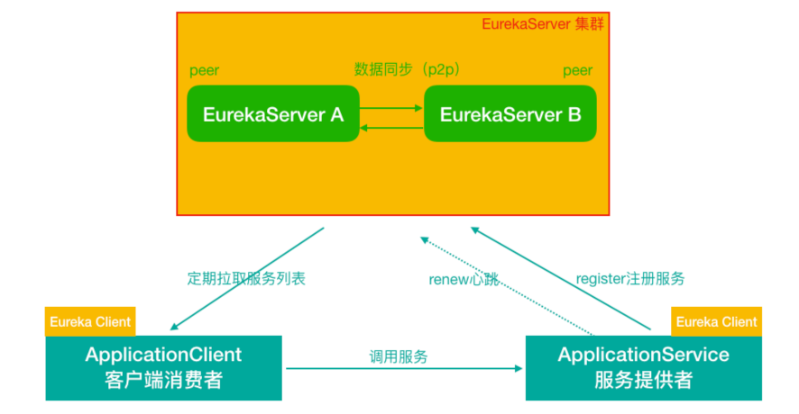

# 第一代 Spring Cloud 核心组件

说明:上面提到网关组件Zuul性能一般，未来将退出Spring Cloud 生态圈，所以我 们直接讲解GateWay，在课程章节规划时，我们就把GateWay划分到第一代Spring Cloud 核心组件这一部分了。


从形式上来说，Feign一个顶三，Feign = RestTemplate + Ribbon + Hystrix

# 第 1 节 Eureka服务注册中心

## 1.1 关于服务注册中心 

注意:服务注册中心本质上是为了解耦服务提供者和服务消费者。
对于任何一个微服务，原则上都应存在或者支持多个提供者(比如简历微服务部署 多个实例)，这是由微服务的分布式属性决定的。
更进一步，为了支持弹性扩缩容特性，一个微服务的提供者的数量和分布往往是动 态变化的，也是无法预先确定的。因此，原本在单体应用阶段常用的静态LB机制就 不再适用了，需要引入额外的组件来管理微服务提供者的注册与发现，而这个组件 就是服务注册中心。

### 1.1.1 服务注册中心一般原理


分布式微服务架构中，服务注册中心用于存储服务提供者地址信息、服务发布相关的属性信息，消费者通过主动查询和被动通知的方式获取服务提供者的地址信息，而不再需要通过硬编码方式得到提供者的地址信息。消费者只需要知道当前系统发布了那些服务，而不需要知道服务具体存在于什么位置，这就是透明化路由。

1)服务提供者启动 

2)服务提供者将相关服务信息主动注册到注册中心 

3)服务消费者获取服务注册信息: 
pull模式:服务消费者可以主动拉取可用的服务提供者清单
push模式:服务消费者订阅服务(当服务提供者有变化时，注册中心也会主动推送 更新后的服务清单给消费者

4)服务消费者直接调用服务提供者 另外，注册中心也需要完成服务提供者的健康监控，当发现服务提供者失效时需要及时剔除;

### **1.1.3** 主流服务中心对比 

**Zookeeper**

Zookeeper它是一个分布式服务框架，是Apache Hadoop 的一个子项目，它主 要是用来解决分布式应 用中经常遇到的一些数据管理问题，如:统一命名服 务、状态同步服务、集群管理、分布式应用配置项的管理等。

简单来说zookeeper本质=存储+监听通知。

znode

Zookeeper 用来做服务注册中心，主要是因为它具有节点变更通知功能，只要 客户端监听相关服务节点，服务节点的所有变更，都能及时的通知到监听客户 端，这样作为调用方只要使用 Zookeeper 的客户端就能实现服务节点的订阅和 变更通知功能了，非常方便。另外，Zookeeper 可用性也可以，因为只要半数 以上的选举节点存活，整个集群就是可用的。至少**3**个节点，这样可以容许一个不可用。

**Eureka**

由Netflix开源，并被Pivatal集成到SpringCloud体系中，它是基于 RestfulAPI ⻛格开发的服务注册与发现组件。

**Consul**

Consul是由HashiCorp基于Go语言开发的支持多数据中心分布式高可用的服务 发布和注册服务软件， 采用Raft算法保证服务的一致性，且支持健康检查。

**Nacos**

Nacos是一个更易于构建云原生应用的动态服务发现、配置管理和服务管理平 台。简单来说 Nacos 就是 注册中心 + 配置中心的组合，帮助我们解决微服务开 发必会涉及到的服务注册 与发现，服务配置，服务管理等问题。Nacos 是 Spring Cloud Alibaba 核心组件之一，负责服务注册与发现，还有配置。


P:分区容错性(一定的要满足的) ，C:数据一致性， A:高可用 。CAP不可能同时满足三个，要么是AP，要么是CP

## 1.2 服务注册中心组件 Eureka

服务注册中心的一般原理、对比了主流的服务注册中心方案 目光聚焦Eureka
Eureka 基础架构


- Eureka 交互流程及原理 

下图是官网描述的一个架构图


Eureka 包含两个组件:Eureka Server 和 Eureka Client，Eureka Client是一个 Java客户端，用于简化与Eureka Server的交互;Eureka Server提供服务发现的 能力，各个微服务启动时，会通过Eureka Client向Eureka Server 进行注册自己 的信息(例如网络信息)，Eureka Server会存储该服务的信息;

1)图中us-east-1c、us-east-1d，us-east-1e代表不同的区也就是不同的机房

2)图中每一个Eureka Server都是一个集群。

3)图中Application Service作为服务提供者向Eureka Server中注册服务， Eureka Server接受到注册事件会在集群和分区中进行数据同步，Application Client作为消费端(服务消费者)可以从Eureka Server中获取到服务注册信 息，进行服务调用。

4)微服务启动后，会周期性地向Eureka Server发送心跳(默认周期为30秒) 以续约自己的信息

5)Eureka Server在一定时间内没有接收到某个微服务节点的心跳，Eureka Server将会注销该微服务节点(默认90秒)

6)每个Eureka Server同时也是Eureka Client，多个Eureka Server之间通过复 制的方式完成服务注册列表的同步

7)Eureka Client会缓存Eureka Server中的信息。即使所有的Eureka Server节 点都宕掉，服务消费者依然可以使用缓存中的信息找到服务提供者

**Eureka通过心跳检测、健康检查和客户端缓存等机制，提高系统的灵活性、可 伸缩性和可用性。**

## **1.3 Eureka**应用及高可用集群

1)单实例Eureka Server—>访问管理界面—>Eureka Server集群 2)服务提供者(简历微服务注册到集群) 3)服务消费者(自动投递微服务注册到集群/从Eureka Server集群获取服务信息) 4)完成调用

### **1.3.1** 搭建单例**Eureka Server**服务注册中心

lagou-service-resume 8080-----

lagou-service-autodeliver 8090----

lagou-cloud-eureka-server 8761----

基于Maven构建SpringBoot工程，在SpringBoot工程之上搭建EurekaServer服务 (lagou-cloud-eureka-server-8761)

lagou-parent中引入Spring Cloud 依赖

Spring Cloud 是一个综合的项目，下面有很多子项目，比如eureka子项目(版 本号 1.x.x)

```
<dependencyManagement>
    <dependencies>
        <dependency>
            <groupId>org.springframework.cloud</groupId>
            <artifactId>spring-cloud-dependencies</artifactId>
            <version>Greenwich.RELEASE</version>
            <type>pom</type>
            <scope>import</scope>
        </dependency>
    </dependencies>
</dependencyManagement>
```

当前工程pom.xml中引入依赖

```
<dependencies>
    <!--Eureka server依赖-->
    <dependency>
        <groupId>org.springframework.cloud</groupId>
        <artifactId>spring-cloud-starter-netflix-eureka-server</artifactId>
    </dependency>
</dependencies>
```

**注意**:在父工程的pom文件中手动引入**jaxb**的jar，因为Jdk9之后默认没有加载该模 块，EurekaServer使用到，所以需要手动导入，否则EurekaServer服务无法启动
父工程pom.xml

```
<!--eureka server 需要引入Jaxb，开始-->
<dependency>
    <groupId>com.sun.xml.bind</groupId>
    <artifactId>jaxb-core</artifactId>
    <version>2.2.11</version>
</dependency>
<dependency>
    <groupId>javax.xml.bind</groupId>
    <artifactId>jaxb-api</artifactId>
</dependency>
<dependency>
    <groupId>com.sun.xml.bind</groupId>
    <artifactId>jaxb-impl</artifactId>
    <version>2.2.11</version>
</dependency>
<dependency>
    <groupId>org.glassfish.jaxb</groupId>
    <artifactId>jaxb-runtime</artifactId>
    <version>2.2.10-b140310.1920</version>
</dependency>
<dependency>
    <groupId>javax.activation</groupId>
    <artifactId>activation</artifactId>
    <version>1.1.1</version>
</dependency>
<!--引入Jaxb，结束-->
```

- application.yml

```
#eureka server
server:
  port: 8761
spring:
  application:
    name: sc-erueka-server #应用名称，会在eureka中作为服务名称

    # eureka 客户端配置（和server交互），Eureka Server 其实也是一个Client
eureka:
  instance:
    hostname: localhost # 当前Eureka实例的主机名
  client:
    service-url: # 配置客户端锁交互的Eureka Server 的地址
      defaultZone: http://${eureka.instance.hostname}:${server.port}/eureka
    register-with-eureka: false # 当前自己就是server，不需要注册自己
    fetch-registry: false # 查询获取注册中心的服务信息，自己就是Server，不需要，默认时true，此处置为false
```

- SpringBootApplication

```
@SpringBootApplication
@EnableEurekaServer//声明当前项目为eureka服务
public class EurekaServerApp8761 {
    public static void main(String[] args) {
        SpringApplication.run(EurekaServerApp8761.class, args);
    }
}
```


执行启动类LagouCloudEurekaServerApplication的main函数 访问http://127.0.0.1:8761，如果看到如下⻚面(Eureka注册中心后台)，则表 明EurekaServer发布成功


### 1.3.2 搭建Eureka Server HA高可用集群

在互联网应用中，服务实例很少有单个的。

即使微服务消费者会缓存服务列表，但是如果EurekaServer只有一个实例，该实例 挂掉，正好微服务消费者本地缓存列表中的服务实例也不可用，那么这个时候整个 系统都受影响。

在生产环境中，我们会配置Eureka Server集群实现高可用。Eureka Server集群之 中的节点通过**点对点(P2P)通信的方式共享服务注册表**。我们开启两台 Eureka Server 以搭建集群。



(1)修改本机host属性

由于是在个人计算机中进行测试很难模拟多主机的情况，Eureka配置server集群时 需要执行host地址。 所以需要修改个人电脑中host地址

```
127.0.0.1 EurekaServerA
127.0.0.1 EurekaServerB
```

(2)修改 eureka-server 工程中的yml配置文件

```yml
#eureka server
server:
  port: 8761
spring:
  application:
    name: sc-erueka-server #应用名称，会在eureka中作为服务名称

    # eureka 客户端配置（和server交互），Eureka Server 其实也是一个Client
eureka:
  instance:
    hostname: EurekaServerA # 当前Eureka实例的主机名
  client:
    # Eureka server 集群中每一个server相对于其他server都是client
    service-url: # 配置客户端锁交互的Eureka Server 的地址
      # 集群模式下，defaultZone应指向其他Eureka server，若有更多其他实例，使用逗号分隔
      defaultZone: http://EurekaServerB:8762/eureka
    register-with-eureka: true # 当前自己就是server，不需要注册自己，若是集群模式，需为true
    fetch-registry: true # 查询获取注册中心的服务信息，自己就是Server，不需要，默认时true，集群模式下使用true
    
---
#eureka server
server:
  port: 8762
spring:
  application:
    name: sc-erueka-server #应用名称，会在eureka中作为服务名称

    # eureka 客户端配置（和server交互），Eureka Server 其实也是一个Client
eureka:
  instance:
    hostname: EurekaServerB # 当前Eureka实例的主机名
  client:
    service-url: # 配置客户端锁交互的Eureka Server 的地址
      defaultZone: http://EurekaServerA:8761/eureka
    register-with-eureka: true
    fetch-registry: true


```

**说明**

在 一个实例中，把另外的实例作为了集群中的镜像节点，那么这个http://LagouCloudEurekaServerB:8762/eureka URL 中的 LagouCloudEurekaServerB 就要和其它个profile 中的eureka.instance.hostname 保持一致。

register-with-eureka 和 fetch-registry 在单节点时设置为了 false, 因为 只有一台 Eureka Server，并不需要自己注册自己，而现在有了集群，可以在集 群的其他节点中注册本服务


### 1.3.3 微服务提供者—>注册到Eureka Server集群 

注册简历微服务(简历服务部署两个实例，分别占用8080、8081端口)
父工程中引入spring-cloud-commons依赖

pom文件引入坐标，添加eureka client的相关坐标

配置application.yml文件
 在application.yml 中添加Eureka Server高可用集群的地址及相关配置

```
eureka:
  client:
    service-url:
      #注册到集群
      defaultZone: http://EurekaServerA:8761/eureka,http://EurekaServerB:8762/eureka
```

启动类

```java
@SpringBootApplication
@EntityScan("com.shred.sc.pojo")
//@EnableEurekaClient // 开启EurekaClient
@EnableDiscoveryClient //开启注册中心客户端（通用注解，如注册到Eureka、Nacos等
    //说明：从 SpringCloud Edgware版本开始，可以不佳注解
public class ShredResumeApplication {
    public static void main(String[] args) {
        SpringApplication.run(ShredResumeApplication.class, args);
    }
}
```

**注意:**

1)从Spring Cloud Edgware版本开始，@EnableDiscoveryClient 或 @EnableEurekaClient 可省略。只需加 上相关依赖，并进行相应配置，即可将 微服务注册到服务发现组件上。

2)@EnableDiscoveryClient和@EnableEurekaClient二者的功能是一样的。但 是如果选用的是eureka服务器，那么就推荐@EnableEurekaClient，如果是其 他的注册中心，那么推荐使用@EnableDiscoveryClient，考虑到通用性，后期 我们可以使用@EnableDiscoveryClient

#### **高级配置**

```
eureka:
  client:
    service-url:
      #注册到集群
      defaultZone: http://EurekaServerA:8761/eureka,http://EurekaServerB:8762/eureka
  instance:
    #使用ip注册，否则会使用主机名注册了(此处考虑到对老版本的兼容，新版本经过实验都是ip)
    prefer-ip-address: true
    #自定义实例显示格式，加上版本号，便于多版本管理，注意是ip-address，早期版本是ipAddress
    instance-id: ${spring.cloud.client.ip-address}:${spring.application.name}:${server.port}:@project.version@
```


### 1.3.4 微服务消费者—>注册到Eureka Server集群 

此处自动注册微服务是消费者
pom文件引入坐标，添加eureka client的相关坐标

```
<dependency>
   <groupId>org.springframework.cloud</groupId>
   <artifactId>spring-cloud-commons</artifactId>
 </dependency>
 <dependency>
   <groupId>org.springframework.cloud</groupId>
   <artifactId>spring-cloud-starter-netflix-eureka-client</artifactId>
 </dependency>
```

配置application.yml文件

```
eureka:
  client:
    service-url:
      #注册到集群
      defaultZone: http://EurekaServerA:8761/eureka,http://EurekaServerB:8762/eureka
  instance:
    #使用ip注册，否则会使用主机名注册了(此处考虑到对老版本的兼容，新版本经过实验都是ip)
    prefer-ip-address: true
    #自定义实例显示格式，加上版本号，便于多版本管理，注意是ip-address，早期版本是ipAddress
    instance-id: ${spring.cloud.client.ip-address}:${spring.application.name}:${server.port}:@project.version@
```

启动类

```
@SpringBootApplication
@EnableDiscoveryClient // 开启服务发现
public class AutoDeliverApplication {

    public static void main(String[] args) {
        SpringApplication.run(AutoDeliverApplication.class, args);
    }

    @Bean
    public RestTemplate restTemplate(){
        return new RestTemplate();
    }
}
```

### 1.3.5 服务消费者调用服务提供者(通过Eureka)

```
@RestController
@RequestMapping("/autodeliver")
public class AutoDeliverController {
    @Autowired
    private RestTemplate restTemplate;

    @Autowired
    private DiscoveryClient discoveryClient;

    @GetMapping("/checkStatu/{userId}")
    public Integer findResumeOpenState(@PathVariable Long userId){
        List<ServiceInstance> instances = discoveryClient.getInstances("sc-resume");
        ServiceInstance serviceInstance = instances.get(0);
        String host = serviceInstance.getHost();
        int port = serviceInstance.getPort();

        //调用远程服务 - 简历微服务
        String url = "http://"+host+":"+port+"/resume/openstate/" + userId;
        System.out.println("从Eureka集群 获取服务实例 url："+url);
        Integer openStatus = restTemplate.getForObject(url, Integer.class);
        return openStatus;
    }
}
```

## 1.4 Eureka细节详解 

### 1.4.1 Eureka元数据详解

Eureka的元数据有两种:标准元数据和自定义元数据。 

**标准元数据**:主机名、IP地址、端口号等信息，这些信息都会被发布在服务注册表中，用于服务之间的调用。

**自定义元数据**:可以使用eureka.instance.metadata-map配置，符合KEY/VALUE的 存储格式。这 些元数据可以在远程客户端中访问。

类似于

```
metadata-map:
  # 自定义元数据(kv自定义)
  cluster: cl1
  region: rn1
```

### 1.4.2 Eureka客户端详解 

服务提供者(也是Eureka客户端)要向EurekaServer注册服务，并完成服务续约等
工作

#### 服务注册详解(服务提供者)

1)当我们导入了eureka-client依赖坐标，配置Eureka服务注册中心地址 

2)服务在启动时会向注册中心发起注册请求，携带服务元数据信息 

3)Eureka注册中心会把服务的信息保存在Map中。

#### 服务续约详解(服务提供者)

服务每隔30秒会向注册中心**续约(心跳)**一次(也称为**报活**)，如果没有续约，租约在 90秒后到期，然后服务会被失效。每隔30秒的续约操作我们称之为**心跳检测**

往往不需要我们调整这两个配置

```
 
#向Eureka服务中心集群注册服务 
eureka:
	instance:
    # 租约续约间隔时间，默认30秒 
    lease-renewal-interval-in-seconds: 30
    # 租约到期，服务时效时间，默认值90秒,服务超过90秒没有发生心跳，EurekaServer会将服务从列表移除 
    lease-expiration-duration-in-seconds: 90
```

#### 获取服务列表详解(服务消费者)

每隔30秒服务会从注册中心中拉取一份服务列表，这个时间可以通过配置修改。往 往不需要我们调整

```
#向Eureka服务中心集群注册服务 
eureka:
	client:
# 每隔多久拉取一次服务列表 
		registry-fetch-interval-seconds: 30
```

1)服务消费者启动时，从 EurekaServer服务列表获取只读备份，缓存到本地 

2)每隔30秒，会重新获取并更新数据

3)每隔30秒的时间可以通过配置`eureka.client.registry-fetch-interval-seconds` 修改

### 1.4.3 Eureka服务端详解 

#### 服务下线

1)当服务正常关闭操作时，会发送服务下线的REST请求给EurekaServer。 

2)服务中心接受到请求后，将该服务置为下线状态

#### 失效剔除

Eureka Server会定时(间隔值是`eureka.server.eviction-interval-timer-in-ms`，**默认60s**)进行检查，如果发现实例在在一定时间(此值由客户端设置的 `eureka.instance.lease-expiration-duration-in-seconds`定义，**默认值为90s**)内没 有收到心跳，则会注销此实例。

#### 自我保护

> 避免误杀

服务提供者 —> 注册中心 定期的续约(服务提供者和注册中心通信)，**假如服务提供者和注册中心之间的网**
**络有点问题，不代表服务提供者不可用，不代表服务消费者无法访问服务提供者** 

如果**在15分钟内超过85%的客户端节点都没有正常的心跳，那么Eureka就认为客户端与注册中心出现了网络故障**，Eureka Server自动进入自我保护机制。

为什么会有自我保护机制?
默认情况下，如果Eureka Server在一定时间内(默认90秒)没有接收到某个微服务 实例的心跳，Eureka Server将会移除该实例。但是当网络分区故障发生时，微服务 与Eureka Server之间无法正常通信，而微服务本身是正常运行的，此时不应该移除 这个微服务，所以引入了自我保护机制。
服务中心⻚面会显示如下提示信息

#### 当处于自我保护模式时

1、**不会剔除任何服务实例**(可能是服务提供者和EurekaServer之间网络问题)，保 证了大多数服务依然可用

2、Eureka Server仍然能够接受新服务的注册和查询请求，但是不会被同步到其它节点上，保证当前节点依然可用，当网络稳定时，当前Eureka Server新的注册信息 会被同步到其它节点中。

3、在Eureka Server工程中通过`eureka.server.enable-self-preservation`配置可用 关停自我保护，**默认值是打开**

```
eureka:
  server:
  	enable-self-preservation: false # 关闭自我保护模式(缺省为打开)
```

**经验：建议生产环境打开自我保护机制**


# 第 2 节 Ribbon负载均衡 

## 2.1 关于负载均衡

负载均衡一般分为**服务器端负载均衡**和**客户端负载均衡** 

所谓**服务器端负载均衡**，比如Nginx、F5这些，请求到达服务器之后由这些负载均衡器根据一定的算法将请求路由到目标服务器处理。

所谓**客户端负载均衡**，比如我们要说的Ribbon，服务消费者客户端会有一个服务器 地址列表，调用方在请求前通过一定的负载均衡算法选择一个服务器进行访问，负 载均衡算法的执行是在请求客户端进行。

Ribbon是Netflix发布的负载均衡器。Eureka一般配合Ribbon进行使用，Ribbon利 用从Eureka中读取到服务信息，在调用服务提供者提供的服务时，会根据一定的算 法进行负载。


## 2.2 Ribbon高级应用

不需要引入额外的Jar坐标，因为在服务消费者中我们引入过eureka-client，它会引 入Ribbon相关Jar


代码中使用如下，在RestTemplate上添加对应注解即可

```java
@Bean
// Ribbon负载均衡
@LoadBalanced
public RestTemplate restTemplate(){
    return new RestTemplate();
}
```

修改服务消费端：sc-autodeliver

```java
@GetMapping("/checkState/{userId}")
public Integer findResumeOpenState(@PathVariable Long userId){

    //调用远程服务 - 简历微服务
    String url = "http://"+"SC-RESUME"+"/resume/openstate/" + userId;
    System.out.println("从Eureka集群 获取服务实例 url："+url);
    Integer openStatus = restTemplate.getForObject(url, Integer.class);
    return openStatus;
}
```


## 2.3 Ribbon负载均衡策略

Ribbon内置了多种负载均衡策略，内部负责复杂均衡的顶级接口为 `com.netflix.loadbalancer.IRule` ，类树如下


策略：


修改负载均衡策略


# 第 3 节 Hystrix熔断器

属于一种容错机制

## 3.1 微服务中的雪崩效应 

### 什么是微服务中的雪崩效应呢?

微服务中，一个请求可能需要多个微服务接口才能实现，会形成复杂的调用链路。


- 扇入:代表着该微服务被调用的次数，扇入大，说明该模块复用性好
- 扇出:该微服务调用其他微服务的个数，扇出大，说明业务逻辑复杂
- 扇入大是一个好事，扇出大不一定是好事


#### 雪崩效应

在微服务架构中，一个应用可能会有多个微服务组成，微服务之间的数据交互通过 远程过程调用完成。这就带来一个问题，假设微服务A调用微服务B和微服务C，微 服务B和微服务C又调用其它的微服务，这就是所谓的“扇出”。如果扇出的链路上某 个微服务的调用响应时间过⻓或者不可用，对微服务A的调用就会占用越来越多的系 统资源，进而引起系统崩溃，所谓的“**雪崩效应**”。

如图中所示，最下游简历微服务响应时间过⻓，大量请求阻塞，大量线程不会释 放，会导致服务器资源耗尽，最终导致上游服务甚至整个系统瘫痪。

## 3.2 雪崩效应解决方案 

从可用性可靠性着想，为防止系统的整体缓慢甚至崩溃，采用的技术手段;
下面，我们介绍三种技术手段应对微服务中的雪崩效应，这三种手段都是从系统可
用性、可靠性⻆度出发，尽量防止系统整体缓慢甚至瘫痪。

### 服务熔断

熔断机制是应对雪崩效应的一种微服务链路保护机制。我们在各种场景下都会接触
到熔断这两个字。高压电路中，如果某个地方的电压过高，熔断器就会熔断，对电
路进行保护。股票交易中，如果股票指数过高，也会采用熔断机制，暂停股票的交
易。同样，在微服务架构中，熔断机制也是起着类似的作用。当扇出链路的某个微
服务不可用或者响应时间太⻓时，熔断该节点微服务的调用，进行服务的降级，快
速返回错误的响应信息。当检测到该节点微服务调用响应正常后，恢复调用链路。

注意:
1)服务熔断重点在“断”，切断对下游服务的调用 

2)**服务熔断和服务降级往往是一起使用的**，Hystrix就是这样。 

### 服务降级

通俗讲就是整体资源不够用了，先将一些不关紧的服务停掉(调用我的时候，给你 返回一个预留的值，也叫做兜底数据)，待渡过难关高峰过去，再把那些服务打 开。
服务降级一般是从整体考虑，就是当某个服务熔断之后，服务器将不再被调用，此 刻**客户端可以自己准备一个本地的fallback回调，返回一个缺省值，**这样做，虽然服 务水平下降，但好歹可用，比直接挂掉要强。


### 服务限流

服务降级是当服务出问题或者影响到核心流程的性能时，暂时将服务屏蔽掉，待高 峰或者问题解决后再打开;但是有些场景并不能用服务降级来解决，比如秒杀业务 这样的核心功能，这个时候可以结合服务限流来限制这些场景的并发/请求量

限流措施也很多，比如

- 限制总并发数(比如数据库连接池、线程池) 
- 限制瞬时并发数(如nginx限制瞬时并发连接数) 
- 限制时间窗口内的平均速率(如Guava的RateLimiter、nginx的limit_req模块， 限制每秒的平均速率)
- 限制远程接口调用速率、限制MQ的消费速率等

## 3.3 Hystrix简介

[来自官网]Hystrix(豪猪----->刺)，宣言“defend your app”是由Netflix开源的一个 延迟和容错库，用于隔离访问远程系统、服务或者第三方库，防止级联失败，从而 提升系统的可用性与容错性。Hystrix主要通过以下几点实现延迟和容错。

- 包裹请求:使用`HystrixCommand`包裹对依赖的调用逻辑。 自动投递微服务方 法(`@HystrixCommand` 添加Hystrix控制) ——调用简历微服务 
- 跳闸机制:当某服务的错误率超过一定的阈值时，Hystrix可以跳闸，停止请求 该服务一段时间。 
- 资源隔离:Hystrix为每个依赖都维护了一个小型的线程池**(舱壁模式)(或者信号量)**。如果该线程池已满， 发往该依赖的请求就被立即拒绝，而不是排队等 待，从而加速失败判定。 
- 监控:Hystrix可以近乎实时地监控运行指标和配置的变化，例如成功、失败、 超时、以及被拒绝 的请求等。 
- 回退机制:当请求失败、超时、被拒绝，或当断路器打开时，执行回退逻辑。回 退逻辑由开发人员 自行提供，例如返回一个缺省值。 
- 自我修复:断路器打开一段时间后，会自动进入“半开”状态。


## 3.4 Hystrix熔断应用

目的:简历微服务⻓时间没有响应，服务消费者—>自动投递微服务快速失败给用户 提示


- 服务消费者工程(自动投递微服务)中引入Hystrix依赖坐标(也可以添加在父 工程中)

```
<!--熔断器Hystrix-->
<dependency>
    <groupId>org.springframework.cloud</groupId>
    <artifactId>spring-cloud-starter-netflix-hystrix</artifactId>
</dependency>
```


```
/**
 * @author Spencer Gibb
 */
@Target(ElementType.TYPE)
@Retention(RetentionPolicy.RUNTIME)
@Documented
@Inherited
@SpringBootApplication
@EnableDiscoveryClient
@EnableCircuitBreaker
public @interface SpringCloudApplication {
}
```


- 服务消费者工程(自动投递微服务)的启动类中添加熔断器开启注解
  @EnableCircuitBreaker

- 定义服务降级处理方法，并在业务方法上使用@HystrixCommand的 fallbackMethod属性关联到服务降级处理方法

注意**
  降级(兜底)方法必须和被降级方法相同的方法签名(相同参数列表、相同
返回值) 可以在类上使用@DefaultProperties注解统一指定整个类中共用的降级(兜 底)方法
服务提供者端(简历微服务)模拟请求超时(线程休眠3s)，只修改8080实 例，8081不修改，对比观察


## 3.5 Hystrix舱壁模式(线程池隔离策略)


如果不进行任何设置，所有熔断方法使用一个Hystrix线程池(10个线程)，那么这 样的话会导致问题，这个问题并不是扇出链路微服务不可用导致的，而是我们的线 程机制导致的，如果方法A的请求把10个线程都用了，方法2请求处理的时候压根都 没法去访问B，因为没有线程可用，并不是B服务不可用。

### 线程隔离


为了避免问题服务请求过多导致正常服务无法访问，Hystrix 不是采用增加线程数， 而是**单独的为每一个控制方法创建一个线程池的方式**，这种模式叫做“**舱壁模式**"，也 是线程隔离的手段。


**我们可以使用一些手段查看线程情况**

- jps查看java进程
- jstack


发起请求，可以使用PostMan模拟批量请求

可用看到默认有10个


Hystrix舱壁模式程序修改

```
   @HystrixCommand(
            commandProperties = {
                    @HystrixProperty(name ="execution.isolation.thread.timeoutInMilliseconds", value="2000")
            },
            //线程池标识，相同则使用 同样的线程池
            threadPoolKey = "findResumeOpenStateTimeout",
            // 线程池细节属性
            threadPoolProperties = {
                    @HystrixProperty(name ="coreSize", value = "1"),//线程数
                    @HystrixProperty(name="maxQueueSize",value = "20")//等待队列的长度
            }
    )
    @GetMapping("/checkStateTimeout/{userId}")
    public Integer findResumeOpenStateTimeout(@PathVariable Long userId){

        //调用远程服务 - 简历微服务
        String url = "http://"+"SC-RESUME"+"/resume/openstate/" + userId;
        System.out.println("从Eureka集群 获取服务实例 url："+url);
        Integer openStatus = restTemplate.getForObject(url, Integer.class);
        return openStatus;
    }
    

@HystrixCommand(
        //线程池标识，相同则使用 同样的线程池
        threadPoolKey = "findResumeOpenStateFallback",
        // 线程池细节属性
        threadPoolProperties = {
                @HystrixProperty(name ="coreSize", value = "2"),//线程数
                @HystrixProperty(name="maxQueue",value = "20")//等待队列的长度
        },
        commandProperties = {
                @HystrixProperty(name = "execution.isolation.thread.timeoutInMilliseconds", value="2000")
        },
        fallbackMethod = "myFallBack"//回退方法
)
@GetMapping("/findResumeOpenStateFallback/{userId}")
    public Integer findResumeOpenStateFallback(@PathVariable Long userId){

        //调用远程服务 - 简历微服务
        String url = "http://"+"SC-RESUME"+"/resume/openstate/" + userId;
        System.out.println("从Eureka集群 获取服务实例 url："+url);
        Integer openStatus = restTemplate.getForObject(url, Integer.class);
        return openStatus;
    }
```

可一看到，timout只有一个线程，fallback有两个。


## 3.6 Hystrix工作流程与高级应用


1)当调用出现问题时，开启一个时间窗(10s) 

2)在这个时间窗内，统计调用次数是否达到最小请求数? 如果没有达到，则重置统计信息，回到第1步 如果达到了，则统计失败的请求数占所有请求数的百分比，是否达到阈值? 如果达到，则跳闸(不再请求对应服务) 如果没有达到，则重置统计信息，回到第1步

3)如果跳闸，则会开启一个活动窗口(默认5s)，每隔5s，Hystrix会让一个请求 通过,到达那个问题服务，看 是否调用成功，如果成功，重置断路器回到第1步，如 果失败，回到第3步


基于springboot的健康检查观察跳闸状态(自动投递微服务暴露健康检查细节)

```
  # springboot中暴露健康检查等断点接口
management:
  endpoints:
    web:
      exposure:
        include: "*"
    # 暴露健康接口的细节
  endpoint:
    health:
      show-details: always
```

hystrix

```json
  "hystrix": {
            "status": "UP"
        }
```

跳闸状态

```json
"hystrix": {
    "status": "CIRCUIT_OPEN",
    "details": {
        "openCircuitBreakers": [
            "AutoDeliverController::findResumeOpenStateFallback"
        ]
    }
}
```

### 全局配置

```
  # 配置熔断策略:
hystrix:
  command:
    default:
      circuitBreaker:
        # 强制打开熔断器，如果该属性设置为true，强制断路器进入打开状态，将会拒绝所有的请求。 默认false关闭的
        forceOpen: false
        # 触发熔断错误比例阈值，默认值50%
        errorThresholdPercentage: 50
        # 熔断后休眠时⻓，默认值5秒
        sleepWindowInMilliseconds: 3000
        # 熔断触发最小请求次数，默认值是20
        requestVolumeThreshold: 2
      execution:
        isolation:
          thread:
            # 熔断超时设置，默认为1秒
            timeoutInMilliseconds: 2000
```

## 3.7 Hystrix Dashboard断路监控仪表盘

正常状态是UP，跳闸是一种状态`CIRCUIT_OPEN`，可以通过/health查看，前提是工 程中需要引入SpringBoot的actuator(健康监控)，它提供了很多监控所需的接 口，可以对应用系统进行配置查看、相关功能统计等。
已经统一添加在父工程中

```
<dependency>
    <groupId>org.springframework.boot</groupId>
    <artifactId>spring-boot-starter-actuator</artifactId>
</dependency>
```

如果我们想看到Hystrix相关数据，比如有多少请求、多少成功、多少失败、多少降 级等，那么引入SpringBoot健康监控之后，访问/actuator/hystrix.stream接口可以 获取到监控的文字信息，但是不直观，所以Hystrix官方还提供了基于图形化的 DashBoard(仪表板)监控平 台。Hystrix仪表板可以显示每个断路器(被 @HystrixCommand注解的方法)的状态。


1)新建一个监控服务工程，导入依赖


```
server:
  port: 9000
Spring:
  application:
    name: sc-hystrix-dashboard

eureka:
  client:
    service-url:
      #注册到集群
      defaultZone: http://EurekaServerA:8761/eureka,http://EurekaServerB:8762/eureka
  instance:
    #使用ip注册，否则会使用主机名注册了(此处考虑到对老版本的兼容，新版本经过实验都是ip)
    prefer-ip-address: true
    #自定义实例显示格式，加上版本号，便于多版本管理，注意是ip-address，早期版本是ipAddress
    instance-id: ${spring.cloud.client.ip-address}:${spring.application.name}:${server.port}:@project.version@
```

2)启动类添加@EnableHystrixDashboard激活仪表盘

```
@EnableHystrixDashboard
@SpringBootApplication
@EnableDiscoveryClient
public class HystrixDashBoardApplication9000 {
    public static void main(String[] args) {
        SpringApplication.run(HystrixDashBoardApplication9000.class, args);
    }
}
```


4)在**被监测的微服务中注册监控servlet**(自动投递微服务，监控数据就是来自于这 个微服务)

```
/**
 * 被监控的微服务中注册一个servlet，后期通过该servlet进行Hystrix监控
 * 前提：被监控的微服务引用acuator
 * @return
 */
@Bean
public ServletRegistrationBean getServlet() {
    HystrixMetricsStreamServlet streamServlet = new HystrixMetricsStreamServlet();
    ServletRegistrationBean registrationBean = new ServletRegistrationBean(streamServlet);
    registrationBean.setLoadOnStartup(1);
    registrationBean.addUrlMappings("/actuator/hystrix.stream");
    registrationBean.setName("HystrixMetricsStreamServlet");
    return registrationBean;
}
```

监控服务消费者http://localhost:8090/actuator/hystrix.stream

被监控微服务发布之后，可以直接访问监控servlet，但是得到的数据并不直观，后 期可以结合仪表盘更友好的展示


5)访问测试http://localhost:9000/hystrix


输入监控的微服务端点地址，展示监控的详细数据，比如监控服务消费者http://localhost:8090/actuator/hystrix.stream


百分比，10s内错误请求百分比 实心圆:

- 大小:代表请求流量的大小，流量越大球越大
- 颜色:代表请求处理的健康状态，从绿色到红色递减，绿色代表健康，红色就代表很不健康

曲线波动图: 

记录了2分钟内该方法上流量的变化波动图，判断流量上升或者下降的趋势

## 3.8 Hystrix Turbine聚合监控 

之前，我们针对的是一个微服务实例的Hystrix数据查询分析，在微服务架构下，一个微服务的实例往往是多个(集群化)
比如自动投递微服务
实例1(hystrix) ip1:port1/actuator/hystrix.stream
实例2(hystrix) ip2:port2/actuator/hystrix.stream
实例3(hystrix) ip3:port3/actuator/hystrix.stream
按照已有的方法，我们就可以结合dashboard仪表盘每次输入一个监控数据流url， 进去查看

手工操作能否被自动功能替代?Hystrix Turbine聚合(聚合各个实例上的hystrix监 控数据)监控

### Turbine(涡轮)

思考:微服务架构下，一个微服务往往部署多个实例，如果每次只能查看单个实例 的监控，就需要经常切换很不方便，在这样的场景下，我们可以使用 Hystrix Turbine 进行聚合监控，它可以把相关微服务的监控数据聚合在一起，便于查看。


### Turbine服务搭建 

1)新建项目lagou-cloud-hystrix-turbine-9001，引入依赖坐标

```xml
<dependencies>
    <!--hystrix turbine聚合监控-->
    <dependency>
        <groupId>org.springframework.cloud</groupId>
        <artifactId>spring-cloud-starter-netflix-turbine</artifactId>
    </dependency>

        <!--
        1、微服务架构下的服务都尽量注册到服务中心去，便于统一管
        2、后续在当前turbine项目中我们需要配置turbine聚合的服务，比如，service-autodeliver这个服务的各个实例的hystrix数据流，那随后
            我们就需要在application.yml文件中配置这个服务名，那么 turbine获取服务下具体实例的数据流的时候需要ip和端口等实例信息，
            那么怎么根据服务名称获取到这些信息？
                当然可以从eureka服务注册中心获取
        -->
    <dependency>
        <groupId>org.springframework.cloud</groupId>
        <artifactId>spring-cloud-starter-netflix-eureka-client</artifactId>
    </dependency>
</dependencies>
```

2)将需要进行Hystrix监控的多个微服务配置起来，在工程application.yml中开启 Turbine及进行相关配置

```
server:
  port: 9001

Spring:
  application:
    name: sc-hystrix-turbine

#turbine配置
turbine:
  # appCofing配置需要聚合的服务名称，比如这里聚合自动投递微服务的hystrix监控 数据
  # 如果要聚合多个微服务的监控数据，那么可以使用英文逗号拼接，比如 a,b,c
  appConfig: sc-autodeliver
  clusterNameExpression: "'default'" # 集群默认名称

eureka:
  client:
    service-url:
      #注册到集群
      defaultZone: http://EurekaServerA:8761/eureka,http://EurekaServerB:8762/eureka
  instance:
    #使用ip注册，否则会使用主机名注册了(此处考虑到对老版本的兼容，新版本经过实验都是ip)
    prefer-ip-address: true
    #自定义实例显示格式，加上版本号，便于多版本管理，注意是ip-address，早期版本是ipAddress
    instance-id: ${spring.cloud.client.ip-address}:${spring.application.name}:${server.port}:@project.version@
```


3)在当前项目启动类上添加注解@EnableTurbine，开启仪表盘以及Turbine聚合

```
@SpringBootApplication
@EnableDiscoveryClient
@EnableTurbine// 开启turbine聚合
public class HystrixTurbineApplication9001 {
    public static void main(String[] args) {
        SpringApplication.run(HystrixTurbineApplication9001.class, args);
    }
}
```

4)浏览器访问Turbine项目，http://localhost:9001/turbine.stream，就可以看到 监控数据了


# 第 4 节 Feign远程调用组件

 服务消费者调用服务提供者的时候使用RestTemplate技术

存在不便之处

- 拼接url 
- restTmplate.getForObJect 

这两处代码都比较模板化，能不能不让我我们来写这种模板化的东⻄ 另外来说，拼接url非常的low，拼接字符串，拼接参数，很low还容易出错

## 4.1 Feign简介

Feign是Netflix开发的一个轻量级RESTful的HTTP服务客户端(用它来发起请求， 远程调用的)，是以Java接口注解的方式调用Http请求，而不用像Java中通过封装 HTTP请求报文的方式直接调用，Feign被广泛应用在Spring Cloud 的解决方案中。

类似于Dubbo，服务消费者拿到服务提供者的接口，然后像调用本地接口方法一样 去调用，实际发出的是远程的请求。

- Feign可帮助我们更加便捷，优雅的调用HTTP API:不需要我们去拼接url然后 呢调用restTemplate的api，在SpringCloud中，使用Feign非常简单，创建一个 接口(在消费者--服务调用方这一端)，并在接口上添加一些注解，代码就完成 了
- SpringCloud对Feign进行了增强，使Feign支持了SpringMVC注解 (**OpenFeign**)

**本质：封装了Http调用流程，更符合面向接口化的编程习惯，类似于Dubbo的服务调用**

Dubbo的调用方式其实就是很好的面向接口编程

## 4.2 Feign配置应用

在服务调用者工程(消费)创建接口(添加注解)

 (效果)**Feign = RestTemplate+Ribbon+Hystrix**

- 服务消费者工程 引入Feign依赖(或者父类工程)

```xml
<dependency>
    <groupId>org.springframework.cloud</groupId>
    <artifactId>spring-cloud-starter-openfeign</artifactId>
</dependency>
```

- 服务消费者工程 启动类使用注解@EnableFeignClients添加 Feign支持

```
@SpringBootApplication
@EnableDiscoveryClient // 开启服务发现
@EnableFeignClients// 开启feign客户端
public class AutoDeliverApplication8096 {

    public static void main(String[] args) {
        SpringApplication.run(AutoDeliverApplication8096.class, args);
    }

}
```

注意:此时去掉Hystrix熔断的支持注解@EnableCircuitBreaker即可包括引入的 依赖，因为Feign会自动引入

- 编写FeignClient

注意:

1)@FeignClient注解的name属性用于指定要调用的服务提供者名称，和服务 提供者yml文件中spring.application.name保持一致

2)接口中的接口方法，就好比是远程服务提供者Controller中的Hander方法 (只不过如同本地调用了)，那么在进行参数绑定的时，可以使用 @PathVariable、@RequestParam、@RequestHeader等，这也是OpenFeign 对SpringMVC注解的支持，但是需要注意value必须设置，否则会抛出异常

```
/**
 * Feign 做的事：获取服务提供者的url，拼接路径，发起请求
 */
//@FeignClient表明当前类是Feign客户端
// value指定该客户端要请求的服务名称，（登记到注册中心上，服务提供者的服务名）
@FeignClient(value = "sc-resume")
@RequestMapping("/resume")
public interface ResumeServiceFeignClient {

    @GetMapping("/openstate/{userId}")
    public Integer findDefaultResumeState(@PathVariable("userId") Long userId);//PathVariable此处需要指定
}
```

- 使用接口中方法完成远程调用(注入接口即可，实际注入的是接口的实现)

```
@RestController
@RequestMapping("/autodeliver")
public class AutoDeliverController {

    @Autowired
    private ResumeServiceFeignClient resumeServiceFeignClient;

    @GetMapping("/checkState/{userId}")
    public Integer findResumeOpenState(@PathVariable Long userId){

        return resumeServiceFeignClient.findDefaultResumeState(userId);
    }

}
```


## 4.3 Feign对负载均衡的支持

Feign 本身已经集成了Ribbon依赖和自动配置，因此我们不需要额外引入依赖，可 以通过 ribbon.xx 来进 行全局配置,也可以通过服务名.ribbon.xx 来对指定服务进行 细节配置配置(参考之前，此处略)

Feign默认的请求处理超时时⻓1s，有时候我们的业务确实执行的需要一定时间，那 么这个时候，我们就需要调整请求处理超时时⻓，Feign自己有超时设置，如果配置 Ribbon的超时，则会以Ribbon的为准

Ribbon配置

```
SC-RESUME: #服务名
  ribbon:
    #请求连接超时时间 
    #ConnectTimeout: 2000
    #请求处理超时时间 
    #ReadTimeout: 5000 
    #对所有操作都进行重试
    OkToRetryOnAllOperations: true
    ####根据如上配置，当访问到故障请求的时候，它会再尝试访问一次当前实例(次数 由MaxAutoRetries配置)，
    ####如果不行，就换一个实例进行访问，如果还不行，再换一次实例访问(更换次数 由MaxAutoRetriesNextServer配置)，
    ####如果依然不行，返回失败信息。
    MaxAutoRetries: 0 #对当前选中实例重试次数，不包括第一次调用 
    MaxAutoRetriesNextServer: 0 #切换实例的重试次数
    NFLoadBalancerRuleClassName: com.netflix.loadbalancer.RoundRobinRule
```

## 4.4 Feign对熔断器的支持 

1)在Feign客户端工程配置文件(application.yml)中开启Feign对熔断器的支持

```
# 开启Feign的熔断功能
feign:
  hystrix:
    enabled: true
```

Feign的超时时⻓设置那其实就上面Ribbon的超时时⻓设置

Hystrix超时设置(就按照之前Hystrix设置的方式就OK了)

注意:

1)开启Hystrix之后，Feign中的方法都会被进行一个管理了，一旦出现问题就进入 对应的回退逻辑处理

2)针对超时这一点，当前有两个超时时间设置(Feign/hystrix)，熔断的时候是根 据这两个时间的最小值来进行的，即处理时⻓超过**最短的那个超时时间**了就熔断进 入回退降级逻辑

- hystrix超时配置

```
# 配置熔断策略:
hystrix:
  command:
    default:
      execution:
        isolation:
          thread:
            # 熔断超时设置，默认为1秒
            timeoutInMilliseconds: 2000
```

- Feign超时配置

  ```
  SC-RESUME:
    ribbon:
      #请求连接超时时间
      #ConnectTimeout: 2000
      #请求处理超时时间
      ReadTimeout: 5000
  ```

所以去最小=2s

2、自定义Fallback处理类

```
/**
 * 降级回退逻辑，定义一个类，实现FeignClient接口，实现方法
 */
@Component//使被扫描
public class ResumeFallback implements ResumeServiceFeignClient{
    @Override
    public Integer findDefaultResumeState(Long userId) {
        return -6;
    }
}
```

3、在@FeignClient注解中关联2)中自定义的处理类

- 类上的 @RequestMapping的url前缀限定，改成配置在@FeignClient的path属性中

```
@FeignClient(value = "sc-resume",fallback = ResumeFallback.class,path = "/resume")
//@RequestMapping("/resume")//使用fallback之后，该路径需写在FeignClient中
public interface ResumeServiceFeignClient {

    @GetMapping("/openstate/{userId}")
    public Integer findDefaultResumeState(@PathVariable("userId") Long userId);//PathVariable此处需要指定
}
```

## 4.5 Feign对请求压缩和响应压缩的支持

Feign 支持对请求和响应进行GZIP压缩，以减少通信过程中的性能损耗。通过下面 的参数 即可开启请求与响应的压缩功能:

```
feign:
  compression:
    request:
      enabled: true # 开启请求压缩
      # 设置压缩的数据类型，此处也是默认值
      mime-types: text/html,application/xml,application/json
      # 设置触发压缩的大小下限，此处也是默认值
      min-request-size: 2048 
    response:
      enabled: true # 开启响应压缩
```

## 4.6 Feign的日志级别配置 

Feign是http请求客户端，类似于咱们的浏览器，它在请求和接收响应的时候，可以
打印出比较详细的一些日志信息(响应头，状态码等等)
如果我们想看到Feign请求时的日志，我们可以进行配置，默认情况下Feign的日志 没有开启。

1) 开启Feign日志功能及级别

```
@Configuration
public class FeignConfig {
    @Bean
    Logger.Level feignLevel(){
        return Logger.Level.FULL;
    }
}
```

2) 配置log日志级别为debug

```
logging:
  level:
    # 设置Feign日志只会对日志级别为debug的做出响应
    com.shred.sc.service.ResumeServiceFeignClient: debug
```


# 第 5 节 GateWay网关组件 

网关(翻译过来就叫做GateWay):微服务架构中的重要组成部分局域网中就有网关这个概念，局域网接收或者发送数据出去通过这个网关，比如用 Vmware虚拟机软件搭建虚拟机集群的时候，往往我们需要选择IP段中的一个IP作为 网关地址。

我们学习的GateWay-->Spring Cloud GateWay(它只是众多网关解决方案中的一 种)

## 5.1 GateWay简介

Spring Cloud GateWay是Spring Cloud的一个全新项目，目标是取代Netflix Zuul， 它基于Spring5.0 + SpringBoot2.0 + WebFlux(基于高性能的Reactor模式响应式通信 框架Netty，异步非阻塞模型)等技术开发，性能高于Zuul，官方测试，GateWay是 Zuul的1.6倍，旨在为微服务架构提供一种简单有效的统一的API路由管理方式。

Spring Cloud GateWay不仅提供统一的路由方式(反向代理)并且基于 Filter(定义 过滤器对请求过滤，完成一些功能) 链的方式提供了网关基本的功能，例如:鉴权、 流量控制、熔断、路径重写、日志监控等。

网关在架构中的位置


## 5.2 GateWay核心概念

Zuul1.x 阻塞式IO 2.x 基于Netty

Spring Cloud GateWay天生就是异步非阻塞的，基于Reactor模型

一个请求—>网关根据一定的条件匹配，匹配成功之后可以将请求转发到指定的服务地址；而在这个过程中，我们可以进行一些比较具体的控制（限流、日志、黑白名单)

- **路由(route)**:   网关最基础的部分，也是网关比较基础的工作单元。路由由一 个ID、一个目标URL(最终路由到的地址)、一系列的断言(匹配条件判断)和 Filter过滤器(精细化控制)组成。如果断言为true，则匹配该路由。
- **断言(predicates):**  参考了Java8中的断言`java.util.function.Predicate`，开发 人员可以匹配Http请求中的所有内容(包括请求头、请求参数等)(类似于 nginx中的location匹配一样)，如果断言与请求相匹配则路由。
- **过滤器(filter):**   一个标准的Spring webFilter，使用过滤器，可以在请求之前 或者之后执行业务逻辑。


来自官网的一张图


其中，Predicates断言就是我们的匹配条件，而Filter就可以理解为一个无所不 能的拦截器，有了这两个元素，结合目标URL，就可以实现一个具体的路由转 发。

## 5.3 GateWay工作过程(How It Works)


来自官方的描述图
客户端向Spring Cloud GateWay发出请求，然后在GateWay Handler Mapping中 找到与请求相匹配的路由，将其发送到GateWay Web Handler;  Handler再通过指 定的过滤器链来将请求发送到我们实际的服务执行业务逻辑，然后返回。过滤器之 间用虚线分开是因为过滤器可能会在发送代理请求之前(pre)或者之后(post)执 行业务逻辑。
Filter在“pre”类型过滤器中可以做参数校验、权限校验、流量监控、日志输出、协议 转换等，在“post”类型的过滤器中可以做响应内容、响应头的修改、日志的输出、流 量监控等。

**GateWay核心逻辑:  路由转发+执行过滤器链**

## 5.4 GateWay应用 

使用网关对自动投递微服务进行代理(添加在它的上游，相当于隐藏了具体微服务的信息，对外暴露的是网关)

- 创建工程lagou-cloud-gateway-server-9002导入依赖
  GateWay不需要使用web模块，**它引入的是WebFlux(类似于SpringMVC)**
- 此处为了避免引入mvc，不以之前的sc-parent作为父项目，而是一个独立的项目

```xml
   <!--spring boot 父启动器依赖-->
    <parent>
        <groupId>org.springframework.boot</groupId>
        <artifactId>spring-boot-starter-parent</artifactId>
        <version>2.1.6.RELEASE</version>
    </parent>

    <dependencies>
        <dependency>
            <groupId>org.springframework.cloud</groupId>
            <artifactId>spring-cloud-commons</artifactId>
        </dependency>
        <dependency>
            <groupId>org.springframework.cloud</groupId>
            <artifactId>spring-cloud-starter-netflix-eureka-client</artifactId>
        </dependency>
        <!--GateWay 网关-->
        <dependency>
            <groupId>org.springframework.cloud</groupId>
            <artifactId>spring-cloud-starter-gateway</artifactId>
        </dependency>
        <!--引入webflux-->
        <dependency>
            <groupId>org.springframework.boot</groupId>
            <artifactId>spring-boot-starter-webflux</artifactId>
        </dependency>
        <!--日志依赖-->
        <dependency>
            <groupId>org.springframework.boot</groupId>
            <artifactId>spring-boot-starter-logging</artifactId>
        </dependency>
        <!--测试依赖-->
        <dependency>
            <groupId>org.springframework.boot</groupId>
            <artifactId>spring-boot-starter-test</artifactId>
            <scope>test</scope>
        </dependency>
        <!--lombok工具-->
        <dependency>
            <groupId>org.projectlombok</groupId>
            <artifactId>lombok</artifactId>
            <version>1.18.4</version>
            <scope>provided</scope>
        </dependency>

        <!--引入Jaxb，开始-->
        <dependency>
            <groupId>com.sun.xml.bind</groupId>
            <artifactId>jaxb-core</artifactId>
            <version>2.2.11</version>
        </dependency>
        <dependency>
            <groupId>javax.xml.bind</groupId>
            <artifactId>jaxb-api</artifactId>
        </dependency>
        <dependency>
            <groupId>com.sun.xml.bind</groupId>
            <artifactId>jaxb-impl</artifactId>
            <version>2.2.11</version>
        </dependency>
        <dependency>
            <groupId>org.glassfish.jaxb</groupId>
            <artifactId>jaxb-runtime</artifactId>
            <version>2.2.10-b140310.1920</version>
        </dependency>
        <dependency>
            <groupId>javax.activation</groupId>
            <artifactId>activation</artifactId>
            <version>1.1.1</version>
        </dependency>
        <!--引入Jaxb，结束-->

        <!-- Actuator可以帮助你监控和管理Spring Boot应用-->
        <dependency>
            <groupId>org.springframework.boot</groupId>
            <artifactId>spring-boot-starter-actuator</artifactId>
        </dependency>
        <!--热部署-->
        <dependency>
            <groupId>org.springframework.boot</groupId>
            <artifactId>spring-boot-devtools</artifactId>
            <optional>true</optional>
        </dependency>

        <!--链路追踪-->
        <!--<dependency>
            <groupId>org.springframework.cloud</groupId>
            <artifactId>spring-cloud-starter-sleuth</artifactId>
        </dependency>-->
    </dependencies>

    <dependencyManagement>
        <!--spring cloud依赖版本管理-->
        <dependencies>
            <dependency>
                <groupId>org.springframework.cloud</groupId>
                <artifactId>spring-cloud-dependencies</artifactId>
                <version>Greenwich.RELEASE</version>
                <type>pom</type>
                <scope>import</scope>
            </dependency>
        </dependencies>
    </dependencyManagement>

    <build>
        <plugins>
            <!--编译插件-->
            <plugin>
                <groupId>org.apache.maven.plugins</groupId>
                <artifactId>maven-compiler-plugin</artifactId>
                <configuration>
                    <source>11</source>
                    <target>11</target>
                    <encoding>utf-8</encoding>
                </configuration>
            </plugin>
            <!--打包插件-->
            <plugin>
                <groupId>org.springframework.boot</groupId>
                <artifactId>spring-boot-maven-plugin</artifactId>
            </plugin>
        </plugins>
    </build>

```

**注意:不要引入starter-web模块，需要引入web-flux**

- Application.yml

```
server:
  port: 9002
eureka:
  client:
    service-url:
      defaultZone: http://EurekaServerA:8761/eureka,http://EurekaServerB:8762/eureka
  instance:
    prefer-ip-address: true
    instance-id: ${spring.cloud.client.ip-address}:${spring.application.name}:${server.port}:@project.version@

spring:
  application:
    name: sc-gateway
  cloud:
    gateway:
      routes:
        - id: service-autodeliver-router # 我们自定义的路由 ID，保持唯一
          uri: http://127.0.0.1:8090
          predicates:
            - Path=/autodeliver/**
        - id: service-resume-router
          uri: http://127.0.0.1:8080
          predicates:
            - Path=/resume/**
```


## 5.3 GateWay路由规则详解

Spring Cloud GateWay 帮我们内置了很多 Predicates功能，实现了各种路由匹配规 则(通过 Header、请求参数等作为条件)匹配到对应的路由。


请求路径正则匹配

```
 
spring:
  cloud:
    gateway:
      routes:
      - id: path_route
        uri: https://example.org
        predicates:
        - Path=/red/{segment},/blue/{segment}
```

## 5.4 GateWay动态路由详解

GateWay支持自动从注册中心中获取服务列表并访问，即所谓的动态路由 

实现步骤如下

1)pom.xml中添加注册中心客户端依赖(因为要获取注册中心服务列表，eureka 客户端已经引入)

2)动态路由配置

**注意:  动态路由设置时，uri以 lb: //开头(lb代表从注册中心获取服务)，后面是 需要转发到的服务名称**


## 5.5 GateWay过滤器

### 5.5.1 GateWay过滤器简介 

从过滤器生命周期(影响时机点)的⻆度来说，主要有两个pre和post:

生命 周期 时机 点

- **pre**：这种过滤器在请求被路由之前调用。我们可利用这种过滤器实现身份 验证、在集群中选择 请求的微服务、记录调试信息等。
- **Post**：这种过滤器在路由到微服务以后执行。这种过滤器可用来为响应添加 标准的 HTTP Header、收集统计信息和指标、将响应从微服务发送给 客户端等。

从过滤器类型的⻆度，Spring Cloud GateWay的过滤器分为GateWayFilter和 GlobalFilter两种

- GateWayFilter.   应用到单个路由路由上
- GlobalFilter.  应用到所有的路由上

如Gateway Filter可以去掉url中的占位后转发路由，比如

```
predicates:
  - Path=/resume/**
filters:
  - StripPrefix=1 # 将path中的第一个路径去掉，即去掉resume
```

实际请求：真实地址：http://localhost:8080/resume/openstate/1

```
http://localhost:9002/resume/openstate/1
--------------------------------------
解析成http://localhost:8080/openstate/1
-------------------------------------------
返回错误：404
{
    "timestamp": "2021-09-16T13:45:51.536+0000",
    "status": 404,
    "error": "Not Found",
    "message": "No message available",
    "path": "/openstate/1"
}


http://localhost:9002/resume/resume/openstate/1
-------------------------------------
解析成http://localhost:8080/resume/openstate/1
-------------------------------------------
返回接口值：
8080
```


## 5.6 GateWay高可用 

网关作为非常核心的一个部件，如果挂掉，那么所有请求都可能无法路由处理，因此我们需要做GateWay的高可用。

GateWay的高可用很简单：**可以启动多个GateWay实例来实现高可用，在GateWay的上游使用Nginx等负载均衡设备进行负载转发以达到高可用的目的。** 

启动多个GateWay实例(假如说两个，一个端口9002，一个端口9003)，剩下的就是使用Nginx等完成负载代理即可。示例如下:

```
 
#配置多个GateWay实例 
upstream gateway {
  server 127.0.0.1:9002;
  server 127.0.0.1:9003;
}
location / {
  proxy_pass http://gateway;
}
```


# 第 6 节 Spring Cloud Config 分布式配置中心 

## 6.1 分布式配置中心应用场景

往往，我们使用配置文件管理一些配置信息，比如application.yml 

单体应用架构，配置信息的管理、维护并不会显得特别麻烦，手动操作就可以，因为就一个工程;

微服务架构，因为我们的分布式集群环境中可能有很多个微服务，我们不可能一个 一个去修改配置然后重启生效，在一定场景下我们还需要在运行期间动态调整配置 信息，比如:根据各个微服务的负载情况，动态调整数据源连接池大小，我们希望 配置内容发生变化的时候，微服务可以自动更新。

**场景总结如下:**

1) 集中配置管理，一个微服务架构中可能有成百上千个微服务，所以集中配置管理 是很重要的(一次修改、到处生效)

2) 不同环境不同配置，比如数据源配置在不同环境(开发dev,测试test,生产prod) 中是不同的

3) 运行期间可动态调整。例如，可根据各个微服务的负载情况，动态调整数据源连 接池大小等配置修改后可自动更新

4) 如配置内容发生变化，微服务可以自动更新配置 那么，我们就需要对配置文件进行集中式管理，这也是分布式配置中心的作用。


## 6.2 Spring Cloud Config 

### 6.2.1 Config简介

Spring Cloud Config是一个分布式配置管理方案，包含了 Server端和 Client端两个 部分。


- Server 端:提供配置文件的存储、以接口的形式将配置文件的内容提供出去， 通过使用@EnableConfigServer注解在 Spring boot 应用中非常简单的嵌入 
- Client 端:通过接口获取配置数据并初始化自己的应用

### 6.2.2 Config分布式配置应用

说明:Config Server是集中式的配置服务，用于集中管理应用程序各个环境下的配
置。 默认使用Git存储配置文件内容，也可以SVN。 比如，我们要对“简历微服务”的application.yml进行管理(区分开发环境、测试环
境、生产环境) 

1)登录码云，创建项目lagou-config-repo 

2)上传yml配置文件，命名规则如下:

```
{application}-{profile}.yml 或者 {application}-{profile}.properties 
其中，application为应用名称，profile指的是环境(用于区分开发环境，测试环境、生产环境等)
```

3)构建Config Server统一配置中心 

新建SpringBoot工程，引入依赖坐标(需要注册自己到Eureka)

```
<dependencies>
    <!--eureka client 客户端依赖引入-->
    <dependency>
        <groupId>org.springframework.cloud</groupId>
        <artifactId>spring-cloud-starter-netflix-eureka-client</artifactId>
    </dependency>
    <!--config配置中心服务端-->
    <dependency>
        <groupId>org.springframework.cloud</groupId>
        <artifactId>spring-cloud-config-server</artifactId>
    </dependency>
</dependencies>
```

配置启动类，使用注解@EnableConfigServer开启配置中心服务器功能

```
@SpringBootApplication
@EnableDiscoveryClient
@EnableConfigServer//开启配置中心功能
public class ConfigApplication9006 {
    public static void main(String[] args) {
        SpringApplication.run(ConfigApplication9006.class, args);
    }
}
```

**application.yml**配置

```
server:
  port: 9006

eureka:
  client:
    service-url:
      #注册到集群
      defaultZone: http://EurekaServerA:8761/eureka,http://EurekaServerB:8762/eureka
  instance:
    #使用ip注册，否则会使用主机名注册了(此处考虑到对老版本的兼容，新版本经过实验都是ip)
    prefer-ip-address: true
    #自定义实例显示格式，加上版本号，便于多版本管理，注意是ip-address，早期版本是ipAddress
    instance-id: ${spring.cloud.client.ip-address}:${spring.application.name}:${server.port}:@project.version@

# springboot中暴露健康检查等断点接口
management:
  endpoints:
    web:
      exposure:
        include: '*'
    # 暴露健康接口的细节
  endpoint:
    health:
      show-details: always
spring:
  application:
    name: sc-config
  cloud:
    config:
      server:
        git:
#          uri: git@gitee.com:shreddd/shred-config-repo.git
          uri: https://gitee.com/shreddd/shred-config-repo.git
          search-paths:
            - shred-config-repo #仓库
          username: shreddd
          password: xxxxxx
      label: master #读取分支
```

测试地址：http://127.0.0.1:9006/master/sc-resume-dev.yml

```
hello:
  world: shred
```

- 实际访问的时候`http://127.0.0.1:9006/****-dev.yml`只要路径符合就可以访问到。

4、构建客户端

```xml
<dependency>
    <groupId>org.springframework.cloud</groupId>
    <artifactId>spring-cloud-config-client</artifactId>
</dependency>
```

**application.yml**修改为**bootstrap.yml**配置文件

 bootstrap.yml是系统级别的，优先级比application.yml高，应用启动时会检查这个 配置文件，在这个配置文件中指定配置中心的服务地址，会自动拉取所有应用配置 并且启用。
(主要是把与统一配置中心连接的配置信息放到bootstrap.yml) 注意:需要统一读取的配置信息，从集中配置中心获取

```
spring:
	cloud:
      #分布式客户端配置
      config:
        name: sc-resume #配置文件名
        profile: dev #后缀
        label: master #分支
        uri: http://localhost:9006 #config配置中心地址
```


## 6.3 Config配置手动刷新 

不用重启微服务，只需要手动的做一些其他的操作(访问一个地址/refresh)刷新，
之后再访问即可
此时，客户端取到了配置中心的值，但当我们修改GitHub上面的值时，服务端 (Config Server)能实时获取最新的值，但客户端(Config Client)读的是缓存， 无法实时获取最新值。Spring Cloud已 经为我们解决了这个问题，那就是客户端使 用post去触发refresh，获取最新数据。

1)Client客户端添加依赖springboot-starter-actuator(已添加) 

2)Client客户端bootstrap.yml中添加配置(暴露通信端点)

```
management:
  endpoints:
    web:
      exposure:
        include: refresh
#        也可以暴露所有的端口
management:
  endpoints:
    web:
      exposure:
        include: "*"
```

3)Client客户端使用到配置信息的类上添加@RefreshScope

4)手动向Client客户端发起POST请求，http://localhost:8080/actuator/refresh，

刷新配置信息

**注意:  手动刷新方式避免了服务重启(流程:Git改配置—>for循环脚本手动刷新每 个微服务)**

思考:可否使用广播机制，一次通知，处处生效，方便大范围配置刷新?

## 6.4 Config配置自动更新 

实现一次通知处处生效

拉勾内部做分布式配置，用的是zk(存储+通知)，zk中数据变更，可以通知各个监 听的客户端，客户端收到通知之后可以做出相应的操作(内存级别的数据直接生 效，对于数据库连接信息、连接池等信息变化更新的，那么会在通知逻辑中进行处 理，比如重新初始化连接池)

在微服务架构中，我们可以结合消息总线(Bus)实现分布式配置的自动更新 (Spring Cloud Config+Spring Cloud Bus)

### 6.4.1 消息总线Bus

所谓消息总线Bus，即我们经常会使用MQ消息代理构建一个共用的Topic，通过这个 Topic连接各个微服务实例，MQ广播的消息会被所有在注册中心的微服务实例监听 和消费。换言之就是**通过一个主题连接各个微服务，打通脉络。**

Spring Cloud Bus(基于MQ的，支持RabbitMq/Kafka) 是Spring Cloud中的消息 总线方案，Spring Cloud Config + Spring Cloud Bus 结合可以实现配置信息的自动 更新。


### 6.4.2 Spring Cloud Config+Spring Cloud Bus 实现自动刷新 

MQ消息代理，我们还选择使用RabbitMQ，ConfigServer和ConfigClient都添加都消息总线的支持以及与RabbitMq的连接信息 

1)Config Server服务端添加消息总线支持，客户端也需要增加

```
<dependency>
    <groupId>org.springframework.cloud</groupId>
    <artifactId>spring-cloud-starter-bus-amqp</artifactId>
</dependency>
```

2)ConfigServer添加配置，客户端也需要增加

```yml
spring:
  rabbitmq:
    host: 127.0.0.1
    port: 5672
    username: guest
    password: guest
```

3)服务端配置：微服务暴露端口. **bus-refresh**

```
 
management:
  endpoints:
    web:
      exposure:
        include: bus-refresh
#建议暴露所有的端口
management:
  endpoints:
    web:
      exposure:
        include: "*"
```

5)重启各个服务，更改配置之后，**向配置中心服务端发送post请求，刷新客户端的配置**

post http://localhost:9006/actuator/bus-refresh

各个客户端配置即可自动刷新

- 在广播模式下实现了一次请求，处处更新，如果我只想定向更新呢?

在发起刷新请求的时候http://localhost:9006/actuator/bus-refresh/sc-resume:8081
即为**最后面跟上要定向刷新的实例的 服务名:端口号**即可


# 第 7 节 Spring Cloud Stream消息驱动组件

Spring Cloud Stream 消息驱动组件帮助我们更快速，更方便，更友好的去构建消息 驱动微服务的。

当时定时任务和消息驱动的一个对比。(消息驱动:基于消息机制做一些事情) 

MQ:消息队列/消息中间件/消息代理，产品有很多，ActiveMQ 、RabbitMQ、RocketMQ 、Kafka

## 7.1 Stream解决的痛点问题 

MQ消息中间件广泛应用在应用解耦合、异步消息处理、流量削峰等场景中。

不同的MQ消息中间件内部机制包括使用方式都会有所不同，比如RabbitMQ中有 Exchange(交换机/交换器)这一概念，kafka有Topic、Partition分区这些概念， MQ消息中间件的差异性不利于我们上层的开发应用，当我们的系统希望从原有的 RabbitMQ切换到Kafka时，我们会发现比较困难，很多要操作可能重来(因为**应用程序和具体的某一款MQ消息中间件耦合在一起了**)。

Spring Cloud Stream进行了很好的**上层抽象**，可以让我们与具体消息中间件解耦 合，屏蔽掉了底层具体MQ消息中间件的细节差异，就像Hibernate屏蔽掉了具体数据库(Mysql/Oracle一样)。如此一来，我们学习、开发、维护MQ都会变得轻松。 目前Spring Cloud Stream支持RabbitMQ和Kafka。

本质：**屏蔽掉了底层不同MQ消息中间件之间的差异，统一了MQ的编程模型，降低 了学习、开发、维护MQ的成本**

## 7.2 Stream重要概念

Spring Cloud Stream 是一个构建消息驱动微服务的框架。应用程序通过inputs(相 当于消息消费者consumer)或者outputs(相当于消息生产者producer)来与 Spring Cloud Stream中的binder对象交互，而Binder对象是用来屏蔽底层MQ细节 的，它负责与具体的消息中间件交互。
说白了：**对于我们来说，只需要知道如何使用Spring Cloud Stream与Binder对象 交互即可**

- 理解input、output
- 生产者生产消息，就是在output消息
- 消费者读取消息，就是在input消息


### Binder绑定器

Binder绑定器是Spring Cloud Stream 中非常核心的概念，就是通过它来屏蔽底层 不同MQ消息中间件的细节差异，当需要更换为其他消息中间件时，我们需要做的就 是**更换对应的Binder绑定器**而不需要修改任何应用逻辑(Binder绑定器的实现是框 架内置的，Spring Cloud Stream目前支持Rabbit、Kafka两种消息队列)

## 7.3 传统MQ模型与Stream消息驱动模型


## 7.4 Stream消息通信方式及编程模型 

### 7.4.1 Stream消息通信方式

Stream中的消息通信方式遵循了发布—订阅模式。

在Spring Cloud Stream中的消息通信方式遵循了发布-订阅模式，当一条消息被投 递到消息中间件之 后，它会通过共享的 Topic 主题进行广播，消息消费者在订阅的 主题中收到它并触发自身的业务逻辑处理。这里所提到的 Topic 主题是Spring Cloud Stream中的一个抽象概念，用来代表发布共享消息给消 费者的地方。在不同 的消息中间件中， Topic 可能对应着不同的概念，比如:在RabbitMQ中的它对应 了Exchange、在Kakfa中则对应了Kafka中的Topic。

### 7.4.2 Stream编程注解

如下的注解无非在做一件事，把我们结构图中那些组成部分上下关联起来，**打通通道(这样的话生产者的message数据才能进入mq，mq中数据才能进入消费者工程)**。


接下来，我们创建三个工程(我们基于RabbitMQ，RabbitMQ的安装和使用这里不 再说明)

- lagou-cloud-stream-producer-9090， 作为生产者端发消息 
- lagou-cloud-stream-consumer-9091，作为消费者端接收消息 
- lagou-cloud-stream-consumer-9092，作为消费者端接收消息

### 7.4.5 Stream消息驱动之开发生产者端 

1)在lagou_parent下新建子module:lagou-cloud-stream-producer-9090 

2)pom.xml中添加依赖

```
<!--eureka client-->
<dependency>
    <groupId>org.springframework.cloud</groupId>
    <artifactId>spring-cloud-starter-netflix-eureka-client</artifactId>
</dependency>
<!--spring cloud stream 依赖(rabbit)-->
<dependency>
    <groupId>org.springframework.cloud</groupId>
    <artifactId>spring-cloud-starter-stream-rabbit</artifactId>
</dependency>
```

3)application.yml添加配置

```yml
server:
  port: 9090
spring:
  application:
    name: sc-stream-producer
  cloud:
    stream:
      binders: # 绑定MQ服务信息（此处我们是RabbitMQ）
        scRabbitBinder: # 给Binder定义的名称，用于后面的关联
          type: rabbit # MQ类型，如果是Kafka的话，此处配置kafka
          environment: # MQ环境配置（用户名、密码等）
            spring:
              rabbitmq:
                host: localhost
                port: 5672
                username: guest
                password: guest
      bindings: # 关联整合通道和binder对象
        output: # output是我们定义的通道名称，此处不能乱改
          destination: shredExchange # 要使用的Exchange名称（消息队列主题名称）
          content-type: text/plain # application/json # 消息类型设置，比如json
          binder: scRabbitBinder # 关联MQ服务, 上面 binders 下 定义的名称

eureka:
  client:
    service-url:
      #注册到集群
      defaultZone: http://EurekaServerA:8761/eureka,http://EurekaServerB:8762/eureka
  instance:
    #使用ip注册，否则会使用主机名注册了(此处考虑到对老版本的兼容，新版本经过实验都是ip)
    prefer-ip-address: true
```

4) 启动类

```
@SpringBootApplication
@EnableDiscoveryClient
public class StreamProducerApplication9090 {
    public static void main(String[] args) {
        SpringApplication.run(StreamProducerApplication9090.class, args);
    }
}
```

5)业务类开发(发送消息接口、接口实现类、Controller) 接口

```
package com.shred.sc.service;

public interface IMessageProducer {

    void sendMessage(String content);
}
```

实现类

```
//Source.class 输出通道的定义，SpringCloud Stream内值的通道
@EnableBinding(Source.class)//
public class MessageProducerImpl implements IMessageProducer {

    //将MessageChannel的封装对象Source注入到这里使用
    @Autowired
    private Source source;

    @Override
    public void sendMessage(String content) {
        //向mq发送消息，并非直接操作mq，而是操作sc stream
        //使用通道向外发出消息，指的是source里的output通道
        source.output().send(MessageBuilder.withPayload(content).build());
    }

}
```

测试类

```
@SpringBootTest(classes= {StreamProducerApplication9090.class})
@RunWith(SpringJUnit4ClassRunner.class)
public class MsgProducerTest {

    @Autowired
    private IMessageProducer iMessageProducer;

    @Test
    public void test(){
        iMessageProducer.sendMessage("hello world");
    }
}
```

### 7.4.6 Stream消息驱动之开发消费者端 

```
//org.springframework.cloud.stream.messaging.Sink
public interface Sink {
    String INPUT = "input";

    @Input("input")
    SubscribableChannel input();
}
```

此处我们记录sc-stream-consumer-9091编写过程，9092工程类似 

1)application.yml

```yml
server:
  port: 9091
spring:
  application:
    name: sc-stream-producer
  cloud:
    stream:
      binders: # 绑定MQ服务信息（此处我们是RabbitMQ）
        scRabbitBinder: # 给Binder定义的名称，用于后面的关联
          type: rabbit # MQ类型，如果是Kafka的话，此处配置kafka
          environment: # MQ环境配置（用户名、密码等）
            spring:
              rabbitmq:
                host: localhost
                port: 5672
                username: guest
                password: guest
      bindings: # 关联整合通道和binder对象
        input: # input是我们定义的通道名称，此处不能乱改
          # 和上面一样的 shredExchange
          destination: shredExchange # 要使用的Exchange名称（消息队列主题名称）
          content-type: text/plain # application/json # 消息类型设置，比如json
          binder: scRabbitBinder # 关联MQ服务, 上面 binders 下 定义的名称


```


2)消息消费者监听

```java
@EnableBinding(Sink.class)
public class MessageConsumerService {

    //引入输入通道
    @StreamListener(Sink.INPUT)
    public void receiveMessages(Message<String> message) {
        System.out.println("====接收到的消息" + message);
    }
}
```

## 7.5 Stream高级之自定义消息通道

Stream 内置了两种接口Source和Sink分别定义了 binding 为 “input” 的输入流和 “output” 的输出流，我们也可以自定义各种输入输出流(通道)，但实际我们可以 在我们的服务中使用多个binder、多个输入通道和输出通道，然而默认就带了一个 input的输入通道和一个output的输出通道，怎么办?

我们是可以自定义消息通道的，学着Source和Sink的样子，给你的通道定义个自己 的名字，多个输入通道和输出通道是可以写在一个类中的。

#### 定义接口

```java
public interface CustomChannel {
    String INPUT_LOG="inputLog";
    String OUTPUT_LOG="outputLog";

    @Input(INPUT_LOG)
    SubscribableChannel inputLog();

    @Output(OUTPUT_LOG)
    MessageChannel outputLog();
}
```

其实就是之前Sink和Source接口，调用对应的方法获取通道

```java
public interface Sink {
    String INPUT = "input";

    @Input("input")
    SubscribableChannel input();
}

public interface Source {
    String OUTPUT = "output";

    @Output("output")
    MessageChannel output();
}

```


#### 如何使用?

1)在 @EnableBinding 注解中，绑定自定义的接口
 2)使用 @StreamListener 做监听的时候，需要指定 CustomChannel.INPUT_LOG

```yml
bindings:
  inputLog:
    destination: lagouExchange
  outputLog:
    destination: eduExchange
```


## 7.6 Stream高级之消息分组

如上我们的情况，消费者端有两个(消费同一个MQ的同一个主题)，但是呢我们的 业务场景中希望这个主题的一个Message只能被一个消费者端消费处理，此时我们 就可以使用消息分组。

### 解决的问题:能解决消息重复消费问题

我们仅仅需要在服务消费者端设置 spring.cloud.stream.bindings.input.group 属 性，多个消费者实例配置为同一个group名称(在同一个group中的多个消费者只有 一个可以获取到消息并消费)。

- 同时会开启分组持久化，效果：队列收到消息会一直存在，直到有消费者消费他。

```
bindings: # 关联整合通道和binder对象
  input: # output是我们定义的通道名称，此处不能乱改
    destination: shredExchange # 要使用的Exchange名称（消息队列主题名称）
    content-type: text/plain # application/json # 消息类型设置，比如json
    binder: scRabbitBinder # 关联MQ服务, 上面 binders 下 定义的名称
    group: shred001
```


# 第五部分 常⻅问题及解决方案

本部分主要讲解 Eureka 服务发现慢的原因，Spring Cloud 超时设置问题。
如果你刚刚接触Eureka，对Eureka的设计和实现都不是很了解，可能就会遇到一些 无法快速解决的问题，这些问题包括:新服务上线后，服务消费者不能访问到刚上 线的新服务，需要过一段时间后才能访问?或是将服务下线后，服务还是会被调用 到，一段时候后才彻底停止服务，访问前期会导致频繁报错?这些问题还会让你对 Spring Cloud 产生严重的怀疑，这难道不是一个 Bug?
问题场景
上线一个新的服务实例，但是服务消费者无感知，过了一段时间才知道
某一个服务实例下线了，服务消费者无感知，仍然向这个服务实例在发起请求
这其实就是服务发现的一个问题，当我们需要调用服务实例时，信息是从注册中心 Eureka获取的，然后通过Ribbon选择一个服务实例发起调用，如果出现调用不到或 者下线后还可以调用的问题，原因肯定是服务实例的信息更新不及时导致的。

### Eureka 服务发现慢的原因

Eureka 服务发现慢的原因主要有两个，一部分是因为服务缓存导致的，另一部分是 因为客户端缓存导致的。


## 1)服务端缓存

服务注册到注册中心后，服务实例信息是存储在注册表中的，也就是内存中。但 Eureka为了提高响应速度，在内部做了优化，加入了两层的缓存结构，将Client需要 的实例信息，直接缓存起来，获取的时候直接从缓存中拿数据然后响应给 Client。  第一层缓存是readOnlyCacheMap，readOnlyCacheMap是采用 ConcurrentHashMap来存储数据的，主要负责定时与readWriteCacheMap进行数 据同步，默认同步时间为 30 秒一次。
第二层缓存是readWriteCacheMap，readWriteCacheMap采用Guava来实现缓 存。缓存过期时间默认为180秒，当服务下线、过期、注册、状态变更等操作都会清 除此缓存中的数据。
Client获取服务实例数据时，会先从一级缓存中获取，如果一级缓存中不存在，再从 二级缓存中获取，如果二级缓存也不存在，会触发缓存的加载，从存储层拉取数据 到缓存中，然后再返回给 Client。
Eureka 之所以设计二级缓存机制，也是为了提高 Eureka Server 的响应速度，缺点 是缓存会导致 Client 获取不到最新的服务实例信息，然后导致无法快速发现新的服 务和已下线的服务。
了解了服务端的实现后，想要解决这个问题就变得很简单了，我们可以缩短只读缓 存的更新时间(eureka.server.response-cache-update-interval-ms)让服务发现 变得更加及时，或者直接将只读缓存关闭(eureka.server.use-read-only- response-cache=false)，多级缓存也导致C层面(数据一致性)很薄弱。

Eureka Server 中会有定时任务去检测失效的服务，将服务实例信息从注册表中移 除，也可以将这个失效检测的时间缩短，这样服务下线后就能够及时从注册表中清 除。

## 2)客户端缓存 

客户端缓存主要分为两块内容，一块是 Eureka Client 缓存，一块是 Ribbon 缓存。

**Eureka Client** 缓存

EurekaClient负责跟EurekaServer进行交互，在EurekaClient中的 com.netflix.discovery.DiscoveryClient.initScheduledTasks() 方法中，初始化了一 个 CacheRefreshThread 定时任务专⻔用来拉取 Eureka Server 的实例信息到本 地。

所以我们需要缩短这个定时拉取服务信息的时间间隔 (eureka.client.registryFetchIntervalSeconds)来快速发现新的服务。

**Ribbon** 缓存 Ribbon会从EurekaClient中获取服务信息，ServerListUpdater是 Ribbon中负责服务实例更新的组件，默认的实现是PollingServerListUpdater，通过 线程定时去更新实例信息。定时刷新的时间间隔默认是30秒，当服务停止或者上线 后，这边最快也需要30秒才能将实例信息更新成最新的。我们可以将这个时间调短 一点，比如 3 秒。

刷新间隔的参数是通过 getRefreshIntervalMs 方法来获取的，方法中的逻辑也是从 Ribbon 的配置中进行取值的。

将这些服务端缓存和客户端缓存的时间全部缩短后，跟默认的配置时间相比，快了 很多。我们通过调整参数的方式来尽量加快服务发现的速度，但是还是不能完全解 决报错的问题，间隔时间设置为3秒，也还是会有间隔。所以我们一般都会开启重试 功能，当路由的服务出现问题时，可以重试到另一个服务来保证这次请求的成功。

**Spring Cloud** 各组件超时

在SpringCloud中，应用的组件较多，只要涉及通信，就有可能会发生请求超时。那 么如何设置超时时间? 在 Spring Cloud 中，超时时间只需要重点关注 Ribbon 和 Hystrix 即可。

**Ribbon** 如果采用的是服务发现方式，就可以通过服务名去进行转发，需要配置 Ribbon的超时。Rbbon的超时可以配置全局的ribbon.ReadTimeout和 ribbon.ConnectTimeout。也可以在前面指定服务名，为每个服务单独配置，比如 user-service.ribbon.ReadTimeout。


其次是Hystrix的超时配置，Hystrix的超时时间要大于Ribbon的超时时间，因为 Hystrix将请求包装了起来，特别需要注意的是，如果Ribbon开启了重试机制，比如 重试3 次，Ribbon 的超时为 1 秒，那么 Hystrix 的超时时间应该大于 3 秒，否则就 会出现 Ribbon 还在重试中，而 Hystrix 已经超时的现象。

**Hystrix** Hystrix全局超时配置就可以用default来代替具体的command名称。 hystrix.command.default.execution.isolation.thread.timeoutInMilliseconds=30 00 如果想对具体的 command 进行配置，那么就需要知道 command 名称的生成 规则，才能准确的配置。

如果我们使用 @HystrixCommand 的话，可以自定义 commandKey。如果使用 FeignClient的话，可以为FeignClient来指定超时时间: hystrix.command.UserRemoteClient.execution.isolation.thread.timeoutInMillis econds = 3000

如果想对FeignClient中的某个接口设置单独的超时，可以在FeignClient名称后加上 具体的方法: hystrix.command.UserRemoteClient#getUser(Long).execution.isolation.thread. timeoutInMilliseconds = 3000

**Feign** Feign本身也有超时时间的设置，如果此时设置了Ribbon的时间就以Ribbon 的时间为准，如果没设置Ribbon的时间但配置了Feign的时间，就以Feign的时间为 准。Feign的时间同样也配置了连接超时时间(feign.client.config.服务名 称.connectTimeout)和读取超时时间(feign.client.config.服务名 称.readTimeout)。

建议，我们配置Ribbon超时时间和Hystrix超时时间即可。
