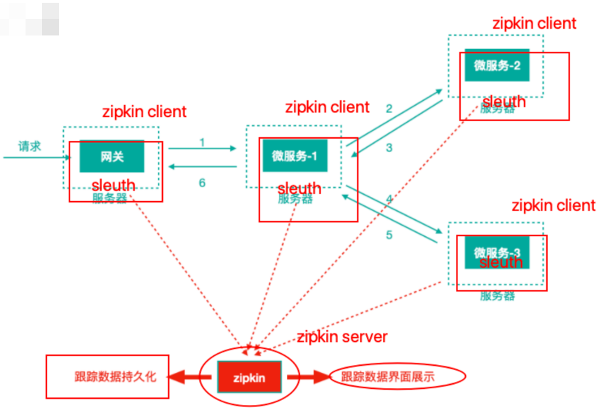

# 第 1 节 微服务监控之 Turbine 聚合监控 

参考上文Hystrix部分


# 第 2 节 微服务监控之分布式链路追踪技术 Sleuth + Zipkin

## 2.1 分布式链路追踪技术适用场景(问题场景) 

场景描述

为了支撑日益增⻓的庞大业务量，我们会使用微服务架构设计我们的系统，使得我们的系统不仅能够通过集群部署抵挡流量的冲击，又能根据业务进行灵活的扩展。

那么，在微服务架构下，一次请求少则经过三四次服务调用完成，多则跨越几十个甚至是上百个服务节点。那么问题接踵而来:

1)如何动态展示服务的调用链路?(比如A服务调用了哪些其他的服务---依赖 关系)

2)如何分析服务调用链路中的瓶颈节点并对其进行调优?(比如A—>B—>C，C 服务处理时间特别⻓)

3)如何快速进行服务链路的故障发现? 这就是分布式链路追踪技术存在的目的和意义

### 分布式链路追踪技术

如果我们在一个请求的调用处理过程中，在各个链路节点都能够记录下日志，并 最终将日志进行集中可视化展示，那么我们想监控调用链路中的一些指标就有希 望了~~~比如，请求到达哪个服务实例?请求被处理的状态怎样?处理耗时怎 样?这些都能够分析出来了...

  分布式环境下基于这种想法实现的监控技术就是就是分布式链路追踪(全链路追踪)。

### 市场上的分布式链路追踪方案

分布式链路追踪技术已然成熟，产品也不少，国内外都有，比如

- Spring Cloud Sleuth + Twitter Zipkin 阿里巴巴的“鹰眼”
- 大众点评的“CAT”
- 美团的“Mtrace”
- 京东的“Hydra”
- 新浪的“Watchman” 
- 另外还有最近也被提到很多的Apache Skywalking。


## 2.2 分布式链路追踪技术核心思想 

本质:记录日志，作为一个完整的技术，分布式链路追踪也有自己的理论和概念

微服务架构中，针对请求处理的调用链可以展现为一棵树，示意如下


上图描述了一个常⻅的调用场景，一个请求通过网关服务路由到下游的微服务-1， 然后微服务-1调用微服务-2，拿到结果后再调用微服务-3，最后组合微服务-2和微服 务-3的结果，通过网关返回给用户

为了追踪整个调用链路，肯定需要记录日志，日志记录是基础，在此之上肯定有一 些理论概念，当下主流的的分布式链路追踪技术/系统所基于的理念都来自于Google 的一篇论文*《Dapper, a Large-Scale Distributed Systems Tracing Infrastructure》*，这里面涉及到的核心理念是什么，我们来看下，还以前面的服务 调用来说


上图标识一个请求链路，一条链路通过TraceId唯一标识，span标识发起的请求信息，各span通过parrentId关联起来 

**Trace**：服务追踪的追踪单元是从客户发起请求(request)抵达被追踪系统的边界开始，到被追踪系统向客户返回响应(response)为止的过程

**Trace ID**：为了实现请求跟踪，当请求发送到分布式系统的入口端点时，只需要服务跟踪框架为该请求创建一个唯一的跟踪标识Trace ID，同时在分布式系统内部流转 的时候，框架失踪保持该唯一标识，直到返回给请求方。一个Trace由一个或者多个Span组成，每一个Span都有一个SpanId，Span中会记录 TraceId，同时还有一个叫做ParentId，指向了另外一个Span的SpanId，表明父子 关系，其实本质表达了依赖关系

**Span ID**:为了统计各处理单元的时间延迟，当请求到达各个服务组件时，也是通过 一个唯一标识Span ID来标记它的开始，具体过程以及结束。对每一个Span来说， 它必须有开始和结束两个节点，通过记录开始Span和结束Span的时间戳，就能统计 出该Span的时间延迟，除了时间戳记录之外，它还可以包含一些其他元数据，比如 时间名称、请求信息等。
每一个Span都会有一个唯一跟踪标识 Span ID,若干个有序的 span 就组成了一个 trace。

**Span**可以认为是一个日志数据结构，在一些特殊的时机点会记录了一些日志信息， 比如有时间戳、spanId、TraceId，parentId等，Span中也抽象出了另外一个概 念，叫做**事件**。

核心事件如下

- CS :client send/start 客户端/消费者发出一个请求，描述的是一个span开始 
- SR: server received/start 服务端/生产者接收请求 SR-CS属于请求发送的**网络延迟**
- SS: server send/finish 服务端/生产者发送应答 SS-SR属于服务端消耗时间 
- CR: client received/finished 客户端/消费者接收应答 CR-SS表示回复需要的时 间(响应的网络延迟)


### Spring Cloud Sleuth

Spring Cloud Sleuth (追踪服务框架)可以追踪服务之间的调用，Sleuth可以记录 一个服务请求经过哪些服务、服务处理时⻓等，根据这些，我们能够理清各微服务 间的调用关系及进行问题追踪分析。

- 耗时分析:通过 Sleuth 了解采样请求的耗时，分析服务性能问题(哪些服务调 用比较耗时)
- 链路优化:发现频繁调用的服务，针对性优化等 Sleuth就是通过记录日志的方式来记录踪迹数据的

注意：我们往往把Spring Cloud Sleuth 和 Zipkin 一起使用，**把 Sleuth 的数据信 息发送给 Zipkin 进行聚合，利用 Zipkin 存储并展示数据。**




## 2.3 Sleuth + Zipkin

1)每一个需要被追踪踪迹的微服务工程都引入依赖坐标

```
<!--链路追踪-->
<dependency>
    <groupId>org.springframework.cloud</groupId>
    <artifactId>spring-cloud-starter-sleuth</artifactId>
</dependency>
```

2)每一个微服务都修改application.yml配置文件，添加日志级别

```
 #分布式链路追踪
logging:
  level:
    org.springframework.web.servlet.DispatcherServlet: debug
    org.springframework.cloud.sleuth: debug
```

日志。请求到来时，我们在控制台可以观察到 Sleuth 输出的日志(全局 TraceId、SpanId 等)。

```
2021-09-21 14:43:22.369 DEBUG [sc-autodeliver,e18be25627817100,e18be25627817100,false] 8901 --- [nio-8096-exec-1] o.s.web.servlet.DispatcherServlet        : Completed 200 OK

[服务名称，traceId，spanId，false没有聚合]
```

这样的日志首先不容易阅读观察，另外日志分散在各个微服务服务器上，接下来我 们使用zipkin统一聚合轨迹日志并进行存储展示。

3)结合 Zipkin 展示追踪数据
 Zipkin 包括Zipkin Server和 Zipkin Client两部分，Zipkin Server是一个单独的服务，Zipkin Client就是具体的微服务

- Zipkin Server 构建 

pom.xml

```
  <!--zipkin-server的依赖坐标-->
        <dependency>
            <groupId>io.zipkin.java</groupId>
            <artifactId>zipkin-server</artifactId>
            <version>2.12.3</version>
            <exclusions>
                <!--排除掉log4j2的传递依赖，避免和springboot依赖的日 志组件冲突-->
                <exclusion>
                    <groupId>org.springframework.boot</groupId>
                    <artifactId>spring-boot-starter-log4j2</artifactId>
                </exclusion>
            </exclusions>
        </dependency>
        <!--zipkin-server ui界面依赖坐标-->
        <dependency>
            <groupId>io.zipkin.java</groupId>
            <artifactId>zipkin-autoconfigure-ui</artifactId>
            <version>2.12.3</version>
        </dependency>
```

入口启动类

```
@SpringBootApplication
@EnableZipkinServer
public class ZipkinServerApp9411 {
    public static void main(String[] args) {
        SpringApplication.run(ZipkinServerApp9411.class, args);
    }
}
```

yml

```
server:
  port: 9411

management:
  metrics:
    web:
      server:
        auto-time-requests: false # 关闭自动检测请求,这样就不会报错
```

- Zipkin Client 构建(在具体微服务中修改) 

pom中添加 zipkin 依赖

```
spring:
  application:
    name: sc-autodeliver
  zipkin:
    base-url: http://127.0.0.1:9411 # zipkin server的请求地址
    sender:
      # web 客户端将踪迹日志数据通过网络请求的方式传送到服务端，另外还有配 置
      # kafka/rabbit 客户端将踪迹日志数据传递到mq进行中转
      type: web
  sleuth:
    sampler:
      # 采样率 1 代表100%全部采集 ，默认0.1 代表10% 的请求踪迹数据会被采集
      # 生产环境下，请求量非常大，没有必要所有请求的踪迹数据都采集分析，对于网络包括server端压力都是比较大的，可以配置采样率采集一定比例的请求的踪迹 数据进行分析即可
      probability: 1
```


另外，对于log日志，**依然保持开启debug状态**

- Zipkin server ⻚面方便我们查看服务调用依赖关系及一些性能指标和异常信息 


### 追踪数据Zipkin持久化到mysql

查看git： https://github.com/openzipkin/zipkin/tree/master/zipkin-storage

```sql
//https://github.com/openzipkin/zipkin/blob/master/zipkin-storage/mysql-v1/src/main/resources/mysql.sql
--
-- Copyright 2015-2019 The OpenZipkin Authors
--
-- Licensed under the Apache License, Version 2.0 (the "License"); you may not use this file except
-- in compliance with the License. You may obtain a copy of the License at
--
-- http://www.apache.org/licenses/LICENSE-2.0
--
-- Unless required by applicable law or agreed to in writing, software distributed under the License
-- is distributed on an "AS IS" BASIS, WITHOUT WARRANTIES OR CONDITIONS OF ANY KIND, either express
-- or implied. See the License for the specific language governing permissions and limitations under
-- the License.
--

CREATE TABLE IF NOT EXISTS zipkin_spans (
  `trace_id_high` BIGINT NOT NULL DEFAULT 0 COMMENT 'If non zero, this means the trace uses 128 bit traceIds instead of 64 bit',
  `trace_id` BIGINT NOT NULL,
  `id` BIGINT NOT NULL,
  `name` VARCHAR(255) NOT NULL,
  `remote_service_name` VARCHAR(255),
  `parent_id` BIGINT,
  `debug` BIT(1),
  `start_ts` BIGINT COMMENT 'Span.timestamp(): epoch micros used for endTs query and to implement TTL',
  `duration` BIGINT COMMENT 'Span.duration(): micros used for minDuration and maxDuration query',
  PRIMARY KEY (`trace_id_high`, `trace_id`, `id`)
) ENGINE=InnoDB ROW_FORMAT=COMPRESSED CHARACTER SET=utf8 COLLATE utf8_general_ci;

ALTER TABLE zipkin_spans ADD INDEX(`trace_id_high`, `trace_id`) COMMENT 'for getTracesByIds';
ALTER TABLE zipkin_spans ADD INDEX(`name`) COMMENT 'for getTraces and getSpanNames';
ALTER TABLE zipkin_spans ADD INDEX(`remote_service_name`) COMMENT 'for getTraces and getRemoteServiceNames';
ALTER TABLE zipkin_spans ADD INDEX(`start_ts`) COMMENT 'for getTraces ordering and range';

CREATE TABLE IF NOT EXISTS zipkin_annotations (
  `trace_id_high` BIGINT NOT NULL DEFAULT 0 COMMENT 'If non zero, this means the trace uses 128 bit traceIds instead of 64 bit',
  `trace_id` BIGINT NOT NULL COMMENT 'coincides with zipkin_spans.trace_id',
  `span_id` BIGINT NOT NULL COMMENT 'coincides with zipkin_spans.id',
  `a_key` VARCHAR(255) NOT NULL COMMENT 'BinaryAnnotation.key or Annotation.value if type == -1',
  `a_value` BLOB COMMENT 'BinaryAnnotation.value(), which must be smaller than 64KB',
  `a_type` INT NOT NULL COMMENT 'BinaryAnnotation.type() or -1 if Annotation',
  `a_timestamp` BIGINT COMMENT 'Used to implement TTL; Annotation.timestamp or zipkin_spans.timestamp',
  `endpoint_ipv4` INT COMMENT 'Null when Binary/Annotation.endpoint is null',
  `endpoint_ipv6` BINARY(16) COMMENT 'Null when Binary/Annotation.endpoint is null, or no IPv6 address',
  `endpoint_port` SMALLINT COMMENT 'Null when Binary/Annotation.endpoint is null',
  `endpoint_service_name` VARCHAR(255) COMMENT 'Null when Binary/Annotation.endpoint is null'
) ENGINE=InnoDB ROW_FORMAT=COMPRESSED CHARACTER SET=utf8 COLLATE utf8_general_ci;

ALTER TABLE zipkin_annotations ADD UNIQUE KEY(`trace_id_high`, `trace_id`, `span_id`, `a_key`, `a_timestamp`) COMMENT 'Ignore insert on duplicate';
ALTER TABLE zipkin_annotations ADD INDEX(`trace_id_high`, `trace_id`, `span_id`) COMMENT 'for joining with zipkin_spans';
ALTER TABLE zipkin_annotations ADD INDEX(`trace_id_high`, `trace_id`) COMMENT 'for getTraces/ByIds';
ALTER TABLE zipkin_annotations ADD INDEX(`endpoint_service_name`) COMMENT 'for getTraces and getServiceNames';
ALTER TABLE zipkin_annotations ADD INDEX(`a_type`) COMMENT 'for getTraces and autocomplete values';
ALTER TABLE zipkin_annotations ADD INDEX(`a_key`) COMMENT 'for getTraces and autocomplete values';
ALTER TABLE zipkin_annotations ADD INDEX(`trace_id`, `span_id`, `a_key`) COMMENT 'for dependencies job';

CREATE TABLE IF NOT EXISTS zipkin_dependencies (
  `day` DATE NOT NULL,
  `parent` VARCHAR(255) NOT NULL,
  `child` VARCHAR(255) NOT NULL,
  `call_count` BIGINT,
  `error_count` BIGINT,
  PRIMARY KEY (`day`, `parent`, `child`)
) ENGINE=InnoDB ROW_FORMAT=COMPRESSED CHARACTER SET=utf8 COLLATE utf8_general_ci;
```

引入依赖

```
   <!--zipkin针对mysql持久化的依赖-->
        <dependency>
            <groupId>io.zipkin.java</groupId>
            <artifactId>zipkin-autoconfigure-storage-mysql</artifactId>
            <version>2.12.3</version>
        </dependency>
        <dependency>
            <groupId>mysql</groupId>
            <artifactId>mysql-connector-java</artifactId>
        </dependency>
        <dependency>
            <groupId>com.alibaba</groupId>
            <artifactId>druid-spring-boot-starter</artifactId>
            <version>1.1.10</version>
        </dependency>
        <!--操作数据库需要事务控制-->
        <dependency>
            <groupId>org.springframework</groupId>
            <artifactId>spring-tx</artifactId>
        </dependency>
        <dependency>
            <groupId>org.springframework</groupId>
            <artifactId>spring-jdbc</artifactId>
        </dependency>
```

- 修改配置文件，添加如下内容

  ```
  spring:
    datasource:
      driver-class-name: com.mysql.jdbc.Driver
      url: jdbc:mysql://localhost:3306/zipkin?useUnicode=true&characterEncoding=utf-8&useSSL=false&allowMultiQueries=true
      username: root
      password: 123456
      druid:
        initialSize: 10
        minIdle: 10
        maxActive: 30
        maxWait: 50000
  # 指定zipkin持久化介质为mysql
  zipkin:
    storage:
      type: mysql
  ```

- 启动类中注入事务管理器

```
@Bean
public PlatformTransactionManager txManager(DataSource dataSource) {
    return new DataSourceTransactionManager(dataSource);
}
```

# 第 3 节 微服务统一认证方案 Spring Cloud OAuth2 + JWT

认证:验证用户的合法身份，比如输入用户名和密码，系统会在后台验证用户名和密码是否合法，合法的前提下，才能够进行后续的操作，访问受保护的资源

## 3.1 微服务架构下统一认证场景

分布式系统的每个服务都会有认证需求，如果每个服务都实现一套认证逻辑会非常冗余，考虑分布式系统共享性的特点，需要由独立的认证服务处理系统认证的请求。


- 基于Session的认证方式
  在分布式的环境下，基于session的认证会出现一个问题，每个应用服务都需要 在session中存储用户身份信息，通过负载均衡将本地的请求分配到另一个应用 服务需要将session信息带过去，否则会重新认证。我们可以使用Session共享、 Session黏贴等方案。
  Session方案也有缺点，比如基于cookie，移动端不能有效使用等
- 基于token的认证方式
  基于token的认证方式，服务端不用存储认证数据，易维护扩展性强， 客户端可 以把token 存在任意地方，并且可以实现web和app统一认证机制。其缺点也很 明显，token由于自包含信息，因此一般数据量较大，而且每次请求 都需要传 递，因此比较占带宽。另外，token的签名验签操作也会给cpu带来额外的处理 负担。

## 3.2 OAuth2开放授权协议/标准 

### 3.2.1 OAuth2介绍

OAuth(开放授权)是一个开放协议/标准，允许用户授权第三方应用访问他们存储 在另外的服务提供者上的信息，而不需要将用户名和密码提供给第三方应用或分享 他们数据的所有内容。

**允许用户授权第三方应用访问他们存储在另外的服务提供者上的信息，而不需要将用户名和密码提供给第三方应用或分享他们数据的所有内容**

结合“使用QQ登录拉勾”这个场景拆分理解上述那句话
用户:我们自己
第三方应用:拉勾网
另外的服务提供者:QQ 

OAuth2是OAuth协议的延续版本，但不向后兼容OAuth1即完全废止了OAuth1。

### 3.3.2 OAuth2协议⻆色和流程 

拉勾网要开发使用QQ登录这个功能的话，那么拉勾网是需要提前到QQ平台进行登记的(否则QQ凭什么陪着拉勾网玩授权登录这件事) 

1)拉勾网——登记——>QQ平台

2)QQ 平台会颁发一些参数给拉勾网，后续上线进行授权登录的时候(刚才打开授 权⻚面)需要携带这些参数

client_id :客户端id(QQ最终相当于一个认证授权服务器，拉勾网就相当于一个客 户端了，所以会给一个客户端id)，相当于账号

secret:相当于密码


- 资源所有者(Resource Owner):可以理解为用户自己 
- 客户端(Client):我们想登陆的网站或应用，比如拉勾网 
- 认证服务器(Authorization Server):可以理解为微信或者QQ 
- 资源服务器(Resource Server):可以理解为微信或者QQ

### 3.2.3 什么情况下需要使用OAuth2?

第三方授权登录的场景:比如，我们经常登录一些网站或者应用的时候，可以选择 使用第三方授权登录的方式，比如:微信授权登录、QQ授权登录、微博授权登录 等，这是典型的 OAuth2 使用场景。

单点登录的场景:如果项目中有很多微服务或者公司内部有很多服务，可以专⻔做一个认证中心(充当认证平台⻆色)，所有的服务都要到这个认证中心做认证，只做一次登录，就可以在多个授权范围内的服务中自由串行。

### 3.2.4 OAuth2的颁发Token授权方式 

1)**授权码(authorization-code)** 

2)**密码式(password)提供用户名+密码换取token令牌** 

3)隐藏式(implicit)

4)客户端凭证(client credentials)

授权码模式使用到了回调地址，是最复杂的授权方式，微博、微信、QQ等第三方登 录就是这种模式。我们重点讲解接口对接中常使用的password密码模式(提供用户 名+密码换取token)。


## 3.3 Spring Cloud OAuth2 + JWT 实现 

### 3.3.1 介绍

Spring Cloud OAuth2 是 Spring Cloud 体系对OAuth2协议的实现，可以用来做多 个微服务的统一认证(验证身份合法性)授权(验证权限)。通过向OAuth2服务 (统一认证授权服务)发送某个类型的grant_type进行集中认证和授权，从而获得 access_token(访问令牌)，而这个token是受其他微服务信任的。

注意:使用OAuth2解决问题的本质是，引入了一个认证授权层，认证授权层连接了 资源的拥有者，在授权层里面，资源的拥有者可以给第三方应用授权去访问我们的 某些受保护资源。

### 3.3.2 构建微服务统一认证服务思路


**注意：**在我们统一认证的场景中，Resource Server其实就是我们的各种受保护的 微服务，微服务中的各种API访问接口就是资源，发起http请求的浏览器就是Client 客户端(对应为第三方应用)

### 3.3.3 搭建认证服务器(Authorization Server) 

认证服务器(Authorization Server)，负责颁发token

 

pom.xml

```xml
  <!--导入Eureka Client依赖-->
        <dependency>
            <groupId>org.springframework.cloud</groupId>
            <artifactId>spring-cloud-starter-netflix-eureka-client</artifactId>
        </dependency>


        <!--导入spring cloud oauth2依赖-->
        <dependency>
            <groupId>org.springframework.cloud</groupId>
            <artifactId>spring-cloud-starter-oauth2</artifactId>
            <exclusions>
                <exclusion>
                    <groupId>org.springframework.security.oauth.boot</groupId>
                    <artifactId>spring-security-oauth2-autoconfigure</artifactId>
                </exclusion>
            </exclusions>
        </dependency>
        <dependency>
            <groupId>org.springframework.security.oauth.boot</groupId>
            <artifactId>spring-security-oauth2-autoconfigure</artifactId>
            <version>2.1.11.RELEASE</version>
        </dependency>
        <!--引入security对oauth2的支持-->
        <dependency>
            <groupId>org.springframework.security.oauth</groupId>
            <artifactId>spring-security-oauth2</artifactId>
            <version>2.3.4.RELEASE</version>
        </dependency>


        <dependency>
            <groupId>mysql</groupId>
            <artifactId>mysql-connector-java</artifactId>
        </dependency>
        <dependency>
            <groupId>com.alibaba</groupId>
            <artifactId>druid-spring-boot-starter</artifactId>
            <version>1.1.10</version>
        </dependency>
        <!--操作数据库需要事务控制-->
        <dependency>
            <groupId>org.springframework</groupId>
            <artifactId>spring-tx</artifactId>
        </dependency>
        <dependency>
            <groupId>org.springframework</groupId>
            <artifactId>spring-jdbc</artifactId>
        </dependency>
```

- application.yml(构建认证服务器，配置文件无特别之处)

```
server:
  port: 9999
spring:
  application:
    name: sc-oauth2

eureka:
  client:
    service-url:
      #注册到集群
      defaultZone: http://EurekaServerA:8761/eureka,http://EurekaServerB:8762/eureka
  instance:
    #使用ip注册，否则会使用主机名注册了(此处考虑到对老版本的兼容，新版本经过实验都是ip)
    prefer-ip-address: true
    #自定义实例显示格式，加上版本号，便于多版本管理，注意是ip-address，早期版本是ipAddress
    instance-id: ${spring.cloud.client.ip-address}:${spring.application.name}:${server.port}:@project.version@
    metadata-map:
      # 自定义元数据(kv自定义)
      cluster: cl1
      region: rn1
    # 租约续约间隔时间，默认30秒
    lease-renewal-interval-in-seconds: 30
    # 租约到期，服务时效时间，默认值90秒,服务超过90秒没有发生心跳，EurekaServer会将服务从列表移除
    lease-expiration-duration-in-seconds: 90
```

入口类无特殊之处
认证服务器配置类


- 测试
  获取token:  http://localhost:9999/oauth/token?client_secret=asdf&grant_type=password&username=admin&password=123456&client_id=client_shred
  - endpoint:/oauth/token 获取token携带的参数
  - client_id:客户端id
  - client_secret:客户单密码 
  - grant_type:指定使用哪种颁发类型，password 
  - username:用户名
  - password:密码

```
{
    "access_token": "aec2e1b3-d073-4f54-8fca-0a3bfdbef515",
    "token_type": "bearer",
    "refresh_token": "7c8b5955-4b24-4f37-937c-31c8aa76f75f",
    "expires_in": 16,
    "scope": "all"
}
```

-  校验token
  http://localhost:9999/oauth/check_token?token=8edba986-5882-4f3f-9fc8-77a9acc10bd0

```json
{
    "aud": [
        "autodeliver"
    ],
    "active": true,
    "exp": 1632322979,
    "user_name": "admin",
    "client_id": "client_shred",
    "scope": [
        "all"
    ]
}
//
{
    "error": "invalid_token",
    "error_description": "Token has expired"
}
```

- 刷新token

http://localhost:9999/oauth/token?grant_type=refresh_token&client_id=client_shred&client_secret=asdf&refresh_token=7c8b5955-4b24-4f37-937c-31c8aa76f75f

```json
{
    "access_token": "33d9f5a6-4796-4c6e-a899-3490a05160c7",
    "token_type": "bearer",
    "refresh_token": "7c8b5955-4b24-4f37-937c-31c8aa76f75f",
    "expires_in": 19,
    "scope": "all"
}
```


#### 搭建资源服务

1、引入依赖，和认证服务一样的依赖

2、资源服务器(希望访问被认证的微服务)Resource Server配置 资源服务配置类

```java
@Configuration
@EnableResourceServer
@EnableWebSecurity // 开启web访问安全，针对于下面定义的资源访问策略
public class ResourceServerConfigurer extends ResourceServerConfigurerAdapter {
    /**
     * 用于定义资源服务器 向 远程认证服务器发起请求，进行token校验
     *
     * @param resources
     * @throws Exception
     */
    @Override
    public void configure(ResourceServerSecurityConfigurer resources) throws Exception {
        //设置资源id
        resources.resourceId("autodeliver");

        // 定义token服务对象
        RemoteTokenServices remoteTokenServices = new RemoteTokenServices();
        // 校验端点
        remoteTokenServices.setCheckTokenEndpointUrl("http://localhost:9999/oauth/check_token");
        // 携带客户端id 、安全码
        remoteTokenServices.setClientId("client_shred");
        remoteTokenServices.setClientSecret("asdf");

        //设置服务对象，服务描述对象
        resources.tokenServices(remoteTokenServices);

    }

    /**
     * 场景：
     * 一个服务中可能有很多资源，
     * 某些api，需要认证才能访问；
     * 某些则直接开放；
     * 在当前方法进行配置。
     *
     * @param http
     * @throws Exception
     */
    @Override
    public void configure(HttpSecurity http) throws Exception {

        http
                .sessionManagement()
                // session的创建策略：根据需要创建
                .sessionCreationPolicy(SessionCreationPolicy.IF_REQUIRED)
                .and()
                .authorizeRequests()
                //   /autodeliver/** 和/demo/**都需要认证
                .antMatchers("/autodeliver/**").authenticated()
                .antMatchers("/demo/**").authenticated()
                // 其他请求不认证
                .anyRequest().permitAll()
        ;
    }
}
```

- 测试

```json
未携带token
http://localhost:8096/demo/test
====================================
{
 "error": "unauthorized",
 "error_description": "Full authentication is required to access this resource"
}


携带token
http://localhost:8096/demo/test?access_token=63918a3b-e088-4385-bb5a-861cfd7c8784
====================================
demo/test
```


思考:当我们第一次登陆之后，认证服务器颁发token并将其存储在认证服 务器中，后期我们访问资源服务器时会携带token，

1、资源服务器会请求认证 服务器验证token有效性，如果资源服务器有很多，那么认证服务器压力会 很大.......

2、另外，资源服务器向认证服务器check_token，获取的也是用户信息 UserInfo，**能否把用户信息存储到令牌中，让客户端一直持有这个令牌**，令 牌的验证也在资源服务器进行，这样避免和认证服务器频繁的交互......

我们可以考虑使用 JWT 进行改造，使用JWT机制之后资源服务器不需要访问 认证服务器......


### 3.3.4 JWT改造统一认证授权中心的令牌存储机制 

#### JWT令牌介绍

通过上边的测试我们发现，当资源服务和授权服务不在一起时资源服务使用 RemoteTokenServices 远程请求授权 服务验证token，如果访问量较大将会影响系 统的性能。

解决上边问题: 令牌采用JWT格式即可解决上边的问题，**用户认证通过会得到一个 JWT令牌，JWT令牌中已经包括了用户相关的信 息，客户端只需要携带JWT访问资源 服务，资源服务根据事先约定的算法自行完成令牌校验**，无需每次都请求认证 服务 完成授权。

1、什么是JWT?
JSON Web Token(JWT)是一个开放的行业标准(RFC 7519)，它定义了一种简介 的、自包含的协议格式，用于 在通信双方传递json对象，传递的信息经过数字签名 可以被验证和信任。JWT可以使用HMAC算法或使用RSA的公 钥/私钥对来签名，防 止被篡改。

2、JWT令牌结构 JWT令牌由三部分组成，每部分中间使用点(.)分隔，比如:xxxxx.yyyyy.zzzzz

- Header
  头部包括令牌的类型(即JWT)及使用的哈希算法(如HMAC SHA256或 RSA)，例如

  ```json
  {
    "alg": "HS256",
    "typ": "JWT"
  }
  ```

  将上边的内容使用Base64Url编码，得到一个字符串就是JWT令牌的第一部分。 

- Payload

  第二部分是负载，内容也是一个json对象，它是存放有效信息的地方，它可以存 放jwt提供的现成字段，比 如:iss(签发者),exp(过期时间戳), sub(面向的 用户)等，也可自定义字段。 此部分不建议存放敏感信息，因为此部分可以解 码还原原始内容。 最后将第二部分负载使用Base64Url编码，得到一个字符串 就是JWT令牌的第二部分。 一个例子:

  ```json
  {
    "sub": "1234567890",
    "name": "John Doe",
    "iat": 1516239022
  }
  ```

- Signature
  第三部分是签名，此部分用于防止jwt内容被篡改。 这个部分使用base64url将 前两部分进行编码，编码后使用点(.)连接组成字符串，最后使用header中声 明 签名算法进行签名。

  ```
   
  HMACSHA256(
    base64UrlEncode(header) + "." +
    base64UrlEncode(payload),
    secret)
  ```

  base64UrlEncode(header):jwt令牌的第一部分。 
  base64UrlEncode(payload):jwt令牌的第二部分。 
  secret:签名所使用的密钥。 


#### 1、认证服务器端**JWT**改造(改造主配置类)

```java
   /**
     * 创建令牌存储对象
     * @return
     */
    private TokenStore tokenStore() {
//        return new InMemoryTokenStore();
        return new JwtTokenStore(jwtAccessTokenConverter());
    }

    private String sign_key = "shred123";

    /**
     * 返回令牌转换器
     * @return
     */
    private JwtAccessTokenConverter jwtAccessTokenConverter() {
        JwtAccessTokenConverter converter = new JwtAccessTokenConverter();
        // 签名密钥
        converter.setSigningKey(sign_key);

        //验证时使用的密钥，和签名密钥保持一致
        converter.setVerifier(new MacSigner(sign_key));

        return converter;
    }


//

    private AuthorizationServerTokenServices authorizationServerTokenServices() {
        //.....,,,
        //针对 jwt 令牌的添加
        defaultTokenServices.setTokenEnhancer(jwtAccessTokenConverter());
    	//,.,....
    }
```

#### 2、资源服务器校验JWT令牌 

不需要和远程认证服务器交互，添加本地tokenStore

```java
    @Override
    public void configure(ResourceServerSecurityConfigurer resources) throws Exception {
		//使用和服务器一样的tokenStore
        resources
                .resourceId("autodeliver")
                .tokenStore(tokenStore())
                // 无状态
                .stateless(true);
    }
```


### 3.3.5 从数据库加载Oauth2客户端信息

创建数据表并初始化数据(表名及字段保持固定)

```sql
SET NAMES utf8mb4;
SET FOREIGN_KEY_CHECKS = 0;
-- ----------------------------
-- Table structure for oauth_client_details
-- ----------------------------
DROP TABLE IF EXISTS `oauth_client_details`;
CREATE TABLE `oauth_client_details` (
  `client_id` varchar(48) NOT NULL,
  `resource_ids` varchar(256) DEFAULT NULL,
  `client_secret` varchar(256) DEFAULT NULL,
  `scope` varchar(256) DEFAULT NULL,
  `authorized_grant_types` varchar(256) DEFAULT NULL,
  `web_server_redirect_uri` varchar(256) DEFAULT NULL,
  `authorities` varchar(256) DEFAULT NULL,
  `access_token_validity` int(11) DEFAULT NULL,
  `refresh_token_validity` int(11) DEFAULT NULL,
  `additional_information` varchar(4096) DEFAULT NULL,
  `autoapprove` varchar(256) DEFAULT NULL,
  PRIMARY KEY (`client_id`)
) ENGINE=InnoDB DEFAULT CHARSET=utf8;

-- ----------------------------
-- Records of oauth_client_details
-- ----------------------------
BEGIN;
INSERT INTO `oauth_client_details` VALUES ('client_lagou123',
'autodeliver,resume', 'abcxyz', 'all', 'password,refresh_token',
NULL, NULL, 7200, 259200, NULL, NULL);
COMMIT;
SET FOREIGN_KEY_CHECKS = 1;
```

配置数据源

```
server:
  port: 9999
spring:
  application:
    name: sc-oauth2
  datasource:
    driver-class-name: com.mysql.jdbc.Driver
    url: jdbc:mysql://localhost:3306/oauth2?useUnicode=true&characterEncoding=utf-8&useSSL=false&allowMultiQueries=true
    username: root
    password: root
    druid:
      initialSize: 10
      minIdle: 10
      maxActive: 30
      maxWait: 50000
```

- 认证服务器主配置类改造

```java
   /**
     * 客户端详情 配置
     * client_id、secret
     *
     * @param clients
     * @throws Exception
     */
    @Override
    public void configure(ClientDetailsServiceConfigurer clients) throws Exception {
        super.configure(clients);
       
// 从内存中加载客户端详情改为从数据库中加载客户端详情
        clients.withClientDetails(createJdbcClientDetailsService());
    }

    @Autowired
    private DataSource dataSource;

    @Bean
    public JdbcClientDetailsService createJdbcClientDetailsService(){
        JdbcClientDetailsService jdbcClientDetailsService = new JdbcClientDetailsService(dataSource);
        return jdbcClientDetailsService;
    }

```


### 3.3.6 从数据库验证用户合法性 

- 创建数据表users(表名不需固定)，初始化数据

```sql
SET NAMES utf8mb4;
SET FOREIGN_KEY_CHECKS = 0;
-- ----------------------------
-- Table structure for users
-- ----------------------------
DROP TABLE IF EXISTS `users`;
CREATE TABLE `users` (
    `id` int(11) NOT NULL AUTO_INCREMENT,
  `username` char(10) DEFAULT NULL,
  `password` char(100) DEFAULT NULL,
  PRIMARY KEY (`id`)
) ENGINE=InnoDB AUTO_INCREMENT=5 DEFAULT CHARSET=utf8;
-- ----------------------------
-- Records of users
-- ----------------------------
BEGIN;
INSERT INTO `users` VALUES (4, 'lagou-user', 'iuxyzds');
COMMIT;
SET FOREIGN_KEY_CHECKS = 1;
```

操作数据表的JPA配置以及针对该表的操作的Dao接口此处省略.... 

- 开发UserDetailsService接口的实现类，根据用户名从数据库加载用户信息

```java
@Service
public class JdbcUserDetailsService implements UserDetailsService {
    @Autowired
    private UserRepository userRepository;

    /**
     * 获取数据库中的user，返回UserDetails对象
     * 用于com.shred.sc.config.SecurityConfigurer#configure
     * @param username
     * @return
     * @throws UsernameNotFoundException
     */
    @Override
    public UserDetails loadUserByUsername(String username) throws UsernameNotFoundException {
        //查找user
        Users byUsername = userRepository.findByUsername(username);

        User user = new User(username, byUsername.getPassword(), new ArrayList<>());
        return user;
    }
}
```


- 使用自定义的用户详情服务对象

```java
/**
 * 处理用户名 和 密码验证
 * 1、客户端提交username、password
 * 2、一般，username、password存在用户表
 * 3、根据表中的数据验证用户信息的合法性
 */
@Override
protected void configure(AuthenticationManagerBuilder auth) throws Exception {
    // 在这个方法中即可关联数据库、当前我们先把用户信息配置在内存中。
    // 实例化一个用户对象
   /* UserDetails user = new User("admin", "123456", new ArrayList<>());
    auth.inMemoryAuthentication()
            .withUser(user)
            .passwordEncoder(passwordEncoder())
            ;*/
    auth.userDetailsService(jdbcUserDetailsService)
            .passwordEncoder(passwordEncoder);

}
```


### 3.3.7 基于Oauth2的 JWT 令牌信息扩展

OAuth2帮我们生成的JWT令牌载荷部分信息有限，关于用户信息只有一个 user_name，有些场景下我们希望放入一些扩展信息项，比如，之前我们经常向 session中存入userId，或者现在我希望在JWT的载荷部分存入当时请求令牌的客户 端IP，客户端携带令牌访问资源服务时，可以对比当前请求的客户端真实IP和令牌中 存放的客户端IP是否匹配，不匹配拒绝请求，以此进一步提高安全性。那么如何在 OAuth2环境下向JWT令牌中存如扩展信息?

认证服务器生成JWT令牌时存入扩展信息(比如clientIp)

继承DefaultAccessTokenConverter类，重写convertAccessToken方法存入扩 展信息

- 定义转换器，放入自定义的信息

```java
@Component
public class ShredAccessTokenConverter extends DefaultAccessTokenConverter {
    @Override
    public Map<String, ?> convertAccessToken(OAuth2AccessToken token, OAuth2Authentication authentication) {
        //认证服务使用springmvc来暴露接口 org.springframework.security.oauth2.provider.endpoint.CheckTokenEndpoint
        // 获取request对象
        HttpServletRequest request = ((ServletRequestAttributes) RequestContextHolder.getRequestAttributes()).getRequest();
        // 获取客户端ip、若存在代理之后到达当前服务的化，此处获取的不是真实的客户端ip
        String remoteAddr = request.getRemoteAddr();

        Map<String, String> stringMap = (Map<String, String>) super.convertAccessToken(token, authentication);
        stringMap.put("clientIp", remoteAddr);
        return stringMap;
    }
}
```

- configurer配置转换器

```java
@Autowired
private ShredAccessTokenConverter shredAccessTokenConverter;

/**
 * 返回令牌转换器
 * @return
 */
private JwtAccessTokenConverter jwtAccessTokenConverter() {
    JwtAccessTokenConverter converter = new JwtAccessTokenConverter();
    // 签名密钥
    converter.setSigningKey(sign_key);

    //验证时使用的密钥，和签名密钥保持一致
    converter.setVerifier(new MacSigner(sign_key));
    //设置自定义的转换器
    converter.setAccessTokenConverter(shredAccessTokenConverter);

    return converter;
}
```

- 解析jwt得到的结果

```java
{
  "aud": [
    "resume",
    "autodeliver"
  ],
  "user_name": "shred-user",
  "scope": [
    "all"
  ],
  "clientIp": "0:0:0:0:0:0:0:1",//成功
  "exp": 1632412417,
  "jti": "a3861a14-2046-4335-a9bc-746a94c7b4ea",
  "client_id": "client_shred123"
}
```


### 3.3.8 资源服务器取出 JWT 令牌扩展信息

资源服务器也需要自定义一个转换器类，继承DefaultAccessTokenConverter，重 写extractAuthentication提取方法，把载荷信息设置到认证对象的details属性中

- 客户端设置自定义信息

```
@Component
public class ShredAccessTokenConverter extends DefaultAccessTokenConverter {
    @Override
    public OAuth2Authentication extractAuthentication(Map<String, ?> map) {
        OAuth2Authentication oAuth2Authentication = super.extractAuthentication(map);

        //将map放入认证对象中，在controller中可用拿到
        oAuth2Authentication.setDetails(map);

        return super.extractAuthentication(map);
    }
}
```

- configurer

```
//com.shred.sc.config.ResourceServerConfigurer#jwtAccessTokenConverter
@Autowired
private ShredAccessTokenConverter shredAccessTokenConverter;

/**
 * 返回令牌转换器
 * @return
 */
private JwtAccessTokenConverter jwtAccessTokenConverter() {
    JwtAccessTokenConverter converter = new JwtAccessTokenConverter();
    // 签名密钥
    converter.setSigningKey(sign_key);

    //验证时使用的密钥，和签名密钥保持一致
    converter.setVerifier(new MacSigner(sign_key));
    converter.setAccessTokenConverter(shredAccessTokenConverter);

    return converter;
}
```

- controller中获取

```
@RequestMapping("/test")
public String test(){

    Object details = SecurityContextHolder.getContext().getAuthentication().getDetails();

    return "demo/test";
}
```

### 3.3.9 其他 

**关于JWT令牌我们需要注意**

- JWT令牌就是一种可以被验证的数据组织格式，它的玩法很灵活，我们这里是基 于Spring Cloud Oauth2 创建、校验JWT令牌 
- 我们也可以自己写工具类生成、校验JWT令牌 
- JWT令牌中不要存放过于敏感的信息，因为我们知道拿到令牌后，我们可以解码 看到载荷部分的信息 
- JWT令牌每次请求都会携带，内容过多，会增加网络带宽占用