# 第二代 Spring Cloud 核心组件 (SCA)

第一代 Spring Cloud (主要是 SCN)很多组件已经进入停更维护模式。 Spring Cloud:Netflix，Spring官方，SCA(被Spring官方认可) 注意:市场上主要使用的还是SCN，SCA一套框架的集合

Alibaba 更进一步，搞出了Spring Cloud Alibaba(SCA)，SCA 是由一些阿里巴巴 的开源组件和云产品组成的，2018年，Spring Cloud Alibaba 正式入住了 Spring Cloud 官方孵化器。

Nacos(服务注册中心、配置中心) Sentinel哨兵(服务的熔断、限流等) Dubbo RPC/LB Seata分布式事务解决方案

# 7.1 SCA Nacos 服务注册和配置中心 

## 7.1.1 Nacos 介绍

Nacos (Dynamic Naming and Configuration Service)是阿里巴巴开源的一个针 对微服务架构中服务发现、配置管理和服务管理平台。
Nacos就是注册中心+配置中心的组合(Nacos=Eureka+Config+Bus)

官网:https://nacos.io 下载地址:https://github.com/alibaba/Nacos 

### Nacos功能特性

- 服务发现与健康检查
- 动态配置管理
- 动态DNS服务 
- 服务和元数据管理(管理平台的⻆度，nacos也有一个ui⻚面，可以看到注册的 服务及其实例信息(元数据信息)等)，动态的服务权重调整、动态服务优雅下 线，都可以去做

## 7.1.2 Nacos 单例服务部署 

下载解压安装包，执行命令启动(我们使用最近比较稳定的版本 nacos-server-1.2.0.tar.gz)

```
 #linux/mac:
 sh startup.sh -m standalone 
 
 #windows:
 cmd startup.cmd
```

- 访问nacos管理界面:http://127.0.0.1:8848/nacos/#/login(默认端口8848， 账号和密码 nacos/nacos)

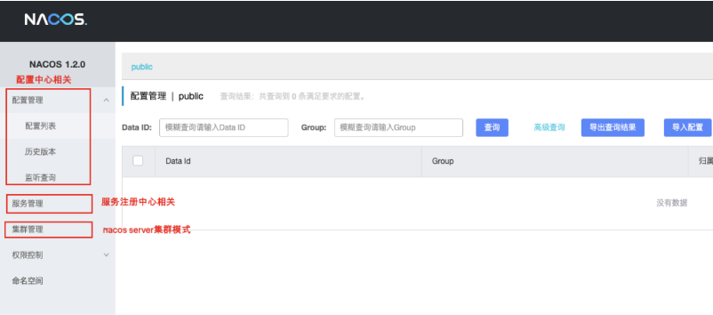

## 7.1.3 Nacos 服务注册中心X

### 7.1.3.1 服务提供者注册到Nacos(改造简历微服务)

在父pom中引入SCA依赖

```xml
 
<dependencyManagement>
  <dependencies>
	<!--SCA -->
    <dependency>
      <groupId>com.alibaba.cloud</groupId>
      <artifactId>spring-cloud-alibaba-dependencies</artifactId>
      <version>2.1.0.RELEASE</version>
      <type>pom</type>
      <scope>import</scope>
    </dependency>
  </dependencies>
  <!--SCA -->
</dependencyManagement>
```

- 在服务提供者工程中引入nacos客户端依赖(注释eureka客户端)

```xml
<dependency>
    <groupId>com.alibaba.cloud</groupId>
    <artifactId>spring-cloud-starter-alibaba-nacos-discovery</artifactId>
</dependency>
```

- application.yml修改，添加nacos配置信息

```yml
server:
  port: 8082
spring:
  application:
    name: sc-resume
  datasource:
    driver-class-name: com.mysql.jdbc.Driver
    url: jdbc:mysql://localhost:3306/spring_cloud?useUnicode=true&characterEncoding=utf8
    username: root
    password: root
  jpa:
    database: MySQL
    show-sql: true
    hibernate:
      naming:
        physical-strategy: org.hibernate.boot.model.naming.PhysicalNamingStrategyStandardImpl #避免将驼峰命名转换为下划线命名
  cloud:
    nacos:
      discovery:
        server-addr: 127.0.0.1:8848


management:
  endpoints:
    web:
      exposure:
        include: "*"
```

- 启动简历微服务，观察nacos控制台

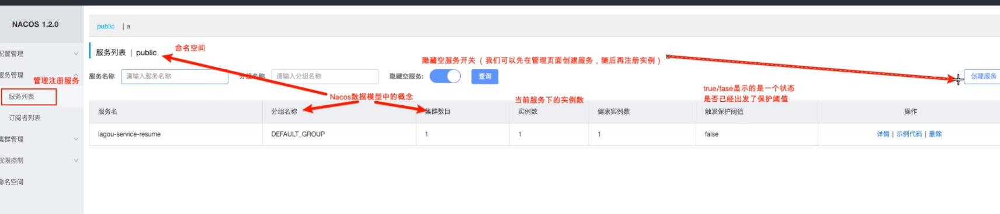

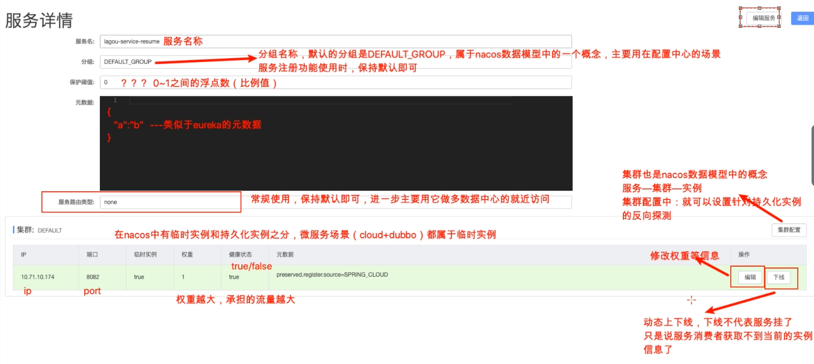

**保护阈值**：可以设置为0-1之间的浮点数，它其实是一个比例值(**当前服务健康实例 数/当前服务总实例数**)

场景:

一般流程下，nacos是服务注册中心，服务消费者要从nacos获取某一个服务的可用 实例信息，对于服务实例有健康/不健康状态之分，nacos在返回给消费者实例信息 的时候，会返回健康实例。这个时候在一些高并发、大流量场景下会存在一定的问 题

如果服务A有100个实例，98个实例都不健康了，只有2个实例是健康的，如果nacos 只返回这两个健康实例的信息的话，那么后续消费者的请求将全部被分配到这两个 实例，流量洪峰到来，2个健康的实例也扛不住了，整个服务A 就扛不住，上游的微 服务也会导致崩溃，，，产生雪崩效应。

#### 保护阈值的意义

当服务A健康实例数/总实例数 < 保护阈值 的时候，说明健康实例真的不多了，这个时候保护阈值会被触发(状态true)

**nacos将会把该服务所有的实例信息(健康的+不健康的)全部提供给消费者，消费 者可能访问到不健康的实例，请求失败，但这样也比造成雪崩要好，牺牲了一些请 求，保证了整个系统的一个可用。**

注意：阿里内部在使用nacos的时候，也**经常调整这个保护阈值参数**。


### 7.1.3.2 服务消费者从Nacos获取服务提供者(改造自动投递微服务)

- 同服务提供者 
- 测试

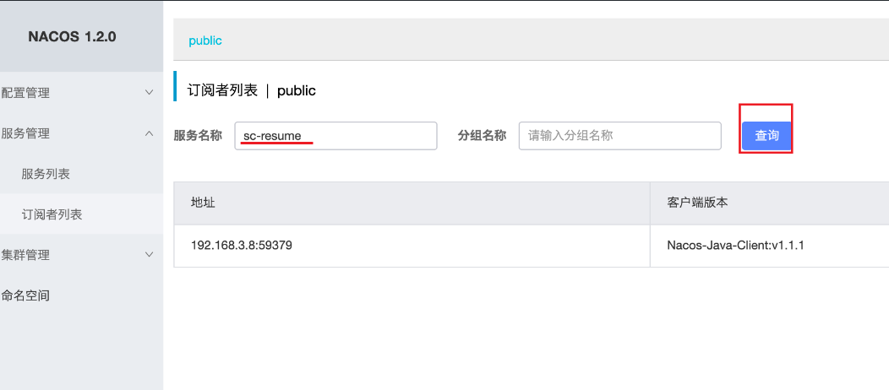


### 7.1.3.3 负载均衡 

Nacos客户端引入的时候，会关联引入Ribbon的依赖包，我们使用OpenFiegn的时候也会引入Ribbon的依赖，Ribbon包括Hystrix都按原来方式进行配置即可

此处，我们将简历微服务，又启动了一个8083端口，注册到Nacos上，便于测试负 载均衡，我们通过后台也可以看出。

### 7.1.3.4 Nacos 数据模型(领域模型)

Namespace命名空间、Group分组、集群这些都是为了进行归类管理，把**服务**和**配置文件**进行归类，归类之后就可以实现一定的效果，比如隔离 

比如，对于服务来说，不同命名空间中的服务不能够互相访问调用

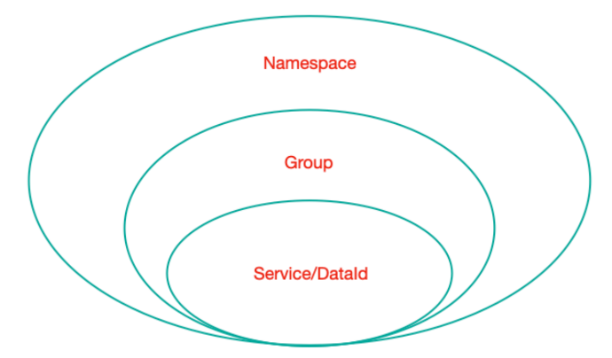

- Namespace:命名空间，对不同的环境进行隔离，比如隔离开发环境、测试环境和 生产环境
- Group:分组，将若干个服务或者若干个配置集归为一组，通常习惯一个系统归为 一个组
- Service:某一个服务，比如简历微服务 
- DataId:配置集或者可以认为是一个配置文件

Namespace + Group + Service 如同 Maven 中的GAV坐标，GAV坐标是为了锁定 Jar，二这里是为了**锁定服务**

Namespace + Group + DataId 如同 Maven 中的GAV坐标，GAV坐标是为了锁定 Jar，二这里是为了**锁定配置文件**

#### 最佳实践

Nacos抽象出了Namespace、Group、Service、DataId等概念，具体代表什么取决 于怎么用(非常灵活)，推荐用法如下

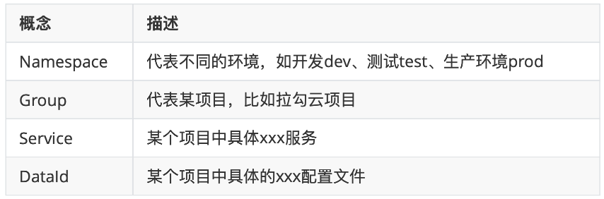

- Nacos服务的分级模型

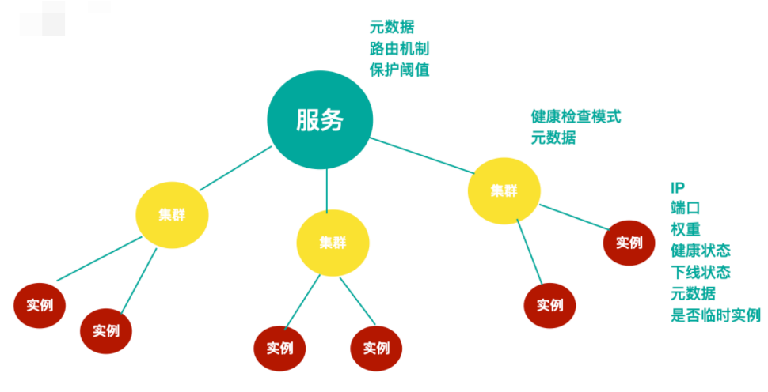

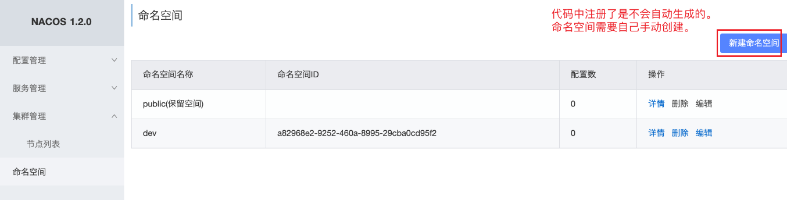


### 7.1.3.5 Nacos Server 数据持久化

Nacos 默认使用嵌入式数据库进行数据存储，它支持改为外部Mysql存储

- 新建数据库 nacos_config，数据库初始化脚本文件 ${nacoshome}/conf/nacos-mysql.sql

- 修改${nacoshome}/conf/application.properties，增加Mysql数据源配置

- 对于mysql8，需要手动引入连接驱动的jar包，在startup.sh中引入

  ```
  #*************** Config Module Related Configurations ***************#
  ### If user MySQL as datasource:
  spring.datasource.platform=mysql
  
  ### Count of DB:
  db.num=1
  
  ### Connect URL of DB:
  db.url.0=jdbc:mysql://127.0.0.1:3306/nacos_config?characterEncoding=utf8&connectTimeout=1000&socketTimeout=3000&autoReconnect=true
  db.user=root
  db.password=root
  
  ```

  

存储的是配置数据


### 7.1.3.6 Nacos Server 集群

- 安装3个或3个以上的Nacos 复制解压后的nacos文件夹，分别命名为nacos-01、nacos-02、nacos-03 

- 修改配置文件

  - 同一台机器模拟，将上述三个文件夹中application.properties中的 server.port分别改为 8848、8849、8850
    同时给当前实例节点绑定ip，因为服务器可能绑定多个ip

    ```
    nacos.inetutils.ip-address=127.0.0.1
    ```

  - 复制一份conf/cluster.conf.example文件，命名为cluster.conf 在配置文件中设置集群中每一个节点的信息

    ```
     # 集群节点配置 
    127.0.0.1:8848 
    127.0.0.1:8849 
    127.0.0.1:8850
    ```

- 分别启动每一个实例(可以批处理脚本完成)

  ```
  sh startup.sh -m cluster
  ```

  

## 7.1.4 Nacos 配置中心 

之前:Spring Cloud Config + Bus

1) Github 上添加配置文件
2) 创建Config Server 配置中心—>从Github上去下载配置信息
3) 具体的微服务(最终使用配置信息的)中配置Config Client—> ConfigServer获取 配置信息


有Nacos之后，分布式配置就简单很多 Github不需要了(配置信息直接配置在Nacos server中)，Bus也不需要了(依然可以完成动态刷新)

接下来

1、去Nacos server中添加配置信息

2、改造具体的微服务，使其成为Nacos Config Client，能够从Nacos Server中获取到配置信息

### Nacos server 添加配置集

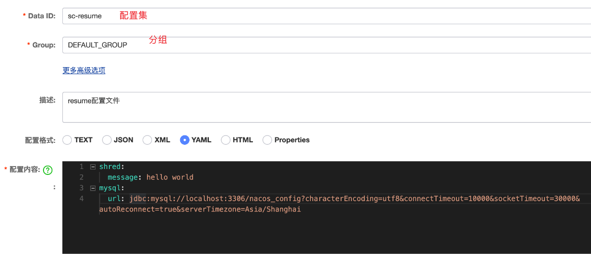

Nacos 服务端已经搭建完毕，那么我们可以在我们的微服务中开启 Nacos 配置管理 

1、添加依赖

```xml
<dependency>
    <groupId>com.alibaba.cloud</groupId>
    <artifactId>spring-cloud-starter-alibaba-nacos-config</artifactId>
</dependency>
```

2、微服务中如何锁定 Nacos Server 中的配置文件(dataId)
 通过 Namespace + Group + dataId 来锁定配置文件，Namespace不指定就默认

public，Group不指定就默认 DEFAULT_GROUP

dataId 的完整格式如下

- ${prefix}-${spring.profile.active}.${file-extension}
  prefix 默认为 spring.application.name 的值，也可以通过配置项
- spring.cloud.nacos.config.prefix 来配置。
  spring.profile.active 即为当前环境对应的 profile。 注意:当
  spring.profile.active 为空时，对应的连接符 - 也将不存在，dataId 的拼 接格式变成 ${prefix}.${file-extension}
- file-exetension 为配置内容的数据格式，可以通过配置项 spring.cloud.nacos.config.file-extension 来配置。目前只支持 properties 和 yaml 类型。

```yml
cloud:
  nacos:
    discovery:
      # 集群中各个节点信息都配置在此（域名- virtual IP -绑定映射到各个实例的地址信息）
      server-addr: 127.0.0.1:8848,127.0.0.1:8849,127.0.0.1:8850
    config:
      server-addr: 127.0.0.1:8848,127.0.0.1:8849,127.0.0.1:8850
      # 指定server端端配置文件，读取配置项
      namespace: a82968e2-9252-460a-8995-29cba0cd95f2
      group: DEFAULT_GROUP #默认分组是DEFAULT_GROUP，可不配置
      file-extension: yaml # 默认 properties
```

3)通过 Spring Cloud 原生注解 @RefreshScope 实现配置自动更新

思考:一个微服务希望从配置中心Nacos server中获取多个dataId的配置信息，可 以的，扩展多个dataId

```yml
cloud:
  nacos:
    discovery:
      # 集群中各个节点信息都配置在此（域名- virtual IP -绑定映射到各个实例的地址信息）
      server-addr: 127.0.0.1:8848,127.0.0.1:8849,127.0.0.1:8850
    config:
      server-addr: 127.0.0.1:8848,127.0.0.1:8849,127.0.0.1:8850
      # 指定server端端配置文件，读取配置项
      namespace: a82968e2-9252-460a-8995-29cba0cd95f2
      group: DEFAULT_GROUP #默认分组是DEFAULT_GROUP，可不配置
      file-extension: yaml # 默认 properties
      # 扩展dataId
      ext-config[0]:
        data-id: abc.yaml
        group: DEFAULT_GROUP #默认分组是DEFAULT_GROUP，可不配置
        refresh: true #扩展dataId 开启动态刷新，即nacos配置监听
      # 扩展dataId
      ext-config[1]:
        data-id: def.yaml
        group: DEFAULT_GROUP #默认分组是DEFAULT_GROUP，可不配置
        refresh: true #扩展dataId 开启动态刷新
```

优先级：根据规则生成的dataId > 扩展的dataId(对于扩展的dataId，[n] n越大优先级越高)

# 7.2 SCA Sentinel 分布式系统的流量防卫兵

## 7.2.1 Sentinel 介绍

Sentinel是一个面向云原生微服务的流量控制、熔断降级组件。

**替代Hystrix，针对问题：服务雪崩、服务降级、服务熔断、服务限流**

Hystrix:
服务消费者(自动投递微服务)—>调用服务提供者(简历微服务)
在调用方引入Hystrix—> 单独搞了一个Dashboard项目—>Turbine

1)自己搭建监控平台 dashboard

2)没有提供UI界面进行服务熔断、服务降级等配置(而是写代码，入侵了我们源程 序环境)

Sentinel:

1)独立可部署Dashboard/控制台组件 

2)减少代码开发，通过UI界面配置即可完成细粒度控制(自动投递微服务)

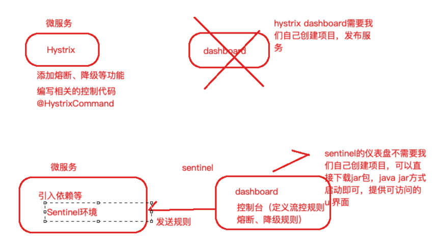

Sentinel 分为两个部分:
核心库:(Java 客户端)不依赖任何框架/库，能够运行于所有 Java 运行时环 境，同时对 Dubbo / Spring Cloud 等框架也有较好的支持。 控制台:(Dashboard)基于 Spring Boot 开发，打包后可以直接运行，不需 要额外的 Tomcat 等应用容器。

Sentinel 具有以下特征:

- 丰富的应用场景：Sentinel 承接了阿里巴巴近 10 年的双十一大促流量的核心场 景，例如秒杀(即突发流量控制在系统容量可以承受的范围)、消息削峰填谷、 集群流量控制、实时熔断下游不可用应用等。
- 完备的实时监控：Sentinel 同时提供实时的监控功能。您可以在控制台中看到 接入应用的单台机器秒级数据，甚至 500 台以下规模的集群的汇总运行情况。 
- 广泛的开源生态：Sentinel 提供开箱即用的与其它开源框架/库的整合模块，例 如与 Spring Cloud、Dubbo的整合。您只需要引入相应的依赖并进行简单的配 置即可快速地接入 Sentinel。
- 完善的 SPI 扩展点：Sentinel 提供简单易用、完善的 SPI 扩展接口。您可以通过 实现扩展接口来快速地定制逻辑。例如定制规则管理、适配动态数据源等。

Sentinel 的主要特性:

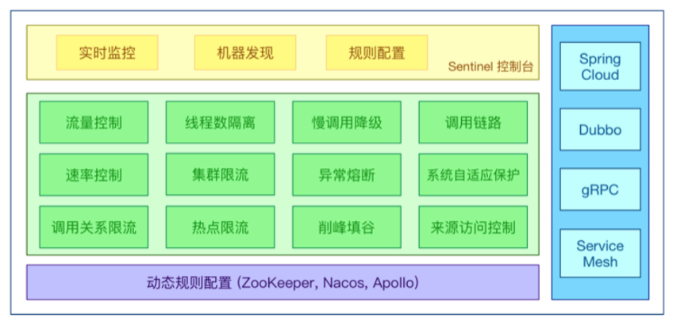

来自官网
Sentinel 的开源生态:

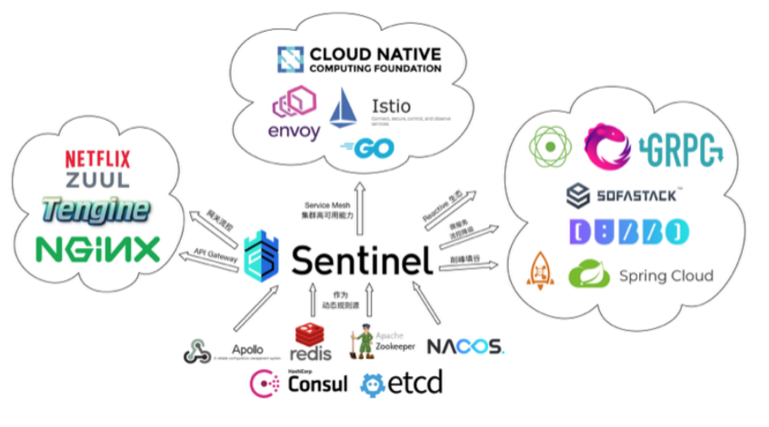

## 7.2.2 Sentinel 部署 

下载地址:https://github.com/alibaba/Sentinel/releases 我们使用v1.7.1

启动:java -jar sentinel-dashboard-1.7.1.jar & 

用户名/密码:sentinel/sentinel

## 7.2.3 服务改造

在我们已有的业务场景中，“自动投递微服务”调用了“简历微服务”，我们在自动投递 微服务进行的熔断降级等控制，那么接下来我们改造自动投递微服务，引入Sentinel 核心包。
为了不污染之前的代码，复制一个自动投递微服务 lagou-service-autodeliver- 8098-sentinel

- pom.xml引入依赖

```
 
<!--sentinel 核心环境 依赖--> <dependency>
  <groupId>com.alibaba.cloud</groupId>
  <artifactId>spring-cloud-starter-alibaba-sentinel</artifactId>
</dependency>
```

- application.yml修改(配置sentinel dashboard，暴露断点依然要有，删除原 有hystrix配置，删除原有OpenFeign的降级配置)

  ```
  server:
    port: 8098
  
  spring:
    application:
      name: sc-autodeliver
    cloud:
      nacos:
        discovery:
          # 集群中各个节点信息都配置在此（域名- virtual IP -绑定映射到各个实例的地址信息）
          server-addr: 127.0.0.1:8848,127.0.0.1:8849,127.0.0.1:8850
      sentinel:
        transport:
          dashboard: 127.0.0.1:8080 # sentinel dashboard/console
          port: 8719 # sentinel 会在该端口启动http server 控制台定义的的限流等规则才能发送传递过来
  
  
  
  SC-RESUME:
    ribbon:
      #请求连接超时时间
      #ConnectTimeout: 2000
      #请求处理超时时间
      ReadTimeout: 5000
      #对所有操作都进行重试
      OkToRetryOnAllOperations: true
      ####根据如上配置，当访问到故障请求的时候，它会再尝试访问一次当前实例(次数 由MaxAutoRetries配置)，
      ####如果不行，就换一个实例进行访问，如果还不行，再换一次实例访问(更换次数 由MaxAutoRetriesNextServer配置)，
      ####如果依然不行，返回失败信息。
      MaxAutoRetries: 0 #对当前选中实例重试次数，不包括第一次调用
      MaxAutoRetriesNextServer: 0 #切换实例的重试次数
      NFLoadBalancerRuleClassName: com.netflix.loadbalancer.RoundRobinRule
  
  logging:
    level:
      # 设置Feign日志只会对日志级别为debug的做出响应
      com.shred.sc.service.ResumeServiceFeignClient: debug
  ```

- 上述配置之后，启动自动投递微服务，使用 Sentinel 监控自动投递微服务 
  此时我们发现控制台没有任何变化，因为懒加载，我们只需要发起一次请求触发即可

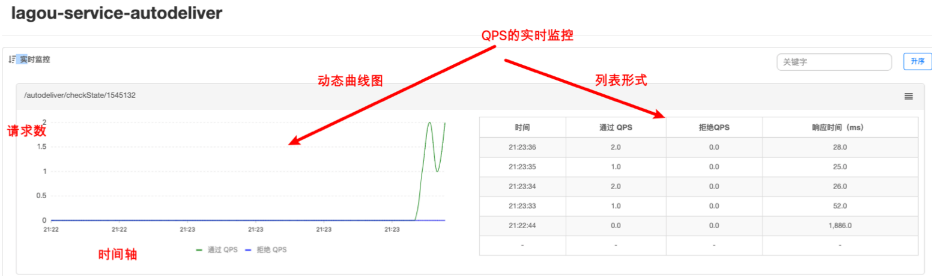

## 7.2.4 Sentinel 关键概念

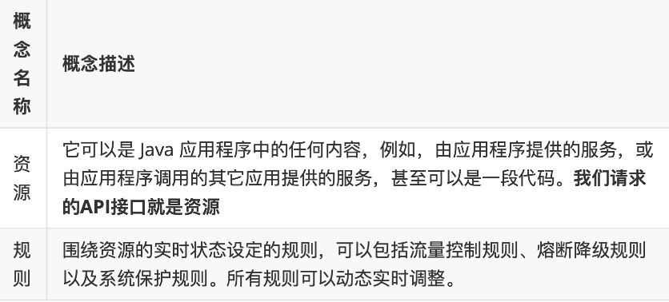


## 7.2.5 Sentinel 流量规则模块

系统并发能力有限，比如系统A的QPS支持1个，如果太多请求过来，那么A就应该进 行流量控制了，比如其他请求直接拒绝

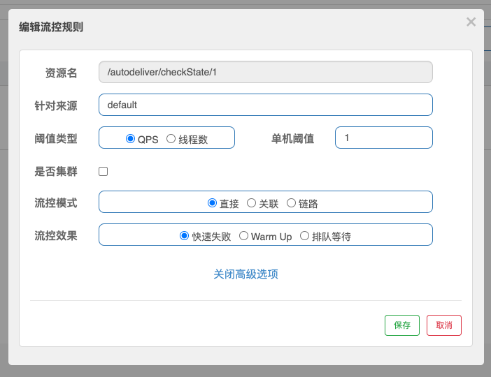

资源名：默认请求路径

针对来源：Sentinel可以针对调用者进行限流，填写微服务名称，默认default(不 区分来源)
阈值类型/单机阈值

QPS：(每秒钟请求数量)当调用该资源的QPS达到阈值时进行限流

线程数：当调用该资源的线程数达到阈值的时候进行限流(线程处理请求的时候，如果说业务逻辑执行时间很⻓，流量洪峰来临时，**会耗费很多线程资源，这些线程资源会堆积，最终可能造成服务不可用**，进一步上游服务不可用，最终可能服务雪崩)

是否集群：是否集群限流

流控模式:

- 直接:资源调用达到限流条件时，直接限流
- 关联:关联的资源调用达到阈值时候限流自己
- 链路:只记录指定链路上的流量

流控效果:
快速失败:直接失败，抛出异常

Warm Up：根据冷加载因子(默认3)的值，从阈值/冷加载因子，经过预热时⻓， 才达到设置的QPS阈值

排队等待：匀速排队，让请求匀速通过，阈值类型必须设置为QPS，否则无效

### 流控模式之关联限流

**关联的资源调用达到阈值时候限流自己**，比如用户注册接口，需要调用身份证校验接口(往往身份证校验接口)，如果身份证校验接口请求达到阈值，使用关联，可以对用户注册接口进行限流。

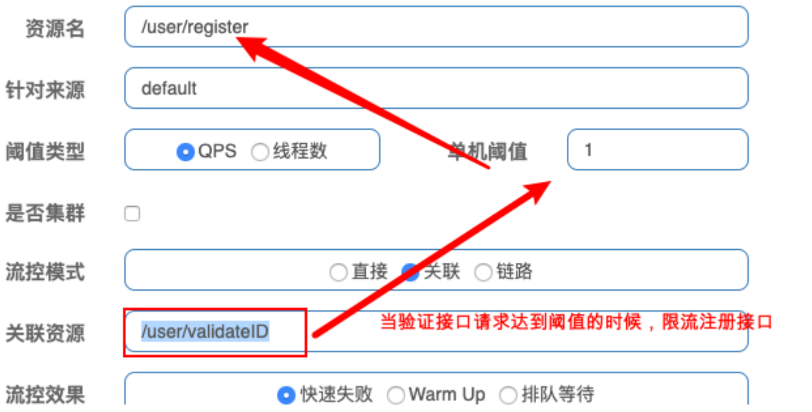

模拟密集式请求/user/validateID验证接口，我们会发现/user/register接口也被限流 了

```
@RestController
@RequestMapping("/user")
public class UserController {
    /**
     * 用户注册接口 * @return
     */
    @GetMapping("/register")
    public String register() {
        System.out.println("Register success!");
        return "Register success!";
    }

    /**
     * 验证注册身份证接口(需要调用公安户籍资源) * @return
     */
    @GetMapping("/validateID")
    public String findResumeOpenState() {
        System.out.println("validateID");
        return "ValidateID success!";
    }
}
```

### 流控模式之链路限流

链路指的是请求链路(调用链)
链路模式下会控制该资源所在的调用链路入口的流量。需要在规则中配置入口资
源，即该调用链路入口的上下文名称。
一棵典型的调用树如下图所示:(阿里云提供)

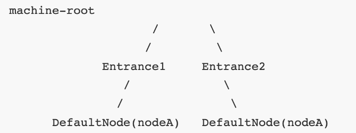

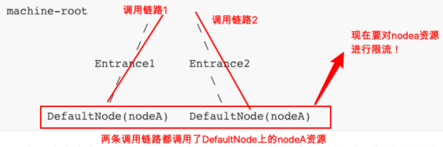

上图中来自入口 Entrance1 和 Entrance2 的请求都调用到了资源 NodeA ， Sentinel 允许只根据某个调用入口的统计信息对资源限流。比如链路模式下设置入 口资源为 Entrance1 来表示只有从入口 Entrance1 的调用才会记录到 NodeA 的限 流统计当中，而不关心经 Entrance2 到来的调用。

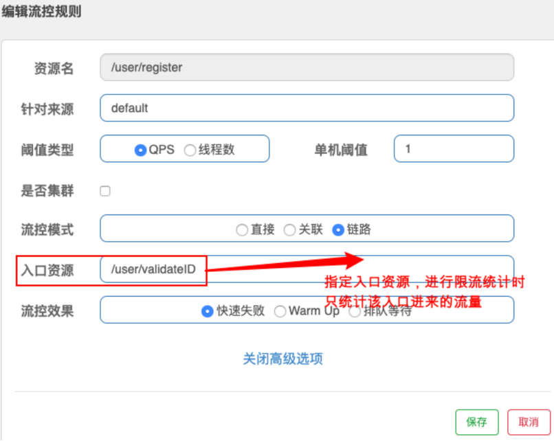

### 流控效果之Warm up

当系统⻓期处于空闲的情况下，当流量突然增加时，直接把系统拉升到高水位可能瞬间把系统压垮，比如电商网站的秒杀模块。

通过 Warm Up 模式(预热模式)，让通过的流量缓慢增加，经过设置的预热时间 以后，到达系统处理请求速率的设定值。

Warm Up 模式默认会从设置的 QPS 阈值的 1/3 开始慢慢往上增加至 QPS 设置值。

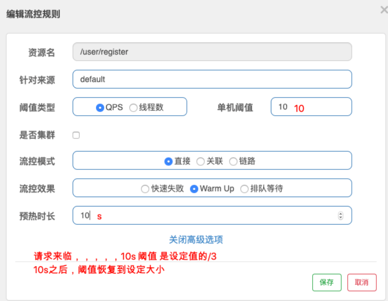

### 流控效果之排队等待

排队等待模式下会严格控制请求通过的间隔时间，即请求会匀速通过，允许部分请 求排队等待，通常用于消息队列削峰填谷等场景。需设置具体的超时时间，当计算 的等待时间超过超时时间时请求就会被拒绝。

很多流量过来了，并不是直接拒绝请求，而是请求进行排队，一个一个匀速通过 (处理)，请求能等就等着被处理，不能等(等待时间>超时时间)就会被拒绝

**例如**，QPS 配置为 5，则代表请求每 200 ms 才能通过一个，多出的请求将排队等 待通过。超时时间代表最大排队时间，超出最大排队时间的请求将会直接被拒绝。 排队等待模式下，QPS 设置值不要超过 1000(请求间隔 1 ms)。

## 7.2.6 Sentinel 降级规则模块 

流控是对外部来的大流量进行控制，熔断降级的视⻆是对内部问题进行处理。

Sentinel 降级会在调用链路中某个资源出现不稳定状态时(例如调用超时或异常比 例升高)，对这个资源的调用进行限制，让请求快速失败，避免影响到其它的资源 而导致级联错误。当资源被降级后，在接下来的降级时间窗口之内，对该资源的调 用都自动熔断.

**=======>>>>** 这里的降级其实是**Hystrix**中的熔断 

还记得当时Hystrix的工作流程么

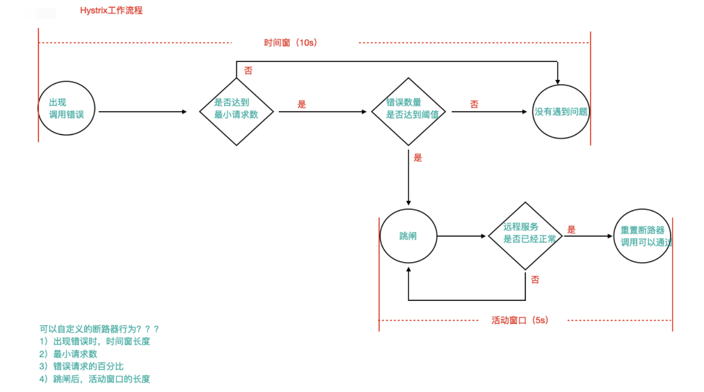

### 策略

Sentinel不会像Hystrix那样放过一个请求尝试自我修复，就是明明确确按照时间窗 口来，熔断触发后，时间窗口内拒绝请求，时间窗口后就恢复。

- **RT(平均响应时间 )**
  当 1s 内持续进入 >=5 个请求，平均响应时间超过阈值(以 ms 为单位)，那么 在接下的时间窗口(以 s 为单位)之内，对这个方法的调用都会自动地熔断(抛 出 DegradeException)。注意 Sentinel 默认统计的 RT 上限是 4900 ms，超出 此阈值的都会算作 4900 ms，若需要变更此上限可以通过启动配置项 `- Dcsp.sentinel.statistic.max.rt=xxx` 来配置。

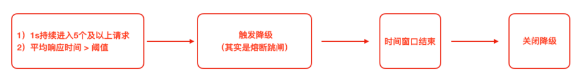

- **异常比例**
  当资源的每秒	请求量 >= 5，并且每秒异常总数占通过量的比值超过阈值之后， 资源进入降级状态，即在接下的时间窗口(以 s 为单位)之内，对这个方法的调 用都会自动地返回。异常比率的阈值范围是 [0.0, 1.0] ，代表 0% - 100%。

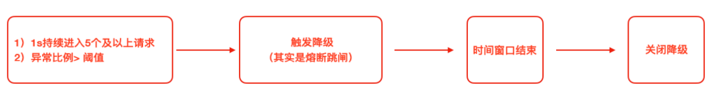

- **异常数**

  当资源近 1 分钟的异常数目超过阈值之后会进行熔断。注意由于统计时间窗口 是分钟级别的，若 timeWindow 小于 60s，则结束熔断状态后仍可能再进入熔 断状态。

  时间窗口 >= 60s

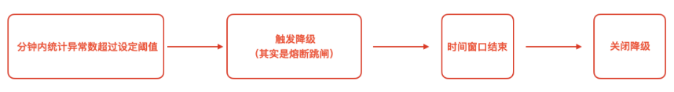


## 7.2.8 Sentinel 自定义兜底逻辑 

@SentinelResource注解类似于Hystrix中的@HystrixCommand注解

@SentinelResource注解中有两个属性需要我们进行区分，blockHandler属性用来 指定不满足Sentinel规则的降级兜底方法，fallback属性用于指定Java运行时异常兜 底方法

- 在API接口资源处配置

  ```
  @RestController
  @RequestMapping("/autodeliver")
  public class AutoDeliverController {
  
      @Autowired
      private ResumeServiceFeignClient resumeServiceFeignClient;
  
      @GetMapping("/checkState/{userId}")
      @SentinelResource(value = "findResumeOpenState",
              blockHandlerClass = SentinelHandlersClass.class,
              blockHandler = "handleException",
              fallbackClass = SentinelHandlersClass.class,
              fallback = "handleError"
      )
      public Integer findResumeOpenState(@PathVariable Long userId) {
  
          return resumeServiceFeignClient.findDefaultResumeState(userId);
      }
  
  }
  ```

- 自定义兜底逻辑类 
  注意:兜底类中的方法为static静态方法

  ```
  public class SentinelHandlersClass {
      //用于处理sentinel、管控规则 的异常
      //整体要求和hystrix一样，还需要在形参中添加BlockException参数，用于接收异常
      public static Integer handleException(Long userId, BlockException blockException) {
          return -100;
      }
  
      //用于处理java程序中的异常
      public static Integer handleError(Long userId) {
          return -500;
      }
  
  }
  ```

## 7.2.9 基于 Nacos 实现 Sentinel 规则持久化

目前，Sentinel Dashboard中添加的规则数据存储在内存，微服务停掉规则数据就 消失，在生产环境下不合适。我们可以将Sentinel规则数据持久化到Nacos配置中 心，让微服务从Nacos获取规则数据。

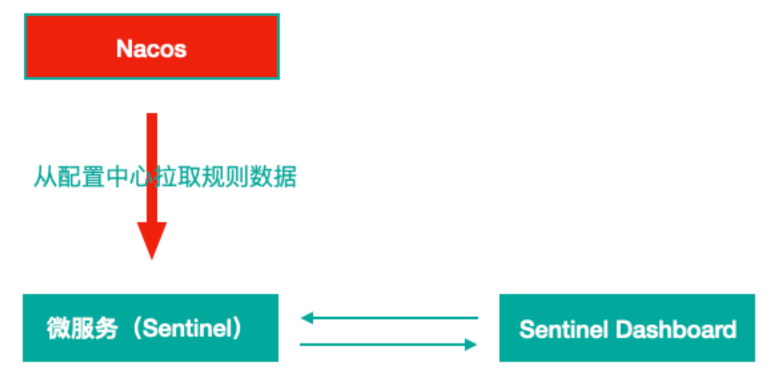

- 自动投递微服务的pom.xml中添加依赖

  ```
  <!-- Sentinel支持采用 Nacos 作为规则配置数据源，引入该适配依赖 -->
  <dependency>
      <groupId>com.alibaba.csp</groupId>
      <artifactId>sentinel-datasource-nacos</artifactId>
  </dependency>
  ```

- 自动投递微服务的application.yml中配置Nacos数据源

  ```yaml
  spring:
    application:
      name: sc-autodeliver
    cloud:
      nacos:
        discovery:
          # 集群中各个节点信息都配置在此（域名- virtual IP -绑定映射到各个实例的地址信息）
          server-addr: 127.0.0.1:8848,127.0.0.1:8849,127.0.0.1:8850
      sentinel:
        transport:
          dashboard: 127.0.0.1:8080 # sentinel dashboard/console
          port: 8719 # sentinel 会在该端口启动http server 控制台定义的的限流等规则才能发送传递过来
        # Sentinel Nacos数据源配置，Nacos中的规则会自动同步到sentinel控 制台的流控规则中
        datasource:
          # 此处的flow为自定义数据源名
          flow: # 流控规则
            nacos:
              server-addr: ${spring.cloud.nacos.discovery.server-addr}
              data-id: ${spring.application.name}-flow-rules
              groupId: DEFAULT_GROUP
              data-type: json
              rule-type: flow # 类型来自RuleType类
          degrade:
            nacos:
              server-addr: ${spring.cloud.nacos.discovery.server-addr}
              data-id: ${spring.application.name}-degrade-rules
              groupId: DEFAULT_GROUP
              data-type: json
              rule-type: degrade # 类型来自RuleType类
  
  ```

  

- Nacos Server中添加对应规则配置集(public命名空间—>DEFAULT_GROUP中 添加)

  流控规则配置集 lagou-service-autodeliver-flow-rules

```json
[{"resource":"findResumeOpenState",
"limitApp":"default",
"grade":1,
"count":1,
"strategy":0,
"controlBehavior":0,
"clusterMode":false}]
```

所有属性来自源码FlowRule类

- resource:资源名称
- limitApp:来源应用
- grade:阈值类型 0 线程数 1 QPS
- count:单机阈值
- strategy:流控模式，0 直接 1 关联 2 链路 controlBehavior:流控效果，0 快速失败 1 Warm Up 2 排队等待 
- clusterMode:true/false 是否集群

降级规则配置集 lagou-service-autodeliver-degrade-rules

```json
[{
"resource":"findResumeOpenState",
"grade":2,
"count":1,
"timeWindow":5
}]
```

所有属性来自源码DegradeRule类

- resource:资源名称
- grade:降级策略 0 RT 1 异常比例 2 异常数 
- count:阈值
- timeWindow:时间窗

**Rule** 源码体系结构

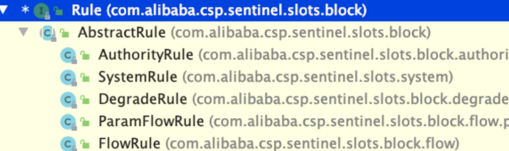


- **注意**
  1)一个资源可以同时有多个限流规则和降级规则，所以配置集中是一个json数 组
  2)Sentinel控制台中修改规则，仅是内存中生效，不会修改Nacos中的配置 值，重启后恢复原来的值; Nacos控制台中修改规则，不仅内存中生效，Nacos 中持久化规则也生效，重启后规则依然保持


# 7.3 Nacos + Sentinel + Dubbo 三剑合璧 

改造“自动投递微服务”和“简历微服务”，删除OpenFeign 和 Ribbon，使用Dubbo RPC 和 Dubbo LB 

- 首先，需**要删除或者注释掉父工程中的热部署依赖**

### 1、创建接口模块 sca-dubbo-api

```java
public interface ResumeService {
    Integer findDefaultByUserId(Long userId);
}
```


### 2、创建服务者模块(简历微服务)

pom文件添加spring cloud + dubbo整合的依赖，同时添加dubbo服务接口 工程依赖

```xml
<dependency>
    <groupId>com.shred.sc</groupId>
    <artifactId>sca-dubbo-api</artifactId>
    <version>1.0-SNAPSHOT</version>
</dependency>

<!--spring cloud alibaba dubbo 依赖-->
<dependency>
    <groupId>com.alibaba.cloud</groupId>
    <artifactId>spring-cloud-starter-dubbo</artifactId>
</dependency>
<dependency>
    <groupId>com.alibaba.csp</groupId>
    <artifactId>sentinel-apache-dubbo-adapter</artifactId>
</dependency>
```

删除原有ResumeService接口，引入dubbo服务接口工程中的 ResumeService接口，适当调整代码，在service的实现类上添加dubbo的 @Service注解

```java
@Service
public class ResumeServiceImpl implements ResumeService {
    @Autowired
    private ResumeDao resumeDao;

    @Override
    public Integer findDefaultByUserId(Long userId) {
        Resume resume = new Resume();
        resume.setUserId(userId);

        resume.setIsDefault(1);
        Example<Resume> resumeExample = Example.of(resume);

        return resumeDao.findOne(resumeExample).get().getIsOpenResume();
    }
}
```

application.yml或者bootstrap.yml配置文件中添加dubbo配置

```yml
dubbo:
  scan:
    # dubbo 服务扫描基准包
    base-packages: com.shred.sc.service.impl
  protocol:
    # dubbo 协议
    name: dubbo
    # dubbo 协议端口( -1 表示自增端口，从 20880 开始)
    port: -1
  registry:
    # 挂载到 Spring Cloud 的注册中心 ,也就是nacos的注册中心
    address: spring-cloud://localhost
```


 #spring boot 2.1 整合dubbo时，需要设定

```yml
spring:
  application:
    name: sc-resume
  main:
    #spring boot 2.1 整合dubbo时，需要设定
    allow-bean-definition-overriding: true
```

运行发布之后，会发现Nacos控制台已经有了服务注册信息,从元数据中可以 看出,是dubbo注册上来的

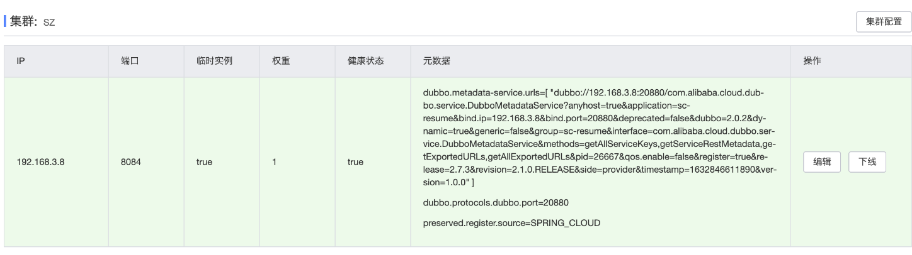

### 3、消费者模块（自动投递微服务）

- pom.xml中删除OpenFeign相关内容 
- application.yml配置文件中删除和Feign、Ribbon相关的内容;
- 代码中删除Feign客户端内容; 
- pom.xml添加内容和服务提供者一样 
- application.yml配置文件中添加dubbo相关内容。同样，也配置下spring.main.allow-bean-definition-overriding=true

```yml
dubbo:
  registry:
    # 挂载到 Spring Cloud 注册中心
    address: spring-cloud://localhost
  cloud:
    # 订阅服务提供方的应用列表，订阅多个服务提供者使用 "," 连接
    subscribed-services: sc-resume

spring:
  application:
    name: sc-autodeliver
  main:
    allow-bean-definition-overriding: true
```

Controller代码改造，其他不变

```java
@RestController
@RequestMapping("/autodeliver")
public class AutoDeliverController {

    @Reference
    private ResumeService resumeService;

    @GetMapping("/checkState/{userId}")
   /* @SentinelResource(value = "findResumeOpenState",
            blockHandlerClass = SentinelHandlersClass.class,
            blockHandler = "handleException",
            fallbackClass = SentinelHandlersClass.class,
            fallback = "handleError"
    )*/
    public Integer findResumeOpenState(@PathVariable Long userId) {

        return resumeService.findDefaultByUserId(userId);
    }

}
```

运行发布之后，同样会发现Nacos控制台已经有了服务注册信息 

http://localhost:8099/autodeliver/checkState/1

