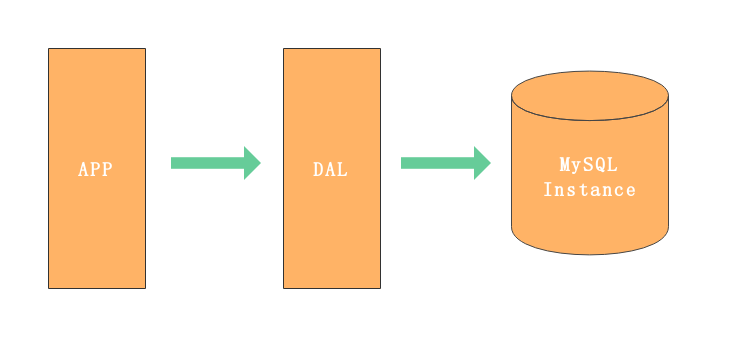
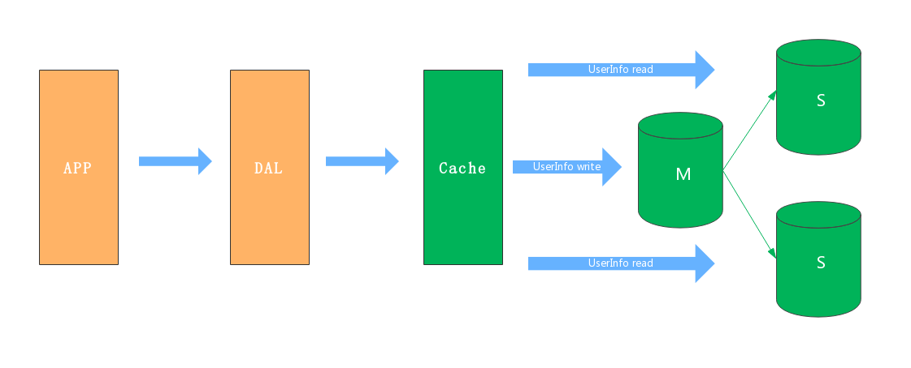
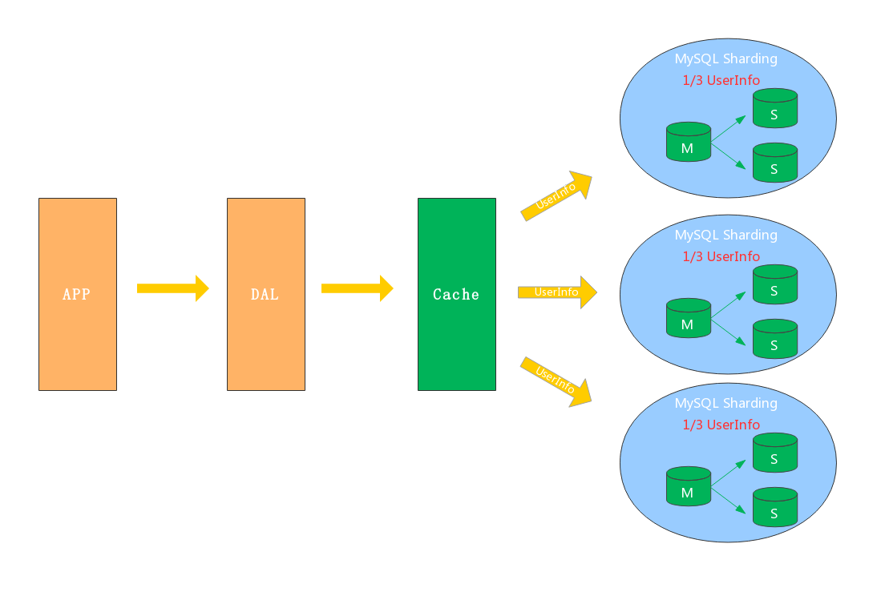
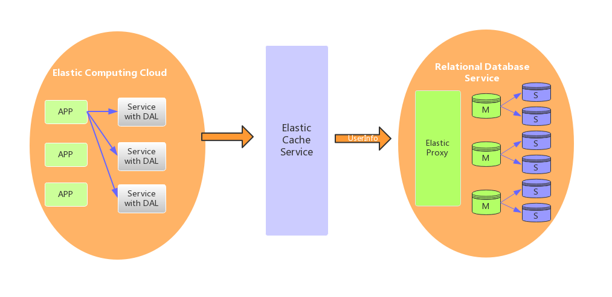
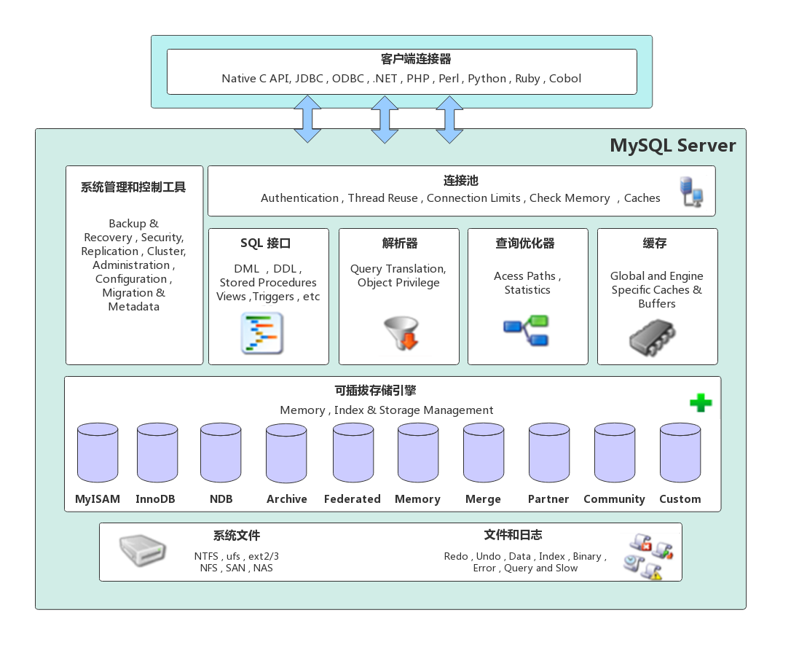
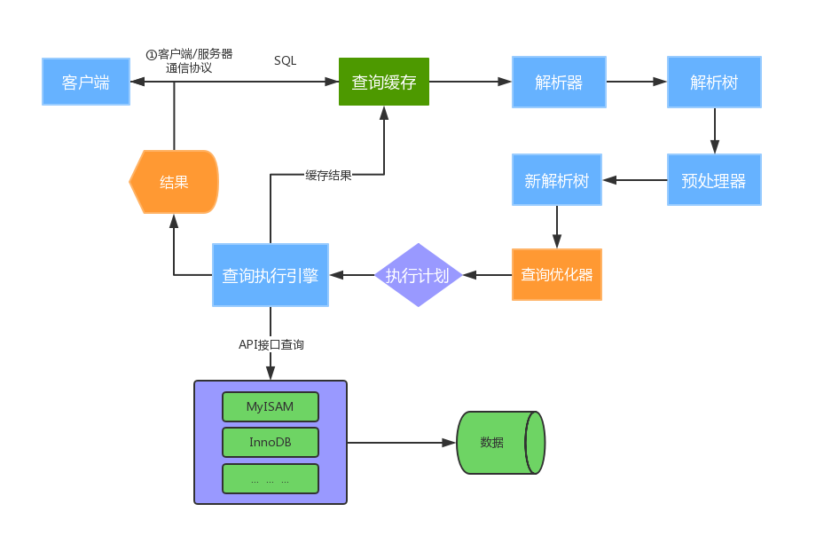
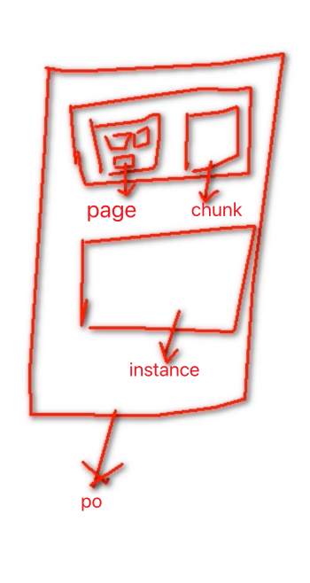
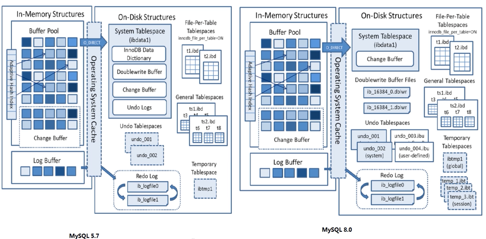

# 第4节 MySQL应用架构演变

本节主要介绍网站在不同的并发访问量级和数据量级下，MySQL应用架构的演变过程。
用户请求--》 应用层 --》服务层 --》存储层

## MySQL应用架构的演变

### 架构V1.0 - 单机单库

一个简单的小型网站或者应用背后的架构可以非常简单, 数据存储只需要一个MySQL Instance就能
满足数据读取和写入需求（这里忽略掉了数据备份的实例），处于这个的阶段系统，一般会把所有
的信息存到一个MySQL Instance里面。

V1.0 瓶颈
数据量太大，超出一台服务器承受
读写操作量太大，超出一台服务器承受
一台服务器挂了，应用也会挂掉（可用性差）

### 架构V2.0 - 主从架构

V2.0架构主要解决架构V1.0下的高可用和读扩展问题，通过给Instance挂载从库解决读取的压力，
主库宕机也可以通过主从切换保障高可用。在MySQL的场景下就是通过主从结构（双主结构也属
于特殊的主从），主库抗写压力，通过从库来分担读压力，对于写少读多的应用，V2.0主从架构
完全能够胜任。

V2.0瓶颈
数据量太大，超出一台服务器承受
写操作太大，超出一台M服务器承受

### 架构V3.0 - 分库分表

对于V1.0和V2.0遇到写入瓶颈和存储瓶颈时，可以通过水平拆分来解决，水平拆分和垂直拆分有
较大区别，垂直拆分拆完的结果，每一个实例都是拥有全部数据的，而水平拆分之后，任何实例都
只有全量的1/n的数据。以下图所示，将Userinfo拆分为3个Sharding，每个Sharding持有总量的
1/3数据，3个Sharding数据的总和等于一份完整数据

数据如何路由成为一个关键问题， 一般可以采用范围拆分，List拆分、Hash拆分等。
如何保持数据的一致性也是个难题。

### 架构V4.0 - 云数据库

云数据库（云计算）现在是各大IT公司内部作为节约成本的一个突破口，对于数据存储的MySQL
来说，如何让其成为一个saas（Software as a Service）是关键点。MySQL作为一个saas服务，
服务提供商负责解决可配置性，可扩展性，多用户存储结构设计等这些疑难问题。

# 第1节 MySQL体系架构

MySQL Server架构自顶向下大致可以分网络连接层、服务层、存储引擎层和系统文件层。

## 一、网络连接层

客户端连接器（Client Connectors）：提供与MySQL服务器建立的支持。目前几乎支持所有主流
的服务端编程技术，例如常见的 Java、C、Python、.NET等，它们通过各自API技术与MySQL建立

# 第2节 MySQL运行机制

## 存储结构演变

