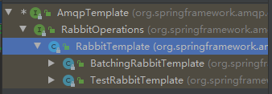

# RabbitMq

# 消息队列

两个重要概念：
消息代理（message broker）和目的地（destination）
当消息发送者发送消息以后，将由消息代理接管，消息代理保证消息传递到指定目的地。
3.消息队列主要有两种形式的目的地
1.队列（queue）：点对点消息通信（point-to-point）
2.主题（topic）：发布（publish）/订阅（subscribe）消息通信


点对点式：

- 消息发送者发送消息，消息代理将其放入一个队列中，消息接收者从队列中获取消息内容，消息读取后被移出队列
- 消息只有唯一的发送者和接受者，但并不是说只能有一个接收者


5.发布订阅式：

- 发送者（发布者）发送消息到主题，多个接收者（订阅者）监听（订阅）这个主题，那么就会在消息到达时同时收到消息


##消息队列协议

- JMS
- AMQP


##核心概念

### Message
消息，消息是不具名的，它由消息头和消息体组成。消息体是不透明的，而消息头则由一系列的可选属性组成，这些属性包括routing-key（路由键）、priority（相对于其他消息的优先权）、delivery-mode（指出该消息可能需要持久性存储）等。
### Publisher
消息的生产者，也是一个向交换器发布消息的客户端应用程序。
### Exchange
交换器，用来接收生产者发送的消息并将这些消息路由给服务器中的队列。
**Exchange有4种类型**：direct(默认)，fanout, topic, 和headers，不同类型的Exchange转发消息的策略有所区别

Exchange分发消息时根据类型的不同分发策略有区别，目前共四种类型：direct、fanout、topic、headers 。headers 匹配AMQP 消息的header 而不是路由键，headers 交换器和direct 交换器完全一致，但性能差很多，目前几乎用不到了，所以直接看另外三种类型：

- 消息中的路由键（routing key）如果和Binding 中的binding key 一致，交换器就将消息发到对应的队列中。路由键与队列名完全匹配，如果一个队列绑定到交换机要求路由键为“dog”，则只转发routing key 标记为“dog”的消息，不会转发“dog.puppy”，也不会转发“dog.guard”等等。它是完全匹配、单播的模式。

- 每个发到fanout 类型交换器的消息都会分到所有绑定的队列上去。fanout 交换器不处理路由键，只是简单的将队列绑定到交换器上，每个发送到交换器的消息都会被转发到与该交换器绑定的所有队列上。很像子网广播，每台子网内的主机都获得了一份复制的消息。fanout 类型转发消息是最快的。

- topic交换器通过模式匹配分配消息的路由键属性，将路由键和某个模式进行匹配，此时队列需要绑定到一个模式上。它将路由键和绑定键的字符串切分成单词，这些单词之间用点隔开。它同样也会识别两个通配符：符号“#”和符号“*”。#匹配0个或多个单词，\*匹配一个单词。

### Queue

消息队列，用来保存消息直到发送给消费者。它是消息的容器，也是消息的终点。一个消息可投入一个或多个队列。消息一直在队列里面，等待消费者连接到这个队列将其取走。

### Binding

绑定，用于消息队列和交换器之间的关联。一个绑定就是基于路由键将交换器和消息队列连接起来的路由规则，所以可以将交换器理解成一个由绑定构成的路由表。
Exchange 和Queue的绑定可以是多对多的关系。

### Connection

网络连接，比如一个TCP连接。

### Channel

信道，多路复用连接中的一条独立的双向数据流通道。信道是建立在真实的TCP连接内的虚拟连接，AMQP 命令都是通过信道发出去的，不管是发布消息、订阅队列还是接收消息，这些动作都是通过信道完成。因为对于操作系统来说建立和销毁TCP 都是非常昂贵的开销，所以引入了信道的概念，以**复用一条TCP 连接。**

### Consumer

消息的消费者，表示一个从消息队列中取得消息的客户端应用程序。

### Virtual Host

虚拟主机，表示一批交换器、消息队列和相关对象。虚拟主机是共享相同的身份认证和加密环境的独立服务器域。每个vhost 本质上就是一个mini 版的RabbitMQ 服务器，拥有自己的队列、交换器、绑定和权限机制。vhost 是AMQP 概念的基础，必须在连接时指定，RabbitMQ 默认的vhost 是/ 。

### Broker

表示消息队列服务器实体


## 安装

- 在linux的docker中安装

```shell


运行命令
docker run -d -p 5672:5672 -p 15672:15672 --name myrabbitmq 4b23cfb64730
```


# RabbitClient

生产者不需要创建生产者，只需使用channel传送信息


```java
    public static void main(String[] args) throws IOException, TimeoutException {
        ConnectionFactory connectionFactory = new ConnectionFactory();
        connectionFactory.setHost("192.168.1.112");
        connectionFactory.setPort(5672);
        connectionFactory.setVirtualHost("/");

        Connection connection = connectionFactory.newConnection();

        Channel channel = connection.createChannel();

        for (int i=0; i < 5; i++){
            String msg = "Hello RabbitMq!";
            //The default exchange is implicitly bound to every queue, with a routing key equal to the queue name. It is not possible to explicitly bind to, or unbind from the default exchange. It also cannot be deleted.
            //不指定exchange,会将消息发送到AMQP default交换机上，发送到队列名为routingkey的队列
            channel.basicPublish("","test001",null,msg.getBytes());
            System.out.println("生产者发送：" + msg);
        }

        channel.close();
        connection.close();
//可以使用try resource来自动回收
    }

```


## Exchange

### 交换机属性

- name
- type
- durability：
- auto delete：当最后一个绑定到exchange的队列都被删除时，即没有队列绑定到该exhcange，那么自动删掉这个exc
- internal： 当前exchange用于rabbitmq内部，默认false
- arguments：扩展参数

### 交换机类型


### 发送消息

就是将消息通过exchange发送到指定队列的过程


### 接收消息

就是从指定队列获取消息的过程


### TopicExchange

topic交换器通过模式匹配分配消息的路由键属性，将路由键和某个模式进行匹配，此时队列需要绑定到一个模式上。

TopicExchange上使用的带通配符的routingkey可以说是一个topic，将消


## 高级特性

### Envelope

```java
/** * Encapsulates a group of parameters used for AMQP's Basic methods */
public class Envelope {
    private final long _deliveryTag;
    private final boolean _redeliver;
    private final String _exchange;
    private final String _routingKey;
```

DeliveryTag:


### RabbitMQ确认消息Confirm详解

##### 理解Confirm消息确认机制

- 消息的确认，是指生产者投递消息后，如果Broker收到消息，则会给我们生产者一个应答。
- 生产者进行接收应答，用来确定这条消息是否正常的发送到Broker，这种方式也是消息的可靠性投递的核心保障！

##### 确认机制流程图

生产端发送消息到Broker，然后Broker接收到了消息后，进行回送响应，生产端有一个`Confirm Listener`，去监听应答，当然这个操作是异步进行的，生产端将消息发送出去就可以不用管了，让内部监听器去监听Broker给我们的响应。


##### 如何实现Confirm确认消息？

- 第一步，在channel上开启确认模式：`channel.confirmSelect()` 
- 第二步，在channel上添加监听：`addConfirmListener`，监听成功和失败的返回结果，根据具体的结果对消息进行重新发送、或记录日志等后续处理！


#### 示例

```java
class Producer{
		//4 指定我们的消息投递模式: 消息的确认模式 
        channel.confirmSelect();
        //6 添加一个确认监听
        channel.addConfirmListener(new ConfirmListener() {
            //消息失败处理
            @Override
            public void handleNack(long deliveryTag, boolean multiple) throws IOException {
                //deliveryTag；唯一消息标签
                //multiple：是否批量
                System.err.println("-------no ack!-----------");
            }
            //消息成功处理
            @Override
            public void handleAck(long deliveryTag, boolean multiple) throws IOException {
                System.err.println("-------ack!-----------");
            }
        });
    }
```


### RabbitMQ的Return消息机制

#### Return机制

-  `Return Listener` 用于处理一些不可路由的消息！
- 我们的消息生产者，通过指定一个Exchange 和Routingkey，把消息送达到某一个队列中去， 然后我们的消费者监听队列，进行消费处理操作！
- 但是在某些情况下，如果我们在发送消息的时候，当前的exchange不存在或者指定的路由key路由不到，这个时候如果我们需要监听这种不可达的消息，就要使用`Return Listener` 


#### Return机制实现

1. 添加return监听：`addReturnListener`，生产端去监听这些不可达的消息，做一些后续处理，比如说，记录下消息日志，或者及时去跟踪记录，有可能重新设置一下就好了

   ##### Mandatory

2. 发送消息时，设置`Mandatory`：如果为true，则监听器会接收到路由不可达的消息，然后进行后续处理，如果为false，那么broker端自动删除该消息！

   如果我们将 `Mandatory` 属性设置为false，对于不可达的消息会被Broker直接删除，那么生产端就不会进行任何打印了。如果我们的路由key设置为正确的，那么消费端能够正确消费，生产端也不会进行任何打印。

#### 示例


```java
生产者：
class Producer{
    
    String exchange = "test_return_exchange";
        //String routingKey = "return.save";
    String routingKeyError = "abc.save";//故意写错，使消息无法路由
    channel.addReturnListener((replyCode, replyText, exchange, routingKey1, properties, body) -> {
            //replyCode：响应码    replyText：响应信息
		
    }
    //5 发送一条消息，第三个参数mandatory：必须设置为true
    channel.basicPublish(exchange, routingKeyError, true, null, msg.getBytes());
}
消费者：
class Consumer{
    
     String exchangeName = "test_return_exchange";
     String routingKey = "return.#";
     while(true){
        Delivery delivery = queueingConsumer.nextDelivery();
        String msg = new String(delivery.getBody());
        System.err.println("消费者: " + msg);
    }
}
                          
```

由于生产端设置的是一个错误的路由key，所以消费端没有任何打印，而生产端打印了如下内容

```kotlin
---------handle  return----------
replyCode: 312
replyText: NO_ROUTE
exchange: test_return_exchange
routingKey: abc.save
body: Hello RabbitMQ Return Message
```

如果我们将 `Mandatory` 属性设置为false，对于不可达的消息会被Broker直接删除，那么生产端就不会进行任何打印了。如果我们的路由key设置为正确的，那么消费端能够正确消费，生产端也不会进行任何打印。

>
> https://www.jianshu.com/p/f23c784e163d来源：简书著作权归作者所有。商业转载请联系作者获得授权，非商业转载请注明出处。


### RabbitMQ消费端ACK与重回队列机制

##### 消费端的手工ACK与NACK

当我们设置 **`autoACK=false`** 时，就可以使用手工ACK方式了，那么其实手工方式包括了手工ACK与NACK。
 当我们手工 `ACK` 时，会发送给Broker一个应答，代表消息成功处理了，Broker就可以回送响应给生产端了。`NACK` 则表示消息处理失败了，如果设置重回队列，Broker端就会将没有成功处理的消息重新发送。

###### 使用方式

1. 消费端进行消费的时候，如果由于业务异常我们可以手工 `NACK` 并进行日志的记录，然后进行补偿！
    方法：`void basicNack(long deliveryTag, boolean multiple, boolean requeue)` 
   requeue: 重回队列。若为false，直接抛弃消息。
2. 如果由于服务器宕机等严重问题，那我们就需要手工进行 `ACK` 保障消费端消费成功！
    方法：`void basicAck(long deliveryTag, boolean multiple)` 

##### 消费端的重回队列

- 消费端重回队列是为了对没有处理成功的消息，把消息重新会递给Broker！
- 重回队列，会把消费失败的消息重新添加到队列的尾端，供消费者继续消费。
- 一般我们在实际应用中，都会关闭重回队列，也就是设置为false

#### 示例


```java
发送：
    for (int i =1 ; i < 6; i++){
            Map<String, Object> headers = new HashMap<String, Object>();
            headers.put("num", i);
            AMQP.BasicProperties properties = new AMQP.BasicProperties.Builder()
                    //deliveryMode的作用？
                    .deliveryMode(2)
                    .contentEncoding("UTF-8")
                    .headers(headers)
                    .build();
            String msg = "Hello RabbitMQ ACK Message " + i;
            channel.basicPublish(exchangeName, routingKey, properties, msg.getBytes());
        }
    ...


接收处理：
Class Consumer{
        ...
        //手工签收 必须要设置 autoAck = false
        channel.basicConsume(queueName, false, new MyConsumer(channel));
}  
        
public class MyConsumer extends DefaultConsumer {
        ...
     @Override
    public void handleDelivery(String consumerTag, Envelope envelope, AMQP.BasicProperties properties, byte[] body) throws IOException {
        System.err.println("-----------consume message----------");

        System.err.println("body: " + new String(body));

        try {
            Thread.sleep(2000);
        } catch (InterruptedException e) {
            e.printStackTrace();
        }

        if ((Integer) properties.getHeaders().get("num") == 1){
            //NACK，参数三requeue：是否重回队列
            channel.basicNack(envelope.getDeliveryTag(), false, false);
        } else {
            channel.basicAck(envelope.getDeliveryTag(), false);
        }
    }
...
}
```


>
> https://www.jianshu.com/p/b62ab03b0996来源：简书著作权归作者所有。商业转载请联系作者获得授权，非商业转载请注明出处。


### 消费端限流

##### 消费端限流机制

RabbitMQ提供了一种`qos` (服务质量保证)功能，即在非自动确认消息的前提下，如果一定数目的消息 (通过基于consume或者channel设置Qos的值) 未被确认前，不进行消费新的消息。
 需要注意：
 1.不能设置自动签收功能`(autoAck = false)`
 2.如果消息没被确认，就不会到达消费端，目的就是给消费端减压

##### 限流相关API

###### 限流设置 - BasicQos()

`void BasicQos(uint prefetchSize, ushort prefetchCount, bool global);`
 `prefetchSize:` 单条消息的大小限制，消费端通常设置为0，表示不做限制
 `prefetchCount:` 一次最多能处理多少条消息，通常设置为1
 `global:` 是否将上面设置应用于channel，false代表consumer级别

###### 注意事项

`prefetchSize`和`global`这两项，rabbitmq没有实现，暂且不研究
 `prefetchCount`在 `autoAck=false` 的情况下生效，即**在自动应答的情况下这个值是不生效的**

###### 手工ACK - basicAck()

`void basicAck(Integer deliveryTag，boolean multiple)`
 手工ACK，调用这个方法就会主动回送给Broker一个应答，表示这条消息我处理完了，你可以给我下一条了。参数`multiple`表示是否批量签收，由于我们是一次处理一条消息，所以设置为false


#### 示例

```java
public class Consumer {
    
	//进行参数设置：单条消息的大小限制，一次最多能处理多少条消息，是否将上面设置应用于channel
        channel.basicQos(0, 1, false);
        
        //限流： autoAck设置为 false
        channel.basicConsume(queueName, false, new MyConsumer(channel));
...
}    
    
public class MyConsumer extends DefaultConsumer {

    //接收channel
    private Channel channel ;
    public MyConsumer(Channel channel) {
        super(channel);
        this.channel = channel;
    }

    @Override
    public void handleDelivery(String consumerTag, Envelope envelope, AMQP.BasicProperties properties, byte[] body) throws IOException {
        System.err.println("-----------consume message----------");
        System.err.println("consumerTag: " + consumerTag);
        System.err.println("envelope: " + envelope);
        //System.err.println("properties: " + properties);
        System.err.println("body: " + new String(body));
        //手工ACK，参数multiple表示不批量签收
        //channel.basicAck(envelope.getDeliveryTag(), false);   
    }
}
```


>
> https://www.jianshu.com/p/4a1bbf5bf8f6来源：简书著作权归作者所有。商业转载请联系作者获得授权，非商业转载请注明出处。


### 消费端ack重回队列

需要取消自动ack

```java
// 手工签收 必须要关闭 
autoAck = falsechannel.basicConsume(queueName, false, new MyConsumer(channel));
```

#### 自定义的queueConsumer

可以`extends DefaultConsumer` 重写`handleDelivery`

- 通过`channel.basicNack()` 、`channel.basicAck() `处理消息

```java
void basicNack(long deliveryTag, boolean multiple, boolean requeue)
void basicAck(long deliveryTag, boolean multiple) throws IOException;
```

实现：

```java

public class MyConsumer extends DefaultConsumer {

	private Channel channel ;
	
	public MyConsumer(Channel channel) {
		super(channel);
		this.channel = channel;
	}

	@Override
	public void handleDelivery(String consumerTag, Envelope envelope, AMQP.BasicProperties properties, byte[] body) throws IOException {
		System.err.println("-----------consume message----------");
		System.err.println("body: " + new String(body));
		try {
			Thread.sleep(2000);
		} catch (InterruptedException e) {
			e.printStackTrace();
		}
		if((Integer)properties.getHeaders().get("num") == 0) {
			//会重新投递
			channel.basicNack(envelope.getDeliveryTag(), false, true);
		} else {
			channel.basicAck(envelope.getDeliveryTag(), false);
		}
		
	}

}
```


### TTL

TTL是`Time To Live`的缩写，也就是生存时间

RabbitMQ支持消息的过期时间，在消息发送时可以进行指定

RabbitMQ支持为每个队列设置消息的超时时间，从消息入队列开始计算，只要超过了队列的超时时间配置，那么消息会自动的清除

###### 消息的过期时间设置

```cpp
        AMQP.BasicProperties properties = new AMQP.BasicProperties.Builder()
                .expiration("10000") //10s过期
                .build();
        //发送消息
        channel.basicPublish(exchange, routingKey, true, properties, msg.getBytes());
```

###### 队列的过期时间设置

```dart
        //设置队列的过期时间10s
        Map<String,Object> param = new HashMap<>();
        param.put("x-message-ttl", 10000);
        //声明队列
        channel.queueDeclare(queueName, true, false, false, null);
```

###### 注意事项

两者的区别是:

1. 设置队列的过期时间是对该队列的所有消息生效的。
2. 为消息设置TTL有一个问题：RabbitMQ只对处于队头的消息判断是否过期（即不会扫描队列），所以，很可能队列中已存在死消息，但是队列并不知情。这会影响队列统计数据的正确性，妨碍队列及时释放资源。


### 死信队列

##### 死信队列介绍

- 死信队列：DLX，`dead-letter-exchange` 
- 利用DLX，当消息在一个队列中变成死信 `(dead message)` 之后，它能被重新publish到另一个Exchange，这个Exchange就是DLX

##### 消息变成死信有以下几种情况

- 消息被拒绝(basic.reject / basic.nack)，并且requeue = false
- 消息TTL过期
- 队列达到最大长度

#### 示例

- 声明正常队列，设置 `x-dead-letter-exchange`参数，值为死信交换机的名称。
- 声明相关的死信队列

```java
...
		// 这就是一个普通的交换机 和 队列 以及路由
		String exchangeName = "test_dlx_exchange";
		channel.exchangeDeclare(exchangeName, "topic", true, false, null);
...
    	Map<String, Object> agruments = new HashMap<String, Object>();
		//设置参数，value为私信exchange
		agruments.put("x-dead-letter-exchange", "dlx.exchange");
		//这个agruments属性，要设置到声明原【队列】上
		channel.queueDeclare(queueName, true, false, false, agruments);
...
    	//要进行死信队列的声明 :
		channel.exchangeDeclare("dlx.exchange", "topic", true, false, null);
		channel.queueDeclare("dlx.queue", true, false, false, null);
		channel.queueBind("dlx.queue", "dlx.exchange", "#");
```


#### 作用

将死信放入死信队列中，等待重试


### 总结

-  `Mandatory` 

如果为true，则监听器会接收到路由不可达的消息，然后进行后续处理，如果为false，那么broker端自动删除该消息！

```
void basicPublish(String exchange, String routingKey, boolean mandatory, BasicProperties props, byte[] body)
```


- `autoACK`

当我们设置 **`autoACK=false`** 时，就可以使用手工ACK方式了，那么其实手工方式包括了手工ACK与NACK。
 当我们手工 `ACK` 时，会发送给Broker一个应答，代表消息成功处理了，Broker就可以回送响应给生产端了。`NACK` 则表示消息处理失败了，如果设置重回队列，Broker端就会将没有成功处理的消息重新发送。

```java
//NACK，参数三requeue：是否重回队列
            channel.basicNack(envelope.getDeliveryTag(), false, false);
```


- 限流设置 - `BasicQos()`

`void BasicQos(uint prefetchSize, ushort prefetchCount, bool global);`
 `prefetchSize:` 单条消息的大小限制，消费端通常设置为0，表示不做限制
 `prefetchCount:` 一次最多能处理多少条消息，通常设置为1
 `global:` 是否将上面设置应用于channel，false代表consumer级别

```java
//进行参数设置：单条消息的大小限制，一次最多能处理多少条消息，是否将上面设置应用于channel
        channel.basicQos(0, 1, false);
```


- `requeue`

重回队列

```java
void basicNack(long deliveryTag, boolean multiple, boolean requeue)
//会重新投递
channel.basicNack(envelope.getDeliveryTag(), false, true);
```


- `TTL`


- `dead-letter-exchange` 

死信队列

```java
		Map<String, Object> agruments = new HashMap<String, Object>();
		//设置参数，value为私信exchange
		agruments.put("x-dead-letter-exchange", "dlx.exchange");
		//这个agruments属性，要设置到声明原【队列】上
		channel.queueDeclare(queueName, true, false, false, agruments);
```


# SpringAmqp


##### MessageListenerAdapter总结

- MessageListenerAdapter：即消息监听适配器
- 通过messageListenerAdapter的代码我们可以看出如下核心属性：
   `defaultListenerMethod:` 默认监听方法名称:用于设置监听方法名称
   `Delegate:` 实际真实的委托对象，用于处理消息
   `queueOrTagToMethodName:` 队列和方法名称绑定，即指定队列里的消息会被绑定的方法所接受处理


https://www.jianshu.com/p/b36f96a00d73来源：简书著作权归作者所有。商业转载请联系作者获得授权，非商业转载请注明出处。


# 与SpringBoot整合

## 配置

```xml
---
pom.xml
<dependency>
    <groupId>org.springframework.boot</groupId>
    <artifactId>spring-boot-starter-amqp</artifactId>
</dependency>
<dependency>
    <groupId>org.springframework.amqp</groupId>
    <artifactId>spring-rabbit-test</artifactId>
    <scope>test</scope>
</dependency>

---
application.yml
spring:
  rabbitmq:
    host: 127.0.0.1
    username: guest
    password: guest
```

## RabbitTemplate

```java
@RunWith(SpringRunner.class)
@SpringBootTest(classes = RabbitmqApplication.class)
class RabbitServiceTest {

    @Autowired
    RabbitService rabbitService;

    @Autowired
    RabbitTemplate template;

    Car car = new Car("four","audi",10000.1f);

    @Test
    void receiveAny(){
        Object shred = template.receiveAndConvert("shred.like");
        System.out.println(shred);
    }

    @Test
    void sendAny(){
        template.convertAndSend("exchange.fanout","",car);
    }

    @Test
    void sendTopic(){
        template.convertAndSend("exchange.topic","shred.xx",new StringBuffer("sdfsfasdfsafdcx"));
    }

    @Test
    void send() {
        rabbitService.send();

    }

    @Test
    void sendCar(){
        rabbitService.sendObje();
    }


}
```


## @EnableRabbit、@RabbitListener


- @EnableRabbit用于开启listener
- @RabbitListener(queues = {"xxx"})，用于监听xxx队列

```java
@Service
public class CarService {

    @RabbitListener(queues = "shred.news")
    public void receive(Car car){
        System.out.println("收到消息from shred.news :" + car);
    }

    @RabbitListener(queues = "shred")
    public void receive2(Message m){
        System.out.println("===from queue[shred] :");
        System.out.println(m.getBody());
        System.out.println(m.getMessageProperties());
        System.out.println("====");
    }
}

```


## RabbitTemplate



```java
public class RabbitTemplate extends RabbitAccessor implements BeanFactoryAware, RabbitOperations, MessageListener, ListenerContainerAware, Listener, Lifecycle, BeanNameAware {

    
    
```


### 发送消息

就是将消息通过exchange发送到指定队列的过程，生产者跟exchange交互


###接收消息

就是从指定队列获取消息的过程，消费者跟queue交互


##TopicExchange

topic交换器通过模式匹配分配消息的路由键属性，将路由键和某个模式进行匹配，此时队列需要绑定到一个模式上。

TopicExchange上使用的带通配符的routingkey可以说是一个topic，将消

## RabbitTemplate


```java
public class RabbitTemplate extends RabbitAccessor implements BeanFactoryAware, RabbitOperations, MessageListener, ListenerContainerAware, Listener, Lifecycle, BeanNameAware {

    
    
```


### 幂等性

方案

- 唯一id + 指纹 
- redis原子特性
- 


### Conform 确认消息

1. channel.confirmSelect()
2. channel 增加addConfirmListener
3. 