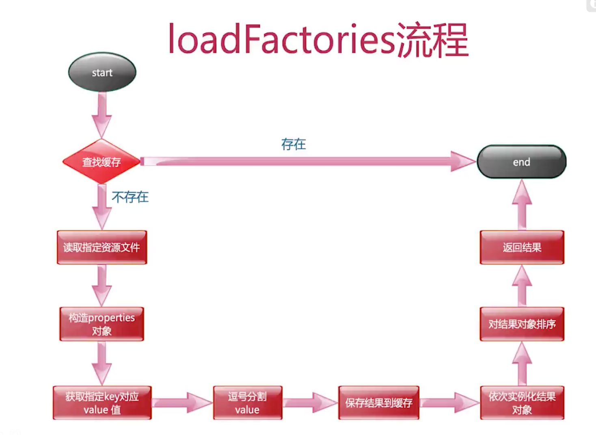
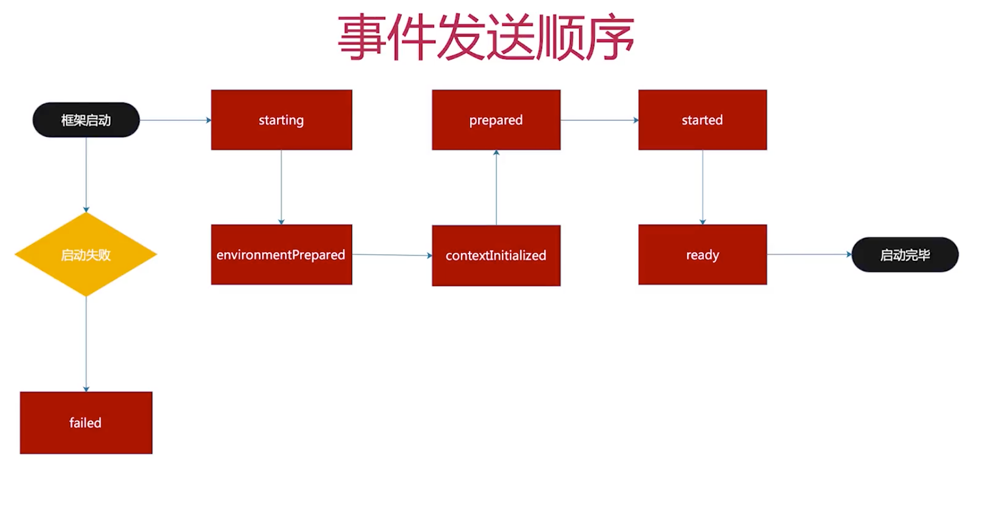
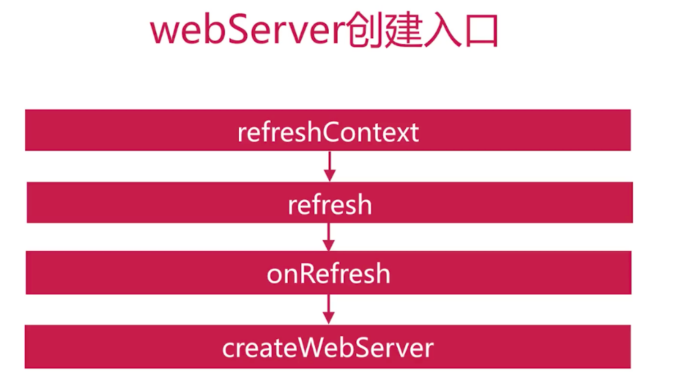

### run

org.springframework.boot.SpringApplication#run(java.lang.Class<?>[], java.lang.String[])

```java
/**
 * Static helper that can be used to run a {@link SpringApplication} from the
 * specified sources using default settings and user supplied arguments.
 * @param primarySources the primary sources to load
 * @param args the application arguments (usually passed from a Java main method)
 * @return the running {@link ApplicationContext}
 */
public static ConfigurableApplicationContext run(Class<?>[] primarySources, String[] args) {
   return new SpringApplication(primarySources).run(args);
}
```

### new SpringApplication(primarySources)

```java
/**
 * Create a new {@link SpringApplication} instance. The application context will load
 * beans from the specified primary sources (see {@link SpringApplication class-level}
 * documentation for details. The instance can be customized before calling
 * {@link #run(String...)}.
 * @param resourceLoader the resource loader to use
 * @param primarySources the primary bean sources
 * @see #run(Class, String[])
 * @see #setSources(Set)
 */
@SuppressWarnings({ "unchecked", "rawtypes" })
public SpringApplication(ResourceLoader resourceLoader, Class<?>... primarySources) {
   this.resourceLoader = resourceLoader;
   Assert.notNull(primarySources, "PrimarySources must not be null");
   this.primarySources = new LinkedHashSet<>(Arrays.asList(primarySources));
   this.webApplicationType = WebApplicationType.deduceFromClasspath();
   this.bootstrapRegistryInitializers = getBootstrapRegistryInitializersFromSpringFactories();
//获取系统初始化器的实现
   setInitializers((Collection) getSpringFactoriesInstances(ApplicationContextInitializer.class));
  //获取监听器
   setListeners((Collection) getSpringFactoriesInstances(ApplicationListener.class));
//判断main所在的class
  this.mainApplicationClass = deduceMainApplicationClass();
}
```

### prepareContext

prepareContext(bootstrapContext, context, environment, listeners, applicationArguments, printedBanner);


# 2启动流程

## 框架初始化


## 框架启动


## 自动化装配


## 系统初始化器

- `ApplicationContextInitializer`接口
- Container 刷新之前执行的一个回调函数
- 作用：向container注册属性
- 实现接口自定义实现


```java
@Order(1)
public class FirstInitializer implements ApplicationContextInitializer<ConfigurableApplicationContext> {

    @Override
    public void initialize(ConfigurableApplicationContext ctx) {

        ConfigurableEnvironment env = ctx.getEnvironment();
        Map<String, Object> map = new HashMap<>();
        map.put("key1", "val1");
        MapPropertySource mps = new MapPropertySource("firstInitializer", map);
        env.getPropertySources().addLast(mps);
        System.out.println("run firstInitializer");
    }
}
```


### 实现方式1

- 实现ApplicationContextInitializer接口

- META-INF/spring.factories填写接口实现

  ```properties
  org.springframework.context.ApplicationContextInitializer=com.mooc.sb2.initializer.FirstInitializer
  ```

### way 2

- SpringApplication 初始化后设置

```java
 public static void main(String[] args) {
        SpringApplication app = new SpringApplication(Sb2Application.class);
        app.addInitializers(new SecondtInitializer());
//        SpringApplication.run(Sb2Application.class, args);
        app.run(args);
    }
```

### way3

- application.properties中配置，优先级最高

- 配置项 `context.initializer.classes`

```properties
context.initializer.classes=com.mooc.sb2.initializer.ThirdInitializer
```

原理：是通过`DelegatingApplicationContextInitializer`的initalize方法，获取环境变量中的`context.initializer.classes`配置的类


### SpringFactoriesLoader

- 框架内部使用的通用工厂加载机制
- 从classpath下多个jar包指定位置读取文件并初始化
- 内容为properties类型
- key是全限定名（抽象类、接口），value是实现类，用逗号分隔

```java
/**
 * General purpose factory loading mechanism for internal use within the framework.
 *
 * <p>{@code SpringFactoriesLoader} {@linkplain #loadFactories loads} and instantiates
 * factories of a given type from {@value #FACTORIES_RESOURCE_LOCATION} files which
 * may be present in multiple JAR files in the classpath. The {@code spring.factories}
 * file must be in {@link Properties} format, where the key is the fully qualified
 * name of the interface or abstract class, and the value is a comma-separated list of
 * implementation class names. For example:
 *
 * <pre class="code">example.MyService=example.MyServiceImpl1,example.MyServiceImpl2</pre>
 *
 * where {@code example.MyService} is the name of the interface, and {@code MyServiceImpl1}
 * and {@code MyServiceImpl2} are two implementations.
 *
 * @author Arjen Poutsma
 * @author Juergen Hoeller
 * @author Sam Brannen
 * @since 3.2
 */
public final class SpringFactoriesLoader {
```

#### 流程




```java
protected void applyInitializers(ConfigurableApplicationContext context) {
    Iterator var2 = this.getInitializers().iterator();

    while(var2.hasNext()) {
        ApplicationContextInitializer initializer = (ApplicationContextInitializer)var2.next();
        Class<?> requiredType = GenericTypeResolver.resolveTypeArgument(initializer.getClass(), ApplicationContextInitializer.class);
      //判断泛型是否为ConfigurableApplicationContext的实例
        Assert.isInstanceOf(requiredType, context, "Unable to call initializer.");
        initializer.initialize(context);
    }

}
```


### DelegatingApplicationContextInitializer

- 定义在`org/springframework/boot/spring-boot/2.4.5/spring-boot-2.4.5.jar!/META-INF/spring.factories`，同理由SpringFactoriesLoader加载

- `org.springframework.boot.context.config.DelegatingApplicationContextInitializer`
- order = 0，优先调用

- 在其initialize方法中，加载appliction.properties中的配置项`context.initializer.classes`，类加载器由`org.springframework.util.ClassUtils#getDefaultClassLoader `提供


### 实现原理总结


- 定义在spring.factories文件中被SpringFactoriesLoader发现注册
- SpringAppliction初始化完毕后手动添加
- 定义成环境变量被`DelegatingApplicationContextInitializer`发现注册

### 常见问题

- 介绍SpringFactoriesLoader？它如何加载工厂类
- 系统初始化器的作用？调用时机？如何自定义？自定义时有哪些注意事项


## 监听器

- 事件
- 监听器
- 广播器
- 触发机制

- springboot中的事件监听器也是通过spring.factories注册的方式加载的，
  - 其接口为org.springframework.context.ApplicationListener，只有一个方法，
  - 配置项为org.springframework.context.ApplicationListener

- 广播器 `org.springframework.context.event.ApplicationEventMulticaster`

- 系统事件


- 事件发送顺序




Retriever 回收器、寻回犬

populate 填充


### 类型1 直接实现ApplicationListener<T>接口针对单一事件监听

```java
//通过泛型指定监听事件的类型
public interface ApplicationListener<E extends ApplicationEvent> extends EventListener {
	void onApplicationEvent(E event); 
}

//imp
public class FirstListener  implements ApplicationListener<ApplicationStartedEvent> {
    @Override
    public void onApplicationEvent(ApplicationStartedEvent event) {
        System.out.println("hello first");
    }
}
```


### 类型2 实现SmartApplicationListener 针对多种事件监听

```java
public interface SmartApplicationListener extends ApplicationListener<ApplicationEvent>, Ordered {

}

//imp
public class FourthListener implements SmartApplicationListener {
    @Override
    public boolean supportsEventType(Class<? extends ApplicationEvent> eventType) {
        return ApplicationStartedEvent.class.isAssignableFrom(eventType)
                || ApplicationPreparedEvent.class.isAssignableFrom(eventType);
    }

    @Override
    public void onApplicationEvent(ApplicationEvent event) {
        System.out.println("hello fourth 4");
    }
}
```


### 运行监听器 XxxRunListeners

XxxRunListener 用于管理 事件接口IXxxEvent 的实现类 Xxx1Event、Xxx2Event等的事件发布

```java
//用于管理实现WeatherEvent的事件的发布
@Component
public class WeatherRunListener {

    //注入广播器
    @Autowired
    private WeatherEventMulticaster eventMulticaster;

    public void snow(){
        eventMulticaster.multicastEvent(new SnowEvent());
    }

    public void rain(){
        eventMulticaster.multicastEvent(new RainEvent());
    }

}

public class SnowEvent extends WeatherEvent{
    @Override
    public String getWeather() {
        return "snow";
    }
}

public abstract class WeatherEvent {
    public abstract String getWeather();
}

```


```java
//SpringApplicationRunListener的集合
class SpringApplicationRunListeners {

   private final Log log;

   private final List<SpringApplicationRunListener> listeners;

   private final ApplicationStartup applicationStartup;
  ...
    
    private void doWithListeners(String stepName, Consumer<SpringApplicationRunListener> listenerAction,
			Consumer<StartupStep> stepAction) {
		StartupStep step = this.applicationStartup.start(stepName);
		this.listeners.forEach(listenerAction);
		if (stepAction != null) {
			stepAction.accept(step);
		}
		step.end();
	}
}

//org.springframework.boot.context.event.EventPublishingRunListener
public class EventPublishingRunListener implements SpringApplicationRunListener, Ordered {

	private final SpringApplication application;

	private final String[] args;

	private final SimpleApplicationEventMulticaster initialMulticaster;
  
  	@Override
	public void contextPrepared(ConfigurableApplicationContext context) {
    //广播器广播事件
		this.initialMulticaster
				.multicastEvent(new ApplicationContextInitializedEvent(this.application, this.args, context));
	}
  
}


//广播器
public class SimpleApplicationEventMulticaster extends AbstractApplicationEventMulticaster {

  
  @Override
	public void multicastEvent(final ApplicationEvent event, @Nullable ResolvableType eventType) {
		ResolvableType type = (eventType != null ? eventType : resolveDefaultEventType(event));
		Executor executor = getTaskExecutor();
    //获取当前事件的监听器集合，遍历执行监听方法
		for (ApplicationListener<?> listener : getApplicationListeners(event, type)) {
			if (executor != null) {
				executor.execute(() -> invokeListener(listener, event));
			}
			else {
				invokeListener(listener, event);
			}
		}
	}
  
  
  //获取监听器
  //org.springframework.context.event.AbstractApplicationEventMulticaster#getApplicationListeners(org.springframework.context.ApplicationEvent, org.springframework.core.ResolvableType)
public abstract class AbstractApplicationEventMulticaster
		implements ApplicationEventMulticaster, BeanClassLoaderAware, BeanFactoryAware {
  ...
  protected Collection<ApplicationListener<?>> getApplicationListeners(
			ApplicationEvent event, ResolvableType eventType) {

		Object source = event.getSource();
		Class<?> sourceType = (source != null ? source.getClass() : null);
		ListenerCacheKey cacheKey = new ListenerCacheKey(eventType, sourceType);

		// Potential new retriever to populate
		CachedListenerRetriever newRetriever = null;

		// Quick check for existing entry on ConcurrentHashMap
		CachedListenerRetriever existingRetriever = this.retrieverCache.get(cacheKey);
		if (existingRetriever == null) {
			// Caching a new ListenerRetriever if possible
			if (this.beanClassLoader == null ||
					(ClassUtils.isCacheSafe(event.getClass(), this.beanClassLoader) &&
							(sourceType == null || ClassUtils.isCacheSafe(sourceType, this.beanClassLoader)))) {
				newRetriever = new CachedListenerRetriever();
				existingRetriever = this.retrieverCache.putIfAbsent(cacheKey, newRetriever);
				if (existingRetriever != null) {
					newRetriever = null;  // no need to populate it in retrieveApplicationListeners
				}
			}
		}

		if (existingRetriever != null) {
			Collection<ApplicationListener<?>> result = existingRetriever.getApplicationListeners();
			if (result != null) {
				return result;
			}
			// If result is null, the existing retriever is not fully populated yet by another thread.
			// Proceed like caching wasn't possible for this current local attempt.
		}

		return retrieveApplicationListeners(eventType, sourceType, newRetriever);
	}
}

//获取监听器
	private Collection<ApplicationListener<?>> retrieveApplicationListeners(
			ResolvableType eventType, @Nullable Class<?> sourceType, @Nullable CachedListenerRetriever retriever) {
    ....
		// Add programmatically registered listeners, including ones coming
		// from ApplicationListenerDetector (singleton beans and inner beans).	
    for (ApplicationListener<?> listener : listeners) {
			if (supportsEvent(listener, eventType, sourceType)) {
				if (retriever != null) {
					filteredListeners.add(listener);
				}
				allListeners.add(listener);
			}
		}
    ...
  }
  
  
}


//org.springframework.context.event.AbstractApplicationEventMulticaster#supportsEvent(org.springframework.context.ApplicationListener<?>, org.springframework.core.ResolvableType, java.lang.Class<?>)
	protected boolean supportsEvent(
			ApplicationListener<?> listener, ResolvableType eventType, @Nullable Class<?> sourceType) {

		GenericApplicationListener smartListener = (listener instanceof GenericApplicationListener ?
				(GenericApplicationListener) listener : new GenericApplicationListenerAdapter(listener));
		return (smartListener.supportsEventType(eventType) && smartListener.supportsSourceType(sourceType));
	}

//判断是否支持该事件
//org.springframework.context.event.GenericApplicationListenerAdapter#supportsEventType
public boolean supportsEventType(ResolvableType eventType) {
		if (this.delegate instanceof GenericApplicationListener) {
			return ((GenericApplicationListener) this.delegate).supportsEventType(eventType);
		}
		else if (this.delegate instanceof SmartApplicationListener) {
			Class<? extends ApplicationEvent> eventClass = (Class<? extends ApplicationEvent>) eventType.resolve();
			return (eventClass != null && ((SmartApplicationListener) this.delegate).supportsEventType(eventClass));
		}
		else {
			return (this.declaredEventType == null || this.declaredEventType.isAssignableFrom(eventType));
		}
	}

public class GenericApplicationListenerAdapter implements GenericApplicationListener {
}

```


### 注册监听器的4种方式

同initializer

1. 实现ApplicationListener接口，spring.factories内填写实现类，key为`org.springframework.context.ApplicationListener`
2. 实现ApplicationListener接口，在SpringApplication初始化后编码添加监听器
3. 实现ApplicationListener接口，application.properties中填写接口实现，key为`context.listener.classes`
4. 实现SmartApplicationListener，重写supportsEventType方法，同前三种注入方式

### 常见问题

- 监听器模式？
- sb监听器相关的实现类有哪些？有哪些框架事件以及它们的顺序？
- 监听事件触发机制？
- 如何自定义实现系统监听器及其注意事项
- 实现ApplicationnListener与SmartApplicationListener的区别


# bean解析

## IOC

- 松耦合
- 灵活性
- 可维护

### xml

- 低耦合
- 对象关系清晰
- 集中管理

缺点

- 解析耗时
- 编写耗时

### 注解

#### 实现方式

共有如下五种方法

- `@Componet`声明

- 配置类中使用`@Bean`

- 实现`FactoryBean`

- 实现`BeanDefinitionRegistryPostProcessor`

```java
@Component
public class MyMonkeyRegister  implements BeanDefinitionRegistryPostProcessor
{
    @Override
    public void postProcessBeanDefinitionRegistry(BeanDefinitionRegistry beanDefinitionRegistry) throws BeansException {
        RootBeanDefinition definition = new RootBeanDefinition();
        definition.setBeanClass(Monkey.class);
        beanDefinitionRegistry.registerBeanDefinition("monkey", definition);
    }

    @Override
    public void postProcessBeanFactory(ConfigurableListableBeanFactory configurableListableBeanFactory) throws BeansException {

    }
}
```

- 实现`ImportBeanDefinitionRegistrar`，启动类上需要导入该类

```java
public class MyBeanImport implements ImportBeanDefinitionRegistrar {
    @Override
    public void registerBeanDefinitions(AnnotationMetadata importingClassMetadata, BeanDefinitionRegistry registry) {
        ImportBeanDefinitionRegistrar.super.registerBeanDefinitions(importingClassMetadata, registry);
        RootBeanDefinition definition = new RootBeanDefinition();
        definition.setBeanClass(Bird.class);
        registry.registerBeanDefinition("bird", definition);
    }
}

```


#### 缺点

- 配置分散
- 对象关系不清晰
- 配置修改需要重新编译工程


### 前置介绍

#### ClassPathBeanDefinitionScanner

```java
//org.springframework.context.annotation.ClassPathBeanDefinitionScanner
/**
 * A bean definition scanner that detects bean candidates on the classpath,
 * registering corresponding bean definitions with a given registry ({@code BeanFactory}
 * or {@code ApplicationContext}).
 *
 * <p>Candidate classes are detected through configurable type filters. The
 * default filters include classes that are annotated with Spring's
 * {@link org.springframework.stereotype.Component @Component},
 * {@link org.springframework.stereotype.Repository @Repository},
 * {@link org.springframework.stereotype.Service @Service}, or
 * {@link org.springframework.stereotype.Controller @Controller} stereotype.
 */
public class ClassPathBeanDefinitionScanner extends ClassPathScanningCandidateComponentProvider {
}
```


#### BeanFactory

- 是个啥？实现了BeanDefinitionRegistry，就是一个bean定义注册器

```java
//org.springframework.beans.factory.support.DefaultListableBeanFactory
public class DefaultListableBeanFactory extends AbstractAutowireCapableBeanFactory
		implements ConfigurableListableBeanFactory, BeanDefinitionRegistry, Serializable {

  
  //||org.springframework.beans.factory.support.BeanDefinitionRegistry
  public interface BeanDefinitionRegistry extends AliasRegistry {
  }
  
    //||org.springframework.core.AliasRegistry
    public interface AliasRegistry {}

  
  //||org.springframework.beans.factory.config.ConfigurableListableBeanFactory
  public interface ConfigurableListableBeanFactory
      extends ListableBeanFactory, AutowireCapableBeanFactory, ConfigurableBeanFactory {
  }
  
  //org.springframework.beans.factory.config.ConfigurableBeanFactory
  public interface ConfigurableBeanFactory extends HierarchicalBeanFactory, SingletonBeanRegistry {
  }
    
```


   ### refresh方法 启动流程

- org.springframework.context.support.AbstractApplicationContext

```java
//org.springframework.context.support.AbstractApplicationContext#refresh
@Override
public void refresh() throws BeansException, IllegalStateException {
   synchronized (this.startupShutdownMonitor) {
      StartupStep contextRefresh = this.applicationStartup.start("spring.context.refresh");

      // Prepare this context for refreshing.
      prepareRefresh();

      // Tell the subclass to refresh the internal bean factory.
      ConfigurableListableBeanFactory beanFactory = obtainFreshBeanFactory();

      // Prepare the bean factory for use in this context.
      prepareBeanFactory(beanFactory);

      try {
         // Allows post-processing of the bean factory in context subclasses.
         postProcessBeanFactory(beanFactory);

         StartupStep beanPostProcess = this.applicationStartup.start("spring.context.beans.post-process");
         // Invoke factory processors registered as beans in the context.
         invokeBeanFactoryPostProcessors(beanFactory);

         // Register bean processors that intercept bean creation.
         registerBeanPostProcessors(beanFactory);
         beanPostProcess.end();

         // Initialize message source for this context.
         initMessageSource();

         // Initialize event multicaster for this context.
         initApplicationEventMulticaster();

         // Initialize other special beans in specific context subclasses.
         onRefresh();

         // Check for listener beans and register them.
         registerListeners();

         // Instantiate all remaining (non-lazy-init) singletons.
         finishBeanFactoryInitialization(beanFactory);

         // Last step: publish corresponding event.
         finishRefresh();
      }

      catch (BeansException ex) {
         if (logger.isWarnEnabled()) {
            logger.warn("Exception encountered during context initialization - " +
                  "cancelling refresh attempt: " + ex);
         }

         // Destroy already created singletons to avoid dangling resources.
         destroyBeans();

         // Reset 'active' flag.
         cancelRefresh(ex);

         // Propagate exception to caller.
         throw ex;
      }

      finally {
         // Reset common introspection caches in Spring's core, since we
         // might not ever need metadata for singleton beans anymore...
         resetCommonCaches();
         contextRefresh.end();
      }
   }
}
```

#### prepareRefresh

- 容器状态设置
- 初始化属性设置
- 检查必备属性是否存在

```java
//org.springframework.context.support.AbstractApplicationContext#prepareRefresh

//org.springframework.boot.web.servlet.context.AnnotationConfigServletWebServerApplicationContext#prepareRefresh
@Override
	protected void prepareRefresh() {
		//	清除元数据缓存
    this.scanner.clearCache();
		super.prepareRefresh();
	}

//org.springframework.context.support.AbstractApplicationContext#prepareRefresh
protected void prepareRefresh() {
		// Switch to active.
		this.startupDate = System.currentTimeMillis();
		this.closed.set(false);
  //active状态
		this.active.set(true);

		if (logger.isDebugEnabled()) {
			if (logger.isTraceEnabled()) {
				logger.trace("Refreshing " + this);
			}
			else {
				logger.debug("Refreshing " + getDisplayName());
			}
		}

		// Initialize any placeholder property sources in the context environment.
		initPropertySources();

		// Validate that all properties marked as required are resolvable:
		// see ConfigurablePropertyResolver#setRequiredProperties
		getEnvironment().validateRequiredProperties();

		// Store pre-refresh ApplicationListeners...
		if (this.earlyApplicationListeners == null) {
			this.earlyApplicationListeners = new LinkedHashSet<>(this.applicationListeners);
		}
		else {
			// Reset local application listeners to pre-refresh state.
			this.applicationListeners.clear();
			this.applicationListeners.addAll(this.earlyApplicationListeners);
		}

		// Allow for the collection of early ApplicationEvents,
		// to be published once the multicaster is available...
  // 创建早期事件收集器
		this.earlyApplicationEvents = new LinkedHashSet<>();
	}

  
//判断是否web环境，并初始化相关属性
//org.springframework.web.context.support.GenericWebApplicationContext#initPropertySources
  @Override
	protected void initPropertySources() {
		ConfigurableEnvironment env = getEnvironment();
		if (env instanceof ConfigurableWebEnvironment) {
			((ConfigurableWebEnvironment) env).initPropertySources(this.servletContext, null);
		}
	}

```


#### obtainFreshBeanFactory

- 设置beanFactory序列化id
- 获取beanFactory

```java
//org.springframework.context.support.AbstractApplicationContext#obtainFreshBeanFactory

//org.springframework.context.support.GenericApplicationContext#refreshBeanFactory
@Override
	protected final void refreshBeanFactory() throws IllegalStateException {
    //设置原子布尔值refreshed，refresh只能被调用一次，否则会报错
		if (!this.refreshed.compareAndSet(false, true)) {
			throw new IllegalStateException(
					"GenericApplicationContext does not support multiple refresh attempts: just call 'refresh' once");
		}
		this.beanFactory.setSerializationId(getId());
	}
```

#### prepareBeanFactory

- 设置beanFactory的一些属性
- 添加后置处理器
- 设置忽略的自动装配接口
- 注册一些组件


#### postProcessBeanFactory(beanFactory);

- 子类重写可以在BeanFactory完成创建后做进一步设置

  - org.springframework.boot.web.servlet.context.ServletWebServerApplicationContext#postProcessBeanFactory‘

    ```java
    //org.springframework.boot.web.servlet.context.ServletWebServerApplicationContext#postProcessBeanFactory‘
    protected void postProcessBeanFactory(ConfigurableListableBeanFactory beanFactory) {
    		beanFactory.addBeanPostProcessor(new WebApplicationContextServletContextAwareProcessor(this));
    		beanFactory.ignoreDependencyInterface(ServletContextAware.class);
    		registerWebApplicationScopes();
    	}
    
    //org.springframework.boot.web.servlet.context.AnnotationConfigServletWebServerApplicationContext#postProcessBeanFactory
    	@Override
    	protected void postProcessBeanFactory(ConfigurableListableBeanFactory beanFactory) {
    		super.postProcessBeanFactory(beanFactory);
    		if (this.basePackages != null && this.basePackages.length > 0) {
    			this.scanner.scan(this.basePackages);
    		}
    		if (!this.annotatedClasses.isEmpty()) {
    			this.reader.register(ClassUtils.toClassArray(this.annotatedClasses));
    		}
    	}
    ```

    

```java
//注册web应用的三个scope
//org.springframework.web.context.support.WebApplicationContextUtils#registerWebApplicationScopes(org.springframework.beans.factory.config.ConfigurableListableBeanFactory)
/**
	 * Register web-specific scopes ("request", "session", "globalSession")
	 * with the given BeanFactory, as used by the WebApplicationContext.
	 * @param beanFactory the BeanFactory to configure
	 */
	public static void registerWebApplicationScopes(ConfigurableListableBeanFactory beanFactory) {
		registerWebApplicationScopes(beanFactory, null);
	}
```


#### invokeBeanFactoryPostProcessors

`org.springframework.context.support.AbstractApplicationContext#invokeBeanFactoryPostProcessors`

处理的是BeanDefinition（bean的定义）

- 调用`BeanDefinitionRegistryPostProcessor`实现向容器内 **添加bean的定义**
- 调用`BeanFactoryPostProcessor`实现向容器内**bean的定义 添加属性**

```java
org.springframework.context.support.PostProcessorRegistrationDelegate#invokeBeanFactoryPostProcessors(org.springframework.beans.factory.config.ConfigurableListableBeanFactory, java.util.List<org.springframework.beans.factory.config.BeanFactoryPostProcessor>)
  
  
```


```java

public static void invokeBeanFactoryPostProcessors(
			ConfigurableListableBeanFactory beanFactory, List<BeanFactoryPostProcessor> beanFactoryPostProcessors) {

		// WARNING: Although it may appear that the body of this method can be easily
		// refactored to avoid the use of multiple loops and multiple lists, the use
		// of multiple lists and multiple passes over the names of processors is
		// intentional. We must ensure that we honor the contracts for PriorityOrdered
		// and Ordered processors. Specifically, we must NOT cause processors to be
		// instantiated (via getBean() invocations) or registered in the ApplicationContext
		// in the wrong order.
		//
		// Before submitting a pull request (PR) to change this method, please review the
		// list of all declined PRs involving changes to PostProcessorRegistrationDelegate
		// to ensure that your proposal does not result in a breaking change:
		// https://github.com/spring-projects/spring-framework/issues?q=PostProcessorRegistrationDelegate+is%3Aclosed+label%3A%22status%3A+declined%22

		// Invoke BeanDefinitionRegistryPostProcessors first, if any.
		Set<String> processedBeans = new HashSet<>();

		if (beanFactory instanceof BeanDefinitionRegistry) {
			BeanDefinitionRegistry registry = (BeanDefinitionRegistry) beanFactory;
			List<BeanFactoryPostProcessor> regularPostProcessors = new ArrayList<>();
			List<BeanDefinitionRegistryPostProcessor> registryProcessors = new ArrayList<>();

			for (BeanFactoryPostProcessor postProcessor : beanFactoryPostProcessors) {
				if (postProcessor instanceof BeanDefinitionRegistryPostProcessor) {
					BeanDefinitionRegistryPostProcessor registryProcessor =
							(BeanDefinitionRegistryPostProcessor) postProcessor;
					registryProcessor.postProcessBeanDefinitionRegistry(registry);
					registryProcessors.add(registryProcessor);
				}
				else {
					regularPostProcessors.add(postProcessor);
				}
			}

			// Do not initialize FactoryBeans here: We need to leave all regular beans
			// uninitialized to let the bean factory post-processors apply to them!
			// Separate between BeanDefinitionRegistryPostProcessors that implement
			// PriorityOrdered, Ordered, and the rest.
			List<BeanDefinitionRegistryPostProcessor> currentRegistryProcessors = new ArrayList<>();

			// First, invoke the BeanDefinitionRegistryPostProcessors that implement PriorityOrdered.
			String[] postProcessorNames =
					beanFactory.getBeanNamesForType(BeanDefinitionRegistryPostProcessor.class, true, false);
			for (String ppName : postProcessorNames) {
				if (beanFactory.isTypeMatch(ppName, PriorityOrdered.class)) {
					currentRegistryProcessors.add(beanFactory.getBean(ppName, BeanDefinitionRegistryPostProcessor.class));
					processedBeans.add(ppName);
				}
			}
			sortPostProcessors(currentRegistryProcessors, beanFactory);
			registryProcessors.addAll(currentRegistryProcessors);
			invokeBeanDefinitionRegistryPostProcessors(currentRegistryProcessors, registry, beanFactory.getApplicationStartup());
			currentRegistryProcessors.clear();

			// Next, invoke the BeanDefinitionRegistryPostProcessors that implement Ordered.
			postProcessorNames = beanFactory.getBeanNamesForType(BeanDefinitionRegistryPostProcessor.class, true, false);
			for (String ppName : postProcessorNames) {
				if (!processedBeans.contains(ppName) && beanFactory.isTypeMatch(ppName, Ordered.class)) {
					currentRegistryProcessors.add(beanFactory.getBean(ppName, BeanDefinitionRegistryPostProcessor.class));
					processedBeans.add(ppName);
				}
			}
			sortPostProcessors(currentRegistryProcessors, beanFactory);
			registryProcessors.addAll(currentRegistryProcessors);
			invokeBeanDefinitionRegistryPostProcessors(currentRegistryProcessors, registry, beanFactory.getApplicationStartup());
			currentRegistryProcessors.clear();

			// Finally, invoke all other BeanDefinitionRegistryPostProcessors until no further ones appear.
			boolean reiterate = true;
			while (reiterate) {
				reiterate = false;
				postProcessorNames = beanFactory.getBeanNamesForType(BeanDefinitionRegistryPostProcessor.class, true, false);
				for (String ppName : postProcessorNames) {
					if (!processedBeans.contains(ppName)) {
						currentRegistryProcessors.add(beanFactory.getBean(ppName, BeanDefinitionRegistryPostProcessor.class));
						processedBeans.add(ppName);
						reiterate = true;
					}
				}
				sortPostProcessors(currentRegistryProcessors, beanFactory);
				registryProcessors.addAll(currentRegistryProcessors);
				invokeBeanDefinitionRegistryPostProcessors(currentRegistryProcessors, registry, beanFactory.getApplicationStartup());
				currentRegistryProcessors.clear();
			}

			// Now, invoke the postProcessBeanFactory callback of all processors handled so far.
			invokeBeanFactoryPostProcessors(registryProcessors, beanFactory);
			invokeBeanFactoryPostProcessors(regularPostProcessors, beanFactory);
		}

		else {
			// Invoke factory processors registered with the context instance.
			invokeBeanFactoryPostProcessors(beanFactoryPostProcessors, beanFactory);
		}

		// Do not initialize FactoryBeans here: We need to leave all regular beans
		// uninitialized to let the bean factory post-processors apply to them!
		String[] postProcessorNames =
				beanFactory.getBeanNamesForType(BeanFactoryPostProcessor.class, true, false);

		// Separate between BeanFactoryPostProcessors that implement PriorityOrdered,
		// Ordered, and the rest.
		List<BeanFactoryPostProcessor> priorityOrderedPostProcessors = new ArrayList<>();
		List<String> orderedPostProcessorNames = new ArrayList<>();
		List<String> nonOrderedPostProcessorNames = new ArrayList<>();
		for (String ppName : postProcessorNames) {
			if (processedBeans.contains(ppName)) {
				// skip - already processed in first phase above
			}
			else if (beanFactory.isTypeMatch(ppName, PriorityOrdered.class)) {
				priorityOrderedPostProcessors.add(beanFactory.getBean(ppName, BeanFactoryPostProcessor.class));
			}
			else if (beanFactory.isTypeMatch(ppName, Ordered.class)) {
				orderedPostProcessorNames.add(ppName);
			}
			else {
				nonOrderedPostProcessorNames.add(ppName);
			}
		}

		// First, invoke the BeanFactoryPostProcessors that implement PriorityOrdered.
		sortPostProcessors(priorityOrderedPostProcessors, beanFactory);
		invokeBeanFactoryPostProcessors(priorityOrderedPostProcessors, beanFactory);

		// Next, invoke the BeanFactoryPostProcessors that implement Ordered.
		List<BeanFactoryPostProcessor> orderedPostProcessors = new ArrayList<>(orderedPostProcessorNames.size());
		for (String postProcessorName : orderedPostProcessorNames) {
			orderedPostProcessors.add(beanFactory.getBean(postProcessorName, BeanFactoryPostProcessor.class));
		}
		sortPostProcessors(orderedPostProcessors, beanFactory);
		invokeBeanFactoryPostProcessors(orderedPostProcessors, beanFactory);

		// Finally, invoke all other BeanFactoryPostProcessors.
		List<BeanFactoryPostProcessor> nonOrderedPostProcessors = new ArrayList<>(nonOrderedPostProcessorNames.size());
		for (String postProcessorName : nonOrderedPostProcessorNames) {
			nonOrderedPostProcessors.add(beanFactory.getBean(postProcessorName, BeanFactoryPostProcessor.class));
		}
		invokeBeanFactoryPostProcessors(nonOrderedPostProcessors, beanFactory);

		// Clear cached merged bean definitions since the post-processors might have
		// modified the original metadata, e.g. replacing placeholders in values...
		beanFactory.clearMetadataCache();
	}


//BeanDefinitionRegistryPostProcessor实现类，实现的postProcessBeanDefinitionRegistry方法会在此阶段被调用，可能往beanDefinitionRegistry注入新的beanDefinition
public class MyMonkeyRegister  implements BeanDefinitionRegistryPostProcessor
{
    @Override
    public void postProcessBeanDefinitionRegistry(BeanDefinitionRegistry beanDefinitionRegistry) throws BeansException {
        RootBeanDefinition definition = new RootBeanDefinition();
        System.out.println("[MONKEY] postProcessBeanDefinitionRegistry");
        definition.setBeanClass(Monkey.class);
        beanDefinitionRegistry.registerBeanDefinition("monkey", definition);
    }
```


#### registerBeanPostProcessors

实现类似于上一步，也是交由org.springframework.context.support.PostProcessorRegistrationDelegate处理的，做的事情是按顺序注册processor。

- 找到BeanPostProcessor的实现
- 排序后注册到容器内

#### initMessageSource

- 初始化国际化相关属性

#### initApplicationEventMulticaster

- 初始化事件广播器

#### onRefresh

空实现

在web环境，会创建web容器

####  registerListeners

- 添加容器内事件监听器 至事件广播器中
- 派发早期事件


#### finishBeanFactoryInitialization

- 初始化所有剩下的单实例bean


#### finishRefresh

- 初始化生命周期处理器
- 调用生命周期处理器的onRefresh方法
- 发布ContextRefreshed事件
- JMX相关处理


### bean实例化解析

org.springframework.context.support.AbstractApplicationContext#finishBeanFactoryInitialization


BeanDefinition

- 一个对象在Spring中的描述
- 通过操作BeanDefinition来完成bean实例化和属性注入

#### bean实例化流程


```java
//org.springframework.beans.factory.support.AbstractAutowireCapableBeanFactory#createBean(java.lang.String, org.springframework.beans.factory.support.RootBeanDefinition, java.lang.Object[])

/**
 * Central method of this class: creates a bean instance,
 * populates the bean instance, applies post-processors, etc.
 * @see #doCreateBean
 */
@Override
protected Object createBean(String beanName, RootBeanDefinition mbd, @Nullable Object[] args)
      throws BeanCreationException {

   if (logger.isTraceEnabled()) {
      logger.trace("Creating instance of bean '" + beanName + "'");
   }
   RootBeanDefinition mbdToUse = mbd;

   // Make sure bean class is actually resolved at this point, and
   // clone the bean definition in case of a dynamically resolved Class
   // which cannot be stored in the shared merged bean definition.
   Class<?> resolvedClass = resolveBeanClass(mbd, beanName);
   if (resolvedClass != null && !mbd.hasBeanClass() && mbd.getBeanClassName() != null) {
      mbdToUse = new RootBeanDefinition(mbd);
      mbdToUse.setBeanClass(resolvedClass);
   }

   // Prepare method overrides.
   try {
      mbdToUse.prepareMethodOverrides();
   }
   catch (BeanDefinitionValidationException ex) {
      throw new BeanDefinitionStoreException(mbdToUse.getResourceDescription(),
            beanName, "Validation of method overrides failed", ex);
   }

   try {
     //	获取所有beanPostProcesser，调用对应的方法（applyBeanPostProcessorsBeforeInstantiation和applyBeanPostProcessorsAfterInitialization），若返回了bean实例，那么就直接返回该实例
      // Give BeanPostProcessors a chance to return a proxy instead of the target bean instance.
      Object bean = resolveBeforeInstantiation(beanName, mbdToUse);
      if (bean != null) {
         return bean;
      }
   }
   catch (Throwable ex) {
      throw new BeanCreationException(mbdToUse.getResourceDescription(), beanName,
            "BeanPostProcessor before instantiation of bean failed", ex);
   }

   try {
      Object beanInstance = doCreateBean(beanName, mbdToUse, args);
      if (logger.isTraceEnabled()) {
         logger.trace("Finished creating instance of bean '" + beanName + "'");
      }
      return beanInstance;
   }
   catch (BeanCreationException | ImplicitlyAppearedSingletonException ex) {
      // A previously detected exception with proper bean creation context already,
      // or illegal singleton state to be communicated up to DefaultSingletonBeanRegistry.
      throw ex;
   }
   catch (Throwable ex) {
      throw new BeanCreationException(
            mbdToUse.getResourceDescription(), beanName, "Unexpected exception during bean creation", ex);
   }
}
```


#### 自定义创建bean


#### BeanDefinition类图

子类拓展了父类功能，实现了对元数据、属性的操作


### 问题

- ioc思想
- springboot中bean有哪几种配置方式
- refresh方法流程
- refresh常见方法及其作用
- bean实例化的流程
- bean实例化的拓展点及其作用


# 自定义banner

```java
#spring.banner.location=banner_bak.txt
spring.banner.image.location=favorite.jpg
  
  //or
     SpringApplication app = new SpringApplication(Sb2Application.class);
//        app.setBanner(new ResourceBanner(new ClassPathResource("banner_bak.txt")));
        app.run(args);
```


# 启动加载器

## 实现方式一

- 实现CommandLineRunner
- 重写run方法
- 通过order排序

## 实现方式2

- 实现ApplicationRunner
- 重写run方法
- 通过order排序
- order值相同时，ApplicationRunner排在前面

## callRunners实现

org.springframework.boot.SpringApplication#callRunners

```java
private void callRunners(ApplicationContext context, ApplicationArguments args) {
   List<Object> runners = new ArrayList<>();
   runners.addAll(context.getBeansOfType(ApplicationRunner.class).values());
   runners.addAll(context.getBeansOfType(CommandLineRunner.class).values());
   AnnotationAwareOrderComparator.sort(runners);
   for (Object runner : new LinkedHashSet<>(runners)) {
      if (runner instanceof ApplicationRunner) {
         callRunner((ApplicationRunner) runner, args);
      }
      if (runner instanceof CommandLineRunner) {
         callRunner((CommandLineRunner) runner, args);
      }
   }
}
```


### 问题

- 启动加载器如何实现？它的两种实现有什么异同点？调用时机是什么？
- springboot计时器的实现？有何优点？如何设计？
- 怎么实现在Springboot启动后执行程序？


# 属性配置


# 属性配置解析

## Aware

- Spring框架优点：bean感知不到容器的存在

- 使用场景：需要使用Spring容器的功能资源
- 引入缺点：Bean和容器强耦合

### 常用aware


### Aware调用

- finishBeanFactoryInitialization时，创建bean后调用


### 自定义实现Aware


```java
@Component
public class MyAwareProcessor implements BeanPostProcessor {

    private final ConfigurableApplicationContext configurableApplicationContext;

    public MyAwareProcessor(ConfigurableApplicationContext ctx) {
        this.configurableApplicationContext = ctx;
    }

    @Override
    public Object postProcessBeforeInitialization(Object bean, String beanName) throws BeansException {
        if (bean instanceof Aware){
            if (bean instanceof MyAware){
                ((MyAware)bean).setFlag((Flag) configurableApplicationContext.getBean("flag"));
            }
        }
        return bean;
    }
}
```


## Environment

### getOrCreateEnvironment

org.springframework.boot.SpringApplication#getOrCreateEnvironment

- 添加属性集5类

```java
//org.springframework.web.context.support.StandardServletEnvironment#customizePropertySources
protected void customizePropertySources(MutablePropertySources propertySources) {
   propertySources.addLast(new StubPropertySource(SERVLET_CONFIG_PROPERTY_SOURCE_NAME));
   propertySources.addLast(new StubPropertySource(SERVLET_CONTEXT_PROPERTY_SOURCE_NAME));
   if (JndiLocatorDelegate.isDefaultJndiEnvironmentAvailable()) {
      propertySources.addLast(new JndiPropertySource(JNDI_PROPERTY_SOURCE_NAME));
   }
   super.customizePropertySources(propertySources);
}

protected void customizePropertySources(MutablePropertySources propertySources) {
		propertySources.addLast(
				new PropertiesPropertySource(SYSTEM_PROPERTIES_PROPERTY_SOURCE_NAME, getSystemProperties()));
		propertySources.addLast(
				new SystemEnvironmentPropertySource(SYSTEM_ENVIRONMENT_PROPERTY_SOURCE_NAME, getSystemEnvironment()));
	}
```

### configureEnvironment

org.springframework.boot.SpringApplication#configureEnvironment

- 添加defaultProperties属性集
- 添加commandLineArgs属性集

```java
protected void configureEnvironment(ConfigurableEnvironment environment, String[] args) {
   if (this.addConversionService) {
      ConversionService conversionService = ApplicationConversionService.getSharedInstance();
      environment.setConversionService((ConfigurableConversionService) conversionService);
   }
   configurePropertySources(environment, args);
  //
   configureProfiles(environment, args);
}
```

### ConfigurationPropertySources.attach(environment);

- 添加configurationProperties


### listeners.environmentPrepared(bootstrapContext, environment);

- 添加Spring_application_json属性集
- 添加vcap
- 添加random
- 添加application-profile.(property|yml)属性集

通过发布事件，EnvironmentPostProcessorApplicationListener监听到会添加env后置处理器

```java
//org.springframework.boot.env.EnvironmentPostProcessorApplicationListener#onApplicationEvent
	@Override
	public void onApplicationEvent(ApplicationEvent event) {
		if (event instanceof ApplicationEnvironmentPreparedEvent) {
			onApplicationEnvironmentPreparedEvent((ApplicationEnvironmentPreparedEvent) event);
		}
	....
	}

private void onApplicationEnvironmentPreparedEvent(ApplicationEnvironmentPreparedEvent event) {
		ConfigurableEnvironment environment = event.getEnvironment();
		SpringApplication application = event.getSpringApplication();
		for (EnvironmentPostProcessor postProcessor : getEnvironmentPostProcessors(event.getBootstrapContext())) {
			postProcessor.postProcessEnvironment(environment, application);
		}
	}
```

### ConfigurationClassParser

org.springframework.context.annotation.ConfigurationClassParser#processPropertySource

- 添加@PropertySource属性集

## profile

默认使用application.properties\application-default.properties

- 使用命令行参数spring.profiles.default=defaults(不能定义在application文件中)切换成application-defaults.properties
- 激活profile
  - spring.profiles.active=xx ，会使spring.profiles.default指向的文件失效
  - Spring.profiles.include=xx1,xx2
- 指定profile前缀：spring.config.name=xx ->xx.properties文件生效


# 异常处理


### handleRunFailure

```java
private void handleRunFailure(ConfigurableApplicationContext context, Throwable exception,
      SpringApplicationRunListeners listeners) {
   try {
      try {
         handleExitCode(context, exception);
         if (listeners != null) {
            listeners.failed(context, exception);
         }
      }
      finally {
         reportFailure(getExceptionReporters(context), exception);
         if (context != null) {
            context.close();
         }
      }
   }
   catch (Exception ex) {
      logger.warn("Unable to close ApplicationContext", ex);
   }
   ReflectionUtils.rethrowRuntimeException(exception);
}
```


#### HandleExitCode

- exitCode推出状态码，0正常推出，否则异常
- 发布ExitCodeEvent事件
- 记录exitCode

#### listeners.failed

- 发布ApplicationFailedEvent事件

### getExceptionReporters

- 加载SpringBootExceptionReporter

```java
private Collection<SpringBootExceptionReporter> getExceptionReporters(ConfigurableApplicationContext context) {
   try {
      return getSpringFactoriesInstances(SpringBootExceptionReporter.class,
            new Class<?>[] { ConfigurableApplicationContext.class }, context);
   }
   catch (Throwable ex) {
      return Collections.emptyList();
   }
}

@FunctionalInterface
public interface SpringBootExceptionReporter {

	/**
	 * Report a startup failure to the user.
	 * @param failure the source failure
	 * @return {@code true} if the failure was reported or {@code false} if default
	 * reporting should occur.
	 */
	boolean reportException(Throwable failure);

}

```


####  reportFailure

- SpringBootExceptionReporter实现调用reportException方法
- 成功处理的话记录已处理异常

#### context.close

- 更新上下文状态
- 销毁单利bean
- beanFactory置空
- 关闭web容器
- 移除shutdownHook

#### ReflectionUtils.rethrowRuntimeException

- 重新抛出异常

### shutdownHook

- 作用：jvm退出时执行的业务逻辑

- 添加\移除：

  ```
  Thread shutdown_hook = new Thread(() -> System.out.println("shutdown hook"));
  Runtime.getRuntime().addShutdownHook(shutdown_hook);
  Runtime.getRuntime().removeShutdownHook(shutdown_hook);
  ```


## 题目

- 关闭钩子方法的作用及使用方法
- SB异常报告器类结构
- sb异常报告器实现原理
- sb异常处理流程
- sb异常处理流程有哪些注意事项
- 如何自定义实现sb异常报告器


# 配置类解析


invokeBeanFactoryPostProcessors


```java

-org.springframework.beans.factory.support.BeanDefinitionRegistryPostProcessor
 -org.springframework.context.annotation.ConfigurationClassPostProcessor
```


### 内部类处理

对SpringApplication的内部类进行处理

```java
public class Sb2Application {

@Configuration
class TestA{
    
}
}
```

### PrppertySource处理

- 用法：@PrppertySource({'demo.properties'})
- 遍历指定路径，替换占位符，加载资源
- 将资源添加到env

### ComponentScan处理

```java
@ComponentScan(excludeFilters = { @Filter(type = FilterType.CUSTOM, classes = TypeExcludeFilter.class),
      @Filter(type = FilterType.CUSTOM, classes = AutoConfigurationExcludeFilter.class) })
public @interface SpringBootApplication {
```

- 没设置扫描路径使用配置类所在路径
- 过滤顺序：excludeFilters ->includeFilters ->false

### import处理

- ImportSelector、DeferredImportSelector 处理以上两种接口实现selectImports返回到类名数组
- DeferredImportSelector优先级低于其他接口
- 处理ImportBeanDefinitionRegistrar实现中注册的bean
- 处理@Import


实现以下接口，实现完成后使用@import导入 

- org.springframework.context.annotation.ImportSelector
- org.springframework.context.annotation.DeferredImportSelector
- org.springframework.context.annotation.ImportBeanDefinitionRegistrar


### ImportResource处理

- @ImportResource('x.xml')
- 将注解属性值放入ImportResource中
- 后续loadBeanDefinitionsForConfigurationClass中加载自定义的bean

### BeanMethod处理

- 构造BeanMethod对象放入配置类属性中做后续处理
- 

### 接口默认方法处理

```java
public interface SuperConfiguration {
    @Bean("dog")
    default Animal getDot(){
        return new Dog();
    }
}

public class Sb2Application implements SuperConfiguration {
...}
```

### 父类处理

- 1、不为null； 2、全路径名不以java开头 ；3、尚未处理过；


## 题目

- 配置类是什么？作用？
- 常用的配置注解
- sb对配置类的处理流程、关键类和方法
- 配置类的处理一般包括哪些内容
- 详细的一些注解处理过程？如Import注解？


# Servlet容器启动解析





## 自动配置


```java
//org.springframework.boot.autoconfigure.AutoConfigurationImportSelector
public class AutoConfigurationImportSelector implements DeferredImportSelector, BeanClassLoaderAware,
		ResourceLoaderAware, BeanFactoryAware, EnvironmentAware, Ordered {
...
    }


protected AutoConfigurationEntry getAutoConfigurationEntry(AnnotationMetadata annotationMetadata) {
		if (!isEnabled(annotationMetadata)) {
			return EMPTY_ENTRY;
		}
		AnnotationAttributes attributes = getAttributes(annotationMetadata);
		List<String> configurations = getCandidateConfigurations(annotationMetadata, attributes);
		configurations = removeDuplicates(configurations);
		Set<String> exclusions = getExclusions(annotationMetadata, attributes);
		checkExcludedClasses(configurations, exclusions);
		configurations.removeAll(exclusions);
		configurations = getConfigurationClassFilter().filter(configurations);
		fireAutoConfigurationImportEvents(configurations, exclusions);
		return new AutoConfigurationEntry(configurations, exclusions);
	}

```

### ConfigurationClassParser

org.springframework.context.annotation.ConfigurationClassParser

```java

//#processImports
processImports(...){
  ...
	if (selector instanceof DeferredImportSelector) {
							this.deferredImportSelectorHandler.handle(configClass, (DeferredImportSelector) selector);
						}
  ...
  }

//#parse(java.util.Set<org.springframework.beans.factory.config.BeanDefinitionHolder>)
	public void parse(Set<BeanDefinitionHolder> configCandidates) {
    ...
    this.deferredImportSelectorHandler.process();
  }


//org.springframework.context.annotation.ConfigurationClassParser.DeferredImportSelectorHandler#process
	public void process() {
			List<DeferredImportSelectorHolder> deferredImports = this.deferredImportSelectors;
			this.deferredImportSelectors = null;
			try {
				if (deferredImports != null) {
					DeferredImportSelectorGroupingHandler handler = new DeferredImportSelectorGroupingHandler();
					deferredImports.sort(DEFERRED_IMPORT_COMPARATOR);
					deferredImports.forEach(handler::register);
					handler.processGroupImports();
				}
			}
			finally {
				this.deferredImportSelectors = new ArrayList<>();
			}
		}

//org.springframework.context.annotation.ConfigurationClassParser.DeferredImportSelectorGroupingHandler#register
public void register(DeferredImportSelectorHolder deferredImport) {
			Class<? extends Group> group = deferredImport.getImportSelector().getImportGroup();
			DeferredImportSelectorGrouping grouping = this.groupings.computeIfAbsent(
					(group != null ? group : deferredImport),
					key -> new DeferredImportSelectorGrouping(createGroup(group)));
			grouping.add(deferredImport);
			this.configurationClasses.put(deferredImport.getConfigurationClass().getMetadata(),
					deferredImport.getConfigurationClass());
		}

```


### @EnableAutoConfiguration

```java
@Target(ElementType.TYPE)
@Retention(RetentionPolicy.RUNTIME)
@Documented
@Inherited
@AutoConfigurationPackage
@Import(AutoConfigurationImportSelector.class)
public @interface EnableAutoConfiguration {

   /**
    * Environment property that can be used to override when auto-configuration is
    * enabled.
    */
   String ENABLED_OVERRIDE_PROPERTY = "spring.boot.enableautoconfiguration";

   /**
    * Exclude specific auto-configuration classes such that they will never be applied.
    * @return the classes to exclude
    */
   Class<?>[] exclude() default {};

   /**
    * Exclude specific auto-configuration class names such that they will never be
    * applied.
    * @return the class names to exclude
    * @since 1.3.0
    */
   String[] excludeName() default {};

}
```


org.springframework.boot.autoconfigure.AutoConfigurationImportSelector.ConfigurationClassFilter


### 定制化


# Starter

## Condition

#### 自定义conditional注解

- 实现Contion接口，重写matches方法，符合条件返回true
- 实现自定义注解，并引入上述的Contion的实现类
- 在component上使用该注解，写入条件

```java
//Condition接口实现类
public class MyCondition implements Condition {
    @Override
    public boolean matches(ConditionContext context, AnnotatedTypeMetadata metadata) {
        String[] values = (String[]) metadata.getAnnotationAttributes("com.mooc.sb2.condi.MyConditionAnnotation").get("value");
        for (String prop : values) {
            if (StringUtils.isEmpty(context.getEnvironment().getProperty(prop))){
                return false;
            }
        }

        return true;
    }
}

//自定义conditional注解
@Target({ElementType.TYPE, ElementType.METHOD})
@Retention(RetentionPolicy.RUNTIME)
@Documented
@Conditional(MyCondition.class)
public @interface MyConditionAnnotation {
    String[] value() default {};
}

//使用
@Component
@MyConditionAnnotation(value = {"com.shred.a", "com.shred.aa"})
public class A {

}

```


## Starter

- 可插拔插件
- 与jar包区别：starter能实现自动配置，提升开发效率

## bean解析


### prepareRefresh

- 容器状态设置：active

- 初始化属性设置：监听器

- 检查必备属性是否存在：

  ```java
   ConfigurableEnvironment env = ctx.getEnvironment();
          env.setRequiredProperties("mooc");
  ```

  