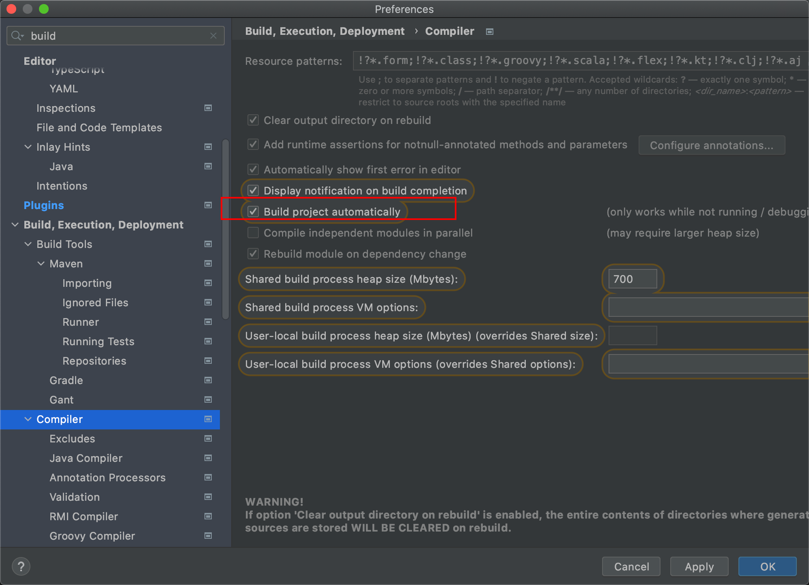
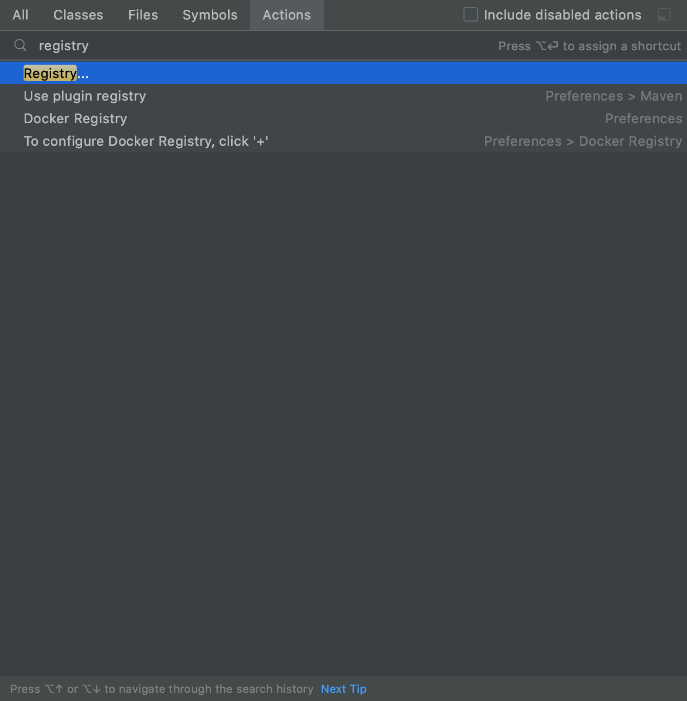
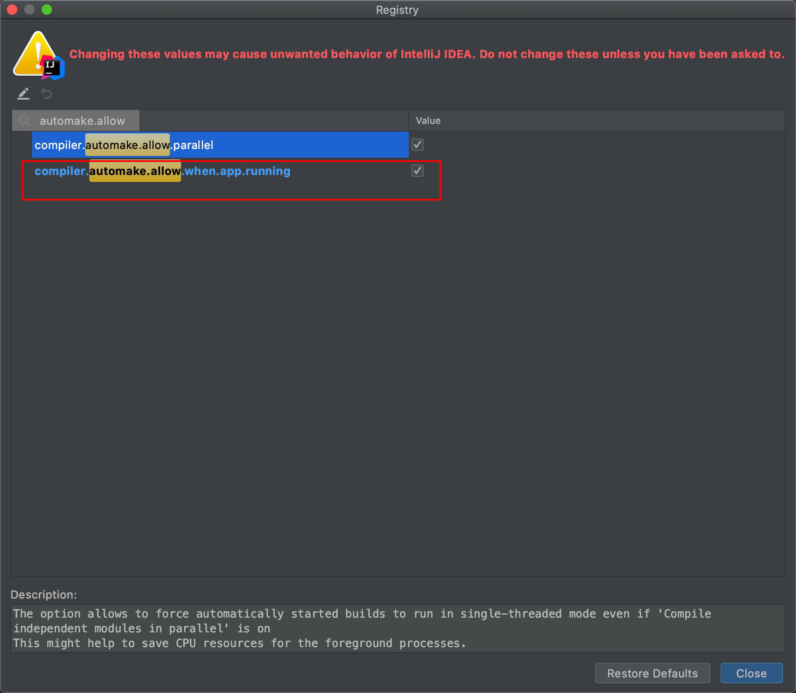

File->Other Settings(针对新工程设置，免得每次新工程都要这么设置一遍太麻烦了)

File->Settings(让当前工程生效)

①输入build搜索，勾选下面的Build project automatically(如果不勾选那么每次修改代码文件后就需要手动build了)



 

②按下cmd shift a 查找registry



勾选下面的compiler.automake.allow.when.app.running(貌似这个需要等上面的设置好了并且重启intellij后才会出现，否则可能找不到)


③pom.xml中加入:

	<dependency>
	 <groupId>org.springframework.boot</groupId>
	  <artifactId>spring-boot-devtools</artifactId>
	</dependency>


~~pom.xml中加入:(在其他博客中有提到，但是我测了下并不需要)~~

```xml
<build>
   <plugins>
      <plugin>
         <groupId>org.springframework.boot</groupId>
         <artifactId>spring-boot-maven-plugin</artifactId>
         <configuration>
            <fork>true</fork>
         </configuration>
      </plugin>
   </plugins>
</build>
```


~~下面这个也是实测不需要~~

~~application.properties 里添加~~

~~spring.devtools.restart.enabled=true~~


④禁用chrome的cache


