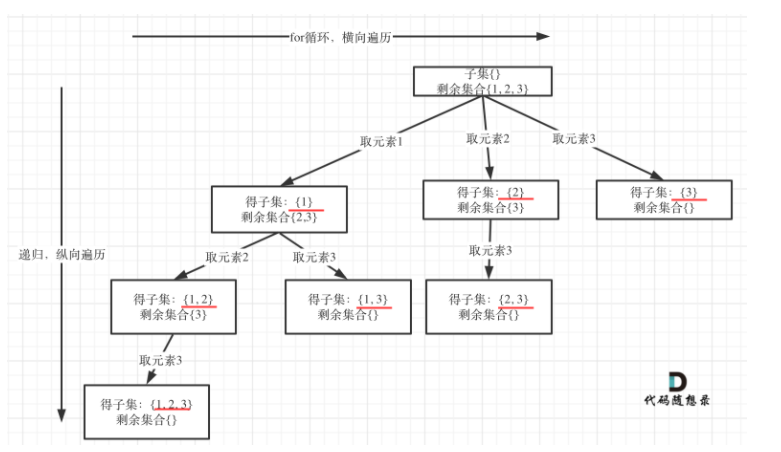
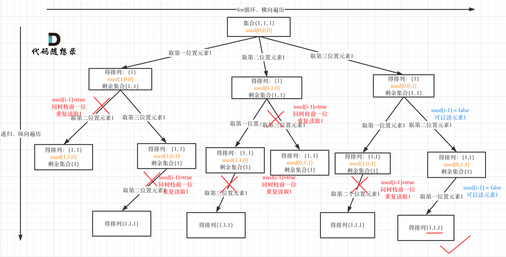

# 栈

java中可以使用deque接口的实现类来操作，实现：ArrayDeque。亦可作为队列。


## 栈与递归

**递归的实现就是：每一次递归调用都会把函数的局部变量、参数值和返回地址等压入调用栈中**，然后递归返回的时候，从栈顶弹出上一次递归的各项参数，所以这就是递归为什么可以返回上一层位置的原因。

相信大家应该遇到过一种错误就是栈溢出，系统输出的异常是`Segmentation fault`（当然不是所有的`Segmentation fault` 都是栈溢出导致的） ，如果你使用了递归，就要想一想是不是无限递归了，那么系统调用栈就会溢出。

而且**在企业项目开发中，尽量不要使用递归！**在项目比较大的时候，由于参数多，全局变量等等，使用递归很容易判断不充分return的条件，非常容易无限递归（或者递归层级过深），**造成栈溢出错误（这种问题还不好排查！）**


# 回溯

## 总结

- 组合问题：
  - [回溯算法：求组合问题！(opens new window)](https://programmercarl.com/0077.组合.html)
  - [回溯算法：组合问题再剪剪枝(opens new window)](https://programmercarl.com/0077.组合优化.html)
  - [回溯算法：求组合总和！(opens new window)](https://programmercarl.com/0216.组合总和III.html)
  - [回溯算法：电话号码的字母组合(opens new window)](https://programmercarl.com/0017.电话号码的字母组合.html)
  - [回溯算法：求组合总和（二）(opens new window)](https://programmercarl.com/0039.组合总和.html)
  - [回溯算法：求组合总和（三）(opens new window)](https://programmercarl.com/0040.组合总和II.html)
- 分割问题：
  - [回溯算法：分割回文串(opens new window)](https://programmercarl.com/0131.分割回文串.html)
  - [回溯算法：复原IP地址](https://programmercarl.com/0093.复原IP地址.html)


## 第78题. 子集

[力扣题目链接(opens new window)](https://leetcode-cn.com/problems/subsets/)

给定一组不含重复元素的整数数组 nums，返回该数组所有可能的子集（幂集）。

说明：解集不能包含重复的子集。

示例: 输入: nums = [1,2,3] 输出: [ [3],  [1],  [2],  [1,2,3],  [1,3],  [2,3],  [1,2],  [] ]

## [#](https://programmercarl.com/0078.子集.html#思路)思路

求子集问题和[回溯算法：求组合问题！ (opens new window)](https://programmercarl.com/0077.组合.html)和[回溯算法：分割问题！ (opens new window)](https://programmercarl.com/0131.分割回文串.html)又不一样了。

如果把 **子集问题、组合问题、分割问题**都抽象为一棵树的话，**那么组合问题和分割问题都是收集树的叶子节点，而子集问题是找树的所有节点！**

其实子集也是一种组合问题，因为它的集合是无序的，子集{1,2} 和 子集{2,1}是一样的。

**那么既然是无序，取过的元素不会重复取，写回溯算法的时候，for就要从startIndex开始，而不是从0开始！**

有同学问了，什么时候for可以从0开始呢？

求排列问题的时候，就要从0开始，因为集合是有序的，{1, 2} 和{2, 1}是两个集合，排列问题我们后续的文章就会讲到的。




```java
/*
78. 子集
给你一个整数数组 nums ，数组中的元素 互不相同 。返回该数组所有可能的子集（幂集）。

解集 不能 包含重复的子集。你可以按 任意顺序 返回解集。

*/
class Solution {
    public List<List<Integer>> subsets(int[] nums) {
        if (nums.length == 0) {
            result.add(col);
            return result;
        }

        backTracking(nums, 0);
        return result;

    }

    //最终结果
    private List<List<Integer>> result = new ArrayList<>();
    //中间结果
    private LinkedList<Integer> col = new LinkedList<>();

    private void backTracking(int[] nums, int startIndex) {
        // 每个节点都要收集
        result.add(new ArrayList<>(col));

        if (startIndex >= nums.length) {
            return;
        }

        for (int i = startIndex; i < nums.length; i++) {
            col.add(nums[i]);//横向收集
            backTracking(nums, i + 1);//纵向收集
            //回溯，恢复结果
            col.removeLast();
        }
    }
}
```


# 排列问题（二）

## [#](https://programmercarl.com/0047.全排列II.html#_47-全排列-ii)47.全排列 II

[力扣题目链接(opens new window)](https://leetcode-cn.com/problems/permutations-ii/)

给定一个可包含重复数字的序列 nums ，按任意顺序 返回所有不重复的全排列。

示例 1： 输入：nums = [1,1,2] 输出： [[1,1,2], [1,2,1], [2,1,1]]

示例 2： 输入：nums = [1,2,3] 输出：[[1,2,3],[1,3,2],[2,1,3],[2,3,1],[3,1,2],[3,2,1]]

提示：

- 1 <= nums.length <= 8
- -10 <= nums[i] <= 10

## [#](https://programmercarl.com/0047.全排列II.html#思路)思路

**如果对回溯算法基础还不了解的话，我还特意录制了一期视频：[带你学透回溯算法（理论篇） (opens new window)](https://www.bilibili.com/video/BV1cy4y167mM/)**可以结合题解和视频一起看，希望对大家理解回溯算法有所帮助。

这道题目和[回溯算法：排列问题！ (opens new window)](https://programmercarl.com/0046.全排列.html)的区别在与**给定一个可包含重复数字的序列**，要返回**所有不重复的全排列**。

这里又涉及到去重了。

在[回溯算法：求组合总和（三） (opens new window)](https://programmercarl.com/0040.组合总和II.html)、[回溯算法：求子集问题（二） (opens new window)](https://programmercarl.com/0090.子集II.html)我们分别详细讲解了组合问题和子集问题如何去重。

那么排列问题其实也是一样的套路。

**还要强调的是去重一定要对元素经行排序，这样我们才方便通过相邻的节点来判断是否重复使用了**。

我以示例中的 [1,1,2]为例 （为了方便举例，已经排序）抽象为一棵树，去重过程如图：


图中我们对同一树层，前一位（也就是nums[i-1]）如果使用过，那么就进行去重。

**一般来说：组合问题和排列问题是在树形结构的叶子节点上收集结果，而子集问题就是取树上所有节点的结果**。

在[回溯算法：排列问题！ (opens new window)](https://programmercarl.com/0046.全排列.html)中已经详解讲解了排列问题的写法，在[回溯算法：求组合总和（三） (opens new window)](https://programmercarl.com/0040.组合总和II.html)、[回溯算法：求子集问题（二） (opens new window)](https://programmercarl.com/0090.子集II.html)中详细讲解的去重的写法，所以这次我就不用回溯三部曲分析了，直接给出代码，如下：

```java
class Solution {
    List<List<Integer>> result = new ArrayList<>();
    LinkedList<Integer> path = new LinkedList<>();
    boolean[] used;

    public List<List<Integer>> permuteUnique(int[] nums) {
        used = new boolean[nums.length];
        Arrays.sort(nums);
        backtracing(nums);
        return result;
    }

    private void backtracing(int[] nums) {
        if (path.size() == nums.length) {
            result.add(new ArrayList<>(path));
            return;
        }

        for (int i = 0; i < nums.length; i++) {
            //元素被使用过、
            //或者同一层次被使用过
            if (used[i]
                    || i > 0 && nums[i - 1] == nums[i] && !used[i - 1]) {
                continue;
            }

            used[i] = true;
            path.add(nums[i]);
            backtracing(nums);
            path.removeLast();
            used[i] = false;
        }
    }
}
```


## 拓展

大家发现，去重最为关键的代码为：

```text
if (i > 0 && nums[i] == nums[i - 1] && used[i - 1] == false) {
    continue;
}
```


**如果改成 `used[i - 1] == true`， 也是正确的!**，去重代码如下：

```text
if (i > 0 && nums[i] == nums[i - 1] && used[i - 1] == true) {
    continue;
}
```


这是为什么呢，就是上面我刚说的，如果要对树层中前一位去重，就用`used[i - 1] == false`，如果要对树枝前一位去重用`used[i - 1] == true`。

**对于排列问题，树层上去重和树枝上去重，都是可以的，但是树层上去重效率更高！**

这么说是不是有点抽象？

来来来，我就用输入: [1,1,1] 来举一个例子。

树层上去重(used[i - 1] == false)，的树形结构如下：


树枝上去重（used[i - 1] == true）的树型结构如下：



大家应该很清晰的看到，树层上对前一位去重非常彻底，效率很高，树枝上对前一位去重虽然最后可以得到答案，但是做了很多无用搜索。