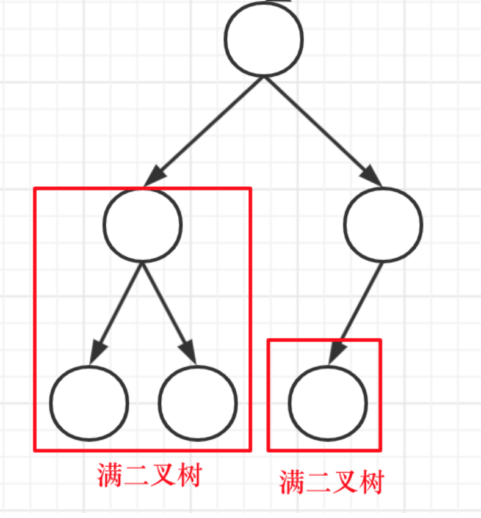

# 循环

## 不重复的嵌套循环

```java
        for(int i = 0; i < height.length -1; i++) {
            for(int j = i + 1; j < height.length; j++) {
                
                doSomeThing();
            }
        }
```

# 位运算

## 值交换

### 效果

```java
a^=b;
b^=a;
a^=b;
// a b的值交换了
```

### 原理

数学表示：
    a ^ a ^ b = b;
    a ^ b ^ a = b;
    b ^ a ^ a = b;

```java
a^=b; // c = a^b
b^=a; // d = b^c = a
a^=b; // e = d^c = a^c = b
// a\b的值交换了
```


## 判断奇偶

x&1


# ASCII

数字

[48, 48+10)

大写字母

[65, 65+26)

小写

[97, 97+26)


# 树

## 完全二叉树

完全二叉树中，对比某节点的左子树 和 右子树 深度：若两者相等，则左子树必为满二叉树；反之，则右子树必为满二叉树。



```java
/**
 * 计算完全二叉树深度
 *
 * @param node
 * @return
 */
private int getDepth(TreeNode node) {
    int depth = 0;
    while (node != null) {
        depth++;
        node = node.left;
    }
    return depth;
}
```

## 满二叉树

满二叉树的节点个数 =  2^树深度 - 1 


## 求深度、高度

因为求深度可以从上到下去查 所以需要前序遍历（中左右），而高度只能从下到上去查，所以只能后序遍历（左右中）