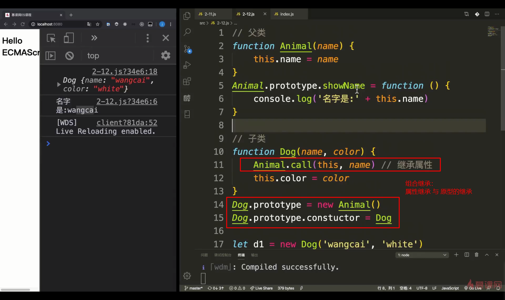
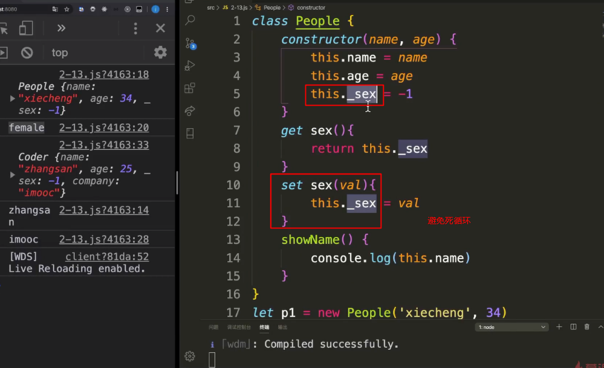

# ES6

### export

需要特别注意的是，`export`命令规定的是对外的接口，必须与模块内部的变量建立一一对应关系。

```javascript
// 报错
export 1;

// 报错
var m = 1;
export m;
```

上面两种写法都会报错，因为没有提供对外的接口。第一种写法直接输出 1，第二种写法通过变量`m`，还是直接输出 1。`1`只是一个值，不是接口。正确的写法是下面这样。

```javascript
// 写法一
export var m = 1;

// 写法二
var m = 1;
export {m};

// 写法三
var n = 1;
export {n as m};
```

上面三种写法都是正确的，规定了对外的接口`m`。其他脚本可以通过这个接口，取到值`1`。它们的实质是，在接口名与模块内部变量之间，建立了一一对应的关系。


另外，`export`语句输出的接口，与**其对应的值是动态绑定关系，即通过该接口，可以取到模块内部实时的值。**

```javascript
export var foo = 'bar';
setTimeout(() => foo = 'baz', 500);
```

上面代码输出变量`foo`，值为`bar`，500 毫秒之后变成`baz`。

这一点与 CommonJS 规范完全不同。CommonJS 模块输出的是值的缓存，不存在动态更新，详见下文《Module 的加载实现》一节。


### import

使用`export`命令定义了模块的对外接口以后，其他 JS 文件就可以通过`import`命令加载这个模块。

```javascript
// main.js
import { firstName, lastName, year } from './profile.js';

function setName(element) {
  element.textContent = firstName + ' ' + lastName;
}
```

上面代码的`import`命令，用于加载`profile.js`文件，并从中输入变量。**`import`命令接受一对大括号，里面指定要从其他模块导入的变量名**。大括号里面的变量名，必须与被导入模块（`profile.js`）对外接口的名称相同。

如果想为输入的变量重新取一个名字，`import`命令要使用`as`关键字，将输入的变量重命名。

```javascript
import { lastName as surname } from './profile.js';
```

`import`命令输入的变量都是只读的，因为它的本质是输入接口。也就是说，**不允许在加载模块的脚本里面，改写接口。**

```javascript
import {a} from './xxx.js'

a = {}; // Syntax Error : 'a' is read-only;
```

上面代码中，脚本加载了变量`a`，对其重新赋值就会报错，因为`a`是一个只读的接口。但是，如果`a`是一个对象，改写`a`的属性是允许的。

```javascript
import {a} from './xxx.js'

a.foo = 'hello'; // 合法操作
```

上面代码中，`a`的属性可以成功改写，并且其他模块也可以读到改写后的值。不过，这种写法很难查错，**建议凡是输入的变量，都当作完全只读，不要轻易改变它的属性。**


`import`后面的`from`指定模块文件的位置，可以是相对路径，也可以是绝对路径，`.js`后缀可以省略。如果只是模块名，不带有路径，那么必须有配置文件，告诉 JavaScript 引擎该模块的位置。

```javascript
import {myMethod} from 'util';
```

上面代码中，`util`是模块文件名，由于不带有路径，必须通过配置，告诉引擎怎么取到这个模块。

注意，`import`命令具有提升效果，会提升到整个模块的头部，首先执行。

```javascript
foo();

import { foo } from 'my_module';
```

上面的代码不会报错，因为`import`的执行早于`foo`的调用。这种行为的本质是，`import`命令是编译阶段执行的，在代码运行之前。

**由于`import`是静态执行，所以不能使用表达式和变量**，这些只有在运行时才能得到结果的语法结构。

```javascript
// 报错
import { 'f' + 'oo' } from 'my_module';

// 报错
let module = 'my_module';
import { foo } from module;

// 报错
if (x === 1) {
  import { foo } from 'module1';
} else {
  import { foo } from 'module2';
}
```

上面三种写法都会报错，因为它们用到了表达式、变量和`if`结构。在静态分析阶段，这些语法都是没法得到值的。


目前阶段，通过 Babel 转码，CommonJS 模块的`require`命令和 ES6 模块的`import`命令，可以写在同一个模块里面，但是最好不要这样做。因为`import`在静态解析阶段执行，所以它是一个模块之中最早执行的。下面的代码可能不会得到预期结果。

```javascript
require('core-js/modules/es6.symbol');
require('core-js/modules/es6.promise');
import React from 'React';
```


#### export default

下面比较一下默认输出和正常输出。

```javascript
// 第一组
export default function crc32() { // 输出
  // ...
}

import crc32 from 'crc32'; // 输入

// 第二组
export function crc32() { // 输出
  // ...
};

import {crc32} from 'crc32'; // 输入
```

上面代码的两组写法，第一组是使用`export default`时，对应的`import`语句不需要使用大括号；第二组是不使用`export default`时，对应的`import`语句需要使用大括号。

`export default`命令用于指定模块的默认输出。显然，一个模块只能有一个默认输出，因此**`export default`命令只能使用一次**。所以，import命令后面才不用加大括号，因为只可能唯一对应`export default`命令。

本质上，**`export default`就是输出一个叫做`default`的变量或方法，然后系统允许你为它取任意名字。所以，下面的写法是有效的。**

```javascript
// modules.js
function add(x, y) {
  return x * y;
}
export {add as default};
// 等同于
// export default add;

// app.js
import { default as foo } from 'modules';
// 等同于
// import foo from 'modules';
```

正是因为`export default`命令其实只是输出一个叫做`default`的变量，所以它后面不能跟变量声明语句。

```javascript
// 正确
export var a = 1;

// 正确
var a = 1;
export default a;

// 错误
export default var a = 1;
```

上面代码中，`export default a`的含义是将变量`a`的值赋给变量`default`。所以，最后一种写法会报错。

同样地，因为`export default`命令的本质是将后面的值，赋给`default`变量，所以可以直接将一个值写在`export default`之后。

```javascript
// 正确
export default 42;

// 报错
export 42;
```

上面代码中，后一句报错是因为没有指定对外的接口，而前一句指定对外接口为`default`。


有了`export default`命令，输入模块时就非常直观了，以输入 lodash 模块为例。

```javascript
import _ from 'lodash';
```

如果想在一条`import`语句中，同时输入默认方法和其他接口，可以写成下面这样。

```javascript
import _, { each, forEach } from 'lodash';
```

对应上面代码的`export`语句如下。

```javascript
export default function (obj) {
  // ···
}

export function each(obj, iterator, context) {
  // ···
}

export { each as forEach };
```

上面代码的最后一行的意思是，暴露出`forEach`接口，默认指向`each`接口，即`forEach`和`each`指向同一个方法。

`export default`也可以用来输出类。

```javascript
// MyClass.js
export default class { ... }

// main.js
import MyClass from 'MyClass';
let o = new MyClass();
```


## 模块的继承

模块之间也可以继承。

假设有一个`circleplus`模块，继承了`circle`模块。

```javascript
// circleplus.js

export * from 'circle';
export var e = 2.71828182846;
export default function(x) {
  return Math.exp(x);
}
```

上面代码中的`export *`，表示再输出`circle`模块的所有属性和方法。注意，`export *`命令会忽略`circle`模块的`default`方法。然后，上面代码又输出了自定义的`e`变量和默认方法。

这时，也可以将`circle`的属性或方法，改名后再输出。

```javascript
// circleplus.js

export { area as circleArea } from 'circle';
```

上面代码表示，只输出`circle`模块的`area`方法，且将其改名为`circleArea`。

加载上面模块的写法如下。

```javascript
// main.js

import * as math from 'circleplus';
import exp from 'circleplus';
console.log(exp(math.e));
```

上面代码中的`import exp`表示，**将`circleplus`模块的默认方法加载为`exp`方法。**


## 跨模块常量

本书介绍`const`命令的时候说过，`const`声明的常量只在当前代码块有效。如果想设置跨模块的常量（即跨多个文件），或者说一个值要被多个模块共享，可以采用下面的写法。

```javascript
// constants.js 模块
export const A = 1;
export const B = 3;
export const C = 4;

// test1.js 模块
import * as constants from './constants';
console.log(constants.A); // 1
console.log(constants.B); // 3

// test2.js 模块
import {A, B} from './constants';
console.log(A); // 1
console.log(B); // 3
```

如果要使用的常量非常多，可以建一个专门的`constants`目录，将各种常量写在不同的文件里面，保存在该目录下。

```javascript
// constants/db.js
export const db = {
  url: 'http://my.couchdbserver.local:5984',
  admin_username: 'admin',
  admin_password: 'admin password'
};

// constants/user.js
export const users = ['root', 'admin', 'staff', 'ceo', 'chief', 'moderator'];
```

然后，将这些文件输出的常量，合并在`index.js`里面。

```javascript
// constants/index.js
export {db} from './db';
export {users} from './users';
```

使用的时候，直接加载`index.js`就可以了。

```javascript
// script.js
import {db, users} from './constants/index';
```


## import()

### 简介

前面介绍过，**`import`命令会被 JavaScript 引擎静态分析，先于模块内的其他语句执行（`import`命令叫做“连接” binding 其实更合适）**。所以，下面的代码会报错。

```javascript
// 报错
if (x === 2) {
  import MyModual from './myModual';
}
```

上面代码中，引擎处理`import`语句是在编译时，这时不会去分析或执行`if`语句，所以`import`语句放在`if`代码块之中毫无意义，因此会报句法错误，而不是执行时错误。也就是说，`import`和`export`命令只能在模块的顶层，不能在代码块之中（比如，在`if`代码块之中，或在函数之中）。

这样的设计，固然有利于编译器提高效率，但也导致无法在运行时加载模块。在语法上，条件加载就不可能实现。如果`import`命令要取代 Node 的`require`方法，这就形成了一个障碍。**因为`require`是运行时加载模块，`import`命令无法取代`require`的动态加载功能。**

```javascript
const path = './' + fileName;
const myModual = require(path);
```

上面的语句就是动态加载，`require`到底加载哪一个模块，只有运行时才知道。`import`命令做不到这一点。


`import()`返回一个 Promise 对象。下面是一个例子。

```javascript
const main = document.querySelector('main');

import(`./section-modules/${someVariable}.js`)
  .then(module => {
    module.loadPageInto(main);
  })
  .catch(err => {
    main.textContent = err.message;
  });
```

`import()`函数可以用在任何地方，不仅仅是模块，非模块的脚本也可以使用。它是运行时执行，也就是说，什么时候运行到这一句，就会加载指定的模块。另外，**`import()`函数与所加载的模块没有静态连接关系**，这点也是与`import`语句不相同。**`import()`类似于 Node 的`require`方法，区别主要是前者是异步加载，后者是同步加载。**


> 小总结：
>
> export：
>
> - 向外暴露接口。
> - export default 接口，暴露默认接口，只能使用一次，**本质就是输出一个叫做`default`的变量或方法**，被引用时可以起别名。
> - export const 暴露常量， 
>
> import：
>
> - 用于导入其他模块export的接口
> - 静态执行，必须置于顶层。区别于import()
> - 
>
> 

## let

- 不属于顶层对象window
- 不允许重复声明
- 不存在变量提升
- 暂时性死区
- 块级作用域

### 暂时性死区

ES6明确规定，如果区块中存在`let`和`const`命令，这个区块对这些命令声明的变量，从一开始就形成了封闭作用域。凡是在声明之前就使用这些变量，就会报错。

总之，在代码块内，使用let命令声明变量之前，该变量都是不可用的。这在语法上，称为“暂时性死区”（temporal dead zone，简称TDZ）。

```js
if (true) {
  // TDZ开始
  tmp = 'abc'; // ReferenceError
  console.log(tmp); // ReferenceError

  let tmp; // TDZ结束
  console.log(tmp); // undefined

  tmp = 123;
  console.log(tmp); // 123
}
```

“暂时性死区”也意味着`typeof`不再是一个百分之百安全的操作。

```js
typeof x; // ReferenceError
let x;
```

上面代码中，变量`x`使用`let`命令声明，所以在声明之前，都属于`x`的“死区”，只要用到该变量就会报错。因此，`typeof`运行时就会抛出一个`ReferenceError`。

作为比较，如果一个变量根本没有被声明，使用`typeof`反而不会报错。

```js
typeof undeclared_variable // "undefined"
```


```js
if (true) let a=1
//VM212:1 Uncaught SyntaxError: Lexical declaration cannot appear in a single-statement context

//对于 JavaScript 引擎来讲，完全可以把这种情况当做是在块作用域内声明变量，但这并无意义，因为这种情况下单行使用 let 声明变量，必然没有使用到这个变量的地方，如果有，那就必须使用大括号显式地表明是块作用域。所以在阮一峰老师的《ECMAScript6 入门》一书中有一句：

//如果没有大括号，JavaScript 引擎就认为不存在块级作用域。
```


## const

- es5定义常量的方式

```js
Object.defineProperty(window, 'PI',{
	value: 3.14,
	writable: false
})
```

使用`const`定义的常量，他的栈内存的值不能更改。也就是说基本类型不可更改，引用类型只是引用不可变。

要使一个对象不可改变，可以使用`Object.freeze(obj)`来实现，但是obj若有下一级的引用型属性，这个属性是可变的


# 数组

## ES5中遍历数组的方式


## of

使用of遍历数组时会把它的方法也遍历出来


## ES6中遍历数组的方式


### arr.entries()的遍历方式


## 数组的拓展


### 伪数组

伪数组不具备数组的方法，

在ES5可以通过以下方式将伪数组转化成数组


在ES6中可以通过Array.from()将他转成数组


## 扩展运算符与rest参数

- 扩展运算符：将数组或类数组展开成逗号隔开的值

- rest参数：将逗号隔开的值组合成一个数组

### rest

在形参中使用，表示可变参数


在解构赋值时使用，表示将多个项目合并为一个


### 箭头函数

- 箭头函数没有this，所以箭头函数中的this实际上是定义时所在的对象，而不是调用时所在的对象
- 箭头函数不可作为构造函数
- 不可以使用arguments对象，但是可以通过rest来取代arguments的作用


- ES5中通过bind改变this


## 对象的扩展

### Object.is()

用于判断ab是否相等。

```js
Object.is(1, '1') // false
Object.is(NaN, NaN) // true
```

### spread与Object.assign()

spread可以将对象展开，然后赋值给另一个对象

Object.assign(y,x) 可以将x的属性合并到y上


### in

数组中的in是下标，对象的in是属性，用于检测该下标是否有元素。


### 对象的遍历方式

新增了四种方式

Array中演示过，for...in不能够用于遍历Array，for...in的作用是用于遍历对象的。

```js
for (let key in obj) {
    console.log(key, obj[key])
}
```

Object.keys()用于返回对象所有key组成的数组。

```js
Object.keys(obj).forEach(key => {
    console.log(key, obj[key])
})
```

Object.getOwnPropertyNames()用于返回对象所有key组成的数组。

```js
Object.getOwnPropertyNames(obj).forEach(key => {
    console.log(key, obj[key])
})
```

Reflect.ownKeys()用于返回对象所有key组成的数组。

```js
Reflect.ownKeys(obj).forEach(key => {
    console.log(key, obj[key])
})
```


# 深拷贝与浅拷贝

可以通过JSON.stringify和JSON.parse实现深拷贝。（不支持函数的深拷贝）

或者通过递归遍历对象的方式实现深拷贝。


# 类与继承


javascript是一种基于对象的语言（object-based）

## ES5

通过组合继承实现



类的静态方法和属性


## ES6

- class
- extends
- constructor
- static
- super
- get/set




static不能用来定义静态属性，只能定义静态方法，可以使用es5的方式


# 字符串的扩展

es6 \uxxxx码点 0000-ffff

es6中使用大括号可以超出码点的限制： \u{}

## Unicode表示法

ES6 加强了对 Unicode 的支持，允许采用\uxxxx形式表示一个字符，其中xxxx表示字符的 Unicode 码点。

```js
"\u0061"
// "a"
```

但是，这种表示法只限于码点在\u0000~\uFFFF之间的字符。超出这个范围的字符，必须用两个双字节的形式表示。

```js
"\uD842\uDFB7"
// "𠮷"

"\u20BB7"
// " 7"
```

上面代码表示，如果直接在\u后面跟上超过0xFFFF的数值（比如\u20BB7），JavaScript 会理解成\u20BB+7。由于\u20BB是一个不可打印字符，所以只会显示一个空格，后面跟着一个7。

ES6 对这一点做出了改进，只要将码点放入大括号，就能正确解读该字符。

```js
"\u{20BB7}"
// "𠮷"
```

有了这种表示法之后，JavaScript 共有 6 种方法可以表示一个字符。

```js
'\z' === 'z' // true
'\172' === 'z' // true
'\x7A' === 'z' // true
'\u007A' === 'z' // true
'\u{7A}' === 'z' // true
```

## 模板字符串

### Tag Literals

前面的字符串字面量解决了字符串拼接的问题，对于包含复杂逻辑的字符串并不是简单的表达式能搞定的。所以需要另一种解决方案：Tag Literals，还是看上述那个例子:

```js
var retailPrice = 20
var wholesalePrice = 16
var type = 'retail'

var showTxt = ''

if (type === 'retail') {
    showTxt += '您此次的购买单价是：' + retailPrice
} else {
    showTxt += '您此次的批发价是：' + wholesalePrice
}
```

现在可以定义一个 Tag 函数，然后用这个 Tag 函数来充当一个模板引擎：

```js
function Price(strings, type) {
    let s1 = strings[0]
    const retailPrice = 20
    const wholesalePrice = 16
    let txt = ''
    if (type === 'retail') {
        txt = `购买单价是：${retailPrice}` 
    } else {
        txt = `批发价是：${wholesalePrice}` 
    }
    return `${s1}${txt}` 
}

let showTxt = Price `您此次的${'retail'}` 

console.log(showTxt) //您此次的购买单价是：20


function foo(a,b,c,d){
  console.log('a:',a);
  console.log('b:',b);
  console.log('c:',c);
  
}

const xxx='xxxx';
const ccc = 'cccc'
foo`你好${xxx}。在干嘛${ccc}。哈哈哈`

//a: (3) ["你好", "。在干嘛", "。哈哈哈", raw: Array(3)]0: "你好"1: "。在干嘛"2: "。哈哈哈"length: 3raw: (3) ["你好", "。在干嘛", "。哈哈哈"]0: "你好"1: "。在干嘛"2: "。哈哈哈"length: 3__proto__: Array(0)__proto__: Array(0)
//VM67:3 b: xxxx
//VM67:4 c: cccc

```

TIP

strings 参数指的是 Tag 函数后面被变量分割开的字符串集合，type 参数是对应第一个变量，Tag 函数可以有多个 type 类似的参数

## 扩展方法

### [#](http://es.xiecheng.live/es6/string.html#string-prototype-fromcodepoint)String.prototype.fromCodePoint()

用于从 Unicode 码点返回对应字符，并且可以识别大于0xFFFF的字符。

```js
// ES5
console.log(String.fromCharCode(0x20BB7))

// ES6
console.log(String.fromCodePoint(0x20BB7))
```

### [#](http://es.xiecheng.live/es6/string.html#string-prototype-includes)String.prototype.includes()

ES5中可以使用indexOf方法来判断一个字符串是否包含在另一个字符串中，indexOf返回出现的下标位置，如果不存在则返回-1。

```js
const str = 'imooc'

console.log(str.indexOf('mo'))
```

ES6提供了includes方法来判断一个字符串是否包含在另一个字符串中，返回boolean类型的值。

```js
const str = 'imooc'

console.log(str.includes('mo'))
```

### [#](http://es.xiecheng.live/es6/string.html#string-prototype-startswith)String.prototype.startsWith()

判断参数字符串是否在原字符串的头部, 返回boolean类型的值。

```js
const str = 'imooc'

console.log(str.startsWith('im'))
```

### [#](http://es.xiecheng.live/es6/string.html#string-prototype-endswith)String.prototype.endsWith()

判断参数字符串是否在原字符串的尾部, 返回boolean类型的值。

```js
const str = 'imooc'

console.log(str.endsWith('mooc'))
```

### [#](http://es.xiecheng.live/es6/string.html#string-prototype-repeat)String.prototype.repeat()

repeat方法返回一个新字符串，表示将原字符串重复n次。

```js
const str = 'imooc'

const newStr = str.repeat(10)

console.log(newStr)
```

# [#](http://es.xiecheng.live/es6/number.html#number)Number

## [#](http://es.xiecheng.live/es6/number.html#二进制与八进制)二进制与八进制

请大家思考在JS中如何把十进制转化为二进制？

```js
const a = 5 // 101

console.log(a.toString(2))
```

如何把八进制转化为二进制？

```js
const b = 101

console.log(parseInt(b, 2))
```

ES6 提供了二进制和八进制数值的新的写法，分别用前缀0b（或0B）和0o（或0O）表示。

```js
const a = 0B0101
console.log(a)

const b = 0O777
console.log(b)
```

### 0.1+0.2===0.3？

es使用IEEE754双精度标准，最多支持14位小数 ，保存的时候是使用二进制存储的，所以存下的值是一个近似值， 0.1即0B0.0 0011 0011 ......


## 新增方法

### [#](http://es.xiecheng.live/es6/number.html#number-isfinite)Number.isFinite()

用来检查一个数值是否为有限的（finite），即不是Infinity。

```js
Number.isFinite(15) // true
Number.isFinite(0.8) // true
Number.isFinite(NaN) // false
Number.isFinite(Infinity) // false
Number.isFinite(-Infinity) // false
Number.isFinite('foo') // false
Number.isFinite('15') // false
Number.isFinite(true) // false
```

### [#](http://es.xiecheng.live/es6/number.html#number-isnan)Number.isNaN()

用来检查一个值是否为NaN。

```js
Number.isNaN(NaN) // true
Number.isNaN(15) // false
Number.isNaN('15') // false
Number.isNaN(true) // false
Number.isNaN(9 / NaN) // true
Number.isNaN('true' / 0) // true
Number.isNaN('true' / 'true') // true
```

### [#](http://es.xiecheng.live/es6/number.html#number-parseint)Number.parseInt()

ES6 将全局方法parseInt()移植到Number对象上面，行为完全保持不变。 这样做的目的，是逐步减少全局性方法，使得语言逐步模块化。

```js
// ES5的写法
parseInt('12.34') // 12

// ES6的写法
Number.parseInt('12.34') // 12
```

### [#](http://es.xiecheng.live/es6/number.html#number-parsefloat)Number.parseFloat()

ES6 将全局方法parseFloat()移植到Number对象上面，行为完全保持不变。这样做的目的，是逐步减少全局性方法，使得语言逐步模块化。

```js
// ES5的写法
parseFloat('123.45#') // 123.45

// ES6的写法
Number.parseFloat('123.45#') // 123.45
```

### [#](http://es.xiecheng.live/es6/number.html#number-isinteger)Number.isInteger()

用来判断一个数值是否为整数。

```js
Number.isInteger(25) // true
Number.isInteger(25.1) // false

Number.isInteger() // false
Number.isInteger(null) // false
Number.isInteger('15') // false
Number.isInteger(true) // false
```

### [#](http://es.xiecheng.live/es6/number.html#number-max-safe-integer)Number.MAX_SAFE_INTEGER

最大值 Math.pow(2, 53) - 1 即2的53次方-1

```js
Number.MAX_SAFE_INTEGER === Math.pow(2, 53) - 1 // true

Number.MAX_SAFE_INTEGER === 9007199254740991 // true
```

### [#](http://es.xiecheng.live/es6/number.html#number-min-safe-integer)Number.MIN_SAFE_INTEGER

```js
Number.MIN_SAFE_INTEGER === -Number.MAX_SAFE_INTEGER // true

Number.MIN_SAFE_INTEGER === -9007199254740991 // true
```

### [#](http://es.xiecheng.live/es6/number.html#number-issafeinteger)Number.isSafeInteger()

JavaScript 能够准确表示的整数范围在-2^53到2^53之间（不含两个端点），超过这个范围，无法精确表示这个值。

```js
Math.pow(2, 53) // 9007199254740992

Math.pow(2, 53) === Math.pow(2, 53) + 1 // true
```

## [#](http://es.xiecheng.live/es6/number.html#math扩展)Math扩展

### [#](http://es.xiecheng.live/es6/number.html#math-trunc)Math.trunc()

方法用于去除一个数的小数部分，返回整数部分。

```js
console.log(Math.trunc(5.5))
console.log(Math.trunc(-5.5))
console.log(Math.trunc(true)) // 1
console.log(Math.trunc(false)) // 0
console.log(Math.trunc(NaN)) // NaN
console.log(Math.trunc(undefined)) // NaN
console.log(Math.trunc()) // NaN
```

### [#](http://es.xiecheng.live/es6/number.html#math-sign)Math.sign()

方法用来判断一个数到底是正数、负数、还是零。对于非数值，会先将其转换为数值。

它会返回五种值。

- 参数为正数，返回+1
- 参数为负数，返回-1
- 参数为 0，返回0
- 参数为-0，返回-0
- 其他值，返回NaN

```js
console.log(Math.sign(5)) // 1
console.log(Math.sign(-5)) // -1
console.log(Math.sign(0)) // 0
console.log(Math.sign(NaN)) // NaN
console.log(Math.sign(true)) // 1
console.log(Math.sign(false)) // 0
```

### [#](http://es.xiecheng.live/es6/number.html#math-cbrt)Math.cbrt()

方法用于计算一个数的立方根。

```js
console.log(Math.cbrt(8)) // 2

console.log(Math.cbrt('imooc')) // NaN
```


# Proxy

在 ES6 标准中新增的一个非常强大的功能是 Proxy，它可以自定义一些常用行为如查找、赋值、枚举、函数调用等。通过 Proxy 这个名称也可以看出来它包含了“代理”的含义，只要有“代理”的诉求都可以考虑使用 Proxy 来实现。


## [#](http://es.xiecheng.live/es6/proxy.html#基本语法)基本语法

**语法**

```js
let p = new Proxy(target, handler)
```

**解释**

|  参数   |                             含义                             | 必选 |
| :-----: | :----------------------------------------------------------: | :--: |
| target  | 用 Proxy 包装的目标对象（可以是任何类型的对象，包括原生数组，函数，甚至另一个代理） |  Y   |
| handler |    一个对象，其属性是当执行一个操作时定义代理的行为的函数    |  Y   |

MDN 给出的解释偏官方，通俗的讲第一个参数 target 就是用来代理的“对象”，**被代理之后它是不能直接被访问的**，而 handler 就是实现代理的过程。

## [#](http://es.xiecheng.live/es6/proxy.html#拦截操作场景)拦截操作场景

**场景**

我们经常读取一个对象的 key-value：

```js
let o = {
    name: 'xiaoming',
    age: 20
}

console.log(o.name) // xiaoming
console.log(o.age) // 20
console.log(o.from) // undefined
```

当我们读取 from 的时候返回的是 undefined，因为 o 这个对象中没有这个 key-value。想想看我们在读取数据的时候，这个数据经常是聚合的，当大家没有按照规范来的时候或者数据缺失的情况下，经常会出现这种“乌龙”现象。

如果我们不想在调用 key 的时候返回 undefined，之前的做法是这样的：

```js
console.log(o.from || '')
```

如果我们对所有代码都是这种写法，那阅读性和观赏性就不得而知了。值得庆幸的是，ES6 的 Proxy 可以让我们轻松的解决这一问题：

```js
let o = {
    name: 'xiaoming',
    age: 20
}

let handler = {
    get(obj, key) {
        return Reflect.has(obj, key) ? obj[key] : ''
    }
}

let p = new Proxy(o, handler)

console.log(p.from)
```

这个代码是想表达如果 o 对象有这个 key-value 则直接返回，如果没有一律返回 `''` ，当然这里是自定义，大家可以根据自己的需要来写适合自己业务的规则。

刚才对数据的“读操作”进行了拦截，接下来我们描述下“写操作”进行拦截。

#### **场景 1 **数据只读

从服务端获取的数据希望是只读，不允许在任何一个环节被修改。

```js
// response.data 是 JSON 格式的数据，来自服务端的响应
// 在 ES5 中只能通过遍历把所有的属性设置为只读
for (let [key] of Object.entries(response.data)) {
    Object.defineProperty(response.data, key, {
        writable: false
    })
}
```

如果我们使用 Proxy 就简单很多了：

```js
let data = new Proxy(response.data, {
    set(obj, key, value) {
        return false
    }
})
```

#### **场景 2 ** 校验

对于数据交互而言，校验是不可或缺的一个环境，传统的做法是将校验写在了业务逻辑里，导致代码耦合度较高。如果大家使用 Proxy 就可以将代码设计的非常灵活。

```js
// Validator.js
export default (obj, key, value) => {
    if (Reflect.has(key) && value > 20) {
        obj[key] = value
    }
}

import Validator from './Validator'
let data = new Proxy(response.data, {
    set: Validator
})
```

#### **场景 3** 读写进行监控

如果对读写进行监控，可以这样写：

```js
let validator = {
    set(target, key, value) {
        if (key === 'age') {
            if (typeof value !== 'number' || Number.isNaN(value)) {
                throw new TypeError('Age must be a number')
            }
            if (value <= 0) {
                throw new TypeError('Age must be a positive number')
            }
        }
        return true
    }
}
const person = {
    age: 27
}
const proxy = new Proxy(person, validator)
proxy.age = 'foo'
// <- TypeError: Age must be a number
proxy.age = NaN
// <- TypeError: Age must be a number
proxy.age = 0
// <- TypeError: Age must be a positive number
proxy.age = 28
console.log(person.age)
// <- 28

// 添加监控
window.addEventListener(
    'error',
    e => {
        console.log(e.message) // Uncaught TypeError: Age must be a number
    },
    true
)
```

#### **场景 4**   对象自动id 

什么实例一个对象，每个对象都有一个自己的 id 而且只读。

```js
class Component {
    constructor() {
        this.proxy = new Proxy({
            id: Math.random().toString(36).slice(-8)
        })
    }
    get id() {
        return this.proxy.id
    }
}
```

## [#](http://es.xiecheng.live/es6/proxy.html#常用拦截操作)常用拦截操作

### [#](http://es.xiecheng.live/es6/proxy.html#get)get(target, prop)

拦截对象属性的读取，比如proxy.foo和proxy['foo']。

```js
let arr = [7, 8, 9]
arr = new Proxy(arr, {
    get(target, prop) {
        // console.log(target, prop)
        return prop in target ? target[prop] : 'error'
    }
})
console.log(arr[1])
console.log(arr[10])
let dict = {
    'hello': '你好',
    'world': '世界'
}
dict = new Proxy(dict, {
    get(target, prop) {
        return prop in target ? target[prop] : prop
    }
})
console.log(dict['world'])
console.log(dict['imooc'])
```

### [#](http://es.xiecheng.live/es6/proxy.html#set)set(target, prop, val)

拦截对象属性的设置，比如proxy.foo = v或proxy['foo'] = v，返回一个布尔值。

若属性是新增或减少，则还会改变length，也会调用set操作

```js
let arr = []
arr = new Proxy(arr, {
    set(target, prop, val) {
        if (typeof val === 'number') {
            target[prop] = val
            return true
        } else {
            return false
        }
    }
})
arr.push(5)
arr.push(6)
console.log(arr[0], arr[1], arr.length)
```

### [#](http://es.xiecheng.live/es6/proxy.html#has)has(target, prop)

拦截`propKey in proxy`的操作，返回一个布尔值。

```js
let range = {
    start: 1,
    end: 5
}

range = new Proxy(range, {
    has(target, prop) {
        return prop >= target.start && prop <= target.end
    }
})
console.log(2 in range)
console.log(9 in range)
```

### [#](http://es.xiecheng.live/es6/proxy.html#ownkeys)ownKeys(target)

拦截`Object.getOwnPropertyNames(proxy)`、`Object.getOwnPropertySymbols(proxy)`、`Object.keys(proxy)`、`for...in`循环，返回一个数组。该方法返回目标对象所有自身的属性的属性名，而`Object.keys()`的返回结果仅包括目标对象自身的可遍历属性。

```js
let obj = {
    name: 'imooc',
    [Symbol('es')]: 'es6'
}
console.log(Object.getOwnPropertyNames(obj))
console.log(Object.getOwnPropertySymbols(obj))
console.log(Object.keys(obj))
for (let key in obj) {
    console.log(key)
}
//-----console.log----
/*
1  ["name"]
2  [Symbol(es)]
3  ["name"]
4  name
*/

let userinfo = {
    username: 'xiecheng',
    age: 34,
    _password: '***'
}
userinfo = new Proxy(userinfo, {
    ownKeys(target) {
        return Object.keys(target).filter(key => !key.startsWith('_'))
    }
})

// for (let key in userinfo) {
//     console.log(key)
// }
console.log(Object.keys(userinfo))
//(2) ["username", "age"]
```

### [#](http://es.xiecheng.live/es6/proxy.html#deleteproperty)deleteProperty(target, prop)

拦截`delete proxy[propKey]`的操作，返回一个布尔值。

```js
let user = {
    name: 'xiecheng',
    age: 34,
    _password: '***'
}
user = new Proxy(user, {
    get(target, prop) {
        if (prop.startsWith('_')) {
            throw new Error('不可访问')
        } else {
            return target[prop]
        }
    },
    set(target, prop, val) {
        if (prop.startsWith('_')) {
            throw new Error('不可访问')
        } else {
            target[prop] = val
            return true
        }
    },
    deleteProperty(target, prop) { // 拦截删除
        if (prop.startsWith('_')) {
            throw new Error('不可删除')
        } else {
            delete target[prop]
            return true
        }
    },
    ownKeys(target) {
        return Object.keys(target).filter(key => !key.startsWith('_'))
    }
})
console.log(user.age)
console.log(user._password)
user.age = 18
console.log(user.age)
try {
    user._password = 'xxx'
} catch (e) {
    console.log(e.message)
}

try {
    // delete user.age
    delete user._password
} catch (e) {
    console.log(e.message)
}
console.log(user.age)

for (let key in user) {
    console.log(key)
}
```

### [#](http://es.xiecheng.live/es6/proxy.html#apply)apply(target, ctx, args)

拦截 Proxy 实例作为函数调用的操作，比如`proxy(...args)、proxy.call(object, ...args)、proxy.apply(...)`。

```js
let sum = (...args) => {
    let num = 0
    args.forEach(item => {
        num += item
    })
    return num
}

sum = new Proxy(sum, {
    apply(target, ctx, args) {
        return target(...args) * 2
    }
})
console.log(sum(1, 2))
console.log(sum.call(null, 1, 2, 3))
console.log(sum.apply(null, [1, 2, 3]))
```

### [#](http://es.xiecheng.live/es6/proxy.html#construct)construct(target, args, newTarget)

拦截 Proxy 实例作为构造函数调用的操作，比如new proxy(...args)。

```js
let User = class {
    constructor(name) {
        this.name = name
    }
}
User = new Proxy(User, {
    construct(target, args, newTarget) {
        console.log('construct')
        return new target(...args)
    }
})
console.log(new User('imooc'))
```

### 推荐阅读

- [ES6 Proxies in Depth](https://ponyfoo.com/articles/es6-proxies-in-depth)
- [Meta Programming In JavaScript - Part Three: Proxies and Reflection](https://lucasfcosta.com/2016/11/15/Meta-Programming-in-JavaScript-Part-Three.html)
- [How to Use Proxies](https://www.sitepoint.com/es6-proxies/)
- [ES6 Proxies in practice](https://habr.com/en/post/448214/)

## Proxy小结


# Reflect

Reflect对象与Proxy对象一样，也是 ES6 为了操作对象而提供的新 API。

## [#](http://es.xiecheng.live/es6/reflect.html#设计目的)设计目的

- 将Object属于语言内部的方法放到Reflect上

```js
let obj = {}
let newVal = ''
Reflect.defineProperty(obj, 'name', {
    get() {
        return newVal
    },
    set(val) {
        console.log('set')
        // this.name = val
        newVal = val
    }
})
obj.name = 'es'
console.log(obj.name)
```

- 修改某些Object方法的返回结果，让其变得更合理

```js
// 老写法
try {
    Object.defineProperty(target, property, attributes)
    // success
} catch (e) {
    // failure
}

// 新写法
if (Reflect.defineProperty(target, property, attributes)) {
    // success
} else {
    // failure
}
```

- 让Object操作变成函数行为

```js
// 老写法
'assign' in Object // true

// 新写法
Reflect.has(Object, 'assign') // true
```

- Reflect对象的方法与Proxy对象的方法一一对应，只要是Proxy对象的方法，就能在Reflect对象上找到对应的方法。

```js
Proxy(target, {
    set: function(target, name, value, receiver) {
        var success = Reflect.set(target, name, value, receiver)
        if (success) {
            console.log('property ' + name + ' on ' + target + ' set to ' + value)
        }
        return success
    }
})
```

Reflect 是一个内置的对象，它提供拦截 JavaScript 操作的方法，这些方法与处理器对象的方法相同。Reflect不是一个函数对象，因此它是不可构造的。

> TIP
>
> 与大多数全局对象不同，**Reflect没有构造函数**。你不能将其与一个new运算符一起使用，或者将Reflect对象作为一个函数来调用。**Reflect的所有属性和方法都是静态的（就像Math对象）**

## [#](http://es.xiecheng.live/es6/reflect.html#常用方法)常用方法

### [#](http://es.xiecheng.live/es6/reflect.html#reflect-apply)Reflect.apply()

**语法**

> Reflect.apply(target, thisArgument, argumentsList)

**解释**

|     参数      |                             含义                             | 必选 |
| :-----------: | :----------------------------------------------------------: | :--: |
|    target     |                           目标函数                           |  Y   |
| thisArgument  |                target函数调用时绑定的this对象                |  N   |
| argumentsList | target函数调用时传入的实参列表，该参数应该是一个类数组的对象 |  N   |

**示例**

```js
Reflect.apply(Math.floor, undefined, [1.75])
// 1

Reflect.apply(String.fromCharCode, undefined, [104, 101, 108, 108, 111])
// "hello"

Reflect.apply(RegExp.prototype.exec, /ab/, ['confabulation']).index
// 4

Reflect.apply(''.charAt, 'ponies', [3])
// "i"
```

**ES5 对比**

该方法与ES5中Function.prototype.apply()方法类似：调用一个方法并且显式地指定this变量和参数列表(arguments) ，参数列表可以是数组，或类似数组的对象。

```js
Function.prototype.apply.call(Math.floor, undefined, [1.75])
```

### [#](http://es.xiecheng.live/es6/reflect.html#reflect-construct)Reflect.construct()

Reflect.construct() 方法的行为有点像 new 操作符 构造函数 ， 相当于运行 new target(...args).

**语法**

> Reflect.construct(target, argumentsList[, newTarget])

**解释**

|     参数      |                             含义                             | 必选 |
| :-----------: | :----------------------------------------------------------: | :--: |
|    target     |                       被运行的目标函数                       |  Y   |
| argumentsList |                 调用构造函数的数组或者伪数组                 |  Y   |
|   newTarget   | 该参数为构造函数， 参考 new.target 操作符，如果没有newTarget参数， 默认和target一样 |  N   |

> [! WARNING] 如果target或者newTarget不是构造函数，抛出TypeError

Reflect.construct允许你使用可变的参数来调用构造函数

```js
var obj = new Foo(...args)
var obj = Reflect.construct(Foo, args)
```

**示例**

```js
var d = Reflect.construct(Date, [1776, 6, 4])
d instanceof Date // true
d.getFullYear() // 1776
```

如果使用 newTarget 参数，则表示继承了 newTarget 这个超类：

```js
function someConstructor() {}
var result = Reflect.construct(Array, [], someConstructor)

Reflect.getPrototypeOf(result) // 输出：someConstructor.prototype
Array.isArray(result) // true
```

### [#](http://es.xiecheng.live/es6/reflect.html#reflect-defineproperty)Reflect.defineProperty()

静态方法 Reflect.defineProperty() 基本等同于 Object.defineProperty() 方法，唯一不同是返回 Boolean 值。

**语法**

> Reflect.defineProperty(target, propertyKey, attributes)

**解释**

|    参数     |           含义           | 必选 |
| :---------: | :----------------------: | :--: |
|   target    |         目标对象         |  Y   |
| propertyKey | 要定义或修改的属性的名称 |  Y   |
| attributes  | 要定义或修改的属性的描述 |  Y   |

**示例**

```js
const student = {}
Reflect.defineProperty(student, 'name', {
    value: 'Mike'
}) // true
student.name // "Mike"
```

### [#](http://es.xiecheng.live/es6/reflect.html#reflect-deleteproperty)Reflect.deleteProperty()

Reflect.deleteProperty 允许你删除一个对象上的属性。返回一个 Boolean 值表示该属性是否被成功删除。它几乎与非严格的 delete operator 相同。

**语法**

> Reflect.deleteProperty(target, propertyKey)

**解释**

|    参数     |         含义         | 必选 |
| :---------: | :------------------: | :--: |
|   target    |  删除属性的目标对象  |  Y   |
| propertyKey | 将被删除的属性的名称 |  Y   |

**示例**

```js
var obj = {
    x: 1,
    y: 2
}
Reflect.deleteProperty(obj, "x") // true
obj // { y: 2 }

var arr = [1, 2, 3, 4, 5]
Reflect.deleteProperty(arr, "3") // true
arr // [1, 2, 3, , 5]

// 如果属性不存在，返回 true
Reflect.deleteProperty({}, "foo") // true

// 如果属性不可配置，返回 false
Reflect.deleteProperty(Object.freeze({
    foo: 1
}), "foo") // false
```

### [#](http://es.xiecheng.live/es6/reflect.html#reflect-get)Reflect.get()

Reflect.get() 方法的工作方式，就像从 object (target[propertyKey]) 中获取属性，但它是作为一个函数执行的。

**语法**

> Reflect.get(target, propertyKey[, receiver])

**解释**

|    参数     |                 含义                  | 必选 |
| :---------: | :-----------------------------------: | :--: |
|   target    |          需要取值的目标对象           |  Y   |
| propertyKey |          需要获取的值的键值           |  Y   |
|  receiver   | 如果遇到 getter，此值将提供给目标调用 |  N   |

**示例**

```js
// Object
var obj = {
    x: 1,
    y: 2
}
Reflect.get(obj, 'x') // 1

// Array
Reflect.get(['zero', 'one'], 1) // "one"

// Proxy with a get handler
var x = {
    p: 1
}
var obj = new Proxy(x, {
    get(t, k, r) {
        return k + 'bar'
    }
})
Reflect.get(obj, 'foo') // "foobar"
```

### [#](http://es.xiecheng.live/es6/reflect.html#reflect-getownpropertydescriptor)Reflect.getOwnPropertyDescriptor()

静态方法 Reflect.getOwnPropertyDescriptor() 与 Object.getOwnPropertyDescriptor() 方法相似。如果在对象中存在，则返回给定的属性的属性描述符，否则返回 undefined。

**语法**

> Reflect.getOwnPropertyDescriptor(target, propertyKey)

**解释**

|    参数     |               含义               | 必选 |
| :---------: | :------------------------------: | :--: |
|   target    |      需要寻找属性的目标对象      |  Y   |
| propertyKey | 获取自己的属性描述符的属性的名称 |  N   |

**示例**

```js
Reflect.getOwnPropertyDescriptor({
    x: 'hello'
}, 'x')
// {value: "hello", writable: true, enumerable: true, configurable: true}

Reflect.getOwnPropertyDescriptor({
    x: 'hello'
}, 'y')
// undefined

Reflect.getOwnPropertyDescriptor([], 'length')
// {value: 0, writable: true, enumerable: false, configurable: false}
```

**对比**

如果该方法的第一个参数不是一个对象（一个原始值），那么将造成 TypeError 错误。而对于 Object.getOwnPropertyDescriptor，非对象的第一个参数将被强制转换为一个对象处理。

```js
Reflect.getOwnPropertyDescriptor("foo", 0)
// TypeError: "foo" is not non-null object

Object.getOwnPropertyDescriptor("foo", 0)
// { value: "f", writable: false, enumerable: true, configurable: false }
```

### [#](http://es.xiecheng.live/es6/reflect.html#reflect-getprototypeof)Reflect.getPrototypeOf()

静态方法 Reflect.getPrototypeOf() 与 Object.getPrototypeOf() 方法是一样的。都是返回指定对象的原型（即，内部的 [[Prototype]] 属性的值）。

**语法**

> Reflect.getPrototypeOf(target)

**解释**

|  参数  |        含义        | 必选 |
| :----: | :----------------: | :--: |
| target | 获取原型的目标对象 |  Y   |

### [#](http://es.xiecheng.live/es6/reflect.html#reflect-has)Reflect.has()

Reflect.has 用于检查一个对象是否拥有某个属性， 相当于in 操作符

**语法**

> Reflect.has(target, propertyKey)

**解释**

|    参数     |                  含义                  | 必选 |
| :---------: | :------------------------------------: | :--: |
|   target    |           获取原型的目标对象           |  Y   |
| propertyKey | 属性名，需要检查目标对象是否存在此属性 |  Y   |

### [#](http://es.xiecheng.live/es6/reflect.html#reflect-isextensible)Reflect.isExtensible()

Reflect.isExtensible 判断一个对象是否可扩展 （即是否能够添加新的属性），它与 Object.isExtensible() 方法一样。

**语法**

> Reflect.isExtensible(target)

*解释**

|  参数  |        含义        | 必选 |
| :----: | :----------------: | :--: |
| target | 获取原型的目标对象 |  Y   |

### [#](http://es.xiecheng.live/es6/reflect.html#reflect-ownkeys)Reflect.ownKeys()

`Reflect.ownKeys` 方法返回一个由目标对象自身的属性键组成的数组。它的返回值等同于 `Object.getOwnPropertyNames(target).concat(Object.getOwnPropertySymbols(target))`

**语法**

> Reflect.ownKeys(target)

*解释**

|  参数  |        含义        | 必选 |
| :----: | :----------------: | :--: |
| target | 获取原型的目标对象 |  Y   |

**示例**

```js
Reflect.ownKeys({
    z: 3,
    y: 2,
    x: 1
}) // [ "z", "y", "x" ]
Reflect.ownKeys([]) // ["length"]

var sym = Symbol.for("comet")
var sym2 = Symbol.for("meteor")
var obj = {
    [sym]: 0,
    "str": 0,
    "773": 0,
    "0": 0,
    [sym2]: 0,
    "-1": 0,
    "8": 0,
    "second str": 0
}
Reflect.ownKeys(obj)
// [ "0", "8", "773", "str", "-1", "second str", Symbol(comet), Symbol(meteor) ]
// Indexes in numeric order,
// strings in insertion order,
// symbols in insertion order
```

### [#](http://es.xiecheng.live/es6/reflect.html#reflect-preventextensions)Reflect.preventExtensions()

Reflect.preventExtensions 方法阻止新属性添加到对象 例如：防止将来对对象的扩展被添加到对象中)。该方法与 Object.preventExtensions() 方法一致

**语法**

> Reflect.preventExtensions(target)

*解释**

|  参数  |        含义        | 必选 |
| :----: | :----------------: | :--: |
| target | 获取原型的目标对象 |  Y   |

**示例**

```js
// Objects are extensible by default.
var empty = {}
Reflect.isExtensible(empty) // === true

// ...but that can be changed.
Reflect.preventExtensions(empty)
Reflect.isExtensible(empty) // === false
Reflect.preventExtensions(1)
// TypeError: 1 is not an object

Object.preventExtensions(1)
// 1
```

### [#](http://es.xiecheng.live/es6/reflect.html#reflect-set)Reflect.set()

Reflect.set 方法允许你在对象上设置属性。它的作用是给属性赋值并且就像 property accessor 语法一样，但是它是以函数的方式。

**语法**

> Reflect.set(target, propertyKey, value[, receiver])

*解释**

|    参数     |                  含义                  | 必选 |
| :---------: | :------------------------------------: | :--: |
|   target    |           获取原型的目标对象           |  Y   |
| propertyKey |            设置的属性的名称            |  Y   |
|    value    |                设置的值                |  Y   |
|  receiver   | 如果遇到 setter，this 将提供给目标调用 |  N   |

**示例**

```js
// Object
var obj = {}
Reflect.set(obj, "prop", "value") // true
obj.prop // "value"

// Array
var arr = ["duck", "duck", "duck"]
Reflect.set(arr, 2, "goose") // true
arr[2] // "goose"

// It can truncate an array.
Reflect.set(arr, "length", 1) // true
arr // ["duck"]

// With just one argument, propertyKey and value are "undefined".
var obj = {}
Reflect.set(obj) // true
Reflect.getOwnPropertyDescriptor(obj, "undefined")
// { value: undefined, writable: true, enumerable: true, configurable: true }
```

### [#](http://es.xiecheng.live/es6/reflect.html#reflect-setprototypeof)Reflect.setPrototypeOf()

Reflect.setPrototypeOf 方法改变指定对象的原型 （即，内部的 [[Prototype]] 属性值）

**语法**

> Reflect.setPrototypeOf(target, prototype)

*解释**

|   参数    |               含义               | 必选 |
| :-------: | :------------------------------: | :--: |
|  target   |        获取原型的目标对象        |  Y   |
| prototype | 对象的新原型 （一个对象或 null） |  Y   |

**示例**

```js
Reflect.setPrototypeOf({}, Object.prototype) // true

// It can change an object's [[Prototype]] to null.
Reflect.setPrototypeOf({}, null) // true

// Returns false if target is not extensible.
Reflect.setPrototypeOf(Object.freeze({}), null) // false

// Returns false if it cause a prototype chain cycle.
var target = {}
var proto = Object.create(target)
Reflect.setPrototypeOf(target, proto) // false
```

注意

对于以上所有 API 第一个参数是 Object 的，如果给定的不是 Object 则抛出一个 TypeError 异常


## Reflect小结


# RegExp

i(忽略大小写) m(多行匹配)  g(全局匹配)

## [#](http://es.xiecheng.live/es6/regexp.html#y修饰符)y修饰符

ES6为正则表达式添加了y修饰符，叫做“粘连”（sticky）修饰符。

y修饰符的作用与g修饰符类似，也是全局匹配，后一次匹配都从上一次匹配成功的下一个位置开始。不同之处在于，g修饰符只要剩余位置中存在匹配就可，而y修饰符确保匹配必须从剩余的第一个位置开始，这也就是“粘连”的涵义。

```js
const s = 'aaa_aa_a'
const r1 = /a+/g
const r2 = /a+/y

r1.exec(s) // ["aaa"]
r2.exec(s) // ["aaa"]

r1.exec(s) // ["aa"]
r2.exec(s) // null
```

上面代码有两个正则表达式，一个使用g修饰符，另一个使用y修饰符。这两个正则表达式各执行了两次，第一次执行的时候，两者行为相同，剩余字符串都是_aa_a。由于g修饰没有位置要求，所以第二次执行会返回结果，而y修饰符要求匹配必须从头部开始，所以返回null。

如果改一下正则表达式，保证每次都能头部匹配，y修饰符就会返回结果了。

```js
const s = 'aaa_aa_a'
const r = /a+_/y

r.exec(s) // ["aaa_"]
r.exec(s) // ["aa_"]
```

上面代码每次匹配，都是从剩余字符串的头部开始。

使用lastIndex属性，可以更好地说明y修饰符。

```js
const regexp = /a/g

// 指定从2号位置（y）开始匹配
regexp.lastIndex = 2

// 匹配成功
const match = regexp.exec('xaya')

// 在3号位置匹配成功
console.log(match.index) // 3

// 下一次匹配从4号位开始
console.log(regexp.lastIndex) // 4

// 4号位开始匹配失败
regexp.exec('xaxa') // null
```

上面代码中，lastIndex属性指定每次搜索的开始位置，g修饰符从这个位置开始向后搜索，直到发现匹配为止。

y修饰符同样遵守lastIndex属性，但是要求必须在lastIndex指定的位置发现匹配。

```js
const regexp = /a/y

// 指定从2号位置开始匹配
regexp.lastIndex = 2

// 不是粘连，匹配失败
regexp.exec('xaya') // null

// 指定从3号位置开始匹配
regexp.lastIndex = 3

// 3号位置是粘连，匹配成功
const match = regexp.exec('xaxa')
console.log(match.index) // 3
console.log(regexp.lastIndex) // 4
```

进一步说，y修饰符号隐含了头部匹配的标志^。

```js
const reg = /b/y
reg.exec('aba')
// null
console.log(reg.lastIndex)
```

TIP

sticky 模式在正则匹配过程中只会影响两件事：

- 匹配必须从 re.lastIndex 开始（相当于正则表达中的 ^）
- 如果匹配到会修改 re.lastIndex（相当于 g 模式）


## [#](http://es.xiecheng.live/es6/regexp.html#u修饰符)u修饰符

ES6为正则表达式添加了u修饰符，含义为“Unicode模式”，用来正确处理大于 `\uFFFF` 的Unicode字符。也就是说，会正确处理四个字节的UTF-16编码。

```js
/^\uD83D/u.test('\uD83D\uDC2A') // false

    /
    ^ \uD83D / .test('\uD83D\uDC2A') // true
```

上面代码中， `\uD83D\uDC2A` 是一个四个字节的UTF-16编码，代表一个字符 "🐪"。但是，ES5不支持四个字节的UTF-16编码，会将其识别为两个字符，导致第二行代码结果为true。加了u修饰符以后，ES6就会识别其为一个字符，所以第一行代码结果为false。

一旦加上u修饰符号，就会修改下面这些正则表达式的行为。


**(1) 点字符**

点（.）字符在正则表达式中，含义是除了换行符以外的任意单个字符。对于码点大于 0xFFFF 的 Unicode 字符，点字符不能识别，必须加上u修饰符。

```js
let s = '𠮷'

    /
    ^ .$ / .test(s) // false

    /
    ^ .$ / u.test(s) // true
```

上面代码表示，如果不添加u修饰符，正则表达式就会认为字符串为两个字符，从而匹配失败。

TIP

'𠮷'这个字读 jí，是'吉'字的异形体，Unicode 码点 [U+20BB7](https://www.fileformat.info/info/unicode/char/20bb7/index.htm)

**(2) Unicode字符表示法**

ES6新增了使用大括号表示Unicode字符，这种表示法在正则表达式中必须加上u修饰符，才能识别。

```js
/\u{61}/.test('a') // false

    /
    \u {
        61
    }
/u.test('a') / / true

    /
    \u {
        20 BB7
    }
/u.test('𠮷') / / true
```

上面代码表示，如果不加u修饰符，正则表达式无法识别\u{61}这种表示法，只会认为这匹配61个连续的u。

**(3) 量词**

使用u修饰符后，所有量词都会正确识别码点大于0xFFFF的Unicode字符。

```js
/a{2}/.test('aa') // true

    /
    a {
        2
    }
/u.test('aa') / / true

    /
    𠮷{
        2
    }
/.test('𠮷𠮷') / / false

    /
    𠮷{
        2
    }
/u.test('𠮷𠮷') / / true
```

另外，只有在使用u修饰符的情况下，Unicode表达式当中的大括号才会被正确解读，否则会被解读为量词。

```js
/^\u{3}$/.test('uuu') // true
```

上面代码中，由于正则表达式没有u修饰符，所以大括号被解读为量词。加上u修饰符，就会被解读为Unicode表达式。

```js
/\u{20BB7}{2}/u.test('𠮷𠮷') // true
```

使用 u 修饰符之后 Unicode 表达式+量词也是可以的。

**(4) 预定义模式**

u修饰符也影响到预定义模式，能否正确识别码点大于0xFFFF的Unicode字符。

```js
/^\S$/.test('𠮷') // false

    /
    ^ \S$ / u.test('𠮷') // true
```

上面代码的\S是预定义模式，匹配所有不是空格的字符。只有加了u修饰符，它才能正确匹配码点大于0xFFFF的Unicode字符。

利用这一点，可以写出一个正确返回字符串长度的函数。

```js
function codePointLength(text) {
    const result = text.match(/[\s\S]/gu)
    return result ? result.length : 0
}

const s = '𠮷𠮷'

s.length // 4
codePointLength(s) // 2
```

**(5) i修饰符**

有些Unicode字符的编码不同，但是字型很相近，比如，\u004B与\u212A都是大写的K。

```js
/[a-z]/i.test('\u212A') // false

    /
    [a - z] / iu.test('\u212A') // true
```

上面代码中，不加u修饰符，就无法识别非规范的K字符。


# Generator

什么是 JavaScript Generators 呢？通俗的讲 Generators 是可以用来控制迭代器的函数。它们可以暂停，然后在任何时候恢复。如果这句话不好理解，可以看下接下来的示例。

**1. 常规循环**

```js
for (let i = 0; i < 5; i += 1) {
    console.log(i)
}
// this will return immediately 0 -> 1 -> 2 -> 3 -> 4
```

**2. 利用 Generator**

```js
function* generatorForLoop() {
    for (let i = 0; i < 5; i += 1) {
        yield console.log(i)
    }
}

const genForLoop = generatorForLoop()

console.log(genForLoop.next()) // first console.log - 0
console.log(genForLoop.next()) // 1
console.log(genForLoop.next()) // 2
console.log(genForLoop.next()) // 3
console.log(genForLoop.next()) // 4
```

对比下代码，常规的循环只能一次遍历完所有值，Generator 可以通过调用 next 方法拿到依次遍历的值，让遍历的执行变得“可控”。

## [#](http://es.xiecheng.live/es6/generator.html#基本语法)基本语法

### [#](http://es.xiecheng.live/es6/generator.html#定义)定义

```js
function* gen() {
    yield 1
    yield 2
    yield 3
}

let g = gen()
// "Generator { }"
```

这个是 Generator 的定义方法，有几个点值得注意：

1. 比普通函数多一个 *
2. 函数内部用 yield 来控制程序的执行的“暂停”
3. 函数的返回值通过调用 next 来“恢复”程序执行

注意

Generator 函数的定义不能使用箭头函数，否则会触发 SyntaxError 错误

```js
let generator = * () => {} // SyntaxError
let generator = () * => {} // SyntaxError
let generator = ( * ) => {} // SyntaxError
```

这些做法都是错误的❌。

### [#](http://es.xiecheng.live/es6/generator.html#yield-表达式)yield 表达式

> yield 关键字用来暂停和恢复一个生成器函数

关于 yield 表达式，要熟记几个知识点：

1. yield 表达式的返回值是 undefined，但是遍历器对象的 next 方法可以修改这个默认值。

```js
  function* gen() {
      let val
      val = yield 1
      console.log( `1:${val}` ) // 1:undefined
      val = yield 2
      console.log( `2:${val}` ) // 2:undefined
      val = yield 3
      console.log( `3:${val}` ) // 3:undefined
  }

  var g = gen()

  console.log(g.next()) // {value: 1, done: false}
  console.log(g.next()) // {value: 2, done: false}
  console.log(g.next()) // {value: 3, done: false}
  console.log(g.next()) // {value: undefined, done: true}
```

从这个代码可以看出来，yield 表达式的返回值是 undefined。

1. yeild * 是委托给另一个遍历器对象或者可遍历对象

```js
  function* gen() {
      let val
      val = yield 1
      console.log( `1:${val}` ) // 1:undefined
      val = yield 2
      console.log( `2:${val}` ) // 2:undefined
      val = yield [3, 4, 5]
      console.log( `3:${val}` ) // 3:undefined
  }
```

1. Generator 对象的 next 方法，遇到 yield 就暂停，并返回一个对象，这个对象包括两个属性：value 和 done。

参考步骤1 的代码可以明确看出来，执行第一句 ```g.next` ``gen 代码执行到 yield 1，程序暂停，此时返回了一个对象：{value: 1, done: false}

### [#](http://es.xiecheng.live/es6/generator.html#方法)方法

Generator 对象有几个方法，next、return、throw。

**- next([value])**

前面我们讲了，Generator 对象通过 next 方法来获取每一次遍历的结果，这个方法返回一个对象，这个对象包含两个属性：value 和 done。value 是指当前程序的运行结果，done 表示遍历是否结束。

其实 next 是可以接受参数的，这个参数可以让你在 Generator 外部给内部传递数据，而这个参数就是作为 yield 的返回值。

```js
  function* gen() {
      var val = 100
      while (true) {
          console.log( `before ${val}` )
          val = yield val
          console.log( `return ${val}` )
      }
  }

  var g = gen()
  console.log(g.next(20).value)
  // before 100
  // 100
  console.log(g.next(30).value)
  // return 30
  // before 30
  // 30
  console.log(g.next(40).value)
  // return 40
  // before 40
  // 40
```

如果对上面的话和代码不理解，可以把 ```console.log(g.next(30).value)` ``和 ```console.log(g.next(40).value)` ``注释掉。你会发现 只输出了 before 100 和 100，这是为什么呢？下面我们来还原下这段代码的执行过程：

1. g.next(20) 这句代码会执行 gen 内部的代码，遇到第一个 yield 暂停。所以 ```console.log(` before ${val} `)` ``执行输出了 ```before 100` ``，此时的 val 是 100，所以执行到 yield val 返回了 100，注意 ```yield val` ``并没有赋值给 val。
2. g.next(30) 这句代码会继续执行 gen 内部的代码，也就是 ```val = yield val` ``这句，因为 next 传入了 30，所以 yield val 这个返回值就是 30，因此 val 被赋值 30，执行到 ```console.log(` return ${val} `)` ``输出了 30，此时没有遇到 yield 代码继续执行，也就是 while 的判断，继续执行 ```console.log(` before ${val} `)` ``输出了 ```before 30` ``，再执行遇到了 ```yield val` ``程序暂停。
3. g.next(40) 重复步骤 2。

**- return()**

return 方法可以让 Generator 遍历终止，有点类似 for 循环的 break。

```js
function* gen() {
    yield 1
    yield 2
    yield 3
}

var g = gen()

console.log(g.next()) // {value: 1, done: false}
console.log(g.return()) // {value: undefined, done: true}
console.log(g.next()) // {value: undefined, done: true}
```

从 done 可以看出代码执行已经结束。

当然 return 也可以传入参数，作为返回的 value 值。

```js
function* gen() {
    yield 1
    yield 2
    yield 3
}

var g = gen()

console.log(g.next()) // {value: 1, done: false}
console.log(g.return(100)) // {value: 100, done: true}
console.log(g.next()) // {value: undefined, done: true}
```

**- throw()**

可以通过 throw 方法在 Generator 外部控制内部执行的“终断”。

```js
function* gen() {
    while (true) {
        try {
            yield 42
        } catch (e) {
            console.log(e.message)
        }
    }
}

let g = gen()
console.log(g.next()) // { value: 42, done: false }
console.log(g.next()) // { value: 42, done: false }
console.log(g.next()) // { value: 42, done: false }
// 中断操作
g.throw(new Error('break'))

console.log(g.next()) // {value: undefined, done: true}
```

TIP

如果想退出遍历 catch 之后可以配合 ```return false` ``使用，能起到 “break” 的作用

## [#](http://es.xiecheng.live/es6/generator.html#应用场景)应用场景

### [#](http://es.xiecheng.live/es6/generator.html#场景1)场景1

还是前面的异步操作，按顺序读取a.json、b.json、c.json，如果使用Generator该如何实现呢？

```js
function request(url) {
    ajax(url, res => {
        getData.next(res)
    })
}

function* gen() {
    let res1 = yield request('static/a.json')
    console.log(res1)
    let res2 = yield request('static/b.json')
    console.log(res2)
    let res3 = yield request('static/c.json')
    console.log(res3)
}
let getData = gen()
getData.next()
```

### [#](http://es.xiecheng.live/es6/generator.html#场景2)场景2

我们经常玩一些小游戏，比如数数字，敲7，到7和7的倍数，无限循环转圈去数数

```js
function* count(x = 1) {
    while (true) {
        if (x % 7 === 0) {
            yield x
        }
        x++
    }
}
// es5中就是个死循环 因为es5的循环需要有个终止值，但我们这个需求没有终止，一直在数数
let n = count()
console.log(n.next().value)
console.log(n.next().value)
console.log(n.next().value)
console.log(n.next().value)
console.log(n.next().value)
console.log(n.next().value)
```

通过 Generator 我们就能轻松实现，只要调用 n.next 我们就知道下一个数是什么了，而使用普通函数却没法做到。不信你试试看？

### [#](http://es.xiecheng.live/es6/generator.html#推荐阅读)推荐阅读

- [Generator](https://developer.mozilla.org/zh-CN/docs/Web/JavaScript/Reference/Global_Objects/Generator)
- [The Basics Of ES6 Generators](https://davidwalsh.name/es6-generators)
- [A Practical Introduction to ES6 Generator Functions](https://davidtang.io/2016/10/15/a-practical-introduction-to-es6-generator-functions.html)
- [Generators](https://exploringjs.com/es6/ch_generators.html)

# Iterator

> 处理集合中的每个项是很常见的操作。JavaScript 提供了许多迭代集合的方法，从简单的for循环到map()和filter()。迭代器和生成器将迭代的概念直接带入核心语言，并提供了一种机制来自定义for...of循环的行为。

如果对 MDN 这个描述理解不是很到位的话，可以看下接下来这个小示例：

```js
let authors = {
    allAuthors: {
        fiction: [
            'Agatha Christie',
            'J. K. Rowling',
            'Dr. Seuss'
        ],
        scienceFiction: [
            'Neal Stephenson',
            'Arthur Clarke',
            'Isaac Asimov',
            'Robert Heinlein'
        ],
        fantasy: [
            'J. R. R. Tolkien',
            'J. K. Rowling',
            'Terry Pratchett'
        ]
    }
}
```

这个数据结构是汇总了所有作者，每个作者按创作性质进行了分类。如果我们想获取所有作者的名单，该怎么做呢？

```js
for (let author of authors) {
    console.log(author)
}
```

WARNING

你发现这个遍历遇到了报错：Uncaught TypeError: authors is not iterable

有的同学会说可以这样做：

```js
for (let key in authors) {
    let r = []
    for (let k in authors[key]) {
        r = r.concat(authors[key][k])
    }
    console.log(r)
    // ["Agatha Christie", "J. K. Rowling", "Dr. Seuss", "Neal Stephenson", "Arthur Clarke", "Isaac Asimov", "Robert Heinlein", "J. R. R. Tolkien", "J. K. Rowling", "Terry Pratchett"]
}
```

这个做法确实可以，实际上也是手动实现的遍历加数据合并，这其实不算是遍历。这个小节就是讲述如何给这种自定义的数据结构进行遍历。

## [#](http://es.xiecheng.live/es6/iterator.html#基本语法)基本语法

Iterator 就是 ES6 中用来实现自定义遍历的接口，按照上述的示例，我们来实现下这个接口：

```js
authors[Symbol.iterator] = function() {
    let allAuthors = this.allAuthors
    let keys = Reflect.ownKeys(allAuthors)
    let values = []
    return {
        next() {
            if (!values.length) {
                if (keys.length) {
                    values = allAuthors[keys[0]]
                    keys.shift()
                }
            }
            return {
                done: !values.length,
                value: values.shift()
            }
        }
    }
}
```

这个代码在数据结构上部署了 Iterator 接口，我们就可以用 for...of 来遍历代码了：

```js
for (let value of authors) {
    console.log( `${value}` )
}
```

从代码上我们看到了自定义遍历器的强大，但是我们怎么理解 Iterator 呢？首先，要理解几个概念：可迭代协议和迭代器协议。

### **1. 迭代器协议**

| 属性 |                              值                              | 必选 |
| :--: | :----------------------------------------------------------: | :--: |
| next | 返回一个对象的无参函数，被返回对象拥有两个属性：done 和 value |  Y   |

这是两个概念：可迭代协议、迭代器协议。通俗的讲，迭代器协议要求符合以下条件：

- 首先，它是一个对象
- 其次，这个对象包含一个无参函数 next
- 最后，next 返回一个对象，对象包含 done 和 value 属性。其中 done 表示遍历是否结束，value 返回当前遍历的值。

WARNING

如果 next 函数返回一个非对象值（比如false和undefined) 会展示一个 TypeError ("iterator.next() returned a non-object value") 的错误

### **2. 可迭代协议**

可迭代协议允许 JavaScript 对象去定义或定制它们的迭代行为, 例如（定义）在一个 for..of 结构中什么值可以被循环（得到）。一些内置类型都是内置的可迭代类型并且有默认的迭代行为, 比如 Array or Map, 另一些类型则不是 (比如Object) 。

为了变成可迭代对象， 一个对象必须实现 @@iterator 方法, 意思是这个对象（或者它原型链 prototype chain 上的某个对象）必须有一个名字是 Symbol.iterator 的属性:

|       属性        |                        值                        | 必选 |
| :---------------: | :----------------------------------------------: | :--: |
| [Symbol.iterator] | 返回一个对象的无参函数，被返回对象符合迭代器协议 |  Y   |

如果让一个对象是可遍历的，就要遵守可迭代协议，该协议要求对象要部署一个以 Symbol.iterator 为 key 的键值对，而 value 就是一个无参函数，这个函数返回的对象要遵守迭代器协议。

## [#](http://es.xiecheng.live/es6/iterator.html#generator)Generator

熟悉了 Generator 之后，发现它是天然满足可迭代协议的。上述的代码我们可以用 Generator 来实现：

```js
authors[Symbol.iterator] = function*() {
    let allAuthors = this.allAuthors
    let keys = Reflect.ownKeys(allAuthors)
    let values = []
    while (1) {
        if (!values.length) {
            if (keys.length) {
                values = allAuthors[keys[0]]
                keys.shift()
                yield values.shift()
            } else {
                return false
            }
        } else {
            yield values.shift()
        }
    }
}
```

同一个场景，同一个数据结构，写法确实不同的，利用 Generator 就不再需要显示的写迭代协议了（next方法和包含 done、value 属性的返回对象）。

### [#](http://es.xiecheng.live/es6/iterator.html#推荐阅读)推荐阅读

- [Iterator](https://developer.mozilla.org/zh-CN/docs/Web/JavaScript/Reference/Global_Objects/Iterator)
- [ES6 迭代器：Iterator, Iterable 和 Generator](https://harttle.land/2018/09/29/es6-iterators.html)
- [ES6 Generators and Iterators: a Developer’s Guide](https://www.sitepoint.com/ecmascript-2015-generators-and-iterators/)

#  Module

## [#](http://es.xiecheng.live/es6/module.html#模块化的发展)模块化的发展

技术的诞生是为了解决某个问题，模块化也是。 随着前端的发展，web技术日趋成熟，js功能越来越多，代码量也越来越大。之前一个项目通常各个页面公用一个js，但是js逐渐拆分，项目中引入的js越来越多. 在js模块化诞生之前，开发者面临很多问题:

- 全局变量污染：各个文件的变量都是挂载到window对象上，污染全局变量。
- 变量重名：不同文件中的变量如果重名，后面的会覆盖前面的，造成程序运行错误。
- 文件依赖顺序：多个文件之间存在依赖关系，需要保证一定加载顺序问题严重。

模块化是指解决一个复杂问题时自顶向下逐层把系统划分成若干模块的过程， 有多种属性，分别反映其内部特性。百度百科中，模块化的定义是： 模块化是一种处理复杂系统分解为更好的可管理模块的方式。 简单的说，把一个复杂的东西分解成多个甚至多层次的组成部分，以一种良好的机制管理起来，就可以认为是模块化。而对于软件开发来说，函数（过程）就是最常见也是最基本的模块之一。

我觉得用乐高积木来比喻模块化再好不过了。每个积木都是固定的颜色形状，想要组合积木必须使用积木凸起和凹陷的部分进行连接，最后多个积木累积成你想要的形状。

模块化其实是一种规范，一种约束，这种约束会大大提升开发效率。将每个js文件看作是一个模块，每个模块通过固定的方式引入，并且通过固定的方式向外暴露指定的内容。 按照js模块化的设想，一个个模块按照其依赖关系组合，最终插入到主程序中。

我们梳理一下模块化的发展情况：

无模块化-->CommonJS规范-->AMD规范-->CMD规范-->ES6模块化

1、CommonJS规范 Node中模块化规范

Commonjs的诞生给js模块化发展有了重要的启发，Commonjs非常受欢迎， 但是局限性很明显：Commonjs基于Node原生api在服务端可以实现模块同步加载， 但是仅仅局限于服务端，客户端如果同步加载依赖的话时间消耗非常大，所以需要一个 在客户端上基于Commonjs但是对于加载模块做改进的方案，于是AMD规范诞生了。

2、AMD规范, 异步模块定义, 允许指定回调函数，AMD 是 RequireJS 在推广过程中对模块定义的规范化产出。它采用异步方式加载模块，模块的加载不影响它后面语句的运行。所有依赖这个模块的语句，都定义在一个回调函数中，等到所有依赖加载完成之后（前置依赖），这个回调函数才会运行。

3、CMD规范，同样是受到Commonjs的启发，国内（阿里）诞生了一个CMD（Common Module Definition）规范。该规范借鉴了Commonjs的规范与AMD规范，在两者基础上做了改进。

CMD 是 SeaJS 在推广过程中对模块定义的规范化产出。

AMD 推崇依赖前置、提前执行 CMD推崇依赖就近、延迟执行。

4、 到了2015年，ES6规范中，终于将模块化纳入JavaScript标准，从此js模块化被官方扶正，也是未来js的标准. 在ES6中，我们可以使用 import 关键字引入模块，通过 exprot 关键字导出模块，功能较之于前几个方案更为强大，也是我们所推崇的， 但是由于ES6目前无法在浏览器中执行，所以，我们只能通过babel将不被支持的import编译为当前受到广泛支持的 require。

## [#](http://es.xiecheng.live/es6/module.html#export)export

模块功能主要由两个命令构成：export和import。export命令用于规定模块的对外接口，import命令用于输入其他模块提供的功能。

一个模块就是一个独立的文件。该文件内部的所有变量，外部无法获取。如果你希望外部能够读取模块内部的某个变量，就必须使用export关键字输出该变量。

1. 导出变量或者常量

```js
  export const name = 'hello'
  export let addr = 'BeiJing City'
  export var list = [1, 2, 3]
```

或者

```js
  const name = 'hello'
  let addr = 'BeiJing City'
  var list = [1, 2, 3]
  export {
      name,
      addr,
      list
  }
```

1. 导出函数

```js
  export function say(content) {
      console.log(content)
  }
  export function run() {
      console.log('run')
  }
```

或者

```js
  const say = (content) => {
      console.log(content)
  }
  let run = () => {
      console.log('run')
  }
  export {
      say,
      run
  }
```

1. 导出 Object

```js
  export ({
      code: 0,
      message: 'success'
  })
```

或者

```js
  let data = {
      code: 0,
      message: 'success'
  }
  export {
      data
  }
```

1. 导出 Class

```js
  class Test {
      constructor() {
          this.id = 2
      }
  }
  export {
      Test
  }
```

或者

```js
  export class Test {
      constructor() {
          this.id = 2
      }
  }
```

## [#](http://es.xiecheng.live/es6/module.html#as)as

如果想为输入的变量重新取一个名字，import命令要使用as关键字，将输入的变量重命名。

```js
  const name = 'hello'
  let addr = 'BeiJing City'
  var list = [1, 2, 3]
  export {
      name as cname,
      addr as caddr,
      list
  }
```

## [#](http://es.xiecheng.live/es6/module.html#export-default)export default

使用import命令的时候，用户需要知道所要加载的变量名或函数名，否则无法加载。但是，用户肯定希望快速上手，未必愿意阅读文档，去了解模块有哪些属性和方法。

为了给用户提供方便，让他们不用阅读文档就能加载模块，就要用到export default命令，为模块指定默认输出。

```js
  const name = 'hello'
  let addr = 'BeiJing City'
  var list = [1, 2, 3]
  export {
      name as cname,
      addr as caddr
  }
  export default list
```

## [#](http://es.xiecheng.live/es6/module.html#import)import

使用export命令定义了模块的对外接口以后，其他 JS 文件就可以通过import命令加载这个模块。

1. 直接导入

假设导出模块 A 是这样的：

```js
  const name = 'hello'
  let addr = 'BeiJing City'
  var list = [1, 2, 3]
  export {
      name as cname,
      addr as caddr
  }
  export default list
```

则导入：

```js
  import list, {
      cname,
      caddr
  } from A
```

1. 修改导入名称

```js
  import list, {
      cname as name,
      caddr
  } from A
```

1. 批量导入

```js
  import list, * as mod from A
  console.log(list)
  console.log(mod.cname)
  console.log(mod.caddr)
```

### [#](http://es.xiecheng.live/es6/module.html#推荐阅读)推荐阅读

- [Modules](https://exploringjs.com/es6/ch_modules.html)
- [import, export, default cheatsheet](https://hackernoon.com/import-export-default-require-commandjs-javascript-nodejs-es6-vs-cheatsheet-different-tutorial-example-5a321738b50f)
- [ECMAScript 6 modules: the final syntax](https://2ality.com/2014/09/es6-modules-final.html)


# ES11

# 可选链 Optional chaining

可让我们在查询具有多层级的对象时，不再需要进行冗余的各种前置校验。

```js
const user = {
    address: {
        street: 'xx街道',
        getNum() {
            return '80号'
        }
    }
}
```

在之前的语法中，想获取到深层属性或方法，不得不做的前置校验，否则很容易命中 `Uncaught TypeError: Cannot read property...` 这种错误，这极有可能让你整个应用挂掉。

```js
const street = user && user.address && user.address.street
const num = user && user.address && user.address.getNum && user.address.getNum()
console.log(street, num)
```

用了 Optional Chaining ，上面代码会变成

```js
const street2 = user?.address?.street
const num2 = user?.address?.getNum?.()
console.log(street2, num2)
```

可选链中的 ? 表示如果问号左边表达式有值, 就会继续查询问号后面的字段。根据上面可以看出，用可选链可以大量简化类似繁琐的前置校验操作，而且更安全。

### [#](http://es.xiecheng.live/es11/chaining.html#推荐阅读)推荐阅读

- [Optional chaining](https://developer.mozilla.org/zh-CN/docs/Web/JavaScript/Reference/Operators/可选链)

# 空值合并运算符（Nullish coalescing Operator）

空值合并运算符（??）是一个逻辑运算符。当左侧操作数为 null 或 undefined 时，其返回右侧的操作数。否则返回左侧的操作数。

当我们查询某个属性时，经常会遇到，如果没有该属性就会设置一个默认的值。

```js
const b = 0 // 或者null undefined false
const a = b || 5
console.log(a)
```

空值合并运算符 ?? 我们仅在第一项为 null 或 undefined 时设置默认值

```js
// false 0  无效
const a = b ?? 123
console.log(a)
```

### [#](http://es.xiecheng.live/es11/nullish.html#推荐阅读)推荐阅读

- [Nullish coalescing operator](https://developer.mozilla.org/zh-CN/docs/Web/JavaScript/Reference/Operators/Nullish_coalescing_operator)