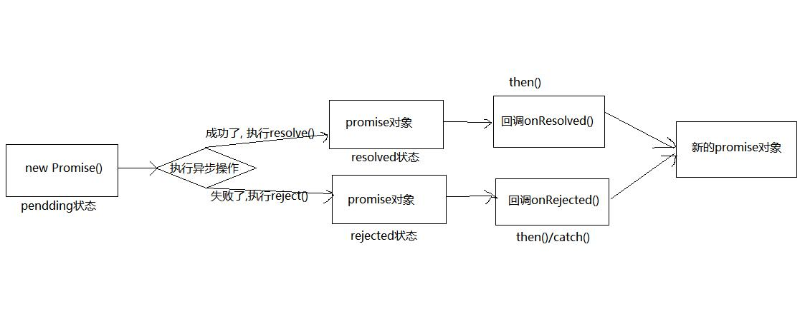

Promise 是什么?

1. 抽象表达:
Promise 是JS 中进行异步编程的新的解决方案(旧的是谁?纯回调函数)

2. 具体表达:
(1) 从语法上来说: Promise 是一个构造函数
(2) 从功能上来说: promise 对象用来封装一个异步操作并可以获取其结果

## 2.1.2. promise 的状态改变

1. pending 变为resolved
2. pending 变为rejected
说明: 只有这2 种, 且一个promise 对象只能改变一次
无论变为成功还是失败, 都会有一个结果数据
成功的结果数据一般称为vlaue, 失败的结果数据一般称为reason



```js
// 创建promise 对象
const p = new Promise((resolve, reject) => {
    // 执行异步操作
    setTimeout(() => {
        const time = Date.now() // 如果当前时间是奇数代表成功, 偶数代表失败
        // 如果成功了, 调用resolve(value)
        if (time%2===1) {
             resolve('成功的数据'+time)
        } else {
        // 如果失败了, 调用reject(reason)
             reject('失败数据'+time)
        }
    }, 1000)
})
// 通过promise 的then()指定成功和失败的回调函数
p.then(
    value => {
    	console.log('成功的回调, value:', value)
    },
    reason => {
    	console.log('失败的回调, reason:', reason)
    }
)

```


```js
/* 
  2.1. 回调地狱
  */
  doSomething(function(result) {
    doSomethingElse(result, function(newResult) {
      doThirdThing(newResult, function(finalResult) {
        console.log('Got the final result: ' + finalResult)
      }, failureCallback)
    }, failureCallback)
  }, failureCallback)

  /* 
  2.2. 使用promise的链式调用解决回调地狱
  */
  doSomething()
  .then(function(result) {
    return doSomethingElse(result)
  })
  .then(function(newResult) {
    return doThirdThing(newResult)
  })
  .then(function(finalResult) {
    console.log('Got the final result: ' + finalResult)
  })
  .catch(failureCallback)

  /* 
  2.3. async/await: 回调地狱的终极解决方案
  */
  async function request() {
    try {
      const result = await doSomething()
      const newResult = await doSomethingElse(result)
      const finalResult = await doThirdThing(newResult)
      console.log('Got the final result: ' + finalResult)
    } catch (error) {
      failureCallback(error)
    }
  }
```


# Promise

## [#](http://es.xiecheng.live/es6/promise.html#异步操作前置知识)异步操作前置知识

### [#](http://es.xiecheng.live/es6/promise.html#js是单线程的)JS是单线程的

就是同一个时间只能处理一个任务。就类似生活中的去超市排队结账，正常情况下，一位收银员只能为一位顾客结账，其他顾客需要在后面排队等候。

为什么 JS 是单线程的？作为浏览器脚本语言，JavaScript 的主要用途是与用户互动，以及操作 DOM 。这决定了它只能是单线程，否则会带来很复杂的同步问题。比如，假定 JavaScript同时有两个线程，一个线程在某个 DOM 节点上添加内容，另一个线程删除了这个节点，这时浏览器应该以哪个线程为准？

单线程就意味着，所有任务都需要排队，前一个任务结束，才能执行后一个任务。如果前一个任务耗时很长，那么后一个任务就不得不一直等待，于是乎，JS 设计者们把所有任分成两类，同步和异步。

- 同步：只有前一个任务执行完毕，才能执行后一个任务
- 异步：当同步任务执行到某个 WebAPI 时，就会触发异步操作，此时浏览器会单独开线程去处理这些异步任务。

```js
 // 同步
 const a = 2
 const b = 3
 console.log(a + b)

 // 异步
 setTimeout(() => {
     console.log(a + b)
 }, 1000)
```

请思考下面的输出结果是什么？

```js
console.log(1)
setTimeout(() => { // 异步任务，放入任务队列中
    console.log(2)
}, 0)
console.log(3)

// 1、3、2
```

下图说明了同步任务和异步任务的执行过程： 

### [#](http://es.xiecheng.live/es6/promise.html#ajax原理)Ajax原理

Ajax 即“Asynchronous Javascript And XML”（异步 JavaScript 和 XML），是指一种创建交互式、快速动态网页应用的网页开发技术，无需重新加载整个网页的情况下，能够更新部分网页的技术。通过在后台与服务器进行少量数据交换，Ajax 可以使网页实现异步更新。这意味着可以在不重新加载整个网页的情况下，对网页的某部分进行更新。

```js
// 创建 XMLHttpRequest 对象
const url = 'http://jsonplaceholder.typicode.com/users'
let xmlhttp
if (window.XMLHttpRequest) { // code for IE7+, Firefox, Chrome, Opera, Safari
    xmlhttp = new XMLHttpRequest()
} else { // code for IE6, IE5
    xmlhttp = new ActiveXObject("Microsoft.XMLHTTP")
}

// 发送请求
xmlhttp.open("GET", url, true)
xmlhttp.send()

// 服务端响应
xmlhttp.onreadystatechange = function() {
    if (xmlhttp.readyState == 4 && xmlhttp.status == 200) {
        //    console.log(xmlhttp.responseText)
        let obj = JSON.parse(xmlhttp.responseText)
        console.log(obj)
    }
}
```

### [#](http://es.xiecheng.live/es6/promise.html#callback-hell)Callback Hell

JavaScipt 中的许多操作都是异步的，我们把上面的Ajax封装成一个函数：

```js
function ajax(url, callback) {
    let xmlhttp
    if (window.XMLHttpRequest) { // code for IE7+, Firefox, Chrome, Opera, Safari
        xmlhttp = new XMLHttpRequest()
    } else { // code for IE6, IE5
        xmlhttp = new ActiveXObject("Microsoft.XMLHTTP")
    }
    // 发送请求
    xmlhttp.open("GET", url, true)
    xmlhttp.send()
    // 服务端响应
    xmlhttp.onreadystatechange = function() {
        if (xmlhttp.readyState == 4 && xmlhttp.status == 200) {
            //    console.log(xmlhttp.responseText)
            let obj = JSON.parse(xmlhttp.responseText)
            callback(obj)
        }
    }
}
```

我们在static文件夹下放入三个json文件：

a.json:

```json
{
    "a": "我是A"
}
```

b.json:

```json
{
    "b": "我是B"
}
```

c.json:

```json
{
    "c": "我是C"
}
```

我们可以像这样使用：

```js
// 加载并执行脚本
ajax('/static/a.json')
```

函数是异步调用的，因为操作不是立即完成的，而是之后才会完成。

```js
ajax('/static/a.json')
// 下面的代码不会等到ajax执行完才执行
// ...
```

这个过程大家并不陌生，可是如果在回调之后再回调呢？

```js
ajax('static/a.json', res => {
    console.log(res)
    ajax('static/b.json', res => {
        console.log(res)
        ajax('static/c.json', res => {
            console.log(res)
        })
    })
})
```

如果嵌套变多，代码层次就会变深，维护难度也随之增加。

这就被称为 “回调地狱” 或者“回调深渊”。

## [#](http://es.xiecheng.live/es6/promise.html#基本语法)基本语法

Promise 就是为了解决“回调地狱”问题的，它可以将异步操作的处理变得很优雅。回调地狱，代码难以维护， 常常第一个的函数的输出是第二个函数的输入这种现象promise可以支持多个并发的请求，获取并发请求中的数据这个promise可以解决异步的问题，本身不能说promise是异步的。

创建Promise实例。

```js
const promise = new Promise(function(resolve, reject) {
    // ... some code

    if ( /* 异步操作成功 */ ) {
        resolve(value)
    } else {
        reject(error)
    }
})
```

### excutor

Promise构造函数接受一个函数作为参数，该函数的两个参数分别是resolve和reject。它们是两个函数，由 JavaScript 引擎提供，不用自己部署。

- 处理结果正常的话，调用resolve(处理结果值)，将Promise对象的状态从“未完成”变为“成功”（即从 pending 变为 resolved），在异步操作成功时调用，并将异步操作的结果，作为参数传递出去
- 处理结果错误的话，调用reject(Error对象)，将Promise对象的状态从“未完成”变为“失败”（即从 pending 变为 rejected），在异步操作失败时调用，并将异步操作报出的错误，作为参数传递出去。

Promise实例生成以后，可以用then方法分别指定resolved状态和rejected状态的回调函数。

```js
promise.then(function(value) {
    // success
}, function(error) {
    // failure
})
```

TIP

实际上 Promise 用起来还是比较简单的，是不是可以动手试一试去封装自己业务中应用到的异步操作了（之前用回调写的）？

## promise的状态

是实例对象中的一个属性promiseState

在这里必须说明下 Promise 内部是有状态的(pending、fulfilled、rejected)，Promise 对象根据状态来确定执行哪个方法。Promise 在实例化的时候状态是默认 pending 的，当异步操作是完成的，状态会被修改为 fulfilled，如果异步操作遇到异常，状态会被修改为 rejected，可以通过下图来看下状态的走向：


注意

- 状态转化是单向的，不可逆转，
- 已经确定的状态（fulfilled/rejected）无法转回初始状态（pending），
- 而且只能是从 pending 到 fulfilled 或者 rejected

### 改变promise状态都三种方式

1. resolve
2. reject
3. throw

## promise的结果

实例对象的另一个属性 promiseResult

保存着对象成功/失败的结果

- resolve
- reject


## [#](http://es.xiecheng.live/es6/promise.html#promise-prototype-then)Promise.prototype.then()

**基本语法**

> promise.then(onFulfilled, onRejected)

**示例**

```js
var promise = new Promise(function(resolve, reject) {
    resolve('传递给then的值')
})
promise.then(function(value) {
    console.log(value)
}, function(error) {
    console.error(error)
})
```

这段代码创建一个 Promise 对象，定义了处理 onFulfilled 和 onRejected 的函数（handler），然后返回这个 Promise 对象。

这个 Promise 对象会在变为 resolve 或者 reject 的时候分别调用相应注册的回调函数。

- 当 handler 返回一个正常值的时候，这个值会传递给 Promise 对象的 onFulfilled 方法。
- 定义的 handler 中产生异常的时候，这个值则会传递给 Promise 对象的 onRejected 方法。

## 终止promise chain

返回一个pending状态的promise时，就永远不可能执行到then和catch（也就是resolve和reject）

```js
return new Promise(()=> {})
```


## [#](http://es.xiecheng.live/es6/promise.html#promise-prototype-catch)Promise.prototype.catch()

捕获异常是程序质量保障最基本的要求，可以使用 Promise 对象的 catch 方法来捕获异步操作过程中出现的任何异常。

**基本语法**

> p.catch(onRejected)

> p.catch(function(reason) {

// rejection })

**示例**

```js
function test() {
    return new Promise((resolve, reject) => {
        reject(new Error('es'))
    })
}

test().catch((e) => {
    console.log(e.message) // es
})
```

这个代码展示了如何使用 catch 捕获 Promise 对象中的异常，有的同学会问 catch 捕获的是 Promise 内部的 Error 还是 Reject？上面的示例既用了 reject 也用了 Error，到底是哪个触发的这个捕获呢？

```js
function test() {
    return new Promise((resolve, reject) => {
        throw new Error('wrong')
    })
}

test().catch((e) => {
    console.log(e.message) // wrong
})
```

这个代码对比着上个代码就能明显感受出来的，throw Error 和 reject 都触发了 catch 的捕获，而第一个用法中虽然也有 Error 但是它不是 throw，只是 reject 的参数是 Error 对象，换句话说 new Error 不会触发 catch，而是 reject。

注意

不建议在 Promise 内部使用 throw 来触发异常，而是使用 `reject(new Error())` 的方式来做，因为 throw 的方式并没有改变 Pronise 的状态

## [#](http://es.xiecheng.live/es6/promise.html#promise-resolve)Promise.resolve()

一般情况下我们都会使用 ```new Promise()` ``来创建 Promise 对象，但是除此之外我们也可以使用其他方法。

在这里，我们将会学习如何使用 Promise.resolve 和 Promise.reject 这两个方法。

静态方法 Promise.resolve(value) 可以认为是 new Promise() 方法的快捷方式。

比如 Promise.resolve(42) 可以认为是以下代码的语法糖。

```js
new Promise(function(resolve) {
    resolve(42)
})
```

在这段代码中的 resolve(42) 会让这个 Promise 对象立即进入确定（即resolved）状态，并将 42 传递给后面 then 里所指定的 onFulfilled 函数。

方法 Promise.resolve(value) 的返回值也是一个 Promise 对象，所以我们可以像下面那样接着对其返回值进行 .then 调用。

```js
Promise.resolve(42).then(function(value) {
    console.log(value)
})
```

Promise.resolve 作为 new Promise() 的快捷方式，在进行 Promise 对象的初始化或者编写测试代码的时候都非常方便。

### 参数值也可以是一个promise对象

当Promise.resolve()的参数为 promise对象 时，返回值的状态取决于传入的promise对象。

## [#](http://es.xiecheng.live/es6/promise.html#promise-reject)Promise.reject()

Promise.reject(error) 是和 Promise.resolve(value) 类似的静态方法，是 new Promise() 方法的快捷方式。

比如 Promise.reject(new Error("出错了")) 就是下面代码的语法糖形式。

```js
new Promise(function(resolve, reject) {
    reject(new Error('出错了'))
})
```

这段代码的功能是调用该Promise 对象通过then指定的 onRejected 函数，并将错误（Error）对象传递给这个 onRejected 函数。

```js
Promise.reject(new Error('BOOM!'))
```

### 不管参数值是什么，返回值的状态都是reject


## [#](http://es.xiecheng.live/es6/promise.html#promise-all)Promise.all()

**基本语法**

> Promise.all(promiseArray)

**示例**

```js
var p1 = Promise.resolve(1)
var p2 = Promise.resolve(2)
var p3 = Promise.resolve(3)
Promise.all([p1, p2, p3]).then(function(results) {
    console.log(results) // [1, 2, 3]
})
```

Promise.all 生成并返回一个新的 Promise 对象，所以它可以使用 Promise 实例的所有方法。参数传递promise数组中所有的 Promise 对象都变为resolve的时候，该方法才会返回， 新创建的 Promise 则会使用这些 promise 的值。

如果参数中的任何一个promise为reject的话，则整个Promise.all调用会立即终止，并返回一个reject的新的 Promise 对象。

由于参数数组中的每个元素都是由 Promise.resolve 包装（wrap）的，所以Promise.all 可以处理不同类型的 Promise 对象。

## [#](http://es.xiecheng.live/es6/promise.html#promise-race)Promise.race()

**基本语法**

> Promise.race(promiseArray)

**示例**

```js
var p1 = Promise.resolve(1)
var p2 = Promise.resolve(2)
var p3 = Promise.resolve(3)
Promise.race([p1, p2, p3]).then(function(value) {
    console.log(value) // 1
})
```

Promise.race 生成并返回一个新的 Promise 对象。

参数 promise 数组中的任何一个 Promise 对象如果变为 resolve 或者 reject 的话， 该函数就会返回，并使用这个 Promise 对象的值进行 resolve 或者 reject。

## [#](http://es.xiecheng.live/es6/promise.html#练习)练习

如何把前面Callback Hell的代码改写成promise的写法呢？

```js
function getPromise(url) {
    return new Promise((resolve, reject) => {
        ajax(url, res => {
            resolve(res)
        }, err => {
            reject(err)
        })
    })
}

getPromise('static/a.json')
    .then(res => {
        console.log(res)
        return getPromise('static/b.json')
    }).then(res => {
        console.log(res)
        return getPromise('static/c.json')
    }).then(res => {
        console.log(res)
    }).catch(err => {
        console.log(err)
    })
```

### [#](http://es.xiecheng.live/es6/promise.html#推荐阅读)推荐阅读

- [Promise](https://developer.mozilla.org/zh-CN/docs/Web/JavaScript/Reference/Global_Objects/Promise)
- [fetch](https://developer.mozilla.org/zh-CN/docs/Web/API/Fetch_API/Using_Fetch)
- [ES6 Promises in Depth](https://ponyfoo.com/articles/es6-promises-in-depth)
- [JavaScript Promises for Dummies](https://scotch.io/tutorials/javascript-promises-for-dummies)

## 问题

2、promise能否同时执行多个回调？

可以，只要状态发生改变了，指定的多个回调函数都会执行

3、改变状态与指定回调函数的顺序？谁先谁后？

不一定，1、若是同步任务，或者是改变状态的时机在指定回调的时机（异步指定）之前，那么就是先改变状态；2、若是异步任务，且不是1⃣️中的情况，则先指定再改变。


# async await

## async

- 返回值是一个promise对象，结果同
  1. 若返回值是一个非promise类型，则为fullfiled
  2. 若是promise类型，则为他的结果的返回值
  3. 抛出异常，为rejected
- 返回值的规则根then的回调是一样的

## await

- 表达式：
  	1.  右侧一般为promise对象，但也可是其他值
   	2.  若是promise，则await返回的是成功的值；如果是一个rejected的promise，则会【抛出异常】，需要通过try...catch...捕获失败结果
   	3.  若是非promise，则该值作为结果
- 必须写在async函数中
- 

# util

nodejs模块util

Util.promisify(funx) 传入错误优先的异步函数