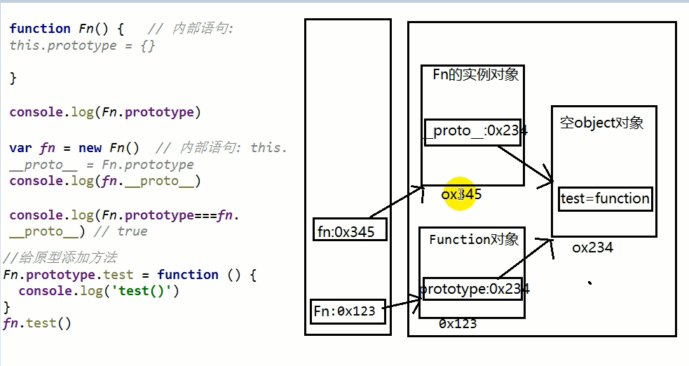
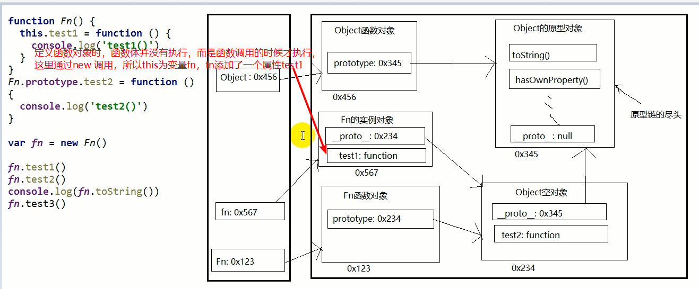
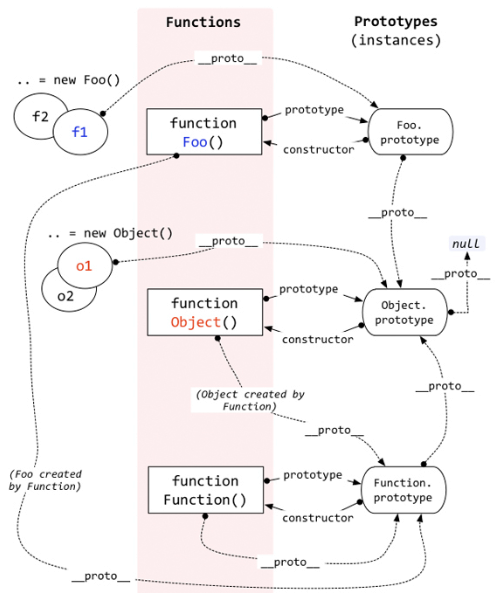
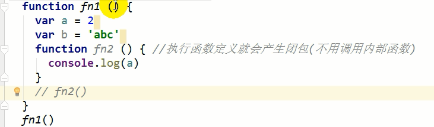
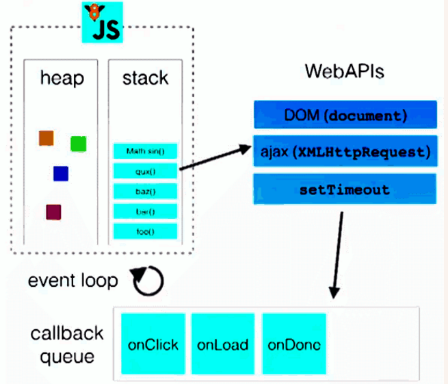

#数据类型

1. 分类(2大类)
  * 基本(值)类型
    * Number: 任意数值
    * String: 任意文本
    * Boolean: true/false
    * undefined: undefined
    * null: null
  * 对象(引用)类型
    * Object: 任意对象
    * Array: 特别的对象类型(下标/内部数据有序)
    * Function: 特别的对象类型(可执行)
2. **判断**
  * typeof:
    * 可以区别: 数值, 字符串, 布尔值, undefined, **function**
    * 不能区别: **null与对象, 一般对象与数组**
  * instanceof
    * 专门用来判断对象数据的类型: Object, Array与Function
  * ===
    * 可以判断: undefined和null

## 特殊

1. undefined与null的区别?
  * undefined代表没有赋值
  * null代表赋值了, 只是值为null
2. 什么时候给变量赋值为null呢?
  * var a = null //a将指向一个对象, 但对象此时还没有确定
  * a = null //让a指向的对象成为垃圾对象
3. 严格区别变量类型与数据类型?
  * js的变量本身是没有类型的, 变量的类型实际上是变量内存中数据的类型
  * 变量类型:
    * 基本类型: 保存基本类型数据的变量
    * 引用类型: 保存对象地址值的变量
  * 数据对象
    * 基本类型
    * 对象类型

> 为什么es将null作为一种类型而存在？而不是将其直接归结为对象的子类型？

  

## 内存

### 问题: 在js调用函数时传递变量参数时, 是值传递还是引用传递

  * 只有值传递, 没有引用传递, 传递的都是变量的值, 只是这个值可能是基本数据, 也可能是地址(引用)数据
  * 如果后一种看成是引用传递, 那就值传递和引用传递都可以有


### 问题: JS引擎如何管理内存?

  1. 内存生命周期
    1). 分配需要的内存
    2). 使用分配到的内存
    3). 不需要时将其释放/归还
  2. 释放内存
    * 局部变量（为执行函数分配的栈空间内存）: 函数执行完自动释放
    * 全局变量（存储对象的堆空间内存）: 当内存没有引用指向时, 对象成为垃圾对象, 垃圾回收器后面就会回收释放此内存


## 函数

3. 如何定义函数?
  * 函数声明
  * 表达式
  
  ```js
  function fn() {//声明
  }
  let fn2 = function () {//表达式
  }
  ```
  
  
  
4. 如何调用(执行)函数?
  * test()
  * new test()
  * obj.test()
  * test.call/apply(obj)

### 回调函数

1. 什么函数才是回调函数?
  * 你定义的
  * 你没有直接调用
  * 但最终它执行了(在特定条件或时刻)
2. 常见的回调函数?
  * DOM事件函数
  * 定时器函数

  * ajax回调函数
  * 生命周期回调函数


### IIFE

1. 理解
  * 全称: Immediately-Invoked Function Expression 立即调用函数表达式
  * 别名: 匿名函数自调用
2. 作用
  * 隐藏内部实现
  * 不污染外部命名空间

**不写分号时可以在函数前加分号。**

### 函数中的this

1. this是什么?
  * 一个关键字, 一个内置的引用变量
  * 在函数中都可以直接使用this
  * this代表调用函数的当前对象
  * 在定义函数时, this还没有确定, 只有在执行时才动态确定(绑定)的
  
2. 如何确定this的值?
  * test()  ：window
  * obj.test()：obj
  * new test()：新创建的对象
  * test.call(obj)：obj

  前置知识：本质上任何函数在执行时都是通过某个对象调用的

### 分号问题

1. js一条语句的后面可以不加分号
2. 是否加分号是编码风格问题, 没有应该不应该，只有你自己喜欢不喜欢
3. 在下面2种情况下不加分号会有问题
  * 小括号开头的前一条语句：如IIEF
  * 中方括号开头的前一条语句：如数组的变量`[1,2].forEach()`
4. 解决办法: 在行首加分号
5. 强有力的例子: vue.js库
6. 知乎热议: https://www.zhihu.com/question/20298345


### 函数的原型对象

1. 函数的prototype属性(图)
  * 每个函数都有一个**prototype**属性, 它默认指向一个Object空对象(即称为: 原型对象)
  * **原型对象中有一个属性constructor, 它指向函数对象**
2. 给原型对象添加属性(一般都是方法)
  * 作用: 函数的所有实例对象自动拥有原型中的属性(方法)


### 显式原型与隐式原型

#### 一个对象的隐式原型是其构造函数的显式原型

1. 每个函数function都有一个`prototype`，即显式原型

2. 每个实例对象都有一个`__proto__`，可称为隐式原型

3. 对象的隐式原型的值为其对应构造函数的显式原型的值

4. 内存结构(图)

   

5. #### 总结:

  * 函数的`prototype`属性: 在**定义函数时**自动添加的, 默认值是一个空Object对象
  * 对象的`__proto__`属性: **创建对象时**自动添加的, 默认值为构造函数的prototype属性值
  * 程序员能直接操作显式原型, 但不能直接操作隐式原型(ES6之前)

> Q定义函数时，会给函数对象添加一个`prototype`属性，那么这时候并没有调用该函数，此时的this是函数自身？？
>
> A定义函数会有一个变量，这个this就是指向该变量


### 原型链

1. 原型链(图解)
  * 访问一个对象的属性时，
    * 先在自身属性中查找，找到返回
    * 如果没有, 再沿着`__proto__`这条链向上查找, 找到返回
    * 如果最终没找到, 返回undefined
  * 别名: 隐式原型链
  * 作用: 查找对象的属性(方法)
  
  
  
2. 构造函数/原型/实体对象的关系(图解)

3. 构造函数/原型/实体对象的关系2(图解)




#### **所有函数的`__proto__`都指向Function.prototype，而后者是一个对象，其`__proto__`指向Object.prototype**

也即所有的函数对象的隐式原型都指向Function构造函数的显式原型。

Function = new Function();  

#### 总结

- 函数的显示原型指向的对象默认是空Object实例对象（但Object不满足）

- 所有函数都是Function的实例（包含Function）
- Object原型对象是原型链的尽头
- js原型继承是**基于对象的继承**（题外：java是基于类的继承）


### 原型链的属性

1. 读取对象的属性值时: 会自动到原型链中查找
2. 设置对象的属性值时: 不会查找原型链, 如果当前对象中没有此属性, 直接添加此属性并设置其值
3. 方法一般定义在原型中, 属性一般通过构造函数定义在对象本身上

### instanceof

1. instanceof是如何判断的?
  * 表达式: A instanceof B
  * 如果B函数的显式原型对象在A对象的原型链上, 返回true, 否则返回false
2. Function是通过new自己产生的实例

```js
//案例
  console.log(Object instanceof Function)
  console.log(Object instanceof Object)
  console.log(Function instanceof Object)
  console.log(Function instanceof Function)
```

#### 测试题

```js
/*
  测试题1
   */
  var A = function() {
  }
  A.prototype.n = 1

  var b = new A()

  A.prototype = {
    n: 2,
    m: 3
  }

  var c = new A()
  console.log(b.n, b.m, c.n, c.m)

  /*
   测试题2
   */
  var F = function(){};
  Object.prototype.a = function(){
    console.log('a()')
  };
  Function.prototype.b = function(){
    console.log('b()')
  };
  var f = new F();
  f.a()
  f.b()
  F.a()
  F.b()
//答案：1、 1 undefined 2 3
//2、f.b()报错，其他都ok
```


### 概念区分

- 执行函数定义
- 执行函数

执行函数定义说的是定义函数的时候，此时函数会自动添加prototype属性

# 上下文

## 变量提升与函数提升

#### 先执行变量提升，在执行函数提升，也即函数提升的优先级高于变量提升

1. 变量声明提升
  * 通过var定义(声明)的变量, 在定义语句之前就可以访问到
  * 值: undefined
2. 函数声明提升
  * 通过function声明的函数, 在之前就可以直接调用
  * 值: 函数定义(对象)
3. 问题: 变量提升和函数提升是如何产生的?

### 

## 执行上下文

代码分类(位置)
* 全局代码
* 函数代码

### 全局执行上下文

* 在执行全局代码前将window确定为全局执行上下文
* 对全局数据进行预处理
  * **var定义的**全局变量==>undefined, 添加为window的属性（非var定义的不会预处理）
  * function声明的全局函数==>赋值(fun), 添加为window的方法
  * this==>赋值(window)
* 开始执行全局代码


### 函数执行上下文

* 在调用函数, 准备执行函数体之前, 创建对应的函数执行上下文对象
* 对局部数据进行预处理
  * 形参变量`==>赋值(实参)==>`添加为执行上下文的属性
  * arguments==>赋值(实参列表), 添加为执行上下文的属性
  * var定义的局部变量==>undefined, 添加为执行上下文的属性
  * function声明的函数 ==>赋值(fun), 添加为执行上下文的方法
  * this==>赋值(调用函数的对象)
* 开始执行函数体代码

## 执行上下文栈

1. 在全局代码执行前, JS引擎就会创建一个栈来存储管理所有的执行上下文对象
2. 在全局执行上下文(window)确定后, 将其添加到栈中(压栈)
3. 在函数执行上下文创建后, 将其添加到栈中(压栈)
4. 在当前函数执行完后,将栈顶的对象移除(出栈)
5. 当所有的代码执行完后, 栈中只剩下window

```js
 /*
  测试题1: 先预处理变量, 后预处理函数
  */
  function a() {}
  var a;
  console.log(typeof a)


  /*
  测试题2: 变量预处理, in操作符
   */
  if (!(b in window)) {
    var b = 1;
  }
  console.log(b)

  /*
  测试题3: 预处理, 顺序执行
   */
  var c = 1
  function c(c) {
    console.log(c)
    var c = 3
  }
  c(2)
```


# 作用域

1. 理解
  * 就是一块"地盘", 一个代码段所在的区域
  * 它是静态的(相对于上下文对象), 在编写代码时就确定了
2. 分类
  * 全局作用域
  * 函数作用域
  * **没有块作用域(ES6有了)**
3. 作用
  * **隔离变量**，不同作用域下同名变量不会有冲突

## 作用域与执行上下文的区别

1. 区别1
  * 全局作用域之外，每个函数都会创建自己的作用域，作用域在函数定义时就已经确定了。而不是在函数调用时
  * 全局执行上下文环境是在全局作用域确定之后, js代码马上执行之前创建
  * 函数执行上下文环境是在调用函数时, 函数体代码执行之前创建
2. 区别2
  * 作用域是静态的, 只要函数定义好了就一直存在, 且不会再变化
  * 上下文环境是动态的, 调用函数时创建, 函数调用结束时上下文环境就会被释放
3. 联系
  * 上下文环境(对象)是从属于所在的作用域
  * 全局上下文环境==>全局作用域
  * 函数上下文环境==>对应的函数使用域

## 作用域链

1. 理解
  * 多个上下级关系的作用域形成的链, 它的方向是从下向上的(从内到外)
  * 查找变量时就是沿着作用域链来查找的
2. 查找一个变量的查找规则
  * 在当前作用域下的执行上下文中查找对应的属性, 如果有直接返回, 否则进入2
  * 在上一级作用域的执行上下文中查找对应的属性, 如果有直接返回, 否则进入3
  * 再次执行2的相同操作, 直到全局作用域, 如果还找不到就抛出找不到的异常


### 面试题

```js
/*
   问题: 结果输出多少?
   */
  var x = 10;
  function fn() {
    console.log(x);
  }
  function show(f) {
    var x = 20;
    f();
  }
  show(fn);
```

```js
  /*
   说说它们的输出情况
   */

  var fn = function () {
    console.log(fn)
  }
  fn()

  var obj = {
    fn2: function () {
      console.log(fn2)
      // console.log(this.fn2)
    }
  }
  obj.fn2()
```


# 闭包

1. 如何产生闭包?
  * 当一个嵌套的内部(子)函数引用了嵌套的外部(父)函数的变量(函数)时, 就产生了闭包
2. 闭包到底是什么?
  * 使用chrome调试查看
  * 理解一: 闭包是嵌套的内部函数(绝大部分人)
  * 理解二: 包含被引用变量(函数)的对象(极少数人)
  * 注意: 闭包存在于嵌套的内部函数中
3. **产生闭包的条件**?
  * 函数嵌套
  * 内部函数引用了外部函数的数据(变量/函数)
  * 执行函数定义（不必调用内部函数）



## 常见的闭包

1. 将函数作为另一个函数的返回值
2. 将函数作为实参传递给另一个函数调用

## 闭包的作用

1. 使用函数内部的变量在函数执行完后, 仍然存活在内存中(延长了局部变量的生命周期)
2. 让函数外部可以操作(读写)到函数内部的数据(变量/函数)

问题:
  1. 函数执行完后, 函数内部声明的局部变量是否还存在?

     **一般不存在；存在于闭包中的变量才可能存在。**

  2. 在函数外部能直接访问函数内部的局部变量吗?

     不能，但是可以通过闭包访问它。

## 闭包的生命周期

1. 产生: 在嵌套内部函数定义执行完时就产生了(不是在调用)
2. 死亡: 在嵌套的内部函数成为垃圾对象时


## 闭包的应用2 : 定义JS模块

  * 具有特定功能的js文件
  * 将所有的数据和功能都封装在一个函数内部(私有的)
  * 只向外暴露一个包含n个方法的对象或函数
  * 模块的使用者, 只需要通过模块暴露的对象调用方法来实现对应的功能


```js
/**
 * 自定义模块1
 */
function coolModule() {
  //私有的数据
  var msg = 'atguigu'
  var names = ['I', 'Love', 'you']

  //私有的操作数据的函数
  function doSomething() {
    console.log(msg.toUpperCase())
  }
  function doOtherthing() {
    console.log(names.join(' '))
  }

  //向外暴露包含多个方法的对象
  return {
    doSomething: doSomething,
    doOtherthing: doOtherthing
  }
}

/**
 * 自定义模块2
 */
(function (window) {
  //私有的数据
  var msg = 'atguigu'
  var names = ['I', 'Love', 'you']
  //操作数据的函数
  function a() {
    console.log(msg.toUpperCase())
  }
  function b() {
    console.log(names.join(' '))
  }

  window.coolModule2 =  {
    doSomething: a,
    doOtherthing: b
  }
})(window)
```

## 面试题

```js
 /*
   说说它们的输出情况
   */
  function fun(n, o) {
    console.log(o)
    return {
      fun: function (m) {
        return fun(m, n)
      }
    }
  }
  var a = fun(0)
  a.fun(1)
  a.fun(2)
  a.fun(3) //undefined,?,?,?

  var b = fun(0).fun(1).fun(2).fun(3) //undefined,?,?,?

  var c = fun(0).fun(1)
  c.fun(2)
  c.fun(3) //undefined,?,?,?
```


## 内存溢出与内存泄露

1. 内存溢出
  * 一种程序运行出现的错误
  * 当程序运行需要的内存超过了剩余的内存时, 就出抛出内存溢出的错误
2. 内存泄露
  * 占用的内存没有及时释放
  * 内存泄露积累多了就容易导致内存溢出
  * 常见的内存泄露:
    * 意外的全局变量
    * 没有及时清理的计时器或回调函数
    * 闭包


# 对象

## 继承模式

### 方式1: 原型链继承

  1. 套路
    1. 定义父类型构造函数
    2. 给父类型的原型添加方法
    3. 定义子类型的构造函数
    4. 创建父类型的对象赋值给子类型的原型
    5. 将子类型原型的构造属性设置为子类型
    6. 给子类型原型添加方法
    7. 创建子类型的对象: 可以调用父类型的方法
  2. 关键
    1. 子类型的原型为父类型的一个实例对象

 ```js
  function Parent(){}
  Parent.prototype.test = function(){};
  function Child(){}
  Child.prototype = new Parent(); // 子类型的原型指向父类型实例
  Child.prototype.constructor = Child//修正子类型原型指向的构造器
  var child = new Child(); //有test()
 ```

### 方式2: 借用构造函数继承(假的)

1. 套路:
  1. 定义父类型构造函数
  2. 定义子类型构造函数
  3. 在子类型构造函数中调用父类型构造
2. 关键:
  1. 在子类型构造函数中通用super()调用父类型构造函数

  ```js
  function Parent(xxx){this.xxx = xxx}
  Parent.prototype.test = function(){};
  function Child(xxx,yyy){
      Parent.call(this, xxx);//借用构造函数   this.Parent(xxx)
  }
  var child = new Child('a', 'b');  //child.xxx为'a', 但child没有test()
  ```

### 方式3: 原型链+借用构造函数的组合继承

1. 利用原型链实现对父类型对象的方法继承
2. 利用call()借用父类型构建函数初始化相同属性

  ```js
  function Parent(xxx){this.xxx = xxx}
  Parent.prototype.test = function(){};
  function Child(xxx,yyy){
      Parent.call(this, xxx);//借用构造函数   this.Parent(xxx)
  }
  Child.prototype = new Parent(); //得到test()
  var child = new Child(); //child.xxx为'a', 也有test()
  ```

## new一个对象背后做了些什么?

* 创建一个空对象
* 给对象设置`__proto__`, 值为构造函数对象的prototype属性值   `this.__proto__ = Fn.prototype`
* 执行构造函数体(给对象添加属性/方法)


# 线程与事件机制

## js是单线程的

1. 如何证明js执行是单线程的?
  * setTimeout()的回调函数是在主线程执行的
  * 定时器回调函数只有在运行栈中的代码全部执行完后才有可能执行
2. 为什么js要用单线程模式, 而不用多线程模式?
  * JavaScript的单线程，与它的用途有关。
  * 作为浏览器脚本语言，JavaScript的主要用途是与用户互动，以及操作DOM。
  * 这决定了它只能是单线程，否则会带来很复杂的同步问题

3. 代码的分类:
  * 初始化代码
  * 回调代码
4. js引擎执行代码的基本流程
  * 先执行初始化代码: 包含一些特别的代码
    * 设置定时器
    * 绑定监听
    * 发送ajax请求
  * 后面在某个时刻才会执行回调代码

## 线程与进程
* 进程:
  * 程序的一次执行, 它占有一片独有的内存空间
  * 可以通过windows任务管理器查看进程
* 线程:
  * 是进程内的一个独立执行单元
  * 是程序执行的一个完整流程
  * 是CPU的最小的调度单元
* 关系
  * 一个进程至少有一个线程(主)
  * 程序是在某个进程中的某个线程执行的

## 浏览器内核模块组成
1. 什么是浏览器内核?
   - 支持浏览器运行的最核心的程序
2. 不同的浏览器可能不太一样
   - Chrome, Safari: webkit
   - firefox: Gecko
   - IE: Trident
   - 360,搜狗等国内浏览器: Trident + webkit
3. 内核由很多模块组成

* 主线程
  * js引擎模块 : 负责js程序的编译与运行
  * html,css文档解析模块 : 负责页面文本的解析
  * DOM/CSS模块 : 负责dom/css在内存中的相关处理 
  * 布局和渲染模块 : 负责页面的布局和效果的绘制(内存中的对象)
* 分线程
  * 定时器模块 : 负责定时器的管理
  * DOM事件模块 : 负责事件的管理
  * 网络请求模块 : 负责Ajax请求

## js线程
* js是单线程执行的(回调函数也是在主线程)
* H5提出了实现多线程的方案: Web Workers
* 只能是主线程更新界面
* alert()会阻塞主线程的执行

## 定时器问题:
* 定时器并不真正完全定时
* 如果在主线程执行了一个长时间的操作, 可能导致延时才处理
  
## 事件处理机制(图)
* 代码分类
  * 初始化执行代码: 包含绑定dom事件监听, 设置定时器, 发送ajax请求的代码
  * 回调执行代码: 处理回调逻辑
* js引擎执行代码的基本流程: 
  * 初始化代码===>回调代码
* 模型的2个重要组成部分:
  * 事件管理模块
  * 回调队列
* 模型的运转流程
  * 执行初始化代码, 将事件回调函数交给对应模块管理
  * 当事件发生时, 管理模块会将回调函数及其数据添加到回调列队中
  * 只有当初始化代码执行完后(可能要一定时间), 才会遍历读取回调队列中的回调函数执行



> 问题：怎么保证定时器定时执行？
>
> 比如设置了两个定时器，t1 1000ms  t2 2000ms ，那么t2是在t1的1000ms之后执行的，这种顺序怎么保证呢？


## H5 Web Workers

* 可以让js在分线程执行
* Worker
  ```js
  var worker = new Worker('worker.js');
  worker.onMessage = function(event){event.data} : 用来接收另一个线程发送过来的数据的回调
  worker.postMessage(data1) : 向另一个线程发送数据
  ```
* 问题:
  * worker内代码不能操作DOM更新UI
  * 不是每个浏览器都支持这个新特性
  * 不能跨域加载JS

