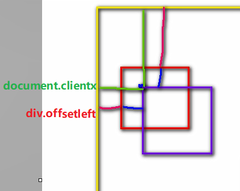

### 位置

- 可以写在onclick事件中，也可以写在href中，需要加prefix `javascript:`

```html
<button onclick="alert('hellow');">点击</button>

<a href="javascript:alert('hellow');">点击</a>
<a href="javascript:;"></a>

```

- 写到script标签中

```html
<script type="text/javascript"> </script>
```

- 写到外部文件：可以通过src属性引入外部文件，这样有缓存
```html
<script type="text/javascript"> </script>
```

### 标识符
- 标识符可以含有字母、数组、下划线、$
- js底层保存的标识符使用unicode编码，所以理论上来说所有的utf-8都可以作为标识符

#数据类型
##六种
String Number Boolean Null Undefined属于基本数据类型
Object属于引用数据类型
###Number
- 包括整数和浮点数
- Number.MAX_VALUE是最大值；Number.MIN_VALUE是大于0的最小值
- Infinity正无穷，typeof Infinity 返回Number；-Infinity是负无穷
- 
- NaN是一个特殊的数字，表示Not a Number，typeof NaN 返回Number
- 如果使用JS进行浮点运算，可能得到一个不精确的结果，所以**千万不要**使用JS进行对精确度要求比较高的运算	

###Null和Undefined
- Null（空值）类型的值只有一个，就是null
null这个值专门用来表示一个为空的对象
typeof检查一个null值时，会返回object

- Undefined（未定义）类型的值只有一个，就undefind
当声明一个变量，但是并不给变量赋值时，它的值就是undefined
typeof检查一个undefined时也会返回undefined

##强制类型转换
###将其他的数据类型转换为String
- #### 方式一：toString()方法

  *该方法不会影响到原变量，它会将转换的结果返回

  但是注意：null和undefined这两个值没有toString()方法，
  *如果调用他们的方法，会报错

- #### 方式二：调用String()函数

  并将被转换的数据作为参数传递给函数
  *使用String()函数做强制类型转换时，
  *对于Number和Boolean实际上就是调用的toString()方法
  *但是对于null和undefined，就不会调用toString()方法
  *它会将 null 直接转换为 "null"，将 undefined 直接转换为 "undefined"

###将其他的数据类型转换为Number
####转换方式一：使用Number()函数
*字符串 --> 数字
1.如果是纯数字的字符串，则直接将其转换为数字
2.如果字符串中有非数字的内容，则转换为NaN
3.如果字符串是一个空串或者是一个全是空格的字符串，则转换为0
* 布尔 --> 数字
true 转成 1
false 转成 0

- null --> 数字     0
- undefined --> 数字 NaN

####转换方式二：parseInt() 、parseFloat() 
这种方式专门用来对付字符串
parseInt() 把一个字符串转换为一个整数，parseInt()可以将一个字符串中的有效的整数内容去出来，然后转换为Number
parseFloat() 把一个字符串转换为一个浮点数，parseFloat()作用和parseInt()类似，不同的是它可以获得有效的小数

- 如果对非String使用parseInt()或parseFloat()，它会先将其转换为String然后在操作
例如parseInt(true)，会变成parseInt(“true”)，得到的结果是**NaN**

###其他进制
- 在js中，如果需要表示16进制的数字，则需要以0x开头
- 如果需要表示8进制的数字，则需要以0开头
- 如果要要表示2进制的数字，则需要以0b开头
但是不是所有的浏览器都支持
- 可以在parseInt()中传递一个第二个参数，来指定数字的进制

###将其他的数据类型转换为Boolean
####方式一：使用Boolean()函数
- 数字 ---> 布尔
除了0和NaN，其余的都是true
- 字符串 ---> 布尔
除了空串，其余的都是true
- null和undefined都会转换为false
- 对象也会转换为true

####方式二：！！隐式转换
可以为一个任意数据类型取两次反，来将其转换为布尔值，原理和Boolean()函数一样


##运算符
运算符也叫操作符
* 	通过运算符可以对一个或多个值进行运算,并获取运算结果
比如：typeof就是运算符，可以来获得一个值的类型
* 		它会将该值的类型**以字符串的形式**返回
* 		number string boolean undefined object

- 算数运算符
* 		当对非Number类型的值进行运算时，会将这些值转换为Number然后在运算
* 			任何值和NaN做运算都得NaN

- 任何值做- * /运算时都会自动转换为Number
我们可以利用这一特点做隐式的类型转换
可以通过为一个值 -0 *1 /1来将其转换为Number
原理和Number()函数一样，使用起来更加简单

- 一元运算符，只需要一个操作数
正号：正号不会对数字产生任何影响
负号：对数字进行负号的取反

- 对于非Number类型的值，它会将先转换为Number，然后在运算
可以对一个其他的数据类型**使用+,来将其转换为number**，它的原理和Number()函数一样

###&& || 非布尔值的情况
- 对于非布尔值进行与或运算时，会先将其转换为布尔值，然后再运算，并且返回原值
- 与运算：
如果第一个值为true，则必然返回第二个值
如果第一个值为false，则直接返回第一个值

- 或运算
如果第一个值为true，则直接返回第一个值
如果第一个值为false，则返回第二个值


###关系运算
* 非数值的情况
* 	- 对于非数值进行比较时，会将其转换为数字然后在比较
* 	- 如果符号两侧的值都是字符串时，不会将其转换为数字进行比较
* 		而会分别比较字符串中字符的Unicode编码
- 详细规则：
```js
任何值和NaN做任何比较都是false
//console.log(10 <= "hello"); //false
//console.log(true > false); //true

//console.log("1" < "5"); //true
//console.log("11" < "5"); //true

比较两个字符串时，比较的是字符串的字符编码
//console.log("a" < "b");//true
比较字符编码时是一位一位进行比较
如果两位一样，则比较下一位，所以借用它来对英文进行排序
//console.log("abc" < "bcd");//true
比较中文时没有意义
//console.log("戒" > "我"); //true
			
//如果比较的两个字符串型的数字，可能会得到不可预期的结果
注意：在比较两个字符串型的数字时，一定一定一定要转型
console.log("11123123123123123123" < +"5"); //true
```


### 相等运算符

相等运算符用来比较两个值是否相等，如果相等会返回true，否则返回false

####== 来做相等运算

当使用==来比较两个值时，如果值的类型不同，

则会自动进行类型转换，将其**转换为相同的类型**，然后再比较

- undefined 衍生自 null，所以这两个值做相等判断时，会返回true
- NaN不和任何值相等，包括他本身

```js
//console.log(a == 4); //false

//console.log("1" == 1); //true

转成数字后比较
//console.log(true == "1"); //true

//console.log(null == 0); //false

/*
	* undefined 衍生自 null
	* 	所以这两个值做相等判断时，会返回true
	*/
//console.log(undefined == null);

/*
	* NaN不和任何值相等，包括他本身
	*/
//console.log(NaN == NaN); //false
```


#### ===全等

用来判断两个值是否全等，它和相等类似，不同的是它不会做自动的类型转换

如果两个值的类型不同，直接返回false


# 对象

对象的分类：

- 1.内建对象

由ES标准中定义的对象，在任何的ES的实现中都可以使用

比如：Math String Number Boolean Function Object....


- 2.宿主对象

由JS的运行环境提供的对象，目前来讲主要指由浏览器提供的对象

比如 BOM DOM


- 3.自定义对象

由开发人员自己创建的对象


- 删除对象的属性

语法：`delete` 对象.属性名


###in 运算符

通过该运算符可以检查一个对象中是否含有指定的属性

 如果有则返回true，没有则返回false

语法：

"属性名" in 对象


###内存模型

JS中的变量都是保存到栈内存中的，

基本数据类型的值直接在栈内存中存储，

对象是保存到堆内存中的，每创建一个新的对象，就会在堆内存中开辟出一个新的空间


函数 function

函数也是一个对象，使用typeof检查一个函数对象时，会返回function

创建一个函数对象

//可以将要封装的代码以字符串的形式传递给构造函数

var fun = new Function("console.log('Hello 这是我的第一个函数');");


### 作用域

\*   - 作用域指一个变量的作用的范围

\*   - 在JS中一共有两种作用域：

#### 1.全局作用域

直接编写在script标签中的JS代码，都在全局作用域，全局作用域在页面打开时创建，在页面关闭时销毁

在全局作用域中有一个全局对象window，它代表的是一个浏览器的窗口，它由浏览器创建我们可以直接使用

- 在全局作用域中：

创建的变量都会作为**window对象**的属性保存

创建的函数都会作为window对象的方法保存


#### 2.函数作用域


###声明提前

#### 变量的声明提前


- 使用var关键字声明的变量，会在所有的代码**执行之前被声明（但是不会赋值）**， 

- 但是如果声明变量时**不使用var关键字，则变量不会被声明提前**

```js
##########不使用var关键字，则变量不会被声明提前
console.log(_a); _a=1;
VM119:1 Uncaught ReferenceError: _a is not defined
    at <anonymous>:1:13

###########使用var关键字，变量已声明，未赋值
console.log(window._b); var _b=3;
VM251:1 undefined
```


#### 函数的声明提前

- 使用函数声明形式创建的函数 function 函数(){}，它会**在所有的代码执行之前就被创建**，所以我们可以在函数声明前来调用函数

- 使用函数表达式创建的函数，不会被声明提前，所以不能在声明前调用  


##函数

###函数作用域 


- 当在函数作用域操作一个变量时，它会先在自身作用域中寻找，如果有就直接使用；如果没有则向上一级作用域中寻找，直到找到全局作用域；如果全局作用域中依然没有找到，则会报错ReferenceError

- 在函数中要访问全局变量可以使用window对象

### 函数的方法

#### call()和apply()

这两个方法都是函数对象的方法，需要通过函数对象来调用

当对函数调用call()和apply()都会调用函数执行

- 在调用call()和apply()可以将一个对象指定为第一个参数

 此时这个对象将会成为函数执行时的this

- call()方法可以将实参在对象之后依次传递

- apply()方法需要将实参封装到一个数组中统一传递


- this的情况：

1.以函数形式调用时，this永远都是window

2.以方法的形式调用时，this是调用方法的对象

3.以构造函数的形式调用时，this是新创建的那个对象

4.使用call和apply调用时，this是指定的那个对象

### arguments

在调用函数时，浏览器每次都会传递进两个隐含的参数：

1.函数的上下文对象 this

2.封装实参的对象 arguments

- arguments是一个类数组对象,它也可以通过索引来操作数据，也可以获取长度

```js
console.log(arguments instanceof Array);//false
console.log(Array.isArray(arguments));//false
```


- 在调用函数时，我们所传递的**实参**都会在arguments中保存

- `arguments.length`可以用来获取实参的长度

- 我们即使不定义形参，也可以通过arguments来使用实参，只不过比较麻烦。arguments[0] 表示第一个实参；arguments[1] 表示第二个实参 

- 它里边有一个属性叫做**callee**， 这个属性对应一个函数对象，就是当前正在指向的函数的对象

## this

解析器在调用函数每次都会向函数内部传递进一个隐含的参数,这个隐含的参数就是this，this指向的是一个对象，这个对象我们称为函数执行的 上下文对象。

- 根据函数的调用方式的不同，this会指向不同的对象

  1.以函数的形式调用时，this永远都是window

  2.以方法的形式调用时，this就是调用方法的那个对象

## 构造函数

\* 创建一个构造函数，专门用来创建Person对象的

构造函数就是一个普通的函数，创建方式和普通函数没有区别,

不同的是构造函数习惯上首字母大写

普通函数是直接调用，而构造函数需要使用new关键字来调用

- 构造函数的执行流程：

1.立刻创建一个新的对象

2.将新建的对象设置为函数中this,在构造函数中可以使用this来引用新建的对象

3.逐行执行函数中的代码

4.将新建的对象作为返回值返回


使用同一个构造函数创建的对象，我们称为一类对象，也将一个构造函数称为一个类。我们将通过一个构造函数创建的对象，称为是该类的实例


- this的情况：

1.当以函数的形式调用时，this是window

2.当以方法的形式调用时，谁调用方法this就是谁

3.当以构造函数的形式调用时，this就是新创建的那个对象


##原型 prototype

我们所创建的每一个函数，解析器都会向函数中添加一个属性**prototype**，这个属性对应着一个对象，这个对象就是我们所谓的原型对象

函数作为普通函数调用prototype没有任何作用

### `__proto__`

`__proto__`是对象的属性

**当函数以构造函数的形式调用时，它所创建的对象中都会有一个隐含的属性，指向该构造函数的原型对象，我们可以通过`__proto__`来访问该属性**

原型对象就相当于一个公共的区域，所有同一个类的实例都可以访问到这个原型对象，我们可以将对象中共有的内容，统一设置到原型对象中。


- 效果

 当我们访问对象的一个属性或方法时，它会先在对象自身中寻找，如果有则直接使用，  如果没有则会去原型对象中寻找，如果找到则直接使用
这样不用分别为每一个对象添加，也不会影响到全局作用域，就可以使每个对象都具有这些属性和方法了


### in与hasOwnProperty()

- 使用in检查对象中是否含有某个属性时，如果对象中没有但是原型中有，也会返回true

- 可以使用对象的 **`hasOwnProperty()`** 来检查对象自身中是否含有该属性
  使用该方法只有当对象自身中含有属性时，才会返回true

```js
console.log(mc.hasOwnProperty("age"));

console.log(mc.hasOwnProperty("hasOwnProperty"));

console.log(mc.__proto__.hasOwnProperty("hasOwnProperty"));

console.log(mc.__proto__.__proto__.hasOwnProperty("hasOwnProperty"));
```


### 原型对象也是对象

原型对象也是对象，所以它也有原型

- 当我们使用一个对象的属性或方法时，会现在自身中寻找，自身中如果有，则直接使用，

- 如果没有则去原型对象中寻找，如果原型对象中有，则使用，如果没有则去原型的原型中寻找,直到找到Object对象的原型，

- **Object对象的原型没有原型**，如果在Object原型中依然没有找到，则返回undefined


\* 内建对象

\* 宿主对象

\* 自定义对象

\* 

## 数组（Array）

数组也是一个对象

- Array.isArray(arguments)判断对象是否是数组

- 修改length

\*   如果修改的length大于原长度，则多出部分会空出来

\*  如果修改的length小于原长度，则多出的元素会被删除

- 向数组的最后一个位置添加元素

语法：数组[数组.length] = 值;

- 使用字面量和构造器创建数组的区别

```js
//使用构造函数创建数组时，也可以同时添加元素，将要添加的元素作文构造函数的参数传递

//元素之间使用,隔开
var arr2 = new Array(10,20,30);
//console.log(arr2);

//创建一个数组数组中只有一个元素10
arr = [10];

//创建一个长度为10的数组
arr2 = new Array(10);

//console.log(arr2.length);
```


- **数组中的元素可以是任意的数据类型**

arr = ["hello",1,true,null,undefined,function(){alert(1)}];


- 数组中也可以放数组，如下这种数组我们称为二维数组

arr = [[1,2,3],[3,4,5],[5,6,7]];

console.log(arr[1]);


#### reduce()

```
方法2：利用reduce方法遍历数组,reduce第一个参数是遍历需要执行的函数，第二个参数是item的初始值
33       var obj = {};
34     arr = arr.reduce(function(item, next) {
35       obj[next.key] ? '' : obj[next.key] = true && item.push(next);
36       return item;
37    }, []);
38    console.log(arr); // [{key: "01", value: "乐乐"},{key: "02", value: "博博"},{key: "03", value: "淘淘"},{key: "04", value: "哈哈"}]
```


#### push()

向数组的末尾添加一个或多个元素，并返回数组的新的长度

#### pop()

该方法可以删除数组的最后一个元素,并将被删除的元素作为返回值返回

#### unshift()

向数组开头添加一个或多个元素，并返回新的数组长度

向前边插入元素以后，其他的元素索引会依次调整

#### shift()

可以删除数组的第一个元素，并将被删除的元素作为返回值返回


forEach()方法需要一个函数作为参数，像这种函数，由我们创建但是不由我们调用的，我们称为回调函数

```

第一个参数，就是当前正在遍历的元素
第二个参数，就是当前正在遍历的元素的索引
第三个参数，就是正在遍历的数组
arr.forEach(function(value , index , obj){
				console.log(value);
			});
```

#### slice()

可以用来从数组**提取**指定元素

该方法**不会改变元素数组**，而是将截取到的元素封装到一个新数组中返回

- 参数：

1.截取开始的位置的索引,包含开始索引

2.截取结束的位置的索引,不包含结束索引

第二个参数可以省略不写,此时会截取从开始索引往后的所有元素

- 索引可以传递一个负值，如果传递一个负值，则从后往前计算

-1 倒数第一个

-2 倒数第二个

#### splice()

用于**删除**数组中的指定元素

使用splice()**会影响到原数组**，会将指定元素从原数组中删除,并将被删除的元素作为返回值返回

- 参数：

第一个，表示开始位置的索引

第二个，表示删除的数量

第三个及以后。。

可以传递一些新的元素，这些元素将会自动插入到开始位置索引前边

#### concat()

可以连接两个或多个数组，并将新的数组返回

- 不会对原数组产生影响

#### join()

该方法可以将数组转换为一个字符串

该方法不会对原数组产生影响，而是将转换后的字符串作为结果返回

在join()中可以指定一个字符串作为参数，这个字符串将会成为数组中元素的连接符

如果不指定连接符，则默认使用,作为连接符

#### reverse()

该方法用来反转数组（前边的去后边，后边的去前边）

- 会直接修改原数组

#### sort()

- 会影响原数组，默认会按照Unicode编码进行排序

即使对于纯数字的数组，也会按照Unicode编码来排序，

我们可以在sort()添加一个回调函数，来指定排序规则，回调函数中需要定义两个形参。如果返回一个**大于0的值，则元素会交换位置**；如果返回一个小于等于0的值，则元素位置不变


### Date对象

在JS中使用Date对象来表示一个时间


创建一个指定的时间对象

需要在构造函数中传递一个表示时间的字符串作为参数

日期的格式  月份/日/年 时:分:秒

var d2 = new Date("2/18/2011 11:10:30");

#### getDate()

\*   - 获取当前日期对象是几日

#### getDay()

- 获取当前日期对象时周几

- 会返回一个0-6的值，0 表示周日，1表示周一

#### getMonth()

- 获取当前时间对象的月份，会返回一个0-11的值

#### getFullYear()

获取当前日期对象的年份

#### getTime()

- 获取当前日期对象的时间戳

- 时间戳，指的是从格林威治标准时间的1970年1月1日，0时0分0秒，到当前日期所花费的毫秒数（1秒 = 1000毫秒）。计算机底层在保存时间时使用都是时间戳

//利用时间戳来测试代码的执行的性能

//获取当前的时间戳

var start = Date.now();


### Math

Math和其他的对象不同，它不是一个构造函数，它属于一个工具类不用创建对象，它里边封装了数学运算相关的属性和方法

abs()

可以用来计算一个数的绝对值

Math.ceil()

\*   - 可以对一个数进行向上取整，小数位只有有值就自动进1

Math.floor()

\*   - 可以对一个数进行向下取整，小数部分会被舍掉

Math.round()

\*   - 可以对一个数进行四舍五入取整

Math.random()

\*   - 可以用来生成一个0-1之间的随机数

\*   - 生成一个x-y之间的随机数：Math.round(Math.random()*(y-x)+x)

max() 

可以获取多个数中的最大值

min() 

可以获取多个数中的最小值

Math.pow(x,y)

\*   返回x的y次幂

Math.sqrt()

\*  用于对一个数进行开方运算

### 包装类

在JS中为我们提供了三个包装类，通过这三个包装类可以将基本数据类型的数据转换为对象

- String()

可以将基本数据类型字符串转换为String对象

- Number()

可以将基本数据类型的数字转换为Number对象

- Boolean()

可以将基本数据类型的布尔值转换为Boolean对象

但是注意：我们在实际应用中不会使用基本数据类型的对象，如果使用基本数据类型的对象，在做一些比较时可能会带来一些不可预期的结果

方法和属性只能添加给对象，不能添加给基本数据类型，当我们对一些基本数据类型的值去调用属性和方法时，

浏览器会**临时使用包装类将其转换为对象**，然后在调用对象的属性和方法，**调用完以后，再将其转换为基本数据类型**


###字符串的方法

charAt()

\*   - 可以返回字符串中指定位置的字符

\*   - 根据索引获取指定的字符   


charCodeAt()

\*   - 获取指定位置字符的字符编码（Unicode编码）

*/


String.formCharCode()

\*   - 可以根据字符编码去获取字符

*/

result = String.fromCharCode(0x2692);


concat()

\*   - 可以用来连接两个或多个字符串

\*   - 作用和+一样


\* indexof()

\*   - 该方法可以检索一个字符串中是否含有指定内容

\*   - 如果字符串中含有该内容，则会返回其第一次出现的索引

\*       如果没有找到指定的内容，则返回-1

\*   - 可以指定一个第二个参数，指定开始查找的位置


lastIndexOf();

\*   - 该方法的用法和indexOf()一样，

\*       不同的是indexOf是从前往后找，

\*       而lastIndexOf是从后往前找

\*   - 也可以指定开始查找的位置


slice()

\*   - 可以从字符串中截取指定的内容

\*   - 不会影响原字符串，而是将截取到内容返回

- 参数：

\*       第一个，开始位置的索引（包括开始位置）

\*       第二个，结束位置的索引（不包括结束位置）

\*           - 如果省略第二个参数，则会截取到后边所有的

\*       - 也可以传递一个负数作为参数，负数的话将会从后边计算

*/


substring()

\*   - 可以用来截取一个字符串，可以slice()类似

\*   - 参数：

\*       - 第一个：开始截取位置的索引（包括开始位置）

\*       - 第二个：结束位置的索引（不包括结束位置）

\*       - 不同的是这个方法不能接受负值作为参数，

\*           如果传递了一个负值，则默认使用0

\*       - 而且他还自动调整参数的位置，如果第二个参数小于第一个，则自动交换


substr()

\*   - 用来截取字符串

\*   - 参数：

\*       1.截取开始位置的索引

\*       2.截取的长度


split()

可以将一个字符串拆分为一个数组

- 参数：

需要一个字符串作为参数，将会根据该字符串去拆分数组

如果传递一个空串作为参数，则会将每个字符都拆分为数组中的一个元素


toUpperCase()

\*   - 将一个字符串转换为大写并返回


toLowerCase()

\*   -将一个字符串转换为小写并返回


# Dom

### 修改内联样式

通过JS修改元素的样式：

语法：元素.style.样式名 = 样式值

- 注意：如果CSS的样式名中含有-，

这种名称在JS中是不合法的比如background-color，需要将这种样式名修改为驼峰命名法，去掉-，然后将-后的字母大写

- 通过style属性设置和读取的都是内联样式，无法读取样式表中的样式

我们通过style属性设置的样式都是内联样式，而内联样式有较高的优先级，所以通过JS修改的样式往往会立即显示

但是如果在样式中写了!important，则此时样式会有最高的优先级，即使通过JS也不能覆盖该样式，此时将会导致JS修改样式失效，所以尽量不要为样式添加!important


### 获取元素的当前显示的样式

\*   语法：元素.currentStyle.样式名

\* 它可以用来读取当前元素正在显示的样式

\*   如果当前元素没有设置该样式，则获取它的默认值

\* 

- currentStyle只有IE浏览器支持，其他的浏览器都不支持

#### getComputedStyle()

在其他浏览器中可以使用

\*       getComputedStyle()这个方法来获取元素当前的样式

\*       这个方法是window的方法，可以直接使用

\* 需要两个参数

\*       第一个：要获取样式的元素

\*       第二个：可以传递一个伪元素，一般都传null

\* 该方法会返回一个对象，对象中封装了当前元素对应的样式

\*   可以通过对象.样式名来读取样式

\*   如果获取的样式没有设置，则会获取到真实的值，而不是默认值

\*   比如：没有设置width，它不会获取到auto，而是一个长度


- 但是该方法不支持IE8及以下的浏览器


- 通过currentStyle和getComputedStyle()读取到的样式都是只读的，不能修改，如果要修改必须通过style属性


### 其他样式操作属性


#### clientWidth、clientHeight

- 这两个属性可以获取元素的**可见宽度和高度**

- 这些属性都是不带px的，返回都是一个数字，可以直接进行计算

- 会获取元素宽度和高度，包括内容区和内边距

- 这些属性都是只读的，不能修改

//alert(box1.clientWidth);

//alert(box1.clientHeight);

//box1.clientHeight = 300;


#### offsetWidth、offsetHeight

- 获取元素的整个的宽度和高度，包括内容区、内边距和边框


#### offsetParent

- 可以用来获取当前元素的定位父元素

- 会获取到离当前元素最近的开启了定位的祖先元素，如果所有的祖先元素都没有开启定位，则返回body

var op = box1.offsetParent;


#### offsetLeft、offsetTop

- 当前元素相对于其定位父元素的水平偏移量

- 当前元素相对于其定位父元素的垂直偏移

//alert(box1.offsetLeft);


#### scrollWidth、scrollHeight

- 可以获取元素整个滚动区域的宽度和高度

//alert(box4.clientHeight);

//alert(box4.scrollWidth);

#### scrollLeft、scrollTop

- 可以获取水平滚动条滚动的距离

- 可以获取垂直滚动条滚动的距离

##### scrollHeight - scrollTop == clientHeight

当满足` 	 == clientHeight`，说明垂直滚动条滚动**到底**了

当满足`scrollWidth - scrollLeft == clientWidth`，说明水平滚动条滚动到底


## 事件

### 鼠标移动

/*

\* 当鼠标在areaDiv中移动时，在showMsg中来显示鼠标的坐标

*/

//获取两个div

var areaDiv = document.getElementById("areaDiv");

var showMsg = document.getElementById("showMsg");


#### onmousemove

- 该事件将会在鼠标在元素中移动时被触发

事件对象

- 当事件的响应函数被触发时，浏览器每次都会将一个事件对象作为实参传递进响应函数,在事件对象中封装了当前事件相关的一切信息，比如：鼠标的坐标  键盘哪个按键被按下  鼠标滚轮滚动的方向。。。
- 使用`event = event || window.event;`解决兼容性问题

```js
areaDiv.onmousemove = function(event){

/*
* 在IE8中，响应函数被处罚时，浏览器不会传递事件对象，
*   在IE8及以下的浏览器中，是将事件对象作为window对象的属性保存的
*/

/*if(!event){
event = window.event;
}*/

//解决事件对象的兼容性问题
event = event || window.event;

/*
* clientX可以获取鼠标指针的水平坐标
* cilentY可以获取鼠标指针的垂直坐标
*/

var x = event.clientX;
var y = event.clientY;
//alert("x = "+x + " , y = "+y);
//在showMsg中显示鼠标的坐标
showMsg.innerHTML = "x = "+x + " , y = "+y;

};  

```


#### 使div可以跟随鼠标移动

//获取滚动条滚动的距离

##### clientX和clientY

用于获取鼠标在当前的可见窗口的坐标
div的偏移量，是相对于整个页面的

##### pageX和pageY

可以获取鼠标相对于当前页面的坐标
但是这个两个属性在IE8中不支持，所以如果需要兼容IE8，则不要使用


chrome认为浏览器的滚动条是body的，可以通过body.scrollTop来获取

火狐等浏览器认为浏览器的滚动条是html的，

```js
var st = document.body.scrollTop || document.documentElement.scrollTop;

var sl = document.body.scrollLeft || document.documentElement.scrollLeft;

//var st = document.documentElement.scrollTop;

clientX和clientY
用于获取鼠标在当前的可见窗口的坐标
div的偏移量，是相对于整个页面的
pageX和pageY可以获取鼠标相对于当前页面的坐标
但是这个两个属性在IE8中不支持，所以如果需要兼容IE8，则不要使用
var left = event.clientX;
var　top = event.clientY;

//设置div的偏移量
box1.style.left = left + sl + "px";
box1.style.top = top + st + "px";
```


## 冒泡（Bubble）

所谓的冒泡指的就是事件的向上传导，当后代元素上的事件被触发时，其祖先元素的相同事件也会被触发

在开发中大部分情况冒泡都是有用的,如果不希望发生事件冒泡可以通过事件对象来取消冒泡

```js
s1.onclick = function(event){
	event = event || window.event;
	alert("我是span的单击响应函数");
	
	//取消冒泡
	//可以将事件对象的cancelBubble设置为true，即可取消冒泡
	event.cancelBubble = true;
};
```


### 委派

为每一个超链接都绑定一个单击响应函数，这里我们为每一个超链接都绑定了一个单击响应函数，这种操作比较麻烦，而且这些操作只能为已有的超链接设置事件，而新添加的超链接必须重新绑定

我们希望，只绑定一次事件，即可应用到多个的元素上，即使元素是后添加的我们可以尝试将其绑定给元素的共同的祖先元素


事件的委派

- 指将事件统一绑定给元素的共同的祖先元素，这样当后代元素上的事件触发时，会一直冒泡到祖先元素，从而通过祖先元素的响应函数来处理事件。

- 事件委派是利用了冒泡，通过委派可以减少事件绑定的次数，提高程序的性能

```js
//为ul绑定一个单击响应函数
u1.onclick = function(event){

event = event || window.event;

/*
\* target
\*   - event中的target表示的触发事件的对象
*/

if(event.target.className == "link"){
alert("我是ul的单击响应函数");
}

};
```


### 事件绑定

使用 对象.事件 = 函数 的形式绑定响应函数，

\*   它只能同时为一个元素的一个事件绑定一个响应函数，

\*   不能绑定多个，如果绑定了多个，则后边会覆盖掉前边的

#### addEventListener()

通过这个方法也可以为元素绑定响应函数

参数：

\*       1.事件的字符串，不要on

\*       2.回调函数，当事件触发时该函数会被调用

\*       3.是否在捕获阶段触发事件，需要一个布尔值，一般都传false

使用addEventListener()可以同时为一个元素的相同事件同时绑定多个响应函数， 这样当事件被触发时，响应函数将会按照函数的绑定顺序执行

这个方法不支持IE8及以下的浏览器

```js
btn01.onclick = function(){
	alert(1);
}

btn01.addEventListener("click",function(){
    alert(1);
},false);

btn01.addEventListener("click",function(){
	alert(2);
},false);
```


#### attachEvent()

- 在IE8中可以使用attachEvent()来绑定事件

\*  - 参数：

\*       1.事件的字符串，要on

\*       2.回调函数


\*  - 这个方法也可以同时为一个事件绑定多个处理函数，

\*       不同的是它是后绑定先执行，执行顺序和addEventListener()相反


#### 定义一个函数，用来为指定元素绑定响应函数


\* addEventListener()中的this，是绑定事件的对象

\* attachEvent()中的this，是window

\*  需要统一两个方法this


参数：

\*   obj 要绑定事件的对象

\*   eventStr 事件的字符串(不要on)

\*  callback 回调函数


**在回调函数中使用匿名函数来改变回调函数的调用者。**

```js
function bind(obj , eventStr , callback){
    if(obj.addEventListener){
        //大部分浏览器兼容的方式
        obj.addEventListener(eventStr , callback , false);
    }else{
        /*
        * this是谁由调用方式决定
        * callback.call(obj)
        */
        //IE8及以下
        obj.attachEvent("on"+eventStr , function(){
            //在匿名函数中调用回调函数
            callback.call(obj);
        });
    }
}
```


### 事件的传播

- 关于事件的传播网景公司和微软公司有不同的理解

微软公司认为事件应该是由内向外传播，也就是当事件触发时，应该先触发当前元素上的事件，然后再向当前元素的祖先元素上传播，也就说事件应该在冒泡阶段执行。

网景公司认为事件应该是由外向内传播的，也就是当前事件触发时，应该先触发当前元素的最外层的祖先元素的事件， 然后在向内传播给后代元素


- W3C综合了两个公司的方案，将事件传播分成了三个阶段

**1.捕获阶段**

​	在捕获阶段时从最外层的祖先元素，向目标元素进行事件的捕获，但是默认此时不会触发事件

**2.目标阶段**

​	事件捕获到目标元素，捕获结束开始在目标元素上触发事件

**3.冒泡阶段**


​	事件从目标元素向他的祖先元素传递，依次触发祖先元素上的事件

- 如果希望在捕获阶段就触发事件，可以将addEventListener()的第三个参数设置为true

一般情况下我们不会希望在捕获阶段触发事件，所以这个参数一般都是false


- IE8及以下的浏览器中没有捕获阶段


### 拉拽

拖拽box1元素

- 拖拽的流程

1.当鼠标在被拖拽元素上按下时，开始拖拽  onmousedown

2.当鼠标移动时被拖拽元素跟随鼠标移动 onmousemove

3.当鼠标松开时，被拖拽元素固定在当前位置   onmouseup



```js
/*
	* 提取一个专门用来设置拖拽的函数
	* 参数：开启拖拽的元素
	*/
function drag(obj){
	//当鼠标在被拖拽元素上按下时，开始拖拽  onmousedown
	obj.onmousedown = function(event){
		
		//设置box1捕获所有鼠标按下的事件
		/*
			* setCapture()
			* 	- 只有IE支持，但是在火狐中调用时不会报错，
			* 		而如果使用chrome调用，会报错
			*/
		/*if(box1.setCapture){
			box1.setCapture();
		}*/
		obj.setCapture && obj.setCapture();
		
		
		event = event || window.event;
		//div的偏移量 鼠标.clentX - 元素.offsetLeft
		//div的偏移量 鼠标.clentY - 元素.offsetTop
		var ol = event.clientX - obj.offsetLeft;
		var ot = event.clientY - obj.offsetTop;
		
		
		//为document绑定一个onmousemove事件
		document.onmousemove = function(event){
			event = event || window.event;
			//当鼠标移动时被拖拽元素跟随鼠标移动 onmousemove
			//获取鼠标的坐标
			var left = event.clientX - ol;
			var top = event.clientY - ot;
			
			//修改box1的位置
			obj.style.left = left+"px";
			obj.style.top = top+"px";
			
		};
		
		//为document绑定一个鼠标松开事件
		document.onmouseup = function(){
			//当鼠标松开时，被拖拽元素固定在当前位置	onmouseup
			//取消document的onmousemove事件
			document.onmousemove = null;
			//取消document的onmouseup事件
			document.onmouseup = null;
			//当鼠标松开时，取消对事件的捕获
			obj.releaseCapture && obj.releaseCapture();
		};
		
		/*
			* 当我们拖拽一个网页中的内容时，浏览器会默认去搜索引擎中搜索内容，
			* 	此时会导致拖拽功能的异常，这个是浏览器提供的默认行为，
			* 	如果不希望发生这个行为，则可以通过return false来取消默认行为
			* 
			* 但是这招对IE8不起作用
			*/
		return false;
		
	};
}
```

if(box1.setCapture){
			box1.setCapture();
		}
obj.setCapture && obj.setCapture();


### 滚轮事件

#### onmousewheel

鼠标滚轮滚动的事件，会在滚轮滚动时触发，

​    \*   但是火狐不支持该属性，在火狐中需要使用 DOMMouseScroll 来绑定滚动事件，注意该事件需要通过addEventListener()函数来绑定

event.wheelDelta 可以获取鼠标滚轮滚动的方向。向上滚 120   向下滚 -120。wheelDelta这个值我们不看大小，只看正负

\* 使用addEventListener()方法绑定响应函数，取消默认行为时不能使用return false

\* 需要使用event来取消默认行为event.preventDefault();

\* 但是IE8不支持event.preventDefault();这个玩意，如果直接调用会报错

```js
window.onload = function(){

    var box1 = document.getElementById("box1");

    box1.onmousewheel = function(event){
        event = event || window.event;
        /*
            * 当鼠标滚轮向下滚动时，box1变长
            * 	当滚轮向上滚动时，box1变短
            */
        //判断鼠标滚轮滚动的方向
        if(event.wheelDelta > 0 || event.detail < 0){
            //向上滚，box1变短
            box1.style.height = box1.clientHeight + 10 + "px";

        }else{
            //向下滚，box1变长
            box1.style.height = box1.clientHeight - 10 + "px";
        }

        /*
    * 使用addEventListener()方法绑定响应函数，取消默认行为时不能使用return false
    * 需要使用event来取消默认行为event.preventDefault();
    * 但是IE8不支持event.preventDefault();这个玩意，如果直接调用会报错
            */
        event.preventDefault && event.preventDefault();

        /*
            * 当滚轮滚动时，如果浏览器有滚动条，滚动条会随之滚动，
            * 这是浏览器的默认行为，如果不希望发生，则可以取消默认行为
            */
        return false;

    };
    //为火狐绑定滚轮事件
    bind(box1,"DOMMouseScroll",box1.onmousewheel);
};


function bind(obj , eventStr , callback){
    if(obj.addEventListener){
        //大部分浏览器兼容的方式
        obj.addEventListener(eventStr , callback , false);
    }else{
        /*
            * this是谁由调用方式决定
            * callback.call(obj)
            */
        //IE8及以下
        obj.attachEvent("on"+eventStr , function(){
            //在匿名函数中调用回调函数
            callback.call(obj);
        });
    }
}
```


###  键盘事件：

#### onkeydown

\*       - 按键被按下

\*       - 对于onkeydown来说如果一直按着某个按键不松手，则事件会一直触发

\*       - 当onkeydown连续触发时，第一次和第二次之间会间隔稍微长一点，其他的会非常的快

\*           这种设计是为了防止误操作的发生。

#### onkeyup

\*       - 按键被松开

\* 

\*  键盘事件一般都会绑定给一些可以获取到焦点的对象或者是document

- 可以通过keyCode来获取按键的编码

- 除了keyCode，事件对象中还提供了几个属性`altKey、ctrlKey、shiftKey`这个三个用来判断alt ctrl 和 shift是否被按下

 

```
//数字 48 - 57
//使文本框中不能输入数字
if(event.keyCode >= 48 && event.keyCode <= 57){
//在文本框中输入内容，属于onkeydown的默认行为
//如果在onkeydown中取消了默认行为，则输入的内容，不会出现在文本框中
return false;
}
```


# BOM

浏览器对象模型BOM可以使我们通过JS来操作浏览器


- BOM对象

## Window

代表的是整个浏览器的窗口，同时window也是网页中的全局对象

## Navigator

代表的当前浏览器的信息，通过该对象可以来识别不同的浏览器

- 由于历史原因，Navigator对象中的大部分属性都已经不能帮助我们识别浏览器了

- 一般我们只会使用`userAgent`来判断浏览器的信息，userAgent是一个字符串，这个字符串中包含有用来描述浏览器信息的内容，不同的浏览器会有不同的userAgent


```
\* 火狐的userAgent
\*   Mozilla/5.0 (Windows NT 6.1; WOW64; rv:50.0) Gecko/20100101 Firefox/50.0


\* Chrome的userAgent
\*  Mozilla/5.0 (Windows NT 6.1; Win64; x64) AppleWebKit/537.36 (KHTML, like Gecko) Chrome/52.0.2743.82 Safari/537.36


\* IE8
\*   Mozilla/4.0 (compatible; MSIE 8.0; Windows NT 6.1; WOW64; Trident/7.0; SLCC2; .NET CLR 2.0.50727; .NET CLR 3.5.30729; .NET CLR 3.0.30729; Media Center PC 6.0; .NET4.0C; .NET4.0E)


\* IE9
\*   Mozilla/5.0 (compatible; MSIE 9.0; Windows NT 6.1; WOW64; Trident/7.0; SLCC2; .NET CLR 2.0.50727; .NET CLR 3.5.30729; .NET CLR 3.0.30729; Media Center PC 6.0; .NET4.0C; .NET4.0E)


\* IE10
\*   Mozilla/5.0 (compatible; MSIE 10.0; Windows NT 6.1; WOW64; Trident/7.0; SLCC2; .NET CLR 2.0.50727; .NET CLR 3.5.30729; .NET CLR 3.0.30729; Media Center PC 6.0; .NET4.0C; .NET4.0E)


\* IE11
\*   Mozilla/5.0 (Windows NT 6.1; WOW64; Trident/7.0; SLCC2; .NET CLR 2.0.50727; .NET CLR 3.5.30729; .NET CLR 3.0.30729; Media Center PC 6.0; .NET4.0C; .NET4.0E; rv:11.0) like Gecko
```

- 在IE11中已经将微软和IE相关的标识都已经去除了，所以我们基本已经不能通过`UserAgent`来识别一个浏览器是否是IE了。可以通过`ActiveXObject`判断是否是edge浏览器，`ActiveXObject`是ie用来发ajax请求的对象

### 判断浏览器类型

```js
if(/firefox/i.test(ua)){
	alert("你是火狐！！！");
}else if(/chrome/i.test(ua)){
	alert("你是Chrome");
}else if(/msie/i.test(ua)){
	alert("你是IE浏览器~~~");
}else if("ActiveXObject" in window){
	alert("你是IE11，枪毙了你~~~");
}
```


## Location

代表当前浏览器的地址栏信息，通过Location可以获取地址栏信息，或者操作浏览器跳转页面

- 如果直接打印location，则可以获取到地址栏的信息（当前页面的完整路径）

//alert(location);

- 如果直接将location属性修改为一个完整的路径，或相对路径，则我们页面会自动跳转到该路径，并且会生成相应的历史记录


#### assign()

用来跳转到其他的页面，作用和直接修改location一样

//location.assign("http://www.baidu.com");


#### reload()

用于重新加载当前页面，作用和刷新按钮一样

- 如果在方法中传递一个true，作为参数，则会强制清空缓存刷新页面

//location.reload(true);


#### replace()

可以使用一个新的页面替换当前页面，调用完毕也会跳转页面

不会生成历史记录，不能使用回退按钮回退


## History

代表浏览器的历史记录，可以通过该对象来操作浏览器的历史记录

 由于隐私原因，该对象不能获取到具体的历史记录，只能操作浏览器向前或向后翻页

而且该操作只在当次访问时有效


length属性，可以获取到当成访问的链接数量

//alert(history.length);


#### back()

可以用来回退到上一个页面，作用和浏览器的回退按钮一样

//history.back();


#### forward()

可以跳转下一个页面，作用和浏览器的前进按钮一样

//history.forward()


#### go()

可以用来跳转到指定的页面

它需要一个整数作为参数

1:表示向前跳转一个页面 相当于forward()，2:表示向前跳转两个页面

-1:表示向后跳转一个页面，-2:表示向后跳转两个页面


## Screen

代表用户的屏幕的信息，通过该对象可以获取到用户的显示器的相关的信息

\* 

\* 

\*       这些BOM对象在浏览器中都是作为window对象的属性保存的，

\*           可以通过window对象来使用，也可以直接使用


## 定时器

#### setInterval()

定时调用。可以将一个函数，每隔一段时间执行一次

- 参数：

1.回调函数，该函数会每隔一段时间被调用一次

2.每次调用间隔的时间，单位是毫秒

- 返回值：

返回一个Number类型的数据，这个数字用来作为定时器的唯一标识

#### clearInterval()

如果参数是一个有效的定时器的标识，则停止对应的定时器
如果参数不是一个有效的标识，则什么也不做

```
//为btn01绑定一个单击响应函数
var btn01 = document.getElementById("btn01");
btn01.onclick = function(){
	
	/*
		* 目前，我们每点击一次按钮，就会开启一个定时器，
		* 	点击多次就会开启多个定时器，这就导致图片的切换速度过快，
		* 	并且我们只能关闭最后一次开启的定时器
		*/
	
	//在开启定时器之前，需要将当前元素上的其他定时器关闭
	clearInterval(timer);
	
	/*
		* 开启一个定时器，来自动切换图片
		*/
	timer = setInterval(function(){
		//使索引自增
		index++;
		//判断索引是否超过最大索引
		/*if(index >= imgArr.length){
			//则将index设置为0
			index = 0;
		}*/
		index %= imgArr.length;
		//修改img1的src属性
		img1.src = imgArr[index];
		
	},1000);
};

//为btn02绑定一个单击响应函数
var btn02 = document.getElementById("btn02");
btn02.onclick = function(){
	//点击按钮以后，停止图片的自动切换，关闭定时器
	/*
		* clearInterval()可以接收任意参数，
		* 	如果参数是一个有效的定时器的标识，则停止对应的定时器
		* 	如果参数不是一个有效的标识，则什么也不做
		*/
	clearInterval(timer);
	
};
```


### eval()

这个函数可以用来执行一段字符串形式的JS代码，并将执行结果返回

- 如果使用eval()执行的字符串中含有{},它会将{}当成是代码块

- 如果不希望将其当成代码块解析，则需要在字符串前后各加一个()


- eval()这个函数的功能很强大，可以直接执行一个字符串中的js代码，但是在开发中尽量不要使用，首先它的执行性能比较差，然后它还具有安全隐患