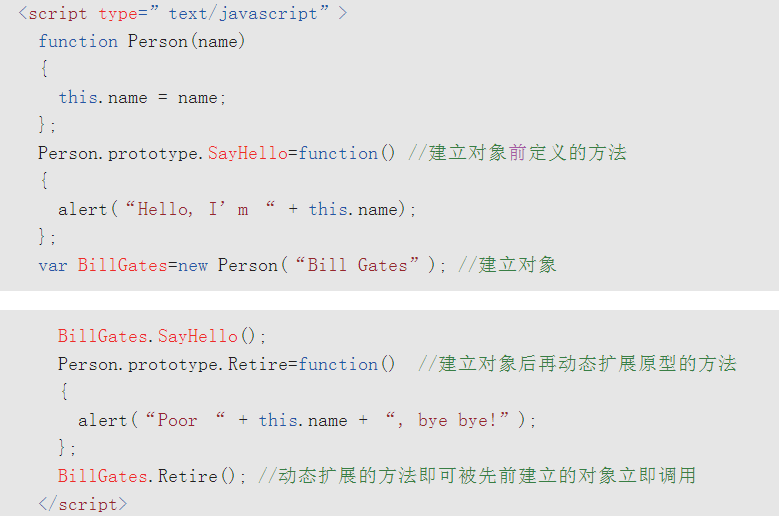

在JavaScript内部，对象的属性和方法追溯机制是通过所谓的**prototype链**来实现的。

当从一个对象那里读取属性或调用方法时，如果该对象自身不存在这样的属性或方法，就会去自己关联的prototype对象那里寻找；如果prototype没有，又会去prototype自己关联的前辈prototype那里寻找，直到找到或追溯过程结束为止。

**当用new操作符构造对象时，也会同时将构造函数的 prototype对象指派给新创建的对象，成为该对象内置的原型对象。**

在原型链的最末端，就是**Object构造函数prototype属性指向的那一个原型对象。**

这个原型对象是所有对象的最老祖先，这个老祖宗实现了诸如 toString等所有对象天生就该具有的方法。其他内置构造函数，如Function, Boolean, String, Date和RegExp等的prototype都是从这个老祖宗传承下来的，但他们各自又定义了自身的属性和方法，从而他们的子孙就表现出各自宗族的那些特征。

对象可以**掩盖**原型对象的那些属性和方法，一个构造函数原型对象也可以掩盖上层构造函数原型对象既有的属性和方法。这种掩盖其实只是在对象自己身上创建了新的属性和方法，只不过这些属性和方法与原型对象的那些同名而已。JavaScript就是用这简单的掩盖机制实现了对象的“多态”性，与静态对象语言的虚函数和重载(override)概念不谋而合。

我们可以随时给原型对象动态添加新的属性和方法，从而动态地扩展基类的功能特性。

