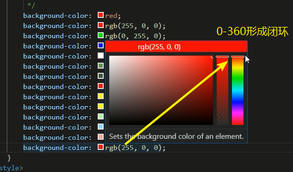
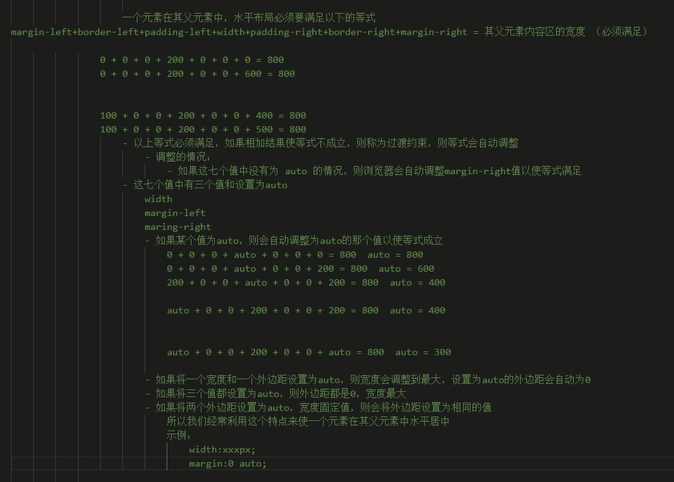
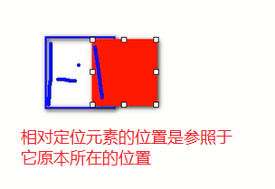
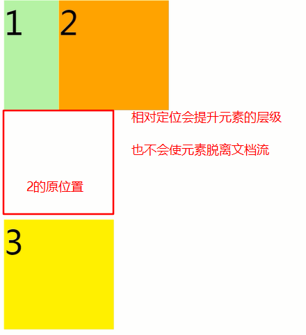
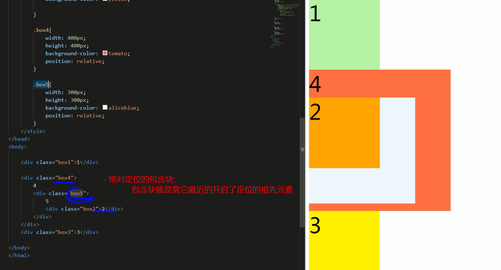

### 去除默认样式

```css

```


css属性：

	- 初始值
	- 是否可继承


#### 样式的继承

继承是发生在祖先后代之间的

并非所有的样式都会被继承

比如：背景相关的；布局相关的；不会被继承


#### 选择器的权重

| 选择器   | 优先级  |
| -------- | :------ |
| 内联     | 1,0,0,0 |
| id       | 0,1,0,0 |
| 类       | 0,0,1,0 |
| 元素     | 0,0,0,1 |
| 通配     | 0,0,0,0 |
| 继承样式 | 无      |

- 选择器累加不会超过其最大的优先级，如，类选择器优先级再高也不会超过id选择器
- 若优先级计算相等，则优先使用靠下的样式
- 可以在某一个样式后面加`!important`，则此时会获得最高的优先级


## 选择器

### 伪类

伪类（不存在的类，特殊的类）

\- 伪类用来描述一个元素的特殊状态

比如：第一个子元素、被点击的元素、鼠标移入的元素...

\- 伪类一般情况下都是使用:开头

:first-child 第一个子元素

:last-child 最后一个子元素

:nth-child() 选中第n个子元素

特殊值：

n 第n个 n的范围0到正无穷

2n 或 even 表示选中偶数位的元素

2n+1 或 odd 表示选中奇数位的元素


\- 以上这些伪类都是根据所有的子元素进行排序


:first-of-type

:last-of-type

:nth-of-type()

\- 这几个伪类的功能和上述的类似，不通点是他们是在同类型元素中进行排序


\- :not() 否定伪类

\- 将符合条件的元素从选择器中去除


### 单位

#### 长度单位

##### 像素

- 屏幕实际上是由一个个小点构成
- 不同屏幕的像素大小是不同的，越小越清晰
- 所以同样的200px在不同设备下显示效果不一样

##### 百分比

- 可以设置为相对于其父元素属性的百分比

##### em

- 相对于元素的字体大小来计算的
- 1em = 1 font-size 会根据字体大小的改变而改变

##### rem

- 相对于根元素（HTML） 的字体大小来计算的


#### 颜色单位

在css中可以使用颜色名设置各种颜色，如red、orange


##### RGB

- 通过3种颜色的不同浓度来配出颜色
- 每种颜色在0-255（0~100%）之间，根据光的颜色来计算颜色
- RGBA：A表示不透明度，
  - 1完全不透明  0完全透明  .5半透明

##### 十六进制RGB

- `#RGB`，浓度通过00-ff表示
- 若两位颜色重复，可以简写，如`#aabbcc -> #abc`


##### HSL

H色相（0-360）hul

S饱和度saturation，颜色浓度（0-100%）

L亮度lightness，（0-100%）




### 文档流 normal flow

- 网页是一个多层结构，一层摞着一层
- 通过css分别对每一层来设置样式
- 作为用户只能看到最顶上一层
- 这些层中，最底层是文档流，文档流是网页的基础
  - 创建的元素默认在文档流中排列
- 元素主要有两种状态
  - 在文档流中
  - 不在文档流中

####元素在文档流中的特点

- 块元素
  - 默认独占一行（自上而下垂直排列）
  - 默认宽度为父元素的全部
  - 默认高度是被内容撑开（子元素）
- 行内元素
  - 不独占一行，只占自身带下
  - 自左向右排列
  - 默认高宽都是被内容撑开 


### 盒模型

box model

- css将页面中的所有元素设置成矩形的盒子
- 盒子的构成
  - 内容区content
  - 内边距padding
  - 边框border
  - 外边距margin


####内容区

元素中所有子元素和文本内容都排列在内容区中

内容区的大小由width和height两个属性来设置

**width默认值为auto**

#### 边框

边框的大小会影响整个盒子的大小

边框属于盒子边缘，里边属于盒子内部，出了边框都是盒子的外部

要设置边框，至少设置3个样式

border-width 默认值一般3px，可以省略

border-color、若省略则使用color的颜色值

border-style 默认值是none表示无边框


#### 内边距

- 会影响盒子大小
- 背景颜色会延伸到内边距上


一个盒子的可见框大小，由内容区、内边距和边框共同决定，所以计算盒子的大小需要将这3个区域相加


#### 外边距

外边距不会影响盒子的可见框大小

但是外边距会影响盒子的位置

- 由于元素是自左向右排列，所以设置左上的外边距，会移动元素自身；而设置右下会移动其他元素
- 可以设置负值，会往正值的相反方向移动
- 默认情况下margin-right不会产生任何效果
- margin会影响盒子实际占用空间
- margin**默认值为0**


### 盒子的水平布局

一个元素在其父元素中，水平布局**必须满足**以下的等式

`margin-left + border-left +padding-left + width + padding-right + border-right + margin-right = 父元素的内容区宽度`

若等式不成立，则称为过渡约束，浏览器会使等式自动调整

- 若7个值中无auto，则自动调整margin-right以满足等式
- 若7个值中有3个值width、margin-left、margin-right 且设置了auto
  - 若某个值为auto，则自动调整auto的那个值以使等式成立
  - 若一个宽度和一个外边距都设置auto，那么宽度会调到最大，那个外边距为0
  - 若3个auto，则宽度最大，外边距为0
  - 若两个外边距为auto，宽度固定，则会平均分配外边距




### 垂直布局

默认情况下父元素的高度被内容撑开，父元素需要设置高度来固定。

子元素


### 行内元素的盒模型

行内元素不支持设置高度和宽度

行内元素可以设置padding，但是y方向的padding不会影响页面布局

行内元素可以设置border，但是y方向不会影响页面布局

行内元素可以设置margin，但是y方向不会影响页面布局


#### display属性

可以用来设置元素的显示类型

| 值               | 作用                                                 |
| ---------------- | ---------------------------------------------------- |
| inline           | 设为行内元素                                         |
| block            | 设为块元素                                           |
| **inline-block** | 设为行内块元素，既可以设置高宽，<br />又不会独占一行 |
| table            | 将元素设为表格                                       |
| none             | 隐藏元素，不占据位置                                 |

#### visibility

设置元素的显示状态

可选值

visible 默认值，元素在页面正常显示

hidden 隐藏不显示，但是依然占据位置


### 默认样式


#### 练习2


- 要让文字在父元素内垂直居中，只需将父元素的line-height设为和父元素height一样即可

- text-decoration: none; 去除字体下划线

### 基本盒子的大小

默认情况下，盒子的可见大小有内容区、内边距和边框共同决定、

#### box-sizing

box-sizing用来设置盒子尺寸的计算方式（设置height和width的作用。）

- content-box 默认值，宽高用来设置内容区大小。border和padding将在内容区外扩大。
- border-box 高宽用来设置整个可见框的大小，border和padding将向内容区挤压


####轮廓

outline :用来设置元素的轮廓线，用法同border。

轮廓与边框相比，轮廓不会影响可见框大小。

#### 阴影

box-shadow：用于设置元素的阴影效果，不会影响页面布局

默认情况下阴影在元素的正下方，与元素重合

第一个值 水平偏移量 设置阴影的水平位置 正值向右移动 负值向左移动

第二个值 垂直偏移量 设置阴影的水平位置 正值向下移动 负值向上移动

第三个值 阴影的模糊半径

第四个值 阴影的颜色

#### 圆角

border-radius: 用来设置圆角 圆角设置的圆的半径大小

border-top-left-radius

border-top-right-radius

border-bottom-left-radius

border-bottom-right-radius

若为两个值，可生成椭圆角。

border-radius 可以分别指定四个角的圆角

​                    四个值 左上 右上 右下 左下

​                    三个值 左上 右上/左下 右下 

​                    两个个值 左上/右下 右上/左下  

```css
/* 将元素设置为一个圆形 */

​            border-radius: 50%;
```


### 浮动

通过浮动可以使一个元素向其父元素的左侧或右侧移动

​    使用 float 属性来设置于元素的浮动

​        可选值：

​            none 默认值 ，元素不浮动

​            left 元素向左浮动

​            right 元素向右浮动


- 注意，**元素设置浮动以后，水平布局的等式便不需要强制成立**

​        元素设置浮动以后，会完全从文档流中脱离，不再占用文档流的位置，

​            所以元素下边的还在文档流中的元素会自动向上移动

#### 浮动的特点：

​    1、浮动元素会完全脱离文档流，不再占据文档流中的位置

​    2、设置浮动以后元素会向父元素的左侧或右侧移动，

​    3、浮动元素默认不会从父元素中移出

​    4、浮动元素向左或向右移动时，不会超过它前边的其他浮动元素

​    5、如果浮动元素的上边是一个没有浮动的块元素，则浮动元素无法上移

​    6、浮动元素不会超过它上边的浮动的兄弟元素，最多最多就是和它一样高


#### 简单总结：

​    浮动目前来讲它的主要作用就是让页面中的元素可以水平排列，

​        通过浮动可以制作一些水平方向的布局

#### 浮动的其他特点

##### 浮动元素不会盖住文字

- **浮动元素不会盖住文字，文字会自动环绕在浮动元素的周围**， 所以我们可以利用浮动来设置文字环绕图片的效果

 元素设置浮动以后，将会从文档流中脱离，从文档流中脱离后，元素的一些特点也会发生变化


**脱离文档流的特点：**

- 块元素：

  ​    1、块元素不在独占页面的一行

  ​    2、脱离文档流以后，块元素的宽度和高度默认都被内容撑开

- 行内元素：

  ​    行内元素脱离文档流以后会变成块元素，特点和块元素一样

- 总结：**脱离文档流以后，不需要再区分块和行内了**


#### BFC(Block Formatting Context) 块级格式化环境

##### 高度塌陷的问题：

在浮动布局中，父元素的高度默认是被子元素撑开的，当子元素浮动后，其会完全脱离文档流，子元素从文档流中脱离将会无法撑起父元素的高度，**导致父元素的高度丢失**

父元素高度丢失以后，其下的元素会自动上移，导致页面的布局混乱

所以高度塌陷是浮动布局中比较常见的一个问题，这个问题我们必须要进行处理！


- BFC是一个CSS中的一个隐含的属性，可以为一个元素开启BFC

​    开启BFC该元素会变成一个独立的布局区域

- 元素开启BFC后的特点：

​    1.开启BFC的元素不会被浮动元素所覆盖

​    2.开启BFC的元素子元素和父元素外边距不会重叠

​    3.开启BFC的元素可以包含浮动的子元素


- 可以通过一些特殊方式来开启元素的BFC：

​    1、设置元素的浮动（不推荐）

​    2、将元素设置为行内块元素（不推荐）

​    3、将元素的overflow设置为一个非visible的值

​        \- 常用的方式 为元素设置 overflow:hidden开启其BFC 以使其可以包含浮动元素


### 定位

定位（position）

\- 定位是一种更加高级的布局手段

\- 通过定位可以将元素摆放到页面的任意位置

\- 使用position属性来设置定位

​    可选值：

​        static 默认值，元素是静止的没有开启定位

​        relative 开启元素的相对定位

​        absolute 开启元素的绝对定位

​        fixed 开启元素的固定定位

​        sticky 开启元素的粘滞定位


#### 相对定位：

​    \- 当元素的position属性值设置为relative时则开启了元素的相对定位

​    \- 相对定位的特点：

​        1.元素开启相对定位以后，如果不设置偏移量元素不会发生任何的变化

​        2.相对定位是**参照于元素在文档流中的位置进行定位的**



​        3.相对定位会提升元素的层级



​        4.相对定位不会使元素脱离文档流

​        5.相对定位不会改变元素的性质块还是块，行内还是行内


\- 偏移量（offset）

​    \- 当元素开启了定位以后，可以通过偏移量来设置元素的位置

​        top

​            \- 定位元素和定位位置上边的距离

​        bottom

​            \- 定位元素和定位位置下边的距离


​            \- 定位元素垂直方向的位置由top和bottom两个属性来控制

​                通常情况下我们只会使用其中一

​            \- top值越大，定位元素越向下移动

​            \- bottom值越大，定位元素越向上移动

​        left

​            \- 定位元素和定位位置的左侧距离

​        right

​            \- 定位元素和定位位置的右侧距离


​            \- 定位元素水平方向的位置由left和right两个属性控制

​                通常情况下只会使用一个

​            \- left越大元素越靠右

​            \- right越大元素越靠左


#### 绝对定位

\- 当元素的position属性值设置为absolute时，则开启了元素的绝对定位

\- 绝对定位的特点：

​    1.开启绝对定位后，如果不设置偏移量元素的位置不会发生变化

​    2.开启绝对定位后，元素会从文档流中脱离

​    3.绝对定位会改变元素的性质，行内变成块，块的宽高被内容撑开

​    4.绝对定位会使元素提升一个层级

​    5.绝对定位元素是相对于其包含块进行定位的

##### 包含块( containing block )

​        \- 正常情况下：

​            包含块就是离当前元素最近的祖先块元素

```html
<div> <div></div> </div>
            <div><span><em>hello</em></span></div>
```


​        \- 绝对定位的包含块:

​            包含块就是离它最近的开启了定位的祖先元素，

​                如果所有的祖先元素都没有开启定位则根元素就是它的包含块

​        		\- html（根元素、初始包含块） 




#### 固定定位：

\- 将元素的position属性设置为fixed则开启了元素的固定定位

\- 固定定位也是一种绝对定位，所以固定定位的大部分特点都和绝对定位一样

​    唯一不同的是固定定位**永远参照于浏览器的视口(viewport)进行定位**

​    固定定位的元素不会随网页的滚动条滚动


#### 粘滞定位

-  兼容性差，不推荐使用。

\- 当元素的position属性设置为sticky时则开启了元素的粘滞定位

\- 粘滞定位和相对定位的特点基本一致，

​    不同的是粘滞定位可以在元素到达某个位置时将其固定（相对于包含块）

#### 绝对定位元素的布局

水平布局

```
left + margin-left + border-left + padding-left + width + padding-right + border-right + margin-right + right = 包含块的内容区的宽度
```


\- 当我们开启了绝对定位后:

**水平方向的布局**等式就需要添加left 和 right 两个值

​    此时规则和之前一样只是多添加了两个值：

​        当发生**过度约束**：

​            如果9个值中**没有 auto 则自动调整right**值以使等式满足

​            如果有auto，则自动调整auto的值以使等式满足


​    \- 可设置auto的值

​        margin width left right


​    \- 因为**left 和 right的值默认是auto**，所以如果不指定left和right

​        则等式不满足时，会自动调整这两个值


**垂直方向布局**的等式的也必须要满足

​    top + margin-top/bottom + padding-top/bottom + border-top/bot

####元素的层级

对于开启了定位元素，可以通过**z-index**属性来指定元素的层级

​    z-index需要一个整数作为参数，值越大元素的层级越高

​        元素的**层级越高越优先显示**


​    如果元素的**层级一样，则优先显示靠下的元素**


​    祖先的元素的层级再高也不会盖住后代元素


###字体相关的样式 

color 用来设置字体颜色

font-size 字体的大小

​    和font-size相关的单位

​    em 相当于当前元素的一个font-size

​    rem 相对于根元素的一个font-size

font-family 字体族（字体的格式）

​    可选值：

​        serif  衬线字体

​        sans-serif 非衬线字体

​        monospace 等宽字体:字符的宽度一样，用于对齐

​            \- 指定字体的类别，浏览器会自动使用该类别下的字体


​    \- font-family 可以同时指定多个字体，多个字体间使用,隔开

​        字体生效时优先使用第一个，第一个无法使用则使用第二个 以此类推


​        Microsoft YaHei,Heiti SC,tahoma,arial,Hiragino Sans GB,"\5B8B\4F53


```css
font-face可以将服务器中的字体直接提供给用户去使用 
    问题：
        1.加载速度
        2.版权
        3.字体格式

*/
@font-face {
        /* 指定字体的名字 */
    font-family:'myfont' ;
    /* 服务器中字体的路径 */
    src: url('./font/ZCOOLKuaiLe-Regular.ttf') format("truetype");
}
```

## 字体

###行高（line height）

\- 行高指的是文字占有的实际高度

\- 可以通过line-height来设置行高

​    行高可以直接指定一个大小（px em）

​    也可以直接为行高设置一个整数，默认倍数1.33

​        如果是一个整数的话，行高将会是字体的指定的倍数

\- 行高经常还用来设置文字的行间距

#### 行高 = 字体大小 + 行间距 


###字体框

\- 字体框就是字体存在的格子，设置**font-size实际上就是在设置字体框的高度**


行高会在字体框的上下平均分配

```css
 /* 可以将行高设置为和高度一样的值，使单行文字在一个元素中垂直居中 */

​            line-height: 200px;
```


### 字体的简写属性

font 可以设置字体相关的所有属性

语法：

**font**: 字体大小/行高 字体族

​    行高 可以省略不写 如果不写使用默认值

​	**省略不写的属性，则会使用normal**

```css
 font: 50px/2  微软雅黑, 'Times New Roman', Times, serif; 
/*省略不写的属性，则会使用normal*/
font: normal normal 50px/2  微软雅黑, 'Times New Roman', Times, serif; 
font: bold italic 50px/2  微软雅黑, 'Times New Roman', Times, serif;
```


**font-weight** 字重 字体的加粗 

可选值：

​    normal 默认值 不加粗

​    bold 加粗

​    100-900 九个级别（没什么用）


**font-style** 字体的风格

​    normal 正常的

​    italic 斜体

### 文本样式

#### text-align

**text-align** 文本的水平对齐

可选值：

​    left 左侧对齐

​    right 右对齐

​    center 居中对齐

​    justify 两端对齐

#### vertical-align

**vertical-align** 设置元素垂直对齐的方式

可选值：

​    baseline 默认值 基线对齐

​    top 顶部对齐

​    bottom 底部对齐

​    middle 居中对齐

##### 图片img，是替换元素

- **对于图片img，是替换元素**，默认会以基线对齐，可以调整其vertical-align改变图片的位置。

#### text-decoration 

text-decoration 设置文本修饰

可选值：

​    none 什么都没有

​    underline 下划线

​    line-through 删除线

​    overline 上划线

```css
/* text-decoration: overline; */

ie不支持以下样式
/* text-decoration: underline red dotted; */
```

#### white-space

white-space 设置网页如何处理空白

可选值：

​    normal 正常

​    nowrap 不换行

​    pre 保留空白

```css
.box2{
    width: 200px;
    white-space: nowrap;
    overflow: hidden;
    text-overflow: ellipsis;/*文本溢出时用省略号  */
}
```

## 背景

### background-image 

设置背景图片 

\- 可以同时设置背景图片和背景颜色，这样背景颜色将会成为图片的背景色

\- 如果背景的图片小于元素，则背景图片会自动在元素中平铺将元素铺满

\- 如果背景的图片大于元素，将会一个部分背景无法完全显示

\- 如果背景图片和元素一样大，则会直接正常显示


### background-repeat 

用来设置背景的重复方式

可选值：

repeat 默认值 ， 背景会沿着x轴 y轴双方向重复

repeat-x 沿着x轴方向重复

repeat-y 沿着y轴方向重复

no-repeat 背景图片不重复


### background-position 

- 用来设置背景图片的位置

设置方式：

通过 top left right bottom center 几个表示方位的词来设置背景图片的位置

使用方位词时必须要同时指定两个值，如果只写一个则第二个默认就是center


通过偏移量来指定背景图片的位置：

水平方向的偏移量 垂直方向变量


### background-origin 

背景图片的偏移量计算的原点

padding-box 默认值，background-position从内边距处开始计算

content-box 背景图片的偏移量从内容区处计算

border-box 背景图片的变量从边框处开始计算


### background-clip 

设置背景的范围 

可选值：

border-box 默认值，背景会出现在边框的下边

padding-box 背景不会出现在边框，只出现在内容区和内边距

content-box 背景只会出现在内容区


### background-size 

设置背景图片的大小

第一个值表示宽度 

第二个值表示高度

\- 如果只写一个，则第二个值默认是 auto

cover 图片的比例不变，将元素铺满

contain 图片比例不变，将图片在元素中完整显示


### background-attachment

\- 背景图片是否跟随元素移动

\- 可选值：

scroll 默认值 背景图片会跟随元素移动

fixed 背景会固定在页面中，不会随元素移动


### backgound 

背景相关的简写属性，所有背景相关的样式都可以通过该样式来设置

并且该样式没有顺序要求，也没有哪个属性是必须写的

注意：

- background-size必须写在background-position的后边，并且使用/隔开

background-position/background-size

- background-origin background-clip 两个样式 ，orgin要在clip的前边


### 雪碧图

解决图片闪烁的问题：

可以将多个小图片统一保存到一个大图片中，然后通过调整background-position来显示的图片

这样图片会同时加载到网页中 就可以有效的避免出现闪烁的问题

这个技术在网页中应用十分广泛，被称为CSS-Sprite，这种图我们称为雪碧图


雪碧图的使用步骤：

1.先确定要使用的图标

2.测量图标的大小

3.根据测量结果创建一个元素

4.将雪碧图设置为元素的背景图片

5.设置一个偏移量以显示正确的图片


雪碧图的特点：

一次性将多个图片加载进页面，降低请求的次数，加快访问速度，提升用户的体验


### 渐变

通过渐变可以设置一些复杂的背景颜色，可以实现从一个颜色向其他颜色过渡的效果

！！渐变是图片，需要通过**background-image**来设置


线性渐变，颜色沿着一条直线发生变化

linear-gradient()


linear-gradient(red,yellow) 红色在开头，黄色在结尾，中间是过渡区域

\- 线性渐变的开头，我们可以指定一个渐变的方向

to left

to right

to bottom

to top

deg deg表示度数

turn 表示圈


\- 渐变可以同时指定多个颜色，多个颜色默认情况下平均分布，

也可以手动指定渐变的分布情况


repeating-linear-gradient() 可以平铺的线性渐变

*/


```
/* background-image: linear-gradient(red,yellow,#bfa,orange); */

/* background-image: linear-gradient(red 50px,yellow 100px, green 120px, orange 200px); */

background-image: repeating-linear-gradient(to right ,red, yellow 50px);


```


### 径向渐变

**radial-gradient()**

 径向渐变(放射性的效果) 


默认情况下径向渐变的形状根据元素的形状来计算的

正方形 --> 圆形

长方形 --> 椭圆形

\- 我们也可以手动指定径向渐变的大小

circle

ellipse


\- 也可以指定渐变的位置

\- 语法：

`radial-gradient(大小 at 位置, 颜色 位置 ,颜色 位置 ,颜色 位置)`

大小：

circle 圆形

ellipse 椭圆

closest-side 近边 

closest-corner 近角

farthest-side 远边

farthest-corner 远角


位置：

top right left center bottom


### 表格样式

 border-spacing: 指定边框之间的距离 */

/* border-spacing: 0px; */


/* border-collapse: collapse; 设置边框的合并 */

 默认情况下元素在td中是垂直居中的 可以通过 vertical-align 来修改

如果表格中没有使用tbody而是直接使用tr，

那么浏览器会自动创建一个tbody，并且将tr全都放到tbody中

tr不是table的子元素


-  使用`display: table-cell;`将元素设置为单元格 td ，再利用vertical-align: middle;让其内容垂直居中。

```css
.box1{
width: 300px;
height: 300px;
background-color: orange;

/* 将元素设置为单元格 td  */
display: table-cell;
vertical-align: middle;

}

.box2{
width: 100px;
height: 100px;
background-color: yellow;
margin: 0 auto;

}
```


 ### 表单属性

 autocomplete="off" 关闭自动补全

readonly 将表单项设置为只读，数据会提交

disabled 将表单项设置为禁用，数据不会提交

autofocus 设置表单项自动获取焦点

```html
  <input type="submit">
        <!-- 重置按钮 -->
        <input type="reset">
        <!-- 普通的按钮 -->
        <input type="button" value="按钮">

        <br><br>
        

        <button type="submit">提交</button>
        <button type="reset">重置</button>
        <button type="button">按钮</button>
```


## 小技巧

### 将背景颜色值设置到内容区，边框和内边距不在有背景颜色

```css
 /* 将背景颜色值设置到内容区，边框和内边距不在有背景颜色 */
            background-clip: content-box;
```

