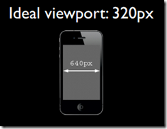

### layout viewport

如果把移动设备上浏览器的可视区域设为viewport的话，某些网站就会因为viewport太窄而显示错乱，所以这些浏览器就决定默认情况下把viewport设为一个较宽的值，比如980px，这样的话即使是那些为桌面设计的网站也能在移动浏览器上正常显示了。

浏览器默认的viewport叫做 ***layout viewport***。这个layout viewport的宽度可以通过 `document.documentElement.clientWidth` 来获取


### visual viewport

  然而，***layout viewport*** 的宽度是大于浏览器可视区域的宽度的，所以我们还需要一个viewport来代表 浏览器可视区域的大小，ppk把这个viewport叫做 ***visual viewport\***。visual viewport的宽度可以通过`window.innerWidth` 来获取，但在Android 2, Oprea mini 和 UC 8中无法正确获取。


### ideal viewport

 现在我们已经有两个viewport了：***layout viewport*** 和 ***visual viewport***。但浏览器觉得还不够，因为现在越来越多的网站都会为移动设备进行单独的设计，所以必须还要有一个能完美适配移动设备的viewport。所谓的完美适配指的是，首先不需要用户缩放和横向滚动条就能正常的查看网站的所有内容；第二，显示的文字的大小是合适，比如一段14px大小的文字，不会因为在一个高密度像素的屏幕里显示得太小而无法看清，理想的情况是这段14px的文字无论是在何种密度屏幕，何种分辨率下，显示出来的大小都是差不多的。当然，不只是文字，其他元素像图片什么的也是这个道理。ppk把这个viewport叫做 ***ideal viewport***，也就是第三个viewport——移动设备的理想viewport。

 ideal viewport并没有一个固定的尺寸，不同的设备拥有有不同的ideal viewport。所有的iphone的ideal viewport宽度都是320px，无论它的屏幕宽度是320还是640，也就是说，在iphone中，css中的320px就代表iphone屏幕的宽度。

[](https://images0.cnblogs.com/blog/130623/201407/300958560242000.png)     [](https://images0.cnblogs.com/blog/130623/201407/300958567274384.png)

但是安卓设备就比较复杂了，有320px的，有360px的，有384px的等等，关于不同的设备ideal viewport的宽度都为多少，可以到[http://viewportsizes.com](http://viewportsizes.com/)去查看一下，里面收集了众多设备的理想宽度。


  再总结一下：ppk把移动设备上的viewport分为***layout viewport*** 、 ***visual viewport***  和 ***ideal viewport*** 三类，其中的ideal viewport是最适合移动设备的viewport，ideal viewport的宽度等于移动设备的屏幕宽度，只要在css中把某一元素的宽度设为ideal viewport的宽度(单位用px)，那么这个元素的宽度就是设备屏幕的宽度了，也就是宽度为100%的效果。ideal viewport 的意义在于，无论在何种分辨率的屏幕下，那些针对ideal viewport 而设计的网站，不需要用户手动缩放，也不需要出现横向滚动条，都可以完美的呈现给用户。

## meta viewport

我们在开发移动设备的网站时，最常见的的一个动作就是把下面这个东西复制到我们的head标签中：

```
<meta name="viewport" content="width=device-width, initial-scale=1.0, maximum-scale=1.0, user-scalable=0">
```

该meta标签的作用是让当前viewport的宽度等于设备的宽度，同时不允许用户手动缩放。也许允不允许用户缩放不同的网站有不同的要求，但让viewport的宽度等于设备的宽度，这个应该是大家都想要的效果，如果你不这样的设定的话，那就会使用那个比屏幕宽的默认viewport，也就是说会出现横向滚动条。

### meta viewport 有6个属性

meta viewport 标签首先是由苹果公司在其safari浏览器中引入的，目的就是解决移动设备的viewport问题。后来安卓以及各大浏览器厂商也都纷纷效仿，引入对meta viewport的支持，事实也证明这个东西还是非常有用的。

在苹果的规范中，meta viewport 有6个属性(暂且把content中的那些东西称为一个个属性和值)，如下：

| width         | 设置***layout viewport*** 的宽度，为一个正整数，或字符串"width-device" |
| ------------- | ------------------------------------------------------------ |
| initial-scale | 设置页面的初始缩放值，为一个数字，可以带小数                 |
| minimum-scale | 允许用户的最小缩放值，为一个数字，可以带小数                 |
| maximum-scale | 允许用户的最大缩放值，为一个数字，可以带小数                 |
| height        | 设置***layout viewport*** 的高度，这个属性对我们并不重要，很少使用 |
| user-scalable | 是否允许用户进行缩放，值为"no"或"yes", no 代表不允许，yes代表允许 |

这些属性可以同时使用，也可以单独使用或混合使用，多个属性同时使用时用逗号隔开就行了。